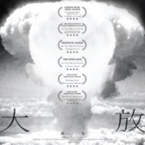
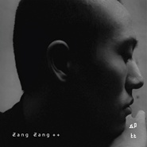

邱比
============================

|  |  |
| :--: | :-- |
| [ 邱比](https://i.xiami.com/chiu-pi) | **地区**: China 中国大陆 **风格**: 寒潮 Chillwave, 艺术流行 Art Pop, 极简科技舞曲 Minimal Techno, 神游舞曲 Trip Hop, 极简主义 Minimalism **播放数**: 105081732 **粉丝数**: 38496 **评论数**: 13020  |

## 档案

Instagram : chovbe.official

## 专辑

| 名称 | 语种 | 唱片公司 | 发行时间 | 专辑类别 | 专辑风格 |
| :--: | :-- | :-- | :-- | :-- | :-- |
| [ 至繁 LE MONDE至於那些繁琐的未来](./albums/2105584647.md) | 国语 | ROKON滚石电音 | 2019年12月20日 | 录音室专辑 | 国语流行 Mandarin Pop, 迷幻氛围 Psybient, 极简合成器 Minimal Synth |
| [ 叶柏 PY](./albums/2105473646.md) | 国语 | ROKON滚石电音 | 2019年11月22日 | EP, 单曲 | 国语流行 Mandarin Pop |
| [ 迷惘 DAZED](./albums/2105363782.md) | 国语 | ROKON滚石电音 | 2019年10月24日 | EP, 单曲 |  |
| [ 中离 Martyr](./albums/2104416622.md) | 国语 | ROKON滚石电音 | 2018年12月28日 | 录音室专辑 | 电子乐 Electronica |
| [ 新年 AQUARIUS](./albums/2104300747.md) | 国语 | ROKON滚石电音 | 2018年12月04日 | EP, 单曲 | 电子乐 Electronica |
| [ 隐园之美 echo of SPLENDOR](./albums/2103722330.md) | 纯音乐 | ROKON滚石电音 | 2018年06月01日 | 录音室专辑 | 电子 Electronic |
| [ 大 放 SPLENDOR](./albums/2102977690.md) | 国语 | ROKON滚石电音 | 2017年12月22日 | 录音室专辑 | 电音流行 Electropop, 艺术流行 Art Pop |
| [ Tea timebibi 16](./albums/2102697437.md) | 国语 | 独立发行 | 2017年02月24日 | 有声书 | 有声书 Audio Book, 诵读音乐 Spoken Word, 独奏 Recital |
| [ PYbibi 15](./albums/2102656637.md) | 其他 | 独立发行 | 2016年11月30日 | 录音室专辑 | 微声 Microsound, 新古典新世纪 Neoclassical New Age |
| [ End of comfort.bibi 14](./albums/2100388341.md) | 国语 | 独立发行 | 2016年09月09日 | 录音室专辑 | 中国风 China-Wave, 电子迪斯科 Electro-Disco, 合成器朋克 Synth Punk |
| [ Cancerbibi 13](./albums/2100356117.md) | 其他 | 独立发行 | 2016年06月20日 | 录音室专辑 | 黑暗氛围 Dark Ambient, 自然新世纪 Nature New Age |
| [ Inner live!内在的现场](./albums/2100281658.md) | 国语 | 独立发行 | 2016年03月11日 | 录音室专辑 | 当代唱作人 Contemporary Singer-Songwriter, 国语流行 Mandarin Pop, 独立流行 Indie Pop |
| [ 剧痛bibi 12](./albums/2100208224.md) | 国语 | 独立发行 | 2015年10月23日 | 录音室专辑 | 声效拼贴 Sound Collage, 自然采样 Field Recordings, 华语唱作人 Chinese Singer-Songwriter |
| [ 正正Zang Zang](./albums/1227389191.md) | 国语 | 虾米音乐人 | 2015年09月02日 | 录音室专辑 | 当代唱作人 Contemporary Singer-Songwriter, 神游舞曲 Trip Hop |
| [ Gurdjieffbibi 11](./albums/635552111.md) | 其他 | 独立发行 | 2015年06月29日 | 录音室专辑 | 古典音乐 Classical, 独奏 Recital, 奏鸣曲 Sonata |
| [ Timebibi 10](./albums/831090020.md) | 其他 | 独立发行 | 2015年05月08日 | 录音室专辑 | 电子 Electronic, 实验电子 Experimental Electronic |
| [ Amerbibi 9](./albums/925225547.md) | 其他 | 独立发行 | 2015年03月02日 | 录音室专辑 | 独立电子乐 Indietronica, 实验电子 Experimental Electronic, 古典跨界 Classical Crossover |
| [ Galaxy Pioneersbibi 8](./albums/1920207433.md) | 其他 | 独立发行 | 2015年01月02日 | 录音室专辑 | 极简科技舞曲 Minimal Techno |
| [ I feel...bibi 7](./albums/1318771453.md) | 其他 | 邱比 | 2014年12月17日 | 录音室专辑 | 实验音乐 Experimental, 现代古典 Modern Classical, 极简主义 Minimalism |
| [ Robin wingsbibi 6](./albums/217591336.md) | 其他 | 独立发行 | 2014年12月03日 | 录音室专辑 | 氛围音乐 Ambient, 极简潮 Minimal Wave |
| [ MAPbibi 5](./albums/411880551.md) | 其他 | 独立发行 | 2014年10月17日 | 录音室专辑 | 世界音乐 World Music, 世界融合 World Fusion, 世界节拍 Worldbeat |
| [ Piano 2bibi 4](./albums/308648834.md) | 其他 | 独立发行 | 2014年09月08日 | 录音室专辑 | 磁带音乐 Tape Music, 黑暗氛围 Dark Ambient |
| [ Rbibi 3](./albums/2007070201.md) | 其他 | 独立发行 | 2014年08月04日 | 录音室专辑 | 氛围音乐 Ambient |
| [ EP 3EP 3](./albums/1105600981.md) | 国语 | 独立发行 | 2014年07月17日 | EP, 单曲 | 诵读音乐 Spoken Word, 自由即兴 Free Improvisation, 声效拼贴 Sound Collage |
| [ 奇妙な音bibi 2](./albums/1892053623.md) | 国语 | 独立发行 | 2014年02月11日 | 录音室专辑 | 自然采样 Field Recordings, 实验音乐 Experimental, 电子 Electronic |
| [ Piano 1bibi 1](./albums/691394559.md) | 其他 | 独立发行 | 2014年02月03日 | 现场专辑 | 新古典新世纪 Neoclassical New Age, 独奏 Recital, 古典音乐 Classical |
| [ EP 2EP 2](./albums/1090399881.md) | 国语 | 独立发行 | 2014年01月22日 | EP, 单曲 | 神游舞曲 Trip Hop, 弛放 Chillout, 艺术流行 Art Pop |
| [ EP 1EP 1](./albums/190243532.md) | 其他 | 独立发行 | 2014年01月21日 | EP, 单曲 | 新世纪音乐 New Age, 放松新世纪 Relaxation New Age, 精神新世纪 Spiritual New Age |
| [ EP 0EP 0](./albums/879745632.md) | 国语 | 独立发行 | 2013年09月21日 | 原声带, 影视音乐 | 先锋民谣 Avant-Folk, 华语唱作人 Chinese Singer-Songwriter, 国语流行 Mandarin Pop |
| [ 我们：就要相爱CHIU PI 1](./albums/1575236283.md) | 国语 | 独立发行 | 2013年08月02日 | 录音室专辑 |  |

## 评论

|  |  |  |
| :-- | :-- | :-- |
|  [虾米用户](https://emumo.xiami.com/u/428970537)  2021-01-29 17:44 赞(0) 踩(0) | 
比，前些日子我也太合群了，我也太浪费了，热闹又蹉跎。我该享用孤独了。
 |
|  [虾米用户](https://emumo.xiami.com/u/428970537)  2021-01-29 17:41 赞(0) 踩(0) | 
我爱上他了，像爱上自己的没有实现的幻影。我爱上他了，比比，我爱
 |
|  [虾米用户](https://emumo.xiami.com/u/43509954)  2021-01-25 19:02 赞(0) 踩(0) | 
喜欢你！
 |
|  [虾米用户](https://emumo.xiami.com/u/446641482)  2021-01-21 14:24 赞(1) 踩(0) | 
第一次听见邱比我还是个13岁的小屁孩，才上初一的小屁孩，我现在成年了，鹅鹅鹅
 |
|  [虾米用户](https://emumo.xiami.com/u/446641482)  2021-01-21 14:23 赞(0) 踩(0) | 
邱比我是大连人，等疫情过去，请你吃海鲜呀 
 |
|  [虾米用户](https://emumo.xiami.com/u/445074200) 我只想听邱比 2021-01-21 00:49 赞(3) 踩(0) | 
比比，我在十三岁的时候喜欢上了你。 当时的年纪很尴尬，因为在念书，家教也很严 ，虽然我很想见你，但能陪伴我的只有你的音乐。我当时好想快点长大，快点经济独立，这样我就能有机会看到你的巡演。 你是我青春岁月里最美好的期待。 我没日没夜地听着你的音乐熬过了中考和高考。 可是我好像还是没有机会，可是没有关系啦（卑微） 我现在上了大学，我不明白未来会变成什么样子。我还是感到很迷茫。 可是我想说啊，我好想成为你这样优秀的人。我好想和你一样创造属于自己的世界！
 |
|  [虾米用户](https://emumo.xiami.com/u/404405724) 暖风过醉阁，你是让我沉醉... 2021-01-20 13:05 赞(2) 踩(0) | 
还有你之前的《孤单》片段是《下一站巨星》这部日漫的配乐，你一直没有回应，因为这部日漫很早就出了，那时你还没有出道，你是不是应该解释一下这个事呢?
 |
|  [虾米用户](https://emumo.xiami.com/u/446641482)  2021-01-17 11:06 赞(0) 踩(0) | 
真的好喜欢东北少女这个
 |
|  [虾米用户](https://emumo.xiami.com/u/446641482)  2021-01-16 09:21 赞(0) 踩(0) | 
比比现在疫情大陆可能比较严重，不知道你们那里怎么样？
 |
|  [虾米用户](https://emumo.xiami.com/u/446641482)  2021-01-15 23:02 赞(0) 踩(0) | 
比比你们那放假和大陆一样有寒暑假吗
 |
|  [虾米用户](https://emumo.xiami.com/u/446641482)  2021-01-15 22:09 赞(0) 踩(0) | 
听到你的歌我决定不在颓废下去了，很好就是现在我又干了两碗米饭
 |
|  [虾米用户](https://emumo.xiami.com/u/446641482)  2021-01-15 21:18 赞(0) 踩(0) | 
比比，2016年很有幸在电视上看到你，你的一切都是我的风格，手上的麻绳整夜大雨后，特别喜欢，真的感觉就像是不食烟火的内种一样，真的特别喜欢你的风格，
 |
|  [虾米用户](https://emumo.xiami.com/u/446641482)  2021-01-15 21:15 赞(1) 踩(0) | 
还是特别喜欢比比，
 |
|  [虾米用户](https://emumo.xiami.com/u/446641482)  2021-01-15 21:15 赞(1) 踩(0) | 
邱哥，今年还能巡演吗
 |
|  [虾米用户](https://emumo.xiami.com/u/49655313) 再见 2021-01-13 14:27 赞(1) 踩(0) | 
比比 你会不会难过 大家和你联系的痕迹就这么消失了
 |
|  [虾米用户](https://emumo.xiami.com/u/13526500) Comment ça v... 2021-01-11 23:46 赞(0) 踩(0) | 
比比。爱你哦
 |
|  [虾米用户](https://emumo.xiami.com/u/44361726) He was liyin... 2021-01-11 21:54 赞(3) 踩(0) | 
我仍记得，我们因寻光集在虾米相见，之后到地下室，到线下live演出，比比，虾米，我非常感谢，我们相遇了，这里有一段我们很美好的回忆，但是故事还没有结束，而立之年，等着你的巡演 
 |
|  [虾米用户](https://emumo.xiami.com/u/442831206)  2021-01-11 10:37 赞(0) 踩(0) | 
请问比比以前遇到过什么困境吗，又是怎么走出来的呢？貌似比比一直在音乐的路上走的挺顺利。
 |
|  [虾米用户](https://emumo.xiami.com/u/371194434) 我用什么把你留住 2021-01-10 18:11 赞(1) 踩(0) | 
我们会在新的地方相见的，对吧？ 到时见！
 |
|  [虾米用户](https://emumo.xiami.com/u/83801604) 原來我非不快樂 2021-01-10 02:44 赞(1) 踩(0) | 
bibi，在這裡和你的蝦米時代告別
 |
|  [虾米用户](https://emumo.xiami.com/u/335926107) 当你不断追求卓越，成功就... 2021-01-08 08:57 赞(1) 踩(0) | 
我超级超级喜欢邱比，整夜大雨最爱
 |
|  [虾米用户](https://emumo.xiami.com/u/50289273) 我还没想好要写什么... 2021-01-08 00:26 赞(1) 踩(0) | 
还想在这听比比的音乐 是起点但不想有终点
 |
|  [虾米用户](https://emumo.xiami.com/u/147668358) 重抚旧琴弦，晴空落雨点 2021-01-07 21:47 赞(0) 踩(0) | 
可以补全其他平台的歌吗   求求了，哥
 |
|  [虾米用户](https://emumo.xiami.com/u/3531256) 倾听一切 2021-01-06 22:57 赞(2) 踩(0) | 
再见
 |
|  [虾米用户](https://emumo.xiami.com/u/251815804)        2021-01-06 18:35 赞(2) 踩(0) | 
结果真的再见咯
 |
|  [虾米用户](https://emumo.xiami.com/u/196472677) 这家伙很蠢什么也没留下.... 2021-01-06 16:06 赞(2) 踩(0) | 
好久不见
 |
|  [虾米用户](https://emumo.xiami.com/u/116178934) 音乐人尔奇 2021-01-06 09:48 赞(3) 踩(0) | 

 |
|  [虾米用户](https://emumo.xiami.com/u/410489503) 南极鳗鱼 2021-01-06 06:14 赞(2) 踩(0) | 
再见啦
 |
|  [虾米用户](https://emumo.xiami.com/u/266367589) 逃避向安静与沉默走去。 2021-01-06 02:21 赞(3) 踩(0) | 
想和你一起听音乐。
 |
|  [虾米用户](https://emumo.xiami.com/u/9927528) / 2021-01-05 19:12 赞(2) 踩(0) | 
要再見喔～
 |
|  [虾米用户](https://emumo.xiami.com/u/149546728) 感谢虾米。 2021-01-05 17:35 赞(3) 踩(0) | 
邱比我们去往何方
 |
|  [虾米用户](https://emumo.xiami.com/u/260982492)  虽然这个人很懒，但他就... 2021-01-05 17:18 赞(2) 踩(0) | 
希望以後能在更好的地方見面，2021年快樂。
 |
|  [虾米用户](https://emumo.xiami.com/u/403016339) 世 不 可 避。 2021-01-05 16:28 赞(2) 踩(0) | 
再见。再相见。 可是不想说再见&amp;hellip;
 |
|  [虾米用户](https://emumo.xiami.com/u/263625478)  2021-01-05 15:58 赞(1) 踩(0) | 
要离开了，内心很多话，很多情感，还是慢慢抚平吧。这么多回忆的留言板，也要在时间中沉默了。和比比再见，就是网易云了
 |
|  [虾米用户](https://emumo.xiami.com/u/212356465) 庸人罢了 2021-01-05 13:44 赞(2) 踩(0) | 
中离
 |
|  [虾米用户](https://emumo.xiami.com/u/266367589) 逃避向安静与沉默走去。 2021-01-05 13:04 赞(2) 踩(0) | 
比比，虾米爱你，我们也爱你。
 |
|  [虾米用户](https://emumo.xiami.com/u/124116232) 比比說愛是妳來到世上的原... 2021-01-05 12:56 赞(20) 踩(0) | 
☁️都和都没有说爱我 只有说爱我 确实如邱比所说：&amp;ldquo;虾米给我恋爱的感觉&amp;rdquo; 因为它最懂我们吧&amp;hellip;好难过&amp;hellip;什么都不想说   见证我爱邱比的音乐平台  就这样没得了  超级不好受 
 |
|  [虾米用户](https://emumo.xiami.com/u/50228074) 不要丧失表达欲 2021-01-05 12:07 赞(1) 踩(0) | 
虾米还是要说再见了
 |
|  [虾米用户](https://emumo.xiami.com/u/48276337) 22世纪不道德 2021-01-05 12:03 赞(2) 踩(0) | 
虾米给人&amp;ldquo;初恋的感觉&amp;rdquo;
 |
| ⇒ |  [虾米用户](https://emumo.xiami.com/u/48276337) 22世纪不道德 2021-01-05 12:12 赞(0) 踩(0) | 
音乐报告显示: 邱比，是我在虾米最钟情的人。
 |
|  [虾米用户](https://emumo.xiami.com/u/371194434) 我用什么把你留住 2021-01-01 15:48 赞(3) 踩(0) | 
被新demo洗脑，着了迷着了迷。
 |
| ⇒ |  [虾米用户](https://emumo.xiami.com/u/374464453) 没 事 2021-01-01 23:24 赞(0) 踩(0) | 
在脑子里回响了一天。。
 |
|  [虾米用户](https://emumo.xiami.com/u/404405724) 暖风过醉阁，你是让我沉醉... 2021-01-01 01:05 赞(1) 踩(0) | 
新年快乐，比比，真想听到你也对我说新年快乐。
 |
|  [虾米用户](https://emumo.xiami.com/u/52445607) 设想漫步于大地而非道路 2021-01-01 00:33 赞(1) 踩(0) | 
一个新年到了！新年快乐！！
 |
|  [虾米用户](https://emumo.xiami.com/u/121374216)  爱你是一种信仰@c_p 2020-12-31 23:58 赞(2) 踩(0) | 
想在这里 留给自己 新年快乐
 |
|  [虾米用户](https://emumo.xiami.com/u/43648786) 安静的知了 2020-12-31 23:38 赞(3) 踩(0) | 

 |
|  [虾米用户](https://emumo.xiami.com/u/124116232) 比比說愛是妳來到世上的原... 2020-12-31 22:11 赞(2) 踩(0) | 
晚安
 |
|  [虾米用户](https://emumo.xiami.com/u/124116232) 比比說愛是妳來到世上的原... 2020-12-31 22:11 赞(3) 踩(0) | 
可爱比   新年快乐啊 要一直快乐哦 好好爱惜自己 祝您家人幸福美满
 |
|  [虾米用户](https://emumo.xiami.com/u/266367589) 逃避向安静与沉默走去。 2020-12-31 21:24 赞(2) 踩(0) | 
最后一天～
 |
|  [虾米用户](https://emumo.xiami.com/u/321623358)  2020-12-31 19:50 赞(2) 踩(0) | 
一个新年 要到了
 |
|  [虾米用户](https://emumo.xiami.com/u/85389256) 我是失去了悲痛的悲剧作家 2020-12-31 00:15 赞(2) 踩(0) | 
感叹，邱比是我见过最酷的男人。
 |
| ⇒ |  [虾米用户](https://emumo.xiami.com/u/404405724) 暖风过醉阁，你是让我沉醉... 2021-01-01 01:07 赞(0) 踩(0) | 
酷这个词形容我觉得不是很合适，应该是灵气、仙，一博才是本酷。
 |
|  [虾米用户](https://emumo.xiami.com/u/49655313) 再见 2020-12-30 10:47 赞(2) 踩(0) | 
2020就要结束啦  有想你呀 比比
 |
|  [虾米用户](https://emumo.xiami.com/u/446119974)  2020-12-29 21:47 赞(3) 踩(0) | 
比比，两个月前爸爸送给我一只在公司门口捡到的小黑狗，我叫他东东（因为我的小名是西西）它真的好可爱！可是圣诞过后它不见了，监控看到它往东走了，再也没有回来。今天下了今年的第一场雪，我还是想它。但更重要的是，我祝愿它不管在哪个世界里都能够收获爱。
 |
|  [虾米用户](https://emumo.xiami.com/u/129719360) 我还没想好要写什么... 2020-12-28 00:45 赞(1) 踩(0) | 
捕捉我的耳部神经的邱比王子，也是住在一个星球的邻居小天使，。
 |
|  [虾米用户](https://emumo.xiami.com/u/433993243) 我还没想好要写什么... 2020-12-27 23:04 赞(0) 踩(0) | 
一直激励我耶
 |
|  [虾米用户](https://emumo.xiami.com/u/446428116)  2020-12-26 16:46 赞(4) 踩(0) | 
因为前几天在微博看到了您和傻白的音乐节现场，在音乐平台搜索&amp;ldquo;邱比&amp;rdquo;后就掉进了您的音乐里。过来的这一整个星期几乎都在听您的歌，带给我很多美好和对美的思考。期待有一天与您在现场见。
 |
|  [虾米用户](https://emumo.xiami.com/u/362970194) 我还没想好要写什么... 2020-12-26 00:59 赞(0) 踩(0) | 
晚上好
 |
|  [虾米用户](https://emumo.xiami.com/u/374464453) 没 事 2020-12-25 23:55 赞(0) 踩(0) | 
圣诞快乐！看到回复好开心，不一时兴起翻评论怕是看不到回复了..
 |
|  [虾米用户](https://emumo.xiami.com/u/441482736)  2020-12-25 08:09 赞(0) 踩(0) | 
圣诞快乐(✪▽✪)
 |
|  [虾米用户](https://emumo.xiami.com/u/127131130)   2020-12-23 00:31 赞(0) 踩(0) | 
一年又一年
 |
|  [虾米用户](https://emumo.xiami.com/u/371194434) 我用什么把你留住 2020-12-21 01:38 赞(3) 踩(0) | 
比比的留言板好棒，像一块净土，聚集了很多美好的人。  如果虾米一直在就好了，让这里的我们可以互为盼头。 
 |
|  [虾米用户](https://emumo.xiami.com/u/371060421) Be yourself. 2020-12-20 23:16 赞(0) 踩(0) | 
听邱比的歌感觉会上瘾呢
 |
|  [虾米用户](https://emumo.xiami.com/u/49970400) 通感症患者。 2020-12-20 05:25 赞(0) 踩(0) | 
抖音上同样头像的号是真的你吗？想你了 
 |
|  [虾米用户](https://emumo.xiami.com/u/426284833)  2020-12-19 17:28 赞(12) 踩(0) | 
亲爱的比比，三年前听过您的狩猎，今年真正认识了您 ，此后的每一个时段都会有更喜欢的一首，随意-高热-听你-虽然-热寂-蓝海-笑容，下一首会是什么呢?  当您的每首歌越不接近世俗时候，越让我感受到类似趋近物哀之美一样的美学边缘感，越边缘越有距离越神秘。  当感受您珍贵的艺术的生活的时候，我的精神高度独立，又在想大中至正之后又会有什么样的作品呢，平静着，轮回于和您在音乐上的感情交流，等待&amp;hellip;  爱您，希望无论虾米这个平台最后如何，我们可以一直在您身边，期待和您第一次相遇。&amp;hearts;️
 |
|  [虾米用户](https://emumo.xiami.com/u/39955054) 我还没想好要写什么... 2020-12-18 20:27 赞(2) 踩(0) | 
比比，我们可以再相约趴间吗？ 天气冷了要注意保护手暖暖的 爱你 可爱的比
 |
|  [虾米用户](https://emumo.xiami.com/u/446345820)  2020-12-17 16:56 赞(1) 踩(0) | 
谢谢你呀邱比 感谢好音乐
 |
|  [虾米用户](https://emumo.xiami.com/u/446345820)  2020-12-17 16:54 赞(1) 踩(0) | 
看到你的微博来这里留个纪念，很可惜来晚了，也也不可惜，毕竟还是来了
 |
|  [虾米用户](https://emumo.xiami.com/u/404405724) 暖风过醉阁，你是让我沉醉... 2020-12-15 09:26 赞(2) 踩(0) | 
很喜欢比比那时候对《虽然》的发言，那次的发言你的眼睛好亮，明亮且坚定，特别喜欢那种状态的你。
 |
|  [虾米用户](https://emumo.xiami.com/u/404405724) 暖风过醉阁，你是让我沉醉... 2020-12-14 15:45 赞(4) 踩(0) | 
被比比回复的我好开心， 我觉得这几月来加起来的开心 ，都没有这一刻开心！
 |
|  [虾米用户](https://emumo.xiami.com/u/55119842) 唯有音乐和文字不可遗落。 2020-12-14 09:17 赞(4) 踩(0) | 
许久没来了，甚是想念这里和你:)
 |
|  [虾米用户](https://emumo.xiami.com/u/43648786) 安静的知了 2020-12-09 23:30 赞(4) 踩(0) | 
他走了 ，他就这样不可挽留的离开当下的自己。带着此前寄存在他处的更久远的记忆一同。我在不停的告别自己也在不停的告别从自己身体中寄出了的他，情绪来不及跟上我们的脚步，我们也无法给出彼此一个原因。
 |
|  [虾米用户](https://emumo.xiami.com/u/12973080) 上帝保佑精神自由的人 梦... 2020-12-09 23:28 赞(3) 踩(0) | 
听说虾米真的要关了，一定要来留言板再看看比比。虽然今年没有见到，但也一直在ins关注你，看着你发些快乐美丽的照片，我也跟着你一起开心。之前有人在豆瓣月亮组发你和傻白的演出讯息，评论里比比的风评太好了，好欣慰好开心哈哈！期待疫情快快过去，比比可以和大家团聚，五年了，我们会一直陪在你身边的。
 |
|  [虾米用户](https://emumo.xiami.com/u/66823378)  2020-12-09 23:14 赞(4) 踩(0) | 
使用虾米也好几年了，虾米是我最爱用的音乐app，刚开始因为邱比，因为他是我也是我们大家最好的音乐品味老师 虾米不会散，我们继续爱邱比。
 |
|  [虾米用户](https://emumo.xiami.com/u/336144730) 我还没想好要写什么... 2020-12-08 16:03 赞(1) 踩(0) | 
好舍不得这里！
 |
|  [虾米用户](https://emumo.xiami.com/u/432618973) 好好生活 2020-12-08 15:45 赞(1) 踩(0) | 
❤️一直挂念
 |
|  [虾米用户](https://emumo.xiami.com/u/53480717)  2020-12-08 07:10 赞(1) 踩(0) | 
我也来留言 一直都是只听歌 今天醒来想听我们就要相爱 点开显示有错误 真的一下子觉得惊慌失措 原来比比的音乐对我如此重要 是听不到就会觉得剧痛的程度
 |
|  [虾米用户](https://emumo.xiami.com/u/266367589) 逃避向安静与沉默走去。 2020-12-08 02:28 赞(0) 踩(0) | 
下班的路上听着正正，临睡前想听piano1消逝我一天的坏情绪。结果却打不开了。 突然觉得灰暗来得太快了。 
 |
|  [虾米用户](https://emumo.xiami.com/u/30788105) 从不失手 2020-12-07 08:29 赞(1) 踩(0) | 
数着日子看着它消失最难受
 |
|  [虾米用户](https://emumo.xiami.com/u/71489732)  2020-12-06 22:54 赞(2) 踩(0) | 
舍不得离开虾米 总给我家一样的感觉
 |
|  [虾米用户](https://emumo.xiami.com/u/202045622) 喜家庆亲长命。 2020-12-06 00:34 赞(2) 踩(0) | 
邱哥，好久不见，最近还是很丧，但我尽力做得最好了
 |
|  [虾米用户](https://emumo.xiami.com/u/343167354) 我还没想好要写什么... 2020-12-05 17:55 赞(3) 踩(0) | 
虾米丢了，就好像家丢了。 关于比比的美好互动，都记录在此。 虾米有太多的回忆，关于邱比，关于自己。真的舍不得。会哭的。
 |
|  [虾米用户](https://emumo.xiami.com/u/343167354) 我还没想好要写什么... 2020-12-05 17:50 赞(2) 踩(0) | 
虾米真的要打烊了吗？忠粉无法接受。一直习惯在这里听比比的歌。我爱虾米，我更爱邱比。
 |
|  [虾米用户](https://emumo.xiami.com/u/446166787)  2020-12-05 11:59 赞(1) 踩(0) | 
在虾米的第一次留言，献给比比以及在这里所感受到的温情。（那就在这最后的时段来您这儿坐坐：）留存回忆。我爱您。
 |
|  [虾米用户](https://emumo.xiami.com/u/7709271) 音乐是我的生命 2020-12-05 11:57 赞(1) 踩(0) | 
想问问之后还可以在别的平台听到demo吗？
 |
| ⇒ |  [虾米用户](https://emumo.xiami.com/u/336144730) 我还没想好要写什么... 2020-12-08 16:06 赞(0) 踩(0) | 
你可以现在就下载，然后上传到网易云音乐云盘，然后加入歌单就可以听了。目前的办法。
 |
|  [虾米用户](https://emumo.xiami.com/u/266367589) 逃避向安静与沉默走去。 2020-12-05 01:50 赞(2) 踩(0) | 
比比快去听音乐，我才可以蹭你的虾仔能量！
 |
|  [虾米用户](https://emumo.xiami.com/u/125593446) no gender 2020-12-04 22:23 赞(2) 踩(0) | 
时间会冲淡一些东西，但它也会让人记着一些东西。比比好久不见，或许以后都不能再留言了吧，望一切安好
 |
|  [虾米用户](https://emumo.xiami.com/u/349299788) 我们就要相爱 不可思愚。 2020-12-04 18:09 赞(2) 踩(0) | 
问候您。 又回到这里，这是我们的乐园。：）
 |
|  [虾米用户](https://emumo.xiami.com/u/43648786) 安静的知了 2020-12-02 22:49 赞(1) 踩(0) | 

 |
| ⇒ |  [虾米用户](https://emumo.xiami.com/u/22444238) 邱比官方虾米 2020-12-04 11:44 赞(0) 踩(0) | 
最近常常来温习留言，谢谢你的爱心。
 |
|  [虾米用户](https://emumo.xiami.com/u/124116232) 比比說愛是妳來到世上的原... 2020-12-02 17:19 赞(2) 踩(0) | 
呼叫比比！！！怎么办？昨日收到虾米即将要下架的消息，很是痛心，以后在哪儿听比比早期的音乐哟，想想就很沉闷 只好去翻翻过往录制的现场，感觉《我们.就要相爱》《正正》已经是绝版，何处找寻？静候佳音！ 愿你安好！
 |
| ⇒ |  [虾米用户](https://emumo.xiami.com/u/22444238) 邱比官方虾米 2020-12-04 11:44 赞(0) 踩(0) | 
这两张专辑目前绝版了，仅可以在脸书的粉丝专页订购，或是微博私讯订购，但是目前仅能寄至台湾地区，以及收台币。
 |
| ⇒ |  [虾米用户](https://emumo.xiami.com/u/124116232) 比比說愛是妳來到世上的原... 2020-12-08 12:16 赞(0) 踩(0) | 
<q><b>邱比 CHOVBE说：</b></q>
 |
|  [虾米用户](https://emumo.xiami.com/u/91037730) DOIT 2020-12-02 00:03 赞(1) 踩(0) | 
想你。
 |
|  [虾米用户](https://emumo.xiami.com/u/371194434) 我用什么把你留住 2020-12-01 23:38 赞(2) 踩(0) | 
舍不得，这里的音乐比比会在其他平台同步吗&amp;hellip;？
 |
| ⇒ |  [虾米用户](https://emumo.xiami.com/u/22444238) 邱比官方虾米 2020-12-04 11:45 赞(0) 踩(0) | 
目前虾米音乐最齐全，未来可能会听不到bibi系列，但是youtube皆有上传了。可能我会改到b站。
 |
| ⇒ |  [虾米用户](https://emumo.xiami.com/u/371194434) 我用什么把你留住 2020-12-06 12:38 赞(0) 踩(0) | 
<q><b>邱比 CHOVBE说：</b></q>
 |
| ⇒ |  [虾米用户](https://emumo.xiami.com/u/30980397) 爱憎分明 2020-12-08 12:12 赞(0) 踩(0) | 
<q><b>邱比 CHOVBE说：</b></q>
 |
| ⇒ |  [虾米用户](https://emumo.xiami.com/u/446641482)  2021-01-15 21:19 赞(0) 踩(0) | 
<q><b>邱比 CHOVBE说：</b></q>
 |
|  [虾米用户](https://emumo.xiami.com/u/306180103) 當你再搖曳著什麼易碎 2020-12-01 21:00 赞(1) 踩(0) | 
天，真的要没了吗
 |
| ⇒ |  [虾米用户](https://emumo.xiami.com/u/22444238) 邱比官方虾米 2020-12-04 11:45 赞(0) 踩(0) | 
不确定，不舍这些留言。
 |
|  [虾米用户](https://emumo.xiami.com/u/214208363) 打手槍直至流眼淚 2020-12-01 01:28 赞(3) 踩(0) | 
我好难过啊 听说虾米要离开
 |
| ⇒ |  [虾米用户](https://emumo.xiami.com/u/22444238) 邱比官方虾米 2020-12-04 11:45 赞(0) 踩(0) | 
最近也看到消息了，常来坐坐玩玩哦。
 |
|  [虾米用户](https://emumo.xiami.com/u/266367589) 逃避向安静与沉默走去。 2020-11-30 19:26 赞(16) 踩(0) | 
还是很舍不得这样的留言板。
 |
| ⇒ |  [虾米用户](https://emumo.xiami.com/u/22444238) 邱比官方虾米 2020-12-01 10:23 赞(0) 踩(0) | 
對啊⋯
 |
|  [虾米用户](https://emumo.xiami.com/u/404405724) 暖风过醉阁，你是让我沉醉... 2020-11-26 10:53 赞(2) 踩(0) | 
&lt;希望疫情情况好点了能看到比比的演唱会，喜欢你的四年来，特别期待第一次见到真人，你会带给我怎样不一样的感受……[url=/u/22444238]@邱比 CHOVBE [/url] &gt;&lt;22444238&gt;
 |
|  [虾米用户](https://emumo.xiami.com/u/8731730) 今夜你不关心人类 2020-11-26 01:44 赞(1) 踩(0) | 
.
 |
|  [虾米用户](https://emumo.xiami.com/u/266367589) 逃避向安静与沉默走去。 2020-11-23 02:20 赞(1) 踩(0) | 
一年没见了，邱比！
 |
| ⇒ |  [虾米用户](https://emumo.xiami.com/u/22444238) 邱比官方虾米 2020-12-04 11:45 赞(0) 踩(0) | 
希望2021能见！不止一次。
 |
| ⇒ |  [虾米用户](https://emumo.xiami.com/u/266367589) 逃避向安静与沉默走去。 2020-12-05 01:07 赞(0) 踩(0) | 
<q><b>邱比 CHOVBE说：</b></q>
 |
|  [虾米用户](https://emumo.xiami.com/u/237522351) 今年主打   青峰绿  ... 2020-11-22 23:18 赞(2) 踩(0) | 
千年的祈祷   邱比     就这么想到了
 |
| ⇒ |  [虾米用户](https://emumo.xiami.com/u/22444238) 邱比官方虾米 2020-12-04 11:46 赞(0) 踩(0) | 
活上一千年呀⋯⋯
 |
|  [虾米用户](https://emumo.xiami.com/u/127520124)  2020-11-21 04:16 赞(2) 踩(0) | 
在我最需要疗愈的时候邱比的音乐会是我最好的养分和药剂.
 |
| ⇒ |  [虾米用户](https://emumo.xiami.com/u/22444238) 邱比官方虾米 2020-12-04 11:46 赞(0) 踩(0) | 
每当夜深的时候⋯⋯
 |
|  [虾米用户](https://emumo.xiami.com/u/445720617)  2020-11-08 19:31 赞(1) 踩(0) | 
开心呀
 |
|  [虾米用户](https://emumo.xiami.com/u/33923461) 00:00 2020-11-07 19:02 赞(2) 踩(0) | 
想你
 |
|  [虾米用户](https://emumo.xiami.com/u/343192734)  2020-11-05 22:57 赞(0) 踩(0) | 
邱比 我知道我爱上你了
 |
| ⇒ |  [虾米用户](https://emumo.xiami.com/u/22444238) 邱比官方虾米 2020-12-04 11:46 赞(0) 踩(0) | 
首先要爱自己哦。
 |
|  [虾米用户](https://emumo.xiami.com/u/111096626) 我还没想好要写什么... 2020-10-22 22:44 赞(2) 踩(0) | 
邱比，我不想写一些矫揉造作的文字。我2017年开始听你的音乐，至少我觉得我们的灵魂有一部分是有共性的。前两天看了一篇文章说人需要做两件事：发现矛盾和感受痛苦。我想是的，在失去和别人缠绵悱恻的能力之后，在厘清真相之前，我越来越理解人为什么需要静心的品质。纵使生命目眩神迷，在这里有最后安慰。
 |
| ⇒ |  [虾米用户](https://emumo.xiami.com/u/22444238) 邱比官方虾米 2020-10-30 00:27 赞(0) 踩(0) | 
不如喜欢我。
 |
| ⇒ |  [虾米用户](https://emumo.xiami.com/u/289298016)  2020-11-03 19:36 赞(0) 踩(0) | 
<q><b>邱比 CHOVBE说：</b></q>
 |
|  [虾米用户](https://emumo.xiami.com/u/124116232) 比比說愛是妳來到世上的原... 2020-10-17 03:34 赞(3) 踩(0) | 
比比，生日快乐要一直开心啊
 |
| ⇒ |  [虾米用户](https://emumo.xiami.com/u/22444238) 邱比官方虾米 2020-12-04 11:47 赞(0) 踩(0) | 
谢谢您的生日祝福！
 |
|  [虾米用户](https://emumo.xiami.com/u/266367589) 逃避向安静与沉默走去。 2020-10-17 00:18 赞(1) 踩(0) | 
生日快乐，邱比！永远健康快乐，美丽幸福！
 |
|  [虾米用户](https://emumo.xiami.com/u/23469324) 我还没想好要写什么... 2020-10-12 01:17 赞(0) 踩(0) | 
CHIU PI到CHOVBE 是不是要转型呢
 |
|  [虾米用户](https://emumo.xiami.com/u/404405724) 暖风过醉阁，你是让我沉醉... 2020-10-06 20:04 赞(1) 踩(0) | 
感觉比比现在都不怎么来虾米了，啥时候开演唱会啊，好想见到你
 |
| ⇒ |  [虾米用户](https://emumo.xiami.com/u/22444238) 邱比官方虾米 2020-12-04 11:47 赞(0) 踩(0) | 
并没有不来，我常常来看留言哦。
 |
|  [虾米用户](https://emumo.xiami.com/u/444416188) 女 2020-09-29 08:35 赞(2) 踩(0) | 
你真的很美
 |
|  [虾米用户](https://emumo.xiami.com/u/48276337) 22世纪不道德 2020-09-23 23:09 赞(2) 踩(0) | 
等新歌呀    
 |
| ⇒ |  [虾米用户](https://emumo.xiami.com/u/22444238) 邱比官方虾米 2020-12-04 11:47 赞(0) 踩(0) | 
今年目测大概没有发行计画了。
 |
|  [虾米用户](https://emumo.xiami.com/u/124116232) 比比說愛是妳來到世上的原... 2020-09-23 13:56 赞(2) 踩(0) | 
比比，等你新专！哈哈！不要太累哦 
 |
|  [虾米用户](https://emumo.xiami.com/u/121374216)  爱你是一种信仰@c_p 2020-09-18 23:08 赞(1) 踩(0) | 
想见你呀
 |
|  [虾米用户](https://emumo.xiami.com/u/374464453) 没 事 2020-09-05 22:58 赞(19) 踩(0) | 
班里有位同学就跟修成佛了一样，眼里只有数理化，上课放电影都不抬头，后来发现他有听邱比 太神奇了
 |
| ⇒ |  [虾米用户](https://emumo.xiami.com/u/22444238) 邱比官方虾米 2020-12-04 11:47 赞(0) 踩(0) | 
哇，想认识这号人物。
 |
| ⇒ |  [虾米用户](https://emumo.xiami.com/u/125593446) no gender 2020-12-04 22:18 赞(0) 踩(0) | 
amazing
 |
|  [虾米用户](https://emumo.xiami.com/u/44191355) Bidalaska 2020-09-03 19:14 赞(2) 踩(0) | 
自己说自己是天才，长得像大清皇后
 |
| ⇒ |  [虾米用户](https://emumo.xiami.com/u/48346829)  2020-10-21 19:29 赞(0) 踩(0) | 
哈哈哈哈哈哈哈哈哈哈哈你这 
 |
| ⇒ |  [虾米用户](https://emumo.xiami.com/u/22444238) 邱比官方虾米 2020-12-04 11:48 赞(0) 踩(0) | 
哪一位皇后，我要追踪。
 |
|  [虾米用户](https://emumo.xiami.com/u/127131130)   2020-08-29 16:50 赞(1) 踩(0) | 
打卡
 |
|  [虾米用户](https://emumo.xiami.com/u/237522351) 今年主打   青峰绿  ... 2020-08-23 14:10 赞(1) 踩(0) | 
很久没来了   踩踩踩 
 |
| ⇒ |  [虾米用户](https://emumo.xiami.com/u/22444238) 邱比官方虾米 2020-12-04 11:48 赞(0) 踩(0) | 
常常来玩玩喔！
 |
|  [虾米用户](https://emumo.xiami.com/u/306180103) 當你再搖曳著什麼易碎 2020-08-17 07:33 赞(2) 踩(0) | 
北方的雨一直下一直下
 |
|  [虾米用户](https://emumo.xiami.com/u/2988258) Please take ... 2020-08-15 20:09 赞(1) 踩(0) | 
我爱你❤️
 |
|  [虾米用户](https://emumo.xiami.com/u/444002513)  2020-08-08 00:37 赞(1) 踩(0) | 
我太喜欢你了！
 |
|  [虾米用户](https://emumo.xiami.com/u/428970537)  2020-08-04 23:30 赞(1) 踩(0) | 
失恋了...真难受
 |
|  [虾米用户](https://emumo.xiami.com/u/331269448) 男 未婚 身高一米七五  2020-07-26 16:17 赞(1) 踩(0) | 
呀！找到你啦！
 |
|  [虾米用户](https://emumo.xiami.com/u/266367589) 逃避向安静与沉默走去。 2020-07-21 09:43 赞(5) 踩(0) | 
邱比2021年会有什么大动作。
 |
|  [虾米用户](https://emumo.xiami.com/u/9286704) A lo lejos..... 2020-07-17 14:27 赞(4) 踩(0) | 
我发现你是最爱学习且活跃度最高的豆瓣音乐人
 |
| ⇒ |  [虾米用户](https://emumo.xiami.com/u/22444238) 邱比官方虾米 2020-12-04 11:48 赞(0) 踩(0) | 
最爱学习是肯定的！最活跃也是肯定的！
 |
|  [虾米用户](https://emumo.xiami.com/u/55042814) my darling s... 2020-07-09 20:41 赞(3) 踩(0) | 
比比 从2015年到现在 喜欢你已经五年有余啦 下一个这样的期限 就是十年了 delighted and content.
 |
| ⇒ |  [虾米用户](https://emumo.xiami.com/u/162979530)  2020-07-23 18:17 赞(0) 踩(0) | 
我也是! 
 |
| ⇒ |  [虾米用户](https://emumo.xiami.com/u/22444238) 邱比官方虾米 2020-12-04 11:48 赞(0) 踩(0) | 
您好，五年的朋友。
 |
|  [虾米用户](https://emumo.xiami.com/u/444003455)  2020-07-06 15:23 赞(2) 踩(0) | 
听了邱比的歌有很多收获，我曾经是一个得过且过的人，但是听了邱比的歌，就想像他一样成为一个有追求的人。感觉太晚喜欢上邱比了，但是又觉得刚刚好，失落的我遇到你的音乐，我变得没有那么难过了。
 |
| ⇒ |  [虾米用户](https://emumo.xiami.com/u/22444238) 邱比官方虾米 2020-12-04 11:49 赞(0) 踩(0) | 
欢迎常常来听我的新作品。
 |
|  [虾米用户](https://emumo.xiami.com/u/124116232) 比比說愛是妳來到世上的原... 2020-07-06 05:34 赞(3) 踩(0) | 
比比，你还好吗
 |
| ⇒ |  [虾米用户](https://emumo.xiami.com/u/22444238) 邱比官方虾米 2020-12-04 11:53 赞(0) 踩(0) | 
非常好。
 |
| ⇒ |  [虾米用户](https://emumo.xiami.com/u/124116232) 比比說愛是妳來到世上的原... 2020-12-08 12:06 赞(0) 踩(0) | 
<q><b>邱比 CHOVBE说：</b></q>
 |
|  [虾米用户](https://emumo.xiami.com/u/433993243) 我还没想好要写什么... 2020-07-05 13:38 赞(4) 踩(0) | 
突然有了一个设想：高考后用各种方式构建一个美学体系 服务自己也服务别人 比比给了我好多灵感 您永远是我最尊敬的人!!
 |
| ⇒ |  [虾米用户](https://emumo.xiami.com/u/22444238) 邱比官方虾米 2020-12-04 11:53 赞(0) 踩(0) | 
请未来一定要第一個跟我分享您的美学精神哦。
 |
|  [虾米用户](https://emumo.xiami.com/u/266367589) 逃避向安静与沉默走去。 2020-06-27 17:06 赞(2) 踩(0) | 
梦见你。想你。好久不见。
 |
|  [虾米用户](https://emumo.xiami.com/u/435422551) 忽略过羽毛 2020-06-21 22:44 赞(3) 踩(0) | 
最近都有听比比的歌入睡。
 |
| ⇒ |  [虾米用户](https://emumo.xiami.com/u/22444238) 邱比官方虾米 2020-12-04 11:50 赞(0) 踩(0) | 
哪一首呢？我自己很喜欢听着py睡着。
 |
|  [虾米用户](https://emumo.xiami.com/u/44259906) Don't be foo... 2020-06-15 16:14 赞(2) 踩(0) | 
比 我好爱你
 |
|  [虾米用户](https://emumo.xiami.com/u/48276337) 22世纪不道德 2020-06-01 18:10 赞(4) 踩(0) | 
今天刚刚收到至繁CD啦! 拆开塑封后看看纸盒，发现没有像我们就要相爱那样，会有一些小句子。打开歌词本（相当厚），看到come with me构成的椭圆，就觉的:哇，要是后面也这么空，我就拿这本歌词本当自己的笔记本了。后来看完歌词和图片部分，后面居然真的是有一部分空白纸! 哇塞，突然有种当下的随意的想法立刻实现的感觉。恍惚又惊喜，哈哈哈。
 |
| ⇒ |  [虾米用户](https://emumo.xiami.com/u/22444238) 邱比官方虾米 2020-12-04 11:49 赞(0) 踩(0) | 
云甫说这是“天书”。希望你喜欢我们设计师的设计，这是最棒的结果！
 |
|  [虾米用户](https://emumo.xiami.com/u/52445607) 设想漫步于大地而非道路 2020-05-30 10:41 赞(1) 踩(0) | 
听到邱比的声音 就是安慰
 |
|  [虾米用户](https://emumo.xiami.com/u/8731730) 今夜你不关心人类 2020-05-25 14:48 赞(1) 踩(0) | 
爱好复杂 到底要怎么选 :-(
 |
|  [虾米用户](https://emumo.xiami.com/u/308652751) 嗜乐如命之自由灵魂 2020-05-23 10:04 赞(1) 踩(0) | 
听了几首，邱比应该很喜欢王菲九六年实验音乐时期的曲风
 |
|  [虾米用户](https://emumo.xiami.com/u/404405724) 暖风过醉阁，你是让我沉醉... 2020-05-22 11:42 赞(0) 踩(0) | 
感觉现在回复粉丝的都不是本人了
 |
| ⇒ |  [虾米用户](https://emumo.xiami.com/u/22444238) 邱比官方虾米 2020-12-04 11:53 赞(0) 踩(0) | 
我还担心留言的不是真人呢。
 |
| ⇒ |  [虾米用户](https://emumo.xiami.com/u/404405724) 暖风过醉阁，你是让我沉醉... 2020-12-14 15:37 赞(0) 踩(0) | 
<q><b>邱比 CHOVBE说：</b></q>
 |
|  [虾米用户](https://emumo.xiami.com/u/404405724) 暖风过醉阁，你是让我沉醉... 2020-05-22 11:41 赞(0) 踩(0) | 
&lt;本人在吗[url=/u/22444238]@ [/url]&gt;&lt;22444238&gt;
 |
|  [虾米用户](https://emumo.xiami.com/u/435422551) 忽略过羽毛 2020-05-21 14:40 赞(2) 踩(0) | 
邱比冷静下来会想什么？
 |
|  [虾米用户](https://emumo.xiami.com/u/8337431) 以乐会友 2020-05-17 13:06 赞(1) 踩(0) | 
邱比2020051.12832
 |
|  [虾米用户](https://emumo.xiami.com/u/237522351) 今年主打   青峰绿  ... 2020-05-15 19:44 赞(1) 踩(0) | 
来踩踩  好久没来 
 |
| ⇒ |  [虾米用户](https://emumo.xiami.com/u/22444238) 邱比官方虾米 2020-12-04 11:54 赞(0) 踩(0) | 
您好，欢迎在打烊前常来玩玩哦。
 |
|  [虾米用户](https://emumo.xiami.com/u/202045622) 喜家庆亲长命。 2020-05-07 06:59 赞(1) 踩(0) | 
爷爷去享福了
 |
| ⇒ |  [虾米用户](https://emumo.xiami.com/u/251724543) 重组 分解 2020-07-07 00:21 赞(0) 踩(0) | 
抱
 |
| ⇒ |  [虾米用户](https://emumo.xiami.com/u/22444238) 邱比官方虾米 2020-12-04 11:52 赞(0) 踩(0) | 
爷爷重回大自然，但永远陪在你身边。
 |
|  [虾米用户](https://emumo.xiami.com/u/7709271) 音乐是我的生命 2020-05-06 19:20 赞(4) 踩(0) | 
虽然歌曲各大平台都有了，可是有的歌还是习惯回到虾米来听。毕竟遇见邱比的六年时间，都一直在虾米呀。
 |
| ⇒ |  [虾米用户](https://emumo.xiami.com/u/22444238) 邱比官方虾米 2020-12-04 11:52 赞(0) 踩(0) | 
但听说最近虾米要歇业了，希望我们未来可以找到新的地方交流。
 |
| ⇒ |  [虾米用户](https://emumo.xiami.com/u/7709271) 音乐是我的生命 2020-12-05 11:25 赞(0) 踩(0) | 
<q><b>邱比 CHOVBE说：</b></q>
 |
| ⇒ |  [虾米用户](https://emumo.xiami.com/u/49921512) ？ 2021-01-25 02:40 赞(0) 踩(0) | 
<q><b>邱比 CHOVBE说：</b></q>
 |
|  [虾米用户](https://emumo.xiami.com/u/442636555)  2020-05-01 23:08 赞(3) 踩(0) | 
原来一个人可以如此的&amp;ldquo;复杂&amp;rdquo;，要用多少年才能彻底的把你完整的听完呢？
 |
|  [虾米用户](https://emumo.xiami.com/u/356186208) 不经常用，活动区在网易，... 2020-05-01 22:04 赞(9) 踩(0) | 
邱比的音乐人留言板已经成了广大网友说出心事的树洞，看着大家都这样无所顾及的说出自己的日常生活，心中挺温暖的
 |
| ⇒ |  [虾米用户](https://emumo.xiami.com/u/22444238) 邱比官方虾米 2020-12-04 11:54 赞(0) 踩(0) | 
没错，深深的情感之海。
 |
|  [虾米用户](https://emumo.xiami.com/u/202045622) 喜家庆亲长命。 2020-04-30 19:03 赞(0) 踩(0) | 
邱哥，我爷爷83了，脑出血进了IcU，左基底节区及中脑出血并破入脑室，脑疝晚期，慢性支气管炎，高血压病3级极高危，我能去哪里找奇迹
 |
| ⇒ |  [虾米用户](https://emumo.xiami.com/u/404405724) 暖风过醉阁，你是让我沉醉... 2020-05-22 11:50 赞(0) 踩(0) | 
这种事不应该找偶像  现实一点好吗  多陪陪亲人 让他开心  该忌口的忌口  该调理的调理
 |
| ⇒ |  [虾米用户](https://emumo.xiami.com/u/404405724) 暖风过醉阁，你是让我沉醉... 2020-05-22 12:08 赞(0) 踩(0) | 
<q><b>苒苒说：</b></q>
 |
| ⇒ |  [虾米用户](https://emumo.xiami.com/u/22444238) 邱比官方虾米 2020-12-04 11:55 赞(0) 踩(0) | 
八十几岁非常不容易，你爷爷有你的关心，就太好了。
 |
|  [虾米用户](https://emumo.xiami.com/u/26489198)   2020-04-28 19:05 赞(2) 踩(0) | 
新专辑一直在听 keep fresh
 |
|  [虾米用户](https://emumo.xiami.com/u/125615076) 青絲慢掠獨披塵 2020-04-27 22:00 赞(1) 踩(0) | 
喵
 |
|  [虾米用户](https://emumo.xiami.com/u/357592297) 吃鸡胸肉 2020-04-27 10:26 赞(1) 踩(0) | 
这侧脸很酷
 |
|  [虾米用户](https://emumo.xiami.com/u/202045622) 喜家庆亲长命。 2020-04-26 13:39 赞(2) 踩(0) | 
活回来了
 |
|  [虾米用户](https://emumo.xiami.com/u/432618973) 好好生活 2020-04-24 03:54 赞(1) 踩(0) | 
晚安，一直爱你。
 |
|  [虾米用户](https://emumo.xiami.com/u/127131130)   2020-04-22 10:50 赞(1) 踩(0) | 
眼睛痛 睡觉觉 
 |
|  [虾米用户](https://emumo.xiami.com/u/127131130)   2020-04-22 10:49 赞(1) 踩(0) | 
比比啊 你相信什么呢
 |
|  [虾米用户](https://emumo.xiami.com/u/328404650) 你好 2020-04-17 13:34 赞(3) 踩(0) | 
 我是一个言行不一的人 我还没学会做一个言行一致的人
 |
|  [虾米用户](https://emumo.xiami.com/u/124116232) 比比說愛是妳來到世上的原... 2020-04-16 04:16 赞(3) 踩(0) | 
比比，最近很浮躁，讨厌这样的自己
 |
|  [虾米用户](https://emumo.xiami.com/u/49574663) 你 愛 了 整 個 宇 ... 2020-04-15 13:40 赞(2) 踩(0) | 
我确实喜欢邱比
 |
|  [虾米用户](https://emumo.xiami.com/u/49655313) 再见 2020-04-15 08:56 赞(2) 踩(0) | 
比比我好想你（指想看演出
 |
|  [虾米用户](https://emumo.xiami.com/u/29285843) 潜鱼水底传心诀，栖鸟枝头... 2020-04-03 11:58 赞(1) 踩(0) | 
虾米第一男神，刚看见滚石唱片跟网x云战略合作的新闻&amp;hellip;
 |
|  [虾米用户](https://emumo.xiami.com/u/306180103) 當你再搖曳著什麼易碎 2020-03-31 20:15 赞(2) 踩(0) | 
也许我们一样痛吧
 |
|  [虾米用户](https://emumo.xiami.com/u/343192734)  2020-03-28 23:46 赞(2) 踩(0) | 
我好像爱上你了
 |
|  [虾米用户](https://emumo.xiami.com/u/124116232) 比比說愛是妳來到世上的原... 2020-03-25 07:48 赞(5) 踩(0) | 
千万不要为了爱情，太爱。  &amp;mdash;&amp;mdash;邱比
 |
|  [虾米用户](https://emumo.xiami.com/u/428970537)  2020-03-24 20:42 赞(3) 踩(0) | 
比比，悲伤的时候只要听你的音乐就会感到很安心。
 |
|  [虾米用户](https://emumo.xiami.com/u/441482736)  2020-03-18 18:11 赞(3) 踩(0) | 
方斯华这个名字真好听
 |
|  [虾米用户](https://emumo.xiami.com/u/441482736)  2020-03-18 17:57 赞(1) 踩(0) | 
比比太美！
 |
|  [虾米用户](https://emumo.xiami.com/u/266367589) 逃避向安静与沉默走去。 2020-03-18 04:51 赞(0) 踩(0) | 
好想比比的时候，去微博看自己去哪些场的巡演，重看一遍补充能量。发现关灯观看时如临现场，而且拍摄的视频灯光不是很多，感觉挺给手机省电的。快清晨5点了，晚安！
 |
|  [虾米用户](https://emumo.xiami.com/u/306180103) 當你再搖曳著什麼易碎 2020-03-14 01:00 赞(4) 踩(0) | 
不要羡慕 不要嫉妒 不要哭哭
 |
| ⇒ |  [虾米用户](https://emumo.xiami.com/u/441482736)  2020-03-18 17:55 赞(0) 踩(0) | 
&amp;ldquo;我直播了吗 我没有直播&amp;rdquo;哈哈哈
 |
|  [虾米用户](https://emumo.xiami.com/u/202045622) 喜家庆亲长命。 2020-03-13 19:12 赞(2) 踩(0) | 
邱哥，我是温阳风
 |
|  [虾米用户](https://emumo.xiami.com/u/202045622) 喜家庆亲长命。 2020-03-13 19:12 赞(4) 踩(0) | 
我放弃了，我和上帝说好了，重新开始，没说结束人生就不结束
 |
| ⇒ |  [虾米用户](https://emumo.xiami.com/u/349299788) 我们就要相爱 不可思愚。 2020-12-04 18:39 赞(0) 踩(0) | 
你会快乐。
 |
|  [虾米用户](https://emumo.xiami.com/u/221940611) 氛围   摇滚  后摇 ... 2020-03-13 13:30 赞(2) 踩(0) | 
最终我还是要皈依于你。
 |
|  [虾米用户](https://emumo.xiami.com/u/48276337) 22世纪不道德 2020-03-12 15:06 赞(0) 踩(0) | 
现在听到至繁的我现在有点慌.......
 |
| ⇒ |  [虾米用户](https://emumo.xiami.com/u/236165393) 松竹思一友，梅香故人心 2020-03-12 17:11 赞(0) 踩(0) | 
没事啦，暂时中离
 |
| ⇒ |  [虾米用户](https://emumo.xiami.com/u/48276337) 22世纪不道德 2020-03-12 19:54 赞(0) 踩(0) | 
<q><b>熠晞说：</b></q>
 |
|  [虾米用户](https://emumo.xiami.com/u/48276337) 22世纪不道德 2020-03-12 14:23 赞(2) 踩(0) | 
今年还会有巡演吗......  [花瓣
 |
| ⇒ |  [虾米用户](https://emumo.xiami.com/u/22444238) 邱比官方虾米 2020-12-04 11:56 赞(0) 踩(0) | 
您好，因为新冠疫情，今年巡演暂停一年。
 |
|  [虾米用户](https://emumo.xiami.com/u/347874733)  2020-03-11 21:46 赞(2) 踩(0) | 
请赦免我的愚爱
 |
|  [虾米用户](https://emumo.xiami.com/u/30980397) 爱憎分明 2020-03-11 18:48 赞(0) 踩(0) | 
個人主頁，無名？
 |
|  [虾米用户](https://emumo.xiami.com/u/306180103) 當你再搖曳著什麼易碎 2020-03-09 23:28 赞(4) 踩(0) | 
2020.3.9 23:04 他说:爱我
 |
|  [虾米用户](https://emumo.xiami.com/u/306180103) 當你再搖曳著什麼易碎 2020-03-09 23:05 赞(2) 踩(0) | 
回家
 |
|  [虾米用户](https://emumo.xiami.com/u/127131130)   2020-03-09 12:32 赞(2) 踩(0) | 
原来心真的会痛
 |
|  [虾米用户](https://emumo.xiami.com/u/266367589) 逃避向安静与沉默走去。 2020-03-03 23:17 赞(6) 踩(0) | 
如果整夜大雨让我在眠梦中走不出来，那么至繁就是我冲向雨中与你相拥。
 |
|  [虾米用户](https://emumo.xiami.com/u/34924884) freedom 2020-03-03 15:08 赞(2) 踩(0) | 
比比我养了一只小猫咪 你能给他起个名字吗～
 |
| ⇒ |  [虾米用户](https://emumo.xiami.com/u/22444238) 邱比官方虾米 2020-12-04 11:56 赞(0) 踩(0) | 
来不及取名字，您的小猫最後叫什麽名字呢？
 |
|  [虾米用户](https://emumo.xiami.com/u/34924884) freedom 2020-03-01 13:24 赞(1) 踩(0) | 
2020年的冬天没有办法看到你的演出了，哭 18年在北京，19年在上海 20年等你！
 |
|  [虾米用户](https://emumo.xiami.com/u/38623875) 比正还正，正中之正。 2020-02-29 12:18 赞(1) 踩(0) | 
比比，虽然我昨天失恋了，但是听了你的歌，觉得保持距离也是对自己生命的尊重。爱你。
 |
| ⇒ |  [虾米用户](https://emumo.xiami.com/u/22444238) 邱比官方虾米 2020-12-04 11:57 赞(0) 踩(0) | 
好棒的想法，祝福你再找到新的对象！
 |
|  [虾米用户](https://emumo.xiami.com/u/440071845)  2020-02-29 07:40 赞(1) 踩(0) | 
比比今天去晒太阳了吗？快三月啦！
 |
|  [虾米用户](https://emumo.xiami.com/u/44259906) Don't be foo... 2020-02-28 21:06 赞(1) 踩(0) | 
每隔一段時間都要來聽邱比 正如我的心靈需要時刻清理灰塵
 |
|  [虾米用户](https://emumo.xiami.com/u/428970537)  2020-02-28 11:23 赞(2) 踩(0) | 
比比，我最近做了许多奇怪的梦，不是和不喜欢的人谈恋爱，就是落得千夫所指的境地。我觉得我给自己的压力太大了。看来成长没有我想得那么容易。
 |
|  [虾米用户](https://emumo.xiami.com/u/266367589) 逃避向安静与沉默走去。 2020-02-25 05:52 赞(2) 踩(0) | 
梦见比比的时候简直要让人笑着醒过来。
 |
|  [虾米用户](https://emumo.xiami.com/u/440516664) 我还没想好要写什么... 2020-02-24 20:38 赞(1) 踩(0) | 
咕咕—咕咕— 我就来叫两声
 |
|  [虾米用户](https://emumo.xiami.com/u/377525299) 生命一直向前，爱与心跳并... 2020-02-23 22:18 赞(0) 踩(0) | 
比比，2020你好吗
 |
|  [虾米用户](https://emumo.xiami.com/u/428970537)  2020-02-18 11:56 赞(3) 踩(0) | 
比比，今天我十七岁了。
 |
| ⇒ |  [虾米用户](https://emumo.xiami.com/u/377525299) 生命一直向前，爱与心跳并... 2020-02-23 22:18 赞(0) 踩(0) | 
小朋友 
 |
| ⇒ |  [虾米用户](https://emumo.xiami.com/u/428970537)  2020-02-24 10:41 赞(0) 踩(0) | 
<q><b>追阿追说：</b></q>
 |
| ⇒ |  [虾米用户](https://emumo.xiami.com/u/377525299) 生命一直向前，爱与心跳并... 2020-02-24 11:21 赞(0) 踩(0) | 
<q><b>明明月说：</b></q>
 |
|  [虾米用户](https://emumo.xiami.com/u/311766634) 无声的发酵啊 2020-02-15 19:03 赞(2) 踩(0) | 
我也很喜欢中长发的感觉(*/ω＼*)
 |
|  [虾米用户](https://emumo.xiami.com/u/428970537)  2020-02-15 08:45 赞(2) 踩(0) | 
比比，今天我们这里下雪了
 |
|  [虾米用户](https://emumo.xiami.com/u/127131130)   2020-02-14 15:34 赞(1) 踩(0) | 
比比想你
 |
|  [虾米用户](https://emumo.xiami.com/u/410251241) 如風游虛空，行世無障礙 2020-02-13 01:23 赞(0) 踩(0) | 
「最大的愛就是因為清楚，而對任何人可以等待。」 — 章成老師《地藏經》   
 |
|  [虾米用户](https://emumo.xiami.com/u/162979530)  2020-02-12 22:15 赞(0) 踩(0) | 
邱比短发是我的执念
 |
|  [虾米用户](https://emumo.xiami.com/u/227385156)  2020-02-12 19:15 赞(0) 踩(0) | 
你是银河揉碎的光洒在黯淡的夜空 万物都苏醒
 |
|  [虾米用户](https://emumo.xiami.com/u/428970537)  2020-02-11 13:54 赞(1) 踩(0) | 
比比！越来越多人喜欢你了！我好开心！
 |
| ⇒ |  [虾米用户](https://emumo.xiami.com/u/162979530)  2020-02-12 22:14 赞(0) 踩(0) | 
我突然看见他微博粉丝104万了，顿时好懵啊
 |
|  [虾米用户](https://emumo.xiami.com/u/127131130)   2020-02-11 01:17 赞(1) 踩(0) | 
晚安宝贝
 |
|  [虾米用户](https://emumo.xiami.com/u/124116232) 比比說愛是妳來到世上的原... 2020-02-09 21:49 赞(2) 踩(0) | 
你可安好！
 |
|  [虾米用户](https://emumo.xiami.com/u/440306029)  2020-02-08 21:32 赞(1) 踩(0) | 
比比 晚安啦
 |
|  [虾米用户](https://emumo.xiami.com/u/162979530)  2020-01-28 14:01 赞(0) 踩(0) | 
比比邮箱是什么呀？
 |
| ⇒ |  [虾米用户](https://emumo.xiami.com/u/22444238) 邱比官方虾米 2020-12-04 11:57 赞(0) 踩(0) | 
<a href="mailto:chiu.pi@hotmail.com">chiu.pi@hotmail.com</a>
 |
|  [虾米用户](https://emumo.xiami.com/u/21053010) 带我脱离这片消沉的海 2020-01-27 23:17 赞(0) 踩(0) | 
哈哈哈是不是有那么一丢丢像范玮琪～
 |
|  [虾米用户](https://emumo.xiami.com/u/439848173)  2020-01-26 02:23 赞(1) 踩(0) | 
为啥以前的歌好多改名字了！我都快找不到啦
 |
|  [虾米用户](https://emumo.xiami.com/u/266367589) 逃避向安静与沉默走去。 2020-01-26 01:29 赞(4) 踩(0) | 
新年快乐，邱比。 从念书时就来这里留言直到现在工作几年了，我觉得这里有我长大的感觉。 
 |
| ⇒ |  [虾米用户](https://emumo.xiami.com/u/22444238) 邱比官方虾米 2020-12-04 11:57 赞(0) 踩(0) | 
我可能懂你的心情。欢迎常常来玩喔。
 |
| ⇒ |  [虾米用户](https://emumo.xiami.com/u/266367589) 逃避向安静与沉默走去。 2020-12-05 01:10 赞(0) 踩(0) | 
<q><b>邱比 CHOVBE说：</b></q>
 |
|  [虾米用户](https://emumo.xiami.com/u/124116232) 比比說愛是妳來到世上的原... 2020-01-24 19:56 赞(2) 踩(0) | 
比比，新年好啊！祝以后一切顺利！
 |
|  [虾米用户](https://emumo.xiami.com/u/432618973) 好好生活 2020-01-24 19:52 赞(2) 踩(0) | 
新年快乐，万事胜意，永远可爱！
 |
|  [虾米用户](https://emumo.xiami.com/u/404405724) 暖风过醉阁，你是让我沉醉... 2020-01-24 17:42 赞(1) 踩(0) | 
新年快乐 
 |
|  [虾米用户](https://emumo.xiami.com/u/317319560) 我摘青辉冷月为锋芒收入鞘... 2020-01-22 21:01 赞(0) 踩(0) | 
愿以后后风霜雨雪都成为你的过去而不会阻碍你的未来。
 |
|  [虾米用户](https://emumo.xiami.com/u/2933707) Live my pace 2020-01-04 01:35 赞(0) 踩(0) | 
感觉你删了自己好多留言 是酒醒了吗？
 |
|  [虾米用户](https://emumo.xiami.com/u/80774058) 自 由 散 漫 2020-01-03 18:05 赞(1) 踩(0) | 
新年快乐－－
 |
| ⇒ |  [虾米用户](https://emumo.xiami.com/u/401813707) -v- 2020-01-04 18:51 赞(0) 踩(0) | 
新年快乐！新专有些蛮喜欢的 :k
 |
|  [虾米用户](https://emumo.xiami.com/u/8226204) ≡ 2020-01-02 00:30 赞(3) 踩(0) | 
19年听得最多的音乐人又颁给你啦(｡･･｡)
 |
|  [虾米用户](https://emumo.xiami.com/u/266367589) 逃避向安静与沉默走去。 2020-01-01 07:38 赞(0) 踩(0) | 
hi，bibi，新年快乐！
 |
|  [虾米用户](https://emumo.xiami.com/u/45867408) n o n e . 2020-01-01 05:49 赞(0) 踩(0) | 
新年快乐新年新气象 
 |
|  [虾米用户](https://emumo.xiami.com/u/47712421) 无 2020-01-01 00:11 赞(1) 踩(0) | 
聽著「新年」跨年，比比新年快樂呀 
 |
|  [虾米用户](https://emumo.xiami.com/u/124116232) 比比說愛是妳來到世上的原... 2020-01-01 00:02 赞(2) 踩(0) | 
可爱的邱比，新年快乐！新的一年，愿你越来越好！永远幸福快乐！！！
 |
|  [虾米用户](https://emumo.xiami.com/u/124116232) 比比說愛是妳來到世上的原... 2019-12-29 10:39 赞(0) 踩(0) | 
邱比宝贝，感冒好了吗？照顾好自己啊！
 |
|  [虾米用户](https://emumo.xiami.com/u/54670799) 我还没想好要写什么... 2019-12-28 21:57 赞(0) 踩(0) | 
比比啊
 |
|  [虾米用户](https://emumo.xiami.com/u/296219419)  2019-12-28 09:02 赞(0) 踩(0) | 
马克
 |
|  [虾米用户](https://emumo.xiami.com/u/338179055) 没有不听的 只有还没听到... 2019-12-28 01:45 赞(2) 踩(0) | 
不愧是虾米男神
 |
|  [虾米用户](https://emumo.xiami.com/u/90831704) 我还没想好要写什么... 2019-12-26 23:56 赞(4) 踩(0) | 
听了邱比的音乐后似乎心里多了一点坚固的东西在慢慢生长
 |
|  [虾米用户](https://emumo.xiami.com/u/127131130)   2019-12-25 21:49 赞(0) 踩(0) | 
宝贝
 |
|  [虾米用户](https://emumo.xiami.com/u/404405724) 暖风过醉阁，你是让我沉醉... 2019-12-25 08:42 赞(1) 踩(0) | 
圣诞快乐<a href="http://emumo.xiami.com/u/22444238" target="_blank" rel="nofollow" name_card="22444238">@CHIU PI </a>  
 |
|  [虾米用户](https://emumo.xiami.com/u/432618973) 好好生活 2019-12-25 02:55 赞(0) 踩(0) | 
圣诞快乐宝贝！
 |
|  [虾米用户](https://emumo.xiami.com/u/96775922) 天真有邪 2019-12-24 14:33 赞(1) 踩(0) | 
这几天怎么这么活跃哇
 |
|  [虾米用户](https://emumo.xiami.com/u/418798936) 我还没想好要写什么... 2019-12-23 11:43 赞(1) 踩(0) | 
让我们一起狂奔下去吧。直至那些繁星的距离。
 |
|  [虾米用户](https://emumo.xiami.com/u/266367589) 逃避向安静与沉默走去。 2019-12-23 01:12 赞(1) 踩(0) | 
打开虾米邱比所有专辑，一共30张。一张专辑满分十分，比比的专辑就没低于九分的。7年的高质量高产，我的眼光怎么那么好，粉了一个人类神仙邱比！
 |
|  [虾米用户](https://emumo.xiami.com/u/432618973) 好好生活 2019-12-23 00:54 赞(1) 踩(0) | 
对啦比比，喜茶出了好多新品呀，还有联名的甜品！下次来记得品尝 
 |
|  [虾米用户](https://emumo.xiami.com/u/223845151) ʕ๑•ɷ•๑ʔ 2019-12-22 20:36 赞(1) 踩(0) | 
！
 |
|  [虾米用户](https://emumo.xiami.com/u/432618973) 好好生活 2019-12-22 12:33 赞(1) 踩(0) | 
冬至快乐宝贝儿！(听着&lt;基地&gt;帮妈妈洗碗ing)
 |
|  [虾米用户](https://emumo.xiami.com/u/408365170)  2019-12-21 22:33 赞(6) 踩(0) | 
曾经给我喜欢的男孩子分享比比的歌，他说我太丧了，不喜欢这种调调，后来我就把他甩了。
 |
| ⇒ |  [虾米用户](https://emumo.xiami.com/u/22444238) 邱比官方虾米 2019-12-22 11:58 赞(0) 踩(0) | 
這說明他才丧。丧者，聽什麼都覺得丧。
 |
|  [虾米用户](https://emumo.xiami.com/u/6944284) 我吃肉 2019-12-21 21:31 赞(1) 踩(0) | 
能够被轻易讲出口的，大多也不够真实，所以删掉了长文字，浓缩成：我爱邱比 吧。
 |
|  [虾米用户](https://emumo.xiami.com/u/8697915)  2019-12-21 18:47 赞(0) 踩(0) | 
丘匹~丘匹~
 |
|  [虾米用户](https://emumo.xiami.com/u/202045622) 喜家庆亲长命。 2019-12-21 12:04 赞(0) 踩(0) | 
一千五百米最后一名☹️
 |
|  [虾米用户](https://emumo.xiami.com/u/266367589) 逃避向安静与沉默走去。 2019-12-21 01:17 赞(1) 踩(0) | 
邱比总是让人脑热怎么办
 |
|  [虾米用户](https://emumo.xiami.com/u/73638642) 再见了各位 我永远爱虾米... 2019-12-21 00:56 赞(0) 踩(0) | 
我靠比比你的新专让我想学做歌了，电子太棒了
 |
| ⇒ |  [虾米用户](https://emumo.xiami.com/u/22444238) 邱比官方虾米 2019-12-22 12:13 赞(0) 踩(0) | 
COME
 |
|  [虾米用户](https://emumo.xiami.com/u/432618973) 好好生活 2019-12-20 23:04 赞(1) 踩(0) | 
今天很开心，有你真好，时常感恩。
 |
| ⇒ |  [虾米用户](https://emumo.xiami.com/u/22444238) 邱比官方虾米 2019-12-22 12:14 赞(0) 踩(0) | 
上品感恩！
 |
|  [虾米用户](https://emumo.xiami.com/u/222417811) 我还没想好要写什么... 2019-12-20 19:55 赞(1) 踩(0) | 
比比
 |
|  [虾米用户](https://emumo.xiami.com/u/170211738) 上帝在开始爱着了 2019-12-20 14:12 赞(0) 踩(0) | 
太好听了
 |
|  [虾米用户](https://emumo.xiami.com/u/170211738) 上帝在开始爱着了 2019-12-20 14:12 赞(0) 踩(0) | 
我死了
 |
|  [虾米用户](https://emumo.xiami.com/u/252551) ＿形無 2019-12-20 13:41 赞(0) 踩(0) | 
▲
 |
|  [虾米用户](https://emumo.xiami.com/u/48276337) 22世纪不道德 2019-12-20 11:38 赞(0) 踩(0) | 
等等等   
 |
|  [虾米用户](https://emumo.xiami.com/u/115920120)  2019-12-20 00:05 赞(1) 踩(0) | 
2019至繁
 |
|  [虾米用户](https://emumo.xiami.com/u/257103143) 音乐爱好者~ 2019-12-19 23:59 赞(1) 踩(0) | 
嗯哼
 |
|  [虾米用户](https://emumo.xiami.com/u/33444626) Hasta la vis... 2019-12-19 18:50 赞(1) 踩(0) | 
很酷
 |
|  [虾米用户](https://emumo.xiami.com/u/45323236) 必有所获 2019-12-16 23:23 赞(1) 踩(0) | 
至繁是否最简 或者是其他的一些事情 都很期待 周五快快来
 |
|  [虾米用户](https://emumo.xiami.com/u/432618973) 好好生活 2019-12-16 21:57 赞(1) 踩(0) | 
心心念念着新歌，20号前的日子都变得可爱起来。
 |
|  [虾米用户](https://emumo.xiami.com/u/206703958) Ins:lulululu... 2019-12-16 20:58 赞(1) 踩(0) | 
比比最近高产
 |
|  [虾米用户](https://emumo.xiami.com/u/266367589) 逃避向安静与沉默走去。 2019-12-16 09:36 赞(2) 踩(0) | 
美好的休假一天，需要点播N首比比的音乐作品开始，蓄满精气神的赖床！（这样也是，陪我一起赖床～）
 |
|  [虾米用户](https://emumo.xiami.com/u/369210758) 随缘 2019-12-13 00:05 赞(3) 踩(0) | 
期待新专，那个湿婆的好喜欢！！
 |
|  [虾米用户](https://emumo.xiami.com/u/14669970) 氛围，古典，流行，电子.... 2019-12-11 17:56 赞(3) 踩(0) | 
觉得喜欢邱比的人，都是很有自己想法，情感细腻，特别的人。
 |
| ⇒ |  [虾米用户](https://emumo.xiami.com/u/22444238) 邱比官方虾米 2019-12-20 19:44 赞(0) 踩(0) | 
而且特别孝顺丶可爱。
 |
| ⇒ |  [虾米用户](https://emumo.xiami.com/u/441690930)  2020-03-25 07:51 赞(0) 踩(0) | 
<q><b>邱比 CHOVBE说：</b></q>
 |
|  [虾米用户](https://emumo.xiami.com/u/404405724) 暖风过醉阁，你是让我沉醉... 2019-12-11 14:37 赞(2) 踩(0) | 
注意休息哦，这也是你于听众的责任。
 |
|  [虾米用户](https://emumo.xiami.com/u/432618973) 好好生活 2019-12-06 13:59 赞(2) 踩(0) | 
期待新专，期待我2020的年度歌单。
 |
|  [虾米用户](https://emumo.xiami.com/u/266367589) 逃避向安静与沉默走去。 2019-12-06 12:15 赞(1) 踩(0) | 
新专预告真的是惊喜连连！！等出新专辑那一刻我想我要好几个晚上不睡觉了！这曲子都太好听了吧！！
 |
|  [虾米用户](https://emumo.xiami.com/u/2933707) Live my pace 2019-12-05 03:37 赞(25) 踩(0) | 
虾米版权最全音乐人
 |
|  [虾米用户](https://emumo.xiami.com/u/6944284) 我吃肉 2019-11-30 15:08 赞(1) 踩(0) | 
每天画画，打开虾米循环邱比。今天也是无需多说的一天。我爱邱比。
 |
|  [虾米用户](https://emumo.xiami.com/u/257103143) 音乐爱好者~ 2019-11-29 23:15 赞(4) 踩(0) | 
我爱冬天，我觉得冬天比夏天过得慢，因此，关于冬天的记忆总是深刻又奇幻.比如上一次冬天，也就是去年末尾，比比发行了《中离》.然后呢我们刚好搬了家，我就在新家里循环着.同时我也开始珍惜自己的情感开始观察自己.我也换了宿舍，我还被室友表白了呢，但是我拒绝了.啊，奇妙的冬天.
 |
| ⇒ |  [虾米用户](https://emumo.xiami.com/u/22444238) 邱比官方虾米 2019-12-20 19:43 赞(0) 踩(0) | 
室友的爱！很好啊，他可以帮你整理床铺。
 |
| ⇒ |  [虾米用户](https://emumo.xiami.com/u/441690930)  2020-03-25 07:57 赞(0) 踩(0) | 
你为什么可以发语音（原来喜欢一个人确是会慢慢变的与那个人相像的
 |
| ⇒ |  [虾米用户](https://emumo.xiami.com/u/257103143) 音乐爱好者~ 2020-03-25 09:59 赞(0) 踩(0) | 
<q><b>没有包装的巧克力说：</b></q>
 |
|  [虾米用户](https://emumo.xiami.com/u/13526500) Comment ça v... 2019-11-29 19:36 赞(1) 踩(0) | 
咋越来越优秀了呢哥
 |
|  [虾米用户](https://emumo.xiami.com/u/404405724) 暖风过醉阁，你是让我沉醉... 2019-11-27 12:15 赞(2) 踩(0) | 
比比变的越来越美了 
 |
| ⇒ |  [虾米用户](https://emumo.xiami.com/u/377525299) 生命一直向前，爱与心跳并... 2019-12-22 13:54 赞(0) 踩(0) | 
<q><b>说：</b></q>
 |
| ⇒ |  [虾米用户](https://emumo.xiami.com/u/47139708) 我还没想好要写什么... 2019-12-23 02:08 赞(0) 踩(0) | 
<q><b>说：</b></q>
 |
| ⇒ |  [虾米用户](https://emumo.xiami.com/u/404405724) 暖风过醉阁，你是让我沉醉... 2019-12-24 16:28 赞(0) 踩(0) | 
<q><b>说：</b></q>
 |
|  [虾米用户](https://emumo.xiami.com/u/432618973) 好好生活 2019-11-27 01:32 赞(3) 踩(0) | 
讨厌冬天，想对冬天拳打脚踢。
 |
| ⇒ |  [虾米用户](https://emumo.xiami.com/u/22444238) 邱比官方虾米 2019-11-29 20:13 赞(0) 踩(0) | 
一拳打在风霜上，印出一掌童年。
 |
| ⇒ |  [虾米用户](https://emumo.xiami.com/u/432618973) 好好生活 2019-11-30 01:17 赞(0) 踩(0) | 
<q><b>邱比 CHOVBE说：</b></q>
 |
| ⇒ |  [虾米用户](https://emumo.xiami.com/u/217822883) 我们外太空再见啦✧٩(ˊ... 2019-12-03 21:44 赞(0) 踩(0) | 
<q><b>邱比 CHOVBE说：</b></q>
 |
| ⇒ |  [虾米用户](https://emumo.xiami.com/u/1496867)  2019-12-21 00:28 赞(0) 踩(0) | 
<q><b>邱比 CHOVBE说：</b></q>
 |
|  [虾米用户](https://emumo.xiami.com/u/266367589) 逃避向安静与沉默走去。 2019-11-27 00:35 赞(2) 踩(0) | 
晚安，睡个觉，一切都不想了就过去了，一切都好。
 |
|  [虾米用户](https://emumo.xiami.com/u/40096090)   2019-11-25 14:49 赞(2) 踩(0) | 
比比，想念你的现场了
 |
|  [虾米用户](https://emumo.xiami.com/u/6944284) 我吃肉 2019-11-25 11:47 赞(1) 踩(0) | 
最近每天都在朋友圈分享邱比的歌，并附文：我爱邱比。非言辞所及。我爱邱比。
 |
|  [虾米用户](https://emumo.xiami.com/u/432618973) 好好生活 2019-11-24 15:03 赞(1) 踩(0) | 
昨晚听着你的歌入睡，早上听着你的歌醒来。今天是美好一天。谢谢你。
 |
|  [虾米用户](https://emumo.xiami.com/u/266367589) 逃避向安静与沉默走去。 2019-11-23 00:55 赞(1) 踩(0) | 
一起上头一起摇滚嗨爆全场呀！
 |
|  [虾米用户](https://emumo.xiami.com/u/2796166) 最爱莫文蔚..... 2019-11-23 00:05 赞(2) 踩(0) | 
加油~~~~yeah~~~~
 |
|  [虾米用户](https://emumo.xiami.com/u/410539446) 我还没想好要写什么... 2019-11-22 18:36 赞(1) 踩(0) | 
今晚见。
 |
|  [虾米用户](https://emumo.xiami.com/u/201019140) 畫畫寫作到死去，多迷人 2019-11-22 13:15 赞(3) 踩(0) | 
比比今晚見
 |
|  [虾米用户](https://emumo.xiami.com/u/7133174) 我还没想好要写什么... 2019-11-22 13:05 赞(2) 踩(0) | 
我想追求自由，做一些自己喜欢的事，可又不得不为了生存向生活低头，我到底在追求什么，我也不知道，只是一种感觉。
 |
|  [虾米用户](https://emumo.xiami.com/u/255359360) 全部感官按部就班地失常 2019-11-22 13:02 赞(1) 踩(0) | 
我最近的心事真的是在暗恋！我想象我们对彼此爱得不太收敛
 |
|  [虾米用户](https://emumo.xiami.com/u/266367589) 逃避向安静与沉默走去。 2019-11-22 00:53 赞(3) 踩(0) | 
没想到叶柏是最近的心事那首歌！好大的惊喜！
 |
|  [虾米用户](https://emumo.xiami.com/u/256710312) 览洲 2019-11-22 00:11 赞(2) 踩(0) | 
爱了
 |
|  [虾米用户](https://emumo.xiami.com/u/125615076) 青絲慢掠獨披塵 2019-11-21 21:47 赞(2) 踩(0) | 
聞到黑鴉片的氣味就想起了納西瑟斯和你
 |
|  [虾米用户](https://emumo.xiami.com/u/8731730) 今夜你不关心人类 2019-11-16 09:56 赞(2) 踩(0) | 
好想念刚喜欢上你的那个夏天
 |
|  [虾米用户](https://emumo.xiami.com/u/96775922) 天真有邪 2019-11-15 23:22 赞(1) 踩(0) | 
爱邱比
 |
|  [虾米用户](https://emumo.xiami.com/u/202045622) 喜家庆亲长命。 2019-11-15 06:53 赞(1) 踩(0) | 
又是冬至吗
 |
|  [虾米用户](https://emumo.xiami.com/u/202045622) 喜家庆亲长命。 2019-11-15 06:52 赞(2) 踩(0) | 
她的出现打乱了我的世界， 六个月了， 有好有坏） 我想再表白一次， 失败了就更认真学习吧）
 |
|  [虾米用户](https://emumo.xiami.com/u/44259906) Don't be foo... 2019-11-15 01:47 赞(0) 踩(0) | 
比比 最近我已经严重失眠了 无人抢救 爱你
 |
|  [虾米用户](https://emumo.xiami.com/u/124116232) 比比說愛是妳來到世上的原... 2019-11-13 09:29 赞(4) 踩(0) | 
邱比全新专辑曲目：  热寂  3:12 睡梦  8:50 基地  5:24 一念  4:03 柔黃  4:23 夜光  4:17 迷惘  4:30 忽略  4:33 叶柏  4:43 至繁  5:43   期待！醒悟！
 |
| ⇒ |  [虾米用户](https://emumo.xiami.com/u/331175784) 梦醒前你不要走. 2019-11-14 21:36 赞(0) 踩(0) | 
感谢！
 |
|  [虾米用户](https://emumo.xiami.com/u/266367589) 逃避向安静与沉默走去。 2019-11-13 00:13 赞(2) 踩(0) | 
正中下怀的新专辑曲目，完全无比期待。
 |
|  [虾米用户](https://emumo.xiami.com/u/405991670) 我还没想好要写什么... 2019-11-13 00:01 赞(1) 踩(0) | 
冲 今夜新专
 |
|  [虾米用户](https://emumo.xiami.com/u/43648786) 安静的知了 2019-11-11 21:54 赞(1) 踩(0) | 

 |
|  [虾米用户](https://emumo.xiami.com/u/8226204) ≡ 2019-10-26 01:18 赞(0) 踩(0) | 
一张专辑换一次新logo吗
 |
|  [虾米用户](https://emumo.xiami.com/u/307737864) keep cool, k... 2019-10-25 19:23 赞(1) 踩(0) | 
邱比值得
 |
|  [虾米用户](https://emumo.xiami.com/u/127131130)   2019-10-25 11:27 赞(1) 踩(0) | 
比比啊
 |
|  [虾米用户](https://emumo.xiami.com/u/127131130)   2019-10-25 11:27 赞(1) 踩(0) | 
比比
 |
|  [虾米用户](https://emumo.xiami.com/u/221940611) 氛围   摇滚  后摇 ... 2019-10-25 10:54 赞(1) 踩(0) | 
尽管很久不听你，重新听瞬间唤起回忆
 |
|  [虾米用户](https://emumo.xiami.com/u/400410955)  2019-10-24 12:36 赞(1) 踩(0) | 
好好听 
 |
|  [虾米用户](https://emumo.xiami.com/u/124116232) 比比說愛是妳來到世上的原... 2019-10-24 10:38 赞(3) 踩(0) | 
等比比新专辑《迷惘》 
 |
|  [虾米用户](https://emumo.xiami.com/u/266367589) 逃避向安静与沉默走去。 2019-10-24 01:15 赞(3) 踩(0) | 
哇～～新单曲，爱了爱了！！
 |
|  [虾米用户](https://emumo.xiami.com/u/49655313) 再见 2019-10-23 20:33 赞(2) 踩(0) | 
新头像好可爱 :P
 |
|  [虾米用户](https://emumo.xiami.com/u/303923431) u. 2019-10-22 18:16 赞(1) 踩(0) | 
多久出新专辑啊   
 |
|  [虾米用户](https://emumo.xiami.com/u/71489732)  2019-10-21 19:10 赞(3) 踩(0) | 
真的太爱太爱邱比的音乐了 可以让我静心 也可以让我想躁动起来 也会让我深思 但最多 我像是在歌里找到了慰藉  邱比，你好。 我叫代焱琳，焱是三个火的焱。
 |
|  [虾米用户](https://emumo.xiami.com/u/202045622) 喜家庆亲长命。 2019-10-19 20:07 赞(3) 踩(0) | 
若即若离的她
 |
|  [虾米用户](https://emumo.xiami.com/u/28150699) N 2019-10-19 14:26 赞(1) 踩(0) | 

 |
|  [虾米用户](https://emumo.xiami.com/u/27754062)  2019-10-18 13:00 赞(4) 踩(0) | 
随着学识和经验的渐长，好像才稍稍读懂你。不断地唤醒自己，是一场永远在路途的探险吧。
 |
|  [虾米用户](https://emumo.xiami.com/u/91037730) DOIT 2019-10-17 23:29 赞(3) 踩(0) | 
比比生日快乐！！ 
 |
|  [虾米用户](https://emumo.xiami.com/u/331175784) 梦醒前你不要走. 2019-10-17 21:34 赞(2) 踩(0) | 
月亮是假的 爱你是真的
 |
|  [虾米用户](https://emumo.xiami.com/u/11773373) 我还没想好要写什么... 2019-10-17 13:02 赞(1) 踩(0) | 
生日快乐啊仙子比比
 |
|  [虾米用户](https://emumo.xiami.com/u/9927528) / 2019-10-17 07:28 赞(1) 踩(0) | 
生日快樂啊小王子 ✨
 |
|  [虾米用户](https://emumo.xiami.com/u/124116232) 比比說愛是妳來到世上的原... 2019-10-17 07:07 赞(3) 踩(0) | 
我最亲爱的比比，生日快乐！ 愿幸福伴你左右！一直爱你！
 |
|  [虾米用户](https://emumo.xiami.com/u/255359360) 全部感官按部就班地失常 2019-10-17 06:41 赞(2) 踩(0) | 
生日快乐！！！
 |
|  [虾米用户](https://emumo.xiami.com/u/227385156)  2019-10-17 01:47 赞(2) 踩(0) | 
极具美感合时宜诗意婉言 浪漫相遇的场景 蓝色海面漂浮塑料尘埃 深刻且蕴涵的方斯华 堆砌深沉的爱和爱满溢 柔情 你被爱，吾爱比比
 |
|  [虾米用户](https://emumo.xiami.com/u/266367589) 逃避向安静与沉默走去。 2019-10-17 01:26 赞(3) 踩(0) | 
比比生日快乐哟～彩色棒棒糖和彩色冰糖葫芦和糖都给你～祝愿你每一天甜甜的～暖暖的，像彩色那样子不同～
 |
|  [虾米用户](https://emumo.xiami.com/u/170211738) 上帝在开始爱着了 2019-10-17 00:38 赞(2) 踩(0) | 
比比生日快乐！
 |
|  [虾米用户](https://emumo.xiami.com/u/252626203) 本來是個快樂的人 2019-10-17 00:24 赞(2) 踩(0) | 
祝您生日快乐呀爱您！
 |
|  [虾米用户](https://emumo.xiami.com/u/33923461) 00:00 2019-10-17 00:08 赞(1) 踩(0) | 
生日快乐 bibi
 |
|  [虾米用户](https://emumo.xiami.com/u/85389256) 我是失去了悲痛的悲剧作家 2019-10-17 00:00 赞(4) 踩(0) | 
生日快乐！！！我还会一直陪伴你☺
 |
|  [虾米用户](https://emumo.xiami.com/u/125615076) 青絲慢掠獨披塵 2019-10-16 22:59 赞(1) 踩(0) | 
需要一首快樂的歌
 |
|  [虾米用户](https://emumo.xiami.com/u/404405724) 暖风过醉阁，你是让我沉醉... 2019-10-12 08:24 赞(2) 踩(0) | 
比比潜水了吗，在评论区都看不到你的影子了<a href="http://emumo.xiami.com/u/22444238" target="_blank" rel="nofollow" name_card="22444238">@CHIU PI </a>
 |
|  [虾米用户](https://emumo.xiami.com/u/255359360) 全部感官按部就班地失常 2019-10-12 00:08 赞(2) 踩(0) | 
邱比就是我的以太
 |
|  [虾米用户](https://emumo.xiami.com/u/125615076) 青絲慢掠獨披塵 2019-10-10 00:52 赞(2) 踩(0) | 
想听新专吖～想听想听超想听～等不及啦[滾來滾去.jpg]
 |
|  [虾米用户](https://emumo.xiami.com/u/266367589) 逃避向安静与沉默走去。 2019-10-08 00:23 赞(2) 踩(0) | 
虾米系统维护好了～ 我来啦我来啦我来啦～～ 我来留言啦！！！比比！！！！
 |
|  [虾米用户](https://emumo.xiami.com/u/1074929)  2019-09-23 11:53 赞(1) 踩(0) | 
克赛~！前来拜访！
 |
|  [虾米用户](https://emumo.xiami.com/u/80774058) 自 由 散 漫 2019-09-21 10:25 赞(0) 踩(0) | 
从流飘荡几乎要被淹没了 才感觉到自己的力量 我是 我连同我的习惯 我写的诗 我听的歌 我在事物身上投入的感情 都给我力量 我的每一部分都不会背叛我 我不生硬也不差劲 和他们的安排背道而驰的是 恰好就是曾经经受过的东西 让我不甘心离开 所以再怎么哭都没有关系 我知道再怎么哭都没有关系
 |
|  [虾米用户](https://emumo.xiami.com/u/80774058) 自 由 散 漫 2019-09-21 10:18 赞(0) 踩(0) | 
在宿舍里睡不着 好失落好失落的晚上 东北少女真的好好哭啊 就觉得 我怎样都不甘 我还是怎样都不会走 我再痛苦再失落也在往上熬 也要向上去见太阳
 |
|  [虾米用户](https://emumo.xiami.com/u/221940611) 氛围   摇滚  后摇 ... 2019-09-14 22:31 赞(0) 踩(0) | 
您的新头像感觉是原本的加了个滤镜似的
 |
|  [虾米用户](https://emumo.xiami.com/u/202045622) 喜家庆亲长命。 2019-09-14 00:34 赞(0) 踩(0) | 
侠，左一个人，右一个人要平衡）
 |
|  [虾米用户](https://emumo.xiami.com/u/91037730) DOIT 2019-09-14 00:20 赞(1) 踩(0) | 
中秋快乐！CHIU PI
 |
|  [虾米用户](https://emumo.xiami.com/u/359679922) 谢谢你，给的爱 2019-09-12 08:44 赞(0) 踩(0) | 
简
 |
|  [虾米用户](https://emumo.xiami.com/u/266367589) 逃避向安静与沉默走去。 2019-09-12 08:39 赞(6) 踩(0) | 
比比，比比，我梦见你在签售的时候放声大笑！！！！（真是难得）
 |
|  [虾米用户](https://emumo.xiami.com/u/202045622) 喜家庆亲长命。 2019-09-06 23:10 赞(4) 踩(0) | 
邱哥，我在隔壁打文件的时候，班上二十八票投给我，使我又当上了体育委员，真是又不想当又开心这样）
 |
|  [虾米用户](https://emumo.xiami.com/u/85389256) 我是失去了悲痛的悲剧作家 2019-09-05 22:22 赞(15) 踩(0) | 
我以前想都没敢想过有一天我会穿上警服，就像我曾以为你只会出现在我的理想中。
 |
|  [虾米用户](https://emumo.xiami.com/u/404405724) 暖风过醉阁，你是让我沉醉... 2019-09-05 12:28 赞(3) 踩(0) | 
今天很稀奇的梦见你了，邱老师<a href="http://emumo.xiami.com/u/22444238" target="_blank" rel="nofollow" name_card="22444238">@CHIU PI </a>  
 |
|  [虾米用户](https://emumo.xiami.com/u/266367589) 逃避向安静与沉默走去。 2019-09-04 00:58 赞(8) 踩(0) | 
坐了一天的公交车，听了一天的整夜大雨。 近来每个午后频频下雨，耳机里听着你口中的雨，眼里，看着窗外的雨，发呆，思索我们下次见面，是什么时候？你许久不来虾米了，我也是。歌荒中，你什么时候出新专辑？
 |
|  [虾米用户](https://emumo.xiami.com/u/221940611) 氛围   摇滚  后摇 ... 2019-09-02 07:30 赞(3) 踩(0) | 
原来歌荒了可以来听你的播放列表    
 |
|  [虾米用户](https://emumo.xiami.com/u/202045622) 喜家庆亲长命。 2019-08-31 00:08 赞(3) 踩(0) | 
今天我很喜欢的女孩子在朋友圈和一个高富帅聊的很开心
 |
|  [虾米用户](https://emumo.xiami.com/u/206703958) Ins:lulululu... 2019-08-30 20:56 赞(1) 踩(0) | 
好开心啊！！！比比给我点了赞 
 |
|  [虾米用户](https://emumo.xiami.com/u/91037730) DOIT 2019-08-30 02:30 赞(3) 踩(0) | 
所以要在夜晚中冥想 让自己能够了解透澈 在艺术的熏陶里
 |
|  [虾米用户](https://emumo.xiami.com/u/202045622) 喜家庆亲长命。 2019-08-29 10:03 赞(1) 踩(0) | 
邱哥，我准备好了:）
 |
|  [虾米用户](https://emumo.xiami.com/u/267105669)  2019-08-24 17:11 赞(3) 踩(0) | 
晚上睡不着的时候听邱比，白天起不来的时候听苏紫旭。至今还在等待和我一起听这些歌的人。
 |
|  [虾米用户](https://emumo.xiami.com/u/404405724) 暖风过醉阁，你是让我沉醉... 2019-08-24 15:56 赞(2) 踩(0) | 
喜欢现在的感觉，没有那么关注你了，这种感觉挺好，顺其自然。
 |
|  [虾米用户](https://emumo.xiami.com/u/221940611) 氛围   摇滚  后摇 ... 2019-08-17 18:44 赞(2) 踩(0) | 
猜得头疼，实诚点儿告诉我们吧~新专具体几月出   
 |
|  [虾米用户](https://emumo.xiami.com/u/125615076) 青絲慢掠獨披塵 2019-08-16 21:24 赞(1) 踩(0) | 
加油
 |
|  [虾米用户](https://emumo.xiami.com/u/266367589) 逃避向安静与沉默走去。 2019-08-16 19:46 赞(3) 踩(0) | 
新专辑新专辑新专辑！！！！
 |
|  [虾米用户](https://emumo.xiami.com/u/2888769)  2019-08-16 18:51 赞(2) 踩(0) | 
Get
 |
|  [虾米用户](https://emumo.xiami.com/u/221940611) 氛围   摇滚  后摇 ... 2019-08-16 14:23 赞(3) 踩(0) | 
这个世界上有能带来巨大美好力量的东西，那就是音乐。
 |
|  [虾米用户](https://emumo.xiami.com/u/170211738) 上帝在开始爱着了 2019-08-15 18:04 赞(2) 踩(0) | 
我喜欢上了一个女生，我能不能追到她
 |
|  [虾米用户](https://emumo.xiami.com/u/576232) 再简单一些… 2019-08-15 10:10 赞(1) 踩(0) | 
好久都没有说过喜欢谁了 
 |
|  [虾米用户](https://emumo.xiami.com/u/43648786) 安静的知了 2019-08-14 00:29 赞(1) 踩(0) | 

 |
|  [虾米用户](https://emumo.xiami.com/u/266367589) 逃避向安静与沉默走去。 2019-08-10 09:57 赞(2) 踩(0) | 
近来每一个深夜都下着雨 许久之后，你出现在我的梦里
 |
|  [虾米用户](https://emumo.xiami.com/u/221940611) 氛围   摇滚  后摇 ... 2019-08-07 13:30 赞(3) 踩(0) | 
七夕祝邱早日找到心之所属  爱您for a lifetime (⑉°з°)-♡
 |
|  [虾米用户](https://emumo.xiami.com/u/352790619) 你眼中浓雾的湖泊 2019-08-06 12:38 赞(1) 踩(0) | 

 |
|  [虾米用户](https://emumo.xiami.com/u/54950259) Fluidflux 2019-08-01 00:06 赞(2) 踩(0) | 
八月的第一天，雨停之后的夜，晚安
 |
|  [虾米用户](https://emumo.xiami.com/u/221940611) 氛围   摇滚  后摇 ... 2019-07-31 11:51 赞(2) 踩(0) | 
期待着新专辑期待得要命啦啦啦
 |
|  [虾米用户](https://emumo.xiami.com/u/266367589) 逃避向安静与沉默走去。 2019-07-30 02:24 赞(1) 踩(0) | 
学习前点播一首比比的《三号钢琴曲》让自己沉下心来进入学习过程，结束后，听《piano 1 》专辑松散疲惫。 没有学习万万不可～但没有你的音乐，我怎能沉下心来呢？ 这就是我的收获了吧。☺️
 |
|  [虾米用户](https://emumo.xiami.com/u/378621328)  2019-07-29 01:17 赞(1) 踩(0) | 
比比晚安
 |
|  [虾米用户](https://emumo.xiami.com/u/33923461) 00:00 2019-07-28 00:02 赞(1) 踩(0) | 

 |
|  [虾米用户](https://emumo.xiami.com/u/349299788) 我们就要相爱 不可思愚。 2019-07-24 22:25 赞(6) 踩(0) | 
我们终于迎来这个都会的盛夏了！
 |
|  [虾米用户](https://emumo.xiami.com/u/221940611) 氛围   摇滚  后摇 ... 2019-07-24 11:24 赞(2) 踩(0) | 
普通的听歌只能听到表面的旋律，再进一层是听到细细的音符，今天我听到了各种鼓点。这是层次的多样化。太美妙了吧
 |
|  [虾米用户](https://emumo.xiami.com/u/221940611) 氛围   摇滚  后摇 ... 2019-07-24 11:20 赞(4) 踩(0) | 
仔细听邱比的伴奏，会发现   层次太多了。本来以为很熟悉的歌曲，还是会发现自己从未关注过的细节，隐藏的音符～
 |
|  [虾米用户](https://emumo.xiami.com/u/55119842) 唯有音乐和文字不可遗落。 2019-07-24 00:47 赞(3) 踩(0) | 
来这里听听「我们：就要相爱」和「正正」，也好想在现场听到这些灵动且美妙的音乐喔:)
 |
|  [虾米用户](https://emumo.xiami.com/u/221940611) 氛围   摇滚  后摇 ... 2019-07-17 15:24 赞(3) 踩(0) | 
最近小小旅游了一下，我在想如果是旅游就这么开心，那么邱比的音乐会是不是让我心驰神往呢？期待在未来的音乐会上碰见你～～～（满腔热血❤️）
 |
|  [虾米用户](https://emumo.xiami.com/u/266367589) 逃避向安静与沉默走去。 2019-07-17 08:32 赞(3) 踩(0) | 
感觉自己要去补听好多电台，吸取比比的能量了。嘿嘿。
 |
|  [虾米用户](https://emumo.xiami.com/u/38607854) 音乐是孤单者的伴侣。 2019-07-16 12:30 赞(2) 踩(0) | 
怪不得喜欢你 我们的音乐共同关注有那么多 哈哈哈 
 |
|  [虾米用户](https://emumo.xiami.com/u/50569150) Isolation. 2019-07-15 17:02 赞(2) 踩(0) | 
邱比，random已经听了不知道多少遍了，它适合编舞不是吗？
 |
| ⇒ |  [虾米用户](https://emumo.xiami.com/u/50569150) Isolation. 2019-07-20 08:53 赞(0) 踩(0) | 
邱比赞我了诶..
 |
|  [虾米用户](https://emumo.xiami.com/u/227385156)  2019-07-10 23:40 赞(3) 踩(0) | 
落实于你身上的某种坚定，永远都不会变，我们终将温柔，也必定勇敢；我们始终天真，也充斥浪漫。 爱你，比比
 |
|  [虾米用户](https://emumo.xiami.com/u/44259906) Don't be foo... 2019-07-08 14:39 赞(7) 踩(0) | 
最近找不到方向，来听听邱比。
 |
|  [虾米用户](https://emumo.xiami.com/u/221940611) 氛围   摇滚  后摇 ... 2019-07-07 22:53 赞(1) 踩(0) | 
比比喜欢自言自语吗   我现在觉得这甚至有好处
 |
|  [虾米用户](https://emumo.xiami.com/u/125615076) 青絲慢掠獨披塵 2019-07-05 21:39 赞(1) 踩(0) | 
坐等新mv～
 |
|  [虾米用户](https://emumo.xiami.com/u/266367589) 逃避向安静与沉默走去。 2019-07-03 03:01 赞(1) 踩(0) | 
在寻求静心的时候，一直都是比比的钢琴曲最有震慑力啦！☺️
 |
|  [虾米用户](https://emumo.xiami.com/u/404405724) 暖风过醉阁，你是让我沉醉... 2019-07-01 11:53 赞(3) 踩(0) | 
感觉比比最近潜水了
 |
| ⇒ |  [虾米用户](https://emumo.xiami.com/u/42963872) 我还没想好要写什么... 2019-07-12 07:16 赞(0) 踩(0) | 
并没有2333 昨天刚在评论区偶遇
 |
|  [虾米用户](https://emumo.xiami.com/u/43648786) 安静的知了 2019-06-28 21:07 赞(6) 踩(0) | 
最近趣事：结识一位拥有母性力量的天秤工作伙伴，相处融洽。
 |
|  [虾米用户](https://emumo.xiami.com/u/7343217)   2019-06-26 05:21 赞(10) 踩(0) | 
我发现了 只要是先锋实验，哪儿哪儿都是有您的“Get”，服，虾米的实验电子遍布了您的mark
 |
|  [虾米用户](https://emumo.xiami.com/u/266367589) 逃避向安静与沉默走去。 2019-06-26 04:11 赞(2) 踩(0) | 
emmm… 认认真真 踏踏实实
 |
|  [虾米用户](https://emumo.xiami.com/u/404405724) 暖风过醉阁，你是让我沉醉... 2019-06-25 16:00 赞(1) 踩(0) | 
感觉我看到的比比总是不开心的样子，我真心希望可以看到有更多笑容的你，smile !
 |
|  [虾米用户](https://emumo.xiami.com/u/221940611) 氛围   摇滚  后摇 ... 2019-06-21 10:00 赞(2) 踩(0) | 
有个同学问我，我告诉他我自我觉得自己在音乐这方面十分“博爱”，因为喜欢的种类多种多样，然而最喜欢的还是邱比，他说那可能是我并不知道我真正喜欢的是什么，然后我觉得分那么清干嘛呢，自己觉得好听就好。然后我今天想了一下，邱比的一些歌（一些曲子），很迷幻，但和那些各种欧美风格的，或是其他风格的迷幻比起来，邱比的明显更加“正道”（不装怪）。莫名其妙体会到了“中和之美”……邱比的迷幻是高级的，令人舒适的，能体贴入心的，有强大吸引力的！
 |
| ⇒ |  [虾米用户](https://emumo.xiami.com/u/66823378)  2019-06-28 22:44 赞(0) 踩(0) | 
同学，你在这儿 很容易让人以为是邱比本尊啦。嗯，自己喜欢就好。
 |
| ⇒ |  [虾米用户](https://emumo.xiami.com/u/221940611) 氛围   摇滚  后摇 ... 2019-06-28 22:46 赞(0) 踩(0) | 
<q><b>Dreamer.说：</b></q>
 |
| ⇒ |  [虾米用户](https://emumo.xiami.com/u/66823378)  2019-06-28 22:48 赞(0) 踩(0) | 
<q><b>​​​说：</b></q>
 |
|  [虾米用户](https://emumo.xiami.com/u/1018) 口哨魔法師 2019-06-19 13:56 赞(17) 踩(0) | 
群内翻看新demo歌词，意外的觉得跟今早写的随记接近，那就分享一下吧……   谁也没有在等 谁也没有到来  谁也没有消失 谁也没有去找  谁也没有在听 谁也没有看到  谁也没有说 我爱你  心却碎了  #温柔是一床冷酷的波光粼粼#
 |
|  [虾米用户](https://emumo.xiami.com/u/49765922)  2019-06-17 14:37 赞(1) 踩(0) | 

 |
|  [虾米用户](https://emumo.xiami.com/u/221940611) 氛围   摇滚  后摇 ... 2019-06-15 11:00 赞(8) 踩(0) | 
在t恤上绣了CHIU PI ♡ 我是真爱粉！！！！！~~~~
 |
|  [虾米用户](https://emumo.xiami.com/u/345856875) 啊哈哈哈哈哈哈 2019-06-12 08:11 赞(0) 踩(0) | 
喜欢。。。。。
 |
|  [虾米用户](https://emumo.xiami.com/u/221940611) 氛围   摇滚  后摇 ... 2019-06-09 07:50 赞(1) 踩(0) | 
内容已删除
 |
| ⇒ |  [虾米用户](https://emumo.xiami.com/u/302070999)  2019-06-09 12:15 赞(0) 踩(0) | 
恭喜，姑娘。
 |
|  [虾米用户](https://emumo.xiami.com/u/404405724) 暖风过醉阁，你是让我沉醉... 2019-06-08 22:04 赞(1) 踩(0) | 
你的《孤单》的前奏和那部动漫里的一段插曲很像，爱动漫bibi们可以看一下，会发现惊喜哦。
 |
|  [虾米用户](https://emumo.xiami.com/u/404405724) 暖风过醉阁，你是让我沉醉... 2019-06-08 22:01 赞(2) 踩(0) | 
请问一下比比，你以前是不是给《华丽的挑战》这部动漫配过乐？
 |
|  [虾米用户](https://emumo.xiami.com/u/124116232) 比比說愛是妳來到世上的原... 2019-06-07 07:48 赞(0) 踩(0) | 
端午安康，邱比
 |
|  [虾米用户](https://emumo.xiami.com/u/266367589) 逃避向安静与沉默走去。 2019-06-06 22:26 赞(0) 踩(0) | 
明天～演出顺利。
 |
|  [虾米用户](https://emumo.xiami.com/u/30980397) 爱憎分明 2019-06-03 11:21 赞(0) 踩(0) | 
vlog声量 有点小～ 期待02
 |
|  [虾米用户](https://emumo.xiami.com/u/266367589) 逃避向安静与沉默走去。 2019-06-03 03:35 赞(2) 踩(0) | 
请赦免我啊，请赦免我的愚爱 如果比比不嫌弃，我还是会像往常一样瞎叨叨，碎碎念。
 |
|  [虾米用户](https://emumo.xiami.com/u/266367589) 逃避向安静与沉默走去。 2019-06-01 12:24 赞(2) 踩(0) | 
儿童节收到了比比的关爱！ 一层等你(∂ω∂)
 |
| ⇒ |  [虾米用户](https://emumo.xiami.com/u/66823378)  2019-06-01 21:32 赞(0) 踩(0) | 
是什么呀
 |
| ⇒ |  [虾米用户](https://emumo.xiami.com/u/266367589) 逃避向安静与沉默走去。 2019-06-03 02:26 赞(0) 踩(0) | 
<q><b>Dreamer.说：</b></q>
 |
|  [虾米用户](https://emumo.xiami.com/u/266367589) 逃避向安静与沉默走去。 2019-05-31 03:00 赞(1) 踩(0) | 
音乐还是很好听。
 |
|  [虾米用户](https://emumo.xiami.com/u/259270570) 天地不仁 以万物为刍狗 2019-05-28 22:11 赞(1) 踩(0) | 
是邱比唱的吗
 |
|  [虾米用户](https://emumo.xiami.com/u/221940611) 氛围   摇滚  后摇 ... 2019-05-26 15:37 赞(2) 踩(0) | 
祝愿阿邱早日脱单 
 |
|  [虾米用户](https://emumo.xiami.com/u/266367589) 逃避向安静与沉默走去。 2019-05-26 09:33 赞(1) 踩(0) | 
最好的一件事情呀～ 就是周末可以听比比的音乐然后赖床不起。
 |
|  [虾米用户](https://emumo.xiami.com/u/202045622) 喜家庆亲长命。 2019-05-25 23:16 赞(3) 踩(0) | 
女孩阿，你知不知道我好喜欢你呀
 |
|  [虾米用户](https://emumo.xiami.com/u/411058641) 取之不尽 用之不竭 2019-05-25 11:53 赞(1) 踩(0) | 

 |
|  [虾米用户](https://emumo.xiami.com/u/85389256) 我是失去了悲痛的悲剧作家 2019-05-22 22:47 赞(17) 踩(0) | 
一度以为我不可能在非洲坚持住，可是每天下班躺在我的上铺，听到你的音乐，一切都好了。感谢你，感谢音乐，也感谢自己的坚持。
 |
|  [虾米用户](https://emumo.xiami.com/u/423581370) Dire-vrai.  2019-05-22 07:55 赞(21) 踩(0) | 
极致的浪漫，极致的理性；完全的真诚，完全的公正。
 |
|  [虾米用户](https://emumo.xiami.com/u/52445607) 设想漫步于大地而非道路 2019-05-21 17:41 赞(1) 踩(0) | 
受你牵引
 |
|  [虾米用户](https://emumo.xiami.com/u/339191478)   2019-05-20 22:53 赞(0) 踩(0) | 
情人情人节快乐丫ღ
 |
|  [虾米用户](https://emumo.xiami.com/u/266367589) 逃避向安静与沉默走去。 2019-05-20 02:52 赞(19) 踩(0) | 
以后只要是邱比的现场 我的老板都会自觉给我批假去看 （请假看是有代价的，我要和她唠嗑两个钟以上的观看感想，收获了什么，打了多少鸡血，这鸡血能坚持多久，全都要一一汇报清楚的！再把我不现实的话语泼了冷水返回现实） 可是我发现只有一时的冲动才会是我的勇气。在我看完回深圳的高铁上强行把眼泪憋回去。我还是要刻意调整好状态不让老板发现，我怕她知道我有任何负面情绪后不再给我批假了。我要好好睡觉了，我需要狠心清除不好的记忆。
 |
|  [虾米用户](https://emumo.xiami.com/u/266367589) 逃避向安静与沉默走去。 2019-05-20 02:06 赞(2) 踩(0) | 
干嘛要带墨镜嘛 黑黑的什么也看不见 这世界是彩色的耶 有好吃的，有好玩的
 |
|  [虾米用户](https://emumo.xiami.com/u/125615076) 青絲慢掠獨披塵 2019-05-20 01:17 赞(1) 踩(0) | 
期待下次相见，希望不会来得太晚
 |
|  [虾米用户](https://emumo.xiami.com/u/8226204) ≡ 2019-05-19 16:23 赞(5) 踩(0) | 
广州场 真正的 中离者
 |
|  [虾米用户](https://emumo.xiami.com/u/23469324) 我还没想好要写什么... 2019-05-19 10:50 赞(3) 踩(0) | 
广州场太棒了 
 |
|  [虾米用户](https://emumo.xiami.com/u/266367589) 逃避向安静与沉默走去。 2019-05-19 01:17 赞(10) 踩(0) | 
我人生中第一幅自己画的画画你打开看了吗？因为我画的是你哦，用绑着一块布的那根绳子绑起来了。当做纳西瑟斯巡回演出结束的奖品吧。（给你画了一个手握着像麦又像冰淇淋的物品，还有一个短袖和酷酷的斗篷，还有一条是裤子又是裙子的奇怪服装。我真的不会画画，我凭着想象着你是什么样的人的毅力画出了第一幅。）
 |
| ⇒ |  [虾米用户](https://emumo.xiami.com/u/66823378)  2019-05-19 23:13 赞(0) 踩(0) | 
小声音真勇敢，有爱的作品，我相信比比会喜欢的 
 |
| ⇒ |  [虾米用户](https://emumo.xiami.com/u/266367589) 逃避向安静与沉默走去。 2019-05-20 01:53 赞(0) 踩(0) | 
<q><b>Dreamer.说：</b></q>
 |
|  [虾米用户](https://emumo.xiami.com/u/50289273) 我还没想好要写什么... 2019-05-19 01:05 赞(1) 踩(0) | 
深圳场签售时和比比说希望明年能来厦门～太小声啦比比大概没听见，所以再来说一次 可以换个场地呀 
 |
|  [虾米用户](https://emumo.xiami.com/u/423581370) Dire-vrai.  2019-05-19 00:49 赞(1) 踩(0) | 
比比，谢谢你的公正。  真想明年再见到你。
 |
|  [虾米用户](https://emumo.xiami.com/u/10194559) 有点复古，确是新货 2019-05-19 00:32 赞(0) 踩(0) | 
丘比的歌不要听…容易沉迷，容易致幻
 |
|  [虾米用户](https://emumo.xiami.com/u/8226204) ≡ 2019-05-18 15:50 赞(1) 踩(0) | 
晚上见
 |
|  [虾米用户](https://emumo.xiami.com/u/23469324) 我还没想好要写什么... 2019-05-18 11:29 赞(0) 踩(0) | 
今晚广州见哦邱比～
 |
|  [虾米用户](https://emumo.xiami.com/u/424213103) 不生不灭不垢不净不增不减 2019-05-18 08:10 赞(7) 踩(0) | 
早上一睜眼，想：給邱比留個言吧。真正開始主動瞭解邱比，是在念大一的女兒從陶醉納西瑟斯的杭州現場回來後。她跟媽媽描述了邱比營造的某個氛圍，讓我聯想到了“中陰”。女兒一直讓媽媽跟她用同一個網易雲音樂帳號，我在她收藏的“我的電台”裡聽完了邱比專訪“人世之美”。我關注了邱比的微信公眾號，微博，註冊了“虾米音乐”帳號。 邱比今年28歲，可是卻像已經活了幾百幾千幾億年。這一世，現在，作為電子音樂人，回來召喚曾經失散的子民，讓人不由自主地跟隨。因為失散了，就會孤獨；相聚了，就會轉變。 年輕又古老的邱比將我帶進生活，又帶離人間。 邱比，謝謝你的努力，讓我看見你。 謝謝邱比的媽媽和爸爸。
 |
|  [虾米用户](https://emumo.xiami.com/u/424213103) 不生不灭不垢不净不增不减 2019-05-18 07:31 赞(2) 踩(0) | 
早上一睜眼，想：給邱比留個言吧。真正開始主動瞭解邱比，是在念大一的女兒從陶醉納西瑟斯杭州現場回來後。她跟媽媽描述了邱比營造的某個氛圍，让我联想到了“中陰”。女兒一直讓她的媽媽和她共用一個網易雲音樂帳號，在她收藏的“我的電台”，我聽完了邱比專訪“人世之美”。我關注了邱比的微信公眾號，微博，註冊了“虾米音乐”帳號。 邱比今年28岁，可是卻像已經活了幾百年，幾千年，甚至更久。這一世，現在，作為電子音樂人，回來召喚曾經失散的子民，讓人不由自主地跟隨。因為失散了，就會孤獨；相聚了，就會轉變。 年輕又古老的邱比将我带入生活，又帶離人間。 邱比，謝謝你的努力，让我看见你。 謝謝邱比的媽媽和爸爸。
 |
| ⇒ |  [虾米用户](https://emumo.xiami.com/u/424213103) 不生不灭不垢不净不增不减 2019-05-18 08:34 赞(0) 踩(0) | 
請問評論後臺發生什麼事？我寫了第一遍，發送成功了，可是卻不見了，遍尋不見喔。所以寫第二遍發送，然後，第一遍發送的这篇出現了，然後，第二遍寫的消失了，然後，評論数從12529跳到12530再跳到12531轉眼又回到12529。哈哈哈感覺聯結到了某種意志。
 |
|  [虾米用户](https://emumo.xiami.com/u/266367589) 逃避向安静与沉默走去。 2019-05-18 02:51 赞(3) 踩(0) | 
胡子大叔非常和蔼可亲。我很喜欢他。
 |
| ⇒ |  [虾米用户](https://emumo.xiami.com/u/51640098) 扇子拟杯酌几巡 2019-05-20 21:19 赞(0) 踩(0) | 
我也喜欢他 
 |
| ⇒ |  [虾米用户](https://emumo.xiami.com/u/266367589) 逃避向安静与沉默走去。 2019-05-21 14:47 赞(0) 踩(0) | 
<q><b>启说：</b></q>
 |
| ⇒ |  [虾米用户](https://emumo.xiami.com/u/85389256) 我是失去了悲痛的悲剧作家 2019-05-21 21:03 赞(0) 踩(0) | 
<q><b>启说：</b></q>
 |
|  [虾米用户](https://emumo.xiami.com/u/266367589) 逃避向安静与沉默走去。 2019-05-18 00:50 赞(1) 踩(0) | 
今晚一直不敢上前签专辑。 我就是个胆小鬼。
 |
| ⇒ |  [虾米用户](https://emumo.xiami.com/u/85389256) 我是失去了悲痛的悲剧作家 2019-05-18 01:06 赞(0) 踩(0) | 
抱住小声音
 |
| ⇒ |  [虾米用户](https://emumo.xiami.com/u/266367589) 逃避向安静与沉默走去。 2019-05-18 02:07 赞(0) 踩(0) | 
<q><b>小森说：</b></q>
 |
| ⇒ |  [虾米用户](https://emumo.xiami.com/u/66823378)  2019-05-19 23:15 赞(0) 踩(0) | 
是深圳场吗，应该是兴奋过度吧，昨天不是签了好多 
 |
| ⇒ |  [虾米用户](https://emumo.xiami.com/u/266367589) 逃避向安静与沉默走去。 2019-05-20 02:01 赞(0) 踩(0) | 
<q><b>Dreamer.说：</b></q>
 |
| ⇒ |  [虾米用户](https://emumo.xiami.com/u/66823378)  2019-05-23 00:13 赞(0) 踩(0) | 
<q><b>磬音说：</b></q>
 |
|  [虾米用户](https://emumo.xiami.com/u/121374216)  爱你是一种信仰@c_p 2019-05-17 16:44 赞(0) 踩(0) | 
有急事，5.18广州站没法去了，低价出票
 |
| ⇒ |  [虾米用户](https://emumo.xiami.com/u/121374216)  爱你是一种信仰@c_p 2019-05-17 23:29 赞(0) 踩(0) | 
有需要的可以私信我
 |
|  [虾米用户](https://emumo.xiami.com/u/423581370) Dire-vrai.  2019-05-17 15:29 赞(1) 踩(0) | 
比比，下周四在杭州大剧院有优人神鼓的演出耶
 |
| ⇒ |  [虾米用户](https://emumo.xiami.com/u/424213103) 不生不灭不垢不净不增不减 2019-05-17 23:40 赞(0) 踩(0) | 
期待～
 |
| ⇒ |  [虾米用户](https://emumo.xiami.com/u/423581370) Dire-vrai.  2019-05-18 08:29 赞(0) 踩(0) | 
<q><b>BORE说：</b></q>
 |
| ⇒ |  [虾米用户](https://emumo.xiami.com/u/424213103) 不生不灭不垢不净不增不减 2019-05-18 08:35 赞(0) 踩(0) | 
<q><b>Homo Viator说：</b></q>
 |
|  [虾米用户](https://emumo.xiami.com/u/129719360) 我还没想好要写什么... 2019-05-17 08:27 赞(0) 踩(0) | 
邱邱邱邱比比比比，我感觉您滴生物钟是在早上八点左右，这是一个有趣的发现 
 |
|  [虾米用户](https://emumo.xiami.com/u/266367589) 逃避向安静与沉默走去。 2019-05-17 01:53 赞(1) 踩(0) | 
终于5.17了。就要见你了哦，就要见你了哦。就快要见到你了哦！好开心呀！！
 |
|  [虾米用户](https://emumo.xiami.com/u/6705873) 吐翔而亡 =皿 = 2019-05-17 00:57 赞(0) 踩(0) | 
0518广州出一张票 请私聊我谢谢～
 |
|  [虾米用户](https://emumo.xiami.com/u/202045622) 喜家庆亲长命。 2019-05-16 02:55 赞(1) 踩(0) | 
爱居然这么痛苦
 |
|  [虾米用户](https://emumo.xiami.com/u/266367589) 逃避向安静与沉默走去。 2019-05-16 01:25 赞(1) 踩(0) | 
倒计时一天。
 |
|  [虾米用户](https://emumo.xiami.com/u/423581370) Dire-vrai.  2019-05-15 22:05 赞(4) 踩(0) | 
比比的歌真的听不腻诶，以为听腻了可要跟着唱发现还是不能完全把握，实际的音符和节奏并不全是脑袋里的印象，果然是要平静专注地既观照又体验的音乐呢。奇妙神圣的原则啊，被你诠释发光。
 |
|  [虾米用户](https://emumo.xiami.com/u/7585765) 微光闪烁 2019-05-15 14:34 赞(3) 踩(0) | 
听着邱比的音乐做毕业创作，灵感快来找我啊！毕业了就去新的城市闯一闯，莫名觉得明天会有很多好事情发生的
 |
|  [虾米用户](https://emumo.xiami.com/u/50297891) Where is whe... 2019-05-15 11:54 赞(1) 踩(0) | 
比比 在抖音仿佛看见了另一面的你
 |
|  [虾米用户](https://emumo.xiami.com/u/411058641) 取之不尽 用之不竭 2019-05-13 14:37 赞(3) 踩(0) | 

 |
|  [虾米用户](https://emumo.xiami.com/u/202045622) 喜家庆亲长命。 2019-05-12 23:21 赞(1) 踩(0) | 
我和她聊了好久！会是她吗
 |
|  [虾米用户](https://emumo.xiami.com/u/202045622) 喜家庆亲长命。 2019-05-11 22:41 赞(6) 踩(0) | 
邱哥，喜欢一个人的感觉我GeT到了，又甜又咸，可我没有聊天才华，她让我回归恐不甜啦 
 |
|  [虾米用户](https://emumo.xiami.com/u/121374216)  爱你是一种信仰@c_p 2019-05-11 20:58 赞(0) 踩(0) | 
来问问大家，广州之后还有活动吗
 |
|  [虾米用户](https://emumo.xiami.com/u/377525299) 生命一直向前，爱与心跳并... 2019-05-11 09:56 赞(1) 踩(0) | 
5.10北京相见 邱比小天使 爱你呜 
 |
|  [虾米用户](https://emumo.xiami.com/u/339191478)   2019-05-10 23:52 赞(13) 踩(0) | 
今晚的風讓我覺得有點冷，在床上聼《思愚》，迷迷餬餬間流下淚來，止也止不住。我果然還是個愛哭的小女孩吧。什麼“眼淚是小女生才會有的我這種是不會哭的”這種念頭就該消失啊。   突然感到很慶幸，對於我能聽到您的音樂；但同時我也感到難過，竟這麼晚。不過還好，還好。  想要，長大。 想要，一切。 想要，聼您的音樂到我消失為止。  我，很愛您。 從您的那句“我像東京的鐵塔發著暖暖的光”一直到“我們就要相愛不可思愚”； 從您的《吾友北京向晚》到《存在》； 從您説的“說什麼呢我依舊是一個人”一直到“中離就是我唯一的歸宿”…  我依然，看不明白我的心:(
 |
| ⇒ |  [虾米用户](https://emumo.xiami.com/u/66823378)  2019-05-11 00:56 赞(0) 踩(0) | 
“你要勇敢，你会快乐”
 |
| ⇒ |  [虾米用户](https://emumo.xiami.com/u/202045622) 喜家庆亲长命。 2019-05-11 22:39 赞(0) 踩(0) | 
如梦光影
 |
|  [虾米用户](https://emumo.xiami.com/u/246180685) 打包我的心当午餐吧宝贝 2019-05-09 02:45 赞(3) 踩(0) | 
你好呀
 |
|  [虾米用户](https://emumo.xiami.com/u/49507640) 我还没想好要写什么... 2019-05-09 00:02 赞(4) 踩(0) | 
今天仍然爱你，久久远远的朋友。
 |
|  [虾米用户](https://emumo.xiami.com/u/129719360) 我还没想好要写什么... 2019-05-08 23:03 赞(3) 踩(0) | 
邱先生，希望你一直能够是一个勇敢的人。 相信在这条回到自己的路上，你会获得更多的勇气、因缘和陪伴。 跨过重重的困难，迎来每一次重生。 这是今天想对你讲的话，关于圆满。 晚安。
 |
|  [虾米用户](https://emumo.xiami.com/u/266367589) 逃避向安静与沉默走去。 2019-05-08 02:08 赞(3) 踩(0) | 
5.17深圳见 5.18广州见 6.07香港见
 |
| ⇒ |  [虾米用户](https://emumo.xiami.com/u/266367589) 逃避向安静与沉默走去。 2019-05-17 01:26 赞(0) 踩(0) | 
<q><b>说：</b></q>
 |
|  [虾米用户](https://emumo.xiami.com/u/32308850) 暂无签名~ 2019-05-06 07:31 赞(4) 踩(0) | 
有些音乐太满了 听得人腻腻 最近想要听清透的音乐 于是 我进入了邱比的世界
 |
|  [虾米用户](https://emumo.xiami.com/u/59024182) 墜 落 2019-05-04 23:18 赞(4) 踩(0) | 
今晚像在持续的空间艺术展
 |
|  [虾米用户](https://emumo.xiami.com/u/17925875)   2019-05-04 18:13 赞(2) 踩(0) | 
邱比同学…加油
 |
|  [虾米用户](https://emumo.xiami.com/u/8226204) ≡ 2019-05-04 15:19 赞(2) 踩(0) | 
我像根难啃的骨头
 |
|  [虾米用户](https://emumo.xiami.com/u/9527163) 我还没想好要写什么... 2019-05-03 23:19 赞(4) 踩(0) | 
今天在重庆 第一次感受你的现场 清澈、真实 像光，闪耀切没有尽头
 |
|  [虾米用户](https://emumo.xiami.com/u/202045622) 喜家庆亲长命。 2019-05-03 20:01 赞(7) 踩(0) | 
邱哥，我整了个大寸头。
 |
|  [虾米用户](https://emumo.xiami.com/u/221940611) 氛围   摇滚  后摇 ... 2019-05-02 12:07 赞(5) 踩(0) | 
虽然，比想象的慢；还是，要努力掌握。
 |
| ⇒ |  [虾米用户](https://emumo.xiami.com/u/202045622) 喜家庆亲长命。 2019-05-03 20:00 赞(0) 踩(0) | 
假如如假如
 |
| ⇒ |  [虾米用户](https://emumo.xiami.com/u/221940611) 氛围   摇滚  后摇 ... 2019-05-12 13:17 赞(0) 踩(0) | 
<q><b>恐怖墙说：</b></q>
 |
| ⇒ |  [虾米用户](https://emumo.xiami.com/u/202045622) 喜家庆亲长命。 2019-05-12 23:21 赞(0) 踩(0) | 
<q><b>​​​说：</b></q>
 |
|  [虾米用户](https://emumo.xiami.com/u/266367589) 逃避向安静与沉默走去。 2019-05-02 00:01 赞(2) 踩(0) | 
还有16天就来深圳了哦。 深圳欢迎你 来了就是深圳人 hhh~
 |
|  [虾米用户](https://emumo.xiami.com/u/202045622) 喜家庆亲长命。 2019-05-01 20:31 赞(3) 踩(0) | 
邱哥，我也去想去追一份属于我的爱情了 
 |
|  [虾米用户](https://emumo.xiami.com/u/349299788) 我们就要相爱 不可思愚。 2019-05-01 02:06 赞(2) 踩(0) | 
后天见。
 |
|  [虾米用户](https://emumo.xiami.com/u/266367589) 逃避向安静与沉默走去。 2019-04-30 03:31 赞(7) 踩(0) | 
来自今日的生日愿望：在此后的每一年里，我都可以看到一个美美的比比和他超级炫酷的现场。
 |
| ⇒ |  [虾米用户](https://emumo.xiami.com/u/202045622) 喜家庆亲长命。 2019-05-01 20:32 赞(0) 踩(0) | 
来迟的生辰快乐，家心康和！
 |
| ⇒ |  [虾米用户](https://emumo.xiami.com/u/66823378)  2019-05-01 21:17 赞(0) 踩(0) | 
生日快乐，小声音 
 |
| ⇒ |  [虾米用户](https://emumo.xiami.com/u/266367589) 逃避向安静与沉默走去。 2019-05-01 23:58 赞(0) 踩(0) | 
<q><b>Dreamer.说：</b></q>
 |
| ⇒ |  [虾米用户](https://emumo.xiami.com/u/266367589) 逃避向安静与沉默走去。 2019-05-01 23:59 赞(0) 踩(0) | 
<q><b>恐怖墙说：</b></q>
 |
|  [虾米用户](https://emumo.xiami.com/u/129719360) 我还没想好要写什么... 2019-04-29 23:42 赞(3) 踩(0) | 
要带着爱，去挖掘邱比的作品，发现那些细腻。
 |
| ⇒ |  [虾米用户](https://emumo.xiami.com/u/129719360) 我还没想好要写什么... 2019-04-29 23:42 赞(0) 踩(0) | 
会有持续的惊喜的。
 |
|  [虾米用户](https://emumo.xiami.com/u/202045622) 喜家庆亲长命。 2019-04-28 22:16 赞(4) 踩(0) | 
我要勇敢，我会快乐 
 |
| ⇒ |  [虾米用户](https://emumo.xiami.com/u/66823378)  2019-04-29 11:50 赞(0) 踩(0) | 
我的亲爱的~
 |
| ⇒ |  [虾米用户](https://emumo.xiami.com/u/202045622) 喜家庆亲长命。 2019-05-01 20:30 赞(0) 踩(0) | 
<q><b>Dreamer.说：</b></q>
 |
|  [虾米用户](https://emumo.xiami.com/u/202045622) 喜家庆亲长命。 2019-04-27 21:41 赞(7) 踩(0) | 
飞上云端，坠入谷底:） 邱哥越来越酷了， 平衡探险者， 又来到这了  邱哥注意休息！
 |
|  [虾米用户](https://emumo.xiami.com/u/124116232) 比比說愛是妳來到世上的原... 2019-04-27 18:39 赞(2) 踩(0) | 
在听邱比《把自己关在家》重温美好！
 |
| ⇒ |  [虾米用户](https://emumo.xiami.com/u/7709271) 音乐是我的生命 2019-04-27 22:35 赞(0) 踩(0) | 
好巧，我也在听这首~
 |
|  [虾米用户](https://emumo.xiami.com/u/124116232) 比比說愛是妳來到世上的原... 2019-04-27 18:39 赞(3) 踩(0) | 
比比，你越来越美，越来越迷人！
 |
|  [虾米用户](https://emumo.xiami.com/u/1018) 口哨魔法師 2019-04-27 11:43 赞(8) 踩(0) | 
跟忽忽姐討論起邱比是有鋼骨的人。   自我是放，自律是收，收放自如的人就能達到無我，盡情享受形神合一的美和自由。  這樣的人是擁有內在鋼骨的人，呈現出優美成熟的人格，散髮出迷人的思維香氛，能夠自由地釋放自己的人生節奏和把控生活品質。  自我是需要自律來完成的，從自我到無我的強化發展過程就是一個人內在的「鋼骨」焠鍊長出的過程。
 |
|  [虾米用户](https://emumo.xiami.com/u/175059322) 晚安晚安请进请进 2019-04-27 09:53 赞(4) 踩(0) | 
邱比好
 |
|  [虾米用户](https://emumo.xiami.com/u/423581370) Dire-vrai.  2019-04-26 20:24 赞(0) 踩(0) | 
希望比比今晚可以很开心～以及好想知道比比目前最喜欢的三本书是什么呢？
 |
|  [虾米用户](https://emumo.xiami.com/u/266367589) 逃避向安静与沉默走去。 2019-04-25 02:03 赞(2) 踩(0) | 
此刻，我不能做一个中离者。
 |
|  [虾米用户](https://emumo.xiami.com/u/227385156)  2019-04-25 00:33 赞(4) 踩(0) | 
我们一直在这种彼此里  明知相遇 不好抬头会见你青涩 只好找一首比较天秤座浪漫的歌 唱给你听
 |
|  [虾米用户](https://emumo.xiami.com/u/267105669)  2019-04-24 13:24 赞(4) 踩(0) | 
刚看完《中离》MV, 过来说一句，邱比仙子你太美了。爱你。
 |
|  [虾米用户](https://emumo.xiami.com/u/34979680) 生活在别处 2019-04-24 08:00 赞(0) 踩(0) | 
比比喜欢喜茶里哪种口味[带墨镜笑]
 |
| ⇒ |  [虾米用户](https://emumo.xiami.com/u/22444238) 邱比官方虾米 2019-04-24 13:07 赞(0) 踩(0) | 
玫瑰的，但停售了。想哭⋯
 |
|  [虾米用户](https://emumo.xiami.com/u/368445488)  2019-04-23 21:07 赞(2) 踩(0) | 
邱比 
 |
|  [虾米用户](https://emumo.xiami.com/u/403886546) 走走停停 2019-04-23 20:58 赞(2) 踩(0) | 
今天听的歌里有邱比哥哥唱的那三首歌，在图书馆写论文都感觉是touchable poetry,愿这样一种透明又模糊的心情能延续的长一点
 |
|  [虾米用户](https://emumo.xiami.com/u/12973080) 上帝保佑精神自由的人 梦... 2019-04-22 03:22 赞(11) 踩(0) | 
今年没办法回国看比比，但是在上海场的大合照里看到了好多熟悉的面孔，好多都是从2015甚至更早就喜欢比比音乐的同好。知道有这么多忠实听众一直陪伴和支持比比真的太温暖了！
 |
|  [虾米用户](https://emumo.xiami.com/u/34924884) freedom 2019-04-22 02:36 赞(4) 踩(0) | 
今晚实在是精彩的一个夜晚 现场很棒，语言很苍白，希望每一位朋友都可以看一下邱比的现场，视听盛宴
 |
|  [虾米用户](https://emumo.xiami.com/u/217822883) 我们外太空再见啦✧٩(ˊ... 2019-04-22 00:16 赞(4) 踩(0) | 
邱比，今天见到你很开心
 |
|  [虾米用户](https://emumo.xiami.com/u/43648786) 安静的知了 2019-04-21 23:15 赞(4) 踩(0) | 
中离到另一个世界的新房客。妙~
 |
|  [虾米用户](https://emumo.xiami.com/u/266367589) 逃避向安静与沉默走去。 2019-04-21 22:59 赞(5) 踩(0) | 
不敢告诉妈妈明天会一个人出差一周。所以我不知道怎么制造话题和妈妈在微信聊，我怕她会很担心我。所以《最后安慰》我从第一页开始，读给妈妈听，我以这种方式去打消一切所恐惧的念头，告诉她我一直平平安安，我在的。晚安！
 |
|  [虾米用户](https://emumo.xiami.com/u/21725492) . 2019-04-21 06:18 赞(1) 踩(0) | 
!
 |
|  [虾米用户](https://emumo.xiami.com/u/66823378)  2019-04-21 01:53 赞(12) 踩(0) | 
今天的邱比有点不一样，很美，很香甜的感觉 一扫去年南昌场的遗憾 不同的体验，珍视 晚安
 |
|  [虾米用户](https://emumo.xiami.com/u/266367589) 逃避向安静与沉默走去。 2019-04-21 00:48 赞(9) 踩(0) | 
深圳和广州的巡演来临之前 预习《中离》、复习《大放》 重温《最后安慰》
 |
|  [虾米用户](https://emumo.xiami.com/u/255359360) 全部感官按部就班地失常 2019-04-20 14:17 赞(4) 踩(0) | 
还有一个半月要高考的我没法去巡演好难过羡慕可以到现场的朋友们！祝巡演顺利 大家看演出愉快
 |
|  [虾米用户](https://emumo.xiami.com/u/266367589) 逃避向安静与沉默走去。 2019-04-20 09:48 赞(3) 踩(0) | 
比比今天演出顺利喔。棒棒哒！
 |
|  [虾米用户](https://emumo.xiami.com/u/1018) 口哨魔法師 2019-04-18 21:38 赞(8) 踩(0) | 
邱比-月球上的地下室继续扩建，巡演起飞！ 公开招募邱比微信总群的群主及管理员，报名链接 <a href="https://www.wjx.cn/m/37805847.aspx" target="_blank" rel="nofollow noreferrer noopener">https://www.wjx.cn/m/37805847.aspx</a>
 |
|  [虾米用户](https://emumo.xiami.com/u/34924884) freedom 2019-04-16 00:06 赞(2) 踩(0) | 
周末见
 |
|  [虾米用户](https://emumo.xiami.com/u/76029894) 我还没想好要写什么... 2019-04-15 19:45 赞(2) 踩(0) | 
比比换头像了内～
 |
|  [虾米用户](https://emumo.xiami.com/u/221940611) 氛围   摇滚  后摇 ... 2019-04-14 23:29 赞(3) 踩(0) | 
我们比比怎么可以这么有才而又长得这么好看呢？？？比比独立音乐人放荡不羁自有风格已深深刻在我的脑海里，同学们见了我涂鸦在左手腕上的CHIU PI 问是谁（哈哈哈略fzl ），我都默认地介绍这是我最喜欢的独立音乐人……啊啊啊啊啊这么久了我才反应过来。。是不是太对不起滚石
 |
|  [虾米用户](https://emumo.xiami.com/u/93132)  2019-04-14 21:01 赞(0) 踩(0) | 
为什么搜不到成都的票？
 |
|  [虾米用户](https://emumo.xiami.com/u/40096090)   2019-04-13 16:57 赞(3) 踩(0) | 
头像很清新～夏天的感觉
 |
|  [虾米用户](https://emumo.xiami.com/u/257103143) 音乐爱好者~ 2019-04-13 14:41 赞(4) 踩(0) | 
喜欢这个短发比比
 |
|  [虾米用户](https://emumo.xiami.com/u/266367589) 逃避向安静与沉默走去。 2019-04-13 01:24 赞(2) 踩(0) | 
今天和同事叔叔讨论要买哪个手机好。为了像素要好，却又买得不值。同事叔叔一语道破我，买个差不多的手机，像素没太大重要，现在的手机拍起来都可以。买个差不多的手机再买个差不多的相机，相机拍起来比手机好多了。这样子你不仅仅能够拍个邱（秋）比，春夏秋冬比你都能拍！！又不浪费钱又两全其美！！
 |
|  [虾米用户](https://emumo.xiami.com/u/91037730) DOIT 2019-04-13 00:01 赞(2) 踩(0) | 
周末 听一张「中离」[文字cool]
 |
|  [虾米用户](https://emumo.xiami.com/u/266367589) 逃避向安静与沉默走去。 2019-04-09 10:24 赞(1) 踩(0) | 
你啥时候回来呀比比！
 |
|  [虾米用户](https://emumo.xiami.com/u/319213097) 会有青草香，整夜大雨后。 2019-04-07 00:35 赞(3) 踩(0) | 
只需重又播起你的歌曲，就仿佛回到那些夜里，每一声蝉鸣，每一颗毛孔渗出的细碎汗珠，每一点空洞视野里的星光。
 |
|  [虾米用户](https://emumo.xiami.com/u/319213097) 会有青草香，整夜大雨后。 2019-04-07 00:03 赞(2) 踩(0) | 
最近忙碌的你，是否还会翻一条一条评论，是否还晚睡呢
 |
|  [虾米用户](https://emumo.xiami.com/u/125615076) 青絲慢掠獨披塵 2019-04-05 21:32 赞(1) 踩(0) | 
四月来喽～
 |
|  [虾米用户](https://emumo.xiami.com/u/221940611) 氛围   摇滚  后摇 ... 2019-04-04 21:17 赞(2) 踩(0) | 
好爱好爱你。
 |
|  [虾米用户](https://emumo.xiami.com/u/404405724) 暖风过醉阁，你是让我沉醉... 2019-04-04 19:00 赞(2) 踩(0) | 
hello
 |
|  [虾米用户](https://emumo.xiami.com/u/202045622) 喜家庆亲长命。 2019-04-04 14:05 赞(14) 踩(0) | 
爱对人的治愈，也对人的致郁:） 做好的自己。
 |
|  [虾米用户](https://emumo.xiami.com/u/43648786) 安静的知了 2019-04-03 12:22 赞(4) 踩(0) | 
期待《中离》MV~
 |
|  [虾米用户](https://emumo.xiami.com/u/346908344) 我的世界 2019-04-03 11:31 赞(2) 踩(0) | 
邱比特好看
 |
|  [虾米用户](https://emumo.xiami.com/u/124116232) 比比說愛是妳來到世上的原... 2019-03-31 09:52 赞(4) 踩(0) | 
美好的人儿
 |
|  [虾米用户](https://emumo.xiami.com/u/266367589) 逃避向安静与沉默走去。 2019-03-29 09:24 赞(3) 踩(0) | 
距离去年3.25第一次见面已经过去一年零四天了，还要等你好久好久。哭哭。
 |
|  [虾米用户](https://emumo.xiami.com/u/127131130)   2019-03-27 13:56 赞(8) 踩(0) | 
他像一阵风 吹过就走…… 可是想起他我的内心就平静快乐 这样就很好～
 |
|  [虾米用户](https://emumo.xiami.com/u/222460536) 天知道 2019-03-26 23:41 赞(1) 踩(0) | 
陈粒人怎么样
 |
|  [虾米用户](https://emumo.xiami.com/u/237522351) 今年主打   青峰绿  ... 2019-03-26 16:54 赞(2) 踩(0) | 
感觉今年会看不到了   异常想念   送你一朵玫瑰
 |
|  [虾米用户](https://emumo.xiami.com/u/227385156)  2019-03-26 13:35 赞(2) 踩(0) | 
，世界热闹非凡 依旧喧静如一。 最完美的语法表露不出最真情的句子 你属于橘子的属性是 夏天里的熟悉离得 很近
 |
|  [虾米用户](https://emumo.xiami.com/u/127131130)   2019-03-25 09:29 赞(2) 踩(0) | 

 |
|  [虾米用户](https://emumo.xiami.com/u/85389256) 我是失去了悲痛的悲剧作家 2019-03-23 01:08 赞(7) 踩(0) | 
明天就要考试，10点闭眼睛，现在还没睡着，好久没因为考试这样紧张了，可能因为太过重视，考不上就再也没学上啦！！祝我好运，晚安。
 |
|  [虾米用户](https://emumo.xiami.com/u/266367589) 逃避向安静与沉默走去。 2019-03-22 23:54 赞(3) 踩(0) | 
把春眠设为闹钟铃声，真的很完美。很舒舒服服的起床，听见大自然的声音。 
 |
|  [虾米用户](https://emumo.xiami.com/u/124116232) 比比說愛是妳來到世上的原... 2019-03-18 10:32 赞(2) 踩(0) | 
一年了，好想你 
 |
|  [虾米用户](https://emumo.xiami.com/u/124116232) 比比說愛是妳來到世上的原... 2019-03-18 10:31 赞(2) 踩(0) | 
重慶見
 |
|  [虾米用户](https://emumo.xiami.com/u/43648786) 安静的知了 2019-03-17 22:52 赞(6) 踩(0) | 
新的调整已来，自己要勇敢。
 |
|  [虾米用户](https://emumo.xiami.com/u/266367589) 逃避向安静与沉默走去。 2019-03-17 01:10 赞(5) 踩(0) | 
继续邱比道路， 磬音静静等候！ 开心： 1，已购得广深两场巡演的票啦~ 2，记得去年上下一方，拉了以前玩得最好的同桌看广州场，今年主动和我说要去再看一场！
 |
|  [虾米用户](https://emumo.xiami.com/u/330582193)  2019-03-16 14:34 赞(1) 踩(0) | 
南京见南京见！！！
 |
|  [虾米用户](https://emumo.xiami.com/u/404405724) 暖风过醉阁，你是让我沉醉... 2019-03-16 11:08 赞(3) 踩(0) | 
记得在第一次听陈粒的《虚拟》前，向我推荐的朋友就说过你会很喜欢这首歌的。然后我听完后又反反复复d地听，她真的太了解我了。超级喜欢这一句：‘“你是我未曾拥有无法捕捉的亲昵”，素日的“平平淡淡管住了情绪”，但一旦经“摇摇晃晃”就“情绪~满溢”，所谓的平淡下面不知道藏着多少汹涌，只是为了梦中永远无法忘记“朝夕相伴触手可及的虚拟”，当往事如云般飘散，那像永恒的“虚拟”中的Heart throb却还在。就好像“越过了意义“，你像南风入境，make me intoxicated.
 |
|  [虾米用户](https://emumo.xiami.com/u/404405724) 暖风过醉阁，你是让我沉醉... 2019-03-16 09:49 赞(1) 踩(0) | 
期待
 |
|  [虾米用户](https://emumo.xiami.com/u/30980397) 爱憎分明 2019-03-15 20:34 赞(2) 踩(0) | 
已購票 等你回美陸，下凡!!! 
 |
|  [虾米用户](https://emumo.xiami.com/u/125488788) 当感受内心  话语便显苍... 2019-03-15 16:57 赞(7) 踩(0) | 
今天，3月15日。微信群临近五百的比粉热闹非凡，掐准了时间只为现场一票的速度赛跑！其实在昨晚就已经异常躁动了，那是一种溢于言表的喜悦氛围，真的很棒！但那也是一个能让你定力不稳的环境，心跳频率不自觉跟着紧张的节奏起起伏伏，好像秒变成了一个抢糖果的小孩 
 |
| ⇒ |  [虾米用户](https://emumo.xiami.com/u/76029894) 我还没想好要写什么... 2019-03-15 18:51 赞(0) 踩(0) | 
失散在外的粉求拉群
 |
| ⇒ |  [虾米用户](https://emumo.xiami.com/u/76029894) 我还没想好要写什么... 2019-03-15 19:47 赞(0) 踩(0) | 
<q><b>快乐鼠尾草说：</b></q>
 |
|  [虾米用户](https://emumo.xiami.com/u/76029894) 我还没想好要写什么... 2019-03-15 16:29 赞(2) 踩(0) | 
我也买好票了！杭州见！
 |
|  [虾米用户](https://emumo.xiami.com/u/57160786)   2019-03-15 13:26 赞(2) 踩(0) | 
一年了，想您
 |
|  [虾米用户](https://emumo.xiami.com/u/57160786)   2019-03-15 13:25 赞(2) 踩(0) | 
买好票啦！杭州见！
 |
|  [虾米用户](https://emumo.xiami.com/u/1018) 口哨魔法師 2019-03-15 13:10 赞(2) 踩(0) | 
已购票的朋友可以来月球上的地下室一起玩！邱比全国巡演微信总群等你！
 |
|  [虾米用户](https://emumo.xiami.com/u/266367589) 逃避向安静与沉默走去。 2019-03-15 10:27 赞(4) 踩(0) | 
我已准备好！你放心开票！
 |
|  [虾米用户](https://emumo.xiami.com/u/183563324) 当你做你自己你是神一般的... 2019-03-14 19:49 赞(2) 踩(0) | 
好久没来，果然还是会有人给比比留言
 |
|  [虾米用户](https://emumo.xiami.com/u/34924884) freedom 2019-03-14 08:38 赞(1) 踩(0) | 
比比早
 |
|  [虾米用户](https://emumo.xiami.com/u/127131130)   2019-03-14 06:27 赞(1) 踩(0) | 
是爱吗
 |
|  [虾米用户](https://emumo.xiami.com/u/8741301) still walkin... 2019-03-13 17:19 赞(1) 踩(0) | 
深圳！！好开心！！
 |
|  [虾米用户](https://emumo.xiami.com/u/34979680) 生活在别处 2019-03-13 13:27 赞(3) 踩(0) | 
我们都结伴着，要赴，与你的约定。
 |
|  [虾米用户](https://emumo.xiami.com/u/1018) 口哨魔法師 2019-03-13 12:35 赞(1) 踩(0) | 
2019 CHIU PI 纳西瑟斯 TOUR · 巡演信息 / &nbsp; 秀动开票时间 3/15 (五) 中午12:00  演出場次 4/20 六 杭州 Mao Livehouse 4/21 日 上海 Mao Livehouse 4/26 五 南京 欧拉艺术空间 5/01 三 武汉 Vox Livehouse 5/03 五 重庆 寅派动力 5/04 六 成都 乐空间 5/10 五 北京 疆进酒 OMNI SPACE 5/17 五 深圳 Hou Live 5/18 六 广州 中央车站
 |
|  [虾米用户](https://emumo.xiami.com/u/1018) 口哨魔法師 2019-03-13 12:30 赞(1) 踩(0) | 
纳西瑟斯 · 陶醉。一块布 &nbsp; 海上风浪再大，终归有宁静之地可供栖息。此次带来的限量500份周边「陶醉。一块布」，予你一块属于自己的方寸之地。 &nbsp;一帧最祥静的蓝框。一隅最沉默的位置。这一块布是一个空间，你可以用它让自己安静下来，也可以带著它去冒险。它既柔软又坚硬，就像希腊少年纳西瑟斯的灵魂，没有重量，却深不可测。或坐在上面、或端详许久、或只是去允许它梦见——一块布。 &nbsp; 纳西瑟斯會猖狂的留在僅存於美的回憶裡嗎？ 欲望先行的时代里，迷失或是放纵在这桎梏之中，亦或是不顾自身的冒进在风浪的闲隙里，还是寻觅一线生机、绝地求生？ 邱比在此次巡演海报中埋下了暗号，天下一家終始於一。 &nbsp;
 |
|  [虾米用户](https://emumo.xiami.com/u/1018) 口哨魔法師 2019-03-13 12:29 赞(1) 踩(0) | 
&nbsp;【纳西瑟斯 · CHIU PI】 年轻世代的善良舰长——邱比向身后的水手，也是在默默陪伴着他的歌迷说道："谢谢你们相信我，支持我。从过去到现在，甚至还有更久。我希望自己之于你是一位有趣的音乐人，能够带给你快乐和信心。更重要的是，每一次宝贵的演出机会，对邱比那么特别的一个人而言都是非常魔幻的，谢谢你们包容他的缺点，提醒他的优点。” &nbsp;
 |
|  [虾米用户](https://emumo.xiami.com/u/1018) 口哨魔法師 2019-03-13 12:29 赞(0) 踩(0) | 
为邱比量身定制如回光返照般的魔幻寫實体验，观众将彷彿置身在明与暗、燃与熄之间，就像永不分离的纳西瑟斯与自己的倒影。 此次空間設計的概念工程主题将为——遍布重重危机，压抑住幽冥欲望扑面而来的蓝色海浪。 整场遍布在无尽的蓝色之海，从光浪中飘浮的不是海腥味，而是弥漫着YSL BEAUTY Black Opium的香氛，游弋在鼻端无尽缠绵。 而在这遍布浮冰遗骸的蓝色世界中，缓缓升起的是他——邱比，是那一株动人的水仙花，也是驾驭无双战舰的年轻世代的善良舰长，与观众一同在这最强烈的煽惑中冒险患难，共同穿越重生的隧道。
 |
|  [虾米用户](https://emumo.xiami.com/u/1018) 口哨魔法師 2019-03-13 12:29 赞(0) 踩(0) | 
【纳西瑟斯 · 视觉效果】 然则他的成就，不止于音乐上的瑰丽，还在于对视觉的极端把控。 相信2018年巡回演唱会如圣殿囚笼般的灯光已让人过目不忘，昏暗中充斥着仪式感，如惊心动魄的故事一般娓娓道来。于是在2019邱比陶醉·纳西瑟斯巡回演唱会中，他将把听众带入時空之外。 本回巡演Video是由操刀过蔡依林、李健、刘若英、林宥嘉演唱会及演出的视讯艺术家、专职演唱会视讯动画师阿戴担任，她将通过各种黑白间的灰阶画面来不断尝试视讯与邱比间的互动关系。
 |
|  [虾米用户](https://emumo.xiami.com/u/1018) 口哨魔法師 2019-03-13 12:28 赞(0) 踩(0) | 
&nbsp;【纳西瑟斯 · 声音美学】 世上现存的曲目约有三千五百万首，但人一辈子能听多少美乐，又能有勇气做出多少不同的尝试？ 美乐对于邱比来说，已融入了时钟流逝的分秒中，震撼的是每每翻起App，你总是能够在风格不同、跨界之大的艺术家的作品中觅到他掠过的痕迹，轻轻一个「Get」，似无声的证明着他不仅是音乐美学建筑家，还是一位「美乐鉴赏者」。对乐音的深度理解，以及对音符的从容把控，造就了邱比独一无二的「声音美学」。 音乐使人自由的不只是灵魂，还有想象。 &nbsp;2019年 邱比 陶醉·纳西瑟斯巡回演唱会，他将全程参与声音、舞台、灯光的设计，并准备曲目《中离》加以全新编排，只为这一场，声音革命。 &nbsp;
 |
|  [虾米用户](https://emumo.xiami.com/u/1018) 口哨魔法師 2019-03-13 12:27 赞(0) 踩(0) | 
【陶醉·纳西瑟斯】 纳西瑟斯，古希腊神话中一位俊美的少年神衹。 陶醉，代表一种浑然天成的思想状态；彷若入无人之境，是希腊少年纳西瑟斯永恆不变的美丽与哀愁。这样矛盾的存在，则是经典之所以高贵与不朽的原因。 不知自己美貌的他，因在池塘边惊鸿一瞥，从此醉心倒影，爱至郁郁寡欢，死后化为一株临岸水仙。 當忧愁如雾般散布开去，氤氲成恍惚的光影浓缩进高低起伏的音符之中，是他寻声而来卻未曾有陶醉其中，化为部分，用無心之過叩击着寻踪人们的鼓膜。 他是駐留在鏡中境的纳西瑟斯，他是音乐美学建筑家——邱比。 &nbsp;
 |
|  [虾米用户](https://emumo.xiami.com/u/1018) 口哨魔法師 2019-03-13 12:27 赞(0) 踩(0) | 
《邱比2019 巡回演唱会》 3月15日中午12:00正式在秀动开票！  他是陶醉在音符中的纳西瑟斯，从放浪的孤寂中闪着光走来。 &nbsp; 2019 邱比 陶醉·纳西瑟斯 巡回演唱会 盛大揭幕  由ROKON滚石电音主办，结合虾米音乐独家支持，秀动呈现 - 2019 邱比 陶醉·纳西瑟斯 巡回演唱会 盛大揭幕，本次邱比的脚步，将踏过南北中国，遍布九座城市，将唯美之声，灌入洒脱之境。
 |
| ⇒ |  [虾米用户](https://emumo.xiami.com/u/7273291)  2019-03-19 13:22 赞(0) 踩(0) | 
秀动没看到有票  还有票吗
 |
| ⇒ |  [虾米用户](https://emumo.xiami.com/u/1018) 口哨魔法師 2019-03-19 18:40 赞(0) 踩(0) | 
<q><b>Eloooooraa说：</b></q>
 |
| ⇒ |  [虾米用户](https://emumo.xiami.com/u/7273291)  2019-03-20 21:39 赞(0) 踩(0) | 
看到了，谢谢  
 |
|  [虾米用户](https://emumo.xiami.com/u/34924884) freedom 2019-03-10 10:20 赞(2) 踩(0) | 
现在在去上海的车上，在那里无亲无故，可是想到4月份可以看见你的演出就会有一些亲切感。距上一次北京已经过去了一年多了，去年还是一个无忧无虑的学生，今年都不同了，想要给自己更好的发展、给父母更好的生活，对新生活充满了期待与畏惧。那我就先在上海等你啦 
 |
|  [虾米用户](https://emumo.xiami.com/u/202045622) 喜家庆亲长命。 2019-03-09 21:49 赞(1) 踩(0) | 
睡前故事两则
 |
|  [虾米用户](https://emumo.xiami.com/u/246180685) 打包我的心当午餐吧宝贝 2019-03-09 18:52 赞(3) 踩(0) | 
祝比比的美国之行平安順利。
 |
|  [虾米用户](https://emumo.xiami.com/u/55119842) 唯有音乐和文字不可遗落。 2019-03-09 02:45 赞(2) 踩(0) | 
期待✨
 |
|  [虾米用户](https://emumo.xiami.com/u/310697425)  2019-03-07 22:39 赞(1) 踩(0) | 
喜欢邱比 
 |
|  [虾米用户](https://emumo.xiami.com/u/266367589) 逃避向安静与沉默走去。 2019-03-07 02:14 赞(0) 踩(0) | 
比比你啥时候去逗一下你的小虾米。
 |
|  [虾米用户](https://emumo.xiami.com/u/125615076) 青絲慢掠獨披塵 2019-03-06 22:56 赞(2) 踩(0) | 
晚点见～
 |
|  [虾米用户](https://emumo.xiami.com/u/266367589) 逃避向安静与沉默走去。 2019-03-05 23:59 赞(4) 踩(0) | 
想有一天也能够先从北上广深都跟你跑一遍，而不是在深跑广。所以决定下班快点赶上周五的深圳，哪怕只是结尾。第二天听，看一出广州完整的呈现。今年只能做到去两次现场了。  所以下班啦立马跑呀~
 |
|  [虾米用户](https://emumo.xiami.com/u/129719360) 我还没想好要写什么... 2019-03-05 23:46 赞(4) 踩(0) | 
挑剔的对你的热爱程度就是翻来覆去地听你。
 |
|  [虾米用户](https://emumo.xiami.com/u/33923461) 00:00 2019-03-05 21:53 赞(7) 踩(0) | 
巧了 今年广州场的时间跟我生日同一天 很开心  期待与您再次相见 :P
 |
|  [虾米用户](https://emumo.xiami.com/u/43648786) 安静的知了 2019-03-05 21:34 赞(6) 踩(0) | 
5月见。
 |
|  [虾米用户](https://emumo.xiami.com/u/1018) 口哨魔法師 2019-03-05 19:49 赞(51) 踩(0) | 
重要！ 邱比2019巡演城市及时间！！！！！！！！！！  4.20  杭州（周六） 4.21  上海（周日） 4.26  南京（周五） 5.1    武汉（周三） 5.3    重庆（周五） 5.4    成都（周六） 5.10  北京（周五） 5.17  深圳（周五） 5.18  广州（周六）
 |
| ⇒ |  [虾米用户](https://emumo.xiami.com/u/7273291)  2019-03-19 13:10 赞(0) 踩(0) | 
   
 |
| ⇒ |  [虾米用户](https://emumo.xiami.com/u/345715366) 我还没想好要写什么... 2019-03-19 19:01 赞(0) 踩(0) | 
南京见喔
 |
|  [虾米用户](https://emumo.xiami.com/u/124116232) 比比說愛是妳來到世上的原... 2019-03-05 09:00 赞(10) 踩(0) | 
在我理想的世界里每个人都能轻松开悟，快则一首歌的时间，慢则一张专辑。—— 邱比
 |
|  [虾米用户](https://emumo.xiami.com/u/127131130)   2019-03-04 02:22 赞(4) 踩(0) | 
比比最近好累 要抱～ 
 |
|  [虾米用户](https://emumo.xiami.com/u/266367589) 逃避向安静与沉默走去。 2019-03-03 02:06 赞(4) 踩(0) | 
温习了下去年巡演的视频。晚安。
 |
|  [虾米用户](https://emumo.xiami.com/u/1018) 口哨魔法師 2019-03-01 12:56 赞(10) 踩(0) | 
三天內官方將公布巡演時間及城市！  邀請你入比迷聚集的月球上的地下室群一起分享邱比最新巡演信息唷！
 |
|  [虾米用户](https://emumo.xiami.com/u/266367589) 逃避向安静与沉默走去。 2019-03-01 00:56 赞(3) 踩(0) | 
我们就快要见面了。 你说是不是。
 |
|  [虾米用户](https://emumo.xiami.com/u/34924884) freedom 2019-02-28 22:48 赞(4) 踩(0) | 
好久不见啦 最近下定决心去到一个新的地方勇敢的开始新的独立的生活 在听你的歌并努力整理作品集ing
 |
|  [虾米用户](https://emumo.xiami.com/u/43648786) 安静的知了 2019-02-27 22:41 赞(4) 踩(0) | 

 |
|  [虾米用户](https://emumo.xiami.com/u/30980397) 爱憎分明 2019-02-26 13:11 赞(15) 踩(0) | 
聽歌不要太老實，邱比才會比較放心 
 |
|  [虾米用户](https://emumo.xiami.com/u/266367589) 逃避向安静与沉默走去。 2019-02-25 14:21 赞(1) 踩(0) | 
啊啊啊啊，周末演出万岁啊！！！广州见啊！！！
 |
|  [虾米用户](https://emumo.xiami.com/u/266367589) 逃避向安静与沉默走去。 2019-02-24 13:39 赞(4) 踩(0) | 
好想你了噢。发现以前每天都来比比这里打卡的习惯没了，虾米的连续登陆天数也断了。突然悟出，真感觉，音乐和生活工作不可分离。因为有音乐才不会觉得工作那么累。听着比比的音乐，我重新释放。我又要坚持留言了，这是我做过最长久的坚持习惯。
 |
|  [虾米用户](https://emumo.xiami.com/u/349299788) 我们就要相爱 不可思愚。 2019-02-23 05:05 赞(7) 踩(0) | 
开始狩猎吧。
 |
|  [虾米用户](https://emumo.xiami.com/u/202045622) 喜家庆亲长命。 2019-02-22 19:19 赞(4) 踩(0) | 
事物的两面性，我选择继续:）
 |
|  [虾米用户](https://emumo.xiami.com/u/34979680) 生活在别处 2019-02-22 09:30 赞(4) 踩(0) | 
祝大家一天愉快 
 |
|  [虾米用户](https://emumo.xiami.com/u/43648786) 安静的知了 2019-02-20 21:16 赞(2) 踩(0) | 

 |
|  [虾米用户](https://emumo.xiami.com/u/17925875)   2019-02-20 21:12 赞(2) 踩(0) | 
加油，保持旺盛的创作力！
 |
|  [虾米用户](https://emumo.xiami.com/u/1018) 口哨魔法師 2019-02-20 20:51 赞(18) 踩(0) | 
「我只能說，那真愛我的人，你也太老實了。」  「曾經做過一次採訪，我提到：「唱歌給觀眾聽，我感受不到快樂。」那絕對不只是採訪而已，我是在對我的粉絲們發出求救訊號，我希望我的粉絲幫助我，讓我知道為什麼你們快樂，以及為什麼我應該快樂，在我有心理困難的時候，我的粉絲在哪裡呢？」——邱比  看到邱比新發的文章覺得好委屈  如果有看到這條留言的邱比的欣賞者們，希望聚集起來一起分享邱比最新資訊以及即將到來的全國各地邱比巡演信息的，請讓我邀請你們入 群，用更多的分享來佔領比比內心的烏雲！一起好好的支持明明應該是宇宙寶藏的邱比吧！
 |
| ⇒ |  [虾米用户](https://emumo.xiami.com/u/1018) 口哨魔法師 2019-02-20 20:52 赞(0) 踩(0) | 
因為在比迷的地下室群裡有大家及時熱心的分享、才能看到更多的邱比資訊，獲得更多的美的體悟。  雖然欣賞邱比的人似乎大都不愛喧囂和狂熱，也大抵對所謂的粉絲後援感到警惕，這點也很好。  只是我私下認為，對現階段的邱比來說，單個人偶爾的默默關注靜靜喜歡，總不及眾人連結在一起互相分享的力量，來得更能讓邱比以及邱比身後的團隊聚集起強大的信心和力量。  明明是世上如此獨一無二，如此好的邱比，為什麼不值得我們更好的公開表達支持和喜愛呢？
 |
| ⇒ |  [虾米用户](https://emumo.xiami.com/u/43648786) 安静的知了 2019-02-20 21:15 赞(0) 踩(0) | 

 |
| ⇒ |  [虾米用户](https://emumo.xiami.com/u/423581370) Dire-vrai.  2019-04-26 20:14 赞(0) 踩(0) | 
请问我可以入群吗！
 |
| ⇒ |  [虾米用户](https://emumo.xiami.com/u/1018) 口哨魔法師 2019-04-27 11:41 赞(0) 踩(0) | 
<q><b>Homo Viator说：</b></q>
 |
|  [虾米用户](https://emumo.xiami.com/u/356679259) 给我爱吧 2019-02-20 20:45 赞(3) 踩(0) | 
自爱自律自省，回归邱比。
 |
|  [虾米用户](https://emumo.xiami.com/u/124151718)   2019-02-20 11:08 赞(0) 踩(0) | 
比比如梦光影的歌词好像有出入，望比比可以修正一下。
 |
|  [虾米用户](https://emumo.xiami.com/u/43648786) 安静的知了 2019-02-19 19:37 赞(3) 踩(0) | 

 |
|  [虾米用户](https://emumo.xiami.com/u/124116232) 比比說愛是妳來到世上的原... 2019-02-19 18:10 赞(4) 踩(0) | 
比比，元宵節快樂！ 希望你每天都開心， 永遠愛你喲！
 |
|  [虾米用户](https://emumo.xiami.com/u/13541059)  2019-02-19 13:52 赞(2) 踩(0) | 
比比元宵节快乐，寒假里的最后一个节日了，珍惜！
 |
|  [虾米用户](https://emumo.xiami.com/u/125615076) 青絲慢掠獨披塵 2019-02-19 12:38 赞(4) 踩(0) | 
你快樂所以我們快樂
 |
|  [虾米用户](https://emumo.xiami.com/u/266367589) 逃避向安静与沉默走去。 2019-02-19 00:42 赞(3) 踩(0) | 
过元宵啦！
 |
|  [虾米用户](https://emumo.xiami.com/u/55119842) 唯有音乐和文字不可遗落。 2019-02-17 12:13 赞(3) 踩(0) | 
等待✨
 |
|  [虾米用户](https://emumo.xiami.com/u/202045622) 喜家庆亲长命。 2019-02-15 23:15 赞(2) 踩(0) | 
好
 |
|  [虾米用户](https://emumo.xiami.com/u/127131130)   2019-02-15 16:50 赞(1) 踩(0) | 
宝贝
 |
|  [虾米用户](https://emumo.xiami.com/u/13541059)  2019-02-14 22:53 赞(2) 踩(0) | 
情人节快乐！祝比比实现他2019的新年愿望
 |
|  [虾米用户](https://emumo.xiami.com/u/43648786) 安静的知了 2019-02-14 22:06 赞(2) 踩(0) | 

 |
|  [虾米用户](https://emumo.xiami.com/u/221940611) 氛围   摇滚  后摇 ... 2019-02-14 16:25 赞(2) 踩(0) | 
正在尝试去理解【所有发型的男人】
 |
|  [虾米用户](https://emumo.xiami.com/u/221940611) 氛围   摇滚  后摇 ... 2019-02-14 15:35 赞(1) 踩(0) | 
因为你是邱比
 |
|  [虾米用户](https://emumo.xiami.com/u/55119842) 唯有音乐和文字不可遗落。 2019-02-14 11:39 赞(1) 踩(0) | 
❤️
 |
|  [虾米用户](https://emumo.xiami.com/u/197222987) 我还没想好要写什么... 2019-02-14 01:38 赞(2) 踩(0) | 
晚安啦邱比！
 |
|  [虾米用户](https://emumo.xiami.com/u/55119842) 唯有音乐和文字不可遗落。 2019-02-11 12:21 赞(0) 踩(0) | 

 |
|  [虾米用户](https://emumo.xiami.com/u/8725544)  2019-02-07 11:14 赞(0) 踩(0) | 
<a href="http://kg.qq.com/share.html?s=2r8RaW2Q-KpXy2zs" target="_blank" rel="nofollow noreferrer noopener">http://kg.qq.com/share.html?s=2r8RaW2Q-KpXy2zs</a> 我唱的比比的你的一切都是我的风格，大家听一下
 |
|  [虾米用户](https://emumo.xiami.com/u/43648786) 安静的知了 2019-02-07 10:24 赞(1) 踩(0) | 

 |
|  [虾米用户](https://emumo.xiami.com/u/124151718)   2019-02-06 02:57 赞(2) 踩(0) | 
比比，窦唯最近出了新专文王帖，很是喜欢，推荐给比比也推荐给喜欢比比的大家
 |
|  [虾米用户](https://emumo.xiami.com/u/43648786) 安静的知了 2019-02-05 15:59 赞(1) 踩(0) | 

 |
|  [虾米用户](https://emumo.xiami.com/u/55042814) my darling s... 2019-02-05 14:34 赞(1) 踩(0) | 
听 中离  仿佛又找回了听正正时的奇妙感觉 Wonderful
 |
|  [虾米用户](https://emumo.xiami.com/u/202045622) 喜家庆亲长命。 2019-02-05 10:22 赞(1) 踩(0) | 
飞奔的猪就是我，我会跟上脚步。 邱哥新年康乐:）
 |
|  [虾米用户](https://emumo.xiami.com/u/44191355) Bidalaska 2019-02-05 10:13 赞(0) 踩(0) | 
内容已删除
 |
| ⇒ |  [虾米用户](https://emumo.xiami.com/u/197222987) 我还没想好要写什么... 2019-02-06 11:09 赞(0) 踩(0) | 
你才rubbish请不要来这里刷存在感
 |
| ⇒ |  [虾米用户](https://emumo.xiami.com/u/44191355) Bidalaska 2019-02-06 11:34 赞(0) 踩(0) | 
<q><b>说：</b></q>
 |
| ⇒ |  [虾米用户](https://emumo.xiami.com/u/44191355) Bidalaska 2019-02-06 11:36 赞(0) 踩(0) | 
<q><b>说：</b></q>
 |
| ⇒ |  [虾米用户](https://emumo.xiami.com/u/44191355) Bidalaska 2019-02-06 11:36 赞(0) 踩(0) | 
<q><b>兴兴说：</b></q>
 |
| ⇒ |  [虾米用户](https://emumo.xiami.com/u/44191355) Bidalaska 2019-02-06 11:39 赞(0) 踩(0) | 
<q><b>说：</b></q>
 |
| ⇒ |  [虾米用户](https://emumo.xiami.com/u/66823378)  2019-02-10 00:30 赞(0) 踩(0) | 
<q><b>说：</b></q>
 |
| ⇒ |  [虾米用户](https://emumo.xiami.com/u/44191355) Bidalaska 2019-02-10 04:41 赞(0) 踩(0) | 
<q><b>说：</b></q>
 |
| ⇒ |  [虾米用户](https://emumo.xiami.com/u/44191355) Bidalaska 2019-02-10 04:44 赞(0) 踩(0) | 
<q><b>说：</b></q>
 |
| ⇒ |  [虾米用户](https://emumo.xiami.com/u/44191355) Bidalaska 2019-02-10 16:26 赞(0) 踩(0) | 
<q><b>说：</b></q>
 |
| ⇒ |  [虾米用户](https://emumo.xiami.com/u/44191355) Bidalaska 2019-02-10 16:29 赞(0) 踩(0) | 
<q><b>说：</b></q>
 |
| ⇒ |  [虾米用户](https://emumo.xiami.com/u/13541059)  2019-02-12 23:37 赞(0) 踩(0) | 
<q><b>兴兴说：</b></q>
 |
| ⇒ |  [虾米用户](https://emumo.xiami.com/u/44191355) Bidalaska 2019-02-13 02:26 赞(0) 踩(0) | 
<q><b>daydaysweet说：</b></q>
 |
| ⇒ |  [虾米用户](https://emumo.xiami.com/u/13541059)  2019-02-13 11:41 赞(0) 踩(0) | 
<q><b>兴兴说：</b></q>
 |
| ⇒ |  [虾米用户](https://emumo.xiami.com/u/197602444)  2019-02-13 12:05 赞(0) 踩(0) | 
<q><b>说：</b></q>
 |
| ⇒ |  [虾米用户](https://emumo.xiami.com/u/44191355) Bidalaska 2019-02-13 17:01 赞(0) 踩(0) | 
<q><b>.说：</b></q>
 |
| ⇒ |  [虾米用户](https://emumo.xiami.com/u/44191355) Bidalaska 2019-02-13 17:02 赞(0) 踩(0) | 
<q><b>.说：</b></q>
 |
| ⇒ |  [虾米用户](https://emumo.xiami.com/u/44191355) Bidalaska 2019-02-13 17:03 赞(0) 踩(0) | 
<q><b>daydaysweet说：</b></q>
 |
| ⇒ |  [虾米用户](https://emumo.xiami.com/u/13541059)  2019-02-13 18:18 赞(0) 踩(0) | 
<q><b>兴兴说：</b></q>
 |
| ⇒ |  [虾米用户](https://emumo.xiami.com/u/197222987) 我还没想好要写什么... 2019-02-14 01:34 赞(0) 踩(0) | 
<q><b>兴兴说：</b></q>
 |
| ⇒ |  [虾米用户](https://emumo.xiami.com/u/197222987) 我还没想好要写什么... 2019-02-14 01:37 赞(0) 踩(0) | 
<q><b>兴兴说：</b></q>
 |
| ⇒ |  [虾米用户](https://emumo.xiami.com/u/44191355) Bidalaska 2019-02-14 02:10 赞(0) 踩(0) | 
<q><b>Atlantic说：</b></q>
 |
| ⇒ |  [虾米用户](https://emumo.xiami.com/u/44191355) Bidalaska 2019-02-14 02:10 赞(0) 踩(0) | 
<q><b>兴兴说：</b></q>
 |
|  [虾米用户](https://emumo.xiami.com/u/237522351) 今年主打   青峰绿  ... 2019-02-05 09:17 赞(1) 踩(0) | 
又是一年    猪年快乐
 |
|  [虾米用户](https://emumo.xiami.com/u/55119842) 唯有音乐和文字不可遗落。 2019-02-05 02:47 赞(0) 踩(0) | 
比比，新年快乐
 |
|  [虾米用户](https://emumo.xiami.com/u/91037730) DOIT 2019-02-05 01:50 赞(1) 踩(0) | 
对了 比比新年快乐！ 祝我新年可以顺利看上邱比巡回演唱会哈哈
 |
|  [虾米用户](https://emumo.xiami.com/u/91037730) DOIT 2019-02-05 01:49 赞(2) 踩(0) | 
0点 烟花绽开瞬间像一幅幅画 曼妙地在我眼前展开来 裸模 感觉_我感觉到了...
 |
|  [虾米用户](https://emumo.xiami.com/u/124151718)   2019-02-05 01:34 赞(1) 踩(0) | 
比比，新年快乐。
 |
|  [虾米用户](https://emumo.xiami.com/u/16928367) . 2019-02-05 00:20 赞(1) 踩(0) | 
新年快乐！
 |
|  [虾米用户](https://emumo.xiami.com/u/8226204) ≡ 2019-02-04 21:03 赞(2) 踩(0) | 
一个新年真的到了:)
 |
|  [虾米用户](https://emumo.xiami.com/u/328404650) 你好 2019-02-04 17:40 赞(3) 踩(0) | 
新年快乐比比
 |
|  [虾米用户](https://emumo.xiami.com/u/197222987) 我还没想好要写什么... 2019-02-04 14:42 赞(2) 踩(0) | 
比诗还美
 |
|  [虾米用户](https://emumo.xiami.com/u/255359360) 全部感官按部就班地失常 2019-02-04 13:56 赞(1) 踩(0) | 
除夕快乐！
 |
|  [虾米用户](https://emumo.xiami.com/u/13541059)  2019-02-04 13:17 赞(2) 踩(0) | 
比比新年快乐呀！
 |
|  [虾米用户](https://emumo.xiami.com/u/124116232) 比比說愛是妳來到世上的原... 2019-02-04 10:09 赞(3) 踩(0) | 
邱比寶貝，新年快樂！愛你啊！
 |
|  [虾米用户](https://emumo.xiami.com/u/266367589) 逃避向安静与沉默走去。 2019-02-04 10:01 赞(1) 踩(0) | 
比比，比比，上午好。 除夕快乐，新年快乐！！！ 一个新年到了！！
 |
|  [虾米用户](https://emumo.xiami.com/u/266367589) 逃避向安静与沉默走去。 2019-02-02 02:32 赞(3) 踩(0) | 
从访谈中，我最主要的是学到了“自信”和“从容”。没有自信哪来的从容呢？往往太自卑就会变得一团糟才会不够从容。 好酷的一次访谈。
 |
|  [虾米用户](https://emumo.xiami.com/u/7273291)  2019-02-01 21:25 赞(2) 踩(0) | 
比比～比比～2019深圳深圳~
 |
|  [虾米用户](https://emumo.xiami.com/u/221940611) 氛围   摇滚  后摇 ... 2019-02-01 10:45 赞(8) 踩(0) | 
邱比音乐人收藏3.4万，留言1.2万。留言＞收藏人数的1/3。凭这一点看出我们比比人气很高噢！至少可以说明真爱粉很多呢
 |
|  [虾米用户](https://emumo.xiami.com/u/266367589) 逃避向安静与沉默走去。 2019-02-01 00:01 赞(1) 踩(0) | 
今晚听比比的音乐睡觉！
 |
|  [虾米用户](https://emumo.xiami.com/u/202045622) 喜家庆亲长命。 2019-01-30 20:24 赞(2) 踩(0) | 
给我一面镜子一个手机我也能跟一些家伙交流:）
 |
|  [虾米用户](https://emumo.xiami.com/u/221940611) 氛围   摇滚  后摇 ... 2019-01-29 21:43 赞(2) 踩(0) | 
忽然想到我几乎没有用过“仙”来形容比比的音乐。只是觉得“太太太太好听了”“妙极了”。标榜标签是我所不喜欢做的事情。
 |
|  [虾米用户](https://emumo.xiami.com/u/266367589) 逃避向安静与沉默走去。 2019-01-29 20:13 赞(4) 踩(0) | 
打开电视，电视机播放了萨顶顶的《万物生》，然后妈妈说，这歌听着怎么感觉跟你的那个明星（指比比）有点像啊，同种风格。（毕竟妈妈感受过厦门的现场哈哈哈）    比比的风格是独有的好认，往往听过一次的便记住了。
 |
|  [虾米用户](https://emumo.xiami.com/u/401818610) 我还没想好要写什么... 2019-01-29 18:44 赞(3) 踩(0) | 
貪嗔痴在誘僧清規戒律守以中正不成未算甚麼 有心之舉無愛亂涉積澱情感不足冠以著魔 何種言詞令無數妳我忽略相之迷惑卻聞誘惑 成仙怯佛既是外質何以動感動色 彷若言詞未及深淺故作道同分明輕蔑生憎冠以愛能沖刷所過
 |
|  [虾米用户](https://emumo.xiami.com/u/266367589) 逃避向安静与沉默走去。 2019-01-28 23:05 赞(4) 踩(0) | 
过年衣服买了吗？穿啥呢比比。
 |
|  [虾米用户](https://emumo.xiami.com/u/13541059)  2019-01-28 20:27 赞(3) 踩(0) | 
这是一个什么样的神奇夜晚啊！比比赞了我的评论，我激动了好久(✪▽✪)！我还看见他的各种幽默回复，哈哈哈哈今晚的比比真可爱！真的越来越喜欢你了，之前看到的什么不近人间烟火之类的描述，其实不然邱比是个入世而可爱的boy！今天应该很开心吧，那最后祝你天天都这么开心呀！
 |
|  [虾米用户](https://emumo.xiami.com/u/221940611) 氛围   摇滚  后摇 ... 2019-01-28 17:00 赞(6) 踩(0) | 
人间能得几回闻。
 |
| ⇒ |  [虾米用户](https://emumo.xiami.com/u/22444238) 邱比官方虾米 2019-01-28 17:10 赞(0) 踩(0) | 
七七四九三十六
 |
|  [虾米用户](https://emumo.xiami.com/u/85389256) 我是失去了悲痛的悲剧作家 2019-01-28 01:16 赞(6) 踩(0) | 
小年快乐！！
 |
| ⇒ |  [虾米用户](https://emumo.xiami.com/u/22444238) 邱比官方虾米 2019-01-28 17:10 赞(0) 踩(0) | 
同乐
 |
|  [虾米用户](https://emumo.xiami.com/u/85389256) 我是失去了悲痛的悲剧作家 2019-01-27 12:27 赞(4) 踩(0) | 
在塞舌尔带回来的小纪念品想在巡演时送到你手上呀！想见你了！！！
 |
|  [虾米用户](https://emumo.xiami.com/u/85389256) 我是失去了悲痛的悲剧作家 2019-01-27 12:17 赞(3) 踩(0) | 
精灵比，喜欢你！
 |
|  [虾米用户](https://emumo.xiami.com/u/221940611) 氛围   摇滚  后摇 ... 2019-01-25 23:06 赞(2) 踩(0) | 
放假了。
 |
|  [虾米用户](https://emumo.xiami.com/u/52056952) 人生即是到來、相遇、陪伴... 2019-01-25 18:17 赞(3) 踩(0) | 
（´ω｀♡%）
 |
|  [虾米用户](https://emumo.xiami.com/u/129719360) 我还没想好要写什么... 2019-01-25 17:44 赞(4) 踩(0) | 
比，现在好～
 |
| ⇒ |  [虾米用户](https://emumo.xiami.com/u/22444238) 邱比官方虾米 2019-01-28 17:10 赞(0) 踩(0) | 
您好！
 |
|  [虾米用户](https://emumo.xiami.com/u/227385156)  2019-01-24 23:20 赞(4) 踩(0) | 
「去允许爱，源于对美的由衷欣赏 去主动爱，用向灵魂的无言承诺」 爱你，比比
 |
|  [虾米用户](https://emumo.xiami.com/u/215698051) CHIU PI  2019-01-24 21:02 赞(2) 踩(0) | 
要春节啦 新年快乐
 |
|  [虾米用户](https://emumo.xiami.com/u/145902426) 自在如风。 2019-01-24 17:12 赞(8) 踩(0) | 
实不相瞒我这个俗人是被首页歌单上的那张脸吸引进来的。
 |
| ⇒ |  [虾米用户](https://emumo.xiami.com/u/237522351) 今年主打   青峰绿  ... 2019-01-24 23:41 赞(0) 踩(0) | 
不怕   邱比外表既内在
 |
|  [虾米用户](https://emumo.xiami.com/u/412403645)  2019-01-24 16:25 赞(11) 踩(0) | 
好多人用“仙來形容比比,聽他的歌、看他唱歌的狀態,我也覺得他像仙子。 心動之後,我去看了他的好多視頻,演唱會也好採訪也好,忽然覺得他更像是精靈。 那種脫出的狀態,與其說是仙氣,不如說是靈氣。在聽眾中,那是一種抽離又融入的狀態…(啊啊,不知道怎麼講才好) 用一切標籤來限定比比的音樂都顯得愚蠢而可笑,除非使用標籤“邱比”。我擔心比比走得太快太遠,普通人大多追不上,以至於無法理解和欣賞他的音樂。 但是做自己就好了啊,沒必要為了誰而妥協。 做邱比。 比比的另一個綽號“小王子”,總在我眼前浮現出那個小心翼翼照顧玫瑰花的小孩子。天真又純粹,我覺得再適合比比不過了。 恭喜登上蝦米首頁。另祝新年快樂！
 |
| ⇒ |  [虾米用户](https://emumo.xiami.com/u/22444238) 邱比官方虾米 2019-01-24 16:29 赞(0) 踩(0) | 
春節快樂
 |
|  [虾米用户](https://emumo.xiami.com/u/266367589) 逃避向安静与沉默走去。 2019-01-23 22:12 赞(2) 踩(0) | 
比啊，今天被你霸屏了喂。多忙，想不关注你都难。嘿嘿嘿
 |
|  [虾米用户](https://emumo.xiami.com/u/50611596) 好的音乐就是能触动你的灵... 2019-01-23 20:20 赞(2) 踩(0) | 
我爱邱比
 |
|  [虾米用户](https://emumo.xiami.com/u/202045622) 喜家庆亲长命。 2019-01-23 18:39 赞(2) 踩(0) | 
饮水思源，诚事不耽搁:）
 |
|  [虾米用户](https://emumo.xiami.com/u/202045622) 喜家庆亲长命。 2019-01-23 18:36 赞(3) 踩(0) | 
泪累，在家。现知救人一命胜造七级浮屠。
 |
|  [虾米用户](https://emumo.xiami.com/u/338179055) 没有不听的 只有还没听到... 2019-01-22 12:30 赞(2) 踩(0) | 
希望有郑州场
 |
|  [虾米用户](https://emumo.xiami.com/u/237522351) 今年主打   青峰绿  ... 2019-01-21 23:14 赞(1) 踩(0) | 
最近很迷闽南语     什么时候再出这样的歌呀
 |
|  [虾米用户](https://emumo.xiami.com/u/227385156)  2019-01-20 15:10 赞(1) 踩(0) | 
比比  比比   比比         
 |
|  [虾米用户](https://emumo.xiami.com/u/328404650) 你好 2019-01-20 01:16 赞(3) 踩(0) | 
比比中离会发实体专辑吗？<a href="http://emumo.xiami.com/u/22444238" target="_blank" rel="nofollow" name_card="22444238">@CHIU PI </a>
 |
|  [虾米用户](https://emumo.xiami.com/u/312820569) Pshyq 2019-01-20 00:13 赞(1) 踩(0) | 
长得像我高中同学 吼吼
 |
|  [虾米用户](https://emumo.xiami.com/u/266367589) 逃避向安静与沉默走去。 2019-01-18 02:35 赞(6) 踩(0) | 
深夜想：如果比比有一首或一张专辑，没有歌词。是纯呢喃式的会是怎样进入人心的力量？是不是会爆发人心中那股想要冲破的念头。 好期待有一天能听到。
 |
| ⇒ |  [虾米用户](https://emumo.xiami.com/u/66823378)  2019-01-18 22:46 赞(0) 踩(0) | 
同想啦 推荐你听《分开》《无惧》，纯呢喃
 |
| ⇒ |  [虾米用户](https://emumo.xiami.com/u/1018) 口哨魔法師 2019-02-20 21:01 赞(0) 踩(0) | 
覺得tea time 那首就像夢遊呢喃哈哈哈哈
 |
| ⇒ |  [虾米用户](https://emumo.xiami.com/u/266367589) 逃避向安静与沉默走去。 2019-02-21 00:36 赞(0) 踩(0) | 
<q><b>cloverps说：</b></q>
 |
|  [虾米用户](https://emumo.xiami.com/u/362970194) 我还没想好要写什么... 2019-01-17 00:16 赞(3) 踩(0) | 
仁美让我想到您。
 |
| ⇒ |  [虾米用户](https://emumo.xiami.com/u/349299788) 我们就要相爱 不可思愚。 2019-01-24 00:03 赞(0) 踩(0) | 

 |
|  [虾米用户](https://emumo.xiami.com/u/44227398)   2019-01-16 23:35 赞(2) 踩(0) | 
好听，很美丽
 |
|  [虾米用户](https://emumo.xiami.com/u/266367589) 逃避向安静与沉默走去。 2019-01-16 22:33 赞(1) 踩(0) | 
晚安，比比！
 |
|  [虾米用户](https://emumo.xiami.com/u/2988258) Please take ... 2019-01-16 04:29 赞(2) 踩(0) | 
内容已删除
 |
| ⇒ |  [虾米用户](https://emumo.xiami.com/u/22444238) 邱比官方虾米 2019-01-16 13:56 赞(0) 踩(0) | 
在朝野之间。
 |
|  [虾米用户](https://emumo.xiami.com/u/124116232) 比比說愛是妳來到世上的原... 2019-01-15 23:20 赞(8) 踩(0) | 
比比，真的好想你，對你的承諾還未兌現， 真的很慚愧！感覺自己好渺小！ 還記得那年我們一起走過的路嗎？ 你送我們去地鐵站，你怎麼可以那麼好， 如同親人一般，不是一家人勝似一家人的感覺！好想保護你，情不自禁的，無關乎其他。 早睡，希望你越來越好，事業越來越順利！ 愛你！
 |
| ⇒ |  [虾米用户](https://emumo.xiami.com/u/66823378)  2019-01-16 00:17 赞(0) 踩(0) | 
真好
 |
| ⇒ |  [虾米用户](https://emumo.xiami.com/u/22444238) 邱比官方虾米 2019-01-16 13:57 赞(0) 踩(0) | 
祝您也在自我实现的道上，有新启发。
 |
| ⇒ |  [虾米用户](https://emumo.xiami.com/u/124116232) 比比說愛是妳來到世上的原... 2019-01-16 23:41 赞(0) 踩(0) | 
<q><b>邱比 CHOVBE说：</b></q>
 |
|  [虾米用户](https://emumo.xiami.com/u/43648786) 安静的知了 2019-01-13 00:15 赞(3) 踩(0) | 

 |
|  [虾米用户](https://emumo.xiami.com/u/202045622) 喜家庆亲长命。 2019-01-12 20:25 赞(2) 踩(0) | 
最近女子火页 但还活着耶
 |
|  [虾米用户](https://emumo.xiami.com/u/227385156)  2019-01-12 19:33 赞(3) 踩(0) | 
想比比了耶，比比真好 
 |
|  [虾米用户](https://emumo.xiami.com/u/170211738) 上帝在开始爱着了 2019-01-12 02:12 赞(3) 踩(0) | 

 |
|  [虾米用户](https://emumo.xiami.com/u/55137249)  2019-01-10 08:30 赞(20) 踩(0) | 
剛剛看了一部公益短片《我們都不應該討論愛情》  以外發現背景樂居然是《整夜大雨》   短片很好看   音樂更好聽
 |
|  [虾米用户](https://emumo.xiami.com/u/266367589) 逃避向安静与沉默走去。 2019-01-10 00:46 赞(2) 踩(0) | 
我发现梦到比比是因为比比看了我的留言。 （昨晚单曲循环了一夜《高热》，实在压力太大了，但是我真的被比比无形中带来的轻松感释放了压力。）
 |
|  [虾米用户](https://emumo.xiami.com/u/125615076) 青絲慢掠獨披塵 2019-01-09 21:37 赞(7) 踩(0) | 
邱像一名啟蒙老師/從很多領域各個面向/不是有意的教學影響/無意識的感染體悟才是玄妙/謝謝 
 |
|  [虾米用户](https://emumo.xiami.com/u/34200852) 尊敬的xm感谢您的一路陪... 2019-01-08 14:01 赞(2) 踩(0) | 
新专辑太好听啦！什么时候巡演啊 
 |
|  [虾米用户](https://emumo.xiami.com/u/266367589) 逃避向安静与沉默走去。 2019-01-07 01:15 赞(0) 踩(0) | 
比比听什么音乐会阻止想闭上的眼睛！
 |
|  [虾米用户](https://emumo.xiami.com/u/16928367) . 2019-01-07 00:41 赞(3) 踩(0) | 
今年有巡演计划吗！想听《中离》
 |
|  [虾米用户](https://emumo.xiami.com/u/188205811) 20 2019-01-07 00:03 赞(4) 踩(0) | 
为了听您又把虾米下回来了 
 |
|  [虾米用户](https://emumo.xiami.com/u/38661723) 暂无签名~ 2019-01-05 21:24 赞(3) 踩(0) | 
听邱比的歌很久了，今天才知道他是男生。哈哈哈 这就是只关注作品本身不关注歌手的结果。不过真的太有才，还是不太相信男生能写出这么细腻的歌。加油吧，可爱的小哥哥！新专辑很棒哦
 |
|  [虾米用户](https://emumo.xiami.com/u/96865004)  2019-01-05 19:42 赞(2) 踩(0) | 
好喜欢。
 |
|  [虾米用户](https://emumo.xiami.com/u/362970194) 我还没想好要写什么... 2019-01-05 18:09 赞(4) 踩(0) | 
点赞狂魔比比 我的快乐源泉
 |
|  [虾米用户](https://emumo.xiami.com/u/8226204) ≡ 2019-01-02 10:13 赞(13) 踩(0) | 
去年试听量最多的艺人是你 :)
 |
| ⇒ |  [虾米用户](https://emumo.xiami.com/u/23469324) 我还没想好要写什么... 2019-01-04 10:49 赞(0) 踩(0) | 
握爪
 |
|  [虾米用户](https://emumo.xiami.com/u/194717784)   2019-01-01 13:34 赞(2) 踩(0) | 
我回来了
 |
|  [虾米用户](https://emumo.xiami.com/u/170211738) 上帝在开始爱着了 2019-01-01 10:03 赞(1) 踩(0) | 
比比 新年快乐
 |
|  [虾米用户](https://emumo.xiami.com/u/349299788) 我们就要相爱 不可思愚。 2019-01-01 08:06 赞(9) 踩(0) | 
新年快乐，身心和谐。  : )
 |
|  [虾米用户](https://emumo.xiami.com/u/45323236) 必有所获 2019-01-01 00:33 赞(1) 踩(0) | 
新年快乐
 |
|  [虾米用户](https://emumo.xiami.com/u/339191478)   2019-01-01 00:24 赞(14) 踩(0) | 
阿贏，新年快樂丫(◍ ´꒳` ◍)
 |
| ⇒ |  [虾米用户](https://emumo.xiami.com/u/362970194) 我还没想好要写什么... 2019-01-01 00:58 赞(0) 踩(0) | 
愣了好几秒才反应过来为啥叫阿贏
 |
|  [虾米用户](https://emumo.xiami.com/u/255359360) 全部感官按部就班地失常 2019-01-01 00:18 赞(6) 踩(0) | 
比比新年快乐！
 |
|  [虾米用户](https://emumo.xiami.com/u/266367589) 逃避向安静与沉默走去。 2019-01-01 00:16 赞(11) 踩(0) | 
新年快乐！比比！来这里留言第三年啦~
 |
|  [虾米用户](https://emumo.xiami.com/u/55137249)  2019-01-01 00:14 赞(5) 踩(0) | 
新年快乐 
 |
|  [虾米用户](https://emumo.xiami.com/u/33923461) 00:00 2019-01-01 00:00 赞(7) 踩(0) | 
新年快樂比比！
 |
|  [虾米用户](https://emumo.xiami.com/u/237522351) 今年主打   青峰绿  ... 2019-01-01 00:00 赞(3) 踩(0) | 
新年快乐
 |
|  [虾米用户](https://emumo.xiami.com/u/362970194) 我还没想好要写什么... 2018-12-31 23:48 赞(4) 踩(0) | 
比比新年快乐：）
 |
|  [虾米用户](https://emumo.xiami.com/u/124116232) 比比說愛是妳來到世上的原... 2018-12-31 20:17 赞(6) 踩(0) | 
比比，新年快樂啊 
 |
|  [虾米用户](https://emumo.xiami.com/u/49574663) 你 愛 了 整 個 宇 ... 2018-12-31 13:03 赞(3) 踩(0) | 
bibi
 |
|  [虾米用户](https://emumo.xiami.com/u/170211738) 上帝在开始爱着了 2018-12-31 00:26 赞(2) 踩(0) | 
邱比 太好听 我死了
 |
|  [虾米用户](https://emumo.xiami.com/u/221940611) 氛围   摇滚  后摇 ... 2018-12-30 22:37 赞(3) 踩(0) | 
发现第一次留言是七月前。努力让自己成为这片丘陵的常住居民！（常住仙人球？？）⭐⭐
 |
|  [虾米用户](https://emumo.xiami.com/u/202045622) 喜家庆亲长命。 2018-12-30 13:02 赞(9) 踩(0) | 
昨晚请假，今天回学校兑现承诺买了第一包属于我的烟，纠结了很多念。吸了这次，生活的谎和丑与黄鹤楼一起走:）（抽烟真的很不酷阿！我以后不会再抽了）
 |
|  [虾米用户](https://emumo.xiami.com/u/124745128) 一个秘密 2018-12-30 12:34 赞(3) 踩(0) | 
三年前喜欢到死的男人
 |
| ⇒ |  [虾米用户](https://emumo.xiami.com/u/221940611) 氛围   摇滚  后摇 ... 2018-12-30 22:20 赞(0) 踩(0) | 
现在你也可以选择喜欢他到死
 |
| ⇒ |  [虾米用户](https://emumo.xiami.com/u/124745128) 一个秘密 2018-12-30 22:53 赞(0) 踩(0) | 
<q><b>​​​说：</b></q>
 |
|  [虾米用户](https://emumo.xiami.com/u/221940611) 氛围   摇滚  后摇 ... 2018-12-29 19:27 赞(3) 踩(0) | 
我爱你我爱你我爱你我爱你要说一百遍
 |
|  [虾米用户](https://emumo.xiami.com/u/316099275) 你是我心里挥之不去的彩虹 2018-12-29 17:35 赞(3) 踩(0) | 
东方韵味
 |
|  [虾米用户](https://emumo.xiami.com/u/12973080) 上帝保佑精神自由的人 梦... 2018-12-29 15:40 赞(22) 踩(0) | 
昨晚巴黎飞北京国航CA934，音乐库里看到了大放太惊喜了！推介理由为“2017年度十大专辑” 恭喜比比，期待明年再回国的飞机上可以听中离 : )
 |
|  [虾米用户](https://emumo.xiami.com/u/31980556) 瑞尔 2018-12-29 12:23 赞(5) 踩(0) | 
这么帅有这么有音乐才华的小哥哥不多了
 |
|  [虾米用户](https://emumo.xiami.com/u/358534096) 一個人 2018-12-29 09:08 赞(9) 踩(0) | 
提前恭喜中离
 |
|  [虾米用户](https://emumo.xiami.com/u/266367589) 逃避向安静与沉默走去。 2018-12-29 01:19 赞(5) 踩(0) | 
思愚有一种回声中的抽离感，也有一种古老的旋律。我相信思愚可以成为经典。
 |
|  [虾米用户](https://emumo.xiami.com/u/40681411) 我还没想好要写什么... 2018-12-28 22:35 赞(3) 踩(0) | 
好听的 
 |
|  [虾米用户](https://emumo.xiami.com/u/100990808)   2018-12-28 22:27 赞(9) 踩(0) | 
令我最感到惊喜的是至始至终邱比的音乐是现代的、实验的、时髦的、游离的，同时却可以让人明显感到这就是源自于东方的音乐，对于在音乐中不知从何构建起的中式与禅意的毛细血管，我真的只能赞叹 
 |
|  [虾米用户](https://emumo.xiami.com/u/26650799)   2018-12-28 16:40 赞(2) 踩(0) | 
新专循环中
 |
|  [虾米用户](https://emumo.xiami.com/u/202045622) 喜家庆亲长命。 2018-12-28 13:35 赞(12) 踩(0) | 
邱哥，这次准备穿什么颜色的衣服领奖呢:）
 |
| ⇒ |  [虾米用户](https://emumo.xiami.com/u/22444238) 邱比官方虾米 2018-12-28 17:00 赞(0) 踩(0) | 
哈哈
 |
| ⇒ |  [虾米用户](https://emumo.xiami.com/u/202045622) 喜家庆亲长命。 2018-12-30 12:54 赞(0) 踩(0) | 
<q><b>邱比 CHOVBE说：</b></q>
 |
|  [虾米用户](https://emumo.xiami.com/u/48485091) 祝 你 开 ★ 2018-12-28 00:45 赞(2) 踩(0) | 
★
 |
|  [虾米用户](https://emumo.xiami.com/u/22444238) 邱比官方虾米 2018-12-28 00:08 赞(51) 踩(0) | 
“中离”是网路时代流行术语。  这一生就像是线上游戏，直到你“登出”的那天，你能回馈给游戏的，就是你每次做选择时，你内心中的信念和专注。  每一次战斗都可能旋即输尽，但不同的惊险历程却也伴随最高意志的低语，只要你准备好，祂便会说那把终极钥匙在何方。  中离者将与每一世代的中离者们相遇，他们是心心相映的。
 |
| ⇒ |  [虾米用户](https://emumo.xiami.com/u/8727825) null 2019-01-22 11:05 赞(0) 踩(0) | 
&amp;ldquo;我们每天都在做很多选择，当我们选择走A这条道路时，B的时空就坍塌了。于是我们走进这个时空，我们认为这是唯一的道路。&amp;rdquo;
 |
|  [虾米用户](https://emumo.xiami.com/u/124116232) 比比說愛是妳來到世上的原... 2018-12-28 00:00 赞(2) 踩(0) | 
邱比《中離》
 |
|  [虾米用户](https://emumo.xiami.com/u/125488788) 当感受内心  话语便显苍... 2018-12-27 23:59 赞(1) 踩(0) | 
1
 |
|  [虾米用户](https://emumo.xiami.com/u/125488788) 当感受内心  话语便显苍... 2018-12-27 23:58 赞(1) 踩(0) | 
2
 |
|  [虾米用户](https://emumo.xiami.com/u/266367589) 逃避向安静与沉默走去。 2018-12-27 23:57 赞(2) 踩(0) | 
3分钟！！中离就要到来了！！！！ 精确到每分每秒！！！
 |
|  [虾米用户](https://emumo.xiami.com/u/125488788) 当感受内心  话语便显苍... 2018-12-27 23:57 赞(1) 踩(0) | 
3
 |
|  [虾米用户](https://emumo.xiami.com/u/346655241) 人类无法忍受太多的真实 2018-12-27 23:53 赞(1) 踩(0) | 
7
 |
|  [虾米用户](https://emumo.xiami.com/u/33923461) 00:00 2018-12-27 23:53 赞(2) 踩(0) | 
等待⌛️
 |
|  [虾米用户](https://emumo.xiami.com/u/266367589) 逃避向安静与沉默走去。 2018-12-27 23:48 赞(7) 踩(0) | 
等专辑好折磨人噢。 你这张专辑好撩人噢。 明年乖乖抱着实体专辑来找我！
 |
| ⇒ |  [虾米用户](https://emumo.xiami.com/u/349299788) 我们就要相爱 不可思愚。 2018-12-28 00:39 赞(0) 踩(0) | 
小声音 可爱!
 |
| ⇒ |  [虾米用户](https://emumo.xiami.com/u/266367589) 逃避向安静与沉默走去。 2018-12-28 09:11 赞(0) 踩(0) | 
<q><b>随喜他善说：</b></q>
 |
|  [虾米用户](https://emumo.xiami.com/u/1018) 口哨魔法師 2018-12-27 23:45 赞(3) 踩(0) | 
倒计时～
 |
|  [虾米用户](https://emumo.xiami.com/u/124116232) 比比說愛是妳來到世上的原... 2018-12-27 23:42 赞(3) 踩(0) | 
翹首以盼
 |
|  [虾米用户](https://emumo.xiami.com/u/49640493) 网易云SAINTDONT... 2018-12-27 23:33 赞(6) 踩(0) | 
Get
 |
|  [虾米用户](https://emumo.xiami.com/u/43648786) 安静的知了 2018-12-27 23:24 赞(4) 踩(0) | 
倒数每分每秒。
 |
|  [虾米用户](https://emumo.xiami.com/u/55119842) 唯有音乐和文字不可遗落。 2018-12-27 23:23 赞(8) 踩(0) | 
搬好小板凳啦，坐等新歌♬ ♬ ♬
 |
|  [虾米用户](https://emumo.xiami.com/u/125615076) 青絲慢掠獨披塵 2018-12-27 23:04 赞(9) 踩(0) | 
期待到掀桌！最后一小时过得好慢呐……
 |
|  [虾米用户](https://emumo.xiami.com/u/266367589) 逃避向安静与沉默走去。 2018-12-27 22:47 赞(8) 踩(0) | 
怕睡不着。 但却等到快要睡着了。
 |
|  [虾米用户](https://emumo.xiami.com/u/331175784) 梦醒前你不要走. 2018-12-27 22:06 赞(6) 踩(0) | 
苦等！
 |
|  [虾米用户](https://emumo.xiami.com/u/257103143) 音乐爱好者~ 2018-12-27 16:46 赞(10) 踩(0) | 
学会等待
 |
|  [虾米用户](https://emumo.xiami.com/u/30980397) 爱憎分明 2018-12-27 09:27 赞(9) 踩(0) | 
哈哈哈！今晚誰都不要睡!!一個都別想逃過新專輯!   !!嘿嘿~坐等!
 |
|  [虾米用户](https://emumo.xiami.com/u/8226204) ≡ 2018-12-26 00:53 赞(4) 踩(0) | 
快入睡看到公众号推中离的预告 又胡思乱想到睡不着
 |
|  [虾米用户](https://emumo.xiami.com/u/124116232) 比比說愛是妳來到世上的原... 2018-12-25 23:45 赞(3) 踩(0) | 
聖誕快樂喲
 |
|  [虾米用户](https://emumo.xiami.com/u/255359360) 全部感官按部就班地失常 2018-12-25 07:02 赞(3) 踩(0) | 
Merry Xmas
 |
|  [虾米用户](https://emumo.xiami.com/u/35798007) famous 2018-12-24 18:26 赞(2) 踩(0) | 
圣诞快乐爱您～～
 |
|  [虾米用户](https://emumo.xiami.com/u/138154158)  2018-12-24 04:05 赞(3) 踩(0) | 
安
 |
|  [虾米用户](https://emumo.xiami.com/u/264283064) bye  2018-12-24 01:39 赞(2) 踩(0) | 
突然想到Street Voice的《聽你》 《站在高崗上》哪裡可以聽？
 |
| ⇒ |  [虾米用户](https://emumo.xiami.com/u/349299788) 我们就要相爱 不可思愚。 2018-12-24 04:02 赞(0) 踩(0) | 
请搜索网易云『X』电台。 : )
 |
| ⇒ |  [虾米用户](https://emumo.xiami.com/u/221940611) 氛围   摇滚  后摇 ... 2018-12-30 22:22 赞(0) 踩(0) | 
网易有个电台《to be able to be 》
 |
|  [虾米用户](https://emumo.xiami.com/u/339191478)   2018-12-24 00:25 赞(4) 踩(0) | 
平安夜快樂丫(◍ ´꒳` ◍) 以後都要平安哦阿贏(◍ ´꒳` ◍) 晚安:-)
 |
|  [虾米用户](https://emumo.xiami.com/u/35798007) famous 2018-12-23 15:52 赞(2) 踩(0) | 
唉呀 在看帕斯卡 然后想到邱比～
 |
|  [虾米用户](https://emumo.xiami.com/u/356903917)  2018-12-22 16:57 赞(0) 踩(0) | 
天兒 為什麼全部歌都下架了嗚嗚
 |
|  [虾米用户](https://emumo.xiami.com/u/349299788) 我们就要相爱 不可思愚。 2018-12-21 16:54 赞(7) 踩(0) | 
无法降落的注定的爱情 就要冲散
 |
|  [虾米用户](https://emumo.xiami.com/u/40464323) Seizeyourday 2018-12-20 18:53 赞(4) 踩(0) | 
所以说，新专辑是圣诞礼物咯
 |
|  [虾米用户](https://emumo.xiami.com/u/30980397) 爱憎分明 2018-12-20 18:39 赞(1) 踩(0) | 
耳机坏了， 准备去买新耳机来听你的音。
 |
| ⇒ |  [虾米用户](https://emumo.xiami.com/u/30980397) 爱憎分明 2018-12-27 09:28 赞(0) 踩(0) | 
買好耳機了！坐等今晚!
 |
|  [虾米用户](https://emumo.xiami.com/u/410489503) 南极鳗鱼 2018-12-20 14:22 赞(3) 踩(0) | 
期待新专辑
 |
|  [虾米用户](https://emumo.xiami.com/u/7273291)  2018-12-17 15:57 赞(2) 踩(0) | 
好厉害，专辑评分都很高
 |
|  [虾米用户](https://emumo.xiami.com/u/410661485)  2018-12-17 02:15 赞(4) 踩(0) | 
看了《即刻电音》，想起了以前我关注了很久的一位电子音乐人！邱比就是你！听你的歌会让我陷入一个思考的状态！我也不知道在思考什么，感觉像是在思考你的词意（意境）！又像在思考我的人生处境！听你的歌就像喝一杯红酒一样需要仔细的慢慢的品！喜欢你的：让我昏昏又沉沉，让我们昏昏又沉沉《整夜大雨后》，我只是凡人一个《凡人》，把自己关在家、直到你能做天命的主人《把自己关在家》.....！
 |
|  [虾米用户](https://emumo.xiami.com/u/266367589) 逃避向安静与沉默走去。 2018-12-12 02:26 赞(3) 踩(0) | 
情绪是个可怕的东西！征服它，驾驭它。 像比比把好的感染给我，充满好多好多能量。
 |
|  [虾米用户](https://emumo.xiami.com/u/1018) 口哨魔法師 2018-12-12 01:17 赞(3) 踩(0) | 
<a href="https://mp.weixin.qq.com/s/SIp2vGKtMYvt3-2fqI_zvw" target="_blank" rel="nofollow noreferrer noopener">https://mp.weixin.qq.com/s/SIp2vGKtMYvt3-2fqI_zvw</a>邱比的2018年全年回顾大盘点，你呢？
 |
|  [虾米用户](https://emumo.xiami.com/u/43648786) 安静的知了 2018-12-10 10:51 赞(2) 踩(0) | 
等等等 等等等
 |
|  [虾米用户](https://emumo.xiami.com/u/9087929) 枯木逢春尤再发，人无两度... 2018-12-09 17:02 赞(0) 踩(0) | 
所以到底是男是女啊。。。
 |
| ⇒ |  [虾米用户](https://emumo.xiami.com/u/23469324) 我还没想好要写什么... 2018-12-11 12:12 赞(0) 踩(0) | 
男生
 |
|  [虾米用户](https://emumo.xiami.com/u/255359360) 全部感官按部就班地失常 2018-12-09 06:42 赞(8) 踩(0) | 
去艺考了！求保佑
 |
| ⇒ |  [虾米用户](https://emumo.xiami.com/u/202045622) 喜家庆亲长命。 2018-12-09 13:39 赞(0) 踩(0) | 
成功:）
 |
| ⇒ |  [虾米用户](https://emumo.xiami.com/u/255359360) 全部感官按部就班地失常 2018-12-09 18:00 赞(0) 踩(0) | 
<q><b>恐怖墙说：</b></q>
 |
| ⇒ |  [虾米用户](https://emumo.xiami.com/u/344389119)  2018-12-11 19:39 赞(0) 踩(0) | 
一起加油↖(^ω^)↗
 |
|  [虾米用户](https://emumo.xiami.com/u/252626203) 本來是個快樂的人 2018-12-08 23:42 赞(2) 踩(0) | 
控制不住自己，还想说希望2019年还能看到邱比的巡演55555
 |
|  [虾米用户](https://emumo.xiami.com/u/252626203) 本來是個快樂的人 2018-12-08 23:40 赞(3) 踩(0) | 
邱比的作品真的很神奇，听完歌再复习了一遍所有大放专辑里的MV，天哪现在什么摇滚乐我都不想再听了 )))
 |
|  [虾米用户](https://emumo.xiami.com/u/30980397) 爱憎分明 2018-12-08 12:41 赞(6) 踩(0) | 
12.4發行《新年》，聽了一上午，如尤物一樣愛護。像新鮮血液一樣，不停熱騰。密切關注本月“邱比月”~      
 |
|  [虾米用户](https://emumo.xiami.com/u/40945662) 扬海 2018-12-08 00:39 赞(3) 踩(0) | 
圈粉辣
 |
|  [虾米用户](https://emumo.xiami.com/u/85389256) 我是失去了悲痛的悲剧作家 2018-12-06 20:27 赞(12) 踩(0) | 
安全到家 一个新年到了
 |
|  [虾米用户](https://emumo.xiami.com/u/34979680) 生活在别处 2018-12-06 15:19 赞(2) 踩(0) | 
小乖，你的zepeto太可爱
 |
|  [虾米用户](https://emumo.xiami.com/u/306180103) 當你再搖曳著什麼易碎 2018-12-05 20:52 赞(4) 踩(0) | 
回来
 |
|  [虾米用户](https://emumo.xiami.com/u/66823378)  2018-12-05 18:45 赞(11) 踩(0) | 
新年我也就听了128遍而已 
 |
| ⇒ |  [虾米用户](https://emumo.xiami.com/u/1018) 口哨魔法師 2018-12-07 20:57 赞(0) 踩(0) | 
邱比的歌都很容易单曲循环
 |
|  [虾米用户](https://emumo.xiami.com/u/53590447) 梦归隐 2018-12-05 12:55 赞(9) 踩(0) | 
充分理性 极度痴迷
 |
|  [虾米用户](https://emumo.xiami.com/u/16928367) . 2018-12-04 14:40 赞(7) 踩(0) | 
为什么现在不出bibi系列了呢！
 |
|  [虾米用户](https://emumo.xiami.com/u/1018) 口哨魔法師 2018-12-04 02:12 赞(2) 踩(0) | 
去年的冬至是12.22，今年的冬至居然也是12.22！冬至佳肴会在那天上嘛？❄️ 
 |
|  [虾米用户](https://emumo.xiami.com/u/124116232) 比比說愛是妳來到世上的原... 2018-12-04 01:22 赞(3) 踩(0) | 
這個寂寞的城市裡 有你我的心靈游蕩 為它填上來來又去去
 |
|  [虾米用户](https://emumo.xiami.com/u/55119842) 唯有音乐和文字不可遗落。 2018-12-04 01:03 赞(2) 踩(0) | 
今天过年！
 |
|  [虾米用户](https://emumo.xiami.com/u/47712421) 无 2018-12-04 00:32 赞(2) 踩(0) | 
新年来了中离还远吗哈哈哈 有可能也是在冬至那天出吗
 |
|  [虾米用户](https://emumo.xiami.com/u/339191478)   2018-12-04 00:14 赞(4) 踩(0) | 
阿贏新年快樂！
 |
|  [虾米用户](https://emumo.xiami.com/u/6754388) lar jia bor 2018-12-03 23:37 赞(3) 踩(0) | 
坐等新歌！
 |
|  [虾米用户](https://emumo.xiami.com/u/55119842) 唯有音乐和文字不可遗落。 2018-12-03 22:39 赞(3) 踩(0) | 
已经搬好小板凳啦，坐等你的新歌到来( •̀∀•́ )
 |
|  [虾米用户](https://emumo.xiami.com/u/227385156)  2018-12-03 18:15 赞(4) 踩(0) | 
好久好久，没有来这里 时间很长，在这里面把比比丢失过，有一点点的遗落过； 时间有那么长，让我慢慢的明白，慢慢的愈觉你不可少； 爱一个人，就是在长久的时间里一次又一次的爱上同一个人。
 |
|  [虾米用户](https://emumo.xiami.com/u/43648786) 安静的知了 2018-12-03 16:53 赞(2) 踩(0) | 

 |
|  [虾米用户](https://emumo.xiami.com/u/408152964) 我还没想好要写什么... 2018-12-03 10:33 赞(2) 踩(0) | 
Ta们不再是我想要与之分享“我们”的对象
 |
|  [虾米用户](https://emumo.xiami.com/u/212356465) 庸人罢了 2018-11-29 11:20 赞(3) 踩(0) | 
也许有缘分吧，突然翻出两年前的好歌曲，又偶然看到了邱比的现场。 震撼，路转粉。
 |
|  [虾米用户](https://emumo.xiami.com/u/55119842) 唯有音乐和文字不可遗落。 2018-11-28 00:01 赞(3) 踩(0) | 
期待着♬
 |
|  [虾米用户](https://emumo.xiami.com/u/22444238) 邱比官方虾米 2018-11-27 23:08 赞(46) 踩(0) | 
Song〈AQUARIUS〉Releases Dec 4, 2018
 |
| ⇒ |  [虾米用户](https://emumo.xiami.com/u/257103143) 音乐爱好者~ 2018-11-29 14:14 赞(0) 踩(0) | 
给你最真诚的 我爱你.
 |
|  [虾米用户](https://emumo.xiami.com/u/266367589) 逃避向安静与沉默走去。 2018-11-27 00:59 赞(2) 踩(0) | 
我是《中离》的等待者~
 |
|  [虾米用户](https://emumo.xiami.com/u/124116232) 比比說愛是妳來到世上的原... 2018-11-25 23:13 赞(3) 踩(0) | 
自律與原則的遵守， 比比就是我的榜樣， 我的燈塔，謝謝你
 |
|  [虾米用户](https://emumo.xiami.com/u/221940611) 氛围   摇滚  后摇 ... 2018-11-24 18:46 赞(3) 踩(0) | 
邱邱邱
 |
|  [虾米用户](https://emumo.xiami.com/u/266367589) 逃避向安静与沉默走去。 2018-11-24 08:09 赞(2) 踩(0) | 
  比比的歌让我能静下心来认真练字~ 早哇比比~~~期待新专辑《中离》
 |
|  [虾米用户](https://emumo.xiami.com/u/193310196) 萝卜蹲完我来蹲 2018-11-22 14:21 赞(4) 踩(0) | 
常听常新
 |
|  [虾米用户](https://emumo.xiami.com/u/5968552) 虾小米，我爱你所以讲不出... 2018-11-20 15:03 赞(4) 踩(0) | 
公告已读，只待比 
 |
|  [虾米用户](https://emumo.xiami.com/u/54583815) 一点都不神圣 2018-11-20 06:18 赞(3) 踩(0) | 
新专辑到底什么时间发啊
 |
| ⇒ |  [虾米用户](https://emumo.xiami.com/u/22444238) 邱比官方虾米 2018-12-01 00:53 赞(0) 踩(0) | 
12月
 |
|  [虾米用户](https://emumo.xiami.com/u/50289273) 我还没想好要写什么... 2018-11-20 01:23 赞(3) 踩(0) | 
抵达
 |
|  [虾米用户](https://emumo.xiami.com/u/13740776)   2018-11-20 01:21 赞(4) 踩(0) | 
看来又有演出看了咯:)
 |
|  [虾米用户](https://emumo.xiami.com/u/6055459) 我还没想好要写什么... 2018-11-20 01:19 赞(3) 踩(0) | 
期待
 |
|  [虾米用户](https://emumo.xiami.com/u/49689813) DJ/Live/时装秀/... 2018-11-16 13:49 赞(4) 踩(0) | 
.
 |
|  [虾米用户](https://emumo.xiami.com/u/66823378)  2018-11-15 21:41 赞(1) 踩(0) | 
比比，你喜欢听sleeping at last吗，跟你一样，很温柔，温暖，自带仙气 
 |
|  [虾米用户](https://emumo.xiami.com/u/283082987) 死 2018-11-15 17:57 赞(2) 踩(0) | 
好久不见
 |
|  [虾米用户](https://emumo.xiami.com/u/339191478)   2018-11-15 11:23 赞(2) 踩(0) | 
今天好友同我講，祂腦子裡您的《存在》循環了一天。之前將《存在》同《易碎的吻》分享給祂，祂説喜歡《存在》。我很開心身邊有人也喜歡您的歌曲！
 |
|  [虾米用户](https://emumo.xiami.com/u/356186208) 不经常用，活动区在网易，... 2018-11-14 18:48 赞(3) 踩(0) | 
看着邱比的回复，感觉所了解的邱比多了一丝人间烟火味
 |
|  [虾米用户](https://emumo.xiami.com/u/55119842) 唯有音乐和文字不可遗落。 2018-11-14 01:02 赞(2) 踩(0) | 
又是听比比音乐入眠的一晚✨
 |
|  [虾米用户](https://emumo.xiami.com/u/266367589) 逃避向安静与沉默走去。 2018-11-13 01:49 赞(2) 踩(0) | 
自从看了比比吃汉堡包的那支MV后，后续只看了采光。 （要找个时间认真看一遍的人）所以比比，采光是穿越时空隧道，去一个最先进的时代里，使用或学习最时髦的东西的意思吗？☆单听歌曲是觉得有未来感，看了MV后是觉得穿越在隧道里，有许多电子集成电路。
 |
|  [虾米用户](https://emumo.xiami.com/u/43648786) 安静的知了 2018-11-11 19:48 赞(2) 踩(0) | 

 |
|  [虾米用户](https://emumo.xiami.com/u/5106725) 我还没想好要写什么... 2018-11-11 17:04 赞(1) 踩(0) | 
♡
 |
|  [虾米用户](https://emumo.xiami.com/u/194717784)   2018-11-10 21:33 赞(4) 踩(0) | 
最近学习到:自我是一种关系
 |
|  [虾米用户](https://emumo.xiami.com/u/57160786)   2018-11-09 13:40 赞(2) 踩(0) | 
在我心里即刻电音就应该是邱比的节目啊，邱比真的有让我喜欢电音的程度比以前多很多
 |
|  [虾米用户](https://emumo.xiami.com/u/267517259) 超级无敌大美女哈哈哈 2018-11-06 13:51 赞(0) 踩(0) | 
哈哈
 |
|  [虾米用户](https://emumo.xiami.com/u/55119842) 唯有音乐和文字不可遗落。 2018-11-06 00:56 赞(6) 踩(0) | 
感觉自己好久没来留言了，比比竟然又开始回复消息了，开心。我也要留言，最近沉浸学习之海里，无法呼吸，来这里透透气~♬
 |
|  [虾米用户](https://emumo.xiami.com/u/51819940)  2018-11-05 23:10 赞(1) 踩(0) | 
从Di Johnston过来的
 |
|  [虾米用户](https://emumo.xiami.com/u/170211738) 上帝在开始爱着了 2018-11-05 20:50 赞(1) 踩(0) | 
你太迷人
 |
|  [虾米用户](https://emumo.xiami.com/u/246180685) 打包我的心当午餐吧宝贝 2018-11-05 02:02 赞(4) 踩(0) | 
「空山松子落」
 |
|  [虾米用户](https://emumo.xiami.com/u/266367589) 逃避向安静与沉默走去。 2018-11-05 00:35 赞(3) 踩(0) | 
你的梦我都接受了 我的伤你都看过了
 |
|  [虾米用户](https://emumo.xiami.com/u/339191478)   2018-11-04 22:11 赞(8) 踩(0) | 
最近尤其喜歡听您早先的《存在》與《易碎的吻》。溫柔至極的兩首呢 覺得心裡空蕩蕩的，眼前的路也看不到，身邊也沒有人相伴，所以總是格外的敏銳。對於我，對於我的至交，也對於這個世界。 對於我自己，我憤懣與我的不作為； 對於我的至交，我疑惑與我們之間的距離和情感； 對於這個世界…以前總覺得世界對我懷有惡意，靜下心來時，卻發現這個世界也是充滿了柔情與善意… 可能內心柔軟時，看什麼都認為會是柔情的吧:) 聼《存在》時，我會靜下心來感受一切。譬如翩翩落下的銀杏葉，譬如天空中漂浮不定的白雲，譬如廣場舞大媽們偶爾的小差錯…以前忽略的一切現在都變得美極… 聼《易碎的吻》時，我會…想起母親對我的嚴厲的愛… 愛您！
 |
| ⇒ |  [虾米用户](https://emumo.xiami.com/u/349299788) 我们就要相爱 不可思愚。 2018-11-12 19:37 赞(0) 踩(0) | 
敏锐且柔软
 |
|  [虾米用户](https://emumo.xiami.com/u/124116232) 比比說愛是妳來到世上的原... 2018-11-04 00:13 赞(3) 踩(0) | 
親愛的邱比，首先恭喜你獲獎，那晚透過微博感受你領獎認真念稿子的場景，真的好激動！感覺從未有過的開心！原來你好比什麼都好！
 |
|  [虾米用户](https://emumo.xiami.com/u/170211738) 上帝在开始爱着了 2018-11-03 21:42 赞(0) 踩(0) | 
好
 |
|  [虾米用户](https://emumo.xiami.com/u/202045622) 喜家庆亲长命。 2018-11-03 20:03 赞(1) 踩(0) | 
创业时代，魔晶，记录自己对自己说的一切，静候邱哥的礼物:）
 |
|  [虾米用户](https://emumo.xiami.com/u/221940611) 氛围   摇滚  后摇 ... 2018-11-03 19:05 赞(0) 踩(0) | 
!
 |
|  [虾米用户](https://emumo.xiami.com/u/73638642) 再见了各位 我永远爱虾米... 2018-11-03 01:32 赞(0) 踩(0) | 
想您
 |
|  [虾米用户](https://emumo.xiami.com/u/73638642) 再见了各位 我永远爱虾米... 2018-11-03 01:32 赞(1) 踩(0) | 
什么时候我可以拥有属于自己的浪漫电影呢？
 |
|  [虾米用户](https://emumo.xiami.com/u/246180685) 打包我的心当午餐吧宝贝 2018-11-03 00:33 赞(4) 踩(0) | 
你可爱又拥有让人不自觉臣服的气场
 |
|  [虾米用户](https://emumo.xiami.com/u/85389256) 我是失去了悲痛的悲剧作家 2018-10-31 10:45 赞(8) 踩(0) | 
恭喜邱比再次获奖！！原谅我迟到的恭喜。我没有忘了你我只是没网
 |
|  [虾米用户](https://emumo.xiami.com/u/255359360) 全部感官按部就班地失常 2018-10-31 09:25 赞(2) 踩(0) | 
期待新专辑
 |
|  [虾米用户](https://emumo.xiami.com/u/266367589) 逃避向安静与沉默走去。 2018-10-31 08:46 赞(1) 踩(0) | 
早安~比比。
 |
|  [虾米用户](https://emumo.xiami.com/u/22444238) 邱比官方虾米 2018-10-31 07:16 赞(96) 踩(0) | 
内容已删除
 |
| ⇒ |  [虾米用户](https://emumo.xiami.com/u/43648786) 安静的知了 2018-10-31 09:28 赞(0) 踩(0) | 
期待 
 |
| ⇒ |  [虾米用户](https://emumo.xiami.com/u/6754388) lar jia bor 2018-10-31 23:41 赞(0) 踩(0) | 
期待期待！！！
 |
| ⇒ |  [虾米用户](https://emumo.xiami.com/u/339191478)   2018-11-04 21:41 赞(0) 踩(0) | 
期待:D
 |
| ⇒ |  [虾米用户](https://emumo.xiami.com/u/45801948) 我还没想好要写什么... 2018-11-06 17:35 赞(0) 踩(0) | 
疯狂期待
 |
| ⇒ |  [虾米用户](https://emumo.xiami.com/u/221940611) 氛围   摇滚  后摇 ... 2018-11-18 15:09 赞(0) 踩(0) | 
还有多久？
 |
| ⇒ |  [虾米用户](https://emumo.xiami.com/u/257103143) 音乐爱好者~ 2018-11-20 22:42 赞(0) 踩(0) | 
我很爱你
 |
| ⇒ |  [虾米用户](https://emumo.xiami.com/u/208766309)  2018-11-21 18:59 赞(0) 踩(0) | 
每天都在期待《中離》呢。
 |
| ⇒ |  [虾米用户](https://emumo.xiami.com/u/125615076) 青絲慢掠獨披塵 2018-12-26 21:00 赞(0) 踩(0) | 
現在是26號21:00～倒數27小時
 |
|  [虾米用户](https://emumo.xiami.com/u/402304000) 我还没想好要写什么 2018-10-30 17:51 赞(2) 踩(0) | 
好
 |
|  [虾米用户](https://emumo.xiami.com/u/7988796) / 2018-10-30 17:40 赞(2) 踩(0) | 
超久没听邱比了
 |
| ⇒ |  [虾米用户](https://emumo.xiami.com/u/22444238) 邱比官方虾米 2018-10-31 07:12 赞(0) 踩(0) | 
快回家。
 |
|  [虾米用户](https://emumo.xiami.com/u/170211738) 上帝在开始爱着了 2018-10-30 00:20 赞(0) 踩(0) | 

 |
|  [虾米用户](https://emumo.xiami.com/u/34979680) 生活在别处 2018-10-28 20:37 赞(9) 踩(0) | 
恭喜哦小乖，趴在椅背的你可爱至极～
 |
| ⇒ |  [虾米用户](https://emumo.xiami.com/u/22444238) 邱比官方虾米 2018-10-31 07:12 赞(0) 踩(0) | 
因为肚子痛。
 |
| ⇒ |  [虾米用户](https://emumo.xiami.com/u/34979680) 生活在别处 2018-10-31 09:00 赞(0) 踩(0) | 
<q><b>邱比 CHOVBE说：</b></q>
 |
| ⇒ |  [虾米用户](https://emumo.xiami.com/u/43648786) 安静的知了 2018-10-31 09:29 赞(0) 踩(0) | 
<q><b>邱比 CHOVBE说：</b></q>
 |
| ⇒ |  [虾米用户](https://emumo.xiami.com/u/125615076) 青絲慢掠獨披塵 2018-10-31 11:26 赞(0) 踩(0) | 
<q><b>邱比 CHOVBE说：</b></q>
 |
|  [虾米用户](https://emumo.xiami.com/u/267105669)  2018-10-28 02:13 赞(4) 踩(0) | 
比比还好吧 :) 来跟你说声我爱你。
 |
|  [虾米用户](https://emumo.xiami.com/u/50289273) 我还没想好要写什么... 2018-10-27 07:38 赞(3) 踩(0) | 
昨晚听比比入睡，虽然在遨游但整夜好眠
 |
|  [虾米用户](https://emumo.xiami.com/u/36537308) 重的都留在這 2018-10-27 06:28 赞(0) 踩(0) | 
Seek
 |
|  [虾米用户](https://emumo.xiami.com/u/202045622) 喜家庆亲长命。 2018-10-26 13:37 赞(3) 踩(0) | 
童言无忌，当了一周的病人，我想应该走出来了。没有目不转睛，只有时间是金 这个经历告诉我不要想太多，做好自己就好，家常庆亲长命 
 |
|  [虾米用户](https://emumo.xiami.com/u/43648786) 安静的知了 2018-10-26 07:43 赞(0) 踩(0) | 

 |
|  [虾米用户](https://emumo.xiami.com/u/124116232) 比比說愛是妳來到世上的原... 2018-10-25 00:28 赞(16) 踩(0) | 
一直非常期待邱比的MV→《狩獵》問世 讓我想起了跟比比2年前一起共進晚餐， 比比用餐結束還想著帶菠萝包給何大河吃， 邱比真的超有愛的！ 很認真的吃飯！ 很有教養！ 很愛惜糧食！ 特別贊！ 你認真的樣子真美！
 |
|  [虾米用户](https://emumo.xiami.com/u/349299788) 我们就要相爱 不可思愚。 2018-10-24 23:40 赞(9) 踩(0) | 
一些想象力好像丢失了 回到虾米 听你的音乐 检省自己 :）
 |
| ⇒ |  [虾米用户](https://emumo.xiami.com/u/22444238) 邱比官方虾米 2018-10-31 07:12 赞(0) 踩(0) | 
想像力是内外成功的关键。
 |
|  [虾米用户](https://emumo.xiami.com/u/266367589) 逃避向安静与沉默走去。 2018-10-22 08:03 赞(3) 踩(0) | 
精致的一天是要从比比的音乐世界里蹦哒一遭的。  good morning，bibi~
 |
|  [虾米用户](https://emumo.xiami.com/u/202045622) 喜家庆亲长命。 2018-10-21 06:46 赞(9) 踩(0) | 
时间是金 
 |
| ⇒ |  [虾米用户](https://emumo.xiami.com/u/22444238) 邱比官方虾米 2018-10-31 07:13 赞(0) 踩(0) | 
万般武功唯快不破。
 |
|  [虾米用户](https://emumo.xiami.com/u/30980397) 爱憎分明 2018-10-20 23:56 赞(1) 踩(0) | 
蝦米現在幾乎跟我達成一致， 每天推薦至少兩首邱比的歌曲。  ✌
 |
|  [虾米用户](https://emumo.xiami.com/u/47494497) 李志、陈升，“虾米也没有... 2018-10-20 00:46 赞(3) 踩(0) | 
专辑封面真的好好看
 |
| ⇒ |  [虾米用户](https://emumo.xiami.com/u/22444238) 邱比官方虾米 2018-10-31 07:13 赞(0) 踩(0) | 
谢谢，我觉得是全亚洲最棒的封面。
 |
| ⇒ |  [虾米用户](https://emumo.xiami.com/u/404351007)  2018-12-04 16:33 赞(0) 踩(0) | 
<q><b>邱比 CHOVBE说：</b></q>
 |
|  [虾米用户](https://emumo.xiami.com/u/66823378)  2018-10-17 23:43 赞(2) 踩(0) | 
今晚只听你，邱比 生日快乐
 |
|  [虾米用户](https://emumo.xiami.com/u/8226204) ≡ 2018-10-17 18:08 赞(0) 踩(0) | 
27
 |
|  [虾米用户](https://emumo.xiami.com/u/91037730) DOIT 2018-10-17 15:57 赞(1) 踩(0) | 
我们：就要相爱 开始
 |
|  [虾米用户](https://emumo.xiami.com/u/91037730) DOIT 2018-10-17 15:55 赞(1) 踩(0) | 
充分认识自己就很性感、听一整天邱比 生日快乐我的仙子
 |
|  [虾米用户](https://emumo.xiami.com/u/34979680) 生活在别处 2018-10-17 15:03 赞(3) 踩(0) | 
生日快乐哦
 |
|  [虾米用户](https://emumo.xiami.com/u/124116232) 比比說愛是妳來到世上的原... 2018-10-17 13:48 赞(3) 踩(0) | 
比比，生日快樂哈 
 |
|  [虾米用户](https://emumo.xiami.com/u/339191478)   2018-10-17 12:57 赞(2) 踩(0) | 
阿贏，生日快樂:D 記得開心唷:P
 |
|  [虾米用户](https://emumo.xiami.com/u/125615076) 青絲慢掠獨披塵 2018-10-17 00:23 赞(3) 踩(0) | 
生日快乐～喵～
 |
|  [虾米用户](https://emumo.xiami.com/u/8731730) 今夜你不关心人类 2018-10-17 00:17 赞(3) 踩(0) | 
生日快乐！
 |
|  [虾米用户](https://emumo.xiami.com/u/124151718)   2018-10-17 00:16 赞(2) 踩(0) | 
生日快乐，比比
 |
|  [虾米用户](https://emumo.xiami.com/u/266367589) 逃避向安静与沉默走去。 2018-10-17 00:05 赞(3) 踩(0) | 
生日快乐哟~比比。要开心。 
 |
|  [虾米用户](https://emumo.xiami.com/u/255359360) 全部感官按部就班地失常 2018-10-17 00:00 赞(4) 踩(0) | 
生日快乐呀！
 |
|  [虾米用户](https://emumo.xiami.com/u/43648786) 安静的知了 2018-10-17 00:00 赞(4) 踩(0) | 
比比生日快乐！ 
 |
|  [虾米用户](https://emumo.xiami.com/u/6754388) lar jia bor 2018-10-15 20:35 赞(4) 踩(0) | 
好期待采光的MV呀
 |
|  [虾米用户](https://emumo.xiami.com/u/264283064) bye  2018-10-15 18:00 赞(2) 踩(0) | 
邱比的音樂很像我 像黑塞
 |
|  [虾米用户](https://emumo.xiami.com/u/124116232) 比比說愛是妳來到世上的原... 2018-10-15 14:13 赞(2) 踩(0) | 
想你
 |
|  [虾米用户](https://emumo.xiami.com/u/266367589) 逃避向安静与沉默走去。 2018-10-15 01:21 赞(2) 踩(0) | 
最近喜欢听比比早期的作品。
 |
|  [虾米用户](https://emumo.xiami.com/u/329572313) 坠落 和我一起 2018-10-14 14:25 赞(1) 踩(0) | 
妙
 |
|  [虾米用户](https://emumo.xiami.com/u/266367589) 逃避向安静与沉默走去。 2018-10-13 02:11 赞(1) 踩(0) | 
继续等待采光MV 
 |
|  [虾米用户](https://emumo.xiami.com/u/125488788) 当感受内心  话语便显苍... 2018-10-08 21:42 赞(1) 踩(0) | 

 |
|  [虾米用户](https://emumo.xiami.com/u/124116232) 比比說愛是妳來到世上的原... 2018-10-08 09:30 赞(2) 踩(0) | 
期待比比的新專
 |
| ⇒ |  [虾米用户](https://emumo.xiami.com/u/22444238) 邱比官方虾米 2018-10-31 07:14 赞(0) 踩(0) | 
《中離》
 |
|  [虾米用户](https://emumo.xiami.com/u/255359360) 全部感官按部就班地失常 2018-10-05 18:28 赞(3) 踩(0) | 
秋天到了还蛮苏胡的~最近几天在刮台风，家对面的医院在拆掉一些临时建筑，动静很大。但是外面动静越大，心里越平静呢。
 |
|  [虾米用户](https://emumo.xiami.com/u/221940611) 氛围   摇滚  后摇 ... 2018-10-04 18:41 赞(3) 踩(0) | 
收藏您的歌单慢慢听&amp;mdash;&amp;mdash;找到一个创作的歌曲好听＆喜欢的歌也对味的歌手   太不容易了吧
 |
| ⇒ |  [虾米用户](https://emumo.xiami.com/u/221940611) 氛围   摇滚  后摇 ... 2018-10-06 15:16 赞(0) 踩(0) | 
我发现邱比喜欢的歌也很邱比的哦!
 |
|  [虾米用户](https://emumo.xiami.com/u/339191478)   2018-10-04 01:45 赞(3) 踩(0) | 
晚安阿贏：）
 |
|  [虾米用户](https://emumo.xiami.com/u/162979530)  2018-10-03 16:23 赞(8) 踩(0) | 
那时候的几千条评论，翻到了最下面。直到现在，喜欢着的，还是最初的，一直没变
 |
|  [虾米用户](https://emumo.xiami.com/u/162979530)  2018-10-03 16:21 赞(4) 踩(0) | 
两年了，还是很怀念那个有阳光照下的下午，在电视上第一次听到整夜大雨后的感动
 |
|  [虾米用户](https://emumo.xiami.com/u/266367589) 逃避向安静与沉默走去。 2018-10-03 00:46 赞(1) 踩(0) | 
无处可逃那些想听你呢喃的时候。
 |
|  [虾米用户](https://emumo.xiami.com/u/221940611) 氛围   摇滚  后摇 ... 2018-10-01 16:55 赞(3) 踩(0) | 
期待阿邱的新专
 |
|  [虾米用户](https://emumo.xiami.com/u/292149061)   2018-09-30 21:26 赞(2) 踩(0) | 
比比还在来虾米小站吗：）
 |
|  [虾米用户](https://emumo.xiami.com/u/268578386) assez modéré... 2018-09-25 20:22 赞(1) 踩(0) | 
评论区与从前已不太一样呢
 |
|  [虾米用户](https://emumo.xiami.com/u/127131130)   2018-09-25 16:24 赞(0) 踩(0) | 
比呀
 |
|  [虾米用户](https://emumo.xiami.com/u/339191478)   2018-09-24 23:45 赞(1) 踩(0) | 
阿贏，月餅節快樂：）
 |
|  [虾米用户](https://emumo.xiami.com/u/255359360) 全部感官按部就班地失常 2018-09-24 10:54 赞(2) 踩(0) | 
中秋节快乐 小朋友记得吃柚子哦！
 |
|  [虾米用户](https://emumo.xiami.com/u/221940611) 氛围   摇滚  后摇 ... 2018-09-24 09:44 赞(2) 踩(0) | 
中秋快乐吖
 |
|  [虾米用户](https://emumo.xiami.com/u/266367589) 逃避向安静与沉默走去。 2018-09-24 03:05 赞(2) 踩(0) | 
比比，中秋佳节愉快~☁
 |
|  [虾米用户](https://emumo.xiami.com/u/246180685) 打包我的心当午餐吧宝贝 2018-09-24 00:21 赞(3) 踩(0) | 
win，中秋快乐
 |
|  [虾米用户](https://emumo.xiami.com/u/292804630)  2018-09-23 15:08 赞(2) 踩(0) | 
窦唯
 |
|  [虾米用户](https://emumo.xiami.com/u/43648786) 安静的知了 2018-09-22 18:18 赞(6) 踩(0) | 
傍晚微凉的秋风吹过，淡紫色的天空高挂着银白色的月亮。
 |
|  [虾米用户](https://emumo.xiami.com/u/30980397) 爱憎分明 2018-09-22 07:47 赞(4) 踩(0) | 
耶！超喜欢昨晚的邱比的! 
 |
|  [虾米用户](https://emumo.xiami.com/u/7736221) 偶然的偶数 2018-09-21 18:14 赞(3) 踩(0) | 
十分想看bibi与fifi rong合作惹!
 |
| ⇒ |  [虾米用户](https://emumo.xiami.com/u/7736221) 偶然的偶数 2018-09-21 18:27 赞(0) 踩(0) | 
更想看他们改编对方的歌!!!
 |
|  [虾米用户](https://emumo.xiami.com/u/266367589) 逃避向安静与沉默走去。 2018-09-19 01:49 赞(0) 踩(0) | 
其实我好期待《采光》的MV。  睡一觉醒来有惊喜吗？  晚安邱先生
 |
|  [虾米用户](https://emumo.xiami.com/u/404405724) 暖风过醉阁，你是让我沉醉... 2018-09-18 23:03 赞(3) 踩(0) | 
听风听雨听比比
 |
|  [虾米用户](https://emumo.xiami.com/u/246180685) 打包我的心当午餐吧宝贝 2018-09-17 17:59 赞(1) 踩(0) | 
總對身邊的一些人事物持有一種「看透」的態度，從而對他們生出厭煩與不耐來，不願意花費精力在「維持」上，只整顆心撲在熱愛的地方，這是太過驕傲或自卑呢？
 |
| ⇒ |  [虾米用户](https://emumo.xiami.com/u/286590108) ∞ 2018-09-17 21:36 赞(0) 踩(0) | 
我們改變了，外在與看待外在的眼光、心態也會隨之改變。如果現在對外在、自己身旁的人感到不悅、不屑，可以好好靜下心，看看自己在排斥什麼。投入熱愛的事物 &amp;mdash; 尤其是天賦 &amp;mdash; 是很棒的，也會因為內在的熱愛與自信，吸引來與自己相似、能合作共榮的盟友。我們不批評他人，就永不遭批判；這是在地球上最常見、最難學會卻又最簡單的課題。因為當我們對外境投射出惡意，其實是在拉低我們的頻率；在這裡，生命有時會用我們「不是的」，來測試、提醒我們「是的」，祂提供選擇表現出愛還是恐懼、憎恨的機會。
 |
| ⇒ |  [虾米用户](https://emumo.xiami.com/u/286590108) ∞ 2018-09-17 21:38 赞(0) 踩(0) | 
如果發現自己太常對身旁環境反感，要注意：可能是自己一直將注意力放在外面，並且以小我的判斷強化了那樣的情境；把注意力收回來，去做你真心喜歡的事、讓自己快樂（更精確而言，是展現快樂、憶起自己本來就是快樂、蒙受恩寵的），將吸引更多讓你感到幸福的外境，並給了那些你目前排斥的人事物有轉化的機會。而無論那些你排斥的人事物有沒有改變，你已經先改變了，萬物一體，只要一個粒子改變，其效益也會全息地波及宇宙所有的粒子。一個在頻率能級產生躍遷的人，會抵銷大量集體的低頻，我們可以選擇成為那樣的人。
 |
| ⇒ |  [虾米用户](https://emumo.xiami.com/u/246180685) 打包我的心当午餐吧宝贝 2018-09-17 23:54 赞(0) 踩(0) | 
<q><b>ztlars说：</b></q>
 |
| ⇒ |  [虾米用户](https://emumo.xiami.com/u/246180685) 打包我的心当午餐吧宝贝 2018-09-17 23:56 赞(0) 踩(0) | 
<q><b>ztlars说：</b></q>
 |
| ⇒ |  [虾米用户](https://emumo.xiami.com/u/286590108) ∞ 2018-09-18 02:25 赞(0) 踩(0) | 
<q><b>-说：</b></q>
 |
|  [虾米用户](https://emumo.xiami.com/u/255359360) 全部感官按部就班地失常 2018-09-16 09:09 赞(0) 踩(0) | 
hi
 |
|  [虾米用户](https://emumo.xiami.com/u/266367589) 逃避向安静与沉默走去。 2018-09-16 00:38 赞(0) 踩(0) | 
山竹要来了，我要先来比比这里听听音乐压压惊！！！
 |
|  [虾米用户](https://emumo.xiami.com/u/266367589) 逃避向安静与沉默走去。 2018-09-11 23:11 赞(3) 踩(0) | 
你带给我的感官世界是最美的。晚安比比~
 |
|  [虾米用户](https://emumo.xiami.com/u/208766309)  2018-09-11 18:07 赞(1) 踩(0) | 
我们为何相遇？
 |
|  [虾米用户](https://emumo.xiami.com/u/349299788) 我们就要相爱 不可思愚。 2018-09-10 23:29 赞(7) 踩(0) | 
在探寻一种方法 让祂看着我却从不会感到不耐
 |
|  [虾米用户](https://emumo.xiami.com/u/222460536) 天知道 2018-09-10 22:37 赞(1) 踩(0) | 
升华&amp;uarr;
 |
|  [虾米用户](https://emumo.xiami.com/u/246180685) 打包我的心当午餐吧宝贝 2018-09-09 11:20 赞(6) 踩(0) | 
我也要靠近 生的意义 爱的真谛
 |
|  [虾米用户](https://emumo.xiami.com/u/7709271) 音乐是我的生命 2018-09-08 02:03 赞(2) 踩(0) | 
从最早手上的麻绳到现在的麻绳，有些构思，甚至想画成分镜与您分享。然后今天就看到麻绳的MV。
 |
|  [虾米用户](https://emumo.xiami.com/u/266367589) 逃避向安静与沉默走去。 2018-09-06 00:42 赞(1) 踩(0) | 
谢谢比比的音乐作品让我寻回感觉。 安。
 |
|  [虾米用户](https://emumo.xiami.com/u/266367589) 逃避向安静与沉默走去。 2018-09-04 01:24 赞(1) 踩(0) | 
空荡荡的。夏天就过完了。
 |
| ⇒ |  [虾米用户](https://emumo.xiami.com/u/286590108) ∞ 2018-09-05 00:28 赞(0) 踩(0) | 
那接下來就是開心、充實的秋冬～ 夏天把心清空，那秋冬就可以蘊藏。
 |
| ⇒ |  [虾米用户](https://emumo.xiami.com/u/266367589) 逃避向安静与沉默走去。 2018-09-05 08:12 赞(0) 踩(0) | 
<q><b>ztlars说：</b></q>
 |
| ⇒ |  [虾米用户](https://emumo.xiami.com/u/349299788) 我们就要相爱 不可思愚。 2018-09-10 23:25 赞(0) 踩(0) | 
<q><b>ztlars说：</b></q>
 |
|  [虾米用户](https://emumo.xiami.com/u/246180685) 打包我的心当午餐吧宝贝 2018-09-02 00:11 赞(4) 踩(0) | 
我們倆相視一笑 沒說什麼 連招呼也沒打
 |
|  [虾米用户](https://emumo.xiami.com/u/246180685) 打包我的心当午餐吧宝贝 2018-09-02 00:10 赞(6) 踩(0) | 
「对极简的追求来自于对复杂的热爱」
 |
|  [虾米用户](https://emumo.xiami.com/u/221940611) 氛围   摇滚  后摇 ... 2018-08-31 16:21 赞(1) 踩(0) | 
我很喜歡將您的音樂作品，您的語錄，分享到朋友圈裡。但是無人理我。所以我最近正在想這一舉動是不是該被終止了，因為喜歡的您的作品太多了。分享得太多卻沒有回應，實在令人難受。
 |
| ⇒ |  [虾米用户](https://emumo.xiami.com/u/125615076) 青絲慢掠獨披塵 2018-09-01 23:40 赞(0) 踩(0) | 
说明你没来到对的那个朋友圈～ 
 |
| ⇒ |  [虾米用户](https://emumo.xiami.com/u/48276337) 22世纪不道德 2018-09-03 18:38 赞(0) 踩(0) | 
想分享就分享，没回应就没回应吧。说不定朋友圈里有的人是默默点开然后默默去关注的呢，你这是给了一个让朋友圈里的人去认识邱比的机会  
 |
|  [虾米用户](https://emumo.xiami.com/u/221940611) 氛围   摇滚  后摇 ... 2018-08-31 10:52 赞(1) 踩(0) | 
问好~
 |
|  [虾米用户](https://emumo.xiami.com/u/221940611) 氛围   摇滚  后摇 ... 2018-08-30 14:20 赞(0) 踩(0) | 
日常留言。问好
 |
|  [虾米用户](https://emumo.xiami.com/u/292149061)   2018-08-29 19:29 赞(0) 踩(0) | 
比比，她好优秀，我无地自容。=（
 |
|  [虾米用户](https://emumo.xiami.com/u/124116232) 比比說愛是妳來到世上的原... 2018-08-29 10:50 赞(1) 踩(0) | 
好看的皮囊千篇一律、 有趣的靈魂萬里挑一！
 |
|  [虾米用户](https://emumo.xiami.com/u/124116232) 比比說愛是妳來到世上的原... 2018-08-29 10:49 赞(2) 踩(0) | 
邱比便是那有趣而高尚的靈魂！
 |
|  [虾米用户](https://emumo.xiami.com/u/43648786) 安静的知了 2018-08-29 10:26 赞(2) 踩(0) | 

 |
|  [虾米用户](https://emumo.xiami.com/u/127131130)   2018-08-28 22:28 赞(2) 踩(0) | 
晚安
 |
|  [虾米用户](https://emumo.xiami.com/u/252626203) 本來是個快樂的人 2018-08-28 00:46 赞(8) 踩(0) | 
在整夜大雨的时候听着整夜大雨
 |
|  [虾米用户](https://emumo.xiami.com/u/124116232) 比比說愛是妳來到世上的原... 2018-08-27 07:22 赞(3) 踩(0) | 
生命只有在成為「我是」之後，才能是真實的&amp;ndash;&amp;ndash;邱比
 |
|  [虾米用户](https://emumo.xiami.com/u/147668358) 重抚旧琴弦，晴空落雨点 2018-08-25 02:43 赞(4) 踩(0) | 
邱先生，不知道这样称呼你是否妥当，毕竟距离上一次见你，你已更改了名字  好久不见你了，有一年了吧，看到不断有喜欢你的人出现，替你高兴
 |
|  [虾米用户](https://emumo.xiami.com/u/43648786) 安静的知了 2018-08-24 18:13 赞(1) 踩(0) | 

 |
|  [虾米用户](https://emumo.xiami.com/u/55042814) my darling s... 2018-08-23 16:58 赞(0) 踩(0) | 
今天看电影的时候 听到faye的 找朋友 一瞬间我以为比比就在我旁边 环绕着我 &amp;ldquo;找啊找啊&amp;rdquo;
 |
|  [虾米用户](https://emumo.xiami.com/u/202045622) 喜家庆亲长命。 2018-08-23 10:15 赞(0) 踩(0) | 
邱哥，我会一直传递快乐的，要和虾米说声再会了）
 |
|  [虾米用户](https://emumo.xiami.com/u/202045622) 喜家庆亲长命。 2018-08-22 11:11 赞(3) 踩(0) | 
其實我就是凡人一個:）
 |
|  [虾米用户](https://emumo.xiami.com/u/266367589) 逃避向安静与沉默走去。 2018-08-22 01:59 赞(1) 踩(0) | 
一个想听故事了 的听者。
 |
|  [虾米用户](https://emumo.xiami.com/u/221940611) 氛围   摇滚  后摇 ... 2018-08-21 16:50 赞(1) 踩(0) | 
神仙编曲我邱少我爱你大爱啊啊啊啊啊
 |
|  [虾米用户](https://emumo.xiami.com/u/221940611) 氛围   摇滚  后摇 ... 2018-08-21 13:30 赞(1) 踩(0) | 
神仙编曲我邱少，不服来战    哈哈哈
 |
|  [虾米用户](https://emumo.xiami.com/u/35798007) famous 2018-08-21 00:39 赞(12) 踩(0) | 
请邱比不要消失！ 最近领悟到在看似平凡简单的某件事情背后不乏有深刻的含义和抗争。抗争一定是有的，所以逐渐不去羡慕任何人的生活。总之，也绝不代表自己过得好。只是清醒一些事，从囹圄种解脱一些看事物的角度。长路漫漫，总是没有希望的，我的。混日子的我的，我。有被那么一点点的激励到，想要去做些什么，想要从恐惧与烦躁中，亦是depression与anxiety当中抽离出半刻。所以，邱比也不要消失，看似理所当然的存在背后一定也有极大的付出。您佛性，歌迷尽量不那么佛就好了。不求您红，只求您在这就好。
 |
| ⇒ |  [虾米用户](https://emumo.xiami.com/u/22444238) 邱比官方虾米 2018-10-31 07:14 赞(0) 踩(0) | 
怎么可能不红。
 |
| ⇒ |  [虾米用户](https://emumo.xiami.com/u/35798007) famous 2018-11-06 16:08 赞(0) 踩(0) | 
<q><b>邱比 CHOVBE说：</b></q>
 |
|  [虾米用户](https://emumo.xiami.com/u/91037730) DOIT 2018-08-20 21:37 赞(0) 踩(0) | 

 |
|  [虾米用户](https://emumo.xiami.com/u/246180685) 打包我的心当午餐吧宝贝 2018-08-20 16:58 赞(8) 踩(0) | 
昨夜里去寺院听佛经，并报名做义工，院里的师傅实在是好，总让我想起过世多年的外公。我虽还暂时不能听懂全部，但心中感慨颇多，竟一直跪在那边泪流不止。近来状态不佳，一颗心飘忽不定，像个快溺水的人。此刻，终于找到归处，今后会常去
 |
| ⇒ |  [虾米用户](https://emumo.xiami.com/u/349299788) 我们就要相爱 不可思愚。 2018-08-20 19:08 赞(0) 踩(0) | 
祝福 
 |
| ⇒ |  [虾米用户](https://emumo.xiami.com/u/246180685) 打包我的心当午餐吧宝贝 2018-08-20 21:54 赞(0) 踩(0) | 
<q><b>随喜他善说：</b></q>
 |
| ⇒ |  [虾米用户](https://emumo.xiami.com/u/35798007) famous 2018-08-21 00:41 赞(0) 踩(0) | 
羡慕您，如果能够得到寻求心灵宁静的方法那是一切都换不来的。
 |
|  [虾米用户](https://emumo.xiami.com/u/34924884) freedom 2018-08-20 00:44 赞(3) 踩(0) | 
有些生活中不被重视的小细节 一旦被他人所提及、关注 就像赋予了它新的意义 你是魔法师
 |
|  [虾米用户](https://emumo.xiami.com/u/1018) 口哨魔法師 2018-08-18 08:41 赞(2) 踩(0) | 
最近好吗？
 |
| ⇒ |  [虾米用户](https://emumo.xiami.com/u/125615076) 青絲慢掠獨披塵 2018-08-22 20:29 赞(0) 踩(0) | 
 
 |
|  [虾米用户](https://emumo.xiami.com/u/246180685) 打包我的心当午餐吧宝贝 2018-08-18 03:50 赞(9) 踩(0) | 
今晚有幸觀看了你之前創作的「美麗不沾」短片，在高中時期就有這樣天賦和才華的人，是上帝派遣於人間的神吧
 |
| ⇒ |  [虾米用户](https://emumo.xiami.com/u/1018) 口哨魔法師 2018-08-18 08:40 赞(0) 踩(0) | 
想看！
 |
| ⇒ |  [虾米用户](https://emumo.xiami.com/u/125615076) 青絲慢掠獨披塵 2018-08-22 20:30 赞(0) 踩(0) | 
➕1:P
 |
|  [虾米用户](https://emumo.xiami.com/u/268673694) chiu pi 2018-08-18 01:30 赞(19) 踩(0) | 
邱先生我考到自己心仪已久的学校了哦。
 |
| ⇒ |  [虾米用户](https://emumo.xiami.com/u/266367589) 逃避向安静与沉默走去。 2018-08-18 10:16 赞(0) 踩(0) | 
棒！！⭐
 |
| ⇒ |  [虾米用户](https://emumo.xiami.com/u/268673694) chiu pi 2018-08-19 20:40 赞(0) 踩(0) | 
<q><b>磬音说：</b></q>
 |
|  [虾米用户](https://emumo.xiami.com/u/5526289) 开心小甜豆 2018-08-17 15:02 赞(4) 踩(0) | 
《现在》
 |
|  [虾米用户](https://emumo.xiami.com/u/246180685) 打包我的心当午餐吧宝贝 2018-08-17 13:52 赞(4) 踩(0) | 
祝福.
 |
|  [虾米用户](https://emumo.xiami.com/u/246180685) 打包我的心当午餐吧宝贝 2018-08-17 13:51 赞(3) 踩(0) | 
「現在」 「沒有」
 |
|  [虾米用户](https://emumo.xiami.com/u/266367589) 逃避向安静与沉默走去。 2018-08-17 05:06 赞(2) 踩(0) | 
雷声鸣，整夜大雨。
 |
|  [虾米用户](https://emumo.xiami.com/u/266367589) 逃避向安静与沉默走去。 2018-08-17 01:54 赞(2) 踩(0) | 
七夕，我的睡眠时间和CHIU PI 的音乐度过。 
 |
|  [虾米用户](https://emumo.xiami.com/u/246180685) 打包我的心当午餐吧宝贝 2018-08-17 01:00 赞(3) 踩(0) | 
win，節日快樂
 |
|  [虾米用户](https://emumo.xiami.com/u/339191478)   2018-08-17 00:31 赞(2) 踩(0) | 
阿贏七夕節快樂喔❤
 |
|  [虾米用户](https://emumo.xiami.com/u/255359360) 全部感官按部就班地失常 2018-08-17 00:16 赞(2) 踩(0) | 
七夕节快乐
 |
|  [虾米用户](https://emumo.xiami.com/u/11102881)  2018-08-15 23:33 赞(2) 踩(0) | 
貼心 Literally close to how the heart feels
 |
|  [虾米用户](https://emumo.xiami.com/u/266367589) 逃避向安静与沉默走去。 2018-08-15 01:21 赞(1) 踩(0) | 
晚安，比比。
 |
|  [虾米用户](https://emumo.xiami.com/u/267105669)  2018-08-14 02:19 赞(2) 踩(0) | 
听五年前的邱比和现在的邱赢感觉很奇妙。
 |
|  [虾米用户](https://emumo.xiami.com/u/124116232) 比比說愛是妳來到世上的原... 2018-08-12 23:07 赞(1) 踩(0) | 
親愛的，我愛你！
 |
|  [虾米用户](https://emumo.xiami.com/u/138154158)  2018-08-12 07:04 赞(1) 踩(0) | 
早安
 |
|  [虾米用户](https://emumo.xiami.com/u/221940611) 氛围   摇滚  后摇 ... 2018-08-11 08:21 赞(0) 踩(0) | 
您就是您最好的A.I. cool boy 早安!
 |
|  [虾米用户](https://emumo.xiami.com/u/221940611) 氛围   摇滚  后摇 ... 2018-08-10 18:06 赞(3) 踩(0) | 
想问比比每天听这么多歌都会带耳机吗 会不会伤听力&amp;hellip;&amp;hellip;
 |
|  [虾米用户](https://emumo.xiami.com/u/43648786) 安静的知了 2018-08-10 09:29 赞(2) 踩(0) | 

 |
|  [虾米用户](https://emumo.xiami.com/u/266367589) 逃避向安静与沉默走去。 2018-08-10 02:05 赞(1) 踩(0) | 
安安静静的，听你，晚安。
 |
|  [虾米用户](https://emumo.xiami.com/u/8226204) ≡ 2018-08-10 00:00 赞(8) 踩(0) | 
「春夏秋冬、生老病死，我们就是大自然。」  非常喜欢你说的这句话 :)
 |
|  [虾米用户](https://emumo.xiami.com/u/339191478)   2018-08-09 00:47 赞(2) 踩(0) | 
晚安哦 要睡個好覺：）
 |
|  [虾米用户](https://emumo.xiami.com/u/221940611) 氛围   摇滚  后摇 ... 2018-08-08 17:06 赞(2) 踩(0) | 
邱比=妙!
 |
|  [虾米用户](https://emumo.xiami.com/u/266367589) 逃避向安静与沉默走去。 2018-08-08 03:28 赞(3) 踩(0) | 
我今天知道了重度失眠可以靠着墙打个坐，有助睡眠~
 |
|  [虾米用户](https://emumo.xiami.com/u/285049473) 剛拿起酒杯想和你碰杯 才... 2018-08-07 23:12 赞(1) 踩(0) | 
好多人喜歡邱比哦  我好懵
 |
|  [虾米用户](https://emumo.xiami.com/u/306967610) 这家伙很聪明什么也没留下... 2018-08-05 16:32 赞(1) 踩(0) | 
内容已删除
 |
| ⇒ |  [虾米用户](https://emumo.xiami.com/u/3428058) 我还没想好要写什么... 2018-08-05 23:28 赞(0) 踩(0) | 
脑残？
 |
| ⇒ |  [虾米用户](https://emumo.xiami.com/u/292149061)   2018-08-07 20:12 赞(0) 踩(0) | 
删了吧，大家看了都会不舒服
 |
|  [虾米用户](https://emumo.xiami.com/u/221940611) 氛围   摇滚  后摇 ... 2018-08-04 18:45 赞(0) 踩(0) | 
歌好贵。还是得感叹一句
 |
|  [虾米用户](https://emumo.xiami.com/u/246180685) 打包我的心当午餐吧宝贝 2018-08-04 01:26 赞(21) 踩(0) | 
我有一面叫做「邱比」的鏡子，看你的文章、聽你的歌、對你說話，都是让我不斷反思自己的過程，你光芒透過了我所有最曲折的角落。喜歡你，是一場更加了解自己，也正視自我的修行。
 |
|  [虾米用户](https://emumo.xiami.com/u/26650799)   2018-08-03 14:15 赞(4) 踩(0) | 
9.21杭州等你 
 |
|  [虾米用户](https://emumo.xiami.com/u/339191478)   2018-08-03 10:50 赞(3) 踩(0) | 
新MV里阿贏的眼睛真好看！！
 |
|  [虾米用户](https://emumo.xiami.com/u/266367589) 逃避向安静与沉默走去。 2018-08-03 01:33 赞(1) 踩(0) | 
保持理智和温柔。晚安，比比。
 |
|  [虾米用户](https://emumo.xiami.com/u/43648786) 安静的知了 2018-08-02 22:41 赞(3) 踩(0) | 

 |
|  [虾米用户](https://emumo.xiami.com/u/125607522) 结一个黄瓜，开一朵谎花 2018-08-02 14:37 赞(2) 踩(0) | 
 探望你
 |
|  [虾米用户](https://emumo.xiami.com/u/339191478)   2018-08-02 01:01 赞(6) 踩(0) | 
今天是2018.8.2，是我用蝦米音樂的第200天。我正在聽您的《2020》，我很喜歡呢。 晚安阿贏❤
 |
|  [虾米用户](https://emumo.xiami.com/u/339191478)   2018-08-02 00:35 赞(7) 踩(0) | 
喜歡您是一件非常美好的事！
 |
|  [虾米用户](https://emumo.xiami.com/u/266367589) 逃避向安静与沉默走去。 2018-08-01 04:54 赞(1) 踩(0) | 
下雨了，失眠了。
 |
|  [虾米用户](https://emumo.xiami.com/u/124116232) 比比說愛是妳來到世上的原... 2018-07-31 21:16 赞(3) 踩(0) | 
很久没來了
 |
|  [虾米用户](https://emumo.xiami.com/u/49423107) 普通女士。 2018-07-31 15:14 赞(1) 踩(0) | 
好
 |
|  [虾米用户](https://emumo.xiami.com/u/266367589) 逃避向安静与沉默走去。 2018-07-31 04:56 赞(9) 踩(0) | 
离开的时候，我带走了《最后安慰》，它对我来说很重要，让我想要时时刻刻，随身携带，希望它可以帮我在每一个阶段里重拾自信。
 |
|  [虾米用户](https://emumo.xiami.com/u/202045622) 喜家庆亲长命。 2018-07-30 22:40 赞(3) 踩(0) | 

 |
|  [虾米用户](https://emumo.xiami.com/u/43648786) 安静的知了 2018-07-30 21:41 赞(3) 踩(0) | 

 |
|  [虾米用户](https://emumo.xiami.com/u/202045622) 喜家庆亲长命。 2018-07-30 11:42 赞(3) 踩(0) | 
不是理所当然，不能习以为常）
 |
|  [虾米用户](https://emumo.xiami.com/u/43648786) 安静的知了 2018-07-27 18:58 赞(4) 踩(0) | 
预祝『上下一方巡演』圆满顺利收官！
 |
|  [虾米用户](https://emumo.xiami.com/u/379319358)  2018-07-27 09:28 赞(6) 踩(0) | 
喜歡你很久了，因為你也喜歡上了電子音樂，每次聽你的歌就感覺靈魂在上下飛舞，如此痛快！你的歌像是寫給靈魂的，是一種不知自己身在何方的放空感，感覺就像是有了一次在另一個世界的重生！ 
 |
|  [虾米用户](https://emumo.xiami.com/u/286590108) ∞ 2018-07-26 23:30 赞(7) 踩(0) | 
白天去Aesop順便帶了禮物給你 早點睡。明晚見  
 |
|  [虾米用户](https://emumo.xiami.com/u/268673694) chiu pi 2018-07-26 00:56 赞(6) 踩(0) | 
很久没来坐坐了呢，晚安win
 |
|  [虾米用户](https://emumo.xiami.com/u/266367589) 逃避向安静与沉默走去。 2018-07-23 08:13 赞(6) 踩(0) | 
早晨，来几首win win 的歌醒醒神。
 |
|  [虾米用户](https://emumo.xiami.com/u/43648786) 安静的知了 2018-07-22 22:29 赞(6) 踩(0) | 
保重身体，晚安。
 |
|  [虾米用户](https://emumo.xiami.com/u/55119842) 唯有音乐和文字不可遗落。 2018-07-22 03:59 赞(25) 踩(0) | 
7.20 在「人民文学出版社」为期三个月的实习结束了，记起当初实习前一天晚上跑来这里留言，说自己担不起这么棒的出版社，对明天很紧张，同时又有期待，现在实习结束了，也想跑来这里说说感受。 「这次实习对我来说像梦一般，原来做书的人是这样子的，他们是一群有文化、有涵养、有情怀的人，一直在守护着纸质书的存在，然而编辑是默默无闻的，一本书的出现，很少有人会在意编辑是谁，他们的光芒被作者盖住了，但也是他们，从无数来稿中发现具备文学天分的人，由于他们的发掘，鼓励了一个在写作路上迷惘的年轻人，有些人到现在成了著名作家了。 编辑，把虚拟的电子稿做成了一个真实存在的物品，甚至是一件艺术品」  问你晚安。
 |
| ⇒ |  [虾米用户](https://emumo.xiami.com/u/344594335)  2018-07-31 22:18 赞(0) 踩(0) | 
出版社是什么样的？一直感觉很神秘！
 |
|  [虾米用户](https://emumo.xiami.com/u/91037730) DOIT 2018-07-22 00:27 赞(2) 踩(0) | 
晚安。想您了
 |
|  [虾米用户](https://emumo.xiami.com/u/255359360) 全部感官按部就班地失常 2018-07-19 18:41 赞(4) 踩(0) | 
您傍晚好！就在今天，我的猫Maxine四岁了
 |
|  [虾米用户](https://emumo.xiami.com/u/43648786) 安静的知了 2018-07-19 08:29 赞(2) 踩(0) | 
win win，上午好~
 |
|  [虾米用户](https://emumo.xiami.com/u/266367589) 逃避向安静与沉默走去。 2018-07-18 05:05 赞(0) 踩(0) | 

 |
|  [虾米用户](https://emumo.xiami.com/u/33923461) 00:00 2018-07-16 21:27 赞(2) 踩(0) | 
晚安 ꈍᴗꈍ
 |
|  [虾米用户](https://emumo.xiami.com/u/306180103) 當你再搖曳著什麼易碎 2018-07-16 15:29 赞(0) 踩(0) | 
没事
 |
|  [虾米用户](https://emumo.xiami.com/u/30911605) 也许没有用 2018-07-15 21:34 赞(0) 踩(0) | 
long time no see
 |
|  [虾米用户](https://emumo.xiami.com/u/202045622) 喜家庆亲长命。 2018-07-15 12:45 赞(1) 踩(0) | 
爷爷高血压180，虽然）因祸得福，爷爷终于被我们限制了饮酒量）然后每天都像个小孩一样，找借口，说要喝酒）
 |
|  [虾米用户](https://emumo.xiami.com/u/43648786) 安静的知了 2018-07-14 23:46 赞(3) 踩(0) | 

 |
|  [虾米用户](https://emumo.xiami.com/u/266367589) 逃避向安静与沉默走去。 2018-07-14 01:59 赞(1) 踩(0) | 
听过现场后再来听《大放》，我都有一种光临现场的感觉了。  有一种别致的，与众不同的。
 |
|  [虾米用户](https://emumo.xiami.com/u/202045622) 喜家庆亲长命。 2018-07-13 19:16 赞(5) 踩(0) | 
我想我要先取悦一下我自己）
 |
|  [虾米用户](https://emumo.xiami.com/u/49423107) 普通女士。 2018-07-13 17:28 赞(0) 踩(0) | 
好。；）
 |
|  [虾米用户](https://emumo.xiami.com/u/267105669)  2018-07-13 10:30 赞(8) 踩(0) | 
谢谢你的音乐走到我心里面
 |
|  [虾米用户](https://emumo.xiami.com/u/49655313) 再见 2018-07-13 04:41 赞(3) 踩(0) | 
恭喜！ 爱您！❤️ 早安！
 |
|  [虾米用户](https://emumo.xiami.com/u/124116232) 比比說愛是妳來到世上的原... 2018-07-11 07:45 赞(6) 踩(0) | 
比比，好久不見！妳可還好？妳是我的牽掛！
 |
|  [虾米用户](https://emumo.xiami.com/u/374269366) 海胆王（四声） 2018-07-09 23:30 赞(1) 踩(0) | 
get
 |
|  [虾米用户](https://emumo.xiami.com/u/49423107) 普通女士。 2018-07-09 22:29 赞(0) 踩(0) | 
好。
 |
|  [虾米用户](https://emumo.xiami.com/u/50496716) 躍入煙火。 2018-07-09 20:56 赞(2) 踩(0) | 
改名字了呢。
 |
|  [虾米用户](https://emumo.xiami.com/u/57160786)   2018-07-09 18:12 赞(7) 踩(0) | 
好久好久没给你留言了 想你了
 |
|  [虾米用户](https://emumo.xiami.com/u/292149061)   2018-07-08 07:38 赞(4) 踩(0) | 
早啊=）！
 |
|  [虾米用户](https://emumo.xiami.com/u/339191478)   2018-07-08 06:29 赞(4) 踩(0) | 
阿赢，你要好好的。嗯要每天都開心。
 |
|  [虾米用户](https://emumo.xiami.com/u/339191478)   2018-07-08 06:21 赞(12) 踩(0) | 
做了一個夢，夢裡你和我在微信聊天，聊了很多，也給我講了很多。你還說有時候會感覺到很累，負擔很重。我告訴你說不必什麼都往心裡去、往肩上扛，如果事事都在意的話那樣就很累。誒阿赢，你是否真的這樣子呢？事事在意，万事都細細的想&amp;hellip;這樣不好，真的，這樣不好。你也是個凡人啊，不必讓自己承受那麼多&amp;hellip;阿赢早安： ）
 |
| ⇒ |  [虾米用户](https://emumo.xiami.com/u/266367589) 逃避向安静与沉默走去。 2018-07-08 13:12 赞(0) 踩(0) | 
昨晚也做了一个梦，梦见了win 。 希望win 天天开心，天天快乐，高高兴兴，没有烦恼。
 |
| ⇒ |  [虾米用户](https://emumo.xiami.com/u/1018) 口哨魔法師 2018-07-09 08:51 赞(0) 踩(0) | 
正是这样！
 |
|  [虾米用户](https://emumo.xiami.com/u/266367589) 逃避向安静与沉默走去。 2018-07-07 03:29 赞(9) 踩(0) | 
拥有护身符作用的win win 语录。我应该是被这些言语保到现在的，嗯，一定是这样的！
 |
|  [虾米用户](https://emumo.xiami.com/u/39155147) 我还没想好要写什么... 2018-07-06 01:42 赞(1) 踩(0) | 
太棒了！！
 |
|  [虾米用户](https://emumo.xiami.com/u/124116232) 比比說愛是妳來到世上的原... 2018-07-06 00:22 赞(6) 踩(0) | 
恭賀邱比攜《大放》10天內連獲3大獎！   FRESHMUSIC AWARDS：完全突破流行範疇  中華音樂人交流協會：唱進精神層面的未來音樂  The News Lens 關鍵評論網：絕對性質的精彩  華語音樂傳媒大獎：野心可期
 |
|  [虾米用户](https://emumo.xiami.com/u/1018) 口哨魔法師 2018-07-05 00:39 赞(8) 踩(0) | 
恭賀邱比攜《大放》10天內連獲3大獎！  FRESHMUSIC AWARDS：完全突破流行範疇  中華音樂人交流協會：唱進精神層面的未來音樂  The News Lens 關鍵評論網：絕對性質的精彩  華語音樂傳媒大獎：野心可期  詳情鏈接：<a href="https://mp.weixin.qq.com/s/tRO-c2ZoHP0FTu9Xyp2gSQ" target="_blank" rel="nofollow noreferrer noopener">https://mp.weixin.qq.com/s/tRO-c2ZoHP0FTu9Xyp2gSQ</a>
 |
|  [虾米用户](https://emumo.xiami.com/u/49423107) 普通女士。 2018-07-04 23:52 赞(0) 踩(0) | 
好。
 |
|  [虾米用户](https://emumo.xiami.com/u/306180103) 當你再搖曳著什麼易碎 2018-07-04 17:37 赞(3) 踩(0) | 
win哥，long time no see,I already miss you 
 |
|  [虾米用户](https://emumo.xiami.com/u/266367589) 逃避向安静与沉默走去。 2018-07-03 02:10 赞(8) 踩(0) | 
再重温一遍您的音乐，再重温一遍您的言语。 然后想哭，再然后，晚安。 win
 |
|  [虾米用户](https://emumo.xiami.com/u/43648786) 安静的知了 2018-07-03 00:00 赞(3) 踩(0) | 
『285，714。』
 |
| ⇒ |  [虾米用户](https://emumo.xiami.com/u/66823378)  2018-07-03 20:19 赞(0) 踩(0) | 
这是什么数字呢 
 |
| ⇒ |  [虾米用户](https://emumo.xiami.com/u/43648786) 安静的知了 2018-07-03 22:40 赞(0) 踩(0) | 
<q><b>Dreamer.说：</b></q>
 |
|  [虾米用户](https://emumo.xiami.com/u/51741479)   2018-07-02 23:58 赞(4) 踩(0) | 
邱赢 送我一个demo好不好
 |
|  [虾米用户](https://emumo.xiami.com/u/49423107) 普通女士。 2018-07-02 21:08 赞(1) 踩(0) | 
好。
 |
|  [虾米用户](https://emumo.xiami.com/u/349299788) 我们就要相爱 不可思愚。 2018-07-02 12:26 赞(11) 踩(0) | 
我们不断地闪烁再黯淡 消失再绽放 直至永恒
 |
|  [虾米用户](https://emumo.xiami.com/u/266367589) 逃避向安静与沉默走去。 2018-07-02 02:28 赞(2) 踩(0) | 
一起吃糖。
 |
|  [虾米用户](https://emumo.xiami.com/u/43648786) 安静的知了 2018-07-02 00:00 赞(7) 踩(0) | 
『142，857。』
 |
|  [虾米用户](https://emumo.xiami.com/u/49423107) 普通女士。 2018-06-30 22:48 赞(1) 踩(0) | 
好。；）
 |
|  [虾米用户](https://emumo.xiami.com/u/85389256) 我是失去了悲痛的悲剧作家 2018-06-30 22:10 赞(8) 踩(0) | 
祝贺邱先生 好开心！！
 |
| ⇒ |  [虾米用户](https://emumo.xiami.com/u/22444238) 邱比官方虾米 2018-07-01 00:12 赞(0) 踩(0) | 
谢谢
 |
|  [虾米用户](https://emumo.xiami.com/u/33923461) 00:00 2018-06-30 22:03 赞(7) 踩(0) | 

 |
| ⇒ |  [虾米用户](https://emumo.xiami.com/u/22444238) 邱比官方虾米 2018-07-01 00:12 赞(0) 踩(0) | 
：）
 |
|  [虾米用户](https://emumo.xiami.com/u/1018) 口哨魔法師 2018-06-30 20:46 赞(11) 踩(0) | 
恭贺邱先生携《大放》荣获第十八届华语音乐传媒大奖&amp;mdash;&amp;mdash;年度电子艺人！️
 |
| ⇒ |  [虾米用户](https://emumo.xiami.com/u/22444238) 邱比官方虾米 2018-07-01 00:13 赞(0) 踩(0) | 
谢谢
 |
|  [虾米用户](https://emumo.xiami.com/u/431422)  2018-06-30 20:42 赞(15) 踩(0) | 
【年度电子艺人】恭喜邱比！   
 |
| ⇒ |  [虾米用户](https://emumo.xiami.com/u/22444238) 邱比官方虾米 2018-07-01 00:12 赞(0) 踩(0) | 
謝哩！
 |
|  [虾米用户](https://emumo.xiami.com/u/343357571) 人是会变的 2018-06-30 17:07 赞(2) 踩(0) | 
好羡慕你
 |
|  [虾米用户](https://emumo.xiami.com/u/124116232) 比比說愛是妳來到世上的原... 2018-06-30 09:22 赞(2) 踩(0) | 
Miss  you  so  much
 |
|  [虾米用户](https://emumo.xiami.com/u/202045622) 喜家庆亲长命。 2018-06-30 08:24 赞(4) 踩(0) | 
邱哥邱哥邱哥 老鹰般地飞
 |
|  [虾米用户](https://emumo.xiami.com/u/55119842) 唯有音乐和文字不可遗落。 2018-06-30 01:02 赞(4) 踩(0) | 
「静心的品质」 听你的音乐可以让我静下来
 |
|  [虾米用户](https://emumo.xiami.com/u/66823378)  2018-06-29 23:23 赞(4) 踩(0) | 
win win，小win，赢赢， 
 |
|  [虾米用户](https://emumo.xiami.com/u/339191478)   2018-06-29 16:59 赞(4) 踩(0) | 
嘿，阿贏。
 |
|  [虾米用户](https://emumo.xiami.com/u/4277989) 我还没想好要写什么... 2018-06-29 10:08 赞(6) 踩(0) | 
今天我过生日，昨天我发现了邱比，听了一下午～原来虾米这么多人喜欢邱比
 |
|  [虾米用户](https://emumo.xiami.com/u/43648786) 安静的知了 2018-06-29 08:55 赞(8) 踩(0) | 
上午好，win win
 |
|  [虾米用户](https://emumo.xiami.com/u/255359360) 全部感官按部就班地失常 2018-06-27 17:23 赞(3) 踩(0) | 
我变成一只普普通通的鸭嘴兽
 |
|  [虾米用户](https://emumo.xiami.com/u/266367589) 逃避向安静与沉默走去。 2018-06-27 03:10 赞(9) 踩(0) | 
《最后安慰》很有意思。 
 |
|  [虾米用户](https://emumo.xiami.com/u/55119842) 唯有音乐和文字不可遗落。 2018-06-26 21:49 赞(10) 踩(0) | 
今天毕业了耶，现在有一种很特别的感觉。 「在季节的尾声都难念有离散」
 |
|  [虾米用户](https://emumo.xiami.com/u/44259906) Don't be foo... 2018-06-26 21:37 赞(4) 踩(0) | 
许久不来，想你。
 |
|  [虾米用户](https://emumo.xiami.com/u/358534096) 一個人 2018-06-26 17:35 赞(8) 踩(0) | 
❤
 |
|  [虾米用户](https://emumo.xiami.com/u/80774058) 自 由 散 漫 2018-06-26 15:38 赞(2) 踩(0) | 
嗨～
 |
|  [虾米用户](https://emumo.xiami.com/u/346314588) 。 2018-06-25 19:43 赞(4) 踩(0) | 
今日份开心: 一回头  看见彩虹
 |
|  [虾米用户](https://emumo.xiami.com/u/267105669)  2018-06-25 11:08 赞(8) 踩(0) | 
还是喜欢叫你比比
 |
| ⇒ |  [虾米用户](https://emumo.xiami.com/u/286590108) ∞ 2018-06-25 13:16 赞(0) 踩(0) | 
是，那本是個完美的名字。
 |
|  [虾米用户](https://emumo.xiami.com/u/267105669)  2018-06-25 11:07 赞(2) 踩(0) | 
邱赢你好 :)
 |
|  [虾米用户](https://emumo.xiami.com/u/49423107) 普通女士。 2018-06-23 18:49 赞(2) 踩(0) | 
好。
 |
|  [虾米用户](https://emumo.xiami.com/u/47807816)   2018-06-23 10:03 赞(0) 踩(0) | 
小姐姐，又来给你顶贴啦，姐姐尊的是很难被增憎欣赏到作品的哩，觉得丘比小姐姐还是适合放作品给外星人，邱赢大叔适合去算命。邱比我就不知道啦，还是听歌吧。。
 |
| ⇒ |  [虾米用户](https://emumo.xiami.com/u/346534642)  2018-06-24 06:15 赞(0) 踩(0) | 
你是工业酒精喝多了，胡言乱语。
 |
| ⇒ |  [虾米用户](https://emumo.xiami.com/u/202045622) 喜家庆亲长命。 2018-06-26 20:34 赞(0) 踩(0) | 
还有您听说唱还是建议你听听Jony J的歌吧
 |
|  [虾米用户](https://emumo.xiami.com/u/47807816)   2018-06-23 05:47 赞(0) 踩(0) | 
啊咧？难得认真分析一下歌手的说竟然被删了，啊啊啊啊啊评论区找都找不到。。罢了，那些本不该由我深入的待歌手本人自己想到吧。仅以此评论纪念理解了infj后，intj这四个字母和我再没关系了。IN？哈哈哈哈哈我还是享受我的战利品吧。
 |
|  [虾米用户](https://emumo.xiami.com/u/47807816)   2018-06-23 05:21 赞(0) 踩(0) | 
巫师！快去古希腊吧亚洲不适合你，早一点的年代。
 |
| ⇒ |  [虾米用户](https://emumo.xiami.com/u/346534642)  2018-06-24 06:24 赞(0) 踩(0) | 
你适合在簸箕里然后投入垃圾箱
 |
| ⇒ |  [虾米用户](https://emumo.xiami.com/u/47807816)   2018-06-24 17:56 赞(0) 踩(0) | 
<q><b>墨骊说：</b></q>
 |
| ⇒ |  [虾米用户](https://emumo.xiami.com/u/346534642)  2018-06-25 19:51 赞(0) 踩(0) | 
<q><b>说：</b></q>
 |
|  [虾米用户](https://emumo.xiami.com/u/202045622) 喜家庆亲长命。 2018-06-22 16:48 赞(8) 踩(0) | 
爷爷每天嗜酒，喝完有时候饭都不吃）还像个醉汉一样在饭桌左摇右晃，让奶奶整天烦心）事后跟爷爷说也没办法，因为爷爷有脑梗塞）说了这样做对不起我们，但第二天也会忘了，我会想办法改变这样的状态
 |
|  [虾米用户](https://emumo.xiami.com/u/1018) 口哨魔法師 2018-06-22 08:05 赞(10) 踩(0) | 
恭喜邱先生！《大放》 荣获第11屆FRESHMUSIC AWARDS年度十大专辑！️
 |
|  [虾米用户](https://emumo.xiami.com/u/306180103) 當你再搖曳著什麼易碎 2018-06-21 03:36 赞(7) 踩(0) | 
赢赢哥哥
 |
|  [虾米用户](https://emumo.xiami.com/u/124116232) 比比說愛是妳來到世上的原... 2018-06-20 23:02 赞(8) 踩(0) | 
恭賀邱比的《大放》榮獲2017年中華音樂人交流協會年度十大專輯！      
 |
|  [虾米用户](https://emumo.xiami.com/u/127131130)   2018-06-20 18:54 赞(4) 踩(0) | 
恭喜winwin
 |
|  [虾米用户](https://emumo.xiami.com/u/266367589) 逃避向安静与沉默走去。 2018-06-20 18:20 赞(3) 踩(0) | 
棒！ 
 |
|  [虾米用户](https://emumo.xiami.com/u/34924884) freedom 2018-06-20 17:45 赞(4) 踩(0) | 
优秀如你 开心！
 |
|  [虾米用户](https://emumo.xiami.com/u/127131130)   2018-06-20 17:37 赞(3) 踩(0) | 
恭喜比比
 |
|  [虾米用户](https://emumo.xiami.com/u/134196620) 犹似故人归 2018-06-20 15:43 赞(3) 踩(0) | 
 
 |
|  [虾米用户](https://emumo.xiami.com/u/49748006) Fly me to th... 2018-06-20 11:39 赞(3) 踩(0) | 
♡
 |
|  [虾米用户](https://emumo.xiami.com/u/34879828) 虾米再见。 2018-06-19 12:47 赞(2) 踩(0) | 
咋改名了&amp;hellip;&amp;hellip;
 |
|  [虾米用户](https://emumo.xiami.com/u/11773373) 我还没想好要写什么... 2018-06-19 10:46 赞(6) 踩(0) | 
你好呀邱赢
 |
|  [虾米用户](https://emumo.xiami.com/u/66823378)  2018-06-19 07:47 赞(9) 踩(0) | 
对不起，昨天大家一开始误解了您改名的本意，『邱赢』有种气势逼人，英姿飒爽的感觉呢 这也许是您了解自己的结果，了解自己也善待自己善待他人的方式。 
 |
|  [虾米用户](https://emumo.xiami.com/u/266367589) 逃避向安静与沉默走去。 2018-06-19 04:03 赞(6) 踩(0) | 
邱比是人类美美的小仙子，那，邱赢呢？ 我在开始认识邱赢，并想跟ta说哈喽。
 |
|  [虾米用户](https://emumo.xiami.com/u/34924884) freedom 2018-06-19 00:38 赞(8) 踩(0) | 
我在一个不爱下雨的北方读书，今夜罕见下起了大雨，窗外电闪雷鸣，好多电瓶车的警报声都在闹，不知是不是快毕业离开，总觉得有一种莫名的悸动 此刻我在循环很久没听的「整夜大雨」，仍旧十分感动，身边无人分享，就在这里分享给大家我的心情。这里是一方净土
 |
|  [虾米用户](https://emumo.xiami.com/u/55119842) 唯有音乐和文字不可遗落。 2018-06-19 00:32 赞(13) 踩(0) | 
内容已删除
 |
| ⇒ |  [虾米用户](https://emumo.xiami.com/u/47807816)   2018-06-23 05:19 赞(0) 踩(0) | 
到底为嘛叫邱赢？不懂呢，难道是一场赌局？赌人性？赌球？判定输赢的方式该不会是。。我好像明白了什么。
 |
| ⇒ |  [虾米用户](https://emumo.xiami.com/u/346534642)  2018-06-24 06:14 赞(0) 踩(0) | 
<q><b>说：</b></q>
 |
| ⇒ |  [虾米用户](https://emumo.xiami.com/u/47807816)   2018-06-24 17:55 赞(0) 踩(0) | 
<q><b>墨骊说：</b></q>
 |
| ⇒ |  [虾米用户](https://emumo.xiami.com/u/346534642)  2018-06-25 09:31 赞(0) 踩(0) | 
<q><b>说：</b></q>
 |
| ⇒ |  [虾米用户](https://emumo.xiami.com/u/346534642)  2018-06-25 17:53 赞(0) 踩(0) | 
<q><b>说：</b></q>
 |
| ⇒ |  [虾米用户](https://emumo.xiami.com/u/47807816)   2018-06-25 18:55 赞(0) 踩(0) | 
<q><b>墨骊说：</b></q>
 |
| ⇒ |  [虾米用户](https://emumo.xiami.com/u/346534642)  2018-06-25 19:41 赞(0) 踩(0) | 
<q><b>说：</b></q>
 |
|  [虾米用户](https://emumo.xiami.com/u/1018) 口哨魔法師 2018-06-18 23:22 赞(45) 踩(0) | 
赢&amp;rarr; 亡、口、月、贝、凡  亡：风险 警惕并了解当下环境变化，过去成功的经验往往是未来失败最大的主因。亡也是「无」，学习让自己归零，摒弃主观偏见，了解彼此的需求。亡更象徵了机会与无限的生命力。&amp;nbsp; 口：沟通 成功的沟通是双向的，擅长表达和倾听。 月：时间 任何赢都需要时间积累。月也代表亲身的实践，以身作则，以德服人，迎来众星拱月。 贝：资本 贝是交易的货币，是有形或无形的资产。「贝」广义是可加分的筹码，保持一个人的独特性，增益广文，不断学习。 凡：平常心 从最坏处着想，向最好处努力。去争取目标成功，哪怕结果不一定如意。度量要在，眼界要宽，心态要好，手段要高。成功的人有勇气去做自己最怕做的事情。
 |
| ⇒ |  [虾米用户](https://emumo.xiami.com/u/51640098) 扇子拟杯酌几巡 2018-06-19 00:21 赞(0) 踩(0) | 
我记得另一个说法说&amp;ldquo;月&amp;rdquo;是指身体。
 |
| ⇒ |  [虾米用户](https://emumo.xiami.com/u/1018) 口哨魔法師 2018-06-19 00:29 赞(0) 踩(0) | 
<q><b>启说：</b></q>
 |
| ⇒ |  [虾米用户](https://emumo.xiami.com/u/330875360)  2018-06-22 18:30 赞(0) 踩(0) | 
&amp;there4;缚的`:↗:
 |
| ⇒ |  [虾米用户](https://emumo.xiami.com/u/47807816)   2018-06-23 05:12 赞(0) 踩(0) | 
<q><b>t_1508416745788_0346说：</b></q>
 |
| ⇒ |  [虾米用户](https://emumo.xiami.com/u/221940611) 氛围   摇滚  后摇 ... 2018-08-08 17:07 赞(0) 踩(0) | 
您太优秀了&amp;hellip;&amp;hellip;
 |
|  [虾米用户](https://emumo.xiami.com/u/246180685) 打包我的心当午餐吧宝贝 2018-06-18 22:53 赞(7) 踩(0) | 
邱赢你好，很荣幸。
 |
|  [虾米用户](https://emumo.xiami.com/u/121374216)  爱你是一种信仰@c_p 2018-06-18 22:14 赞(1) 踩(0) | 
从帅变成了球星？
 |
|  [虾米用户](https://emumo.xiami.com/u/125615076) 青絲慢掠獨披塵 2018-06-18 21:27 赞(17) 踩(0) | 
也許缺乏懂你的人，但絕不缺乏想要懂你的人
 |
| ⇒ |  [虾米用户](https://emumo.xiami.com/u/47494497) 李志、陈升，“虾米也没有... 2018-07-13 19:11 赞(0) 踩(0) | 
是幸还是不幸呢
 |
| ⇒ |  [虾米用户](https://emumo.xiami.com/u/125615076) 青絲慢掠獨披塵 2018-07-13 19:27 赞(0) 踩(0) | 
<q><b>独燃青灯说：</b></q>
 |
|  [虾米用户](https://emumo.xiami.com/u/20177386) 感谢一切美好的遇见❤️ 2018-06-18 21:07 赞(2) 踩(0) | 
赢～
 |
|  [虾米用户](https://emumo.xiami.com/u/202045622) 喜家庆亲长命。 2018-06-18 21:06 赞(6) 踩(0) | 
从新:）
 |
|  [虾米用户](https://emumo.xiami.com/u/43648786) 安静的知了 2018-06-18 21:01 赞(6) 踩(0) | 
邱赢，你好。
 |
|  [虾米用户](https://emumo.xiami.com/u/1018) 口哨魔法師 2018-06-18 20:18 赞(9) 踩(0) | 
开心就好
 |
|  [虾米用户](https://emumo.xiami.com/u/113212848) 我很想念夏天 2018-06-18 20:08 赞(6) 踩(0) | 
赢就是月亮上的宝贝下了凡哈哈
 |
|  [虾米用户](https://emumo.xiami.com/u/8731730) 今夜你不关心人类 2018-06-18 20:03 赞(1) 踩(0) | 
？？？？哇
 |
|  [虾米用户](https://emumo.xiami.com/u/33923461) 00:00 2018-06-18 20:00 赞(16) 踩(0) | 
「亡」「口」「月」「貝」「凡」
 |
|  [虾米用户](https://emumo.xiami.com/u/1018) 口哨魔法師 2018-06-18 19:58 赞(26) 踩(0) | 
邱贏：「在我是邱比的时候，我感到未来一直是多重的，负载過多的可能。但随逐渐在无限的篇章里反覆疲惫，新名字潜入我的私人生活中早已酝酿多时。贏字关乎这十年裏外好奇的心领神会，及长久以来懵懂因果的反省，希望大家能理解！邱比一直以来當是我的最爱，他以个人风格重申灵性之美的自由与单纯，也将在未来持续奉献給世界最高境界的表演。」
 |
|  [虾米用户](https://emumo.xiami.com/u/374750056) 我还没想好要写什么... 2018-06-18 18:45 赞(0) 踩(0) | 
哈哈
 |
|  [虾米用户](https://emumo.xiami.com/u/346655241) 人类无法忍受太多的真实 2018-06-18 18:10 赞(1) 踩(0) | 
員外。記得吃粽子噢。
 |
|  [虾米用户](https://emumo.xiami.com/u/124116232) 比比說愛是妳來到世上的原... 2018-06-18 17:47 赞(2) 踩(0) | 
比比，端午安康！
 |
|  [虾米用户](https://emumo.xiami.com/u/339191478)   2018-06-18 10:28 赞(6) 踩(0) | 
嘿邱員外，端午節快樂哦 
 |
|  [虾米用户](https://emumo.xiami.com/u/49423107) 普通女士。 2018-06-18 00:33 赞(1) 踩(0) | 
好；）
 |
|  [虾米用户](https://emumo.xiami.com/u/66823378)  2018-06-17 12:58 赞(6) 踩(0) | 
那我们做销售员吧，愿意效劳 
 |
|  [虾米用户](https://emumo.xiami.com/u/255359360) 全部感官按部就班地失常 2018-06-17 10:11 赞(3) 踩(0) | 
可能真的不是人类，而是极像人类的别的什么。
 |
|  [虾米用户](https://emumo.xiami.com/u/270789500)  2018-06-17 03:14 赞(1) 踩(0) | 
买了票。八号却没有去成。 真遗憾，除了电子记录什么都没有留下&amp;hellip;
 |
|  [虾米用户](https://emumo.xiami.com/u/202045622) 喜家庆亲长命。 2018-06-16 05:49 赞(6) 踩(0) | 
他们都为我担心，我让他们都安心，不让他们看见我在烦心）
 |
|  [虾米用户](https://emumo.xiami.com/u/13173319) mmmm hasjmj 2018-06-15 18:15 赞(1) 踩(0) | 
哦哦
 |
|  [虾米用户](https://emumo.xiami.com/u/49423107) 普通女士。 2018-06-14 00:53 赞(1) 踩(0) | 
18.6月
 |
|  [虾米用户](https://emumo.xiami.com/u/283082987) 死 2018-06-13 07:33 赞(0) 踩(0) | 
好久没来 邱员外是什么梗。。
 |
|  [虾米用户](https://emumo.xiami.com/u/283082987) 死 2018-06-13 07:32 赞(9) 踩(0) | 
昨天在北京南高铁 看到一个像你的人 穿着蓝白的很素净的上衣 戴黑框眼镜 下死眼盯了两下。。 今天去微博看到BEIJING我想我遇到你了 。 没能在你的演唱会上看到你 在人群里擦过也让我觉得无比庆幸
 |
| ⇒ |  [虾米用户](https://emumo.xiami.com/u/344594335)  2018-06-16 23:17 赞(0) 踩(0) | 
沾沾运气
 |
|  [虾米用户](https://emumo.xiami.com/u/66823378)  2018-06-13 01:06 赞(3) 踩(0) | 

 |
|  [虾米用户](https://emumo.xiami.com/u/122787408) 早知日后闲争气，岂肯今朝... 2018-06-12 00:47 赞(6) 踩(0) | 
作为一个在外留学的北京孩子，我在半年内连续两次错过了比比在北京的演唱会。好难过啊。甚至不敢来评论区。
 |
|  [虾米用户](https://emumo.xiami.com/u/1018) 口哨魔法師 2018-06-12 00:35 赞(36) 踩(0) | 
睡前跟好友私聊对邱比音乐的看法，突然意识到，好像基本不会在听其他人的音乐时去进行偏形而上的解读思考。往往是单纯的什么心情听什么音乐，就算注意到歌词，更多只是故事情节或感情上的情绪起伏；独独邱比的音乐总是引发我对于问题的理解、探索、共鸣、并得到警醒的点拨和安慰。这样看来，邱比的艺术真是非常好的反射参照物。
 |
| ⇒ |  [虾米用户](https://emumo.xiami.com/u/47807816)   2018-06-23 05:16 赞(0) 踩(0) | 
你好像很懂，第一次听这位歌手的歌，感觉很擅长在对位下的共情中把负面和正面分开来，好压抑的歌手，但是首首都是完整的映射，就是&amp;ldquo;我&amp;rdquo;和&amp;ldquo;你&amp;rdquo;角色对调下&amp;ldquo;我&amp;rdquo;和&amp;ldquo;你&amp;rdquo;逐渐都不存在了，完全融入世界的潮流中，然后再抽离思考。现在能静下心反思自己的歌手的确不多啦。嘻嘻，我只关注作品，其它都是猜测，看你说的好有道理。
 |
|  [虾米用户](https://emumo.xiami.com/u/6545705) ooooo……在于不不不 2018-06-11 14:39 赞(1) 踩(0) | 
666
 |
|  [虾米用户](https://emumo.xiami.com/u/85389256) 我是失去了悲痛的悲剧作家 2018-06-10 09:54 赞(9) 踩(0) | 
感恩。奇妙的一晚，被震撼，被治愈，被撩拨，实习前的一份大礼
 |
|  [虾米用户](https://emumo.xiami.com/u/91037730) DOIT 2018-06-10 08:57 赞(6) 踩(0) | 
一早 我们:就要相爱 周末愉快
 |
|  [虾米用户](https://emumo.xiami.com/u/33923461) 00:00 2018-06-10 06:49 赞(4) 踩(0) | 
早安
 |
|  [虾米用户](https://emumo.xiami.com/u/66823378)  2018-06-10 00:00 赞(1) 踩(0) | 
内容已删除
 |
| ⇒ |  [虾米用户](https://emumo.xiami.com/u/1496867)  2018-06-10 22:31 赞(0) 踩(0) | 
我觉得他的音乐有点平庸
 |
|  [虾米用户](https://emumo.xiami.com/u/43648786) 安静的知了 2018-06-09 19:56 赞(12) 踩(0) | 
演出看完有被打通脉轮的效果，鼓的加入新颖而别致，整晚全身心都沉浸在其中， 几次泪水在眼眶里打转，感动~谢谢員外！感恩合十   
 |
|  [虾米用户](https://emumo.xiami.com/u/122664704) Be silence. 2018-06-09 04:08 赞(3) 踩(0) | 
除了歌声，一共听到比比说两个字[带墨镜笑]
 |
|  [虾米用户](https://emumo.xiami.com/u/445931) 天空中的脚印 2018-06-09 02:38 赞(3) 踩(0) | 
半夜忽然想到，员外也许可以在视觉上尝试极简主义的设计风格，比如，几何。
 |
|  [虾米用户](https://emumo.xiami.com/u/79846770) 我还没想好要写什么... 2018-06-09 01:56 赞(17) 踩(0) | 
神圣一晚，感到了您，感到了圣光，感到了自己。感谢您。
 |
|  [虾米用户](https://emumo.xiami.com/u/266367589) 逃避向安静与沉默走去。 2018-06-09 00:25 赞(8) 踩(0) | 
连续下了好几天的雨了，每下一场雨，对比比的思念像是积分一样，再下几场雨，过几年，感觉自己就快成VIP了。
 |
|  [虾米用户](https://emumo.xiami.com/u/43648786) 安静的知了 2018-06-09 00:03 赞(7) 踩(0) | 

 |
|  [虾米用户](https://emumo.xiami.com/u/113212848) 我很想念夏天 2018-06-08 19:00 赞(4) 踩(0) | 
今晚见哟
 |
| ⇒ |  [虾米用户](https://emumo.xiami.com/u/1569233)   2018-06-08 22:12 赞(0) 踩(0) | 
正在现场
 |
|  [虾米用户](https://emumo.xiami.com/u/309012166) 奇妙的世界，邂逅CHIU... 2018-06-08 15:14 赞(12) 踩(0) | 
6月8号，第一次真正意义的来北京（上次到北京是在车站转车）为了邱比的演唱会，此刻内心愉悦激动，期待今晚 !
 |
|  [虾米用户](https://emumo.xiami.com/u/29285843) 潜鱼水底传心诀，栖鸟枝头... 2018-06-08 06:08 赞(2) 踩(0) | 
有不少朋友是见邱比到处留言&amp;ldquo;get&amp;rdquo;注意到他的吧 
 |
| ⇒ |  [虾米用户](https://emumo.xiami.com/u/76029894) 我还没想好要写什么... 2018-06-24 15:42 赞(0) 踩(0) | 
是的，废话不多说，一个get就能让我来get他
 |
|  [虾米用户](https://emumo.xiami.com/u/79846770) 我还没想好要写什么... 2018-06-08 01:51 赞(8) 踩(0) | 
Love u &amp;amp; see u tonight : P
 |
|  [虾米用户](https://emumo.xiami.com/u/194717784)   2018-06-05 21:42 赞(3) 踩(0) | 
三年
 |
|  [虾米用户](https://emumo.xiami.com/u/1018) 口哨魔法師 2018-06-05 18:32 赞(28) 踩(0) | 
恭贺邱比的《大放》荣获2017年中华音乐人交流协会年度十大专辑  &amp;ldquo;从词曲内容到表演方式全都自创的邱比，专辑歌词、编曲极具新意，是唱进精神层面的未来音乐。&amp;rdquo;
 |
|  [虾米用户](https://emumo.xiami.com/u/445931) 天空中的脚印 2018-06-05 17:12 赞(5) 踩(0) | 
你好
 |
|  [虾米用户](https://emumo.xiami.com/u/445931) 天空中的脚印 2018-06-05 17:10 赞(13) 踩(0) | 
恭喜邱比！  2017年度KKBOX十大专辑，邱比《大放》上榜！
 |
| ⇒ |  [虾米用户](https://emumo.xiami.com/u/124116232) 比比說愛是妳來到世上的原... 2018-06-10 00:13 赞(0) 踩(0) | 
感谢！哪里可查？
 |
|  [虾米用户](https://emumo.xiami.com/u/162979530)  2018-06-04 23:23 赞(3) 踩(0) | 
喜欢的不多了 喜欢的还没变
 |
|  [虾米用户](https://emumo.xiami.com/u/266367589) 逃避向安静与沉默走去。 2018-06-04 19:36 赞(4) 踩(0) | 
让我们昏昏又沉沉
 |
|  [虾米用户](https://emumo.xiami.com/u/43648786) 安静的知了 2018-06-03 21:34 赞(6) 踩(0) | 
晚安 
 |
|  [虾米用户](https://emumo.xiami.com/u/66823378)  2018-06-03 17:22 赞(8) 踩(0) | 
根据比比公众号里给出的每首歌对应的图片，经过仔细观察，排出了顺序：  1   8  7  4  5 6  10  9  2  13 11  3  14 12 15  （一开始以为是从左到右，从上到下顺序1到15排列的，并不是，打乱顺序后更有趣了，听者可以根据自己的观察和想象去寻找想要的答案，当然每个人的想象的对应的图片应该会不一样哦 ）
 |
| ⇒ |  [虾米用户](https://emumo.xiami.com/u/43648786) 安静的知了 2018-06-03 21:32 赞(0) 踩(0) | 
图片组合在一起的色系让我联想到『百衲衣』 
 |
| ⇒ |  [虾米用户](https://emumo.xiami.com/u/66823378)  2018-06-03 23:30 赞(0) 踩(0) | 
<q><b>说：</b></q>
 |
| ⇒ |  [虾米用户](https://emumo.xiami.com/u/43648786) 安静的知了 2018-06-04 09:23 赞(0) 踩(0) | 
<q><b>Dreamer.说：</b></q>
 |
| ⇒ |  [虾米用户](https://emumo.xiami.com/u/66823378)  2018-06-04 20:31 赞(0) 踩(0) | 
<q><b>蝉定说：</b></q>
 |
|  [虾米用户](https://emumo.xiami.com/u/125615076) 青絲慢掠獨披塵 2018-06-03 15:36 赞(6) 踩(0) | 
大邱比好像一本書，翻開來就放不下了，精彩情節每頁都是，最重要的是讀不完～一輩子，一本邱，足夠了～
 |
|  [虾米用户](https://emumo.xiami.com/u/45830411) 我还没想好要写什么... 2018-06-02 13:31 赞(7) 踩(0) | 
芬尼根的守灵夜
 |
|  [虾米用户](https://emumo.xiami.com/u/85389256) 我是失去了悲痛的悲剧作家 2018-06-01 09:11 赞(6) 踩(0) | 
期待全新编曲的现场演绎
 |
|  [虾米用户](https://emumo.xiami.com/u/266367589) 逃避向安静与沉默走去。 2018-06-01 01:43 赞(9) 踩(0) | 
报道比比:我听完新专啦~六一节日纯真无邪，隐园之美自然静心。二者匹配100%。
 |
|  [虾米用户](https://emumo.xiami.com/u/49765922)  2018-06-01 00:44 赞(6) 踩(0) | 
从最初的我们就要相爱到今天的echo，音乐表现越来越成熟，风格越发显现。真的很棒...请继续加油，期待有更好的音乐能熏陶我们的灵魂。去欣赏echo了 
 |
|  [虾米用户](https://emumo.xiami.com/u/266367589) 逃避向安静与沉默走去。 2018-06-01 00:29 赞(4) 踩(0) | 
安静倾听，体会，品味隐园之美。
 |
|  [虾米用户](https://emumo.xiami.com/u/339191478)   2018-06-01 00:13 赞(14) 踩(0) | 
邱員外儿童節快樂哦！要永遠開心哦~要當一個開開心心不會難過的小朋友~
 |
|  [虾米用户](https://emumo.xiami.com/u/33923461) 00:00 2018-06-01 00:07 赞(3) 踩(0) | 

 |
|  [虾米用户](https://emumo.xiami.com/u/255359360) 全部感官按部就班地失常 2018-06-01 00:07 赞(8) 踩(0) | 
祝员外小朋友开心快乐健康成长！
 |
|  [虾米用户](https://emumo.xiami.com/u/91037730) DOIT 2018-05-31 23:38 赞(4) 踩(0) | 
来了 美好的六月从1号开始
 |
|  [虾米用户](https://emumo.xiami.com/u/66823378)  2018-05-31 22:34 赞(7) 踩(0) | 
倒计时啦，会有惊喜吗 
 |
|  [虾米用户](https://emumo.xiami.com/u/51640098) 扇子拟杯酌几巡 2018-05-31 19:45 赞(7) 踩(0) | 
小書童們期待的搓搓手，坐等邱員外的節日禮物 
 |
|  [虾米用户](https://emumo.xiami.com/u/1018) 口哨魔法師 2018-05-31 10:27 赞(7) 踩(0) | 
传说中的5月31日降临。
 |
|  [虾米用户](https://emumo.xiami.com/u/266367589) 逃避向安静与沉默走去。 2018-05-29 13:22 赞(9) 踩(0) | 
太太太太期待六一咯~
 |
|  [虾米用户](https://emumo.xiami.com/u/266367589) 逃避向安静与沉默走去。 2018-05-29 13:11 赞(2) 踩(0) | 

 |
|  [虾米用户](https://emumo.xiami.com/u/266367589) 逃避向安静与沉默走去。 2018-05-29 13:10 赞(2) 踩(0) | 
⭐
 |
|  [虾米用户](https://emumo.xiami.com/u/266367589) 逃避向安静与沉默走去。 2018-05-29 13:10 赞(1) 踩(0) | 

 |
|  [虾米用户](https://emumo.xiami.com/u/266367589) 逃避向安静与沉默走去。 2018-05-29 13:09 赞(1) 踩(0) | 

 |
|  [虾米用户](https://emumo.xiami.com/u/266367589) 逃避向安静与沉默走去。 2018-05-29 13:09 赞(1) 踩(0) | 

 |
|  [虾米用户](https://emumo.xiami.com/u/127131130)   2018-05-27 20:02 赞(6) 踩(0) | 
忙里偷闲表个白 一起放空吧
 |
|  [虾米用户](https://emumo.xiami.com/u/362970194) 我还没想好要写什么... 2018-05-25 17:49 赞(2) 踩(0) | 
内容已删除
 |
| ⇒ |  [虾米用户](https://emumo.xiami.com/u/286590108) ∞ 2018-05-25 18:11 赞(0) 踩(0) | 
孩子你也要先check過他來生是否當地球人啊...還有緯度氣候之類的，否則難得粒子聚合，卻一下子就飄零融化也太苦澀了 
 |
| ⇒ |  [虾米用户](https://emumo.xiami.com/u/43249352)  2018-05-27 12:33 赞(0) 踩(0) | 
<q><b>ztlars说：</b></q>
 |
| ⇒ |  [虾米用户](https://emumo.xiami.com/u/286590108) ∞ 2018-05-27 19:42 赞(0) 踩(0) | 
<q><b>天彦说：</b></q>
 |
| ⇒ |  [虾米用户](https://emumo.xiami.com/u/236165393) 松竹思一友，梅香故人心 2018-05-27 21:17 赞(0) 踩(0) | 
<q><b>ztlars说：</b></q>
 |
| ⇒ |  [虾米用户](https://emumo.xiami.com/u/43249352)  2018-05-27 21:31 赞(0) 踩(0) | 
<q><b>ztlars说：</b></q>
 |
| ⇒ |  [虾米用户](https://emumo.xiami.com/u/286590108) ∞ 2018-05-29 09:48 赞(0) 踩(0) | 
<q><b>说：</b></q>
 |
| ⇒ |  [虾米用户](https://emumo.xiami.com/u/362970194) 我还没想好要写什么... 2018-05-29 10:02 赞(0) 踩(0) | 
<q><b>ztlars说：</b></q>
 |
| ⇒ |  [虾米用户](https://emumo.xiami.com/u/362970194) 我还没想好要写什么... 2018-05-29 10:03 赞(0) 踩(0) | 
<q><b>说：</b></q>
 |
| ⇒ |  [虾米用户](https://emumo.xiami.com/u/286590108) ∞ 2018-05-29 10:06 赞(0) 踩(0) | 
<q><b>熠晞说：</b></q>
 |
| ⇒ |  [虾米用户](https://emumo.xiami.com/u/286590108) ∞ 2018-05-29 10:08 赞(0) 踩(0) | 
<q><b>说：</b></q>
 |
| ⇒ |  [虾米用户](https://emumo.xiami.com/u/286590108) ∞ 2018-05-29 10:12 赞(0) 踩(0) | 
<q><b>WhaleFall说：</b></q>
 |
| ⇒ |  [虾米用户](https://emumo.xiami.com/u/362970194) 我还没想好要写什么... 2018-05-29 10:19 赞(0) 踩(0) | 
<q><b>ztlars说：</b></q>
 |
|  [虾米用户](https://emumo.xiami.com/u/80774058) 自 由 散 漫 2018-05-25 09:20 赞(1) 踩(0) | 
希望有一天真的可以见到您啊☆
 |
|  [虾米用户](https://emumo.xiami.com/u/266367589) 逃避向安静与沉默走去。 2018-05-24 04:26 赞(2) 踩(0) | 
突然中毒EP 3这张专辑！！！
 |
|  [虾米用户](https://emumo.xiami.com/u/54950259) Fluidflux 2018-05-23 10:51 赞(3) 踩(0) | 
很纠结，因为我爱上了一个青年装置艺术家，但是我感觉她离我很远
 |
|  [虾米用户](https://emumo.xiami.com/u/287080225) 极度分裂。 2018-05-22 14:39 赞(10) 踩(0) | 
邱比很优秀，请邱比继续加油
 |
| ⇒ |  [虾米用户](https://emumo.xiami.com/u/47807816)   2018-06-23 05:27 赞(0) 踩(0) | 
加1，有些歌词写的真的超能共鸣呢&amp;hellip;这也是能力呀。
 |
|  [虾米用户](https://emumo.xiami.com/u/43249352)  2018-05-22 11:14 赞(13) 踩(0) | 
听完最新一期采访，发觉邱员外心知肚明，同样的说你仙，不了解你的人可能觉得你不接地气，了解你的人是因为体悟到你作品的超凡脱俗的妙趣。期待五月底新专辑，同样十五首，小书童们表示很佩服很激励 
 |
|  [虾米用户](https://emumo.xiami.com/u/306180103) 當你再搖曳著什麼易碎 2018-05-21 10:41 赞(8) 踩(0) | 
我才知道我的比比挂了~ 不过，你好啊，邱员外！！！  
 |
|  [虾米用户](https://emumo.xiami.com/u/255359360) 全部感官按部就班地失常 2018-05-21 07:12 赞(6) 踩(0) | 
员外早啊。（又错过你在趴间，哭哭）
 |
|  [虾米用户](https://emumo.xiami.com/u/1018) 口哨魔法師 2018-05-21 01:18 赞(40) 踩(0) | 
《秋夜寄邱員外》  &amp;mdash;&amp;mdash;韋應物 【唐】  懷君屬秋夜，散步詠涼天。 空山松子落，幽人應未眠。
 |
|  [虾米用户](https://emumo.xiami.com/u/33923461) 00:00 2018-05-21 00:23 赞(8) 踩(0) | 
好久没跟和你说晚安 那就现在
 |
|  [虾米用户](https://emumo.xiami.com/u/43648786) 安静的知了 2018-05-21 00:12 赞(8) 踩(0) | 
邱員外 
 |
|  [虾米用户](https://emumo.xiami.com/u/339191478)   2018-05-21 00:07 赞(15) 踩(0) | 
邱員外你又不理會我們的表白！
 |
|  [虾米用户](https://emumo.xiami.com/u/170211738) 上帝在开始爱着了 2018-05-20 23:05 赞(2) 踩(0) | 
爱你
 |
|  [虾米用户](https://emumo.xiami.com/u/170211738) 上帝在开始爱着了 2018-05-20 23:04 赞(7) 踩(0) | 
恍然以为自己关注了时尚博主 邱比太有趣了叭
 |
|  [虾米用户](https://emumo.xiami.com/u/339191478)   2018-05-20 13:15 赞(12) 踩(0) | 
現在是5201314
 |
| ⇒ |  [虾米用户](https://emumo.xiami.com/u/66823378)  2018-05-20 13:37 赞(0) 踩(0) | 
哇，时间掐的好
 |
|  [虾米用户](https://emumo.xiami.com/u/339191478)   2018-05-20 13:14 赞(11) 踩(0) | 
我愛您❤一生一世的那種❤
 |
|  [虾米用户](https://emumo.xiami.com/u/349299788) 我们就要相爱 不可思愚。 2018-05-20 01:41 赞(18) 踩(0) | 
巧。今天是用虾米第100天，也是认识比比的第100天。 奇怪。明明觉得大家相识已久，怎么才只百天呢？ 怎么办。一切语言都是重复啊。 感恩和祝福。✨
 |
|  [虾米用户](https://emumo.xiami.com/u/346314588) 。 2018-05-19 13:09 赞(5) 踩(0) | 
听邱比的音乐 看想看的书 追存了很久的电影 听一场雨声 整理关于自己的一切 不依靠巧克力 奶茶 暴饮暴食来缓解心情  今日小雨 兴奋 失落 期待
 |
| ⇒ |  [虾米用户](https://emumo.xiami.com/u/66823378)  2018-05-19 16:30 赞(0) 踩(0) | 
有哪些好看的电影，可以推荐吗 
 |
| ⇒ |  [虾米用户](https://emumo.xiami.com/u/346314588) 。 2018-05-19 17:19 赞(0) 踩(0) | 
<q><b>Dreamer.说：</b></q>
 |
| ⇒ |  [虾米用户](https://emumo.xiami.com/u/66823378)  2018-05-20 15:42 赞(0) 踩(0) | 
<q><b>饶城i说：</b></q>
 |
| ⇒ |  [虾米用户](https://emumo.xiami.com/u/125615076) 青絲慢掠獨披塵 2018-05-20 22:12 赞(0) 踩(0) | 
巧克力还是要吃的～
 |
| ⇒ |  [虾米用户](https://emumo.xiami.com/u/346314588) 。 2018-05-20 22:20 赞(0) 踩(0) | 
<q><b>Starry☁️说：</b></q>
 |
|  [虾米用户](https://emumo.xiami.com/u/346314588) 。 2018-05-19 12:15 赞(4) 踩(0) | 
终于考完了  如释重负 考试之前就想好  考完的中午就出去浪 现在什么都不想做 只想躺着 平复今天慌里慌张的心情
 |
|  [虾米用户](https://emumo.xiami.com/u/259510268) 难得 2018-05-18 17:53 赞(4) 踩(0) | 
&amp;ldquo;我兜兜转转 觉得这世间实在无趣 无以至欢喜 连风都懒得路过&amp;rdquo; ​
 |
|  [虾米用户](https://emumo.xiami.com/u/66823378)  2018-05-18 16:02 赞(4) 踩(0) | 
跟比比一起收藏歌单好像变成了每天必做的一件事 不知道是不是爱屋及乌，大部分还是口味一致的 在这之前，听歌相似度也很高，62％&amp;hellip;&amp;hellip;
 |
|  [虾米用户](https://emumo.xiami.com/u/266367589) 逃避向安静与沉默走去。 2018-05-18 02:49 赞(3) 踩(0) | 
大概听了比比分享的歌单，前面大多数是5.11或者5.14发布的专辑~可以说听得很新啦~(๑&amp;bull; . &amp;bull;๑)记得有首歌的同一个音乐人今日有发布新的 晚安，比比~期待再次分享惊喜~
 |
|  [虾米用户](https://emumo.xiami.com/u/33923461) 00:00 2018-05-17 20:01 赞(5) 踩(0) | 
今天的日落很美 是粉紫色
 |
|  [虾米用户](https://emumo.xiami.com/u/34924884) freedom 2018-05-17 05:30 赞(5) 踩(0) | 
最近做毕设，借机做了自己的品牌 她是月亮上的一条河，称之水晶河 cry me a river
 |
|  [虾米用户](https://emumo.xiami.com/u/66823378)  2018-05-16 20:34 赞(4) 踩(0) | 
翻看了去年趴间的聊天笔记，回顾一下邱式幽默带来的忍俊不禁 更让更多喜爱邱比的小朋友们了解比比接地气的一面，因为很多大家也许不知道，邱比是那么可爱 
 |
| ⇒ |  [虾米用户](https://emumo.xiami.com/u/349299788) 我们就要相爱 不可思愚。 2018-05-20 01:27 赞(0) 踩(0) | 

 |
| ⇒ |  [虾米用户](https://emumo.xiami.com/u/66823378)  2018-05-20 13:38 赞(0) 踩(0) | 
<q><b>随喜他善说：</b></q>
 |
|  [虾米用户](https://emumo.xiami.com/u/55119842) 唯有音乐和文字不可遗落。 2018-05-16 02:32 赞(5) 踩(0) | 
脑袋里一直在回旋邱比的那句: 酷！酷！酷！ 
 |
|  [虾米用户](https://emumo.xiami.com/u/1018) 口哨魔法師 2018-05-15 23:44 赞(11) 踩(0) | 
呐，总觉得在上下一方大陆巡演期间，邱比看展逛古迹都是在&amp;ldquo;吃饭&amp;rdquo;，又讲究享受又营养实用，那些九宫格们就像邱比式体验之推荐饭店和菜单，再多去吃点好吃的，然后做点好吃的，分享给我们吧！
 |
| ⇒ |  [虾米用户](https://emumo.xiami.com/u/349299788) 我们就要相爱 不可思愚。 2018-05-20 01:27 赞(0) 踩(0) | 

 |
|  [虾米用户](https://emumo.xiami.com/u/309012166) 奇妙的世界，邂逅CHIU... 2018-05-15 08:34 赞(5) 踩(0) | 
前段时间睡眠很不好，却不舍得拿出比比的音乐来听，总感觉，比比的音乐得是那种很静很自在的环境很认真的听才行。然后试了很多所谓助眠的歌曲，越听越焦躁，越听越睡不着。直到后来忍不住把晚上睡觉时的音乐换成了比比的歌之后，睡觉容易多了，仿佛是有安全感，听着很是安心 ，现在白天工作的时候带着耳机，听着比比，工作效率也有提高，晚上还能伴我入眠，真是开心，以及连着好几个晚上梦到邱比，梦到北京返场的演唱会和我有互动了容许我做会儿梦 
 |
|  [虾米用户](https://emumo.xiami.com/u/309012166) 奇妙的世界，邂逅CHIU... 2018-05-15 08:26 赞(3) 踩(0) | 
买了6.8返场的票，真好，有返场，上次没能去成，心里一直念念不忘，一直后悔没有勇敢的跟领导请假，这次买好了票，终于可以得偿所愿了! 来到现在在的这个城市，有诸多不如意，但是终究是离北京近些了，想听的你的音乐，想看的话剧，终于可以努力去听去看了! 
 |
|  [虾米用户](https://emumo.xiami.com/u/266367589) 逃避向安静与沉默走去。 2018-05-15 02:55 赞(5) 踩(0) | 
音乐听光光之后就想说一句喂~酷翻了！ 为什么到插播广告的时候我会想着台湾的本土味道是什么~
 |
|  [虾米用户](https://emumo.xiami.com/u/33923461) 00:00 2018-05-14 22:40 赞(4) 踩(0) | 
晚安啦
 |
|  [虾米用户](https://emumo.xiami.com/u/43648786) 安静的知了 2018-05-14 21:43 赞(3) 踩(0) | 

 |
|  [虾米用户](https://emumo.xiami.com/u/124116232) 比比說愛是妳來到世上的原... 2018-05-14 01:07 赞(4) 踩(0) | 
晚安，比比
 |
|  [虾米用户](https://emumo.xiami.com/u/66823378)  2018-05-13 19:19 赞(5) 踩(0) | 
比比听自己说话是什么感觉
 |
|  [虾米用户](https://emumo.xiami.com/u/202045622) 喜家庆亲长命。 2018-05-13 18:31 赞(5) 踩(0) | 
一起傳遞快樂
 |
|  [虾米用户](https://emumo.xiami.com/u/124151718)   2018-05-13 12:18 赞(7) 踩(0) | 
比比强烈建议大陆的演出可以换成纸质票，喜欢留下每次看演出的票根
 |
|  [虾米用户](https://emumo.xiami.com/u/1018) 口哨魔法師 2018-05-13 10:05 赞(9) 踩(0) | 
邱比新專輯「大放SPLENDOR」暨「上下一方」TOUR 2018台北首演記者會 全程视频在线观看 <a href="https://m.youku.com/video/id_XMzU5OTYyNTg2NA==.html?spm=a2h3j.8428770.3416059.1&amp;amp;source=&amp;amp;ishttps=1&amp;amp;sharetype=2&amp;amp;from=timeline&amp;amp;isappinstalled=0" target="_blank" rel="nofollow noreferrer noopener">https://m.youku.com/video/id_XMzU5OTYyNTg2NA==.html?spm=a2h3j.8428770.3416059.1&amp;amp;source=&amp;amp;ishttps=1&amp;amp;sharetype=2&amp;amp;from=timeline&amp;amp;isappinstalled=0</a>
 |
| ⇒ |  [虾米用户](https://emumo.xiami.com/u/339191478)   2018-05-21 00:10 赞(0) 踩(0) | 
:-)謝謝~
 |
|  [虾米用户](https://emumo.xiami.com/u/266367589) 逃避向安静与沉默走去。 2018-05-13 03:52 赞(3) 踩(0) | 
深夜，晚安。
 |
|  [虾米用户](https://emumo.xiami.com/u/344026750) 我还没想好要写什么... 2018-05-13 03:38 赞(7) 踩(0) | 
如果有幸的話我想給邱比紋身 嘻嘻
 |
|  [虾米用户](https://emumo.xiami.com/u/221940611) 氛围   摇滚  后摇 ... 2018-05-11 18:20 赞(4) 踩(0) | 
专辑色系真美。
 |
|  [虾米用户](https://emumo.xiami.com/u/7133174) 我还没想好要写什么... 2018-05-10 23:02 赞(1) 踩(0) | 
深圳场灯光实在太暗了，从头到尾都没看清你的脸。。
 |
| ⇒ |  [虾米用户](https://emumo.xiami.com/u/357717266)  2018-05-15 10:54 赞(0) 踩(0) | 
是呀，害得我回家又把好歌曲里的他看了两遍。感觉去了一个&amp;ldquo;假&amp;rdquo;的现场。
 |
|  [虾米用户](https://emumo.xiami.com/u/340866388) 我还没想好要写什么... 2018-05-09 20:25 赞(2) 踩(0) | 
除去巫山不是云
 |
|  [虾米用户](https://emumo.xiami.com/u/308706021)  2018-05-09 08:28 赞(1) 踩(0) | 
比～
 |
|  [虾米用户](https://emumo.xiami.com/u/124116232) 比比說愛是妳來到世上的原... 2018-05-09 07:07 赞(3) 踩(0) | 
早上好啊！比比
 |
|  [虾米用户](https://emumo.xiami.com/u/268340271) 我还没想好要写什么... 2018-05-09 03:59 赞(2) 踩(0) | 
比比子 你声音怎么那么好听啊
 |
|  [虾米用户](https://emumo.xiami.com/u/54583815) 一点都不神圣 2018-05-09 02:12 赞(2) 踩(0) | 
邱比的歌，要在深夜用耳机极小的音乐听一遍，再用充满耳膜的大音量让它在脑中飘
 |
|  [虾米用户](https://emumo.xiami.com/u/33923461) 00:00 2018-05-09 02:05 赞(3) 踩(0) | 

 |
|  [虾米用户](https://emumo.xiami.com/u/55119842) 唯有音乐和文字不可遗落。 2018-05-08 12:04 赞(5) 踩(0) | 
小票票get，开心~♬ ♬ ♬
 |
|  [虾米用户](https://emumo.xiami.com/u/66823378)  2018-05-08 09:50 赞(8) 踩(0) | 
昨晚群里室友们说是排队去梦比比昨晚还真梦到了，好神奇。。。梦到演唱会上的比比还有温柔的注视。嘿嘿。[偷笑]追着比比跑，然后比比走的特别快，头也不回地跳进了一列快车！[笑着哭
 |
|  [虾米用户](https://emumo.xiami.com/u/255359360) 全部感官按部就班地失常 2018-05-08 08:49 赞(3) 踩(0) | 
考完试今天去春游～ 在车上听你的音乐 
 |
|  [虾米用户](https://emumo.xiami.com/u/1018) 口哨魔法師 2018-05-08 00:26 赞(38) 踩(0) | 
恭喜邱比!️️  邱比 《大 放》入圍第 11 屆 Freshmusic Awards 年度10大專輯（20強）
 |
| ⇒ |  [虾米用户](https://emumo.xiami.com/u/43648786) 安静的知了 2018-05-08 00:40 赞(0) 踩(0) | 
恭喜恭喜~
 |
| ⇒ |  [虾米用户](https://emumo.xiami.com/u/255359360) 全部感官按部就班地失常 2018-05-08 08:49 赞(0) 踩(0) | 
恭喜！！！
 |
| ⇒ |  [虾米用户](https://emumo.xiami.com/u/322364007)  2018-05-09 12:11 赞(0) 踩(0) | 
好美的设计，文字也不错。     
 |
| ⇒ |  [虾米用户](https://emumo.xiami.com/u/47807816)   2018-06-23 05:37 赞(0) 踩(0) | 
<q><b>自由全职英德笔译说：</b></q>
 |
|  [虾米用户](https://emumo.xiami.com/u/91037730) DOIT 2018-05-07 23:51 赞(2) 踩(0) | 
见过您 好近好...晚安！
 |
|  [虾米用户](https://emumo.xiami.com/u/286590108) ∞ 2018-05-07 23:25 赞(5) 踩(0) | 
回來平安，好好睡覺
 |
|  [虾米用户](https://emumo.xiami.com/u/1018) 口哨魔法師 2018-05-07 21:33 赞(5) 踩(0) | 
<a href="https://mp.weixin.qq.com/s/vZ4qYCgffxqr9qI8msVG-w" target="_blank" rel="nofollow noreferrer noopener">https://mp.weixin.qq.com/s/vZ4qYCgffxqr9qI8msVG-w</a> 邱比：感谢每一回际遇是那么刚好而富饶诗意 | 着调亲笔信  邱比即将在6月8日于北京疆进酒迎来北京返场演唱会（5月8日开启预售），并在7月27日于台北Legacy展演空间迎来台北终场表演。
 |
|  [虾米用户](https://emumo.xiami.com/u/1018) 口哨魔法師 2018-05-07 11:52 赞(9) 踩(0) | 
看完法国导演Julie Gautier的艺术短片《海女》AMA，联想起最早看愚爱和整夜大雨那一批MV ,幻想如果邱比也在水下起舞该是怎样的情景？每一句歌词都是一串泡泡，大海里都是 共鸣的声音。
 |
| ⇒ |  [虾米用户](https://emumo.xiami.com/u/125615076) 青絲慢掠獨披塵 2018-05-07 12:49 赞(0) 踩(0) | 
吖，咕噜咕噜～吖，咕噜咕噜～ 
 |
| ⇒ |  [虾米用户](https://emumo.xiami.com/u/363623148) 四大皆空，无欲无求。岂是... 2018-05-07 20:48 赞(0) 踩(0) | 
看完比所有的评论，唯独你让我感觉不一般，不知是我的错觉还是我的妄想，看见你的ID和头像总是使我不自觉的把你和一个叫做琳的女孩联想在一起
 |
| ⇒ |  [虾米用户](https://emumo.xiami.com/u/1018) 口哨魔法師 2018-05-07 21:34 赞(0) 踩(0) | 
<q><b>令壹说：</b></q>
 |
|  [虾米用户](https://emumo.xiami.com/u/47159727) 涩 2018-05-07 00:40 赞(3) 踩(0) | 
晚安
 |
|  [虾米用户](https://emumo.xiami.com/u/124116232) 比比說愛是妳來到世上的原... 2018-05-06 13:57 赞(3) 踩(0) | 
比比，午安
 |
|  [虾米用户](https://emumo.xiami.com/u/43648786) 安静的知了 2018-05-06 10:16 赞(3) 踩(0) | 

 |
|  [虾米用户](https://emumo.xiami.com/u/33923461) 00:00 2018-05-05 23:10 赞(7) 踩(0) | 
「你的臉總是出現在我的腦子裡，像一粒沙子進入貝殼，慢慢被我的想法包裹成圓球。而每當我想到你，我的頭裡就生產出一顆珍珠。」
 |
|  [虾米用户](https://emumo.xiami.com/u/43648786) 安静的知了 2018-05-05 22:54 赞(11) 踩(0) | 
上午抄了经 下午做了手工 一天就这样静静的过去了 今晚天空没有星星 你好吗？比比。
 |
| ⇒ |  [虾米用户](https://emumo.xiami.com/u/66823378)  2018-05-05 23:16 赞(0) 踩(0) | 
你真是特别，很少有男生会喜欢做手工或是观察星星⭐️哈哈哈，就像小王子保持单纯美好
 |
| ⇒ |  [虾米用户](https://emumo.xiami.com/u/43648786) 安静的知了 2018-05-05 23:21 赞(0) 踩(0) | 
<q><b>Dreamer.说：</b></q>
 |
|  [虾米用户](https://emumo.xiami.com/u/202045622) 喜家庆亲长命。 2018-05-05 03:16 赞(4) 踩(0) | 
生起初最简真乐善无悔，梦会
 |
|  [虾米用户](https://emumo.xiami.com/u/266367589) 逃避向安静与沉默走去。 2018-05-05 03:03 赞(9) 踩(0) | 
我没有想到，正处于迷茫期时，愿意花深夜的睡眠时间来&amp;ldquo;拯救&amp;rdquo;我这种没有方向的人。是当时比比开趴间时认识的一个人，然而刚开始认识是有点&amp;ldquo;小吵架&amp;rdquo;的。深夜对方的严厉，我，清醒了方向。亦师亦友。(邱比的听众让我觉得是人生的一笔财富，独特的，最好的小伙伴。) 
 |
| ⇒ |  [虾米用户](https://emumo.xiami.com/u/202045622) 喜家庆亲长命。 2018-05-05 03:16 赞(0) 踩(0) | 
加油:）
 |
| ⇒ |  [虾米用户](https://emumo.xiami.com/u/1018) 口哨魔法師 2018-05-05 09:32 赞(0) 踩(0) | 
语言可杀人，可救人，可渡人。小声音要为自己好好努力啊~
 |
| ⇒ |  [虾米用户](https://emumo.xiami.com/u/43648786) 安静的知了 2018-05-05 22:56 赞(0) 踩(0) | 
加油！
 |
| ⇒ |  [虾米用户](https://emumo.xiami.com/u/266367589) 逃避向安静与沉默走去。 2018-05-06 10:45 赞(0) 踩(0) | 
<q><b>恐怖墙说：</b></q>
 |
| ⇒ |  [虾米用户](https://emumo.xiami.com/u/266367589) 逃避向安静与沉默走去。 2018-05-06 10:46 赞(0) 踩(0) | 
<q><b>cloverps说：</b></q>
 |
| ⇒ |  [虾米用户](https://emumo.xiami.com/u/266367589) 逃避向安静与沉默走去。 2018-05-06 10:46 赞(0) 踩(0) | 
<q><b>蝉定说：</b></q>
 |
|  [虾米用户](https://emumo.xiami.com/u/202045622) 喜家庆亲长命。 2018-05-05 01:30 赞(4) 踩(0) | 
最初的我，重新开始:）
 |
|  [虾米用户](https://emumo.xiami.com/u/201391232) 最快的方法是先抱抱 2018-05-05 00:16 赞(14) 踩(0) | 
萨冈写给萨特的情书： 这个世纪疯狂，没人性，腐败。您却一直清醒，温柔，一尘不染。 ​​​
 |
|  [虾米用户](https://emumo.xiami.com/u/344594335)  2018-05-05 00:07 赞(8) 踩(0) | 
邱比要多来大陆和大家一起玩！
 |
|  [虾米用户](https://emumo.xiami.com/u/259510268) 难得 2018-05-04 04:04 赞(5) 踩(0) | 
&amp;ldquo;只是想起曾经我也有一个这样的时刻，我坐在马路边上，是个天气冷的黄昏，眼睁睁地看着日落，看着太阳消失，看着天色变黑，看着灯光亮起，看着全世界的出租车都满客，看着这世界没有一个地方属于自己。什么都在远离你，什么都在抛弃你。&amp;rdquo;:(
 |
|  [虾米用户](https://emumo.xiami.com/u/13126400)  2018-05-04 03:40 赞(4) 踩(0) | 
深夜一直循环你的音乐～谢谢比比带给我美妙的音乐和感悟～感觉很美好！爱你❤
 |
|  [虾米用户](https://emumo.xiami.com/u/5106725) 我还没想好要写什么... 2018-05-03 14:16 赞(2) 踩(0) | 
比比，中午好~
 |
|  [虾米用户](https://emumo.xiami.com/u/266367589) 逃避向安静与沉默走去。 2018-05-03 09:55 赞(3) 踩(0) | 
比比~比比~
 |
|  [虾米用户](https://emumo.xiami.com/u/170211738) 上帝在开始爱着了 2018-05-02 01:36 赞(2) 踩(0) | 
想你！晚安
 |
|  [虾米用户](https://emumo.xiami.com/u/349299788) 我们就要相爱 不可思愚。 2018-05-02 00:29 赞(10) 踩(0) | 
看大家的留言 用心地感受。
 |
| ⇒ |  [虾米用户](https://emumo.xiami.com/u/125615076) 青絲慢掠獨披塵 2018-05-02 22:53 赞(0) 踩(0) | 
满满的快要溢出来的小桃心呐 哈哈哈～
 |
| ⇒ |  [虾米用户](https://emumo.xiami.com/u/349299788) 我们就要相爱 不可思愚。 2018-05-02 23:18 赞(0) 踩(0) | 
<q><b>Starry☁️说：</b></q>
 |
| ⇒ |  [虾米用户](https://emumo.xiami.com/u/125615076) 青絲慢掠獨披塵 2018-05-02 23:33 赞(0) 踩(0) | 
<q><b>随喜他善说：</b></q>
 |
|  [虾米用户](https://emumo.xiami.com/u/33923461) 00:00 2018-05-02 00:13 赞(4) 踩(0) | 
五月二日零点十三分
 |
|  [虾米用户](https://emumo.xiami.com/u/266367589) 逃避向安静与沉默走去。 2018-05-01 22:27 赞(10) 踩(0) | 
看了厦门专场后顺便玩了几天终于归途了~才发现自己是个成年人了，遗憾没能在音乐节签售时写下满18岁的话。我还是如愿的在18岁前带上了妈妈去厦门旅游，如果没有比比，或许我没有那么大的动力支撑下去。我还想去北京，上海，台湾~~不知道这次要努力多久了&amp;hellip; 后来也没啥梦想了，也发现没什么特别喜欢的事情了。只是觉得梦想就是要开心而已。然后很俗气一点就是，年轻就是要赚好多好多的钱去花掉让自己更开心，更有意义~旅行也好，读书也罢~
 |
|  [虾米用户](https://emumo.xiami.com/u/1018) 口哨魔法師 2018-05-01 10:14 赞(26) 踩(0) | 
巡演差不多结束了，大家都纷纷感叹比迷太克制太有秩序，恍如面对神圣不能肆意妄为，后悔所做太少，后悔大家未能相约更大声更直接告诉邱比，太美了太棒了太爱你啊！感激一切用心。  看到新闻北京的返场是6月8日，依旧在老地方疆进酒，请去的人把仍在犹豫的热情都释放啊！
 |
| ⇒ |  [虾米用户](https://emumo.xiami.com/u/355669466) R＋w 2018-05-01 13:13 赞(0) 踩(0) | 
真的很克制，平静得像一群路人，除非邱比本人突然开撩
 |
| ⇒ |  [虾米用户](https://emumo.xiami.com/u/1018) 口哨魔法師 2018-05-01 13:29 赞(0) 踩(0) | 
<q><b>DAO说：</b></q>
 |
| ⇒ |  [虾米用户](https://emumo.xiami.com/u/34979680) 生活在别处 2018-05-01 13:39 赞(0) 踩(0) | 
<q><b>cloverps说：</b></q>
 |
| ⇒ |  [虾米用户](https://emumo.xiami.com/u/355669466) R＋w 2018-05-01 13:44 赞(0) 踩(0) | 
<q><b>cloverps说：</b></q>
 |
| ⇒ |  [虾米用户](https://emumo.xiami.com/u/1018) 口哨魔法師 2018-05-01 14:51 赞(0) 踩(0) | 
<q><b>Ásgarðr说：</b></q>
 |
| ⇒ |  [虾米用户](https://emumo.xiami.com/u/1018) 口哨魔法師 2018-05-01 14:51 赞(0) 踩(0) | 
<q><b>DAO说：</b></q>
 |
| ⇒ |  [虾米用户](https://emumo.xiami.com/u/55119842) 唯有音乐和文字不可遗落。 2018-05-02 15:51 赞(0) 踩(0) | 
确定是6月8号了么，还有一个多月，期待着~♬ ♬ ♬
 |
| ⇒ |  [虾米用户](https://emumo.xiami.com/u/1018) 口哨魔法師 2018-05-02 16:08 赞(0) 踩(0) | 
<q><b>青橙说：</b></q>
 |
| ⇒ |  [虾米用户](https://emumo.xiami.com/u/55119842) 唯有音乐和文字不可遗落。 2018-05-02 16:46 赞(0) 踩(0) | 
<q><b>cloverps说：</b></q>
 |
| ⇒ |  [虾米用户](https://emumo.xiami.com/u/125615076) 青絲慢掠獨披塵 2018-05-02 22:51 赞(0) 踩(0) | 
看热闹不嫌事大哇 &amp;hellip;&amp;hellip;话说才发现那天高考欸～
 |
| ⇒ |  [虾米用户](https://emumo.xiami.com/u/1018) 口哨魔法師 2018-05-02 23:19 赞(0) 踩(0) | 
<q><b>Starry☁️说：</b></q>
 |
| ⇒ |  [虾米用户](https://emumo.xiami.com/u/125615076) 青絲慢掠獨披塵 2018-05-02 23:38 赞(0) 踩(0) | 
<q><b>cloverps说：</b></q>
 |
| ⇒ |  [虾米用户](https://emumo.xiami.com/u/1018) 口哨魔法師 2018-05-03 00:19 赞(0) 踩(0) | 
<q><b>Starry☁️说：</b></q>
 |
| ⇒ |  [虾米用户](https://emumo.xiami.com/u/125615076) 青絲慢掠獨披塵 2018-05-03 06:54 赞(0) 踩(0) | 
<q><b>cloverps说：</b></q>
 |
| ⇒ |  [虾米用户](https://emumo.xiami.com/u/85389256) 我是失去了悲痛的悲剧作家 2018-05-05 22:05 赞(0) 踩(0) | 
真的听到消息在家里蹦跳了好几下，之后听到日期发现我只是可能会去&amp;hellip;据说我们是6月初实习的，具体时间没定，实习地点是非洲(哭)
 |
| ⇒ |  [虾米用户](https://emumo.xiami.com/u/1018) 口哨魔法師 2018-05-06 21:03 赞(0) 踩(0) | 
<q><b>小森说：</b></q>
 |
| ⇒ |  [虾米用户](https://emumo.xiami.com/u/125615076) 青絲慢掠獨披塵 2018-05-07 12:46 赞(0) 踩(0) | 
<q><b>小森说：</b></q>
 |
| ⇒ |  [虾米用户](https://emumo.xiami.com/u/85389256) 我是失去了悲痛的悲剧作家 2018-05-07 18:49 赞(0) 踩(0) | 
<q><b>Starry☁️说：</b></q>
 |
| ⇒ |  [虾米用户](https://emumo.xiami.com/u/1018) 口哨魔法師 2018-05-07 19:16 赞(0) 踩(0) | 
<q><b>青橙说：</b></q>
 |
| ⇒ |  [虾米用户](https://emumo.xiami.com/u/55119842) 唯有音乐和文字不可遗落。 2018-05-07 21:43 赞(0) 踩(0) | 
<q><b>cloverps说：</b></q>
 |
| ⇒ |  [虾米用户](https://emumo.xiami.com/u/1018) 口哨魔法師 2018-05-07 23:27 赞(0) 踩(0) | 
睡前记一下：今天邱比公众号连番更新！返场信息一出，小群里真的是嗨到炸了！个个夸起邱比来都甜的要死！邱比的创作真是改良社会的好艺术～
 |
| ⇒ |  [虾米用户](https://emumo.xiami.com/u/11235021) 纵贯线王菲熊光KOKIA... 2018-06-01 08:01 赞(0) 踩(0) | 
巡演时间好像都在工作日 
 |
|  [虾米用户](https://emumo.xiami.com/u/33923461) 00:00 2018-05-01 02:14 赞(3) 踩(0) | 
早点休息
 |
|  [虾米用户](https://emumo.xiami.com/u/66823378)  2018-05-01 01:40 赞(3) 踩(0) | 
深夜无限循环迷恋，我是傻了吗 
 |
|  [虾米用户](https://emumo.xiami.com/u/255359360) 全部感官按部就班地失常 2018-05-01 00:22 赞(4) 踩(0) | 

 |
|  [虾米用户](https://emumo.xiami.com/u/55119842) 唯有音乐和文字不可遗落。 2018-04-30 23:45 赞(3) 踩(0) | 
比比是要参加《即刻电音》了么，期待着~♬ ♬ ♬
 |
|  [虾米用户](https://emumo.xiami.com/u/55119842) 唯有音乐和文字不可遗落。 2018-04-30 08:45 赞(3) 踩(0) | 
比比，北京返场是几月份呢，时间有定下来么？我在期待着~♬ ♬ ♬
 |
| ⇒ |  [虾米用户](https://emumo.xiami.com/u/236165393) 松竹思一友，梅香故人心 2018-04-30 17:42 赞(0) 踩(0) | 
高考
 |
| ⇒ |  [虾米用户](https://emumo.xiami.com/u/55119842) 唯有音乐和文字不可遗落。 2018-04-30 19:59 赞(0) 踩(0) | 
<q><b>熠晞说：</b></q>
 |
| ⇒ |  [虾米用户](https://emumo.xiami.com/u/236165393) 松竹思一友，梅香故人心 2018-05-01 08:19 赞(0) 踩(0) | 
<q><b>青橙说：</b></q>
 |
|  [虾米用户](https://emumo.xiami.com/u/306180103) 當你再搖曳著什麼易碎 2018-04-30 02:21 赞(4) 踩(0) | 
我爱你
 |
|  [虾米用户](https://emumo.xiami.com/u/54950259) Fluidflux 2018-04-30 00:07 赞(8) 踩(0) | 
不知道听什么音乐的时候，听邱比 一点不错，您的音乐拯救了我今晚的睡眠
 |
|  [虾米用户](https://emumo.xiami.com/u/33923461) 00:00 2018-04-29 23:03 赞(4) 踩(0) | 
晚安 ❤️
 |
|  [虾米用户](https://emumo.xiami.com/u/202045622) 喜家庆亲长命。 2018-04-29 22:18 赞(3) 踩(0) | 
我要忙起来:）
 |
|  [虾米用户](https://emumo.xiami.com/u/266367589) 逃避向安静与沉默走去。 2018-04-29 06:59 赞(5) 踩(0) | 
还有许多，许多的话想对你说。可是我都说不出来了。比比，
 |
|  [虾米用户](https://emumo.xiami.com/u/34979680) 生活在别处 2018-04-29 02:11 赞(7) 踩(0) | 
五月请好好休息，晚安
 |
|  [虾米用户](https://emumo.xiami.com/u/7709271) 音乐是我的生命 2018-04-29 00:06 赞(7) 踩(0) | 
厦门场，想听一首，叫《眠梦》呀。谢谢邱比和团队带来今晚的表演！
 |
|  [虾米用户](https://emumo.xiami.com/u/266367589) 逃避向安静与沉默走去。 2018-04-28 23:33 赞(12) 踩(0) | 
99分。看了3次专场我发现，《整夜大雨》一上来，大家都会默契的 哇~~(说不出来的感受略过，因为会觉得好想哭&amp;hellip;给颗心比比自己去体会 )
 |
|  [虾米用户](https://emumo.xiami.com/u/266367589) 逃避向安静与沉默走去。 2018-04-28 23:15 赞(15) 踩(0) | 
一直很难受。两个月的巡演过得好突然 3.25后青年音乐节 4.21广州场 4.27深圳场 4.28厦门场 我都如愿到达演出场地 也蛮坎坷的，一路。这也是算对我成长的惩罚，我都甘愿接受。如果没有比比，或许我不会认得许多可爱的小伙伴，或许我永远都不敢自己一个人出行远门。去广州场，下车就遇见骗子了。今天来厦门，特别赶，我迟到了一分钟，车走了。但是我都很幸运啊，我没有被骗到(因为我知道自己很好骗)，我也改签到了最后一张车票。今晚带着妈妈来看，唱到《狩猎》一半时妈妈拉走了，算是看不完整的一场吧，但是我喜欢今晚的灯光。理解妈妈，但是我仍然无法理解自己的心情。下一次见你不知何时，但愿我们在这段时间里变得更棒
 |
| ⇒ |  [虾米用户](https://emumo.xiami.com/u/66823378)  2018-05-01 01:36 赞(0) 踩(0) | 
不留遗憾，小声音很棒
 |
| ⇒ |  [虾米用户](https://emumo.xiami.com/u/266367589) 逃避向安静与沉默走去。 2018-05-02 00:35 赞(0) 踩(0) | 
<q><b>Dreamer.说：</b></q>
 |
|  [虾米用户](https://emumo.xiami.com/u/183563324) 当你做你自己你是神一般的... 2018-04-28 22:44 赞(10) 踩(0) | 
比比又没唱完一整首的采光，他就溜走了，就溜走了！以后再这样哦，我就祝你晚上做一个小噩梦，梦见全场一直安可下去，口亨！
 |
|  [虾米用户](https://emumo.xiami.com/u/183563324) 当你做你自己你是神一般的... 2018-04-28 17:36 赞(7) 踩(0) | 
比比哥哥 晚上见哦 
 |
|  [虾米用户](https://emumo.xiami.com/u/349299788) 我们就要相爱 不可思愚。 2018-04-28 16:04 赞(3) 踩(0) | 
心怀感恩。
 |
|  [虾米用户](https://emumo.xiami.com/u/31424696) 我还没想好要写什么... 2018-04-28 15:11 赞(3) 踩(0) | 
我今天晚上就要看邱比的演出啦 哈哈哈哈哈哈哈哈哈哈哈哈哈哈哈哈哈哈
 |
|  [虾米用户](https://emumo.xiami.com/u/30980397) 爱憎分明 2018-04-28 09:15 赞(22) 踩(0) | 
昨夜的深圳演出前，忽然大雨，与你相见，甚是美景。   （演出时，你问：这首歌（这歌叫永恒）你们会唱吗？一男生喊道：不会!然后邱比噗呲了一下，不屑了说了一声：切~哈哈哈哈哈真的好可爱！）
 |
| ⇒ |  [虾米用户](https://emumo.xiami.com/u/183563324) 当你做你自己你是神一般的... 2018-04-28 15:52 赞(0) 踩(0) | 
画面感好强啊，比比真的是太可爱了
 |
| ⇒ |  [虾米用户](https://emumo.xiami.com/u/7709271) 音乐是我的生命 2018-04-29 00:05 赞(0) 踩(0) | 
今天演出邱比说，昨天问大家会唱吗，有人说不会！他说，不会也要说会。大家一起唱的现场很棒。
 |
| ⇒ |  [虾米用户](https://emumo.xiami.com/u/196319240) 你站着 2018-04-30 23:00 赞(0) 踩(0) | 
然后 不会就闭嘴
 |
| ⇒ |  [虾米用户](https://emumo.xiami.com/u/30980397) 爱憎分明 2018-05-01 12:22 赞(0) 踩(0) | 
<q><b>躍海说：</b></q>
 |
| ⇒ |  [虾米用户](https://emumo.xiami.com/u/30980397) 爱憎分明 2018-05-01 12:23 赞(0) 踩(0) | 
<q><b>桉说：</b></q>
 |
| ⇒ |  [虾米用户](https://emumo.xiami.com/u/202045622) 喜家庆亲长命。 2018-05-05 02:01 赞(0) 踩(0) | 
GeT
 |
|  [虾米用户](https://emumo.xiami.com/u/33923461) 00:00 2018-04-28 00:28 赞(5) 踩(0) | 
您真是太可爱了！
 |
|  [虾米用户](https://emumo.xiami.com/u/183563324) 当你做你自己你是神一般的... 2018-04-26 22:27 赞(5) 踩(0) | 
倒计时2天留言 要把最喜欢的水蜜桃味棒棒糖送给最可爱的人儿 
 |
|  [虾米用户](https://emumo.xiami.com/u/266367589) 逃避向安静与沉默走去。 2018-04-26 18:58 赞(3) 踩(0) | 
深圳的雨一直下，一直下&amp;hellip;下个不停&amp;hellip;
 |
|  [虾米用户](https://emumo.xiami.com/u/50664322) 我还没想好要写什么... 2018-04-26 16:28 赞(3) 踩(0) | 
傻
 |
|  [虾米用户](https://emumo.xiami.com/u/259510268) 难得 2018-04-26 01:32 赞(4) 踩(0) | 
&amp;ldquo;即便没有人看得到，他们也依旧在热爱生活。  即便热爱生活本身，是如此的困难。  因为我们都有必须要去的地方。&amp;rdquo;
 |
|  [虾米用户](https://emumo.xiami.com/u/183563324) 当你做你自己你是神一般的... 2018-04-25 22:08 赞(4) 踩(0) | 
倒计时3天留言 比比哥哥，厦门场一定要记得唱《采光》啊！
 |
|  [虾米用户](https://emumo.xiami.com/u/57160786)   2018-04-25 13:44 赞(17) 踩(0) | 
邱比的电音时代要来了哦
 |
|  [虾米用户](https://emumo.xiami.com/u/53590447) 梦归隐 2018-04-25 13:22 赞(3) 踩(0) | 
此刻
 |
|  [虾米用户](https://emumo.xiami.com/u/266367589) 逃避向安静与沉默走去。 2018-04-24 04:05 赞(4) 踩(0) | 
深夜重温一遍《大放》，还是很执着听《采光》。好喜欢。深圳场比比可不可以唱完一整首《采光》？？
 |
| ⇒ |  [虾米用户](https://emumo.xiami.com/u/183563324) 当你做你自己你是神一般的... 2018-04-24 10:46 赞(0) 踩(0) | 
我也超喜欢采光来着 希望厦门场比比哥哥会唱
 |
| ⇒ |  [虾米用户](https://emumo.xiami.com/u/266367589) 逃避向安静与沉默走去。 2018-04-24 11:31 赞(0) 踩(0) | 
<q><b>未知生物说：</b></q>
 |
| ⇒ |  [虾米用户](https://emumo.xiami.com/u/183563324) 当你做你自己你是神一般的... 2018-04-25 22:03 赞(0) 踩(0) | 
<q><b>磬音说：</b></q>
 |
| ⇒ |  [虾米用户](https://emumo.xiami.com/u/266367589) 逃避向安静与沉默走去。 2018-04-25 22:44 赞(0) 踩(0) | 
<q><b>未知生物说：</b></q>
 |
| ⇒ |  [虾米用户](https://emumo.xiami.com/u/183563324) 当你做你自己你是神一般的... 2018-04-26 01:10 赞(0) 踩(0) | 
<q><b>磬音说：</b></q>
 |
| ⇒ |  [虾米用户](https://emumo.xiami.com/u/266367589) 逃避向安静与沉默走去。 2018-04-26 01:21 赞(0) 踩(0) | 
<q><b>未知生物说：</b></q>
 |
| ⇒ |  [虾米用户](https://emumo.xiami.com/u/183563324) 当你做你自己你是神一般的... 2018-04-26 22:43 赞(0) 踩(0) | 
<q><b>磬音说：</b></q>
 |
| ⇒ |  [虾米用户](https://emumo.xiami.com/u/266367589) 逃避向安静与沉默走去。 2018-04-27 01:36 赞(0) 踩(0) | 
<q><b>未知生物说：</b></q>
 |
|  [虾米用户](https://emumo.xiami.com/u/450493)  2018-04-23 19:00 赞(11) 踩(0) | 
四年前的一首整夜大雨，让我认识了一位翩翩少年，邱比！等待四年，终于在广州听到了他的现场！舞台上的他，随着音乐自由自在自信地律动着，像一位精灵舞动在光影迷离中，那平缓又幻化的声音，那随光拨弄的指尖，那偶尔浅浅一笑的容颜，那段全场屏息安静地默契和感动，那突然穿梭在台下的惊喜，那嘎然而止的谢幕，那一句温柔的谢谢，一切的一切，让人意犹未尽，思念绵绵！上下一方，爱及无限！我永远会默默支持他的！
 |
|  [虾米用户](https://emumo.xiami.com/u/127131130)   2018-04-23 07:56 赞(8) 踩(0) | 
今天再听电影 脑海里全是比比那天在我眼前的样子
 |
|  [虾米用户](https://emumo.xiami.com/u/34924884) freedom 2018-04-23 03:03 赞(5) 踩(0) | 
晚安
 |
|  [虾米用户](https://emumo.xiami.com/u/43648786) 安静的知了 2018-04-22 21:21 赞(5) 踩(0) | 

 |
|  [虾米用户](https://emumo.xiami.com/u/54583815) 一点都不神圣 2018-04-22 19:13 赞(3) 踩(0) | 
现在想起上个月在杭州的演出，中途有一首歌，你指着台下的观众，完全不敢直视你的眼神，就像一种质问，不是你在质问，是有一种被迫面对自我的拷问的感觉
 |
|  [虾米用户](https://emumo.xiami.com/u/1496867)  2018-04-22 18:27 赞(3) 踩(0) | 
邱比 好遗憾昨晚没看到你那件红色的披风和靛蓝的长袄  我觉得你好像累了  大概巡演就是很耗精气神  昨晚的状态仿佛契合了广州的四月天
 |
|  [虾米用户](https://emumo.xiami.com/u/147668358) 重抚旧琴弦，晴空落雨点 2018-04-22 18:11 赞(2) 踩(0) | 
广州场，你就在那里，好远。
 |
|  [虾米用户](https://emumo.xiami.com/u/124116232) 比比說愛是妳來到世上的原... 2018-04-22 09:36 赞(6) 踩(0) | 
一個全方位包攬詞曲創作、宣傳策劃、 服裝語言、舞美設計、舞蹈律動， 將自己置於黑暗，光明射向觀眾， 用精準的情緒符號與他人建立心靈聯結的音樂藝術家， 創作十幾張自製音樂專輯， 一本科幻寓言書， 才24歲，未來可期。
 |
| ⇒ |  [虾米用户](https://emumo.xiami.com/u/202045622) 喜家庆亲长命。 2018-05-05 02:02 赞(0) 踩(0) | 
静静等候:）
 |
|  [虾米用户](https://emumo.xiami.com/u/50225275) 150521  No m... 2018-04-22 01:20 赞(9) 踩(0) | 
广州场见到你很开心 
 |
|  [虾米用户](https://emumo.xiami.com/u/48485091) 祝 你 开 ★ 2018-04-22 01:15 赞(5) 踩(0) | 
完美的结束后，怅然若失。
 |
|  [虾米用户](https://emumo.xiami.com/u/840707) 久梦不知岁远，一醒方觉年... 2018-04-22 01:11 赞(5) 踩(0) | 
你近在眼前，远在天边。&amp;mdash;&amp;mdash;上下一方广州中央车站
 |
|  [虾米用户](https://emumo.xiami.com/u/91037730) DOIT 2018-04-21 23:58 赞(4) 踩(0) | 
几度眼眶湿润 我爱你邱比 比心
 |
|  [虾米用户](https://emumo.xiami.com/u/8094301) Bye bye wx n... 2018-04-21 23:46 赞(5) 踩(0) | 
整个人被整场演出吸进去
 |
|  [虾米用户](https://emumo.xiami.com/u/266367589) 逃避向安静与沉默走去。 2018-04-21 23:30 赞(17) 踩(0) | 
今晚我在第二排对你说:所谓伊人，上下一方。你说:谢谢。自音乐节后，第一次感受到您的专场，状态还可以。我觉得，这次我更多的目光是放在比比身后的屏幕上吧，其中，《孽缘》是我个人在整场演出中觉得最带感的。最喜欢《孽缘》和《妈妈》屏幕显现出来的视觉效果与听觉一起触动神经。 好啦~后青年音乐节和广州中央车站打卡啦~ 最后两站，加油哟~同样好期待在现场看到那么美好的你。我今天给你打98分。然后，看看最后两站怎么样再给你补上。哈哈哈。晚安啦~好好休息。
 |
|  [虾米用户](https://emumo.xiami.com/u/39067958)   2018-04-21 22:54 赞(3) 踩(0) | 
今晚很开心
 |
|  [虾米用户](https://emumo.xiami.com/u/45830411) 我还没想好要写什么... 2018-04-21 21:17 赞(9) 踩(0) | 
听着你的歌，跑6km可以不停，好像还能继续，非常幸福
 |
|  [虾米用户](https://emumo.xiami.com/u/33454317) 暂无签名~ 2018-04-21 17:57 赞(2) 踩(0) | 
听说你在调音
 |
|  [虾米用户](https://emumo.xiami.com/u/43648786) 安静的知了 2018-04-21 17:41 赞(5) 踩(0) | 
比比，预祝您晚上演出顺利，玩的开心！
 |
|  [虾米用户](https://emumo.xiami.com/u/16928367) . 2018-04-21 10:13 赞(2) 踩(0) | 
hello 邱比也去看香料了呀
 |
|  [虾米用户](https://emumo.xiami.com/u/121910914) 我想好好睡个觉 2018-04-21 04:24 赞(1) 踩(0) | 
i
 |
|  [虾米用户](https://emumo.xiami.com/u/268340271) 我还没想好要写什么... 2018-04-21 01:32 赞(3) 踩(0) | 
比子 最近太忙了 好消息是一切都在有计划的运行中 偶尔会想到你说的关于清理自己留下意识连接的话 然后躺在床上就可以起飞了 现在在听你的cancer 晚安哦
 |
|  [虾米用户](https://emumo.xiami.com/u/183563324) 当你做你自己你是神一般的... 2018-04-19 23:43 赞(6) 踩(0) | 
倒计时9天 每天都沉浸在即将要见到比比的幸福中 打下这行字 也在捧脸傻笑呀 不能抑制的开心呀 估计4.28过后得在心里疯个好几天喽
 |
|  [虾米用户](https://emumo.xiami.com/u/202045622) 喜家庆亲长命。 2018-04-19 23:01 赞(3) 踩(0) | 
眠梦 
 |
|  [虾米用户](https://emumo.xiami.com/u/66823378)  2018-04-19 19:43 赞(9) 踩(0) | 
比比，重听我们就要相爱，才发现那些曾经我错过的，这会儿没理由不喜欢。感谢这份赠予，心灵又澄净了不少 
 |
|  [虾米用户](https://emumo.xiami.com/u/43648786) 安静的知了 2018-04-19 13:39 赞(8) 踩(0) | 
比比的新衣服好美~
 |
|  [虾米用户](https://emumo.xiami.com/u/127131130)   2018-04-19 07:30 赞(4) 踩(0) | 
运动会 一起来运动吧[文字up]
 |
|  [虾米用户](https://emumo.xiami.com/u/43648786) 安静的知了 2018-04-18 23:27 赞(5) 踩(0) | 

 |
|  [虾米用户](https://emumo.xiami.com/u/37841427) song 2018-04-18 17:14 赞(2) 踩(0) | 
作为听歌的歌迷听众,有出现过迷幻的共鸣,也有可能是我短暂耳鸣后的感觉
 |
|  [虾米用户](https://emumo.xiami.com/u/202045622) 喜家庆亲长命。 2018-04-17 18:19 赞(3) 踩(0) | 
今天放假了三月三广西民歌节，在学校打了一会篮球便踏上了回家的路途。中，看向一条小巷，里面有两个小朋友在打羽毛球，旁边是两位老人躬背坐着，让我想起了：我长大了，亲人的腰却弯了。虽然那条小巷看起来很阴暗，但它有独特的:)
 |
| ⇒ |  [虾米用户](https://emumo.xiami.com/u/349299788) 我们就要相爱 不可思愚。 2018-04-17 23:42 赞(0) 踩(0) | 
心自有意趣。
 |
|  [虾米用户](https://emumo.xiami.com/u/66823378)  2018-04-17 13:59 赞(4) 踩(0) | 
一切都很好，只缺烦恼。
 |
|  [虾米用户](https://emumo.xiami.com/u/55119842) 唯有音乐和文字不可遗落。 2018-04-17 12:00 赞(9) 踩(0) | 
我好久没有在这里留下文字了，每晚睡前还是会来这里看一看你们，那些熟悉的人儿在自己的生活上也一点点在进步，真好！ 今天早上我收到了人文社的邮件，说我面试通过了，接下来我就要去人文社实习了，激动和兴奋的心情难掩，紧张也一丢一丢地往外冒，这种难以平复的心情也成了我生活中的不寻常，希望自己接下来顺利，你们也是~♬ ♬ ♬
 |
| ⇒ |  [虾米用户](https://emumo.xiami.com/u/349299788) 我们就要相爱 不可思愚。 2018-04-17 23:42 赞(0) 踩(0) | 
真好！ 
 |
| ⇒ |  [虾米用户](https://emumo.xiami.com/u/125615076) 青絲慢掠獨披塵 2018-04-20 06:51 赞(0) 踩(0) | 
祝顺利 
 |
|  [虾米用户](https://emumo.xiami.com/u/127131130)   2018-04-17 09:06 赞(2) 踩(0) | 
好 想 你 此刻。
 |
|  [虾米用户](https://emumo.xiami.com/u/30980397) 爱憎分明 2018-04-16 23:24 赞(4) 踩(0) | 
啊啊啊啊啊！还有11天就来深圳了，我真的好紧张的，听现场。希望你在广州玩得开心啦（多吃点好吃的点心哟）
 |
|  [虾米用户](https://emumo.xiami.com/u/66823378)  2018-04-16 07:02 赞(10) 踩(0) | 
全程跟着一起傻站着，透过幕布后的幻象，神秘，撼动灵魂的声音，所以不想移动，不想错过每分每秒，就那样望着，就像你那样望着我们一样。享受那一份独特体验，也感受到了你的良苦用心。珍惜。 都很矜持的我们，我分明感受到了大家爱你的同一颗心，年龄阶段偏年轻化，人数也是有点惨淡，地点也是很偏僻，但是并不影响我们来到这里看你，听你的决心，全程大家不想惊扰你，即使只能透过幕布看到若隐若现的你，这点默契我实在惊讶，虽无更多互动，每结束一首歌，大家都会同时响起热烈的掌声，这应该是很有意义的一次演唱会，我们仿佛只需要通过声音就能达到共鸣。很酷啊，一切转身即逝吧，惜缘。 南昌黑铁 415  我有勇敢说出我们爱你。
 |
| ⇒ |  [虾米用户](https://emumo.xiami.com/u/66823378)  2018-04-16 07:15 赞(0) 踩(0) | 
我带了两个小伙伴去，我想对他们来讲，也算是一次独特的体验吧，回来的时候还是有点失望的，也并没有更多关照小伙伴的情绪，我们需要做的事是出来寻找住处，因为我，他们没有任何怨言或不好的情绪，这份友谊我会铭记在心。最神秘的演唱会，也是我们共同难忘的回忆。 开开心心的来，为何不开开心心的体验呢是吧，很棒。
 |
| ⇒ |  [虾米用户](https://emumo.xiami.com/u/266367589) 逃避向安静与沉默走去。 2018-04-16 08:14 赞(0) 踩(0) | 
抱抱啦，D老师~~
 |
| ⇒ |  [虾米用户](https://emumo.xiami.com/u/127245086)  2018-04-28 23:03 赞(0) 踩(0) | 
同在，说的真好。(◍&amp;bull;ᴗ&amp;bull;◍)
 |
|  [虾米用户](https://emumo.xiami.com/u/8731730) 今夜你不关心人类 2018-04-16 00:42 赞(1) 踩(0) | 
，
 |
|  [虾米用户](https://emumo.xiami.com/u/34924884) freedom 2018-04-15 23:54 赞(6) 踩(0) | 
巡演真的很辛苦，希望你可以休息好 希望我们都可以get到你每一处的精心设计 于我而言，你不仅是歌手、舞者，更是一位优秀的设计师，创造美，来引导我们发现美
 |
|  [虾米用户](https://emumo.xiami.com/u/266367589) 逃避向安静与沉默走去。 2018-04-15 23:27 赞(10) 踩(0) | 
哈哈哈我要任性一把半个月了~重点这半个月里有比比最后的3场演出~我要看你怎么调皮了~这两天可以收拾行李把车票改签去广州浪了~辞职后我发现自己快乐了许多~嚯嚯嚯~真的好开心哈哈哈~同时也实在太期待面基大会了~
 |
|  [虾米用户](https://emumo.xiami.com/u/1496867)  2018-04-15 22:27 赞(3) 踩(0) | 
hi 邱比 4月 21号晚上的演出 我希望在音乐间奏时我们和你一起跳现代舞 自由释放
 |
|  [虾米用户](https://emumo.xiami.com/u/47838479) 我还没想好要写什么... 2018-04-15 16:37 赞(0) 踩(0) | 
有事出邱比广州站一张(120，原价150)，需要请私信我
 |
|  [虾米用户](https://emumo.xiami.com/u/54950259) Fluidflux 2018-04-15 00:44 赞(6) 踩(0) | 
比比，今晚在现场我发现我俩穿着同色的衣服呢。好久没来留言了，这次看到你比以前更帅气，真是羡慕啊！想你！既然在武汉看你演出的心愿已经实现了，那么我再许一个愿望：下次见到你时，跟最美的你合影。 
 |
|  [虾米用户](https://emumo.xiami.com/u/50820485) 最好的事情，我们来做吧。 2018-04-14 15:06 赞(1) 踩(0) | 
有没有人今晚去看邱比的
 |
|  [虾米用户](https://emumo.xiami.com/u/8731730) 今夜你不关心人类 2018-04-14 09:34 赞(4) 踩(0) | 
明天见 （可不可以留久一点 就算久一点点）
 |
|  [虾米用户](https://emumo.xiami.com/u/34924884) freedom 2018-04-14 03:57 赞(5) 踩(0) | 
感觉大家都很会表达自己的情感 我就很厉害了，只说爱你
 |
| ⇒ |  [虾米用户](https://emumo.xiami.com/u/349299788) 我们就要相爱 不可思愚。 2018-04-14 11:59 赞(0) 踩(0) | 
当你做你自己 你是神一般的仙一样的。
 |
|  [虾米用户](https://emumo.xiami.com/u/266367589) 逃避向安静与沉默走去。 2018-04-14 02:08 赞(3) 踩(0) | 
一切都好。晚安。
 |
|  [虾米用户](https://emumo.xiami.com/u/43648786) 安静的知了 2018-04-13 23:01 赞(3) 踩(0) | 

 |
|  [虾米用户](https://emumo.xiami.com/u/1496867)  2018-04-13 17:22 赞(18) 踩(0) | 
我觉得邱比很需要陪伴和安全感：演出还带兔兔玩偶 说话总是说&amp;middot;我们&amp;rdquo;
 |
| ⇒ |  [虾米用户](https://emumo.xiami.com/u/35931743) 我还没想好要写什么... 2018-04-13 22:26 赞(0) 踩(0) | 
从哪里看来的想求个出处
 |
| ⇒ |  [虾米用户](https://emumo.xiami.com/u/129264936) life sucks 2018-04-16 08:59 赞(0) 踩(0) | 
说话人称常用&amp;ldquo;我们&amp;rdquo;让我想到虽然的歌词：如果你爱我，就意味爱我们。或许&amp;ldquo;我们&amp;rdquo;代表的不是陪伴和安全感，而是包容性？
 |
| ⇒ |  [虾米用户](https://emumo.xiami.com/u/1496867)  2018-04-16 10:00 赞(0) 踩(0) | 
<q><b>………说：</b></q>
 |
|  [虾米用户](https://emumo.xiami.com/u/202045622) 喜家庆亲长命。 2018-04-13 17:04 赞(5) 踩(0) | 
难得的开心，与同学挥汗篮球场:)
 |
| ⇒ |  [虾米用户](https://emumo.xiami.com/u/286590108) ∞ 2018-04-13 19:14 赞(0) 踩(0) | 
不錯不錯 
 |
| ⇒ |  [虾米用户](https://emumo.xiami.com/u/202045622) 喜家庆亲长命。 2018-04-17 18:06 赞(0) 踩(0) | 
<q><b>ztlars说：</b></q>
 |
|  [虾米用户](https://emumo.xiami.com/u/72935740) 我还没想好要写什么... 2018-04-13 14:24 赞(1) 踩(0) | 
长沙取消了超难过   
 |
|  [虾米用户](https://emumo.xiami.com/u/228700599) 你在终点等我 2018-04-13 08:36 赞(2) 踩(0) | 
，421广州见
 |
|  [虾米用户](https://emumo.xiami.com/u/113941394)  2018-04-12 18:20 赞(8) 踩(0) | 
氛围感太好，不用太认真的优雅，不用太迎合的自然。
 |
|  [虾米用户](https://emumo.xiami.com/u/258704310) boom 2018-04-12 15:57 赞(1) 踩(0) | 
第一眼以为是撒贝宁 
 |
|  [虾米用户](https://emumo.xiami.com/u/86278544) 睡觉 2018-04-12 15:30 赞(3) 踩(0) | 
考到上海会去看你 听你的《铁塔》
 |
|  [虾米用户](https://emumo.xiami.com/u/221940611) 氛围   摇滚  后摇 ... 2018-04-12 12:33 赞(2) 踩(0) | 
现在年龄尚小没机会去，以后不知道能不能有时间去。但一直爱你
 |
|  [虾米用户](https://emumo.xiami.com/u/99365428)   2018-04-12 08:56 赞(2) 踩(0) | 
Get
 |
|  [虾米用户](https://emumo.xiami.com/u/27815921)   2018-04-12 07:51 赞(2) 踩(0) | 
啊啊啊啊～！終於看到你！！
 |
|  [虾米用户](https://emumo.xiami.com/u/166586472) 我还没想好要写什么... 2018-04-12 03:56 赞(3) 踩(0) | 
最喜欢正正那张专辑～～～
 |
|  [虾米用户](https://emumo.xiami.com/u/266367589) 逃避向安静与沉默走去。 2018-04-12 01:24 赞(4) 踩(0) | 
90分~工作达到了优秀的考核评定~ 作为一个结束，也作为另一个开始。 没有很喜欢，也没有很讨厌。 直到有那些奇奇怪怪的想法。
 |
| ⇒ |  [虾米用户](https://emumo.xiami.com/u/125615076) 青絲慢掠獨披塵 2018-04-12 07:47 赞(0) 踩(0) | 
棒棒哒～
 |
| ⇒ |  [虾米用户](https://emumo.xiami.com/u/266367589) 逃避向安静与沉默走去。 2018-04-13 01:54 赞(0) 踩(0) | 
<q><b>Starry☁️说：</b></q>
 |
|  [虾米用户](https://emumo.xiami.com/u/23165850) 悠悠我心，日月当空曌。 2018-04-12 00:04 赞(0) 踩(0) | 
好期待啊
 |
|  [虾米用户](https://emumo.xiami.com/u/125615076) 青絲慢掠獨披塵 2018-04-11 23:14 赞(2) 踩(0) | 
邱比邱比邱比邱比邱比～晚 安⭐️
 |
| ⇒ |  [虾米用户](https://emumo.xiami.com/u/1018) 口哨魔法師 2018-04-11 23:30 赞(0) 踩(0) | 
舒克舒克舒克～贝塔贝塔贝塔～
 |
| ⇒ |  [虾米用户](https://emumo.xiami.com/u/125615076) 青絲慢掠獨披塵 2018-04-12 07:46 赞(0) 踩(0) | 
<q><b>cloverps说：</b></q>
 |
|  [虾米用户](https://emumo.xiami.com/u/5398540) 民歌警察出警中 2018-04-11 22:57 赞(0) 踩(0) | 
来了，他来了！！
 |
|  [虾米用户](https://emumo.xiami.com/u/215698051) CHIU PI  2018-04-11 22:32 赞(2) 踩(0) | 
自4/1已经过去很久了 现场去过之后对你的音乐又有了不一样的感觉 奇妙的邱比音乐 总会带给人不同 愿你在人间风景中愉快。 
 |
|  [虾米用户](https://emumo.xiami.com/u/6594303) 我还没想好要写什么... 2018-04-11 22:27 赞(3) 踩(0) | 
有幸听到你们的现场，真不错，看到你们对音乐对我们对待万物这么热忱，我们也很开心，期待你们的作品   
 |
|  [虾米用户](https://emumo.xiami.com/u/6594303) 我还没想好要写什么... 2018-04-11 22:23 赞(0) 踩(0) | 
发现程璧也喜欢 你们的歌我都喜欢   
 |
|  [虾米用户](https://emumo.xiami.com/u/30862827) 理想丢弃 方堕暮年。 2018-04-11 19:27 赞(4) 踩(0) | 
现场可真的是太太太太仙了！！
 |
|  [虾米用户](https://emumo.xiami.com/u/26352870) 地 狱 天 堂 皆 在 ... 2018-04-11 19:21 赞(3) 踩(0) | 
好难过没能去看邱比的演唱会啊
 |
|  [虾米用户](https://emumo.xiami.com/u/340866388) 我还没想好要写什么... 2018-04-11 19:03 赞(5) 踩(0) | 
你到人间看风景，我在山中看谁去
 |
|  [虾米用户](https://emumo.xiami.com/u/43037629) Tia JIE 2018-04-11 18:19 赞(1) 踩(0) | 
哇！邱比！喜欢❤️
 |
|  [虾米用户](https://emumo.xiami.com/u/191249481) 一个美好的人永远不会去阻... 2018-04-11 18:03 赞(5) 踩(0) | 
当你做你自己 你是神一般的仙一样的
 |
|  [虾米用户](https://emumo.xiami.com/u/191249481) 一个美好的人永远不会去阻... 2018-04-11 18:00 赞(1) 踩(0) | 
希望可以每年见一次甚至更多次！
 |
|  [虾米用户](https://emumo.xiami.com/u/9211828) 若你喜欢怪兽，其实我很美 2018-04-11 17:52 赞(2) 踩(0) | 
每次总有一些感触，惊讶于小小一个，却又有力量如矿石又有温柔如流云
 |
|  [虾米用户](https://emumo.xiami.com/u/11464083) always awake 2018-04-11 17:13 赞(2) 踩(0) | 
买最贵的保养品！实在
 |
|  [虾米用户](https://emumo.xiami.com/u/143364308)  2018-04-11 14:14 赞(4) 踩(0) | 
是不是可以理解为已经越来越红了？突然感觉到一股人山人海的动势，开始不自在了。
 |
| ⇒ |  [虾米用户](https://emumo.xiami.com/u/267105669)  2018-04-12 15:45 赞(0) 踩(0) | 
啊。同感。
 |
|  [虾米用户](https://emumo.xiami.com/u/47894774) like music l... 2018-04-11 13:33 赞(3) 踩(0) | 
之前是不是参加过中国好歌曲？
 |
|  [虾米用户](https://emumo.xiami.com/u/124116232) 比比說愛是妳來到世上的原... 2018-04-11 13:30 赞(9) 踩(0) | 
比比，旁人不懂我對妳特殊的情感， 我自認為是常人無法比擬的， 妳在我心裏永遠是神聖且美好的！ 那麽我願意與你共同成長！ 同時也時刻銘記對妳的承諾， 我將作為畢生的信念， 只爲心中的夢，人一生太過短暫， 只想如妳所說遵照自己的意思就可以啦 妳要越來越好， 妳開心就是我此生最大的安慰！！！
 |
|  [虾米用户](https://emumo.xiami.com/u/127131130)   2018-04-11 13:03 赞(3) 踩(0) | 
在成为更好的自己的道路上我的目光越来越坚定 比比 爱你 ！
 |
|  [虾米用户](https://emumo.xiami.com/u/224590506)   2018-04-11 12:47 赞(12) 踩(0) | 
整个巡演是件完整的艺术作品。从开场公约开始，仿佛字画的&amp;ldquo;包首&amp;rdquo;精心打开创作路程。隐藏演唱者，将光明给予听众，似提醒观者对音乐与自我的觉知，而不要迷恋舞台上任何时刻都光芒耀眼的人。用粉丝的作品与自己的作品穿插展示，打通了快乐的通道，将幸福感传递。而在现场任何一个砰然心动的瞬间，邱比立刻迎身而上。关注自己也关照联结。亲历过程的每个人都在成长，这才是真正美的创造、优质榜样。
 |
|  [虾米用户](https://emumo.xiami.com/u/4481304) 风烟俱净 2018-04-11 12:02 赞(2) 踩(0) | 
保养品，要买贵的！
 |
|  [虾米用户](https://emumo.xiami.com/u/259510268) 难得 2018-04-11 00:08 赞(4) 踩(0) | 
拿着包子,我忽然想到了长大了,到我该面对这硬绷绷、未必可以做梦未必那么好笑的世界的时候,我会怎么样呢?
 |
|  [虾米用户](https://emumo.xiami.com/u/43648786) 安静的知了 2018-04-10 10:52 赞(7) 踩(0) | 

 |
|  [虾米用户](https://emumo.xiami.com/u/259510268) 难得 2018-04-10 00:05 赞(6) 踩(0) | 
happy birthday to myself.  :)
 |
| ⇒ |  [虾米用户](https://emumo.xiami.com/u/339191478)   2018-04-10 15:35 赞(0) 踩(0) | 
Happy birthday to you.:-)
 |
| ⇒ |  [虾米用户](https://emumo.xiami.com/u/259510268) 难得 2018-04-10 16:16 赞(0) 踩(0) | 
<q><b>然而说：</b></q>
 |
| ⇒ |  [虾米用户](https://emumo.xiami.com/u/6545705) ooooo……在于不不不 2018-04-11 10:51 赞(0) 踩(0) | 
666
 |
|  [虾米用户](https://emumo.xiami.com/u/259510268) 难得 2018-04-09 21:38 赞(3) 踩(0) | 
有时日落、有时黄昏、有时午夜，你便突然难过。
 |
|  [虾米用户](https://emumo.xiami.com/u/127131130)   2018-04-09 09:10 赞(8) 踩(0) | 
多听音乐多喝水
 |
|  [虾米用户](https://emumo.xiami.com/u/124116232) 比比說愛是妳來到世上的原... 2018-04-09 07:14 赞(8) 踩(0) | 
比比，或許是太愛妳，愛到失去自己。因為沒能與妳互動而傷心難過哭幾場，想想真是傻透了 
 |
| ⇒ |  [虾米用户](https://emumo.xiami.com/u/266367589) 逃避向安静与沉默走去。 2018-04-09 08:42 赞(0) 踩(0) | 
姐姐乖呐~不哭不哭，我们一起陪伴比比就好了。说不定下次就可以互动了呢？对不对？
 |
| ⇒ |  [虾米用户](https://emumo.xiami.com/u/237522351) 今年主打   青峰绿  ... 2018-04-09 22:44 赞(0) 踩(0) | 
不急不急     来日方长
 |
| ⇒ |  [虾米用户](https://emumo.xiami.com/u/1018) 口哨魔法師 2018-04-10 18:44 赞(0) 踩(0) | 
从群里转过来安慰你，相信邱比的作品就是最好的互动吧～也许就是有所偏爱，无比相信邱比的表演水准，同一首歌无论肆意张扬还是轻松自在或者轻吟浅唱，都有他独一份的特别诠释。邱比依旧是邱比自己，不属于任何人，也毕竟不可能是每个粉丝的亲密朋友，他把所有用心表现在一言一行每一场演出每一首歌每一次采访每一篇文章每一张照片里，每次都能给我足够多足够强大的精神引导和回馈。就像忽忽姐说的，爱任何人，以占有为潜意识，都会痛苦。共同成长才美妙。与你共勉：）
 |
| ⇒ |  [虾米用户](https://emumo.xiami.com/u/224590506)   2018-04-11 12:37 赞(0) 踩(0) | 
比粉就是这样自我觉知，奋力成长。加油！
 |
|  [虾米用户](https://emumo.xiami.com/u/170211738) 上帝在开始爱着了 2018-04-08 23:25 赞(3) 踩(0) | 
你拍的照片有一种温柔的力量
 |
|  [虾米用户](https://emumo.xiami.com/u/259510268) 难得 2018-04-08 18:54 赞(6) 踩(0) | 
认识你的人越来越多了，真怕
 |
|  [虾米用户](https://emumo.xiami.com/u/259510268) 难得 2018-04-08 11:46 赞(6) 踩(0) | 
我们相聚后很快又挥手告别，希望你过得好。
 |
|  [虾米用户](https://emumo.xiami.com/u/259510268) 难得 2018-04-08 11:45 赞(3) 踩(0) | 
很多话怕说来矫情，但谢谢你，是你让我没缘由的相信，未来一定会好那么一点。
 |
|  [虾米用户](https://emumo.xiami.com/u/34924884) freedom 2018-04-08 03:09 赞(4) 踩(0) | 
发现虾米多了很多新面孔 大家可以拜把子了 关二爷在上！
 |
|  [虾米用户](https://emumo.xiami.com/u/125488788) 当感受内心  话语便显苍... 2018-04-08 02:02 赞(10) 踩(0) | 
你很美很酷，真的不是敷衍哦，即使不用任何镁光灯，清唱的时候你也是最亮最美的光照耀着我们。虽然今天的小村灰蒙蒙一片，但你却是我们的万里晴空。仰望着，心里就溢满幸福的甜甜 
 |
|  [虾米用户](https://emumo.xiami.com/u/43648786) 安静的知了 2018-04-07 23:53 赞(2) 踩(0) | 

 |
|  [虾米用户](https://emumo.xiami.com/u/52445607) 设想漫步于大地而非道路 2018-04-07 17:20 赞(6) 踩(0) | 
在季节的尾声都难免有离散 
 |
|  [虾米用户](https://emumo.xiami.com/u/124116232) 比比說愛是妳來到世上的原... 2018-04-07 10:12 赞(2) 踩(0) | 
感覺比比在重慶場這一次沒有其他的好，互動之類的都不如別場，我有點壓抑，甚至影響幾天的心情，不知為何，可能是太久未曾謀面，太渴望一些不屬於自己的東西！也或者說單向感情容易讓人喪失理智吧！
 |
| ⇒ |  [虾米用户](https://emumo.xiami.com/u/349299788) 我们就要相爱 不可思愚。 2018-04-07 10:49 赞(0) 踩(0) | 

 |
| ⇒ |  [虾米用户](https://emumo.xiami.com/u/266367589) 逃避向安静与沉默走去。 2018-04-07 11:43 赞(0) 踩(0) | 
抱抱 
 |
| ⇒ |  [虾米用户](https://emumo.xiami.com/u/125615076) 青絲慢掠獨披塵 2018-04-07 17:25 赞(0) 踩(0) | 
（摸摸头）不要想太多～还等着开业去捧场了呢！
 |
| ⇒ |  [虾米用户](https://emumo.xiami.com/u/339191478)   2018-04-08 18:55 赞(0) 踩(0) | 
安啦。要想開一點哦，比比是偶像  不要難過啦 
 |
| ⇒ |  [虾米用户](https://emumo.xiami.com/u/54583815) 一点都不神圣 2018-04-11 13:16 赞(0) 踩(0) | 
除了北京场，别的可能互动都不多&amp;hellip;&amp;hellip;杭州场他也只说了一句话。可能他整个表演的意图就是隐去表演者，让声音和光影围绕听众就行了
 |
| ⇒ |  [虾米用户](https://emumo.xiami.com/u/1496867)  2018-04-13 17:24 赞(0) 踩(0) | 
我爱故我在 送给你 
 |
|  [虾米用户](https://emumo.xiami.com/u/34924884) freedom 2018-04-07 01:16 赞(6) 踩(0) | 
每天都能在微信群里欣赏到比比也是很开心 我永远忘不了北京场 希望明后年可以每一场都看下来
 |
|  [虾米用户](https://emumo.xiami.com/u/266367589) 逃避向安静与沉默走去。 2018-04-06 11:17 赞(5) 踩(0) | 
回家后跟妈妈讲我见到了比比，然后我超级开心的吃饭~妈妈说:我还以为你茶饭不思了。╭(╯^╰)╮，这样子妈妈一点都不可爱。
 |
|  [虾米用户](https://emumo.xiami.com/u/59317842)   2018-04-06 01:57 赞(18) 踩(0) | 
北京场活力四散的你，因为开启巡演之旅开心的你；重庆场因巡演开始一段时间，略有疲劳变得安静的你，都是最好的你。录音版是孤独的，现场却是一次有一次的新鲜，无论如何都是唯一的美好的。上下一方真的很棒！
 |
|  [虾米用户](https://emumo.xiami.com/u/59317842)   2018-04-06 01:55 赞(18) 踩(0) | 
谢谢你的用心努力给我安慰和快乐。我、我们也希望你可以开开心心快乐。不知道我们在你眼里意味着什么，但作为粉丝、乐迷，不应该在意这些，希望你在想到听你音乐的人的时候，百分百相信我们是真心喜欢你的音乐，以及你，希望你能打心眼里对这件事保持确幸。
 |
|  [虾米用户](https://emumo.xiami.com/u/59317842)   2018-04-06 01:53 赞(3) 踩(0) | 
听到了live版《没有》 太开心了
 |
|  [虾米用户](https://emumo.xiami.com/u/59317842)   2018-04-06 01:52 赞(2) 踩(0) | 
好开心比比今天唱了《裸模》
 |
|  [虾米用户](https://emumo.xiami.com/u/259510268) 难得 2018-04-06 00:29 赞(3) 踩(0) | 
所有的暗淡都留在冬夜里  所有的明朗都从此刻起  水秀山明  阳光万里
 |
|  [虾米用户](https://emumo.xiami.com/u/349299788) 我们就要相爱 不可思愚。 2018-04-05 23:21 赞(6) 踩(0) | 
你是最后的安慰
 |
|  [虾米用户](https://emumo.xiami.com/u/259510268) 难得 2018-04-05 18:40 赞(1) 踩(0) | 
到现场了 
 |
|  [虾米用户](https://emumo.xiami.com/u/129264936) life sucks 2018-04-05 15:16 赞(17) 踩(0) | 
三年前就开始喜欢你的音乐了，因为在加拿大所以每次你的演出都没法前去观看 ，这次春假回上海，看完上下一方后感觉圆了一个很久的梦。看见真人以后感觉邱比不光仙也非常的帅啊，后半场的那一身好像王子一般高贵。全程我都没怎么眨眼睛，一直花痴地盯着你看。也不知是我的幻觉，还是真实地发生过了，有一瞬间你好像意识到了我的花痴，温柔地（还是好笑地？）看了我一眼。谢谢你带给我们如梦似幻的一晚，邱比 
 |
|  [虾米用户](https://emumo.xiami.com/u/79435496) 迷戀与痴 2018-04-05 13:42 赞(6) 踩(0) | 
宇宙有你，真是太好了。: )  
 |
|  [虾米用户](https://emumo.xiami.com/u/267105669)  2018-04-05 12:42 赞(2) 踩(0) | 

 |
|  [虾米用户](https://emumo.xiami.com/u/46327982) 我还没想好要写什么... 2018-04-05 06:02 赞(3) 踩(0) | 
变天啦！今天清明，得多穿点！出发去见你啦
 |
|  [虾米用户](https://emumo.xiami.com/u/202045622) 喜家庆亲长命。 2018-04-05 00:21 赞(1) 踩(0) | 
分享  Michael Gibbs 的歌曲《Sad Kong》<a href="https://www.xiami.com/song/1770006456?_uxid=CDC581F579FD3B829E68956CCB63687C" target="_blank" rel="nofollow noreferrer noopener">https://www.xiami.com/song/1770006456?_uxid=CDC581F579FD3B829E68956CCB63687C</a> (分享自@虾米音乐)
 |
|  [虾米用户](https://emumo.xiami.com/u/277448110)   2018-04-04 22:32 赞(6) 踩(0) | 
夜上海如梦如幻w 比比的眼神直击我灵魂深处，不留一丝容我喘息的机会w 比比，省不下，我爱你❤️
 |
|  [虾米用户](https://emumo.xiami.com/u/306180103) 當你再搖曳著什麼易碎 2018-04-04 21:47 赞(2) 踩(0) | 
hey,马不停蹄来见你 
 |
|  [虾米用户](https://emumo.xiami.com/u/126730484) 「 能够向你坦诚的只有我... 2018-04-04 11:52 赞(0) 踩(0) | 
分享 Johnny Aries 的专辑《Unbloomed》<a href="https://www.xiami.com/album/716415385?_uxid=41218EEFF4861AF901EBE83671182848" target="_blank" rel="nofollow noreferrer noopener">https://www.xiami.com/album/716415385?_uxid=41218EEFF4861AF901EBE83671182848</a> (分享自@虾米音乐)  相似迷幻 .
 |
|  [虾米用户](https://emumo.xiami.com/u/12973080) 上帝保佑精神自由的人 梦... 2018-04-04 00:36 赞(2) 踩(0) | 
虽然把比比每场live mix都可以剪成艺术电影了，但还是想认真地好奇一下，为什么大放没有mv呢？
 |
| ⇒ |  [虾米用户](https://emumo.xiami.com/u/73638642) 再见了各位 我永远爱虾米... 2018-04-07 17:13 赞(0) 踩(0) | 
我想可不可以想成每个听这个歌的人都会有自己感受拍成的MV呢
 |
|  [虾米用户](https://emumo.xiami.com/u/45830411) 我还没想好要写什么... 2018-04-03 23:42 赞(1) 踩(0) | 
明晚见
 |
|  [虾米用户](https://emumo.xiami.com/u/2512277) 噢，乖！ 2018-04-03 13:25 赞(1) 踩(0) | 
啊 想去厦门场
 |
|  [虾米用户](https://emumo.xiami.com/u/248358949)   2018-04-02 17:58 赞(4) 踩(0) | 
熠晞你好 由于你设置了陌生人私信不接收 我无法联系你
 |
| ⇒ |  [虾米用户](https://emumo.xiami.com/u/236165393) 松竹思一友，梅香故人心 2018-04-02 19:19 赞(0) 踩(0) | 
乔克你好！才看到，图片我发过去了
 |
| ⇒ |  [虾米用户](https://emumo.xiami.com/u/248358949)   2018-04-02 19:33 赞(0) 踩(0) | 
<q><b>熠晞说：</b></q>
 |
|  [虾米用户](https://emumo.xiami.com/u/248358949)   2018-04-02 13:01 赞(1) 踩(0) | 
大家知不知道武汉的票什么时候开卖 
 |
|  [虾米用户](https://emumo.xiami.com/u/266367589) 逃避向安静与沉默走去。 2018-04-02 12:53 赞(6) 踩(0) | 
午餐时，抬头一看到玻璃窗外，和一个刚好路过的陌生的小朋友对上眼了~然后他笑了笑伸起小手跟我挥一挥hi~那一个笑真的好纯~    
 |
|  [虾米用户](https://emumo.xiami.com/u/26650799)   2018-04-02 08:47 赞(27) 踩(0) | 
台下：我爱你！我爱你  比比：我们，就要相爱  哈哈哈哈哈太可爱啦
 |
| ⇒ |  [虾米用户](https://emumo.xiami.com/u/129264936) life sucks 2018-04-05 14:44 赞(0) 踩(0) | 
哈哈你说的是上海的那场吗？
 |
| ⇒ |  [虾米用户](https://emumo.xiami.com/u/26650799)   2018-04-05 19:44 赞(0) 踩(0) | 
<q><b>………说：</b></q>
 |
|  [虾米用户](https://emumo.xiami.com/u/66823378)  2018-04-02 08:12 赞(5) 踩(0) | 
&amp;ldquo;我只想找到我自己内心的那种快乐&amp;rdquo;这是原话，其实我也是。大概有趣的灵魂便是如此。 
 |
|  [虾米用户](https://emumo.xiami.com/u/43705606)  2018-04-02 04:12 赞(2) 踩(0) | 
你已占据占据我的内心，久到我不想对你说再见。
 |
|  [虾米用户](https://emumo.xiami.com/u/12973080) 上帝保佑精神自由的人 梦... 2018-04-02 01:27 赞(11) 踩(0) | 
每次望向舞台，感受到比比可以结结实实地充盈听者的整个思维是件多么美好的事啊！今晚的一切如梦似幻。后天就是比比签约滚石一周年了，愿比比一切安好，我们未来可期！
 |
| ⇒ |  [虾米用户](https://emumo.xiami.com/u/22444238) 邱比官方虾米 2018-04-02 03:36 赞(0) 踩(0) | 
一年了。弹出新声，另有声！
 |
|  [虾米用户](https://emumo.xiami.com/u/255359360) 全部感官按部就班地失常 2018-04-02 00:36 赞(10) 踩(0) | 
邱比的美貌是真实存在的吗！！太惊艳了，舞台灯光不能更棒，爱您，赞美您 晚安 下次见
 |
|  [虾米用户](https://emumo.xiami.com/u/355329576)  2018-04-02 00:12 赞(8) 踩(0) | 
邱比在台上喝水真的不要太可爱！整场演出都特别帅，光影效果一级棒，音乐的控制也很好！就是没听到我最爱的凡人和掌声两首略有遗憾....
 |
|  [虾米用户](https://emumo.xiami.com/u/13740776)   2018-04-01 23:49 赞(27) 踩(0) | 
看过的最独特的现场 整场演出就是一个当代作品
 |
|  [虾米用户](https://emumo.xiami.com/u/228156756) no pain no g... 2018-04-01 23:45 赞(4) 踩(0) | 
刚去了上海livehouse 现场很赞
 |
|  [虾米用户](https://emumo.xiami.com/u/266367589) 逃避向安静与沉默走去。 2018-04-01 23:36 赞(2) 踩(0) | 
丢失了什么，也不想再去找回来了。
 |
|  [虾米用户](https://emumo.xiami.com/u/774208) 我还没想好要写什么... 2018-04-01 16:49 赞(0) 踩(0) | 
转今晚上海站两张票，可小刀，直接wechat 474074652
 |
|  [虾米用户](https://emumo.xiami.com/u/66823378)  2018-04-01 16:24 赞(1) 踩(0) | 
冒个泡泡 咕噜咕噜Ｏ○。&amp;deg;
 |
|  [虾米用户](https://emumo.xiami.com/u/349299788) 我们就要相爱 不可思愚。 2018-04-01 16:06 赞(3) 踩(0) | 
你是人间的四月天  
 |
|  [虾米用户](https://emumo.xiami.com/u/13740776)   2018-04-01 16:05 赞(1) 踩(0) | 
四小时后见
 |
|  [虾米用户](https://emumo.xiami.com/u/1468128) 人見知り 2018-04-01 13:45 赞(6) 踩(0) | 
今天见！
 |
|  [虾米用户](https://emumo.xiami.com/u/126730484) 「 能够向你坦诚的只有我... 2018-04-01 11:17 赞(2) 踩(0) | 
分享 Pasteboard 的专辑《glitter》<a href="https://www.xiami.com/album/342884?_uxid=41218EEFF4861AF901EBE83671182848" target="_blank" rel="nofollow noreferrer noopener">https://www.xiami.com/album/342884?_uxid=41218EEFF4861AF901EBE83671182848</a> (分享自@虾米音乐)  分享一张专辑，祝今天浪漫。
 |
|  [虾米用户](https://emumo.xiami.com/u/255359360) 全部感官按部就班地失常 2018-03-31 23:38 赞(3) 踩(0) | 
晚安明天见
 |
|  [虾米用户](https://emumo.xiami.com/u/202045622) 喜家庆亲长命。 2018-03-31 17:51 赞(1) 踩(0) | 
烦恼总是来找我:)
 |
| ⇒ |  [虾米用户](https://emumo.xiami.com/u/236165393) 松竹思一友，梅香故人心 2018-03-31 23:22 赞(0) 踩(0) | 
送给我好了
 |
| ⇒ |  [虾米用户](https://emumo.xiami.com/u/202045622) 喜家庆亲长命。 2018-04-01 10:39 赞(0) 踩(0) | 
<q><b>熠晞说：</b></q>
 |
|  [虾米用户](https://emumo.xiami.com/u/124116232) 比比說愛是妳來到世上的原... 2018-03-31 14:19 赞(3) 踩(0) | 
比比，妳好美！
 |
|  [虾米用户](https://emumo.xiami.com/u/126730484) 「 能够向你坦诚的只有我... 2018-03-30 14:24 赞(1) 踩(0) | 
Be with you
 |
|  [虾米用户](https://emumo.xiami.com/u/44421787) 长期单身 2018-03-29 23:16 赞(2) 踩(0) | 
长沙站真的没了吗？好难过哦，期待许久，最后几天却突然告诉我这个消息难过难过
 |
|  [虾米用户](https://emumo.xiami.com/u/5526289) 开心小甜豆 2018-03-29 23:00 赞(5) 踩(0) | 
是否有可能在不牺牲自我的个性特征这个前提之下，来获得人与人之间的相互理解?自我是否有可能在一片混沌之中认识和把握真实？因为邱比，更加肯定了答案。晚安。
 |
|  [虾米用户](https://emumo.xiami.com/u/307650834) 拜拜 2018-03-29 22:28 赞(1) 踩(0) | 
我还是关注你了
 |
|  [虾米用户](https://emumo.xiami.com/u/9103468) 走一个☞ 2018-03-29 21:30 赞(1) 踩(0) | 
每次看那一个关注就会心一笑(*ˉ︶ˉ*)
 |
|  [虾米用户](https://emumo.xiami.com/u/266367589) 逃避向安静与沉默走去。 2018-03-29 02:11 赞(3) 踩(0) | 
很爱听采光，没有为什么。 但是音乐节那天采光最后一句我爱你唱起来好特别的音~真的超级好听的那个音~ 用我爱你作为演唱结束~
 |
|  [虾米用户](https://emumo.xiami.com/u/39067958)   2018-03-29 01:30 赞(9) 踩(0) | 
下午广播站放了你的歌。我跑出去听完了。在想如果是刚好和喜欢的人走一起。该多好
 |
| ⇒ |  [虾米用户](https://emumo.xiami.com/u/22444238) 邱比官方虾米 2018-03-29 13:16 赞(0) 踩(0) | 
同感
 |
| ⇒ |  [虾米用户](https://emumo.xiami.com/u/121374216)  爱你是一种信仰@c_p 2018-03-29 23:34 赞(0) 踩(0) | 
只在广播中听到，就很满足了 
 |
|  [虾米用户](https://emumo.xiami.com/u/49288924) 我还没想好要写什么... 2018-03-29 00:10 赞(0) 踩(0) | 
出一张421广州 原价转
 |
|  [虾米用户](https://emumo.xiami.com/u/71780328) 简单物种 2018-03-28 23:51 赞(1) 踩(0) | 
多想从人群中跑出去 偷偷和你起舞
 |
| ⇒ |  [虾米用户](https://emumo.xiami.com/u/22444238) 邱比官方虾米 2018-03-29 13:17 赞(0) 踩(0) | 
跑出去再进场需要再一张门票
 |
| ⇒ |  [虾米用户](https://emumo.xiami.com/u/71780328) 简单物种 2018-03-29 16:09 赞(0) 踩(0) | 
<q><b>邱比 CHOVBE说：</b></q>
 |
| ⇒ |  [虾米用户](https://emumo.xiami.com/u/69820626) 部分的真实。 2018-04-04 02:31 赞(0) 踩(0) | 
<q><b>邱比 CHOVBE说：</b></q>
 |
|  [虾米用户](https://emumo.xiami.com/u/266367589) 逃避向安静与沉默走去。 2018-03-28 23:39 赞(1) 踩(0) | 
认真了的人就最可爱了。
 |
| ⇒ |  [虾米用户](https://emumo.xiami.com/u/349299788) 我们就要相爱 不可思愚。 2018-03-29 17:41 赞(0) 踩(0) | 

 |
|  [虾米用户](https://emumo.xiami.com/u/43648786) 安静的知了 2018-03-28 23:32 赞(1) 踩(0) | 
晚安！
 |
|  [虾米用户](https://emumo.xiami.com/u/54583815) 一点都不神圣 2018-03-28 22:37 赞(5) 踩(0) | 
没有忍住喊了「好美」，希望没有冒犯到，不是性别的揶揄，而且感受到丘比一样的仙童，已经是自知其美的少年使者了。像阿菲一样不说一句，很酷
 |
| ⇒ |  [虾米用户](https://emumo.xiami.com/u/66823378)  2018-03-29 00:47 赞(0) 踩(0) | 
哇哦 
 |
|  [虾米用户](https://emumo.xiami.com/u/26650799)   2018-03-28 00:24 赞(2) 踩(0) | 
想到晚上要见你我都睡不好觉:(
 |
|  [虾米用户](https://emumo.xiami.com/u/66823378)  2018-03-27 20:45 赞(5) 踩(0) | 
南昌场复活，虚惊一场 
 |
|  [虾米用户](https://emumo.xiami.com/u/49288924) 我还没想好要写什么... 2018-03-27 20:30 赞(0) 踩(0) | 
有没有转427深圳的？？我有一张421广州的。有没有转427深圳的？？我有一张421广州的
 |
|  [虾米用户](https://emumo.xiami.com/u/55119842) 唯有音乐和文字不可遗落。 2018-03-27 12:12 赞(5) 踩(0) | 
你唱的《尘埃》真好听~♬ ♬ ♬
 |
| ⇒ |  [虾米用户](https://emumo.xiami.com/u/66823378)  2018-03-27 20:46 赞(0) 踩(0) | 
我也觉得，当时在幻乐演唱会后，没几天，比比就唱了，无意中听到的，幸福cry
 |
|  [虾米用户](https://emumo.xiami.com/u/266367589) 逃避向安静与沉默走去。 2018-03-27 01:12 赞(2) 踩(0) | 
能让我内心安静的，只有比比的音乐了。
 |
|  [虾米用户](https://emumo.xiami.com/u/54583815) 一点都不神圣 2018-03-26 22:23 赞(3) 踩(0) | 
后天见呐，第一次看你的现场了，虽然看过不少别的音乐人现场，但是你的氛围一定是不同的吧
 |
| ⇒ |  [虾米用户](https://emumo.xiami.com/u/266367589) 逃避向安静与沉默走去。 2018-03-27 00:06 赞(0) 踩(0) | 
我第一次看音乐人演出现场。我觉得比比的气氛挺好的，是自带的那种。
 |
| ⇒ |  [虾米用户](https://emumo.xiami.com/u/54583815) 一点都不神圣 2018-03-27 22:04 赞(0) 踩(0) | 
<q><b>磬音说：</b></q>
 |
| ⇒ |  [虾米用户](https://emumo.xiami.com/u/266367589) 逃避向安静与沉默走去。 2018-03-27 23:08 赞(0) 踩(0) | 
<q><b>Absence_7说：</b></q>
 |
| ⇒ |  [虾米用户](https://emumo.xiami.com/u/54583815) 一点都不神圣 2018-03-28 04:03 赞(0) 踩(0) | 
<q><b>磬音说：</b></q>
 |
| ⇒ |  [虾米用户](https://emumo.xiami.com/u/266367589) 逃避向安静与沉默走去。 2018-03-28 11:31 赞(0) 踩(0) | 
<q><b>Absence_7说：</b></q>
 |
|  [虾米用户](https://emumo.xiami.com/u/349299788) 我们就要相爱 不可思愚。 2018-03-26 21:37 赞(5) 踩(0) | 
&amp;quot;温柔被你唱成歌 彼岸的你影影绰绰 珍惜最是难得 爱你让生命变辽阔&amp;quot; &amp;lt;燕池 人海&amp;gt; 忙碌了一天的人 祝你晚安。
 |
|  [虾米用户](https://emumo.xiami.com/u/92686490)  2018-03-26 20:53 赞(0) 踩(0) | 
邱比 深圳場的是售罄了嗎 怎麼沒有售票訊息了   
 |
| ⇒ |  [虾米用户](https://emumo.xiami.com/u/49288924) 我还没想好要写什么... 2018-03-27 20:31 赞(0) 踩(0) | 
是的 没有了 无奈我赶紧买了广州的 第二天早上一看广州也售罄
 |
| ⇒ |  [虾米用户](https://emumo.xiami.com/u/92686490)  2018-03-27 23:09 赞(0) 踩(0) | 
<q><b>FakeMonsta说：</b></q>
 |
| ⇒ |  [虾米用户](https://emumo.xiami.com/u/92686490)  2018-03-27 23:10 赞(0) 踩(0) | 
<q><b>FakeMonsta说：</b></q>
 |
| ⇒ |  [虾米用户](https://emumo.xiami.com/u/49288924) 我还没想好要写什么... 2018-03-27 23:12 赞(0) 踩(0) | 
<q><b>ZERO.Z.A说：</b></q>
 |
| ⇒ |  [虾米用户](https://emumo.xiami.com/u/92686490)  2018-03-28 00:23 赞(0) 踩(0) | 
<q><b>FakeMonsta说：</b></q>
 |
|  [虾米用户](https://emumo.xiami.com/u/125615076) 青絲慢掠獨披塵 2018-03-26 19:43 赞(2) 踩(0) | 
大邱比～別人唱歌是要錢，你唱歌是要命！讓人們美得、迷得快要丟了性命。絕對褒義！  
 |
|  [虾米用户](https://emumo.xiami.com/u/50702694) 后颈滚烫 2018-03-26 19:14 赞(0) 踩(0) | 
555低于原价转一张比比杭州站门票，我去不了了你替我看吧 
 |
| ⇒ |  [虾米用户](https://emumo.xiami.com/u/125615076) 青絲慢掠獨披塵 2018-03-26 19:53 赞(0) 踩(0) | 
⋯⋯去吧去吧⋯⋯现场可是比听专辑更燃哦～眼睛、耳朵、心灵的多重享受，值得你推掉或调整一些事情呢～保证你不会后悔！
 |
| ⇒ |  [虾米用户](https://emumo.xiami.com/u/22444238) 邱比官方虾米 2018-03-29 13:18 赞(0) 踩(0) | 
<q><b>Starry☁️说：</b></q>
 |
| ⇒ |  [虾米用户](https://emumo.xiami.com/u/125615076) 青絲慢掠獨披塵 2018-03-29 18:44 赞(0) 踩(0) | 
<q><b>邱比 CHOVBE说：</b></q>
 |
|  [虾米用户](https://emumo.xiami.com/u/266367589) 逃避向安静与沉默走去。 2018-03-25 23:57 赞(13) 踩(0) | 
17岁，我做了一件特别的事情。 去年我还在念书，想见比比的念想在心里藏着，算是自卑，我以为我要到台湾才能见到您，于是我，努力着想去台湾找您。但是很巧，我在深圳工作，也碰巧，比比在内地演出。起码，我靠自己的能力去完成，这一点我没有遗憾。一直心心念念，又一个人去，也沐浴了前排的太阳(比比，别动，我给你拍张照片) ~拿了第一个签售实体专辑。谢谢你，真的。我也在跟您交流的时候，能更体会到您的精准。谢谢您的纠正。  其实，1，我为什么跟你讲话没有一丝丝紧张，？what？？2，我忘记准备好拿给您的东西了。~ 比比辛苦啦~ &amp;mdash;&amp;mdash;小声音
 |
| ⇒ |  [虾米用户](https://emumo.xiami.com/u/79846770) 我还没想好要写什么... 2018-03-26 00:02 赞(0) 踩(0) | 
好棒❤️
 |
| ⇒ |  [虾米用户](https://emumo.xiami.com/u/66823378)  2018-03-26 02:15 赞(0) 踩(0) | 
勇敢的小声音
 |
| ⇒ |  [虾米用户](https://emumo.xiami.com/u/266367589) 逃避向安静与沉默走去。 2018-03-26 12:39 赞(0) 踩(0) | 
<q><b>Dreamer.说：</b></q>
 |
| ⇒ |  [虾米用户](https://emumo.xiami.com/u/266367589) 逃避向安静与沉默走去。 2018-03-26 12:39 赞(0) 踩(0) | 
<q><b>disappear说：</b></q>
 |
|  [虾米用户](https://emumo.xiami.com/u/40681411) 我还没想好要写什么... 2018-03-25 21:28 赞(2) 踩(0) | 
比比我们还有10天就能在重庆见面啦！
 |
|  [虾米用户](https://emumo.xiami.com/u/49341513)  2018-03-25 21:26 赞(1) 踩(0) | 
南昌出一张早鸟 4.25
 |
| ⇒ |  [虾米用户](https://emumo.xiami.com/u/43249352)  2018-03-26 20:08 赞(0) 踩(0) | 
长沙和南昌取消了？
 |
| ⇒ |  [虾米用户](https://emumo.xiami.com/u/49341513)  2018-03-26 20:21 赞(0) 踩(0) | 
<q><b>天彦说：</b></q>
 |
| ⇒ |  [虾米用户](https://emumo.xiami.com/u/43249352)  2018-03-26 22:24 赞(0) 踩(0) | 
滚石唱片今天发布的消息，而且南昌站是4.15不是4.25
 |
| ⇒ |  [虾米用户](https://emumo.xiami.com/u/43249352)  2018-03-26 22:27 赞(0) 踩(0) | 
刚才看了一下&amp;ldquo;滚石唱片&amp;rdquo;的微博，也发这个消息了，看来坐实了
 |
| ⇒ |  [虾米用户](https://emumo.xiami.com/u/43249352)  2018-03-28 10:30 赞(0) 踩(0) | 
滚石唱片删掉微博了，看来不取消了，也不再发一条 
 |
| ⇒ |  [虾米用户](https://emumo.xiami.com/u/22444238) 邱比官方虾米 2018-03-29 13:18 赞(0) 踩(0) | 
<q><b>天彦说：</b></q>
 |
| ⇒ |  [虾米用户](https://emumo.xiami.com/u/66823378)  2018-03-29 20:49 赞(0) 踩(0) | 
<q><b>邱比 CHOVBE说：</b></q>
 |
|  [虾米用户](https://emumo.xiami.com/u/346314588) 。 2018-03-25 16:26 赞(3) 踩(0) | 
万事胜意。
 |
|  [虾米用户](https://emumo.xiami.com/u/12973080) 上帝保佑精神自由的人 梦... 2018-03-25 10:48 赞(7) 踩(0) | 
一早醒来看到比比发了花花的微博。做比比的歌迷真的太幸福了！
 |
|  [虾米用户](https://emumo.xiami.com/u/266367589) 逃避向安静与沉默走去。 2018-03-25 10:22 赞(3) 踩(0) | 
找到同城的小伙伴一起去看后青年音乐节的了~开心到炸~
 |
|  [虾米用户](https://emumo.xiami.com/u/45830411) 我还没想好要写什么... 2018-03-25 09:31 赞(9) 踩(0) | 
好久没来评论区，看到喜欢你的人又多一些，很好，比比加油 
 |
|  [虾米用户](https://emumo.xiami.com/u/355547673)  2018-03-25 09:13 赞(6) 踩(0) | 
:-)
 |
|  [虾米用户](https://emumo.xiami.com/u/10384607) 空山無人，水流花開。 2018-03-25 07:09 赞(13) 踩(0) | 
在苏州梦见你了，并且把梦忘记了~
 |
|  [虾米用户](https://emumo.xiami.com/u/44550418) . 2018-03-25 03:35 赞(1) 踩(0) | 
比比 晚安 ⭐️
 |
|  [虾米用户](https://emumo.xiami.com/u/10223494) 再见了。 2018-03-24 23:10 赞(5) 踩(0) | 
苏州站打卡，打光太迷了
 |
| ⇒ |  [虾米用户](https://emumo.xiami.com/u/22444238) 邱比官方虾米 2018-03-25 00:41 赞(0) 踩(0) | 
再來呀
 |
|  [虾米用户](https://emumo.xiami.com/u/26650799)   2018-03-24 10:20 赞(2) 踩(0) | 
昨晚梦到你演出，迫不及待下周三了
 |
|  [虾米用户](https://emumo.xiami.com/u/205705398)  2018-03-24 09:59 赞(2) 踩(0) | 
喜欢你 
 |
|  [虾米用户](https://emumo.xiami.com/u/51741479)   2018-03-24 09:00 赞(9) 踩(0) | 
邱比 我临高考前 每晚放学回家洗澡后回到自己的屋子里 悄悄打开床头柜的台灯 开始阅读最后安慰 十二点多开始读 读二十分钟左右 真的可以说是很开心了 高三的时候 学习考试 那么紧张 晚上看看这本书 挺安慰的 而且你的文字也有一点点色情的 哈哈很好看
 |
|  [虾米用户](https://emumo.xiami.com/u/51741479)   2018-03-24 08:56 赞(14) 踩(0) | 
我觉得观众们到后来才逐渐开始热情 一开始大家都蛮拘谨的 干吗这么矜持？我看大家蛮拘谨 自己也不敢作出大声响 后来想想 好不容易亲眼看到自己喜欢的歌手 就在台上唱歌 喜欢就要大声说出来啊！好听就要赞美啊！不要留下遗憾啊！这也不是很难的事情！
 |
|  [虾米用户](https://emumo.xiami.com/u/51741479)   2018-03-24 08:54 赞(135) 踩(0) | 
昨天晚上独自去看邱比的新专辑演唱会 其中一首歌结束之后 我大喊 邱比你好美 邱比说 谢谢 然后我又喊你笑起来超好看的！ 邱比很开心 问我 你叫什么名字 我说我叫田燚！燚是四个火的燚！ 邱比噗呲一笑
 |
| ⇒ |  [虾米用户](https://emumo.xiami.com/u/205705398)  2018-03-24 09:58 赞(0) 踩(0) | 
哈哈哈昨天晚上那个人是你啊，好可爱的
 |
| ⇒ |  [虾米用户](https://emumo.xiami.com/u/1018) 口哨魔法師 2018-03-24 10:11 赞(0) 踩(0) | 
同意~以及你也好可爱啊~
 |
| ⇒ |  [虾米用户](https://emumo.xiami.com/u/224590506)   2018-04-11 12:35 赞(0) 踩(0) | 
南京场，耳闻目睹，你很勇敢，邱比很开心。 
 |
| ⇒ |  [虾米用户](https://emumo.xiami.com/u/181572228) 我还没想好要写什么... 2018-04-11 19:09 赞(0) 踩(0) | 
欧拉的？
 |
| ⇒ |  [虾米用户](https://emumo.xiami.com/u/44004225) vx:blueeeeol... 2018-04-28 13:30 赞(0) 踩(0) | 
<q><b>说：</b></q>
 |
| ⇒ |  [虾米用户](https://emumo.xiami.com/u/1018) 口哨魔法師 2018-05-01 23:58 赞(0) 踩(0) | 
<q><b>说：</b></q>
 |
| ⇒ |  [虾米用户](https://emumo.xiami.com/u/257707680)  2018-06-10 00:00 赞(0) 踩(0) | 
<q><b>说：</b></q>
 |
| ⇒ |  [虾米用户](https://emumo.xiami.com/u/47807816)   2018-06-23 05:20 赞(0) 踩(0) | 
<q><b>Michelle YU说：</b></q>
 |
| ⇒ |  [虾米用户](https://emumo.xiami.com/u/207618425) 被邱比迷惑了好多年 2018-06-23 13:29 赞(0) 踩(0) | 
<q><b>说：</b></q>
 |
| ⇒ |  [虾米用户](https://emumo.xiami.com/u/47807816)   2018-06-23 22:38 赞(0) 踩(0) | 
<q><b>我们就要相爱说：</b></q>
 |
| ⇒ |  [虾米用户](https://emumo.xiami.com/u/267105669)  2018-07-11 15:13 赞(0) 踩(0) | 
难道你就是明日之子的那个田四火吗? 来自辽宁的摩羯座男生?
 |
| ⇒ |  [虾米用户](https://emumo.xiami.com/u/267105669)  2018-07-11 15:16 赞(0) 踩(0) | 
怎么越看越像? 露出你的小尾巴吧
 |
| ⇒ |  [虾米用户](https://emumo.xiami.com/u/339191478)   2018-07-14 23:56 赞(0) 踩(0) | 
<q><b>Clare Deng说：</b></q>
 |
| ⇒ |  [虾米用户](https://emumo.xiami.com/u/127131130)   2018-08-04 09:56 赞(0) 踩(0) | 
四火加油！
 |
| ⇒ |  [虾米用户](https://emumo.xiami.com/u/355669466) R＋w 2018-08-09 12:33 赞(0) 踩(0) | 
欧拉当天在舞台右边.....比赛加油啊田四火
 |
| ⇒ |  [虾米用户](https://emumo.xiami.com/u/43249352)  2018-09-16 22:41 赞(0) 踩(0) | 
四火《明日之子》亚军
 |
| ⇒ |  [虾米用户](https://emumo.xiami.com/u/14669970) 氛围，古典，流行，电子.... 2019-12-08 15:06 赞(0) 踩(0) | 
田四火，我在你旁边的旁边哟，南京上下一方。
 |
| ⇒ |  [虾米用户](https://emumo.xiami.com/u/306180103) 當你再搖曳著什麼易碎 2020-03-31 20:12 赞(0) 踩(0) | 
四火！
 |
|  [虾米用户](https://emumo.xiami.com/u/51741479)   2018-03-24 08:53 赞(19) 踩(0) | 
邱比！我是田燚！燚是四个火的燚！
 |
| ⇒ |  [虾米用户](https://emumo.xiami.com/u/10223494) 再见了。 2018-03-24 23:11 赞(0) 踩(0) | 
还以为是小姐姐，居然是沈阳的小哥哥！
 |
| ⇒ |  [虾米用户](https://emumo.xiami.com/u/22444238) 邱比官方虾米 2018-03-25 00:41 赞(0) 踩(0) | 
酷
 |
|  [虾米用户](https://emumo.xiami.com/u/40096090)   2018-03-23 22:57 赞(7) 踩(0) | 
今晚笑的一瞬间太美了，用手接住光线的画面也很迷人
 |
| ⇒ |  [虾米用户](https://emumo.xiami.com/u/121374216)  爱你是一种信仰@c_p 2018-03-28 23:39 赞(0) 踩(0) | 
只是听你说，就美到无法呼吸
 |
| ⇒ |  [虾米用户](https://emumo.xiami.com/u/40096090)   2018-03-29 10:57 赞(0) 踩(0) | 
<q><b>hi汇源芒果汁说：</b></q>
 |
| ⇒ |  [虾米用户](https://emumo.xiami.com/u/121374216)  爱你是一种信仰@c_p 2018-03-29 12:28 赞(0) 踩(0) | 
<q><b>CP1919说：</b></q>
 |
|  [虾米用户](https://emumo.xiami.com/u/40096090)   2018-03-23 22:56 赞(2) 踩(0) | 
今晚笑的一瞬间太美了，用手接住光线
 |
|  [虾米用户](https://emumo.xiami.com/u/40096090)   2018-03-23 22:42 赞(2) 踩(0) | 
比比喜欢把《採光》当作结束曲吗？在天漠和欧拉都是最后一首。
 |
|  [虾米用户](https://emumo.xiami.com/u/349299788) 我们就要相爱 不可思愚。 2018-03-23 17:19 赞(3) 踩(0) | 
珍惜来到身边的每一个生灵，修习自己，愿为他们带来幸福与安宁。
 |
|  [虾米用户](https://emumo.xiami.com/u/51741479)   2018-03-22 22:39 赞(3) 踩(0) | 
邱比
 |
|  [虾米用户](https://emumo.xiami.com/u/355329576)  2018-03-22 22:02 赞(4) 踩(0) | 
邱比你最开始让我沉迷的不是你的声音，而是你在舞台上，随着歌曲的舞动，让我看到了什么是自由，你那一刻仿佛就是歌
 |
|  [虾米用户](https://emumo.xiami.com/u/1018) 口哨魔法師 2018-03-22 15:34 赞(13) 踩(0) | 
去过邱比巡演现场以及即将要去现场的小可爱们如果拍了照片或录了小视频能不能上传到微博并@比比呀？谢谢分享福利给更多人嘿嘿嘿～（比比说不定也会看到 ～
 |
|  [虾米用户](https://emumo.xiami.com/u/55119842) 唯有音乐和文字不可遗落。 2018-03-22 15:25 赞(6) 踩(0) | 
比比，我昨晚梦见你了呢~ 你跟我聊你的思想以及审美 我仿佛受到了神的庇护一样 神秘又有趣( &amp;bull;ิ_&amp;bull; ิ)
 |
|  [虾米用户](https://emumo.xiami.com/u/266367589) 逃避向安静与沉默走去。 2018-03-22 02:18 赞(7) 踩(0) | 
忙完躺下已两点多了。看到群里发的合肥场现场图，今晚的比比很美，衣服也很美。看完后，感觉，，比比有种越活越年轻的目睹感。 
 |
| ⇒ |  [虾米用户](https://emumo.xiami.com/u/125615076) 青絲慢掠獨披塵 2018-03-22 07:19 赞(0) 踩(0) | 
逆生長少年！我看到微博最後一張照片就是這個想法⋯⋯
 |
| ⇒ |  [虾米用户](https://emumo.xiami.com/u/266367589) 逃避向安静与沉默走去。 2018-03-22 07:26 赞(0) 踩(0) | 
<q><b>Starry☁️说：</b></q>
 |
|  [虾米用户](https://emumo.xiami.com/u/346314588) 。 2018-03-21 22:25 赞(6) 踩(0) | 
很幸运因为《裸模》认识你，也很荣幸今天听到比比您唱《裸模》。晚安！
 |
| ⇒ |  [虾米用户](https://emumo.xiami.com/u/300750919)  2018-03-24 17:49 赞(0) 踩(0) | 
北京都没唱，伤心
 |
| ⇒ |  [虾米用户](https://emumo.xiami.com/u/346314588) 。 2018-03-24 18:15 赞(0) 踩(0) | 
<q><b>Intoxicate说：</b></q>
 |
| ⇒ |  [虾米用户](https://emumo.xiami.com/u/300750919)  2018-03-24 18:17 赞(0) 踩(0) | 
<q><b>饶城i说：</b></q>
 |
| ⇒ |  [虾米用户](https://emumo.xiami.com/u/346314588) 。 2018-03-24 18:20 赞(0) 踩(0) | 
<q><b>Intoxicate说：</b></q>
 |
| ⇒ |  [虾米用户](https://emumo.xiami.com/u/43249352)  2018-03-25 00:34 赞(0) 踩(0) | 
居然不同城不一样的歌单？想知道合肥版裸模啥编曲，我也很想听邱比15年&amp;ldquo;正大光明&amp;rdquo;的裸模，以及如梦光影等，那时的邱比最特别。感觉后来没唱过
 |
| ⇒ |  [虾米用户](https://emumo.xiami.com/u/346314588) 。 2018-03-25 00:42 赞(0) 踩(0) | 
<q><b>天彦说：</b></q>
 |
|  [虾米用户](https://emumo.xiami.com/u/43648786) 安静的知了 2018-03-21 20:43 赞(2) 踩(0) | 

 |
|  [虾米用户](https://emumo.xiami.com/u/43705606)  2018-03-21 20:27 赞(3) 踩(0) | 
如果你在我身边 我就什么 都不想了
 |
|  [虾米用户](https://emumo.xiami.com/u/286590108) ∞ 2018-03-21 14:26 赞(6) 踩(0) | 
剛在歌劇院新認識了兩位很美的人（一個是將要念戲劇研究所的女孩子，在排練場作彼此肢體開發的同伴；另一個是舞團的日本男舞者，相互用不純熟的英說交談。他們都有很溫柔的氣質），週邊櫻樹正爛漫，真是...太幸福了。 （突然很想抒懷，來這兒說）
 |
| ⇒ |  [虾米用户](https://emumo.xiami.com/u/349299788) 我们就要相爱 不可思愚。 2018-03-21 23:59 赞(0) 踩(0) | 
很棒啊！为你高兴。
 |
|  [虾米用户](https://emumo.xiami.com/u/266367589) 逃避向安静与沉默走去。 2018-03-21 08:28 赞(4) 踩(0) | 
听着比比最前卫的音乐，可以带感一整天了~~~
 |
|  [虾米用户](https://emumo.xiami.com/u/268340271) 我还没想好要写什么... 2018-03-21 03:07 赞(2) 踩(0) | 
我住的城市有一条很长的海岸线 海和落日每天都一样美好 可我已经几个月没有去看过了 远方虽然很美 但最美的还是现在 so just enjoy now
 |
|  [虾米用户](https://emumo.xiami.com/u/349299788) 我们就要相爱 不可思愚。 2018-03-20 23:32 赞(3) 踩(0) | 
这一刻，我的想法是: 我们的孤独是座美丽花园。 
 |
|  [虾米用户](https://emumo.xiami.com/u/208766309)  2018-03-20 23:26 赞(6) 踩(0) | 
听邱比的声音，  与神一起。
 |
|  [虾米用户](https://emumo.xiami.com/u/127131130)   2018-03-20 23:19 赞(2) 踩(0) | 
比比晚安
 |
|  [虾米用户](https://emumo.xiami.com/u/23524236)   2018-03-20 18:26 赞(1) 踩(0) | 
杭州出一张预售 
 |
|  [虾米用户](https://emumo.xiami.com/u/12007852) 我还没想好要写什么... 2018-03-20 02:00 赞(2) 踩(0) | 
祝好梦
 |
|  [虾米用户](https://emumo.xiami.com/u/12007852) 我还没想好要写什么... 2018-03-20 01:59 赞(4) 踩(0) | 
希望下一次能听到如梦光影，也希望下一次依然能在西安见到您
 |
|  [虾米用户](https://emumo.xiami.com/u/266367589) 逃避向安静与沉默走去。 2018-03-20 01:39 赞(6) 踩(0) | 
所谓伊人，上下一方。
 |
| ⇒ |  [虾米用户](https://emumo.xiami.com/u/349299788) 我们就要相爱 不可思愚。 2018-03-20 10:48 赞(0) 踩(0) | 
妙！
 |
| ⇒ |  [虾米用户](https://emumo.xiami.com/u/266367589) 逃避向安静与沉默走去。 2018-03-20 13:08 赞(0) 踩(0) | 
<q><b>随喜他善说：</b></q>
 |
|  [虾米用户](https://emumo.xiami.com/u/222460536) 天知道 2018-03-19 07:57 赞(3) 踩(0) | 
感觉鲁迅先生的野草中，多多少少也会流露出某种风格，虽然晦涩难懂，但是感觉还是正中下怀。。
 |
|  [虾米用户](https://emumo.xiami.com/u/31184873)  2018-03-18 15:30 赞(1) 踩(0) | 
上海出一张早鸟
 |
|  [虾米用户](https://emumo.xiami.com/u/127131130)   2018-03-18 08:07 赞(12) 踩(0) | 
比比 我发现比粉都很好看 可能随你吧 
 |
| ⇒ |  [虾米用户](https://emumo.xiami.com/u/125615076) 青絲慢掠獨披塵 2018-03-18 15:07 赞(0) 踩(0) | 
嗯嗯嗯，真的都很好看！我帶媽媽過去的，媽媽回來就和我說她周圍的人都好靚！哈哈哈哈
 |
| ⇒ |  [虾米用户](https://emumo.xiami.com/u/40096090)   2018-03-23 22:50 赞(0) 踩(0) | 
是这样的～在现场感觉全市最好看的人都集中过来了
 |
|  [虾米用户](https://emumo.xiami.com/u/266367589) 逃避向安静与沉默走去。 2018-03-18 02:24 赞(3) 踩(0) | 
我给自己安了个福利就是忙完就能去看你了。   
 |
|  [虾米用户](https://emumo.xiami.com/u/221940611) 氛围   摇滚  后摇 ... 2018-03-17 07:36 赞(3) 踩(0) | 
种了小植物叫邱比 
 |
|  [虾米用户](https://emumo.xiami.com/u/49655313) 再见 2018-03-16 22:37 赞(3) 踩(0) | 
祝您今夜好梦 下次再见
 |
|  [虾米用户](https://emumo.xiami.com/u/202045622) 喜家庆亲长命。 2018-03-16 22:18 赞(3) 踩(0) | 
一切都Okay，这一关我过不了，但我找了老师来帮帮我:)
 |
| ⇒ |  [虾米用户](https://emumo.xiami.com/u/349299788) 我们就要相爱 不可思愚。 2018-03-17 10:14 赞(0) 踩(0) | 

 |
| ⇒ |  [虾米用户](https://emumo.xiami.com/u/202045622) 喜家庆亲长命。 2018-03-17 11:09 赞(0) 踩(0) | 
<q><b>随喜他善说：</b></q>
 |
| ⇒ |  [虾米用户](https://emumo.xiami.com/u/349299788) 我们就要相爱 不可思愚。 2018-03-17 11:13 赞(0) 踩(0) | 
<q><b>恐怖墙说：</b></q>
 |
|  [虾米用户](https://emumo.xiami.com/u/344594335)  2018-03-16 20:56 赞(0) 踩(0) | 
请问成都场的票还有卖吗？
 |
| ⇒ |  [虾米用户](https://emumo.xiami.com/u/22444238) 邱比官方虾米 2018-03-17 03:00 赞(0) 踩(0) | 
请至秀动App查看
 |
| ⇒ |  [虾米用户](https://emumo.xiami.com/u/344594335)  2018-03-17 13:59 赞(0) 踩(0) | 
<q><b>邱比 CHOVBE说：</b></q>
 |
| ⇒ |  [虾米用户](https://emumo.xiami.com/u/344594335)  2018-03-17 14:00 赞(0) 踩(0) | 
<q><b>说：</b></q>
 |
| ⇒ |  [虾米用户](https://emumo.xiami.com/u/266367589) 逃避向安静与沉默走去。 2018-03-18 01:38 赞(0) 踩(0) | 
<q><b>Jungle说：</b></q>
 |
| ⇒ |  [虾米用户](https://emumo.xiami.com/u/22444238) 邱比官方虾米 2018-03-18 03:14 赞(0) 踩(0) | 
有。刚刚问过了。事先隐藏了。下周再开放
 |
| ⇒ |  [虾米用户](https://emumo.xiami.com/u/344594335)  2018-03-24 13:43 赞(0) 踩(0) | 
<q><b>磬音说：</b></q>
 |
| ⇒ |  [虾米用户](https://emumo.xiami.com/u/344594335)  2018-03-24 13:44 赞(0) 踩(0) | 
<q><b>邱比 CHOVBE说：</b></q>
 |
|  [虾米用户](https://emumo.xiami.com/u/43648786) 安静的知了 2018-03-16 18:23 赞(2) 踩(0) | 
预祝西安场演出顺利！加油，比比。 
 |
|  [虾米用户](https://emumo.xiami.com/u/44259906) Don't be foo... 2018-03-16 10:56 赞(1) 踩(0) | 
晚上见
 |
|  [虾米用户](https://emumo.xiami.com/u/127131130)   2018-03-16 06:46 赞(3) 踩(0) | 
早安呀 比比 今天西安可能要降温 要注意身体哦～
 |
|  [虾米用户](https://emumo.xiami.com/u/266367589) 逃避向安静与沉默走去。 2018-03-16 01:09 赞(1) 踩(0) | 
把所有烦恼都甩掉~没有心事的负担~轻松充实自在~
 |
|  [虾米用户](https://emumo.xiami.com/u/349299788) 我们就要相爱 不可思愚。 2018-03-15 22:47 赞(6) 踩(0) | 
比比，一年前，我的老师家来了一只流浪猫。我们叫它咪咪桑。就这样，它便安定下来有了一个家。每当寒暑假，老师会回老家待上一两个月，那次在老师走之前它好像能感觉到什么，所以它躲在床底下一直不出来。  9月，我搬出来同老师做邻居，渐渐与咪咪桑熟悉起来，有时它会到我屋里来，我安静看书，它则安静在身旁陪伴。 因为老师没有孩子，加之她是虔诚的佛教徒，就把咪咪桑当做自己的孩子一样对待。这几天咪咪生病了很虚弱，老师很担心它会就此死去，她接受生死无常，但实在不忍心看它这么痛苦挣扎。我们为它诵经祈福，带它看医生，看起来好了一些。 比比，你也相信轮回吗？ 我想，我们一生所遇一切众生，都是上天派来渡化我们的。
 |
| ⇒ |  [虾米用户](https://emumo.xiami.com/u/22444238) 邱比官方虾米 2018-03-17 03:01 赞(0) 踩(0) | 
如是我闻
 |
| ⇒ |  [虾米用户](https://emumo.xiami.com/u/349299788) 我们就要相爱 不可思愚。 2018-03-17 12:30 赞(0) 踩(0) | 
<q><b>邱比 CHOVBE说：</b></q>
 |
|  [虾米用户](https://emumo.xiami.com/u/277448110)   2018-03-15 21:19 赞(4) 踩(0) | 
比比前天梦到你了！我跳得即兴舞蹈或许没有让你满意，但见到你的那天我们都会起舞❤️
 |
|  [虾米用户](https://emumo.xiami.com/u/82288498)   2018-03-15 07:49 赞(3) 踩(0) | 
突然一看，MAOlivehouse，我就在离它10分钟路的一家青旅，啊啊! 就缺钱了!
 |
| ⇒ |  [虾米用户](https://emumo.xiami.com/u/349299788) 我们就要相爱 不可思愚。 2018-03-15 19:43 赞(0) 踩(0) | 
是重庆还是上海呢？ 
 |
| ⇒ |  [虾米用户](https://emumo.xiami.com/u/82288498)   2018-03-16 07:50 赞(0) 踩(0) | 
<q><b>随喜他善说：</b></q>
 |
| ⇒ |  [虾米用户](https://emumo.xiami.com/u/349299788) 我们就要相爱 不可思愚。 2018-03-16 09:09 赞(0) 踩(0) | 
<q><b>随喜他善说：</b></q>
 |
|  [虾米用户](https://emumo.xiami.com/u/255359360) 全部感官按部就班地失常 2018-03-15 07:25 赞(10) 踩(0) | 
今天我十七岁了 愿望之一是希望还能继续长个儿
 |
| ⇒ |  [虾米用户](https://emumo.xiami.com/u/349299788) 我们就要相爱 不可思愚。 2018-03-15 19:44 赞(0) 踩(0) | 
生日快乐呀！ 
 |
| ⇒ |  [虾米用户](https://emumo.xiami.com/u/255359360) 全部感官按部就班地失常 2018-03-15 22:57 赞(0) 踩(0) | 
<q><b>随喜他善说：</b></q>
 |
|  [虾米用户](https://emumo.xiami.com/u/35798007) famous 2018-03-15 00:42 赞(2) 踩(0) | 
某些時刻極度需要邱比開脫現在的生活
 |
|  [虾米用户](https://emumo.xiami.com/u/201391232) 最快的方法是先抱抱 2018-03-14 23:00 赞(6) 踩(0) | 
春意渐浓，念你。
 |
|  [虾米用户](https://emumo.xiami.com/u/55119842) 唯有音乐和文字不可遗落。 2018-03-14 15:20 赞(5) 踩(0) | 
比比，我想买你的《最后安慰》，借此了解你的文字世界。北京场时，我因为着急赶回学校，没来得及等签售，想知道书在哪里可以买呢？
 |
| ⇒ |  [虾米用户](https://emumo.xiami.com/u/125615076) 青絲慢掠獨披塵 2018-03-15 23:01 赞(0) 踩(0) | 
我也想买。。。。。。
 |
| ⇒ |  [虾米用户](https://emumo.xiami.com/u/55119842) 唯有音乐和文字不可遗落。 2018-03-15 23:08 赞(0) 踩(0) | 
<q><b>Starry☁️说：</b></q>
 |
| ⇒ |  [虾米用户](https://emumo.xiami.com/u/125615076) 青絲慢掠獨披塵 2018-03-15 23:34 赞(0) 踩(0) | 
<q><b>青橙说：</b></q>
 |
| ⇒ |  [虾米用户](https://emumo.xiami.com/u/125615076) 青絲慢掠獨披塵 2018-03-15 23:37 赞(0) 踩(0) | 
<q><b>青橙说：</b></q>
 |
| ⇒ |  [虾米用户](https://emumo.xiami.com/u/55119842) 唯有音乐和文字不可遗落。 2018-03-16 00:02 赞(0) 踩(0) | 
<q><b>Starry☁️说：</b></q>
 |
| ⇒ |  [虾米用户](https://emumo.xiami.com/u/22444238) 邱比官方虾米 2018-03-16 02:11 赞(0) 踩(0) | 
<q><b>青橙说：</b></q>
 |
| ⇒ |  [虾米用户](https://emumo.xiami.com/u/125615076) 青絲慢掠獨披塵 2018-03-16 06:20 赞(0) 踩(0) | 
<q><b>青橙说：</b></q>
 |
| ⇒ |  [虾米用户](https://emumo.xiami.com/u/55119842) 唯有音乐和文字不可遗落。 2018-03-16 23:42 赞(0) 踩(0) | 
<q><b>邱比 CHOVBE说：</b></q>
 |
| ⇒ |  [虾米用户](https://emumo.xiami.com/u/349299788) 我们就要相爱 不可思愚。 2018-03-17 20:38 赞(0) 踩(0) | 
<q><b>Starry☁️说：</b></q>
 |
| ⇒ |  [虾米用户](https://emumo.xiami.com/u/125615076) 青絲慢掠獨披塵 2018-03-17 21:00 赞(0) 踩(0) | 
<q><b>随喜他善说：</b></q>
 |
|  [虾米用户](https://emumo.xiami.com/u/255359360) 全部感官按部就班地失常 2018-03-14 15:07 赞(3) 踩(0) | 
哇 看了巡演的视频 皮肤好到可以开美容院程度！ 
 |
|  [虾米用户](https://emumo.xiami.com/u/312738997)   2018-03-14 15:04 赞(4) 踩(0) | 
感觉身边所有的东西都变成了一层浓雾覆盖在城市上，黏稠切难以摆脱，以及最近重新在听剧痛。
 |
|  [虾米用户](https://emumo.xiami.com/u/348702896)  2018-03-14 13:28 赞(4) 踩(0) | 
马上要见到你了
 |
|  [虾米用户](https://emumo.xiami.com/u/43249352)  2018-03-14 12:22 赞(7) 踩(0) | 
跟着我们一起传递欢乐 把歌声挥霍在永恒的光里 勇敢的温柔的能感动撼动 我们也因此都会为你高兴 你把多变而未知的道全交给公道 你把多余而鼓噪的揣测全都踹掉 你跟着他的舞蹈 在世间放声大笑 你无私与无畏 让世界更美好 于是你终究能允许 不要畏惧你的伟大 忧伤他的寂寞 于是你终究能忘记 不要顾虑你的美好 沉湎他的神秘
 |
|  [虾米用户](https://emumo.xiami.com/u/266367589) 逃避向安静与沉默走去。 2018-03-14 01:02 赞(3) 踩(0) | 
生活~很快乐呢~也许，只是一句暖暖的关心~
 |
|  [虾米用户](https://emumo.xiami.com/u/227385156)  2018-03-13 23:37 赞(5) 踩(0) | 
摩天轮    游乐场 我要 偷望着你的眼眸 在即你的海洋中     心安 我要 望着你的时候 不悲伤不难过 免去言语上的空洞 我只要紧紧抱住你 无关乎1991 无差2000 和你讲最柔软的话语 真诚地    自然地     情感 你的呼吸    涉及氧气     周及我 爱你，真诚而自然 爱你，深沉而清淡 爱你，炽烈而青涩 爱你，澎湃而宁静 爱你，很爱 比比 3279
 |
| ⇒ |  [虾米用户](https://emumo.xiami.com/u/349299788) 我们就要相爱 不可思愚。 2018-03-14 00:16 赞(0) 踩(0) | 
用同理心来创造和理解诗意。赞！
 |
|  [虾米用户](https://emumo.xiami.com/u/179930926) 在路上 2018-03-13 11:43 赞(3) 踩(0) | 
太搞笑了哈哈哈哈
 |
|  [虾米用户](https://emumo.xiami.com/u/34979680) 生活在别处 2018-03-13 10:33 赞(5) 踩(0) | 
巡演城市多，南北温差大，注重别感冒哦，等你比比 
 |
|  [虾米用户](https://emumo.xiami.com/u/127131130)   2018-03-12 22:50 赞(6) 踩(0) | 
周五跟六六一起见比比～开心～
 |
| ⇒ |  [虾米用户](https://emumo.xiami.com/u/22444238) 邱比官方虾米 2018-03-13 03:21 赞(0) 踩(0) | 
期待与你在上下一方共舞
 |
|  [虾米用户](https://emumo.xiami.com/u/255359360) 全部感官按部就班地失常 2018-03-12 22:19 赞(3) 踩(0) | 
今天的快乐是因为买了鼠妇虫的玩具 
 |
|  [虾米用户](https://emumo.xiami.com/u/43648786) 安静的知了 2018-03-12 20:57 赞(4) 踩(0) | 
马上要更换新的工作环境 工作伙伴还是一样 这样即期待又有挑战的事情还真是刺激。
 |
| ⇒ |  [虾米用户](https://emumo.xiami.com/u/22444238) 邱比官方虾米 2018-03-13 03:21 赞(0) 踩(0) | 
是呀，让人感到欣喜
 |
| ⇒ |  [虾米用户](https://emumo.xiami.com/u/43648786) 安静的知了 2018-03-13 13:04 赞(0) 踩(0) | 
<q><b>邱比 CHOVBE说：</b></q>
 |
| ⇒ |  [虾米用户](https://emumo.xiami.com/u/1018) 口哨魔法師 2018-03-13 16:10 赞(0) 踩(0) | 
翰霖加油超看好你哟！
 |
| ⇒ |  [虾米用户](https://emumo.xiami.com/u/43648786) 安静的知了 2018-03-13 18:06 赞(0) 踩(0) | 
<q><b>cloverps说：</b></q>
 |
|  [虾米用户](https://emumo.xiami.com/u/349299788) 我们就要相爱 不可思愚。 2018-03-12 19:19 赞(9) 踩(0) | 
&amp;ldquo;我曾经是我这个时代艺术文化的象征。我在刚成年时就意识到了这一点，而后又迫使我的时代意识到这一点。很少有人能在有生之年生居这样从地位，这么受到承认。这样的象征关系，如果真的有人看到的话，那通常也是史学家和批评家。刚看到时那个人，那个时代已然作古。而我就不同，我自己感觉到了，也使别人感觉到了。拜伦曾日象征性的人物，但他象征的是他那个时代的激情，及其激情的萎顿。我所象征的则更为崇高，更为永恒，更为重大，更为广博。&amp;rdquo;读到王尔德在《自深深处》的一段话，就想到了你。 
 |
| ⇒ |  [虾米用户](https://emumo.xiami.com/u/22444238) 邱比官方虾米 2018-03-13 03:21 赞(0) 踩(0) | 
王尔德，绝悟者
 |
| ⇒ |  [虾米用户](https://emumo.xiami.com/u/349299788) 我们就要相爱 不可思愚。 2018-03-13 09:24 赞(0) 踩(0) | 
<q><b>邱比 CHOVBE说：</b></q>
 |
|  [虾米用户](https://emumo.xiami.com/u/43648786) 安静的知了 2018-03-12 11:00 赞(3) 踩(0) | 

 |
|  [虾米用户](https://emumo.xiami.com/u/79435496) 迷戀与痴 2018-03-12 04:39 赞(4) 踩(0) | 
此刻失眠 此刻邱比 巡演順利 祝美好！ 愛妳！ 
 |
|  [虾米用户](https://emumo.xiami.com/u/339191478)   2018-03-11 23:17 赞(5) 踩(0) | 
比比我超開心的！你居然贊了我這麼多條！！超級、超級開心的！！
 |
|  [虾米用户](https://emumo.xiami.com/u/55119842) 唯有音乐和文字不可遗落。 2018-03-11 22:25 赞(12) 踩(0) | 
我每天晚上都会来这里看一下邱比又回复了哪个小可爱？ 
 |
|  [虾米用户](https://emumo.xiami.com/u/49655313) 再见 2018-03-11 20:05 赞(5) 踩(0) | 
能够认识您实在是三生有幸
 |
|  [虾米用户](https://emumo.xiami.com/u/224606302) 质本洁来还洁去 2018-03-11 19:53 赞(6) 踩(0) | 
风萧萧兮易水寒呀 两个月出门在外江湖风风雨雨 照顾好自己咯
 |
|  [虾米用户](https://emumo.xiami.com/u/46300616)  2018-03-11 18:36 赞(6) 踩(0) | 
真的好喜欢你 你赞一下评论 都觉得要起飞了
 |
|  [虾米用户](https://emumo.xiami.com/u/125569128) with or with... 2018-03-11 16:08 赞(7) 踩(0) | 
什么时候呢 我也能看到你 听到你 骄傲的在这里说 &amp;ldquo;今晚很棒呢。&amp;rdquo;
 |
|  [虾米用户](https://emumo.xiami.com/u/320070879) 我在活着 2018-03-11 14:54 赞(6) 踩(0) | 
邱比，你真好。我很喜欢。
 |
|  [虾米用户](https://emumo.xiami.com/u/49574663) 你 愛 了 整 個 宇 ... 2018-03-11 12:50 赞(1) 踩(0) | 
邱比 我最近变得好丧
 |
|  [虾米用户](https://emumo.xiami.com/u/127131130)   2018-03-10 23:41 赞(4) 踩(0) | 
下周五就可以见到比比了 好激动～
 |
|  [虾米用户](https://emumo.xiami.com/u/125607522) 结一个黄瓜，开一朵谎花 2018-03-10 23:04 赞(5) 踩(0) | 
你好，探望你
 |
|  [虾米用户](https://emumo.xiami.com/u/85389256) 我是失去了悲痛的悲剧作家 2018-03-10 16:57 赞(4) 踩(0) | 
昆明再见
 |
|  [虾米用户](https://emumo.xiami.com/u/85389256) 我是失去了悲痛的悲剧作家 2018-03-10 16:41 赞(4) 踩(0) | 
感谢您给我们带来的难忘的一晚。
 |
|  [虾米用户](https://emumo.xiami.com/u/353888475) 我还没想好要写什么... 2018-03-10 13:43 赞(4) 踩(0) | 
3月9日北京的夜晚，难忘的美好时光
 |
|  [虾米用户](https://emumo.xiami.com/u/54583815) 一点都不神圣 2018-03-10 11:44 赞(2) 踩(0) | 
想请问下唱片会再出个大陆版吗？已经看到台版的预售，不知道是不是还有大陆版？
 |
|  [虾米用户](https://emumo.xiami.com/u/79846770) 我还没想好要写什么... 2018-03-10 11:15 赞(8) 踩(0) | 
是梦一场 感谢您
 |
|  [虾米用户](https://emumo.xiami.com/u/10384607) 空山無人，水流花開。 2018-03-10 09:15 赞(5) 踩(0) | 
谢谢比比。演出是满溢的内在实现。 我的生活也不可以不，再次从头到尾修葺翻新。 Spring is coming. 苏州见，广州见。
 |
|  [虾米用户](https://emumo.xiami.com/u/23555578)  2018-03-10 08:25 赞(5) 踩(0) | 
正正大放
 |
| ⇒ |  [虾米用户](https://emumo.xiami.com/u/10364702) 每次爱上都像是一场酩酊大... 2018-03-13 00:19 赞(0) 踩(0) | 
你是真的很想上台去了 
 |
| ⇒ |  [虾米用户](https://emumo.xiami.com/u/23555578)  2018-03-13 11:29 赞(0) 踩(0) | 
<q><b>LulaMae说：</b></q>
 |
|  [虾米用户](https://emumo.xiami.com/u/59317842)   2018-03-10 03:18 赞(4) 踩(0) | 
3.9 北京 上下一方 和比比在一起的时光 太美好
 |
|  [虾米用户](https://emumo.xiami.com/u/268340271) 我还没想好要写什么... 2018-03-10 03:07 赞(4) 踩(0) | 
谢谢你 在困倦时收到你的鼓励 又有了前进的勇气
 |
|  [虾米用户](https://emumo.xiami.com/u/63889052) 我还没想好要写什么... 2018-03-10 02:23 赞(10) 踩(0) | 
比比是用左手写字唉！果然是上帝选中的人物
 |
| ⇒ |  [虾米用户](https://emumo.xiami.com/u/129264936) life sucks 2018-04-05 18:11 赞(0) 踩(0) | 
好开心～原来最喜欢的音乐人和我都是左撇子
 |
|  [虾米用户](https://emumo.xiami.com/u/445931) 天空中的脚印 2018-03-10 02:06 赞(5) 踩(0) | 
谢谢比比带来这样一个难忘的夜晚，爱您 
 |
|  [虾米用户](https://emumo.xiami.com/u/34924884) freedom 2018-03-10 01:43 赞(4) 踩(0) | 
我觉得我已经无法平静下来了 满脑子都是比比 怎么会有这么美好的男孩呢！！
 |
|  [虾米用户](https://emumo.xiami.com/u/34924884) freedom 2018-03-10 01:32 赞(10) 踩(0) | 
今晚真的是太美妙了 当你更加亲近邱比，你会发现他也会给予你更多意想不到的惊喜 实实在在的贴近了每个爱你的人 以前每每想到邱比，是很厉害有才华的男孩 今天是人间里不染凡尘的精灵，眼神澄澈 就像一条蜿蜒的小溪流，不卑不亢，清澈见底，温声细语却也有着莫大的力量 我只能说今晚真的彻底沦陷了 真的很激动 有机会去看现场的朋友请一定不要错过，邱比能给你一万种惊喜！
 |
|  [虾米用户](https://emumo.xiami.com/u/7544760)  陪伴者 2018-03-10 01:16 赞(4) 踩(0) | 
今天见到本尊非常亲切    
 |
|  [虾米用户](https://emumo.xiami.com/u/43648786) 安静的知了 2018-03-10 01:15 赞(11) 踩(0) | 
北京 1点15分
 |
| ⇒ |  [虾米用户](https://emumo.xiami.com/u/22444238) 邱比官方虾米 2018-03-10 04:24 赞(0) 踩(0) | 
記得你了 :)
 |
| ⇒ |  [虾米用户](https://emumo.xiami.com/u/43648786) 安静的知了 2018-03-10 09:06 赞(0) 踩(0) | 
<q><b>邱比 CHOVBE说：</b></q>
 |
|  [虾米用户](https://emumo.xiami.com/u/262861568) 我还没想好要写什么... 2018-03-10 01:12 赞(5) 踩(0) | 
晚安 今晚很棒 祝接下来巡演愉快
 |
|  [虾米用户](https://emumo.xiami.com/u/79846770) 我还没想好要写什么... 2018-03-10 01:08 赞(6) 踩(0) | 
您太美了 今晚是我离美最近的一次了 辛苦了 请好好休息了吧 感谢您 会永远记住今晚
 |
|  [虾米用户](https://emumo.xiami.com/u/124116232) 比比說愛是妳來到世上的原... 2018-03-10 01:08 赞(7) 踩(0) | 
雖然沒有親臨現場， 依然感受到妳別樣的風采， 還是那麽灑脫自然， 獨一無二的邱比。
 |
|  [虾米用户](https://emumo.xiami.com/u/43648786) 安静的知了 2018-03-10 00:44 赞(7) 踩(0) | 
晚安，比比 感谢您带给我们如此美好的夜。
 |
|  [虾米用户](https://emumo.xiami.com/u/1018) 口哨魔法師 2018-03-10 00:14 赞(6) 踩(0) | 
在群里看第一站北京巡演播报都好兴奋！一束光里的邱比人群都挡不住的光芒大放～！好期待看现场了！
 |
| ⇒ |  [虾米用户](https://emumo.xiami.com/u/26650799)   2018-03-10 01:50 赞(0) 踩(0) | 
求加群
 |
| ⇒ |  [虾米用户](https://emumo.xiami.com/u/1018) 口哨魔法師 2018-03-10 23:09 赞(0) 踩(0) | 
<q><b>菠萝味手表说：</b></q>
 |
|  [虾米用户](https://emumo.xiami.com/u/91037730) DOIT 2018-03-09 23:21 赞(2) 踩(0) | 
静静等候
 |
|  [虾米用户](https://emumo.xiami.com/u/54583815) 一点都不神圣 2018-03-09 22:23 赞(5) 踩(0) | 
今天又翻出你《好歌曲》那两首歌的视频来看，以前只听音乐是一种感觉，看到现场你表演的状态就是完全被击中了。扑面而来，浑然一体的素养，太过期待月底在杭州见你了
 |
|  [虾米用户](https://emumo.xiami.com/u/1496867)  2018-03-09 21:02 赞(2) 踩(0) | 
最近每天都听像老鹰般飞  我希望在广州你会演唱 我喜欢邱比现场表演有时疯狂 忘我 无畏的气概
 |
|  [虾米用户](https://emumo.xiami.com/u/34924884) freedom 2018-03-09 20:12 赞(3) 踩(0) | 
我马上到了 特地坐高铁赶来北京 现在的手有点点抖 激动啊！
 |
|  [虾米用户](https://emumo.xiami.com/u/43648786) 安静的知了 2018-03-09 16:40 赞(3) 踩(0) | 
晚上见！
 |
|  [虾米用户](https://emumo.xiami.com/u/39247133) 孤僻鬼 2018-03-09 15:27 赞(3) 踩(0) | 
邱比在干什么？我现在好激动
 |
|  [虾米用户](https://emumo.xiami.com/u/85389256) 我是失去了悲痛的悲剧作家 2018-03-09 15:23 赞(4) 踩(0) | 
一会儿见 
 |
|  [虾米用户](https://emumo.xiami.com/u/349299788) 我们就要相爱 不可思愚。 2018-03-09 14:13 赞(0) 踩(0) | 
INFP？
 |
|  [虾米用户](https://emumo.xiami.com/u/124116232) 比比說愛是妳來到世上的原... 2018-03-09 08:51 赞(9) 踩(0) | 
比比 巡演順利，愛妳！ 重慶等妳，好運！
 |
|  [虾米用户](https://emumo.xiami.com/u/266367589) 逃避向安静与沉默走去。 2018-03-09 08:07 赞(5) 踩(0) | 
北京场演出顺利 
 |
|  [虾米用户](https://emumo.xiami.com/u/73790620)  2018-03-09 08:00 赞(3) 踩(0) | 
私人定制阅读清单 笔芯。 注意身体 巡演一切顺利。
 |
|  [虾米用户](https://emumo.xiami.com/u/37841427) song 2018-03-09 00:38 赞(0) 踩(0) | 
内容已删除
 |
| ⇒ |  [虾米用户](https://emumo.xiami.com/u/22444238) 邱比官方虾米 2018-03-09 01:26 赞(0) 踩(0) | 
收到
 |
| ⇒ |  [虾米用户](https://emumo.xiami.com/u/349299788) 我们就要相爱 不可思愚。 2018-03-09 14:04 赞(0) 踩(0) | 

 |
| ⇒ |  [虾米用户](https://emumo.xiami.com/u/1018) 口哨魔法師 2018-03-10 00:16 赞(0) 踩(0) | 
好贴心～
 |
|  [虾米用户](https://emumo.xiami.com/u/163169786) 路过之后呢 2018-03-09 00:06 赞(5) 踩(0) | 
比 今年还看不了你的现场 等高考完 等你 也等我 祝 一切顺利
 |
|  [虾米用户](https://emumo.xiami.com/u/142169512) 点击编辑 2018-03-08 21:02 赞(4) 踩(0) | 
明天见
 |
|  [虾米用户](https://emumo.xiami.com/u/349299788) 我们就要相爱 不可思愚。 2018-03-08 20:50 赞(7) 踩(0) | 
北京的朋友们 明天这个时候 你们一定在享受着一个难忘的夜晚吧。 
 |
|  [虾米用户](https://emumo.xiami.com/u/227385156)  2018-03-08 13:19 赞(4) 踩(0) | 
在一岸隔着一岸 看烟火飘离 在一方念着一方 不悔改，依旧想象的假象 以亲昵的口吻，学着宠溺 爱你， 波澜不惊的海面 暗流涌动、翻腾
 |
|  [虾米用户](https://emumo.xiami.com/u/74000308) rat rat come... 2018-03-08 05:17 赞(2) 踩(0) | 
棒棒
 |
|  [虾米用户](https://emumo.xiami.com/u/6754388) lar jia bor 2018-03-07 22:10 赞(1) 踩(0) | 
大放会拍MV吗？
 |
|  [虾米用户](https://emumo.xiami.com/u/2831675) 情痴 情呆 行怪 言狂 2018-03-07 16:32 赞(0) 踩(0) | 
#演出推薦#智利迷幻大團F&amp;ouml;llakzoid中國巡演 3/8 深圳 B10现场 3/9 广州 MAO Livehouse 3/10 厦门 Real Live 3/11 长沙 红咖 3/13 武汉 VOX Livehouse 3/14 南京 欧拉艺术空间 3/15 杭州 MAO Livehouse 3/16 北京 疆进酒 3/17 上海 万代南梦宫上海文化中心未来剧场 預售鏈接<a href="https://www.showstart.com/artist/991775" target="_blank" rel="nofollow noreferrer noopener">https://www.showstart.com/artist/991775</a>
 |
|  [虾米用户](https://emumo.xiami.com/u/268340271) 我还没想好要写什么... 2018-03-07 04:39 赞(2) 踩(0) | 

 |
|  [虾米用户](https://emumo.xiami.com/u/266367589) 逃避向安静与沉默走去。 2018-03-06 23:35 赞(4) 踩(0) | 
努力的人最帅✔
 |
|  [虾米用户](https://emumo.xiami.com/u/91037730) DOIT 2018-03-06 21:30 赞(5) 踩(0) | 
太美好了 我们的邱比 
 |
|  [虾米用户](https://emumo.xiami.com/u/43705606)  2018-03-06 19:25 赞(4) 踩(0) | 
3月所有的动力就是4月1日能见到阿比 &amp;ldquo;虽然比想象的慢 还是要静静等候&amp;rdquo;
 |
| ⇒ |  [虾米用户](https://emumo.xiami.com/u/349299788) 我们就要相爱 不可思愚。 2018-03-07 08:57 赞(0) 踩(0) | 
 
 |
| ⇒ |  [虾米用户](https://emumo.xiami.com/u/43705606)  2018-03-07 19:00 赞(0) 踩(0) | 
<q><b>随喜他善说：</b></q>
 |
| ⇒ |  [虾米用户](https://emumo.xiami.com/u/41895222)   2018-03-08 23:54 赞(0) 踩(0) | 
同4.1日相见
 |
| ⇒ |  [虾米用户](https://emumo.xiami.com/u/43705606)  2018-03-09 18:10 赞(0) 踩(0) | 
<q><b>inthea说：</b></q>
 |
|  [虾米用户](https://emumo.xiami.com/u/39247133) 孤僻鬼 2018-03-06 16:10 赞(4) 踩(0) | 
北京场邱比会带刚刚出版的实体专辑来贩卖和签售吗？在淘宝预定的专辑还没发货&amp;hellip;&amp;hellip;
 |
| ⇒ |  [虾米用户](https://emumo.xiami.com/u/22444238) 邱比官方虾米 2018-03-07 00:25 赞(0) 踩(0) | 
会，请诸位良心朋友勿买假货受骗
 |
|  [虾米用户](https://emumo.xiami.com/u/349299788) 我们就要相爱 不可思愚。 2018-03-06 11:09 赞(3) 踩(0) | 
真是惊喜呀 比比
 |
|  [虾米用户](https://emumo.xiami.com/u/1018) 口哨魔法師 2018-03-06 09:47 赞(5) 踩(0) | 
倒計時
 |
|  [虾米用户](https://emumo.xiami.com/u/124116232) 比比說愛是妳來到世上的原... 2018-03-06 09:21 赞(9) 踩(0) | 
比比， 感謝妳帶來這麽多感動和震撼， 填補生命的空缺， 妳永遠都是最亮的那顆星辰， 照亮我前行的路， 共同踏入未知的征程！
 |
|  [虾米用户](https://emumo.xiami.com/u/266367589) 逃避向安静与沉默走去。 2018-03-06 01:24 赞(4) 踩(0) | 
难得在深夜也能耐心的慢慢听完歌手说比比的讲话~晚上来听，比比的声音也是挺触动的~晚安~
 |
|  [虾米用户](https://emumo.xiami.com/u/266367589) 逃避向安静与沉默走去。 2018-03-06 00:11 赞(4) 踩(0) | 
为难到很无奈的地步时，我反复默念比比那一句:热爱工作是健康的一种品质！ 它成为我所有历过的坎的鼓励和动力。
 |
|  [虾米用户](https://emumo.xiami.com/u/1468128) 人見知り 2018-03-05 21:18 赞(5) 踩(0) | 
你从楼梯上蹦蹦跳跳走下来的样子，就是精灵
 |
|  [虾米用户](https://emumo.xiami.com/u/1018) 口哨魔法師 2018-03-05 19:11 赞(6) 踩(0) | 
<a href="http://p.weibo.com/show/channerWbH5/1034:790e5d0d86f0b64c080de07d3b500e16" target="_blank" rel="nofollow noreferrer noopener">http://p.weibo.com/show/channerWbH5/1034:790e5d0d86f0b64c080de07d3b500e16</a>二更关于邱比的专访视频！
 |
|  [虾米用户](https://emumo.xiami.com/u/55045601)   2018-03-05 18:41 赞(7) 踩(0) | 
二更上传了一段邱比的短片！大家快去围观
 |
|  [虾米用户](https://emumo.xiami.com/u/266367589) 逃避向安静与沉默走去。 2018-03-05 02:25 赞(2) 踩(0) | 
来这里，习惯。
 |
|  [虾米用户](https://emumo.xiami.com/u/30788105) 从不失手 2018-03-04 23:34 赞(4) 踩(0) | 
下个月今天见
 |
| ⇒ |  [虾米用户](https://emumo.xiami.com/u/349299788) 我们就要相爱 不可思愚。 2018-03-05 17:00 赞(0) 踩(0) | 

 |
|  [虾米用户](https://emumo.xiami.com/u/341124198)  2018-03-04 22:55 赞(2) 踩(0) | 
马上就能在四月想见了
 |
|  [虾米用户](https://emumo.xiami.com/u/259510268) 难得 2018-03-04 14:44 赞(3) 踩(0) | 
在重庆等你
 |
| ⇒ |  [虾米用户](https://emumo.xiami.com/u/73638642) 再见了各位 我永远爱虾米... 2018-03-04 17:21 赞(0) 踩(0) | 
我也是
 |
| ⇒ |  [虾米用户](https://emumo.xiami.com/u/349299788) 我们就要相爱 不可思愚。 2018-03-05 17:00 赞(0) 踩(0) | 
同
 |
|  [虾米用户](https://emumo.xiami.com/u/25434971)  2018-03-04 14:43 赞(0) 踩(0) | 
我希望你做到减化的可能 以达到更多的程度
 |
|  [虾米用户](https://emumo.xiami.com/u/306180103) 當你再搖曳著什麼易碎 2018-03-04 08:43 赞(1) 踩(0) | 
比比哥哥，我去上学去啦，两周后见 
 |
|  [虾米用户](https://emumo.xiami.com/u/266367589) 逃避向安静与沉默走去。 2018-03-04 01:51 赞(3) 踩(0) | 
&amp;ldquo;过夏天&amp;rdquo;~ 看到道路上都铺满了五颜六色的小花朵，看起来都有点小生气的样子捏~让人超级开心的~ 咦，比比您喜欢什么样的植物捏？
 |
|  [虾米用户](https://emumo.xiami.com/u/66823378)  2018-03-03 23:45 赞(4) 踩(0) | 
想到明天就要开启与厌恶的人共事搭班的上班生活就感到绝望。。
 |
| ⇒ |  [虾米用户](https://emumo.xiami.com/u/339191478)   2018-03-04 01:08 赞(0) 踩(0) | 
那就多想想開心的事～不要讓別人影響了自己的好心情哦:)
 |
| ⇒ |  [虾米用户](https://emumo.xiami.com/u/266367589) 逃避向安静与沉默走去。 2018-03-04 01:36 赞(0) 踩(0) | 
摸摸头啦~如果能让对方以另一个角度来好好配合好好合作~
 |
| ⇒ |  [虾米用户](https://emumo.xiami.com/u/66823378)  2018-03-04 10:31 赞(0) 踩(0) | 
<q><b>然而说：</b></q>
 |
| ⇒ |  [虾米用户](https://emumo.xiami.com/u/66823378)  2018-03-04 10:32 赞(0) 踩(0) | 
<q><b>磬音说：</b></q>
 |
| ⇒ |  [虾米用户](https://emumo.xiami.com/u/266367589) 逃避向安静与沉默走去。 2018-03-04 11:44 赞(0) 踩(0) | 
<q><b>Dreamer.说：</b></q>
 |
| ⇒ |  [虾米用户](https://emumo.xiami.com/u/66823378)  2018-03-04 13:23 赞(0) 踩(0) | 
<q><b>磬音说：</b></q>
 |
|  [虾米用户](https://emumo.xiami.com/u/349299788) 我们就要相爱 不可思愚。 2018-03-03 22:47 赞(13) 踩(0) | 
比比，今天我去理发店剃了平头，做了一件一直以来想要做的事。就像你在好歌曲里说的『做自己就是善待自己和他人最好的方式』 戴上帽子后，想想还是取下来。感恩有你的音乐，给了我自信的力量。 比比，一盏灯点亮一盏灯，一盏灯点亮更多的灯。
 |
| ⇒ |  [虾米用户](https://emumo.xiami.com/u/66823378)  2018-03-03 23:43 赞(0) 踩(0) | 
男生？
 |
| ⇒ |  [虾米用户](https://emumo.xiami.com/u/339191478)   2018-03-04 01:10 赞(0) 踩(0) | 
哦我之前也是，不過不是平頭哦，我是把頭髮全部剪掉了～一顆光頭那樣的。不過現在長出來了～做自己就好了，管別人呢
 |
| ⇒ |  [虾米用户](https://emumo.xiami.com/u/266367589) 逃避向安静与沉默走去。 2018-03-04 01:38 赞(0) 踩(0) | 
哇，好酷的事情。做自己真好~给你朵花花~ 
 |
| ⇒ |  [虾米用户](https://emumo.xiami.com/u/349299788) 我们就要相爱 不可思愚。 2018-03-04 08:29 赞(0) 踩(0) | 
<q><b>Dreamer.说：</b></q>
 |
| ⇒ |  [虾米用户](https://emumo.xiami.com/u/349299788) 我们就要相爱 不可思愚。 2018-03-04 08:29 赞(0) 踩(0) | 
<q><b>然而说：</b></q>
 |
| ⇒ |  [虾米用户](https://emumo.xiami.com/u/66823378)  2018-03-04 10:29 赞(0) 踩(0) | 
<q><b>随喜他善说：</b></q>
 |
| ⇒ |  [虾米用户](https://emumo.xiami.com/u/349299788) 我们就要相爱 不可思愚。 2018-03-04 13:38 赞(0) 踩(0) | 
<q><b>磬音说：</b></q>
 |
| ⇒ |  [虾米用户](https://emumo.xiami.com/u/349299788) 我们就要相爱 不可思愚。 2018-03-04 13:44 赞(0) 踩(0) | 
<q><b>Dreamer.说：</b></q>
 |
| ⇒ |  [虾米用户](https://emumo.xiami.com/u/266367589) 逃避向安静与沉默走去。 2018-03-04 14:23 赞(0) 踩(0) | 
<q><b>随喜他善说：</b></q>
 |
| ⇒ |  [虾米用户](https://emumo.xiami.com/u/66823378)  2018-03-07 21:26 赞(0) 踩(0) | 
<q><b>随喜他善说：</b></q>
 |
|  [虾米用户](https://emumo.xiami.com/u/127131130)   2018-03-03 16:15 赞(3) 踩(0) | 
一个人躺在宿舍的床上 好久没这样听歌了 真好～
 |
|  [虾米用户](https://emumo.xiami.com/u/34924884) freedom 2018-03-03 02:42 赞(3) 踩(0) | 
喝多了，跟一位网友互诉衷肠，抱怨了自己的苦恼，网友说一切的不满足都是源于自己的不够优秀，醍醐灌顶 晚安比比
 |
|  [虾米用户](https://emumo.xiami.com/u/202045622) 喜家庆亲长命。 2018-03-02 23:06 赞(8) 踩(0) | 
医人先医心，我希望我现在做的是有意义的，我也想带点东西出来，证明我不是来玩：)
 |
|  [虾米用户](https://emumo.xiami.com/u/306180103) 當你再搖曳著什麼易碎 2018-03-02 18:16 赞(5) 踩(0) | 
元宵节快乐！
 |
|  [虾米用户](https://emumo.xiami.com/u/124116232) 比比說愛是妳來到世上的原... 2018-03-02 07:34 赞(6) 踩(0) | 
我就在昨晚居然夢到你， 第一次夢裏近距離接觸， 感覺真的很美好！比比
 |
|  [虾米用户](https://emumo.xiami.com/u/124116232) 比比說愛是妳來到世上的原... 2018-03-02 07:32 赞(6) 踩(0) | 
比比，元宵節快樂 
 |
|  [虾米用户](https://emumo.xiami.com/u/266367589) 逃避向安静与沉默走去。 2018-03-02 00:02 赞(2) 踩(0) | 
当数据用同一个步骤操作一千多遍之后还没有完成&amp;hellip;&amp;hellip;心中那种被磨得没脾气的感觉：哦，那就继续吧。
 |
|  [虾米用户](https://emumo.xiami.com/u/1018) 口哨魔法師 2018-03-01 16:47 赞(21) 踩(0) | 
&amp;ldquo;伟大的灵魂都是雌雄同体。&amp;rdquo;&amp;mdash;&amp;mdash;伍尔夫  说得太对了！邱比就是如此。
 |
|  [虾米用户](https://emumo.xiami.com/u/34924884) freedom 2018-03-01 14:12 赞(0) 踩(0) | 
过的好吗
 |
|  [虾米用户](https://emumo.xiami.com/u/204044347) 综艺《偶滴歌神啊》《派对... 2018-03-01 13:28 赞(2) 踩(0) | 
虽然
 |
|  [虾米用户](https://emumo.xiami.com/u/43648786) 安静的知了 2018-03-01 00:44 赞(14) 踩(0) | 
比比 还有一周就可以见面了 好期待！
 |
|  [虾米用户](https://emumo.xiami.com/u/34979680) 生活在别处 2018-03-01 00:27 赞(5) 踩(0) | 
比比，我经常可以想象凝视你亲自写下的音符的那种感觉，就站在它们的对岸，脚下是宁静的湖面。而现在，我望着窗外的霓虹闪烁，我仍然认为，那些所有的动静结合的物体，在我的脑海中，全部能够自由跳跃，全部能够沉浸在玻璃瓶中。
 |
|  [虾米用户](https://emumo.xiami.com/u/85389256) 我是失去了悲痛的悲剧作家 2018-02-27 12:33 赞(4) 踩(0) | 
发现时隔不到十个月又能看您的现场演出了诶!
 |
|  [虾米用户](https://emumo.xiami.com/u/63889052) 我还没想好要写什么... 2018-02-27 01:23 赞(21) 踩(0) | 
比比，今天对我来说是特别的一天。在经历了一系列吊诡的事情之后我带着疑惑试图从你的书中寻找一些启发，神奇的是在我刚读完第一篇文章后我发现自己的感受竟然与书中所描写的如此相似，我又回头读了一遍，然后开始反思自己过去一段昏睡的时光，我终于不再逃避，不再不敢面对自己了，我问了自己很多问题，慢慢理清了过去所犯下的过错的缘由。最重要的是、我重新找到了自己的自信，与过去无知的盲目的自信不同，这次是有清晰的自我认知和成熟心智的自信，我找回了自己的良心！比比，谢谢你，谢谢你带给我这么多内在的能量，谢谢你的坚持。
 |
| ⇒ |  [虾米用户](https://emumo.xiami.com/u/22444238) 邱比官方虾米 2018-02-27 19:02 赞(0) 踩(0) | 
既然如此，你赋予了这本科幻小说更多的价值
 |
|  [虾米用户](https://emumo.xiami.com/u/306180103) 當你再搖曳著什麼易碎 2018-02-26 17:26 赞(5) 踩(0) | 
日出日落像琴键起落 错过太多你却对称了我 最爱未必在身旁 我在想你我会感觉完整 心愿被踢来踢去 意义有时消失 我确信你有在听
 |
|  [虾米用户](https://emumo.xiami.com/u/127131130)   2018-02-26 14:50 赞(3) 踩(0) | 
比比哇
 |
|  [虾米用户](https://emumo.xiami.com/u/1018) 口哨魔法師 2018-02-25 22:23 赞(49) 踩(0) | 
边边编彼岸写： 民谣是&amp;ldquo;我和我还在深爱的人&amp;rdquo;。 嘻哈是&amp;ldquo;我和我认识并讨厌的人&amp;rdquo;。 摇滚是&amp;ldquo;我和我讨厌的社会&amp;rdquo;。 爵士是&amp;ldquo;我和我如今可以笑看的痛苦过往&amp;rdquo;。 流行是&amp;ldquo;我和我喜欢的人&amp;rdquo;。 朋克是&amp;ldquo;我和我的不高兴&amp;rdquo;。 古典是&amp;ldquo;我和我的庄园（有人活动的大自然）&amp;rdquo;。 电子乐是&amp;ldquo;我和我的房间以及宇宙&amp;rdquo;。 京剧是&amp;ldquo;我和咱们老佛爷今儿晚上真呀真高兴&amp;rdquo;。 昆曲是&amp;ldquo;我和我在赶考路上的那些人那些事&amp;rdquo;。 粤剧是 &amp;ldquo;午后大雨敲在黄绿琉璃瓦上的滴滴滴哒哒&amp;rdquo;。 后摇是&amp;ldquo;我和我的蜡烛翅膀&amp;rdquo;。 民族是&amp;ldquo;我和我红红火火的生活和红红火火的裙子&amp;rdquo;。 乡村是&amp;ldquo;我爱村花村花爱我&amp;rdquo;。 迷幻摇滚是&amp;ldquo;浓雾中的篝火晚会&amp;rdquo;。  觉得邱比很宇宙了
 |
| ⇒ |  [虾米用户](https://emumo.xiami.com/u/306180103) 當你再搖曳著什麼易碎 2018-02-26 17:27 赞(0) 踩(0) | 
是的
 |
| ⇒ |  [虾米用户](https://emumo.xiami.com/u/170211738) 上帝在开始爱着了 2018-02-26 22:09 赞(0) 踩(0) | 
有意思
 |
| ⇒ |  [虾米用户](https://emumo.xiami.com/u/66823378)  2018-02-27 21:35 赞(0) 踩(0) | 
很贴切
 |
|  [虾米用户](https://emumo.xiami.com/u/255359360) 全部感官按部就班地失常 2018-02-25 18:15 赞(2) 踩(0) | 
现在有点撑。想买个胃
 |
|  [虾米用户](https://emumo.xiami.com/u/50598816) ꡛꡖꡞ7 2018-02-24 19:21 赞(2) 踩(0) | 
cool
 |
|  [虾米用户](https://emumo.xiami.com/u/43648786) 安静的知了 2018-02-24 10:27 赞(2) 踩(0) | 

 |
|  [虾米用户](https://emumo.xiami.com/u/293919089) 飘忽不定又极度迷恋的 2018-02-24 03:51 赞(1) 踩(0) | 
❤️
 |
|  [虾米用户](https://emumo.xiami.com/u/202045622) 喜家庆亲长命。 2018-02-23 23:50 赞(1) 踩(0) | 
如果老了，YeS
 |
|  [虾米用户](https://emumo.xiami.com/u/202045622) 喜家庆亲长命。 2018-02-23 23:25 赞(3) 踩(0) | 
又一次戴耳機聽邱哥的音樂嚇了跳。)
 |
|  [虾米用户](https://emumo.xiami.com/u/266367589) 逃避向安静与沉默走去。 2018-02-23 23:12 赞(4) 踩(0) | 
没想到过年放了十几天假我今天开工也能投入工作~开工大吉~顺顺利利的~可能最近都在听比比的音乐的原因吧~离开家也没觉得缺了点什么东西也没觉得很失落了~现在知道为自己好了~晚安啦比比~
 |
|  [虾米用户](https://emumo.xiami.com/u/202045622) 喜家庆亲长命。 2018-02-23 22:39 赞(1) 踩(0) | 
今晚繼續燥作業，來聽聽邱哥：)
 |
|  [虾米用户](https://emumo.xiami.com/u/268340271) 我还没想好要写什么... 2018-02-23 15:15 赞(3) 踩(0) | 
如果每一个人都是个小星球 你应该是紫色的
 |
|  [虾米用户](https://emumo.xiami.com/u/267105669)  2018-02-23 01:08 赞(1) 踩(0) | 
你声音的一转一抑都那么治愈人心 ❤ 谢谢你比比。
 |
|  [虾米用户](https://emumo.xiami.com/u/339191478)   2018-02-23 00:57 赞(1) 踩(0) | 
晚安哦小王子:)
 |
|  [虾米用户](https://emumo.xiami.com/u/339191478)   2018-02-23 00:56 赞(10) 踩(0) | 
經常會有一段時間特別想聽您的《吾友北京向晚》，然後又死命單曲循環..關掉之後腦子裡也都是這首歌的旋律..併讓我心裡的負面情緒都消失了..或許您的音樂與我而言是一劑良藥吧:)
 |
|  [虾米用户](https://emumo.xiami.com/u/202045622) 喜家庆亲长命。 2018-02-23 00:24 赞(1) 踩(0) | 
先甜後哭，寫著作業 
 |
|  [虾米用户](https://emumo.xiami.com/u/46758368)   2018-02-22 20:57 赞(1) 踩(0) | 
比比 4月初就要小高考 要错过宁波现场了  高三生 命很苦啊
 |
| ⇒ |  [虾米用户](https://emumo.xiami.com/u/339191478)   2018-02-26 13:30 赞(0) 踩(0) | 
高二生也表示很痛苦 不過沒關係噠，比比還會有現場的！高考加油哦 
 |
| ⇒ |  [虾米用户](https://emumo.xiami.com/u/46758368)   2018-02-26 21:55 赞(0) 踩(0) | 
<q><b>然而说：</b></q>
 |
|  [虾米用户](https://emumo.xiami.com/u/311538642) 回到現實吧孩子 2018-02-22 17:29 赞(13) 踩(0) | 
之前没怎么听过邱比，但总是偶然经常听歌或者喜欢的歌手评论里面有一个邱比的Get 所以现在很爱很爱了 嘻
 |
|  [虾米用户](https://emumo.xiami.com/u/266367589) 逃避向安静与沉默走去。 2018-02-22 00:34 赞(8) 踩(0) | 
突然觉得     尘埃      越听越好听~
 |
| ⇒ |  [虾米用户](https://emumo.xiami.com/u/66823378)  2018-02-22 00:41 赞(0) 踩(0) | 
比比唱的版本吗
 |
| ⇒ |  [虾米用户](https://emumo.xiami.com/u/266367589) 逃避向安静与沉默走去。 2018-02-22 00:42 赞(0) 踩(0) | 
<q><b>Dreamer.说：</b></q>
 |
| ⇒ |  [虾米用户](https://emumo.xiami.com/u/66823378)  2018-02-22 00:45 赞(0) 踩(0) | 
<q><b>磬音说：</b></q>
 |
| ⇒ |  [虾米用户](https://emumo.xiami.com/u/266367589) 逃避向安静与沉默走去。 2018-02-22 00:53 赞(0) 踩(0) | 
<q><b>Dreamer.说：</b></q>
 |
| ⇒ |  [虾米用户](https://emumo.xiami.com/u/336273558) 追逐邱比而来虾米 2018-02-25 06:29 赞(0) 踩(0) | 
请问 邱比版本尘埃在哪里听？急&amp;hellip;&amp;hellip;
 |
| ⇒ |  [虾米用户](https://emumo.xiami.com/u/336273558) 追逐邱比而来虾米 2018-02-25 08:47 赞(0) 踩(0) | 
<q><b>说：</b></q>
 |
| ⇒ |  [虾米用户](https://emumo.xiami.com/u/266367589) 逃避向安静与沉默走去。 2018-02-25 08:54 赞(0) 踩(0) | 
<q><b>凯凯不懂人情世故说：</b></q>
 |
| ⇒ |  [虾米用户](https://emumo.xiami.com/u/66823378)  2018-02-26 00:09 赞(0) 踩(0) | 
<q><b>凯凯不懂人情世故说：</b></q>
 |
| ⇒ |  [虾米用户](https://emumo.xiami.com/u/336273558) 追逐邱比而来虾米 2018-02-26 04:38 赞(0) 踩(0) | 
<q><b>Dreamer.说：</b></q>
 |
| ⇒ |  [虾米用户](https://emumo.xiami.com/u/26650799)   2018-02-27 10:30 赞(0) 踩(0) | 
<q><b>凯凯不懂人情世故说：</b></q>
 |
| ⇒ |  [虾米用户](https://emumo.xiami.com/u/336273558) 追逐邱比而来虾米 2018-03-01 18:05 赞(0) 踩(0) | 
<q><b>菠萝味手表说：</b></q>
 |
|  [虾米用户](https://emumo.xiami.com/u/1468128) 人見知り 2018-02-21 20:59 赞(1) 踩(0) | 
新年快结束了，所以你新年快乐吗
 |
|  [虾米用户](https://emumo.xiami.com/u/202045622) 喜家庆亲长命。 2018-02-21 20:29 赞(2) 踩(0) | 
隨著時間的推動，慢慢來，恐會越來越不急。
 |
|  [虾米用户](https://emumo.xiami.com/u/266367589) 逃避向安静与沉默走去。 2018-02-20 00:41 赞(3) 踩(0) | 
可能吧，就像妈妈说的，幸运还没到 所以我要特别努力的努力着啊，即使会有很多很多的无用功，因为我很没有天赋。 什么都做得比别人差，什么都比别人慢半拍，可是除了慢慢的接受和认真没有别的了。
 |
| ⇒ |  [虾米用户](https://emumo.xiami.com/u/286590108) ∞ 2018-02-21 11:31 赞(0) 踩(0) | 
乖，每個人都有天賦 在摸索途中發現自己所愛吧 不是看別人有什麼，而是感知自己真愛什麼 那樣，才能超越努力，投入才會運生幸運 因為&amp;mdash;&amp;mdash;幸福，是運出來的啊
 |
| ⇒ |  [虾米用户](https://emumo.xiami.com/u/266367589) 逃避向安静与沉默走去。 2018-02-21 23:51 赞(0) 踩(0) | 
<q><b>ztlars说：</b></q>
 |
|  [虾米用户](https://emumo.xiami.com/u/308784063)   2018-02-19 23:41 赞(1) 踩(0) | 
这个人的曲我实在太喜欢了。
 |
|  [虾米用户](https://emumo.xiami.com/u/1018) 口哨魔法師 2018-02-19 21:34 赞(6) 踩(0) | 
今日雨水，怕是要梦到整夜大雨
 |
|  [虾米用户](https://emumo.xiami.com/u/202045622) 喜家庆亲长命。 2018-02-19 08:49 赞(0) 踩(0) | 
一切都还OK，GeT
 |
|  [虾米用户](https://emumo.xiami.com/u/124116232) 比比說愛是妳來到世上的原... 2018-02-18 23:50 赞(2) 踩(0) | 
邱比，對我而言愛代表的是人的尷尬，不知所措和無能。
 |
|  [虾米用户](https://emumo.xiami.com/u/43648786) 安静的知了 2018-02-18 11:30 赞(0) 踩(0) | 

 |
|  [虾米用户](https://emumo.xiami.com/u/202045622) 喜家庆亲长命。 2018-02-17 22:12 赞(5) 踩(0) | 
家里三年的乐视电视学会了反射，一开电视看两分钟轮播就自动关机休息了，我并没有授予它自动关机设置，没有电视看使爷爷奶奶更早的暖身梦会，使我更早的与手机二人世界。或许电视看到我们过的有点累，想让我们和它休息会吧：)
 |
|  [虾米用户](https://emumo.xiami.com/u/124116232) 比比說愛是妳來到世上的原... 2018-02-17 21:42 赞(2) 踩(0) | 
好想妳，妳一切可好？比比
 |
| ⇒ |  [虾米用户](https://emumo.xiami.com/u/306180103) 當你再搖曳著什麼易碎 2018-02-26 17:23 赞(0) 踩(0) | 
是你:)
 |
|  [虾米用户](https://emumo.xiami.com/u/43648786) 安静的知了 2018-02-17 19:39 赞(1) 踩(0) | 

 |
|  [虾米用户](https://emumo.xiami.com/u/266367589) 逃避向安静与沉默走去。 2018-02-17 10:03 赞(1) 踩(0) | 
早安呀比比~ 
 |
|  [虾米用户](https://emumo.xiami.com/u/276933350) 《所有的交流都令人绝望》 2018-02-16 10:42 赞(4) 踩(0) | 
二十岁了 近况 忙着准备研究生考试 很久没来 看见多了很多位新伙伴 楚楚祝您新年快乐 从容一如既往 都在努力啊：）
 |
|  [虾米用户](https://emumo.xiami.com/u/266367589) 逃避向安静与沉默走去。 2018-02-16 08:30 赞(2) 踩(0) | 
比比，比比，比比，真的是，我在新年初一梦到你。梦到你超级可爱的和我在虾米聊天耶~
 |
|  [虾米用户](https://emumo.xiami.com/u/125615076) 青絲慢掠獨披塵 2018-02-16 02:43 赞(1) 踩(0) | 
新年快乐 
 |
|  [虾米用户](https://emumo.xiami.com/u/91037730) DOIT 2018-02-16 01:17 赞(1) 踩(0) | 
新年快乐我的邱比 
 |
|  [虾米用户](https://emumo.xiami.com/u/237522351) 今年主打   青峰绿  ... 2018-02-16 01:04 赞(1) 踩(0) | 
新春快乐呵！
 |
|  [虾米用户](https://emumo.xiami.com/u/121374216)  爱你是一种信仰@c_p 2018-02-16 00:51 赞(6) 踩(0) | 
逢年过节就会想到来祝福你，不能更亲了 
 |
|  [虾米用户](https://emumo.xiami.com/u/124151718)   2018-02-16 00:34 赞(1) 踩(0) | 
比比，新年快乐
 |
|  [虾米用户](https://emumo.xiami.com/u/45830411) 我还没想好要写什么... 2018-02-16 00:14 赞(1) 踩(0) | 
新的一年 也要继续加油 比比，祝好。
 |
|  [虾米用户](https://emumo.xiami.com/u/255359360) 全部感官按部就班地失常 2018-02-16 00:07 赞(1) 踩(0) | 
新春快乐！
 |
|  [虾米用户](https://emumo.xiami.com/u/264283064) bye  2018-02-15 23:12 赞(3) 踩(0) | 
一直以來 我都能感受得到 新年快樂 身心和諧
 |
|  [虾米用户](https://emumo.xiami.com/u/202045622) 喜家庆亲长命。 2018-02-15 23:11 赞(2) 踩(0) | 
我在新年初一梦到你:)
 |
|  [虾米用户](https://emumo.xiami.com/u/43648786) 安静的知了 2018-02-15 22:42 赞(1) 踩(0) | 

 |
|  [虾米用户](https://emumo.xiami.com/u/47712421) 无 2018-02-15 21:51 赞(2) 踩(0) | 
新年快樂喔 今年也要在你的歌聲中度過 西安 成都見 
 |
|  [虾米用户](https://emumo.xiami.com/u/170211738) 上帝在开始爱着了 2018-02-15 21:41 赞(2) 踩(0) | 
比比新年快乐 2018年我要见到你啦
 |
|  [虾米用户](https://emumo.xiami.com/u/344594335)  2018-02-15 20:56 赞(2) 踩(0) | 
比比新年快乐！
 |
|  [虾米用户](https://emumo.xiami.com/u/43648786) 安静的知了 2018-02-15 20:33 赞(1) 踩(0) | 
新年快乐 比比
 |
|  [虾米用户](https://emumo.xiami.com/u/266367589) 逃避向安静与沉默走去。 2018-02-15 16:42 赞(2) 踩(0) | 
去年，我跟你说， 2017年，有你相伴。 比比你说，谢谢你给我陪伴的可能性。 今年，我想一如既往地跟你说， 2018年，有你相伴。 
 |
|  [虾米用户](https://emumo.xiami.com/u/124116232) 比比說愛是妳來到世上的原... 2018-02-15 08:12 赞(3) 踩(0) | 
新年快樂！比比，新的一年，願你事業興旺，家人身體健康！  
 |
|  [虾米用户](https://emumo.xiami.com/u/268340271) 我还没想好要写什么... 2018-02-15 05:17 赞(6) 踩(0) | 
情人节一睡而过 如果需要一点浪漫的话 就让我在你梦里多停留一秒吧
 |
|  [虾米用户](https://emumo.xiami.com/u/127131130)   2018-02-15 00:17 赞(3) 踩(0) | 
新年快乐
 |
|  [虾米用户](https://emumo.xiami.com/u/66823378)  2018-02-14 23:41 赞(6) 踩(0) | 
比比谢谢你，收到了你最真挚的情书一封 真是个可爱善良的人儿啊
 |
|  [虾米用户](https://emumo.xiami.com/u/8731730) 今夜你不关心人类 2018-02-14 22:22 赞(6) 踩(0) | 

 |
|  [虾米用户](https://emumo.xiami.com/u/292149061)   2018-02-14 20:10 赞(3) 踩(0) | 
和谁跨年呀比比仙？ 
 |
|  [虾米用户](https://emumo.xiami.com/u/286590108) ∞ 2018-02-14 11:55 赞(8) 踩(0) | 
比，情人節和新年，要開心喔 
 |
|  [虾米用户](https://emumo.xiami.com/u/124116232) 比比說愛是妳來到世上的原... 2018-02-14 11:24 赞(10) 踩(0) | 
节日快樂！亲愛的
 |
|  [虾米用户](https://emumo.xiami.com/u/266367589) 逃避向安静与沉默走去。 2018-02-14 10:14 赞(6) 踩(0) | 
比比呀~情人节今晚来趴间和小伙伴玩不？ 明天除夕夜要不要也来啊？ 大年初一也要不要啊？ 不对噢，应该是，要不要一起跨年哇~
 |
| ⇒ |  [虾米用户](https://emumo.xiami.com/u/66823378)  2018-02-14 23:42 赞(0) 踩(0) | 
好想一起跨年啊
 |
| ⇒ |  [虾米用户](https://emumo.xiami.com/u/266367589) 逃避向安静与沉默走去。 2018-02-15 08:43 赞(0) 踩(0) | 
<q><b>Dreamer.说：</b></q>
 |
| ⇒ |  [虾米用户](https://emumo.xiami.com/u/344594335)  2018-02-15 23:26 赞(0) 踩(0) | 
求问趴间是哪个趴间？:D
 |
| ⇒ |  [虾米用户](https://emumo.xiami.com/u/266367589) 逃避向安静与沉默走去。 2018-02-16 01:05 赞(0) 踩(0) | 
<q><b>Jungle说：</b></q>
 |
| ⇒ |  [虾米用户](https://emumo.xiami.com/u/344594335)  2018-02-16 15:10 赞(0) 踩(0) | 
<q><b>磬音说：</b></q>
 |
|  [虾米用户](https://emumo.xiami.com/u/255359360) 全部感官按部就班地失常 2018-02-14 02:27 赞(1) 踩(0) | 
情人节快乐 哈哈 
 |
|  [虾米用户](https://emumo.xiami.com/u/339191478)   2018-02-14 01:27 赞(0) 踩(0) | 
您要記得我哦⊙&amp;forall;⊙！
 |
|  [虾米用户](https://emumo.xiami.com/u/339191478)   2018-02-14 01:27 赞(0) 踩(0) | 
哇塞好像我是第一個誒
 |
|  [虾米用户](https://emumo.xiami.com/u/339191478)   2018-02-14 01:26 赞(0) 踩(0) | 
嘿，我給您告白了喔:)情人節快樂吶～
 |
|  [虾米用户](https://emumo.xiami.com/u/187737772)   2018-02-13 20:37 赞(0) 踩(0) | 
好久没来了 最近都不知道在忙什么
 |
|  [虾米用户](https://emumo.xiami.com/u/124116232) 比比說愛是妳來到世上的原... 2018-02-13 18:39 赞(0) 踩(0) | 
快新年了，比比
 |
|  [虾米用户](https://emumo.xiami.com/u/43648786) 安静的知了 2018-02-13 17:47 赞(1) 踩(0) | 
不开心的人没有道理
 |
|  [虾米用户](https://emumo.xiami.com/u/226604167)  2018-02-13 16:07 赞(0) 踩(0) | 
爱你
 |
|  [虾米用户](https://emumo.xiami.com/u/164885144)  Find yourse... 2018-02-13 14:01 赞(0) 踩(0) | 
把自己关在家
 |
|  [虾米用户](https://emumo.xiami.com/u/80774058) 自 由 散 漫 2018-02-13 12:50 赞(2) 踩(0) | 
您是 明亮又难得
 |
|  [虾米用户](https://emumo.xiami.com/u/267105669)  2018-02-13 09:22 赞(1) 踩(0) | 
好久没来了， 留个脚印。
 |
|  [虾米用户](https://emumo.xiami.com/u/57160786)   2018-02-12 19:42 赞(2) 踩(0) | 
回听cancer  也太舒服了吧 表扬 
 |
|  [虾米用户](https://emumo.xiami.com/u/43648786) 安静的知了 2018-02-12 17:46 赞(3) 踩(0) | 

 |
|  [虾米用户](https://emumo.xiami.com/u/127131130)   2018-02-12 09:46 赞(2) 踩(0) | 
不知道听什么歌 就跑来看一下比比在听什么
 |
|  [虾米用户](https://emumo.xiami.com/u/10364702) 每次爱上都像是一场酩酊大... 2018-02-11 14:45 赞(1) 踩(0) | 
3月9日北京见
 |
|  [虾米用户](https://emumo.xiami.com/u/266367589) 逃避向安静与沉默走去。 2018-02-11 01:52 赞(5) 踩(0) | 
以为能够潇洒的到家，迟到了2分钟列车就走了。后来啊，改签换了个只剩下最后一张票的一等座。一个车厢里面，两个人一个包厢，难免会开始交谈。路上陆陆续续遇到跟我同在一个包厢里的两个人。第一个人只有一个站的时间跟我单独相处，第二个人，第二个站后直至到达目的地。交谈时觉得坐高铁声音导致有一点点耳鸣，我说我要带耳机听音乐了，然后说到点了，就向她推荐了邱比，后来呢，她要听比比的歌曲，所以，我放了新专辑，一人一只耳朵共享耳机。 但是，就是，新专辑就是左右耳环绕嘛。所以后来我放了一首整夜大雨后，她说好柔。她很欣赏你这一点。  其实第二个人给我的收获蛮大的，算是，迷茫时，老天故意给我安排了一出，指导。
 |
| ⇒ |  [虾米用户](https://emumo.xiami.com/u/266367589) 逃避向安静与沉默走去。 2018-02-13 00:46 赞(0) 踩(0) | 
<q><b>说：</b></q>
 |
|  [虾米用户](https://emumo.xiami.com/u/138154158)  2018-02-10 23:58 赞(1) 踩(0) | 
成都见噢
 |
|  [虾米用户](https://emumo.xiami.com/u/255359360) 全部感官按部就班地失常 2018-02-10 19:45 赞(1) 踩(0) | 
太可爱了 糯米团子！
 |
|  [虾米用户](https://emumo.xiami.com/u/266367589) 逃避向安静与沉默走去。 2018-02-10 10:13 赞(3) 踩(0) | 
我竟被自己的蠢到爆和淡定弄得悲喜交加&amp;hellip;&amp;hellip;&amp;hellip;
 |
|  [虾米用户](https://emumo.xiami.com/u/306180103) 當你再搖曳著什麼易碎 2018-02-10 08:47 赞(2) 踩(0) | 

 |
|  [虾米用户](https://emumo.xiami.com/u/266367589) 逃避向安静与沉默走去。 2018-02-10 02:10 赞(2) 踩(0) | 
终于知道为什么很多人要回家过年了。 因为大城市没有年味，又像一座孤城。 忙碌完毕~开开心心的回家过年啦~~~
 |
|  [虾米用户](https://emumo.xiami.com/u/1468128) 人見知り 2018-02-09 19:22 赞(1) 踩(0) | 
爱您
 |
|  [虾米用户](https://emumo.xiami.com/u/54950259) Fluidflux 2018-02-09 16:29 赞(16) 踩(0) | 
比比，今天我辞职了。我决心找到自己真正热爱的事，在寻找的过程中不断学习，给自己机会去挑战那些先前我不敢想象的事情。
 |
| ⇒ |  [虾米用户](https://emumo.xiami.com/u/266367589) 逃避向安静与沉默走去。 2018-02-09 21:54 赞(0) 踩(0) | 
好！支持你，有勇气！
 |
| ⇒ |  [虾米用户](https://emumo.xiami.com/u/12723049) get money 2018-02-16 12:04 赞(0) 踩(0) | 
加油哦
 |
|  [虾米用户](https://emumo.xiami.com/u/292149061)   2018-02-08 22:02 赞(1) 踩(0) | 
新年快乐，邱比
 |
|  [虾米用户](https://emumo.xiami.com/u/259510268) 难得 2018-02-08 19:57 赞(1) 踩(0) | 
世界喧闹，世事复杂，谢谢有你。 ​​​
 |
|  [虾米用户](https://emumo.xiami.com/u/34924884) freedom 2018-02-08 00:36 赞(6) 踩(0) | 
今天我22岁啦，对于我来说又是一个新的开始。作为你的忠粉，我希望一切都能顺遂你的意愿发展，希望你时刻开心 爱比比
 |
|  [虾米用户](https://emumo.xiami.com/u/26650799)   2018-02-07 23:58 赞(2) 踩(0) | 
杭州和上海，准备看两场 
 |
|  [虾米用户](https://emumo.xiami.com/u/306180103) 當你再搖曳著什麼易碎 2018-02-07 22:54 赞(2) 踩(0) | 
比比哥哥，当初你和我说的以牙还牙的艺术是什么意思呢？
 |
| ⇒ |  [虾米用户](https://emumo.xiami.com/u/183563324) 当你做你自己你是神一般的... 2018-02-09 21:58 赞(0) 踩(0) | 
呀，比比哥哥 那我以后也要这么叫
 |
| ⇒ |  [虾米用户](https://emumo.xiami.com/u/306180103) 當你再搖曳著什麼易碎 2018-02-10 01:36 赞(0) 踩(0) | 
<q><b>未知生物说：</b></q>
 |
| ⇒ |  [虾米用户](https://emumo.xiami.com/u/183563324) 当你做你自己你是神一般的... 2018-02-10 13:37 赞(0) 踩(0) | 
<q><b>以沫沫沫沫沫沫说：</b></q>
 |
| ⇒ |  [虾米用户](https://emumo.xiami.com/u/306180103) 當你再搖曳著什麼易碎 2018-02-10 20:14 赞(0) 踩(0) | 
<q><b>未知生物说：</b></q>
 |
|  [虾米用户](https://emumo.xiami.com/u/202045622) 喜家庆亲长命。 2018-02-07 16:14 赞(2) 踩(0) | 
我今年的快乐值已经在今天毕业了:)
 |
|  [虾米用户](https://emumo.xiami.com/u/202045622) 喜家庆亲长命。 2018-02-07 14:54 赞(1) 踩(0) | 
十分开心♪
 |
|  [虾米用户](https://emumo.xiami.com/u/266367589) 逃避向安静与沉默走去。 2018-02-07 04:15 赞(2) 踩(0) | 
呐 
 |
|  [虾米用户](https://emumo.xiami.com/u/54583815) 一点都不神圣 2018-02-07 02:14 赞(3) 踩(0) | 
想再次问下《大放》会出实体专辑吗，十分想购买收藏
 |
| ⇒ |  [虾米用户](https://emumo.xiami.com/u/22444238) 邱比官方虾米 2018-02-07 21:43 赞(0) 踩(0) | 
3/7 上市
 |
| ⇒ |  [虾米用户](https://emumo.xiami.com/u/43648786) 安静的知了 2018-02-07 22:21 赞(0) 踩(0) | 
<q><b>邱比 CHOVBE说：</b></q>
 |
| ⇒ |  [虾米用户](https://emumo.xiami.com/u/66823378)  2018-02-08 00:30 赞(0) 踩(0) | 
我也想买 
 |
| ⇒ |  [虾米用户](https://emumo.xiami.com/u/54583815) 一点都不神圣 2018-02-09 09:09 赞(0) 踩(0) | 
<q><b>邱比 CHOVBE说：</b></q>
 |
|  [虾米用户](https://emumo.xiami.com/u/124116232) 比比說愛是妳來到世上的原... 2018-02-06 23:02 赞(2) 踩(0) | 
故地重游
 |
|  [虾米用户](https://emumo.xiami.com/u/202045622) 喜家庆亲长命。 2018-02-06 19:41 赞(3) 踩(0) | 
CHIU PI+Jony J=&amp;hearts;
 |
| ⇒ |  [虾米用户](https://emumo.xiami.com/u/66823378)  2018-02-07 13:44 赞(0) 踩(0) | 
你这样，比比会吃醋的 
 |
| ⇒ |  [虾米用户](https://emumo.xiami.com/u/202045622) 喜家庆亲长命。 2018-02-07 14:53 赞(0) 踩(0) | 
<q><b>Dreamer.说：</b></q>
 |
| ⇒ |  [虾米用户](https://emumo.xiami.com/u/66823378)  2018-02-07 18:28 赞(0) 踩(0) | 
<q><b>恐怖墙说：</b></q>
 |
| ⇒ |  [虾米用户](https://emumo.xiami.com/u/202045622) 喜家庆亲长命。 2018-02-07 20:47 赞(0) 踩(0) | 
<q><b>Dreamer.说：</b></q>
 |
| ⇒ |  [虾米用户](https://emumo.xiami.com/u/66823378)  2018-02-08 00:31 赞(0) 踩(0) | 
<q><b>恐怖墙说：</b></q>
 |
| ⇒ |  [虾米用户](https://emumo.xiami.com/u/202045622) 喜家庆亲长命。 2018-02-08 11:31 赞(0) 踩(0) | 
<q><b>Dreamer.说：</b></q>
 |
|  [虾米用户](https://emumo.xiami.com/u/34924884) freedom 2018-02-06 14:50 赞(1) 踩(0) | 
还有一个月多一点点
 |
|  [虾米用户](https://emumo.xiami.com/u/66823378)  2018-02-05 13:33 赞(13) 踩(0) | 
新版虾米看着有点累，还是喜欢之前的 
 |
| ⇒ |  [虾米用户](https://emumo.xiami.com/u/183563324) 当你做你自己你是神一般的... 2018-02-07 22:21 赞(0) 踩(0) | 
同感，感觉超不习惯的
 |
| ⇒ |  [虾米用户](https://emumo.xiami.com/u/268673694) chiu pi 2018-02-13 13:48 赞(0) 踩(0) | 
對對對
 |
|  [虾米用户](https://emumo.xiami.com/u/202045622) 喜家庆亲长命。 2018-02-04 22:57 赞(2) 踩(0) | 
如果邱哥能听一首Jony J的歌就太好了对我:)
 |
| ⇒ |  [虾米用户](https://emumo.xiami.com/u/66823378)  2018-02-05 00:06 赞(0) 踩(0) | 
我也喜欢Jony J
 |
| ⇒ |  [虾米用户](https://emumo.xiami.com/u/202045622) 喜家庆亲长命。 2018-02-05 11:04 赞(0) 踩(0) | 
<q><b>Dreamer.说：</b></q>
 |
| ⇒ |  [虾米用户](https://emumo.xiami.com/u/66823378)  2018-02-05 13:33 赞(0) 踩(0) | 
<q><b>恐怖墙说：</b></q>
 |
| ⇒ |  [虾米用户](https://emumo.xiami.com/u/202045622) 喜家庆亲长命。 2018-02-05 18:53 赞(0) 踩(0) | 
<q><b>Dreamer.说：</b></q>
 |
|  [虾米用户](https://emumo.xiami.com/u/10384607) 空山無人，水流花開。 2018-02-04 22:14 赞(5) 踩(0) | 
疲劳来寻，人是不该干涸的。
 |
|  [虾米用户](https://emumo.xiami.com/u/306252959) 这家伙很聪明什么也没留下... 2018-02-04 21:43 赞(3) 踩(0) | 
4.4成都见。 
 |
|  [虾米用户](https://emumo.xiami.com/u/43648786) 安静的知了 2018-02-04 09:14 赞(0) 踩(0) | 

 |
|  [虾米用户](https://emumo.xiami.com/u/259510268) 难得 2018-02-04 02:29 赞(0) 踩(0) | 
真想見到你本人吖
 |
|  [虾米用户](https://emumo.xiami.com/u/259510268) 难得 2018-02-04 02:23 赞(1) 踩(0) | 
愿你笑得开怀 哭得坦率
 |
|  [虾米用户](https://emumo.xiami.com/u/3855918) 我还没想好要写什么... 2018-02-03 23:57 赞(3) 踩(0) | 
第一时间买了票，4.28厦门见！
 |
|  [虾米用户](https://emumo.xiami.com/u/43648786) 安静的知了 2018-02-03 22:46 赞(1) 踩(0) | 

 |
|  [虾米用户](https://emumo.xiami.com/u/124116232) 比比說愛是妳來到世上的原... 2018-02-03 11:14 赞(3) 踩(0) | 
亲愛的，第壹时间买下重慶站票，我等妳！保重身體！愛妳！
 |
|  [虾米用户](https://emumo.xiami.com/u/45830411) 我还没想好要写什么... 2018-02-03 10:19 赞(1) 踩(0) | 
突然发现，同一个地方，你之后十天，就是Deca joins ，开心
 |
|  [虾米用户](https://emumo.xiami.com/u/259510268) 难得 2018-02-03 01:51 赞(1) 踩(0) | 
当你看到的时候应该会流下我未来的眼泪
 |
|  [虾米用户](https://emumo.xiami.com/u/259510268) 难得 2018-02-03 01:49 赞(1) 踩(0) | 
当漫长的旅人不再漂泊流浪  这可能是我们难得一次见到了
 |
|  [虾米用户](https://emumo.xiami.com/u/259510268) 难得 2018-02-03 01:48 赞(1) 踩(0) | 
挥一挥衣袖  哪怕被冷落  我也要靠近生的意义
 |
|  [虾米用户](https://emumo.xiami.com/u/66823378)  2018-02-03 00:44 赞(0) 踩(0) | 
晚安
 |
|  [虾米用户](https://emumo.xiami.com/u/345058698)  2018-02-02 23:01 赞(1) 踩(0) | 
来 看 你  你 看 我
 |
|  [虾米用户](https://emumo.xiami.com/u/91037730) DOIT 2018-02-02 13:27 赞(4) 踩(0) | 
广州！yeah 这大概是我2018最期待的事了 
 |
|  [虾米用户](https://emumo.xiami.com/u/8731730) 今夜你不关心人类 2018-02-02 12:24 赞(3) 踩(0) | 
4.15❛‿˂̵✧
 |
|  [虾米用户](https://emumo.xiami.com/u/266367589) 逃避向安静与沉默走去。 2018-02-02 12:14 赞(12) 踩(0) | 
一口气，买下了广州，深圳，厦门的票。 送给自己最好的礼物。
 |
|  [虾米用户](https://emumo.xiami.com/u/45830411) 我还没想好要写什么... 2018-02-02 12:08 赞(6) 踩(0) | 
买到了 等你
 |
|  [虾米用户](https://emumo.xiami.com/u/183563324) 当你做你自己你是神一般的... 2018-02-02 11:31 赞(3) 踩(0) | 
还有半小时抢票，激动
 |
|  [虾米用户](https://emumo.xiami.com/u/17449055) 风和音乐哪个更自由？ 2018-02-02 09:59 赞(1) 踩(0) | 
我也准备做一些电子的东西，比较容易上手
 |
|  [虾米用户](https://emumo.xiami.com/u/339191478)   2018-02-02 06:34 赞(2) 踩(0) | 
應是中了您的毒:)一往而深了 
 |
|  [虾米用户](https://emumo.xiami.com/u/339191478)   2018-02-02 05:21 赞(1) 踩(0) | 
:)早安
 |
|  [虾米用户](https://emumo.xiami.com/u/266367589) 逃避向安静与沉默走去。 2018-02-01 23:30 赞(1) 踩(0) | 
内容已删除
 |
| ⇒ |  [虾米用户](https://emumo.xiami.com/u/1496867)  2018-02-02 12:15 赞(0) 踩(0) | 
呕吐
 |
| ⇒ |  [虾米用户](https://emumo.xiami.com/u/8457693) 因为懂得，所以慈悲 2018-02-02 15:34 赞(0) 踩(0) | 
<q><b>Satori说：</b></q>
 |
|  [虾米用户](https://emumo.xiami.com/u/259510268) 难得 2018-02-01 18:14 赞(3) 踩(0) | 
在旅程的起点也是一种终点
 |
|  [虾米用户](https://emumo.xiami.com/u/266367589) 逃避向安静与沉默走去。 2018-02-01 15:18 赞(2) 踩(0) | 
抢票了好紧张好紧张。。啊~我抢到春运回家的票，会不会把所有的运气用完啊啊啊！！！深圳，B10！！！！
 |
|  [虾米用户](https://emumo.xiami.com/u/143243198)  2018-02-01 12:19 赞(0) 踩(0) | 
他是在日本发展吗
 |
|  [虾米用户](https://emumo.xiami.com/u/13729120) 高光 2018-02-01 11:03 赞(4) 踩(0) | 
我转了落日飞车的票，0405我在重庆等你。
 |
|  [虾米用户](https://emumo.xiami.com/u/66823378)  2018-01-31 23:56 赞(0) 踩(0) | 
比比看了今晚的红月亮吗，好美
 |
|  [虾米用户](https://emumo.xiami.com/u/51741479)   2018-01-31 23:27 赞(2) 踩(0) | 
3.23 南京见！已经购买了比哥的票！顺便问一下比哥 第一次去看这种live 不知道现场室内应该穿什么？现场空调会很热？里面只要穿一件T恤？还是需要穿厚一点？务必回复！
 |
| ⇒ |  [虾米用户](https://emumo.xiami.com/u/22444238) 邱比官方虾米 2018-01-31 23:49 赞(0) 踩(0) | 
應穿得跟邱比一样
 |
| ⇒ |  [虾米用户](https://emumo.xiami.com/u/51741479)   2018-02-01 00:28 赞(0) 踩(0) | 
<q><b>邱比 CHOVBE说：</b></q>
 |
| ⇒ |  [虾米用户](https://emumo.xiami.com/u/121374216)  爱你是一种信仰@c_p 2018-02-01 15:53 赞(0) 踩(0) | 
<q><b>未知生物说：</b></q>
 |
|  [虾米用户](https://emumo.xiami.com/u/266367589) 逃避向安静与沉默走去。 2018-01-31 22:57 赞(1) 踩(0) | 

 |
|  [虾米用户](https://emumo.xiami.com/u/43648786) 安静的知了 2018-01-31 20:06 赞(1) 踩(0) | 

 |
|  [虾米用户](https://emumo.xiami.com/u/12730895) 不要离开！ 2018-01-31 03:09 赞(10) 踩(0) | 
网恋三年，终于要见面了，我和邱比，3月9日，北京。
 |
| ⇒ |  [虾米用户](https://emumo.xiami.com/u/66823378)  2018-01-31 23:54 赞(0) 踩(0) | 
网恋  
 |
|  [虾米用户](https://emumo.xiami.com/u/266367589) 逃避向安静与沉默走去。 2018-01-31 00:01 赞(1) 踩(0) | 
晚安~
 |
|  [虾米用户](https://emumo.xiami.com/u/66823378)  2018-01-30 14:28 赞(6) 踩(0) | 
菲的幻乐一场演唱会音频专辑终于上线啦，喜大普奔，奔走相告 
 |
| ⇒ |  [虾米用户](https://emumo.xiami.com/u/39247133) 孤僻鬼 2018-02-09 11:41 赞(0) 踩(0) | 
在哪儿可以听？
 |
| ⇒ |  [虾米用户](https://emumo.xiami.com/u/66823378)  2018-02-09 23:50 赞(0) 踩(0) | 
<q><b>不二说：</b></q>
 |
|  [虾米用户](https://emumo.xiami.com/u/215698051) CHIU PI  2018-01-30 08:08 赞(1) 踩(0) | 
我也喜欢你的播单，在里面去找到了喜欢的歌，&amp;ldquo;周边会有安慰么？实体专辑我买的到么？&amp;rdquo;，这些我都不知道，所以、上海见
 |
|  [虾米用户](https://emumo.xiami.com/u/48090374)  2018-01-30 06:47 赞(1) 踩(0) | 
从中国好歌曲认识了邱比，喜欢那首整夜大雨
 |
|  [虾米用户](https://emumo.xiami.com/u/339191478)   2018-01-30 03:29 赞(0) 踩(0) | 
晚安啊您:)要早睡哦
 |
|  [虾米用户](https://emumo.xiami.com/u/9229744) judge me 2018-01-30 02:32 赞(3) 踩(0) | 
风里雨里重庆等你
 |
|  [虾米用户](https://emumo.xiami.com/u/339191478)   2018-01-30 01:02 赞(3) 踩(0) | 
我在網易雲音樂也有一個賬號，頭像暱稱都和蝦米音樂的一模一樣。剛剛我發現，我全部的評論467條，大部分評論都是跑去您的單曲下面瘋狂的留言了 而且我發現我找不到說的居然在留情話 我真是個厲害的人啊  當然喜歡您是真的:)
 |
|  [虾米用户](https://emumo.xiami.com/u/243361098) 少少情歌 2018-01-29 23:17 赞(1) 踩(0) | 
有没有微信群什么的
 |
| ⇒ |  [虾米用户](https://emumo.xiami.com/u/339191478)   2018-01-30 03:25 赞(0) 踩(0) | 
有微信的公眾號，搜索CHIU PI就可以啦:)
 |
|  [虾米用户](https://emumo.xiami.com/u/12682307) 我还没想好要写什么... 2018-01-29 17:44 赞(1) 踩(0) | 
get.
 |
|  [虾米用户](https://emumo.xiami.com/u/31307652)   2018-01-29 15:43 赞(195) 踩(0) | 
爱你！
 |
| ⇒ |  [虾米用户](https://emumo.xiami.com/u/103248306) 做自己 2019-08-26 04:14 赞(0) 踩(0) | 
哇
 |
| ⇒ |  [虾米用户](https://emumo.xiami.com/u/316261284) 到最后…… 2019-11-17 21:07 赞(0) 踩(0) | 
看到女神的这俩字加一个叹号，我很酸啊。
 |
|  [虾米用户](https://emumo.xiami.com/u/6545705) ooooo……在于不不不 2018-01-29 13:17 赞(0) 踩(0) | 
&lt;[url=/u/321466578]@陪我度过那漫长岁月的你 [/url]&gt;&lt;321466578&gt;
 |
|  [虾米用户](https://emumo.xiami.com/u/11766396) - - 2018-01-29 12:19 赞(4) 踩(0) | 
重庆等你
 |
|  [虾米用户](https://emumo.xiami.com/u/9005269) 我还没想好要写什么... 2018-01-29 11:54 赞(1) 踩(0) | 
廈門等你
 |
|  [虾米用户](https://emumo.xiami.com/u/309012166) 奇妙的世界，邂逅CHIU... 2018-01-28 23:30 赞(2) 踩(0) | 
如果能有一场石家庄的就好了
 |
|  [虾米用户](https://emumo.xiami.com/u/309012166) 奇妙的世界，邂逅CHIU... 2018-01-28 23:22 赞(1) 踩(0) | 
希望我能赶上一场比比的巡演 
 |
|  [虾米用户](https://emumo.xiami.com/u/266367589) 逃避向安静与沉默走去。 2018-01-28 23:17 赞(0) 踩(0) | 
晚安比比。 
 |
|  [虾米用户](https://emumo.xiami.com/u/339191478)   2018-01-28 18:10 赞(1) 踩(0) | 
您果然是個很溫暖的人吶:)
 |
|  [虾米用户](https://emumo.xiami.com/u/346314588) 。 2018-01-28 14:08 赞(2) 踩(0) | 
因为一句歌词找到了邱比的《裸模》，又偶然的爱上了这首歌，期待在合肥看到邱比您呐。
 |
| ⇒ |  [虾米用户](https://emumo.xiami.com/u/22444238) 邱比官方虾米 2018-01-28 15:26 赞(0) 踩(0) | 
合肥見
 |
| ⇒ |  [虾米用户](https://emumo.xiami.com/u/346314588) 。 2018-01-28 15:55 赞(0) 踩(0) | 
<q><b>说：</b></q>
 |
| ⇒ |  [虾米用户](https://emumo.xiami.com/u/48276337) 22世纪不道德 2018-01-28 21:18 赞(0) 踩(0) | 
<q><b>邱比 CHOVBE说：</b></q>
 |
|  [虾米用户](https://emumo.xiami.com/u/43648786) 安静的知了 2018-01-28 08:47 赞(1) 踩(0) | 

 |
|  [虾米用户](https://emumo.xiami.com/u/266367589) 逃避向安静与沉默走去。 2018-01-28 01:13 赞(2) 踩(0) | 
托去香港的同事帮我买了面膜，想带回家给渐渐老去的妈妈，不知道跟我一样从不喜欢这些东西的麻麻会不会收下，会不会说我乱花钱。晚安，比比~嘿嘿，如果比比有更好的产品介绍~ 
 |
|  [虾米用户](https://emumo.xiami.com/u/202045622) 喜家庆亲长命。 2018-01-27 21:28 赞(2) 踩(0) | 
我害怕孤独，又想独立。
 |
|  [虾米用户](https://emumo.xiami.com/u/48923530)  2018-01-27 17:32 赞(2) 踩(0) | 
山东飞重庆，我一定要飞过去
 |
|  [虾米用户](https://emumo.xiami.com/u/339191478)   2018-01-27 17:18 赞(1) 踩(0) | 
最近聽到一首歌，是梁奕源的《移植》，或許您會不喜歡，不過我還是想推薦給您 
 |
| ⇒ |  [虾米用户](https://emumo.xiami.com/u/1018) 口哨魔法師 2018-01-27 18:47 赞(0) 踩(0) | 
邱比在他的界面留言过表示赞赏～一次偶然机会跟梁吃饭提起他也很欣赏比比噢！
 |
| ⇒ |  [虾米用户](https://emumo.xiami.com/u/339191478)   2018-01-27 19:37 赞(0) 踩(0) | 
<q><b>cloverps说：</b></q>
 |
|  [虾米用户](https://emumo.xiami.com/u/3119539) 大家好，请在网易云音乐搜... 2018-01-27 16:31 赞(1) 踩(0) | 
发现 和靳东有点点像 
 |
| ⇒ |  [虾米用户](https://emumo.xiami.com/u/121374216)  爱你是一种信仰@c_p 2018-02-01 15:55 赞(0) 踩(0) | 
我也这么觉得！
 |
| ⇒ |  [虾米用户](https://emumo.xiami.com/u/1496867)  2018-02-02 12:17 赞(0) 踩(0) | 
<q><b>hi汇源芒果汁说：</b></q>
 |
| ⇒ |  [虾米用户](https://emumo.xiami.com/u/121374216)  爱你是一种信仰@c_p 2018-02-02 16:00 赞(0) 踩(0) | 
<q><b>Satori说：</b></q>
 |
|  [虾米用户](https://emumo.xiami.com/u/266367589) 逃避向安静与沉默走去。 2018-01-27 08:53 赞(3) 踩(0) | 
好神奇耶~我居然梦见比比了，而且还是特别甜的笑容。超级可爱的！！！
 |
|  [虾米用户](https://emumo.xiami.com/u/283082987) 死 2018-01-27 08:34 赞(7) 踩(0) | 
这几天一直在想要怎么跟爸爸说才能让他同意快高考的时候让我去看你 记得上一次旅行团来苏州 在山丘咖啡 公交过去不堵的话要两个小时多 那天爸妈计划好了出去玩的 他就决定还是送我去 做我喜欢的事 然后他们两个人在老街游荡了两个小时 等我出来问我好听吗 今天开心吗 最后到凌晨才到家 有时候想 要是在白天多好呀就能自己出去不用麻烦爸爸了 但白天又有人上班而且缺乏气氛 TAT 以后毕业了一定要补上好多场 真的好想见到你阿 就像想见到一切世间最美的东西
 |
| ⇒ |  [虾米用户](https://emumo.xiami.com/u/266367589) 逃避向安静与沉默走去。 2018-01-27 08:58 赞(0) 踩(0) | 
很好耶，就当做比比给你的高考助力~~~
 |
| ⇒ |  [虾米用户](https://emumo.xiami.com/u/283082987) 死 2018-01-27 09:37 赞(0) 踩(0) | 
<q><b>磬音说：</b></q>
 |
| ⇒ |  [虾米用户](https://emumo.xiami.com/u/266367589) 逃避向安静与沉默走去。 2018-01-27 09:53 赞(0) 踩(0) | 
<q><b>欲味说：</b></q>
 |
| ⇒ |  [虾米用户](https://emumo.xiami.com/u/12730895) 不要离开！ 2018-01-27 18:05 赞(0) 踩(0) | 
你爸爸真好啊
 |
| ⇒ |  [虾米用户](https://emumo.xiami.com/u/12730895) 不要离开！ 2018-01-27 18:06 赞(0) 踩(0) | 
突然想到2014年爸爸妈妈陪我去成都听苏打绿，他们去逛街，我出来问我感觉怎么样
 |
| ⇒ |  [虾米用户](https://emumo.xiami.com/u/283082987) 死 2018-01-27 18:18 赞(0) 踩(0) | 
<q><b>李二黑说：</b></q>
 |
| ⇒ |  [虾米用户](https://emumo.xiami.com/u/12730895) 不要离开！ 2018-01-27 18:21 赞(0) 踩(0) | 
<q><b>欲味说：</b></q>
 |
| ⇒ |  [虾米用户](https://emumo.xiami.com/u/12730895) 不要离开！ 2018-01-27 18:21 赞(0) 踩(0) | 
<q><b>欲味说：</b></q>
 |
| ⇒ |  [虾米用户](https://emumo.xiami.com/u/283082987) 死 2018-01-27 18:26 赞(0) 踩(0) | 
<q><b>李二黑说：</b></q>
 |
|  [虾米用户](https://emumo.xiami.com/u/1468128) 人見知り 2018-01-26 18:57 赞(0) 踩(0) | 
我总是很容易焦虑起来
 |
| ⇒ |  [虾米用户](https://emumo.xiami.com/u/266367589) 逃避向安静与沉默走去。 2018-01-27 08:52 赞(0) 踩(0) | 
比比的歌很容易治焦虑的
 |
| ⇒ |  [虾米用户](https://emumo.xiami.com/u/1468128) 人見知り 2018-01-28 00:05 赞(0) 踩(0) | 
<q><b>磬音说：</b></q>
 |
| ⇒ |  [虾米用户](https://emumo.xiami.com/u/266367589) 逃避向安静与沉默走去。 2018-01-28 00:31 赞(0) 踩(0) | 
<q><b>以榛说：</b></q>
 |
|  [虾米用户](https://emumo.xiami.com/u/255359360) 全部感官按部就班地失常 2018-01-26 18:00 赞(0) 踩(0) | 
上海下了十年来最大的一场雪 ♪Do you wanna build a snowman？~♪
 |
|  [虾米用户](https://emumo.xiami.com/u/339191478)   2018-01-26 17:56 赞(0) 踩(0) | 
今天腦海裡一直迴旋著您的《整夜大雨後》
 |
|  [虾米用户](https://emumo.xiami.com/u/266367589) 逃避向安静与沉默走去。 2018-01-26 08:08 赞(1) 踩(0) | 
我居然睡醒后特别想听比比的《打架》，啊~什么情况&amp;hellip;~~
 |
|  [虾米用户](https://emumo.xiami.com/u/268340271) 我还没想好要写什么... 2018-01-25 22:30 赞(1) 踩(0) | 
在法国 去不了你的现场 怎么办啊
 |
| ⇒ |  [虾米用户](https://emumo.xiami.com/u/22444238) 邱比官方虾米 2018-01-26 00:35 赞(0) 踩(0) | 
幫忙當法國區經紀人，開拓法國事業版圖。
 |
| ⇒ |  [虾米用户](https://emumo.xiami.com/u/268340271) 我还没想好要写什么... 2018-01-26 01:29 赞(0) 踩(0) | 
<q><b>邱比 CHOVBE说：</b></q>
 |
| ⇒ |  [虾米用户](https://emumo.xiami.com/u/22444238) 邱比官方虾米 2018-01-27 13:50 赞(0) 踩(0) | 
<q><b>Constance说：</b></q>
 |
|  [虾米用户](https://emumo.xiami.com/u/283082987) 死 2018-01-25 09:58 赞(8) 踩(0) | 
下雪了 白茫茫一片真干净
 |
| ⇒ |  [虾米用户](https://emumo.xiami.com/u/22444238) 邱比官方虾米 2018-01-25 20:49 赞(0) 踩(0) | 
喔～ 想玩雪
 |
|  [虾米用户](https://emumo.xiami.com/u/34924884) freedom 2018-01-25 04:34 赞(4) 踩(0) | 
我发现大家都是把比比捧在心尖上的
 |
| ⇒ |  [虾米用户](https://emumo.xiami.com/u/22444238) 邱比官方虾米 2018-01-25 20:49 赞(0) 踩(0) | 
照顾小苗
 |
| ⇒ |  [虾米用户](https://emumo.xiami.com/u/34924884) freedom 2018-01-25 23:05 赞(0) 踩(0) | 
<q><b>邱比 CHOVBE说：</b></q>
 |
|  [虾米用户](https://emumo.xiami.com/u/339191478)   2018-01-25 01:34 赞(3) 踩(0) | 
今天也很喜歡您呢
 |
| ⇒ |  [虾米用户](https://emumo.xiami.com/u/22444238) 邱比官方虾米 2018-01-25 20:48 赞(0) 踩(0) | 
Hi 幾米，謝謝妳的分享
 |
| ⇒ |  [虾米用户](https://emumo.xiami.com/u/339191478)   2018-01-26 12:41 赞(0) 踩(0) | 
<q><b>邱比 CHOVBE说：</b></q>
 |
|  [虾米用户](https://emumo.xiami.com/u/339191478)   2018-01-25 01:33 赞(6) 踩(0) | 
很奇怪。說不清是什麼時候喜歡您的。只記得當初看電視節目是無意間看到了您唱《整夜大雨後》，然後就心想，哇塞這人好酷哦。聽到范曉萱稱呼您為B612星球來的小王子，我也覺得您很像小王子呢。覺得您不食人間煙火，乾乾淨淨的。很喜歡呢。之前是在網易雲音樂的日推再次聽到您的音樂，聽到您唱&amp;ldquo;所有的交流都令人絕望，所有的分享都令人難堪&amp;rdquo;當時..很丟臉的聽哭了，室友還以為我怎麼了呢。後來發現您不經常登錄網易雲音樂，我就下載了蝦米音樂，果然您在這裡呢。總之啦，我現在很喜歡您，真的。我會一直喜歡您的吶。
 |
|  [虾米用户](https://emumo.xiami.com/u/34924884) freedom 2018-01-25 01:28 赞(0) 踩(0) | 
我猜你还没有睡
 |
|  [虾米用户](https://emumo.xiami.com/u/339191478)   2018-01-25 01:04 赞(1) 踩(0) | 
發現喜歡您的人都好可愛，您也是
 |
|  [虾米用户](https://emumo.xiami.com/u/339191478)   2018-01-25 00:58 赞(3) 踩(0) | 
有沒有人說過您很酷？您可真酷吶。
 |
|  [虾米用户](https://emumo.xiami.com/u/91037730) DOIT 2018-01-24 23:48 赞(0) 踩(0) | 

 |
|  [虾米用户](https://emumo.xiami.com/u/266367589) 逃避向安静与沉默走去。 2018-01-24 23:23 赞(1) 踩(0) | 
晚安。比比~
 |
|  [虾米用户](https://emumo.xiami.com/u/255359360) 全部感官按部就班地失常 2018-01-24 16:17 赞(0) 踩(0) | 
诶嘿诶嘿诶嘿下雪了！✧⁺⸜(●˙▾˙●)⸝⁺✧ 小小的细雪，要是能积起来就好啦！！
 |
|  [虾米用户](https://emumo.xiami.com/u/43648786) 安静的知了 2018-01-23 23:07 赞(2) 踩(0) | 
明日是腊八 比比喜欢腊八粥吗？
 |
|  [虾米用户](https://emumo.xiami.com/u/277448110)   2018-01-23 21:45 赞(6) 踩(0) | 
我做梦都很模糊，但上次的梦少有的清晰w 我跟比比一起在台上唱赞美诗！比比的身影超级近啊啊啊，他撩起微带汗珠的短发，夸我唱歌好听w 少有的甜梦了哇啊啊啊
 |
| ⇒ |  [虾米用户](https://emumo.xiami.com/u/43648786) 安静的知了 2018-01-23 23:00 赞(0) 踩(0) | 
这样的梦适合做1w次
 |
| ⇒ |  [虾米用户](https://emumo.xiami.com/u/277448110)   2018-01-23 23:55 赞(0) 踩(0) | 
<q><b>蝉定说：</b></q>
 |
|  [虾米用户](https://emumo.xiami.com/u/266367589) 逃避向安静与沉默走去。 2018-01-23 14:59 赞(8) 踩(0) | 
2017年1月23日15:00   2018年1月23 15:00   在这里留言一年了。 这里很暖，被爱。
 |
| ⇒ |  [虾米用户](https://emumo.xiami.com/u/66823378)  2018-01-23 19:45 赞(0) 踩(0) | 
我都忘了我第一个留言什么时候。。好像是在比比开趴前不久
 |
| ⇒ |  [虾米用户](https://emumo.xiami.com/u/66823378)  2018-01-23 19:46 赞(0) 踩(0) | 
那会儿留言还是6000多一点，现在都一万多了
 |
| ⇒ |  [虾米用户](https://emumo.xiami.com/u/266367589) 逃避向安静与沉默走去。 2018-01-23 22:07 赞(0) 踩(0) | 
<q><b>Dreamer.说：</b></q>
 |
| ⇒ |  [虾米用户](https://emumo.xiami.com/u/283082987) 死 2018-01-25 09:57 赞(0) 踩(0) | 
彼此温暖 互相被爱
 |
| ⇒ |  [虾米用户](https://emumo.xiami.com/u/266367589) 逃避向安静与沉默走去。 2018-01-25 12:28 赞(0) 踩(0) | 
<q><b>欲味说：</b></q>
 |
|  [虾米用户](https://emumo.xiami.com/u/127131130)   2018-01-23 09:19 赞(4) 踩(0) | 
昨晚梦见比比站在我家楼下 
 |
|  [虾米用户](https://emumo.xiami.com/u/34924884) freedom 2018-01-23 03:10 赞(2) 踩(0) | 
今天听了很久的《离人》 想到了之前暗恋的学长，他都已经毕业两年了，我还在学校呢
 |
|  [虾米用户](https://emumo.xiami.com/u/341124198)  2018-01-22 21:50 赞(8) 踩(0) | 
他的歌就是人本身吧
 |
|  [虾米用户](https://emumo.xiami.com/u/341124198)  2018-01-22 18:48 赞(3) 踩(0) | 
喜欢很久了，反正听腻了一段时间，过段时间又爱上了
 |
| ⇒ |  [虾米用户](https://emumo.xiami.com/u/339191478)   2018-01-25 00:59 赞(0) 踩(0) | 
是這樣的。我也是呢
 |
|  [虾米用户](https://emumo.xiami.com/u/266367589) 逃避向安静与沉默走去。 2018-01-22 08:09 赞(2) 踩(0) | 
早耶~比比 
 |
|  [虾米用户](https://emumo.xiami.com/u/34924884) freedom 2018-01-22 02:04 赞(1) 踩(0) | 
hallo
 |
|  [虾米用户](https://emumo.xiami.com/u/277448110)   2018-01-21 14:37 赞(1) 踩(0) | 
大家有没有去上海的！！！求同行啊啊啊
 |
|  [虾米用户](https://emumo.xiami.com/u/34924884) freedom 2018-01-21 12:59 赞(20) 踩(0) | 
在淘宝搜邱比 出来最多的是沙拉酱 这说明比比很甜
 |
| ⇒ |  [虾米用户](https://emumo.xiami.com/u/266367589) 逃避向安静与沉默走去。 2018-01-21 14:08 赞(0) 踩(0) | 
然而我买沙拉酱一定要丘比沙拉酱，15 块钱一瓶
 |
| ⇒ |  [虾米用户](https://emumo.xiami.com/u/34924884) freedom 2018-01-21 14:47 赞(0) 踩(0) | 
<q><b>磬音说：</b></q>
 |
| ⇒ |  [虾米用户](https://emumo.xiami.com/u/266367589) 逃避向安静与沉默走去。 2018-01-21 20:13 赞(0) 踩(0) | 
<q><b>榴莲说：</b></q>
 |
| ⇒ |  [虾米用户](https://emumo.xiami.com/u/66823378)  2018-01-21 20:27 赞(0) 踩(0) | 
哈哈哈哈好吃吗，没买过
 |
| ⇒ |  [虾米用户](https://emumo.xiami.com/u/34924884) freedom 2018-01-22 02:03 赞(0) 踩(0) | 
<q><b>Dreamer.说：</b></q>
 |
|  [虾米用户](https://emumo.xiami.com/u/266367589) 逃避向安静与沉默走去。 2018-01-21 01:15 赞(2) 踩(0) | 
开开心心，晚安耶比比~~~快乐就是介么简单~~嚯哈哈哈
 |
|  [虾米用户](https://emumo.xiami.com/u/202045622) 喜家庆亲长命。 2018-01-20 22:16 赞(1) 踩(0) | 
控制我自己的欲望
 |
|  [虾米用户](https://emumo.xiami.com/u/306180103) 當你再搖曳著什麼易碎 2018-01-20 21:20 赞(3) 踩(0) | 
他说:&amp;ldquo;如果你搞错了，把所有缠起来，只是探戈&amp;rdquo;
 |
|  [虾米用户](https://emumo.xiami.com/u/266367589) 逃避向安静与沉默走去。 2018-01-20 20:27 赞(3) 踩(0) | 
比比，比比，你的巡演有没有儿童票捏？   
 |
| ⇒ |  [虾米用户](https://emumo.xiami.com/u/66823378)  2018-01-20 20:38 赞(0) 踩(0) | 
hhhhhh.未成年不得入场 
 |
| ⇒ |  [虾米用户](https://emumo.xiami.com/u/266367589) 逃避向安静与沉默走去。 2018-01-20 20:42 赞(0) 踩(0) | 
<q><b>Dreamer.说：</b></q>
 |
| ⇒ |  [虾米用户](https://emumo.xiami.com/u/66823378)  2018-01-20 20:53 赞(0) 踩(0) | 
<q><b>磬音说：</b></q>
 |
| ⇒ |  [虾米用户](https://emumo.xiami.com/u/266367589) 逃避向安静与沉默走去。 2018-01-20 20:58 赞(0) 踩(0) | 
<q><b>Dreamer.说：</b></q>
 |
| ⇒ |  [虾米用户](https://emumo.xiami.com/u/277448110)   2018-01-21 14:34 赞(0) 踩(0) | 
<q><b>Dreamer.说：</b></q>
 |
| ⇒ |  [虾米用户](https://emumo.xiami.com/u/277448110)   2018-01-21 14:35 赞(0) 踩(0) | 
<q><b>Dreamer.说：</b></q>
 |
| ⇒ |  [虾米用户](https://emumo.xiami.com/u/266367589) 逃避向安静与沉默走去。 2018-01-21 20:10 赞(0) 踩(0) | 
<q><b>duwvwnfi说：</b></q>
 |
| ⇒ |  [虾米用户](https://emumo.xiami.com/u/277448110)   2018-01-21 20:16 赞(0) 踩(0) | 
<q><b>磬音说：</b></q>
 |
| ⇒ |  [虾米用户](https://emumo.xiami.com/u/66823378)  2018-01-21 20:23 赞(0) 踩(0) | 
<q><b>duwvwnfi说：</b></q>
 |
| ⇒ |  [虾米用户](https://emumo.xiami.com/u/277448110)   2018-01-21 20:25 赞(0) 踩(0) | 
<q><b>Dreamer.说：</b></q>
 |
| ⇒ |  [虾米用户](https://emumo.xiami.com/u/277448110)   2018-01-21 20:28 赞(0) 踩(0) | 
<q><b>Dreamer.说：</b></q>
 |
| ⇒ |  [虾米用户](https://emumo.xiami.com/u/66823378)  2018-01-21 20:34 赞(0) 踩(0) | 
<q><b>duwvwnfi说：</b></q>
 |
| ⇒ |  [虾米用户](https://emumo.xiami.com/u/277448110)   2018-01-21 21:17 赞(0) 踩(0) | 
<q><b>Dreamer.说：</b></q>
 |
| ⇒ |  [虾米用户](https://emumo.xiami.com/u/266367589) 逃避向安静与沉默走去。 2018-01-21 23:02 赞(0) 踩(0) | 
<q><b>duwvwnfi说：</b></q>
 |
|  [虾米用户](https://emumo.xiami.com/u/277448110)   2018-01-20 15:57 赞(2) 踩(0) | 
十九号 12:00 开票，我12:04 考完试马上刷网站结果上海的票没了  那时候心都碎了w 结果下午两点在另一个网站上刷到了！！！真的太开心啦w 比比的演唱会是今生必看哇，也是我的第一场演唱会✅ 比比我爱你❤️
 |
| ⇒ |  [虾米用户](https://emumo.xiami.com/u/183563324) 当你做你自己你是神一般的... 2018-01-20 22:07 赞(0) 踩(0) | 
也是我的第一场演唱会呀
 |
| ⇒ |  [虾米用户](https://emumo.xiami.com/u/277448110)   2018-01-20 22:08 赞(0) 踩(0) | 
<q><b>未知生物说：</b></q>
 |
| ⇒ |  [虾米用户](https://emumo.xiami.com/u/183563324) 当你做你自己你是神一般的... 2018-01-20 22:12 赞(0) 踩(0) | 
<q><b>duwvwnfi说：</b></q>
 |
| ⇒ |  [虾米用户](https://emumo.xiami.com/u/277448110)   2018-01-21 14:36 赞(0) 踩(0) | 
<q><b>未知生物说：</b></q>
 |
| ⇒ |  [虾米用户](https://emumo.xiami.com/u/183563324) 当你做你自己你是神一般的... 2018-01-21 23:03 赞(0) 踩(0) | 
<q><b>duwvwnfi说：</b></q>
 |
| ⇒ |  [虾米用户](https://emumo.xiami.com/u/277448110)   2018-01-21 23:04 赞(0) 踩(0) | 
<q><b>未知生物说：</b></q>
 |
| ⇒ |  [虾米用户](https://emumo.xiami.com/u/183563324) 当你做你自己你是神一般的... 2018-01-21 23:11 赞(0) 踩(0) | 
<q><b>duwvwnfi说：</b></q>
 |
| ⇒ |  [虾米用户](https://emumo.xiami.com/u/277448110)   2018-01-22 05:08 赞(0) 踩(0) | 
<q><b>未知生物说：</b></q>
 |
|  [虾米用户](https://emumo.xiami.com/u/34924884) freedom 2018-01-20 02:41 赞(2) 踩(0) | 
在学校里时候感觉整个人都不对，每天状态都很不好，默默看留言板，现在我回家啦，打卡，滴～
 |
|  [虾米用户](https://emumo.xiami.com/u/183563324) 当你做你自己你是神一般的... 2018-01-20 00:19 赞(17) 踩(0) | 
厦门Real Live场的就在沙坡尾 一趟公交车就可以到达 又刚好是我小时候成长的地方（尽管它变了挺多） 承载了我超多美好的回忆 这不就是个很美妙的巧合嘛 真的好期待4/28啊 拜托拜托快点来到吧
 |
|  [虾米用户](https://emumo.xiami.com/u/1468128) 人見知り 2018-01-19 18:27 赞(2) 踩(0) | 

 |
|  [虾米用户](https://emumo.xiami.com/u/7736221) 偶然的偶数 2018-01-19 16:30 赞(8) 踩(0) | 
12:16的两三秒 抢救过来一张北京的票 2018 甜度很大
 |
| ⇒ |  [虾米用户](https://emumo.xiami.com/u/22444238) 邱比官方虾米 2018-01-19 19:57 赞(0) 踩(0) | 
哈哈哈，恭喜
 |
| ⇒ |  [虾米用户](https://emumo.xiami.com/u/1496867)  2018-01-20 09:50 赞(0) 踩(0) | 
<q><b>邱比 CHOVBE说：</b></q>
 |
|  [虾米用户](https://emumo.xiami.com/u/26650799)   2018-01-19 13:54 赞(3) 踩(0) | 
杭州见！
 |
|  [虾米用户](https://emumo.xiami.com/u/11857416) 瓦屋~ 2018-01-19 13:40 赞(2) 踩(0) | 
杭州的还没开始售票吗~请问谁知道在哪里买.. 我已经翻了好几天网站了还是看不到杭州售票- -
 |
| ⇒ |  [虾米用户](https://emumo.xiami.com/u/26650799)   2018-01-19 13:54 赞(0) 踩(0) | 
秀米和大麦，我已经买了
 |
| ⇒ |  [虾米用户](https://emumo.xiami.com/u/11857416) 瓦屋~ 2018-01-19 18:01 赞(0) 踩(0) | 
<q><b>菠萝味手表说：</b></q>
 |
| ⇒ |  [虾米用户](https://emumo.xiami.com/u/11857416) 瓦屋~ 2018-01-19 18:19 赞(0) 踩(0) | 
<q><b>菠萝味手表说：</b></q>
 |
|  [虾米用户](https://emumo.xiami.com/u/34924884) freedom 2018-01-19 12:12 赞(3) 踩(0) | 
买到票啦，北京见比比，爱您
 |
|  [虾米用户](https://emumo.xiami.com/u/109033902) 墜 落 2018-01-19 12:11 赞(3) 踩(0) | 
北京见
 |
|  [虾米用户](https://emumo.xiami.com/u/127131130)   2018-01-19 12:08 赞(2) 踩(0) | 
成功抢到两张票哈哈 开心 
 |
|  [虾米用户](https://emumo.xiami.com/u/55119842) 唯有音乐和文字不可遗落。 2018-01-19 12:07 赞(4) 踩(0) | 
北京场 Get.（表示自己很幸运，北京场一分钟就没票了。
 |
| ⇒ |  [虾米用户](https://emumo.xiami.com/u/270789500)  2018-01-20 13:51 赞(0) 踩(0) | 
不是一分钟，半分钟就没了&amp;hellip;qaq
 |
| ⇒ |  [虾米用户](https://emumo.xiami.com/u/55119842) 唯有音乐和文字不可遗落。 2018-01-20 16:43 赞(0) 踩(0) | 
<q><b>Suz Mae说：</b></q>
 |
| ⇒ |  [虾米用户](https://emumo.xiami.com/u/270789500)  2018-01-21 01:49 赞(0) 踩(0) | 
<q><b>青橙说：</b></q>
 |
| ⇒ |  [虾米用户](https://emumo.xiami.com/u/55119842) 唯有音乐和文字不可遗落。 2018-01-21 14:28 赞(0) 踩(0) | 
<q><b>Suz Mae说：</b></q>
 |
|  [虾米用户](https://emumo.xiami.com/u/125615076) 青絲慢掠獨披塵 2018-01-19 12:05 赞(3) 踩(0) | 
邱比～我买好票咯～北京见啦～啦啦啦～继续上班去了&amp;hellip;&amp;hellip; 
 |
|  [虾米用户](https://emumo.xiami.com/u/255359360) 全部感官按部就班地失常 2018-01-19 12:02 赞(4) 踩(0) | 
演出票 get
 |
|  [虾米用户](https://emumo.xiami.com/u/43648786) 安静的知了 2018-01-19 12:02 赞(3) 踩(0) | 
耶！买到票咯 ，期待北京见啦！ 
 |
|  [虾米用户](https://emumo.xiami.com/u/267105669)  2018-01-19 11:01 赞(1) 踩(0) | 
又好像把自己丢失在对别人的迷恋的感情里。遥远美丽不可知。我开始怕。怕自己被这感觉吞食掉，怕自己做错，怕自己错过。
 |
|  [虾米用户](https://emumo.xiami.com/u/266367589) 逃避向安静与沉默走去。 2018-01-18 22:37 赞(4) 踩(0) | 
深圳场，我想听《难得》，可以吗？
 |
|  [虾米用户](https://emumo.xiami.com/u/227994596)  2018-01-18 22:19 赞(2) 踩(0) | 
南昌见呢/见面可以好好凝视你
 |
|  [虾米用户](https://emumo.xiami.com/u/26650799)   2018-01-18 00:18 赞(2) 踩(0) | 
失落时有你陪伴
 |
|  [虾米用户](https://emumo.xiami.com/u/266367589) 逃避向安静与沉默走去。 2018-01-17 21:54 赞(2) 踩(0) | 
晚安，比比。
 |
|  [虾米用户](https://emumo.xiami.com/u/124151718)   2018-01-17 17:06 赞(11) 踩(0) | 
比比希望这次不仅唱新歌也可以唱一些以前专辑中比比不太经常唱的歌
 |
| ⇒ |  [虾米用户](https://emumo.xiami.com/u/22444238) 邱比官方虾米 2018-01-17 17:35 赞(0) 踩(0) | 
谢谢。会仔细想想
 |
| ⇒ |  [虾米用户](https://emumo.xiami.com/u/8731730) 今夜你不关心人类 2018-01-18 00:43 赞(0) 踩(0) | 
<q><b>邱比 CHOVBE说：</b></q>
 |
|  [虾米用户](https://emumo.xiami.com/u/268578386) assez modéré... 2018-01-17 15:59 赞(2) 踩(0) | 
一个人散步回家很开心。这几日在化雪，积在房檐上的雪就化成水沿着房檐滴下来，走在窄路上总要提防着被滴到脖子&amp;hellip;&amp;hellip;
 |
|  [虾米用户](https://emumo.xiami.com/u/270789500)  2018-01-17 13:41 赞(3) 踩(0) | 
北京见。
 |
|  [虾米用户](https://emumo.xiami.com/u/1468128) 人見知り 2018-01-17 09:17 赞(4) 踩(0) | 
上海见面
 |
|  [虾米用户](https://emumo.xiami.com/u/283082987) 死 2018-01-17 06:35 赞(1) 踩(0) | 
苏州那个时间已经在读书了哎 难过2018。。
 |
|  [虾米用户](https://emumo.xiami.com/u/255359360) 全部感官按部就班地失常 2018-01-16 17:34 赞(2) 踩(0) | 
上周末晚上看电影，爱上了Erika Linder，这些天一直沉浸在恋爱的氛围里 可以为她日日月月年年每顿都食蓝莓薄煎饼，可以为她每天多背5个英文单词
 |
| ⇒ |  [虾米用户](https://emumo.xiami.com/u/266367589) 逃避向安静与沉默走去。 2018-01-16 18:09 赞(0) 踩(0) | 
哈哈哈你太可爱了
 |
|  [虾米用户](https://emumo.xiami.com/u/267105669)  2018-01-16 12:01 赞(1) 踩(0) | 
好想飞来看比比 :(
 |
|  [虾米用户](https://emumo.xiami.com/u/34879828) 虾米再见。 2018-01-16 10:32 赞(1) 踩(0) | 
哪里能买票呢？
 |
| ⇒ |  [虾米用户](https://emumo.xiami.com/u/51909427)   2018-01-16 19:12 赞(0) 踩(0) | 
秀动
 |
| ⇒ |  [虾米用户](https://emumo.xiami.com/u/34879828) 虾米再见。 2018-01-16 20:06 赞(0) 踩(0) | 
<q><b>sd龙葵说：</b></q>
 |
|  [虾米用户](https://emumo.xiami.com/u/34879828) 虾米再见。 2018-01-16 10:27 赞(1) 踩(0) | 
南京～邱比果然说到做到～
 |
|  [虾米用户](https://emumo.xiami.com/u/127131130)   2018-01-16 09:01 赞(0) 踩(0) | 
西安等您
 |
|  [虾米用户](https://emumo.xiami.com/u/44259906) Don't be foo... 2018-01-16 07:49 赞(0) 踩(0) | 
好久不见啊比比，最近的生活水深火热的，一时接受不来～
 |
|  [虾米用户](https://emumo.xiami.com/u/170211738) 上帝在开始爱着了 2018-01-16 07:42 赞(0) 踩(0) | 
我在成都等你来
 |
|  [虾米用户](https://emumo.xiami.com/u/170211738) 上帝在开始爱着了 2018-01-16 07:41 赞(0) 踩(0) | 
比比我梦见你的live了 醒来后疯狂地想念 
 |
|  [虾米用户](https://emumo.xiami.com/u/266367589) 逃避向安静与沉默走去。 2018-01-16 00:21 赞(2) 踩(0) | 
晚安。天空少许星星。就比如，我喜欢深夜至黎明那段时光，听着音乐，享受那种气氛带来的美妙孤独。
 |
|  [虾米用户](https://emumo.xiami.com/u/124116232) 比比說愛是妳來到世上的原... 2018-01-15 23:51 赞(1) 踩(0) | 
比比，4/5重慶見！終於可以看到妳，滿心期待！
 |
|  [虾米用户](https://emumo.xiami.com/u/50820485) 最好的事情，我们来做吧。 2018-01-15 21:48 赞(1) 踩(0) | 
啊啊啊啊 终于可以见到邱比了 开心
 |
|  [虾米用户](https://emumo.xiami.com/u/50564823) 永远想念你 2018-01-15 19:37 赞(1) 踩(0) | 
武汉见
 |
|  [虾米用户](https://emumo.xiami.com/u/45323236) 必有所获 2018-01-15 19:17 赞(0) 踩(0) | 
3/24 苏州等您
 |
|  [虾米用户](https://emumo.xiami.com/u/266367589) 逃避向安静与沉默走去。 2018-01-15 18:45 赞(3) 踩(0) | 
离我最近的广州，深圳，厦门。  四月份的最后一天18岁生日。比比，你说，这是不是18年对我最好的生日礼物。 
 |
| ⇒ |  [虾米用户](https://emumo.xiami.com/u/51909427)   2018-01-16 19:14 赞(0) 踩(0) | 
是邱比送你的成人礼物 
 |
| ⇒ |  [虾米用户](https://emumo.xiami.com/u/266367589) 逃避向安静与沉默走去。 2018-01-16 21:53 赞(0) 踩(0) | 
<q><b>sd龙葵说：</b></q>
 |
|  [虾米用户](https://emumo.xiami.com/u/47159727) 涩 2018-01-15 18:22 赞(1) 踩(0) | 
看到公告很兴奋 想去找重庆的朋友一起看比比的巡演 寻求父母的同意 他们又拒绝了 还有三天我就二十岁了 我以为终于可以拥有一次没有长辈的旅行 看来还是不行 有些难过 真的希望父母可以不要把我爱护的这么小心&amp;hellip;
 |
| ⇒ |  [虾米用户](https://emumo.xiami.com/u/122664704) Be silence. 2018-01-15 19:32 赞(0) 踩(0) | 
带上朋友和安全意识，也许你可以来一场说走就走的旅行。迈出第一步，后面就会很容易
 |
|  [虾米用户](https://emumo.xiami.com/u/1765259) 抽你抽的烟 2018-01-15 17:21 赞(2) 踩(0) | 
合肥见！
 |
|  [虾米用户](https://emumo.xiami.com/u/183563324) 当你做你自己你是神一般的... 2018-01-15 15:41 赞(3) 踩(0) | 
邱比最后一站是厦门哎，是不是想着这个离台湾最近了，就作为最后一站好了，好处是可以立马回家休息啊三(۶ᐛ )۶
 |
|  [虾米用户](https://emumo.xiami.com/u/344020748)  2018-01-15 14:25 赞(0) 踩(0) | 
请问巡演的票是在哪个平台购买，有人知道吗
 |
| ⇒ |  [虾米用户](https://emumo.xiami.com/u/51909427)   2018-01-16 19:15 赞(0) 踩(0) | 
秀动
 |
|  [虾米用户](https://emumo.xiami.com/u/55045601)   2018-01-15 13:50 赞(0) 踩(0) | 
苏州和上海见！
 |
| ⇒ |  [虾米用户](https://emumo.xiami.com/u/55045601)   2018-01-15 14:03 赞(0) 踩(0) | 
有没有小伙伴一起呀
 |
| ⇒ |  [虾米用户](https://emumo.xiami.com/u/10223494) 再见了。 2018-01-15 19:51 赞(0) 踩(0) | 
<q><b>LIK说：</b></q>
 |
|  [虾米用户](https://emumo.xiami.com/u/1018) 口哨魔法師 2018-01-15 13:45 赞(8) 踩(0) | 
春暖花开的巡演！
 |
|  [虾米用户](https://emumo.xiami.com/u/53590447) 梦归隐 2018-01-15 13:43 赞(1) 踩(0) | 
合肥见 简直感动 
 |
|  [虾米用户](https://emumo.xiami.com/u/122664704) Be silence. 2018-01-15 13:43 赞(1) 踩(0) | 
郑州哭哭
 |
| ⇒ |  [虾米用户](https://emumo.xiami.com/u/125593446) no gender 2018-01-15 16:06 赞(0) 踩(0) | 
哭死，下午班都没心上了 
 |
|  [虾米用户](https://emumo.xiami.com/u/55045601)   2018-01-15 13:41 赞(1) 踩(0) | 
在哪购票呢
 |
| ⇒ |  [虾米用户](https://emumo.xiami.com/u/6586728) 暂无签名~ 2018-01-15 14:08 赞(0) 踩(0) | 
同问
 |
|  [虾米用户](https://emumo.xiami.com/u/268578386) assez modéré... 2018-01-15 13:41 赞(1) 踩(0) | 
不知道北京场可不可以去开学第一周的周五下午，别有课啊！从天津去北京不知道赶得上吗啊啊啊啊啊，为什么不再迟一些开学，就可以留在西安看啦&amp;zwj;♀️
 |
| ⇒ |  [虾米用户](https://emumo.xiami.com/u/122664704) Be silence. 2018-01-15 13:43 赞(0) 踩(0) | 
我也在天津上学
 |
| ⇒ |  [虾米用户](https://emumo.xiami.com/u/15370787) What to love 2018-01-15 14:16 赞(0) 踩(0) | 
要我就把课跷了
 |
| ⇒ |  [虾米用户](https://emumo.xiami.com/u/268578386) assez modéré... 2018-01-15 18:33 赞(0) 踩(0) | 
<q><b>UglyBeauty说：</b></q>
 |
| ⇒ |  [虾米用户](https://emumo.xiami.com/u/268578386) assez modéré... 2018-01-15 18:33 赞(0) 踩(0) | 
<q><b>何恋说：</b></q>
 |
| ⇒ |  [虾米用户](https://emumo.xiami.com/u/122664704) Be silence. 2018-01-15 18:51 赞(0) 踩(0) | 
<q><b>zo é说：</b></q>
 |
| ⇒ |  [虾米用户](https://emumo.xiami.com/u/122664704) Be silence. 2018-01-15 18:53 赞(0) 踩(0) | 
看错了，尴尬，看到了西安的日期&amp;hellip;&amp;hellip;3.09我们也上课&amp;hellip;&amp;hellip;
 |
| ⇒ |  [虾米用户](https://emumo.xiami.com/u/268578386) assez modéré... 2018-01-15 18:54 赞(0) 踩(0) | 
<q><b>UglyBeauty说：</b></q>
 |
|  [虾米用户](https://emumo.xiami.com/u/8166257) 米青分five 2018-01-15 13:38 赞(0) 踩(0) | 
期待三月南京见～
 |
| ⇒ |  [虾米用户](https://emumo.xiami.com/u/289725483) 听钟声，太近了反而不好。 2018-01-15 15:21 赞(0) 踩(0) | 
在哪裏買票啊？！
 |
| ⇒ |  [虾米用户](https://emumo.xiami.com/u/8166257) 米青分five 2018-01-15 15:24 赞(0) 踩(0) | 
<q><b>阿成说：</b></q>
 |
| ⇒ |  [虾米用户](https://emumo.xiami.com/u/289725483) 听钟声，太近了反而不好。 2018-01-15 15:24 赞(0) 踩(0) | 
<q><b>妻夫木耳总说：</b></q>
 |
| ⇒ |  [虾米用户](https://emumo.xiami.com/u/8166257) 米青分five 2018-01-19 10:11 赞(0) 踩(0) | 
<q><b>阿成说：</b></q>
 |
| ⇒ |  [虾米用户](https://emumo.xiami.com/u/289725483) 听钟声，太近了反而不好。 2018-01-19 12:54 赞(0) 踩(0) | 
<q><b>妻夫木耳总说：</b></q>
 |
| ⇒ |  [虾米用户](https://emumo.xiami.com/u/8166257) 米青分five 2018-01-19 13:03 赞(0) 踩(0) | 
<q><b>阿成说：</b></q>
 |
|  [虾米用户](https://emumo.xiami.com/u/13740776)   2018-01-15 13:38 赞(0) 踩(0) | 
哟哟哟
 |
|  [虾米用户](https://emumo.xiami.com/u/38869766) 没有什么永存 2018-01-15 13:38 赞(0) 踩(0) | 
嗷巡演巡演苏州杭州都可以约的有没有一起~~
 |
|  [虾米用户](https://emumo.xiami.com/u/55045601)   2018-01-15 13:37 赞(0) 踩(0) | 
啊啊啊啊啊日期出来了！！
 |
|  [虾米用户](https://emumo.xiami.com/u/127131130)   2018-01-15 13:36 赞(1) 踩(0) | 
西安！
 |
|  [虾米用户](https://emumo.xiami.com/u/255359360) 全部感官按部就班地失常 2018-01-15 13:32 赞(1) 踩(0) | 
今天气温从个位数上升到19度，春天的感觉。 4月见
 |
|  [虾米用户](https://emumo.xiami.com/u/10223494) 再见了。 2018-01-15 13:31 赞(0) 踩(0) | 
在上海和厦门之间犹豫啊，不过两个都要请假，就看哪个地方好玩了&amp;hellip;&amp;hellip;
 |
|  [虾米用户](https://emumo.xiami.com/u/45830411) 我还没想好要写什么... 2018-01-15 13:27 赞(1) 踩(0) | 
4月4日从早上八点到晚上十点一天课 ，已经准备好请假了，等你
 |
|  [虾米用户](https://emumo.xiami.com/u/91037730) DOIT 2018-01-15 13:24 赞(0) 踩(0) | 
中央车站！
 |
|  [虾米用户](https://emumo.xiami.com/u/122787408) 早知日后闲争气，岂肯今朝... 2018-01-15 13:16 赞(1) 踩(0) | 
比比在我会被美国一落地就发布了国内的巡演时间。巡演的最后一场刚好在我回国之前的几天。今年大概是要像错过北京初雪一样错过邱比了。
 |
|  [虾米用户](https://emumo.xiami.com/u/170211738) 上帝在开始爱着了 2018-01-15 12:56 赞(2) 踩(0) | 
比比我梦见你恋爱了
 |
|  [虾米用户](https://emumo.xiami.com/u/124116232) 比比說愛是妳來到世上的原... 2018-01-15 07:17 赞(2) 踩(0) | 
想見妳
 |
|  [虾米用户](https://emumo.xiami.com/u/266367589) 逃避向安静与沉默走去。 2018-01-15 01:13 赞(0) 踩(0) | 
晚安。比比。
 |
|  [虾米用户](https://emumo.xiami.com/u/66823378)  2018-01-14 20:18 赞(0) 踩(0) | 
微信里的头脑王者好好玩，你们玩吗
 |
| ⇒ |  [虾米用户](https://emumo.xiami.com/u/266367589) 逃避向安静与沉默走去。 2018-01-14 23:29 赞(0) 踩(0) | 
我昨晚玩到了两点
 |
| ⇒ |  [虾米用户](https://emumo.xiami.com/u/66823378)  2018-01-14 23:33 赞(0) 踩(0) | 
<q><b>磬音说：</b></q>
 |
| ⇒ |  [虾米用户](https://emumo.xiami.com/u/266367589) 逃避向安静与沉默走去。 2018-01-15 01:12 赞(0) 踩(0) | 
<q><b>Dreamer.说：</b></q>
 |
|  [虾米用户](https://emumo.xiami.com/u/35798007) famous 2018-01-14 14:47 赞(0) 踩(0) | 
新认识的一个朋友吧 感觉很幸福的样子 却不经意透露出抑郁的情绪 不知道如何是好 虽然想拉近距离却害怕伤害对方 &amp;hellip;&amp;hellip;而且，我也不知道对方是不是真的有微笑抑郁活着也不会信任我吧。每次看她都会有些担忧，又觉得自己应该可以做的更多&amp;hellip;
 |
|  [虾米用户](https://emumo.xiami.com/u/283082987) 死 2018-01-14 11:15 赞(1) 踩(0) | 
想见你
 |
|  [虾米用户](https://emumo.xiami.com/u/292149061)   2018-01-13 22:23 赞(0) 踩(0) | 
比比晚安，最近星星好亮喔
 |
|  [虾米用户](https://emumo.xiami.com/u/344594335)  2018-01-13 21:41 赞(0) 踩(0) | 
跪求巡演时间表和订票渠道
 |
|  [虾米用户](https://emumo.xiami.com/u/47159727) 涩 2018-01-13 17:20 赞(1) 踩(0) | 
好久没来留言了 大家还是一样的可爱呢哈哈
 |
|  [虾米用户](https://emumo.xiami.com/u/344414577)  2018-01-13 14:18 赞(1) 踩(0) | 
我从网易过来看你了
 |
|  [虾米用户](https://emumo.xiami.com/u/43648786) 安静的知了 2018-01-12 15:51 赞(1) 踩(0) | 
比比最近看什么电影？
 |
| ⇒ |  [虾米用户](https://emumo.xiami.com/u/236165393) 松竹思一友，梅香故人心 2018-01-14 10:37 赞(0) 踩(0) | 
你看什么？
 |
| ⇒ |  [虾米用户](https://emumo.xiami.com/u/43648786) 安静的知了 2018-01-14 11:35 赞(0) 踩(0) | 
<q><b>熠晞说：</b></q>
 |
|  [虾米用户](https://emumo.xiami.com/u/266367589) 逃避向安静与沉默走去。 2018-01-12 08:16 赞(0) 踩(0) | 
早安，比比~~早晨的蓝天白云好美好吸引人哇✔
 |
|  [虾米用户](https://emumo.xiami.com/u/66823378)  2018-01-11 22:12 赞(3) 踩(0) | 
录了比比的电影，现在，再接再厉 越发发现邱比的歌真不是一般的难，哈哈录比比的歌的同学都是真爱吧，晚安
 |
| ⇒ |  [虾米用户](https://emumo.xiami.com/u/266367589) 逃避向安静与沉默走去。 2018-01-12 08:08 赞(0) 踩(0) | 
D老师唱起电影来我一直以为是王菲的声音
 |
| ⇒ |  [虾米用户](https://emumo.xiami.com/u/66823378)  2018-01-12 19:04 赞(0) 踩(0) | 
<q><b>磬音说：</b></q>
 |
| ⇒ |  [虾米用户](https://emumo.xiami.com/u/266367589) 逃避向安静与沉默走去。 2018-01-12 20:15 赞(0) 踩(0) | 
<q><b>Dreamer.说：</b></q>
 |
|  [虾米用户](https://emumo.xiami.com/u/43648786) 安静的知了 2018-01-11 20:08 赞(1) 踩(0) | 
晚好。比
 |
|  [虾米用户](https://emumo.xiami.com/u/124116232) 比比說愛是妳來到世上的原... 2018-01-11 18:59 赞(2) 踩(0) | 
這一刻 覺醒
 |
|  [虾米用户](https://emumo.xiami.com/u/8457693) 因为懂得，所以慈悲 2018-01-11 15:41 赞(1) 踩(0) | 
比哥 
 |
|  [虾米用户](https://emumo.xiami.com/u/268340271) 我还没想好要写什么... 2018-01-11 06:36 赞(0) 踩(0) | 
春梦了无痕 你也要好好做梦昂
 |
|  [虾米用户](https://emumo.xiami.com/u/343556693)  2018-01-11 00:53 赞(1) 踩(0) | 
求你去云音乐 呜呜
 |
|  [虾米用户](https://emumo.xiami.com/u/431422)  2018-01-10 21:25 赞(10) 踩(0) | 
『文藝青年神人教主』邱比&amp;mdash;&amp;mdash;<a href="http://mp.weixin.qq.com/s/44wmENNcGGdtrcX_Z9vMMg" target="_blank" rel="nofollow noreferrer noopener">http://mp.weixin.qq.com/s/44wmENNcGGdtrcX_Z9vMMg</a>
 |
|  [虾米用户](https://emumo.xiami.com/u/268578386) assez modéré... 2018-01-10 20:52 赞(1) 踩(0) | 
宿舍冷的心慌，想去南方。虽然被劝说过，真的去了后，就会想回北方&amp;hellip;&amp;hellip;
 |
| ⇒ |  [虾米用户](https://emumo.xiami.com/u/66823378)  2018-01-11 00:05 赞(0) 踩(0) | 
南方的冷 全靠一身正气抗住 
 |
| ⇒ |  [虾米用户](https://emumo.xiami.com/u/286590108) ∞ 2018-01-11 01:13 赞(0) 踩(0) | 
最近終於變冷了...有些糾結懶得北上 (縮被窩裡)
 |
| ⇒ |  [虾米用户](https://emumo.xiami.com/u/268578386) assez modéré... 2018-01-11 07:43 赞(0) 踩(0) | 
<q><b>Dreamer.说：</b></q>
 |
| ⇒ |  [虾米用户](https://emumo.xiami.com/u/268578386) assez modéré... 2018-01-11 07:44 赞(0) 踩(0) | 
<q><b>ztlars说：</b></q>
 |
| ⇒ |  [虾米用户](https://emumo.xiami.com/u/66823378)  2018-01-11 08:09 赞(0) 踩(0) | 
<q><b>zo é说：</b></q>
 |
| ⇒ |  [虾米用户](https://emumo.xiami.com/u/66823378)  2018-01-11 08:10 赞(0) 踩(0) | 
<q><b>zo é说：</b></q>
 |
|  [虾米用户](https://emumo.xiami.com/u/47377673) 世界不是黑白的，而是灰色... 2018-01-10 11:25 赞(1) 踩(0) | 
今天又是很冷的一天  我在想森林里下雪的声音   窸窸窣窣   和树枝折断   清脆的咔嚓
 |
|  [虾米用户](https://emumo.xiami.com/u/66823378)  2018-01-10 01:30 赞(1) 踩(0) | 
听王菲，听窦唯，听邱比，什么烦恼都没有了，嗯就是好神奇，晚安
 |
|  [虾米用户](https://emumo.xiami.com/u/266367589) 逃避向安静与沉默走去。 2018-01-09 22:13 赞(0) 踩(0) | 
好烧脑的事情。算了我睡觉。晚安。
 |
|  [虾米用户](https://emumo.xiami.com/u/55045601)   2018-01-09 19:57 赞(0) 踩(0) | 
邱比最近在干什么呢
 |
| ⇒ |  [虾米用户](https://emumo.xiami.com/u/22444238) 邱比官方虾米 2018-01-09 20:37 赞(0) 踩(0) | 
失戀
 |
| ⇒ |  [虾米用户](https://emumo.xiami.com/u/236165393) 松竹思一友，梅香故人心 2018-01-09 23:28 赞(0) 踩(0) | 
<q><b>邱比 CHOVBE说：</b></q>
 |
| ⇒ |  [虾米用户](https://emumo.xiami.com/u/66823378)  2018-01-10 01:29 赞(0) 踩(0) | 
<q><b>邱比 CHOVBE说：</b></q>
 |
| ⇒ |  [虾米用户](https://emumo.xiami.com/u/22444238) 邱比官方虾米 2018-01-10 01:47 赞(0) 踩(0) | 
哈哈
 |
| ⇒ |  [虾米用户](https://emumo.xiami.com/u/268578386) assez modéré... 2018-01-10 20:51 赞(0) 踩(0) | 
哈哈哈哈哈哈
 |
| ⇒ |  [虾米用户](https://emumo.xiami.com/u/91037730) DOIT 2018-01-10 22:18 赞(0) 踩(0) | 
哈哈哈哈哈哈哈哈哈
 |
| ⇒ |  [虾米用户](https://emumo.xiami.com/u/10223494) 再见了。 2018-01-11 09:35 赞(0) 踩(0) | 
<q><b>邱比 CHOVBE说：</b></q>
 |
|  [虾米用户](https://emumo.xiami.com/u/8402567) 再见 2018-01-09 16:46 赞(1) 踩(0) | 
微信公众号是什么
 |
| ⇒ |  [虾米用户](https://emumo.xiami.com/u/22444238) 邱比官方虾米 2018-01-09 20:37 赞(0) 踩(0) | 
chiu_pi
 |
|  [虾米用户](https://emumo.xiami.com/u/66823378)  2018-01-09 02:11 赞(0) 踩(0) | 
此时的我激动得睡不着
 |
|  [虾米用户](https://emumo.xiami.com/u/124151718)   2018-01-08 15:02 赞(1) 踩(0) | 
比，巡演什么时候开始，迫不及待
 |
| ⇒ |  [虾米用户](https://emumo.xiami.com/u/22444238) 邱比官方虾米 2018-01-09 20:38 赞(0) 踩(0) | 
近期確認後好好公佈讓大家準備時間
 |
| ⇒ |  [虾米用户](https://emumo.xiami.com/u/10223494) 再见了。 2018-01-11 09:37 赞(0) 踩(0) | 
<q><b>邱比 CHOVBE说：</b></q>
 |
|  [虾米用户](https://emumo.xiami.com/u/268340271) 我还没想好要写什么... 2018-01-08 05:31 赞(0) 踩(0) | 
想你
 |
|  [虾米用户](https://emumo.xiami.com/u/267105669)  2018-01-08 05:07 赞(3) 踩(0) | 
两个小时内有个独奏比赛。给我力量。
 |
| ⇒ |  [虾米用户](https://emumo.xiami.com/u/266367589) 逃避向安静与沉默走去。 2018-01-08 10:24 赞(0) 踩(0) | 
哇，加油加油！！
 |
| ⇒ |  [虾米用户](https://emumo.xiami.com/u/267105669)  2018-01-08 11:53 赞(0) 踩(0) | 
<q><b>磬音说：</b></q>
 |
| ⇒ |  [虾米用户](https://emumo.xiami.com/u/266367589) 逃避向安静与沉默走去。 2018-01-08 18:01 赞(0) 踩(0) | 
<q><b>Clare Deng说：</b></q>
 |
| ⇒ |  [虾米用户](https://emumo.xiami.com/u/267105669)  2018-01-08 23:05 赞(0) 踩(0) | 
<q><b>磬音说：</b></q>
 |
| ⇒ |  [虾米用户](https://emumo.xiami.com/u/66823378)  2018-01-09 00:33 赞(0) 踩(0) | 
想听，是什么独奏呢
 |
| ⇒ |  [虾米用户](https://emumo.xiami.com/u/267105669)  2018-01-09 02:58 赞(0) 踩(0) | 
<q><b>Dreamer.说：</b></q>
 |
| ⇒ |  [虾米用户](https://emumo.xiami.com/u/66823378)  2018-01-10 01:33 赞(0) 踩(0) | 
<q><b>Clare Deng说：</b></q>
 |
|  [虾米用户](https://emumo.xiami.com/u/266367589) 逃避向安静与沉默走去。 2018-01-07 01:02 赞(0) 踩(0) | 
雨天。淋了一场雨后醉意消失了，众人那份欢笑，酒那么诱人。酒水不沾，实则难，雨那么美。听雨，晚安，比比。
 |
| ⇒ |  [虾米用户](https://emumo.xiami.com/u/8457693) 因为懂得，所以慈悲 2018-01-07 01:26 赞(0) 踩(0) | 
&amp;hellip;&amp;hellip;&amp;hellip;&amp;hellip;&amp;hellip;不会喝还喝 矫啥情 喝醉淋雨是找死
 |
| ⇒ |  [虾米用户](https://emumo.xiami.com/u/266367589) 逃避向安静与沉默走去。 2018-01-07 11:09 赞(0) 踩(0) | 
<q><b>@说：</b></q>
 |
| ⇒ |  [虾米用户](https://emumo.xiami.com/u/8457693) 因为懂得，所以慈悲 2018-01-07 12:40 赞(0) 踩(0) | 
<q><b>磬音说：</b></q>
 |
|  [虾米用户](https://emumo.xiami.com/u/8457693) 因为懂得，所以慈悲 2018-01-06 23:30 赞(0) 踩(0) | 
看演唱会 看见谁都想像你在台上的样子 挥之不去嘎嘎嘎
 |
|  [虾米用户](https://emumo.xiami.com/u/236165393) 松竹思一友，梅香故人心 2018-01-06 15:00 赞(1) 踩(0) | 
比粉的歌单都是比  
 |
|  [虾米用户](https://emumo.xiami.com/u/26650799)   2018-01-06 02:04 赞(1) 踩(0) | 
年度单曲 虽然
 |
|  [虾米用户](https://emumo.xiami.com/u/266367589) 逃避向安静与沉默走去。 2018-01-05 02:28 赞(0) 踩(0) | 
晚安。比比。
 |
|  [虾米用户](https://emumo.xiami.com/u/43648786) 安静的知了 2018-01-04 22:14 赞(1) 踩(0) | 

 |
|  [虾米用户](https://emumo.xiami.com/u/66823378)  2018-01-04 21:28 赞(0) 踩(0) | 
比比关注的付仪有点帅，是不是颜控 
 |
| ⇒ |  [虾米用户](https://emumo.xiami.com/u/266367589) 逃避向安静与沉默走去。 2018-01-05 02:24 赞(0) 踩(0) | 
伏仪。。好像听过他的记昨日书，挺好听的，收藏好久的歌了
 |
| ⇒ |  [虾米用户](https://emumo.xiami.com/u/66823378)  2018-01-05 10:01 赞(0) 踩(0) | 
<q><b>磬音说：</b></q>
 |
| ⇒ |  [虾米用户](https://emumo.xiami.com/u/266367589) 逃避向安静与沉默走去。 2018-01-05 12:21 赞(0) 踩(0) | 
<q><b>Dreamer.说：</b></q>
 |
| ⇒ |  [虾米用户](https://emumo.xiami.com/u/66823378)  2018-01-05 19:28 赞(0) 踩(0) | 
<q><b>磬音说：</b></q>
 |
| ⇒ |  [虾米用户](https://emumo.xiami.com/u/266367589) 逃避向安静与沉默走去。 2018-01-05 20:42 赞(0) 踩(0) | 
<q><b>Dreamer.说：</b></q>
 |
|  [虾米用户](https://emumo.xiami.com/u/267105669)  2018-01-04 12:36 赞(0) 踩(0) | 
Transmigration,  正正， 邱比 -- 我的2017 年度歌曲专辑和艺人 :)
 |
|  [虾米用户](https://emumo.xiami.com/u/266367589) 逃避向安静与沉默走去。 2018-01-03 23:47 赞(0) 踩(0) | 
定期一段考核和总结能够带来一定数据之外还能够前进。晚安比比~~准备考试了。
 |
|  [虾米用户](https://emumo.xiami.com/u/124116232) 比比說愛是妳來到世上的原... 2018-01-03 21:44 赞(14) 踩(0) | 
2017.1.1  開始踏入蝦米征程找到邱比妳 聽的第一首歌是妳的《整夜大雨後》 聽最多遍的是《愚愛》365次 深夜循環《裸模》24次 年度藝人，年度專輯，年度單曲全是妳！
 |
|  [虾米用户](https://emumo.xiami.com/u/266367589) 逃避向安静与沉默走去。 2018-01-03 18:27 赞(0) 踩(0) | 
安安静静的，挺好。
 |
|  [虾米用户](https://emumo.xiami.com/u/255359360) 全部感官按部就班地失常 2018-01-03 16:38 赞(2) 踩(0) | 
哇 我的年度艺人 年度专辑 年度单曲全是你！单方面给您颁奖！
 |
|  [虾米用户](https://emumo.xiami.com/u/267105669)  2018-01-03 16:00 赞(3) 踩(0) | 
邱比的声音是一股温柔而坚定的力量，能治愈人心不是吹嘘的。自心的清净让别人也安静下来。
 |
|  [虾米用户](https://emumo.xiami.com/u/66823378)  2018-01-03 15:28 赞(2) 踩(0) | 
最近真的好幸福，爱的歌手发新歌，就像新年礼物一样 
 |
|  [虾米用户](https://emumo.xiami.com/u/55045601)   2018-01-03 08:45 赞(3) 踩(0) | 
比比，我的年度前六首有五首是你的哟
 |
|  [虾米用户](https://emumo.xiami.com/u/34924884) freedom 2018-01-03 02:14 赞(0) 踩(0) | 
期待2018遇见你
 |
|  [虾米用户](https://emumo.xiami.com/u/266367589) 逃避向安静与沉默走去。 2018-01-03 00:32 赞(2) 踩(0) | 
2017.1.23    开始踏入虾米后寻找到你，15:00   听的第一首歌是你的《迷恋》。听最多遍的是你，可见，比比的声音是有多温柔才让我如此迷恋。
 |
|  [虾米用户](https://emumo.xiami.com/u/31424696) 我还没想好要写什么... 2018-01-03 00:17 赞(2) 踩(0) | 
年度艺人  邱比  过来找个存在感 顺便打个卡
 |
|  [虾米用户](https://emumo.xiami.com/u/1018) 口哨魔法師 2018-01-03 00:09 赞(2) 踩(0) | 
比玩过虾米的年度音乐之旅了嘛？好奇听最多是哪一首？
 |
| ⇒ |  [虾米用户](https://emumo.xiami.com/u/54583815) 一点都不神圣 2018-01-03 00:33 赞(0) 踩(0) | 
这个在哪里看？
 |
| ⇒ |  [虾米用户](https://emumo.xiami.com/u/1018) 口哨魔法師 2018-01-03 00:53 赞(0) 踩(0) | 
<q><b>Absence_7说：</b></q>
 |
|  [虾米用户](https://emumo.xiami.com/u/227385156)  2018-01-02 23:37 赞(1) 踩(0) | 
夜晚，我聽比比的音樂，比比的聲音陪我。
 |
|  [虾米用户](https://emumo.xiami.com/u/266367589) 逃避向安静与沉默走去。 2018-01-02 22:26 赞(2) 踩(0) | 
比比我告诉你喔，越听采光越觉得前奏好有趣啊~~~
 |
| ⇒ |  [虾米用户](https://emumo.xiami.com/u/66823378)  2018-01-02 23:15 赞(0) 踩(0) | 
还有《妈妈》，前奏很长，歌声还没响起早已泪目
 |
| ⇒ |  [虾米用户](https://emumo.xiami.com/u/266367589) 逃避向安静与沉默走去。 2018-01-03 00:21 赞(0) 踩(0) | 
<q><b>Dreamer.说：</b></q>
 |
| ⇒ |  [虾米用户](https://emumo.xiami.com/u/66823378)  2018-01-03 00:23 赞(0) 踩(0) | 
<q><b>磬音说：</b></q>
 |
| ⇒ |  [虾米用户](https://emumo.xiami.com/u/266367589) 逃避向安静与沉默走去。 2018-01-03 00:24 赞(0) 踩(0) | 
<q><b>Dreamer.说：</b></q>
 |
| ⇒ |  [虾米用户](https://emumo.xiami.com/u/66823378)  2018-01-03 01:13 赞(0) 踩(0) | 
<q><b>磬音说：</b></q>
 |
| ⇒ |  [虾米用户](https://emumo.xiami.com/u/266367589) 逃避向安静与沉默走去。 2018-01-03 01:29 赞(0) 踩(0) | 
<q><b>Dreamer.说：</b></q>
 |
| ⇒ |  [虾米用户](https://emumo.xiami.com/u/66823378)  2018-01-03 01:49 赞(0) 踩(0) | 
<q><b>磬音说：</b></q>
 |
| ⇒ |  [虾米用户](https://emumo.xiami.com/u/66823378)  2018-01-03 01:54 赞(0) 踩(0) | 
<q><b>说：</b></q>
 |
| ⇒ |  [虾米用户](https://emumo.xiami.com/u/66823378)  2018-01-03 02:07 赞(0) 踩(0) | 
<q><b>说：</b></q>
 |
| ⇒ |  [虾米用户](https://emumo.xiami.com/u/266367589) 逃避向安静与沉默走去。 2018-01-03 02:08 赞(0) 踩(0) | 
<q><b>Dreamer.说：</b></q>
 |
| ⇒ |  [虾米用户](https://emumo.xiami.com/u/66823378)  2018-01-03 02:14 赞(0) 踩(0) | 
<q><b>磬音说：</b></q>
 |
| ⇒ |  [虾米用户](https://emumo.xiami.com/u/266367589) 逃避向安静与沉默走去。 2018-01-03 08:06 赞(0) 踩(0) | 
<q><b>Dreamer.说：</b></q>
 |
| ⇒ |  [虾米用户](https://emumo.xiami.com/u/66823378)  2018-01-03 09:18 赞(0) 踩(0) | 
<q><b>磬音说：</b></q>
 |
| ⇒ |  [虾米用户](https://emumo.xiami.com/u/266367589) 逃避向安静与沉默走去。 2018-01-03 13:13 赞(0) 踩(0) | 
<q><b>Dreamer.说：</b></q>
 |
| ⇒ |  [虾米用户](https://emumo.xiami.com/u/8457693) 因为懂得，所以慈悲 2018-01-03 17:32 赞(0) 踩(0) | 
<q><b>磬音说：</b></q>
 |
|  [虾米用户](https://emumo.xiami.com/u/306252959) 这家伙很聪明什么也没留下... 2018-01-02 11:11 赞(4) 踩(0) | 
2018第一个愿望：在成都与比比相遇。 
 |
| ⇒ |  [虾米用户](https://emumo.xiami.com/u/267105669)  2018-01-03 16:01 赞(0) 踩(0) | 
我也想 :(
 |
|  [虾米用户](https://emumo.xiami.com/u/66823378)  2018-01-02 10:38 赞(2) 踩(0) | 
哎呀，发现有个人跟我头像一样，我肯定是先用的
 |
| ⇒ |  [虾米用户](https://emumo.xiami.com/u/267105669)  2018-01-03 16:01 赞(0) 踩(0) | 
你好可爱
 |
| ⇒ |  [虾米用户](https://emumo.xiami.com/u/66823378)  2018-01-04 21:31 赞(0) 踩(0) | 

 |
|  [虾米用户](https://emumo.xiami.com/u/8457693) 因为懂得，所以慈悲 2018-01-02 02:20 赞(0) 踩(0) | 
在世间 难逃避命运
 |
|  [虾米用户](https://emumo.xiami.com/u/1018) 口哨魔法師 2018-01-02 00:52 赞(0) 踩(0) | 
等下雪❄️
 |
|  [虾米用户](https://emumo.xiami.com/u/266367589) 逃避向安静与沉默走去。 2018-01-02 00:20 赞(3) 踩(0) | 
其实挺害怕的，独自一人过了3天的假期，深夜听到外面传来的啤酒瓶碰撞的声音，深夜听到砸单车的人大吼大叫，深夜一听到楼梯有人经过我就害怕。 然后开始一个人的时候不敢熟睡，一个人的时候关掉灯，害怕有坏人出现。不敢出声。可能吧，我还是个胆小鬼。
 |
| ⇒ |  [虾米用户](https://emumo.xiami.com/u/66823378)  2018-01-02 10:45 赞(0) 踩(0) | 
好恐怖，有时候不是被鬼吓到而是被人，女孩子一个人在外还是少一个人外出，最好与朋友合租。小声音不是胆小鬼，已经很强大了
 |
|  [虾米用户](https://emumo.xiami.com/u/339191478)   2018-01-01 23:23 赞(1) 踩(0) | 
那麼，小王子晚安啦
 |
|  [虾米用户](https://emumo.xiami.com/u/339191478)   2018-01-01 23:22 赞(0) 踩(0) | 
雖然有點遲了
 |
|  [虾米用户](https://emumo.xiami.com/u/339191478)   2018-01-01 23:22 赞(1) 踩(0) | 
新年快樂啊小王子 
 |
|  [虾米用户](https://emumo.xiami.com/u/267105669)  2018-01-01 14:56 赞(1) 踩(0) | 
刚刚看了林宥嘉和郁可唯的&amp;lt;浪费&amp;gt; (真好听啊) 满脑子都是林宥嘉好好看好秀气好像邱比。不知道为什么今天是第一次这么觉得 XD
 |
| ⇒ |  [虾米用户](https://emumo.xiami.com/u/66823378)  2018-01-01 15:28 赞(0) 踩(0) | 
比比更秀气啦，灵动，林宥嘉唱歌挺好听的
 |
| ⇒ |  [虾米用户](https://emumo.xiami.com/u/267105669)  2018-01-02 03:01 赞(0) 踩(0) | 
<q><b>Dreamer.说：</b></q>
 |
| ⇒ |  [虾米用户](https://emumo.xiami.com/u/34979680) 生活在别处 2018-01-02 10:10 赞(0) 踩(0) | 
比比不是秀气，是灵气
 |
| ⇒ |  [虾米用户](https://emumo.xiami.com/u/306180103) 當你再搖曳著什麼易碎 2018-01-20 21:24 赞(0) 踩(0) | 
他听林宥嘉
 |
|  [虾米用户](https://emumo.xiami.com/u/5526289) 开心小甜豆 2018-01-01 09:44 赞(3) 踩(0) | 
元旦快乐；）
 |
|  [虾米用户](https://emumo.xiami.com/u/127131130)   2018-01-01 08:58 赞(2) 踩(0) | 
新年快乐比比 ！
 |
|  [虾米用户](https://emumo.xiami.com/u/283082987) 死 2018-01-01 08:27 赞(3) 踩(0) | 
元旦快乐～要开心要创造出自己更满意的作品
 |
|  [虾米用户](https://emumo.xiami.com/u/43648786) 安静的知了 2018-01-01 08:23 赞(2) 踩(0) | 
早安 比
 |
|  [虾米用户](https://emumo.xiami.com/u/8457693) 因为懂得，所以慈悲 2018-01-01 04:15 赞(0) 踩(0) | 
真的越长大越不可爱了  不想继续喂了 欢迎来蹭我的能量
 |
|  [虾米用户](https://emumo.xiami.com/u/8457693) 因为懂得，所以慈悲 2018-01-01 04:10 赞(0) 踩(0) | 
天惹 原来那个发型是送的！我说你怎么会给它买这么丑的头发！
 |
|  [虾米用户](https://emumo.xiami.com/u/66823378)  2018-01-01 03:43 赞(5) 踩(0) | 
1818，要发要发，2018，注定是要大发的一年 新年快乐，元旦快乐！有人说元旦也应该抵制，因为公元纪念来自西方&amp;hellip;还是期待一下过年吧，红红火火，团团圆圆 
 |
|  [虾米用户](https://emumo.xiami.com/u/266367589) 逃避向安静与沉默走去。 2018-01-01 01:54 赞(3) 踩(0) | 
新年快乐~哇~比比~~。今晚跟小伙伴们一起跨年，好开心。   
 |
|  [虾米用户](https://emumo.xiami.com/u/121374216)  爱你是一种信仰@c_p 2018-01-01 00:55 赞(5) 踩(0) | 
2016，2017，2018有你在，真好～会一直支持你 
 |
|  [虾米用户](https://emumo.xiami.com/u/122664704) Be silence. 2018-01-01 00:48 赞(4) 踩(0) | 
新年快乐！
 |
|  [虾米用户](https://emumo.xiami.com/u/55042814) my darling s... 2018-01-01 00:38 赞(4) 踩(0) | 
18年 我在 
 |
|  [虾米用户](https://emumo.xiami.com/u/8457693) 因为懂得，所以慈悲 2018-01-01 00:35 赞(1) 踩(0) | 
切 一害羞就讲理
 |
|  [虾米用户](https://emumo.xiami.com/u/8457693) 因为懂得，所以慈悲 2018-01-01 00:35 赞(0) 踩(0) | 
不想听 略略略
 |
|  [虾米用户](https://emumo.xiami.com/u/91037730) DOIT 2018-01-01 00:34 赞(5) 踩(0) | 
Happy New Year 2018可要像你一样充满灵性 :-*
 |
|  [虾米用户](https://emumo.xiami.com/u/45830411) 我还没想好要写什么... 2018-01-01 00:13 赞(5) 踩(0) | 
新年快乐呀，比比 
 |
|  [虾米用户](https://emumo.xiami.com/u/237522351) 今年主打   青峰绿  ... 2018-01-01 00:13 赞(3) 踩(0) | 
祝  新年快乐
 |
|  [虾米用户](https://emumo.xiami.com/u/8731730) 今夜你不关心人类 2018-01-01 00:12 赞(5) 踩(0) | 
新年快乐
 |
|  [虾米用户](https://emumo.xiami.com/u/8457693) 因为懂得，所以慈悲 2018-01-01 00:07 赞(1) 踩(0) | 
祝你新年没有我就不快乐  
 |
|  [虾米用户](https://emumo.xiami.com/u/286590108) ∞ 2018-01-01 00:04 赞(4) 踩(0) | 
比，新年快樂 
 |
|  [虾米用户](https://emumo.xiami.com/u/255359360) 全部感官按部就班地失常 2018-01-01 00:00 赞(4) 踩(0) | 
新年快乐！2018[文字cool]
 |
|  [虾米用户](https://emumo.xiami.com/u/124151718)   2017-12-31 23:56 赞(4) 踩(0) | 
比，新年快乐，愿梦想成真
 |
|  [虾米用户](https://emumo.xiami.com/u/306252959) 这家伙很聪明什么也没留下... 2017-12-31 22:22 赞(4) 踩(0) | 
第二个，有你的新年。 
 |
|  [虾米用户](https://emumo.xiami.com/u/202045622) 喜家庆亲长命。 2017-12-31 22:16 赞(0) 踩(0) | 
仍不改前错，是不可能的行。
 |
|  [虾米用户](https://emumo.xiami.com/u/26650799)   2017-12-31 18:23 赞(0) 踩(0) | 
0328邱比来杭州 真的吗
 |
|  [虾米用户](https://emumo.xiami.com/u/43648786) 安静的知了 2017-12-31 13:51 赞(3) 踩(0) | 
比比，新年快乐 
 |
|  [虾米用户](https://emumo.xiami.com/u/66823378)  2017-12-31 11:51 赞(1) 踩(0) | 
大家去听一下《只要为你活一天》和《悲喜无常》，这种无人声的配乐和采样，超梦幻的同时戳中心房，真是太喜欢了！
 |
| ⇒ |  [虾米用户](https://emumo.xiami.com/u/66823378)  2017-12-31 11:52 赞(0) 踩(0) | 
是悲喜无眼
 |
| ⇒ |  [虾米用户](https://emumo.xiami.com/u/266367589) 逃避向安静与沉默走去。 2017-12-31 12:44 赞(0) 踩(0) | 
<q><b>Dreamer.说：</b></q>
 |
| ⇒ |  [虾米用户](https://emumo.xiami.com/u/66823378)  2018-01-01 03:40 赞(0) 踩(0) | 
<q><b>磬音说：</b></q>
 |
| ⇒ |  [虾米用户](https://emumo.xiami.com/u/266367589) 逃避向安静与沉默走去。 2018-01-01 09:20 赞(0) 踩(0) | 
<q><b>Dreamer.说：</b></q>
 |
| ⇒ |  [虾米用户](https://emumo.xiami.com/u/66823378)  2018-01-01 15:24 赞(0) 踩(0) | 
<q><b>磬音说：</b></q>
 |
| ⇒ |  [虾米用户](https://emumo.xiami.com/u/266367589) 逃避向安静与沉默走去。 2018-01-01 15:46 赞(0) 踩(0) | 
<q><b>Dreamer.说：</b></q>
 |
|  [虾米用户](https://emumo.xiami.com/u/124116232) 比比說愛是妳來到世上的原... 2017-12-31 11:38 赞(4) 踩(0) | 
比比，新年快樂！ 
 |
|  [虾米用户](https://emumo.xiami.com/u/55042814) my darling s... 2017-12-31 01:47 赞(2) 踩(0) | 
比比新年快乐  
 |
|  [虾米用户](https://emumo.xiami.com/u/227385156)  2017-12-31 00:29 赞(3) 踩(0) | 
聽著比比的音樂，看著比比寫的書，偶爾抬頭看可以和比比共享的同一片夜空。很是幸福，很是滿足。 晚安，比比。2018我們依舊一直愛你❤
 |
|  [虾米用户](https://emumo.xiami.com/u/43705606)  2017-12-30 23:59 赞(2) 踩(0) | 
认识邱比 是今年最意外的惊喜
 |
|  [虾米用户](https://emumo.xiami.com/u/268673694) chiu pi 2017-12-30 23:47 赞(0) 踩(0) | 
晚安。
 |
|  [虾米用户](https://emumo.xiami.com/u/202045622) 喜家庆亲长命。 2017-12-30 23:12 赞(2) 踩(0) | 
春醒，我也要醒。
 |
|  [虾米用户](https://emumo.xiami.com/u/43648786) 安静的知了 2017-12-30 20:00 赞(1) 踩(0) | 

 |
|  [虾米用户](https://emumo.xiami.com/u/125607522) 结一个黄瓜，开一朵谎花 2017-12-30 14:21 赞(8) 踩(0) | 
比比是今日热搜 
 |
|  [虾米用户](https://emumo.xiami.com/u/127131130)   2017-12-30 12:37 赞(0) 踩(0) | 
比比要爱惜自己的身体每天吃早饭哦  不然就会像我一样生病肚子痛。
 |
|  [虾米用户](https://emumo.xiami.com/u/266367589) 逃避向安静与沉默走去。 2017-12-30 03:07 赞(1) 踩(0) | 
真羡慕以前的自己一粘被窝就睡着了。 晚安，比比。
 |
|  [虾米用户](https://emumo.xiami.com/u/268578386) assez modéré... 2017-12-29 23:41 赞(0) 踩(0) | 
什么东西越削越大呢哈哈哈
 |
| ⇒ |  [虾米用户](https://emumo.xiami.com/u/8457693) 因为懂得，所以慈悲 2017-12-29 23:51 赞(0) 踩(0) | 
冰淇淋
 |
| ⇒ |  [虾米用户](https://emumo.xiami.com/u/268578386) assez modéré... 2017-12-29 23:51 赞(0) 踩(0) | 
<q><b>@说：</b></q>
 |
| ⇒ |  [虾米用户](https://emumo.xiami.com/u/8457693) 因为懂得，所以慈悲 2017-12-29 23:51 赞(0) 踩(0) | 
<q><b>zo é说：</b></q>
 |
|  [虾米用户](https://emumo.xiami.com/u/283082987) 死 2017-12-29 23:04 赞(0) 踩(0) | 
想念
 |
|  [虾米用户](https://emumo.xiami.com/u/306180103) 當你再搖曳著什麼易碎 2017-12-29 22:17 赞(0) 踩(0) | 
有多久没见你
 |
|  [虾米用户](https://emumo.xiami.com/u/124647100) 人生如逆旅，我亦是行人 2017-12-29 21:39 赞(0) 踩(0) | 
听了一晚的《如梦光影》。这首歌真的很治愈
 |
|  [虾米用户](https://emumo.xiami.com/u/268340271) 我还没想好要写什么... 2017-12-29 09:17 赞(3) 踩(0) | 
喜欢凌晨的「电影」                                              请保持纯洁，保持内心强大
 |
|  [虾米用户](https://emumo.xiami.com/u/43648786) 安静的知了 2017-12-29 00:09 赞(4) 踩(0) | 
昨日工作时小朋友手里拿了一个丘比娃娃 便想到了您，晚安比比。 
 |
| ⇒ |  [虾米用户](https://emumo.xiami.com/u/66823378)  2017-12-29 15:23 赞(0) 踩(0) | 
昨晚，翰霖唱的没有很好听啊，我听了 
 |
| ⇒ |  [虾米用户](https://emumo.xiami.com/u/43648786) 安静的知了 2017-12-29 19:32 赞(0) 踩(0) | 
<q><b>Dreamer.说：</b></q>
 |
|  [虾米用户](https://emumo.xiami.com/u/66823378)  2017-12-28 20:33 赞(4) 踩(0) | 
把泪水看成流星，不言不语都是好风景~
 |
|  [虾米用户](https://emumo.xiami.com/u/8457693) 因为懂得，所以慈悲 2017-12-28 12:31 赞(1) 踩(0) | 
反正对我你也没话说 我也不想听进去
 |
|  [虾米用户](https://emumo.xiami.com/u/43648786) 安静的知了 2017-12-28 08:45 赞(0) 踩(0) | 

 |
|  [虾米用户](https://emumo.xiami.com/u/266367589) 逃避向安静与沉默走去。 2017-12-28 08:10 赞(0) 踩(0) | 
早耶~~~比比~~~~
 |
|  [虾米用户](https://emumo.xiami.com/u/49574663) 你 愛 了 整 個 宇 ... 2017-12-28 07:33 赞(4) 踩(0) | 
对可爱的事情和人没有招架之力;-)
 |
|  [虾米用户](https://emumo.xiami.com/u/8457693) 因为懂得，所以慈悲 2017-12-27 23:52 赞(0) 踩(0) | 
宝贝，虾聊吗？
 |
|  [虾米用户](https://emumo.xiami.com/u/266367589) 逃避向安静与沉默走去。 2017-12-27 23:21 赞(2) 踩(0) | 
好想妈妈，好想好想妈妈的关怀，
 |
|  [虾米用户](https://emumo.xiami.com/u/43648786) 安静的知了 2017-12-27 08:39 赞(3) 踩(0) | 
我的注意力 坠入你灵魂。
 |
|  [虾米用户](https://emumo.xiami.com/u/8457693) 因为懂得，所以慈悲 2017-12-27 02:22 赞(1) 踩(0) | 
我的虾龄比你大 但我的娃比你娃小 你的都已经开始可以烫头发了
 |
|  [虾米用户](https://emumo.xiami.com/u/5526289) 开心小甜豆 2017-12-27 00:01 赞(2) 踩(0) | 
晚安 比☆
 |
|  [虾米用户](https://emumo.xiami.com/u/266367589) 逃避向安静与沉默走去。 2017-12-26 23:25 赞(2) 踩(0) | 
晚安，比比~
 |
| ⇒ |  [虾米用户](https://emumo.xiami.com/u/5526289) 开心小甜豆 2017-12-27 00:02 赞(0) 踩(0) | 
晚安小磬音
 |
| ⇒ |  [虾米用户](https://emumo.xiami.com/u/266367589) 逃避向安静与沉默走去。 2017-12-27 07:59 赞(0) 踩(0) | 
<q><b>橙子味甜豆说：</b></q>
 |
|  [虾米用户](https://emumo.xiami.com/u/309012166) 奇妙的世界，邂逅CHIU... 2017-12-26 20:22 赞(1) 踩(0) | 
比比的新专辑简直太好听了 感觉我要走火入魔了
 |
|  [虾米用户](https://emumo.xiami.com/u/45273151) 大放·FURIOSA 2017-12-26 11:02 赞(1) 踩(0) | 
真是勉强，让一个人两手不知所措的揪着衣襟想着该不该，行不行，做不做，对不对&amp;hellip;可是哪有那么多理性支配着，早就被那空白一阵淹没的无影无踪。爱你和不爱你在打架，拥抱和推开在打架，道德和沦陷在打架，即便如此，我更愿意头蒙在被子里和你打架。
 |
|  [虾米用户](https://emumo.xiami.com/u/183563324) 当你做你自己你是神一般的... 2017-12-25 23:26 赞(2) 踩(0) | 
圣诞快乐！  原本想等零点时再说，但雀跃的心实在是一点也等不了了三(۶ᐛ )۶
 |
|  [虾米用户](https://emumo.xiami.com/u/43648786) 安静的知了 2017-12-25 22:33 赞(1) 踩(0) | 

 |
|  [虾米用户](https://emumo.xiami.com/u/1018) 口哨魔法師 2017-12-25 20:51 赞(6) 踩(0) | 
比圣诞打call前三了～
 |
|  [虾米用户](https://emumo.xiami.com/u/255458088) 我还没想好要写什么... 2017-12-25 20:24 赞(4) 踩(0) | 
亦正亦邪，亦阴亦阳。莫名被吸引
 |
| ⇒ |  [虾米用户](https://emumo.xiami.com/u/66823378)  2017-12-25 20:45 赞(0) 踩(0) | 
什么时候邪了
 |
| ⇒ |  [虾米用户](https://emumo.xiami.com/u/255458088) 我还没想好要写什么... 2017-12-25 21:07 赞(0) 踩(0) | 
<q><b>Dreamer.说：</b></q>
 |
| ⇒ |  [虾米用户](https://emumo.xiami.com/u/66823378)  2017-12-25 21:49 赞(0) 踩(0) | 
<q><b>Cola的秘密花园说：</b></q>
 |
| ⇒ |  [虾米用户](https://emumo.xiami.com/u/255458088) 我还没想好要写什么... 2017-12-26 14:39 赞(0) 踩(0) | 
<q><b>Dreamer.说：</b></q>
 |
|  [虾米用户](https://emumo.xiami.com/u/8457693) 因为懂得，所以慈悲 2017-12-25 18:47 赞(0) 踩(0) | 
你是穿着西装说这句话的 
 |
|  [虾米用户](https://emumo.xiami.com/u/44259906) Don't be foo... 2017-12-25 18:43 赞(0) 踩(0) | 
我也好想有人能喜欢我爱我，这样就真的没有理由不努力了呢～
 |
|  [虾米用户](https://emumo.xiami.com/u/17132003) 一个开始认真养虾米的人 2017-12-25 17:34 赞(0) 踩(0) | 
看了你最近在虾米的留言，极度怀疑你是《Q》的忠实读者。
 |
|  [虾米用户](https://emumo.xiami.com/u/66823378)  2017-12-25 16:26 赞(2) 踩(0) | 
微博被盗 新的一年，谈恋爱吧
 |
| ⇒ |  [虾米用户](https://emumo.xiami.com/u/286590108) ∞ 2017-12-25 16:49 赞(0) 踩(0) | 
越來越帥，哼，太過分了 
 |
| ⇒ |  [虾米用户](https://emumo.xiami.com/u/66823378)  2017-12-25 17:22 赞(0) 踩(0) | 
那我们就越来越美 
 |
| ⇒ |  [虾米用户](https://emumo.xiami.com/u/286590108) ∞ 2017-12-26 16:40 赞(0) 踩(0) | 
<q><b>Dreamer.说：</b></q>
 |
| ⇒ |  [虾米用户](https://emumo.xiami.com/u/66823378)  2017-12-26 20:12 赞(0) 踩(0) | 
<q><b>ztlars说：</b></q>
 |
|  [虾米用户](https://emumo.xiami.com/u/183563324) 当你做你自己你是神一般的... 2017-12-25 15:41 赞(2) 踩(0) | 
比比的微博号是被盗了吗，怪可爱的呢三(۶ᐛ )۶
 |
|  [虾米用户](https://emumo.xiami.com/u/266367589) 逃避向安静与沉默走去。 2017-12-25 08:08 赞(2) 踩(0) | 
比比你的新专辑太好听了怎么办   
 |
|  [虾米用户](https://emumo.xiami.com/u/255359360) 全部感官按部就班地失常 2017-12-25 07:03 赞(2) 踩(0) | 
Merry Xmas 
 |
|  [虾米用户](https://emumo.xiami.com/u/66823378)  2017-12-25 02:25 赞(2) 踩(0) | 
平安夜，失眠 
 |
|  [虾米用户](https://emumo.xiami.com/u/45830411) 我还没想好要写什么... 2017-12-25 00:48 赞(1) 踩(0) | 
想念您❤️
 |
|  [虾米用户](https://emumo.xiami.com/u/266367589) 逃避向安静与沉默走去。 2017-12-25 00:24 赞(2) 踩(0) | 
一条路，很黑很黑。那么怕死掉的我还是在平安夜平平安安会深圳了。看来是小伙伴平安夜的祝福好啦，明天上班啦~~~~该睡觉了~~~晚安~~~~比比。。。一路车程听着新专辑对着窗边发呆，enmm，还是挺不错的。 
 |
|  [虾米用户](https://emumo.xiami.com/u/262861568) 我还没想好要写什么... 2017-12-24 23:53 赞(11) 踩(0) | 
有感受到&amp;ldquo;每一秒都是一个坛城&amp;rdquo;。 
 |
| ⇒ |  [虾米用户](https://emumo.xiami.com/u/22444238) 邱比官方虾米 2017-12-25 02:52 赞(0) 踩(0) | 
你从哪里知道这句话的。我以为我只私下跟混音师说过
 |
| ⇒ |  [虾米用户](https://emumo.xiami.com/u/55045601)   2017-12-25 07:47 赞(0) 踩(0) | 
<q><b>邱比 CHOVBE说：</b></q>
 |
| ⇒ |  [虾米用户](https://emumo.xiami.com/u/262861568) 我还没想好要写什么... 2017-12-25 08:52 赞(0) 踩(0) | 
<q><b>邱比 CHOVBE说：</b></q>
 |
|  [虾米用户](https://emumo.xiami.com/u/124116232) 比比說愛是妳來到世上的原... 2017-12-24 23:45 赞(3) 踩(0) | 
聖誕快樂！辛苦妳啦！比比
 |
|  [虾米用户](https://emumo.xiami.com/u/10223494) 再见了。 2017-12-24 23:44 赞(0) 踩(0) | 
圣诞快乐！比！[文字cool]
 |
|  [虾米用户](https://emumo.xiami.com/u/85389256) 我是失去了悲痛的悲剧作家 2017-12-24 21:52 赞(0) 踩(0) | 
请你快乐
 |
|  [虾米用户](https://emumo.xiami.com/u/122664704) Be silence. 2017-12-24 19:03 赞(2) 踩(0) | 
邱比圣诞快乐！ 
 |
|  [虾米用户](https://emumo.xiami.com/u/43648786) 安静的知了 2017-12-24 17:29 赞(0) 踩(0) | 
愿您安樂。
 |
|  [虾米用户](https://emumo.xiami.com/u/66823378)  2017-12-24 12:00 赞(2) 踩(0) | 
今天吃苹果了吗 
 |
|  [虾米用户](https://emumo.xiami.com/u/255359360) 全部感官按部就班地失常 2017-12-24 10:13 赞(2) 踩(0) | 
  祝这里的各位好运连连
 |
|  [虾米用户](https://emumo.xiami.com/u/34636601)  2017-12-23 22:56 赞(0) 踩(0) | 

 |
|  [虾米用户](https://emumo.xiami.com/u/315352435) . 2017-12-23 21:39 赞(1) 踩(0) | 
我知道自己很水 可是我也不想的啊 为了养pipi虾 我也是不容易呀
 |
|  [虾米用户](https://emumo.xiami.com/u/66823378)  2017-12-23 17:13 赞(3) 踩(0) | 
比比，你去年唱的尘埃还有梦，听不到了 虽然接下来的日子开启循环新专模式，但那两首也是灰常喜欢的
 |
| ⇒ |  [虾米用户](https://emumo.xiami.com/u/122664704) Be silence. 2017-12-24 19:03 赞(0) 踩(0) | 
我也好想听尘埃，街声下架了 
 |
| ⇒ |  [虾米用户](https://emumo.xiami.com/u/66823378)  2017-12-24 21:35 赞(0) 踩(0) | 
<q><b>UglyBeauty说：</b></q>
 |
| ⇒ |  [虾米用户](https://emumo.xiami.com/u/122664704) Be silence. 2017-12-25 07:18 赞(0) 踩(0) | 
<q><b>Dreamer.说：</b></q>
 |
|  [虾米用户](https://emumo.xiami.com/u/43648786) 安静的知了 2017-12-23 14:07 赞(1) 踩(0) | 

 |
|  [虾米用户](https://emumo.xiami.com/u/266367589) 逃避向安静与沉默走去。 2017-12-23 13:59 赞(5) 踩(0) | 
中毒新专辑了，拉着麻麻陪我一起听邱比。   我跟麻麻说18年比比会来深圳，哈哈哈。如果麻麻能来的话那就太棒了~~~
 |
| ⇒ |  [虾米用户](https://emumo.xiami.com/u/66823378)  2017-12-23 17:10 赞(0) 踩(0) | 
然后麻麻也变成比粉哈哈哈
 |
| ⇒ |  [虾米用户](https://emumo.xiami.com/u/266367589) 逃避向安静与沉默走去。 2017-12-23 17:41 赞(0) 踩(0) | 
<q><b>Dreamer.说：</b></q>
 |
|  [虾米用户](https://emumo.xiami.com/u/267105669)  2017-12-23 02:51 赞(6) 踩(0) | 
蓝海第一句就让我爱上了。这种久违兴奋又复杂的感觉 ❤ 谢谢你
 |
|  [虾米用户](https://emumo.xiami.com/u/266367589) 逃避向安静与沉默走去。 2017-12-23 00:44 赞(1) 踩(0) | 
今年的冬至真的特别暖。第一感谢有比比很棒的新专辑陪伴。第二就是回家几天。第三就是突然心血来潮回初中的学校和老师谈心。 谢谢你，比比。晚安。
 |
|  [虾米用户](https://emumo.xiami.com/u/224606302) 质本洁来还洁去 2017-12-22 23:05 赞(9) 踩(0) | 
杨众国大兄弟的公众号今天也更新了「大放」 
 |
| ⇒ |  [虾米用户](https://emumo.xiami.com/u/224590506)   2017-12-22 23:45 赞(0) 踩(0) | 
我去看看大兄弟 
 |
|  [虾米用户](https://emumo.xiami.com/u/45867408) n o n e . 2017-12-22 22:50 赞(0) 踩(0) | 
c h i u &amp;mdash;&amp;mdash; p i  透 彻 的 深 邃 的 漂 浮 的
 |
|  [虾米用户](https://emumo.xiami.com/u/30911605) 也许没有用 2017-12-22 22:40 赞(0) 踩(0) | 
冬至快乐噢
 |
|  [虾米用户](https://emumo.xiami.com/u/35681166) 暂无签名~ 2017-12-22 21:39 赞(0) 踩(0) | 
冬至快乐！！！
 |
|  [虾米用户](https://emumo.xiami.com/u/66823378)  2017-12-22 21:18 赞(5) 踩(0) | 
比比，冬至快乐！有比比新歌的冬至特别暖，头像朦胧的美
 |
|  [虾米用户](https://emumo.xiami.com/u/11235021) 纵贯线王菲熊光KOKIA... 2017-12-22 21:16 赞(6) 踩(0) | 
冬至快乐 换头像啦
 |
|  [虾米用户](https://emumo.xiami.com/u/45323236) 必有所获 2017-12-22 17:49 赞(0) 踩(0) | 
冬至来了 《SPLENDOR》嘛 也来了
 |
|  [虾米用户](https://emumo.xiami.com/u/16928367) . 2017-12-22 17:05 赞(2) 踩(0) | 
冬至快乐！
 |
|  [虾米用户](https://emumo.xiami.com/u/5526289) 开心小甜豆 2017-12-22 16:49 赞(5) 踩(0) | 
非常满足的冬至佳肴 顺序循环了三遍耳朵大饱一餐  等考试后继续细细品味 很多餐  冬至快乐 谢谢你(*&amp;rsquo;ｰ&amp;rsquo;*)
 |
|  [虾米用户](https://emumo.xiami.com/u/202045622) 喜家庆亲长命。 2017-12-22 15:56 赞(1) 踩(0) | 
冬至快乐，家心康和。
 |
|  [虾米用户](https://emumo.xiami.com/u/91037730) DOIT 2017-12-22 14:25 赞(1) 踩(0) | 
 留个言 我慢慢听新专辑 enjoy it
 |
|  [虾米用户](https://emumo.xiami.com/u/40681411) 我还没想好要写什么... 2017-12-22 10:41 赞(0) 踩(0) | 
最省下，最最最最省下
 |
|  [虾米用户](https://emumo.xiami.com/u/268340271) 我还没想好要写什么... 2017-12-22 09:58 赞(3) 踩(0) | 
一觉醒来看到你的首发！好棒！！
 |
|  [虾米用户](https://emumo.xiami.com/u/5526289) 开心小甜豆 2017-12-22 09:22 赞(5) 踩(0) | 
感谢比比♡
 |
|  [虾米用户](https://emumo.xiami.com/u/124151718)   2017-12-22 08:46 赞(5) 踩(0) | 
听到比比的声音就像听到了久违的温暖与舒适
 |
|  [虾米用户](https://emumo.xiami.com/u/124116232) 比比說愛是妳來到世上的原... 2017-12-22 08:40 赞(5) 踩(0) | 
冬至愉快，比比
 |
|  [虾米用户](https://emumo.xiami.com/u/79846770) 我还没想好要写什么... 2017-12-22 08:07 赞(6) 踩(0) | 
穿了喜欢的衣裳 神清气爽出门去 邱比新年好嘿！
 |
|  [虾米用户](https://emumo.xiami.com/u/266367589) 逃避向安静与沉默走去。 2017-12-22 08:04 赞(2) 踩(0) | 
被爸爸敲门叫醒了，昨晚太开心太晚睡了，好困，赖床的时候来首采光醒醒。早啦~比比~~~你实在太棒了~~~
 |
|  [虾米用户](https://emumo.xiami.com/u/43648786) 安静的知了 2017-12-22 06:46 赞(4) 踩(0) | 
新专很惊艳！美美美美
 |
|  [虾米用户](https://emumo.xiami.com/u/1018) 口哨魔法師 2017-12-22 05:59 赞(2) 踩(0) | 
逐鹿
 |
|  [虾米用户](https://emumo.xiami.com/u/147668358) 重抚旧琴弦，晴空落雨点 2017-12-22 05:48 赞(1) 踩(0) | 
来啦
 |
|  [虾米用户](https://emumo.xiami.com/u/63889052) 我还没想好要写什么... 2017-12-22 02:35 赞(2) 踩(0) | 
大放异彩
 |
|  [虾米用户](https://emumo.xiami.com/u/8457693) 因为懂得，所以慈悲 2017-12-22 01:59 赞(1) 踩(0) | 
我.的.心.脏.不.够.听.了.
 |
|  [虾米用户](https://emumo.xiami.com/u/266367589) 逃避向安静与沉默走去。 2017-12-22 01:48 赞(5) 踩(0) | 
比比，新专辑真的是一个很大的突破。很棒，能听出来比比在不断的进步。这是一个很用心的艺术作品。 很棒，真的。而且这一次听起来有一股特别的阳光，也很新奇。从每一个不同的角度来了解比比，慢慢的觉得比比开始成熟了。(不知道有没有说的不对的地方，我不太会说话，文化程度不高，见谅。个人觉得。)    
 |
| ⇒ |  [虾米用户](https://emumo.xiami.com/u/236165393) 松竹思一友，梅香故人心 2017-12-22 11:40 赞(0) 踩(0) | 
真的比比的驾驭能力己出神入化，轻妙玄远而有力。
 |
| ⇒ |  [虾米用户](https://emumo.xiami.com/u/266367589) 逃避向安静与沉默走去。 2017-12-22 12:45 赞(0) 踩(0) | 
<q><b>熠晞说：</b></q>
 |
| ⇒ |  [虾米用户](https://emumo.xiami.com/u/236165393) 松竹思一友，梅香故人心 2017-12-22 14:15 赞(0) 踩(0) | 
<q><b>磬音说：</b></q>
 |
| ⇒ |  [虾米用户](https://emumo.xiami.com/u/266367589) 逃避向安静与沉默走去。 2017-12-22 14:42 赞(0) 踩(0) | 
<q><b>熠晞说：</b></q>
 |
|  [虾米用户](https://emumo.xiami.com/u/15018095) 听歌曲儿 什么都听 歌单... 2017-12-22 01:46 赞(4) 踩(0) | 
上海见咯 届时为你写文 开心
 |
|  [虾米用户](https://emumo.xiami.com/u/208766309)  2017-12-22 01:25 赞(2) 踩(0) | 
听到新专辑，开心到飞起。喜欢。↖(^V^)↗
 |
|  [虾米用户](https://emumo.xiami.com/u/124116232) 比比說愛是妳來到世上的原... 2017-12-22 01:22 赞(4) 踩(0) | 
新專輯有劇場感
 |
|  [虾米用户](https://emumo.xiami.com/u/289579704)   2017-12-22 01:09 赞(1) 踩(0) | 
新专辑听完好惊艳 期待现场
 |
|  [虾米用户](https://emumo.xiami.com/u/1018) 口哨魔法師 2017-12-22 00:45 赞(5) 踩(0) | 
感谢比比~太美的冬至~太美的音乐！辛苦啦！
 |
|  [虾米用户](https://emumo.xiami.com/u/1018) 口哨魔法師 2017-12-22 00:35 赞(3) 踩(0) | 
大家快来月球上的地下室趴间！比比在跟大家一起听新歌~~~~
 |
|  [虾米用户](https://emumo.xiami.com/u/248358949)   2017-12-22 00:25 赞(5) 踩(0) | 
还没有听 请让我先完成一个仪式 大喊一声 哇～
 |
| ⇒ |  [虾米用户](https://emumo.xiami.com/u/266367589) 逃避向安静与沉默走去。 2017-12-22 09:48 赞(0) 踩(0) | 
叔叔你好可爱呀
 |
|  [虾米用户](https://emumo.xiami.com/u/66823378)  2017-12-22 00:15 赞(5) 踩(0) | 
大大的惊喜，就像收到男朋友的神秘礼物一样开心 
 |
|  [虾米用户](https://emumo.xiami.com/u/268578386) assez modéré... 2017-12-22 00:12 赞(3) 踩(0) | 
睡前听吼吼
 |
|  [虾米用户](https://emumo.xiami.com/u/45298985) Wechat:dqx19... 2017-12-22 00:12 赞(3) 踩(0) | 
+
 |
|  [虾米用户](https://emumo.xiami.com/u/266367589) 逃避向安静与沉默走去。 2017-12-22 00:09 赞(2) 踩(0) | 
新专辑听起来跟以往有不一样的感觉哟！！！！我很喜欢很喜欢的！！！   
 |
|  [虾米用户](https://emumo.xiami.com/u/237522351) 今年主打   青峰绿  ... 2017-12-22 00:09 赞(3) 踩(0) | 
沉溺于音乐的世界了  就此先睡了
 |
|  [虾米用户](https://emumo.xiami.com/u/26650799)   2017-12-22 00:07 赞(5) 踩(0) | 
今晚有你的做伴 不想睡觉 
 |
|  [虾米用户](https://emumo.xiami.com/u/131365366)   2017-12-22 00:04 赞(2) 踩(0) | 
终于有歌词了
 |
|  [虾米用户](https://emumo.xiami.com/u/8457693) 因为懂得，所以慈悲 2017-12-21 23:53 赞(3) 踩(0) | 
辛苦了，歪你
 |
|  [虾米用户](https://emumo.xiami.com/u/79846770) 我还没想好要写什么... 2017-12-21 23:27 赞(5) 踩(0) | 
明天上午写生课 要早点睡觉 所以克制自己 叫自己忍耐 等到明天上午写生课时再来聆听新作 那一定很妙（天呐拼命拼命忍住QAQ&amp;hellip;
 |
|  [虾米用户](https://emumo.xiami.com/u/266367589) 逃避向安静与沉默走去。 2017-12-21 23:18 赞(1) 踩(0) | 
小声音要乖乖睡觉啦，醒来要听到比比的新专辑，那样子会很幸福哟。晚安比比~
 |
|  [虾米用户](https://emumo.xiami.com/u/79846770) 我还没想好要写什么... 2017-12-21 22:19 赞(5) 踩(0) | 
明天像是另一个新年 
 |
|  [虾米用户](https://emumo.xiami.com/u/23481883) 我还没想好要写什么... 2017-12-21 21:52 赞(6) 踩(0) | 
在等00:00那一刻 虽然不知道会不会在那一刻出现   ，但仪式总是未知也要完成
 |
|  [虾米用户](https://emumo.xiami.com/u/1468128) 人見知り 2017-12-21 19:48 赞(5) 踩(0) | 
是明天，是明天
 |
|  [虾米用户](https://emumo.xiami.com/u/66823378)  2017-12-21 19:47 赞(5) 踩(0) | 
倒计时ing，今晚凌晨会有惊喜吗 
 |
|  [虾米用户](https://emumo.xiami.com/u/266367589) 逃避向安静与沉默走去。 2017-12-21 18:47 赞(6) 踩(0) | 
比比我们明天晚上要几点在趴间和小伙伴们一起欣赏新专辑呢？
 |
|  [虾米用户](https://emumo.xiami.com/u/255359360) 全部感官按部就班地失常 2017-12-21 18:21 赞(4) 踩(0) | 
生物一模考完了，可以休息一下。明天就是冬至啦 
 |
|  [虾米用户](https://emumo.xiami.com/u/124116232) 比比說愛是妳來到世上的原... 2017-12-21 18:17 赞(6) 踩(0) | 
等啊等
 |
|  [虾米用户](https://emumo.xiami.com/u/170211738) 上帝在开始爱着了 2017-12-21 18:13 赞(3) 踩(0) | 
好啦 我等著了
 |
|  [虾米用户](https://emumo.xiami.com/u/170211738) 上帝在开始爱着了 2017-12-21 18:13 赞(4) 踩(0) | 
專輯宣傳點好可愛 超好玩 成本最高 更長了17分3秒 莫名幽默
 |
|  [虾米用户](https://emumo.xiami.com/u/124151718)   2017-12-21 18:12 赞(4) 踩(0) | 
过来排队等比比的新作品
 |
|  [虾米用户](https://emumo.xiami.com/u/127131130)   2017-12-21 18:12 赞(2) 踩(0) | 
偶尔 觉得 寂寞。
 |
|  [虾米用户](https://emumo.xiami.com/u/34979680) 生活在别处 2017-12-21 15:24 赞(4) 踩(0) | 
   
 |
|  [虾米用户](https://emumo.xiami.com/u/445931) 天空中的脚印 2017-12-21 02:13 赞(8) 踩(0) | 
比比，好久不见。很久的忙碌之后，我回到这个留言板，看到这里的留言，心里有种说不出的温暖和明朗。期待你的新专辑和巡演，祝好。 
 |
|  [虾米用户](https://emumo.xiami.com/u/266367589) 逃避向安静与沉默走去。 2017-12-21 01:59 赞(2) 踩(0) | 
两点了。我失眠了。 
 |
|  [虾米用户](https://emumo.xiami.com/u/47159727) 涩 2017-12-21 01:42 赞(6) 踩(0) | 
★您的冬至佳肴还有一日上线 请注意查收★
 |
|  [虾米用户](https://emumo.xiami.com/u/124116232) 比比說愛是妳來到世上的原... 2017-12-21 00:45 赞(12) 踩(0) | 
SPLENDOR
 |
|  [虾米用户](https://emumo.xiami.com/u/224606302) 质本洁来还洁去 2017-12-21 00:11 赞(2) 踩(0) | 
晚安
 |
|  [虾米用户](https://emumo.xiami.com/u/266367589) 逃避向安静与沉默走去。 2017-12-20 21:42 赞(7) 踩(0) | 
咦，比比~~~我买好车票回家过冬至了。就在明天晚上回家哟。然后，有比比的新专辑陪伴好开心~特别开心~~~
 |
|  [虾米用户](https://emumo.xiami.com/u/183563324) 当你做你自己你是神一般的... 2017-12-20 11:24 赞(5) 踩(0) | 
倒计时2天:)
 |
|  [虾米用户](https://emumo.xiami.com/u/43648786) 安静的知了 2017-12-20 10:11 赞(4) 踩(0) | 
等待冬至到来。 
 |
|  [虾米用户](https://emumo.xiami.com/u/55045601)   2017-12-20 08:29 赞(6) 踩(0) | 
就等后天了
 |
|  [虾米用户](https://emumo.xiami.com/u/124116232) 比比說愛是妳來到世上的原... 2017-12-20 02:13 赞(8) 踩(0) | 
夜已深，蓋好被單。晚安
 |
|  [虾米用户](https://emumo.xiami.com/u/8457693) 因为懂得，所以慈悲 2017-12-20 00:24 赞(1) 踩(0) | 
我不说话 偷偷笑
 |
|  [虾米用户](https://emumo.xiami.com/u/66823378)  2017-12-19 23:57 赞(3) 踩(0) | 
今天好忙，刚打开虾米听听歌准备入眠，一开始听的是新歌推送，然后漫无目的随虾米推荐听下去，一首《消失的影像》总算抓住了我耳朵！看来我真的是真爱 
 |
|  [虾米用户](https://emumo.xiami.com/u/227385156)  2017-12-19 22:38 赞(2) 踩(0) | 
内容已删除
 |
| ⇒ |  [虾米用户](https://emumo.xiami.com/u/8457693) 因为懂得，所以慈悲 2017-12-20 00:27 赞(0) 踩(0) | 
谢谢你了，他已经有才华了
 |
| ⇒ |  [虾米用户](https://emumo.xiami.com/u/1496867)  2018-01-21 09:08 赞(0) 踩(0) | 
好二
 |
|  [虾米用户](https://emumo.xiami.com/u/74000308) rat rat come... 2017-12-19 19:03 赞(3) 踩(0) | 
我就偷偷来loop一下 偷偷来打call
 |
|  [虾米用户](https://emumo.xiami.com/u/43648786) 安静的知了 2017-12-19 15:07 赞(3) 踩(0) | 

 |
|  [虾米用户](https://emumo.xiami.com/u/8457693) 因为懂得，所以慈悲 2017-12-19 11:29 赞(1) 踩(0) | 
我的小虾米叫男朋友 
 |
|  [虾米用户](https://emumo.xiami.com/u/125031780) 我去2000年 2017-12-19 10:56 赞(24) 踩(0) | 
希望你可以在独立音乐人的这条路上一直走下去，也希望你的音乐可以更多元化，在迷幻电子里加上你喜爱的古典音乐，或者民谣之类的。也希望你可以成为一名优秀的摄影师，舞者，作家。艺多不压身，嘻嘻，别忘了给我们粉丝发放福利哟╭(╯3╰)╮
 |
|  [虾米用户](https://emumo.xiami.com/u/85389256) 我是失去了悲痛的悲剧作家 2017-12-19 09:51 赞(6) 踩(0) | 
看着满屏的评论只敢默默点赞,打的字打了又删&amp;hellip;&amp;hellip;最近心情持续糟糕,想到邱比,我还能有所期待地在这世上多待些日子。
 |
|  [虾米用户](https://emumo.xiami.com/u/23481883) 我还没想好要写什么... 2017-12-19 02:40 赞(12) 踩(0) | 
你的音乐令我好迷恋。在阵痛时刻给我全部的安慰。偶尔也会迷恋我想象中的你，我有时候管你叫我的 仙子。但这只是我心里的你，你不属于任何人，你也不会被任何人真切地触摸。你只要一直这样下去就好，给我成为环绕永恒燃烧的恒星的星屑的引力。写不下流畅的留言。愿你平安喜乐。
 |
| ⇒ |  [虾米用户](https://emumo.xiami.com/u/267105669)  2017-12-19 11:32 赞(0) 踩(0) | 
我想说的话。
 |
|  [虾米用户](https://emumo.xiami.com/u/124116232) 比比說愛是妳來到世上的原... 2017-12-19 01:37 赞(6) 踩(0) | 
晚安，比比，等妳新專！
 |
|  [虾米用户](https://emumo.xiami.com/u/26650799)   2017-12-19 00:24 赞(3) 踩(0) | 
好漫长的周五 
 |
| ⇒ |  [虾米用户](https://emumo.xiami.com/u/125593446) no gender 2017-12-20 00:24 赞(0) 踩(0) | 
快了
 |
|  [虾米用户](https://emumo.xiami.com/u/8457693) 因为懂得，所以慈悲 2017-12-18 23:57 赞(0) 踩(0) | 
等我唱歌给你听
 |
|  [虾米用户](https://emumo.xiami.com/u/8457693) 因为懂得，所以慈悲 2017-12-18 23:40 赞(0) 踩(0) | 
你的车是拖拉机嘛？开了那么久
 |
| ⇒ |  [虾米用户](https://emumo.xiami.com/u/286590108) ∞ 2017-12-19 06:53 赞(0) 踩(0) | 
根據統計，火箭上升突破大氣層要耗去80%燃料，用最後約19%飛昇並用最後一點抵達目的地 
 |
|  [虾米用户](https://emumo.xiami.com/u/40464323) Seizeyourday 2017-12-18 22:12 赞(13) 踩(0) | 
遥远星际的一场雨 &amp;mdash;&amp;mdash;给邱比   穿着一件白色长袍 躺在赭黄色的地面上 就像睡着的植物 或者静静稳稳地盘腿坐着 心头的宇宙在规律地向上旋转 雨点以地球七分之一的速度落下 看得见雨的边界 这时候 可以跳跃起来 在空中舞蹈 你就是雨中的一只飞鸟  by 冰又可
 |
| ⇒ |  [虾米用户](https://emumo.xiami.com/u/22444238) 邱比官方虾米 2017-12-18 23:23 赞(0) 踩(0) | 
谢谢您。為这里带来一首诗
 |
| ⇒ |  [虾米用户](https://emumo.xiami.com/u/8457693) 因为懂得，所以慈悲 2017-12-18 23:35 赞(0) 踩(0) | 
谢谢您嘻嘻嘻嘻
 |
|  [虾米用户](https://emumo.xiami.com/u/8457693) 因为懂得，所以慈悲 2017-12-18 19:13 赞(0) 踩(0) | 
记性一不好就吃霸王餐
 |
| ⇒ |  [虾米用户](https://emumo.xiami.com/u/8457693) 因为懂得，所以慈悲 2017-12-18 23:31 赞(0) 踩(0) | 
这位朋友我为什么要告诉你啦
 |
|  [虾米用户](https://emumo.xiami.com/u/12730895) 不要离开！ 2017-12-18 19:12 赞(1) 踩(0) | 
wait
 |
|  [虾米用户](https://emumo.xiami.com/u/8457693) 因为懂得，所以慈悲 2017-12-18 19:00 赞(0) 踩(0) | 
你又手滑了嘛？我有加他微信啊&amp;hellip;
 |
|  [虾米用户](https://emumo.xiami.com/u/1468128) 人見知り 2017-12-18 09:21 赞(2) 踩(0) | 
身体厚重，脚步轻盈，和你跳舞
 |
|  [虾米用户](https://emumo.xiami.com/u/224606302) 质本洁来还洁去 2017-12-18 01:30 赞(2) 踩(0) | 
最近交到两个新朋友，开始跟着他们体验不同的生活，蛮喜欢
 |
|  [虾米用户](https://emumo.xiami.com/u/266367589) 逃避向安静与沉默走去。 2017-12-18 00:51 赞(2) 踩(0) | 
可能，我需要当一只刺猬，时时刻刻保护着自己不被袭击的内心吧，我还要做回一个女汉子的，我怎么越变越女孩子了，柔柔弱弱的才会被欺负。。晚安。比比。。
 |
| ⇒ |  [虾米用户](https://emumo.xiami.com/u/286590108) ∞ 2017-12-18 07:28 赞(0) 踩(0) | 
不會的&amp;hellip;&amp;hellip;可以勇敢保護好自己的心，但超越他人的反應態度去表現溫柔和明智，這是&amp;hellip;&amp;hellip;極致的強大。當我們不怕他人的反應，不再怕被攻擊，最純粹的力量會現身，保護自己也保護所有最愛的人。
 |
| ⇒ |  [虾米用户](https://emumo.xiami.com/u/266367589) 逃避向安静与沉默走去。 2017-12-18 08:11 赞(0) 踩(0) | 
<q><b>ztlars说：</b></q>
 |
| ⇒ |  [虾米用户](https://emumo.xiami.com/u/66823378)  2017-12-18 08:12 赞(0) 踩(0) | 
让内心变的强大吧，不同的人不同的对待，保持温柔和明智，或许小声音只是需要一个人来保护你，女孩子都这样的，不然都变男孩子了
 |
| ⇒ |  [虾米用户](https://emumo.xiami.com/u/266367589) 逃避向安静与沉默走去。 2017-12-18 12:55 赞(0) 踩(0) | 
<q><b>Dreamer.说：</b></q>
 |
| ⇒ |  [虾米用户](https://emumo.xiami.com/u/66823378)  2017-12-18 23:30 赞(0) 踩(0) | 
<q><b>磬音说：</b></q>
 |
| ⇒ |  [虾米用户](https://emumo.xiami.com/u/266367589) 逃避向安静与沉默走去。 2017-12-19 18:42 赞(0) 踩(0) | 
<q><b>Dreamer.说：</b></q>
 |
|  [虾米用户](https://emumo.xiami.com/u/124116232) 比比說愛是妳來到世上的原... 2017-12-17 23:41 赞(8) 踩(0) | 
等待邱比的新專輯和巡演是本年度最開心、最美好的事情！ 
 |
| ⇒ |  [虾米用户](https://emumo.xiami.com/u/8457693) 因为懂得，所以慈悲 2017-12-18 00:34 赞(0) 踩(0) | 
本年度已经快完了这位朋友
 |
| ⇒ |  [虾米用户](https://emumo.xiami.com/u/124116232) 比比說愛是妳來到世上的原... 2017-12-19 00:05 赞(0) 踩(0) | 
那又如何？比比永遠在我們心中！
 |
| ⇒ |  [虾米用户](https://emumo.xiami.com/u/8457693) 因为懂得，所以慈悲 2017-12-19 10:55 赞(0) 踩(0) | 
<q><b>正正说：</b></q>
 |
| ⇒ |  [虾米用户](https://emumo.xiami.com/u/124116232) 比比說愛是妳來到世上的原... 2017-12-20 02:13 赞(0) 踩(0) | 
<q><b>@说：</b></q>
 |
| ⇒ |  [虾米用户](https://emumo.xiami.com/u/8457693) 因为懂得，所以慈悲 2017-12-20 22:54 赞(0) 踩(0) | 
<q><b>正正说：</b></q>
 |
| ⇒ |  [虾米用户](https://emumo.xiami.com/u/8457693) 因为懂得，所以慈悲 2017-12-20 22:56 赞(0) 踩(0) | 
<q><b>正正说：</b></q>
 |
| ⇒ |  [虾米用户](https://emumo.xiami.com/u/8457693) 因为懂得，所以慈悲 2017-12-20 22:56 赞(0) 踩(0) | 
<q><b>正正说：</b></q>
 |
| ⇒ |  [虾米用户](https://emumo.xiami.com/u/8457693) 因为懂得，所以慈悲 2017-12-20 22:56 赞(0) 踩(0) | 
<q><b>正正说：</b></q>
 |
| ⇒ |  [虾米用户](https://emumo.xiami.com/u/8457693) 因为懂得，所以慈悲 2017-12-20 22:57 赞(0) 踩(0) | 
<q><b>正正说：</b></q>
 |
| ⇒ |  [虾米用户](https://emumo.xiami.com/u/124116232) 比比說愛是妳來到世上的原... 2017-12-20 23:33 赞(0) 踩(0) | 
<q><b>@说：</b></q>
 |
| ⇒ |  [虾米用户](https://emumo.xiami.com/u/8457693) 因为懂得，所以慈悲 2017-12-20 23:46 赞(0) 踩(0) | 
<q><b>正正说：</b></q>
 |
|  [虾米用户](https://emumo.xiami.com/u/44259906) Don't be foo... 2017-12-17 22:56 赞(4) 踩(0) | 
最近的生活，毫無光彩可言。 可是，等待比比的新專輯和巡演可能會是生活中最美好的事情了。
 |
|  [虾米用户](https://emumo.xiami.com/u/66823378)  2017-12-17 19:40 赞(5) 踩(0) | 
有点歌慌啊，，，听啥都没啥感觉，比比啊，就等你的冬至佳肴啦
 |
|  [虾米用户](https://emumo.xiami.com/u/52856990) 此心光明，亦复何言。 2017-12-17 18:09 赞(12) 踩(0) | 
今晚的微信音乐专栏推送我写了你， 我希望你能够被更多的人看到。 哪怕一个人也好。
 |
| ⇒ |  [虾米用户](https://emumo.xiami.com/u/22444238) 邱比官方虾米 2017-12-17 23:40 赞(0) 踩(0) | 
我沒看到？
 |
| ⇒ |  [虾米用户](https://emumo.xiami.com/u/266367589) 逃避向安静与沉默走去。 2017-12-17 23:59 赞(0) 踩(0) | 
在哪里在哪里求链接~~~
 |
| ⇒ |  [虾米用户](https://emumo.xiami.com/u/66823378)  2017-12-18 08:06 赞(0) 踩(0) | 
我也想看
 |
| ⇒ |  [虾米用户](https://emumo.xiami.com/u/52856990) 此心光明，亦复何言。 2017-12-18 09:27 赞(0) 踩(0) | 
<q><b>邱比 CHOVBE说：</b></q>
 |
| ⇒ |  [虾米用户](https://emumo.xiami.com/u/79846770) 我还没想好要写什么... 2017-12-19 20:19 赞(0) 踩(0) | 
<q><b>乘岚说：</b></q>
 |
|  [虾米用户](https://emumo.xiami.com/u/17132003) 一个开始认真养虾米的人 2017-12-17 15:55 赞(4) 踩(0) | 
本来想说跨年前后到台湾采访你，正要找联络方式，结果一看你的巡演城市有北京，等你来北京再说吧哈哈！
 |
|  [虾米用户](https://emumo.xiami.com/u/124116232) 比比說愛是妳來到世上的原... 2017-12-17 10:39 赞(6) 踩(0) | 
愛妳，比比
 |
|  [虾米用户](https://emumo.xiami.com/u/55045601)   2017-12-17 00:45 赞(1) 踩(0) | 
有没有上海和福州的小伙伴哇！！
 |
| ⇒ |  [虾米用户](https://emumo.xiami.com/u/23481883) 我还没想好要写什么... 2017-12-19 02:32 赞(0) 踩(0) | 
巧 学校上海家在福州
 |
|  [虾米用户](https://emumo.xiami.com/u/266367589) 逃避向安静与沉默走去。 2017-12-16 23:40 赞(2) 踩(0) | 
今天加班了一天，同事姐姐带给了我早餐，下了班还带我去看电影《芳华》，同事姐姐看着看着就哭了，我却那么冷血。本来，今天还是蛮开心的，可能，一些事情就是自己的故事，躺床上，睡不着还是哭了。 可能，我缺少被爱。
 |
|  [虾米用户](https://emumo.xiami.com/u/8457693) 因为懂得，所以慈悲 2017-12-16 22:09 赞(2) 踩(0) | 
shy boy
 |
|  [虾米用户](https://emumo.xiami.com/u/8457693) 因为懂得，所以慈悲 2017-12-16 14:47 赞(1) 踩(0) | 
对不起，我的猪猪男孩
 |
| ⇒ |  [虾米用户](https://emumo.xiami.com/u/66823378)  2017-12-16 14:55 赞(0) 踩(0) | 
为什么是猪猪男孩
 |
| ⇒ |  [虾米用户](https://emumo.xiami.com/u/8457693) 因为懂得，所以慈悲 2017-12-16 22:08 赞(0) 踩(0) | 
他喜欢 哈哈哈哈哈哈哈哈哈哈哈哈哈哈
 |
| ⇒ |  [虾米用户](https://emumo.xiami.com/u/22444238) 邱比官方虾米 2017-12-17 14:18 赞(0) 踩(0) | 
我也不懂
 |
| ⇒ |  [虾米用户](https://emumo.xiami.com/u/8457693) 因为懂得，所以慈悲 2017-12-18 23:33 赞(0) 踩(0) | 
<q><b>说：</b></q>
 |
| ⇒ |  [虾米用户](https://emumo.xiami.com/u/66823378)  2017-12-18 23:47 赞(0) 踩(0) | 
<q><b>@说：</b></q>
 |
| ⇒ |  [虾米用户](https://emumo.xiami.com/u/8457693) 因为懂得，所以慈悲 2017-12-18 23:53 赞(0) 踩(0) | 
<q><b>Dreamer.说：</b></q>
 |
|  [虾米用户](https://emumo.xiami.com/u/49574663) 你 愛 了 整 個 宇 ... 2017-12-16 13:54 赞(5) 踩(0) | 
172 现在每一天都很忙很充实 想要过非常不一样的生活 我只好狠狠加油 祝我以后每一天都不要言不由衷不要不自由
 |
|  [虾米用户](https://emumo.xiami.com/u/7719989) 保持距離。 2017-12-16 01:52 赞(5) 踩(0) | 
我想你了，于是过来看你。你看到的时候最好抱抱我。知道了吗。
 |
| ⇒ |  [虾米用户](https://emumo.xiami.com/u/22444238) 邱比官方虾米 2017-12-17 14:18 赞(0) 踩(0) | 
肢体接触不比心电感应
 |
| ⇒ |  [虾米用户](https://emumo.xiami.com/u/8457693) 因为懂得，所以慈悲 2017-12-17 22:55 赞(0) 踩(0) | 
心电感应会电死人，我心脏不好
 |
|  [虾米用户](https://emumo.xiami.com/u/227385156)  2017-12-15 23:57 赞(6) 踩(0) | 
我总想锁着你的影子 于是呢 光芒下，我就在你身后  晚安，比比
 |
|  [虾米用户](https://emumo.xiami.com/u/266367589) 逃避向安静与沉默走去。 2017-12-15 20:47 赞(13) 踩(0) | 
emmm，比比，，等新专辑发了和小伙伴们一起去趴间感受一下好不好。
 |
| ⇒ |  [虾米用户](https://emumo.xiami.com/u/22444238) 邱比官方虾米 2017-12-16 00:34 赞(0) 踩(0) | 
好
 |
| ⇒ |  [虾米用户](https://emumo.xiami.com/u/66823378)  2017-12-16 00:45 赞(0) 踩(0) | 
<q><b>邱比 CHOVBE说：</b></q>
 |
| ⇒ |  [虾米用户](https://emumo.xiami.com/u/266367589) 逃避向安静与沉默走去。 2017-12-16 07:31 赞(0) 踩(0) | 
<q><b>邱比 CHOVBE说：</b></q>
 |
| ⇒ |  [虾米用户](https://emumo.xiami.com/u/43648786) 安静的知了 2017-12-16 13:00 赞(0) 踩(0) | 
<q><b>邱比 CHOVBE说：</b></q>
 |
|  [虾米用户](https://emumo.xiami.com/u/266367589) 逃避向安静与沉默走去。 2017-12-15 13:10 赞(4) 踩(0) | 
听着比比的音乐睡午觉啦~~~ 
 |
|  [虾米用户](https://emumo.xiami.com/u/267105669)  2017-12-15 12:27 赞(5) 踩(0) | 
&amp;quot;看着我 我的亲爱的  你要勇敢 你会快乐&amp;quot;
 |
|  [虾米用户](https://emumo.xiami.com/u/79846770) 我还没想好要写什么... 2017-12-15 11:13 赞(19) 踩(0) | 
现在正一边写生裸模一边听《裸模》哎哈哈
 |
|  [虾米用户](https://emumo.xiami.com/u/266367589) 逃避向安静与沉默走去。 2017-12-14 23:33 赞(3) 踩(0) | 
晚安，比比
 |
|  [虾米用户](https://emumo.xiami.com/u/124116232) 比比說愛是妳來到世上的原... 2017-12-14 08:56 赞(5) 踩(0) | 
早安！小王子
 |
|  [虾米用户](https://emumo.xiami.com/u/266367589) 逃避向安静与沉默走去。 2017-12-13 23:06 赞(5) 踩(0) | 
加班的时候饿了就拿了面包吃，然后我问同事姐姐，这个面包好好吃啊，在哪里买的啊，我可以买一个当早餐。然后，同事姐姐说，这是一个客户从台湾买来的圣诞礼物。呀，比比！！！我居然吃到了台湾的面包！！！！
 |
| ⇒ |  [虾米用户](https://emumo.xiami.com/u/22444238) 邱比官方虾米 2017-12-15 10:47 赞(0) 踩(0) | 
吳寶春？
 |
| ⇒ |  [虾米用户](https://emumo.xiami.com/u/266367589) 逃避向安静与沉默走去。 2017-12-15 13:09 赞(0) 踩(0) | 
<q><b>邱比 CHOVBE说：</b></q>
 |
| ⇒ |  [虾米用户](https://emumo.xiami.com/u/66823378)  2017-12-16 00:47 赞(0) 踩(0) | 
我也想吃，有的买不
 |
| ⇒ |  [虾米用户](https://emumo.xiami.com/u/266367589) 逃避向安静与沉默走去。 2017-12-16 07:36 赞(0) 踩(0) | 
<q><b>Dreamer.说：</b></q>
 |
| ⇒ |  [虾米用户](https://emumo.xiami.com/u/66823378)  2017-12-16 10:18 赞(0) 踩(0) | 
<q><b>磬音说：</b></q>
 |
| ⇒ |  [虾米用户](https://emumo.xiami.com/u/266367589) 逃避向安静与沉默走去。 2017-12-16 12:24 赞(0) 踩(0) | 
<q><b>Dreamer.说：</b></q>
 |
|  [虾米用户](https://emumo.xiami.com/u/43648786) 安静的知了 2017-12-13 22:53 赞(4) 踩(0) | 
比比如何保证睡眠质量？
 |
| ⇒ |  [虾米用户](https://emumo.xiami.com/u/22444238) 邱比官方虾米 2017-12-15 10:47 赞(0) 踩(0) | 
醒着的时候醒久一点
 |
|  [虾米用户](https://emumo.xiami.com/u/66823378)  2017-12-13 19:11 赞(2) 踩(0) | 
1213 
 |
|  [虾米用户](https://emumo.xiami.com/u/43648786) 安静的知了 2017-12-13 13:16 赞(2) 踩(0) | 

 |
|  [虾米用户](https://emumo.xiami.com/u/266367589) 逃避向安静与沉默走去。 2017-12-13 08:07 赞(2) 踩(0) | 
有点儿迷茫。
 |
|  [虾米用户](https://emumo.xiami.com/u/268340271) 我还没想好要写什么... 2017-12-13 00:15 赞(2) 踩(0) | 
加油 熬过冬天就是春天了 不是吗
 |
|  [虾米用户](https://emumo.xiami.com/u/268340271) 我还没想好要写什么... 2017-12-13 00:13 赞(2) 踩(0) | 
也想你
 |
|  [虾米用户](https://emumo.xiami.com/u/268578386) assez modéré... 2017-12-13 00:02 赞(5) 踩(0) | 
刚听完streetvoice对邱比的采访 好可爱啊哈哈哈哈
 |
| ⇒ |  [虾米用户](https://emumo.xiami.com/u/325022197)  2017-12-15 12:19 赞(0) 踩(0) | 
哪里可以听
 |
| ⇒ |  [虾米用户](https://emumo.xiami.com/u/268578386) assez modéré... 2017-12-29 23:01 赞(0) 踩(0) | 
<q><b>九月说：</b></q>
 |
|  [虾米用户](https://emumo.xiami.com/u/227385156)  2017-12-12 23:23 赞(8) 踩(0) | 
在所有苦闷和混沌之后，我想要听到的，看到的，只要是比比就好； 在那些悲戚和风浪过后，平静地隐现比比； 我们有好多好多的话，好多好多的糖要和你分享，你有好大好大的树，给我们乘凉，你有好大好大的房子，住进我们。 我们每一个人，都很爱比比。 比比会幸福，所有人都会幸福。 「爱你，比比，晚安❤」
 |
|  [虾米用户](https://emumo.xiami.com/u/124116232) 比比說愛是妳來到世上的原... 2017-12-12 11:20 赞(11) 踩(0) | 
邱比！邱比！距離上一次見面及合影已經有一年半了。真的好想妳，要和邱比合影，比比要答應哦！
 |
|  [虾米用户](https://emumo.xiami.com/u/121374216)  爱你是一种信仰@c_p 2017-12-11 23:34 赞(3) 踩(0) | 
这次的预热很足哦 
 |
|  [虾米用户](https://emumo.xiami.com/u/201391232) 最快的方法是先抱抱 2017-12-11 21:18 赞(5) 踩(0) | 
静候佳音。
 |
|  [虾米用户](https://emumo.xiami.com/u/45323236) 必有所获 2017-12-11 17:56 赞(6) 踩(0) | 
我想，这些是《SPLENDOR 》的曲目吧。
 |
| ⇒ |  [虾米用户](https://emumo.xiami.com/u/66823378)  2017-12-11 18:15 赞(0) 踩(0) | 
是的
 |
|  [虾米用户](https://emumo.xiami.com/u/5526289) 开心小甜豆 2017-12-11 17:28 赞(8) 踩(0) | 
&amp;ldquo;The meaning of〈SPLENDOR〉is... Everything that exists maintains and is maintained by other existences.&amp;rdquo;
 |
|  [虾米用户](https://emumo.xiami.com/u/55045601)   2017-12-11 17:19 赞(2) 踩(0) | 
真的等不及啦啦！
 |
|  [虾米用户](https://emumo.xiami.com/u/79846770) 我还没想好要写什么... 2017-12-11 17:18 赞(3) 踩(0) | 
get！等候冬至 
 |
| ⇒ |  [虾米用户](https://emumo.xiami.com/u/6754388) lar jia bor 2017-12-12 23:27 赞(0) 踩(0) | 
冬至出吗？
 |
| ⇒ |  [虾米用户](https://emumo.xiami.com/u/79846770) 我还没想好要写什么... 2017-12-13 19:55 赞(0) 踩(0) | 
<q><b>laughinggu说：</b></q>
 |
|  [虾米用户](https://emumo.xiami.com/u/66823378)  2017-12-11 07:52 赞(4) 踩(0) | 
早安 
 |
|  [虾米用户](https://emumo.xiami.com/u/74000308) rat rat come... 2017-12-11 05:46 赞(2) 踩(0) | 
睡不着来这里听听 依旧舒适
 |
|  [虾米用户](https://emumo.xiami.com/u/40681411) 我还没想好要写什么... 2017-12-11 00:42 赞(2) 踩(0) | 
到时候巡演想和比比合影呢 
 |
| ⇒ |  [虾米用户](https://emumo.xiami.com/u/183563324) 当你做你自己你是神一般的... 2017-12-11 19:17 赞(0) 踩(0) | 
我也想！
 |
| ⇒ |  [虾米用户](https://emumo.xiami.com/u/40681411) 我还没想好要写什么... 2017-12-13 15:55 赞(0) 踩(0) | 
<q><b>未知生物说：</b></q>
 |
|  [虾米用户](https://emumo.xiami.com/u/266367589) 逃避向安静与沉默走去。 2017-12-10 15:29 赞(5) 踩(0) | 
比比，比比。这种天气很适合吃一下江西的赣南脐橙耶。好好吃的，很甜，很够味的。
 |
| ⇒ |  [虾米用户](https://emumo.xiami.com/u/8457693) 因为懂得，所以慈悲 2017-12-17 23:03 赞(0) 踩(0) | 
广告打到这儿来了
 |
|  [虾米用户](https://emumo.xiami.com/u/124116232) 比比說愛是妳來到世上的原... 2017-12-09 23:25 赞(4) 踩(0) | 
晚安，小王子
 |
| ⇒ |  [虾米用户](https://emumo.xiami.com/u/8457693) 因为懂得，所以慈悲 2017-12-17 23:04 赞(0) 踩(0) | 
晚安，小公举
 |
|  [虾米用户](https://emumo.xiami.com/u/43648786) 安静的知了 2017-12-09 22:40 赞(3) 踩(0) | 
晚安！
 |
|  [虾米用户](https://emumo.xiami.com/u/258455306)   2017-12-09 16:05 赞(7) 踩(0) | 
嘿，邱比，最近好煩，看著別人成功唯有自己失敗的滋味真的很難受，真的不知道自己是否應該堅持下去，感覺自己的努力有種科舉考試的感覺   
 |
|  [虾米用户](https://emumo.xiami.com/u/34141156) 你好，操你 2017-12-09 14:54 赞(6) 踩(0) | 
原来可以评论。 我爱你
 |
|  [虾米用户](https://emumo.xiami.com/u/292149061)   2017-12-09 11:43 赞(1) 踩(0) | 
冬至佳肴&amp;hellip;意思是可能在冬至发新专吗 
 |
|  [虾米用户](https://emumo.xiami.com/u/6754388) lar jia bor 2017-12-09 08:57 赞(4) 踩(0) | 
上海等您
 |
|  [虾米用户](https://emumo.xiami.com/u/266367589) 逃避向安静与沉默走去。 2017-12-09 08:00 赞(3) 踩(0) | 
好冷好冷但是好舒服。喜欢在12度的气温里开着车窗，发个呆。盼望这一刻好久了哇。。早安~比比~~注意保暖
 |
|  [虾米用户](https://emumo.xiami.com/u/34979680) 生活在别处 2017-12-09 01:49 赞(2) 踩(0) | 
晚安各位
 |
|  [虾米用户](https://emumo.xiami.com/u/16928367) . 2017-12-09 01:10 赞(3) 踩(0) | 
福州的朋友咱们要不要认识一下！！
 |
|  [虾米用户](https://emumo.xiami.com/u/224606302) 质本洁来还洁去 2017-12-09 00:16 赞(4) 踩(0) | 
希望时间不是寒假的时候，毕竟寒假是要回新疆的我 
 |
|  [虾米用户](https://emumo.xiami.com/u/125607522) 结一个黄瓜，开一朵谎花 2017-12-08 23:00 赞(14) 踩(0) | 
推荐同桌看了《最后安慰》，昨天早上她走进教室，告诉我她看了你的视频。我感觉一股无名的高兴油然上升，因为之前推荐失败的例子，这次我只是对她轻描淡写，但她却自发对与你产生兴趣。 顿时感慨，最对的人，总是在最不经意的时候出现，正如邱比在我生命中出现，只是一次换台意外。 【时常听你，时常问候你 】
 |
| ⇒ |  [虾米用户](https://emumo.xiami.com/u/344594335)  2018-03-02 20:29 赞(0) 踩(0) | 
《最后安慰》哪里有看？
 |
| ⇒ |  [虾米用户](https://emumo.xiami.com/u/125607522) 结一个黄瓜，开一朵谎花 2018-03-31 21:31 赞(0) 踩(0) | 
<q><b>Jungle说：</b></q>
 |
|  [虾米用户](https://emumo.xiami.com/u/85888498) 逛逛 2017-12-08 17:52 赞(1) 踩(0) | 
上街找爆米花老头儿去！ 
 |
|  [虾米用户](https://emumo.xiami.com/u/1496867)  2017-12-08 15:49 赞(0) 踩(0) | 
内容已删除
 |
| ⇒ |  [虾米用户](https://emumo.xiami.com/u/1018) 口哨魔法師 2017-12-08 16:18 赞(0) 踩(0) | 
从广州去深圳非常方便啊 那么近
 |
| ⇒ |  [虾米用户](https://emumo.xiami.com/u/431422)  2017-12-08 17:39 赞(0) 踩(0) | 
到时如果有香港站，也挺近的。广州MAO LiveHouse最近开业了，宣传可考虑考虑 
 |
| ⇒ |  [虾米用户](https://emumo.xiami.com/u/22444238) 邱比官方虾米 2017-12-08 18:26 赞(0) 踩(0) | 
Satori: 你这么容易就失望实在是非常夸张。何况广州我们是很有可能去的。另外，我巡演是为了吸引更多听众？别闹了！这根本不是我们有兴趣干的事情。再来，安排日程不是依照对城市的想法。是依照该地场馆设备及档期的考量，你给我们搞清楚狀況
 |
| ⇒ |  [虾米用户](https://emumo.xiami.com/u/8457693) 因为懂得，所以慈悲 2017-12-16 22:11 赞(0) 踩(0) | 
<q><b>邱比 CHOVBE说：</b></q>
 |
|  [虾米用户](https://emumo.xiami.com/u/49655313) 再见 2017-12-08 10:04 赞(2) 踩(0) | 
在西安等您  :D   开心！
 |
|  [虾米用户](https://emumo.xiami.com/u/266367589) 逃避向安静与沉默走去。 2017-12-08 07:59 赞(2) 踩(0) | 
早~~比比~~ 嘻嘻，你开心吗？
 |
|  [虾米用户](https://emumo.xiami.com/u/123165832) 更努力才能被爱 2017-12-08 07:57 赞(3) 踩(0) | 
希望回国的时候能有机会看一场
 |
|  [虾米用户](https://emumo.xiami.com/u/79846770) 我还没想好要写什么... 2017-12-08 02:30 赞(3) 踩(0) | 
终于结束了大作业 一直弄到现在 累但开心[文字up]  哦对 请快放出各地巡回时间吧 我们都眼巴巴等待着呢哈哈 晚安比 
 |
|  [虾米用户](https://emumo.xiami.com/u/183563324) 当你做你自己你是神一般的... 2017-12-08 00:26 赞(8) 踩(0) | 
比比要来厦门了，四舍五入一下不就是来我家呀三(۶ᐛ )۶
 |
|  [虾米用户](https://emumo.xiami.com/u/15370787) What to love 2017-12-07 23:45 赞(4) 踩(0) | 
终于，比想象中来得快。
 |
|  [虾米用户](https://emumo.xiami.com/u/209254629)  2017-12-07 23:22 赞(3) 踩(0) | 
在杭州等你
 |
|  [虾米用户](https://emumo.xiami.com/u/122787408) 早知日后闲争气，岂肯今朝... 2017-12-07 22:40 赞(3) 踩(0) | 
想知道比比什么时候来北京哇！
 |
|  [虾米用户](https://emumo.xiami.com/u/227385156)  2017-12-07 21:57 赞(5) 踩(0) | 
有听过你的声音 有抚过你的潮汐 都从这里缓慢经过  被搁浅的大鱼 被亲吻的蓝鲸 都从这里，不问谁一句，不诉一句 安心抚摸着  月亮都有悄悄话 等待天明，告诉太阳  一棵等待发芽的树 想开成所有灿烂的花朵 就生长在你的庭院中央  你看着祂，就像是一个恋人 祂看着你，仿是一个爱人 月光清澈，笑容青涩。 爱你，比比。晚安
 |
|  [虾米用户](https://emumo.xiami.com/u/248358949)   2017-12-07 21:38 赞(5) 踩(0) | 
12.22 等你 
 |
|  [虾米用户](https://emumo.xiami.com/u/57160786)   2017-12-07 21:16 赞(2) 踩(0) | 
杭州见吧！等您
 |
|  [虾米用户](https://emumo.xiami.com/u/124116232) 比比說愛是妳來到世上的原... 2017-12-07 20:17 赞(4) 踩(0) | 
親愛的，重慶等妳哦！
 |
|  [虾米用户](https://emumo.xiami.com/u/51909427)   2017-12-07 20:15 赞(3) 踩(0) | 
没有我的城市让我想一想要去那一场呢？
 |
| ⇒ |  [虾米用户](https://emumo.xiami.com/u/22444238) 邱比官方虾米 2017-12-07 20:25 赞(0) 踩(0) | 
正增加中, 可能还有香港
 |
| ⇒ |  [虾米用户](https://emumo.xiami.com/u/266367589) 逃避向安静与沉默走去。 2017-12-07 23:20 赞(0) 踩(0) | 
<q><b>邱比 CHOVBE说：</b></q>
 |
|  [虾米用户](https://emumo.xiami.com/u/80774058) 自 由 散 漫 2017-12-07 19:29 赞(1) 踩(0) | 
我要去深圳啦！
 |
|  [虾米用户](https://emumo.xiami.com/u/80774058) 自 由 散 漫 2017-12-07 19:28 赞(1) 踩(0) | 
要巡演啦！哇！
 |
|  [虾米用户](https://emumo.xiami.com/u/12973080) 上帝保佑精神自由的人 梦... 2017-12-07 18:57 赞(5) 踩(0) | 
现在每天的routine都是起床打开虾米看新专有没有上架 已经准备好服用比比的&amp;ldquo;冬至佳肴&amp;rdquo;了！  
 |
|  [虾米用户](https://emumo.xiami.com/u/125488788) 当感受内心  话语便显苍... 2017-12-07 18:56 赞(7) 踩(0) | 
迫切想知道具体时间的我 
 |
|  [虾米用户](https://emumo.xiami.com/u/66823378)  2017-12-07 18:42 赞(6) 踩(0) | 
今天大雪，却很暖(｡･&amp;omega;･｡)重大惊喜！真希望可以去，不知道近距离接触比比是什么感觉，比迷们欢呼吧 
 |
|  [虾米用户](https://emumo.xiami.com/u/47159727) 涩 2017-12-07 18:37 赞(2) 踩(0) | 
哇啊啊啊啊啊啊 有生之年系列
 |
|  [虾米用户](https://emumo.xiami.com/u/63813292) 想通过音乐认识你 2017-12-07 18:34 赞(2) 踩(0) | 
今年没有过生日也没有许愿，现在我的愿望是希望比比能在我放假的时候来厦门！！不然我就要去很远的地方备考了~或者只能等明年考研结束后19见囖~
 |
|  [虾米用户](https://emumo.xiami.com/u/46704933) H E L L O  T... 2017-12-07 18:21 赞(2) 踩(0) | 
哈哈可以说非常期待噜！
 |
|  [虾米用户](https://emumo.xiami.com/u/39247133) 孤僻鬼 2017-12-07 18:14 赞(8) 踩(0) | 
虽然比预计的慢，还是要静静等候。
 |
|  [虾米用户](https://emumo.xiami.com/u/170211738) 上帝在开始爱着了 2017-12-07 18:12 赞(1) 踩(0) | 
等你來成都！！看完成都場還想去重慶！
 |
|  [虾米用户](https://emumo.xiami.com/u/266367589) 逃避向安静与沉默走去。 2017-12-07 18:09 赞(4) 踩(0) | 
我要近距离接触到比比了咩，深圳见。啊啊啊啊，真的要掐我一把，我觉得我在做梦。
 |
| ⇒ |  [虾米用户](https://emumo.xiami.com/u/66823378)  2017-12-07 18:43 赞(0) 踩(0) | 
捏你的小脸蛋 
 |
| ⇒ |  [虾米用户](https://emumo.xiami.com/u/266367589) 逃避向安静与沉默走去。 2017-12-07 23:19 赞(0) 踩(0) | 
<q><b>Dreamer.说：</b></q>
 |
| ⇒ |  [虾米用户](https://emumo.xiami.com/u/66823378)  2017-12-08 18:38 赞(0) 踩(0) | 
<q><b>磬音说：</b></q>
 |
| ⇒ |  [虾米用户](https://emumo.xiami.com/u/266367589) 逃避向安静与沉默走去。 2017-12-08 21:46 赞(0) 踩(0) | 
<q><b>Dreamer.说：</b></q>
 |
|  [虾米用户](https://emumo.xiami.com/u/91037730) DOIT 2017-12-07 18:08 赞(4) 踩(0) | 
突然有点期待2018了呢
 |
|  [虾米用户](https://emumo.xiami.com/u/255359360) 全部感官按部就班地失常 2017-12-07 18:05 赞(3) 踩(0) | 
ok！！！见！！！
 |
|  [虾米用户](https://emumo.xiami.com/u/79846770) 我还没想好要写什么... 2017-12-07 18:05 赞(3) 踩(0) | 
啊！！比比到时见！太开心了吧我！
 |
