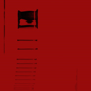
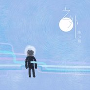
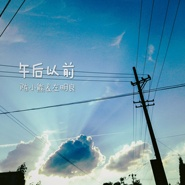
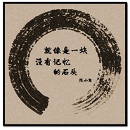

陈小熊
============================

|  |  |
| :--: | :-- |
| [ 陈小熊](https://i.xiami.com/bigbearzjzl) | **地区**: China 中国大陆 **风格**: 民谣 Folk **播放数**: 24185061 **粉丝数**: 14815 **评论数**: 596  |

## 档案

我的第一张个人原创专辑《之外》发布啦 
专辑巡演结束之后 
我就要去英国读博啦 
想要留个纪念的朋友可以戳下面链接了解详情呀~ 
【新专辑《之外》购买链接】 
https://item.taobao.com/item.htm?spm=686.1000925.0.0.Yk1vo3&id=536253637729 
【新专辑首发全国巡演即将开启】 
详情/购票请戳： http://www.musikid.com/tour/5237 
走一条最远的路回家 
由东到西 
从南到北 
会在哪里遇见你呢？ 
【联系方式】 
微博 @陈小熊bigbearzjzl 
微信公共号 【chenxiaoxiongne】陈小熊呢 
******************************************************************************************** 
原创民谣音乐人，散文写作者，即将读博。 
目前在上海，九月去英国 
有事儿发邮箱最好了！       bigbearzjzl@sina.com 
总之———————— 
阳光很好呀， 
要不要唱歌？

## 专辑

| 名称 | 语种 | 唱片公司 | 发行时间 | 专辑类别 | 专辑风格 |
| :--: | :-- | :-- | :-- | :-- | :-- |
| [ Chaos·混乱](./albums/5021837358.md) | 国语 | 独立发行 | 2020年11月04日 | EP, 单曲 | 独立摇滚 Indie Rock |
| [ 触角](./albums/2103731251.md) | 国语 | 独立发行 | 2018年06月05日 | EP, 单曲 | 独立民谣 Indie Folk, 民谣流行 Folk Pop |
| [ 反复磨一把刀](./albums/2102814023.md) | 国语 | 独立发行 | 2017年08月14日 | EP, 单曲 | 独立民谣 Indie Folk |
| [ 之外](./albums/2100344104.md) | 国语 | 独立发行 | 2016年06月12日 | EP, 单曲 | 独立民谣 Indie Folk, 校园民谣 Campus Folk, 民谣 Folk |
| [ 午后以前](./albums/2100243936.md) | 国语 | 天线音乐 | 2015年12月04日 | EP, 单曲 | 城市民谣 Urban Folk, 独立民谣 Indie Folk |
| [ 就像是一块没有记忆的石头](./albums/1331409945.md) | 国语 | 独立发行 | 2015年05月12日 | EP, 单曲 | 城市民谣 Urban Folk, 独立民谣 Indie Folk, 校园民谣 Campus Folk |

## 评论

|  |  |  |
| :-- | :-- | :-- |
|  [虾米用户](https://emumo.xiami.com/u/349338232)  2021-01-29 13:43 赞(0) 踩(0) | 
没了虾米之后，哪里可以听到你的声音。。
 |
|  [虾米用户](https://emumo.xiami.com/u/54519843) 孤者自赏，芳飞艳。 2020-11-25 09:08 赞(0) 踩(0) | 

 |
|  [虾米用户](https://emumo.xiami.com/u/320062652) 我锥五连 2020-08-11 01:42 赞(0) 踩(0) | 
爱了爱了(⑉&amp;deg;з&amp;deg;)-♡加油呀(ง &amp;bull;̀_&amp;bull;́)ง
 |
|  [虾米用户](https://emumo.xiami.com/u/291083052)  2020-08-06 23:56 赞(0) 踩(0) | 
甜甜静静轻轻的午后的声音
 |
|  [虾米用户](https://emumo.xiami.com/u/291083052)  2020-08-06 23:54 赞(0) 踩(0) | 
济南外国语，希望儿子能和你成为校友。 
 |
|  [虾米用户](https://emumo.xiami.com/u/8905665) 我还没想好要写什么... 2020-07-03 16:02 赞(1) 踩(0) | 
宝藏女孩呀
 |
|  [虾米用户](https://emumo.xiami.com/u/204843384)  2020-05-14 15:29 赞(1) 踩(0) | 
好听，闭上眼睛听[带墨镜笑]
 |
|  [虾米用户](https://emumo.xiami.com/u/627851)  2020-05-13 11:00 赞(1) 踩(0) | 
声音真好听，一下子安静下来
 |
|  [虾米用户](https://emumo.xiami.com/u/298266726) 活在当下 怀念过去 2020-04-28 08:40 赞(2) 踩(0) | 
声音很干净 很清纯 很特别
 |
|  [虾米用户](https://emumo.xiami.com/u/244083199)  2020-04-16 04:21 赞(1) 踩(0) | 
声音真好听
 |
|  [虾米用户](https://emumo.xiami.com/u/187878491)  2020-04-01 21:56 赞(2) 踩(0) | 
生长在这里，听这首歌如此有感觉，居然惊喜的发现姐姐是我的学姐，济外人！人文天下，行者无疆
 |
|  [虾米用户](https://emumo.xiami.com/u/6875550) 没有音乐的生活不是生活，... 2020-03-04 09:42 赞(1) 踩(0) | 
唱歌很有感觉 加油
 |
|  [虾米用户](https://emumo.xiami.com/u/310762504) 怎样应景 2020-02-04 17:06 赞(1) 踩(0) | 
加油
 |
|  [虾米用户](https://emumo.xiami.com/u/5035279) 喜乐人生 2020-02-03 13:13 赞(3) 踩(0) | 
从春节前听闻冠状病毒肺炎疫情到武汉封城再到医护工作者奋力拼搏还有这几天武汉官员红十…唉，善恶天两重，毒 到根了…闭上眼睛，就当一切没发生，在小熊歌声里逃亡
 |
|  [虾米用户](https://emumo.xiami.com/u/54539018)  2019-12-20 11:39 赞(2) 踩(0) | 
偶尔听到这首歌，是我今年听到最温暖最有朴素的哲思的一首歌~加油(ง •̀_•́)ง期待更多作品~ 啥时在上海能有演唱会呢?
 |
|  [虾米用户](https://emumo.xiami.com/u/32797466)  2019-12-18 22:48 赞(3) 踩(0) | 
很好听…  声音很温暖…
 |
|  [虾米用户](https://emumo.xiami.com/u/277139534) 归置零点，一同带入太空 2019-10-31 01:22 赞(4) 踩(0) | 
小熊是不是不回虾米了 
 |
|  [虾米用户](https://emumo.xiami.com/u/31851172) your existen... 2019-08-25 16:40 赞(0) 踩(0) | 
我女儿很喜欢你～一年级
 |
|  [虾米用户](https://emumo.xiami.com/u/199472338)  2019-07-07 07:48 赞(0) 踩(0) | 
好喜欢你的歌(⑉°з°)-♡
 |
|  [虾米用户](https://emumo.xiami.com/u/334316278) 我还没想好要写什么... 2019-07-03 04:21 赞(3) 踩(0) | 
声线很不错，挺舒服的感觉
 |
|  [虾米用户](https://emumo.xiami.com/u/199654804)   2019-06-21 14:24 赞(3) 踩(0) | 
请问80岁的歌有伴奏嘛？
 |
|  [虾米用户](https://emumo.xiami.com/u/40535958)   2019-05-06 16:44 赞(2) 踩(0) | 
听完你的歌，好想找个吉他，试着弹一弹
 |
|  [虾米用户](https://emumo.xiami.com/u/27701617) 我还没想好要写什么... 2019-04-27 12:29 赞(0) 踩(0) | 
加油呀
 |
|  [虾米用户](https://emumo.xiami.com/u/8229684) 好吧，farewell。 2019-03-06 14:09 赞(2) 踩(0) | 
好听的声音，好听的歌。
 |
|  [虾米用户](https://emumo.xiami.com/u/411746924)  2019-02-14 03:34 赞(1) 踩(0) | 
能用xjj的歌剪视频吗 可以授权吗
 |
|  [虾米用户](https://emumo.xiami.com/u/412111780) 我还没想好要写什么... 2019-02-09 22:34 赞(1) 踩(0) | 
好听
 |
|  [虾米用户](https://emumo.xiami.com/u/326114256) 寧靜致遠 淡泊明志 2019-02-03 17:11 赞(3) 踩(0) | 
清新的音色，如春风轻拂面 
 |
|  [虾米用户](https://emumo.xiami.com/u/376169534) 所有的酒都不如你， 2019-02-02 19:57 赞(1) 踩(0) | 
很喜欢你的音乐，倾注了自己的心
 |
|  [虾米用户](https://emumo.xiami.com/u/313693664) 想把腿走断.......... 2019-01-30 03:43 赞(1) 踩(0) | 
喜欢这个声音，感觉歌曲有些许悲观，就像我自己一样！真想做一块没有记忆的石头！
 |
|  [虾米用户](https://emumo.xiami.com/u/2925861)  2019-01-22 12:16 赞(0) 踩(0) | 
清新的女声，纯真唯美。
 |
|  [虾米用户](https://emumo.xiami.com/u/311073163)  2019-01-20 23:43 赞(1) 踩(0) | 
加油(ง •̀_•́)ง
 |
|  [虾米用户](https://emumo.xiami.com/u/411876402)  2019-01-05 14:24 赞(0) 踩(0) | 
真的是那个陈小熊么？记得在工大听过呢 
 |
|  [虾米用户](https://emumo.xiami.com/u/290078992)  2018-12-23 15:12 赞(0) 踩(0) | 
真好。你有多久没有看过星星
 |
|  [虾米用户](https://emumo.xiami.com/u/409432657) 周边一切都是虚无的，只有... 2018-12-16 00:24 赞(3) 踩(0) | 
你的歌写的非常好，歌唱的也好听，我可以感受到你的每一首歌都是一个故事，我也有故事，你能用我的故事写一首歌嘛？
 |
| ⇒ |  [虾米用户](https://emumo.xiami.com/u/409432657) 周边一切都是虚无的，只有... 2018-12-16 00:24 赞(0) 踩(0) | 
如果可以，请联系我
 |
| ⇒ |  [虾米用户](https://emumo.xiami.com/u/103091380) 我还没想好要写什么... 2018-12-27 01:56 赞(0) 踩(0) | 
感觉小熊不常用虾米，你也许可以上网易云跟她说
 |
|  [虾米用户](https://emumo.xiami.com/u/349694217) 今天有值得的回忆，明天就... 2018-12-08 20:13 赞(1) 踩(0) | 
非常喜欢济南济南…不是因为我是山东人…只是因为音乐，希望有空再这个青岛…青岛  
 |
|  [虾米用户](https://emumo.xiami.com/u/334709503)  2018-11-25 15:25 赞(0) 踩(0) | 
好听
 |
|  [虾米用户](https://emumo.xiami.com/u/345465860) あのね ため息つくと 幸... 2018-11-12 20:19 赞(0) 踩(0) | 
1111112333333777778
 |
|  [虾米用户](https://emumo.xiami.com/u/2476036) 装满了明信片的铁盒里藏着 2018-10-30 01:47 赞(0) 踩(0) | 
交大校友～
 |
|  [虾米用户](https://emumo.xiami.com/u/334802167)  2018-10-29 01:51 赞(1) 踩(0) | 
喜欢，好听
 |
|  [虾米用户](https://emumo.xiami.com/u/287862197)  2018-10-26 20:55 赞(0) 踩(0) | 
加油！你的歌声很真挚
 |
|  [虾米用户](https://emumo.xiami.com/u/42799966) 两棵朝圣的树。 2018-10-23 08:07 赞(0) 踩(0) | 
成长了，再也不敢听这样的歌了，虽然还是会打动我，但理智不敢再听她们的话了
 |
|  [虾米用户](https://emumo.xiami.com/u/142710170) 我是一个胖子…… 2018-10-21 23:20 赞(1) 踩(0) | 
可爱 温暖 动听的歌声！支持你 
 |
|  [虾米用户](https://emumo.xiami.com/u/354181908) kiss 2018-09-18 00:38 赞(2) 踩(0) | 
声音真的太动人了
 |
|  [虾米用户](https://emumo.xiami.com/u/401188374)  2018-09-14 08:04 赞(0) 踩(0) | 
[Reply@陈搏特][Reply@波波和糖...][Reply@波波和糖...][Reply@陈搏特][Reply@陈搏特][Reply@尤米尼斯][Reply@尤米尼斯][Reply@&amp;middot;][Reply@&amp;middot;][Repl
 |
|  [虾米用户](https://emumo.xiami.com/u/401188374)  2018-09-14 08:02 赞(0) 踩(0) | 
[Reply@亦晗][Reply@kololoalo]
 |
|  [虾米用户](https://emumo.xiami.com/u/346249077)  2018-09-10 12:58 赞(1) 踩(0) | 
济南济南那首歌好听。
 |
|  [虾米用户](https://emumo.xiami.com/u/50642558) 我还没想好要写什么... 2018-09-04 14:14 赞(0) 踩(0) | 
一首盲人的歌，让我看到你
 |
|  [虾米用户](https://emumo.xiami.com/u/324672699)  2018-08-27 12:12 赞(0) 踩(0) | 
听着你的声音就想点进来看看你最近会不会来成都，很遗憾在8月份错过了6月份的有你的小酒馆
 |
|  [虾米用户](https://emumo.xiami.com/u/27256844)  2018-08-08 10:28 赞(0) 踩(0) | 
很喜欢你的声音，赞赞
 |
|  [虾米用户](https://emumo.xiami.com/u/356517624)  2018-07-19 23:38 赞(0) 踩(0) | 
不知道说什么，谢谢你的声音，
 |
|  [虾米用户](https://emumo.xiami.com/u/37743007)  2018-07-16 22:10 赞(1) 踩(0) | 
有很久没抬头看看星星了，谢谢你的歌声
 |
|  [虾米用户](https://emumo.xiami.com/u/303741414)  2018-07-12 13:43 赞(0) 踩(0) | 
也不知道怎么支持你，只能把所有的歌买个遍
 |
|  [虾米用户](https://emumo.xiami.com/u/303741414)  2018-07-12 13:37 赞(0) 踩(0) | 
真好听，声音特性感，忍不住留言了&amp;hellip;&amp;hellip;
 |
|  [虾米用户](https://emumo.xiami.com/u/308862615)  2018-06-08 21:34 赞(0) 踩(0) | 
爆QQ
 |
|  [虾米用户](https://emumo.xiami.com/u/126510418) 是在昨天，还是在梦里 2018-06-07 10:33 赞(0) 踩(0) | 
来北京啊！！！！！
 |
|  [虾米用户](https://emumo.xiami.com/u/37103394) 这个人很懒 2018-06-05 14:58 赞(0) 踩(0) | 
欢迎来我大昆明呀呀呀，期待ing
 |
|  [虾米用户](https://emumo.xiami.com/u/103091380) 我还没想好要写什么... 2018-05-30 16:50 赞(4) 踩(0) | 
你的济南济南很感动我这个不是济南人的外地人
 |
|  [虾米用户](https://emumo.xiami.com/u/321068401)  2018-05-07 21:38 赞(0) 踩(0) | 
支持你！
 |
|  [虾米用户](https://emumo.xiami.com/u/361163211) 看到他们真诚暖暖的笑，意... 2018-05-06 20:13 赞(2) 踩(0) | 
好温暖的小姐姐，唱得好好听，心里温暖平静有力量。谢谢小姐姐的音乐。 
 |
|  [虾米用户](https://emumo.xiami.com/u/50416718)  2018-05-03 14:22 赞(0) 踩(0) | 
山东老乡，太棒了，声音好听，单曲循环了好多遍
 |
|  [虾米用户](https://emumo.xiami.com/u/284695025)  2018-04-29 00:32 赞(1) 踩(0) | 
真好听，支持你哦，加油！
 |
|  [虾米用户](https://emumo.xiami.com/u/318949421)  2018-04-28 00:22 赞(0) 踩(0) | 
小姐姐小姐姐～好喜欢你的声音呀！你才华横溢，词也特别有文采，吉他弹的也特别棒！我好稀饭你啊！好可惜度娘搜不到你的吉他谱呢，有点小难过
 |
|  [虾米用户](https://emumo.xiami.com/u/355935783) 深陷泥潭无法自拔 2018-04-22 18:17 赞(0) 踩(0) | 
不知道这些岁月都怎么度过的
 |
|  [虾米用户](https://emumo.xiami.com/u/344098309)  2018-04-18 20:10 赞(2) 踩(0) | 
你说你不算美女，特意过来看看你的照片，长得可以呀，是美女的呀
 |
|  [虾米用户](https://emumo.xiami.com/u/83591380) 哼一首淡淡的歌。 2018-04-14 19:16 赞(1) 踩(0) | 
小熊好棒
 |
|  [虾米用户](https://emumo.xiami.com/u/309332401)  2018-04-10 18:48 赞(0) 踩(0) | 
喜欢说不上什么理由
 |
|  [虾米用户](https://emumo.xiami.com/u/335424837) 读万卷书，行万里路 2018-04-08 11:43 赞(1) 踩(0) | 
好好听   惬意的阳光安静的房间融入小熊的歌声  好舒服好享受  
 |
|  [虾米用户](https://emumo.xiami.com/u/98141726) 喜欢是很纯粹的，不要去玷... 2018-04-07 18:14 赞(2) 踩(0) | 
刚开始听错了，我以为花粥唱的，打开手机一看，山东老乡！！
 |
| ⇒ |  [虾米用户](https://emumo.xiami.com/u/352786155) 鄙人  家境贫寒  学业... 2018-04-17 18:01 赞(0) 踩(0) | 
你不是一个人哦
 |
|  [虾米用户](https://emumo.xiami.com/u/128470428)  2018-04-07 15:07 赞(3) 踩(0) | 
希望小熊能来湖南的英语节，声音和作品真的都很棒。你又多久没有看过星星超级超级治愈啊！ 
 |
|  [虾米用户](https://emumo.xiami.com/u/33171167) 老婆 大妮 儿子 2018-03-29 23:10 赞(1) 踩(0) | 
不是济南人吗？怎么成西安人了？
 |
| ⇒ |  [虾米用户](https://emumo.xiami.com/u/347317529)  2018-08-15 03:10 赞(0) 踩(0) | 
本科在西安读的，校友
 |
|  [虾米用户](https://emumo.xiami.com/u/12221090) 逍遥于天地而心意自得 2018-03-29 21:12 赞(0) 踩(0) | 
赞
 |
|  [虾米用户](https://emumo.xiami.com/u/12221090) 逍遥于天地而心意自得 2018-03-25 20:21 赞(0) 踩(0) | 
赞
 |
|  [虾米用户](https://emumo.xiami.com/u/340593533) 天地与我并生，万物与我为... 2018-03-11 19:03 赞(1) 踩(0) | 
小熊大人，啥时在郑州有演唱会啊 
 |
|  [虾米用户](https://emumo.xiami.com/u/349338232)  2018-02-27 14:07 赞(0) 踩(0) | 
已不能自拔
 |
|  [虾米用户](https://emumo.xiami.com/u/277258242)  2018-02-27 01:13 赞(0) 踩(0) | 
第一次听你的歌，随机播放的。好听，加油  
 |
|  [虾米用户](https://emumo.xiami.com/u/8337431) 以乐会友 2018-02-10 10:51 赞(0) 踩(0) | 
512
 |
|  [虾米用户](https://emumo.xiami.com/u/227403909) 我还是太年轻啦。 2018-02-07 00:59 赞(0) 踩(0) | 
支持校友
 |
|  [虾米用户](https://emumo.xiami.com/u/305499337) 你今天真好看。 2018-02-06 17:20 赞(0) 踩(0) | 
有多久没看过星星
 |
|  [虾米用户](https://emumo.xiami.com/u/347598944)  2018-02-05 22:06 赞(0) 踩(0) | 
声音好听
 |
|  [虾米用户](https://emumo.xiami.com/u/267882407) 或许是命中注定吧 2018-01-07 19:02 赞(2) 踩(0) | 
被你的呻吟深深的吸引了
 |
|  [虾米用户](https://emumo.xiami.com/u/41824469) 胎是胎，有点乖。 2017-12-08 16:24 赞(4) 踩(0) | 
声音好好听。 泪崩..
 |
|  [虾米用户](https://emumo.xiami.com/u/31978450)  2017-12-04 23:45 赞(0) 踩(0) | 
学姐优秀！
 |
|  [虾米用户](https://emumo.xiami.com/u/335599351) 。 2017-11-20 21:08 赞(0) 踩(0) | 
太喜欢了
 |
|  [虾米用户](https://emumo.xiami.com/u/32648949) 夏天来啦 2017-11-19 17:35 赞(0) 踩(0) | 
   
 |
|  [虾米用户](https://emumo.xiami.com/u/270494679)  2017-11-12 12:05 赞(0) 踩(0) | 
加油加油
 |
|  [虾米用户](https://emumo.xiami.com/u/1995164) 我还没想好要写什么... 2017-11-09 20:26 赞(3) 踩(0) | 
有点柔，有点娇弱，又带有几分知性优雅内心却又坚强的声音 
 |
|  [虾米用户](https://emumo.xiami.com/u/237417216) Let's go par... 2017-11-04 12:27 赞(1) 踩(0) | 
好安静的声音
 |
|  [虾米用户](https://emumo.xiami.com/u/8566739) 今晚打边炉啊 2017-11-02 18:48 赞(1) 踩(0) | 
我有酒
 |
|  [虾米用户](https://emumo.xiami.com/u/1988302)  2017-10-30 10:23 赞(0) 踩(0) | 
今天在首页上看到了小熊童鞋的歌，再过一段时间你就会上头条了哈哈哈！
 |
|  [虾米用户](https://emumo.xiami.com/u/38768478)  2017-10-30 10:04 赞(0) 踩(0) | 
好喜欢你的声音 喜欢平华的歌词
 |
|  [虾米用户](https://emumo.xiami.com/u/43779193) 这别是个傻子吧ᖗ( ᐛ ... 2017-10-28 00:16 赞(0) 踩(0) | 
你唱歌的每一句 就像从自己的心里说出来 真的好爱你 完全沦为脑残粉 加油！
 |
|  [虾米用户](https://emumo.xiami.com/u/10064615) 签名中…… 2017-10-28 00:05 赞(0) 踩(0) | 
就这样简单的吸引了我~来我们合集把~请搜索：“耳廓音乐大巴士”评论里有QQ群，欢迎加入~让我们一起创作，一起音乐，一起幸福。
 |
|  [虾米用户](https://emumo.xiami.com/u/564010)  2017-10-28 00:05 赞(0) 踩(0) | 
好好听的声音，学教育不要用论文去考啊，去实践，去学校，去支教吧。用感觉去感受孩子，而不是去从论文里研究。唱歌用的是心，教育依旧
 |
|  [虾米用户](https://emumo.xiami.com/u/35167460) La vie elle ... 2017-10-27 23:43 赞(0) 踩(0) | 
好！已关注微信！
 |
|  [虾米用户](https://emumo.xiami.com/u/45080942)  2017-10-27 23:32 赞(0) 踩(0) | 
没有记忆的石头，催泪哦，也可能是自己最近心情不好吧，哈哈哈，加油！！！声音好听！！！
 |
|  [虾米用户](https://emumo.xiami.com/u/294091268)  2017-10-27 19:01 赞(0) 踩(0) | 
穿透人心
 |
|  [虾米用户](https://emumo.xiami.com/u/298948030) 中國詩音樂電影创始人作曲... 2017-10-17 22:00 赞(0) 踩(0) | 
你好
 |
|  [虾米用户](https://emumo.xiami.com/u/329217220)  2017-10-14 11:11 赞(1) 踩(0) | 
高材生歌手啊！
 |
|  [虾米用户](https://emumo.xiami.com/u/227385156)  2017-10-10 12:59 赞(2) 踩(0) | 
就像是一块没有记忆的石头，走在日月星光里，灿烂着，也会偶然的陨落。我们会相识。在醉了满天的星辰下，听同一首曲子。
 |
|  [虾米用户](https://emumo.xiami.com/u/81801082)  2017-10-09 20:37 赞(0) 踩(0) | 
听的舒服，惬意。
 |
|  [虾米用户](https://emumo.xiami.com/u/1985500)  2017-10-06 10:22 赞(1) 踩(0) | 
真好听，不是歌，是流淌的情感，让人想哭 
 |
|  [虾米用户](https://emumo.xiami.com/u/8891515)  2017-10-01 16:11 赞(0) 踩(0) | 
喜欢曲子静静的 声音缓缓的曲子 赞一个 
 |
|  [虾米用户](https://emumo.xiami.com/u/286663448) 听见 2017-09-25 09:47 赞(0) 踩(0) | 
才女小熊，加油。一样在国外的我被那首济南济南打动
 |
|  [虾米用户](https://emumo.xiami.com/u/224662793)  2017-09-22 23:24 赞(1) 踩(0) | 
一个洁净而有趣的灵魂，一个美丽而走心的声音 给小姐姐手动比心
 |
|  [虾米用户](https://emumo.xiami.com/u/50426689)  2017-09-16 15:50 赞(0) 踩(0) | 
好听
 |
|  [虾米用户](https://emumo.xiami.com/u/26106642) 我有的 是你的 2017-09-12 17:20 赞(0) 踩(0) | 
[强]挺好
 |
|  [虾米用户](https://emumo.xiami.com/u/310894161)  2017-08-31 08:44 赞(2) 踩(0) | 
学姐加油～
 |
|  [虾米用户](https://emumo.xiami.com/u/250592987) 轻轻的来轻轻滴走。 2017-08-26 15:07 赞(2) 踩(0) | 
声音很&amp;ldquo;空灵&amp;rdquo;音调&amp;rdquo;清晰 
 |
|  [虾米用户](https://emumo.xiami.com/u/83893196) 我还没想好要写什么... 2017-08-25 21:39 赞(1) 踩(0) | 
声音很好听
 |
|  [虾米用户](https://emumo.xiami.com/u/262569429)  2017-08-21 21:32 赞(0) 踩(0) | 
真好听
 |
|  [虾米用户](https://emumo.xiami.com/u/281677609)  2017-08-20 23:10 赞(1) 踩(0) | 
不容易，我喜欢这个姑娘
 |
|  [虾米用户](https://emumo.xiami.com/u/207297406)  2017-08-20 18:25 赞(2) 踩(0) | 
小熊姐姐加油↖(^&amp;omega;^)↗
 |
|  [虾米用户](https://emumo.xiami.com/u/207297406)  2017-08-20 18:25 赞(2) 踩(0) | 
为什么才听到
 |
|  [虾米用户](https://emumo.xiami.com/u/207297406)  2017-08-20 18:25 赞(1) 踩(0) | 
很好听啊
 |
|  [虾米用户](https://emumo.xiami.com/u/1109390) 行深 2017-08-18 23:52 赞(1) 踩(0) | 
也喜欢这嗓音，舒服
 |
|  [虾米用户](https://emumo.xiami.com/u/1109390) 行深 2017-08-18 23:52 赞(0) 踩(0) | 
嘉定的？
 |
|  [虾米用户](https://emumo.xiami.com/u/318499872)  2017-08-17 18:33 赞(3) 踩(0) | 
我特别喜欢你的歌，感觉每一首歌都是一个故事，希望你继续努力，加油加油加油加油加油加油加油加油加油        
 |
|  [虾米用户](https://emumo.xiami.com/u/28408574) Going my way... 2017-08-16 13:00 赞(1) 踩(0) | 
欧美嗓
 |
|  [虾米用户](https://emumo.xiami.com/u/678232) 我们都诗化了眼前的世界。 2017-08-15 15:17 赞(2) 踩(0) | 
作为一个阅音无数的老司机！深深的喜欢你的歌。留洋是很好的。祝能在音乐的道路上越走越好！
 |
|  [虾米用户](https://emumo.xiami.com/u/270297703) 一阵风，飞走了，自由了，... 2017-07-27 20:15 赞(1) 踩(0) | 
小熊啊，好想和你交朋友，你太可爱了，等我去英国时一定会去找你的 
 |
|  [虾米用户](https://emumo.xiami.com/u/42799966) 两棵朝圣的树。 2017-07-21 22:20 赞(1) 踩(0) | 
谨慎听小熊的歌～
 |
|  [虾米用户](https://emumo.xiami.com/u/37910570)  2017-07-18 09:18 赞(1) 踩(0) | 
我想打赏，找不到入口啊 
 |
| ⇒ |  [虾米用户](https://emumo.xiami.com/u/1985500)  2017-10-06 10:23 赞(0) 踩(0) | 
我也想打赏 
 |
|  [虾米用户](https://emumo.xiami.com/u/232042680) 后来的我们 2017-07-17 20:36 赞(1) 踩(0) | 
喜欢你 你的歌很适合耳机
 |
|  [虾米用户](https://emumo.xiami.com/u/39270652)   2017-07-13 22:14 赞(1) 踩(0) | 
偶尔听见，然后重复！
 |
|  [虾米用户](https://emumo.xiami.com/u/306291654) 是我的，它总会来的，不是... 2017-07-02 23:22 赞(4) 踩(0) | 
很喜欢你的声音。干净，纯粹。 很容易有那种触动心灵的触感 这是第一次听到。挺喜欢的，我会一直支持啊！ 这个声音，让我想到了很蓝很纯粹的天空，也让我想到很清很透的水，与细细的乐笛声，在空气中飘荡着，激起心灵纯净的波浪。
 |
|  [虾米用户](https://emumo.xiami.com/u/266012932) 就让这时光流淌，而我们就... 2017-07-01 04:23 赞(1) 踩(0) | 
哈哈哈，来英国读博，那就是师妹了 
 |
|  [虾米用户](https://emumo.xiami.com/u/185475422)  2017-07-01 00:14 赞(0) 踩(0) | 
熊老师！永远爱你！
 |
|  [虾米用户](https://emumo.xiami.com/u/119028790) 揪心的玩笑与漫长的白日梦... 2017-06-25 09:41 赞(4) 踩(0) | 
原谅我一不小心听见你的声音，就没有办法的爱上了 
 |
|  [虾米用户](https://emumo.xiami.com/u/9402480) 皱月觉鱼来，已乘鲤鱼去。... 2017-06-18 01:17 赞(1) 踩(0) | 
声音真干净，和名字一样亲切好听
 |
|  [虾米用户](https://emumo.xiami.com/u/48904087)  2017-06-14 13:34 赞(0) 踩(0) | 
学姐，我在西工大西门口吃饭时候人家放你的歌 
 |
|  [虾米用户](https://emumo.xiami.com/u/298488516)  2017-06-13 02:05 赞(0) 踩(0) | 
每天一个人的时候就听  你的那首星星！挺好的
 |
|  [虾米用户](https://emumo.xiami.com/u/222499434) 我还没想好要写什么... 2017-06-11 22:55 赞(2) 踩(0) | 
您好，我是高三毕业生，刚刚高考完，我们在毕业典礼上组织了合唱，想唱您的《济南济南》。这首歌很好听，我们即将各奔四方，舍不得长大的家乡，所以改成了符合我们地区的歌词。但很遗憾我们没有找到《济南济南》的伴奏，但是大家不想放弃，所以来碰碰运气，希望您能给我们。谢谢您的音乐，让我们有美好回忆~
 |
|  [虾米用户](https://emumo.xiami.com/u/302591347)  2017-06-10 17:26 赞(0) 踩(0) | 
生活就要丰富多彩，永远要有梦想！
 |
|  [虾米用户](https://emumo.xiami.com/u/298180958)  2017-06-09 22:07 赞(0) 踩(0) | 
牛逼牛逼
 |
|  [虾米用户](https://emumo.xiami.com/u/199022178) 上帝从来不会没收你的任何... 2017-06-07 16:20 赞(0) 踩(0) | 
加油＾０＾~声音很好听
 |
|  [虾米用户](https://emumo.xiami.com/u/223023) 浮 光  掠影  中… ... 2017-06-06 23:23 赞(1) 踩(0) | 
一个干净、自由的灵魂即将投入尘世的洪流，期待～
 |
|  [虾米用户](https://emumo.xiami.com/u/100715324) 愿万事胜意。 2017-06-04 11:09 赞(1) 踩(0) | 
听星星听着听着就哭了，喜欢你的声音。
 |
|  [虾米用户](https://emumo.xiami.com/u/242408995)  2017-05-21 18:33 赞(0) 踩(0) | 
声音好慵懒，好喜欢这种调
 |
|  [虾米用户](https://emumo.xiami.com/u/46221583)  2017-05-18 11:30 赞(0) 踩(0) | 
加油～喜欢你的作品，喜欢里面的慵懒和悲伤的故事
 |
|  [虾米用户](https://emumo.xiami.com/u/297056497)   2017-05-17 19:01 赞(0) 踩(0) | 
好好听哦～～～
 |
|  [虾米用户](https://emumo.xiami.com/u/55916106) 这里是我自己的世界 2017-05-12 23:22 赞(0) 踩(0) | 
《午后以前》真的很棒！
 |
|  [虾米用户](https://emumo.xiami.com/u/117070588)  2017-05-11 08:11 赞(0) 踩(0) | 
棒
 |
|  [虾米用户](https://emumo.xiami.com/u/40239538)   2017-05-10 16:04 赞(0) 踩(0) | 
声音好喜欢
 |
|  [虾米用户](https://emumo.xiami.com/u/3837352)  2017-05-08 16:35 赞(0) 踩(0) | 
喜欢这种干净的音乐
 |
|  [虾米用户](https://emumo.xiami.com/u/49219702) 浮曦牧晨 2017-05-07 22:46 赞(0) 踩(0) | 
加油，坚持自己的梦想
 |
|  [虾米用户](https://emumo.xiami.com/u/293444155)  2017-05-03 07:56 赞(0) 踩(0) | 
能听到你的声音真好。谢谢你，谢谢你的歌。
 |
|  [虾米用户](https://emumo.xiami.com/u/230093111) 在乐谱节拍里的满满回忆 ... 2017-05-03 00:34 赞(0) 踩(0) | 
清透干净的声音 打动人心的歌词 感动情绪的旋律  &amp;hellip;&amp;hellip;  好听
 |
|  [虾米用户](https://emumo.xiami.com/u/12263097) 我就是爱音乐 2017-05-02 18:51 赞(0) 踩(0) | 
民谣  治愈系
 |
|  [虾米用户](https://emumo.xiami.com/u/256063884)   2017-05-02 17:31 赞(0) 踩(0) | 
我记得很久以前在A站看过你的视频～
 |
|  [虾米用户](https://emumo.xiami.com/u/37602791) 从前有一个瓜子国…孤身一... 2017-04-30 22:15 赞(0) 踩(0) | 
不知道怎么称呼你哎，就叫你小熊吧，小熊，我好羡慕你哎，可以有那么好的梦，可以那么接近你的梦，每次听你的声音就像回家了一样，好舒服啊，就好像大海一般，海风迎面吹来&amp;hellip;&amp;hellip;总之，小熊，加油哦，要一直走下去哦&amp;cap;_&amp;cap;
 |
|  [虾米用户](https://emumo.xiami.com/u/105977630) Deer my deer 2017-04-26 17:20 赞(0) 踩(0) | 
爱你
 |
|  [虾米用户](https://emumo.xiami.com/u/289392177)  2017-04-24 21:59 赞(0) 踩(0) | 
每次听都想回家
 |
|  [虾米用户](https://emumo.xiami.com/u/257889720)  2017-04-23 16:41 赞(0) 踩(0) | 
感觉自己想发现新大陆一样，好久都没听到这么空灵的歌了
 |
|  [虾米用户](https://emumo.xiami.com/u/262328139) 我们在一起，还稀罕什么天... 2017-04-21 22:52 赞(0) 踩(0) | 
很特别的歌，简单不做作，这才是最纯粹的音乐。词也很好，文艺青年的最爱啊！&amp;hearts;
 |
|  [虾米用户](https://emumo.xiami.com/u/196329144) 醉后不知天在水，满船清梦... 2017-04-18 07:47 赞(0) 踩(0) | 
循环中
 |
|  [虾米用户](https://emumo.xiami.com/u/288342027)  2017-04-17 16:12 赞(0) 踩(0) | 
很赞 
 |
|  [虾米用户](https://emumo.xiami.com/u/288060431)  2017-04-12 23:28 赞(0) 踩(0) | 
good
 |
|  [虾米用户](https://emumo.xiami.com/u/10308568) blues 2017-04-11 19:32 赞(0) 踩(0) | 
很棒的词，我其实是被你词打动的  
 |
|  [虾米用户](https://emumo.xiami.com/u/286556958) 我就是一个存在了很久的错... 2017-04-07 08:43 赞(0) 踩(0) | 
我就是一个存在了很久的错误
 |
|  [虾米用户](https://emumo.xiami.com/u/265004970) 2017冲破迷雾 2017-03-31 23:54 赞(0) 踩(0) | 
歌很有味道，一听就喜欢上了，加油
 |
|  [虾米用户](https://emumo.xiami.com/u/255253498)  2017-03-25 12:28 赞(0) 踩(0) | 
能坚持唱自己的歌，不容易。加油
 |
|  [虾米用户](https://emumo.xiami.com/u/280994722)  2017-03-18 22:54 赞(0) 踩(0) | 
很棒棒啊，还在读博？
 |
|  [虾米用户](https://emumo.xiami.com/u/248733392) 我还没想好要写什么... 2017-03-15 20:53 赞(0) 踩(0) | 
看好你，才女，加油吧，改动这个世界。
 |
|  [虾米用户](https://emumo.xiami.com/u/278460887)  2017-03-15 13:40 赞(0) 踩(0) | 
很好听 
 |
|  [虾米用户](https://emumo.xiami.com/u/272718206)  2017-03-11 23:30 赞(0) 踩(0) | 
美妙的声音，美妙的歌词这首歌真棒 
 |
|  [虾米用户](https://emumo.xiami.com/u/1971011) 愿后会有期微信XXL-S... 2017-03-09 21:25 赞(1) 踩(0) | 
爱上你的声音，欲罢不能
 |
|  [虾米用户](https://emumo.xiami.com/u/3230767)  2017-03-08 02:15 赞(0) 踩(0) | 
通过向往的生活知道&amp;ldquo;你有好久没有看过星星&amp;rdquo;这首歌，很能打动人，加油！
 |
|  [虾米用户](https://emumo.xiami.com/u/252377294)  2017-03-02 09:36 赞(0) 踩(0) | 
喜欢你的声音，好独特！
 |
|  [虾米用户](https://emumo.xiami.com/u/634749)  2017-02-27 09:15 赞(0) 踩(0) | 
多么纯净的声音
 |
|  [虾米用户](https://emumo.xiami.com/u/3497746) 不在乎这10分，我是来听... 2017-02-06 10:44 赞(0) 踩(0) | 
的确不错~~~加油~
 |
|  [虾米用户](https://emumo.xiami.com/u/17533159) 雅誉酒 2017-02-05 22:47 赞(0) 踩(0) | 
新年大吉大利
 |
|  [虾米用户](https://emumo.xiami.com/u/46982071)  2017-02-04 00:12 赞(0) 踩(0) | 
第一次有被一个声音搞得鼻酸了，感谢你带来的纯净的体验
 |
|  [虾米用户](https://emumo.xiami.com/u/242998324)  2017-01-30 15:02 赞(1) 踩(0) | 
声音有一种独特的魅力。
 |
|  [虾米用户](https://emumo.xiami.com/u/242998324)  2017-01-30 15:00 赞(1) 踩(0) | 
又是一位不为人知的大神
 |
|  [虾米用户](https://emumo.xiami.com/u/257002164)  2017-01-27 01:49 赞(1) 踩(0) | 
音色很干净舒服，喜欢，支持！
 |
|  [虾米用户](https://emumo.xiami.com/u/120768662)  2017-01-26 18:10 赞(0) 踩(0) | 
好好的词
 |
|  [虾米用户](https://emumo.xiami.com/u/267516719)  2017-01-25 22:52 赞(1) 踩(0) | 
本质而纯净的声音，没有商业的烦躁，很舒服！
 |
|  [虾米用户](https://emumo.xiami.com/u/37148905) Bing 2017-01-24 18:02 赞(0) 踩(0) | 
唱民谣的女博士了 
 |
|  [虾米用户](https://emumo.xiami.com/u/218920815)  2017-01-24 00:04 赞(1) 踩(0) | 
很多歌，副歌部分有情感更强烈的一段副歌，就完了，加油
 |
|  [虾米用户](https://emumo.xiami.com/u/218920815)  2017-01-24 00:03 赞(1) 踩(0) | 
加油
 |
|  [虾米用户](https://emumo.xiami.com/u/220652369) 夏虫不可以语于冰者，笃于... 2017-01-23 19:09 赞(0) 踩(0) | 
陪伴我中考完的民谣 
 |
|  [虾米用户](https://emumo.xiami.com/u/258576785)  2017-01-23 10:56 赞(1) 踩(0) | 
第一次听，迷上了这种感觉
 |
|  [虾米用户](https://emumo.xiami.com/u/67857502) 是梦吗 是你吧 2017-01-14 13:05 赞(0) 踩(0) | 
我喜欢民谣
 |
|  [虾米用户](https://emumo.xiami.com/u/150767804)  2017-01-07 23:31 赞(1) 踩(0) | 
真厉害。有被突突的感觉。
 |
|  [虾米用户](https://emumo.xiami.com/u/45110093)  2017-01-03 00:34 赞(0) 踩(0) | 
谢谢你有唱歌谢谢我听到了
 |
|  [虾米用户](https://emumo.xiami.com/u/41379458) 真正的累，来自于内心的无... 2016-12-28 21:08 赞(1) 踩(0) | 
看好你，必成大器
 |
|  [虾米用户](https://emumo.xiami.com/u/23878895) 专注于旋律 2016-12-13 18:50 赞(0) 踩(0) | 
好棒！
 |
|  [虾米用户](https://emumo.xiami.com/u/31430298) 暂无签名~ 2016-12-05 10:07 赞(1) 踩(0) | 
加油哦
 |
|  [虾米用户](https://emumo.xiami.com/u/15986466) 你长大了，学会不说话了。 2016-11-29 09:35 赞(2) 踩(0) | 
你啊，必成大器 ～
 |
|  [虾米用户](https://emumo.xiami.com/u/11752665) 。 2016-11-13 02:07 赞(0) 踩(0) | 
再回来 终于
 |
|  [虾米用户](https://emumo.xiami.com/u/119001240) music替我say，y... 2016-11-13 00:59 赞(0) 踩(0) | 
很久没来看了，好像有了些变化～不论如何变化，都祝愿你和你的歌永远这样让人温暖
 |
|  [虾米用户](https://emumo.xiami.com/u/86925622)  2016-10-13 22:20 赞(2) 踩(0) | 
好听的歌，是我喜欢的音色。
 |
|  [虾米用户](https://emumo.xiami.com/u/124711658)  2016-10-11 22:41 赞(2) 踩(0) | 
通过八十岁的歌开始听，然后就停不下来了
 |
|  [虾米用户](https://emumo.xiami.com/u/27486367) 我想和你虚度时光 2016-09-30 11:01 赞(1) 踩(0) | 
被你有多久没有看见星星直接圈粉
 |
|  [虾米用户](https://emumo.xiami.com/u/50833521)   2016-09-26 15:08 赞(2) 踩(0) | 
济南济南，是我听到关于济南的最好的民谣 
 |
|  [虾米用户](https://emumo.xiami.com/u/87312620)  2016-09-25 18:22 赞(0) 踩(0) | 
小熊可以分享歌曲的吉他谱吗，好喜欢你的歌，但不懂音乐没办法自己编曲。
 |
|  [虾米用户](https://emumo.xiami.com/u/1727673) 指弹爱好者 2016-09-25 15:21 赞(0) 踩(0) | 
很久之前优酷上看到她弹的 公路之歌，没想到在这又遇到她  
 |
|  [虾米用户](https://emumo.xiami.com/u/132410220) 右边总是正确的     ... 2016-09-25 12:30 赞(0) 踩(0) | 
很喜欢你，陈小熊
 |
|  [虾米用户](https://emumo.xiami.com/u/46820486)  2016-09-24 13:56 赞(0) 踩(0) | 
牛逼啊这个人
 |
|  [虾米用户](https://emumo.xiami.com/u/76014290) 爱理不理。 2016-09-19 10:34 赞(0) 踩(0) | 
好听呀。加油
 |
|  [虾米用户](https://emumo.xiami.com/u/189376353)   2016-09-14 14:24 赞(0) 踩(0) | 
report
 |
|  [虾米用户](https://emumo.xiami.com/u/44711357) 我还没想好要写什么... 2016-09-13 10:54 赞(0) 踩(0) | 
小熊，你要开开心心的哦
 |
|  [虾米用户](https://emumo.xiami.com/u/48904087)  2016-09-10 20:01 赞(1) 踩(0) | 
学姐你唱得太棒了，给一万个赞！可惜那天在排练没时间过去看。
 |
|  [虾米用户](https://emumo.xiami.com/u/214551420)  2016-09-08 22:04 赞(0) 踩(0) | 
熊哥，我是你的迷妹！我好喜欢你！
 |
|  [虾米用户](https://emumo.xiami.com/u/28182884) 爱音乐 2016-09-06 07:39 赞(0) 踩(0) | 
支持一下 
 |
|  [虾米用户](https://emumo.xiami.com/u/1154162) 蝉在叫 2016-08-22 02:18 赞(0) 踩(0) | 
爱你
 |
|  [虾米用户](https://emumo.xiami.com/u/47281861)  2016-08-18 09:47 赞(0) 踩(0) | 
好棒啦！
 |
|  [虾米用户](https://emumo.xiami.com/u/213554802) 自律即自由 2016-08-16 10:32 赞(0) 踩(0) | 
继续爱音乐 爱民谣
 |
|  [虾米用户](https://emumo.xiami.com/u/213554802) 自律即自由 2016-08-16 10:32 赞(0) 踩(0) | 
很喜欢 爱音乐的人大都积极
 |
|  [虾米用户](https://emumo.xiami.com/u/9385254) FireBugs 火灾现... 2016-08-13 22:38 赞(0) 踩(0) | 
收到专辑了。从最开始就很喜欢你的声音和你的歌。你来南京弹唱的时候我也慕名而来。祝你在读博的路上一路顺风。
 |
|  [虾米用户](https://emumo.xiami.com/u/205382264)  2016-08-10 20:08 赞(0) 踩(0) | 
一首济南济南把我这个即将离开济南的人听哭了，晓熊姐姐加油，希望听到更多你的作品
 |
|  [虾米用户](https://emumo.xiami.com/u/110210758) 纵有疾风起，人生不言弃 2016-08-06 21:56 赞(0) 踩(0) | 
声音好听啊啊啊
 |
|  [虾米用户](https://emumo.xiami.com/u/206967503)  2016-08-06 18:17 赞(0) 踩(0) | 
喜欢你的声音，感觉很平静很好听
 |
|  [虾米用户](https://emumo.xiami.com/u/69790824) 没有你，良辰美景更与何人... 2016-08-06 11:53 赞(0) 踩(0) | 
声音带感  没想到还是个学霸
 |
|  [虾米用户](https://emumo.xiami.com/u/69790824) 没有你，良辰美景更与何人... 2016-08-06 11:53 赞(0) 踩(0) | 
很好听
 |
|  [虾米用户](https://emumo.xiami.com/u/209563327)  2016-08-06 11:19 赞(0) 踩(0) | 
秒被吸粉
 |
|  [虾米用户](https://emumo.xiami.com/u/205211937) 每个人心底都有一首歌❤ 2016-08-04 03:34 赞(0) 踩(0) | 
每个人的心中都有一首歌❤
 |
|  [虾米用户](https://emumo.xiami.com/u/54854658)  2016-08-01 21:04 赞(0) 踩(0) | 
简单，安静~
 |
|  [虾米用户](https://emumo.xiami.com/u/54854658)  2016-08-01 20:21 赞(0) 踩(0) | 
很喜欢声音
 |
|  [虾米用户](https://emumo.xiami.com/u/205946139)   2016-07-28 02:09 赞(2) 踩(0) | 
姑娘，你是我们济南人的骄傲！加油！
 |
|  [虾米用户](https://emumo.xiami.com/u/97422138)  2016-07-26 01:38 赞(0) 踩(0) | 
快快来唱歌~~
 |
|  [虾米用户](https://emumo.xiami.com/u/117080468) 文艺工科男 2016-07-24 22:05 赞(1) 踩(0) | 
济南人第一次听到有写济南的歌，好激动好感动
 |
|  [虾米用户](https://emumo.xiami.com/u/45652857) 闭上了眼睛，什么都不想听... 2016-07-23 23:21 赞(1) 踩(0) | 
济南贺电。
 |
|  [虾米用户](https://emumo.xiami.com/u/194390469)  2016-07-23 23:16 赞(1) 踩(0) | 
好有味儿的歌，喜欢～
 |
|  [虾米用户](https://emumo.xiami.com/u/1314777)  2016-07-23 22:34 赞(4) 踩(0) | 
济南济南我想你了～～济南人民发来贺电～～加油～～
 |
|  [虾米用户](https://emumo.xiami.com/u/68267744)  2016-07-23 10:28 赞(1) 踩(0) | 
声音好独特，好听
 |
|  [虾米用户](https://emumo.xiami.com/u/9650510) 我还没想好要写什么... 2016-07-22 22:13 赞(1) 踩(0) | 
喜欢
 |
|  [虾米用户](https://emumo.xiami.com/u/49758556) 我会消失得一干二净 愿你... 2016-07-22 22:02 赞(0) 踩(0) | 
被你的声音吸引过来的。。。
 |
|  [虾米用户](https://emumo.xiami.com/u/199217907)   2016-07-18 13:47 赞(1) 踩(0) | 
声音好独特啊，好好听！
 |
|  [虾米用户](https://emumo.xiami.com/u/201931547) 一辈子很短，珍惜每时每刻... 2016-07-17 21:05 赞(1) 踩(0) | 
触动人心
 |
|  [虾米用户](https://emumo.xiami.com/u/8601290) 远在远方的风，比远方更远 2016-07-05 12:38 赞(1) 踩(0) | 
棒棒哒！
 |
|  [虾米用户](https://emumo.xiami.com/u/51759885) 你总是微笑总是不开口 2016-06-28 02:22 赞(1) 踩(0) | 
声音好听
 |
|  [虾米用户](https://emumo.xiami.com/u/168095538) 凑合听吧… 2016-06-22 00:59 赞(1) 踩(0) | 
真的很好听 
 |
|  [虾米用户](https://emumo.xiami.com/u/49243406) 愿有岁月可回首 2016-06-16 23:33 赞(0) 踩(0) | 
but always
 |
|  [虾米用户](https://emumo.xiami.com/u/70575982) 我在千寻之下等你 2016-06-16 22:05 赞(0) 踩(0) | 
哑巴的歌怎么不能听了啊？  
 |
|  [虾米用户](https://emumo.xiami.com/u/95737)  2016-06-15 23:21 赞(1) 踩(0) | 
好听的声音，好听的旋律。。。。。。
 |
|  [虾米用户](https://emumo.xiami.com/u/55192901)  2016-06-15 12:50 赞(1) 踩(0) | 
听起来超级舒服
 |
|  [虾米用户](https://emumo.xiami.com/u/9088768)  2016-06-14 19:59 赞(1) 踩(0) | 
非常的好听，是非常，谢谢你
 |
|  [虾米用户](https://emumo.xiami.com/u/102334826) 热爱民谣，但也有一颗燥热... 2016-06-14 19:58 赞(1) 踩(0) | 
谢谢你让我听到这么好听的歌
 |
|  [虾米用户](https://emumo.xiami.com/u/5919836)  2016-06-14 16:53 赞(2) 踩(0) | 
一听即陷入
 |
|  [虾米用户](https://emumo.xiami.com/u/189795692)  2016-06-14 10:38 赞(1) 踩(0) | 
我的耳朵已经被你的歌曲抓住了 
 |
|  [虾米用户](https://emumo.xiami.com/u/124105) 心情大好！来点交响乐吧 2016-06-14 10:00 赞(1) 踩(0) | 
挺不错的，我很挑剔的
 |
|  [虾米用户](https://emumo.xiami.com/u/136986676) 林烈松 2016-06-14 08:22 赞(0) 踩(0) | 
路过……
 |
|  [虾米用户](https://emumo.xiami.com/u/1159952) 这个世上总有一首歌等着与... 2016-06-13 22:44 赞(1) 踩(0) | 
我的天真的很好听啊
 |
|  [虾米用户](https://emumo.xiami.com/u/46405677) 音乐就是一辈子能陪伴你的... 2016-06-13 00:42 赞(1) 踩(0) | 
不错喜欢！
 |
|  [虾米用户](https://emumo.xiami.com/u/184481340) ^_^ 2016-06-13 00:34 赞(1) 踩(0) | 
除了爱，还能说什么呢
 |
|  [虾米用户](https://emumo.xiami.com/u/72666568)  2016-05-31 12:01 赞(1) 踩(0) | 
幸福就这个味道。
 |
|  [虾米用户](https://emumo.xiami.com/u/151160480)  2016-05-31 02:49 赞(1) 踩(0) | 
喜欢，加油
 |
|  [虾米用户](https://emumo.xiami.com/u/17719900) 请把我的歌带回你的家 2016-05-27 00:38 赞(0) 踩(0) | 
看起来有点像包美圣哈哈，头像的照片好好看。
 |
|  [虾米用户](https://emumo.xiami.com/u/43035235)  2016-05-25 23:47 赞(0) 踩(0) | 
很走心
 |
|  [虾米用户](https://emumo.xiami.com/u/36023343) 唯有爱与音乐不可辜负 2016-05-25 22:41 赞(1) 踩(0) | 
小熊，听说你要去英国了，记得常回虾米看看偶们哦 
 |
|  [虾米用户](https://emumo.xiami.com/u/50454817) 阳光微淡，心如明镜，有你... 2016-05-25 20:00 赞(0) 踩(0) | 
很喜欢你的歌，给人淡淡的温暖的感觉，加油！你也可以做出不输大牌歌手的歌。 
 |
|  [虾米用户](https://emumo.xiami.com/u/178653022)  2016-05-25 19:10 赞(0) 踩(0) | 
加油，支持你
 |
|  [虾米用户](https://emumo.xiami.com/u/3496718) idle space 2016-05-25 18:39 赞(0) 踩(0) | 
把自己喜欢的事当成兴趣来做，真好~~~
 |
|  [虾米用户](https://emumo.xiami.com/u/36057872) 网易/BC: Breat... 2016-05-25 18:27 赞(0) 踩(0) | 
沙发红了
 |
|  [虾米用户](https://emumo.xiami.com/u/46586096) 亲爱的  谁会永远爱你 ... 2016-05-24 09:22 赞(0) 踩(0) | 
加油女孩
 |
|  [虾米用户](https://emumo.xiami.com/u/9833147) . 2016-05-20 00:16 赞(0) 踩(0) | 
声音不错
 |
|  [虾米用户](https://emumo.xiami.com/u/211273)  2016-05-14 12:40 赞(0) 踩(0) | 
相同频率
 |
|  [虾米用户](https://emumo.xiami.com/u/211273)  2016-05-14 12:40 赞(0) 踩(0) | 
相同频率
 |
|  [虾米用户](https://emumo.xiami.com/u/17226002) 我还没想好要写什么... 2016-05-13 16:08 赞(0) 踩(0) | 
要来了吗，第一张专辑
 |
|  [虾米用户](https://emumo.xiami.com/u/23218468)   2016-05-12 23:06 赞(0) 踩(0) | 
加油！
 |
|  [虾米用户](https://emumo.xiami.com/u/4811886) 夕阳爱好者。 2016-05-08 14:34 赞(1) 踩(0) | 
声音听起来很耳熟 干干净净的
 |
|  [虾米用户](https://emumo.xiami.com/u/125174570) 微信公众号：Jayci_... 2016-05-02 20:51 赞(0) 踩(0) | 
看了歌词就知道你的写作一定很棒！
 |
|  [虾米用户](https://emumo.xiami.com/u/49371310) 鲜衣怒马度春风 2016-05-02 17:47 赞(0) 踩(0) | 

 |
|  [虾米用户](https://emumo.xiami.com/u/127063594)  2016-04-23 20:42 赞(1) 踩(0) | 
一个人晚上一边听，一边流泪
 |
|  [虾米用户](https://emumo.xiami.com/u/49430489) no need to l... 2016-04-22 16:57 赞(0) 踩(0) | 
刚刚听着邱比的一首 然后播放到你的音乐 惊讶你们声音好像 很暖很好听 。虽然我是喜欢比比的 但现在也开始喜欢你  加油小熊
 |
|  [虾米用户](https://emumo.xiami.com/u/3671245) 世界辣么大…懒得去看了～ 2016-04-19 21:39 赞(0) 踩(0) | 
跟着 猎猎 来的... 虽然我不是很喜欢你的歌, 但是给你赞...
 |
|  [虾米用户](https://emumo.xiami.com/u/4795452) 黑色玻璃里有你想要的样子 2016-04-16 11:18 赞(0) 踩(0) | 
很醇的声音啊~ 期待专辑哟
 |
|  [虾米用户](https://emumo.xiami.com/u/50263144) feel 2016-04-16 09:15 赞(0) 踩(0) | 
草鸡好听 嗓音好特别 
 |
|  [虾米用户](https://emumo.xiami.com/u/35167460) La vie elle ... 2016-04-07 19:23 赞(0) 踩(0) | 
你很美❤️
 |
|  [虾米用户](https://emumo.xiami.com/u/35258791) 暂无签名~ 2016-04-06 01:24 赞(0) 踩(0) | 
我们强壮也要唱，不知道你认不认识 
 |
|  [虾米用户](https://emumo.xiami.com/u/35258791) 暂无签名~ 2016-04-06 01:23 赞(0) 踩(0) | 
听说学姐要在校庆晚会上唱歌！好期待你的表演 
 |
|  [虾米用户](https://emumo.xiami.com/u/129934848)  2016-03-31 18:57 赞(0) 踩(0) | 
好有才的小姑娘啊，非常棒，加油
 |
|  [虾米用户](https://emumo.xiami.com/u/8961287)  2016-03-29 09:36 赞(0) 踩(0) | 
好听！发现之前就听过！
 |
|  [虾米用户](https://emumo.xiami.com/u/1396827)  2016-03-09 23:06 赞(0) 踩(0) | 
小熊要开始录制第一张专辑了，你们都会支持吗？
 |
|  [虾米用户](https://emumo.xiami.com/u/5704024) 你怎样信仰，你就怎样生活 2016-03-08 19:19 赞(0) 踩(0) | 
我说生命啊，你好美啊！
 |
|  [虾米用户](https://emumo.xiami.com/u/21832728) 代表作：《暖色系》 2016-03-06 17:12 赞(0) 踩(0) | 
去听听《七月底的歌》<a href="http://i.xiami.com/chayel/demo?spm=a1z1s.7775822.350708669.3.00ocgp" target="_blank" rel="nofollow noreferrer noopener">http://i.xiami.com/chayel/demo?spm=a1z1s.7775822.350708669.3.00ocgp</a>
 |
|  [虾米用户](https://emumo.xiami.com/u/44135456) 发光的眼睛去看太阳 2016-02-29 00:34 赞(0) 踩(0) | 
请问交大的分享会需要提前报名吗？还是来了就能进？
 |
| ⇒ |  [虾米用户](https://emumo.xiami.com/u/1733931) 陈小熊 2016-03-09 11:09 赞(0) 踩(0) | 
tongqu.me 上面有报名通道 或者直接来就好呀
 |
|  [虾米用户](https://emumo.xiami.com/u/44293438)  2016-02-21 23:10 赞(0) 踩(0) | 
喜欢这歌声
 |
|  [虾米用户](https://emumo.xiami.com/u/54427408) . 2016-02-15 10:54 赞(0) 踩(0) | 
你真美好
 |
|  [虾米用户](https://emumo.xiami.com/u/45016358) 朋友进来喝杯理想 2016-01-23 11:43 赞(0) 踩(0) | 
好听
 |
|  [虾米用户](https://emumo.xiami.com/u/98914) 耳朵具有自动过滤歌词功能 2016-01-13 03:27 赞(0) 踩(0) | 
好可爱~卡哇伊
 |
|  [虾米用户](https://emumo.xiami.com/u/13528524)   2016-01-08 15:07 赞(0) 踩(0) | 
非常舒服的声音，小熊棒棒哒
 |
|  [虾米用户](https://emumo.xiami.com/u/39850964)  2016-01-05 17:43 赞(0) 踩(0) | 
清新，特别是在这个时代
 |
|  [虾米用户](https://emumo.xiami.com/u/96351090)  2016-01-05 17:06 赞(0) 踩(0) | 
很干净，喜欢，加油！
 |
|  [虾米用户](https://emumo.xiami.com/u/51572486) cat4u 2016-01-04 23:44 赞(0) 踩(0) | 
就不喜欢随便说点什么
 |
|  [虾米用户](https://emumo.xiami.com/u/54581278)  2016-01-04 14:46 赞(0) 踩(0) | 
很棒很棒
 |
|  [虾米用户](https://emumo.xiami.com/u/35793815) 暂无签名~ 2016-01-04 00:36 赞(0) 踩(0) | 
好喜欢你的风格，像Laura Story，好空灵~
 |
|  [虾米用户](https://emumo.xiami.com/u/50013067) 活在别人的音乐里。 2016-01-03 23:19 赞(0) 踩(0) | 
想问下你是否曾经在优酷上传过翻唱的《我会想起你》？
 |
|  [虾米用户](https://emumo.xiami.com/u/95870142) 下雪了，如果我们不打伞，... 2015-12-30 16:18 赞(0) 踩(0) | 
赞牟
 |
|  [虾米用户](https://emumo.xiami.com/u/76429832) 我还没想好要写什么... 2015-12-28 22:26 赞(0) 踩(0) | 
求他说每个人的心中都有一首歌谱
 |
|  [虾米用户](https://emumo.xiami.com/u/76429832) 我还没想好要写什么... 2015-12-28 22:24 赞(0) 踩(0) | 
超喜欢你的歌 求谱
 |
|  [虾米用户](https://emumo.xiami.com/u/50191949)  2015-12-23 21:42 赞(1) 踩(0) | 
求没有记忆的石头的吉他谱
 |
|  [虾米用户](https://emumo.xiami.com/u/79801578) 歌品奇怪 脾气很坏 2015-12-09 18:48 赞(1) 踩(0) | 
超温暖！！
 |
|  [虾米用户](https://emumo.xiami.com/u/46814990)   2015-12-09 15:47 赞(2) 踩(0) | 
新歌好好听呦 专辑加油！能买到就好了
 |
|  [虾米用户](https://emumo.xiami.com/u/3871693) 暂无签名~ 2015-12-08 10:27 赞(1) 踩(0) | 
学姐的歌好棒~
 |
|  [虾米用户](https://emumo.xiami.com/u/73790620)  2015-12-06 15:13 赞(1) 踩(0) | 
刚听了新歌啦 听着听着觉得其实夏天很美 封面大赞！
 |
|  [虾米用户](https://emumo.xiami.com/u/53724752) 花开清风里，无语是流年 2015-12-06 12:37 赞(1) 踩(0) | 
在一个百无聊赖的正午遇见了这首歌~~
 |
|  [虾米用户](https://emumo.xiami.com/u/12375430) 如果你还爱我，记得来找我 2015-12-05 10:31 赞(1) 踩(0) | 
为原创点赞，干净的声音，暖暖的懒懒的感觉，很舒服
 |
|  [虾米用户](https://emumo.xiami.com/u/3538221)  2015-12-05 02:50 赞(1) 踩(0) | 
喜欢的声音，喜欢的氛围，一切恰到好处
 |
|  [虾米用户](https://emumo.xiami.com/u/45284178) 123 2015-12-04 19:14 赞(1) 踩(0) | 
小熊小熊小熊
 |
|  [虾米用户](https://emumo.xiami.com/u/32364473) 暂无签名~ 2015-12-04 15:36 赞(1) 踩(0) | 
偶然听到，喜欢了。
 |
|  [虾米用户](https://emumo.xiami.com/u/41017493)   2015-11-26 10:46 赞(0) 踩(0) | 
预计发布还有一天 真的假的
 |
|  [虾米用户](https://emumo.xiami.com/u/6742716)  2015-11-18 00:49 赞(1) 踩(0) | 
声音好听好听好听好听，你都要毕业了，我正要考研究生考试 - -
 |
|  [虾米用户](https://emumo.xiami.com/u/12747460) 我们对生活深恶痛绝 2015-11-17 22:33 赞(1) 踩(0) | 
啥时候回济南办专场
 |
|  [虾米用户](https://emumo.xiami.com/u/75727882)  2015-11-17 12:51 赞(1) 踩(0) | 
小熊加油
 |
|  [虾米用户](https://emumo.xiami.com/u/41386459) 我还没想好要写什么... 2015-11-16 01:08 赞(1) 踩(0) | 
今晚在现场爱上了小熊❤️
 |
|  [虾米用户](https://emumo.xiami.com/u/48191198) 暂无签名~ 2015-11-05 21:57 赞(1) 踩(0) | 
声音很干净
 |
|  [虾米用户](https://emumo.xiami.com/u/6055686)  2015-11-02 13:26 赞(2) 踩(0) | 
几年前在翱翔看到学姐的毕业音乐会，没想到在虾米还找到了学姐。祝好啊，学姐 
 |
|  [虾米用户](https://emumo.xiami.com/u/47153193) 他抽着红塔山对墙满谈着理... 2015-10-24 19:05 赞(42) 踩(0) | 
以前看过你唱雷子的歌，如今有了自己优秀的作品，加油
 |
|  [虾米用户](https://emumo.xiami.com/u/9714648) 人生，需要揭穿 2015-10-24 11:06 赞(2) 踩(0) | 
很惊艳
 |
|  [虾米用户](https://emumo.xiami.com/u/40640339)  2015-10-23 21:29 赞(3) 踩(0) | 
从很久很久以前就在豆瓣音乐人上默默关注你 为了听你的歌舍不得卸载豆瓣 你的歌词总是能给我灵感 让我平静下来…今天突然发现你在虾米上，还更了新歌，激动的我又专门下了虾米听你的歌…谢谢你的歌声 
 |
|  [虾米用户](https://emumo.xiami.com/u/10471420)  2015-10-23 18:06 赞(1) 踩(0) | 
虾米推荐真是偶然发现真的很棒，声音很美吉他伴奏完美 
 |
|  [虾米用户](https://emumo.xiami.com/u/17621644) 你在世的日子要比正午更明... 2015-10-10 17:53 赞(1) 踩(0) | 
好美
 |
|  [虾米用户](https://emumo.xiami.com/u/13141446) 门 2015-09-29 14:31 赞(1) 踩(0) | 
第一次听你的歌，声音好喜欢
 |
|  [虾米用户](https://emumo.xiami.com/u/2511090) 飒飒凉风吹汝急 2015-09-27 22:54 赞(0) 踩(0) | 
去年交大十大第二名<a href="http://emumo.xiami.com/u/11410422" target="_blank" rel="nofollow" name_card="11410422">@越锋利</a>
 |
| ⇒ |  [虾米用户](https://emumo.xiami.com/u/11410422) yuefeng.li 2015-09-27 23:53 赞(0) 踩(0) | 
哦这个我知道。
 |
|  [虾米用户](https://emumo.xiami.com/u/21154362) 我还没想好要写什么... 2015-09-25 20:53 赞(1) 踩(0) | 
两段感情 你陪着我 挺好的
 |
|  [虾米用户](https://emumo.xiami.com/u/6372479) 暂无签名~ 2015-08-28 10:31 赞(0) 踩(0) | 
新专快出！！！钱已经准备好了！！！！！
 |
|  [虾米用户](https://emumo.xiami.com/u/6372479) 暂无签名~ 2015-08-28 10:01 赞(1) 踩(0) | 
研究生，独立音乐人，作家，小熊简直是怪物~~
 |
|  [虾米用户](https://emumo.xiami.com/u/53729371)  2015-08-23 00:13 赞(1) 踩(0) | 
看到优酷上你的视频的，觉得很好
 |
| ⇒ |  [虾米用户](https://emumo.xiami.com/u/55049539) 这世界，唯歌.诗.画.故... 2015-09-08 10:33 赞(0) 踩(0) | 
我也想看，求分享，或者是在优酷上搜什么？谢谢
 |
|  [虾米用户](https://emumo.xiami.com/u/43505802)  2015-08-23 00:12 赞(3) 踩(0) | 
很喜欢你的歌，你还在上大学吗？记得第一次听到的是你有多久没看过星星，当时为了唱，又没有谱，我硬是在指板上花了整整下午扒出和弦，毕竟学吉他没多久。最近我也尝试着自己写歌了，很期待你的专辑，特别想听你有多久没看过星星的正式编曲版本！
 |
|  [虾米用户](https://emumo.xiami.com/u/52261805)  2015-08-18 00:21 赞(1) 踩(0) | 
才女！声音真的超级棒
 |
|  [虾米用户](https://emumo.xiami.com/u/10238117) 时光不染 回忆不淡 2015-08-14 22:27 赞(0) 踩(0) | 
药不能停...
 |
|  [虾米用户](https://emumo.xiami.com/u/44892836) 寻找一份属于自我的快乐。 2015-08-14 17:28 赞(0) 踩(0) | 

 |
|  [虾米用户](https://emumo.xiami.com/u/44892836) 寻找一份属于自我的快乐。 2015-08-14 17:28 赞(0) 踩(0) | 

 |
|  [虾米用户](https://emumo.xiami.com/u/44654475) 我还没想好要写什么... 2015-08-12 12:59 赞(0) 踩(0) | 
喜欢
 |
|  [虾米用户](https://emumo.xiami.com/u/54798474)  2015-08-09 10:07 赞(0) 踩(0) | 
很喜欢你的所有的歌，很适合一个人拿着吉他安静的弹着，所以，求歌曲的吉他谱 
 |
|  [虾米用户](https://emumo.xiami.com/u/42270134) play like he... 2015-08-08 16:02 赞(0) 踩(0) | 
你来猜猜我是谁
 |
|  [虾米用户](https://emumo.xiami.com/u/42270134) play like he... 2015-08-08 16:02 赞(0) 踩(0) | 
你来猜猜我是谁
 |
|  [虾米用户](https://emumo.xiami.com/u/15860569) 我的琴声呜咽，泪水全无 2015-08-06 16:53 赞(0) 踩(0) | 
很入心，青春的心想
 |
|  [虾米用户](https://emumo.xiami.com/u/46287668)  2015-08-02 12:33 赞(0) 踩(0) | 
Demo
 |
|  [虾米用户](https://emumo.xiami.com/u/46287668)  2015-08-02 12:33 赞(0) 踩(0) | 
不小心打错，
 |
|  [虾米用户](https://emumo.xiami.com/u/46287668)  2015-08-02 12:33 赞(0) 踩(0) | 
期待新Deom
 |
|  [虾米用户](https://emumo.xiami.com/u/43387013) 塞拉菲尼症候群 2015-07-19 14:50 赞(0) 踩(0) | 
小熊很喜欢你(ง •̀_•́)ง
 |
|  [虾米用户](https://emumo.xiami.com/u/49735690) 我还没想好要写什么... 2015-07-19 01:11 赞(0) 踩(0) | 
很温暖
 |
|  [虾米用户](https://emumo.xiami.com/u/37070038)   2015-07-12 18:53 赞(0) 踩(0) | 
是西瓜大的小熊学姐吗
 |
|  [虾米用户](https://emumo.xiami.com/u/3702027)   2015-07-02 07:08 赞(1) 踩(0) | 
每首歌都好喜欢呀呀
 |
|  [虾米用户](https://emumo.xiami.com/u/49135969) 默马乐队主音鼓手，默马乐... 2015-06-27 17:59 赞(0) 踩(0) | 
小熊
 |
|  [虾米用户](https://emumo.xiami.com/u/44281748)  2015-06-24 14:15 赞(0) 踩(0) | 
没有颜但有满满的才华，两年前听了你的公路之歌然后把你的视频都看了一遍 你是我的梦想 加油  
 |
|  [虾米用户](https://emumo.xiami.com/u/311022)   2015-06-09 15:47 赞(0) 踩(0) | 
一直听着学姐声音两年多了！今晚 一定要去！    
 |
|  [虾米用户](https://emumo.xiami.com/u/50480201) 兴高采烈地迎接每一场空欢... 2015-06-06 01:04 赞(0) 踩(0) | 
夜晚偶然听到你的歌 大爱    加油
 |
|  [虾米用户](https://emumo.xiami.com/u/27286649) 我还没想好要写什么... 2015-06-01 09:10 赞(0) 踩(0) | 
加油
 |
|  [虾米用户](https://emumo.xiami.com/u/36057872) 网易/BC: Breat... 2015-05-29 20:22 赞(0) 踩(0) | 
在mao livehouse听学姐唱歌
 |
|  [虾米用户](https://emumo.xiami.com/u/1589116) yellow 2015-05-24 17:50 赞(1) 踩(0) | 
omg，一起在优酷看过你弹吉他唱公路之歌！真的好听，现在都保存在我电脑里，你唱得真的很好
 |
|  [虾米用户](https://emumo.xiami.com/u/46814990)   2015-05-24 17:07 赞(0) 踩(0) | 
声音太好听了 一直听你的歌
 |
|  [虾米用户](https://emumo.xiami.com/u/46814990)   2015-05-24 17:06 赞(0) 踩(0) | 
爱你爱你 求吉他谱
 |
|  [虾米用户](https://emumo.xiami.com/u/23217790) 暂无签名~ 2015-05-22 23:52 赞(0) 踩(0) | 
喜欢你的声线！！！石头这歌好听，加油↖(^ω^)↗
 |
|  [虾米用户](https://emumo.xiami.com/u/26822) 暂无签名~ 2015-05-21 22:33 赞(0) 踩(0) | 
小熊加油！
 |
|  [虾米用户](https://emumo.xiami.com/u/46347713)  2015-05-20 16:59 赞(1) 踩(0) | 
熊姐，熊姐，你最棒！！！我是wyl
 |
| ⇒ |  [虾米用户](https://emumo.xiami.com/u/6376107)  2015-05-22 13:03 赞(0) 踩(0) | 
我也知道你是wyl
 |
|  [虾米用户](https://emumo.xiami.com/u/1203625) 招猫逗狗~沾花惹草~ 2015-05-20 01:33 赞(0) 踩(0) | 
今天上午,正在和女朋友吵架,她无意间点开了你的歌..感觉突然世界安静下来了,我们就默默的谁都没再说话.一起听完这曲&amp;lt;就像是一块没有记忆的石头&amp;gt; 然后再也没吵.....
 |
|  [虾米用户](https://emumo.xiami.com/u/43265966)  2015-05-19 04:21 赞(0) 踩(0) | 
简单、纯净就是美
 |
|  [虾米用户](https://emumo.xiami.com/u/43265966)  2015-05-19 04:21 赞(0) 踩(0) | 
简单、纯净就是美
 |
| ⇒ |  [虾米用户](https://emumo.xiami.com/u/5889688) dhp2012 2015-05-20 08:07 赞(0) 踩(0) | 
简单、纯净，赞一个！
 |
|  [虾米用户](https://emumo.xiami.com/u/41538785)  2015-05-18 13:25 赞(0) 踩(0) | 
喜欢民谣，喜欢小熊空灵又略带沙哑的声线
 |
|  [虾米用户](https://emumo.xiami.com/u/48386178)   2015-05-17 21:48 赞(0) 踩(0) | 
被惊艳了
 |
|  [虾米用户](https://emumo.xiami.com/u/37096517) 爱EDM 2015-05-17 15:26 赞(0) 踩(0) | 
空灵
 |
|  [虾米用户](https://emumo.xiami.com/u/46287668)  2015-05-15 23:51 赞(0) 踩(0) | 
喜欢
 |
|  [虾米用户](https://emumo.xiami.com/u/50086334)  2015-05-15 19:28 赞(1) 踩(0) | 
我被你的声音迷住了，歌词写得很好。   
 |
|  [虾米用户](https://emumo.xiami.com/u/22383708)  2015-05-15 12:37 赞(0) 踩(0) | 
被你的声音惊艳到了
 |
|  [虾米用户](https://emumo.xiami.com/u/12233244)  2015-05-14 20:06 赞(0) 踩(0) | 
喜欢
 |
|  [虾米用户](https://emumo.xiami.com/u/583786)  2015-05-14 14:06 赞(0) 踩(0) | 
以前在人人主页上分享过你的东西，你还给我留了个邮箱。 
 |
|  [虾米用户](https://emumo.xiami.com/u/46287668)  2015-05-14 00:27 赞(0) 踩(0) | 
加油
 |
|  [虾米用户](https://emumo.xiami.com/u/858507)  2015-05-13 18:20 赞(0) 踩(0) | 
济南啊，济南，唉... ...
 |
|  [虾米用户](https://emumo.xiami.com/u/48828688)  2015-05-12 23:20 赞(0) 踩(0) | 
你好^_^
 |
|  [虾米用户](https://emumo.xiami.com/u/35863555) 躁起来啊姑娘们 2015-05-12 22:31 赞(0) 踩(0) | 
加油啦
 |
|  [虾米用户](https://emumo.xiami.com/u/35863555) 躁起来啊姑娘们 2015-05-12 22:31 赞(0) 踩(0) | 
很好听
 |
|  [虾米用户](https://emumo.xiami.com/u/16770472) 暂无签名~ 2015-05-11 21:38 赞(0) 踩(0) | 
很喜欢～ 
 |
|  [虾米用户](https://emumo.xiami.com/u/1295879)  2015-05-07 16:16 赞(0) 踩(0) | 
济南~济南~
 |
|  [虾米用户](https://emumo.xiami.com/u/1295879)  2015-05-07 16:15 赞(0) 踩(0) | 
小熊加油加油加油！！！！！！！！！！！！！！
 |
|  [虾米用户](https://emumo.xiami.com/u/6231855) 天空飘来五个字儿，那都不... 2015-04-28 20:35 赞(0) 踩(0) | 
第一次听到你有多久没看过星星流泪了，第二次听觉得心里暖暖的，第三次听觉得像黑夜中的光明，浑身充满了力量，声音没有一点瑕疵，让人欲罢不能
 |
|  [虾米用户](https://emumo.xiami.com/u/36057872) 网易/BC: Breat... 2015-04-15 20:07 赞(0) 踩(0) | 
陈学姐就坐在我面前…不好意思打招呼+_+
 |
| ⇒ |  [虾米用户](https://emumo.xiami.com/u/48977023)  2015-04-16 22:25 赞(0) 踩(0) | 
。。。。。
 |
| ⇒ |  [虾米用户](https://emumo.xiami.com/u/36057872) 网易/BC: Breat... 2015-04-16 22:30 赞(0) 踩(0) | 
<q><b>天空说：</b></q>
 |
|  [虾米用户](https://emumo.xiami.com/u/29129031) 暂无签名~ 2015-04-13 15:22 赞(0) 踩(0) | 
已下载
 |
|  [虾米用户](https://emumo.xiami.com/u/49030817)   2015-04-11 17:01 赞(0) 踩(0) | 
济南路过  这几天不论干嘛都在听你的歌 
 |
|  [虾米用户](https://emumo.xiami.com/u/35070095)  2015-04-09 22:34 赞(0) 踩(0) | 
昨天也在西餐厅特地听啦 果然每年都有好听的新歌 加油！！
 |
|  [虾米用户](https://emumo.xiami.com/u/5557961)   2015-04-08 21:50 赞(0) 踩(0) | 
今天现场听你唱 棒！
 |
|  [虾米用户](https://emumo.xiami.com/u/48932174)  2015-04-06 00:16 赞(1) 踩(0) | 
偶然听了你的歌，以为自己喜欢民谣。但是听了一些民谣，发现原来我只是喜欢你……很喜欢那首公路之歌的翻唱，可不可以放到虾米上来？
 |
| ⇒ |  [虾米用户](https://emumo.xiami.com/u/986993) Avengers ass... 2015-04-19 19:25 赞(0) 踩(0) | 
同感。。
 |
|  [虾米用户](https://emumo.xiami.com/u/36057872) 网易/BC: Breat... 2015-03-31 18:13 赞(0) 踩(0) | 
作为交大学子义无反顾地点赞~
 |
|  [虾米用户](https://emumo.xiami.com/u/30672222) 一个清新的流氓 2015-03-24 16:24 赞(0) 踩(0) | 
济南呐济南呐，感觉逛了一趟芙蓉街。
 |
|  [虾米用户](https://emumo.xiami.com/u/44559431)   2015-03-20 23:17 赞(0) 踩(0) | 
会一直支持你   拥有清澈音色的女孩
 |
|  [虾米用户](https://emumo.xiami.com/u/32213617) 永远痛仰，永远热泪盈眶 2015-03-06 18:43 赞(0) 踩(0) | 
你给咱西安写首歌吧〜
 |
|  [虾米用户](https://emumo.xiami.com/u/46928936)  2015-02-04 17:16 赞(0) 踩(0) | 
支持 好听的声音好听的歌曲
 |
|  [虾米用户](https://emumo.xiami.com/u/46875404)  2015-02-03 13:09 赞(1) 踩(0) | 
那一年在网上看见一个姑娘在楼顶弹吉他唱歌的视频，瞬间就沦陷了，然后网上各种搜，才知道她叫陈小熊，听到你那么自然干净的声音，沦陷的更彻底了，短发戴眼镜的样子笑起来那么甜，歌词那么自由，又那么有思想，学弹吉他是因为你，今天才知道虾米有你，注册也只因为你，希望你可以看见，可不可以有个请求，给我你所有歌的谱子，不知道会过分不，希望小熊可以看见，QQ495848640
 |
| ⇒ |  [虾米用户](https://emumo.xiami.com/u/48240591)  2015-03-17 23:12 赞(0) 踩(0) | 
＋1
 |
|  [虾米用户](https://emumo.xiami.com/u/46875404)  2015-02-03 11:51 赞(0) 踩(0) | 
小熊好，这声音迷死个人了，关注好久了，很可爱，
 |
|  [虾米用户](https://emumo.xiami.com/u/26479068) 暂无签名~ 2015-01-28 12:08 赞(0) 踩(0) | 
赞
 |
|  [虾米用户](https://emumo.xiami.com/u/40426011)  2015-01-26 15:07 赞(0) 踩(0) | 
好听～
 |
|  [虾米用户](https://emumo.xiami.com/u/7695016)  2015-01-25 12:10 赞(0) 踩(0) | 
求求~~~小熊给个  你有多久没有看过星星   的吉他简谱~~ 好么~~~谢谢啦~~~
 |
|  [虾米用户](https://emumo.xiami.com/u/46381705) 暂无签名~ 2015-01-23 15:13 赞(0) 踩(0) | 
好听
 |
|  [虾米用户](https://emumo.xiami.com/u/10874181) 我不想整理歌单了 2015-01-21 17:07 赞(0) 踩(0) | 
因为公路之歌认识你
 |
|  [虾米用户](https://emumo.xiami.com/u/10874181) 我不想整理歌单了 2015-01-21 17:07 赞(0) 踩(0) | 
棒
 |
|  [虾米用户](https://emumo.xiami.com/u/43425132)  2015-01-14 19:44 赞(0) 踩(0) | 
济南的路过
 |
|  [虾米用户](https://emumo.xiami.com/u/45979648) 逝去的青春 2015-01-13 16:31 赞(0) 踩(0) | 
很不错
 |
|  [虾米用户](https://emumo.xiami.com/u/14682251) ehehehehehe~ 2015-01-13 08:36 赞(0) 踩(0) | 
已被考试周虐成狗 7门简直狂欢一样
 |
|  [虾米用户](https://emumo.xiami.com/u/2765135) Rockazz 2015-01-10 15:45 赞(0) 踩(0) | 
声音太好听！
 |
| ⇒ |  [虾米用户](https://emumo.xiami.com/u/2765135) Rockazz 2015-01-11 11:13 赞(0) 踩(0) | 
《在我望向你的眼中》的旋律莫名的亲切，唤起了一份很怀念的感觉
 |
|  [虾米用户](https://emumo.xiami.com/u/26822) 暂无签名~ 2015-01-06 22:33 赞(0) 踩(0) | 
很棒啊
 |
|  [虾米用户](https://emumo.xiami.com/u/45688728)  2015-01-06 02:56 赞(0) 踩(0) | 
很喜欢你的音乐，声音很纯，让人心情平静。希望可以听到更多你的歌曲
 |
|  [虾米用户](https://emumo.xiami.com/u/45498272) 看着照片我既然难受了 2015-01-03 18:59 赞(0) 踩(0) | 
既然能这么像我的英语老师，还好不是，一模一样，眼镜都是一样，吓我
 |
|  [虾米用户](https://emumo.xiami.com/u/35344411) 暂无签名~ 2015-01-03 01:01 赞(0) 踩(0) | 
求 公路之歌
 |
|  [虾米用户](https://emumo.xiami.com/u/692132) Are you pass... 2014-12-29 10:53 赞(0) 踩(0) | 
不错，支持，我也是陕西的歌手，希望有空也来听听我的歌，谢谢！ <a href="http://i.xiami.com/piaoyule?spm=a1z1s.6639473.350708669.1.YwQox9" target="_blank" rel="nofollow noreferrer noopener">http://i.xiami.com/piaoyule?spm=a1z1s.6639473.350708669.1.YwQox9</a>
 |
|  [虾米用户](https://emumo.xiami.com/u/45302144)  2014-12-26 12:00 赞(0) 踩(0) | 
西安的，喜欢哑巴的歌，想学吉他
 |
|  [虾米用户](https://emumo.xiami.com/u/45136028)  2014-12-21 14:34 赞(0) 踩(0) | 
喜欢小熊淡淡的声音，很有力量
 |
|  [虾米用户](https://emumo.xiami.com/u/43401843)  2014-12-15 00:43 赞(0) 踩(0) | 
啦啦啦 加油
 |
|  [虾米用户](https://emumo.xiami.com/u/44139625)  2014-12-12 22:08 赞(0) 踩(0) | 
在微博上听到你一开口唱公路之歌跟你的形象完全不同啊！好听！
 |
|  [虾米用户](https://emumo.xiami.com/u/44574503) 没完没了各有需要把青春贱... 2014-12-10 21:47 赞(0) 踩(0) | 
小熊你14号来武汉呀，在173那场是什么时候啊具体。
 |
|  [虾米用户](https://emumo.xiami.com/u/44559431)   2014-12-07 23:52 赞(0) 踩(0) | 
第一次听你的歌就被你干净的声音吸引了  很喜欢你
 |
|  [虾米用户](https://emumo.xiami.com/u/10438621)  2014-12-01 23:51 赞(0) 踩(0) | 
******
 |
|  [虾米用户](https://emumo.xiami.com/u/33453954)  2014-11-25 23:00 赞(0) 踩(0) | 
******
 |
|  [虾米用户](https://emumo.xiami.com/u/33453954)  2014-11-24 21:47 赞(0) 踩(0) | 
******
 |
|  [虾米用户](https://emumo.xiami.com/u/44050312)  2014-11-24 12:05 赞(0) 踩(0) | 
呵呵
 |
|  [虾米用户](https://emumo.xiami.com/u/2063893) 向死而生，向生而歌 2014-11-21 10:57 赞(0) 踩(0) | 
偶然听到了《他每天开着大巴车在城市里穿梭》，有点小感动，简单平凡的歌者
 |
|  [虾米用户](https://emumo.xiami.com/u/8047465)  2014-11-21 10:10 赞(0) 踩(0) | 
熊姐！！！！！我搜陈绮贞为什么搜出了你！！！！！
 |
|  [虾米用户](https://emumo.xiami.com/u/8746365)  2014-11-13 19:50 赞(0) 踩(0) | 
来成都吧
 |
|  [虾米用户](https://emumo.xiami.com/u/3156009)  2014-11-10 11:53 赞(0) 踩(0) | 
脑残粉来报道
 |
|  [虾米用户](https://emumo.xiami.com/u/43425132)  2014-11-07 10:46 赞(0) 踩(0) | 
声音很干净，很舒服
 |
|  [虾米用户](https://emumo.xiami.com/u/43385747) 暂无签名~ 2014-11-06 00:42 赞(0) 踩(0) | 
你会来广州吗？
 |
|  [虾米用户](https://emumo.xiami.com/u/43370890)  2014-11-05 16:57 赞(0) 踩(0) | 
歌声  能  飞翔
 |
|  [虾米用户](https://emumo.xiami.com/u/37730974)  2014-11-04 18:21 赞(0) 踩(0) | 
准备翘班来听你唱歌
 |
|  [虾米用户](https://emumo.xiami.com/u/1396827)  2014-11-04 17:32 赞(0) 踩(0) | 
“虾球转”2014陈小熊&amp;amp;培培与大嘴 江南联合巡演  2014-11-28（周五）【上海】696Live 2014-11-29（周六）【金华】有家House 2014-11-30（周日）【义乌】美好饭店  2014-12-04（周四）【无锡】斜土路酒吧 2014-12-05（周五）【扬州】曼陀罗酒吧 2014-12-06（周六）【南通】无二酒吧  2014-12-12（周五）【南京】堂吉诃德 2014-12-13（周六）【常州】石匠咖啡吧 2014-12-14（周日）【武汉】173 ArtSpace
 |
| ⇒ |  [虾米用户](https://emumo.xiami.com/u/1733931) 陈小熊 2014-11-04 18:05 赞(0) 踩(0) | 
天天你太棒啦~！
 |
| ⇒ |  [虾米用户](https://emumo.xiami.com/u/43645444)  2014-12-15 13:03 赞(0) 踩(0) | 
居然才看到12号来过南京！！！
 |
|  [虾米用户](https://emumo.xiami.com/u/43320014)  2014-11-03 23:00 赞(0) 踩(0) | 
不能再喜欢了哟～～～
 |
|  [虾米用户](https://emumo.xiami.com/u/43301382)  2014-11-03 16:13 赞(0) 踩(0) | 
在冷意袭来的南方，没有北方的暖气，喝一碗热汤，听着每一首，胃暖了，心暖了，整个人都暖暖的好了。
 |
|  [虾米用户](https://emumo.xiami.com/u/6762751) ::_ 2014-10-30 23:27 赞(0) 踩(0) | 
校友飘过……好听那，加油加油！
 |
|  [虾米用户](https://emumo.xiami.com/u/7930165) 哈哈 2014-10-30 14:35 赞(0) 踩(0) | 
歌曲很好听，加油啊~~~
 |
|  [虾米用户](https://emumo.xiami.com/u/13443841)  2014-10-30 12:36 赞(0) 踩(0) | 
很单纯的感觉 其实和弦不和谐 真没什么 加油
 |
|  [虾米用户](https://emumo.xiami.com/u/43139289)  2014-10-29 15:49 赞(0) 踩(0) | 
熊酱~可不可以把《八十岁的歌》和《哑巴的歌》谱子给我，菜鸟一只，跪求六线谱PS：907410728，刚才忘写QQ了，Σ( ° △ °|||)︴
 |
|  [虾米用户](https://emumo.xiami.com/u/3493004)  2014-10-26 22:41 赞(0) 踩(0) | 
超级爱
 |
|  [虾米用户](https://emumo.xiami.com/u/42646332)  2014-10-26 01:15 赞(0) 踩(0) | 
我仔细看过网上上海交大校园歌手那个视频，你弹的和弦进行确实不是很合编曲 所以才从新编配的和弦 希望你不要生气，C调AM小调和弦进行。
 |
| ⇒ |  [虾米用户](https://emumo.xiami.com/u/1733931) 陈小熊 2014-10-26 09:33 赞(0) 踩(0) | 
怎么会生气呐 很感谢呀~~ 可以麻烦传到 页面右上角的 陈小熊小组嘛？~ 这样我和大家都可以看到啦~ :)
 |
| ⇒ |  [虾米用户](https://emumo.xiami.com/u/42646332)  2014-10-27 18:25 赞(0) 踩(0) | 
<q><b>陈小熊说：</b></q>
 |
|  [虾米用户](https://emumo.xiami.com/u/1733931) 陈小熊 2014-10-25 11:56 赞(1) 踩(0) | 
猩猩 那首歌 四个和弦是 AM DM EM AM ~ 右手自己加就好啦~ 甲油！
 |
| ⇒ |  [虾米用户](https://emumo.xiami.com/u/42646332)  2014-10-26 00:50 赞(0) 踩(0) | 
小熊你好，星星那首歌 我扒了谱 但不是你弹的 是根据旋律配的 你的歌声胜过你的和弦编配，你给的和弦的编配不是很合你的歌声旋律 希望能传给你我重新编配的谱给你 会更贴这首歌的旋律的 QQ42228657
 |
| ⇒ |  [虾米用户](https://emumo.xiami.com/u/10438621)  2014-12-01 23:46 赞(0) 踩(0) | 
<q><b>黑色的马198267说：</b></q>
 |
|  [虾米用户](https://emumo.xiami.com/u/1733931) 陈小熊 2014-10-25 11:55 赞(271) 踩(0) | 
蟹蟹留言的小伙伴们哇~ 最近在憋论文...等我憋完这段时间就整理一下吉他谱传上来哈~~ 其实大家可以试着自己扒一扒哇 会很有趣的哈哈哈~
 |
| ⇒ |  [虾米用户](https://emumo.xiami.com/u/34616439) 后国民谣 2015-05-05 09:18 赞(0) 踩(0) | 
小熊，在优酷上看你弹唱公路之歌超赞的，希望在虾米录音盆里听到 
 |
| ⇒ |  [虾米用户](https://emumo.xiami.com/u/17306411)   2015-05-14 09:29 赞(0) 踩(0) | 
济南？？我就在济南  
 |
| ⇒ |  [虾米用户](https://emumo.xiami.com/u/307491) shit world,c... 2015-05-15 07:45 赞(0) 踩(0) | 
跟我的姓和小名都一样哎，顶你哦，姑娘 
 |
| ⇒ |  [虾米用户](https://emumo.xiami.com/u/43265966)  2015-05-19 04:27 赞(0) 踩(0) | 
哈哈，同病相怜啊，不同时空里经历着同样的事，第一次听你的歌被紧紧地吸引，多多分享啊，加油吧！
 |
| ⇒ |  [虾米用户](https://emumo.xiami.com/u/44489545)  2015-09-08 11:41 赞(0) 踩(0) | 
小熊姐你研究生毕业后会留在上海吗？
 |
| ⇒ |  [虾米用户](https://emumo.xiami.com/u/53733073) 背着吉他的女侠 2016-01-04 13:42 赞(0) 踩(0) | 
超棒 加油 支持你
 |
| ⇒ |  [虾米用户](https://emumo.xiami.com/u/122858610) 天朝太V5，霸气已侧露! 2016-03-13 16:12 赞(0) 踩(0) | 
哈哈，强力围观 
 |
| ⇒ |  [虾米用户](https://emumo.xiami.com/u/223023) 浮 光  掠影  中… ... 2016-08-23 09:26 赞(0) 踩(0) | 
你竟然还没毕业...我喜欢你的哑巴的歌...歌的状态超赞
 |
| ⇒ |  [虾米用户](https://emumo.xiami.com/u/253626593)  2017-01-07 20:16 赞(0) 踩(0) | 
为了你的一首歌，我再次安装了虾米
 |
| ⇒ |  [虾米用户](https://emumo.xiami.com/u/261705375)  2017-01-27 18:29 赞(0) 踩(0) | 
高考后我也会像你一样做自己喜欢的事，唱自己喜欢的歌，成为更好的人
 |
| ⇒ |  [虾米用户](https://emumo.xiami.com/u/42076306) 每个人都是单行道的跳蚤，... 2017-02-10 09:12 赞(0) 踩(0) | 
很感谢你，陪我度过最有尘埃的日子。
 |
| ⇒ |  [虾米用户](https://emumo.xiami.com/u/252491256)  2017-10-06 05:03 赞(0) 踩(0) | 
超级喜欢你的歌，加油↖(^&amp;omega;^)↗支持你   
 |
| ⇒ |  [虾米用户](https://emumo.xiami.com/u/352786155) 鄙人  家境贫寒  学业... 2018-04-17 18:00 赞(0) 踩(0) | 
继续努力加油哦姐姐，你唱歌给我听的感动
 |
| ⇒ |  [虾米用户](https://emumo.xiami.com/u/286707580)  2018-07-08 19:47 赞(0) 踩(0) | 
支持你！
 |
| ⇒ |  [虾米用户](https://emumo.xiami.com/u/368357837)  2018-07-24 16:12 赞(0) 踩(0) | 
可爱的小女生
 |
| ⇒ |  [虾米用户](https://emumo.xiami.com/u/49222745)  2018-08-07 17:10 赞(0) 踩(0) | 
单纯的喜欢
 |
| ⇒ |  [虾米用户](https://emumo.xiami.com/u/42178364) 春水是咸的 2018-11-20 14:42 赞(0) 踩(0) | 
4年前看到了一个评论，现在回想，你的歌怎么这么好听！！！
 |
| ⇒ |  [虾米用户](https://emumo.xiami.com/u/39355171) 不用怀疑，头像就是我本人 2019-11-05 20:54 赞(0) 踩(0) | 
家里有位喜欢电音和摇滚的十二岁小伙子，听了你的济南济南后天天单曲循环。。。 现在，全家都是你的粉丝儿了。。。
 |
| ⇒ |  [虾米用户](https://emumo.xiami.com/u/349338232)  2019-11-16 21:37 赞(0) 踩(0) | 
加油小姐姐
 |
|  [虾米用户](https://emumo.xiami.com/u/483131)  2014-10-25 02:14 赞(0) 踩(0) | 
熊熊，真的不喜欢..0.
 |
|  [虾米用户](https://emumo.xiami.com/u/483131)  2014-10-25 02:13 赞(0) 踩(0) | 
好久没听见这么让人瞬间不好了的曲子了~ 天哪，不好了...
 |
| ⇒ |  [虾米用户](https://emumo.xiami.com/u/1733931) 陈小熊 2014-10-25 11:53 赞(0) 踩(0) | 
肿么了？~ 摸摸头~
 |
|  [虾米用户](https://emumo.xiami.com/u/12129778) shit 2014-10-23 18:41 赞(0) 踩(0) | 
好听
 |
|  [虾米用户](https://emumo.xiami.com/u/42713920)  2014-10-18 21:04 赞(0) 踩(0) | 
小熊~你好·~非常喜欢你的声音~ 我特别喜欢《她说每个人心中都有一首歌》~ 不知能不能发个吉他谱给我呢~ 邮箱 <a href="mailto:709031518@qq.com">709031518@qq.com</a>  ~ 非常感谢~ 会一直支持你~
 |
|  [虾米用户](https://emumo.xiami.com/u/42646332)  2014-10-18 20:45 赞(0) 踩(0) | 
有需要 多久没看星星 吉他谱的 同学 找我 我已经扒谱
 |
| ⇒ |  [虾米用户](https://emumo.xiami.com/u/42713920)  2014-10-18 21:11 赞(0) 踩(0) | 
求谱子~ <a href="mailto:709031518@qq.com">709031518@qq.com</a> 谢谢昂~
 |
| ⇒ |  [虾米用户](https://emumo.xiami.com/u/39812304) 暂无签名~ 2014-10-19 14:16 赞(0) 踩(0) | 
me
 |
|  [虾米用户](https://emumo.xiami.com/u/15393524)  2014-10-18 20:14 赞(0) 踩(0) | 
阳光很好呀，一起唱歌吧~_~
 |
|  [虾米用户](https://emumo.xiami.com/u/35145643)   2014-10-18 00:14 赞(0) 踩(0) | 
不断的听你这些歌，遇到好多喜欢的就自己扒扒谱，
 |
|  [虾米用户](https://emumo.xiami.com/u/18176685)  2014-10-15 16:57 赞(0) 踩(0) | 
好听呀
 |
|  [虾米用户](https://emumo.xiami.com/u/15169671) 不忘初心 方得终始 2014-10-15 13:38 赞(0) 踩(0) | 
jt
 |
|  [虾米用户](https://emumo.xiami.com/u/41975537)  2014-10-08 21:38 赞(0) 踩(0) | 
谢谢这份纯净的音质，每晚陪我入睡。
 |
|  [虾米用户](https://emumo.xiami.com/u/42202825)  2014-10-08 17:40 赞(0) 踩(0) | 
想听她唱的公路之歌
 |
|  [虾米用户](https://emumo.xiami.com/u/10829279)  2014-09-27 21:11 赞(0) 踩(0) | 
可爱的小熊，市面上有没有你的专辑购买啊？
 |
|  [虾米用户](https://emumo.xiami.com/u/41706943)  2014-09-26 14:27 赞(0) 踩(0) | 
清透的声音
 |
|  [虾米用户](https://emumo.xiami.com/u/41706943)  2014-09-26 14:20 赞(0) 踩(0) | 
声音可以让我浮躁的心静下来 谢谢你
 |
|  [虾米用户](https://emumo.xiami.com/u/41671965) 来虾米就为了听小熊的歌 2014-09-25 22:19 赞(0) 踩(0) | 
求吉他谱 847570388
 |
|  [虾米用户](https://emumo.xiami.com/u/41681462)  2014-09-25 18:18 赞(0) 踩(0) | 
加油，支持你哦～^_^
 |
|  [虾米用户](https://emumo.xiami.com/u/41671965) 来虾米就为了听小熊的歌 2014-09-25 13:22 赞(0) 踩(0) | 
纯净没有杂质的声音，超喜欢。相遇恨晚
 |
|  [虾米用户](https://emumo.xiami.com/u/41479243)  2014-09-21 05:39 赞(0) 踩(0) | 
你好，我身边有很多同学朋友都喜欢你的那首《你有多久没有看到星星》。所以你可以把这首歌的吉他谱发到我邮箱吗？我想把这首歌学会，然后唱给她们听。<a href="mailto:2271008493@qq.com">2271008493@qq.com</a>
 |
|  [虾米用户](https://emumo.xiami.com/u/39841959) 暂无签名~ 2014-09-20 22:18 赞(0) 踩(0) | 
保持好这份纯真，加油
 |
|  [虾米用户](https://emumo.xiami.com/u/41207325)  2014-09-14 10:03 赞(0) 踩(0) | 
喜欢了就喜欢了
 |
|  [虾米用户](https://emumo.xiami.com/u/41207325)  2014-09-14 10:02 赞(0) 踩(0) | 
因为你的歌，爱上民谣如此风格，因为你的歌注册虾米，很清澈，很赤诚，很平实，，，用一种淡淡的声线歌颂内心的情感，引起的共鸣也在那淡淡的思绪里牵动，，，愿你一直保留这清澈平静
 |
|  [虾米用户](https://emumo.xiami.com/u/9043744) 再听会儿 再梦会儿 2014-09-14 09:12 赞(0) 踩(0) | 
被你的&amp;quot;如果明天不会到来&amp;quot;哭晕  去年今时听哭  今年也是如此  谢谢
 |
|  [虾米用户](https://emumo.xiami.com/u/39530099) 而我们应该长大 2014-09-12 23:37 赞(0) 踩(0) | 
当初从「一个」上知道的女生 声音真棒
 |
|  [虾米用户](https://emumo.xiami.com/u/3702027)   2014-09-10 21:21 赞(0) 踩(0) | 
很喜欢的女生
 |
|  [虾米用户](https://emumo.xiami.com/u/38770234)  2014-09-05 07:40 赞(0) 踩(0) | 
非常好聽
 |
|  [虾米用户](https://emumo.xiami.com/u/32364473) 暂无签名~ 2014-09-04 14:25 赞(0) 踩(0) | 
好棒的民谣～
 |
|  [虾米用户](https://emumo.xiami.com/u/16770472) 暂无签名~ 2014-09-01 21:16 赞(0) 踩(0) | 
非常喜欢！！！！
 |
|  [虾米用户](https://emumo.xiami.com/u/16770472) 暂无签名~ 2014-09-01 21:15 赞(0) 踩(0) | 
声音很有特色，
 |
|  [虾米用户](https://emumo.xiami.com/u/40281644)  2014-08-23 00:28 赞(0) 踩(0) | 
好温暖的感觉
 |
|  [虾米用户](https://emumo.xiami.com/u/40281644)  2014-08-23 00:27 赞(0) 踩(0) | 
喜欢你一点不做作的声音，还有听了之后总感觉整个人放松了许多，心情大好!
 |
|  [虾米用户](https://emumo.xiami.com/u/40252767)  2014-08-22 12:04 赞(0) 踩(0) | 
人间有真情，人间有真爱，熊姐，我爱你，大爱。
 |
|  [虾米用户](https://emumo.xiami.com/u/6153128) 最美的结局 2014-08-14 16:44 赞(0) 踩(0) | 
安  宁  静 好的声音
 |
|  [虾米用户](https://emumo.xiami.com/u/3469059) 听你 2014-08-11 08:12 赞(0) 踩(0) | 
越听越喜欢了
 |
|  [虾米用户](https://emumo.xiami.com/u/1126375) 我还没想好要写什么... 2014-08-08 17:11 赞(0) 踩(0) | 
学姐，我是瓜大的，特别喜欢你唱歌
 |
|  [虾米用户](https://emumo.xiami.com/u/39409425) 暂无签名~ 2014-08-06 11:45 赞(0) 踩(0) | 
喜欢那一首你的眼睛~不知道这首歌是否有故事~
 |
|  [虾米用户](https://emumo.xiami.com/u/39409425) 暂无签名~ 2014-08-06 11:27 赞(0) 踩(0) | 
支持下
 |
|  [虾米用户](https://emumo.xiami.com/u/39690294)  2014-08-04 15:42 赞(0) 踩(0) | 
很喜欢
 |
|  [虾米用户](https://emumo.xiami.com/u/39690294)  2014-08-04 15:20 赞(0) 踩(0) | 
有一两年没开QQ音乐，在qq音乐打开第一首歌听到你有多久没看过星星，很喜欢，特别来注册，支持。
 |
|  [虾米用户](https://emumo.xiami.com/u/36437039)   2014-08-01 02:13 赞(0) 踩(0) | 
怎么没更新了。
 |
|  [虾米用户](https://emumo.xiami.com/u/39001240)  2014-07-14 23:59 赞(0) 踩(0) | 
喜欢你的歌
 |
|  [虾米用户](https://emumo.xiami.com/u/38941892)  2014-07-13 15:27 赞(0) 踩(0) | 
莫名的喜欢你的歌感觉穿透我的心
 |
|  [虾米用户](https://emumo.xiami.com/u/11737392) 音乐是一种生活方式 2014-07-13 11:30 赞(0) 踩(0) | 
今天在qq音乐民谣巅峰榜单上看到了陈小熊的两首歌入榜了！第四和第二！学姐太强了！
 |
|  [虾米用户](https://emumo.xiami.com/u/16342482)  2014-07-05 17:22 赞(0) 踩(0) | 
莫名的喜欢
 |
|  [虾米用户](https://emumo.xiami.com/u/19462503) 内部装修中…… 2014-07-01 21:21 赞(0) 踩(0) | 
交大的小熊？
 |
|  [虾米用户](https://emumo.xiami.com/u/26363189) 我还没想好要写什么... 2014-07-01 20:56 赞(0) 踩(0) | 
你好 可爱女孩 我很喜欢听你的音乐 :）
 |
|  [虾米用户](https://emumo.xiami.com/u/18391632)  2014-06-24 21:55 赞(0) 踩(0) | 
喜欢这调调
 |
|  [虾米用户](https://emumo.xiami.com/u/1473093)  2014-06-21 06:41 赞(0) 踩(0) | 
昨天看了one之后我就单曲你有多久没有看过星星直到现在了
 |
|  [虾米用户](https://emumo.xiami.com/u/37814605)  2014-06-20 19:41 赞(0) 踩(0) | 
看你写的一片西安摩的，就开始听听你的哥了
 |
|  [虾米用户](https://emumo.xiami.com/u/18738542)  2014-06-08 19:14 赞(0) 踩(0) | 
加油
 |
|  [虾米用户](https://emumo.xiami.com/u/5487965)  2014-05-31 14:52 赞(0) 踩(0) | 
打算从杨千墀的页面跳到这来，然后发现右面粉丝栏第一个就是小熊=-=
 |
|  [虾米用户](https://emumo.xiami.com/u/37076275)  2014-05-29 09:09 赞(0) 踩(0) | 
求哑巴的歌和八十岁的歌的吉他谱
 |
| ⇒ |  [虾米用户](https://emumo.xiami.com/u/37271738) 暂无签名~ 2014-06-05 23:21 赞(0) 踩(0) | 
我帮你找找！
 |
|  [虾米用户](https://emumo.xiami.com/u/15963682)   2014-05-22 00:48 赞(0) 踩(0) | 
好聲音啊~我想跟你組樂隊
 |
|  [虾米用户](https://emumo.xiami.com/u/33106821) 口口相传的爱情，真是荒谬... 2014-05-20 22:41 赞(0) 踩(0) | 
就像是一块没有记忆的石头很好听
 |
|  [虾米用户](https://emumo.xiami.com/u/255476)  2014-05-07 19:34 赞(0) 踩(0) | 
啊啊啊 我在土豆上看过你的弹唱视频诶！
 |
|  [虾米用户](https://emumo.xiami.com/u/36023343) 唯有爱与音乐不可辜负 2014-05-03 23:21 赞(0) 踩(0) | 
很安静，舒服，干净~
 |
|  [虾米用户](https://emumo.xiami.com/u/13465367) RANDOMSIDE 2014-05-02 23:33 赞(0) 踩(0) | 
声音很适合民谣 坚持做自己喜欢的东西一定会有好的东西在未来等你 支持
 |
|  [虾米用户](https://emumo.xiami.com/u/30520599) 暂无签名~ 2014-04-30 16:04 赞(0) 踩(0) | 
歌声很治愈，整个人都放松了。好久没听过这样让人惊喜歌了。加油加油！很棒。
 |
|  [虾米用户](https://emumo.xiami.com/u/35700169)  2014-04-25 23:25 赞(0) 踩(0) | 
干净，真干净
 |
|  [虾米用户](https://emumo.xiami.com/u/8364974)  2014-04-24 14:50 赞(0) 踩(0) | 
Hi~好久没联系啦。。。在吉他音乐会那儿看到你的名字心想不会这么巧吧，没想到真的是！好棒！很喜欢你的歌~^_^
 |
|  [虾米用户](https://emumo.xiami.com/u/681476) 衣不如新，人不如故 2014-04-23 09:05 赞(0) 踩(0) | 
哑巴的歌调子真赞！求姑娘把这首歌重录一下啊！现在那上面的音质有点差。。。嗓音很适合这种民谣啊，而且感觉还可以塑造出更多风格的！菇凉加油！
 |
|  [虾米用户](https://emumo.xiami.com/u/11668489)  2014-04-22 21:03 赞(0) 踩(0) | 
发现最新一期的虾米音乐人里有3首小熊学姐的歌诶！学姐你棒的内！凸^-^凸
 |
|  [虾米用户](https://emumo.xiami.com/u/35700169)  2014-04-22 01:28 赞(0) 踩(0) | 
大半夜一直循环播放容易么我.....
 |
|  [虾米用户](https://emumo.xiami.com/u/35700169)  2014-04-22 01:14 赞(0) 踩(0) | 
就是喜欢
 |
|  [虾米用户](https://emumo.xiami.com/u/35620150)  2014-04-20 11:32 赞(0) 踩(0) | 
就是喜欢，说不上为什么
 |
|  [虾米用户](https://emumo.xiami.com/u/35387455)   2014-04-14 23:38 赞(0) 踩(0) | 
高二就找到你弹唱的儿歌 就很喜欢。现在我已上大学。 竟然找到了你的原创。 还是干净的声音。喜欢哑巴的歌和多久没看星星。加油加油。
 |
| ⇒ |  [虾米用户](https://emumo.xiami.com/u/1733931) 陈小熊 2014-04-15 09:54 赞(0) 踩(0) | 
谢谢你哇 好开星~
 |
|  [虾米用户](https://emumo.xiami.com/u/35348539)  2014-04-14 11:19 赞(0) 踩(0) | 
喜欢
 |
|  [虾米用户](https://emumo.xiami.com/u/6032280) 我还没想好要写什么... 2014-03-19 12:22 赞(0) 踩(0) | 
小熊加油
 |
|  [虾米用户](https://emumo.xiami.com/u/2561474)  2014-03-16 04:37 赞(0) 踩(0) | 
都好好听啊!永远支持你:)
 |
|  [虾米用户](https://emumo.xiami.com/u/2491956) 我还没想好要写什么... 2014-03-02 14:29 赞(0) 踩(0) | 
哑巴的歌，不错、
 |
|  [虾米用户](https://emumo.xiami.com/u/446254)  2014-02-27 09:36 赞(0) 踩(0) | 
好舒服的声音。
 |
|  [虾米用户](https://emumo.xiami.com/u/19144084)  2014-02-03 17:00 赞(0) 踩(0) | 
女神
 |
|  [虾米用户](https://emumo.xiami.com/u/5487965)  2013-12-31 19:35 赞(0) 踩(0) | 
在2013的最后一天找到的最令人惊喜的音乐人=0=
 |
|  [虾米用户](https://emumo.xiami.com/u/5905824) 我还没想好要写什么... 2013-12-25 15:28 赞(0) 踩(0) | 
恕我冒昧：你跟陈小霞什么关系？哈哈...
 |
|  [虾米用户](https://emumo.xiami.com/u/5905824) 我还没想好要写什么... 2013-12-25 15:27 赞(0) 踩(0) | 
听了八十岁的歌以后，早上起床再也不赖床了!
 |
|  [虾米用户](https://emumo.xiami.com/u/3624391) 幸好还有音乐。 2013-12-25 13:49 赞(0) 踩(0) | 
很舒服。
 |
|  [虾米用户](https://emumo.xiami.com/u/268198)  2013-12-24 14:19 赞(0) 踩(0) | 
喜欢
 |
|  [虾米用户](https://emumo.xiami.com/u/17696889)  2013-12-23 21:32 赞(0) 踩(0) | 
能不能把哑巴的歌发给我啊好听喜欢
 |
|  [虾米用户](https://emumo.xiami.com/u/14050962) 色心不改，方得得正果。想... 2013-12-23 20:12 赞(0) 踩(0) | 
好听
 |
|  [虾米用户](https://emumo.xiami.com/u/14050962) 色心不改，方得得正果。想... 2013-12-23 20:08 赞(0) 踩(0) | 
是不是有一种声音，能够让我突然看见你。透过某抹黑色里温润的女声，让我看见彩色的你，笑的你，神秘的你，毫不理睬我的你。你就是你。
 |
|  [虾米用户](https://emumo.xiami.com/u/1173711) 太阳照常升起~ 2013-12-23 16:12 赞(0) 踩(0) | 
居然在虾米上通过推荐能找到陈小熊~~~
 |
|  [虾米用户](https://emumo.xiami.com/u/4824698)  2013-12-23 14:37 赞(0) 踩(0) | 
能不能把歌词都上传一下呀~~好听！
 |
|  [虾米用户](https://emumo.xiami.com/u/30169019) 我是摇滚的孩子~ 2013-12-20 18:37 赞(0) 踩(0) | 
太好听啦！！！！！！
 |
| ⇒ |  [虾米用户](https://emumo.xiami.com/u/1733931) 陈小熊 2013-12-20 19:25 赞(0) 踩(0) | 
谢谢~
 |
|  [虾米用户](https://emumo.xiami.com/u/84759) 我还没想好要写什么... 2013-12-18 16:24 赞(0) 踩(0) | 
也是从豆瓣上发现的，“你有多久没有看过星星” 歌词写的真好
 |
| ⇒ |  [虾米用户](https://emumo.xiami.com/u/1733931) 陈小熊 2013-12-20 19:25 赞(0) 踩(0) | 
谢谢~
 |
|  [虾米用户](https://emumo.xiami.com/u/28833487) je pense 2013-12-10 14:44 赞(0) 踩(0) | 
豆瓣音乐人上翻到立马转念虾米会不会有会不会有! 果然有啊哈哈哈哈简直不能机智更多 声音真好听!
 |
| ⇒ |  [虾米用户](https://emumo.xiami.com/u/1733931) 陈小熊 2013-12-12 16:12 赞(0) 踩(0) | 
哈哈哈哈~ 机智！
 |
| ⇒ |  [虾米用户](https://emumo.xiami.com/u/28833487) je pense 2013-12-12 17:55 赞(0) 踩(0) | 
<q><b>陈小熊说：</b></q>
 |
|  [虾米用户](https://emumo.xiami.com/u/6047738)  2013-12-07 20:02 赞(0) 踩(0) | 
非常赞
 |
| ⇒ |  [虾米用户](https://emumo.xiami.com/u/1733931) 陈小熊 2013-12-12 23:34 赞(0) 踩(0) | 
谢谢~~
 |
|  [虾米用户](https://emumo.xiami.com/u/15329871)  2013-12-07 18:54 赞(0) 踩(0) | 
能不能上传你在决赛上翻唱的那首“写一首歌”呀...
 |
| ⇒ |  [虾米用户](https://emumo.xiami.com/u/1733931) 陈小熊 2013-12-12 16:13 赞(0) 踩(0) | 
那首不是我的原创呀~~
 |
|  [虾米用户](https://emumo.xiami.com/u/13529659) zhegeshijie, 2013-12-03 22:55 赞(0) 踩(0) | 
你拿第二我很生气，，，，，，，，，，，，，，，，，，
 |
| ⇒ |  [虾米用户](https://emumo.xiami.com/u/1733931) 陈小熊 2013-12-04 15:04 赞(0) 踩(0) | 
哈哈哈哈哈
 |
|  [虾米用户](https://emumo.xiami.com/u/3486450) 勇气和柔软，也可以共谱和... 2013-11-29 18:05 赞(0) 踩(0) | 
简单而温暖~
 |
|  [虾米用户](https://emumo.xiami.com/u/3486450) 勇气和柔软，也可以共谱和... 2013-11-29 18:03 赞(0) 踩(0) | 
呜哈哈~~~小熊姐姐，在虾米上找到你啦~~~
 |
| ⇒ |  [虾米用户](https://emumo.xiami.com/u/1733931) 陈小熊 2013-12-04 15:06 赞(0) 踩(0) | 
唔 恭喜你！~
 |
|  [虾米用户](https://emumo.xiami.com/u/8325858)  2013-11-26 19:24 赞(0) 踩(0) | 
好听 除了这个不知道说什么啦
 |
| ⇒ |  [虾米用户](https://emumo.xiami.com/u/1733931) 陈小熊 2013-12-04 15:06 赞(0) 踩(0) | 
蟹蟹！
 |
|  [虾米用户](https://emumo.xiami.com/u/3383147) 我还没想好要写什么... 2013-11-22 00:35 赞(0) 踩(0) | 
妹子声音真好听o(*￣▽￣*)o
 |
| ⇒ |  [虾米用户](https://emumo.xiami.com/u/1733931) 陈小熊 2013-12-04 15:06 赞(0) 踩(0) | 
蟹蟹哇~
 |
|  [虾米用户](https://emumo.xiami.com/u/11737392) 音乐是一种生活方式 2013-11-21 22:02 赞(0) 踩(0) | 
学弟来听歌了！！膜拜！
 |
| ⇒ |  [虾米用户](https://emumo.xiami.com/u/1733931) 陈小熊 2013-12-04 15:07 赞(0) 踩(0) | 
感谢！
 |
|  [虾米用户](https://emumo.xiami.com/u/6896623)  2013-10-09 19:23 赞(0) 踩(0) | 
还是最喜欢《你有多久没有看过星星》，会中毒的。。。&amp;gt;.&amp;lt;
 |
| ⇒ |  [虾米用户](https://emumo.xiami.com/u/1733931) 陈小熊 2013-10-09 21:08 赞(0) 踩(0) | 
嘿嘿
 |
|  [虾米用户](https://emumo.xiami.com/u/1158090) 功不唐捐 2013-10-03 12:40 赞(0) 踩(0) | 
我就闪念一想音乐人里会不会有你，果然！！！
 |
| ⇒ |  [虾米用户](https://emumo.xiami.com/u/1733931) 陈小熊 2013-10-09 00:09 赞(0) 踩(0) | 
窄纸！！！！！！！！！
 |
|  [虾米用户](https://emumo.xiami.com/u/9238627)  2013-10-01 12:03 赞(0) 踩(0) | 
碎碎念般的歌词，仿佛明媚阳光下细碎的风声，我喜欢
 |
| ⇒ |  [虾米用户](https://emumo.xiami.com/u/1733931) 陈小熊 2013-10-09 00:09 赞(0) 踩(0) | 
谢谢呀~~
 |
|  [虾米用户](https://emumo.xiami.com/u/11712551) 外表南，性格北。 2013-09-19 15:07 赞(0) 踩(0) | 
北京英伦唱片诚邀实力歌手参加9/25试音会，若有意可加2967142208详谈。
 |
|  [虾米用户](https://emumo.xiami.com/u/1080978)  2013-09-17 14:40 赞(0) 踩(0) | 
熊熊，这些歌是你写的哇，好厉害~
 |
|  [虾米用户](https://emumo.xiami.com/u/1080978)  2013-09-17 09:43 赞(0) 踩(0) | 
陈小熊
 |
|  [虾米用户](https://emumo.xiami.com/u/1080978)  2013-09-17 09:42 赞(0) 踩(0) | 
我是珊，嘿嘿
 |
|  [虾米用户](https://emumo.xiami.com/u/1080978)  2013-09-17 09:41 赞(0) 踩(0) | 
熊熊，听你的歌把我听哭了
 |
| ⇒ |  [虾米用户](https://emumo.xiami.com/u/1733931) 陈小熊 2013-10-09 00:08 赞(0) 踩(0) | 
摸摸~~ 不哭不哭~~ 听点开心的叭那就~
 |
|  [虾米用户](https://emumo.xiami.com/u/1733931) 陈小熊 2013-09-15 22:11 赞(0) 踩(0) | 
大家怎么只听大巴车。。。其他的也能听的哇。。。
 |
| ⇒ |  [虾米用户](https://emumo.xiami.com/u/353) 强迫症确诊 2013-09-16 10:17 赞(0) 踩(0) | 
那是因为虾米音乐人周刊 Vol.05推荐了这首
 |
| ⇒ |  [虾米用户](https://emumo.xiami.com/u/1733931) 陈小熊 2013-09-16 10:31 赞(0) 踩(0) | 
<q><b>彪哥说：</b></q>
 |
| ⇒ |  [虾米用户](https://emumo.xiami.com/u/353) 强迫症确诊 2013-09-16 14:04 赞(0) 踩(0) | 
<q><b>陈小熊说：</b></q>
 |
| ⇒ |  [虾米用户](https://emumo.xiami.com/u/1733931) 陈小熊 2013-09-16 21:20 赞(0) 踩(0) | 
<q><b>彪哥说：</b></q>
 |
| ⇒ |  [虾米用户](https://emumo.xiami.com/u/41671965) 来虾米就为了听小熊的歌 2014-10-18 15:28 赞(0) 踩(0) | 
我全部听了 求吉他谱啊
 |
|  [虾米用户](https://emumo.xiami.com/u/6260424)  2013-09-15 21:35 赞(0) 踩(0) | 
大巴车，好厉害
 |
|  [虾米用户](https://emumo.xiami.com/u/22048622)  2013-09-15 15:49 赞(0) 踩(0) | 
biubiu
 |
|  [虾米用户](https://emumo.xiami.com/u/750489) 然后呢     一起走吧 2013-09-15 12:58 赞(0) 踩(0) | 
他每天开着大巴车在城市里穿梭 好听~
 |
|  [虾米用户](https://emumo.xiami.com/u/6372479) 暂无签名~ 2013-09-11 16:30 赞(0) 踩(0) | 
温暖/透彻/调皮 听着歌就感觉被一团淡淡的光包围.慢慢治愈着身心
 |
