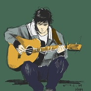

城市之光（旧版）2015 remix
============================

|  |  |
| :--: | :-- |
| [ 城市之光（旧版）2015 remix](https://emumo.xiami.com/album/220505994) | **艺人**: [冯佳界](../index.md) **语种**: 国语 **唱片公司**: 独立发行 **发行时间**: 2015年01月05日 **专辑类别**: EP, 单曲 **专辑风格**: 硬摇滚 Hard Rock, 城市民谣 Urban Folk **播放数**: 963308 **收藏数**: 156 **评论数**: 17  |

## 简介

——仇恨不会构筑你梦想的城市。  
它擅长的是毁灭，  
毁灭他人前先毁灭自身。 

## 曲目

## 评论

|  |  |  |  |
| :-- | :-- | :-- | :-- |
|  [虾米用户](https://emumo.xiami.com/u/4861933)  2017-03-01 10:18 赞(0) 踩(0) | 
很喜欢~
 |
|  [虾米用户](https://emumo.xiami.com/u/9364917) 不可以 我笑不起来了 2016-11-06 13:50 赞(0) 踩(0) | 
。
 |
|  [虾米用户](https://emumo.xiami.com/u/45385971)  2016-07-06 22:46 赞(0) 踩(0) | 
可以 不错
 |
|  [虾米用户](https://emumo.xiami.com/u/3166801)  2016-06-19 13:13 赞(0) 踩(0) | 
真好听，加油加油
 |
|  [虾米用户](https://emumo.xiami.com/u/13648891) 把声音乐起来，这就是音的... 2015-07-31 16:37 赞(0) 踩(0) | 
支持！好音乐。
 |
|  [虾米用户](https://emumo.xiami.com/u/1233071)  2015-07-26 14:48 赞(0) 踩(0) | 
剧情感很强，感觉很特别
 |
|  [虾米用户](https://emumo.xiami.com/u/5555127) im a realist 2015-07-21 07:09 赞(0) 踩(0) | 
我看了心理罪！牛逼了
 |
|  [虾米用户](https://emumo.xiami.com/u/5555127) im a realist 2015-07-21 07:09 赞(0) 踩(0) | 
我看了心理罪！牛逼了
 |
|  [虾米用户](https://emumo.xiami.com/u/5429478) 唯有音乐和亲情不可遗落！ 2015-03-16 10:07 赞(1) 踩(0) | 
有故事，又帅气，唱歌还好听
 |
| ⇒ |  [虾米用户](https://emumo.xiami.com/u/52756174)  2015-07-20 12:47 赞(0) 踩(0) | 
家里还会很好了老师
 |
|  [虾米用户](https://emumo.xiami.com/u/10742622) 以音乐，滋养灵魂 2015-02-17 00:11 赞(0) 踩(0) | 
有故事的音乐更耐人寻味，很喜欢。因为偶然听到暗河，所以关注，继续等候你更多的创作。
 |
|  [虾米用户](https://emumo.xiami.com/u/2227725)  2015-02-04 21:39 赞(0) 踩(0) | 
更加成熟
 |
|  [虾米用户](https://emumo.xiami.com/u/11763924) 抱着树的过活 2015-01-06 10:12 赞(1) 踩(0) | 
是给《心理罪》写的歌吗？
 |
| ⇒ |  [虾米用户](https://emumo.xiami.com/u/10017097) 创作严肃、艺术的民谣音乐... 2015-01-06 14:46 赞(0) 踩(0) | 
你好，部分灵感是来自《心理罪》。可以去听听我的另一首歌《暗河》，这个是纯给《心理罪》写的歌。
 |
|  [虾米用户](https://emumo.xiami.com/u/17330125) 想象音乐的另一种可能 2015-01-06 10:06 赞(1) 踩(0) | 
赞！
 |
| ⇒ |  [虾米用户](https://emumo.xiami.com/u/37678017) 无摇滚，不青春！ 2015-04-22 09:14 赞(0) 踩(0) | 
难得看到小编的官号评论啊。。。
 |
|  [虾米用户](https://emumo.xiami.com/u/1963119) 全然的倾听。 2015-01-06 09:34 赞(0) 踩(0) | 
ho  占座老冯~
 |
