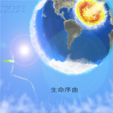

生命序曲
============================

|  |  |
| :--: | :-- |
| [ 生命序曲](https://emumo.xiami.com/album/5021948950) | **艺人**: [冯佳界](../index.md) **语种**: 国语 **唱片公司**: 众乐纪 **发行时间**: 2020年11月13日 **专辑类别**: EP, 单曲 **专辑风格**: 摇滚 Rock & Roll **播放数**: 250 **收藏数**: 2 **评论数**: 1  |

## 简介

冯佳界再次与张玄合作的歌曲，讲述地球生命史和难忘的、热爱科学探索的少年时光。张玄曾参与《暗河》《星空叙事曲》的词曲创作。本歌曲改编自张玄的作品《野花》《我们的夏天》和《彼岸》。以这首歌献给我始终热爱科学的朋友张玄和我们共同的少年时光，以四十亿年生生不息的历史讲述我们对生命的热爱。封面选自张玄少年时期的画《APOCALYPSE》。

## 曲目

## 评论

|  |  |  |
| :-- | :-- | :-- |
|  [虾米用户](https://emumo.xiami.com/u/40020210) 我喜欢新鲜的化学反应！ ... 2021-01-26 10:14 赞(0) 踩(0) | 
感谢你   并想给你足够的信心  在我心里全中国如你一样独立又好听的音乐人超不过十个   并感觉你这就是凭空独立   不依托别的文化或形式。希望你的编曲能越来越好   表达越来越清晰强烈。并真诚的想认识你  哈哈  v15010311648
 |
