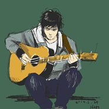
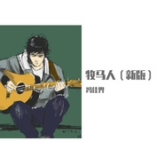
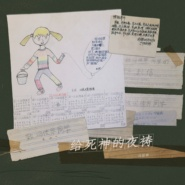
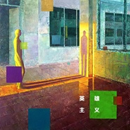
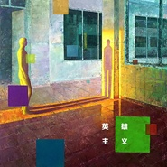
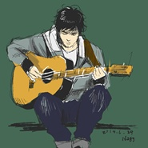

冯佳界
============================

|  |  |
| :--: | :-- |
| [ 冯佳界](https://i.xiami.com/westhill) | **播放数**: 10360019 **粉丝数**: 5604 **评论数**: 253 **地区**: China 中国大陆 **风格**: 城市民谣 Urban Folk  |

## 档案

网易云音乐：“冯佳界” 豆瓣小站：“冯佳界&西山” 微博：@冯佳界 工作联系：邮箱  fennuqingnian510@sina.com   冯佳界，中国第二帅的民谣歌手。 创作严肃、艺术的民谣音乐。 我在美国攻读博士学位，同时继续着我视若珍宝的音乐事业。这里有着安静的创作环境和优良的设备，但因为远离祖国，任何音乐上的耕耘都显得有些无力。毕竟，中国才是我的音乐所梦想的乐土。我会用心做每一首歌，让它有资格进入你的循环列表。希望国内的你们不要忘记我的音乐，关注我豆瓣小站或微博的动态。希望将来回国之后，能让你们听到每一首歌的现场版。 我的音乐是与众不同的。现在的或大众或小众的音乐，其题材都注重对人内心情感的反映，让人们在音乐中找到自我、宣泄情感，从而得到愉悦。这样的音乐中不乏优秀作品，有很多也是我所钟爱的。然而我并不满足于反映人们、甚至是我自己内心的情感。我的创作，是为了改变这个社会的一些事情，是希望听众们负担起一些沉重的东西。我的作品或许会让你觉得心灵深处有一丝不快，这是因为你在面对一些无法回避的问题，你的心灵负起了十字架。——我会坚持做让你心里难受的音乐。对于词曲、编曲和混音，我会不断创新和完善，但对于题材我永不妥协。    西山乐队： 北京独立民谣乐队，位于清华大学。 西山由冯佳界、李施、江一帆、郝逸洋四位热爱音乐和生活的大学生组成。乐队名称“西山”来自邻近清华的北京西山，清华大学校歌歌词开头即为“西山苍苍，东海茫茫…”，这个名字既反映我们的根据地所在，也透射着一种诚朴与厚重，正如我们对音乐的态度。西山以原创音乐为基础，坚守着自由而艺术的中国民谣风格。 西山组建于2011年4月。2013年7月，乐队的4名成员都大学毕业，各奔前程，不得不走向解散。虽然解散了，但我们在很多人心中留下了印记。  冯佳界 主唱/木吉他/词曲/编曲 我生于吉林长春，在北京长大。志愿为生命的幸福和地球的前途奉献终生。我热爱科学和艺术，希望用科学找到人类的出路，用艺术唤醒人们的心灵。 我喜欢音乐和文学，会弹民谣吉他和钢琴。音乐创作对我来说既是无法割舍的爱好，也是通往梦想的途径。我最喜欢中国的民谣音乐，以小娟&山谷里的居民、钟立风、周云蓬、万晓利、李志、麻油叶、张玮玮、刘东明、马条、老狼、陈升、雷光夏等为代表。我也喜欢中国的一些摇滚音乐，比如痛苦的信仰、谢天笑、GALA、许巍、崔健等。我也喜欢古典音乐，尤其喜欢贝多芬。中国的民谣，有的流氓、有的清新，有的民族、有的现代，有的是历史、有的在身边。虽然复杂，但真实。 清华大学生命科学学院2013届本科毕业生，前往美国俄克拉何马大学攻读微生物学博士。  李施 贝司/打击乐 吉林省吉林市人，生于音乐世家。从中学开始弹贝司，大学时加入校军乐队，开始学习打击乐，以爵士鼓为主。经冯佳界高中同学胡亦欣介绍，与冯佳界认识。 文艺青年，热爱爵士乐。外号“胖子”、“骚哥”，人缘极佳，和媳妇儿卢玮青都喜欢猫和兔子等萌物。 清华大学电机系2013届本科毕业生，前往河南国家电网工作。  江一帆 电子琴/钢琴/口风琴 江苏省海门市人。自幼学习钢琴，十级水平，大学加入校键盘队。是李施的室友，经李施介绍与冯佳界认识并加入乐队。 温文尔雅的单身文艺青年，外号“爷”、“爷爷”、“爸爸”、“爷逼”等。热爱音乐，喜欢民谣、爵士、古典等音乐风格。 清华大学电机系2013届本科毕业生，前往美国北卡罗来纳州立大学攻读电机相关专业硕士。  郝逸洋 长笛/木吉他 生于湖北省武汉市，在北京长大。自幼学习长笛，自学木吉他。是冯佳界的高中同学。 单身二逼青年。一向喜欢民谣、摇滚等音乐风格。 北京大学信息科学学院2013届本科毕业生，计算机天才，前往日本早稻田大学攻读计算机相关专业硕士。  张露萍 特邀女声 四川省乐山市人，现居深圳。将冯佳界引入民谣圈。 文艺女青年，艺名“偏头姑娘”，热爱中国民谣音乐。  卢玮青 平面设计 河南省郑州市人，自幼学习美术。李施的女朋友。曾负责西山“热爱生命”毕业民谣音乐会和西山专辑《我的恋人如此娴雅》的平面设计。 清华大学美术学院2010级本科生。  沈睿 经纪人/联络人 上海人，清华大学生命科学学院2013届本科毕业生，在清华大学攻读微生物学硕士。  姚龙 歌友/嘉宾 山东省青岛市人，清华大学计算机系在读博士生。喜爱民谣，经常和西山乐队登台互动。

## 专辑

| 名称 | 语种 | 唱片公司 | 发行时间 | 专辑类别 | 专辑风格 |
| :--: | :-- | :-- | :-- | :-- | :-- |
| [ 生命序曲](./albums/5021948950.md) | 国语 | 众乐纪 | 2020年11月13日 | EP, 单曲 | 摇滚 Rock & Roll |
| [ 临江仙·饮酒击节](./albums/5021467430.md) | 国语 | 众乐纪 | 2020年09月17日 | EP, 单曲 | 独立民谣 Indie Folk, 中国风 China-Wave |
| [ 牧马人（新版）](./albums/2106065093.md) | 国语 | 独立发行 | 2020年02月18日 | EP, 单曲 | 城市民谣 Urban Folk, 硬摇滚 Hard Rock |
| [ 给死神的夜祷](./albums/2105346137.md) | 国语 | 众乐纪 | 2019年10月22日 | EP, 单曲 |  |
| [ 冯佳界制作习作集](./albums/2104824196.md) | 国语 | 众乐纪 | 2019年04月28日 | EP, 单曲 |  |
| [ 众乐纪肆·光怪陆离](./albums/2104317515.md) | 国语 | 众乐纪 | 2018年12月04日 | 合集, 杂锦 |  |
| [ 湖妖英雄主义](./albums/2104160242.md) | 国语 | 众乐纪 | 2018年10月30日 | EP, 单曲 | 城市民谣 Urban Folk |
| [ 英雄主义城市之光](./albums/2103752116.md) | 国语 | 众乐纪 | 2018年06月19日 | 录音室专辑 | 城市民谣 Urban Folk, 硬摇滚 Hard Rock |
| [ 那些年 那些天](./albums/2103729869.md) | 国语 | 众乐纪 | 2018年06月04日 | EP, 单曲 | 民谣 Folk |
| [ 花田](./albums/2103712569.md) | 国语 | 众乐纪 | 2018年05月17日 | EP, 单曲 | 城市民谣 Urban Folk |
| [ 星空叙事曲](./albums/2100343758.md) | 国语 | 独立发行 | 2016年05月24日 | EP, 单曲 | 硬摇滚 Hard Rock, 城市民谣 Urban Folk |
| [ 水的欢歌](./albums/2100192334.md) | 国语 | 独立发行 | 2015年09月06日 | EP, 单曲 | 城市民谣 Urban Folk |
| [ 牧马人献给邹典](./albums/326781044.md) | 国语 | 独立发行 | 2015年03月19日 | EP, 单曲 | 城市民谣 Urban Folk |
| [ 城市之光（旧版）2015 remix](./albums/220505994.md) | 国语 | 独立发行 | 2015年01月05日 | EP, 单曲 | 硬摇滚 Hard Rock, 城市民谣 Urban Folk |
| [ 暗河收录于“耳廓音乐大巴士”第一站&众乐纪](./albums/1514994289.md) | 国语 | 冯佳界&西山 | 2014年11月03日 | EP, 单曲 |  |
| [ 你的名字](./albums/114631517.md) | 国语 | 独立发行 | 2014年05月12日 | EP, 单曲 | 新民谣 Neofolk |
| [ 残叶篇](./albums/1614632300.md) | 国语 | 独立发行 | 2014年01月14日 | EP, 单曲 | 新民谣 Neofolk |
| [ 我的恋人如此娴雅](./albums/1382563795.md) | 国语 | 众乐纪 | 2013年09月15日 | 录音室专辑 | 新民谣 Neofolk |

## 评论

|  |  |  |  |
| :-- | :-- | :-- | :-- |
|  [虾米用户](https://emumo.xiami.com/u/358104299) 悲观的唯心存在现实解构虚... 2021-01-05 13:23 赞(1) 踩(0) | 
45324
 |
|  [虾米用户](https://emumo.xiami.com/u/128718122)   2020-12-10 16:27 赞(0) 踩(0) | 
最近几年没什么新歌啊
 |
|  [虾米用户](https://emumo.xiami.com/u/270078007) 我见青山多妩媚，料青山见... 2020-11-01 00:09 赞(0) 踩(0) | 
很棒的歌手
 |
|  [虾米用户](https://emumo.xiami.com/u/407871475)  2020-09-14 18:16 赞(0) 踩(0) | 
据你所知谁比你帅
 |
|  [虾米用户](https://emumo.xiami.com/u/5686883) 我还没想好要写什么... 2020-06-15 20:14 赞(0) 踩(0) | 
才子终于出个人专辑了
 |
|  [虾米用户](https://emumo.xiami.com/u/318796748)  2020-05-27 07:58 赞(0) 踩(0) | 
歌词写的太好了，歌声也好听，曲调也动人。很快就能使人安静下来回忆往事。
 |
|  [虾米用户](https://emumo.xiami.com/u/430585824)  2019-12-12 23:11 赞(0) 踩(0) | 
大学刚毕业的那两年很喜欢你的牧马人。2019的末尾，又偶然遇到了这首刚听到就忍不住点了单曲循环的歌。再多的话，以后再说吧！总之，谢谢你。
 |
|  [虾米用户](https://emumo.xiami.com/u/429302343)  2019-10-19 21:21 赞(0) 踩(0) | 
一直以为金牛座只是贪钱的小可爱，没想到金牛座也非常感性有才华
 |
|  [虾米用户](https://emumo.xiami.com/u/39383116) 生活没有音乐，就是一个错... 2019-09-18 17:53 赞(0) 踩(0) | 
最怕才子唱民摇
 |
|  [虾米用户](https://emumo.xiami.com/u/345630071) 我还没想好要写什么... 2019-09-11 04:27 赞(0) 踩(0) | 
想去
 |
|  [虾米用户](https://emumo.xiami.com/u/11227384) 这个仙儿很懒，啥也没留下... 2019-06-09 19:00 赞(1) 踩(0) | 
来了，奶一口
 |
|  [虾米用户](https://emumo.xiami.com/u/277752139)  2019-04-22 22:02 赞(0) 踩(0) | 
感动
 |
|  [虾米用户](https://emumo.xiami.com/u/338642017) 驹： 2019-03-30 02:09 赞(0) 踩(0) | 
冯老师！
 |
|  [虾米用户](https://emumo.xiami.com/u/245095675)  2019-03-18 00:49 赞(0) 踩(0) | 

 |
|  [虾米用户](https://emumo.xiami.com/u/374246817) 有时间就来听歌。 2019-01-27 02:07 赞(0) 踩(0) | 
好听
 |
|  [虾米用户](https://emumo.xiami.com/u/356479693)  2019-01-12 22:50 赞(0) 踩(0) | 
第一次认识你居然是看你的小说
 |
|  [虾米用户](https://emumo.xiami.com/u/361496382)  2018-12-23 15:11 赞(0) 踩(0) | 
新歌在何处
 |
|  [虾米用户](https://emumo.xiami.com/u/192702637) 晚安 2018-10-20 03:52 赞(0) 踩(0) | 
加油＾０＾~
 |
|  [虾米用户](https://emumo.xiami.com/u/21376367) 最爱的是电音，其次才是其... 2018-08-13 12:26 赞(0) 踩(0) | 
才华横溢的音乐诗人
 |
|  [虾米用户](https://emumo.xiami.com/u/303506160) 因为我对你爱的深沉 2018-08-08 00:23 赞(2) 踩(0) | 
嘿呦
 |
|  [虾米用户](https://emumo.xiami.com/u/344267070)  2018-07-05 18:45 赞(2) 踩(0) | 
看了这个简介，我突然好想知道民谣第一帅是谁？赵雷吗？
 |
| ⇒ |  [虾米用户](https://emumo.xiami.com/u/21376367) 最爱的是电音，其次才是其... 2018-08-13 12:27 赞(0) 踩(0) | 
李健算吗
 |
| ⇒ |  [虾米用户](https://emumo.xiami.com/u/185461068)  2020-05-16 22:57 赞(0) 踩(0) | 
不管你心目中谁第一帅，他都要排第二。小心机 
 |
|  [虾米用户](https://emumo.xiami.com/u/1517680) 我还没想好要写什么... 2018-07-01 14:49 赞(1) 踩(0) | 
想看看7.8谁会去看live啊，有一起的吗
 |
|  [虾米用户](https://emumo.xiami.com/u/203259740)  2018-04-05 14:37 赞(0) 踩(0) | 
真的硬摇滚
 |
|  [虾米用户](https://emumo.xiami.com/u/32601486) fine 2018-03-20 20:53 赞(0) 踩(0) | 
男神啥时候发新歌啊  着急上火
 |
|  [虾米用户](https://emumo.xiami.com/u/258304964)  2018-02-12 22:21 赞(0) 踩(0) | 
好听!!!
 |
|  [虾米用户](https://emumo.xiami.com/u/1178913) 我还没想好要写什么... 2018-02-08 21:44 赞(1) 踩(0) | 
学长
 |
|  [虾米用户](https://emumo.xiami.com/u/34118847) 自我实现 2018-01-23 13:16 赞(0) 踩(0) | 
好音乐
 |
|  [虾米用户](https://emumo.xiami.com/u/13081575) 恩宠与内壮 2018-01-21 09:32 赞(1) 踩(0) | 
牧马人  单曲循环几十遍
 |
|  [虾米用户](https://emumo.xiami.com/u/161302414) 仗剑江湖梦已远 仙剑奇侠... 2018-01-16 10:26 赞(0) 踩(0) | 
最爱听你所以的歌，平时听最多是   水的欢歌
 |
|  [虾米用户](https://emumo.xiami.com/u/7199631)  2018-01-14 12:19 赞(0) 踩(0) | 
新歌何时有
 |
|  [虾米用户](https://emumo.xiami.com/u/7199631)  2018-01-14 12:18 赞(0) 踩(0) | 
啊啊啊啊啊啊啊啊啊
 |
|  [虾米用户](https://emumo.xiami.com/u/343423693)  2018-01-07 12:02 赞(0) 踩(0) | 
让我们思考的，有内涵不空洞，&amp;ldquo;可是谁又真想去呢&amp;rdquo;
 |
|  [虾米用户](https://emumo.xiami.com/u/8706509)  2018-01-03 23:45 赞(6) 踩(0) | 
真讨厌学霸干什么都那么出色！
 |
|  [虾米用户](https://emumo.xiami.com/u/1521265) 硬摇，流金，蓝摇，前卫金... 2017-12-18 09:29 赞(2) 踩(0) | 
什么鬼，为什么把这个歌手放在硬摇滚分类里&amp;hellip;&amp;hellip;
 |
|  [虾米用户](https://emumo.xiami.com/u/141027886) 在下还没想好要写什么… 2017-11-26 16:55 赞(4) 踩(0) | 
冯佳界，中国第二帅的民谣歌手。创作严肃、艺术的民谣音乐。闭嘴你个凑不要捻的
 |
| ⇒ |  [虾米用户](https://emumo.xiami.com/u/429302343)  2019-10-19 15:52 赞(0) 踩(0) | 
哈哈
 |
|  [虾米用户](https://emumo.xiami.com/u/309890917) 看过那么多心灵鸡汤，居然... 2017-11-25 19:17 赞(3) 踩(0) | 
歌呢  歌呢  出点歌啊  我用钱买你得歌
 |
|  [虾米用户](https://emumo.xiami.com/u/10527500) 有朋自远方来，不亦乐乎。 2017-10-27 23:49 赞(2) 踩(0) | 
最近才发现西山乐队！暗河和城市之光，真的很好听！
 |
|  [虾米用户](https://emumo.xiami.com/u/45334415) 文不能测字  武不能防身 2017-09-18 17:06 赞(0) 踩(0) | 
呦 关注后才知道你还是大刘粉
 |
|  [虾米用户](https://emumo.xiami.com/u/8837447)  2017-08-23 19:51 赞(0) 踩(0) | 
秋思很静，夏炎太火，西山佳界，带我走进民谣
 |
|  [虾米用户](https://emumo.xiami.com/u/50221277) 时光漫过红墙到处流淌…… 2017-08-02 23:34 赞(1) 踩(0) | 
最喜欢牧马人和水的欢歌，可惜了好久没有再这么耐听的歌出现了。
 |
|  [虾米用户](https://emumo.xiami.com/u/191370901)  2017-07-25 11:36 赞(6) 踩(0) | 
内容已删除
 |
| ⇒ |  [虾米用户](https://emumo.xiami.com/u/7404233) 风雪夜归人 2017-07-29 16:46 赞(0) 踩(0) | 
少年努力吧，未来是你的
 |
| ⇒ |  [虾米用户](https://emumo.xiami.com/u/191370901)  2017-07-29 17:00 赞(0) 踩(0) | 
<q><b>贝加少爷说：</b></q>
 |
| ⇒ |  [虾米用户](https://emumo.xiami.com/u/7404233) 风雪夜归人 2017-07-29 18:25 赞(0) 踩(0) | 
<q><b>Maudie说：</b></q>
 |
| ⇒ |  [虾米用户](https://emumo.xiami.com/u/191370901)  2017-07-29 20:08 赞(0) 踩(0) | 
<q><b>贝加少爷说：</b></q>
 |
| ⇒ |  [虾米用户](https://emumo.xiami.com/u/7404233) 风雪夜归人 2017-07-30 08:18 赞(0) 踩(0) | 
<q><b>Maudie说：</b></q>
 |
|  [虾米用户](https://emumo.xiami.com/u/29335352)  2017-07-18 20:21 赞(2) 踩(0) | 
我也是个沉默的年轻人，我也惨遭命运玩弄
 |
|  [虾米用户](https://emumo.xiami.com/u/278290129)  2017-06-26 21:14 赞(0) 踩(0) | 
好听
 |
|  [虾米用户](https://emumo.xiami.com/u/678232) 我们都诗化了眼前的世界。 2017-06-14 21:39 赞(0) 踩(0) | 
惊艳！文字，编曲，声音！
 |
|  [虾米用户](https://emumo.xiami.com/u/249820002)  2017-05-23 18:50 赞(0) 踩(0) | 
又来评论 
 |
|  [虾米用户](https://emumo.xiami.com/u/249820002)  2017-05-06 09:00 赞(0) 踩(0) | 
才子，男神 
 |
|  [虾米用户](https://emumo.xiami.com/u/249820002)  2017-05-06 08:59 赞(0) 踩(0) | 
喜欢你的歌，无法抗拒
 |
|  [虾米用户](https://emumo.xiami.com/u/291812088)  2017-04-27 16:09 赞(0) 踩(0) | 
加油
 |
|  [虾米用户](https://emumo.xiami.com/u/182939)  2017-04-25 23:29 赞(0) 踩(0) | 
既然佳界哥哥居然在虾米推书，反正出来混迟早是要卖的，我也厚颜无耻起个传送门&amp;mdash;&amp;mdash;这里有个好故事：<a href="https://read.douban.com/ebook/21964865/" target="_blank" rel="nofollow noreferrer noopener">https://read.douban.com/ebook/21964865/</a>
 |
|  [虾米用户](https://emumo.xiami.com/u/55109400)  2017-03-26 10:40 赞(0) 踩(0) | 
学霸的世界
 |
|  [虾米用户](https://emumo.xiami.com/u/50221277) 时光漫过红墙到处流淌…… 2017-02-26 19:55 赞(0) 踩(0) | 
你一定要火
 |
|  [虾米用户](https://emumo.xiami.com/u/9585973)  2017-02-17 20:35 赞(2) 踩(0) | 
刚开始听众乐纪的歌，最喜欢牧马人，很久没有开启过单曲循环模式了，连续听3天了，词曲，音乐，歌声，创作背景，很感人！天堂里没有车来车往，愿逝者安息！
 |
|  [虾米用户](https://emumo.xiami.com/u/41856456) 你要把你的脑子用在正事上 2017-02-10 10:57 赞(0) 踩(0) | 
喜欢歌，更喜欢故事
 |
|  [虾米用户](https://emumo.xiami.com/u/114340730) 你是白雪茫茫的路旁。 2016-12-16 16:51 赞(0) 踩(0) | 
温柔，亲切 ，舒服~
 |
|  [虾米用户](https://emumo.xiami.com/u/2152213)  2016-12-09 19:51 赞(1) 踩(0) | 
衬衫跟我爸同款→_→
 |
|  [虾米用户](https://emumo.xiami.com/u/5419635) 他之所以会飞，是因为他把... 2016-12-05 21:22 赞(0) 踩(0) | 
自信会给歌添彩
 |
|  [虾米用户](https://emumo.xiami.com/u/3496718) idle space 2016-11-28 23:21 赞(0) 踩(0) | 
好听舒服~~~~
 |
|  [虾米用户](https://emumo.xiami.com/u/3496718) idle space 2016-11-28 23:21 赞(0) 踩(0) | 
好听舒服~~~~
 |
|  [虾米用户](https://emumo.xiami.com/u/249820002)  2016-11-25 21:35 赞(1) 踩(0) | 
喜欢这个歌手
 |
|  [虾米用户](https://emumo.xiami.com/u/20287951) 摇滚滚不远 2016-10-31 23:41 赞(1) 踩(0) | 
简介是在逗我么，最帅的！诶
 |
| ⇒ |  [虾米用户](https://emumo.xiami.com/u/224303827)  2016-11-16 21:01 赞(0) 踩(0) | 
就是最帅啊 
 |
| ⇒ |  [虾米用户](https://emumo.xiami.com/u/249820002)  2016-11-25 21:34 赞(0) 踩(0) | 
挺帅嘛 
 |
|  [虾米用户](https://emumo.xiami.com/u/224303827)  2016-10-30 19:23 赞(0) 踩(0) | 

 |
|  [虾米用户](https://emumo.xiami.com/u/224303827)  2016-10-27 19:26 赞(0) 踩(0) | 
独特的音乐，令人难忘
 |
|  [虾米用户](https://emumo.xiami.com/u/1877171)  2016-10-23 22:11 赞(1) 踩(0) | 
很久没能听到让人热泪盈眶的歌了，谢谢，冯佳界！！
 |
|  [虾米用户](https://emumo.xiami.com/u/7854789)   2016-10-21 21:53 赞(1) 踩(0) | 
喜欢水的欢歌，浅唱中有坚定的力量。看了简介，同喜欢民谣、摇滚，可惜我没有创作的天赋、做个默默的欣赏者好了。坚持不易，希望能怀着初心走下去。
 |
|  [虾米用户](https://emumo.xiami.com/u/32329060)  2016-10-19 20:55 赞(1) 踩(0) | 
好像当年的郁冬
 |
|  [虾米用户](https://emumo.xiami.com/u/42521326) ! 2016-10-16 21:59 赞(2) 踩(0) | 
誰告訴我 硬搖滾是什麼鬼
 |
|  [虾米用户](https://emumo.xiami.com/u/224303827)  2016-10-03 11:40 赞(0) 踩(0) | 
帅帅帅 
 |
|  [虾米用户](https://emumo.xiami.com/u/224303827)  2016-09-27 21:35 赞(0) 踩(0) | 
好帅 
 |
|  [虾米用户](https://emumo.xiami.com/u/224303827)  2016-09-12 10:12 赞(0) 踩(0) | 

 |
|  [虾米用户](https://emumo.xiami.com/u/224303827)  2016-09-11 11:25 赞(0) 踩(0) | 
边读博边写歌，才子
 |
|  [虾米用户](https://emumo.xiami.com/u/73857918) 在黎明之前 2016-09-11 02:36 赞(0) 踩(0) | 
打开相册还以为是一堆IT男
 |
|  [虾米用户](https://emumo.xiami.com/u/224303827)  2016-09-10 22:02 赞(0) 踩(0) | 
能让人在闹市中安静下来
 |
|  [虾米用户](https://emumo.xiami.com/u/224303827)  2016-09-09 07:51 赞(0) 踩(0) | 
  
 |
|  [虾米用户](https://emumo.xiami.com/u/78064066)   2016-07-21 10:47 赞(0) 踩(0) | 
城市之光。期待新作品
 |
|  [虾米用户](https://emumo.xiami.com/u/13416134) 蝴蝶夫人。 2016-07-20 10:36 赞(0) 踩(0) | 
喜欢你的城市之光
 |
|  [虾米用户](https://emumo.xiami.com/u/77078138) 以乐读心，以心会友 2016-07-09 15:49 赞(0) 踩(0) | 
我来捣个乱
 |
|  [虾米用户](https://emumo.xiami.com/u/47836281) 别啰嗦 2016-06-18 22:59 赞(0) 踩(0) | 
是不是你
 |
|  [虾米用户](https://emumo.xiami.com/u/341810) 闷声听歌 2016-05-19 12:43 赞(1) 踩(0) | 
中国最帅的民谣歌手？exo me? @眼科
 |
| ⇒ |  [虾米用户](https://emumo.xiami.com/u/33846269)  2016-07-07 14:12 赞(0) 踩(0) | 
哈哈哈
 |
| ⇒ |  [虾米用户](https://emumo.xiami.com/u/42669242) music feeds 2016-07-08 10:41 赞(0) 踩(0) | 
哈哈，虾米有自己的审美观
 |
|  [虾米用户](https://emumo.xiami.com/u/54760384) 我们一起，造个天地 2016-05-16 21:02 赞(0) 踩(0) | 
嗯，需不需要一个写词的
 |
|  [虾米用户](https://emumo.xiami.com/u/39123038) 我我是中国男孩 我是沙壁... 2016-05-15 07:48 赞(0) 踩(0) | 
星空叙事曲为什么不在虾米啊？
 |
|  [虾米用户](https://emumo.xiami.com/u/30222856)  2016-04-30 10:09 赞(0) 踩(0) | 
不错，词曲都很优秀呀
 |
|  [虾米用户](https://emumo.xiami.com/u/48676479) 己所不欲勿施于人 2016-04-24 18:13 赞(1) 踩(0) | 
卧槽，刚在网页上看到中国最帅的民谣歌手特地去找照片，我失望了
 |
| ⇒ |  [虾米用户](https://emumo.xiami.com/u/52220672) 嘘，星星在唱歌呢 2016-09-26 07:23 赞(0) 踩(0) | 
一部分人不是帅在脸上哈哈
 |
|  [虾米用户](https://emumo.xiami.com/u/54957441)  2016-04-21 13:43 赞(0) 踩(0) | 
音乐是需要底蕴及品德的沉淀
 |
|  [虾米用户](https://emumo.xiami.com/u/8943891) 你咋那么可爱？ 2016-04-03 12:05 赞(0) 踩(0) | 
I
 |
|  [虾米用户](https://emumo.xiami.com/u/13926147)  2016-02-16 10:43 赞(0) 踩(0) | 
04
 |
|  [虾米用户](https://emumo.xiami.com/u/11167930)  2016-02-14 03:37 赞(2) 踩(0) | 
吉他主副节奏过于单薄，鼓手是编排的鼓机。没有贝斯低蘋感觉。是伪民谣还是伪摇滚
 |
|  [虾米用户](https://emumo.xiami.com/u/11167930)  2016-02-14 03:32 赞(1) 踩(0) | 
虚华无实，歌词辞藻的骨感，像个无病呻吟的孩子。校园的青春，社会的沧桑。乐队主唱不不符实际的低叹如同大出血之后婴儿的哭啼。
 |
| ⇒ |  [虾米用户](https://emumo.xiami.com/u/80317874) 周山起铁塔怒海落白城 2016-05-08 02:23 赞(0) 踩(0) | 
大触这么厉害？在哪家公司高就啊？
 |
| ⇒ |  [虾米用户](https://emumo.xiami.com/u/260892571) 这家伙很帅什么也没留下.... 2018-01-03 18:54 赞(0) 踩(0) | 
清华大学生命科学院美国攻读博士，人生履历就已经很辉煌了，音乐只是他的爱好，4✘4的评论太苛刻，况且他说的狗屁不是
 |
| ⇒ |  [虾米用户](https://emumo.xiami.com/u/39123038) 我我是中国男孩 我是沙壁... 2019-01-08 04:27 赞(0) 踩(0) | 
你在说些什么
 |
|  [虾米用户](https://emumo.xiami.com/u/112317998) 风生水起 正是月落时 2016-02-10 00:17 赞(0) 踩(0) | 
[文字cool][文字cool]
 |
|  [虾米用户](https://emumo.xiami.com/u/9047731) 失责亏恩 度时虚浮 意志... 2016-02-02 20:25 赞(2) 踩(0) | 
虾米你再给我推类似这玩意我卸载你。
 |
|  [虾米用户](https://emumo.xiami.com/u/104739572) 贞子晒太阳，小脚配西服。 2016-01-30 10:04 赞(0) 踩(0) | 
酒酿民谣，配请回答1988。
 |
|  [虾米用户](https://emumo.xiami.com/u/6034251)  2016-01-27 23:10 赞(0) 踩(0) | 
乱串到了这里，挺好的，关注
 |
|  [虾米用户](https://emumo.xiami.com/u/7971186)  2016-01-13 12:46 赞(0) 踩(0) | 
很喜欢
 |
|  [虾米用户](https://emumo.xiami.com/u/40020210) 我喜欢新鲜的化学反应！ ... 2016-01-12 17:59 赞(0) 踩(0) | 
看着你变你牛逼
 |
|  [虾米用户](https://emumo.xiami.com/u/47711130) 让她降落。 2016-01-08 23:09 赞(2) 踩(0) | 
看乐队成员介绍看的我 
 |
|  [虾米用户](https://emumo.xiami.com/u/33078523) 我还没想好要写什么... 2015-12-27 11:59 赞(1) 踩(0) | 
谢谢你们的歌 兼顾学业不忘祖国草莽大地上等着你们的一双双耳 暗河果然是停不下来 也许人生还有很多时候 就是游走于清醒与迷醉之间 界限从未清楚 唯有指望思维能分是非 祝团队的所有人顺利
 |
|  [虾米用户](https://emumo.xiami.com/u/2227725)  2015-12-19 22:11 赞(0) 踩(0) | 
新歌太少了
 |
|  [虾米用户](https://emumo.xiami.com/u/4957902)   2015-12-18 13:08 赞(0) 踩(0) | 
介绍第一句“中国最帅的民谣歌手”，于是迫不及待点开相册。
 |
|  [虾米用户](https://emumo.xiami.com/u/51613823)   2015-12-14 10:40 赞(0) 踩(0) | 
这么好的作品 不知道为什么看到没有多少人发现心里有些窃喜。看了一下资料发现都是很厉害的人
 |
|  [虾米用户](https://emumo.xiami.com/u/26033632) 一个纯粹的理想主义者～ 2015-12-10 08:10 赞(0) 踩(0) | 
加油！希望出更多好作品，有一个小小的建议 总感觉你的伴奏有点声音偏大(个人感觉，不喜勿喷)
 |
|  [虾米用户](https://emumo.xiami.com/u/89867792)  2015-12-09 02:17 赞(2) 踩(0) | 
暗河和城市之光该不会是心理罪吧
 |
| ⇒ |  [虾米用户](https://emumo.xiami.com/u/33078523) 我还没想好要写什么... 2015-12-28 01:39 赞(0) 踩(0) | 
暗河就是心理罪
 |
|  [虾米用户](https://emumo.xiami.com/u/15166129) 吟罢低眉无写处，月光如水... 2015-11-30 15:28 赞(0) 踩(0) | 
求牧马人和水的欢歌的吉他谱！
 |
|  [虾米用户](https://emumo.xiami.com/u/43742353) 电影和音乐是我的爱与慈悲... 2015-11-13 14:11 赞(0) 踩(0) | 
声音！声音好听。
 |
|  [虾米用户](https://emumo.xiami.com/u/29718558) 我还没想好要写什么... 2015-11-08 12:57 赞(0) 踩(0) | 
正在循环 暗河
 |
|  [虾米用户](https://emumo.xiami.com/u/7860205) Chic is bori... 2015-10-30 00:15 赞(1) 踩(0) | 
每次删歌都不会删去的歌。
 |
|  [虾米用户](https://emumo.xiami.com/u/7860205) Chic is bori... 2015-10-30 00:14 赞(0) 踩(0) | 
等你的新歌。 
 |
|  [虾米用户](https://emumo.xiami.com/u/37950358) 抗忙~北鼻！！巴扎黑~~ 2015-10-19 14:04 赞(19) 踩(0) | 
问！冯佳界和陈鸿宇的区别
 |
| ⇒ |  [虾米用户](https://emumo.xiami.com/u/279155983)  2018-01-15 14:04 赞(0) 踩(0) | 
浪漫与现实，李白与杜莆
 |
| ⇒ |  [虾米用户](https://emumo.xiami.com/u/279155983)  2018-01-15 14:06 赞(0) 踩(0) | 
陈鸿宇李白
 |
| ⇒ |  [虾米用户](https://emumo.xiami.com/u/9709849) 这个人非常聪明，他什么也... 2018-06-04 16:25 赞(0) 踩(0) | 
暗河和理想三旬的区别。
 |
| ⇒ |  [虾米用户](https://emumo.xiami.com/u/338642017) 驹： 2019-03-30 02:13 赞(0) 踩(0) | 
你听听旧版城市之光！你就知道区别在哪里了！
 |
| ⇒ |  [虾米用户](https://emumo.xiami.com/u/328828070) 好多多云 2019-08-28 20:41 赞(0) 踩(0) | 
陈越来越厌恶，冯越来越安心
 |
|  [虾米用户](https://emumo.xiami.com/u/39960196) 不可为而为之 2015-09-28 21:33 赞(0) 踩(0) | 
挺你
 |
|  [虾米用户](https://emumo.xiami.com/u/39960196) 不可为而为之 2015-09-28 21:31 赞(2) 踩(0) | 
天降大任于斯人也，必先苦其心志，劳其筋骨，饿其体肤，空乏其身，行指乱其所为，所以动心忍性，曾益其所不能。 然后知生于忧患难与共，而死于安乐也
 |
|  [虾米用户](https://emumo.xiami.com/u/14050394)  2015-09-07 21:56 赞(0) 踩(0) | 

 |
|  [虾米用户](https://emumo.xiami.com/u/54421173)   2015-09-01 16:07 赞(1) 踩(0) | 
小麻博士和你很像，他操刀治病救人，也用音乐治愈人心。
 |
|  [虾米用户](https://emumo.xiami.com/u/54421173)   2015-09-01 16:07 赞(0) 踩(0) | 
小麻博士和你很像，他操刀治病救人，也用音乐治愈人心。
 |
|  [虾米用户](https://emumo.xiami.com/u/48894873) 卮言春天，破碎秋千 ，踟... 2015-08-19 18:36 赞(0) 踩(0) | 
很棒的乐队！
 |
|  [虾米用户](https://emumo.xiami.com/u/10405588) 听一首歌享一种生活 2015-08-04 22:46 赞(4) 踩(0) | 
我说听暗河为何会根本停不下来，作为一个心理罪迷，点进主页一首一首往下听，于是只能无限循环。时下试听一百首流行乐都找不到半首钟意的，很幸运中国还有独立音乐人，还在絮絮讲述音乐的故事。
 |
|  [虾米用户](https://emumo.xiami.com/u/7252584) 新的梦想 2015-08-01 00:06 赞(1) 踩(0) | 
看看这个阵容背景，只能说，你们牛逼
 |
|  [虾米用户](https://emumo.xiami.com/u/36714527)  2015-07-31 20:36 赞(1) 踩(0) | 
现在还没有从你回我私信的激动中缓过神来。。想来想去我觉得你一定是看上我的颜和智商了   
 |
|  [虾米用户](https://emumo.xiami.com/u/9387877)  2015-07-28 08:28 赞(0) 踩(0) | 
黄磊？！
 |
|  [虾米用户](https://emumo.xiami.com/u/1985058) 及时行乐 2015-07-04 00:11 赞(1) 踩(0) | 
可惜不在天津 还要加班
 |
|  [虾米用户](https://emumo.xiami.com/u/48442939) 自由和爱 酒鬼与诗 2015-06-25 00:57 赞(1) 踩(0) | 
什么时候来新疆  鸟市等你 
 |
|  [虾米用户](https://emumo.xiami.com/u/8136438)   2015-06-17 23:30 赞(1) 踩(0) | 
很喜欢暗河，话说会来深圳这边么
 |
|  [虾米用户](https://emumo.xiami.com/u/20316094)  2015-06-14 17:31 赞(1) 踩(0) | 
新人报道
 |
|  [虾米用户](https://emumo.xiami.com/u/5161648) 没错我就是很聪明什么也没... 2015-06-06 16:04 赞(3) 踩(0) | 
莫名的想到物理老师…越想越害怕
 |
| ⇒ |  [虾米用户](https://emumo.xiami.com/u/583786)  2015-06-15 01:08 赞(0) 踩(0) | 
哈哈哈哈哈哈哈
 |
|  [虾米用户](https://emumo.xiami.com/u/8471355) 风是大地的灵魂 2015-05-26 21:35 赞(2) 踩(0) | 
档案充斥着工科男的气息，歌却那么艺术，佩服
 |
|  [虾米用户](https://emumo.xiami.com/u/48070722) 我还没想好要写什么... 2015-05-26 13:46 赞(2) 踩(0) | 
看了下 歌手档案 你们乐队的人都好厉害！
 |
|  [虾米用户](https://emumo.xiami.com/u/1903574) 抛弃自由，笼中的你和我。 2015-05-14 23:02 赞(2) 踩(0) | 
清华的歌手都是怪物吗
 |
|  [虾米用户](https://emumo.xiami.com/u/42818548) 你是流着泪的巧克力 2015-05-10 00:00 赞(1) 踩(0) | 
冯博士一级棒
 |
|  [虾米用户](https://emumo.xiami.com/u/34212812)  2015-05-07 00:30 赞(1) 踩(0) | 
有特色，好听
 |
|  [虾米用户](https://emumo.xiami.com/u/12319515)  2015-05-06 16:59 赞(2) 踩(0) | 
看到中国最帅的民谣歌手，我去百度了。长得……但是你如果问我服不服。我说我服，因为你有才所以可以任性。。
 |
| ⇒ |  [虾米用户](https://emumo.xiami.com/u/5429478) 唯有音乐和亲情不可遗落！ 2015-05-07 15:05 赞(0) 踩(0) | 
哈哈哈。说的真好。。长得......你写出来，他才可以更帅一些。
 |
|  [虾米用户](https://emumo.xiami.com/u/33106043) 愿闻其详 2015-05-03 14:40 赞(0) 踩(0) | 
只要你一直坚持下去，一定会有越来越多的人肯定你的
 |
|  [虾米用户](https://emumo.xiami.com/u/42338233) :) 2015-04-28 10:25 赞(0) 踩(0) | 
外豆瓣活捉一只，哈哈哈
 |
|  [虾米用户](https://emumo.xiami.com/u/34952260)  2015-04-28 00:18 赞(0) 踩(0) | 
第一次听暗河就瞬间爱上了，很有触动，百听不厌好喜欢。期待你能在民谣的路上一直走下去，作出更棒的音乐，看好你哦  
 |
|  [虾米用户](https://emumo.xiami.com/u/25058024) 有求皆苦 百忍则安 2015-04-21 12:47 赞(0) 踩(0) | 
词写的真好啊
 |
|  [虾米用户](https://emumo.xiami.com/u/37177040) 暂无签名~ 2015-04-19 00:27 赞(0) 踩(0) | 
正在循环《牧马人》
 |
|  [虾米用户](https://emumo.xiami.com/u/583786)  2015-04-16 19:12 赞(3) 踩(0) | 
仅凭暗河一首就有资格去瓜分中国民谣的疆土了。
 |
|  [虾米用户](https://emumo.xiami.com/u/3853286)  2015-04-16 15:14 赞(1) 踩(0) | 
能在这找的知音真是三生有幸
 |
| ⇒ |  [虾米用户](https://emumo.xiami.com/u/2278753) 浩瀚，渺小 2015-09-10 18:10 赞(0) 踩(0) | 
严重同意！
 |
|  [虾米用户](https://emumo.xiami.com/u/583786)  2015-04-16 01:08 赞(1) 踩(0) | 
哥，没想到你是学霸。 
 |
|  [虾米用户](https://emumo.xiami.com/u/3792061)  2015-04-14 14:32 赞(2) 踩(0) | 
特别喜欢～因为冯佳界看了雷米的五本小说～都是我的菜 
 |
| ⇒ |  [虾米用户](https://emumo.xiami.com/u/13129660)   2015-04-29 07:27 赞(0) 踩(0) | 
哈哈，书还在吗？能否交换看
 |
| ⇒ |  [虾米用户](https://emumo.xiami.com/u/8337431) 以乐会友 2015-07-14 04:35 赞(0) 踩(0) | 
无本小说？：0
 |
|  [虾米用户](https://emumo.xiami.com/u/9437426) 世间所有的相遇都是久别重 2015-04-13 20:33 赞(0) 踩(0) | 
真不错！先听了《牧马人》后听了《城市之光》毫不犹豫点了关注和收藏。发现宝贝了哦，好歌手好乐队好音乐人。乐器，伴奏都是低调的奢华啊，相当整齐的感觉，很赞！细细听越听越喜欢。 
 |
|  [虾米用户](https://emumo.xiami.com/u/44674302)   2015-04-13 20:15 赞(0) 踩(0) | 
传说中最帅的民谣歌手
 |
|  [虾米用户](https://emumo.xiami.com/u/43038351)   2015-04-07 00:48 赞(0) 踩(0) | 
你的声音真是太有味道了，喜欢你啊！我是你微博上的粉。喜欢你的歌。
 |
|  [虾米用户](https://emumo.xiami.com/u/16852456) 理想是御用配乐师(/ω＼... 2015-04-05 10:57 赞(0) 踩(0) | 
方木？
 |
| ⇒ |  [虾米用户](https://emumo.xiami.com/u/10017097) 创作严肃、艺术的民谣音乐... 2015-04-05 11:49 赞(0) 踩(0) | 
嗯？
 |
| ⇒ |  [虾米用户](https://emumo.xiami.com/u/16852456) 理想是御用配乐师(/ω＼... 2015-04-05 12:16 赞(0) 踩(0) | 
<q><b>冯佳界说：</b></q>
 |
| ⇒ |  [虾米用户](https://emumo.xiami.com/u/10017097) 创作严肃、艺术的民谣音乐... 2015-04-06 12:38 赞(0) 踩(0) | 
<q><b>过说：</b></q>
 |
| ⇒ |  [虾米用户](https://emumo.xiami.com/u/16852456) 理想是御用配乐师(/ω＼... 2015-04-06 16:33 赞(0) 踩(0) | 
<q><b>冯佳界说：</b></q>
 |
| ⇒ |  [虾米用户](https://emumo.xiami.com/u/10017097) 创作严肃、艺术的民谣音乐... 2015-04-09 04:42 赞(0) 踩(0) | 
<q><b>过说：</b></q>
 |
| ⇒ |  [虾米用户](https://emumo.xiami.com/u/16852456) 理想是御用配乐师(/ω＼... 2015-04-09 09:39 赞(0) 踩(0) | 
<q><b>冯佳界说：</b></q>
 |
| ⇒ |  [虾米用户](https://emumo.xiami.com/u/41730014)   2015-04-19 23:44 赞(0) 踩(0) | 
<q><b>冯佳界说：</b></q>
 |
|  [虾米用户](https://emumo.xiami.com/u/7860205) Chic is bori... 2015-04-04 22:45 赞(0) 踩(0) | 
很棒
 |
|  [虾米用户](https://emumo.xiami.com/u/46252284)  2015-04-04 16:40 赞(0) 踩(0) | 
这条道路是命运的赠礼还是你内心的指引呢
 |
|  [虾米用户](https://emumo.xiami.com/u/47670815) 喜欢猪猪 2015-04-04 01:21 赞(0) 踩(0) | 
好喜欢，会一直支持
 |
|  [虾米用户](https://emumo.xiami.com/u/46649532)   2015-04-03 11:02 赞(0) 踩(0) | 
好棒！
 |
|  [虾米用户](https://emumo.xiami.com/u/13423489) 谁都别来安慰拥抱 2015-03-31 13:44 赞(0) 踩(0) | 
专辑封面可以更生动一点吗
 |
|  [虾米用户](https://emumo.xiami.com/u/13415698) 纵你疾风骤雨，我仍静立 2015-03-31 09:21 赞(0) 踩(0) | 
你好，男神，跟你听歌后，你残忍的把我和<a href="http://emumo.xiami.com/u/15340567" target="_blank" rel="nofollow" name_card="15340567">@Tisky-天</a> 拒在播间之外。你是不是要出来解释一下。
 |
|  [虾米用户](https://emumo.xiami.com/u/2427798) 怎么大风越狠，我心越荡。 2015-03-30 20:55 赞(1) 踩(0) | 
哈哈哈哈，跟着娜娜的脚步，我上次听暗河，我回家路上本来要走很长很长路，结果这首歌让我觉得这条路好短。
 |
| ⇒ |  [虾米用户](https://emumo.xiami.com/u/46238054) 时光还在，你还在。 2015-03-31 03:10 赞(0) 踩(0) | 
你也来
 |
| ⇒ |  [虾米用户](https://emumo.xiami.com/u/2427798) 怎么大风越狠，我心越荡。 2015-03-31 07:07 赞(0) 踩(0) | 
<q><b>Seon说：</b></q>
 |
| ⇒ |  [虾米用户](https://emumo.xiami.com/u/46238054) 时光还在，你还在。 2015-03-31 17:55 赞(0) 踩(0) | 
<q><b>安玥冉。说：</b></q>
 |
| ⇒ |  [虾米用户](https://emumo.xiami.com/u/2427798) 怎么大风越狠，我心越荡。 2015-03-31 17:57 赞(0) 踩(0) | 
<q><b>Seon说：</b></q>
 |
| ⇒ |  [虾米用户](https://emumo.xiami.com/u/46238054) 时光还在，你还在。 2015-03-31 17:57 赞(0) 踩(0) | 
<q><b>安玥冉。说：</b></q>
 |
|  [虾米用户](https://emumo.xiami.com/u/13393544) 越努力，越幸运。 2015-03-30 15:55 赞(1) 踩(0) | 
你好！很高兴看到你！中国最帅的民谣歌手！！我是冲着这个帅字来的！！你敢回复我吗！
 |
| ⇒ |  [虾米用户](https://emumo.xiami.com/u/46238054) 时光还在，你还在。 2015-03-30 18:00 赞(0) 踩(0) | 
你好。很高兴认识你。
 |
| ⇒ |  [虾米用户](https://emumo.xiami.com/u/13393544) 越努力，越幸运。 2015-04-01 15:53 赞(0) 踩(0) | 
<q><b>Seon说：</b></q>
 |
| ⇒ |  [虾米用户](https://emumo.xiami.com/u/46238054) 时光还在，你还在。 2015-04-08 07:14 赞(0) 踩(0) | 
<q><b>安简晴说：</b></q>
 |
| ⇒ |  [虾米用户](https://emumo.xiami.com/u/5429478) 唯有音乐和亲情不可遗落！ 2015-04-10 13:29 赞(0) 踩(0) | 
<q><b>Seon说：</b></q>
 |
|  [虾米用户](https://emumo.xiami.com/u/4415618)  2015-03-28 20:10 赞(0) 踩(0) | 
看到了你发到豆油，现在才来得及喜欢
 |
|  [虾米用户](https://emumo.xiami.com/u/12482701) 向着软萌之路进发（好像没... 2015-03-28 19:35 赞(0) 踩(0) | 
有郝云的感觉，很棒
 |
|  [虾米用户](https://emumo.xiami.com/u/4101035) 临渊羡鱼不如退而结网…… 2015-03-23 22:38 赞(0) 踩(0) | 
喜欢这种调调
 |
|  [虾米用户](https://emumo.xiami.com/u/44391730) 暂无签名~ 2015-03-23 20:27 赞(0) 踩(0) | 
豆瓣见过你 你给我发过豆油 万青贴吧又看到你 现在又看到你！！哈哈哈加油
 |
|  [虾米用户](https://emumo.xiami.com/u/1175342) 南瓜不说话，只默默生长着 2015-03-22 16:55 赞(0) 踩(0) | 
那首暗河唱得太动人
 |
|  [虾米用户](https://emumo.xiami.com/u/48383841)  2015-03-22 13:20 赞(0) 踩(0) | 
有内涵，有可读性。
 |
|  [虾米用户](https://emumo.xiami.com/u/610315)  2015-03-22 11:01 赞(0) 踩(0) | 
怎么办，他比我还小一岁，但是唱歌这么有味道
 |
|  [虾米用户](https://emumo.xiami.com/u/15340567) 这家伙很聪明什么也没留下... 2015-03-22 10:46 赞(3) 踩(0) | 
这是个奢侈的年代，难得的好音乐便是这份奢侈由来之一。我爱杂乱地堆叠歌曲，然后做着事，慢慢让它流淌，而唯有好歌能让我驻足欣赏。《飞翔的代价》吉他精致，配上浑厚声音的吟唱，清新却充满陈年的沧桑，并不华丽的歌词，却更能表达离家的惆怅。
 |
|  [虾米用户](https://emumo.xiami.com/u/47082683) 一首歌，几个故事？ 2015-03-22 09:48 赞(0) 踩(0) | 
浩然于寒风肆虐    任冰雪挂流
 |
|  [虾米用户](https://emumo.xiami.com/u/1274422)  2015-03-22 09:46 赞(0) 踩(0) | 
希望能够一直以这种态度坚持下去，有你该有的样子。
 |
|  [虾米用户](https://emumo.xiami.com/u/1274422)  2015-03-22 09:44 赞(0) 踩(0) | 
沧沧的声调，严谨的态度，喜欢。加油。
 |
|  [虾米用户](https://emumo.xiami.com/u/10527500) 有朋自远方来，不亦乐乎。 2015-03-22 09:38 赞(1) 踩(0) | 
仇人的女儿温柔地微笑着吹落我满身的灰吹落我手中的刀锋和啤酒我只能在她期待的目光里撕掉那虚伪的疤独自面对满地白雪从未如此地渴望着一个温暖的怀抱我知道有人在哭着看我一路向前走经历过什么样的故事才写出这样的歌词？
 |
|  [虾米用户](https://emumo.xiami.com/u/16456870) we live in a... 2015-03-22 09:29 赞(0) 踩(0) | 
你们什么时候出专辑 我就去买
 |
|  [虾米用户](https://emumo.xiami.com/u/13423489) 谁都别来安慰拥抱 2015-03-20 15:38 赞(3) 踩(0) | 
天蓝。凉水。鲜红色。清香。未接来电。300毫升。黑色毛衣。白云。真巧。发卡。远山。笔记本。还有你的歌声。
 |
|  [虾米用户](https://emumo.xiami.com/u/13387014) 音乐只是态度而非娱乐 2015-03-20 15:31 赞(0) 踩(0) | 
不错，不错，小伙真心不错
 |
|  [虾米用户](https://emumo.xiami.com/u/13423870) 对了，我还会哭 2015-03-20 14:59 赞(17) 踩(0) | 
歌声响起，偶尔，还是会想起沉寂了的旧事和旧人，而我却固执的不再去联系。听歌声，声声醉心
 |
|  [虾米用户](https://emumo.xiami.com/u/12720654)  2015-03-20 14:47 赞(0) 踩(0) | 
最帅民谣歌手？，呵呵 无图无真相。
 |
|  [虾米用户](https://emumo.xiami.com/u/1274422)  2015-03-19 10:15 赞(0) 踩(0) | 
水木
 |
|  [虾米用户](https://emumo.xiami.com/u/5429478) 唯有音乐和亲情不可遗落！ 2015-03-17 15:15 赞(140) 踩(0) | 
文字是神采，音乐是表情。你的声音让我着了迷。一直到现在，听了无数次，听到自己会唱，可是却写不出一句话来形容我对歌曲的感受，这算不算一个合格的粉丝？
 |
| ⇒ |  [虾米用户](https://emumo.xiami.com/u/13423870) 对了，我还会哭 2015-03-20 15:00 赞(0) 踩(0) | 
算。
 |
| ⇒ |  [虾米用户](https://emumo.xiami.com/u/13387014) 音乐只是态度而非娱乐 2015-03-20 15:31 赞(0) 踩(0) | 
合格
 |
| ⇒ |  [虾米用户](https://emumo.xiami.com/u/13423489) 谁都别来安慰拥抱 2015-03-20 15:38 赞(0) 踩(0) | 
合格
 |
| ⇒ |  [虾米用户](https://emumo.xiami.com/u/5811616) 让世界是世界 2015-04-06 17:51 赞(0) 踩(0) | 
这。。。。铁杆的啊
 |
| ⇒ |  [虾米用户](https://emumo.xiami.com/u/5429478) 唯有音乐和亲情不可遗落！ 2015-04-06 17:53 赞(0) 踩(0) | 
<q><b>calvin说：</b></q>
 |
| ⇒ |  [虾米用户](https://emumo.xiami.com/u/1128559)  2015-06-19 22:11 赞(0) 踩(0) | 
感谢你，带我来到了这里，哈哈 
 |
| ⇒ |  [虾米用户](https://emumo.xiami.com/u/75743564) 来一杯咖啡，来一段音乐，... 2016-11-10 09:50 赞(0) 踩(0) | 
跟我同名同姓
 |
|  [虾米用户](https://emumo.xiami.com/u/14011350)  2015-02-24 16:12 赞(0) 踩(0) | 
很好听，加油！！！
 |
|  [虾米用户](https://emumo.xiami.com/u/39667223)  2015-02-16 14:24 赞(0) 踩(0) | 
挺好的，加油！
 |
|  [虾米用户](https://emumo.xiami.com/u/1634060) 。 2015-02-15 13:13 赞(0) 踩(0) | 
在介绍里面看到了熟悉的名字！！惊！！！
 |
|  [虾米用户](https://emumo.xiami.com/u/5429478) 唯有音乐和亲情不可遗落！ 2015-02-08 18:43 赞(107) 踩(0) | 
才子的心境果然是我们这等普通听众所无法比拟的，所以才能用这般美妙的音乐对我们浅唱诉说。感谢你，让喧闹的世界变得安静，让繁杂的心情变得简单，也让这嗓音这旋律，深深记在了我的脑海。念你仿若无处不在，莫名。来自iPhone客户端
 |
| ⇒ |  [虾米用户](https://emumo.xiami.com/u/13423870) 对了，我还会哭 2015-03-20 14:59 赞(0) 踩(0) | 
谢谢安娜推荐这么好听的歌
 |
| ⇒ |  [虾米用户](https://emumo.xiami.com/u/224303827)  2016-10-27 19:27 赞(0) 踩(0) | 
你也是个音乐才女啊 
 |
|  [虾米用户](https://emumo.xiami.com/u/18400408) 嗯 梦幻的乐队 2015-01-28 14:20 赞(1) 踩(0) | 
过来点个赞
 |
|  [虾米用户](https://emumo.xiami.com/u/43630561) 愿陪你一起颠沛流离 2015-01-25 13:56 赞(0) 踩(0) | 
无意中听到城市之光，很棒！
 |
|  [虾米用户](https://emumo.xiami.com/u/13149768)  2014-12-21 21:41 赞(0) 踩(0) | 
喜欢
 |
|  [虾米用户](https://emumo.xiami.com/u/37908394) 暂无签名~ 2014-12-17 01:55 赞(0) 踩(0) | 
给冯佳界点个赞
 |
|  [虾米用户](https://emumo.xiami.com/u/44928623)  2014-12-16 01:42 赞(0) 踩(0) | 
从国摇吧来的
 |
|  [虾米用户](https://emumo.xiami.com/u/1242629) 来吧来吧来吧来吧嘀嘀嘀嗒 2014-12-13 21:10 赞(0) 踩(0) | 
从豆瓣来～点个赞
 |
|  [虾米用户](https://emumo.xiami.com/u/36794563)  2014-12-09 12:50 赞(0) 踩(0) | 
豆瓣，雷子，这里，还不错。
 |
|  [虾米用户](https://emumo.xiami.com/u/38972323) 我的灵魂是一朵散发着特别... 2014-12-08 14:14 赞(0) 踩(0) | 
大伙儿都是从豆瓣被勾搭过来的么 哈 试听了下不错 会关注的
 |
|  [虾米用户](https://emumo.xiami.com/u/43839528)  2014-11-30 18:38 赞(0) 踩(0) | 
不错会关注的
 |
|  [虾米用户](https://emumo.xiami.com/u/17857219) 我还没想好要写什么... 2014-11-27 14:02 赞(0) 踩(0) | 
收到豆油后过来的
 |
|  [虾米用户](https://emumo.xiami.com/u/11639180) 因为听音乐不需要动脑 2014-11-27 01:05 赞(0) 踩(0) | 
看到底下说有的从豆瓣过来的你好我是从月亮组过来的歌很好听：）
 |
|  [虾米用户](https://emumo.xiami.com/u/1332576)  2014-11-25 11:05 赞(0) 踩(0) | 
好听！词和曲都很棒，快巡演快巡演
 |
|  [虾米用户](https://emumo.xiami.com/u/40979051)   2014-11-22 15:33 赞(0) 踩(0) | 
我是从豆瓣过来的，暗河很棒！
 |
| ⇒ |  [虾米用户](https://emumo.xiami.com/u/10017097) 创作严肃、艺术的民谣音乐... 2014-11-23 00:17 赞(0) 踩(0) | 
谢谢你的夸奖！！盼能持续关注哈~
 |
|  [虾米用户](https://emumo.xiami.com/u/34076171) 暂无签名~ 2014-11-22 13:39 赞(0) 踩(0) | 
希望回国听你的现场~异国努力！！
 |
| ⇒ |  [虾米用户](https://emumo.xiami.com/u/10017097) 创作严肃、艺术的民谣音乐... 2014-11-23 00:16 赞(0) 踩(0) | 
谢谢你！！现场一定会有的，肯定会让你知道哈哈
 |
| ⇒ |  [虾米用户](https://emumo.xiami.com/u/34076171) 暂无签名~ 2014-11-29 20:51 赞(0) 踩(0) | 
<q><b>冯佳界说：</b></q>
 |
|  [虾米用户](https://emumo.xiami.com/u/34076171) 暂无签名~ 2014-11-22 13:34 赞(0) 踩(0) | 
你的歌儿真好听~(ΘεΘ◎)豆瓣上过来的哈哈~
 |
|  [虾米用户](https://emumo.xiami.com/u/6607525) 再见 2014-11-17 00:43 赞(0) 踩(0) | 
歌词写的真棒
 |
|  [虾米用户](https://emumo.xiami.com/u/43735726)  2014-11-15 21:33 赞(0) 踩(0) | 
赞佳界！！！
 |
|  [虾米用户](https://emumo.xiami.com/u/24942607) 男低音倡导者 2014-11-14 18:32 赞(0) 踩(0) | 
充满力量的音乐
 |
|  [虾米用户](https://emumo.xiami.com/u/168368) 原谅我渐渐少去的问候 2014-11-10 13:08 赞(0) 踩(0) | 
生物界唱歌NO1
 |
| ⇒ |  [虾米用户](https://emumo.xiami.com/u/10017097) 创作严肃、艺术的民谣音乐... 2014-11-17 06:55 赞(0) 踩(0) | 
应该说是生物学界。。生物界真的不敢当。。。
 |
| ⇒ |  [虾米用户](https://emumo.xiami.com/u/13080214) fly me to …… 2015-03-23 10:15 赞(0) 踩(0) | 
<q><b>冯佳界说：</b></q>
 |
|  [虾米用户](https://emumo.xiami.com/u/3706336)  2014-11-06 04:15 赞(0) 踩(0) | 
低音性感撒~
 |
|  [虾米用户](https://emumo.xiami.com/u/25526605) Make a diffe 2014-11-02 23:42 赞(0) 踩(0) | 
感动且伴随着力量，唱出了心底的梦想~~很棒的那~
 |
|  [虾米用户](https://emumo.xiami.com/u/1963119) 全然的倾听。 2014-10-29 16:07 赞(0) 踩(0) | 
老冯~  发布倒计时了，特意过来问候大家~！  感谢同路， 《暗河》非常棒！
 |
|  [虾米用户](https://emumo.xiami.com/u/1618810) 毙 2014-10-08 01:33 赞(0) 踩(0) | 
优秀啊。。！不该这么少粉丝。。！
 |
|  [虾米用户](https://emumo.xiami.com/u/7532109)   2014-04-15 13:15 赞(0) 踩(0) | 
很棒
 |
|  [虾米用户](https://emumo.xiami.com/u/819805) 我们点起火把，烧死爱情。 2014-02-12 19:53 赞(0) 踩(0) | 
居然漏了这张！
 |
|  [虾米用户](https://emumo.xiami.com/u/10156560)   2013-11-08 19:48 赞(0) 踩(0) | 
朴实动听的民谣
 |
