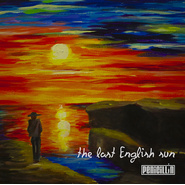

最后的英格兰太阳The Last English Sun
============================

|  |  |
| :--: | :-- |
| [ 最后的英格兰太阳The Last English Sun](https://emumo.xiami.com/album/2100328336) | **艺人**: [盘尼西林](../index.md) **语种**: 英语 **唱片公司**: StreetVoice **发行时间**: 2016年05月04日 **专辑类别**: EP, 单曲 **专辑风格**: 独立摇滚 Indie Rock **播放数**: 108740 **收藏数**: 89 **评论数**: 24  |

## 简介

“列车从卢顿出发，飞驰过城市与旷野，他的终点是希斯罗机场。在火车上，我写下了这首歌，希望他能帮助我回忆与分享，这段对我很重要的时光。再见，最后的英格兰太阳。”  
2016年初，主唱张哲轩结束了他的曼彻斯特留学生涯回到北京重组盘尼西林。这支曾被寄予厚望却因学业而暂缓脚步的乐队，在青年节的这一天用这首全新单曲正式宣布：北京最优质的摇滚青年们回来了！ 

## 曲目

## 评论

|  |  |  |
| :-- | :-- | :-- |
|  [虾米用户](https://emumo.xiami.com/u/428037009) 爱张哲轩三千遍，资料是假... 2019-09-13 12:55 赞(0) 踩(0) | 
These eyes have only one mind set upon us two，my present past and the future reside in you.爱盘尼西林，爱张哲轩。
 |
|  [虾米用户](https://emumo.xiami.com/u/16337726)  2017-12-19 18:24 赞(0) 踩(0) | 
,
 |
|  [虾米用户](https://emumo.xiami.com/u/8244559)  2016-12-20 12:29 赞(0) 踩(0) | 
******
 |
|  [虾米用户](https://emumo.xiami.com/u/1166554) 旋律党 2016-08-17 23:31 赞(0) 踩(0) | 
这么点人评论…
 |
|  [虾米用户](https://emumo.xiami.com/u/104400810)   2016-07-12 18:38 赞(0) 踩(0) | 
可以
 |
|  [虾米用户](https://emumo.xiami.com/u/92186638) 我还没想好要写什么... 2016-05-07 17:56 赞(0) 踩(0) | 
等好久了
 |
|  [虾米用户](https://emumo.xiami.com/u/17765602)  2016-05-06 19:57 赞(0) 踩(0) | 
等着他们吧
 |
|  [虾米用户](https://emumo.xiami.com/u/8943891) 你咋那么可爱？ 2016-05-05 11:22 赞(0) 踩(0) | 
丨
 |
|  [虾米用户](https://emumo.xiami.com/u/68271224) 这是我一生的朋友 2016-05-05 10:49 赞(0) 踩(0) | 
我来也
 |
|  [虾米用户](https://emumo.xiami.com/u/36057872) 网易/BC: Breat... 2016-05-05 02:25 赞(0) 踩(0) | 
~
 |
|  [虾米用户](https://emumo.xiami.com/u/17719900) 请把我的歌带回你的家 2016-05-04 23:48 赞(0) 踩(0) | 
封面有在认真做。
 |
|  [虾米用户](https://emumo.xiami.com/u/1507244)   2016-05-04 21:55 赞(0) 踩(0) | 
也想看现场来厦门把
 |
|  [虾米用户](https://emumo.xiami.com/u/1507244)   2016-05-04 21:54 赞(0) 踩(0) | 
私人音乐时间飞起来
 |
|  [虾米用户](https://emumo.xiami.com/u/1507244)   2016-05-04 21:52 赞(0) 踩(0) | 
第一次听 喜欢
 |
|  [虾米用户](https://emumo.xiami.com/u/41558656) 我还没想好要写什么... 2016-05-04 16:32 赞(0) 踩(0) | 
盘尼西林！盘尼西林！盘尼西林！盘尼西林！盘尼西林！盘尼西林！盘尼西林！盘尼西林！盘尼西林！盘尼西林！盘尼西林！盘尼西林！盘尼西林！盘尼西林！盘尼西林！盘尼西林！盘尼西林！盘尼西林！盘尼西林！盘尼西林！盘尼西林！盘尼西林！盘尼西林！盘尼西林！盘尼西林！盘尼西林！盘尼西林！盘尼西林！
 |
|  [虾米用户](https://emumo.xiami.com/u/41190273) 你！到底，怎么肥四啊？！ 2016-05-04 16:03 赞(0) 踩(0) | 
有点轻快的英伦风的感觉~咬字一种说不出来的感觉，嘻嘻。
 |
|  [虾米用户](https://emumo.xiami.com/u/117069208)  2016-05-04 13:23 赞(0) 踩(0) | 
0505
 |
|  [虾米用户](https://emumo.xiami.com/u/8273609)  2016-05-04 12:37 赞(0) 踩(0) | 
旋律依然好听
 |
|  [虾米用户](https://emumo.xiami.com/u/72915690) 这操蛋的经历 2016-05-04 12:14 赞(0) 踩(0) | 
沙发
 |
|  [虾米用户](https://emumo.xiami.com/u/36057872) 网易/BC: Breat... 2016-05-04 11:13 赞(0) 踩(0) | 
~
 |
|  [虾米用户](https://emumo.xiami.com/u/50157160) 七八点 2016-05-04 11:04 赞(0) 踩(0) | 
嘿嘿嘿嘿听过两次现场啦！好喜欢！
 |
|  [虾米用户](https://emumo.xiami.com/u/32348665) (●ↀωↀ●)✧ 2016-05-04 10:45 赞(0) 踩(0) | 

 |
|  [虾米用户](https://emumo.xiami.com/u/49474059) 听的明白么你 2016-05-04 10:44 赞(0) 踩(0) | 

 |
|  [虾米用户](https://emumo.xiami.com/u/30648067) 聪明的家伙是我偏不留下 2016-05-04 10:42 赞(0) 踩(0) | 
沙發我坐！
 |
