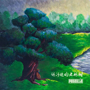

运河边的老栎树
============================

|  |  |
| :--: | :-- |
| [ 运河边的老栎树](https://emumo.xiami.com/album/2102734817) | **艺人**: [盘尼西林](../index.md) **语种**: 国语 **唱片公司**: StreetVoice **发行时间**: 2016年12月23日 **专辑类别**: EP, 单曲 **专辑风格**:  **播放数**: 60024 **收藏数**: 34 **评论数**: 2  |

## 简介

唱一首最简单的歌，送一份最用情的礼物  
《运河边的老栎树》，来自盘尼西林乐队的圣诞祝福。  
这一次，少年们暂缓风一般的脚步，走进心中的宁谧之地，化作树，凝视着他的河与岸。一把箱琴，萦绕耳边的美妙和声，只言片语，吟唱回忆，仰望希冀。  
这是一首简单但绝不随意的歌，是冬夜里耳畔最温暖的声音，是纷繁现世中的一针安慰剂。  
2017到来之际，片刻的宁休不会停止少年们飞奔的步伐，盘尼西林的首张全长专辑，共同期待。  
 

## 曲目

## 评论

|  |  |  |
| :-- | :-- | :-- |
|  [虾米用户](https://emumo.xiami.com/u/423237413)  2020-08-27 15:13 赞(0) 踩(0) | 
这首歌适合循环播放，一会就进入梦乡，坐到了运河边的老栎树边了，
 |
|  [虾米用户](https://emumo.xiami.com/u/301464974)  2017-06-10 13:53 赞(1) 踩(0) | 
让我安静，有淡淡的幸福感
 |
