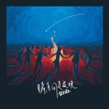

瞬息间是夜晚
============================

|  |  |
| :--: | :-- |
| [ 瞬息间是夜晚](https://emumo.xiami.com/album/2105166984) | **艺人**: [盘尼西林](../index.md) **语种**: 国语 **唱片公司**: StreetVoice **发行时间**: 2019年08月23日 **专辑类别**: EP, 单曲 **专辑风格**: 摇滚 Rock & Roll **播放数**: 427955 **收藏数**: 67 **评论数**: 24  |

## 简介

处暑的结束意味着夜晚来临的更加急促，来不及与夏日告别就要迎接初秋的狂欢，《瞬息间是夜晚》做为盘尼西林的第二张全长专辑《群星闪耀时》的首支单曲在这个季节变化的节点发布再合适不过。  
在古老遥远的西方对于渴望万千归属的心灵来说瞬间是午夜的开始也是纵然消逝的结束，当永恒的烛火点燃时，当短暂的心灵相依时，即使错过了下一个黎明的到来也仍希望在无尽的黑夜中留下来，哪怕只是一瞬间呢？  
黑夜或许只是一种颜色可是对于渴望黑夜的人来说是五彩缤纷的，是绚烂多彩的，在黑夜里享受着、追逐着、浪漫着、邪恶着，在黑夜里可以做出很多无限的遐想这也将会变成美丽的时刻。  
模糊不清的身影围在温暖的篝火旁散发出圣洁的光芒，在黑夜的映衬下显得格外浪漫。  
这首以传统的吉他摇滚为根基，整体归属于小调走向的歌曲，将在黑暗色调下迸发出无数次美丽的时刻、错综复杂的瞬间以及无法承受的结局。  
欢呼吧！美妙绝伦的夜晚  
 

## 曲目

## 评论

|  |  |  |  |
| :-- | :-- | :-- | :-- |
|  [虾米用户](https://emumo.xiami.com/u/177874560) 每个抖腿的人心里都有台缝... 2019-09-13 19:14 赞(0) 踩(0) | 
喜欢
 |
|  [虾米用户](https://emumo.xiami.com/u/323754270)  2019-09-07 20:29 赞(0) 踩(0) | 
️
 |
|  [虾米用户](https://emumo.xiami.com/u/40613275) 知足者常乐 2019-09-03 18:33 赞(0) 踩(0) | 
好听的
 |
|  [虾米用户](https://emumo.xiami.com/u/150644716) 我和我的赘肉，一刻也不能... 2019-08-31 03:29 赞(2) 踩(0) | 
裁缝最近又进好料啦
 |
|  [虾米用户](https://emumo.xiami.com/u/3553665) We can be He... 2019-08-29 15:56 赞(0) 踩(0) | 
And then it is night♡
 |
|  [虾米用户](https://emumo.xiami.com/u/85899446) 我还没想好要写什么... 2019-08-29 14:22 赞(0) 踩(0) | 
封面确实好看
 |
|  [虾米用户](https://emumo.xiami.com/u/478527) 好想跟衣服在洗衣机里滚 2019-08-29 12:15 赞(0) 踩(0) | 
done
 |
|  [虾米用户](https://emumo.xiami.com/u/23630467) 所谓理解 通常不过是误解... 2019-08-26 00:10 赞(0) 踩(0) | 
喜欢/
 |
|  [虾米用户](https://emumo.xiami.com/u/335576525)   2019-08-25 20:42 赞(0) 踩(0) | 
好聽
 |
|  [虾米用户](https://emumo.xiami.com/u/16809701) XXXV's 2019-08-25 12:59 赞(1) 踩(0) | 
被封面吸引来的。
 |
|  [虾米用户](https://emumo.xiami.com/u/10593217) 过世的沉墨旅人 2019-08-24 05:30 赞(0) 踩(0) | 
踩点？
 |
|  [虾米用户](https://emumo.xiami.com/u/1643567) 我还没想好要写什么... 2019-08-23 23:04 赞(0) 踩(0) | 
封面好看的！
 |
|  [虾米用户](https://emumo.xiami.com/u/261137370) 啥玩意儿 2019-08-23 15:32 赞(2) 踩(0) | 
不拿盘尼西林和别的任何乐队比较，比之前的专辑差，无论是词还是曲，
 |
| ⇒ |  [虾米用户](https://emumo.xiami.com/u/1799677) entertain me... 2019-08-23 16:41 赞(0) 踩(0) | 
从第一张专听到现在 这么多年了 我完全不觉得是退步 我反而能明显感受到他们一次又一次在乐器编排 词曲创作上的升级
 |
| ⇒ |  [虾米用户](https://emumo.xiami.com/u/261137370) 啥玩意儿 2019-08-24 00:06 赞(0) 踩(0) | 
<q><b>爆小炸说：</b></q>
 |
|  [虾米用户](https://emumo.xiami.com/u/31531934) 恋の道に近道はない 2019-08-23 13:07 赞(0) 踩(0) | 
必须大家都来聆听收藏你的分享收藏是给音乐人最大的鼓舞 谢谢大家支持
 |
|  [虾米用户](https://emumo.xiami.com/u/40325149) 我睡在一群猪的中央。 2019-08-23 10:55 赞(0) 踩(0) | 
 
 |
|  [虾米用户](https://emumo.xiami.com/u/41874498)  2019-08-23 10:46 赞(0) 踩(0) | 
前排听着
 |
|  [虾米用户](https://emumo.xiami.com/u/410782296)  2019-08-23 10:43 赞(0) 踩(0) | 
哇哦
 |
|  [虾米用户](https://emumo.xiami.com/u/270879773) … 2019-08-23 10:33 赞(0) 踩(0) | 
我也来靠个前排
 |
|  [虾米用户](https://emumo.xiami.com/u/335763493) 不戴墨镜  2019-08-23 10:33 赞(1) 踩(0) | 
欢迎光临
 |
|  [虾米用户](https://emumo.xiami.com/u/47357119)   2019-08-23 10:33 赞(1) 踩(0) | 
从前奏开始就是好心情 
 |
|  [虾米用户](https://emumo.xiami.com/u/4707154) 唯有谢幕前尽力狂欢 2019-08-23 10:31 赞(0) 踩(0) | 
️
 |
|  [虾米用户](https://emumo.xiami.com/u/1581291)   2019-08-23 10:30 赞(0) 踩(0) | 
沙发？
 |
