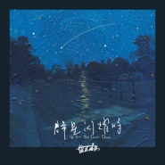

群星闪耀时
============================

|  |  |
| :--: | :-- |
| [ 群星闪耀时](https://emumo.xiami.com/album/2105262374) | **艺人**: [盘尼西林](../index.md) **语种**: 国语 **唱片公司**: StreetVoice, 霓雾娱乐 **发行时间**: 2019年09月23日 **专辑类别**: 录音室专辑 **专辑风格**: 摇滚 Rock & Roll **播放数**: 540367 **收藏数**: 756 **评论数**: 76  |

## 简介

“夜幕苍穹下的音乐散文”  
如果说首张专辑《与世界温暖相拥》是阳光下的浪漫诉说，那么《群星闪耀时》则展现出乐队的成长与探索，和心中挥之不去的忧郁情愫。毫无疑问，这是对茨威格传世经典《人类的群星闪耀时》的一次跨世纪致敬。《群星闪耀时》更像一部散文集，从不醉心于宏大叙事，用11首歌曲忠实记录了乐队近几年的生活片段和旅途所感。整张专辑一如既往地热衷于经典摇滚乐的粗硬线条，也有并行不悖的抒情线索。这像极了懵懂少年的心路历程——喧嚣过后，总有夜深人静时。  
专辑开篇即是同名曲《群星闪耀时》，以忧伤的英伦摇滚作基底，缘起于多年老友离队所带来的巨大虚空与无奈。仰望满天星斗，人们却身处孤独之中，专辑如此展开了。  
接下来的《东方明星》，一跃而起，是舞台上我们熟悉的那个狂放身影。其曲风明显受到美国南方摇滚的影响，以轰鸣的吉他 riff 宣告经典摇滚的回归。点睛之笔在结尾处那段激情澎湃的解说录音，道出了足球运动与乐队的不解之缘。  
盘尼西林一方面保持了对根源音乐的热望，同时也坚持着歌曲的旋律性，这集中体现在首发的三首单曲《快！快！》、《瞬息间是夜晚》和《缅因路的月亮》中。原本不羁的失真吉他在此保持了足够克制，无论歌唱青春，还是描绘月夜，优美流畅的旋律线条始终占据着听者的耳朵。抒情过后，则是一首「非典型」的盘尼西林作品——《狂欢》。这首歌里，鼓和贝斯的轻快律动成为主角，他们继承80年代曼城Madchester前辈衣钵，给摇滚乐注入足够的跳舞性。  
2019年春天的一次巴西之旅，让盘尼西林大开眼界，那里无处不在的文化冲撞和奇闻轶事，令他们创作出《圣保罗》这首专辑里最快的歌曲。我们再一次听到了60年代的英伦摇滚经典之声，由大音量的吉他声响勾勒出大千世界的狂乱种种。短暂欢愉过后，便是温凉的夜，伴着《夏夜迷语》那悠扬的民谣风情，手风琴把人带回到旧日的夏梦中，专辑的节奏也再一次舒缓了下来。我们听到了《她消失在黑夜里》这样鬼魅十足、叙事性很强的三段式作品，也有夜幕酒馆里的吉他小调《午夜情歌》，那是 Tom Waits、Leonard Cohen 这样有故事的老男人会唱的歌，真像一部黑白电影。  
专辑最后，一首《梦在黎明破晓时》与《群星闪耀时》首尾呼应，由钢琴带领的抒情摇滚作为点题之笔，为专辑画上了圆满句号。  
夏末秋初，盘尼西林再度与世界温暖相拥。所有的非议和追捧、相聚与别离，都让他们更加紧密、更明白自己想要的——一切尽在在音乐中。  
  
Two years after the first album was released, Penicillin brought a new album of 2019, When the Stars Shine, through the growth and exploration of the band.  
When the stars shine, like a collection of prose, never indulge in Grand narrative, faithfully records the band's life and journey in recent years with 11 songs. The album is as keen on the hard lines of classical rock music as ever, and has parallel Lyric clues. It's like ignoring the course of a teenager's mind. After the noise, there's always a quiet time in the middle of the night.  
The album opens with the same title song "When the Stars Shine", based on sad British rock and roll, followed by "Oriental Star", announcing the return of classic rock and roll with the roaring guitar riff. The first three singles, Quick! Quick! 》 The melodic lines in "Instantaneous is Night" and "Moon on Maine Road" always occupy the listener's ears. After lyricism, a song "Carnival" injects enough dancing into rock music. Sao Paulo, the fastest song on this album, has made us hear again the classic voice of British rock and roll in the 1960s. The accordion in "Summer Night Myth" brings people back to their old summer dreams. We can hear such a ghostly and narrative three-stage work as "She Vanished in the Night" and the guitar minor "Midnight Love Song" in the night pub. At the end of the album, a song "Dream at Dawn" echoes the beginning and end of "When the Stars Shine." Lyric rock and roll led by the piano, as a point pen, completes the album satisfactorily.  
In late summer and early autumn, penicillin embraced the world warmly again. All the criticism and pursuit, gathering and parting make them closer and more aware of what they want - everything in music.

## 曲目

## 评论

|  |  |  |  |
| :-- | :-- | :-- | :-- |
|  [虾米用户](https://emumo.xiami.com/u/7383153) 精神食粮。 2020-06-12 15:54 赞(0) 踩(0) | 
书名和电影名都变成歌曲名???
 |
|  [虾米用户](https://emumo.xiami.com/u/193048326) 啊呀，人生还是蛮有意思的... 2020-04-18 19:36 赞(0) 踩(0) | 
编曲有些单调
 |
|  [虾米用户](https://emumo.xiami.com/u/441859197)  2020-04-02 14:19 赞(0) 踩(0) | 
非常喜欢
 |
|  [虾米用户](https://emumo.xiami.com/u/1395744) 嘘，我在听音乐。。。 2020-03-29 17:07 赞(0) 踩(0) | 
这专辑和各张single的封面，真是美的一批啊
 |
|  [虾米用户](https://emumo.xiami.com/u/426481155)  2020-03-13 22:06 赞(0) 踩(0) | 
oasis
 |
|  [虾米用户](https://emumo.xiami.com/u/304831620) / 2020-02-17 21:44 赞(0) 踩(0) | 
群星闪耀时  喜欢这首歌
 |
|  [虾米用户](https://emumo.xiami.com/u/3109625) Menic 2019-11-20 09:23 赞(0) 踩(0) | 
封面可以
 |
|  [虾米用户](https://emumo.xiami.com/u/4324521) 我还没想好要写什么... 2019-10-31 10:52 赞(0) 踩(0) | 
真的很喜欢了！加油！！！
 |
|  [虾米用户](https://emumo.xiami.com/u/43092507)   2019-10-28 16:14 赞(1) 踩(0) | 
这张专辑真的还不错
 |
|  [虾米用户](https://emumo.xiami.com/u/298408168)  2019-10-12 22:09 赞(0) 踩(0) | 
真的很不错
 |
|  [虾米用户](https://emumo.xiami.com/u/47459440)  2019-10-11 23:48 赞(0) 踩(0) | 
sq就这音质？
 |
|  [虾米用户](https://emumo.xiami.com/u/10259601) 暮霭下西垂的残阳，恍若篝... 2019-10-10 16:10 赞(4) 踩(0) | 
这专辑歌名讲究啊。你看黄昏，群星初上，东方的那个最美了！我跟她来了一发，快，快！然后第一次进入贤者模式，夜晚也来了，月亮出来了。狂欢吧，第二发！短暂过后，第二次贤者模式。在夏夜喃喃细语，她在深夜离开了。（我怀疑这是不是付费性质的~）啊，还是要唱些情歌，来舒缓自己刚才的罪恶感与此时的空虚感。黎明破晓时，进入梦乡。
 |
| ⇒ |  [虾米用户](https://emumo.xiami.com/u/47448978) 今晚月色真美 2019-11-27 18:12 赞(0) 踩(0) | 
兄弟是个人才啊   
 |
|  [虾米用户](https://emumo.xiami.com/u/314681459)   2019-09-27 17:42 赞(2) 踩(0) | 
断断续续几天听完了，忍不住安利给喜欢摇滚的朋友。不敢说盘尼西林是他们在节目里自封的“90后最好的摇滚乐队”，但他们必定是这代人里最理解英伦摇滚风格的乐队。
 |
| ⇒ |  [虾米用户](https://emumo.xiami.com/u/212356465) 庸人罢了 2019-10-08 19:20 赞(0) 踩(0) | 
在新生代已经是很不错的了。
 |
|  [虾米用户](https://emumo.xiami.com/u/262175955) 这是对的 2019-09-27 05:30 赞(1) 踩(0) | 
洋气～
 |
|  [虾米用户](https://emumo.xiami.com/u/83190294) 我们曾相爱，想到就心酸 2019-09-25 20:13 赞(1) 踩(0) | 
发歌速度很感人啊！一张接一张的！
 |
|  [虾米用户](https://emumo.xiami.com/u/44006869)  2019-09-25 11:47 赞(0) 踩(0) | 
整张专辑都很不错
 |
|  [虾米用户](https://emumo.xiami.com/u/250106977) 这个狗很懒 2019-09-24 21:57 赞(0) 踩(0) | 
快 快 快
 |
|  [虾米用户](https://emumo.xiami.com/u/379207361) 青秋独行青衫客 2019-09-24 21:33 赞(0) 踩(0) | 
义
 |
|  [虾米用户](https://emumo.xiami.com/u/9233073) Hugo(雨中的苹果)，... 2019-09-24 19:43 赞(1) 踩(0) | 
好舒服的英伦小调
 |
|  [虾米用户](https://emumo.xiami.com/u/410782296)  2019-09-24 18:02 赞(0) 踩(0) | 
卧槽，棒极了，帮到蹦起来
 |
|  [虾米用户](https://emumo.xiami.com/u/2791514) 此处禁言 2019-09-24 12:56 赞(1) 踩(0) | 
旋律里充满了偶像包袱
 |
|  [虾米用户](https://emumo.xiami.com/u/73857918) 在黎明之前 2019-09-24 12:46 赞(0) 踩(0) | 
～
 |
|  [虾米用户](https://emumo.xiami.com/u/11824157) 始终爱陈绮贞，走不出我的... 2019-09-24 12:30 赞(2) 踩(0) | 
这个封面真的好美啊
 |
|  [虾米用户](https://emumo.xiami.com/u/19917674)  2019-09-24 11:10 赞(0) 踩(0) | 
很不错
 |
|  [虾米用户](https://emumo.xiami.com/u/47448978) 今晚月色真美 2019-09-24 10:56 赞(0) 踩(0) | 
每首歌都很吸引耳朵，很有特色，很有感染力，又很治愈。
 |
|  [虾米用户](https://emumo.xiami.com/u/4914791) 这家伙很美丽，什么都没有... 2019-09-24 09:15 赞(0) 踩(0) | 
感觉夏天还在继续
 |
|  [虾米用户](https://emumo.xiami.com/u/31531934) 恋の道に近道はない 2019-09-24 00:04 赞(1) 踩(0) | 
必须大家都来聆听收藏你的分享收藏是给音乐人最大的鼓舞 谢谢大家支持
 |
|  [虾米用户](https://emumo.xiami.com/u/9840480) 越漂亮 越无常 2019-09-23 23:32 赞(0) 踩(0) | 
相当惊艳
 |
|  [虾米用户](https://emumo.xiami.com/u/38883178) “” 2019-09-23 23:10 赞(0) 踩(0) | 
7
 |
|  [虾米用户](https://emumo.xiami.com/u/18236235) 我还没想好要写什么... 2019-09-23 22:48 赞(0) 踩(0) | 
☪︎
 |
|  [虾米用户](https://emumo.xiami.com/u/36115121) 这个人很懒 什么都没留下 2019-09-23 22:45 赞(1) 踩(0) | 
来吧我年轻的艺术家们 都走起来吧 city！
 |
|  [虾米用户](https://emumo.xiami.com/u/8384826) 再见，虾米，谢谢！ 2019-09-23 22:24 赞(0) 踩(0) | 
年少有为
 |
|  [虾米用户](https://emumo.xiami.com/u/2144257)  2019-09-23 21:54 赞(0) 踩(0) | 
曲风很多元～中文和英文各具特色，可听性非常强！推荐！
 |
|  [虾米用户](https://emumo.xiami.com/u/426989861) 我还没想好要写什么... 2019-09-23 21:44 赞(0) 踩(0) | 
打卡
 |
|  [虾米用户](https://emumo.xiami.com/u/210418721) 视野没有你，余光全是你 2019-09-23 21:08 赞(0) 踩(0) | 
来打卡嘻嘻
 |
| ⇒ |  [虾米用户](https://emumo.xiami.com/u/252679648) 一怒为宏颜 2019-09-23 21:27 赞(0) 踩(0) | 
爬墙吗姐妹
 |
|  [虾米用户](https://emumo.xiami.com/u/812392) 【封面控】毛驴牌❤小众好... 2019-09-23 20:42 赞(0) 踩(0) | 
他来了这次全来了
 |
|  [虾米用户](https://emumo.xiami.com/u/926931)  2019-09-23 20:37 赞(0) 踩(0) | 
客观的从音乐本身我喜欢张曼乐的嗓
 |
|  [虾米用户](https://emumo.xiami.com/u/9078112) 一念一世界 2019-09-23 17:21 赞(0) 踩(0) | 
小乐太爱用星星，月亮作词了
 |
|  [虾米用户](https://emumo.xiami.com/u/363256896) さよなら 2019-09-23 14:39 赞(0) 踩(0) | 
没进前三十诶
 |
|  [虾米用户](https://emumo.xiami.com/u/278546638) 不闻 2019-09-23 11:59 赞(0) 踩(0) | 
我是第三十
 |
|  [虾米用户](https://emumo.xiami.com/u/411058641) 取之不尽 用之不竭 2019-09-23 11:16 赞(1) 踩(0) | 
呦
 |
|  [虾米用户](https://emumo.xiami.com/u/40309922) 我还没想好要写什么... 2019-09-23 10:24 赞(0) 踩(0) | 
滴
 |
|  [虾米用户](https://emumo.xiami.com/u/354852522) 我还没想好要写什么... 2019-09-23 10:03 赞(0) 踩(0) | 
不好意思 迟到了 马上见！
 |
|  [虾米用户](https://emumo.xiami.com/u/44743196) 听虾米记得收藏～ 2019-09-23 09:48 赞(0) 踩(0) | 
打卡
 |
|  [虾米用户](https://emumo.xiami.com/u/15205002) ？ 2019-09-23 08:39 赞(0) 踩(0) | 
收
 |
|  [虾米用户](https://emumo.xiami.com/u/148513426) 現世是夢，夜裡的夢才是真... 2019-09-23 08:06 赞(0) 踩(0) | 
冲鸭！
 |
|  [虾米用户](https://emumo.xiami.com/u/309256043) 一起听歌吧… 2019-09-23 07:07 赞(0) 踩(0) | 

 |
|  [虾米用户](https://emumo.xiami.com/u/7077262) 喀纳斯—禾木—冰岛—阿拉... 2019-09-23 07:03 赞(0) 踩(0) | 
早安 
 |
|  [虾米用户](https://emumo.xiami.com/u/245115833) ☁️ID:安那般那209 2019-09-23 06:54 赞(0) 踩(0) | 
早安 
 |
|  [虾米用户](https://emumo.xiami.com/u/356763773) 我还没想好要写什么... 2019-09-23 06:47 赞(0) 踩(0) | 
。
 |
|  [虾米用户](https://emumo.xiami.com/u/193474278) 行百里者半九十 2019-09-23 06:44 赞(0) 踩(0) | 
早
 |
|  [虾米用户](https://emumo.xiami.com/u/308404484) 一起看愚蠢的晚霞吧 2019-09-23 04:09 赞(0) 踩(0) | 
✨
 |
|  [虾米用户](https://emumo.xiami.com/u/104042788)  2019-09-23 01:59 赞(0) 踩(0) | 
优秀
 |
|  [虾米用户](https://emumo.xiami.com/u/3553665) We can be He... 2019-09-23 01:44 赞(0) 踩(0) | 
ㅤㅤㅤㅤㅤㅤㅤㅤㅤㅤㅤㅤㅤㅤ☾✰✰✰✰
 |
|  [虾米用户](https://emumo.xiami.com/u/4738909) 我还没想好要写什么... 2019-09-23 00:51 赞(0) 踩(0) | 

 |
|  [虾米用户](https://emumo.xiami.com/u/43624727) 这家伙一点也不聪明 2019-09-23 00:41 赞(0) 踩(0) | 
免费
 |
|  [虾米用户](https://emumo.xiami.com/u/9725504) 千江有水千江月，万里无云... 2019-09-23 00:16 赞(0) 踩(0) | 

 |
|  [虾米用户](https://emumo.xiami.com/u/335763493) 不戴墨镜  2019-09-23 00:13 赞(1) 踩(0) | 
我迟到了
 |
|  [虾米用户](https://emumo.xiami.com/u/288632945) 吾神克鲁苏 2019-09-23 00:11 赞(0) 踩(0) | 
like
 |
|  [虾米用户](https://emumo.xiami.com/u/563649)  2019-09-23 00:09 赞(0) 踩(0) | 
来了
 |
|  [虾米用户](https://emumo.xiami.com/u/48640880) 你是我不急的梦 2019-09-23 00:09 赞(1) 踩(0) | 
人类的群星闪耀，而我们面对群星时，能做的只是站在泥泞地里，满眼热泪地看着他们，别无他法
 |
|  [虾米用户](https://emumo.xiami.com/u/260992790) I'll Be Your... 2019-09-23 00:07 赞(0) 踩(0) | 
。
 |
|  [虾米用户](https://emumo.xiami.com/u/5040572) the tourist 2019-09-23 00:02 赞(0) 踩(0) | 
不是夜晚 就是星星 还有月亮感觉夏季一直都在
 |
|  [虾米用户](https://emumo.xiami.com/u/43947287) 可怕的人类解决了温饱 2019-09-23 00:01 赞(0) 踩(0) | 
？
 |
|  [虾米用户](https://emumo.xiami.com/u/353570236) 别动我耳机 2019-09-23 00:01 赞(0) 踩(0) | 
俺最快
 |
|  [虾米用户](https://emumo.xiami.com/u/64634706) 尽管出走别折返 2019-09-23 00:01 赞(0) 踩(0) | 
先来打个卡 肯定超棒！
 |
|  [虾米用户](https://emumo.xiami.com/u/42457016) 小型歡愉 2019-09-23 00:01 赞(0) 踩(0) | 

 |
|  [虾米用户](https://emumo.xiami.com/u/428220294) 在喧嚣中终结 2019-09-23 00:00 赞(0) 踩(0) | 
这点卡得可以
 |
|  [虾米用户](https://emumo.xiami.com/u/49640493) 网易云SAINTDONT... 2019-09-23 00:00 赞(0) 踩(0) | 
love
 |
