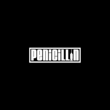

PENICILLIN
============================

|  |  |
| :--: | :-- |
| [ PENICILLIN](https://emumo.xiami.com/album/794133618) | **艺人**: [盘尼西林](../index.md) **语种**: 国语 **唱片公司**: 独音唱片 **发行时间**: 2013年12月14日 **专辑类别**: EP, 单曲 **专辑风格**: 独立摇滚 Indie Rock, 英伦摇滚 Britpop **播放数**: 1993738 **收藏数**: 580 **评论数**: 35  |

## 简介

愿每一个善良的人生活在幸福的光辉下 而我们就是幸福的种子 一起浪漫的生长 浪漫的开放 

## 曲目

## 评论

|  |  |  |
| :-- | :-- | :-- |
|  [虾米用户](https://emumo.xiami.com/u/255373139) 湿趴 kolor Mr.... 2019-07-09 16:57 赞(0) 踩(0) | 
好听
 |
|  [虾米用户](https://emumo.xiami.com/u/7165962)  2019-06-20 16:03 赞(0) 踩(0) | 
此素比Oasis更适合日常服用，足够温柔，适合干吞，不必伴水送服
 |
|  [虾米用户](https://emumo.xiami.com/u/298086359) 我还没想好要写什么... 2019-05-29 09:45 赞(0) 踩(0) | 
太温柔了
 |
|  [虾米用户](https://emumo.xiami.com/u/5960906) hateu 2019-05-27 21:23 赞(3) 踩(0) | 
吸收了英摇的骨架、吉他音色，很绿洲，但没有绿洲的痞劲儿，多了些浪子的诗意。
 |
|  [虾米用户](https://emumo.xiami.com/u/12230374) Pinkfloydzh，... 2019-03-01 19:25 赞(0) 踩(0) | 
好听
 |
|  [虾米用户](https://emumo.xiami.com/u/15270473) 听到喜欢的歌 身体不跟着... 2018-12-27 14:48 赞(0) 踩(0) | 
-
 |
|  [虾米用户](https://emumo.xiami.com/u/226671558)  2017-08-27 22:07 赞(0) 踩(0) | 
刚看完苏州迷笛现场，蛮嗨
 |
|  [虾米用户](https://emumo.xiami.com/u/30800139) 我在低俗与高雅间活的很尴... 2017-02-15 21:57 赞(0) 踩(0) | 
。
 |
|  [虾米用户](https://emumo.xiami.com/u/45298985) Wechat:dqx19... 2016-05-08 12:14 赞(0) 踩(0) | 
+
 |
|  [虾米用户](https://emumo.xiami.com/u/5045687)  生命之饼被河蟹后很少用... 2016-02-14 16:28 赞(0) 踩(0) | 
让我牵起你的手。。。every breath you take
 |
|  [虾米用户](https://emumo.xiami.com/u/12299796) 优美的低于生活... 2015-12-19 01:31 赞(0) 踩(0) | 
不错
 |
|  [虾米用户](https://emumo.xiami.com/u/2279444) 爱在左，同情在右。 2015-09-29 21:54 赞(1) 踩(0) | 
不眠夜不错
 |
|  [虾米用户](https://emumo.xiami.com/u/37648768) 无头无眼，永行山道 2015-07-01 20:45 赞(0) 踩(0) | 
苏菲亚索的照片在封面上
 |
|  [虾米用户](https://emumo.xiami.com/u/11823339) CONMUNI wech... 2015-05-23 02:44 赞(1) 踩(0) | 
让我牵起你的手 前奏很像警察的every breath you take阿。。。。
 |
|  [虾米用户](https://emumo.xiami.com/u/8990845)  Love is Bli... 2015-04-06 15:21 赞(0) 踩(0) | 
刚刚认识你们 好喜欢这歌
 |
|  [虾米用户](https://emumo.xiami.com/u/42406163) Hey 2014-12-02 15:02 赞(0) 踩(0) | 
下周面试 保佑
 |
|  [虾米用户](https://emumo.xiami.com/u/4718206) Hey you 2014-08-18 22:43 赞(0) 踩(0) | 
哈哈哈哈苏菲亚索到底多黑  笑尿
 |
|  [虾米用户](https://emumo.xiami.com/u/812392) 【封面控】毛驴牌❤小众好... 2014-07-03 14:04 赞(0) 踩(0) | 
#今日推荐#看评论有一条说主唱的声音很像朴树，笑~
 |
|  [虾米用户](https://emumo.xiami.com/u/4328253)  2014-06-17 23:03 赞(0) 踩(0) | 
主唱声音有点朴树的感觉
 |
| ⇒ |  [虾米用户](https://emumo.xiami.com/u/5995403) 嘻嘻 2014-07-12 20:46 赞(0) 踩(0) | 
嗯 我很喜欢朴树
 |
|  [虾米用户](https://emumo.xiami.com/u/5181233)  2014-06-17 09:47 赞(0) 踩(0) | 
苏菲娅索到底有多黑
 |
| ⇒ |  [虾米用户](https://emumo.xiami.com/u/5086001) 我这么懒怎么还没死啊 2014-07-09 20:27 赞(0) 踩(0) | 
哈哈哈哈哈哈哈哈笑出声了
 |
| ⇒ |  [虾米用户](https://emumo.xiami.com/u/5995403) 嘻嘻 2014-07-22 21:00 赞(0) 踩(0) | 
<q><b>维克托女孩说：</b></q>
 |
| ⇒ |  [虾米用户](https://emumo.xiami.com/u/5086001) 我这么懒怎么还没死啊 2014-07-23 22:30 赞(0) 踩(0) | 
<q><b>cruyff说：</b></q>
 |
| ⇒ |  [虾米用户](https://emumo.xiami.com/u/5995403) 嘻嘻 2014-07-28 06:30 赞(0) 踩(0) | 
<q><b>维克托女孩说：</b></q>
 |
| ⇒ |  [虾米用户](https://emumo.xiami.com/u/4718206) Hey you 2014-08-18 22:42 赞(0) 踩(0) | 
哈哈哈哈哈哈
 |
| ⇒ |  [虾米用户](https://emumo.xiami.com/u/5953103)  2014-09-13 23:05 赞(0) 踩(0) | 
哈哈哈
 |
|  [虾米用户](https://emumo.xiami.com/u/1142678) 不培养废物了。 2014-04-28 21:26 赞(0) 踩(0) | 
超级赞
 |
|  [虾米用户](https://emumo.xiami.com/u/34299253)  2014-03-20 22:21 赞(0) 踩(0) | 
三哥三哥我爱你~盘尼西林~nb~
 |
|  [虾米用户](https://emumo.xiami.com/u/1357157) 新浪漫主义、浪漫主义复兴 2014-03-19 04:34 赞(1) 踩(0) | 
@淘气的张三哥 @雪人儿Gang @鼓手文正@比恩屎汀 @胖胖张小波
 |
|  [虾米用户](https://emumo.xiami.com/u/33948412) 曾经臭弹棉花的 2014-03-12 17:30 赞(0) 踩(0) | 
我就是喜欢！！
 |
|  [虾米用户](https://emumo.xiami.com/u/33948412) 曾经臭弹棉花的 2014-03-12 17:21 赞(0) 踩(0) | 
四个大男孩！！真心的为你们高兴！！再接再厉！乐留学之前争取再出一张！
 |
|  [虾米用户](https://emumo.xiami.com/u/12682048) 摇滚 2014-03-12 00:16 赞(0) 踩(0) | 
真心赞 。  准备 听着 入睡。
 |
|  [虾米用户](https://emumo.xiami.com/u/6507607) 请把我的尸体埋在音乐里。 2014-03-11 20:06 赞(0) 踩(0) | 
好听哭，快点出新砖吧
 |
|  [虾米用户](https://emumo.xiami.com/u/5995403) 嘻嘻 2014-03-07 21:31 赞(0) 踩(0) | 
好
 |
