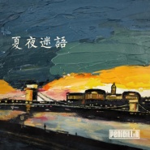
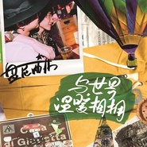

盘尼西林
============================

|  |  |
| :--: | :-- |
| [ 盘尼西林](https://i.xiami.com/penicillin) | **播放数**: 10005874 **粉丝数**: 20117 **评论数**: 372 **地区**: China 中国大陆 **风格**: 摇滚 Rock & Roll, 独立摇滚 Indie Rock, 另类摇滚 Alternative Rock  |

## 档案

来自霓雾娱乐的盘尼西林乐队Penicillin(CN)，是九零一代乐队里最受瞩目的新星。 
他们拥有着超越年龄的思维与渴望，以一颗历经沧桑的老灵魂，歌唱新一代年轻人敏感而丰富的世界与生活。 
盘尼西林以传统吉他摇滚为根基，融合多类型音乐风格，打造出属于他们的“浪漫主义摇滚乐”。他们极强的现场感染力和出众的外形，让他们成为了无数年轻人的偶像。 
2017年，乐队首张专辑《与世界温暖相拥》正式发行，专辑中的两首主打歌曲评论数均已破万。2019年，第二张专辑《群星闪耀时》全网首发，整张专辑的歌曲评论数迅速突破999+。 
盘尼西林在每个群星闪耀的夜里，陪伴着每一颗孤独却骄傲的心，与你温暖相拥。 
2019年，盘尼西林乐队获得第十届中国摇滚迷笛奖“年度最佳摇滚乐队”，带着这个荣誉，他们登上《乐队的夏天》并荣获Hot5，成为获奖乐队中最年轻的一支。 
节目结束后，乐队进行了“群星闪耀时”全国巡演，巡演观众总人数破1.5万人次。同年，盘尼西林登上工体舞台，回到北京进行收官演出，成为在工体舞台演出的乐队里最年轻的一支，续写新一代工体的摇滚辉煌。 
在这个纷繁萦绕的世界里，你需要一剂能够治愈你的盘尼西林。

## 专辑

| 名称 | 语种 | 唱片公司 | 发行时间 | 专辑类别 | 专辑风格 |
| :--: | :-- | :-- | :-- | :-- | :-- |
| [ 群星闪耀时](./albums/2105262374.md) | 国语 | StreetVoice, 霓雾娱乐 | 2019年09月23日 | 录音室专辑 | 摇滚 Rock & Roll |
| [ 快！快！](./albums/2105217563.md) | 国语 | StreetVoice | 2019年09月10日 | EP, 单曲 | 摇滚 Rock & Roll |
| [ 缅因路的月亮](./albums/2105198117.md) | 国语 | StreetVoice | 2019年08月31日 | EP, 单曲 | 摇滚 Rock & Roll |
| [ 瞬息间是夜晚](./albums/2105166984.md) | 国语 | StreetVoice | 2019年08月23日 | EP, 单曲 | 摇滚 Rock & Roll |
| [ 夏夜迷语](./albums/2103708246.md) | 国语 | StreetVoice | 2018年05月16日 | EP, 单曲 | 独立民谣 Indie Folk |
| [ 与世界温暖相拥Embrace the World](./albums/2102733526.md) | 国语 | StreetVoice | 2017年04月18日 | 录音室专辑 | 流行摇滚 Pop Rock, 独立摇滚 Indie Rock |
| [ 紫罗兰星斑](./albums/2102734813.md) | 国语 | StreetVoice | 2017年04月06日 | EP, 单曲 |  |
| [ 来自城市的幻想](./albums/2102734815.md) | 国语 | StreetVoice | 2017年03月30日 | EP, 单曲 |  |
| [ 运河边的老栎树](./albums/2102734817.md) | 国语 | StreetVoice | 2016年12月23日 | EP, 单曲 |  |
| [ 最后的英格兰太阳The Last English Sun](./albums/2100328336.md) | 英语 | StreetVoice | 2016年05月04日 | EP, 单曲 | 独立摇滚 Indie Rock |
| [ PENICILLIN](./albums/794133618.md) | 国语 | 独音唱片 | 2013年12月14日 | EP, 单曲 | 独立摇滚 Indie Rock, 英伦摇滚 Britpop |

## 评论

|  |  |  |  |
| :-- | :-- | :-- | :-- |
|  [虾米用户](https://emumo.xiami.com/u/72105180) weibo: surfe... 2021-01-12 04:57 赞(0) 踩(0) | 
以后不能在虾米听小乐唱歌了，成都见吧朋友们
 |
|  [虾米用户](https://emumo.xiami.com/u/681153) 我还没想好要写什么... 2020-10-30 20:31 赞(0) 踩(0) | 
前几天大望路和生汇看见小羊和女盆友了 
 |
|  [虾米用户](https://emumo.xiami.com/u/1546736)   2020-10-30 12:24 赞(0) 踩(0) | 
为啥老给我推他们的歌，谁能告诉我怎么把他们拉黑
 |
| ⇒ |  [虾米用户](https://emumo.xiami.com/u/404774010)  2020-11-15 00:15 赞(0) 踩(0) | 
瞧把你叫矫情的，能听到小乐说明你的品味跟他们也差不了多少
 |
|  [虾米用户](https://emumo.xiami.com/u/9478491) 舌尖紋了瑪利亞 2020-08-06 04:42 赞(0) 踩(0) | 

 |
|  [虾米用户](https://emumo.xiami.com/u/307571872) 及时行乐(´△｀)♪ 2020-07-11 13:11 赞(0) 踩(0) | 
。
 |
|  [虾米用户](https://emumo.xiami.com/u/43875708)  遣词造句 穿山过水 他... 2020-06-15 18:22 赞(1) 踩(0) | 
不会真以为大家没听过歌吧
 |
|  [虾米用户](https://emumo.xiami.com/u/34080571) ZX 2020-06-01 13:10 赞(0) 踩(0) | 
评论太有意思了 哈哈哈哈哈
 |
|  [虾米用户](https://emumo.xiami.com/u/397279) 孤单躁狂听金属，寂寞哑言... 2020-05-21 09:23 赞(3) 踩(0) | 
主唱没教养就算了，各种抄抄抄还傲慢，抄袭还有理了。
 |
|  [虾米用户](https://emumo.xiami.com/u/14484879) lost 2020-04-21 01:24 赞(0) 踩(0) | 
土鳖摇滚嘛
 |
|  [虾米用户](https://emumo.xiami.com/u/404774010)  2020-04-02 13:37 赞(4) 踩(0) | 
说到底无脑跟黑的不是人格缺陷就是听力缺陷
 |
|  [虾米用户](https://emumo.xiami.com/u/833450) 仁义礼智信 2020-03-29 16:46 赞(1) 踩(0) | 
你们的人生道路会很坎坷的 步步泥泞。
 |
|  [虾米用户](https://emumo.xiami.com/u/34182751) 再见了朋友们 我们网易云... 2020-03-14 01:07 赞(1) 踩(0) | 
。
 |
|  [虾米用户](https://emumo.xiami.com/u/243372049) 请下一场黑雨 2020-03-12 17:12 赞(2) 踩(0) | 
逼王
 |
|  [虾米用户](https://emumo.xiami.com/u/13286031) 什么都可以没有，就是不能... 2020-02-19 14:49 赞(1) 踩(0) | 
艺人与歌迷都需成长，望新一代的艺人不负新一代的使命。祝你们奋斗途中越来越好。中国需要大量用心玩音乐的人。☯️☯️☯️
 |
|  [虾米用户](https://emumo.xiami.com/u/356186208) 不经常用，活动区在网易，... 2020-02-14 17:57 赞(4) 踩(0) | 
做为一支自称不“英伦”却模仿英伦乐队的乐队，盘尼西林又非常不慎重地得罪了他们的“基本盘”——英伦粉。几个月以前，英国浪子乐队的成员之一卡尔·巴拉特来中国演出，结果张哲轩酒后耍酒疯，大闹school酒吧，并留下了诸如“让他们见识Chinese Kungfu”和“我在中国卖的票比他们多四倍”之类的酒后疯话。——转自摇滚天堂《盘尼西林是什么垃圾》说实话这些话把我逗乐了
 |
| ⇒ |  [虾米用户](https://emumo.xiami.com/u/290977065) 伪摇狂热爱好者 2020-08-14 17:58 赞(0) 踩(0) | 
这段话挺有意思    但是滚堂的臭德行我也挺看不惯 
 |
|  [虾米用户](https://emumo.xiami.com/u/1855171) 我还没想好要写什么... 2020-02-05 23:12 赞(1) 踩(0) | 
还是你们的亲爹大张伟引领的好，看个臭节目真站起来了
 |
|  [虾米用户](https://emumo.xiami.com/u/380016678) 亲爱的，别离开。 2020-01-29 13:27 赞(1) 踩(0) | 
我爱专的封面
 |
| ⇒ |  [虾米用户](https://emumo.xiami.com/u/440152943)  2020-02-05 11:48 赞(0) 踩(0) | 
一样，聊天背景吼吼吼
 |
|  [虾米用户](https://emumo.xiami.com/u/116516164)  2020-01-25 17:45 赞(4) 踩(0) | 
辣鸡乐队，还曼彻斯特，你这明明是《大城铁岭的星空》
 |
|  [虾米用户](https://emumo.xiami.com/u/375271715) Bandcamp： 2020-01-09 09:59 赞(0) 踩(0) | 
来吧我年轻的艺术家们！（不
 |
|  [虾米用户](https://emumo.xiami.com/u/2788768) 注意身体 心理已经很变态... 2020-01-06 17:57 赞(0) 踩(0) | 
good
 |
|  [虾米用户](https://emumo.xiami.com/u/125120658) 让我溺死在音乐之中吧. 2019-12-30 00:41 赞(2) 踩(0) | 
hh反正人家干得事让大家挺乐呵的
 |
|  [虾米用户](https://emumo.xiami.com/u/2955288) 音乐是最私密的交流 2019-12-09 11:37 赞(0) 踩(0) | 
听完现场彻底路转黑，落日飞车在前面一对比真是公开处刑了 心疼我票钱！！！！！
 |
| ⇒ |  [虾米用户](https://emumo.xiami.com/u/2955288) 音乐是最私密的交流 2019-12-09 11:39 赞(0) 踩(0) | 
躁的歌效果极差，听感毫无层次，雨夜曼彻斯特也翻车翻的不行
 |
|  [虾米用户](https://emumo.xiami.com/u/18577189) 假如再也不能见到你，祝你... 2019-11-14 14:47 赞(2) 踩(0) | 
...发生了什么 为什么评论一边倒...瑟瑟发抖
 |
|  [虾米用户](https://emumo.xiami.com/u/331175784) 梦醒前你不要走. 2019-11-12 21:40 赞(0) 踩(0) | 
其实不错…
 |
|  [虾米用户](https://emumo.xiami.com/u/341041095) 你好 世俗又无聊的人类 2019-11-08 13:53 赞(0) 踩(0) | 
知道有盘尼才看了乐夏 小乐性格真挺可爱的
 |
|  [虾米用户](https://emumo.xiami.com/u/3090822)  2019-11-02 14:58 赞(1) 踩(0) | 
Britpop借鉴大赏
 |
|  [虾米用户](https://emumo.xiami.com/u/478527) 好想跟衣服在洗衣机里滚 2019-10-28 14:54 赞(0) 踩(0) | 
巡演成功的躲过了帝都
 |
|  [虾米用户](https://emumo.xiami.com/u/193452248) 六千毫升的蓝。 2019-10-20 13:31 赞(0) 踩(0) | 
这抄的和大张伟有得一比
 |
|  [虾米用户](https://emumo.xiami.com/u/103049894) 我还没想好要写什么... 2019-10-18 10:11 赞(3) 踩(0) | 
纯粹一个臭装逼+抄袭乐队~
 |
|  [虾米用户](https://emumo.xiami.com/u/36297444) 全部拥有 相对自由 2019-10-13 17:31 赞(0) 踩(0) | 
名字绕口，主唱额...就那样，还是落日飞车可爱呀
 |
|  [虾米用户](https://emumo.xiami.com/u/6053083) 很不高兴为您服务 2019-09-23 17:39 赞(4) 踩(0) | 
难道不是应该只看歌，综艺部分全盘跳过吗？你都看综艺了你还嘲讽别人？
 |
|  [虾米用户](https://emumo.xiami.com/u/9346672) あたしはもう、壊れた。 2019-09-14 19:11 赞(1) 踩(0) | 
他们名字也和日本某视觉系相同.
 |
|  [虾米用户](https://emumo.xiami.com/u/73108) 自由，理解，关爱。 2019-09-13 14:36 赞(27) 踩(0) | 
不能苟同点赞第一的那位所谓抄袭论，盘尼西林的歌里确实有那些英伦大师的影子，我想那些年代的辉煌也深刻地影响他们，但是不能就说因为几个和弦相似就说抄（毕竟类oasis之流大约也就是三和弦之流哈哈，只能说他们太会写旋律了），我估计点赞第一那位举的例子也是哪里拷贝过来的，自己能懂多少英伦摇滚史都不确定，我仔细对比了那几首&amp;ldquo;抄袭歌曲&amp;rdquo;，也就Johnny marr那首确实有模仿痕迹，其他几首牵强了些，我相信他多听点/听的跨度大点，也就不会局限在oasis/coldplay/beatles/u2这些旋律大师身上，整个不列颠入侵那么多乐队风格相似，估计听到最后都要惊呼&amp;ldquo;抄来抄去&amp;rdquo;了。
 |
| ⇒ |  [虾米用户](https://emumo.xiami.com/u/3090822)  2019-11-02 14:46 赞(0) 踩(0) | 
我觉得可能是你听的太少了
 |
|  [虾米用户](https://emumo.xiami.com/u/1406728)   2019-09-10 21:17 赞(8) 踩(0) | 
主唱的才能根本撑不起他的拽，最后只能演变成纯粹的装逼
 |
|  [虾米用户](https://emumo.xiami.com/u/428037009) 爱张哲轩三千遍，资料是假... 2019-09-04 13:33 赞(2) 踩(0) | 
风轻拂过檐角铜铃，清脆温柔的铃音，背后都藏着一段甜蜜或痛楚的回忆。还记那年夏华时，27岁的你风华正茂。就如那满树落英缤纷，绿影浓荫。岁月只如初见，你头戴白帽，手持吉他，弦上轻拂，天籁缓缓流出。秋风画扇，只等花遍满山，人虽离散，情缘未断。回望一眼，便知万年。怕你如秋叶一般凋谢，怕你芳华不再。思念放飞天涯海角，只希望终有一日你把我心看到。你头戴白帽，待时光静语与我们共同变老，记忆里玉树临风的那个你仍然很美好。只想说，有你，真好。
 |
|  [虾米用户](https://emumo.xiami.com/u/40613275) 知足者常乐 2019-09-02 17:41 赞(0) 踩(0) | 
群星闪耀时
 |
|  [虾米用户](https://emumo.xiami.com/u/76479604) 记得从前 我拥有一切。时... 2019-09-02 12:32 赞(0) 踩(0) | 
对本质了解的越少 越容易动情听歌吧
 |
|  [虾米用户](https://emumo.xiami.com/u/428037009) 爱张哲轩三千遍，资料是假... 2019-08-29 17:50 赞(0) 踩(0) | 
致张哲轩：The sky is crying blue as I wait for you,the fire in my heart burning white and true.A thousand mile the smoke has riding high both sides,I see your shadow outline trough.The sky still dark as I make my way to you,Our world is greener on the other side so free,the time is calling.——茫茫人海中你的死忠粉
 |
|  [虾米用户](https://emumo.xiami.com/u/428037009) 爱张哲轩三千遍，资料是假... 2019-08-29 17:45 赞(1) 踩(0) | 
These eyes have only one mind set upon us to,my present past and the future reside in you.Although the ink has come to fade,It's art and meaning still remain.
 |
|  [虾米用户](https://emumo.xiami.com/u/428037009) 爱张哲轩三千遍，资料是假... 2019-08-29 17:43 赞(1) 踩(0) | 
致张哲轩：从宇宙诞生之初就已存在于世上的粒子，用数百亿年穿越时间和空间创造我们，好让你我在漫漫星河中遇见彼此。
 |
|  [虾米用户](https://emumo.xiami.com/u/563649)  2019-08-23 16:32 赞(8) 踩(0) | 
矛头全对准盘尼西林吧，试想哪个伟大的乐队不是这样过来的？你们越是这样他们会更牛逼，等着瞧
 |
|  [虾米用户](https://emumo.xiami.com/u/45263284)   2019-08-20 23:30 赞(2) 踩(0) | 
就喜欢小乐身上那股劲儿 爷们儿！
 |
|  [虾米用户](https://emumo.xiami.com/u/2279444) 爱在左，同情在右。 2019-08-20 12:12 赞(2) 踩(0) | 
假酒害人
 |
|  [虾米用户](https://emumo.xiami.com/u/374480646) 我还没想好要写什么... 2019-08-19 21:52 赞(0) 踩(0) | 
长得跟彭坦一样
 |
|  [虾米用户](https://emumo.xiami.com/u/302881898) 爱音乐的善良小孩 2019-08-19 08:15 赞(0) 踩(0) | 
一听觉得还挺好听的…看到评论后，如果抄袭，那真不好
 |
|  [虾米用户](https://emumo.xiami.com/u/47128141) 我知道你有在偷偷想我，因... 2019-08-16 01:03 赞(9) 踩(0) | 
看到评论还有这么多人舔盘尼西林，我就放心了。毕竟绝大多数的人耳朵，只配听这种捞b的作品。
 |
|  [虾米用户](https://emumo.xiami.com/u/3566813) 菩萨，祝您身体健康！34... 2019-08-15 21:19 赞(0) 踩(0) | 
仅虾米资源而言，结合乐＆夏，稳稳的没毛病，期待传唱度更好的作品出现。
 |
|  [虾米用户](https://emumo.xiami.com/u/2491956) 我还没想好要写什么... 2019-08-13 21:18 赞(0) 踩(0) | 
我来听90后最好的乐队啦.....口区口区口区口区口区口区口区口区口区口区
 |
|  [虾米用户](https://emumo.xiami.com/u/377066184)  2019-08-13 20:40 赞(2) 踩(0) | 
爱我九连
 |
|  [虾米用户](https://emumo.xiami.com/u/150644716) 我和我的赘肉，一刻也不能... 2019-08-11 23:04 赞(2) 踩(0) | 
挺好的 跟大张伟（抄袭起家）配一脸
 |
| ⇒ |  [虾米用户](https://emumo.xiami.com/u/9696232) who are U？别跟... 2019-08-20 11:52 赞(0) 踩(0) | 
就你这肤浅的评论居然还是音乐人？
 |
| ⇒ |  [虾米用户](https://emumo.xiami.com/u/150644716) 我和我的赘肉，一刻也不能... 2019-08-20 13:20 赞(0) 踩(0) | 
<q><b>假___象说：</b></q>
 |
|  [虾米用户](https://emumo.xiami.com/u/3210084) 我还没想好要写什么... 2019-08-11 13:58 赞(0) 踩(0) | 
绿洲汉化组
 |
|  [虾米用户](https://emumo.xiami.com/u/409506364) 我还没想好要写什么... 2019-08-10 12:45 赞(0) 踩(0) | 
看看这群柠檬精一个比一个酸
 |
|  [虾米用户](https://emumo.xiami.com/u/108134068) missing & wa... 2019-08-08 11:46 赞(3) 踩(0) | 
哈哈哈哈哈，看到多数人都在骂这垃圾乐队我就放心了
 |
|  [虾米用户](https://emumo.xiami.com/u/377388231) Qwert yui op... 2019-08-08 09:29 赞(0) 踩(0) | 
喜欢他们的音乐。加油呀！
 |
|  [虾米用户](https://emumo.xiami.com/u/1450698) 若学不会游戏人生便逃不脱... 2019-08-04 18:20 赞(2) 踩(0) | 
恶臭
 |
|  [虾米用户](https://emumo.xiami.com/u/48681137)  2019-08-04 12:52 赞(2) 踩(0) | 
这英文土鳖口音
 |
|  [虾米用户](https://emumo.xiami.com/u/13667738) Hang Him To ... 2019-08-04 02:56 赞(9) 踩(0) | 
九连比不过这乐队？  金主爸爸牛逼了
 |
|  [虾米用户](https://emumo.xiami.com/u/5174700) 山就在那里。 2019-08-04 01:28 赞(2) 踩(0) | 
娘炮乐队不喜欢，乍听躁了吧唧，根本没什么力量。不接地气，滚到英国去舔吧
 |
|  [虾米用户](https://emumo.xiami.com/u/14025234) 我还没想好要写什么... 2019-08-03 21:41 赞(20) 踩(0) | 
太次了这个队，主唱太装了，有这必要吗，歌词肤浅，技术倒数，是怎么混到前七的？
 |
|  [虾米用户](https://emumo.xiami.com/u/334842259)  2019-08-03 11:02 赞(2) 踩(0) | 
就喜欢这性格，身边都是这种人说脱粉的都是没几个滚圈朋友的。
 |
|  [虾米用户](https://emumo.xiami.com/u/292320940)   2019-08-01 19:56 赞(1) 踩(0) | 
张曼乐你好
 |
|  [虾米用户](https://emumo.xiami.com/u/124693490) 我还没想好要写什么... 2019-07-31 15:10 赞(4) 踩(0) | 
13王 很让我不喜欢的乐队.
 |
|  [虾米用户](https://emumo.xiami.com/u/3940349) 我还没想好要写什么... 2019-07-30 03:16 赞(15) 踩(0) | 
别的都不说.我就是想吐槽一下.这个乐队这中文logo.我要是没记错.学生时代写在贺卡上的 生日快乐.一帆风顺.不是这个写法吗？对不起.歌我真是没法听！哈哈哈哈
 |
|  [虾米用户](https://emumo.xiami.com/u/233212035) Nobody knows... 2019-07-21 19:44 赞(3) 踩(0) | 
真er正er的er曼彻斯特er精神er
 |
|  [虾米用户](https://emumo.xiami.com/u/335083107)  2019-07-21 15:32 赞(1) 踩(0) | 
喜欢这样的乐队！就是有自己的态度，你喜欢就听，不喜欢就不听。音乐本来就是一个找寻共鸣东西。每个乐队都没有自己的性格那还能有好作品吗？
 |
|  [虾米用户](https://emumo.xiami.com/u/40613275) 知足者常乐 2019-07-17 03:11 赞(0) 踩(0) | 
行
 |
|  [虾米用户](https://emumo.xiami.com/u/10102094) 我的名字比你的生命更重要 2019-07-16 15:18 赞(3) 踩(0) | 
“我就这样 我一直都这样”  看到这我咋觉得基情四射呀  他和大老师那哪是尬怼呀 简直像个小娘们儿撒娇 
 |
|  [虾米用户](https://emumo.xiami.com/u/609071)  2019-07-16 01:37 赞(65) 踩(0) | 
不知道抄了多少英伦乐队的&amp;ldquo;非英伦乐队&amp;rdquo;，逼装到天上去。
 |
| ⇒ |  [虾米用户](https://emumo.xiami.com/u/40613275) 知足者常乐 2019-09-03 18:38 赞(0) 踩(0) | 
您发几首给我们听听，介绍一下，好好扒一扒，说太简单了，别做风向标，做个指路人
 |
| ⇒ |  [虾米用户](https://emumo.xiami.com/u/46163590) 吃的饭还是比听的歌多一些... 2019-09-06 16:06 赞(0) 踩(0) | 
<q><b>ChaoSelf说：</b></q>
 |
| ⇒ |  [虾米用户](https://emumo.xiami.com/u/40613275) 知足者常乐 2019-09-09 18:01 赞(0) 踩(0) | 
<q><b>阿道克船长说：</b></q>
 |
|  [虾米用户](https://emumo.xiami.com/u/55509495) 心之所向，素履可往 2019-07-14 18:01 赞(0) 踩(0) | 
现在看到盘尼西林就想起那段京骂。。
 |
|  [虾米用户](https://emumo.xiami.com/u/401187580)  2019-07-14 12:16 赞(2) 踩(0) | 
最喜欢盘尼西林了从没喜欢一个明星但是就喜欢盘尼西林的独特的魅力
 |
|  [虾米用户](https://emumo.xiami.com/u/205641671) 来者犹可追 2019-07-14 01:52 赞(1) 踩(0) | 
年少有志 尚溢余勇
 |
|  [虾米用户](https://emumo.xiami.com/u/53737210) 哼哼哼 2019-07-13 21:12 赞(89) 踩(0) | 
我想知道有多少歌是他自己写的而不是抄的
 |
| ⇒ |  [虾米用户](https://emumo.xiami.com/u/40613275) 知足者常乐 2019-09-03 18:34 赞(0) 踩(0) | 
那首抄了你发发原曲，别就哔哔，这么多赞是都知道还是都听过
 |
| ⇒ |  [虾米用户](https://emumo.xiami.com/u/40613275) 知足者常乐 2019-09-03 18:49 赞(0) 踩(0) | 
<q><b>说：</b></q>
 |
| ⇒ |  [虾米用户](https://emumo.xiami.com/u/53737210) 哼哼哼 2019-09-03 18:51 赞(0) 踩(0) | 
<q><b>ChaoSelf说：</b></q>
 |
| ⇒ |  [虾米用户](https://emumo.xiami.com/u/40613275) 知足者常乐 2019-09-03 18:52 赞(0) 踩(0) | 
<q><b>Blues Maker说：</b></q>
 |
| ⇒ |  [虾米用户](https://emumo.xiami.com/u/53737210) 哼哼哼 2019-09-03 18:52 赞(0) 踩(0) | 
<q><b>ChaoSelf说：</b></q>
 |
| ⇒ |  [虾米用户](https://emumo.xiami.com/u/53737210) 哼哼哼 2019-09-03 18:55 赞(0) 踩(0) | 
<q><b>说：</b></q>
 |
| ⇒ |  [虾米用户](https://emumo.xiami.com/u/53737210) 哼哼哼 2019-09-11 10:12 赞(0) 踩(0) | 
<q><b>说：</b></q>
 |
| ⇒ |  [虾米用户](https://emumo.xiami.com/u/53737210) 哼哼哼 2019-09-11 10:23 赞(0) 踩(0) | 
《雨夜曼彻斯特》抄Johnny marr的《new town velocity》，《美丽如你beautiful girl》副歌抄U2《beautiful day》，《不眠夜》前奏抄coldplay的《yellow》，《Say it again》抄《imagine》《Sitting Here In Silence》《dont look back in anger》《stand by me》
 |
| ⇒ |  [虾米用户](https://emumo.xiami.com/u/53737210) 哼哼哼 2019-09-11 10:24 赞(0) 踩(0) | 
<q><b>说：</b></q>
 |
| ⇒ |  [虾米用户](https://emumo.xiami.com/u/53737210) 哼哼哼 2019-09-11 10:24 赞(0) 踩(0) | 
<q><b>ChaoSelf说：</b></q>
 |
| ⇒ |  [虾米用户](https://emumo.xiami.com/u/156856338)  2019-09-11 10:38 赞(0) 踩(0) | 
<q><b>Blues Maker说：</b></q>
 |
| ⇒ |  [虾米用户](https://emumo.xiami.com/u/53737210) 哼哼哼 2019-09-11 11:17 赞(0) 踩(0) | 
<q><b>音乐不好听还是手机不好玩说：</b></q>
 |
| ⇒ |  [虾米用户](https://emumo.xiami.com/u/5520820) 我还没想好要写什么... 2019-10-31 12:10 赞(0) 踩(0) | 
<q><b>Blues Maker说：</b></q>
 |
| ⇒ |  [虾米用户](https://emumo.xiami.com/u/53737210) 哼哼哼 2019-10-31 12:42 赞(0) 踩(0) | 
<q><b>PreZident说：</b></q>
 |
| ⇒ |  [虾米用户](https://emumo.xiami.com/u/219870060) 我永远爱虾米。 2019-11-01 23:11 赞(0) 踩(0) | 
<q><b>Blues Maker说：</b></q>
 |
| ⇒ |  [虾米用户](https://emumo.xiami.com/u/2761014) 我还没想好要写什么... 2020-03-31 21:03 赞(0) 踩(0) | 
土摇万岁
 |
| ⇒ |  [虾米用户](https://emumo.xiami.com/u/349239691) 如果再也不能遇见你，祝你... 2020-05-08 22:29 赞(0) 踩(0) | 
我也觉得纳闷，不知道哪来的所谓有才华，整个照搬绿洲！
 |
|  [虾米用户](https://emumo.xiami.com/u/332186755)  2019-07-13 20:52 赞(0) 踩(0) | 
太让人舒服了
 |
|  [虾米用户](https://emumo.xiami.com/u/5074473) 我还没想好要写什么... 2019-07-07 00:23 赞(0) 踩(0) | 
☔️
 |
|  [虾米用户](https://emumo.xiami.com/u/297356027)   2019-07-06 23:36 赞(0) 踩(0) | 
什么时候再来上海演出啊
 |
|  [虾米用户](https://emumo.xiami.com/u/422939348)  2019-07-04 17:59 赞(1) 踩(0) | 
希望盘尼西林能成为像quuen等英国传奇乐队一样
 |
| ⇒ |  [虾米用户](https://emumo.xiami.com/u/53737210) 哼哼哼 2019-07-11 02:18 赞(0) 踩(0) | 
就冲你这连QUEEN都能拼错的份上，这乐队也成不了传奇
 |
| ⇒ |  [虾米用户](https://emumo.xiami.com/u/6992461) 万岁~ 2019-07-17 08:28 赞(0) 踩(0) | 
我也很喜欢Qeeuu，缘分！
 |
| ⇒ |  [虾米用户](https://emumo.xiami.com/u/306645219)  2019-07-25 18:51 赞(0) 踩(0) | 
<q><b>Blues Maker说：</b></q>
 |
| ⇒ |  [虾米用户](https://emumo.xiami.com/u/40025171) 杂食动物来者不拒 2020-04-14 14:34 赞(0) 踩(0) | 
<q><b>Blues Maker说：</b></q>
 |
| ⇒ |  [虾米用户](https://emumo.xiami.com/u/419775231)  2020-08-10 20:47 赞(0) 踩(0) | 
<q><b>Centrefolds说：</b></q>
 |
|  [虾米用户](https://emumo.xiami.com/u/50161840) A positive p... 2019-06-30 12:43 赞(0) 踩(0) | 
表白
 |
|  [虾米用户](https://emumo.xiami.com/u/2775955) 凸 2019-06-29 00:46 赞(0) 踩(0) | 
答应我，别下架好吗。
 |
|  [虾米用户](https://emumo.xiami.com/u/426613355)  2019-06-28 11:12 赞(0) 踩(0) | 
估计真是中毒了 上班下班睡觉都在和盘尼西林作伴 完了
 |
|  [虾米用户](https://emumo.xiami.com/u/426613355)  2019-06-28 10:42 赞(1) 踩(0) | 
从乐队的夏天来到QQ音乐网易云再来到虾米 一路找寻你们走过的痕迹 加油 喜欢你们
 |
|  [虾米用户](https://emumo.xiami.com/u/340025421)  2019-06-25 00:12 赞(4) 踩(0) | 
内容已删除
 |
| ⇒ |  [虾米用户](https://emumo.xiami.com/u/18151836) 孤獨又兇 2019-06-27 03:38 赞(0) 踩(0) | 
傻波一是傻男孩 傻女孩是傻格
 |
|  [虾米用户](https://emumo.xiami.com/u/52680066) 唯音乐与爱不可或缺！ 2019-06-23 16:01 赞(1) 踩(0) | 
小羊小羊盘尼西林小羊，薄荷糖一样清新的小羊  ，——主唱音色挺好的！支持！
 |
|  [虾米用户](https://emumo.xiami.com/u/782779) 内柔外刚屎壳螂 2019-06-17 23:22 赞(3) 踩(0) | 
说盘尼西林像绿洲的明显都听得太少，不好好听音乐瞎J8点评个毛？
 |
|  [虾米用户](https://emumo.xiami.com/u/33628473)   2019-06-11 02:00 赞(0) 踩(0) | 
一般。还能听
 |
|  [虾米用户](https://emumo.xiami.com/u/356763773) 我还没想好要写什么... 2019-06-09 18:44 赞(0) 踩(0) | 

 |
|  [虾米用户](https://emumo.xiami.com/u/48372655) 我还没想好要写什么... 2019-06-09 18:35 赞(1) 踩(0) | 
主唱实在太帅了啊啊啊啊啊啊啊
 |
|  [虾米用户](https://emumo.xiami.com/u/3066) 人为容器，手传心意 2019-06-09 09:23 赞(30) 踩(0) | 
&amp;ldquo;喜欢英国摇滚乐的中国乐队&amp;rdquo; 哈哈哈哈哈哈哈哈哈哈
 |
| ⇒ |  [虾米用户](https://emumo.xiami.com/u/4366220)  2019-06-10 11:10 赞(0) 踩(0) | 
嗯，他们对britpop的理解很正确。
 |
|  [虾米用户](https://emumo.xiami.com/u/33626784)   2019-06-05 20:16 赞(1) 踩(0) | 
坚持你的音乐和创作！加油
 |
|  [虾米用户](https://emumo.xiami.com/u/6984513)  2019-06-04 21:20 赞(3) 踩(0) | 
绿洲西林
 |
|  [虾米用户](https://emumo.xiami.com/u/5563088) 我还没想好要写什么... 2019-05-31 22:03 赞(4) 踩(0) | 
鼓手弟弟真可爱，粉了٩(•̤̀ᵕ•̤́๑)ᵒᵏᵎᵎᵎᵎ
 |
|  [虾米用户](https://emumo.xiami.com/u/174564696)  2019-05-29 14:56 赞(2) 踩(0) | 
都是卡农味儿罢了
 |
|  [虾米用户](https://emumo.xiami.com/u/2373624) 我还没想好要写什么... 2019-05-28 23:58 赞(67) 踩(0) | 
本来挺喜欢这个乐队，但是看了乐队的夏天好感度有降低耶。。音乐还是很好的，主唱声线也很有辨识度。可能是看节目时候感觉主唱太爱现了吧。。。（个人看法而已。。）
 |
| ⇒ |  [虾米用户](https://emumo.xiami.com/u/19756206) I just wanna 2019-06-12 05:57 赞(0) 踩(0) | 
感觉编曲很好听 模仿英伦风格很成功 如果唱中文字就更好了 因为英文发音确实不太好 主唱很帅 但是很critical 个人看法
 |
| ⇒ |  [虾米用户](https://emumo.xiami.com/u/2373624) 我还没想好要写什么... 2019-06-12 23:43 赞(0) 踩(0) | 
<q><b>mybabyblue说：</b></q>
 |
| ⇒ |  [虾米用户](https://emumo.xiami.com/u/19756206) I just wanna 2019-06-13 03:52 赞(0) 踩(0) | 
<q><b>cheee17.说：</b></q>
 |
| ⇒ |  [虾米用户](https://emumo.xiami.com/u/31805974)  2019-06-19 09:30 赞(0) 踩(0) | 
人家也不用你喜欢
 |
| ⇒ |  [虾米用户](https://emumo.xiami.com/u/2373624) 我还没想好要写什么... 2019-06-20 00:04 赞(0) 踩(0) | 
<q><b>zjmotion说：</b></q>
 |
| ⇒ |  [虾米用户](https://emumo.xiami.com/u/193048326) 啊呀，人生还是蛮有意思的... 2019-06-21 06:16 赞(0) 踩(0) | 
性格比较直吧有话就说。少年人有点心气比装腔作势要好好啊，他们还那么年轻，希望以后可以抓到那个平衡，这样才能走的更远吧。不过主唱的才华真的是闪闪发光，是个暖心耿直Boy没错了
 |
| ⇒ |  [虾米用户](https://emumo.xiami.com/u/87169304) 这个人有点奇怪，什么都没... 2019-06-21 11:13 赞(0) 踩(0) | 
我jio得主唱这样挺好，如果这是他本来的样子的话
 |
| ⇒ |  [虾米用户](https://emumo.xiami.com/u/147563890) 我还没想好要写什么... 2019-06-23 14:25 赞(0) 踩(0) | 
不是针对音乐就罢
 |
| ⇒ |  [虾米用户](https://emumo.xiami.com/u/11436809) 只要活着就行了(๑ºั╰... 2019-06-23 18:29 赞(0) 踩(0) | 
喜欢是喜欢的，就是有种不敢跟主唱玩的感jio 
 |
| ⇒ |  [虾米用户](https://emumo.xiami.com/u/212356465) 庸人罢了 2019-07-01 18:27 赞(0) 踩(0) | 
这是个性
 |
| ⇒ |  [虾米用户](https://emumo.xiami.com/u/2373624) 我还没想好要写什么... 2019-07-06 11:53 赞(0) 踩(0) | 
<q><b>我是天上的小星星。说：</b></q>
 |
| ⇒ |  [虾米用户](https://emumo.xiami.com/u/11436809) 只要活着就行了(๑ºั╰... 2019-07-06 12:07 赞(0) 踩(0) | 
<q><b>cheee17.说：</b></q>
 |
| ⇒ |  [虾米用户](https://emumo.xiami.com/u/306645219)  2019-07-25 18:53 赞(0) 踩(0) | 
你去看看 绿洲乐队，范儿 都是表面的，一幅幅好嘴脸的偶像派 适合你
 |
| ⇒ |  [虾米用户](https://emumo.xiami.com/u/5708413) 音乐是个好东西 2019-07-25 22:39 赞(0) 踩(0) | 
<q><b>cheee17.说：</b></q>
 |
| ⇒ |  [虾米用户](https://emumo.xiami.com/u/2373624) 我还没想好要写什么... 2019-07-25 22:41 赞(0) 踩(0) | 
<q><b>lazylady说：</b></q>
 |
| ⇒ |  [虾米用户](https://emumo.xiami.com/u/2373624) 我还没想好要写什么... 2019-07-25 22:43 赞(0) 踩(0) | 
<q><b>w ho ho t说：</b></q>
 |
| ⇒ |  [虾米用户](https://emumo.xiami.com/u/2373624) 我还没想好要写什么... 2019-07-25 22:44 赞(0) 踩(0) | 
<q><b>我是天上的小星星。说：</b></q>
 |
| ⇒ |  [虾米用户](https://emumo.xiami.com/u/99362080) The stars,my... 2019-08-01 13:20 赞(0) 踩(0) | 
<q><b>w ho ho t说：</b></q>
 |
|  [虾米用户](https://emumo.xiami.com/u/3382052) 嘴上笑嘻嘻 2019-05-27 10:35 赞(0) 踩(0) | 
打个卡
 |
|  [虾米用户](https://emumo.xiami.com/u/95541024)  2019-05-26 15:55 赞(0) 踩(0) | 
年轻的身躯却有年长的灵魂
 |
|  [虾米用户](https://emumo.xiami.com/u/8673232)  2019-05-25 23:47 赞(0) 踩(0) | 
看完乐队夏天来打卡，我被这首歌点燃了！！！
 |
|  [虾米用户](https://emumo.xiami.com/u/305368841)  2019-05-25 23:14 赞(0) 踩(0) | 
请问今年有单场巡演吗！！！
 |
|  [虾米用户](https://emumo.xiami.com/u/299781991) 以后都不知道去哪好了。 2019-05-25 20:51 赞(2) 踩(0) | 
今天昆明五百里音乐节在现场被圈粉 
 |
|  [虾米用户](https://emumo.xiami.com/u/42963872) 我还没想好要写什么... 2019-05-16 11:18 赞(2) 踩(0) | 

 |
|  [虾米用户](https://emumo.xiami.com/u/306397541) 我不配得到自由 2019-05-12 13:29 赞(1) 踩(0) | 
牛逼牛逼，四倍票房
 |
|  [虾米用户](https://emumo.xiami.com/u/266795034)  2019-05-11 20:58 赞(26) 踩(0) | 
以后改名“板蓝根”吧，这样更有底气一点 
 |
|  [虾米用户](https://emumo.xiami.com/u/125120658) 让我溺死在音乐之中吧. 2019-05-11 00:20 赞(4) 踩(0) | 
有机会去一定要去现场看中国功夫表演！
 |
|  [虾米用户](https://emumo.xiami.com/u/420931880)  2019-05-10 19:16 赞(41) 踩(0) | 
酒品不好就少喝點 別再鬧騰了 惹出事端再來給錢公眾號發推文也沒什麼意義 
 |
| ⇒ |  [虾米用户](https://emumo.xiami.com/u/401006052) 唯美主义者 2019-05-10 23:00 赞(0) 踩(0) | 
那凭么不让人家上二楼啊你又没包场喜欢归喜欢，道理归道理粥之前还不给立不挺脸呢我也没见你到粥主页上骂liam啊这种事儿滚圈少吗?给什么钱啊给你觉得啥事处理方式都跟饭圈似的吗?您在这儿欺负什么人呢?
 |
| ⇒ |  [虾米用户](https://emumo.xiami.com/u/401006052) 唯美主义者 2019-05-10 23:04 赞(0) 踩(0) | 
没包场不让顾客上楼，到人家的地界来还搡人家地界上的人，我觉得这事儿太魔幻了。你咋不去教训carl的团队呢，什么素质！这酒品也是绝了。我就是因为你才查到这事儿的，杨子虚说话真难听，但是现在看来也不是完全不对嘛。
 |
| ⇒ |  [虾米用户](https://emumo.xiami.com/u/420931880)  2019-05-10 23:21 赞(0) 踩(0) | 
<q><b>香槟超旧星说：</b></q>
 |
|  [虾米用户](https://emumo.xiami.com/u/41214171) 文质彬彬好青年 2019-05-10 17:02 赞(1) 踩(0) | 
让他们见识一下中国功夫！
 |
|  [虾米用户](https://emumo.xiami.com/u/147361618) 再会 2019-05-10 06:33 赞(1) 踩(0) | 
牛儿逼儿
 |
|  [虾米用户](https://emumo.xiami.com/u/3989087)  2019-05-09 23:12 赞(0) 踩(0) | 
school票房最有力的保证（已认证）
 |
|  [虾米用户](https://emumo.xiami.com/u/254616230) 革命只是忧伤的幻觉 2019-05-09 18:11 赞(32) 踩(0) | 
shool好玩不hhh
 |
| ⇒ |  [虾米用户](https://emumo.xiami.com/u/306782524) 予美亡此 2019-05-28 14:10 赞(0) 踩(0) | 
school
 |
| ⇒ |  [虾米用户](https://emumo.xiami.com/u/254616230) 革命只是忧伤的幻觉 2019-05-29 10:10 赞(0) 踩(0) | 
<q><b>shannon有时说：</b></q>
 |
| ⇒ |  [虾米用户](https://emumo.xiami.com/u/306782524) 予美亡此 2019-05-29 10:34 赞(0) 踩(0) | 
<q><b>Neil Chan说：</b></q>
 |
|  [虾米用户](https://emumo.xiami.com/u/322557907) 我还没想好要写什么... 2019-05-02 01:04 赞(0) 踩(0) | 
哈哈看完迷笛 宵夜对面坐着你们。想去敬酒。怕了怕了。明天期待你们表演
 |
|  [虾米用户](https://emumo.xiami.com/u/64634706) 尽管出走别折返 2019-04-29 18:08 赞(0) 踩(0) | 
是我的良药
 |
|  [虾米用户](https://emumo.xiami.com/u/43492923) 行到水穷我才开始害怕，夕... 2019-04-28 11:53 赞(0) 踩(0) | 
。-
 |
|  [虾米用户](https://emumo.xiami.com/u/342704618) 入耳式沉浸体验 2019-04-25 18:39 赞(0) 踩(0) | 
疗愈的毒药
 |
|  [虾米用户](https://emumo.xiami.com/u/81926692) 听音乐也听生活 2019-04-12 22:20 赞(1) 踩(0) | 
第一次听，然后一发入魂，太舒服太喜欢了这个风格。以后会一直关注，希望能一直坚持下去，越来越好！
 |
|  [虾米用户](https://emumo.xiami.com/u/58621942) Not until. 2019-03-25 19:07 赞(1) 踩(0) | 
啥时候再来次广州呀。
 |
|  [虾米用户](https://emumo.xiami.com/u/346165752)  2019-03-04 22:51 赞(0) 踩(0) | 
200
 |
|  [虾米用户](https://emumo.xiami.com/u/50708145) 讓流水過。 2019-02-23 14:24 赞(0) 踩(0) | 
.
 |
|  [虾米用户](https://emumo.xiami.com/u/338325389) 一切皆有可能。 2019-01-10 19:48 赞(0) 踩(0) | 
伴奏很好听嘛
 |
|  [虾米用户](https://emumo.xiami.com/u/284051761)  2018-12-14 17:11 赞(1) 踩(0) | 
我青霉素过敏 准备听听你的音乐
 |
|  [虾米用户](https://emumo.xiami.com/u/255032220) Loving and l... 2018-11-23 23:01 赞(1) 踩(0) | 
♥
 |
|  [虾米用户](https://emumo.xiami.com/u/1249304) 我还没想好要写什么... 2018-11-13 23:52 赞(14) 踩(0) | 
现场真心不咋样…好几首乱唱
 |
|  [虾米用户](https://emumo.xiami.com/u/319909017) 风雨里的大人，阳光下的孩... 2018-11-13 00:02 赞(1) 踩(0) | 
综艺节目里听到say it again，惊为天人。
 |
|  [虾米用户](https://emumo.xiami.com/u/379849161) 在十字路口中间听后摇的人 2018-11-01 13:28 赞(3) 踩(0) | 
有一天我要带我男人去看盘尼西林现场，现在还缺个男人
 |
| ⇒ |  [虾米用户](https://emumo.xiami.com/u/3887879) 今日推荐听不厌！ 2018-12-06 10:46 赞(0) 踩(0) | 
&amp;zwj;♂️
 |
| ⇒ |  [虾米用户](https://emumo.xiami.com/u/217645002)  2019-01-24 14:21 赞(0) 踩(0) | 
<q><b>Frigeo说：</b></q>
 |
|  [虾米用户](https://emumo.xiami.com/u/317000796) 孤独的人她就在海上 2018-10-26 22:22 赞(2) 踩(0) | 
老年人盘核桃，我们盘尼西林
 |
|  [虾米用户](https://emumo.xiami.com/u/17691156) あなたに出会えて よかっ... 2018-10-21 10:58 赞(0) 踩(0) | 
所以是错过了巡演
 |
|  [虾米用户](https://emumo.xiami.com/u/11667844) 我还没想好要写什么... 2018-10-20 12:57 赞(1) 踩(0) | 
这是中式英语的话，那苏朵是啥英语哈哈哈哈哈 
 |
|  [虾米用户](https://emumo.xiami.com/u/405009982)  2018-09-28 00:50 赞(0) 踩(0) | 
可能是曼城口音，那些说中式英语的要笑死我吗哈哈哈
 |
|  [虾米用户](https://emumo.xiami.com/u/64785274) 爱听重型，走阿美咔叽风的... 2018-09-22 10:01 赞(0) 踩(0) | 
这两天单曲循环了
 |
|  [虾米用户](https://emumo.xiami.com/u/9028760) 豆瓣见 spotify ... 2018-09-19 12:29 赞(0) 踩(0) | 
诶...
 |
|  [虾米用户](https://emumo.xiami.com/u/285049473) 剛拿起酒杯想和你碰杯 才... 2018-08-31 13:02 赞(0) 踩(0) | 
爱
 |
|  [虾米用户](https://emumo.xiami.com/u/305368841)  2018-07-28 15:55 赞(0) 踩(0) | 
最近有演出信息么  
 |
|  [虾米用户](https://emumo.xiami.com/u/46928860)  人生似草木 一世如一秋 2018-07-27 15:04 赞(7) 踩(0) | 
中式发音没什么不好呀，英语口音没有对错，本来就是中国人啊。何况跟旋律也合~
 |
|  [虾米用户](https://emumo.xiami.com/u/283755754)  2018-07-24 18:53 赞(1) 踩(0) | 
特别喜欢你们！
 |
|  [虾米用户](https://emumo.xiami.com/u/203191943) :-( 2018-07-01 21:39 赞(0) 踩(0) | 
爱你
 |
|  [虾米用户](https://emumo.xiami.com/u/375446162)  2018-06-12 15:50 赞(2) 踩(0) | 
我喜欢你胡月
 |
|  [虾米用户](https://emumo.xiami.com/u/285049473) 剛拿起酒杯想和你碰杯 才... 2018-06-07 14:54 赞(0) 踩(0) | 
哎
 |
|  [虾米用户](https://emumo.xiami.com/u/357162314)  2018-06-02 11:23 赞(1) 踩(0) | 
我在昆明 可是今天要上班
 |
|  [虾米用户](https://emumo.xiami.com/u/36537308) 重的都留在這 2018-05-20 10:05 赞(0) 踩(0) | 
Seek
 |
|  [虾米用户](https://emumo.xiami.com/u/53181474) 我还没想好要写什么... 2018-05-17 10:03 赞(2) 踩(0) | 
挺喜欢你们的歌的 不过还是希望主唱纠正一下中式发音
 |
|  [虾米用户](https://emumo.xiami.com/u/332693721) 今天有個不是但願的願望 2018-05-16 00:35 赞(1) 踩(0) | 
喜欢你也是件很浪漫的事。
 |
|  [虾米用户](https://emumo.xiami.com/u/1115247) @Nebula_7293 2018-05-16 00:14 赞(0) 踩(0) | 

 |
|  [虾米用户](https://emumo.xiami.com/u/1357157) 新浪漫主义、浪漫主义复兴 2018-05-15 17:54 赞(77) 踩(0) | 
明天上午，会有好事发生，夏天来了。 ​​​​
 |
| ⇒ |  [虾米用户](https://emumo.xiami.com/u/177822678) 我还没想好要写什么... 2018-05-16 16:56 赞(0) 踩(0) | 
真的有 
 |
| ⇒ |  [虾米用户](https://emumo.xiami.com/u/374151192) 想起来我的爱就不能停止 2018-07-05 15:51 赞(0) 踩(0) | 
希望！！！
 |
| ⇒ |  [虾米用户](https://emumo.xiami.com/u/261526725)   2018-07-18 09:33 赞(0) 踩(0) | 
两个月后，还有好事发生么
 |
| ⇒ |  [虾米用户](https://emumo.xiami.com/u/278161882) 不出去看看，又怎知这世间... 2018-08-09 12:49 赞(0) 踩(0) | 
夏天啊。
 |
| ⇒ |  [虾米用户](https://emumo.xiami.com/u/44845951) My naive hea... 2019-06-05 03:32 赞(0) 踩(0) | 
啊 是乐队的夏天吗
 |
|  [虾米用户](https://emumo.xiami.com/u/50534269) 土豆本命 番茄炒蛋 青椒... 2018-05-11 22:48 赞(3) 踩(0) | 
老实讲／盘尼西林的现场应该带着女票去／
 |
|  [虾米用户](https://emumo.xiami.com/u/23831866) 离这里越远越好 2018-05-08 00:05 赞(0) 踩(0) | 
m
 |
|  [虾米用户](https://emumo.xiami.com/u/357674040)  2018-05-05 05:28 赞(1) 踩(0) | 
 
 |
|  [虾米用户](https://emumo.xiami.com/u/17146554) weibo：@L1RRO... 2018-05-03 01:26 赞(0) 踩(0) | 
来晚啦
 |
|  [虾米用户](https://emumo.xiami.com/u/52395373) 我还没想好要写什么... 2018-04-19 02:47 赞(0) 踩(0) | 
。
 |
|  [虾米用户](https://emumo.xiami.com/u/52837602) 头发的长度 2018-04-08 09:52 赞(1) 踩(0) | 
有没有广州的！
 |
| ⇒ |  [虾米用户](https://emumo.xiami.com/u/8445172) 可惜呐 2018-04-09 11:52 赞(0) 踩(0) | 
举爪
 |
|  [虾米用户](https://emumo.xiami.com/u/43059338) 中二病&甜品饥渴症 2018-04-07 13:34 赞(0) 踩(0) | 
北方？？
 |
|  [虾米用户](https://emumo.xiami.com/u/12956474) 他在那里 2018-04-07 09:52 赞(0) 踩(0) | 
我还以为台湾唱饶舌的那个
 |
|  [虾米用户](https://emumo.xiami.com/u/52415194) ♬♩♫♪♡ 2018-04-05 15:54 赞(0) 踩(0) | 
6/1見
 |
|  [虾米用户](https://emumo.xiami.com/u/40026963)  2018-04-05 13:25 赞(0) 踩(0) | 
！！
 |
|  [虾米用户](https://emumo.xiami.com/u/11587987) 想你，想你 2018-04-05 12:50 赞(0) 踩(0) | 
北京？
 |
|  [虾米用户](https://emumo.xiami.com/u/42457016) 小型歡愉 2018-04-04 19:07 赞(2) 踩(0) | 
武汉见 返场请你们吃热干面！
 |
| ⇒ |  [虾米用户](https://emumo.xiami.com/u/335059234)  2018-05-03 15:38 赞(0) 踩(0) | 
vox见？？
 |
|  [虾米用户](https://emumo.xiami.com/u/72800120) / 2018-03-29 12:56 赞(0) 踩(0) | 
六一见
 |
|  [虾米用户](https://emumo.xiami.com/u/45292964) 安静听歌 2018-03-27 23:29 赞(0) 踩(0) | 
南京欧拉见
 |
|  [虾米用户](https://emumo.xiami.com/u/330077169)  2018-03-21 11:13 赞(0) 踩(0) | 
******
 |
|  [虾米用户](https://emumo.xiami.com/u/9616118)  2018-03-19 14:58 赞(1) 踩(0) | 
老老实实唱中文不行么 Chinglish就不要出来拽了
 |
|  [虾米用户](https://emumo.xiami.com/u/267726289)  2018-02-27 18:32 赞(4) 踩(0) | 
奇怪，为什么从英文里听出来一股中文味不过还是好听的
 |
|  [虾米用户](https://emumo.xiami.com/u/34118847) 自我实现 2018-02-23 16:55 赞(0) 踩(0) | 
正能量
 |
|  [虾米用户](https://emumo.xiami.com/u/32051445) 女孩儿的歌。 永爱虾米 2018-02-01 23:06 赞(1) 踩(0) | 
阿比鹿阿比鹿
 |
|  [虾米用户](https://emumo.xiami.com/u/295408661)  2018-01-29 17:23 赞(0) 踩(0) | 
会来成都的小酒馆吗？
 |
|  [虾米用户](https://emumo.xiami.com/u/45830411) 我还没想好要写什么... 2018-01-21 19:07 赞(0) 踩(0) | 
Get.
 |
|  [虾米用户](https://emumo.xiami.com/u/12730895) 不要离开！ 2018-01-18 04:30 赞(0) 踩(0) | 
为什么北京还没下雪，愚公就凉了
 |
|  [虾米用户](https://emumo.xiami.com/u/343357505) Nigga died i... 2018-01-13 00:16 赞(2) 踩(0) | 
北京 mao 刺激
 |
|  [虾米用户](https://emumo.xiami.com/u/50291916) 音乐国里再相见 2018-01-04 23:29 赞(0) 踩(0) | 
今天初雪 应该听white night 可惜没有啦 
 |
|  [虾米用户](https://emumo.xiami.com/u/151767176) 一个糊粉 2017-12-24 16:47 赞(1) 踩(0) | 
我要给熊花打电话
 |
|  [虾米用户](https://emumo.xiami.com/u/12291471) 一个记性很差的人 2017-12-23 11:24 赞(3) 踩(0) | 
哈哈哈哈！最近一直在听，好听到爆啊
 |
|  [虾米用户](https://emumo.xiami.com/u/82571358)   2017-12-09 18:31 赞(1) 踩(0) | 
好样的
 |
|  [虾米用户](https://emumo.xiami.com/u/102488866) 想要一个很大的水晶球 2017-12-01 00:05 赞(0) 踩(0) | 
Hi
 |
|  [虾米用户](https://emumo.xiami.com/u/191634768) 我拒绝声色的张扬 拒绝未... 2017-11-30 13:31 赞(0) 踩(0) | 
？
 |
|  [虾米用户](https://emumo.xiami.com/u/52383388)   2017-11-28 07:54 赞(1) 踩(0) | 
青岛见好不好呀
 |
|  [虾米用户](https://emumo.xiami.com/u/247358999) 在荒野上跳舞 2017-11-24 17:18 赞(0) 踩(0) | 

 |
|  [虾米用户](https://emumo.xiami.com/u/46446466) 我还没想好要写什么... 2017-11-23 15:14 赞(0) 踩(0) | 
a
 |
|  [虾米用户](https://emumo.xiami.com/u/49748006) Fly me to th... 2017-11-22 23:29 赞(1) 踩(0) | 
12.22来青岛诶
 |
|  [虾米用户](https://emumo.xiami.com/u/180847) 只有心知道 岁月不宽宏 2017-10-07 13:58 赞(0) 踩(0) | 
后悔没去
 |
|  [虾米用户](https://emumo.xiami.com/u/10375632)  2017-09-27 22:41 赞(0) 踩(0) | 
随着吴涛而来
 |
|  [虾米用户](https://emumo.xiami.com/u/83893196) 我还没想好要写什么... 2017-09-20 10:44 赞(0) 踩(0) | 
喜欢～
 |
|  [虾米用户](https://emumo.xiami.com/u/1096655) Hi 2017-06-17 03:07 赞(3) 踩(0) | 
他们之前在虾米发过一首demo 英文的 很简单的吉他伴奏 现在没有资源了 谁记得歌名&amp;hellip;&amp;hellip;&amp;hellip;求
 |
| ⇒ |  [虾米用户](https://emumo.xiami.com/u/36057872) 网易/BC: Breat... 2017-06-20 11:35 赞(0) 踩(0) | 
white night
 |
| ⇒ |  [虾米用户](https://emumo.xiami.com/u/1096655) Hi 2017-07-08 05:11 赞(0) 踩(0) | 
<q><b>扎扎~说：</b></q>
 |
| ⇒ |  [虾米用户](https://emumo.xiami.com/u/83893196) 我还没想好要写什么... 2017-09-20 10:57 赞(0) 踩(0) | 
请问哪里可以听到啊？ 
 |
|  [虾米用户](https://emumo.xiami.com/u/25104704) ⁎⚈᷀᷁ᴗ⚈᷀᷁⁎ 2017-05-25 23:14 赞(1) 踩(0) | 
深圳见咯
 |
|  [虾米用户](https://emumo.xiami.com/u/173068258) 随便找一个方向转身 2017-05-14 20:01 赞(1) 踩(0) | 
一针安慰剂
 |
|  [虾米用户](https://emumo.xiami.com/u/836224)   2017-05-03 02:45 赞(3) 踩(0) | 
青霉素过敏
 |
|  [虾米用户](https://emumo.xiami.com/u/79716086)  2017-05-01 16:54 赞(1) 踩(0) | 
刚开始还以为是外国乐队
 |
|  [虾米用户](https://emumo.xiami.com/u/3623060)   2017-04-28 17:21 赞(0) 踩(0) | 
[Reply@上帝之子]青霉素
 |
|  [虾米用户](https://emumo.xiami.com/u/492360) 失恋不是自杀的借口 继续... 2017-04-27 03:16 赞(1) 踩(0) | 
阿莫西林？
 |
|  [虾米用户](https://emumo.xiami.com/u/289947247) 不念过往 不畏将来 2017-04-19 21:27 赞(1) 踩(0) | 
乐哥 你的小迷妹已上线
 |
|  [虾米用户](https://emumo.xiami.com/u/4404721) ビュー 2017-04-17 23:10 赞(0) 踩(0) | 
好的明天听新砖
 |
|  [虾米用户](https://emumo.xiami.com/u/230803304) 三观正又爱国的成都宝藏男... 2017-04-15 18:03 赞(1) 踩(0) | 
路转粉
 |
|  [虾米用户](https://emumo.xiami.com/u/230119981) 大爷在此 谁敢造次 嘤 2017-04-10 20:37 赞(0) 踩(0) | 
加油&amp;frasl;(&amp;frasl; &amp;frasl; &amp;frasl;&amp;omega;&amp;frasl; &amp;frasl; &amp;frasl;)&amp;frasl;
 |
|  [虾米用户](https://emumo.xiami.com/u/198576392) 别爱，你会痛 2017-02-05 23:32 赞(1) 踩(0) | 
好慢啊！我听得都快睡着了
 |
|  [虾米用户](https://emumo.xiami.com/u/120768662)  2017-01-26 19:02 赞(0) 踩(0) | 
随性而动
 |
|  [虾米用户](https://emumo.xiami.com/u/40915831) 放不下你，于是在夜晚，我... 2017-01-23 21:26 赞(0) 踩(0) | 
路人转粉
 |
|  [虾米用户](https://emumo.xiami.com/u/3815293) baby Jesus s... 2017-01-23 19:42 赞(0) 踩(0) | 
嗯
 |
|  [虾米用户](https://emumo.xiami.com/u/36057872) 网易/BC: Breat... 2017-01-15 17:00 赞(1) 踩(0) | 
要发新专辑了?!
 |
|  [虾米用户](https://emumo.xiami.com/u/8759414)  2016-11-07 04:37 赞(0) 踩(0) | 
爱干嘛干嘛，还记得唱歌就好！加油 很棒的乐队2333333
 |
|  [虾米用户](https://emumo.xiami.com/u/36057872) 网易/BC: Breat... 2016-07-26 03:12 赞(2) 踩(0) | 
~
 |
|  [虾米用户](https://emumo.xiami.com/u/49748006) Fly me to th... 2016-07-22 17:16 赞(1) 踩(0) | 
99
 |
|  [虾米用户](https://emumo.xiami.com/u/50093825) 。 2016-07-06 23:03 赞(0) 踩(0) | 
: )
 |
|  [虾米用户](https://emumo.xiami.com/u/45298985) Wechat:dqx19... 2016-05-08 11:45 赞(0) 踩(0) | 
+
 |
|  [虾米用户](https://emumo.xiami.com/u/41558656) 我还没想好要写什么... 2016-05-04 16:33 赞(3) 踩(0) | 
帅帅帅帅帅帅帅帅帅帅帅帅帅帅帅帅帅帅帅帅帅帅帅帅帅帅帅帅帅帅帅帅帅帅帅帅帅帅帅帅帅帅帅帅帅帅帅帅帅帅帅帅帅帅帅帅帅帅帅帅帅帅帅帅帅帅帅帅帅帅帅帅帅帅帅帅帅帅帅帅帅帅帅帅帅帅帅帅帅帅帅帅帅帅帅帅帅帅帅帅帅帅帅帅帅帅帅帅帅帅帅帅帅帅帅帅帅帅帅帅帅帅帅帅帅帅帅帅帅帅帅帅帅帅帅帅帅帅帅帅帅帅帅帅帅帅帅帅帅帅帅帅帅帅帅帅帅帅帅帅帅帅帅帅帅帅帅帅帅帅帅帅帅帅帅帅帅帅帅帅帅帅帅帅帅帅帅帅帅帅帅帅帅帅帅帅帅帅帅帅帅帅帅帅帅帅帅帅帅帅帅帅帅帅帅帅帅帅帅帅帅帅帅帅帅帅帅帅帅帅帅帅帅帅帅帅帅帅帅帅帅帅帅帅帅帅帅帅帅帅帅帅帅帅帅帅帅帅帅帅帅帅帅帅帅帅帅帅帅帅帅帅帅帅帅帅帅帅帅帅帅帅帅帅帅帅帅帅帅帅帅帅帅帅帅帅帅帅帅帅
 |
|  [虾米用户](https://emumo.xiami.com/u/96414436)  2016-04-17 10:10 赞(0) 踩(0) | 
不懂就问   别幼稚
 |
|  [虾米用户](https://emumo.xiami.com/u/77735830)   2016-03-31 23:20 赞(0) 踩(0) | 
哈哈哈这名字
 |
|  [虾米用户](https://emumo.xiami.com/u/52506830) 再见 2016-03-11 16:21 赞(0) 踩(0) | 
婇
 |
|  [虾米用户](https://emumo.xiami.com/u/18985669) 悲观过界 2016-01-19 08:21 赞(46) 踩(0) | 
盘尼西林又称青霉素 
 |
|  [虾米用户](https://emumo.xiami.com/u/5429478) 唯有音乐和亲情不可遗落！ 2016-01-12 15:14 赞(0) 踩(0) | 
挺好的
 |
|  [虾米用户](https://emumo.xiami.com/u/2172629) 我还没想好要写什么... 2016-01-03 20:27 赞(4) 踩(0) | 
大家可以试试听着say it again的开头，唱dont look back in anger.... ....
 |
|  [虾米用户](https://emumo.xiami.com/u/34375174) 我还没想好要写什么... 2016-01-02 00:44 赞(2) 踩(0) | 
在听现场 赞 
 |
|  [虾米用户](https://emumo.xiami.com/u/3552342) 孤独一人 照顾星辰 2015-12-27 20:36 赞(2) 踩(0) | 
声音有点像许巍
 |
|  [虾米用户](https://emumo.xiami.com/u/51631029)   2015-12-26 19:33 赞(0) 踩(0) | 
，
 |
|  [虾米用户](https://emumo.xiami.com/u/41017067)  2015-12-18 00:33 赞(3) 踩(0) | 
我只想说  这声音  还有red的发音  我要炸  爱死
 |
|  [虾米用户](https://emumo.xiami.com/u/92122494) 我的精神世界绝不能被蚀成... 2015-12-17 18:31 赞(0) 踩(0) | 
明天去Mao看现场~
 |
|  [虾米用户](https://emumo.xiami.com/u/1217829)  2015-11-02 17:03 赞(4) 踩(0) | 
和弦要不要那么山寨啊~~~好听是好听~~但是从coldplay到oasis,到国内的gala，各种山寨啊~~~
 |
|  [虾米用户](https://emumo.xiami.com/u/50682449)  不酷 2015-10-25 13:09 赞(0) 踩(0) | 
[直升机]
 |
|  [虾米用户](https://emumo.xiami.com/u/34413387)   2015-10-10 00:29 赞(0) 踩(0) | 
怎么木有无法忘记你容颜
 |
|  [虾米用户](https://emumo.xiami.com/u/20197053) 寻找鼓手 2015-10-02 17:29 赞(0) 踩(0) | 
不看歌词完全没听懂唱什么...
 |
|  [虾米用户](https://emumo.xiami.com/u/15815082) love, live, ... 2015-08-23 11:32 赞(0) 踩(0) | 
盘尼西林
 |
|  [虾米用户](https://emumo.xiami.com/u/15815082) love, live, ... 2015-08-23 11:32 赞(0) 踩(0) | 
盘尼西林
 |
|  [虾米用户](https://emumo.xiami.com/u/14341858)  2015-08-12 10:19 赞(0) 踩(0) | 
很兴奋认识你们
 |
|  [虾米用户](https://emumo.xiami.com/u/31165000) 我需要，最狂的风，和最静... 2015-08-08 22:48 赞(0) 踩(0) | 
NB！！
 |
|  [虾米用户](https://emumo.xiami.com/u/50275837)  2015-08-07 16:52 赞(0) 踩(0) | 
瞬间爱上
 |
|  [虾米用户](https://emumo.xiami.com/u/50275837)  2015-08-07 16:52 赞(0) 踩(0) | 
瞬间爱上
 |
|  [虾米用户](https://emumo.xiami.com/u/13522375)  2015-08-05 10:24 赞(0) 踩(0) | 
多出英文歌 一定一定 
 |
|  [虾米用户](https://emumo.xiami.com/u/41482573) 不见不散 2015-07-09 14:04 赞(4) 踩(0) | 
主唱是不是很爱oasis
 |
|  [虾米用户](https://emumo.xiami.com/u/48480607)   2015-07-05 16:52 赞(1) 踩(0) | 
北京什么手有演出
 |
|  [虾米用户](https://emumo.xiami.com/u/7610981) 虾米不会走 2015-07-03 18:19 赞(1) 踩(0) | 
[文字cool]牵我的手
 |
|  [虾米用户](https://emumo.xiami.com/u/449354) 我还没想好要写什么... 2015-06-28 13:22 赞(2) 踩(0) | 
大路货
 |
|  [虾米用户](https://emumo.xiami.com/u/630496)  2015-04-26 22:52 赞(1) 踩(0) | 
怎么变成你们的粉丝？
 |
|  [虾米用户](https://emumo.xiami.com/u/9911415)  2015-04-21 19:45 赞(1) 踩(0) | 
《不眠夜》的前奏直接模仿《Yellow》
 |
| ⇒ |  [虾米用户](https://emumo.xiami.com/u/11976777) i luv xiami 2015-05-18 21:00 赞(0) 踩(0) | 
say it again我还以为是Oasis的歌
 |
| ⇒ |  [虾米用户](https://emumo.xiami.com/u/1971951) anti social 2015-06-24 16:28 赞(0) 踩(0) | 
<q><b>Mu'x说：</b></q>
 |
|  [虾米用户](https://emumo.xiami.com/u/36014723) 我还没想好要写什么... 2015-04-20 15:24 赞(1) 踩(0) | 
三哥我要給你生猴子
 |
|  [虾米用户](https://emumo.xiami.com/u/9185112)  2015-04-15 11:35 赞(1) 踩(0) | 
声音有点儿像老狼
 |
|  [虾米用户](https://emumo.xiami.com/u/972432) 扑热息痛 2015-04-07 20:42 赞(1) 踩(0) | 
不错
 |
|  [虾米用户](https://emumo.xiami.com/u/6215973) 在中国 你听到一个乐队的... 2015-04-07 16:01 赞(1) 踩(0) | 
say     say it again    冈田兹有灿烂的躯壳，迎接光飞碎月
 |
|  [虾米用户](https://emumo.xiami.com/u/23478450) 陽光強烈，水波溫柔。 2015-03-30 20:32 赞(1) 踩(0) | 
英文歌很赞，加油！
 |
|  [虾米用户](https://emumo.xiami.com/u/22505938)  2015-03-28 15:32 赞(1) 踩(0) | 
三哥还在不列颠么
 |
|  [虾米用户](https://emumo.xiami.com/u/1673693) 把夜晚染黑。 2015-03-11 14:59 赞(2) 踩(0) | 
我去。。。。怎么那么像Oasis...！！！吉他也是！！！
 |
| ⇒ |  [虾米用户](https://emumo.xiami.com/u/6215973) 在中国 你听到一个乐队的... 2015-04-07 15:58 赞(0) 踩(0) | 
我倒觉得有的部分像大张伟和警察乐队的感觉
 |
|  [虾米用户](https://emumo.xiami.com/u/6925948) 我还没想好要写什么... 2015-03-05 22:14 赞(1) 踩(0) | 
.
 |
|  [虾米用户](https://emumo.xiami.com/u/5417009) 灵魂。 2015-02-21 21:23 赞(2) 踩(0) | 
希望能有多些中文作品。。
 |
|  [虾米用户](https://emumo.xiami.com/u/19154350)  2015-02-17 03:36 赞(1) 踩(0) | 
还是非常NB的！
 |
|  [虾米用户](https://emumo.xiami.com/u/5181113) 与天地精神往来 2015-02-09 00:58 赞(1) 踩(0) | 
支持
 |
|  [虾米用户](https://emumo.xiami.com/u/46949176)  2015-02-05 03:24 赞(1) 踩(0) | 
可以
 |
|  [虾米用户](https://emumo.xiami.com/u/39932813) 暂无签名~ 2015-02-03 23:10 赞(1) 踩(0) | 
！
 |
|  [虾米用户](https://emumo.xiami.com/u/4400366) 再也不见 2015-01-29 12:19 赞(1) 踩(0) | 
有范
 |
|  [虾米用户](https://emumo.xiami.com/u/4421856) 如果你能看懂我歌曲列表的... 2015-01-27 10:06 赞(1) 踩(0) | 
这支乐队不错
 |
|  [虾米用户](https://emumo.xiami.com/u/18389573) be my funera... 2015-01-18 18:43 赞(1) 踩(0) | 
好喜欢
 |
|  [虾米用户](https://emumo.xiami.com/u/45078182)  2014-12-19 22:28 赞(1) 踩(0) | 
找了半天没找到，无法忘记你容颜。
 |
|  [虾米用户](https://emumo.xiami.com/u/6280973) 我还没想好要写什么... 2014-12-13 20:58 赞(2) 踩(0) | 
哈哈英语别有一番风味，也不错。
 |
|  [虾米用户](https://emumo.xiami.com/u/1635454)  2014-12-07 16:46 赞(1) 踩(0) | 
年轻帮与朴树
 |
|  [虾米用户](https://emumo.xiami.com/u/38696570) SILENCE IS B... 2014-11-09 13:39 赞(1) 踩(0) | 
感觉英语不好的样子不过曲风不错
 |
|  [虾米用户](https://emumo.xiami.com/u/15966073) just go away 2014-10-11 09:54 赞(1) 踩(0) | 
好听
 |
|  [虾米用户](https://emumo.xiami.com/u/6331728)  2014-10-01 19:10 赞(2) 踩(0) | 
就凭咱们都是研究生，而听了你的第一声很不错。
 |
|  [虾米用户](https://emumo.xiami.com/u/347238) 一只真诚爱民谣的大叔！ 2014-09-16 21:30 赞(2) 踩(0) | 
听了一首say it again很英伦味
 |
|  [虾米用户](https://emumo.xiami.com/u/11473375) love。 2014-09-12 23:02 赞(3) 踩(0) | 
何时能有beautiful girl呢？
 |
|  [虾米用户](https://emumo.xiami.com/u/16396825) do you ? 2014-08-19 11:09 赞(1) 踩(0) | 
0.0
 |
|  [虾米用户](https://emumo.xiami.com/u/6848353)  2014-08-07 01:04 赞(1) 踩(0) | 
三哥我是你的果儿啊哈哈！！！
 |
| ⇒ |  [虾米用户](https://emumo.xiami.com/u/5995403) 嘻嘻 2014-08-07 01:09 赞(0) 踩(0) | 
揍你吧
 |
| ⇒ |  [虾米用户](https://emumo.xiami.com/u/6848353)  2014-08-07 01:15 赞(0) 踩(0) | 
<q><b>cruyff说：</b></q>
 |
| ⇒ |  [虾米用户](https://emumo.xiami.com/u/289947247) 不念过往 不畏将来 2017-04-19 21:26 赞(0) 踩(0) | 
是小MO晨嘛
 |
|  [虾米用户](https://emumo.xiami.com/u/13617625)  2014-08-04 09:01 赞(1) 踩(0) | 
懷念啊!!
 |
|  [虾米用户](https://emumo.xiami.com/u/26511057) Hey～ 2014-07-21 21:06 赞(2) 踩(0) | 
Oh .Say say it again.
 |
|  [虾米用户](https://emumo.xiami.com/u/26511057) Hey～ 2014-07-21 21:02 赞(1) 踩(0) | 
喜欢你们是我大一特美好的记忆 。希望2016看到不一样的你们 。盘尼西林 。
 |
|  [虾米用户](https://emumo.xiami.com/u/812392) 【封面控】毛驴牌❤小众好... 2014-07-07 18:49 赞(2) 踩(0) | 
不知不觉这几天循环了好多遍！又是好久没有发现那么对味的乐队了！
 |
| ⇒ |  [虾米用户](https://emumo.xiami.com/u/9458465) 好吃吗！ 2014-08-17 20:47 赞(0) 踩(0) | 
我错了。。不小心点到了弱结果取消不了- -
 |
| ⇒ |  [虾米用户](https://emumo.xiami.com/u/812392) 【封面控】毛驴牌❤小众好... 2014-08-18 00:06 赞(0) 踩(0) | 
<q><b>邓抽抽说：</b></q>
 |
|  [虾米用户](https://emumo.xiami.com/u/8016373)  2014-06-30 22:56 赞(2) 踩(0) | 
coldplay&amp;#039;s feeling
 |
|  [虾米用户](https://emumo.xiami.com/u/36479417)  2014-06-28 00:13 赞(1) 踩(0) | 
就是喜欢呐
 |
|  [虾米用户](https://emumo.xiami.com/u/7360065) 点击左侧昵称访问他的主页 2014-06-26 23:54 赞(2) 踩(0) | 
好会唱，喜欢这种风格～！
 |
|  [虾米用户](https://emumo.xiami.com/u/34307)  2014-06-25 23:17 赞(1) 踩(0) | 
貌似很早前日本也有个叫盘尼西林的乐队。。。。
 |
| ⇒ |  [虾米用户](https://emumo.xiami.com/u/912140) 我还没想好要写什么... 2014-07-17 11:28 赞(0) 踩(0) | 
那个好像是vr乐队。。记不太清楚了
 |
| ⇒ |  [虾米用户](https://emumo.xiami.com/u/5995403) 嘻嘻 2014-07-22 20:59 赞(0) 踩(0) | 
对 我后来发现了 不过也无所谓了 nirvana不是还有俩
 |
|  [虾米用户](https://emumo.xiami.com/u/299617) 浮云一别后，流水十年间 2014-06-24 20:46 赞(68) 踩(0) | 
看了乐团简介我只有一个愿望：”千万别上好声音好歌曲，千万别红，千万别TM变成了偶像。“
 |
| ⇒ |  [虾米用户](https://emumo.xiami.com/u/26234819) 核心是荒谬感 2015-05-28 05:04 赞(0) 踩(0) | 
他们得吃饭…这个心态不对…钱可以找别落俗…也不对…谁不是大俗人呢 
 |
| ⇒ |  [虾米用户](https://emumo.xiami.com/u/42555712) 我还没想好要写什么... 2016-04-13 09:30 赞(0) 踩(0) | 
你怎么这么恶心
 |
| ⇒ |  [虾米用户](https://emumo.xiami.com/u/29218735)  2018-01-02 23:33 赞(0) 踩(0) | 
如果呢，你想遇见他们更美妙的作品。我想呢，除了他们自身的创作力，额外的，可能更多的财富与更辽阔的平台更能给予他们支撑，保证他们在创作路上更加顺畅吧。
 |
| ⇒ |  [虾米用户](https://emumo.xiami.com/u/126730484) 「 能够向你坦诚的只有我... 2018-05-27 11:53 赞(0) 踩(0) | 
希望他们被更多人知道，优秀的乐队不应被埋没。
 |
| ⇒ |  [虾米用户](https://emumo.xiami.com/u/401006052) 唯美主义者 2018-09-30 12:30 赞(0) 踩(0) | 

 |
| ⇒ |  [虾米用户](https://emumo.xiami.com/u/7624723) 期待什么 2019-05-29 12:53 赞(0) 踩(0) | 
上了乐队的夏天
 |
|  [虾米用户](https://emumo.xiami.com/u/2964833)  2014-06-10 14:41 赞(1) 踩(0) | 
青霉素乐队。。。
 |
|  [虾米用户](https://emumo.xiami.com/u/11303156)  2014-06-08 23:11 赞(1) 踩(0) | 
很赞
 |
|  [虾米用户](https://emumo.xiami.com/u/37126518) 在每个深夜清晨在每个午后... 2014-06-01 12:05 赞(3) 踩(0) | 
为什么没有beautiful girl呢？！
 |
|  [虾米用户](https://emumo.xiami.com/u/7786009) 我还没想好要写什么... 2014-05-04 16:35 赞(2) 踩(0) | 
主唱现场镜头感太强，那画面太美我不敢看
 |
|  [虾米用户](https://emumo.xiami.com/u/15275321) 也没什么好听的。 2014-05-01 08:39 赞(1) 踩(0) | 
喜欢他们有一首叫做 再见巴达 的歌。
 |
|  [虾米用户](https://emumo.xiami.com/u/35173345) 我还没想好要写什么... 2014-04-10 20:29 赞(1) 踩(0) | 
就是喜欢
 |
|  [虾米用户](https://emumo.xiami.com/u/7007684) 请关注微博：FaKe_m... 2014-04-10 19:49 赞(3) 踩(0) | 
只要不学逃跑计划做**立牌坊还是很有前途的。
 |
|  [虾米用户](https://emumo.xiami.com/u/34260399)  2014-03-19 17:52 赞(2) 踩(0) | 
为什么没有无法忘记你容颜呢？？？
 |
| ⇒ |  [虾米用户](https://emumo.xiami.com/u/285368) 我是杀鸡思达。 2014-05-14 02:54 赞(0) 踩(0) | 
我也最喜欢那一首
 |
|  [虾米用户](https://emumo.xiami.com/u/519547) 音與樂 愛與恒 2014-03-17 12:42 赞(1) 踩(0) | 
严肃犯2
 |
|  [虾米用户](https://emumo.xiami.com/u/6507607) 请把我的尸体埋在音乐里。 2014-03-11 20:04 赞(1) 踩(0) | 
不错
 |
|  [虾米用户](https://emumo.xiami.com/u/111336) 十万个凭什么 2014-03-07 15:13 赞(1) 踩(0) | 
嗯哼，能听到了！
 |
| ⇒ |  [虾米用户](https://emumo.xiami.com/u/1357157) 新浪漫主义、浪漫主义复兴 2014-03-10 20:19 赞(0) 踩(0) | 
哈哈
 |
|  [虾米用户](https://emumo.xiami.com/u/1357157) 新浪漫主义、浪漫主义复兴 2014-03-06 17:40 赞(94) 踩(0) | 
我刚入驻了虾米音乐人，欢迎大家来我的个人主页，收听我的最新音乐
 |
| ⇒ |  [虾米用户](https://emumo.xiami.com/u/2204451) 迎来春色换人间 2015-01-01 06:27 赞(0) 踩(0) | 
哟，来了您
 |
| ⇒ |  [虾米用户](https://emumo.xiami.com/u/16071194) 岁月浓淡总相宜   人生... 2016-02-18 13:13 赞(0) 踩(0) | 
名字超赞！你们的歌就像青霉素，可以抑制住我对生活的厌烦与不适。含微量毒素。好贴切
 |
| ⇒ |  [虾米用户](https://emumo.xiami.com/u/4145097)   2016-12-11 22:54 赞(0) 踩(0) | 
<q><b>蔡市场说：</b></q>
 |
| ⇒ |  [虾米用户](https://emumo.xiami.com/u/45222501) WARM GUN  2017-08-27 17:18 赞(0) 踩(0) | 
英摇入门，爱你们
 |
| ⇒ |  [虾米用户](https://emumo.xiami.com/u/328334989)  2017-10-15 22:25 赞(0) 踩(0) | 
你们会来青岛吗？ 
 |
| ⇒ |  [虾米用户](https://emumo.xiami.com/u/83706994) 太空宠儿乐队吉他手 2018-01-09 22:00 赞(0) 踩(0) | 
你好，我是CBGB Dalian摇滚俱乐部入主理人，如果你们今年有巡演计划，欢迎来大连。方便的可以加我的微信slashzhai 保持联系
 |
| ⇒ |  [虾米用户](https://emumo.xiami.com/u/366298613) Less is more 2018-05-15 22:28 赞(0) 踩(0) | 
<q><b>oasis说：</b></q>
 |
| ⇒ |  [虾米用户](https://emumo.xiami.com/u/283755754)  2020-07-13 12:52 赞(0) 踩(0) | 
我真的太喜欢你们了。好多年没有这么喜欢一个乐队了。一切都是刚刚好，一切都是我喜欢的样子。加油！
 |
|  [虾米用户](https://emumo.xiami.com/u/937823)  2014-03-06 12:08 赞(1) 踩(0) | 
歌嘞？照片嘞？？？
 |
|  [虾米用户](https://emumo.xiami.com/u/1585589)  2011-06-12 22:53 赞(1) 踩(0) | 
额
 |
| ⇒ |  [虾米用户](https://emumo.xiami.com/u/1357157) 新浪漫主义、浪漫主义复兴 2011-07-26 16:38 赞(0) 踩(0) | 
( ⊙o⊙ )?
 |
| ⇒ |  [虾米用户](https://emumo.xiami.com/u/1585589)  2011-08-16 11:52 赞(0) 踩(0) | 
<q><b>盘尼西林说：</b></q>
 |
| ⇒ |  [虾米用户](https://emumo.xiami.com/u/347485363) 我还没想好要写什么... 2018-12-20 18:35 赞(0) 踩(0) | 
<q><b>盘尼西林说：</b></q>
 |
