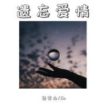

孙家山
============================

|  |  |
| :--: | :-- |
| [ 孙家山](https://i.xiami.com/jssfwh) | **播放数**: 9243207 **粉丝数**: 212 **评论数**: 15 **地区**: China 中国大陆 **风格**: 国语流行 Mandarin Pop  |

## 档案

## 专辑

| 名称 | 语种 | 唱片公司 | 发行时间 | 专辑类别 | 专辑风格 |
| :--: | :-- | :-- | :-- | :-- | :-- |
| [ 耗尽一生](./albums/5022313849.md) | 国语 | 孙放文化 | 2020年12月31日 | EP, 单曲 | 流行 Pop, 国语流行 Mandarin Pop |
| [ 我干了你随意](./albums/5021705452.md) | 国语 | 孙放文化 | 2020年10月22日 | EP, 单曲 | 流行 Pop, 国语流行 Mandarin Pop |
| [ 情歌唱到九十九](./albums/5021723143.md) | 国语 | 孙放文化 | 2020年10月22日 | EP, 单曲 | 流行 Pop, 国语流行 Mandarin Pop |
| [ 喜庆临门](./albums/5021710898.md) | 国语 | 孙放文化 | 2020年10月22日 | EP, 单曲 | 流行 Pop, 国语流行 Mandarin Pop |
| [ 亲爱的咱不哭](./albums/5021708387.md) | 国语 | 孙放文化 | 2020年10月22日 | EP, 单曲 | 流行 Pop, 国语流行 Mandarin Pop |
| [ 遗忘爱情](./albums/5021706941.md) | 国语 | 孙放文化 | 2020年10月22日 | EP, 单曲 | 流行 Pop, 国语流行 Mandarin Pop |
| [ 躲了又躲](./albums/5021660997.md) | 国语 | 孙放文化 | 2020年10月15日 | EP, 单曲 | 国语流行 Mandarin Pop |
| [ 带着回忆去分手](./albums/5021659927.md) | 国语 | 孙放文化 | 2020年10月14日 | EP, 单曲 | 国语流行 Mandarin Pop |
| [ 重新来过](./albums/5021654845.md) | 国语 | 孙放文化 | 2020年10月13日 | EP, 单曲 | 国语流行 Mandarin Pop |
| [ 被爱情遗忘的玫瑰](./albums/5021656277.md) | 国语 | 孙放文化 | 2020年10月12日 | EP, 单曲 | 流行 Pop, 国语流行 Mandarin Pop |
| [ 爱情北极圈](./albums/5021470737.md) | 国语 | 孙放文化 | 2020年09月17日 | EP, 单曲 | 国语流行 Mandarin Pop |
| [ 爱已结束](./albums/5021472209.md) | 国语 | 孙放文化 | 2020年09月17日 | EP, 单曲 | 国语流行 Mandarin Pop |
| [ 爱到尽头才知道](./albums/5021473663.md) | 国语 | 孙放文化 | 2020年09月17日 | EP, 单曲 | 国语流行 Mandarin Pop |
| [ 爱情当游戏](./albums/5021471721.md) | 国语 | 孙放文化 | 2020年09月17日 | EP, 单曲 | 国语流行 Mandarin Pop |
| [ 爱入苦海](./albums/5021466500.md) | 国语 | 孙放文化 | 2020年09月17日 | EP, 单曲 | 国语流行 Mandarin Pop |
| [ 爱情路上你我她](./albums/5021467455.md) | 国语 | 孙放文化 | 2020年09月17日 | EP, 单曲 | 国语流行 Mandarin Pop |
| [ 爱情可遇不可求](./albums/5021460232.md) | 国语 | 孙放文化 | 2020年09月15日 | EP, 单曲 | 国语流行 Mandarin Pop |
| [ 错过不是我的错](./albums/5021434793.md) | 国语 | 孙放文化 | 2020年09月10日 | EP, 单曲 | 国语流行 Mandarin Pop |
| [ 馥寿颂歌](./albums/5021438567.md) | 国语 | 孙放文化 | 2020年09月10日 | EP, 单曲 | 国语流行 Mandarin Pop |
| [ 或许是我太傻](./albums/5021420789.md) | 国语 | 孙放文化 | 2020年09月07日 | EP, 单曲 | 国语流行 Mandarin Pop |
| [ 被爱情遗忘的玫瑰](./albums/2105205486.md) | 国语 | 孙放文化 | 2019年09月02日 | 录音室专辑 | 流行 Pop |
| [ 放不下的人是你](./albums/2104150478.md) | 国语 | 孙放文化 | 2018年10月26日 | 录音室专辑 | 流行舞曲 Dance-Pop |
| [ 让我最后为你唱一首歌](./albums/2104040225.md) | 国语 | 孙放文化 | 2018年09月10日 | EP, 单曲 | 国语流行 Mandarin Pop |
| [ 我可以默默爱你](./albums/2102751896.md) | 国语 | 孙放文化 | 2017年05月22日 | EP, 单曲 | 流行 Pop, 国语流行 Mandarin Pop |
| [ 情歌唱到九十九](./albums/2102737773.md) | 国语 | 独立发行 | 2017年04月25日 | EP, 单曲 | 国语流行 Mandarin Pop |
| [ 这一首旧情歌](./albums/2102692647.md) | 国语 | 孙放文化 | 2017年02月13日 | EP, 单曲 |  |
| [ 带着回忆去分手（燃烧版）](./albums/2102405067.md) | 国语 |  | 2016年10月08日 | EP, 单曲 |  |
| [ 买单](./albums/2102403485.md) | 国语 |  | 2016年09月29日 | EP, 单曲 |  |
| [ 我干了你随意](./albums/2102400736.md) | 国语 | 孙放文化 | 2016年09月14日 | EP, 单曲 | 流行 Pop, 国语流行 Mandarin Pop |
| [ 带着回忆去分手-对唱](./albums/2100354320.md) | 国语 |  | 2016年06月12日 | EP, 单曲 | 国语流行 Mandarin Pop |
| [ 亲爱的咱不哭](./albums/2100345150.md) | 国语 | 孙放文化 | 2016年06月02日 | EP, 单曲 |  |
| [ 喜庆临门](./albums/2100254686.md) | 国语 | 酝星文化 | 2015年12月30日 | EP, 单曲 |  |
| [ 躲了又躲](./albums/2100175629.md) | 国语 | 酝星文化 | 2015年08月06日 | EP, 单曲 |  |
| [ 带着回忆去分手](./albums/726054204.md) | 国语 | 酝星文化 | 2015年03月10日 | EP, 单曲 |  |
| [ 爱情当游戏](./albums/1123015383.md) | 国语 | 酝星文化 | 2015年02月03日 | EP, 单曲 |  |
| [ 爱已结束(Dj版)](./albums/2103604199.md) | 国语 | 酝星文化 | 2014年11月03日 | EP, 单曲 |  |
| [ 爱已结束](./albums/511699266.md) | 国语 | 酝星文化 | 2014年09月24日 | EP, 单曲 |  |
| [ 爱到尽头才知道](./albums/2009220693.md) | 国语 | 歌缘文化 | 2014年08月28日 | EP, 单曲 |  |
| [ 2016华语流行集锦二](./albums/2103604180.md) | 国语 | 酝星文化 | 2014年08月21日 | EP, 单曲 |  |
| [ 爱情北极圈](./albums/908590480.md) | 国语 | 金麦田文化 | 2014年08月18日 | EP, 单曲 |  |

## 评论

|  |  |  |  |
| :-- | :-- | :-- | :-- |
|  [虾米用户](https://emumo.xiami.com/u/358104299) 悲观的唯心存在现实解构虚... 2020-04-27 04:31 赞(0) 踩(0) | 
40872
 |
|  [虾米用户](https://emumo.xiami.com/u/413241744)  2019-01-27 09:17 赞(0) 踩(0) | 
谢谢了大家
 |
|  [虾米用户](https://emumo.xiami.com/u/293692544) 你敢给我说话吗？我咬你 2018-09-06 17:10 赞(3) 踩(0) | 
凑
 |
|  [虾米用户](https://emumo.xiami.com/u/323987299)  2018-04-16 18:27 赞(2) 踩(0) | 
名落孙山
 |
|  [虾米用户](https://emumo.xiami.com/u/293692544) 你敢给我说话吗？我咬你 2018-03-30 05:05 赞(2) 踩(0) | 
好听
 |
|  [虾米用户](https://emumo.xiami.com/u/293692544) 你敢给我说话吗？我咬你 2017-12-31 09:45 赞(2) 踩(0) | 
好听
 |
|  [虾米用户](https://emumo.xiami.com/u/332807636)  2017-11-07 15:57 赞(2) 踩(0) | 
   
 |
|  [虾米用户](https://emumo.xiami.com/u/332807636)  2017-11-07 15:55 赞(2) 踩(0) | 
好听
 |
|  [虾米用户](https://emumo.xiami.com/u/277297672) 孙家山，门丽，谢谢你们把... 2017-07-30 20:26 赞(2) 踩(0) | 
认识你好高兴，听到你的歌心里好甜谢谢你把快乐带给我们，只说一声心苦了，忙碌中保重身体，照顾好自己，敬拜，
 |
|  [虾米用户](https://emumo.xiami.com/u/277297672) 孙家山，门丽，谢谢你们把... 2017-07-30 20:22 赞(3) 踩(0) | 
唱的太好听了，人帅歌甜美，
 |
|  [虾米用户](https://emumo.xiami.com/u/29537993) 高山流水 2017-07-20 21:58 赞(3) 踩(0) | 
好听
 |
|  [虾米用户](https://emumo.xiami.com/u/168226616)  2016-06-15 08:54 赞(4) 踩(0) | 
我刚入驻了虾米音乐人，欢迎大家来我的个人主页，收听我的最新音乐
 |
|  [虾米用户](https://emumo.xiami.com/u/11763865)  2016-02-10 14:24 赞(4) 踩(0) | 

 |
| ⇒ |  [虾米用户](https://emumo.xiami.com/u/332807636)  2017-11-07 15:56 赞(0) 踩(0) | 

 |
|  [虾米用户](https://emumo.xiami.com/u/43144581)  2015-09-05 00:30 赞(3) 踩(0) | 
你好！
 |
