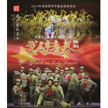

戈壁青春
============================

|  |  |
| :--: | :-- |
| [ 戈壁青春](https://emumo.xiami.com/album/2100208030) | **艺人**: [胡莎莎](../index.md) **语种**: 国语 **唱片公司**: 独立发行 **发行时间**: 2015年09月25日 **专辑类别**: EP, 单曲 **专辑风格**:  **播放数**: 12691 **收藏数**: 18 **评论数**: 1  |

## 简介

舞剧《戈壁青春》讲述了支边青年建国在激情燃烧的年代来到了戈壁大漠中建设兵团的曲折故事，贯穿了三代人的时空和情感。作品选择了那些平凡而真实，浮沉在他乡命运中的兵团人为原型。他们无法左右历史，甚至也无法左右自己的命运，但他们往往在困苦与艰难中，对家庭与民族、对爱与恨、对懦弱与牺牲，凭着自己的本性作出惊人的抉择。每个人都在戈壁上书写了自己真实的青春！

## 曲目

## 评论

|  |  |  |
| :-- | :-- | :-- |
|  [虾米用户](https://emumo.xiami.com/u/287081868)  2017-04-09 00:29 赞(0) 踩(0) | 
胡莎莎唱哭 很多观众    
 |
