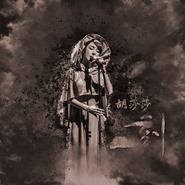

胡莎莎
============================

|  |  |
| :--: | :-- |
| [ 胡莎莎](https://i.xiami.com/hushasha) | **播放数**: 2132464 **粉丝数**: 1078 **评论数**: 93 **地区**: China 中国大陆 **风格**: 国语流行 Mandarin Pop  |

## 档案

我是胡莎莎，我是胡苹果，我是唱作歌手，厨子，演员，摄影爱好者，融合音乐实验员，动物保护者，O型血伪处女座劳模儿......随时拿起一个苹果啃，唱唱唱起心爱的小Jazz！希望和大家分享更多更美好的音乐和事情，么么哒！：） 
工作联络：  shashagt@126.com 
新浪微博：胡莎莎Apple

## 专辑

| 名称 | 语种 | 唱片公司 | 发行时间 | 专辑类别 | 专辑风格 |
| :--: | :-- | :-- | :-- | :-- | :-- |
| [ 在你身边](./albums/2104937506.md) | 国语 | 阿鲲音乐 | 2019年05月27日 | EP, 单曲 |  |
| [ 往事](./albums/2104652195.md) | 国语 | 阿鲲音乐 | 2019年03月10日 | EP, 单曲 | 国语流行 Mandarin Pop |
| [ 飘荡](./albums/2104387073.md) | 国语 | 自在天浩 | 2018年12月18日 | EP, 单曲 | 国语流行 Mandarin Pop |
| [ 桃花罪](./albums/2104052932.md) | 国语 | 美力星空 | 2018年09月25日 | EP, 单曲 | 国语流行 Mandarin Pop |
| [ 了愿](./albums/2103498961.md) | 国语 | 自在天浩 | 2018年01月24日 | EP, 单曲 | 古风 GuFeng Music |
| [ 一刻](./albums/2103491826.md) | 国语 | 自在天浩 | 2018年01月17日 | EP, 单曲 |  |
| [ 相恋](./albums/2102851369.md) | 国语 | 看见文娱 | 2017年09月05日 | EP, 单曲 |  |
| [ 你可能不会知道](./albums/2102851368.md) | 国语 | 成美博音 | 2017年08月03日 | EP, 单曲 |  |
| [ 京剧猫](./albums/2104453433.md) | 国语 | 璀璨星空 | 2016年12月28日 | 原声带, 影视音乐 |  |
| [ 给妈妈的信](./albums/2102657839.md) | 国语 | 谭旋音乐工作室 | 2016年11月29日 | EP, 单曲 |  |
| [ 戈壁青春](./albums/2100208030.md) | 国语 | 独立发行 | 2015年09月25日 | EP, 单曲 |  |
| [ 爱生态](./albums/2100178035.md) | 国语 | 中新天津生态城旅游局 | 2015年08月12日 | EP, 单曲 | 国语流行 Mandarin Pop |
| [ 控烟神曲](./albums/633480867.md) | 国语 | 金麦田文化 | 2015年06月04日 | EP, 单曲 |  |
| [ Soul Fly With Me](./albums/231051506.md) | 国语 | 独立发行 | 2015年05月08日 | EP, 单曲 | 爵士流行 Jazz Pop |
| [ 胡莎莎Page.1 Cover](./albums/1830982497.md) | 国语 | 独立发行 | 2015年05月06日 | 合集, 杂锦 | 融合爵士 Jazz Fusion |

## 评论

|  |  |  |  |
| :-- | :-- | :-- | :-- |
|  [虾米用户](https://emumo.xiami.com/u/412295750) 永浴爱河 2020-07-13 07:06 赞(0) 踩(0) | 
今晨被她的《九儿》震撼到了
 |
|  [虾米用户](https://emumo.xiami.com/u/434811144)  2020-06-07 14:09 赞(0) 踩(0) | 
喜欢！
 |
|  [虾米用户](https://emumo.xiami.com/u/442767801)  2020-06-02 20:13 赞(1) 踩(0) | 
京剧猫京剧猫
 |
|  [虾米用户](https://emumo.xiami.com/u/342430221) 我还没想好要写什么... 2020-01-21 17:46 赞(0) 踩(0) | 
不会唱歌的厨子不是好演员   
 |
|  [虾米用户](https://emumo.xiami.com/u/357000146)  2019-12-02 00:42 赞(0) 踩(0) | 
很喜欢你的作品
 |
|  [虾米用户](https://emumo.xiami.com/u/123246788) Music is my ... 2019-06-28 19:03 赞(1) 踩(0) | 
好听！ 
 |
|  [虾米用户](https://emumo.xiami.com/u/336113720) 啦啦啦 2019-05-22 07:28 赞(0) 踩(0) | 
加油
 |
|  [虾米用户](https://emumo.xiami.com/u/26227157)   2019-01-13 17:32 赞(6) 踩(0) | 
难得的声音，不通透中的通透感……难得，请您坚持下去。支持您。
 |
|  [虾米用户](https://emumo.xiami.com/u/405626135)  2019-01-12 22:12 赞(1) 踩(0) | 
我不看电视！无意间听别人手机放你唱的九儿，顿时喜欢！真好听！
 |
|  [虾米用户](https://emumo.xiami.com/u/16600663)  2018-11-18 22:33 赞(1) 踩(0) | 
九儿找来的，好喜欢莎莎唱的这个版本 
 |
|  [虾米用户](https://emumo.xiami.com/u/287367267)  2018-10-22 17:56 赞(0) 踩(0) | 
喜欢
 |
|  [虾米用户](https://emumo.xiami.com/u/1009155)  2018-08-09 15:13 赞(1) 踩(0) | 
胡莎莎的九儿唱出了高密贫苦百姓的不幸与抗争。血泪生活血泪歌！
 |
|  [虾米用户](https://emumo.xiami.com/u/255603981)  2018-07-20 17:07 赞(0) 踩(0) | 
唱作歌手？新名词？
 |
|  [虾米用户](https://emumo.xiami.com/u/377809886) 吾将上下而求索 2018-07-10 18:01 赞(1) 踩(0) | 
九儿 只听胡莎莎 
 |
|  [虾米用户](https://emumo.xiami.com/u/336113720) 啦啦啦 2018-05-06 08:21 赞(0) 踩(0) | 
唱的好
 |
|  [虾米用户](https://emumo.xiami.com/u/340031440)  2018-04-10 01:13 赞(0) 踩(0) | 
九儿唱的好，想听你。翻唱的经典曲目
 |
|  [虾米用户](https://emumo.xiami.com/u/253729545)  2018-03-27 22:49 赞(0) 踩(0) | 
希望你能有更R&amp;amp;B的作品
 |
|  [虾米用户](https://emumo.xiami.com/u/320739033)  2018-01-24 12:03 赞(4) 踩(0) | 
超喜欢十三月 
 |
|  [虾米用户](https://emumo.xiami.com/u/330644106)  2017-10-26 08:00 赞(0) 踩(0) | 
我特喜欢九儿这首歌，
 |
|  [虾米用户](https://emumo.xiami.com/u/43663684) 世界太小，我陪你去到天涯... 2017-07-04 00:11 赞(22) 踩(0) | 
九儿这首歌胡莎莎唱的完全碾压韩红，甩她几条街
 |
|  [虾米用户](https://emumo.xiami.com/u/285355592)   2017-05-10 10:33 赞(14) 踩(0) | 
莎莎，我关注你。九儿这首歌我觉得你唱得比韩红老师唱得好。
 |
|  [虾米用户](https://emumo.xiami.com/u/277496986)  2017-04-25 00:27 赞(3) 踩(0) | 
她的《十三月》！！！超好听呐*^o^*
 |
|  [虾米用户](https://emumo.xiami.com/u/35509231) 提灯天后  策马小僧 2017-03-31 17:02 赞(0) 踩(0) | 
加油呀
 |
|  [虾米用户](https://emumo.xiami.com/u/35509231) 提灯天后  策马小僧 2017-03-31 17:02 赞(0) 踩(0) | 
加油呀
 |
|  [虾米用户](https://emumo.xiami.com/u/279806459)  2017-03-20 14:37 赞(4) 踩(0) | 
最正宗的九儿，永远无人取代。
 |
|  [虾米用户](https://emumo.xiami.com/u/21979358) 我只是个可怜的小孩 2017-02-10 01:01 赞(4) 踩(0) | 
不会是…………冰箱的那个吧………………
 |
| ⇒ |  [虾米用户](https://emumo.xiami.com/u/283982083)  2017-05-01 18:04 赞(0) 踩(0) | 
是滴~~
 |
| ⇒ |  [虾米用户](https://emumo.xiami.com/u/21979358) 我只是个可怜的小孩 2017-05-01 19:11 赞(0) 踩(0) | 
<q><b>olivia晴说：</b></q>
 |
| ⇒ |  [虾米用户](https://emumo.xiami.com/u/275070407) 항상 같이 가자.우리 ... 2017-10-07 01:19 赞(0) 踩(0) | 
 
 |
| ⇒ |  [虾米用户](https://emumo.xiami.com/u/45396876) 嗯 2017-12-02 21:51 赞(0) 踩(0) | 
不敢相信！
 |
|  [虾米用户](https://emumo.xiami.com/u/26993155)  2017-02-09 00:51 赞(11) 踩(0) | 
她的九儿很令人惊艳。
 |
|  [虾米用户](https://emumo.xiami.com/u/247803299) 时间都停了 他们都回来了... 2017-02-06 22:08 赞(3) 踩(0) | 
其实我想听京剧猫来着 （同样是阿鲲做的曲啊，怎么唱的人就是不火呢）
 |
| ⇒ |  [虾米用户](https://emumo.xiami.com/u/209733202) 我就这么拗 2017-08-24 18:33 赞(0) 踩(0) | 
京剧猫她唱的超喜欢啊！而且我特别喜欢她的声音
 |
| ⇒ |  [虾米用户](https://emumo.xiami.com/u/134149700)  2020-06-12 18:20 赞(0) 踩(0) | 
感觉京剧猫好可怜，同样是猫罗小黑那么火而京剧猫只有老粉爱，那么好听的歌也只有京剧猫的老粉喜欢，幸好京剧猫还有老粉撑起来
 |
|  [虾米用户](https://emumo.xiami.com/u/207471063) 嗨！大家好~ 交个朋友！... 2017-02-02 21:07 赞(3) 踩(0) | 
胡莎莎，我很喜欢你的歌声，很独特。听了你唱的&amp;lt;迷心局&amp;gt;就深深被你打动了~尤其是那一段“不能自已“听了都心碎 
 |
|  [虾米用户](https://emumo.xiami.com/u/268996468)  2017-01-31 15:34 赞(1) 踩(0) | 
《迷心局》中"黄沙中的一抹绿"指的是翠浓吗？她的命运很悲惨。
 |
|  [虾米用户](https://emumo.xiami.com/u/7421598)  2017-01-27 00:24 赞(0) 踩(0) | 
下架了好多，到底在哪里常驻？
 |
|  [虾米用户](https://emumo.xiami.com/u/261843657)  2017-01-14 15:52 赞(0) 踩(0) | 
好听
 |
|  [虾米用户](https://emumo.xiami.com/u/43663684) 世界太小，我陪你去到天涯... 2016-12-15 17:22 赞(2) 踩(0) | 
九儿演绎的淋漓尽致！绝对完美，完胜韩红版！
 |
|  [虾米用户](https://emumo.xiami.com/u/15865331)  2016-10-16 18:45 赞(1) 踩(0) | 
匆匆那年是古风歌手清漪原录音，我从百度云下的虾米直接合并了，都是唱歌的，要脸可好？
 |
|  [虾米用户](https://emumo.xiami.com/u/50017584) 我到底有多爱金属 2016-07-20 12:49 赞(0) 踩(0) | 
我莎姐
 |
|  [虾米用户](https://emumo.xiami.com/u/8111102) 浮光背道而驰，长满白发。 2016-06-11 23:07 赞(0) 踩(0) | 
最喜欢《唱念爱》《十三月》《三生叹》，每次惊艳都有不同feel，希望多多跟阿鲲老师合作呀
 |
|  [虾米用户](https://emumo.xiami.com/u/113354784) 只有这里有真正的自己 2016-06-04 17:36 赞(0) 踩(0) | 
最爱你了
 |
|  [虾米用户](https://emumo.xiami.com/u/6193730) 我还没想好要写什么... 2016-03-29 20:58 赞(0) 踩(0) | 
听了一首LOVING YOU 只有做作两字 吉他让我想到你的甜蜜
 |
|  [虾米用户](https://emumo.xiami.com/u/15275403) you can find... 2016-02-22 20:17 赞(0) 踩(0) | 
一位厨师
 |
|  [虾米用户](https://emumo.xiami.com/u/43897019)  2015-12-21 13:58 赞(0) 踩(0) | 
支持
 |
|  [虾米用户](https://emumo.xiami.com/u/78176540)  2015-12-06 22:02 赞(0) 踩(0) | 
挺喜欢听你的音乐的!
 |
|  [虾米用户](https://emumo.xiami.com/u/49801362) 96后歌手 2015-11-24 13:28 赞(0) 踩(0) | 
姐姐唱歌好棒     可不可以和你交朋友
 |
|  [虾米用户](https://emumo.xiami.com/u/570997) 励志成为一名出色的音乐人 2015-11-23 07:17 赞(0) 踩(0) | 
Somewhat Jazz, but no way this is Jazz Fusion !!!
 |
|  [虾米用户](https://emumo.xiami.com/u/354) 这家伙很聪明什么也没留下... 2015-08-21 03:42 赞(1) 踩(0) | 
唱念爱Demo比好歌曲改后的好很多，那种调皮可爱略带疯癫的情绪质感，被选秀包装的配器改词弄得弱化了太多，宁可初选是改编后的版本，最后改成Demo这样，看好你！！！坚持自己，你会是最棒的
 |
| ⇒ |  [虾米用户](https://emumo.xiami.com/u/47577064) 杂食耳 2016-02-22 10:08 赞(0) 踩(0) | 
我原来也喜欢原版的，不知道为啥把孟婆特色改成孟婆汤了
 |
|  [虾米用户](https://emumo.xiami.com/u/354) 这家伙很聪明什么也没留下... 2015-08-20 05:16 赞(0) 踩(0) | 
真棒
 |
|  [虾米用户](https://emumo.xiami.com/u/1231191) 杀人不过头点地 2015-07-25 16:24 赞(1) 踩(0) | 
哎哟喂~~~~让我想起了Blossom Dearie和Stacey Kent
 |
|  [虾米用户](https://emumo.xiami.com/u/26261001)  2015-07-15 00:26 赞(1) 踩(0) | 
我觉得你的世界真的遥不可及
 |
|  [虾米用户](https://emumo.xiami.com/u/2237955) 耳即我心 2015-05-14 02:48 赞(0) 踩(0) | 
我就喜欢连绵不断的bossa nova，请加油。
 |
|  [虾米用户](https://emumo.xiami.com/u/4452058)  2015-05-11 11:25 赞(1) 踩(0) | 
做到比说道难多了
 |
|  [虾米用户](https://emumo.xiami.com/u/4400366) 再也不见 2015-05-10 09:54 赞(0) 踩(0) | 
囍
 |
|  [虾米用户](https://emumo.xiami.com/u/47260257) ~~ 2015-05-09 19:46 赞(0) 踩(0) | 
san h dul jin    :   ) bi chama dul ta  :  )
 |
|  [虾米用户](https://emumo.xiami.com/u/32363368) 网易云 同名 2015-05-09 11:31 赞(0) 踩(0) | 
看好您
 |
|  [虾米用户](https://emumo.xiami.com/u/32331040)  2015-05-09 03:16 赞(0) 踩(0) | 
加油[带墨镜笑]对我有印象吗
 |
|  [虾米用户](https://emumo.xiami.com/u/2987825) 双耳听出希望之音 2015-05-08 22:22 赞(0) 踩(0) | 
胡苹果 
 |
|  [虾米用户](https://emumo.xiami.com/u/45053056)  2015-05-08 20:46 赞(0) 踩(0) | 
内地能出一个胡莎莎这样的歌手蛮难得的
 |
|  [虾米用户](https://emumo.xiami.com/u/6304769)  2015-05-08 20:29 赞(0) 踩(0) | 
提个可能不那么中听的个人意见，感觉人声太抢太放了，好几个作品里弱化人声可能会更舒服点，或者是唱的时候细节处注意收一下？
 |
|  [虾米用户](https://emumo.xiami.com/u/12260543) Without Musi... 2015-05-08 19:21 赞(0) 踩(0) | 
►▸
 |
|  [虾米用户](https://emumo.xiami.com/u/6010002)  2015-05-07 16:09 赞(72) 踩(0) | 
我刚入驻了虾米音乐人，欢迎大家来我的个人主页，收听我的最新音乐
 |
| ⇒ |  [虾米用户](https://emumo.xiami.com/u/11871209)   2015-05-07 17:03 赞(0) 踩(0) | 
duang~
 |
| ⇒ |  [虾米用户](https://emumo.xiami.com/u/8337431) 以乐会友 2015-05-07 23:06 赞(0) 踩(0) | 
欢迎
 |
| ⇒ |  [虾米用户](https://emumo.xiami.com/u/6218683)  2016-11-16 15:56 赞(0) 踩(0) | 
我是听到九儿这歌找到这儿的。歌真好听
 |
| ⇒ |  [虾米用户](https://emumo.xiami.com/u/263040224)  2017-01-18 14:37 赞(0) 踩(0) | 
大爱《迷心局》
 |
| ⇒ |  [虾米用户](https://emumo.xiami.com/u/86109316) 白鹏 2017-01-30 07:58 赞(0) 踩(0) | 
我喜欢音乐因为它能给快乐我也是厨师
 |
| ⇒ |  [虾米用户](https://emumo.xiami.com/u/343903399) 这家伙很聪明，无需留下点... 2018-01-23 17:23 赞(0) 踩(0) | 
加油！用每一个《一刻》换一次闪亮的人生
 |
| ⇒ |  [虾米用户](https://emumo.xiami.com/u/13373050) 暂无签名~ 2018-11-26 09:00 赞(0) 踩(0) | 
听九儿转过来的，看到介绍喜欢摄影，从哪能看到你的摄影作品
 |
| ⇒ |  [虾米用户](https://emumo.xiami.com/u/274719486)   2018-12-09 20:36 赞(0) 踩(0) | 
为你“定制”的歌曲太少了，努力啊！！！
 |
| ⇒ |  [虾米用户](https://emumo.xiami.com/u/422904738)  2020-12-06 22:00 赞(0) 踩(0) | 
喜欢听你的歌支持
 |
|  [虾米用户](https://emumo.xiami.com/u/49826792)  2015-05-05 00:17 赞(0) 踩(0) | 
好听 
 |
|  [虾米用户](https://emumo.xiami.com/u/11871209)   2015-05-04 19:34 赞(0) 踩(0) | 
艾玛~
 |
|  [虾米用户](https://emumo.xiami.com/u/1411564) 耳朵想旅行 2015-05-01 19:08 赞(0) 踩(0) | 
胡总别太忙了，多唱点歌吧~~~
 |
|  [虾米用户](https://emumo.xiami.com/u/26035916)   2015-05-01 15:43 赞(0) 踩(0) | 
终于发歌儿了啊  
 |
|  [虾米用户](https://emumo.xiami.com/u/3391052) 公众号：HP_Studi... 2015-04-04 15:16 赞(1) 踩(0) | 
大娃你终于申请了~~~~~
 |
|  [虾米用户](https://emumo.xiami.com/u/1182761) 松任谷由实的迷弟 2015-04-03 22:03 赞(0) 踩(0) | 
来啦
 |
|  [虾米用户](https://emumo.xiami.com/u/26035916)   2015-04-03 21:55 赞(0) 踩(0) | 
快快发歌儿  
 |
|  [虾米用户](https://emumo.xiami.com/u/11871209)   2015-04-03 21:37 赞(0) 踩(0) | 
啊啊啊啊啊啊啊啊啊啊啊啊啊啊啊啊啊啊啊啊啊啊
 |
|  [虾米用户](https://emumo.xiami.com/u/6411859)  2015-02-25 14:23 赞(0) 踩(0) | 
电视剧红高粱最后九儿那场戏，非常好听！
 |
|  [虾米用户](https://emumo.xiami.com/u/22861729)  2015-02-01 05:00 赞(0) 踩(0) | 
莎莎是我最喜欢的歌手，声线非常好。
 |
|  [虾米用户](https://emumo.xiami.com/u/5386201)  2015-01-04 00:41 赞(0) 踩(0) | 
胡莎莎2015演出日期：北京雍和宫糖果三层 2015-01-11 周日 19:30乐童售票地址：<a href="http://www.musikid.com/tour/326" target="_blank" rel="nofollow noreferrer noopener">http://www.musikid.com/tour/326</a>
 |
|  [虾米用户](https://emumo.xiami.com/u/33309063) 梦想是要有的，万一实现了... 2014-12-04 08:42 赞(1) 踩(0) | 
这是我老师大学的同班同学！！跟我有什么关系？
 |
|  [虾米用户](https://emumo.xiami.com/u/15107919) 音乐人最希望有知音 2014-11-23 11:57 赞(0) 踩(0) | 
我以为是那个极品女士的胡莎莎，但是好像不像呀，亚麻跌~~~~
 |
| ⇒ |  [虾米用户](https://emumo.xiami.com/u/3380878) 電子時代的自然之聲 2015-04-30 15:59 赞(0) 踩(0) | 
那是于莎莎
 |
|  [虾米用户](https://emumo.xiami.com/u/7732199) 请把好歌曲收进我的电台 2014-11-21 16:36 赞(0) 踩(0) | 
还有其他歌吗
 |
| ⇒ |  [虾米用户](https://emumo.xiami.com/u/11871209)   2014-11-22 22:22 赞(0) 踩(0) | 
唱念爱 和美妙时刻
 |
|  [虾米用户](https://emumo.xiami.com/u/36237395)   2014-11-20 01:38 赞(2) 踩(0) | 
唱念爱，从啪啪上就很喜欢呢
 |
|  [虾米用户](https://emumo.xiami.com/u/7366120) 一切皆有可能 2014-11-19 10:05 赞(0) 踩(0) | 
感觉有点像周迅的声音呢
 |
|  [虾米用户](https://emumo.xiami.com/u/9193028)  2014-11-18 20:42 赞(0) 踩(0) | 
听《九儿》这首歌知道的莎莎，支持一下莎莎，希望虾米能收录莎莎更多的歌曲
 |
