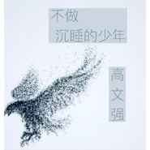

不做沉睡的少年
============================

|  |  |
| :--: | :-- |
| [ 不做沉睡的少年](https://emumo.xiami.com/album/2104495951) | **艺人**: [高文强](../index.md) **语种**: 国语 **唱片公司**:  **发行时间**: 2019年01月19日 **专辑类别**: EP, 单曲 **专辑风格**: 国语流行 Mandarin Pop **播放数**: 934 **收藏数**: 0 **评论数**: 0  |

## 简介

《不做沉睡的少年》2019高文强全新创作单曲，新的一年，  
给大家一个正能量开篇。  
  
过去的我们生活很简单，几个小伙伴且打成一片  
  
而现在的生活不一样了，网游已经剥夺了一切  
  
而高文强写的这首歌曲是想告诉大家，不要做游戏里的  
  
自己，走出游戏才是真正的自己。

## 曲目

## 评论

|  |  |  |  |
| :-- | :-- | :-- | :-- |
