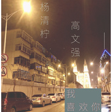
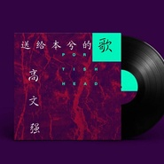

高文强
============================

|  |  |
| :--: | :-- |
| [ 高文强](https://i.xiami.com/gaowenqiang) | **地区**: China 中国大陆 **风格**: 国语流行 Mandarin Pop **播放数**: 3455328 **粉丝数**: 46 **评论数**: 12  |

## 档案

高文强，出生1996年11月25日，独立音乐人、词曲编创作包办、音乐制作人； 
2012年，发表多首个人原创单曲； 
2013年，筹备第一张专辑； 
2014年，发表个人全创作EP专辑《柏拉图不靠谱？》； 
6月，发表单曲《我的女神》； 
7月，发表单曲《夜色好景》； 
2015年，独立发行个人全创作专辑《淡心勿谈心》 
并在次日演出网TOP500榜排行30及周专辑排行榜第二名；并取得全网月点击率87万的成绩； 
6月，发表单曲《错过你的温柔就别后悔不温柔》并斩获酷我音乐点击三百万的好成绩； 
7月，发表全新风格单曲《怪我咯》； 
8月，全网发行单曲《男人下厨房还要上厅堂》在全民k歌得到了很好的传唱热潮； 
同月七夕，携《新任女朋友》 强势出击；

## 专辑

| 名称 | 语种 | 唱片公司 | 发行时间 | 专辑类别 | 专辑风格 |
| :--: | :-- | :-- | :-- | :-- | :-- |
| [ 晚风](./albums/2105536670.md) | 国语 |  | 2019年12月01日 | EP, 单曲 | 国语流行 Mandarin Pop |
| [ 世间美好与你环环相扣（抖音版）](./albums/2105380206.md) | 国语 |  | 2019年10月27日 | EP, 单曲 | 国语流行 Mandarin Pop |
| [ 像极了爱情](./albums/2104596507.md) | 国语 | 独立发行 | 2019年02月16日 | EP, 单曲 | 流行 Pop |
| [ 不做沉睡的少年](./albums/2104495951.md) | 国语 |  | 2019年01月19日 | EP, 单曲 | 国语流行 Mandarin Pop |
| [ 七月的风八月的雨](./albums/2104288933.md) | 国语 |  | 2018年11月27日 | EP, 单曲 | 国语流行 Mandarin Pop |
| [ 旅行](./albums/2104076070.md) | 国语 | 独立发行 | 2018年09月30日 | EP, 单曲 | 国语流行 Mandarin Pop |
| [ 伪装](./albums/2103723999.md) | 国语 | 独立发行 | 2018年05月31日 | EP, 单曲 | 国语流行 Mandarin Pop |
| [ 青春不散场](./albums/2103723998.md) | 国语 | 独立发行 | 2018年05月25日 | EP, 单曲 | 国语流行 Mandarin Pop |
| [ 我喜欢你](./albums/2103648987.md) | 国语 | 独立发行 | 2018年03月28日 | EP, 单曲 | 国语流行 Mandarin Pop, 流行 Pop |
| [ 我是狮子座](./albums/2103561066.md) | 国语 | 独立发行 | 2018年02月25日 | EP, 单曲 | 国语流行 Mandarin Pop |
| [ 离开的爱](./albums/2103522768.md) | 国语 | 独立发行 | 2018年02月09日 | EP, 单曲 | 国语流行 Mandarin Pop, 流行 Pop |
| [ 送给本兮的歌](./albums/2102811626.md) | 国语 | 独立发行 | 2017年08月10日 | EP, 单曲 | 国语流行 Mandarin Pop |
| [ 勿忘初心](./albums/2102809551.md) | 国语 | 独立发行 | 2017年08月07日 | EP, 单曲 | 国语流行 Mandarin Pop |
| [ 旧城](./albums/2102708165.md) | 国语 | 独立发行 | 2017年03月10日 | EP, 单曲 | 国语流行 Mandarin Pop |
| [ 风云突变](./albums/2100264686.md) | 国语 | 独立发行 | 2016年01月23日 | 录音室专辑 | 国语流行 Mandarin Pop |
| [ 新任女朋友](./albums/2100180901.md) | 国语 | 独立发行 | 2015年08月20日 | EP, 单曲 | 国语流行 Mandarin Pop |
| [ 男人下厨房还要上厅堂](./albums/2100174127.md) | 国语 | 独立发行 | 2015年08月03日 | EP, 单曲 | 国语流行 Mandarin Pop |
| [ 怪我咯](./albums/436034765.md) | 国语 | 独立发行 | 2015年07月03日 | EP, 单曲 | 国语流行 Mandarin Pop |
| [ 错过你的温柔就别后悔不温柔](./albums/2031795071.md) | 国语 | 独立发行 | 2015年05月17日 | EP, 单曲 | 国语流行 Mandarin Pop |
| [ 淡心勿谈心](./albums/1422846358.md) | 国语 | 独立发行 | 2015年02月02日 | 录音室专辑 | 国语流行 Mandarin Pop |
| [ 高文强2015新专辑发布会](./albums/1922672479.md) | 国语 | 独立发行 | 2015年01月31日 | 现场专辑 | 国语流行 Mandarin Pop |
| [ 我的女神流行](./albums/820344334.md) | 国语 | 独立发行 | 2015年01月04日 | EP, 单曲 | 国语流行 Mandarin Pop |
| [ 夜色好景](./albums/1808064104.md) | 国语 | 森广文化 | 2014年08月23日 | EP, 单曲 | 国语流行 Mandarin Pop |

## 评论

|  |  |  |
| :-- | :-- | :-- |
|  [虾米用户](https://emumo.xiami.com/u/445647273)  2020-10-29 19:37 赞(0) 踩(0) | 
太难听了，别再发布出来侮辱我们耳朵里
 |
|  [虾米用户](https://emumo.xiami.com/u/63045560)  2019-11-08 22:33 赞(1) 踩(0) | 
真难听   来用着修音话筒也休不了
 |
|  [虾米用户](https://emumo.xiami.com/u/346385351)  2019-11-04 23:10 赞(0) 踩(0) | 
唱的真恶心
 |
|  [虾米用户](https://emumo.xiami.com/u/350039768) 我来到这世上，只为遇见你 2019-10-27 07:50 赞(1) 踩(0) | 
音调有问题唱的还可以的
 |
|  [虾米用户](https://emumo.xiami.com/u/367586272)  2019-02-18 15:14 赞(0) 踩(0) | 
哇我名字和你一模一样
 |
|  [虾米用户](https://emumo.xiami.com/u/417672255)  2019-02-10 00:05 赞(0) 踩(0) | 
加油
 |
|  [虾米用户](https://emumo.xiami.com/u/295271981)   2018-11-27 12:15 赞(0) 踩(0) | 
加油哦～
 |
|  [虾米用户](https://emumo.xiami.com/u/322291671) . 2017-12-02 16:26 赞(0) 踩(0) | 
还行
 |
|  [虾米用户](https://emumo.xiami.com/u/315134541)  2017-07-26 15:00 赞(0) 踩(0) | 
你唱的歌还行，但是你的音调有点不当好。加油 
 |
|  [虾米用户](https://emumo.xiami.com/u/32056965) stay gold. 2015-03-04 10:03 赞(0) 踩(0) | 
一起加油！
 |
|  [虾米用户](https://emumo.xiami.com/u/40642149)  2014-12-15 15:40 赞(1) 踩(0) | 
我刚入驻了虾米音乐人，欢迎大家来我的个人主页，收听我的最新音乐
 |
| ⇒ |  [虾米用户](https://emumo.xiami.com/u/61859108)   2015-09-08 08:00 赞(0) 踩(0) | 
哼哼
 |
