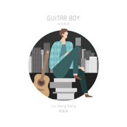

吉他男孩Guitar Boy
============================

|  |  |
| :--: | :-- |
| [ 吉他男孩Guitar Boy](https://emumo.xiami.com/album/2102714533) | **艺人**: [赖康康](../index.md) **语种**: 国语 **唱片公司**: 独立发行 **发行时间**: 2017年03月26日 **专辑类别**: 录音室专辑 **专辑风格**: 流行 Pop **播放数**: 48573 **收藏数**: 45 **评论数**: 4  |

## 简介

 
 

赖康康的第二张尼龙弦指弹吉他专辑《吉他男孩》，专辑由7首独奏，1首二重奏，2首Remix组成。除2首改编作品外其余都为原创作品。与上一张专辑不同的是本专辑全部由电箱拾音器录制，体现尼龙弦电箱特有的音质。
 

 

## 曲目

## 评论

|  |  |  |
| :-- | :-- | :-- |
|  [虾米用户](https://emumo.xiami.com/u/253295036) 他乡异客 2020-03-27 13:05 赞(0) 踩(0) | 
很用心的艺术家
 |
|  [虾米用户](https://emumo.xiami.com/u/334949489)  2018-01-13 23:30 赞(0) 踩(0) | 
支持康康老师
 |
|  [虾米用户](https://emumo.xiami.com/u/27282058)  2017-09-27 21:27 赞(1) 踩(0) | 
尼龙弦，感觉很少听到了
 |
|  [虾米用户](https://emumo.xiami.com/u/18412518) 我只想着一件事了，我在想... 2017-04-02 12:04 赞(0) 踩(0) | 
什么时候发布？支持
 |
