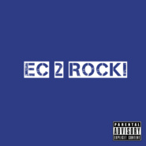

Van Dazia
============================

|  |  |
| :--: | :-- |
| [ Van Dazia](https://i.xiami.com/vandazia) | **地区**: China 中国大陆 **风格**: 爵士流行 Jazz Pop, 新灵魂乐 Neo-Soul, 爵士说唱 Jazz Rap **播放数**: 469880 **粉丝数**: 98 **评论数**: 15  |

## 档案

上班DOG... 
午夜音乐制作疗程

## 专辑

| 名称 | 语种 | 唱片公司 | 发行时间 | 专辑类别 | 专辑风格 |
| :--: | :-- | :-- | :-- | :-- | :-- |
| [ EC 2 ROCK扬帆起航！](./albums/2105259648.md) | 国语 |  | 2019年09月20日 | 录音室专辑 | 另类摇滚 Alternative Rock, 流行朋克 Pop Punk, 国语流行 Mandarin Pop |
| [ Nocturnalism夜行主义](./albums/2102964775.md) | 纯音乐 | 独立发行 | 2017年12月01日 | 录音室专辑 | 新灵魂乐 Neo-Soul, 弛放 Chillout, 器乐嘻哈 Instrumental Hip Hop |
| [ 你是哪一种 [VanDazia Remix]你是哪一种 Remix Contest](./albums/2100264820.md) | 国语 | 独立发行 | 2016年01月22日 | EP, 单曲 | 爵士说唱 Jazz Rap |
| [ Aqua LunaHK](./albums/2100227428.md) | 国语 | 独立发行 | 2015年10月25日 | EP, 单曲 | 原声 Soundtrack, 轻音乐 Easy Listening |
| [ GAINESVILLESongs for the Gatorland](./albums/1233577374.md) | 国语 | 独立发行 | 2015年06月26日 | 录音室专辑 | 迷幻流行 Psychedelic Pop |
| [ LuckyLive Covers](./albums/2100232786.md) | 国语 | 独立发行 | 2015年06月12日 | 现场专辑 | 国语流行 Mandarin Pop, 欧美流行 Western Pop |
| [ ROOM 301JINCAI High School Memories](./albums/1732227153.md) | 国语 | 独立发行 | 2015年05月21日 | 录音室专辑 | 城市民谣 Urban Folk, 文雅流行 Sophisti Pop |
| [ You [VanDazia Remix] Blacklist ft. EugeniaSYNC Remix Contest](./albums/827088521.md) | 英语 | 独立发行 | 2015年03月23日 | EP, 单曲 | 微浩室舞曲 Microhouse, 灵魂爵士 Soul Jazz, 电音流行 Electropop |

## 评论

|  |  |  |
| :-- | :-- | :-- |
|  [虾米用户](https://emumo.xiami.com/u/4291744) 我还没想好要写什么... 2019-05-28 00:48 赞(0) 踩(0) | 
厉害国的厉害人     
 |
|  [虾米用户](https://emumo.xiami.com/u/32096251)  2016-03-25 00:35 赞(0) 踩(0) | 
朋友您好，我被您折服了！可以跟我搞个基，啊不~交个朋友吗？ 微信：ismett  求勾搭！
 |
| ⇒ |  [虾米用户](https://emumo.xiami.com/u/5748449) ... 2016-03-27 22:25 赞(0) 踩(0) | 

 |
|  [虾米用户](https://emumo.xiami.com/u/43055800) 根号C就是NE！ 2016-01-23 09:44 赞(0) 踩(0) | 
厉害哦
 |
|  [虾米用户](https://emumo.xiami.com/u/626464)  2015-10-15 13:28 赞(0) 踩(0) | 
你好范妲己，你的牌打得太好了，我们交个朋友吧。
 |
| ⇒ |  [虾米用户](https://emumo.xiami.com/u/5748449) ... 2015-10-16 03:23 赞(0) 踩(0) | 
...你是哥哥，还是妹妹？快点吧，我等到花儿也谢了。
 |
|  [虾米用户](https://emumo.xiami.com/u/6851121)  2015-06-08 11:04 赞(0) 踩(0) | 
喜欢你的风格，求交流...求发站内信or 邮箱留个联系方式~
 |
|  [虾米用户](https://emumo.xiami.com/u/44043848) dropwtihme 2015-06-03 05:15 赞(0) 踩(0) | 
先来抢下地板
 |
|  [虾米用户](https://emumo.xiami.com/u/9304635)   2015-05-09 00:38 赞(0) 踩(0) | 
我为你骄傲
 |
| ⇒ |  [虾米用户](https://emumo.xiami.com/u/5748449) ... 2015-05-09 13:53 赞(0) 踩(0) | 
奥比...=、=
 |
|  [虾米用户](https://emumo.xiami.com/u/23821497) Mill Label 2015-04-10 00:05 赞(0) 踩(0) | 
非常喜欢你的作品，能给我你的联系方式吗？我的邮箱：<a href="mailto:503731341@qq.com">503731341@qq.com</a>
 |
| ⇒ |  [虾米用户](https://emumo.xiami.com/u/5748449) ... 2015-04-10 13:31 赞(0) 踩(0) | 
谢谢！给你邮件了 :)
 |
|  [虾米用户](https://emumo.xiami.com/u/44100565) Ferrison lik... 2015-03-23 23:17 赞(1) 踩(0) | 
支持ʕ•̫͡•ʕ*̫͡*ʕ•͓͡•ʔ-̫͡-ʕ•̫͡•ʔ*̫͡*ʔ-̫͡-ʔ
 |
|  [虾米用户](https://emumo.xiami.com/u/6952229) 好听为上 2015-02-17 20:11 赞(1) 踩(0) | 
好球啊！
 |
|  [虾米用户](https://emumo.xiami.com/u/5748449) ... 2015-02-04 18:22 赞(5) 踩(0) | 
我刚入驻了虾米音乐人，欢迎大家来我的个人主页，收听我的最新音乐
 |
