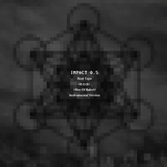

ImPact 0.5 - Rise Of Babel（Beatape）R.O.B. 重塑巴别塔（Instrumental Version）
============================

|  |  |
| :--: | :-- |
| [ ImPact 0.5 - Rise Of Babel（Beatape）R.O.B. 重塑巴别塔（Instrumental Version）](https://emumo.xiami.com/album/127889103) | **艺人**: [派克特](../index.md) **语种**: 其他 **唱片公司**: 独立发行 **发行时间**: 2013年01月01日 **专辑类别**: 精选集 **专辑风格**: 器乐嘻哈 Instrumental Hip Hop **播放数**: 245018 **收藏数**: 354 **评论数**: 11  |

## 简介

 
 

派克特（PACT）［ImPact］三部曲 第一部《ImPact 0.5 - Rise Of Babel R.O.B. (重塑巴别塔) Beatape》(Instrumental Version)
 

 
 

2012 PACT Production
 

 

## 曲目

## 评论

|  |  |  |  |
| :-- | :-- | :-- | :-- |
|  [虾米用户](https://emumo.xiami.com/u/47227411) 我还没想好要写什么... 2019-03-09 12:43 赞(0) 踩(0) | 
牛beat的beat
 |
|  [虾米用户](https://emumo.xiami.com/u/11565835) 看来你品味也不怎么样 2018-10-11 13:32 赞(0) 踩(0) | 
喜欢封面的表达，总有人在战斗
 |
|  [虾米用户](https://emumo.xiami.com/u/287296265) 挑食、抑郁、中二、伪嘻哈... 2018-02-02 20:22 赞(1) 踩(0) | 
6分都出来了    智商高人士是真的多 
 |
|  [虾米用户](https://emumo.xiami.com/u/54875780) 收《SpidaBoi》《... 2017-11-06 17:14 赞(1) 踩(0) | 
我想我该花100了
 |
|  [虾米用户](https://emumo.xiami.com/u/55314724)   2016-05-21 13:56 赞(0) 踩(0) | 
50一首？
 |
| ⇒ |  [虾米用户](https://emumo.xiami.com/u/120311) +86029 N/U 2017-07-03 02:07 赞(0) 踩(0) | 
不好意思 才看到 10块一首 欢迎remix 哈哈哈哈哈哈 uh 不过我觉得应该一万一首✌️
 |
| ⇒ |  [虾米用户](https://emumo.xiami.com/u/281817632) nkc 2017-07-08 17:19 赞(0) 踩(0) | 
<q><b>派克特说：</b></q>
 |
| ⇒ |  [虾米用户](https://emumo.xiami.com/u/281817632) nkc 2017-07-08 17:19 赞(0) 踩(0) | 
<q><b>派克特说：</b></q>
 |
|  [虾米用户](https://emumo.xiami.com/u/35251651) 人生何处不青山 2016-02-21 15:29 赞(3) 踩(0) | 
居然把b开放下载，派派还是大方啊
 |
|  [虾米用户](https://emumo.xiami.com/u/43080747)   2015-10-04 01:32 赞(0) 踩(0) | 
前排
 |
|  [虾米用户](https://emumo.xiami.com/u/54875780) 收《SpidaBoi》《... 2015-08-31 14:25 赞(0) 踩(0) | 
你我他 这首歌还有beat很赞
 |
