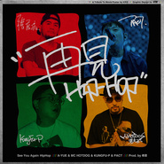

再见Hip-Hop
============================

|  |  |
| :--: | :-- |
| [ 再见Hip-Hop](https://emumo.xiami.com/album/2103983327) | **艺人**: [派克特](../index.md) **语种**: 国语 **唱片公司**: 本色音乐, StreetVoice **发行时间**: 2018年09月07日 **专辑类别**: EP, 单曲 **专辑风格**: 嘻哈 Hip-Hop, 流行说唱 Pop Rap **播放数**: 2007813 **收藏数**: 352 **评论数**: 74  |

## 简介

《再见》发布于2007年，收录于张震岳专辑《OK》中，字里行间似乎是一种不想但又不得不离开的无奈，却更是珍重再会、期許未來的勇气！  
  
11年后，由张震岳、MC HOTDOG热狗携手功夫胖、派克特功夫胖再次演绎这首经典作品，取名《再见HIPHOP》，将这首深入人心的旋律和歌词，赋予新的意涵和视角。  
  
有人说，爱任何事物的方式，就是意识到你随时可能失去它。  
我们真的会和HIPHOP说再见吗？不知道。  
在这个时代飞驰的列车上，任何事物的发展都是曲折上升的。我们把它推到一个位置，就必然和他的某一个部分说再见。  
  
可是那句"再见"并不是悲观的，再见总迎来新的开始。  
在那些光芒的背后，紧抓住最初hiphop触动我们的部分。  
  
走再远，也不忘了为什么出发…  
"不回头，不回头地走下去。"  
  
-

## 曲目

## 评论

|  |  |  |
| :-- | :-- | :-- |
|  [虾米用户](https://emumo.xiami.com/u/7355202)  2020-12-13 15:49 赞(2) 踩(0) | 
看了《棒！少年》电影，被片尾这个版本的《再见》触动到。
 |
|  [虾米用户](https://emumo.xiami.com/u/405282818) 被世界遗忘的人 2020-05-30 08:14 赞(1) 踩(0) | 
太好听了，经典
 |
|  [虾米用户](https://emumo.xiami.com/u/276280717)  2020-03-18 17:29 赞(0) 踩(0) | 
热狗NB
 |
|  [虾米用户](https://emumo.xiami.com/u/37689181) 回归虾米！ 2019-12-28 22:33 赞(0) 踩(0) | 
现在真的再见了
 |
|  [虾米用户](https://emumo.xiami.com/u/247129973)  2019-10-09 11:47 赞(0) 踩(0) | 
好好听
 |
|  [虾米用户](https://emumo.xiami.com/u/152882390)  2019-06-25 23:26 赞(0) 踩(0) | 
说出我的感伤
 |
|  [虾米用户](https://emumo.xiami.com/u/347071752) 面朝大海 春暖花开 2019-05-16 16:54 赞(0) 踩(0) | 
我又来了
 |
|  [虾米用户](https://emumo.xiami.com/u/32051445) 女孩儿的歌。 永爱虾米 2019-01-06 20:13 赞(3) 踩(0) | 
这四个才是最爱
 |
|  [虾米用户](https://emumo.xiami.com/u/32051445) 女孩儿的歌。 永爱虾米 2019-01-06 20:13 赞(1) 踩(0) | 
❤️
 |
|  [虾米用户](https://emumo.xiami.com/u/34216086)   2019-01-06 07:16 赞(0) 踩(0) | 
赞！
 |
|  [虾米用户](https://emumo.xiami.com/u/63547182) 我还没想好要写什么... 2018-12-06 18:32 赞(1) 踩(0) | 
太真实了
 |
|  [虾米用户](https://emumo.xiami.com/u/230621404) 懒 2018-11-14 21:04 赞(0) 踩(0) | 
以前没听过，离线音乐包里第一次听到，听哭了
 |
|  [虾米用户](https://emumo.xiami.com/u/525562) 青山青水青少年 2018-10-02 11:13 赞(19) 踩(0) | 
这是主办方尾款已经到账了才敢发的吧
 |
|  [虾米用户](https://emumo.xiami.com/u/27097321)  2018-09-15 19:58 赞(0) 踩(0) | 
终于real了。
 |
|  [虾米用户](https://emumo.xiami.com/u/659086)  2018-09-13 17:28 赞(1) 踩(0) | 
respect
 |
|  [虾米用户](https://emumo.xiami.com/u/252589) 我还没想好要写什么... 2018-09-13 17:17 赞(1) 踩(0) | 
现在都在讲流量啊，那些妖魔鬼怪！
 |
|  [虾米用户](https://emumo.xiami.com/u/1506551) 越美的东西越不可碰 2018-09-12 16:56 赞(44) 踩(0) | 
那个1星是吴亦凡打的吗？
 |
| ⇒ |  [虾米用户](https://emumo.xiami.com/u/276904932)  2019-02-26 22:55 赞(0) 踩(0) | 
看不起谁？ 中国说唱第一人！！！代表作《大碗宽面》一直都是经典鼻祖
 |
|  [虾米用户](https://emumo.xiami.com/u/8318777)  2018-09-11 11:47 赞(3) 踩(0) | 
新说唱的内幕让人看不下去，但是阿岳和狗哥永远是最棒的，这毋庸置疑！
 |
|  [虾米用户](https://emumo.xiami.com/u/11421497) dont act lik... 2018-09-10 18:23 赞(0) 踩(0) | 
好
 |
|  [虾米用户](https://emumo.xiami.com/u/3276410)   2018-09-10 16:05 赞(0) 踩(0) | 
走心
 |
|  [虾米用户](https://emumo.xiami.com/u/9910798) 暂无签名~ 2018-09-10 15:49 赞(0) 踩(0) | 
赞
 |
|  [虾米用户](https://emumo.xiami.com/u/7536085) 无楽不悦 2018-09-10 10:45 赞(0) 踩(0) | 
爱 ，狗哥
 |
|  [虾米用户](https://emumo.xiami.com/u/403847213)  2018-09-10 06:40 赞(3) 踩(0) | 
吴亦凡   五亿烦
 |
|  [虾米用户](https://emumo.xiami.com/u/297120500)  2018-09-09 14:29 赞(2) 踩(0) | 
光听啊岳的前奏就已经莫名地燃了，原始的东西是最美的，我不懂什么叫说唱，但我知道什么是电音，电音不是说唱。再次见到hiphop
 |
|  [虾米用户](https://emumo.xiami.com/u/101103066) 对方不会再输入. 2018-09-09 00:43 赞(0) 踩(0) | 
this is hiphop
 |
|  [虾米用户](https://emumo.xiami.com/u/5968552) 虾小米，我爱你所以讲不出... 2018-09-08 23:17 赞(1) 踩(0) | 
十年，华语hiphop听的还是蛋堡和陈奂仁，十年没腻，也没新人能代替。至于这首《再见》，阿岳的部分编曲太赞了，完美致敬十年前，十年后再看《OK》依旧是神专。
 |
|  [虾米用户](https://emumo.xiami.com/u/313921401)  2018-09-08 19:31 赞(4) 踩(0) | 
狗哥还是回来了 综艺始终是综艺   始终还是dis 了SKR
 |
|  [虾米用户](https://emumo.xiami.com/u/233397179) Keep real 2018-09-08 15:24 赞(0) 踩(0) | 
old school young 4ever
 |
|  [虾米用户](https://emumo.xiami.com/u/32428117) 以音乐为交流语言的神秘空... 2018-09-08 11:45 赞(0) 踩(0) | 
热泪盈眶
 |
|  [虾米用户](https://emumo.xiami.com/u/97661946)   2018-09-08 11:23 赞(0) 踩(0) | 
最喜欢的都聚在一起了~
 |
|  [虾米用户](https://emumo.xiami.com/u/7804349) quocdan 2018-09-08 10:35 赞(0) 踩(0) | 
希望不久將來再見他的專輯。
 |
|  [虾米用户](https://emumo.xiami.com/u/7804349) quocdan 2018-09-08 10:33 赞(0) 踩(0) | 
不捨！
 |
|  [虾米用户](https://emumo.xiami.com/u/267304994) :几年了？三年了... 2018-09-08 10:18 赞(0) 踩(0) | 
原来的热狗终于回来了
 |
|  [虾米用户](https://emumo.xiami.com/u/3260058) 一个艺术家 2018-09-08 09:37 赞(0) 踩(0) | 
屌
 |
|  [虾米用户](https://emumo.xiami.com/u/289342269)  2018-09-08 07:16 赞(0) 踩(0) | 
讨打来  某人
 |
|  [虾米用户](https://emumo.xiami.com/u/6855844)  2018-09-08 03:49 赞(9) 踩(0) | 
我来是因为我想推广真正的说唱 我走是因为我要找回真正的说唱 Shout out to 狗哥 阿岳 sup music
 |
|  [虾米用户](https://emumo.xiami.com/u/58978) 我还没想好要写什么... 2018-09-08 01:16 赞(1) 踩(0) | 
难听
 |
|  [虾米用户](https://emumo.xiami.com/u/15871575) 喂 2018-09-08 00:35 赞(0) 踩(0) | 
没的说
 |
|  [虾米用户](https://emumo.xiami.com/u/6867905) 吃饭，画图，骂甲方 2018-09-07 22:38 赞(12) 踩(0) | 
我只想说，这个年代，还是有人说真话，还是有人能唱真心的歌，真好。
 |
| ⇒ |  [虾米用户](https://emumo.xiami.com/u/9416873)  2018-09-09 11:12 赞(0) 踩(0) | 
头像不错 同是画图狗
 |
|  [虾米用户](https://emumo.xiami.com/u/44175682) 追寻过往 似是而非的未来 2018-09-07 21:23 赞(0) 踩(0) | 
一样的阿岳，不一样的阿岳
 |
|  [虾米用户](https://emumo.xiami.com/u/39190409) FUCK 2018-09-07 21:07 赞(0) 踩(0) | 
冠   军！
 |
|  [虾米用户](https://emumo.xiami.com/u/89805020)  2018-09-07 20:51 赞(0) 踩(0) | 
真的好听
 |
|  [虾米用户](https://emumo.xiami.com/u/1506551) 越美的东西越不可碰 2018-09-07 20:26 赞(0) 踩(0) | 
不要说那三个字母
 |
|  [虾米用户](https://emumo.xiami.com/u/2589004)  2018-09-07 19:36 赞(0) 踩(0) | 
狗哥REAL，岳哥REAL，小胖REAL，派总REAL 《飞太远》本季最佳，RESPECT PS：FAKER鳗真的配评论这些REAL RAPPER？
 |
|  [虾米用户](https://emumo.xiami.com/u/214189732)   2018-09-07 19:01 赞(0) 踩(0) | 
Respect to 狗哥！ 当年的热狗又回来了！
 |
|  [虾米用户](https://emumo.xiami.com/u/10128471)   2018-09-07 18:16 赞(0) 踩(0) | 
牛逼就对了
 |
|  [虾米用户](https://emumo.xiami.com/u/584812) 可能也许大概是 2018-09-07 17:18 赞(0) 踩(0) | 
牛批
 |
|  [虾米用户](https://emumo.xiami.com/u/42238774) 笑一笑 十年少 2018-09-07 17:06 赞(0) 踩(0) | 
Hot Chelle Rae - Whatever的专辑界面有点像
 |
|  [虾米用户](https://emumo.xiami.com/u/8275979) 我还没想好要写什么... 2018-09-07 15:34 赞(11) 踩(0) | 
還是不習慣說skr
 |
|  [虾米用户](https://emumo.xiami.com/u/6064450)   2018-09-07 15:10 赞(1) 踩(0) | 
派克特那段越听越有魅力，有一丢丢像当年的狗爷，欧美的那个
 |
|  [虾米用户](https://emumo.xiami.com/u/6064450)   2018-09-07 14:50 赞(0) 踩(0) | 
这强烈的悲壮感。。。
 |
|  [虾米用户](https://emumo.xiami.com/u/332501857) 哈库那玛塔塔 2018-09-07 14:41 赞(19) 踩(0) | 
热狗虽然不想得罪某些人，但是这首歌已经听到他的态度。虽然终究是个综艺，有那些乱七八糟的，但也有他们真正坚持的hiphot,真正听懂的人都会为功夫和派克特竖起大拇指。
 |
|  [虾米用户](https://emumo.xiami.com/u/258345414)  2018-09-07 14:22 赞(25) 踩(0) | 
respect 热狗 还是不习惯说skr
 |
|  [虾米用户](https://emumo.xiami.com/u/13313040) 再好的相机也只能记录最美... 2018-09-07 14:04 赞(0) 踩(0) | 
牛逼
 |
|  [虾米用户](https://emumo.xiami.com/u/50404656) 在生活中熊着。 2018-09-07 13:49 赞(1) 踩(0) | 
可以的 期待热狗新专辑的降临！期待以lyrics为主的说唱！！
 |
|  [虾米用户](https://emumo.xiami.com/u/2054747) 你懂个锤子 2018-09-07 13:45 赞(0) 踩(0) | 
怒味重工
 |
|  [虾米用户](https://emumo.xiami.com/u/403623745)  2018-09-07 13:35 赞(0) 踩(0) | 
功夫胖牛逼！
 |
|  [虾米用户](https://emumo.xiami.com/u/762302) 我还没想好要写什么... 2018-09-07 13:06 赞(0) 踩(0) | 
这首歌，我必下！
 |
|  [虾米用户](https://emumo.xiami.com/u/10857967) 我～就是我！不喜勿進！ 2018-09-07 13:00 赞(0) 踩(0) | 
专辑介绍说是07年的歌，其实这首05年就发了
 |
|  [虾米用户](https://emumo.xiami.com/u/33634014) 网易云音乐：乌昂科尔 2018-09-07 12:46 赞(1) 踩(0) | 
四个都很喜欢
 |
|  [虾米用户](https://emumo.xiami.com/u/73740960)  2018-09-07 12:41 赞(1) 踩(0) | 
1GWL GIA☢ GIA☢ 1GWL GIA☢ GIA☢ 1GWL GIA☢ GIA☢ 1GWL GIA☢ GIA☢ 1GWL GIA☢ GIA☢
 |
|  [虾米用户](https://emumo.xiami.com/u/20519705) 这家伙很聪明什么也没留下... 2018-09-07 12:26 赞(15) 踩(0) | 
时隔多年狗哥再次发声  
 |
|  [虾米用户](https://emumo.xiami.com/u/377112025)   2018-09-07 12:19 赞(1) 踩(0) | 
real hiphop
 |
|  [虾米用户](https://emumo.xiami.com/u/6807)  2018-09-07 12:11 赞(0) 踩(0) | 
OK
 |
|  [虾米用户](https://emumo.xiami.com/u/37863570)  你我他她它。 2018-09-07 12:06 赞(1) 踩(0) | 
还是不习惯讲skr！
 |
|  [虾米用户](https://emumo.xiami.com/u/14290750)  2018-09-07 12:05 赞(0) 踩(0) | 
aya
 |
|  [虾米用户](https://emumo.xiami.com/u/4477103) 完全没有匆忙的必要 2018-09-07 12:04 赞(0) 踩(0) | 
！
 |
|  [虾米用户](https://emumo.xiami.com/u/6386655) 我还没想好要写什么... 2018-09-07 12:04 赞(0) 踩(0) | 
不回头的走下去
 |
|  [虾米用户](https://emumo.xiami.com/u/100608638)  2018-09-07 12:03 赞(0) 踩(0) | 
热狗出品，必属精品
 |
|  [虾米用户](https://emumo.xiami.com/u/280448225) 我还没想好要写什么... 2018-09-07 12:03 赞(0) 踩(0) | 
支持支持，real hip hop
 |
|  [虾米用户](https://emumo.xiami.com/u/304823615)  2018-09-07 12:03 赞(0) 踩(0) | 
？？
 |
|  [虾米用户](https://emumo.xiami.com/u/4328650) 我还没想好要写什么... 2018-09-07 12:00 赞(0) 踩(0) | 
什么鬼
 |
