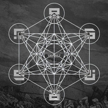

ImPact 0.5 - Rise Of BabelR.O.B. 重塑巴别塔
============================

|  |  |
| :--: | :-- |
| [ ImPact 0.5 - Rise Of BabelR.O.B. 重塑巴别塔](https://emumo.xiami.com/album/927882286) | **艺人**: [派克特](../index.md) **语种**: 国语 **唱片公司**: 独立发行 **发行时间**: 2012年12月22日 **专辑类别**: 录音室专辑 **专辑风格**: 中国地下说唱 Chinese Underground Hip Hop, 意识说唱 Conscious Hip Hop, 嘻哈 Hip-Hop **播放数**: 4795390 **收藏数**: 1294 **评论数**: 91  |

## 简介

派克特（PACT）［ImPact］三部曲 第一部《ImPact 0.5 - Rise Of Babel R.O.B.》(重塑巴别塔)
 

 
 

Feating：
 

MC BIGDOG ; P.O.E. ; TUH ; YoungMai ; Psycholomaniac ; JoeSlowlyMan ; Mr.Trouble ; CreamD ; Killa4nia ; MC马俊 ; Dyosef ; Joya ; MC Webber

## 曲目

## 评论

|  |  |  |
| :-- | :-- | :-- |
|  [虾米用户](https://emumo.xiami.com/u/444591330)  2021-01-29 23:13 赞(0) 踩(0) | 
专辑13首歌是否别有用意
 |
|  [虾米用户](https://emumo.xiami.com/u/427168579)  2021-01-06 03:45 赞(0) 踩(0) | 
派总牛逼!
 |
|  [虾米用户](https://emumo.xiami.com/u/264658687)  2020-11-29 15:55 赞(0) 踩(0) | 
牛逼
 |
|  [虾米用户](https://emumo.xiami.com/u/340506756) 我还没想好要写什么... 2020-08-01 20:00 赞(0) 踩(0) | 
牛逼
 |
|  [虾米用户](https://emumo.xiami.com/u/425677565) 我是我 但也是你. 2020-07-30 22:18 赞(0) 踩(0) | 
respect
 |
|  [虾米用户](https://emumo.xiami.com/u/187585792)  2020-07-25 11:13 赞(0) 踩(0) | 
名至实归
 |
|  [虾米用户](https://emumo.xiami.com/u/444067115)  2020-07-09 23:34 赞(2) 踩(0) | 
respect  虽然没能买到实体专辑。
 |
|  [虾米用户](https://emumo.xiami.com/u/443998370)  2020-07-06 10:26 赞(1) 踩(0) | 
最叼中文说唱专辑没有之一
 |
|  [虾米用户](https://emumo.xiami.com/u/50116854) 愿你我既可以朝九晚五又可... 2020-07-06 01:46 赞(1) 踩(0) | 
首首经典！
 |
|  [虾米用户](https://emumo.xiami.com/u/443917699)  2020-06-30 20:49 赞(1) 踩(0) | 
还在等吗 是否还在冷眼旁观
 |
|  [虾米用户](https://emumo.xiami.com/u/443885657)  2020-06-29 14:50 赞(1) 踩(0) | 
rob
 |
|  [虾米用户](https://emumo.xiami.com/u/350200059) 我还没想好要写什么... 2020-06-24 11:54 赞(1) 踩(0) | 
每个时期 从内到外 给到能量。
 |
|  [虾米用户](https://emumo.xiami.com/u/664791) 777 2020-06-23 12:17 赞(1) 踩(0) | 
看钢铁麦克纪录片的时候第一次认识派克特 感觉这人言谈了得还有实力 虽然由于脾气好经常被综艺关照 但这些作品的存在和钢铁麦克的实绩真是让人挑不出毛病。虽然很多新人选手上去能靠堆韵脚或选一个比较炸的beat博得瞬间好感 但大部分人一下写不出这种内容也没有这般沉稳 这大概也是为什么老学校始终有市场的原因
 |
|  [虾米用户](https://emumo.xiami.com/u/357831682)  2020-05-30 22:30 赞(1) 踩(0) | 
刘柄鑫的歌曲应该有受你这张专辑的影响，或者有互相影响，真的好赞！
 |
|  [虾米用户](https://emumo.xiami.com/u/442195428)  2020-04-30 21:24 赞(0) 踩(0) | 

 |
|  [虾米用户](https://emumo.xiami.com/u/427442730) 我还没想好要写什么... 2019-12-19 22:43 赞(0) 踩(0) | 
言语不可形容，这就是人生吧
 |
|  [虾米用户](https://emumo.xiami.com/u/10517853) I'm a social... 2019-11-06 05:46 赞(0) 踩(0) | 
simple tchaikovsky marche slave. 31
 |
|  [虾米用户](https://emumo.xiami.com/u/189895488) 曼巴精神 2019-11-01 00:06 赞(0) 踩(0) | 
不用解释
 |
|  [虾米用户](https://emumo.xiami.com/u/180132402) 神 2019-10-08 21:54 赞(0) 踩(0) | 

 |
|  [虾米用户](https://emumo.xiami.com/u/353469479)  2019-08-24 19:00 赞(0) 踩(0) | 
牛逼
 |
|  [虾米用户](https://emumo.xiami.com/u/342899661)  2019-08-20 23:45 赞(0) 踩(0) | 
第一张专辑flow与思想就这么高级了
 |
|  [虾米用户](https://emumo.xiami.com/u/711866) 伞 2019-06-05 22:18 赞(0) 踩(0) | 
牛逼啊
 |
|  [虾米用户](https://emumo.xiami.com/u/346165752)  2019-04-06 11:02 赞(0) 踩(0) | 

 |
|  [虾米用户](https://emumo.xiami.com/u/380080503)  2019-03-28 23:05 赞(0) 踩(0) | 
12年的历史
 |
|  [虾米用户](https://emumo.xiami.com/u/341130296) 我还没想好要写什么... 2019-03-17 12:16 赞(2) 踩(0) | 
在都在研究如何押韵如何玩狠的时代，pact用制作来提升了中文说唱
 |
|  [虾米用户](https://emumo.xiami.com/u/12993188)   2019-02-15 02:02 赞(0) 踩(0) | 
Legendary
 |
|  [虾米用户](https://emumo.xiami.com/u/86817356)  2019-01-22 00:17 赞(1) 踩(0) | 
贯彻全专的雷鬼唱腔rise of babel 太牛逼了
 |
|  [虾米用户](https://emumo.xiami.com/u/6790400)  2019-01-13 16:24 赞(13) 踩(0) | 
很幸运当年买到了实体cd，是我最珍贵的收藏之一。
 |
|  [虾米用户](https://emumo.xiami.com/u/316535882) 目前这是一个专门用来听坂... 2018-12-04 09:34 赞(1) 踩(0) | 
为什么有你们这种神仙啊
 |
|  [虾米用户](https://emumo.xiami.com/u/339369411) 我早就想好要写什么... 2018-12-01 13:05 赞(2) 踩(0) | 
中国hiphop史上不可磨灭的一页
 |
|  [虾米用户](https://emumo.xiami.com/u/49640493) 网易云SAINTDONT... 2018-10-30 09:08 赞(3) 踩(0) | 

 |
|  [虾米用户](https://emumo.xiami.com/u/222481395) 无时无刻不无恶不作无功无... 2018-10-20 22:20 赞(0) 踩(0) | 
牛逼
 |
|  [虾米用户](https://emumo.xiami.com/u/119903318) 我还没想好要写什么... 2018-10-16 21:03 赞(0) 踩(0) | 
挂墙的专辑
 |
|  [虾米用户](https://emumo.xiami.com/u/5530908) 不好意思 2018-10-05 15:40 赞(0) 踩(0) | 
Pact！
 |
|  [虾米用户](https://emumo.xiami.com/u/13313040) 再好的相机也只能记录最美... 2018-10-02 08:45 赞(0) 踩(0) | 

 |
|  [虾米用户](https://emumo.xiami.com/u/315805289)  2018-09-24 09:31 赞(0) 踩(0) | 
派克特是真的牛逼
 |
|  [虾米用户](https://emumo.xiami.com/u/378625845)  2018-09-05 00:26 赞(2) 踩(0) | 
不知道为什么这么多人打1星 这张专辑在当年已经是风格与众不同的一张专了
 |
|  [虾米用户](https://emumo.xiami.com/u/309289950) 不在 2018-08-30 08:57 赞(2) 踩(0) | 
中国的DAMN
 |
|  [虾米用户](https://emumo.xiami.com/u/239391985) 做一只只听嘻哈的suns... 2018-08-26 19:28 赞(2) 踩(0) | 
2018.8.26 嘻哈迷来过❤️
 |
|  [虾米用户](https://emumo.xiami.com/u/44607838)   2018-08-26 18:00 赞(3) 踩(0) | 
这居然是12年的专辑？！
 |
|  [虾米用户](https://emumo.xiami.com/u/292503583)  2018-08-25 04:59 赞(1) 踩(0) | 
6年前 wc 牛b
 |
|  [虾米用户](https://emumo.xiami.com/u/8187530)  2018-08-05 01:24 赞(0) 踩(0) | 
为什么要下架通天塔？？？带来不便了...
 |
|  [虾米用户](https://emumo.xiami.com/u/348470749) 随便听听 2018-08-04 00:20 赞(0) 踩(0) | 
最初的感觉，即使flow略逊与他后面的歌，但beat营造的环境非常适合。
 |
|  [虾米用户](https://emumo.xiami.com/u/31410657)  2018-07-17 02:15 赞(0) 踩(0) | 
求cd
 |
|  [虾米用户](https://emumo.xiami.com/u/239006711)  多少男子汉一怒为红颜，... 2018-07-16 19:35 赞(0) 踩(0) | 
没什么说的殿堂级的专辑
 |
|  [虾米用户](https://emumo.xiami.com/u/51827355) GET HIGH 2018-06-24 03:39 赞(0) 踩(0) | 
我爱你
 |
|  [虾米用户](https://emumo.xiami.com/u/323921147) 花开会有时 人无再少年 2018-01-14 15:23 赞(0) 踩(0) | 
你我他怎么不能听了 
 |
|  [虾米用户](https://emumo.xiami.com/u/43763080) 我还没想好要写什么... 2017-11-07 00:50 赞(37) 踩(0) | 
这张专始终是中国hiphop史不可翻过的一页
 |
|  [虾米用户](https://emumo.xiami.com/u/49702523)  2017-10-14 17:47 赞(0) 踩(0) | 
最喜欢这一张
 |
|  [虾米用户](https://emumo.xiami.com/u/10517853) I'm a social... 2017-10-11 02:21 赞(0) 踩(0) | 
整张beat都不错啊 这都是他自己做的吗
 |
| ⇒ |  [虾米用户](https://emumo.xiami.com/u/192434435)  2017-10-25 14:36 赞(0) 踩(0) | 
是的
 |
|  [虾米用户](https://emumo.xiami.com/u/325027876) Be Water, My... 2017-10-06 18:33 赞(0) 踩(0) | 
标记
 |
|  [虾米用户](https://emumo.xiami.com/u/48065407)   2017-08-31 22:26 赞(20) 踩(0) | 
如果有美国90s的Hip-Hop土壤的话，这就是中文说唱历史上史诗级的专辑之一
 |
| ⇒ |  [虾米用户](https://emumo.xiami.com/u/422846342)  2019-11-28 00:46 赞(0) 踩(0) | 
还有哪些史诗级的专辑
 |
|  [虾米用户](https://emumo.xiami.com/u/21593597) 嘟嘟嘟...咚... 2017-08-26 09:46 赞(0) 踩(0) | 
黑！
 |
|  [虾米用户](https://emumo.xiami.com/u/54875780) 收《SpidaBoi》《... 2017-08-23 23:04 赞(1) 踩(0) | 
重塑
 |
|  [虾米用户](https://emumo.xiami.com/u/10590021) 出现了幻觉(´⊙ω⊙`) 2017-07-19 09:04 赞(1) 踩(0) | 
良心说唱
 |
|  [虾米用户](https://emumo.xiami.com/u/418832)  2017-06-03 14:35 赞(3) 踩(0) | 
本来我是不听中文hiphop的，大概所有曲风我都已被其他人收入囊中，摇滚，电音，民谣，流行，昆曲，潮戏，古风，轻音，金属，终于，派男神来了，从此循环此专到天明矣，夜夜不停休。
 |
|  [虾米用户](https://emumo.xiami.com/u/43875708)  遣词造句 穿山过水 他... 2017-05-17 23:50 赞(2) 踩(0) | 
还好今天听歌时间充裕 不看评分
 |
|  [虾米用户](https://emumo.xiami.com/u/100853796) milk 2017-03-31 09:25 赞(0) 踩(0) | 
这专辑很C
 |
|  [虾米用户](https://emumo.xiami.com/u/36208991)   2017-02-05 00:45 赞(0) 踩(0) | 
好
 |
|  [虾米用户](https://emumo.xiami.com/u/144490822)   2016-10-18 21:27 赞(1) 踩(0) | 
这他妈谁评的分
 |
|  [虾米用户](https://emumo.xiami.com/u/46109054) 暂无签名~ 2016-09-29 12:40 赞(1) 踩(0) | 
这张 mixtape 派克特 诠释的太牛逼了
 |
|  [虾米用户](https://emumo.xiami.com/u/84425142) ♪ 2016-08-31 22:20 赞(0) 踩(0) | 
pact
 |
|  [虾米用户](https://emumo.xiami.com/u/54875780) 收《SpidaBoi》《... 2016-08-09 13:49 赞(1) 踩(0) | 
就这点儿人 没事儿 也好
 |
|  [虾米用户](https://emumo.xiami.com/u/59938182) 因果皆有报 2016-08-06 09:49 赞(0) 踩(0) | 
1233
 |
|  [虾米用户](https://emumo.xiami.com/u/40106296)  2016-06-16 00:47 赞(0) 踩(0) | 
你听了你就不问为什么收藏了
 |
|  [虾米用户](https://emumo.xiami.com/u/31553966) 我不喜欢，全是你的幻觉 2016-05-25 20:53 赞(0) 踩(0) | 
一个宇
 |
|  [虾米用户](https://emumo.xiami.com/u/53535425) 每天摇摇晃晃的生活 2016-05-21 13:56 赞(0) 踩(0) | 
fire high
 |
|  [虾米用户](https://emumo.xiami.com/u/134618192) - 2016-05-14 15:09 赞(0) 踩(0) | 

 |
|  [虾米用户](https://emumo.xiami.com/u/241152) Supreme 2016-01-24 12:42 赞(0) 踩(0) | 
重生！
 |
|  [虾米用户](https://emumo.xiami.com/u/13612567) sick sad wor... 2015-12-30 23:12 赞(0) 踩(0) | 
评分这么低？
 |
|  [虾米用户](https://emumo.xiami.com/u/44003760) 聪明伶俐快高长大 2015-12-06 12:18 赞(0) 踩(0) | 
美妙
 |
|  [虾米用户](https://emumo.xiami.com/u/38715023) 大一大万大吉 2015-10-03 02:39 赞(0) 踩(0) | 
啦啦啦啦啦啦啦
 |
|  [虾米用户](https://emumo.xiami.com/u/7757466) 只想好好当个垃圾✓ 2015-08-29 19:47 赞(0) 踩(0) | 
☣
 |
|  [虾米用户](https://emumo.xiami.com/u/9710455)  2015-08-05 02:31 赞(1) 踩(0) | 
******
 |
|  [虾米用户](https://emumo.xiami.com/u/15407921) 签Pp 2015-07-07 19:32 赞(0) 踩(0) | 
酷~!
 |
|  [虾米用户](https://emumo.xiami.com/u/40823611) 活在90年代 2015-06-22 01:12 赞(0) 踩(0) | 

 |
|  [虾米用户](https://emumo.xiami.com/u/3601481) 我是吃艺术这碗软饭的。 2015-06-15 16:32 赞(0) 踩(0) | 
支持一下！！！
 |
|  [虾米用户](https://emumo.xiami.com/u/50073052)  2015-05-15 21:56 赞(0) 踩(0) | 
PACT IRONMCI  冠军不是盖的
 |
|  [虾米用户](https://emumo.xiami.com/u/50073052)  2015-05-15 21:54 赞(0) 踩(0) | 
NB
 |
|  [虾米用户](https://emumo.xiami.com/u/1440376)  2015-04-28 20:39 赞(0) 踩(0) | 
求歌词
 |
|  [虾米用户](https://emumo.xiami.com/u/48564556) 努力吧 2015-04-24 07:20 赞(0) 踩(0) | 
再次听有味道
 |
|  [虾米用户](https://emumo.xiami.com/u/21593597) 嘟嘟嘟...咚... 2015-04-02 18:24 赞(0) 踩(0) | 
inside muzik
 |
|  [虾米用户](https://emumo.xiami.com/u/16869724) 太行2018 2015-04-02 00:35 赞(0) 踩(0) | 
听，别说话
 |
|  [虾米用户](https://emumo.xiami.com/u/6972653) 凹或凸。 2015-04-01 21:34 赞(123) 踩(0) | 
Classic
 |
| ⇒ |  [虾米用户](https://emumo.xiami.com/u/280272094)  2018-10-25 08:44 赞(0) 踩(0) | 
活捉
 |
|  [虾米用户](https://emumo.xiami.com/u/48663838) 这家伙很聪明 2015-04-01 18:56 赞(0) 踩(0) | 

 |
|  [虾米用户](https://emumo.xiami.com/u/43100898) 大起大落才能看清朋友，大... 2015-04-01 18:41 赞(0) 踩(0) | 

 |
|  [虾米用户](https://emumo.xiami.com/u/7324657) 我还没想好要写什么... 2015-04-01 18:07 赞(0) 踩(0) | 
第二个
 |
|  [虾米用户](https://emumo.xiami.com/u/12184260) 你好 2015-04-01 18:05 赞(3) 踩(0) | 
沙发 亲爱的
 |
