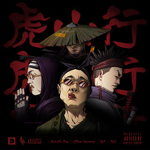

虎山行
============================

|  |  |
| :--: | :-- |
| [ 虎山行](https://emumo.xiami.com/album/2102871585) | **艺人**: [GAI](../index.md) **语种**: 国语 **唱片公司**: 多耳音乐 **发行时间**: 2017年10月13日 **专辑类别**: EP, 单曲 **专辑风格**:  **播放数**: 38512 **收藏数**: 184 **评论数**: 38  |

## 简介

一人得道，二人成仙，三人成虎。带着上世纪浓烈的美国西部风格，七十年代香港歌曲的采样，万众瞩目的《虎山行》“炼制而成”。老道为GAI、艾福杰尼、Kungfu-Pen、量身定做的歌曲，像一颗仙丹一样滋养着大众的听觉。歌曲有着中国古代的绿林气息，三人vers如同卧龙一样盘踞在虎山，HOOK部分由GAI演唱，江湖气息的嗓音传递着对现在说唱音乐的对立。出身绿林，归于虎山，在说唱的江湖中发迹。

## 曲目

## 评论

|  |  |  |
| :-- | :-- | :-- |
|  [虾米用户](https://emumo.xiami.com/u/27893493)  2020-11-30 22:51 赞(0) 踩(0) | 
哇，幸亏下载了！
 |
| ⇒ |  [虾米用户](https://emumo.xiami.com/u/430104799)  2021-01-10 20:09 赞(0) 踩(0) | 
兄弟 麻烦发给我
 |
| ⇒ |  [虾米用户](https://emumo.xiami.com/u/446617250)  2021-01-12 18:39 赞(0) 踩(0) | 
兄弟发我呗
 |
| ⇒ |  [虾米用户](https://emumo.xiami.com/u/379674668)  2021-02-01 13:13 赞(0) 踩(0) | 
发给我 求
 |
|  [虾米用户](https://emumo.xiami.com/u/429280968)  2020-03-27 19:20 赞(0) 踩(0) | 
没有了，，天呐。
 |
|  [虾米用户](https://emumo.xiami.com/u/95044372) 摇滚乐不重要，重要的是你... 2018-02-01 22:06 赞(0) 踩(0) | 
想听的可以去酷狗音乐下载，赶紧收藏，苦行僧也有
 |
|  [虾米用户](https://emumo.xiami.com/u/329000302)  2017-11-19 15:22 赞(1) 踩(0) | 
很好听，很豪气，荡气回肠，江湖气侠气并存
 |
|  [虾米用户](https://emumo.xiami.com/u/333489830)   2017-11-06 00:11 赞(1) 踩(0) | 
听说虾米版权多，刚把网易云卸载了，下了虾米，开了一年会员，结果过来还是听不了。
 |
| ⇒ |  [虾米用户](https://emumo.xiami.com/u/32709976) 祝福你半天一生都得一句那... 2017-11-13 13:00 赞(0) 踩(0) | 
虾米的会员都是白送的
 |
| ⇒ |  [虾米用户](https://emumo.xiami.com/u/29693878) 再见虾米！再见青春！ 2017-11-20 21:14 赞(0) 踩(0) | 
勒首歌在扣扣音乐有版权
 |
|  [虾米用户](https://emumo.xiami.com/u/9073501) dying。。 2017-11-05 22:30 赞(0) 踩(0) | 
行不行啊，又不能听
 |
|  [虾米用户](https://emumo.xiami.com/u/253151309) 歌是下班后的归宿 2017-11-04 22:19 赞(1) 踩(0) | 
听完有种意犹未尽的感觉，小胖打好这首歌的地基，艾福杰尼为这首歌加了猛料，gai生华这首歌！总之就是diao！
 |
|  [虾米用户](https://emumo.xiami.com/u/2085965) lost  memory... 2017-10-31 08:29 赞(0) 踩(0) | 
怎么还不出！隔壁企鹅家评论都堆起来了！
 |
|  [虾米用户](https://emumo.xiami.com/u/49640493) 网易云SAINTDONT... 2017-10-29 17:15 赞(0) 踩(0) | 

 |
|  [虾米用户](https://emumo.xiami.com/u/269780517)   2017-10-20 18:58 赞(2) 踩(0) | 
我要虎山行！我要虎山行！我要虎山行！
 |
|  [虾米用户](https://emumo.xiami.com/u/881287)  2017-10-18 16:32 赞(2) 踩(0) | 
什么时候能听啊，不是版权互通了吗............
 |
|  [虾米用户](https://emumo.xiami.com/u/3242104)   2017-10-16 18:37 赞(2) 踩(0) | 
别等了 被独家了
 |
|  [虾米用户](https://emumo.xiami.com/u/6820570) 这是语言的变调，承接醒来... 2017-10-15 22:20 赞(4) 踩(0) | 
先跑切隔壁听了 ORZ  回来蹲点。。。。。 周延的韵是和别人不一样。那声“周延~”  哈哈哈哈 喜欢GAI，一部分还因为他不会急吼吼地去报雪碧的仇。自己level上去了，好多事，都不岑在
 |
| ⇒ |  [虾米用户](https://emumo.xiami.com/u/6820570) 这是语言的变调，承接醒来... 2017-10-19 11:48 赞(0) 踩(0) | 
这个问题很有意思。所有结，都有必要解开吗？并不喔。
 |
|  [虾米用户](https://emumo.xiami.com/u/6304769)  2017-10-14 15:49 赞(0) 踩(0) | 
有点Wax Tailor的味道
 |
|  [虾米用户](https://emumo.xiami.com/u/41184164)   2017-10-14 10:41 赞(2) 踩(0) | 
什么时候能听
 |
|  [虾米用户](https://emumo.xiami.com/u/48895390) 其实我是好人  虽然不像 2017-10-14 06:56 赞(12) 踩(0) | 
这首歌没有了盖以往的霸气，取而代之的是一种跳出世俗争斗的仙气，就像歌词一样:我走我个人嘞路，不忘前人嘞树，无论从穷到富，和兄弟腾云驾雾！副歌一往无前虎山行四句我觉得就是Gai进入Hiphop圈这一路的真实写照！最后无论爱他的，恨他的，对Gai来说都已经不重要了......再引用一句歌词:老子在哪个level你我心头都有数！
 |
|  [虾米用户](https://emumo.xiami.com/u/48895390) 其实我是好人  虽然不像 2017-10-14 03:02 赞(1) 踩(0) | 
QQ音乐首发的，酷狗现在也能听了，逼格最高的虾米已经第二天了还是听不了！
 |
|  [虾米用户](https://emumo.xiami.com/u/71988220) 知命不懼 日日自新 2017-10-14 01:26 赞(4) 踩(0) | 
明知山有虎 偏向虎山行 月照牡丹亭 平步又青雲
 |
| ⇒ |  [虾米用户](https://emumo.xiami.com/u/29693878) 再见虾米！再见青春！ 2017-11-20 21:15 赞(0) 踩(0) | 
666
 |
|  [虾米用户](https://emumo.xiami.com/u/187652957) 丧狗 2017-10-13 20:07 赞(0) 踩(0) | 
1
 |
|  [虾米用户](https://emumo.xiami.com/u/317835274) 这家伙很聪明 2017-10-13 20:03 赞(0) 踩(0) | 
啥时候发啊 大虾米
 |
|  [虾米用户](https://emumo.xiami.com/u/7133174) 我还没想好要写什么... 2017-10-13 13:12 赞(0) 踩(0) | 
Gorillaz?
 |
| ⇒ |  [虾米用户](https://emumo.xiami.com/u/10889354) Gangsta 2017-10-13 14:05 赞(0) 踩(0) | 
被这么一说是有点儿像。。
 |
|  [虾米用户](https://emumo.xiami.com/u/2624625)  2017-10-13 12:44 赞(0) 踩(0) | 
觉得虎山行这首哥可以出好多个版本，就光那四句已经成了靡靡之音。
 |
|  [虾米用户](https://emumo.xiami.com/u/196428803) 现实从来都不浪漫。 2017-10-13 10:48 赞(0) 踩(0) | 
什么时候放啊…… 
 |
|  [虾米用户](https://emumo.xiami.com/u/18622204)  2017-10-13 10:40 赞(0) 踩(0) | 
坐等
 |
|  [虾米用户](https://emumo.xiami.com/u/33773532) Hypothermia.... 2017-10-13 09:21 赞(0) 踩(0) | 
你们都听到了吗
 |
|  [虾米用户](https://emumo.xiami.com/u/40208599) 我很聪明什么也没留下 2017-10-13 08:17 赞(0) 踩(0) | 
|
 |
|  [虾米用户](https://emumo.xiami.com/u/35398542) 公众号：湾辟斯 2017-10-13 01:53 赞(0) 踩(0) | 
以后音乐节小胖和艾福杰尼没空还能唱这歌吗
 |
| ⇒ |  [虾米用户](https://emumo.xiami.com/u/39436088) Still singin... 2017-10-13 09:53 赞(0) 踩(0) | 
放采样
 |
