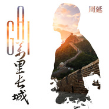

万里长城
============================

|  |  |
| :--: | :-- |
| [ 万里长城](https://emumo.xiami.com/album/2103718282) | **艺人**: [GAI](../index.md) **语种**: 国语 **唱片公司**: Door & Key **发行时间**: 2018年05月25日 **专辑类别**: EP, 单曲 **专辑风格**:  **播放数**: 9728 **收藏数**: 46 **评论数**: 18  |

## 简介

幼年时，万里长城是一幅图画，挂在父亲办公室里最显眼的位置。 那蜿蜒在莽莽丛山中连绵不尽的古老城墙，大抵是幼年周延的感知里所接触到的最庄严和雄伟的形象，而父辈们每每说起长城相关的话题，也总会伴随着“秦时明月汉时关”、“流不尽的英雄血”这样豪迈的吟诵，后来他渐渐知道，那不仅是一道城墙，更是一种如生命图腾一般的所在，是一种骄傲，一种属于所有被长城所庇护和照耀过的炎黄子孙的骄傲。 “不到长城非好汉” ，无数像周延一样的中国孩子，便开始一天一天向着心目中坚不可摧的好汉样子，坚定成长。 少年时，万里长城是一个奇迹，写在小学四年级的语文课本里，被誉为“在世界历史是一个伟大的奇迹”。 那时的周延，更好奇这样雄伟壮观的奇迹究竟从何而来？  
  
而每个孩子都读到过这样的答案：“无数的肩膀，无数双手，一步一步地抬上这陡峭的山岭，才凝结成这前不见头，后不见尾的万里长城。” 于是，长城不知不觉间就成了少年心志中几代人坚强毅力和巨大智慧的象征，于万千磨难险阻中，但凭一股心气，矢志不渝，终能成举世伟业。 西南少年北望长城，眼睛里看见的或只是图里画的一道壮阔风景，脑海里滋生的却是人生要的一个奇迹梦想。由此，纵出身于信马由缰的底层社会，周延却于浑浑噩噩中始终心有所向，于庸庸碌碌间终于脱颖而出，于毁誉起落后仍然坚定不移，三十而立之际，回首前尘往事，周延深知，人生中多少次前不见头，后不见尾，所幸他始终能望见音乐在自己身体里喷薄燃烧的样子，望着音乐如何把自己煅烧成砖，一步一步砥砺前行，一块一块扎实垒建，直到垒出属于他自己的一段雄伟长城，为自己和所爱的人写下荣光，谱成奇迹。 还有人说，万里长城是一股能量，长在黄皮肤黑眼睛的身体里。  
  
1984年，是中国人最张强烈感受到这种能量的年份。这一年，中国女排面对众多国际强劲对手，首次取得三连冠，全民振奋；这一年，中国奥运健儿在洛杉矶首获15金，全球震惊，一向被视为体育弱国的华夏儿女，终于在国际赛场上建立起属于我们的万里长城；而同样在这一年，当年那位凭一双坚定铁拳为中国人一雪“东亚病夫”之耻的天津武学宗师霍元甲，借由香港TVB的一部同名电视连续剧重新走进神州大地千家万户，再次成为万千国人心中最具能量的英豪传奇，唤起全民心中身为华夏儿女的自信与自豪。 而最能代表霍元甲形象的，便是他于巍巍长城中间，变换招数，御敌万里的荧屏形象，恰在此时，荧屏中便会飘出这样一阕歌：“万里长城永不倒，千里黄河水滔滔，江山秀丽，叠彩峰岭，问我国家哪像染病？”这首由香港乐坛大师黎小田作曲、卢国沾作词、叶振棠首唱的电视剧主题歌，字里行间唱尽中华威武豪情和不屈斗志，从1984年唱到如今，令每一个听到它的人热血澎湃，能量倍增，充分感觉到大国崛起的信心与决心，堂堂中华男儿，何惧强敌环伺，纵使身陷万千围难，心中有万里长城，此生便固若金汤。万里长城，是国人向世界宣告的一种能量，更是国人为自己许下的一种志向。 如今，万里长城就成了一首歌，唱在周延音乐生命里最重要的时刻。  
  
30岁的周延，曾率一己之力，为中国的流行音乐在短短的一个夏季筑起一道新的长城，随后便又因一时之厄，让这道长城连同自身形象险遭土崩瓦解。痛定思痛，饮水思源，周延方知，筑长城易，守长城难，而他要守住的这道长城，便是自己做音乐的初心，纵使跌落谷底，仍要以音乐为唯一救赎，御心魔于千里之外。 离开荣耀光照的四个月里，周延试图将身段低到尘埃里，向音乐的更深根处潜行。在准备全新创作专辑的过程中，他又想起了这段曾经激荡了他无数斗志的经典旋律，他想要重新唱出这首歌，不仅为自己致敬前辈大师的一段夙愿，更为这首歌中令他始终向往的那种为国为人的雄伟壮观，也为他以乐为砖以心补墙重筑长城的自我省悟。 而此际当下，正在或曾经遭临强敌突击几令心墙坍塌的又何止周延一人？心无缝，此身方无懈可击。周延，想用这样一首歌，去照见我们心里快要裂开的那些缝隙，于细罅间激发出我们身体里那些行将风流云散的热血与坚定，于麻木与萎顿之中重新凝聚成钢，挺立成墙，用豪情唤醒豪情，以荣耀重生荣耀，再筑长城万里的雄壮与刚强，“流血和汗，放肆我狂，星耀故园，照五千汉唐！” 《万里长城》，于周延人生起承转合之际再度点燃心火，也让所有听闻此歌的人，又听到奔突在身体里的那股“热”，又看清及镌刻在心头的那个“大”。  
  
其实，万里长城还是一种风格，融在周延一贯的音乐路线里。 万里长城更是一种格局，把华夏文明的博大精深与宏大智慧都兼容并蓄其中方成就这举世伟岸，虽然是最潮流音乐领域里的先锋人物，周延的思想文化体系却深深植根在中华的传统文化艺术土壤里，他最为人称道的作品和风格，无不是将国人的传统思想价值观，文化审美意识与经典形象、意向在流行新锐的音乐语汇里解构重建，解浮世众生相，贯中华礼义魂，说千古英豪气，唱人生精气神，体现出一种追古抚今关照世人的宏大格局，从而形成其独树一帜的新华流说唱风格，成为这一流派的开创先锋。周延坚信，中国人的音乐想要立足世界，必须先立在自己的根上，以华韵为魂，以流行为本，以说抒怀，以唱传神，这是周延一直以来的音乐志向，也是他与他的音乐导师，国内著名定位制作音乐人刘洲共同认定的新说唱方向。  
  
《万里长城》，正是周延将国人展望长城时脑海里纵横数代连绵万里的各种壮烈，豪迈、传奇、荣耀画面俯拾成句，又将歌咏长城最经典最豪迈的唱句采样入歌，而在编曲上，老道则巧妙地将长城根源所在地相关的音乐元素，如蒙古的马头琴的辽远、北京的京剧的庄严纳入现代说唱的火热曲式架构当中，将长城穿越古今的历史，激荡千秋的豪情，以及纵横四海的威名融会贯通，配着如热血奔突一般的节奏，营造出一种时不我待催人奋进的荣耀心与使命感。 《万里长城》，不是一首可以坐下来浅听慢吟的复古小调，也不是一段只用来在舞台上齐声诵唱的严肃表演，它是一首让你一听就情不自禁地想要站起来，就听见热血，听见荣耀，听见尊严在身体里汩汩激荡起来的歌，它是一首能让你在歌声中与血脉相通的人彼此相认的歌，每一个唱着它的人，站起来，就站成了我们心里的万里长城，万夫莫当，勇往直前。 周延还有一个众人皆知的名字，叫作GAI。万里长城不是一个人盖起来的，但《万里长城》却有望让一个叫GAI的重新站起来，也或可让每一个像GAI一样的人都挺立起来，站成自己心里的那道长城。

## 曲目

## 评论

|  |  |  |
| :-- | :-- | :-- |
|  [虾米用户](https://emumo.xiami.com/u/49640493) 网易云SAINTDONT... 2019-01-19 00:02 赞(0) 踩(0) | 
❛‿˂̵✧
 |
|  [虾米用户](https://emumo.xiami.com/u/258267810)  2018-11-04 23:23 赞(1) 踩(0) | 
虾米版权是一天不如一天
 |
|  [虾米用户](https://emumo.xiami.com/u/22649959)   2018-09-26 22:50 赞(0) 踩(0) | 
妈的！还不出来
 |
|  [虾米用户](https://emumo.xiami.com/u/265259103)  2018-09-17 08:45 赞(0) 踩(0) | 
炸
 |
|  [虾米用户](https://emumo.xiami.com/u/47591762)  2018-08-05 16:15 赞(3) 踩(0) | 
版权啊啊啊啊
 |
|  [虾米用户](https://emumo.xiami.com/u/195049296) 桀骜不驯. 2018-07-05 11:38 赞(0) 踩(0) | 
gai不是说是哪里的人就唱哪里的歌吗 
 |
|  [虾米用户](https://emumo.xiami.com/u/247957754) Don't stop b... 2018-07-02 04:18 赞(0) 踩(0) | 
gai！就服妳！唱出民族风够晒霸气！
 |
|  [虾米用户](https://emumo.xiami.com/u/376590184) 我还没想好要写什么... 2018-06-25 05:29 赞(0) 踩(0) | 
好期待！！已经在微博听了五万遍！
 |
|  [虾米用户](https://emumo.xiami.com/u/324905670)  2018-06-07 07:07 赞(0) 踩(0) | 
哇
 |
|  [虾米用户](https://emumo.xiami.com/u/13345327) 抑郁而死 2018-06-06 01:18 赞(0) 踩(0) | 
=
 |
|  [虾米用户](https://emumo.xiami.com/u/307733166) 在？？ 2018-06-04 00:14 赞(0) 踩(0) | 
期待
 |
|  [虾米用户](https://emumo.xiami.com/u/135892276)  2018-06-03 21:55 赞(0) 踩(0) | 
西部拉客没版权，gai还没有吗！！
 |
|  [虾米用户](https://emumo.xiami.com/u/374417323)  2018-06-02 16:26 赞(0) 踩(0) | 
什么时候发呀
 |
|  [虾米用户](https://emumo.xiami.com/u/45762426) 暂无签名~ 2018-06-02 06:10 赞(0) 踩(0) | 
更喜欢沧海一声笑
 |
|  [虾米用户](https://emumo.xiami.com/u/369038810) 我还没想好要写什么... 2018-06-01 21:26 赞(0) 踩(0) | 
没人？？？
 |
|  [虾米用户](https://emumo.xiami.com/u/277288371) 一如年少模样 2018-06-01 13:50 赞(0) 踩(0) | 
3
 |
|  [虾米用户](https://emumo.xiami.com/u/16972762) HONEY 2018-05-30 08:09 赞(0) 踩(0) | 
2
 |
|  [虾米用户](https://emumo.xiami.com/u/79622596)  2018-05-29 16:46 赞(0) 踩(0) | 
1
 |
