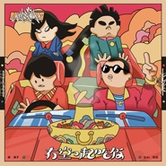

有空一起吃饭
============================

|  |  |
| :--: | :-- |
| [ 有空一起吃饭](https://emumo.xiami.com/album/2108357003) | **艺人**: [GAI](../index.md) **语种**: 国语 **唱片公司**: 摩登天空 **发行时间**: 2019年12月18日 **专辑类别**: EP, 单曲 **专辑风格**: 原声 Soundtrack **播放数**: 110 **收藏数**: 3 **评论数**: 1  |

## 简介

2019广东超级草莓音乐节广州场，“联合声明”计划兑现了乐队与说唱共享舞台的承诺。新裤子与GAI周延的炸裂现场视频先行刷屏，导致众多乐迷日常催发音频，望眼欲穿……  
&nbsp;  
好啦好啦，响应大家的热烈呼声，今日单曲音频正式上架，循环播放整起来！  
&nbsp;  
本来，乐队冠军遭遇说唱冠军，舞台俨然“决战紫禁之巅”，结果画风再次出人意料……GAI大跳霹雳，庞宽尽情Rap，这是要闹哪样？《有空一起吃饭》首次演绎，便在现场迅速开启洗脑模式。  
&nbsp;  
鬼马的庞宽，和GAI你有来言，我有去语，白描一段人情浮世绘。《有空一起吃饭》的编曲高能且穿越，瞬间回到八十年代初Hip Hop诞生初期与Disco纠缠不清的时刻。硬朗的旋律与律动，劲爆的Synth Pop，被干净利落地制作成一首又张扬又复古的神曲，Old School的霹雳观感扑面而来。  
&nbsp;  
新裤子成立20多年间始终引领潮流，而这波“New Pants Wave”又比潮流多了几分想象力和怪趣味。靠音乐实力和颠覆性创意征服乐迷的他们，合作当然不打舒适牌，在Trap风行的年头，瞬间抵达指定位置，焕发Hip Hop的根源魅力，“复古音乐旗手”实至名归。  
&nbsp;  
GAI周延，百炼成钢的“新华流”说唱第一人，成名以来驾驭多元曲风的能力不是“盖”的。这番试水Old School风格也是手到擒来。GAI的唱功一直被很多人感叹为：被称为被说唱耽误的“鬼才”歌手，此次合作GAI与庞宽的HOOK有趣洗脑，一改GAI之前的江湖气息，不论是中国风、江湖气、霸气或深情，或者简单有趣，GAI不断尝试新的音乐风格，可谓是风格最多变最全能的说唱音乐人。  
犀利又接地气的歌词，也是GAI深谙市井的老辣气质的体现，“火锅/醪糟/鸭肠/毛肚/猪脑”，“棒棒他拥有一根神棍/嬢嬢身体有香油成分”，画面感不要太真实。庞宽一句火辣辣的“你说啥子嘛”简直点睛，欢快与魔性并驾齐驱。  
&nbsp;  
更魔性的是中段插播的对话，两对人马嘻嘻哈哈，互射“伤害”，恶搞指数五颗星！不戏谑不是新裤子，不张扬不是GAI,“神仙打架”原来是酱婶儿的！  
&nbsp;  
新裤子联手GAI周延，贡献了一次好玩的新体验。新裤子设计了特别音乐路线，GAI又拓展了合作发展新可能。华语乐队与说唱合作的高配特别版，不是谁都可以这么玩儿。  
&nbsp;  
“联合声明”开出的支票必须兑现，打破次元壁、突破舒适圈，说得明白做得爽快，就是要和你想的不一样。第一弹《Stuck In The Club》里氤氲暧昧的都市情感是微醺的红酒让人沉醉，跟进的《有空一起吃饭》里绘声绘色的世俗精神又像重庆火锅，叫人上瘾，大喊巴适！  
&nbsp;  
12月内，“联合声明”还将发布“联名音乐单品”第三弹，长达2020的惊喜，已经替你安排明白了！

## 曲目

## 评论

|  |  |  |
| :-- | :-- | :-- |
|  [虾米用户](https://emumo.xiami.com/u/45762426) 暂无签名~ 2020-05-23 17:53 赞(0) 踩(0) | 
有生之年 两个最爱合体
 |
