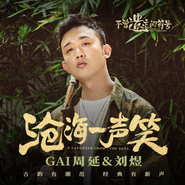

沧海一声笑
============================

|  |  |
| :--: | :-- |
| [ 沧海一声笑](https://emumo.xiami.com/album/5021389813) | **艺人**: [GAI](../index.md) **语种**: 国语 **唱片公司**: 网易云音乐 **发行时间**: 2020年09月02日 **专辑类别**: EP, 单曲 **专辑风格**:  **播放数**: 86 **收藏数**: 14 **评论数**: 0  |

## 简介

这是一段不能遗忘的声音符号！

这是一场传统与流行的碰撞！

这是一张你不容错过的年度潮音专辑！

非遗文化，国潮流行，从国粹根源出发，以大众流行为纬度，华语唱作人GAI、痛仰、TizzyT、马伯骞等6人倾情加盟，6份对传统非遗文化的致敬，6首融合创新的颠覆之作，云音乐非遗音乐纪录节目《不曾遗忘的符号》携手传统戏曲曲艺一同碰撞、融合并缔造全新年度流行音乐浪潮！

沧海一声笑，三分逍遥三分豪迈，两分不羁两分侠气

牡丹亭，三分婉约三分孤情，两分柔美两分艳丽

当经典遇上经典，成就众人认为不可能的可能！

非遗音乐纪录节目《不曾遗忘的符号》首发歌手GAI周延，从中国风说唱出发再遇经典创新声！侠气回肠的英雄遇见昆曲里的杜丽娘，牡丹亭与沧海一声笑如何碰撞新回响？

唱作人GAI周延出道以来，中国风说唱作品精品不断，却仍想探寻从传统中汲取营养。此次借由节目《不曾遗忘的符号》探访苏州昆曲演习所，拜访昆曲大师周雪峰并与昆曲演员刘煜一拍即合，并在短短数周内探讨出一个个新的民族与流行音乐融合实验的大胆想法，数次推到并重演，在器乐上选用传统民乐笛子并以电子化的编曲打底，结合华语一线编曲大师宋阳的精妙匠手，数次熬夜和争论，真正体现了中学为体西学为用的音乐创作理念。

与经典惊艳的重逢！脱胎于中国五声音阶的《沧海一声笑》从昆曲《牡丹亭 游园 皂罗袍》中碰撞融合出民族原生的芬芳，昆曲演员刘煜和GAI周延数次录音精细打磨，终于呈现出一个概念完美、自信充盈的新版《沧海一声笑》，让古曲传递出历久弥新的光彩，让经典焕发熠熠生辉的蓬勃生命力！

## 曲目

## 评论

