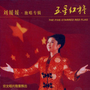

五星红旗
============================

|  |  |
| :--: | :-- |
| [ 五星红旗](https://emumo.xiami.com/album/10655) | **艺人**: [刘媛媛](../index.md) **语种**: 国语 **唱片公司**: 京文唱片 **发行时间**: 2002年08月01日 **专辑类别**: 录音室专辑 **专辑风格**: 红歌 Red Song **播放数**: 288885 **收藏数**: 80 **评论数**: 4  |

## 简介

这是主旋律作品当中最优秀的流畅的优美的一些作品的选辑，刘媛媛是苗家女子，毕业于中央民族大学。自1994年从声乐系毕业后，演唱技巧和风格逐渐走向成熟的刘媛媛，越来越多的掌声向她响起来，在歌坛上声名鹤起，并为观众喜爱。她嗓音舒展、浑厚，擅长将美声和民族唱法融合在一起演唱，赋予歌曲一种全新的内涵。  
  
从1996年开始，刘媛媛连续6年参加中央电视台春节联欢晚会、春节歌舞晚会及文化部春节晚会，多次受邀参加中央电视台、文化部主办的国家级大型文艺晚会。  
  
1997年香港回归前夜刘媛媛以一曲《闪光吧，香港》迎来了中英两国政府交接仪式的正式开始； 1999年10月1日在国庆50周年大型烟火晚会上第一个出场，以一首《五星红旗》，唱红了大江南北；在改革开放20周年《春潮颂》，澳门回归，中国共产党建党80周年，申办奥运成功等一系列历史时刻大型晚会中，人们都可以看见刘媛媛的身资，听到她激情四溢的演唱。  
  
由大导演陈凯歌亲任艺术指导，中央电视台合作拍摄的《五星红旗》MTV。更是为刘媛媛带来一系列的荣誉。这一气势宏大的作品，分赴香港、澳门、上海等六地全景拍摄，刘媛媛的精彩演绎与整部作品的风格相得益彰。《五星红旗》继在中央人民广播电台中国民歌榜上取得连续8周冠军的成绩后，先后获得中央人民广播电台“中国歌曲排行榜年度评委会特别贡献奖”和北京音乐台“中国歌曲排行榜评委会特别奖”。  
  
至今，凭借对大到国家小到人人的一腔真情和强烈艺术责任感，推出不少佳作《五星红旗》、《祝你好运》、《许下一个心愿》、《共享和平》、《中华是我家》等的刘媛媛已经是国家一级演员，全国青联委员。 

## 曲目

- [五星红旗MV](./10655/iW2Jd8768.md)
- [你的爱无处不在](./10655/3VlU36f4f.md)
- [长大成材](./10655/eKtJ7de50.md)
- [鲜花陪伴你MV](./10655/iW2Me14ab.md)
- [千重山万重水](./10655/iW2Nad282.md)
- [远方](./10655/iW2O9814a.md)
- [中国站起来](./10655/niBRe50e8.md)
- [祝你好运](./10655/iW2Qcb9f7.md)
- [许下一个心愿](./10655/iW2Rd83c2.md)
- [共产党人](./10655/niBU1d752.md)
- [人间天堂](./10655/8hvf3e74a.md)
- [中华是我家](./10655/niBWf1810.md)
- [团圆](./10655/8hvh42adb.md)
- [党旗在我心中](./10655/iW2Wced2a.md)

## 评论

|  |  |  |  |
| :-- | :-- | :-- | :-- |
|  [虾米用户](https://emumo.xiami.com/u/188833588)  2016-06-29 19:48 赞(0) 踩(0) | 
  
 |
|  [虾米用户](https://emumo.xiami.com/u/187817770)  2016-06-09 15:39 赞(0) 踩(0) | 
你好呀
 |
|  [虾米用户](https://emumo.xiami.com/u/25304065) jason 2014-02-12 10:23 赞(0) 踩(0) | 
有味道
 |
|  [虾米用户](https://emumo.xiami.com/u/4081566)  2011-05-28 12:09 赞(0) 踩(0) | 
一曲《五星红旗》让我们记住了一位实力唱将、优秀歌手-刘媛媛。
 |
