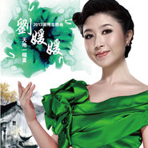

天地一幅画
============================

|  |  |
| :--: | :-- |
| [ 天地一幅画](https://emumo.xiami.com/album/468150993) | **艺人**: [刘媛媛](../index.md) **语种**: 国语 **唱片公司**: 红色春天文化 **发行时间**: 2013年05月06日 **专辑类别**: 精选集 **专辑风格**: 国语流行 Mandarin Pop **播放数**: 2999 **收藏数**: 10 **评论数**: 0  |

## 简介

第九届园博会主题歌 刘媛媛《天地一幅画》  
  
每个人的心中，总有那么一片天地：蓝蓝的天空上，飘过几朵懒散的白云，白云遮住了太阳向大地投下一抹阴凉，阴凉下青山绿水环绕，亭台楼阁交错，有三两个孩子在追逐嬉闹，他们穿过青山绿水间，一直奔回宁静的家园。这是我们心中对于那片世外桃源的幻想，也是我们对这如画生活的追求。  
  
然而随着时光的流逝，我们心中的桃花源不但没有如约而来，反而离我们越来越远。当机器的轰鸣声打破乡村的宁静，当人们竖起一根根巨大的烟囱向蓝天发起挑战，从此，天不再蓝，水不再绿，村庄不再宁静，孩子也不再奔跑嬉闹。那曾经的一幅美景已荡然无存。  
  
但有个人没有停止过对这种生活的追求。她以一首《五星红旗》成名，而后又携手成龙共同演唱了那首脍炙人口的《国家》，而今，她把更多的精力用在了歌唱绿色生活，歌唱美好家园上。《天地一幅画》就是诞生在这样一个大的背景下，我们无力阻止城市化的进程，当昔日“天苍苍野茫茫”的景象被高楼大厦所替代，当“夕阳无限好”只能在楼顶领会时，我们心中沉睡的那一幅世外桃源般的美景开始慢慢的复苏，于是，建设美丽新家园，在风景中生活的追求就显得尤其迫切了。这也算是刘媛媛对于绿色生活追求的一个新的起点。  
  
其实，刘媛媛的绿色事业早在几年前就已开始了，北京的风沙总是先吹醒那些敏感的生命，刘媛媛就是那早早醒来的一个，每年的植树节她都会跑到郊区亲手栽种起一棵棵象征着希望小树苗，她是想通过自己的行动去影响别人，让更多的人参与到建设绿色家园中来。她常说，追求绿色生活是我们每个人的权利，建设绿色家园则是我们每个人的义务。《天地一幅画》这首歌是由香港的著名音乐人金培达作曲，林夕填词的，他们把自己对于绿色生活的理解，对园林城市的追求融入到创作中，曲风温婉动人，歌词意境深邃，与中国园林景观的曲径通幽有异曲同工之妙。虽然中国的园林艺术因南北地域差异而有着各自鲜明的特点，然而其中一点却是共通的，那就是它对于绿色生活的诠释，对于风景中生活的追求。天地本是一幅画，我们只有用心雕琢我们脚下的每一寸土地，才能让生活如画，我们才能在风景中生活，这不仅仅是刘媛媛对于风景中生活的渴望，也是她用歌声传递给我们的信念，听着这美妙温婉的歌声，让我们在这一信念的支持下，期待着，追求着，实现着我们心中的那一幅甜蜜安静的画卷。 

## 曲目

- [天地一幅画](./468150993/xL08Jkc2e14.md)
- [大地丰收](./468150993/xNLJD7dfdc7.md)

## 评论

