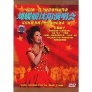

刘媛媛
============================

|  |  |
| :--: | :-- |
| [ 刘媛媛](https://i.xiami.com/liuyuanyuan) | **地区**: China 中国大陆 **风格**: 传统流行 Traditional Pop **播放数**: 1929988 **粉丝数**: 665 **评论数**: 16  |

## 档案

刘媛媛，1991年1月4日出生于河北省邯郸市魏县北皋镇南刘岗村，媛创学堂创始人，福布斯女性  ，北京媛创文化传媒有限公司CEO，  中国汉族，励志演说家  ，安徽卫视《超级演说家》第二季总冠军，北京大学法律系研究生。2014年参与选秀节目《奇葩说》，被蔡康永陶晶莹淘汰。  2016年，参与《天天向上》节目录制。  2018年与野红梅特别出演电影《100分女人》。  2019年与肖战等人参加脱口秀《我想和世界谈谈》。  2017年4月出版作品《我不惧怕成为这样“强硬”的姑娘》，2019年10月出版作品《精准努力：刘媛媛的逆袭课》，并且入围2019福布斯中国30岁以下精英榜。2020年成为抖音音乐人,发行个人创作单曲《勇敢女生》。 
北京大学财税法专业研究生刘媛媛1991年1月4日出生于魏县南刘岗村一个普通家庭，家里还有两个较年长的哥哥。  父亲高中文化，当过兵。她的小学生活是在本村度过的，同班的很多同学没上到初中毕业就不读书了。刘媛媛说，她11岁时，就被家人从农村送到市里读初中。  媛媛大哥参加工作以后，家里的条件有所改善，2002年媛媛在本村小学毕业后，被父母送进邯郸市读初中，并凭借优异的成绩升入邯郸市一中。在高中阶段，媛媛下定决心苦读，立志考取北京大学。高二时候她就开始蝉联年级第一名，但最终没有考入北大，而进入对外经济贸易大学。媛媛并没有灰心，经过自己的努力，最后终于进入北大校门，学习财税法专业，圆了“北大梦”。 
2014年，参与由爱奇艺打造的首档说话选秀节目《奇葩说》，  被蔡康永陶晶莹痛批。  因为蔡康永和陶晶莹的两张淘汰票，  《超级演说家》冠军刘媛媛惨遭淘汰。 
2016年，参与《天天向上》脱单季第二期“短发鲜女”主题节目录制，坦言自己在《天天向上》刚开播的2008年就立下决心，要加入天天兄弟的队伍！ 
2018年，参与电影《100分女人》在北京举办的概念发布会，  特别出演电影《100分女人》的刘媛媛和野红梅为现场百位不同职业的女性带来了一场“现代女性到底应该以爱情为重还是事业为重”的辩论会。  选择了“女人事业更重要”的刘媛媛率先开局。  在辩论会最后，主持人发起了票选活动，让女性自己选出她们心目中的满分女人该有的模样。100位女性观众现场投票，最终，选择事业的刘媛媛以微弱的差距赢得了这次辩论会的胜利。 
2019年与肖战、马薇薇、七堇年参加脱口秀《我想和世界谈谈》。 
研究生毕业后，刘媛媛选择在教育领域自主创业。  在夺得《超级演说家》第二季总冠军后，她接到了很多商业演讲邀请，一场场演讲跑下来获得的酬劳，成了创业的启动资金。  创业最开始做了一个考研网站，投了好多钱进去，却以失败告终。 
2017年，开始做学习方法课，正赶上知识付费风口，公司有了第一笔千万收入。 
2020年6月，刘媛媛开始在抖音上为学生和青年群体推荐图书。  她会为了给小学生挑选一套合适的历史书，专门跑到北大找历史专业的朋友一起讨论；也会督促直播间的女性尤其是宝妈要不断学习，并推荐阅读提高情商和财商的图书。  这份真诚和用心，让她很快赢得了700万多万粉丝的喜爱。  刘媛媛的工作就是读书、选书、荐书。每天深夜12点多才会下播，然后看书看到两点，早上八九点起床后接着看书，只为从海量的图书里精挑细选出真正的好书。除此之外，她每天还会写一篇文章来训练表达能力。  在抖音直播的时候，不乏有质疑者在弹幕上留言：为什么北大法学硕士毕业，要选择卖书？事实上，刘媛媛在校时就取得了律师从业资格证，但当律师并不是自己心之所向。在她看来，卖书一方面需要强大的阅读理解能力，才能够快速地读书并且判断什么是好书；另一方面还需要较强的输出和推荐能力，来唤起人们阅读兴趣。  通过直播带货售书，10月8日至12月28日成交额累计逾4500万元。

## 专辑

| 名称 | 语种 | 唱片公司 | 发行时间 | 专辑类别 | 专辑风格 |
| :--: | :-- | :-- | :-- | :-- | :-- |
| [ 腾*迅*传](./albums/5022348421.md) | 国语 |  | 2020年12月30日 | 有声书 |  |
| [ 经济历史篇2刘媛媛的私人财富书单](./albums/5022350878.md) | 国语 |  | 2020年12月22日 | 录音室专辑 |  |
| [ 经济历史篇刘媛媛的私人财富书单](./albums/5022280527.md) | 国语 |  | 2020年12月22日 | 有声书 |  |
| [ 情绪心理篇刘媛媛的私人书单](./albums/5021680511.md) | 国语 |  | 2020年10月15日 | 有声书 |  |
| [ 眼界格局篇刘媛媛的私人书单](./albums/5021348201.md) | 国语 |  | 2020年09月24日 | 有声书 | 有声书 Audio Book |
| [ 北大学霸超级学习术](./albums/5021342697.md) | 国语 |  | 2020年08月23日 | 有声书 |  |
| [ 娱乐至死](./albums/5021339220.md) | 国语 |  | 2020年08月23日 | 有声书 |  |
| [ 30天搞定当众说话](./albums/5021336301.md) | 国语 |  | 2020年08月20日 | 有声书 |  |
| [ 丑女莫作怪](./albums/5021259318.md) | 国语 |  | 2020年08月07日 | EP, 单曲 |  |
| [ 寒门贵子超级演说家](./albums/5021239439.md) | 国语 |  | 2020年08月06日 | 有声书 |  |
| [ 普通人快速逆袭的26堂课](./albums/5021229451.md) | 国语 |  | 2020年08月05日 | 有声书 |  |
| [ 不作不会死逆袭北大热血才女 / 我要坚持到所有人都放弃](./albums/5021258794.md) | 国语 |  | 2020年08月05日 | 有声书 |  |
| [ 勇敢女生](./albums/5021158879.md) | 国语 | 字节跳动 | 2020年08月05日 | EP, 单曲 | 华语唱作人 Chinese Singer-Songwriter |
| [ 龙马飞扬](./albums/5021207572.md) | 国语 | 博轩音乐 | 2020年08月03日 | EP, 单曲 | 传统流行 Traditional Pop |
| [ 全家福](./albums/2104416331.md) | 国语 | 大格娱乐 | 2018年12月29日 | EP, 单曲 | 国语流行 Mandarin Pop |
| [ 走在幸福的路上](./albums/2103969559.md) | 国语 | 独立发行 | 2018年09月03日 | 录音室专辑 | 流行 Pop, 国语流行 Mandarin Pop |
| [ 国香](./albums/2103940708.md) | 国语 | 索氧音乐 | 2018年08月23日 | EP, 单曲 | 国语流行 Mandarin Pop |
| [ 相信幸福](./albums/2103925413.md) | 国语 | 索氧音乐 | 2018年08月16日 | EP, 单曲 | 流行 Pop, 国语流行 Mandarin Pop |
| [ 带上爱飞翔](./albums/2103907845.md) | 国语 | 独立发行 | 2018年08月10日 | 录音室专辑 | 国语流行 Mandarin Pop, 中国风 China-Wave |
| [ 啊哈嘟呀](./albums/2103896193.md) | 国语 | 独立发行 | 2018年08月03日 | 录音室专辑 | 中国传统民歌 Chinese Traditional Folk |
| [ 歌唱新时代](./albums/2103606248.md) | 国语 | 博轩音乐 | 2018年03月12日 | EP, 单曲 | 传统民谣 Traditional Folk, 中国民乐 Chinese Folk Music |
| [ 我是我榜样](./albums/117083482.md) | 国语 | 刘媛媛工作室 | 2014年11月27日 | EP, 单曲 |  |
| [ 春天的诉说](./albums/1100487065.md) | 国语 | 酝星文化 | 2014年05月19日 | 精选集 | 国语流行 Mandarin Pop |
| [ 故乡陇南](./albums/73422649.md) | 国语 | 红色春天 | 2013年07月10日 | EP, 单曲 |  |
| [ 天地一幅画](./albums/468150993.md) | 国语 | 红色春天文化 | 2013年05月06日 | 精选集 | 国语流行 Mandarin Pop |
| [ 五星红旗 草原情](./albums/2100189994.md) | 国语 | 内蒙古文化音像 | 2010年02月02日 | 录音室专辑 |  |
| [ 沈阳演唱会](./albums/5021633363.md) | 国语 | 孔雀廊 | 2010年01月01日 | 现场专辑 |  |
| [ 《国家》](./albums/2103889128.md) | 国语 | 独立发行 | 2009年02月28日 | EP, 单曲 | 国语流行 Mandarin Pop |
| [ 宁为女人](./albums/525638.md) | 国语 | 暂无 | 2008年06月24日 | EP, 单曲 |  |
| [ 美好祝福](./albums/10654.md) | 国语 | 广西民族 | 2003年01月01日 | 录音室专辑 |  |
| [ 五星红旗](./albums/10655.md) | 国语 | 京文唱片 | 2002年08月01日 | 录音室专辑 | 红歌 Red Song |
| [ 鲜花陪伴你](./albums/5021648212.md) | 国语 | 中唱 | 2002年01月01日 | 录音室专辑 |  |

## 评论

|  |  |  |
| :-- | :-- | :-- |
|  [虾米用户](https://emumo.xiami.com/u/4805953) 我还没想好要写什么... 2021-01-01 20:46 赞(0) 踩(0) | 
编辑有够水的 两个不同的人合在同一个词条里
 |
|  [虾米用户](https://emumo.xiami.com/u/357789463)  2019-04-04 20:55 赞(0) 踩(0) | 
国音震撼，凝聚国人
 |
|  [虾米用户](https://emumo.xiami.com/u/406278559) 面对我前面的人群，我得穿... 2018-12-30 14:59 赞(1) 踩(0) | 
媛媛，你真的既漂亮又温柔
 |
|  [虾米用户](https://emumo.xiami.com/u/331602162) 道武以来，战胜攻取，未尝... 2018-12-16 23:24 赞(0) 踩(0) | 
独孤伽罗
 |
|  [虾米用户](https://emumo.xiami.com/u/408302784)  2018-11-12 00:55 赞(0) 踩(0) | 
感谢刘媛媛和成龙的精彩奉献，你们把中国人的家国情怀演唱得淋漓尽致。
 |
|  [虾米用户](https://emumo.xiami.com/u/368781336)  2018-09-22 06:25 赞(0) 踩(0) | 
非常喜欢听刘媛媛的&amp;ldquo;五星红旗&amp;rdquo;和&amp;ldquo;国家&amp;rdquo;。
 |
|  [虾米用户](https://emumo.xiami.com/u/285342803) 从今天开始爱上音乐 2018-02-13 11:10 赞(1) 踩(0) | 
感觉《国家》还是有瑕疵
 |
|  [虾米用户](https://emumo.xiami.com/u/316362375)  2017-08-01 21:52 赞(1) 踩(0) | 
好听
 |
|  [虾米用户](https://emumo.xiami.com/u/298157991)  2017-05-21 20:11 赞(1) 踩(0) | 
好听，听的和现实社会不一样。现在社会没人情味。
 |
|  [虾米用户](https://emumo.xiami.com/u/1499751)  2016-12-16 04:46 赞(2) 踩(0) | 
居然没有「感恩」
 |
|  [虾米用户](https://emumo.xiami.com/u/16135450)  2016-06-04 14:54 赞(1) 踩(0) | 
7444444444444444444444444444444444444444
 |
|  [虾米用户](https://emumo.xiami.com/u/66049520) 烟酒茶都不来的90后 2016-03-02 08:21 赞(0) 踩(0) | 
揣着梦想走四方没有
 |
|  [虾米用户](https://emumo.xiami.com/u/12734821) 胜利十一人 2015-07-22 20:00 赞(1) 踩(0) | 
中国特产。。。。。
 |
|  [虾米用户](https://emumo.xiami.com/u/12992762)  2013-02-10 22:07 赞(0) 踩(0) | 
歌好听
 |
|  [虾米用户](https://emumo.xiami.com/u/4081566)  2011-05-28 12:35 赞(1) 踩(0) | 
继《五星红旗》后又推出《国家》、《中华是我家》等一批力作，刘媛媛是我国歌坛又一位炉火纯青的跨界歌唱家。
 |
|  [虾米用户](https://emumo.xiami.com/u/240051)  2011-01-25 07:43 赞(1) 踩(0) | 
成龙和刘媛媛合唱的歌最有爱国情怀
 |
