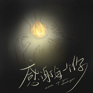
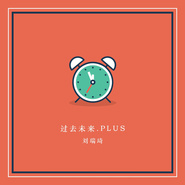
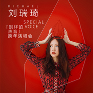

刘瑞琦
============================

|  |  |
| :--: | :-- |
| [<br>刘瑞琦](https://i.xiami.com/liuruiqi) | **地区**: China 中国大陆<br>**风格**: 国语流行 Mandarin Pop, 华语唱作人 Chinese Singer-Songwriter<br>**播放数**: 164607878<br>**粉丝数**: 104603<br>**评论数**: 1308<br> |

## 档案

<div>
刘瑞琦（Richael），1993年9月2日出生于安徽，华语创作女歌手。<br>
2013年1月，因在雪地吉他弹唱周杰伦创作的《明明就》而走红网络受到关注。4月，刘瑞琦参与湖南卫视励志音乐类真人秀节目《中国最强音》，进入到罗大佑老师所带领的女生组，并最终晋级全国十二强。   10月，推出单曲《房间》 。11月6日，刘瑞琦发行了个人首张EP《私房歌》  。12月推出歌曲《房间》MV   。<br>
2014年5月17日，刘瑞琦荣获首座奖杯-首届中国新歌榜虾米音乐人推荐大奖。7月参加厦门草莓音乐节  。9月11日，推出单曲《三度和弦》   。9月25日，刘瑞琦发行第二张EP《早安，琦》  。<br>
2015年2月5日推出歌曲《歌路》MV   。5月28日，推出单曲《初夏》  。12月15日，推出单曲《爱需要练习》   。<br>
2016年5月23日，出席OK！四周年颁奖典礼，并担任表演嘉宾 [12]  。9月5日，受邀参加全新梅赛德斯-奔驰长轴距E级车上市盛典并献唱 。12月19日，担任网易云音乐第三届全国校园歌手大赛总决赛评委 。<br>
2017年5月19日，刘瑞琦发行第三张EP《晚安，琦》   。9月开始刘瑞琦“温暖的房间”巡回演唱会 。9月2日，推出巡回演唱会同名单曲《温暖的房间》。<br>
2018年1月11日，推出“荣耀9青春版”手机主题曲《定格》。5月18日，推出为电影《超时空同居》重新创作改编并演唱插曲《房间（新版）》 。8月2日入选福布斯中国“30位30岁以下精英”榜（音乐领域）  。
</div>

## 专辑

| 名称 | 语种 | 唱片公司 | 发行时间 | 专辑类别 | 专辑风格 |
| :--: | :-- | :-- | :-- | :-- | :-- |
| [<br>天舞纪 网剧影视原声带](./albums/5021143643.md) | 国语 |  | 2020年07月21日 | EP, 单曲 | 原声 Soundtrack |
| [<br>守候](./albums/5021095722.md) | 国语 | 听见时代 | 2020年07月14日 | EP, 单曲 | 国语流行 Mandarin Pop |
| [<br>海与岛Island and Sea](./albums/5020739077.md) | 国语 | 网易云音乐 | 2020年05月26日 | EP, 单曲 |  |
| [<br>某年夏天One Summer](./albums/2108420057.md) | 国语 | 制作家 | 2020年04月24日 | EP, 单曲 | 新世纪音乐 New Age |
| [<br>感谢每一个你](./albums/2420340548.md) | 国语 | 梦织音 | 2020年02月29日 | EP, 单曲 | 国语流行 Mandarin Pop |
| [<br>唯新主义](./albums/2105746081.md) | 国语 | 好的音乐 | 2020年01月15日 | EP, 单曲 |  |
| [<br>标准答案The Standard Answer](./albums/2105746073.md) | 国语 | 好的音乐 | 2019年12月20日 | EP, 单曲 |  |
| [<br>小欢喜](./albums/2105048529.md) | 国语 | 星影乐 | 2019年08月01日 | EP, 单曲 |  |
| [<br>离开的借口](./albums/2104462060.md) | 国语 | 好的音乐 | 2019年01月08日 | EP, 单曲 | 流行 Pop, 国语流行 Mandarin Pop |
| [<br>房间 (新版)](./albums/2103711814.md) | 国语 | 代亚文化 | 2018年05月18日 | EP, 单曲 | 国语流行 Mandarin Pop, 电影原声 Film Score |
| [<br>定格](./albums/2103484851.md) | 国语 | 代亚文化 | 2018年01月11日 | EP, 单曲 | 国语流行 Mandarin Pop |
| [<br>过去未来.PLUS](./albums/2102885091.md) | 国语 | 独立发行 | 2017年10月28日 | EP, 单曲 | 独立流行 Indie Pop |
| [<br>温暖的房间](./albums/2102849979.md) | 国语 | 代亚文化 | 2017年09月02日 | EP, 单曲 | 国语流行 Mandarin Pop, 独立流行 Indie Pop |
| [<br>晚安，琦](./albums/2102749266.md) | 国语 | 代亚文化 | 2017年05月19日 | EP, 单曲 | 国语流行 Mandarin Pop, 华语唱作人 Chinese Singer-Songwriter |
| [<br>玩笑](./albums/2102725525.md) | 国语 | 代亚文化 | 2017年04月01日 | EP, 单曲 | 国语流行 Mandarin Pop, 爵士流行 Jazz Pop |
| [<br>每次和你走在路上都会看见一只喵Acoustic](./albums/2102704728.md) | 国语 | 代亚文化 | 2017年03月06日 | EP, 单曲 | 国语流行 Mandarin Pop |
| [<br>小拳拳捶你胸口](./albums/2102689084.md) | 国语 | 独立发行 | 2017年02月06日 | EP, 单曲 | 流行 Pop |
| [<br>刘瑞琦跨年演唱会](./albums/2102672179.md) | 国语 | 独立发行 | 2016年12月26日 | EP, 单曲 | 国语流行 Mandarin Pop |
| [<br>刘瑞琦毕业音乐会精选版](./albums/2106059602.md) | 国语 | 代亚文化 | 2015年12月03日 |  | 流行 Pop |
| [<br>青春留言刘瑞琦毕业音乐会精选版](./albums/2100184198.md) | 国语 | 独立发行 | 2015年08月26日 | 现场专辑 | 国语流行 Mandarin Pop |
| [<br>青春留言](./albums/1136406695.md) | 国语 | 独立发行 | 2015年07月08日 | EP, 单曲 | 流行舞曲 Dance-Pop, 国语流行 Mandarin Pop, 电音流行 Electropop |
| [<br>初夏](./albums/1632630676.md) | 国语 | 独立发行 | 2015年05月28日 | EP, 单曲 | 国语流行 Mandarin Pop |
| [<br>再次寻找周杰伦](./albums/2102408511.md) | 国语 | 独立发行 | 2015年01月18日 | 录音室专辑 | 国语流行 Mandarin Pop |
| [<br>早安, 琦](./albums/808058525.md) | 国语 | 独立发行 | 2014年09月25日 | EP, 单曲 | 独立流行 Indie Pop, 国语流行 Mandarin Pop |
| [<br>私房歌](./albums/181893636.md) | 国语 | 独立发行 | 2013年11月06日 | EP, 单曲 | 独立流行 Indie Pop |

## 评论

|  |  |  |
| :-- | :-- | :-- |
| <br>[虾米用户](https://emumo.xiami.com/u/358104299)<br>悲观的唯心存在现实解构虚...<br>2020-12-28 07:53<br>赞(0) 踩(0) | <div>44469</div> |
| <br>[虾米用户](https://emumo.xiami.com/u/35062303)<br>一个喜欢唱歌的小女孩<br>2020-10-04 19:16<br>赞(0) 踩(0) | <div>点赞！</div> |
| <br>[虾米用户](https://emumo.xiami.com/u/266835880)<br><br>2020-09-02 21:40<br>赞(0) 踩(0) | <div>生日快乐</div> |
| <br>[虾米用户](https://emumo.xiami.com/u/202171840)<br>业精于勤荒于嬉<br>2020-09-02 11:09<br>赞(0) 踩(0) | <div>生日快乐</div> |
| <br>[虾米用户](https://emumo.xiami.com/u/202171840)<br>业精于勤荒于嬉<br>2020-09-02 11:08<br>赞(0) 踩(0) | <div>生日快乐</div> |
| <br>[虾米用户](https://emumo.xiami.com/u/332767497)<br><br>2020-09-02 10:24<br>赞(0) 踩(0) | <div>加油！一不小心就大火 </div> |
| <br>[虾米用户](https://emumo.xiami.com/u/283514235)<br><br>2020-09-02 10:09<br>赞(0) 踩(0) | <div>和你同一天生日，祝你生日快乐，也希望你越来越好！</div> |
| <br>[虾米用户](https://emumo.xiami.com/u/26362708)<br>Ther<br>2020-09-02 10:06<br>赞(0) 踩(0) | <div>你的声音好好听啊～啊～～好喜欢 </div> |
| <br>[虾米用户](https://emumo.xiami.com/u/14758824)<br><br>2020-09-02 10:05<br>赞(0) 踩(0) | <div>27生日快乐</div> |
| <br>[虾米用户](https://emumo.xiami.com/u/257365030)<br><br>2020-09-02 10:05<br>赞(0) 踩(0) | <div>生日快樂！</div> |
| <br>[虾米用户](https://emumo.xiami.com/u/371994148)<br><br>2020-09-02 10:05<br>赞(0) 踩(0) | <div>生日快乐。</div> |
| <br>[虾米用户](https://emumo.xiami.com/u/2796166)<br>最爱莫文蔚.....<br>2020-08-14 01:54<br>赞(1) 踩(0) | <div>加油 加油~~ 不错哦~~~</div> |
| <br>[虾米用户](https://emumo.xiami.com/u/7010864)<br> <br>2020-05-02 20:04<br>赞(1) 踩(0) | <div>坐等新歌</div> |
| <br>[虾米用户](https://emumo.xiami.com/u/436702575)<br><br>2020-02-14 13:54<br>赞(2) 踩(0) | <div></div> |
| <br>[虾米用户](https://emumo.xiami.com/u/4400366)<br>再也不见<br>2020-01-30 18:49<br>赞(0) 踩(0) | <div>囍</div> |
| <br>[虾米用户](https://emumo.xiami.com/u/411762274)<br>望着天空的女孩<br>2019-10-20 00:11<br>赞(0) 踩(0) | <div>每一首都很好听，在国外收藏了</div> |
| <br>[虾米用户](https://emumo.xiami.com/u/65302160)<br>妄想比现实靠谱得多<br>2019-09-02 12:47<br>赞(0) 踩(0) | <div>生日快乐呀！</div> |
| <br>[虾米用户](https://emumo.xiami.com/u/374355524)<br>开始吧<br>2019-09-02 11:38<br>赞(0) 踩(0) | <div>生日快乐</div> |
| <br>[虾米用户](https://emumo.xiami.com/u/319928818)<br>等银河灌溉阡陌<br>2019-09-02 10:07<br>赞(0) 踩(0) | <div>生日快了瑞琦</div> |
| <br>[虾米用户](https://emumo.xiami.com/u/405075108)<br>想和长得帅的人成为朋友，...<br>2019-09-02 10:05<br>赞(0) 踩(0) | <div>这么优秀的人，让我们的语言也顿时显得匮乏了起来，没有语言能真正说的尽你的优秀，没有任何夸奖能真正配得上你。</div> |
| <br>[虾米用户](https://emumo.xiami.com/u/303280389)<br><br>2019-09-02 10:03<br>赞(0) 踩(0) | <div>生日快乐，喜欢你的风格</div> |
| <br>[虾米用户](https://emumo.xiami.com/u/257365030)<br><br>2019-07-07 08:12<br>赞(0) 踩(0) | <div>你是最近幾年我發現的唱歌最好聽的女歌手，加油</div> |
| <br>[虾米用户](https://emumo.xiami.com/u/319928818)<br>等银河灌溉阡陌<br>2019-06-24 13:06<br>赞(0) 踩(0) | <div>伴随我的高中生活</div> |
| <br>[虾米用户](https://emumo.xiami.com/u/425683536)<br><br>2019-06-10 07:18<br>赞(0) 踩(0) | <div>666</div> |
| <br>[虾米用户](https://emumo.xiami.com/u/25471222)<br>对自由有多大的理解 就有...<br>2019-05-31 22:07<br>赞(0) 踩(0) | <div>加油啊！！</div> |
| <br>[虾米用户](https://emumo.xiami.com/u/423448231)<br><br>2019-05-19 19:30<br>赞(0) 踩(0) | <div>爱你哟!</div> |
| ⇒ | <br>[虾米用户](https://emumo.xiami.com/u/424890315)<br><br>2019-05-25 18:22<br>赞(0) 踩(0) | <div>爪</div> |
| <br>[虾米用户](https://emumo.xiami.com/u/9062060)<br>此生没拿一个亿来爱虾米是...<br>2019-04-17 08:38<br>赞(0) 踩(0) | <div>背景美</div> |
| ⇒ | <br>[虾米用户](https://emumo.xiami.com/u/424890315)<br><br>2019-05-25 18:21<br>赞(0) 踩(0) | <div>聊聊天兒</div> |
| <br>[虾米用户](https://emumo.xiami.com/u/412498372)<br><br>2019-03-30 23:38<br>赞(0) 踩(0) | <div>老乡呀！ </div> |
| <br>[虾米用户](https://emumo.xiami.com/u/339141254)<br>患得患失<br>2019-03-19 20:12<br>赞(0) 踩(0) | <div>喜欢你</div> |
| <br>[虾米用户](https://emumo.xiami.com/u/421333524)<br><br>2019-03-19 19:03<br>赞(0) 踩(0) | <div>你的寻找周杰伦专辑没有了吗，好喜欢那几首歌</div> |
| <br>[虾米用户](https://emumo.xiami.com/u/3799698)<br> <br>2019-03-16 21:41<br>赞(0) 踩(0) | <div>再次寻找周杰伦的专辑怎么没了？</div> |
| <br>[虾米用户](https://emumo.xiami.com/u/329961508)<br><br>2019-03-16 18:51<br>赞(0) 踩(0) | <div>他还好吧？他有没有想我，呵  我再等你啊！</div> |
| <br>[虾米用户](https://emumo.xiami.com/u/327317034)<br><br>2019-03-06 08:21<br>赞(0) 踩(0) | <div>刘瑞琦的最长的电影哪里能听</div> |
| <br>[虾米用户](https://emumo.xiami.com/u/293692544)<br>你敢给我说话吗？我咬你<br>2019-03-01 20:43<br>赞(1) 踩(0) | <div>好听</div> |
| <br>[虾米用户](https://emumo.xiami.com/u/419910324)<br><br>2019-02-27 17:41<br>赞(1) 踩(0) | <div>哦！这该死的声音，太好听了</div> |
| <br>[虾米用户](https://emumo.xiami.com/u/402696316)<br><br>2019-02-21 17:15<br>赞(1) 踩(0) | <div>我啦拖拉机</div> |
| <br>[虾米用户](https://emumo.xiami.com/u/411804330)<br><br>2019-02-12 10:28<br>赞(1) 踩(0) | <div>Way</div> |
| <br>[虾米用户](https://emumo.xiami.com/u/418709392)<br><br>2019-02-09 15:38<br>赞(1) 踩(0) | <div>会迟到，但不会缺席，爱你，因为这首歌，让我遇见你，成为77粉，爱你</div> |
| <br>[虾米用户](https://emumo.xiami.com/u/412498372)<br><br>2019-01-19 13:12<br>赞(1) 踩(0) | <div>需要会员加我</div> |
| <br>[虾米用户](https://emumo.xiami.com/u/54951340)<br>我还没想好要写什么...<br>2019-01-17 12:32<br>赞(1) 踩(0) | <div>❤❤❤❤❤</div> |
| <br>[虾米用户](https://emumo.xiami.com/u/409204733)<br>我还没想好要写什么...<br>2019-01-10 20:06<br>赞(1) 踩(0) | <div>新年快乐。新的一年有新的旋律打动我 </div> |
| ⇒ | <br>[虾米用户](https://emumo.xiami.com/u/410679548)<br>情歌，诗圣，远远<br>2019-01-18 17:59<br>赞(0) 踩(0) | <div>呵呵不错</div> |
| ⇒ | <br>[虾米用户](https://emumo.xiami.com/u/409204733)<br>我还没想好要写什么...<br>2019-01-18 19:23<br>赞(0) 踩(0) | <div><q><b>情歌诗圣远远说：</b></q></div> |
| <br>[虾米用户](https://emumo.xiami.com/u/286517981)<br><br>2019-01-06 21:09<br>赞(0) 踩(0) | <div>好好听。。。加油！  </div> |
| <br>[虾米用户](https://emumo.xiami.com/u/52565961)<br>想养一隻狗<br>2019-01-04 08:18<br>赞(0) 踩(0) | <div>只听到声音的时候以为是Faye Zhan </div> |
| ⇒ | <br>[虾米用户](https://emumo.xiami.com/u/410679548)<br>情歌，诗圣，远远<br>2019-01-19 02:56<br>赞(0) 踩(0) | <div>不错</div> |
| <br>[虾米用户](https://emumo.xiami.com/u/1232739)<br><br>2018-12-06 12:17<br>赞(1) 踩(0) | <div>学妹你好。你是最胖的</div> |
| <br>[虾米用户](https://emumo.xiami.com/u/409470957)<br><br>2018-11-29 15:37<br>赞(0) 踩(0) | <div>帮我加个月的非常好嘛你</div> |
| <br>[虾米用户](https://emumo.xiami.com/u/409470957)<br><br>2018-11-29 15:36<br>赞(0) 踩(0) | <div>你只要有小</div> |
| <br>[虾米用户](https://emumo.xiami.com/u/5573111)<br><br>2018-11-26 07:58<br>赞(2) 踩(0) | <div>从北京去济南看了11.24温暖的房间，刘瑞琦最后唱哭了，感觉她真不容易。。。加油呀，</div> |
| <br>[虾米用户](https://emumo.xiami.com/u/302958092)<br><br>2018-11-22 17:36<br>赞(0) 踩(0) | <div>小姐姐，我可喜欢你了@_@</div> |
| <br>[虾米用户](https://emumo.xiami.com/u/89164050)<br><br>2018-10-27 22:34<br>赞(1) 踩(0) | <div>哈哈，77姐<br>喜欢你的歌，有五年了。前几天突然看QQ音乐，粉丝都80w了。好开心！加油！</div> |
| <br>[虾米用户](https://emumo.xiami.com/u/316667746)<br>如果不去努力，就不会被任...<br>2018-10-27 21:44<br>赞(0) 踩(0) | <div>小姐姐，我看好你呦。</div> |
| <br>[虾米用户](https://emumo.xiami.com/u/26999367)<br>随心<br>2018-10-03 09:39<br>赞(1) 踩(0) | <div>好喜欢这个小姐姐 </div> |
| <br>[虾米用户](https://emumo.xiami.com/u/36531941)<br><br>2018-10-02 23:18<br>赞(1) 踩(0) | <div>刘瑞琦你好，</div> |
| <br>[虾米用户](https://emumo.xiami.com/u/324874382)<br>可爱的你们哦。✪ω✪<br>2018-09-18 17:26<br>赞(0) 踩(0) | <div>好听</div> |
| <br>[虾米用户](https://emumo.xiami.com/u/404240972)<br><br>2018-09-17 23:18<br>赞(0) 踩(0) | <div>nice song</div> |
| ⇒ | <br>[虾米用户](https://emumo.xiami.com/u/379286508)<br><br>2018-10-07 19:59<br>赞(0) 踩(0) | <div>ppp<br>ppppzSzｼｼｼ9X<br><br><br>一|英<br>英英<br>0</div> |
| <br>[虾米用户](https://emumo.xiami.com/u/347079600)<br><br>2018-09-16 20:22<br>赞(0) 踩(0) | <div>加油＾０＾~</div> |
| <br>[虾米用户](https://emumo.xiami.com/u/404072483)<br><br>2018-09-14 00:41<br>赞(1) 踩(0) | <div>再次寻找周杰伦专辑没有了吗？哪里可以听</div> |
| <br>[虾米用户](https://emumo.xiami.com/u/15484435)<br><br>2018-09-13 16:48<br>赞(1) 踩(0) | <div>喜欢那么多翻唱的杰伦的歌，哪里找啊。发现之前豆瓣上的都没有了</div> |
| <br>[虾米用户](https://emumo.xiami.com/u/3086224)<br>WTF？<br>2018-09-04 15:14<br>赞(0) 踩(0) | <div>加油</div> |
| <br>[虾米用户](https://emumo.xiami.com/u/3086224)<br>WTF？<br>2018-09-04 15:14<br>赞(0) 踩(0) | <div>由我来组成12345</div> |
| <br>[虾米用户](https://emumo.xiami.com/u/3086224)<br>WTF？<br>2018-09-04 15:14<br>赞(0) 踩(0) | <div>期待第12345条！！</div> |
| <br>[虾米用户](https://emumo.xiami.com/u/3086224)<br>WTF？<br>2018-09-04 15:13<br>赞(0) 踩(0) | <div>哈哈评论刚好1234条！！</div> |
| <br>[虾米用户](https://emumo.xiami.com/u/192426117)<br><br>2018-09-02 23:45<br>赞(0) 踩(0) | <div>生日快乐 各安天下</div> |
| <br>[虾米用户](https://emumo.xiami.com/u/402707410)<br><br>2018-09-02 22:24<br>赞(0) 踩(0) | <div>生日快乐</div> |
| <br>[虾米用户](https://emumo.xiami.com/u/327286925)<br>aoe<br>2018-09-02 21:30<br>赞(0) 踩(0) | <div>哇，生日快乐！</div> |
| <br>[虾米用户](https://emumo.xiami.com/u/286976065)<br>啊呀啊呀…<br>2018-09-02 20:57<br>赞(0) 踩(0) | <div>哈哈哈哈，生日快乐～ </div> |
| <br>[虾米用户](https://emumo.xiami.com/u/10759911)<br>You had me a...<br>2018-09-02 16:00<br>赞(1) 踩(0) | <div>生日快乐!(^O^)y</div> |
| <br>[虾米用户](https://emumo.xiami.com/u/372211065)<br>总是笑得没心没肺，让别人...<br>2018-09-02 15:18<br>赞(0) 踩(0) | <div>你今天生日吗？好巧啊，我昨天。哈哈！生日快乐，愿歌坛永远有你的声音！</div> |
| <br>[虾米用户](https://emumo.xiami.com/u/294584492)<br><br>2018-09-02 14:26<br>赞(0) 踩(0) | <div>小姐姐你唱歌真好听</div> |
| <br>[虾米用户](https://emumo.xiami.com/u/334019442)<br><br>2018-09-02 13:47<br>赞(0) 踩(0) | <div>生日快乐，好喜欢你啊</div> |
| <br>[虾米用户](https://emumo.xiami.com/u/243573697)<br>理智熬不过放纵<br>2018-09-02 12:38<br>赞(0) 踩(0) | <div>生日快乐呀</div> |
| <br>[虾米用户](https://emumo.xiami.com/u/251063823)<br>急急如律令保佑我，万事亨...<br>2018-09-02 12:03<br>赞(0) 踩(0) | <div>好好唱，多出好听的歌，尝试更多的曲风，和类型</div> |
| <br>[虾米用户](https://emumo.xiami.com/u/201010652)<br><br>2018-09-02 11:24<br>赞(0) 踩(0) | <div>生日快乐</div> |
| <br>[虾米用户](https://emumo.xiami.com/u/337500580)<br>我还没想好要写什么...<br>2018-09-02 10:56<br>赞(0) 踩(0) | <div>喜欢你，就像喜欢我女朋友一样&amp;hellip;&amp;hellip;</div> |
| <br>[虾米用户](https://emumo.xiami.com/u/11049694)<br><br>2018-09-02 10:33<br>赞(0) 踩(0) | <div>生日快乐哦，声音很好听！</div> |
| <br>[虾米用户](https://emumo.xiami.com/u/332125883)<br>孤独<br>2018-09-02 10:29<br>赞(0) 踩(0) | <div>等你的演唱会，郑州</div> |
| <br>[虾米用户](https://emumo.xiami.com/u/348058899)<br>伯贤啊<br>2018-09-02 10:18<br>赞(0) 踩(0) | <div>生日快乐啊！永远喜欢你~</div> |
| <br>[虾米用户](https://emumo.xiami.com/u/358216543)<br>祖籍四川马村，自学日语，...<br>2018-09-02 10:11<br>赞(0) 踩(0) | <div>生日快乐</div> |
| <br>[虾米用户](https://emumo.xiami.com/u/363867951)<br>乔任梁，谢谢。再见。<br>2018-09-02 10:11<br>赞(0) 踩(0) | <div>&lt;生日快乐 琦琦，我们永远爱你永远支持你！你一首《夏天的风》真的唱出来了我心中理想的那种夏天的感觉！谢谢你琦琦，谢谢你《夏天的风》 [url=/u/15325306]@刘瑞琦[/url] &gt;&lt;15325306&gt;</div> |
| <br>[虾米用户](https://emumo.xiami.com/u/121997486)<br>从什么时候开始<br>2018-09-02 10:10<br>赞(0) 踩(0) | <div>好像听你唱祝我生日快乐。生日快乐～唱歌很好听的人儿 </div> |
| ⇒ | <br>[虾米用户](https://emumo.xiami.com/u/409470957)<br><br>2018-11-29 15:37<br>赞(0) 踩(0) | <div>87</div> |
| ⇒ | <br>[虾米用户](https://emumo.xiami.com/u/121997486)<br>从什么时候开始<br>2018-11-29 17:01<br>赞(0) 踩(0) | <div><q><b>嗯哼嗯哼哦耶耶说：</b></q></div> |
| <br>[虾米用户](https://emumo.xiami.com/u/332730945)<br><br>2018-09-02 10:09<br>赞(0) 踩(0) | <div>生日快乐</div> |
| <br>[虾米用户](https://emumo.xiami.com/u/273273630)<br>(=￣ ρ￣=) ..z...<br>2018-09-02 10:08<br>赞(0) 踩(0) | <div>生日快乐</div> |
| ⇒ | <br>[虾米用户](https://emumo.xiami.com/u/379286508)<br><br>2018-10-07 20:02<br>赞(0) 踩(0) | <div>ｼ</div> |
| <br>[虾米用户](https://emumo.xiami.com/u/96318180)<br> .<br>2018-09-02 10:08<br>赞(0) 踩(0) | <div>生日快乐！</div> |
| <br>[虾米用户](https://emumo.xiami.com/u/309743088)<br><br>2018-09-02 10:06<br>赞(0) 踩(0) | <div>生日快乐！！！</div> |
| <br>[虾米用户](https://emumo.xiami.com/u/144805914)<br>最后的歌 昨夜派对<br>2018-09-02 10:04<br>赞(0) 踩(0) | <div>生日快乐噻，，，</div> |
| <br>[虾米用户](https://emumo.xiami.com/u/313172679)<br><br>2018-09-02 10:04<br>赞(0) 踩(0) | <div>从房间关注了你，又慢慢的接触了其他作品，很喜欢你的声音和歌曲，祝你生日快乐</div> |
| <br>[虾米用户](https://emumo.xiami.com/u/282166546)<br>我还没想好要写什么...<br>2018-09-02 10:03<br>赞(0) 踩(0) | <div>生日快乐 一直支持你  </div> |
| <br>[虾米用户](https://emumo.xiami.com/u/206056477)<br>带入<br>2018-09-02 10:03<br>赞(1) 踩(0) | <div>生日快乐~我们 0902</div> |
| <br>[虾米用户](https://emumo.xiami.com/u/35845222)<br>我还没想好要写什么...<br>2018-09-02 10:01<br>赞(0) 踩(0) | <div>生日快乐</div> |
| <br>[虾米用户](https://emumo.xiami.com/u/233030430)<br> <br>2018-09-02 10:01<br>赞(0) 踩(0) | <div>生日快乐</div> |
| <br>[虾米用户](https://emumo.xiami.com/u/99663968)<br>我还没想好要写什么...<br>2018-08-21 08:54<br>赞(1) 踩(0) | <div>之前翻唱杰伦的作品，我觉得不是&amp;ldquo;没有版权&amp;rdquo;的问题，是刘翻唱周杰伦的作品，可能没有被授权的问题。</div> |
| ⇒ | <br>[虾米用户](https://emumo.xiami.com/u/10857967)<br>我～就是我！不喜勿進！<br>2018-10-14 12:47<br>赞(0) 踩(0) | <div>还有那张《头号粉丝》，是翻唱以前的一些女歌手的歌曲</div> |
| <br>[虾米用户](https://emumo.xiami.com/u/277631023)<br><br>2018-08-08 14:32<br>赞(1) 踩(0) | <div>支持你</div> |
| <br>[虾米用户](https://emumo.xiami.com/u/376494072)<br><br>2018-08-07 13:03<br>赞(1) 踩(0) | <div>很好听，希望你能坚持自己的梦想</div> |
| <br>[虾米用户](https://emumo.xiami.com/u/311953733)<br><br>2018-08-04 18:48<br>赞(2) 踩(0) | <div>没有晴天了，超喜欢听的</div> |
| <br>[虾米用户](https://emumo.xiami.com/u/327942095)<br><br>2018-08-01 17:36<br>赞(1) 踩(0) | <div>&lt;[url=/u/15325306]@刘瑞琦 [/url]你唱的公主病呢，怎么没有啦 &gt;&lt;15325306&gt;</div> |
| <br>[虾米用户](https://emumo.xiami.com/u/335182401)<br>我还没想好要写什么...<br>2018-07-29 13:22<br>赞(3) 踩(0) | <div>听刘瑞琦可以去酷我&amp;hellip;&amp;hellip;</div> |
| <br>[虾米用户](https://emumo.xiami.com/u/329591005)<br><br>2018-07-29 10:47<br>赞(1) 踩(0) | <div>很好听，歌词也好</div> |
| <br>[虾米用户](https://emumo.xiami.com/u/185796)<br><br>2018-07-23 23:41<br>赞(0) 踩(0) | <div>声音真的很有辨识度啊。好听</div> |
| <br>[虾米用户](https://emumo.xiami.com/u/379475615)<br><br>2018-07-23 16:05<br>赞(0) 踩(0) | <div>这里有哪个敢跟我打架？</div> |
| ⇒ | <br>[虾米用户](https://emumo.xiami.com/u/6828513)<br><br>2018-07-31 09:50<br>赞(0) 踩(0) | <div>超人？这么能打</div> |
| <br>[虾米用户](https://emumo.xiami.com/u/379475615)<br><br>2018-07-23 16:03<br>赞(0) 踩(0) | <div>嘿嘿。</div> |
| <br>[虾米用户](https://emumo.xiami.com/u/37108917)<br><br>2018-07-21 20:28<br>赞(0) 踩(0) | <div>好喜欢你</div> |
| <br>[虾米用户](https://emumo.xiami.com/u/42416039)<br>未觉醒<br>2018-07-21 08:56<br>赞(1) 踩(0) | <div>好多歌都不见了&amp;hellip;&amp;hellip;</div> |
| <br>[虾米用户](https://emumo.xiami.com/u/348447583)<br><br>2018-07-13 21:38<br>赞(0) 踩(0) | <div>喜欢你的声音</div> |
| <br>[虾米用户](https://emumo.xiami.com/u/378085311)<br><br>2018-07-09 15:57<br>赞(35) 踩(0) | <div>为什么虾米音乐也没有再次寻找周杰伦了。。。</div> |
| ⇒ | <br>[虾米用户](https://emumo.xiami.com/u/17327518)<br>我曾经养过一条狗，给它起<br>2018-07-20 20:50<br>赞(0) 踩(0) | <div>所以这版权到底在哪里</div> |
| ⇒ | <br>[虾米用户](https://emumo.xiami.com/u/10857967)<br>我～就是我！不喜勿進！<br>2018-10-14 13:02<br>赞(0) 踩(0) | <div><q><b>“毳”我念它“三毛”说：</b></q></div> |
| <br>[虾米用户](https://emumo.xiami.com/u/8128365)<br>耳听原创/眼看音乐<br>2018-07-05 00:52<br>赞(1) 踩(0) | <div></div> |
| <br>[虾米用户](https://emumo.xiami.com/u/334747582)<br><br>2018-07-03 12:54<br>赞(1) 踩(0) | <div>好好加油！！你的歌很好听</div> |
| <br>[虾米用户](https://emumo.xiami.com/u/376797221)<br><br>2018-06-26 00:43<br>赞(2) 踩(0) | <div>房间超好听</div> |
| <br>[虾米用户](https://emumo.xiami.com/u/355596609)<br>小朋友你又看我来啦！<br>2018-06-24 06:20<br>赞(2) 踩(0) | <div>你唱的歌好好听</div> |
| <br>[虾米用户](https://emumo.xiami.com/u/74639208)<br>Music is per...<br>2018-06-21 18:13<br>赞(2) 踩(0) | <div>你翻唱也好好听啊  </div> |
| <br>[虾米用户](https://emumo.xiami.com/u/256664423)<br>谁执我之手，剑我半世癫狂<br>2018-06-14 23:08<br>赞(2) 踩(0) | <div>好久都不知道去哪里可以听你翻唱周杰伦的音乐  ，然后什么酷狗酷我什么什么的音乐都下了都听不了，然后下了虾米终于找到你了，开心   </div> |
| <br>[虾米用户](https://emumo.xiami.com/u/296149831)<br>继续偷能量啊，老子不用了...<br>2018-06-14 12:05<br>赞(0) 踩(0) | <div>我控制不住我自己   </div> |
| ⇒ | <br>[虾米用户](https://emumo.xiami.com/u/291453090)<br><br>2018-06-19 19:40<br>赞(0) 踩(0) | <div>.</div> |
| <br>[虾米用户](https://emumo.xiami.com/u/342105536)<br>好像很悲伤，好像很释然<br>2018-06-13 20:30<br>赞(2) 踩(0) | <div>终于换照片了      美哭了</div> |
| <br>[虾米用户](https://emumo.xiami.com/u/363855223)<br>我还没想好要写什么...<br>2018-06-11 17:49<br>赞(0) 踩(0) | <div>看好你，⛽️恩恩</div> |
| <br>[虾米用户](https://emumo.xiami.com/u/201602256)<br><br>2018-06-10 21:21<br>赞(1) 踩(0) | <div>我超喜欢你的音色，希望你能多出歌曲！加油(ง &amp;bull;̀_&amp;bull;́)ง</div> |
| <br>[虾米用户](https://emumo.xiami.com/u/334833281)<br><br>2018-06-10 18:25<br>赞(0) 踩(0) | <div>整的好怪</div> |
| <br>[虾米用户](https://emumo.xiami.com/u/356908289)<br>～鸡辣真-网易-真辣鸡～<br>2018-06-09 00:11<br>赞(0) 踩(0) | <div>同杰迷</div> |
| <br>[虾米用户](https://emumo.xiami.com/u/334618971)<br><br>2018-06-08 21:07<br>赞(0) 踩(0) | <div>zc</div> |
| <br>[虾米用户](https://emumo.xiami.com/u/282771992)<br><br>2018-06-07 11:48<br>赞(0) 踩(0) | <div>好听</div> |
| <br>[虾米用户](https://emumo.xiami.com/u/312613658)<br>何以解忧，唯有唱歌，为何...<br>2018-06-04 18:19<br>赞(0) 踩(0) | <div>一首晴天，让我爱上了你</div> |
| <br>[虾米用户](https://emumo.xiami.com/u/252531151)<br><br>2018-06-01 17:51<br>赞(0) 踩(0) | <div>六一儿童节快乐！</div> |
| <br>[虾米用户](https://emumo.xiami.com/u/278881542)<br>音乐能带给你各种体验<br>2018-05-26 19:33<br>赞(0) 踩(0) | <div>电影路转粉 哈尔滨6.2演唱会有一起的吗</div> |
| <br>[虾米用户](https://emumo.xiami.com/u/24673459)<br><br>2018-05-23 22:58<br>赞(3) 踩(0) | <div>厉害了，新歌榜，热歌榜，原创榜，影视榜，四榜一起登顶！你要火了。</div> |
| <br>[虾米用户](https://emumo.xiami.com/u/43862592)<br>哎哟不错哦<br>2018-05-23 22:27<br>赞(1) 踩(0) | <div>你的偶像是周杰伦  他知道你这么厉害吗？</div> |
| <br>[虾米用户](https://emumo.xiami.com/u/354191525)<br><br>2018-05-21 19:52<br>赞(1) 踩(0) | <div></div> |
| <br>[虾米用户](https://emumo.xiami.com/u/313914001)<br>给你个位置，争去吧，我一...<br>2018-05-17 16:15<br>赞(0) 踩(0) | <div>加油你是最胖的</div> |
| <br>[虾米用户](https://emumo.xiami.com/u/204582036)<br><br>2018-05-15 23:27<br>赞(0) 踩(0) | <div>打call</div> |
| <br>[虾米用户](https://emumo.xiami.com/u/188665895)<br>再见   我的未来，你好...<br>2018-05-12 13:17<br>赞(0) 踩(0) | <div>为啥不来湖南办演唱会啊 </div> |
| <br>[虾米用户](https://emumo.xiami.com/u/361422784)<br><br>2018-05-11 19:20<br>赞(0) 踩(0) | <div>!</div> |
| <br>[虾米用户](https://emumo.xiami.com/u/295891648)<br>人生在于体验<br>2018-05-11 00:27<br>赞(0) 踩(0) | <div>不来南方吗！</div> |
| <br>[虾米用户](https://emumo.xiami.com/u/277658560)<br><br>2018-05-09 17:30<br>赞(2) 踩(0) | <div>哇 更新公告栏了  </div> |
| <br>[虾米用户](https://emumo.xiami.com/u/364530341)<br><br>2018-05-08 00:57<br>赞(0) 踩(0) | <div>我一直也支持你的！但找不到你啊！ </div> |
| <br>[虾米用户](https://emumo.xiami.com/u/355596609)<br>小朋友你又看我来啦！<br>2018-05-07 17:14<br>赞(2) 踩(0) | <div>刘瑞琦，你好！我从今天开始我也是你的粉丝了，加油↖(^&amp;omega;^)↗！</div> |
| <br>[虾米用户](https://emumo.xiami.com/u/346967242)<br><br>2018-05-01 07:59<br>赞(0) 踩(0) | <div>喜欢你呀</div> |
| <br>[虾米用户](https://emumo.xiami.com/u/293692544)<br>你敢给我说话吗？我咬你<br>2018-04-27 23:23<br>赞(1) 踩(0) | <div>好听</div> |
| <br>[虾米用户](https://emumo.xiami.com/u/360947739)<br><br>2018-04-27 19:49<br>赞(1) 踩(0) | <div>好听   </div> |
| <br>[虾米用户](https://emumo.xiami.com/u/359975842)<br><br>2018-04-25 13:05<br>赞(1) 踩(0) | <div>             </div> |
| <br>[虾米用户](https://emumo.xiami.com/u/304244682)<br><br>2018-04-22 23:55<br>赞(2) 踩(0) | <div>好听！加油！ </div> |
| <br>[虾米用户](https://emumo.xiami.com/u/145306410)<br><br>2018-04-22 21:11<br>赞(1) 踩(0) | <div>她唱的歌很好听    </div> |
| <br>[虾米用户](https://emumo.xiami.com/u/357782241)<br><br>2018-04-19 20:57<br>赞(2) 踩(0) | <div>为什么以前的半岛铁盒和听爸爸的话qq，酷狗，网易云都没版权，谁能告诉我</div> |
| <br>[虾米用户](https://emumo.xiami.com/u/347231744)<br><br>2018-04-19 10:57<br>赞(1) 踩(0) | <div>,,,.WEs|||英r</div> |
| <br>[虾米用户](https://emumo.xiami.com/u/338601179)<br><br>2018-04-17 19:48<br>赞(2) 踩(0) | <div>啊好听好听</div> |
| ⇒ | <br>[虾米用户](https://emumo.xiami.com/u/343235243)<br><br>2018-04-21 19:49<br>赞(0) 踩(0) | <div>i|？@i1@？ili|Mi2|</div> |
| ⇒ | <br>[虾米用户](https://emumo.xiami.com/u/145306410)<br><br>2018-04-22 21:12<br>赞(0) 踩(0) | <div>是啊，是啊</div> |
| <br>[虾米用户](https://emumo.xiami.com/u/10608998)<br><br>2018-03-31 19:35<br>赞(1) 踩(0) | <div>嗨。。。喜欢头号粉丝。。。加油哦。。。我会选场演唱会，还未定。。。    </div> |
| <br>[虾米用户](https://emumo.xiami.com/u/45214058)<br><br>2018-03-31 12:41<br>赞(4) 踩(0) | <div>从网易云到QQ音乐 现在只能用虾米听寻找周杰伦这张专了</div> |
| <br>[虾米用户](https://emumo.xiami.com/u/37557616)<br><br>2018-03-25 16:05<br>赞(1) 踩(0) | <div>我也好喜欢你，瑞琦</div> |
| <br>[虾米用户](https://emumo.xiami.com/u/19457319)<br>水自流，心自望<br>2018-03-22 15:41<br>赞(1) 踩(0) | <div>温柔又鼓舞</div> |
| <br>[虾米用户](https://emumo.xiami.com/u/353016737)<br><br>2018-03-03 01:36<br>赞(1) 踩(0) | <div>很好听  加油   </div> |
| <br>[虾米用户](https://emumo.xiami.com/u/351685745)<br><br>2018-02-22 13:33<br>赞(1) 踩(0) | <div>&amp;hellip;&amp;hellip;&amp;hellip;&amp;hellip;&amp;hellip;&amp;hellip;&amp;hellip;&amp;hellip;</div> |
| <br>[虾米用户](https://emumo.xiami.com/u/350400061)<br><br>2018-02-14 15:01<br>赞(1) 踩(0) | <div>  </div> |
| <br>[虾米用户](https://emumo.xiami.com/u/3737983)<br><br>2018-02-10 00:11<br>赞(2) 踩(0) | <div>喜欢你</div> |
| <br>[虾米用户](https://emumo.xiami.com/u/93071448)<br>一曲忘忧，一曲忘情，一曲...<br>2018-02-01 15:48<br>赞(1) 踩(0) | <div>喜欢 </div> |
| <br>[虾米用户](https://emumo.xiami.com/u/239721859)<br><br>2018-01-21 15:22<br>赞(3) 踩(0) | <div>喜欢，石家庄见，加油！</div> |
| <br>[虾米用户](https://emumo.xiami.com/u/6958777)<br><br>2018-01-16 14:04<br>赞(1) 踩(0) | <div>还是喜欢刘瑞琦的翻唱！</div> |
| <br>[虾米用户](https://emumo.xiami.com/u/241784351)<br>心之所向 素履以往 生如...<br>2018-01-15 23:05<br>赞(0) 踩(0) | <div>第一次听你的声音，爱上了，种草</div> |
| <br>[虾米用户](https://emumo.xiami.com/u/335623960)<br> <br>2018-01-09 00:02<br>赞(0) 踩(0) | <div>好声音我喜欢</div> |
| <br>[虾米用户](https://emumo.xiami.com/u/14736857)<br><br>2018-01-08 22:45<br>赞(2) 踩(0) | <div>超喜欢你的声音 你的所有歌我都有下载都有在学</div> |
| <br>[虾米用户](https://emumo.xiami.com/u/340617496)<br>越努力，越幸运的吃货<br>2018-01-05 21:59<br>赞(0) 踩(0) | <div>加油，很喜欢你的声音 </div> |
| <br>[虾米用户](https://emumo.xiami.com/u/340617496)<br>越努力，越幸运的吃货<br>2018-01-05 04:23<br>赞(1) 踩(0) | <div>加油</div> |
| <br>[虾米用户](https://emumo.xiami.com/u/327022552)<br>余生加油<br>2018-01-04 14:17<br>赞(1) 踩(0) | <div>好吧，我还是喜欢你</div> |
| <br>[虾米用户](https://emumo.xiami.com/u/340617496)<br>越努力，越幸运的吃货<br>2018-01-04 07:55<br>赞(0) 踩(0) | <div>加油</div> |
| <br>[虾米用户](https://emumo.xiami.com/u/340617496)<br>越努力，越幸运的吃货<br>2018-01-03 13:08<br>赞(0) 踩(0) | <div></div> |
| <br>[虾米用户](https://emumo.xiami.com/u/226352267)<br><br>2017-12-31 03:44<br>赞(0) 踩(0) | <div>很喜欢你的声音你的歌</div> |
| <br>[虾米用户](https://emumo.xiami.com/u/339390896)<br>无名者<br>2017-12-30 10:43<br>赞(0) 踩(0) | <div>声音好听啊</div> |
| <br>[虾米用户](https://emumo.xiami.com/u/53597481)<br>植物清香，暖色阳光，你的...<br>2017-12-23 12:59<br>赞(1) 踩(0) | <div>真的好久没有这么喜欢一个人的声音了，非常喜欢你唱的歌，从容慵懒，干净又带着温柔 </div> |
| <br>[虾米用户](https://emumo.xiami.com/u/321776497)<br><br>2017-12-19 12:58<br>赞(0) 踩(0) | <div>喜欢你的声音</div> |
| <br>[虾米用户](https://emumo.xiami.com/u/314172380)<br>加我一QQ2973085...<br>2017-12-16 17:59<br>赞(0) 踩(0) | <div>几岁了</div> |
| <br>[虾米用户](https://emumo.xiami.com/u/324382033)<br>我是一个感性的人~<br>2017-12-16 00:25<br>赞(0) 踩(0) | <div>挺好的&amp;hellip;不一样的味道</div> |
| <br>[虾米用户](https://emumo.xiami.com/u/237303501)<br><br>2017-12-15 18:44<br>赞(0) 踩(0) | <div>声音好听 明天加油 可惜去不了现场啊啊啊啊</div> |
| <br>[虾米用户](https://emumo.xiami.com/u/332005160)<br>这家伙很聪明什么也没留下...<br>2017-12-14 22:04<br>赞(0) 踩(0) | <div>是淮南，望峰岗的吗？</div> |
| <br>[虾米用户](https://emumo.xiami.com/u/46372995)<br><br>2017-12-11 02:17<br>赞(0) 踩(0) | <div>加油啊</div> |
| <br>[虾米用户](https://emumo.xiami.com/u/334370675)<br><br>2017-12-10 09:54<br>赞(0) 踩(0) | <div>(原谅 )非常好听</div> |
| <br>[虾米用户](https://emumo.xiami.com/u/255090299)<br> <br>2017-12-10 00:08<br>赞(0) 踩(0) | <div>在西安音乐厅刚看完你的演唱会 </div> |
| <br>[虾米用户](https://emumo.xiami.com/u/339060813)<br>暖春的柳絮<br>2017-12-09 22:56<br>赞(0) 踩(0) | <div>刘瑞琦，歌好好哟</div> |
| <br>[虾米用户](https://emumo.xiami.com/u/35118836)<br>暂无签名~<br>2017-11-28 09:39<br>赞(0) 踩(0) | <div>每天循环播放你的歌</div> |
| <br>[虾米用户](https://emumo.xiami.com/u/337603981)<br><br>2017-11-28 01:56<br>赞(0) 踩(0) | <div>从网易跟到qq音乐，又在虾米找到你啦 </div> |
| <br>[虾米用户](https://emumo.xiami.com/u/165043830)<br>我还没想好要写什么...<br>2017-11-25 17:15<br>赞(0) 踩(0) | <div>刚开口就知道已经迷上你的声音了，你让我把周董的歌又重新温故了一遍，加油 </div> |
| <br>[虾米用户](https://emumo.xiami.com/u/48451024)<br>虾米2月就关了  网易声...<br>2017-11-23 03:11<br>赞(0) 踩(0) | <div>新人啊？</div> |
| <br>[虾米用户](https://emumo.xiami.com/u/4793902)<br>孤单的时候才知道你真正想...<br>2017-11-21 19:58<br>赞(0) 踩(0) | <div>加油，注意身体</div> |
| <br>[虾米用户](https://emumo.xiami.com/u/200845366)<br>完美！<br>2017-11-19 17:09<br>赞(0) 踩(0) | <div>加油哦！</div> |
| <br>[虾米用户](https://emumo.xiami.com/u/260639694)<br><br>2017-11-13 12:25<br>赞(0) 踩(0) | <div>加油</div> |
| <br>[虾米用户](https://emumo.xiami.com/u/10205776)<br>转Spotify<br>2017-11-02 09:01<br>赞(0) 踩(0) | <div>November 02,2017.09:00A.M.</div> |
| <br>[虾米用户](https://emumo.xiami.com/u/126296328)<br><br>2017-10-31 13:05<br>赞(1) 踩(0) | <div>带点沙哑的嗓音，给我阳光午后的平静</div> |
| <br>[虾米用户](https://emumo.xiami.com/u/52554715)<br>最爱刘瑞琦！<br>2017-10-30 09:56<br>赞(1) 踩(0) | <div>来啦来啦~~~77想我没……最近我一直在忙毕业的事情，要准备好多好多啊……………放心我一直都在的~~~不会离开你~~~毕竟我那么爱你对不对~~~虽然不知道你爱不爱我~~~哈哈~不敢奢求…反正只要你不烦我就好啦…</div> |
| <br>[虾米用户](https://emumo.xiami.com/u/27929421)<br>FOREVER KOBE...<br>2017-10-30 09:55<br>赞(1) 踩(0) | <div>有些声音一刹那就会喜欢。。平凡着喜欢着音乐的小伙伴们一起加油吧奔跑追赶我们各自的梦想！</div> |
| <br>[虾米用户](https://emumo.xiami.com/u/11510262)<br><br>2017-10-28 00:31<br>赞(0) 踩(0) | <div>好心慰“那个柔弱女孩”要出专辑啦，我仿佛听到了“大佑”哥的指责声，<br><br>还有“拉萨”哥的期待眼光，自信点，站定了脚步，不要眼神游离，<br><br>让我们看到一个清醇，美丽，二个手指头做着V字的女孩，加油，<br><br>我喜欢的吉它女孩。</div> |
| <br>[虾米用户](https://emumo.xiami.com/u/81824824)<br><br>2017-10-28 00:26<br>赞(1) 踩(0) | <div>                [小提</div> |
| <br>[虾米用户](https://emumo.xiami.com/u/251251738)<br><br>2017-10-27 19:18<br>赞(0) 踩(0) | <div>我希望你可以更好。希望你可以更加有名。。。。因为我叫♂金（瑞琦）</div> |
| <br>[虾米用户](https://emumo.xiami.com/u/69821684)<br><br>2017-10-24 22:57<br>赞(0) 踩(0) | <div>好看</div> |
| <br>[虾米用户](https://emumo.xiami.com/u/327003649)<br><br>2017-10-22 14:47<br>赞(1) 踩(0) | <div>从开始中国最强音喜欢到现在[文字up]ywx </div> |
| <br>[虾米用户](https://emumo.xiami.com/u/327003649)<br><br>2017-10-22 14:45<br>赞(0) 踩(0) | <div>喜欢刘瑞琦呢  </div> |
| <br>[虾米用户](https://emumo.xiami.com/u/327003649)<br><br>2017-10-22 14:44<br>赞(1) 踩(0) | <div>刘瑞琦铁杆粉在此！o(≧v≦)o  </div> |
| <br>[虾米用户](https://emumo.xiami.com/u/331026650)<br><br>2017-10-20 22:28<br>赞(0) 踩(0) | <div>就是单纯的喜欢</div> |
| <br>[虾米用户](https://emumo.xiami.com/u/322472409)<br><br>2017-10-11 19:35<br>赞(0) 踩(0) | <div>刘瑞琦，我相信你！加油！</div> |
| <br>[虾米用户](https://emumo.xiami.com/u/34313941)<br>面朝大海，春暖花开。<br>2017-10-10 22:36<br>赞(0) 踩(0) | <div>厉害了</div> |
| <br>[虾米用户](https://emumo.xiami.com/u/16651272)<br>sign #seize ...<br>2017-10-10 10:59<br>赞(1) 踩(0) | <div>18年宁波演唱会哦 </div> |
| <br>[虾米用户](https://emumo.xiami.com/u/300873915)<br><br>2017-10-05 22:36<br>赞(0) 踩(0) | <div>叫加油</div> |
| <br>[虾米用户](https://emumo.xiami.com/u/322542522)<br><br>2017-09-30 19:50<br>赞(0) 踩(0) | <div>歌声好听</div> |
| <br>[虾米用户](https://emumo.xiami.com/u/314006173)<br><br>2017-09-28 13:12<br>赞(0) 踩(0) | <div>刘瑞琦支持你</div> |
| <br>[虾米用户](https://emumo.xiami.com/u/323300593)<br><br>2017-09-23 11:09<br>赞(3) 踩(0) | <div>我就是喜欢你，就是爱你。爱你的声音，爱你的全部。加油。</div> |
| <br>[虾米用户](https://emumo.xiami.com/u/261981065)<br><br>2017-09-22 23:44<br>赞(0) 踩(0) | <div>所以你算是杰伦的头号粉丝吗？感觉你的歌路有向他的风格靠？？？</div> |
| <br>[虾米用户](https://emumo.xiami.com/u/52330059)<br><br>2017-09-18 14:14<br>赞(0) 踩(0) | <div>很喜欢这首歌 加油</div> |
| <br>[虾米用户](https://emumo.xiami.com/u/11135197)<br><br>2017-09-11 01:17<br>赞(2) 踩(0) | <div>再过几年<br>我希望刘瑞琦会是女版李荣浩<br>能和李荣浩一样得到更多肯定</div> |
| <br>[虾米用户](https://emumo.xiami.com/u/11819466)<br>暂无签名~<br>2017-09-11 00:12<br>赞(0) 踩(0) | <div>声音很有吸引力</div> |
| <br>[虾米用户](https://emumo.xiami.com/u/11819466)<br>暂无签名~<br>2017-09-11 00:12<br>赞(0) 踩(0) | <div>声音很有吸引力</div> |
| <br>[虾米用户](https://emumo.xiami.com/u/86054516)<br>我很帅<br>2017-09-07 02:17<br>赞(0) 踩(0) | <div>930泉州</div> |
| <br>[虾米用户](https://emumo.xiami.com/u/10205776)<br>转Spotify<br>2017-09-06 00:50<br>赞(2) 踩(0) | <div>七夕那天约Ta出来吃饭，说自己喜欢打雷姐、周杰伦，问我知不知道刘瑞琦，我说知道；其实这几个都有关注，但那时没有告诉Ta，也许是不确定会不会有未来，觉得没必要告诉对方太多自己的事。而此刻却独自在听着这些情歌&amp;hellip;&amp;hellip;00:49 AM 6 September 2017</div> |
| ⇒ | <br>[虾米用户](https://emumo.xiami.com/u/340228010)<br><br>2017-12-22 21:17<br>赞(0) 踩(0) | <div>黄融黄土高原反应黄土高坡</div> |
| ⇒ | <br>[虾米用户](https://emumo.xiami.com/u/10205776)<br>转Spotify<br>2017-12-23 10:16<br>赞(0) 踩(0) | <div><q><b>书的孩子说：</b></q></div> |
| <br>[虾米用户](https://emumo.xiami.com/u/278352437)<br><br>2017-09-05 21:27<br>赞(0) 踩(0) | <div>希望你唱《龙卷风》</div> |
| <br>[虾米用户](https://emumo.xiami.com/u/6890991)<br> <br>2017-09-04 20:05<br>赞(0) 踩(0) | <div>很好听，昨晚朋友介绍听，马上喜欢上了。</div> |
| <br>[虾米用户](https://emumo.xiami.com/u/24968228)<br><br>2017-09-02 00:18<br>赞(1) 踩(0) | <div>新歌在某狗听到了，怎么说呢，貌似感觉没了。</div> |
| <br>[虾米用户](https://emumo.xiami.com/u/318251352)<br><br>2017-08-27 23:31<br>赞(1) 踩(0) | <div>你会不会像本兮一样也离开我们</div> |
| <br>[虾米用户](https://emumo.xiami.com/u/202871621)<br>房间音乐人 微博：谢小呆...<br>2017-08-27 23:18<br>赞(3) 踩(0) | <div>坚持现在 大一 自己也做原创音乐虽然很少人来听 但每写一首歌 室友都会跟着唱这大概就是满足和幸福吧</div> |
| <br>[虾米用户](https://emumo.xiami.com/u/313156569)<br><br>2017-08-25 16:33<br>赞(1) 踩(0) | <div>无意听到半岛铁盒，正在做事情。然后点进来看看是谁唱的</div> |
| <br>[虾米用户](https://emumo.xiami.com/u/177910948)<br>听歌<br>2017-08-21 19:35<br>赞(1) 踩(0) | <div>客气客气，我只收藏自己绝的好听的歌</div> |
| <br>[虾米用户](https://emumo.xiami.com/u/290140798)<br><br>2017-08-19 09:02<br>赞(0) 踩(0) | <div>[Reply@nickyyuko][Reply@橙落][Reply@橙落][Reply@橙落][Reply@XD][Reply@nickyyuko][Reply@nicky<br>yuko][Reply@nickyyuko][Reply@nickyyuko][<br>Reply@消弭][Reply@刘瑞琦][Reply@消弭][Reply@风雨天空][Reply@消弭]uF</div> |
| <br>[虾米用户](https://emumo.xiami.com/u/290140798)<br><br>2017-08-19 09:02<br>赞(0) 踩(0) | <div>[Reply@风雨天空][Reply@风雨天空][Reply@风雨天空][Reply@消弭][Reply@消弭][Reply@消弭][Reply@风雨天空][Reply@风雨天空][Reply@消弭][Reply@消弭][Reply@风雨天空][Reply@消弭]</div> |
| <br>[虾米用户](https://emumo.xiami.com/u/48912030)<br>大哥<br>2017-08-18 04:43<br>赞(0) 踩(0) | <div>喜欢你的好多歌～～～我的菜！！！</div> |
| <br>[虾米用户](https://emumo.xiami.com/u/83471242)<br><br>2017-08-17 23:47<br>赞(0) 踩(0) | <div>怎么办，好喜欢你的声音，我不是脑残粉啊啊啊啊</div> |
| <br>[虾米用户](https://emumo.xiami.com/u/275863754)<br>我就是美女，不服自杀。<br>2017-08-13 21:21<br>赞(2) 踩(0) | <div>支持 </div> |
| <br>[虾米用户](https://emumo.xiami.com/u/184262540)<br><br>2017-08-09 11:25<br>赞(0) 踩(0) | <div>......</div> |
| <br>[虾米用户](https://emumo.xiami.com/u/186269633)<br>只为发现适合自己的歌<br>2017-08-04 19:23<br>赞(0) 踩(0) | <div>睡觉没你的声音，我难入眠</div> |
| <br>[虾米用户](https://emumo.xiami.com/u/302300328)<br>那些不回你消息的人在爱情...<br>2017-08-03 22:18<br>赞(0) 踩(0) | <div>喜欢她很久很久，从最强音开始，当时觉得这姑娘唱的真好，然后就开始喜欢，一直默默喜欢，只希望七七永远能够开心，我就开心了，   </div> |
| <br>[虾米用户](https://emumo.xiami.com/u/298114404)<br>我在他眼里看到了星空呀<br>2017-08-03 15:53<br>赞(0) 踩(0) | <div>超级喜欢刘小姐姐(≧▽≦)</div> |
| <br>[虾米用户](https://emumo.xiami.com/u/298114404)<br>我在他眼里看到了星空呀<br>2017-08-03 15:53<br>赞(1) 踩(0) | <div>很好听呀！声音好磁性～\(//&amp;nabla;//)\</div> |
| <br>[虾米用户](https://emumo.xiami.com/u/27934330)<br><br>2017-07-28 04:57<br>赞(0) 踩(0) | <div>一直很喜欢刘瑞琦，画面永远定格在那个抱着吉他唱着TanYa，LaNdy，Jay的歌，这才是初恋的感觉&amp;hellip;</div> |
| <br>[虾米用户](https://emumo.xiami.com/u/125195796)<br>这家伙很聪明什么也没留下...<br>2017-07-27 22:43<br>赞(1) 踩(0) | <div>好好听</div> |
| <br>[虾米用户](https://emumo.xiami.com/u/210378796)<br><br>2017-07-27 21:21<br>赞(0) 踩(0) | <div>很治愈的声音，很喜欢</div> |
| <br>[虾米用户](https://emumo.xiami.com/u/46166247)<br>愿你被这个世界温柔以待<br>2017-07-18 08:42<br>赞(1) 踩(0) | <div>刘瑞琪么么哒</div> |
| <br>[虾米用户](https://emumo.xiami.com/u/311836737)<br><br>2017-07-13 11:43<br>赞(0) 踩(0) | <div>好好听啊</div> |
| <br>[虾米用户](https://emumo.xiami.com/u/205602433)<br><br>2017-07-10 13:41<br>赞(80) 踩(0) | <div>小的时候，有个姑娘叫梁静茹唱歌我很喜欢听，长大之后，有个姑娘叫刘瑞琦唱歌我很喜欢听。</div> |
| ⇒ | <br>[虾米用户](https://emumo.xiami.com/u/86790042)<br>音乐是让人开心的东西<br>2018-06-21 13:59<br>赞(0) 踩(0) | <div>啊，一摸一样</div> |
| <br>[虾米用户](https://emumo.xiami.com/u/310663472)<br>我超级超级超级超级超级喜...<br>2017-07-09 17:06<br>赞(3) 踩(0) | <div>一直好想知道，你是不是喜欢杰伦 </div> |
| <br>[虾米用户](https://emumo.xiami.com/u/293717955)<br> 虾米为我打开了新的音乐...<br>2017-07-06 19:14<br>赞(1) 踩(0) | <div>朋友推荐才听的，翻得歌都很好听啊，很特别的声线，很容易就能分辨出的声音</div> |
| <br>[虾米用户](https://emumo.xiami.com/u/244979137)<br>拿不起就放下，放不下就忘...<br>2017-07-05 13:29<br>赞(0) 踩(0) | <div>嗯嗯 期待哦</div> |
| <br>[虾米用户](https://emumo.xiami.com/u/169261292)<br> <br>2017-07-03 17:09<br>赞(0) 踩(0) | <div>厉害！</div> |
| <br>[虾米用户](https://emumo.xiami.com/u/279366082)<br><br>2017-07-03 13:10<br>赞(0) 踩(0) | <div>好漂亮       加油↖(^&amp;omega;^)↗</div> |
| <br>[虾米用户](https://emumo.xiami.com/u/279366082)<br><br>2017-07-03 13:09<br>赞(0) 踩(0) | <div>永远爱你</div> |
| <br>[虾米用户](https://emumo.xiami.com/u/302155429)<br><br>2017-07-01 21:04<br>赞(0) 踩(0) | <div>瑞琪，很喜欢你，以前不知道你，通过一个喜欢的妹子介绍你的歌才发现你唱的真的很好听，支持你 </div> |
| <br>[虾米用户](https://emumo.xiami.com/u/278352437)<br><br>2017-06-28 21:47<br>赞(0) 踩(0) | <div>就是这个声音，赞！！！</div> |
| <br>[虾米用户](https://emumo.xiami.com/u/303142192)<br>有没有那么一首歌会让你想<br>2017-06-25 18:38<br>赞(0) 踩(0) | <div>棒棒~</div> |
| <br>[虾米用户](https://emumo.xiami.com/u/251387185)<br><br>2017-06-23 11:07<br>赞(0) 踩(0) | <div>喜欢声音太好听了！努力</div> |
| <br>[虾米用户](https://emumo.xiami.com/u/49709881)<br> 英雄也会流泪，但从未放...<br>2017-06-21 23:33<br>赞(0) 踩(0) | <div></div> |
| ⇒ | <br>[虾米用户](https://emumo.xiami.com/u/49709881)<br> 英雄也会流泪，但从未放...<br>2017-06-21 23:34<br>赞(0) 踩(0) | <div>喜欢的风格</div> |
| <br>[虾米用户](https://emumo.xiami.com/u/305258197)<br><br>2017-06-21 10:07<br>赞(0) 踩(0) | <div>喜欢你。</div> |
| <br>[虾米用户](https://emumo.xiami.com/u/302892487)<br><br>2017-06-18 21:34<br>赞(0) 踩(0) | <div>爱你呦！琦琦</div> |
| <br>[虾米用户](https://emumo.xiami.com/u/302892487)<br><br>2017-06-18 21:33<br>赞(0) 踩(0) | <div>巧了！我也姓刘</div> |
| <br>[虾米用户](https://emumo.xiami.com/u/165504050)<br>只要出发，就会到达……<br>2017-06-16 16:44<br>赞(3) 踩(0) | <div>记得是听你唱Jay的歌记得你的，声音有一种沁人心脾的穿透力，原唱已没有最开始的悸动，反而是听你唱的，还有那个夏季的影子，加油～</div> |
| <br>[虾米用户](https://emumo.xiami.com/u/243958096)<br>一生明亮 清澈无忧<br>2017-06-14 15:16<br>赞(0) 踩(0) | <div>最让我感觉深情的声音</div> |
| <br>[虾米用户](https://emumo.xiami.com/u/77110456)<br>天凉好个秋。<br>2017-06-10 20:59<br>赞(0) 踩(0) | <div>加油 ！</div> |
| <br>[虾米用户](https://emumo.xiami.com/u/52371986)<br>听哥来放松。<br>2017-06-10 11:33<br>赞(0) 踩(0) | <div>加油。可以</div> |
| <br>[虾米用户](https://emumo.xiami.com/u/97268412)<br>能一起看电影，然后你一句...<br>2017-06-09 00:05<br>赞(0) 踩(0) | <div>有人去她广州的演唱会吗？我朋友都不太熟悉她，但我又好想去...求伴 </div> |
| ⇒ | <br>[虾米用户](https://emumo.xiami.com/u/83305704)<br>好久不见<br>2017-06-09 16:22<br>赞(0) 踩(0) | <div>啥时候啊</div> |
| ⇒ | <br>[虾米用户](https://emumo.xiami.com/u/97268412)<br>能一起看电影，然后你一句...<br>2017-06-10 00:28<br>赞(0) 踩(0) | <div><q><b>-说：</b></q></div> |
| <br>[虾米用户](https://emumo.xiami.com/u/24968228)<br><br>2017-06-08 23:40<br>赞(0) 踩(0) | <div>这个月77的巡回演唱会要到广州了&amp;rarr;_&amp;rarr;虾米不搞个抽奖，送个票吗？</div> |
| <br>[虾米用户](https://emumo.xiami.com/u/262578712)<br> <br>2017-06-04 22:43<br>赞(1) 踩(0) | <div>你是我第一个有点喜欢的女歌手，加油↖(^&amp;omega;^)↗</div> |
| ⇒ | <br>[虾米用户](https://emumo.xiami.com/u/263762214)<br><br>2017-06-07 11:31<br>赞(0) 踩(0) | <div>谁叛逃</div> |
| <br>[虾米用户](https://emumo.xiami.com/u/299724067)<br> <br>2017-06-04 19:07<br>赞(1) 踩(0) | <div>特么听了一次你的歌就瞬间喜欢上你，永远支持你，真的好听，每次听到晴天莫名其妙眼泪流出来了 </div> |
| <br>[虾米用户](https://emumo.xiami.com/u/279366082)<br><br>2017-06-03 11:25<br>赞(0) 踩(0) | <div>↖(^&amp;omega;^)↗加油  </div> |
| <br>[虾米用户](https://emumo.xiami.com/u/301397071)<br><br>2017-06-03 04:46<br>赞(1) 踩(0) | <div>每句总有一个字为什么搞得那么别扭？</div> |
| <br>[虾米用户](https://emumo.xiami.com/u/283290303)<br> <br>2017-05-28 12:22<br>赞(0) 踩(0) | <div>好听</div> |
| <br>[虾米用户](https://emumo.xiami.com/u/1418202)<br> 江山共老<br>2017-05-20 22:05<br>赞(1) 踩(0) | <div>甜的女孩</div> |
| <br>[虾米用户](https://emumo.xiami.com/u/292736426)<br><br>2017-05-19 19:28<br>赞(0) 踩(0) | <div>刘瑞琦加油，最喜欢你的歌了</div> |
| <br>[虾米用户](https://emumo.xiami.com/u/271891847)<br> <br>2017-05-19 12:12<br>赞(0) 踩(0) | <div>终于等到你 </div> |
| <br>[虾米用户](https://emumo.xiami.com/u/284436128)<br>爱你锋利的伤痕，爱你成熟...<br>2017-05-18 23:56<br>赞(0) 踩(0) | <div>怎么关注的人一下子变这么多，那几天才几百个啊，是我看错了吗？</div> |
| ⇒ | <br>[虾米用户](https://emumo.xiami.com/u/24673459)<br><br>2017-05-19 02:55<br>赞(0) 踩(0) | <div>你看错了，一直都有好几万。</div> |
| <br>[虾米用户](https://emumo.xiami.com/u/254652060)<br> 平安喜乐<br>2017-05-14 17:06<br>赞(0) 踩(0) | <div>不知道你唱红色高跟鞋会是什么样的感觉</div> |
| <br>[虾米用户](https://emumo.xiami.com/u/293329212)<br> <br>2017-05-02 19:29<br>赞(1) 踩(0) | <div>刘瑞琦，你唱的歌真好听</div> |
| <br>[虾米用户](https://emumo.xiami.com/u/293321391)<br>简<br>2017-05-02 19:26<br>赞(3) 踩(0) | <div>真的很好听，很舒服</div> |
| <br>[虾米用户](https://emumo.xiami.com/u/86767188)<br>我还没想好要写什么...<br>2017-05-02 18:40<br>赞(0) 踩(0) | <div>1000</div> |
| <br>[虾米用户](https://emumo.xiami.com/u/205783274)<br>n 55！W！<br>2017-04-30 22:29<br>赞(0) 踩(0) | <div>不要放弃 加油</div> |
| <br>[虾米用户](https://emumo.xiami.com/u/279891411)<br> <br>2017-04-29 17:48<br>赞(0) 踩(0) | <div>都是翻唱吗？</div> |
| ⇒ | <br>[虾米用户](https://emumo.xiami.com/u/273536882)<br><br>2017-05-01 21:31<br>赞(0) 踩(0) | <div>有原创专辑的，热门前三首就是原唱</div> |
| <br>[虾米用户](https://emumo.xiami.com/u/279891411)<br> <br>2017-04-29 17:48<br>赞(0) 踩(0) | <div>蛮不错的，唱的很好听哦。</div> |
| <br>[虾米用户](https://emumo.xiami.com/u/292302797)<br><br>2017-04-29 14:47<br>赞(0) 踩(0) | <div>喜欢</div> |
| <br>[虾米用户](https://emumo.xiami.com/u/292302797)<br><br>2017-04-29 14:47<br>赞(0) 踩(0) | <div>好听请你给我一首歌的时间</div> |
| <br>[虾米用户](https://emumo.xiami.com/u/281380582)<br>我还没想好要写什么...<br>2017-04-29 13:04<br>赞(0) 踩(0) | <div>喜欢</div> |
| <br>[虾米用户](https://emumo.xiami.com/u/1842946)<br>我还没想好要写什么...<br>2017-04-26 07:31<br>赞(2) 踩(0) | <div>什么时候会有打算开音乐会？</div> |
| <br>[虾米用户](https://emumo.xiami.com/u/246066865)<br> <br>2017-04-25 13:53<br>赞(1) 踩(0) | <div>女神能不能唱一首告白气球</div> |
| <br>[虾米用户](https://emumo.xiami.com/u/279151528)<br> 听说音乐能打动人心～<br>2017-04-25 10:40<br>赞(1) 踩(0) | <div></div> |
| <br>[虾米用户](https://emumo.xiami.com/u/52560475)<br>但行好事 莫问前程<br>2017-04-24 23:51<br>赞(0) 踩(0) | <div>喜欢你 </div> |
| <br>[虾米用户](https://emumo.xiami.com/u/291012326)<br><br>2017-04-24 23:23<br>赞(0) 踩(0) | <div>喜欢，加油</div> |
| <br>[虾米用户](https://emumo.xiami.com/u/290789710)<br><br>2017-04-23 10:10<br>赞(0) 踩(0) | <div>刘瑞琦的声音挺好听的昂</div> |
| <br>[虾米用户](https://emumo.xiami.com/u/287022988)<br><br>2017-04-23 01:16<br>赞(0) 踩(0) | <div>很不错</div> |
| <br>[虾米用户](https://emumo.xiami.com/u/244784946)<br><br>2017-04-22 23:13<br>赞(0) 踩(0) | <div>浙江水利水电学院前来打卡，滴，学生卡。</div> |
| <br>[虾米用户](https://emumo.xiami.com/u/96008280)<br> <br>2017-04-22 17:16<br>赞(1) 踩(0) | <div>刘瑞琦很棒唱歌很好听</div> |
| <br>[虾米用户](https://emumo.xiami.com/u/290283640)<br><br>2017-04-21 13:52<br>赞(1) 踩(0) | <div>好听</div> |
| <br>[虾米用户](https://emumo.xiami.com/u/74351868)<br>敬往事一杯酒<br>2017-04-20 23:27<br>赞(0) 踩(0) | <div>跟着心走的人总会被大家记住</div> |
| <br>[虾米用户](https://emumo.xiami.com/u/74351868)<br>敬往事一杯酒<br>2017-04-20 23:16<br>赞(0) 踩(0) | <div>看着当初那个唱着夏天的风的青涩害羞安静的女孩 现在一步步成长</div> |
| <br>[虾米用户](https://emumo.xiami.com/u/247265031)<br><br>2017-04-20 18:55<br>赞(1) 踩(0) | <div>******</div> |
| <br>[虾米用户](https://emumo.xiami.com/u/289538080)<br><br>2017-04-17 23:56<br>赞(0) 踩(0) | <div>好听</div> |
| <br>[虾米用户](https://emumo.xiami.com/u/289538080)<br><br>2017-04-17 23:55<br>赞(0) 踩(0) | <div>。</div> |
| <br>[虾米用户](https://emumo.xiami.com/u/247249598)<br> <br>2017-04-16 15:01<br>赞(0) 踩(0) | <div>好听</div> |
| <br>[虾米用户](https://emumo.xiami.com/u/289162084)<br><br>2017-04-16 14:57<br>赞(0) 踩(0) | <div>啦啦啦！加油</div> |
| <br>[虾米用户](https://emumo.xiami.com/u/288962739)<br><br>2017-04-16 14:54<br>赞(3) 踩(0) | <div>这是湖南卫视中国最强音那个刘瑞琦没错吧</div> |
| <br>[虾米用户](https://emumo.xiami.com/u/288392290)<br><br>2017-04-14 02:00<br>赞(1) 踩(0) | <div>很好听</div> |
| <br>[虾米用户](https://emumo.xiami.com/u/238512077)<br>哈哈<br>2017-04-13 12:26<br>赞(0) 踩(0) | <div></div> |
| <br>[虾米用户](https://emumo.xiami.com/u/36051956)<br><br>2017-04-11 23:40<br>赞(1) 踩(0) | <div>无意间点进来，发现好多歌都好耳熟哟~加油，很好听！！！</div> |
| <br>[虾米用户](https://emumo.xiami.com/u/100874480)<br><br>2017-04-10 14:22<br>赞(0) 踩(0) | <div>房间</div> |
| <br>[虾米用户](https://emumo.xiami.com/u/196300704)<br><br>2017-04-10 11:42<br>赞(0) 踩(0) | <div>最爱你了琦琦。超级无敌宇宙无敌喜欢</div> |
| <br>[虾米用户](https://emumo.xiami.com/u/208027054)<br><br>2017-04-09 15:40<br>赞(0) 踩(0) | <div>很好听</div> |
| <br>[虾米用户](https://emumo.xiami.com/u/248545704)<br><br>2017-04-07 21:10<br>赞(0) 踩(0) | <div>YES。。。。。。</div> |
| <br>[虾米用户](https://emumo.xiami.com/u/37649198)<br>有你就知足，但要更努力。<br>2017-04-07 15:42<br>赞(0) 踩(0) | <div>我很爱她</div> |
| <br>[虾米用户](https://emumo.xiami.com/u/285079741)<br><br>2017-04-07 09:10<br>赞(0) 踩(0) | <div>声音很好听，第一次听就喜欢</div> |
| <br>[虾米用户](https://emumo.xiami.com/u/12559481)<br>听歌ing...<br>2017-04-06 13:56<br>赞(0) 踩(0) | <div>原来是校友！ </div> |
| ⇒ | <br>[虾米用户](https://emumo.xiami.com/u/266092048)<br>不如意事常八九.可与人言...<br>2017-04-14 17:06<br>赞(0) 踩(0) | <div>真假的 </div> |
| <br>[虾米用户](https://emumo.xiami.com/u/282225025)<br><br>2017-04-06 13:07<br>赞(0) 踩(0) | <div>赞 </div> |
| <br>[虾米用户](https://emumo.xiami.com/u/267289437)<br><br>2017-04-03 10:47<br>赞(0) 踩(0) | <div>好听，声音舒服。支持你，加油！！</div> |
| <br>[虾米用户](https://emumo.xiami.com/u/282034345)<br><br>2017-04-03 03:01<br>赞(1) 踩(0) | <div>你的声音棒棒哟 </div> |
| <br>[虾米用户](https://emumo.xiami.com/u/282844142)<br><br>2017-04-03 02:19<br>赞(0) 踩(0) | <div>还好</div> |
| <br>[虾米用户](https://emumo.xiami.com/u/285369903)<br>如果爱你是一场戏，我愿陪...<br>2017-04-02 16:22<br>赞(0) 踩(0) | <div>加油↖(^&amp;omega;^)↗你的歌特别好听</div> |
| <br>[虾米用户](https://emumo.xiami.com/u/259984201)<br><br>2017-04-01 20:53<br>赞(0) 踩(0) | <div>运气成分太大</div> |
| <br>[虾米用户](https://emumo.xiami.com/u/285130932)<br><br>2017-04-01 20:04<br>赞(0) 踩(0) | <div>vqwq</div> |
| <br>[虾米用户](https://emumo.xiami.com/u/13726720)<br>虚幻的真实<br>2017-03-31 08:50<br>赞(1) 踩(0) | <div>我淮南姑娘    </div> |
| <br>[虾米用户](https://emumo.xiami.com/u/284060292)<br> <br>2017-03-28 16:55<br>赞(0) 踩(0) | <div>声音很好听</div> |
| <br>[虾米用户](https://emumo.xiami.com/u/191120565)<br><br>2017-03-27 18:11<br>赞(2) 踩(0) | <div>QQ到酷我到虾米，一直听</div> |
| <br>[虾米用户](https://emumo.xiami.com/u/274680557)<br>0000后<br>2017-03-26 19:05<br>赞(1) 踩(0) | <div>声音很不错</div> |
| <br>[虾米用户](https://emumo.xiami.com/u/283448599)<br><br>2017-03-26 09:07<br>赞(1) 踩(0) | <div>真的很喜欢听她的每一首歌</div> |
| <br>[虾米用户](https://emumo.xiami.com/u/274663135)<br><br>2017-03-25 16:19<br>赞(1) 踩(0) | <div>棒棒哒</div> |
| <br>[虾米用户](https://emumo.xiami.com/u/276331276)<br><br>2017-03-24 19:49<br>赞(1) 踩(0) | <div>她的房间好好听</div> |
| <br>[虾米用户](https://emumo.xiami.com/u/281108610)<br><br>2017-03-24 13:27<br>赞(0) 踩(0) | <div>喜欢你的声音</div> |
| <br>[虾米用户](https://emumo.xiami.com/u/79573118)<br><br>2017-03-22 23:55<br>赞(0) 踩(0) | <div>还记得那年在电视上看到的刘瑞琦很特别，感觉和别歌手不一样，她除了唱歌，几乎不能在台上说话。</div> |
| <br>[虾米用户](https://emumo.xiami.com/u/5862093)<br>我还没想好要写什么...<br>2017-03-22 18:48<br>赞(1) 踩(0) | <div>你很棒</div> |
| <br>[虾米用户](https://emumo.xiami.com/u/281466308)<br><br>2017-03-22 15:51<br>赞(0) 踩(0) | <div>喜欢听她的歌</div> |
| <br>[虾米用户](https://emumo.xiami.com/u/282121030)<br><br>2017-03-22 01:23<br>赞(0) 踩(0) | <div>加油</div> |
| <br>[虾米用户](https://emumo.xiami.com/u/274990871)<br>是我的不会走，不是我的不...<br>2017-03-18 21:07<br>赞(0) 踩(0) | <div>hao</div> |
| <br>[虾米用户](https://emumo.xiami.com/u/761)<br>歌即生命<br>2017-03-17 01:11<br>赞(0) 踩(0) | <div>你关注的艺人里面居然没有罗大佑。。。。。。</div> |
| <br>[虾米用户](https://emumo.xiami.com/u/279602242)<br><br>2017-03-11 20:54<br>赞(1) 踩(0) | <div>瑞琦这个名字谁给你起的能告诉我我吗因为给我一个人同名同性</div> |
| ⇒ | <br>[虾米用户](https://emumo.xiami.com/u/279925572)<br><br>2017-03-12 21:05<br>赞(0) 踩(0) | <div>好好听</div> |
| <br>[虾米用户](https://emumo.xiami.com/u/267895423)<br>平凡的生活<br>2017-03-11 20:21<br>赞(0) 踩(0) | <div>加油↖(^&amp;omega;^)↗    ！！！↖(^&amp;omega;^)↗</div> |
| <br>[虾米用户](https://emumo.xiami.com/u/101198130)<br> <br>2017-03-11 13:39<br>赞(0) 踩(0) | <div>瑞琦很有才，而且聲音也很獨特超讚 支持你</div> |
| <br>[虾米用户](https://emumo.xiami.com/u/91480202)<br><br>2017-03-11 00:27<br>赞(0) 踩(0) | <div>加油！很喜欢你的声音！</div> |
| <br>[虾米用户](https://emumo.xiami.com/u/262525081)<br>(((*°▽°*)八(*...<br>2017-03-10 19:50<br>赞(0) 踩(0) | <div>很喜欢你   </div> |
| <br>[虾米用户](https://emumo.xiami.com/u/277912634)<br><br>2017-03-07 17:20<br>赞(1) 踩(0) | <div>好好好好，为什么不火呢，鼻子不通气啊，为什么不火</div> |
| <br>[虾米用户](https://emumo.xiami.com/u/278001906)<br><br>2017-03-05 12:52<br>赞(0) 踩(0) | <div>真好听。</div> |
| <br>[虾米用户](https://emumo.xiami.com/u/263367665)<br>也许 他只是暧昧成瘾 而...<br>2017-03-03 21:42<br>赞(4) 踩(0) | <div>喜欢你唱的房间，喜欢的不得了</div> |
| <br>[虾米用户](https://emumo.xiami.com/u/9067690)<br><br>2017-03-03 11:14<br>赞(0) 踩(0) | <div>有点范文芳的赶脚，东亚女性的范儿</div> |
| <br>[虾米用户](https://emumo.xiami.com/u/24858306)<br> <br>2017-03-01 08:16<br>赞(0) 踩(0) | <div>长得像户田惠梨香</div> |
| <br>[虾米用户](https://emumo.xiami.com/u/86535340)<br><br>2017-02-27 18:10<br>赞(0) 踩(0) | <div>好喜欢你好喜欢</div> |
| <br>[虾米用户](https://emumo.xiami.com/u/13495062)<br> <br>2017-02-17 18:14<br>赞(1) 踩(0) | <div>很好听</div> |
| <br>[虾米用户](https://emumo.xiami.com/u/268045817)<br><br>2017-02-17 14:51<br>赞(0) 踩(0) | <div>喜欢你的声音，希望出更多的原创音乐！加油！</div> |
| <br>[虾米用户](https://emumo.xiami.com/u/246581528)<br><br>2017-02-17 13:58<br>赞(0) 踩(0) | <div>我特别佩服有梦想的人~加油↖(^ω^)↗路转粉飘过</div> |
| <br>[虾米用户](https://emumo.xiami.com/u/273932705)<br><br>2017-02-16 23:07<br>赞(0) 踩(0) | <div>好听</div> |
| <br>[虾米用户](https://emumo.xiami.com/u/260033343)<br><br>2017-02-12 20:19<br>赞(0) 踩(0) | <div>超喜欢</div> |
| <br>[虾米用户](https://emumo.xiami.com/u/39555184)<br>有病<br>2017-02-08 14:40<br>赞(0) 踩(0) | <div>加油</div> |
| <br>[虾米用户](https://emumo.xiami.com/u/100286048)<br><br>2017-02-08 03:01<br>赞(0) 踩(0) | <div>听到你声音挺喜欢</div> |
| <br>[虾米用户](https://emumo.xiami.com/u/251483991)<br><br>2017-02-07 19:21<br>赞(0) 踩(0) | <div>来全民k歌 唱 我想大家一定会很喜欢   </div> |
| <br>[虾米用户](https://emumo.xiami.com/u/223263717)<br>智障<br>2017-02-05 02:02<br>赞(1) 踩(0) | <div>超喜欢你唱歌的风格</div> |
| <br>[虾米用户](https://emumo.xiami.com/u/249060334)<br>你的笑最完美☺️<br>2017-02-04 23:15<br>赞(2) 踩(0) | <div>加油哦</div> |
| <br>[虾米用户](https://emumo.xiami.com/u/124265)<br>我可能听了假歌。<br>2017-02-03 15:15<br>赞(1) 踩(0) | <div>隔壁出新歌了，感觉虾米被嫌弃了</div> |
| <br>[虾米用户](https://emumo.xiami.com/u/13945602)<br>美好肉体，穿透迷妄，向现...<br>2017-02-03 11:41<br>赞(2) 踩(0) | <div>这嗓音，啧啧。</div> |
| <br>[虾米用户](https://emumo.xiami.com/u/267559015)<br><br>2017-02-01 17:32<br>赞(0) 踩(0) | <div>是你的歌唱的很好听！！！！！</div> |
| <br>[虾米用户](https://emumo.xiami.com/u/39086145)<br> <br>2017-01-30 01:14<br>赞(0) 踩(0) | <div>作品很好</div> |
| <br>[虾米用户](https://emumo.xiami.com/u/247862648)<br><br>2017-01-28 16:31<br>赞(0) 踩(0) | <div>加油</div> |
| <br>[虾米用户](https://emumo.xiami.com/u/96746970)<br>一个猥琐的大小孩<br>2017-01-27 08:26<br>赞(3) 踩(0) | <div>看着你的成长，从害羞到成功。真的很棒。</div> |
| <br>[虾米用户](https://emumo.xiami.com/u/266970036)<br><br>2017-01-25 09:31<br>赞(0) 踩(0) | <div>为啥 下载 还要钱</div> |
| <br>[虾米用户](https://emumo.xiami.com/u/119272008)<br>希望能一直有这样听着歌不...<br>2017-01-20 07:52<br>赞(1) 踩(0) | <div>加油！</div> |
| <br>[虾米用户](https://emumo.xiami.com/u/57866984)<br><br>2017-01-19 22:08<br>赞(1) 踩(0) | <div>好喜欢你，你的声音他好听了</div> |
| <br>[虾米用户](https://emumo.xiami.com/u/243448844)<br>学着在失望中找希望   ...<br>2017-01-18 00:37<br>赞(1) 踩(0) | <div>参加好歌曲去吧，加油！一定能火</div> |
| <br>[虾米用户](https://emumo.xiami.com/u/240629829)<br><br>2017-01-17 01:04<br>赞(0) 踩(0) | <div>好喜欢你啊   你声音真好听</div> |
| <br>[虾米用户](https://emumo.xiami.com/u/248747308)<br><br>2017-01-15 01:21<br>赞(0) 踩(0) | <div>我也喜欢刘瑞琦啊</div> |
| <br>[虾米用户](https://emumo.xiami.com/u/261780371)<br><br>2017-01-14 11:44<br>赞(0) 踩(0) | <div>可以，加由</div> |
| <br>[虾米用户](https://emumo.xiami.com/u/260834928)<br><br>2017-01-10 16:47<br>赞(0) 踩(0) | <div>          </div> |
| <br>[虾米用户](https://emumo.xiami.com/u/260834928)<br><br>2017-01-10 16:47<br>赞(0) 踩(0) | <div>好好听</div> |
| <br>[虾米用户](https://emumo.xiami.com/u/250985091)<br><br>2017-01-09 00:56<br>赞(0) 踩(0) | <div>沙哑声音有点想蔡健雅，但是没有蔡健雅声音那么深沉 </div> |
| <br>[虾米用户](https://emumo.xiami.com/u/7341788)<br> <br>2017-01-08 12:58<br>赞(0) 踩(0) | <div>赞赞赞哒</div> |
| <br>[虾米用户](https://emumo.xiami.com/u/260360624)<br><br>2017-01-08 12:34<br>赞(0) 踩(0) | <div>喜欢刘瑞琦</div> |
| <br>[虾米用户](https://emumo.xiami.com/u/251857772)<br><br>2017-01-04 19:50<br>赞(0) 踩(0) | <div>挺喜欢的</div> |
| <br>[虾米用户](https://emumo.xiami.com/u/205602433)<br><br>2017-01-03 23:27<br>赞(1) 踩(0) | <div>她也许没有那么靓，但确实用歌声征服了我。</div> |
| <br>[虾米用户](https://emumo.xiami.com/u/257772775)<br><br>2017-01-02 13:44<br>赞(1) 踩(0) | <div>觉得唱的特别好，堪比原唱</div> |
| <br>[虾米用户](https://emumo.xiami.com/u/256812844)<br><br>2017-01-01 11:07<br>赞(0) 踩(0) | <div>爱你，加油</div> |
| <br>[虾米用户](https://emumo.xiami.com/u/192320363)<br><br>2016-12-29 23:05<br>赞(1) 踩(0) | <div>支持你，因为我很喜欢你唱歌的感觉跟声调</div> |
| <br>[虾米用户](https://emumo.xiami.com/u/257485825)<br><br>2016-12-28 00:49<br>赞(0) 踩(0) | <div>女神</div> |
| <br>[虾米用户](https://emumo.xiami.com/u/51899653)<br>浪遏飞舟，中流击水。<br>2016-12-26 22:38<br>赞(0) 踩(0) | <div>2016-12-31云南昆明</div> |
| <br>[虾米用户](https://emumo.xiami.com/u/52811632)<br> <br>2016-12-24 12:19<br>赞(0) 踩(0) | <div>一起来听刘瑞琦 </div> |
| <br>[虾米用户](https://emumo.xiami.com/u/59369732)<br><br>2016-12-19 23:02<br>赞(0) 踩(0) | <div>好久没听好听的歌了！</div> |
| <br>[虾米用户](https://emumo.xiami.com/u/10225786)<br>过去再一次酷似未来～<br>2016-12-18 16:38<br>赞(0) 踩(0) | <div>像蔡健雅～</div> |
| <br>[虾米用户](https://emumo.xiami.com/u/97083578)<br> <br>2016-12-06 17:28<br>赞(1) 踩(0) | <div>声音很好听，路转粉！</div> |
| <br>[虾米用户](https://emumo.xiami.com/u/53114315)<br><br>2016-12-06 13:50<br>赞(0) 踩(0) | <div>好喜欢你的歌</div> |
| <br>[虾米用户](https://emumo.xiami.com/u/43067815)<br> <br>2016-12-03 00:05<br>赞(1) 踩(0) | <div>跟选秀时候改变了好多 感觉成熟了</div> |
| <br>[虾米用户](https://emumo.xiami.com/u/26499304)<br>对啊我知道你喜欢我呀<br>2016-12-02 05:10<br>赞(0) 踩(0) | <div>喜欢这种唱腔</div> |
| <br>[虾米用户](https://emumo.xiami.com/u/236020725)<br>勿扰……<br>2016-11-30 16:53<br>赞(0) 踩(0) | <div></div> |
| <br>[虾米用户](https://emumo.xiami.com/u/41909497)<br><br>2016-11-30 08:54<br>赞(0) 踩(0) | <div>快出CD </div> |
| <br>[虾米用户](https://emumo.xiami.com/u/250117925)<br><br>2016-11-26 22:19<br>赞(0) 踩(0) | <div>支持你，一直很喜欢你</div> |
| <br>[虾米用户](https://emumo.xiami.com/u/40041489)<br><br>2016-11-12 14:37<br>赞(0) 踩(0) | <div>我7 </div> |
| <br>[虾米用户](https://emumo.xiami.com/u/77822766)<br>岁月悠悠 你说从头就从头<br>2016-11-11 07:32<br>赞(1) 踩(0) | <div>自从前任给我唱过一首房间，便也喜欢上你。</div> |
| <br>[虾米用户](https://emumo.xiami.com/u/244052241)<br><br>2016-11-08 22:56<br>赞(0) 踩(0) | <div>百听不厌 加油</div> |
| <br>[虾米用户](https://emumo.xiami.com/u/203273433)<br>我还没想好要写什么...<br>2016-11-04 10:29<br>赞(0) 踩(0) | <div>很喜欢你的声音，治愈系的赶脚</div> |
| <br>[虾米用户](https://emumo.xiami.com/u/239840890)<br><br>2016-10-24 12:04<br>赞(1) 踩(0) | <div>声音，风格，我都好喜欢，谢谢你。</div> |
| <br>[虾米用户](https://emumo.xiami.com/u/201391232)<br>最快的方法是先抱抱<br>2016-10-23 12:10<br>赞(1) 踩(0) | <div>老早以前在广播里听到你的歌 于是爱上</div> |
| <br>[虾米用户](https://emumo.xiami.com/u/214254350)<br><br>2016-10-21 01:33<br>赞(0) 踩(0) | <div>啊啊啊~特别喜欢她歌~好听哭~</div> |
| <br>[虾米用户](https://emumo.xiami.com/u/5573111)<br><br>2016-10-20 00:32<br>赞(0) 踩(0) | <div>表白刘瑞琦~！</div> |
| <br>[虾米用户](https://emumo.xiami.com/u/50438326)<br>微风细雨摇 陌上人自还<br>2016-10-19 22:59<br>赞(0) 踩(0) | <div>被同学强行安利</div> |
| <br>[虾米用户](https://emumo.xiami.com/u/52549769)<br><br>2016-10-17 12:56<br>赞(2) 踩(0) | <div>期待告白气球 加油 </div> |
| <br>[虾米用户](https://emumo.xiami.com/u/236065479)<br><br>2016-10-13 22:22<br>赞(0) 踩(0) | <div>太好听了</div> |
| <br>[虾米用户](https://emumo.xiami.com/u/42972171)<br> <br>2016-10-10 23:39<br>赞(1) 踩(0) | <div>好听加油</div> |
| <br>[虾米用户](https://emumo.xiami.com/u/167302392)<br>这家伙很聪明什么也没留下...<br>2016-10-03 20:19<br>赞(0) 踩(0) | <div>加油！</div> |
| <br>[虾米用户](https://emumo.xiami.com/u/83794630)<br>我还没想好要写什么...<br>2016-09-27 00:44<br>赞(0) 踩(0) | <div>很喜欢你的声音！</div> |
| <br>[虾米用户](https://emumo.xiami.com/u/228432748)<br><br>2016-09-25 15:38<br>赞(0) 踩(0) | <div>加油 很好听</div> |
| <br>[虾米用户](https://emumo.xiami.com/u/114951458)<br><br>2016-09-25 14:40<br>赞(0) 踩(0) | <div>你唱的歌路很打动我，你的唱歌风格我喜欢，支持你。加油</div> |
| <br>[虾米用户](https://emumo.xiami.com/u/32238830)<br>我就是喜欢你，你咬我啊<br>2016-09-21 00:42<br>赞(1) 踩(0) | <div>继续努力下去～～～</div> |
| <br>[虾米用户](https://emumo.xiami.com/u/52298012)<br><br>2016-09-17 11:56<br>赞(0) 踩(0) | <div>喜欢</div> |
| <br>[虾米用户](https://emumo.xiami.com/u/226996441)<br>我还没想好要写什么...<br>2016-09-16 16:37<br>赞(0) 踩(0) | <div>支持</div> |
| <br>[虾米用户](https://emumo.xiami.com/u/18208598)<br>我还没想好要写什么...<br>2016-09-15 00:51<br>赞(0) 踩(0) | <div>FOB CIF CFR   love Jay love you </div> |
| <br>[虾米用户](https://emumo.xiami.com/u/211495630)<br>我爱东东<br>2016-09-10 22:40<br>赞(0) 踩(0) | <div>刘瑞琦声音很好听啊</div> |
| <br>[虾米用户](https://emumo.xiami.com/u/5879469)<br><br>2016-09-10 01:45<br>赞(0) 踩(0) | <div>.</div> |
| <br>[虾米用户](https://emumo.xiami.com/u/222287072)<br><br>2016-09-03 15:38<br>赞(0) 踩(0) | <div></div> |
| <br>[虾米用户](https://emumo.xiami.com/u/212195906)<br><br>2016-09-03 13:09<br>赞(2) 踩(0) | <div>居然是杭电的哇哦</div> |
| <br>[虾米用户](https://emumo.xiami.com/u/48495473)<br>安安静静的，听。<br>2016-08-28 18:55<br>赞(0) 踩(0) | <div>蛮好听的声音。加油。</div> |
| <br>[虾米用户](https://emumo.xiami.com/u/54718692)<br>作死少女？？？<br>2016-08-23 16:28<br>赞(0) 踩(0) | <div>好听 </div> |
| <br>[虾米用户](https://emumo.xiami.com/u/185487655)<br><br>2016-08-19 16:16<br>赞(0) 踩(0) | <div>唱的很好听，听到你的歌声循过来的，关注你了，加油～</div> |
| <br>[虾米用户](https://emumo.xiami.com/u/41909497)<br><br>2016-08-18 13:34<br>赞(0) 踩(0) | <div>喜欢你的声音</div> |
| <br>[虾米用户](https://emumo.xiami.com/u/54121389)<br> <br>2016-08-11 22:02<br>赞(0) 踩(0) | <div>    喜欢你</div> |
| <br>[虾米用户](https://emumo.xiami.com/u/1136712)<br><br>2016-08-09 08:32<br>赞(1) 踩(0) | <div>歌路有点像晴天啊</div> |
| <br>[虾米用户](https://emumo.xiami.com/u/208142031)<br><br>2016-08-02 17:39<br>赞(0) 踩(0) | <div>喜欢你</div> |
| <br>[虾米用户](https://emumo.xiami.com/u/59301256)<br>我还没想好要写什么...<br>2016-08-01 23:46<br>赞(0) 踩(0) | <div>耶 超喜欢声音</div> |
| <br>[虾米用户](https://emumo.xiami.com/u/107616728)<br>T A C I T  C...<br>2016-07-28 09:28<br>赞(0) 踩(0) | <div>849 </div> |
| <br>[虾米用户](https://emumo.xiami.com/u/1232739)<br><br>2016-07-27 12:58<br>赞(0) 踩(0) | <div>学妹你好.</div> |
| <br>[虾米用户](https://emumo.xiami.com/u/205646877)<br>I am Peter P...<br>2016-07-27 09:41<br>赞(0) 踩(0) | <div>声音超有磁性，好听哭了</div> |
| <br>[虾米用户](https://emumo.xiami.com/u/95417194)<br>那云端的光会不会是希望的...<br>2016-07-26 15:40<br>赞(0) 踩(0) | <div>女神啊</div> |
| <br>[虾米用户](https://emumo.xiami.com/u/85695458)<br>爱如有山则走狗 避而退守...<br>2016-07-21 18:01<br>赞(0) 踩(0) | <div>how beautiful you are</div> |
| <br>[虾米用户](https://emumo.xiami.com/u/203077628)<br><br>2016-07-20 17:10<br>赞(0) 踩(0) | <div>大爱</div> |
| <br>[虾米用户](https://emumo.xiami.com/u/43173766)<br>算了我放下了   再会吧...<br>2016-07-18 14:34<br>赞(0) 踩(0) | <div>白金ディスコ</div> |
| <br>[虾米用户](https://emumo.xiami.com/u/460669)<br> <br>2016-07-14 22:29<br>赞(0) 踩(0) | <div>妹纸的声音真好听～～</div> |
| <br>[虾米用户](https://emumo.xiami.com/u/11232652)<br><br>2016-07-10 20:37<br>赞(0) 踩(0) | <div>～～～</div> |
| <br>[虾米用户](https://emumo.xiami.com/u/157457106)<br>小人物也有大梦想<br>2016-07-08 23:02<br>赞(0) 踩(0) | <div>超喜欢你的   期待更多作品 </div> |
| <br>[虾米用户](https://emumo.xiami.com/u/182540818)<br>自由派<br>2016-07-06 00:52<br>赞(0) 踩(0) | <div>女神</div> |
| <br>[虾米用户](https://emumo.xiami.com/u/96439986)<br><br>2016-07-02 21:44<br>赞(0) 踩(0) | <div>我爱你</div> |
| <br>[虾米用户](https://emumo.xiami.com/u/191511830)<br><br>2016-06-26 08:48<br>赞(0) 踩(0) | <div>加油↖(^ω^)↗，很喜欢你的声音，啦啦啦啦啦，</div> |
| <br>[虾米用户](https://emumo.xiami.com/u/193972499)<br>心中有个小太阳<br>2016-06-25 17:59<br>赞(1) 踩(0) | <div>唯一的女神。要加油。爱你 </div> |
| ⇒ | <br>[虾米用户](https://emumo.xiami.com/u/202811235)<br><br>2016-07-22 12:15<br>赞(0) 踩(0) | <div></div> |
| ⇒ | <br>[虾米用户](https://emumo.xiami.com/u/202811235)<br><br>2016-07-22 12:16<br>赞(0) 踩(0) | <div>刚刚亲爱你们到底在哪里为什么为什么不接你们啊，好想你们</div> |
| <br>[虾米用户](https://emumo.xiami.com/u/94579250)<br>我还没想好要写什么...<br>2016-06-25 15:56<br>赞(0) 踩(0) | <div>好美哦 </div> |
| <br>[虾米用户](https://emumo.xiami.com/u/125994744)<br><br>2016-06-24 22:31<br>赞(0) 踩(0) | <div>乌克丽丽  </div> |
| <br>[虾米用户](https://emumo.xiami.com/u/85695458)<br>爱如有山则走狗 避而退守...<br>2016-06-23 23:44<br>赞(0) 踩(0) | <div>你好</div> |
| <br>[虾米用户](https://emumo.xiami.com/u/27929421)<br>FOREVER KOBE...<br>2016-06-22 19:34<br>赞(0) 踩(0) | <div>琦琦的新专辑。一定要买要买2张。留着升值~！</div> |
| <br>[虾米用户](https://emumo.xiami.com/u/5787391)<br>没有梦想，何必远方。<br>2016-06-22 19:17<br>赞(0) 踩(0) | <div>封面赞了</div> |
| <br>[虾米用户](https://emumo.xiami.com/u/192434014)<br><br>2016-06-21 12:46<br>赞(0) 踩(0) | <div>声音很好听。   </div> |
| <br>[虾米用户](https://emumo.xiami.com/u/122688364)<br>生在愤坑，长在赤圈；挣脱<br>2016-06-18 23:58<br>赞(0) 踩(0) | <div>1316</div> |
| <br>[虾米用户](https://emumo.xiami.com/u/190866738)<br><br>2016-06-17 11:33<br>赞(1) 踩(0) | <div>踮起脚尖爱和给我一个理由放弃很适合你，想听你唱</div> |
| <br>[虾米用户](https://emumo.xiami.com/u/39838475)<br> <br>2016-06-16 00:56<br>赞(1) 踩(0) | <div>音色很特别。 干净又沙沙的感觉。  </div> |
| <br>[虾米用户](https://emumo.xiami.com/u/180828692)<br><br>2016-06-14 10:15<br>赞(0) 踩(0) | <div>  </div> |
| <br>[虾米用户](https://emumo.xiami.com/u/180828692)<br><br>2016-06-14 10:15<br>赞(0) 踩(0) | <div>真喜欢</div> |
| <br>[虾米用户](https://emumo.xiami.com/u/180828692)<br><br>2016-06-14 10:11<br>赞(0) 踩(0) | <div>真喜欢我瑞  </div> |
| <br>[虾米用户](https://emumo.xiami.com/u/4274466)<br>把酒黄昏后  醉卧水云间<br>2016-06-10 22:27<br>赞(0) 踩(0) | <div>NICE</div> |
| <br>[虾米用户](https://emumo.xiami.com/u/28174390)<br><br>2016-06-10 05:20<br>赞(0) 踩(0) | <div>like her voice</div> |
| <br>[虾米用户](https://emumo.xiami.com/u/110063020)<br><br>2016-06-07 17:17<br>赞(0) 踩(0) | <div>你的偶像是周董？</div> |
| <br>[虾米用户](https://emumo.xiami.com/u/46132319)<br>不知遗忘<br>2016-06-07 13:50<br>赞(0) 踩(0) | <div>好听，暖暖的像透过指尖的阳光，青春的感觉……</div> |
| <br>[虾米用户](https://emumo.xiami.com/u/16551745)<br>byebye｛wb/in...<br>2016-06-05 09:47<br>赞(0) 踩(0) | <div>lll</div> |
| <br>[虾米用户](https://emumo.xiami.com/u/158778046)<br>眼泪是无色的血<br>2016-06-04 20:24<br>赞(0) 踩(0) | <div>超爱他的生音</div> |
| <br>[虾米用户](https://emumo.xiami.com/u/82708158)<br>意淫可以丰富，生活要简单<br>2016-06-04 13:25<br>赞(0) 踩(0) | <div>周董</div> |
| <br>[虾米用户](https://emumo.xiami.com/u/119824682)<br><br>2016-05-28 05:35<br>赞(0) 踩(0) | <div>刘芮伊，当你那妹子也有一首简单爱，好听。。。</div> |
| <br>[虾米用户](https://emumo.xiami.com/u/41909497)<br><br>2016-05-28 02:14<br>赞(0) 踩(0) | <div>赞</div> |
| <br>[虾米用户](https://emumo.xiami.com/u/709888)<br>音乐是时间的坐标<br>2016-05-25 13:41<br>赞(0) 踩(0) | <div>声音很美好啊，只是为什么总在翻唱呢</div> |
| <br>[虾米用户](https://emumo.xiami.com/u/8726486)<br><br>2016-05-21 22:21<br>赞(1) 踩(0) | <div>期待一张概念完整，完全属于你自己的专辑</div> |
| <br>[虾米用户](https://emumo.xiami.com/u/91341294)<br><br>2016-05-19 12:47<br>赞(1) 踩(0) | <div>很好听，是我歌单的主力 </div> |
| <br>[虾米用户](https://emumo.xiami.com/u/54760384)<br>我们一起，造个天地<br>2016-05-16 21:05<br>赞(0) 踩(0) | <div>要不要一个写词的</div> |
| <br>[虾米用户](https://emumo.xiami.com/u/165852026)<br> <br>2016-05-16 18:41<br>赞(0) 踩(0) | <div>美好的一天 听听一天的心情</div> |
| <br>[虾米用户](https://emumo.xiami.com/u/154556774)<br><br>2016-05-11 21:59<br>赞(1) 踩(0) | <div>听了你的歌。觉得突然爱上你了。你是我难得那么喜欢的一位女歌手。加油。我看好你。</div> |
| <br>[虾米用户](https://emumo.xiami.com/u/101761760)<br><br>2016-05-05 13:03<br>赞(0) 踩(0) | <div>不错。</div> |
| <br>[虾米用户](https://emumo.xiami.com/u/12196261)<br><br>2016-05-03 10:12<br>赞(0) 踩(0) | <div>听声音已弯 </div> |
| <br>[虾米用户](https://emumo.xiami.com/u/24777954)<br>Hould up tel...<br>2016-05-02 17:23<br>赞(0) 踩(0) | <div>最喜欢女歌手之一</div> |
| <br>[虾米用户](https://emumo.xiami.com/u/9427175)<br> <br>2016-04-30 16:25<br>赞(1) 踩(0) | <div>喜欢的妹子推荐的</div> |
| <br>[虾米用户](https://emumo.xiami.com/u/24510283)<br>我还没想好要写什么...<br>2016-04-28 22:32<br>赞(1) 踩(0) | <div>认识你是萱草介绍你的晴天，然后一发不可收拾，感谢，感谢让我听到这么喜欢的声音</div> |
| <br>[虾米用户](https://emumo.xiami.com/u/1167775)<br>浪费脑细胞想签名干嘛！<br>2016-04-28 13:39<br>赞(1) 踩(0) | <div>喜欢。</div> |
| <br>[虾米用户](https://emumo.xiami.com/u/12167466)<br>我还没想好要写什么...<br>2016-04-26 23:23<br>赞(0) 踩(0) | <div>牙齿缺了。 </div> |
| <br>[虾米用户](https://emumo.xiami.com/u/12167466)<br>我还没想好要写什么...<br>2016-04-26 23:22<br>赞(0) 踩(0) | <div>眉毛也是稀少</div> |
| <br>[虾米用户](https://emumo.xiami.com/u/49726641)<br><br>2016-04-24 16:44<br>赞(0) 踩(0) | <div>喜欢你的歌</div> |
| <br>[虾米用户](https://emumo.xiami.com/u/51604905)<br>用十倍苦心做突出一个<br>2016-04-24 12:21<br>赞(0) 踩(0) | <div>太喜欢她唱的晴天</div> |
| <br>[虾米用户](https://emumo.xiami.com/u/3781923)<br>别拒绝上帝。<br>2016-04-21 16:18<br>赞(1) 踩(0) | <div>翻唱达人刘瑞琪。</div> |
| <br>[虾米用户](https://emumo.xiami.com/u/125450822)<br>.<br>2016-04-18 10:48<br>赞(1) 踩(0) | <div>太好听了！</div> |
| <br>[虾米用户](https://emumo.xiami.com/u/26379713)<br><br>2016-04-16 10:00<br>赞(0) 踩(0) | <div> </div> |
| <br>[虾米用户](https://emumo.xiami.com/u/30402213)<br><br>2016-04-13 17:10<br>赞(0) 踩(0) | <div>清新</div> |
| <br>[虾米用户](https://emumo.xiami.com/u/41207101)<br>沉痛悼念a站<br>2016-04-13 16:19<br>赞(1) 踩(0) | <div>喜欢这个略微有点沙哑 的感觉</div> |
| <br>[虾米用户](https://emumo.xiami.com/u/79704500)<br>这家伙很傻，什么也没留下...<br>2016-04-13 14:35<br>赞(0) 踩(0) | <div>评论留名 </div> |
| <br>[虾米用户](https://emumo.xiami.com/u/140422798)<br>you are my o...<br>2016-04-13 00:28<br>赞(1) 踩(0) | <div>大爱</div> |
| <br>[虾米用户](https://emumo.xiami.com/u/42935034)<br> <br>2016-04-08 16:35<br>赞(0) 踩(0) | <div>超喜欢你的歌！加油 </div> |
| <br>[虾米用户](https://emumo.xiami.com/u/43218296)<br> <br>2016-04-07 22:17<br>赞(0) 踩(0) | <div>喜欢学姐的歌</div> |
| <br>[虾米用户](https://emumo.xiami.com/u/4721066)<br><br>2016-04-05 22:48<br>赞(0) 踩(0) | <div>不可以这么美。</div> |
| <br>[虾米用户](https://emumo.xiami.com/u/97851348)<br>赏花落，笑谈浮生流年。<br>2016-04-05 14:14<br>赞(1) 踩(0) | <div>刚出来的新歌《紫外线》也超级好听~</div> |
| <br>[虾米用户](https://emumo.xiami.com/u/97851348)<br>赏花落，笑谈浮生流年。<br>2016-04-05 14:13<br>赞(0) 踩(0) | <div>重要的事情说三遍，好听的歌听N遍~O(∩_∩)O~</div> |
| <br>[虾米用户](https://emumo.xiami.com/u/42704537)<br>Decay or com...<br>2016-03-31 18:56<br>赞(2) 踩(0) | <div>换封面啦，好美啊</div> |
| <br>[虾米用户](https://emumo.xiami.com/u/127808618)<br>(๑•̀ㅂ•́)و✧<br>2016-03-30 21:14<br>赞(1) 踩(0) | <div>炒鸡喜欢你</div> |
| <br>[虾米用户](https://emumo.xiami.com/u/97851348)<br>赏花落，笑谈浮生流年。<br>2016-03-29 10:26<br>赞(1) 踩(0) | <div>最好听的一首《晴天》为什么下架了呢？</div> |
| <br>[虾米用户](https://emumo.xiami.com/u/97851348)<br>赏花落，笑谈浮生流年。<br>2016-03-29 10:24<br>赞(0) 踩(0) | <div>一直都很喜欢周杰伦的歌，没想到女声翻唱的这么好听！听第一遍就喜欢上了~</div> |
| <br>[虾米用户](https://emumo.xiami.com/u/97851348)<br>赏花落，笑谈浮生流年。<br>2016-03-29 10:24<br>赞(0) 踩(0) | <div>一直都很喜欢周杰伦的歌，没想到女声翻唱的这么好听！听第一遍就喜欢上了~</div> |
| <br>[虾米用户](https://emumo.xiami.com/u/97851348)<br>赏花落，笑谈浮生流年。<br>2016-03-29 10:21<br>赞(0) 踩(0) | <div>一直都很喜欢周杰伦的歌，没想到女声翻唱的这么好听！听第一遍就喜欢上了~</div> |
| <br>[虾米用户](https://emumo.xiami.com/u/33306245)<br>闲敲棋子落灯花<br>2016-03-27 00:17<br>赞(0) 踩(0) | <div>最喜欢的payphone为什么没有QAQ</div> |
| <br>[虾米用户](https://emumo.xiami.com/u/74592638)<br><br>2016-03-26 23:53<br>赞(1) 踩(0) | <div>永远支持你！一路走下去！～ </div> |
| <br>[虾米用户](https://emumo.xiami.com/u/74592638)<br><br>2016-03-26 23:52<br>赞(0) 踩(0) | <div>超级喜欢你，上次在班里放你的歌，全班一起听，大家都很喜欢，于是刘瑞琦就被她们都记下啦。超级开心！ </div> |
| <br>[虾米用户](https://emumo.xiami.com/u/43978083)<br>我还没想好要写什么...<br>2016-03-26 22:35<br>赞(0) 踩(0) | <div>很好听 继续加油吧～</div> |
| <br>[虾米用户](https://emumo.xiami.com/u/94422226)<br><br>2016-03-25 17:00<br>赞(0) 踩(0) | <div>你的声音很好听，翻唱也有自己的风格</div> |
| <br>[虾米用户](https://emumo.xiami.com/u/6226504)<br>重度拖延症患者.....<br>2016-03-18 13:38<br>赞(2) 踩(0) | <div>今天突然发现，好好听，翻唱那么周董的歌也好有自己的感觉</div> |
| <br>[虾米用户](https://emumo.xiami.com/u/32031632)<br><br>2016-03-17 14:51<br>赞(1) 踩(0) | <div>顶起来了</div> |
| <br>[虾米用户](https://emumo.xiami.com/u/2581621)<br>我与春风皆过客 小桥流水...<br>2016-03-15 09:38<br>赞(0) 踩(0) | <div>慵懒的声音</div> |
| <br>[虾米用户](https://emumo.xiami.com/u/121119410)<br><br>2016-03-09 18:40<br>赞(0) 踩(0) | <div>唱歌棒棒哒</div> |
| <br>[虾米用户](https://emumo.xiami.com/u/89268106)<br>come on !!!<br>2016-03-09 14:25<br>赞(1) 踩(0) | <div>翻唱的也有自己的风格，好听 </div> |
| <br>[虾米用户](https://emumo.xiami.com/u/21832728)<br>代表作：《暖色系》<br>2016-03-08 11:06<br>赞(0) 踩(0) | <div>:<a href="http://i.xiami.com/chayel/demo?spm=a1z1s.6632057.350708669.3.H8SCXo" target="_blank" rel="nofollow noreferrer noopener">http://i.xiami.com/chayel/demo?spm=a1z1s.6632057.350708669.3.H8SCXo</a>听听这首《我到底该不该等》</div> |
| <br>[虾米用户](https://emumo.xiami.com/u/114400624)<br><br>2016-03-05 11:24<br>赞(0) 踩(0) | <div>很棒很棒</div> |
| <br>[虾米用户](https://emumo.xiami.com/u/114400624)<br><br>2016-03-05 11:23<br>赞(0) 踩(0) | <div>刘瑞琦的歌都很好听，首首都唱穿心坎，大家都值得听</div> |
| <br>[虾米用户](https://emumo.xiami.com/u/15344975)<br>music is all<br>2016-03-04 11:18<br>赞(0) 踩(0) | <div>最喜欢的还是你给我听好，可惜没在虾米上找到</div> |
| <br>[虾米用户](https://emumo.xiami.com/u/79704500)<br>这家伙很傻，什么也没留下...<br>2016-03-03 15:59<br>赞(0) 踩(0) | <div>喜欢你翻唱周杰伦的歌，不过最喜欢你的原创   </div> |
| <br>[虾米用户](https://emumo.xiami.com/u/9847918)<br>能不自觉想起的就是好音乐<br>2016-03-02 08:37<br>赞(1) 踩(0) | <div>可以翻一首夜曲吗？</div> |
| <br>[虾米用户](https://emumo.xiami.com/u/10883550)<br>大部分人只有工作，没有追...<br>2016-03-02 08:25<br>赞(0) 踩(0) | <div>收集到的音乐，加油</div> |
| <br>[虾米用户](https://emumo.xiami.com/u/55164763)<br><br>2016-03-01 08:55<br>赞(0) 踩(0) | <div>听起来比较舒服</div> |
| <br>[虾米用户](https://emumo.xiami.com/u/50426716)<br>你好<br>2016-02-29 23:52<br>赞(0) 踩(0) | <div>喜欢</div> |
| <br>[虾米用户](https://emumo.xiami.com/u/49263689)<br>静如处子，动如脱兔～所道...<br>2016-02-28 22:38<br>赞(0) 踩(0) | <div>   </div> |
| <br>[虾米用户](https://emumo.xiami.com/u/79704500)<br>这家伙很傻，什么也没留下...<br>2016-02-27 20:36<br>赞(0) 踩(0) | <div>好棒</div> |
| <br>[虾米用户](https://emumo.xiami.com/u/51718369)<br><br>2016-02-24 18:04<br>赞(0) 踩(0) | <div></div> |
| <br>[虾米用户](https://emumo.xiami.com/u/35639193)<br><br>2016-02-23 00:20<br>赞(0) 踩(0) | <div></div> |
| <br>[虾米用户](https://emumo.xiami.com/u/52554715)<br>最爱刘瑞琦！<br>2016-02-21 13:03<br>赞(0) 踩(0) | <div>77 ………我都瘦了，因为没有你的消息</div> |
| <br>[虾米用户](https://emumo.xiami.com/u/52554715)<br>最爱刘瑞琦！<br>2016-02-21 13:03<br>赞(1) 踩(0) | <div>77我爱你…………</div> |
| <br>[虾米用户](https://emumo.xiami.com/u/52554715)<br>最爱刘瑞琦！<br>2016-02-21 13:03<br>赞(1) 踩(0) | <div>求你了……快粗线吧…………我要疯了</div> |
| <br>[虾米用户](https://emumo.xiami.com/u/52554715)<br>最爱刘瑞琦！<br>2016-02-21 13:02<br>赞(1) 踩(0) | <div>我又来了…………77我好想你</div> |
| <br>[虾米用户](https://emumo.xiami.com/u/52554715)<br>最爱刘瑞琦！<br>2016-02-21 13:02<br>赞(0) 踩(0) | <div>Hello，77你去哪里了？？？？最近一直都不上微博……你还好吗？？都这么久了………从13号之后……</div> |
| <br>[虾米用户](https://emumo.xiami.com/u/114041930)<br><br>2016-02-16 21:22<br>赞(0) 踩(0) | <div>喜欢 她的声音</div> |
| <br>[虾米用户](https://emumo.xiami.com/u/114156074)<br><br>2016-02-15 13:34<br>赞(0) 踩(0) | <div>    </div> |
| <br>[虾米用户](https://emumo.xiami.com/u/38685966)<br> <br>2016-02-12 22:12<br>赞(0) 踩(0) | <div>一见倾心你超棒的辣！</div> |
| <br>[虾米用户](https://emumo.xiami.com/u/70274014)<br>我还没想好要写什么...<br>2016-02-10 11:15<br>赞(0) 踩(0) | <div>支持</div> |
| <br>[虾米用户](https://emumo.xiami.com/u/111189290)<br><br>2016-02-08 18:07<br>赞(0) 踩(0) | <div>好听</div> |
| <br>[虾米用户](https://emumo.xiami.com/u/41734086)<br>你再不来，我就要下雪了<br>2016-02-05 10:32<br>赞(1) 踩(0) | <div>很不错的周杰伦的改编</div> |
| <br>[虾米用户](https://emumo.xiami.com/u/35639193)<br><br>2016-02-04 01:09<br>赞(0) 踩(0) | <div>        </div> |
| <br>[虾米用户](https://emumo.xiami.com/u/35639193)<br><br>2016-02-04 01:08<br>赞(0) 踩(0) | <div>来看看   </div> |
| <br>[虾米用户](https://emumo.xiami.com/u/23982921)<br> <br>2016-02-02 23:38<br>赞(0) 踩(0) | <div>可以的</div> |
| <br>[虾米用户](https://emumo.xiami.com/u/30700001)<br>喜欢安静<br>2016-02-02 01:40<br>赞(0) 踩(0) | <div>喜欢 超棒</div> |
| <br>[虾米用户](https://emumo.xiami.com/u/53811917)<br>我还没想好要写什么...<br>2016-01-31 16:57<br>赞(0) 踩(0) | <div>女神.</div> |
| <br>[虾米用户](https://emumo.xiami.com/u/2973609)<br><br>2016-01-31 11:55<br>赞(0) 踩(0) | <div>刘瑞琦</div> |
| <br>[虾米用户](https://emumo.xiami.com/u/24777954)<br>Hould up tel...<br>2016-01-31 09:03<br>赞(0) 踩(0) | <div>喜欢</div> |
| <br>[虾米用户](https://emumo.xiami.com/u/103681422)<br> <br>2016-01-31 07:57<br>赞(1) 踩(0) | <div>屌！好听！</div> |
| <br>[虾米用户](https://emumo.xiami.com/u/69825004)<br>安静的外表，一颗不安分的...<br>2016-01-28 22:42<br>赞(0) 踩(0) | <div>舒服的音乐，舒服的人儿</div> |
| <br>[虾米用户](https://emumo.xiami.com/u/103012714)<br><br>2016-01-25 21:24<br>赞(0) 踩(0) | <div>00</div> |
| <br>[虾米用户](https://emumo.xiami.com/u/47298985)<br>#<br>2016-01-23 13:02<br>赞(0) 踩(0) | <div>我给你买副墨镜吧</div> |
| <br>[虾米用户](https://emumo.xiami.com/u/18017237)<br><br>2016-01-21 23:28<br>赞(0) 踩(0) | <div>耳朵舒服</div> |
| ⇒ | <br>[虾米用户](https://emumo.xiami.com/u/6246182)<br>偏爱冷门<br>2016-02-14 22:19<br>赞(0) 踩(0) | <div><q><b>说：</b></q></div> |
| <br>[虾米用户](https://emumo.xiami.com/u/101941402)<br><br>2016-01-21 20:53<br>赞(1) 踩(0) | <div>声音很喜欢 加油～</div> |
| <br>[虾米用户](https://emumo.xiami.com/u/101520608)<br><br>2016-01-19 23:06<br>赞(1) 踩(0) | <div>喜欢你独特声音 </div> |
| <br>[虾米用户](https://emumo.xiami.com/u/13133809)<br><br>2016-01-14 17:36<br>赞(0) 踩(0) | <div>声音蛮有特色、</div> |
| <br>[虾米用户](https://emumo.xiami.com/u/3674293)<br>pug lover<br>2016-01-13 17:23<br>赞(0) 踩(0) | <div>还有点像温岚的声音 难怪对周董情深</div> |
| <br>[虾米用户](https://emumo.xiami.com/u/28727612)<br> <br>2016-01-08 14:47<br>赞(0) 踩(0) | <div>正宗小公举</div> |
| <br>[虾米用户](https://emumo.xiami.com/u/33009066)<br>豬小小<br>2016-01-07 20:57<br>赞(0) 踩(0) | <div>love</div> |
| <br>[虾米用户](https://emumo.xiami.com/u/28381021)<br>所有人都跟我没关系<br>2016-01-07 01:32<br>赞(0) 踩(0) | <div></div> |
| <br>[虾米用户](https://emumo.xiami.com/u/18119100)<br>微博@大萌郦<br>2016-01-05 02:50<br>赞(1) 踩(0) | <div>虾米听杰伦的歌就靠你了</div> |
| <br>[虾米用户](https://emumo.xiami.com/u/52955209)<br><br>2016-01-02 09:33<br>赞(0) 踩(0) | <div>好听</div> |
| <br>[虾米用户](https://emumo.xiami.com/u/26202490)<br> <br>2015-12-31 20:54<br>赞(0) 踩(0) | <div>喜欢周董的歌，加油。</div> |
| <br>[虾米用户](https://emumo.xiami.com/u/16807556)<br><br>2015-12-29 14:11<br>赞(0) 踩(0) | <div>原来是你，喜欢。</div> |
| <br>[虾米用户](https://emumo.xiami.com/u/95254518)<br>+我q免费给你看B<br>2015-12-28 21:08<br>赞(1) 踩(0) | <div>喜欢你的声音，加油！</div> |
| <br>[虾米用户](https://emumo.xiami.com/u/87614698)<br> <br>2015-12-28 12:51<br>赞(3) 踩(0) | <div>多唱周杰伦的   虾米里的周杰伦就靠你了</div> |
| <br>[虾米用户](https://emumo.xiami.com/u/35314119)<br><br>2015-12-23 19:00<br>赞(1) 踩(0) | <div>偶尔听到的，声音不错</div> |
| <br>[虾米用户](https://emumo.xiami.com/u/93858014)<br><br>2015-12-23 13:15<br>赞(0) 踩(0) | <div>因为漂亮</div> |
| <br>[虾米用户](https://emumo.xiami.com/u/10312958)<br>无远不近，心有所动<br>2015-12-22 13:45<br>赞(1) 踩(0) | <div>声音好美，加油刘瑞琦！</div> |
| <br>[虾米用户](https://emumo.xiami.com/u/90894336)<br>爱love情   ，  ...<br>2015-12-21 20:47<br>赞(0) 踩(0) | <div>已经喜欢你好久了@刘瑞琦～～～～～<br>中国最强音开始就喜欢了～～～～～<br>好听～～～～</div> |
| <br>[虾米用户](https://emumo.xiami.com/u/6666805)<br>爱似星辰，遥不可及<br>2015-12-21 19:14<br>赞(1) 踩(0) | <div>说现在的华语乐坛是淤泥也不为过，而你不染，谢谢。</div> |
| <br>[虾米用户](https://emumo.xiami.com/u/93162206)<br><br>2015-12-20 17:00<br>赞(0) 踩(0) | <div>加油 好听 </div> |
| <br>[虾米用户](https://emumo.xiami.com/u/1140893)<br> <br>2015-12-19 12:37<br>赞(0) 踩(0) | <div>爱死你了</div> |
| <br>[虾米用户](https://emumo.xiami.com/u/37938238)<br><br>2015-12-17 15:12<br>赞(0) 踩(0) | <div>加油 </div> |
| <br>[虾米用户](https://emumo.xiami.com/u/91580634)<br>诚心❤平心❤静心❤安❤平...<br>2015-12-17 12:41<br>赞(0) 踩(0) | <div>雅性</div> |
| <br>[虾米用户](https://emumo.xiami.com/u/37280635)<br><br>2015-12-15 18:12<br>赞(0) 踩(0) | <div>好听</div> |
| <br>[虾米用户](https://emumo.xiami.com/u/54925208)<br>I believe .....<br>2015-12-15 13:36<br>赞(0) 踩(0) | <div>很喜欢你的声音，有质感，加油↖(^ω^)↗</div> |
| <br>[虾米用户](https://emumo.xiami.com/u/91202504)<br><br>2015-12-13 15:40<br>赞(0) 踩(0) | <div>好听，独特音色</div> |
| <br>[虾米用户](https://emumo.xiami.com/u/39084884)<br><br>2015-12-12 13:02<br>赞(0) 踩(0) | <div>喜欢你的歌</div> |
| <br>[虾米用户](https://emumo.xiami.com/u/16852456)<br>理想是御用配乐师(/ω＼...<br>2015-12-11 19:59<br>赞(0) 踩(0) | <div>被你掰弯了～姐姐嫁我（≧∇≦）</div> |
| <br>[虾米用户](https://emumo.xiami.com/u/88070538)<br><br>2015-12-09 01:13<br>赞(0) 踩(0) | <div>好听</div> |
| <br>[虾米用户](https://emumo.xiami.com/u/40496750)<br><br>2015-12-06 02:33<br>赞(0) 踩(0) | <div>942</div> |
| <br>[虾米用户](https://emumo.xiami.com/u/88786416)<br><br>2015-12-05 03:16<br>赞(2) 踩(0) | <div>可爱女人</div> |
| <br>[虾米用户](https://emumo.xiami.com/u/86086798)<br><br>2015-12-02 20:58<br>赞(0) 踩(0) | <div>爱上你的声线</div> |
| <br>[虾米用户](https://emumo.xiami.com/u/32250231)<br><br>2015-12-02 13:24<br>赞(3) 踩(0) | <div>特别喜欢她 因为她爱上周董</div> |
| <br>[虾米用户](https://emumo.xiami.com/u/52654738)<br>调皮的金属<br>2015-11-29 23:28<br>赞(0) 踩(0) | <div>继牛奶咖啡之后又一个清新脱俗的女生，实在是好喜欢你，加油啊！</div> |
| <br>[虾米用户](https://emumo.xiami.com/u/40319141)<br> <br>2015-11-29 20:48<br>赞(0) 踩(0) | <div>每次听你的歌曲心情都会好很多 喜欢你的声线</div> |
| <br>[虾米用户](https://emumo.xiami.com/u/52554715)<br>最爱刘瑞琦！<br>2015-11-27 18:17<br>赞(0) 踩(0) | <div>我来啦~~~换了手机之后没安装虾米…………是不是好久不见</div> |
| <br>[虾米用户](https://emumo.xiami.com/u/67726772)<br>Just the way...<br>2015-11-27 15:39<br>赞(0) 踩(0) | <div>很棒 </div> |
| <br>[虾米用户](https://emumo.xiami.com/u/11124703)<br><br>2015-11-26 19:12<br>赞(0) 踩(0) | <div>辣么喜欢你~~~</div> |
| <br>[虾米用户](https://emumo.xiami.com/u/84065074)<br><br>2015-11-18 00:19<br>赞(0) 踩(0) | <div>蛮好，蛮好。</div> |
| <br>[虾米用户](https://emumo.xiami.com/u/40635460)<br>用虾米听ACG真心不错<br>2015-11-11 20:52<br>赞(0) 踩(0) | <div>刘rich～</div> |
| <br>[虾米用户](https://emumo.xiami.com/u/7060780)<br>一定要去简单生活节一趟（...<br>2015-11-11 20:19<br>赞(2) 踩(0) | <div>怎么demo都能下架啊</div> |
| <br>[虾米用户](https://emumo.xiami.com/u/81726486)<br><br>2015-11-10 11:20<br>赞(0) 踩(0) | <div>可爱的小女生，这几年没少关注她，喜欢她改变的周杰伦的音乐。</div> |
| <br>[虾米用户](https://emumo.xiami.com/u/75563630)<br>没事唠唠嗑.多回家瞅瞅!<br>2015-11-03 22:12<br>赞(0) 踩(0) | <div></div> |
| <br>[虾米用户](https://emumo.xiami.com/u/43244748)<br>.........<br>2015-11-02 14:39<br>赞(4) 踩(0) | <div>中学同学，现在这么牛了，加油！</div> |
| <br>[虾米用户](https://emumo.xiami.com/u/12023636)<br>人活着不一定要有意义，但...<br>2015-11-02 12:30<br>赞(0) 踩(0) | <div>我又来了！</div> |
| <br>[虾米用户](https://emumo.xiami.com/u/48914380)<br><br>2015-10-27 20:22<br>赞(1) 踩(0) | <div>哈咯！ 我是15届新生刚加入1900！！</div> |
| ⇒ | <br>[虾米用户](https://emumo.xiami.com/u/10898936)<br>一蔬一饭.<br>2015-12-15 15:52<br>赞(0) 踩(0) | <div>杭电学妹呀</div> |
| <br>[虾米用户](https://emumo.xiami.com/u/75656044)<br>不停的追逐梦想<br>2015-10-22 20:43<br>赞(0) 踩(0) | <div>周杰伦的歌，听一遍就爱上了！</div> |
| <br>[虾米用户](https://emumo.xiami.com/u/39417894)<br><br>2015-10-13 09:36<br>赞(0) 踩(0) | <div>可爱女人！</div> |
| <br>[虾米用户](https://emumo.xiami.com/u/68740154)<br>But i think ...<br>2015-10-06 22:27<br>赞(0) 踩(0) | <div>歌和声音都不错 现在已经算是很难得了</div> |
| <br>[虾米用户](https://emumo.xiami.com/u/71720718)<br><br>2015-10-04 23:13<br>赞(0) 踩(0) | <div>小清新~</div> |
| <br>[虾米用户](https://emumo.xiami.com/u/7678218)<br>我还没想好要写什么...<br>2015-10-03 16:33<br>赞(0) 踩(0) | <div>好好听哟！  真心不错   大力支持</div> |
| <br>[虾米用户](https://emumo.xiami.com/u/23884856)<br>Desperado, y...<br>2015-09-27 23:57<br>赞(1) 踩(0) | <div>她让我觉得周杰伦的歌很好听  </div> |
| <br>[虾米用户](https://emumo.xiami.com/u/63300008)<br>这家伙很聪明什么也没留下...<br>2015-09-27 00:14<br>赞(0) 踩(0) | <div>加油！</div> |
| <br>[虾米用户](https://emumo.xiami.com/u/9866558)<br><br>2015-09-24 12:16<br>赞(0) 踩(0) | <div>确实是，越来越有了阿雅的感觉，支持....</div> |
| <br>[虾米用户](https://emumo.xiami.com/u/45675299)<br>太容易动情我喜欢这个罪名<br>2015-09-22 20:59<br>赞(0) 踩(0) | <div>加油</div> |
| <br>[虾米用户](https://emumo.xiami.com/u/16011108)<br> <br>2015-09-21 11:22<br>赞(0) 踩(0) | <div>棒棒的声线～ </div> |
| <br>[虾米用户](https://emumo.xiami.com/u/42379823)<br><br>2015-09-16 17:21<br>赞(0) 踩(0) | <div>独立</div> |
| <br>[虾米用户](https://emumo.xiami.com/u/37680147)<br><br>2015-09-16 17:04<br>赞(0) 踩(0) | <div>爱你，初夏~</div> |
| <br>[虾米用户](https://emumo.xiami.com/u/65168970)<br><br>2015-09-15 18:00<br>赞(0) 踩(0) | <div>喜欢的声音 没有为什么</div> |
| <br>[虾米用户](https://emumo.xiami.com/u/40812290)<br>简单快乐<br>2015-09-10 15:02<br>赞(0) 踩(0) | <div>喜欢你的声线</div> |
| <br>[虾米用户](https://emumo.xiami.com/u/1530886)<br><br>2015-09-02 22:39<br>赞(1) 踩(0) | <div>居然不能用体验点下载，哭了！</div> |
| <br>[虾米用户](https://emumo.xiami.com/u/52554715)<br>最爱刘瑞琦！<br>2015-09-02 00:16<br>赞(0) 踩(0) | <div>爱你~！！！！生快我的大女神~！</div> |
| <br>[虾米用户](https://emumo.xiami.com/u/52554715)<br>最爱刘瑞琦！<br>2015-09-02 00:16<br>赞(0) 踩(0) | <div>祝77二十二岁生日快乐~！！！！！</div> |
| <br>[虾米用户](https://emumo.xiami.com/u/52554715)<br>最爱刘瑞琦！<br>2015-09-01 23:29<br>赞(0) 踩(0) | <div>22岁，倒计时~！</div> |
| <br>[虾米用户](https://emumo.xiami.com/u/60038992)<br>风会停息<br>2015-09-01 22:42<br>赞(0) 踩(0) | <div>舒服的嗓音  很自然  像清晨的阳光</div> |
| <br>[虾米用户](https://emumo.xiami.com/u/45125643)<br>我还没想好要写什么...<br>2015-08-30 13:03<br>赞(0) 踩(0) | <div>我是头号粉丝</div> |
| <br>[虾米用户](https://emumo.xiami.com/u/45125643)<br>我还没想好要写什么...<br>2015-08-30 13:02<br>赞(0) 踩(0) | <div>7太喜欢！！你的歌了</div> |
| <br>[虾米用户](https://emumo.xiami.com/u/46417823)<br>SLEE<br>2015-08-29 20:33<br>赞(0) 踩(0) | <div>舒服好听没别的就是好听</div> |
| <br>[虾米用户](https://emumo.xiami.com/u/3595105)<br>我还没想好要写什么...<br>2015-08-27 21:14<br>赞(0) 踩(0) | <div>原来是你，当年看最强音喜欢的几个人你就是其中一个呢，加油！</div> |
| <br>[虾米用户](https://emumo.xiami.com/u/48090365)<br>救世主的死亡，即为天启！<br>2015-08-27 14:37<br>赞(0) 踩(0) | <div>好，支持~</div> |
| <br>[虾米用户](https://emumo.xiami.com/u/5199116)<br><br>2015-08-27 12:52<br>赞(0) 踩(0) | <div>现场不错</div> |
| <br>[虾米用户](https://emumo.xiami.com/u/15323389)<br>！M！<br>2015-08-27 12:46<br>赞(1) 踩(0) | <div>听着听着，就忘了“歌手”、“音乐人”等标签，把她当成了学校里唱歌好听的一个女同学。</div> |
| <br>[虾米用户](https://emumo.xiami.com/u/2130049)<br>流尽年华 洗净铅华<br>2015-08-27 08:51<br>赞(1) 踩(0) | <div>感觉现在的国内大环境被各种商演搅得乱七八糟，独立音乐人很难生存，虾米这一点真的真的很好，通过虾米音乐人的方式给了各种独立音乐人一个平台，没有了各种规定的限制中国乐坛才更容易注入新鲜血液。</div> |
| <br>[虾米用户](https://emumo.xiami.com/u/48221953)<br>你不知道吧<br>2015-08-26 23:00<br>赞(0) 踩(0) | <div>不错！！！</div> |
| <br>[虾米用户](https://emumo.xiami.com/u/31346411)<br>follow you r...<br>2015-08-26 21:12<br>赞(1) 踩(0) | <div>不懂为什么有人说长相是硬伤，明明很好看啊？</div> |
| <br>[虾米用户](https://emumo.xiami.com/u/36992008)<br>Stay unique<br>2015-08-26 21:07<br>赞(0) 踩(0) | <div>棒棒哒</div> |
| <br>[虾米用户](https://emumo.xiami.com/u/1285757)<br><br>2015-08-26 20:50<br>赞(0) 踩(0) | <div>音乐性比陈粒强多了，至少不是一把木吉他干到底，但长相是硬伤，不然会火爆</div> |
| <br>[虾米用户](https://emumo.xiami.com/u/40106382)<br><br>2015-08-26 19:32<br>赞(0) 踩(0) | <div>好棒的音色，期待新作品</div> |
| <br>[虾米用户](https://emumo.xiami.com/u/49358742)<br>我梦里有两个人，一个叫千...<br>2015-08-26 14:27<br>赞(0) 踩(0) | <div>知道你是因为喜欢的人给我听你的歌 现在我也喜欢你了</div> |
| <br>[虾米用户](https://emumo.xiami.com/u/52554715)<br>最爱刘瑞琦！<br>2015-08-26 13:09<br>赞(0) 踩(0) | <div>刘瑞琦！你是最棒的~！！！！哈哈~这辈子没当过什么人的粉丝，更没有认过什么偶像~你是唯一一个！</div> |
| <br>[虾米用户](https://emumo.xiami.com/u/52554715)<br>最爱刘瑞琦！<br>2015-08-26 13:08<br>赞(0) 踩(0) | <div>77 ！！！！！！加油！！！！！！我爱你！！！！！</div> |
| <br>[虾米用户](https://emumo.xiami.com/u/9753300)<br>想睡<br>2015-08-26 03:22<br>赞(0) 踩(0) | <div>新世界</div> |
| <br>[虾米用户](https://emumo.xiami.com/u/9753300)<br>想睡<br>2015-08-26 03:22<br>赞(0) 踩(0) | <div>从电台里听到的 房间，简直发现了新大陆~！ 加油！</div> |
| <br>[虾米用户](https://emumo.xiami.com/u/56808008)<br> <br>2015-08-25 01:44<br>赞(0) 踩(0) | <div>我和我老婆，都特别特别喜欢你，我是你的超级粉丝，永远跟随你</div> |
| <br>[虾米用户](https://emumo.xiami.com/u/40046845)<br>被爱的人都是大哥<br>2015-08-21 09:21<br>赞(0) 踩(0) | <div>很好听    喜欢你的声音    一直支持你</div> |
| <br>[虾米用户](https://emumo.xiami.com/u/8943891)<br>你咋那么可爱？<br>2015-08-18 17:32<br>赞(0) 踩(0) | <div></div> |
| <br>[虾米用户](https://emumo.xiami.com/u/22295186)<br>好久好久<br>2015-08-16 12:30<br>赞(0) 踩(0) | <div>蛮好</div> |
| <br>[虾米用户](https://emumo.xiami.com/u/55119295)<br><br>2015-08-13 00:31<br>赞(0) 踩(0) | <div>青春留言很动感…每次从实验室回宿舍我都会戴上耳机…一个人在路上听</div> |
| <br>[虾米用户](https://emumo.xiami.com/u/55120001)<br>梦想，自由不就是想象和幻...<br>2015-08-13 00:12<br>赞(0) 踩(0) | <div>还不错</div> |
| <br>[虾米用户](https://emumo.xiami.com/u/55120001)<br>梦想，自由不就是想象和幻...<br>2015-08-13 00:12<br>赞(0) 踩(0) | <div>还不错</div> |
| <br>[虾米用户](https://emumo.xiami.com/u/4241201)<br>你妈贵姓<br>2015-08-09 12:47<br>赞(0) 踩(0) | <div>卧槽一定要听乌克丽丽！！！！！！！！！！！！！！！！！！！！<br>！</div> |
| <br>[虾米用户](https://emumo.xiami.com/u/54273681)<br>00后网络歌手<br>2015-08-04 11:50<br>赞(0) 踩(0) | <div>好听~</div> |
| <br>[虾米用户](https://emumo.xiami.com/u/40345994)<br> <br>2015-08-01 23:16<br>赞(0) 踩(0) | <div>不能再赞</div> |
| <br>[虾米用户](https://emumo.xiami.com/u/53679771)<br>他是一个傻孩子！但是他觉...<br>2015-08-01 18:30<br>赞(0) 踩(0) | <div>七七</div> |
| <br>[虾米用户](https://emumo.xiami.com/u/8307581)<br><br>2015-07-29 22:18<br>赞(0) 踩(0) | <div>喜欢你的《早安》</div> |
| <br>[虾米用户](https://emumo.xiami.com/u/11321562)<br> <br>2015-07-26 21:19<br>赞(0) 踩(0) | <div>燃  </div> |
| <br>[虾米用户](https://emumo.xiami.com/u/9202248)<br> <br>2015-07-24 23:06<br>赞(1) 踩(0) | <div>有没有人跟我一样觉得长得有点神似户田惠梨香？！</div> |
| <br>[虾米用户](https://emumo.xiami.com/u/49888932)<br>嗯 不想当学霸的学渣不是...<br>2015-07-24 14:49<br>赞(0) 踩(0) | <div>孙燕姿的赶脚 还是很好听 </div> |
| <br>[虾米用户](https://emumo.xiami.com/u/10075840)<br>Hurrah for C...<br>2015-07-20 07:53<br>赞(0) 踩(0) | <div>顶顶</div> |
| <br>[虾米用户](https://emumo.xiami.com/u/52679333)<br><br>2015-07-17 19:49<br>赞(0) 踩(0) | <div>爱生活爱音乐爱瑞琦</div> |
| <br>[虾米用户](https://emumo.xiami.com/u/52679333)<br><br>2015-07-17 19:49<br>赞(0) 踩(0) | <div>期待新专辑噢，加油~</div> |
| <br>[虾米用户](https://emumo.xiami.com/u/50770568)<br>77，爱你哦❤！<br>2015-07-17 14:51<br>赞(0) 踩(0) | <div>坚定与努力的声音，很美，爱你❤77！</div> |
| <br>[虾米用户](https://emumo.xiami.com/u/52662647)<br>爱音乐的互联网人<br>2015-07-17 11:46<br>赞(0) 踩(0) | <div>干净的声音</div> |
| <br>[虾米用户](https://emumo.xiami.com/u/31459606)<br><br>2015-07-17 11:15<br>赞(0) 踩(0) | <div>好听的声线</div> |
| <br>[虾米用户](https://emumo.xiami.com/u/52653106)<br>我还没想好要写什么...<br>2015-07-16 22:15<br>赞(1) 踩(0) | <div>中国好声音要开播了，因为你喜欢周杰伦，我也会支持的</div> |
| <br>[虾米用户](https://emumo.xiami.com/u/49318808)<br>zhangce.<br>2015-07-16 17:50<br>赞(0) 踩(0) | <div>好声音要开始了.去参加.</div> |
| <br>[虾米用户](https://emumo.xiami.com/u/16077012)<br><br>2015-07-14 14:54<br>赞(0) 踩(0) | <div>歌非常好听 深入人心~</div> |
| <br>[虾米用户](https://emumo.xiami.com/u/52355614)<br><br>2015-07-13 23:24<br>赞(0) 踩(0) | <div>很喜欢你的声音喏。加油</div> |
| <br>[虾米用户](https://emumo.xiami.com/u/52554288)<br><br>2015-07-13 21:15<br>赞(0) 踩(0) | <div>照你的做 </div> |
| <br>[虾米用户](https://emumo.xiami.com/u/52554288)<br><br>2015-07-13 21:14<br>赞(0) 踩(0) | <div>777777 </div> |
| <br>[虾米用户](https://emumo.xiami.com/u/52553874)<br><br>2015-07-13 21:06<br>赞(0) 踩(0) | <div>支持你 女神，加油</div> |
| <br>[虾米用户](https://emumo.xiami.com/u/52553874)<br><br>2015-07-13 21:05<br>赞(0) 踩(0) | <div>因为 也喜欢周杰伦，所以渐渐关注了你，你的青春我留言，嗯，不错。</div> |
| <br>[虾米用户](https://emumo.xiami.com/u/12023636)<br>人活着不一定要有意义，但...<br>2015-07-12 22:46<br>赞(0) 踩(0) | <div>太喜爱她的声音，沙沙作响。</div> |
| <br>[虾米用户](https://emumo.xiami.com/u/48831259)<br> <br>2015-07-11 13:09<br>赞(0) 踩(0) | <div>喜欢 </div> |
| <br>[虾米用户](https://emumo.xiami.com/u/48831259)<br> <br>2015-07-11 13:09<br>赞(0) 踩(0) | <div>喜欢 </div> |
| <br>[虾米用户](https://emumo.xiami.com/u/11454373)<br>从头再来飞得更高<br>2015-07-10 00:18<br>赞(0) 踩(0) | <div>+10</div> |
| <br>[虾米用户](https://emumo.xiami.com/u/43895154)<br>是音乐鲜活了人生<br>2015-07-09 19:01<br>赞(1) 踩(0) | <div>很干净的声音，从你第一嗓子就很有感觉，喜欢…</div> |
| <br>[虾米用户](https://emumo.xiami.com/u/14877245)<br>geqidan<br>2015-07-09 14:21<br>赞(0) 踩(0) | <div>真的好好</div> |
| <br>[虾米用户](https://emumo.xiami.com/u/50804485)<br>Inept Young<br>2015-07-04 23:30<br>赞(0) 踩(0) | <div>喜欢这种风格 </div> |
| <br>[虾米用户](https://emumo.xiami.com/u/11232764)<br>好想快乐的玩耍╯_╰<br>2015-06-29 18:56<br>赞(0) 踩(0) | <div>哇 好多伦伦的歌</div> |
| <br>[虾米用户](https://emumo.xiami.com/u/48024789)<br>听到失眠<br>2015-06-27 07:12<br>赞(0) 踩(0) | <div>坚持啊，你有机会的。</div> |
| <br>[虾米用户](https://emumo.xiami.com/u/843721)<br><br>2015-06-26 13:42<br>赞(1) 踩(0) | <div>很动心.如是到了一个清澈透明，心事二三的小女孩</div> |
| <br>[虾米用户](https://emumo.xiami.com/u/45323137)<br>我自有我的小世界。<br>2015-06-25 13:27<br>赞(1) 踩(0) | <div>【笑】清新，朦胧，精彩……<br>【未完待续】</div> |
| <br>[虾米用户](https://emumo.xiami.com/u/2578039)<br><br>2015-06-19 22:28<br>赞(1) 踩(0) | <div>最好听还是 初夏</div> |
| ⇒ | <br>[虾米用户](https://emumo.xiami.com/u/50760673)<br>悄悄做自己<br>2015-07-11 22:19<br>赞(0) 踩(0) | <div>我也这么觉得，天才J让我认识了一位很棒有潜力的歌手。</div> |
| <br>[虾米用户](https://emumo.xiami.com/u/49474485)<br>为他们心疼<br>2015-06-18 21:56<br>赞(2) 踩(0) | <div>很喜欢你的独特的嗓音，第一次听见你的《房间》的时候就被吸引住了。感谢你陪伴我度过了整个高三。</div> |
| <br>[虾米用户](https://emumo.xiami.com/u/50900385)<br>已有女友 比你漂亮。<br>2015-06-18 13:36<br>赞(1) 踩(0) | <div>77！我要门票！我要门票！我要门票！重要的事情说三遍！我超级喜欢你的 本身和朋友就是杰迷，前年无意间听说了你，听了明明就，简直单曲循环！还有你的原创歌曲也很棒！话说！晚上和朋友来看你啊！我要门票！ </div> |
| <br>[虾米用户](https://emumo.xiami.com/u/50864535)<br> <br>2015-06-16 20:50<br>赞(0) 踩(0) | <div>琦琦同学，很喜欢你的歌，以前很喜欢陈奕迅，蔡健雅的歌，听了你的歌之后，感觉也是自己喜欢的风格，希望你能继续下去，很喜欢你的歌。也希望你能翻唱更多的歌，当然也希望你多多创作自己的歌。会一直支持你的。最后，我好喜欢Coldpaly  乐队的yellow，希望琦琦同学能够长一下哦！！嘿嘿！！</div> |
| <br>[虾米用户](https://emumo.xiami.com/u/39030617)<br>我梦见你梦见我<br>2015-06-16 19:18<br>赞(1) 踩(0) | <div>我要门票 好想回到那个初冬 那里有你在雪地里弹着吉他     </div> |
| <br>[虾米用户](https://emumo.xiami.com/u/50821042)<br><br>2015-06-15 00:23<br>赞(1) 踩(0) | <div>18号你的毕业演唱会，不见不塞 ！加油，为你加油，喜欢你的音乐风格。</div> |
| ⇒ | <br>[虾米用户](https://emumo.xiami.com/u/39030617)<br>我梦见你梦见我<br>2015-06-16 19:17<br>赞(0) 踩(0) | <div>带我去看 小刚刚</div> |
| <br>[虾米用户](https://emumo.xiami.com/u/40419383)<br> <br>2015-06-14 22:31<br>赞(0) 踩(0) | <div>我要门票！！【七琦，我要看你！】</div> |
| ⇒ | <br>[虾米用户](https://emumo.xiami.com/u/50821042)<br><br>2015-06-15 00:24<br>赞(0) 踩(0) | <div>哈哈</div> |
| ⇒ | <br>[虾米用户](https://emumo.xiami.com/u/40419383)<br> <br>2015-06-15 10:37<br>赞(0) 踩(0) | <div><q><b>刚刚老跑调说：</b></q></div> |
| <br>[虾米用户](https://emumo.xiami.com/u/50757258)<br> <br>2015-06-13 09:33<br>赞(0) 踩(0) | <div>喜欢！</div> |
| <br>[虾米用户](https://emumo.xiami.com/u/13934925)<br>但行好事，莫问前程<br>2015-06-07 00:28<br>赞(0) 踩(0) | <div>很喜欢她的的声音，很有质感，有种舒服的清脆感，希望能多看到她的作品。</div> |
| <br>[虾米用户](https://emumo.xiami.com/u/50170413)<br> <br>2015-06-03 10:13<br>赞(0) 踩(0) | <div>超级喜欢你的声音～ 加油</div> |
| <br>[虾米用户](https://emumo.xiami.com/u/4744376)<br>我还没想好要写什么...<br>2015-06-02 10:20<br>赞(0) 踩(0) | <div>喜欢这有点沙哑的声音……</div> |
| <br>[虾米用户](https://emumo.xiami.com/u/50234572)<br><br>2015-05-31 19:51<br>赞(0) 踩(0) | <div>支持，支持，大力支持</div> |
| <br>[虾米用户](https://emumo.xiami.com/u/50234572)<br><br>2015-05-31 19:49<br>赞(1) 踩(0) | <div>为什么全是一年前呢？姐，我支持你。</div> |
| <br>[虾米用户](https://emumo.xiami.com/u/18829635)<br>暂无签名~<br>2015-05-29 23:50<br>赞(3) 踩(0) | <div>听你翻唱的周董的歌感觉很美好，加油</div> |
| <br>[虾米用户](https://emumo.xiami.com/u/11763924)<br>抱着树的过活<br>2015-05-29 22:01<br>赞(1) 踩(0) | <div>好喜欢这姑娘的《半岛铁盒》</div> |
| <br>[虾米用户](https://emumo.xiami.com/u/3635966)<br>哥不是迷 只是传说<br>2015-05-28 20:32<br>赞(0) 踩(0) | <div>好听</div> |
| <br>[虾米用户](https://emumo.xiami.com/u/14877245)<br>geqidan<br>2015-05-27 10:53<br>赞(0) 踩(0) | <div>真好</div> |
| <br>[虾米用户](https://emumo.xiami.com/u/3635966)<br>哥不是迷 只是传说<br>2015-05-27 10:33<br>赞(0) 踩(0) | <div>极致认真</div> |
| <br>[虾米用户](https://emumo.xiami.com/u/7987622)<br>暂无签名~<br>2015-05-27 01:38<br>赞(0) 踩(0) | <div>在微博上自以为是目中无人的…╮(︶﹏︶")╭</div> |
| <br>[虾米用户](https://emumo.xiami.com/u/50319270)<br><br>2015-05-25 01:17<br>赞(0) 踩(0) | <div></div> |
| <br>[虾米用户](https://emumo.xiami.com/u/32696322)<br><br>2015-05-24 20:29<br>赞(1) 踩(0) | <div>杭电才女</div> |
| <br>[虾米用户](https://emumo.xiami.com/u/46518327)<br>안녕,<br>2015-05-16 22:26<br>赞(0) 踩(0) | <div>很棒很棒阿 喜欢死了</div> |
| <br>[虾米用户](https://emumo.xiami.com/u/46518327)<br>안녕,<br>2015-05-16 22:26<br>赞(0) 踩(0) | <div>超级好听</div> |
| <br>[虾米用户](https://emumo.xiami.com/u/27745896)<br>兮我往矣 杨柳依依<br>2015-05-16 12:41<br>赞(0) 踩(0) | <div>你一定要去这一季的中国好声音啊，我高考完一定会去看的 </div> |
| <br>[虾米用户](https://emumo.xiami.com/u/40752934)<br><br>2015-05-15 19:23<br>赞(1) 踩(0) | <div>超爱你！加油！刘瑞琦！！！^_^</div> |
| <br>[虾米用户](https://emumo.xiami.com/u/49583278)<br><br>2015-05-15 19:09<br>赞(0) 踩(0) | <div>最喜欢的声音，在耳边所有的嗓音里，你一定要加油，在某个人的世界里，你的声音就是光，恒久发亮</div> |
| <br>[虾米用户](https://emumo.xiami.com/u/49877488)<br>看到拥有的 忘记失去的<br>2015-05-15 07:36<br>赞(0) 踩(0) | <div>这两天一直单曲循环你的歌 本来心情不好 但是心情好很多 尤其喜欢你翻唱的晴天 声音很棒 因为你以后都会用虾米 加油哦</div> |
| <br>[虾米用户](https://emumo.xiami.com/u/30739472)<br>别怕 愛本是無罪。<br>2015-05-14 16:32<br>赞(0) 踩(0) | <div>从中国最强音一直关注你到现在<br>很喜欢你的风格 ❤</div> |
| <br>[虾米用户](https://emumo.xiami.com/u/50048422)<br><br>2015-05-14 07:04<br>赞(0) 踩(0) | <div>01</div> |
| <br>[虾米用户](https://emumo.xiami.com/u/11811986)<br>月色柠檬茶<br>2015-05-12 16:14<br>赞(3) 踩(0) | <div>你会去参加中国好声音吗～好期待你能和周董同台～   </div> |
| <br>[虾米用户](https://emumo.xiami.com/u/1529812)<br>不会怂，就是干<br>2015-05-11 13:00<br>赞(1) 踩(0) | <div>在网上看到</div> |
| <br>[虾米用户](https://emumo.xiami.com/u/49840698)<br>言之命至，人随己愿<br>2015-05-10 17:28<br>赞(1) 踩(0) | <div>在音乐人Demo榜里， 这是霸榜的节奏啊。 瑞琦姐歌唱的真不错！！加油，持续关注中。</div> |
| <br>[虾米用户](https://emumo.xiami.com/u/34718543)<br><br>2015-05-10 10:35<br>赞(0) 踩(0) | <div>好听~</div> |
| <br>[虾米用户](https://emumo.xiami.com/u/40598407)<br><br>2015-05-09 21:51<br>赞(0) 踩(0) | <div>多唱jay的歌好吗！！！我手机里面都是你的翻唱，每首！！！！每首都有！！！</div> |
| <br>[虾米用户](https://emumo.xiami.com/u/24377266)<br><br>2015-05-06 21:38<br>赞(0) 踩(0) | <div>妈的为什么不能取关</div> |
| <br>[虾米用户](https://emumo.xiami.com/u/41340854)<br>快乐女孩<br>2015-05-05 06:03<br>赞(0) 踩(0) | <div>oi fe e l go o d</div> |
| <br>[虾米用户](https://emumo.xiami.com/u/46043091)<br>合作邮箱85461134...<br>2015-05-04 00:34<br>赞(1) 踩(0) | <div>希望做自己的东西，不要白白埋没自己的才华。</div> |
| <br>[虾米用户](https://emumo.xiami.com/u/44919642)<br>我爱虾米好几年<br>2015-05-01 11:07<br>赞(0) 踩(0) | <div>好听，，，，，</div> |
| <br>[虾米用户](https://emumo.xiami.com/u/3846875)<br><br>2015-04-30 04:55<br>赞(0) 踩(0) | <div>听爸爸的话 怎么没了</div> |
| <br>[虾米用户](https://emumo.xiami.com/u/20249232)<br><br>2015-04-29 23:37<br>赞(0) 踩(0) | <div>好棒</div> |
| <br>[虾米用户](https://emumo.xiami.com/u/45450063)<br>听歌吧<br>2015-04-26 00:49<br>赞(0) 踩(0) | <div>喵喵喵喵喵！77.</div> |
| <br>[虾米用户](https://emumo.xiami.com/u/3114286)<br><br>2015-04-25 22:20<br>赞(0) 踩(0) | <div>干净的声音 听着舒服</div> |
| <br>[虾米用户](https://emumo.xiami.com/u/38187696)<br>爱独立音乐爱到死<br>2015-04-19 13:54<br>赞(0) 踩(0) | <div>确实有点蔡健雅的感觉，嘿嘿我很喜欢蔡健雅</div> |
| <br>[虾米用户](https://emumo.xiami.com/u/38187696)<br>爱独立音乐爱到死<br>2015-04-19 13:53<br>赞(1) 踩(0) | <div>周杰伦的声音有的时候还好有的时候听不习惯，但是你唱的很有味道</div> |
| <br>[虾米用户](https://emumo.xiami.com/u/38187696)<br>爱独立音乐爱到死<br>2015-04-19 13:52<br>赞(0) 踩(0) | <div>好好听啊，果断关注了</div> |
| <br>[虾米用户](https://emumo.xiami.com/u/17896733)<br>你走吧 不走我走<br>2015-04-19 10:04<br>赞(0) 踩(0) | <div>加油</div> |
| <br>[虾米用户](https://emumo.xiami.com/u/9415862)<br><br>2015-04-18 14:22<br>赞(0) 踩(0) | <div>你很棒</div> |
| <br>[虾米用户](https://emumo.xiami.com/u/5726693)<br>You live on ...<br>2015-04-17 21:08<br>赞(0) 踩(0) | <div>你的声音好好听</div> |
| <br>[虾米用户](https://emumo.xiami.com/u/7910542)<br><br>2015-04-15 22:03<br>赞(0) 踩(0) | <div>从耳到心，都感动到你 唤起简单的时光。</div> |
| <br>[虾米用户](https://emumo.xiami.com/u/44009613)<br>暂无签名~<br>2015-04-15 14:04<br>赞(0) 踩(0) | <div>好好听～～ </div> |
| <br>[虾米用户](https://emumo.xiami.com/u/44839831)<br> <br>2015-04-13 22:21<br>赞(4) 踩(0) | <div>太棒了！！！资深杰迷表示很喜欢你翻唱的杰伦的歌，特别有味道，最爱晴天和半岛铁盒。加油加油。</div> |
| <br>[虾米用户](https://emumo.xiami.com/u/46362768)<br><br>2015-04-13 02:07<br>赞(0) 踩(0) | <div>今夜晚安的歌曲。想了一些事情，瞎想了一些事情，感谢自己思想未死，感谢老婆深深的爱，感谢音乐。或许我从未放下那争名逐利的心，我还是太过年轻，太过浮躁，做回那个小小的自己吧，要学会名利与我如浮云。</div> |
| <br>[虾米用户](https://emumo.xiami.com/u/3560240)<br>爱听歌的少女已经变成一个...<br>2015-04-10 14:49<br>赞(1) 踩(0) | <div>一直不喜欢听Jay歌的翻唱，但是你唱得很棒 </div> |
| <br>[虾米用户](https://emumo.xiami.com/u/48627244)<br> <br>2015-04-10 10:39<br>赞(1) 踩(0) | <div>你就是我心中文艺小女神，一定要努力加油哦，爱你   </div> |
| <br>[虾米用户](https://emumo.xiami.com/u/49015428)<br><br>2015-04-08 18:06<br>赞(0) 踩(0) | <div>我最喜欢啦</div> |
| <br>[虾米用户](https://emumo.xiami.com/u/11290699)<br>忘的了<br>2015-04-08 08:56<br>赞(2) 踩(0) | <div>不该被埋没的好歌手</div> |
| <br>[虾米用户](https://emumo.xiami.com/u/46223822)<br><br>2015-04-06 21:35<br>赞(0) 踩(0) | <div>好听~~~~~~~~~~~~~~~~~</div> |
| <br>[虾米用户](https://emumo.xiami.com/u/19552873)<br>follow my he...<br>2015-04-06 10:43<br>赞(1) 踩(0) | <div>唱周杰伦的歌别有一番韵味！</div> |
| <br>[虾米用户](https://emumo.xiami.com/u/5759996)<br><br>2015-04-06 01:13<br>赞(2) 踩(0) | <div>希望听到一路向北</div> |
| <br>[虾米用户](https://emumo.xiami.com/u/35044664)<br>暂无签名~<br>2015-04-05 10:21<br>赞(0) 踩(0) | <div>爱杰伦的歌，所以爱你的声音</div> |
| <br>[虾米用户](https://emumo.xiami.com/u/2595554)<br><br>2015-04-05 02:59<br>赞(0) 踩(0) | <div>好听</div> |
| <br>[虾米用户](https://emumo.xiami.com/u/48873379)<br>神赐恩给谦卑的人。<br>2015-04-05 01:13<br>赞(0) 踩(0) | <div>喜欢你的 来不及</div> |
| <br>[虾米用户](https://emumo.xiami.com/u/10704409)<br>暂无签名~<br>2015-04-04 20:16<br>赞(2) 踩(0) | <div>好想听搁浅，轨迹，瓦解的说。哟喂~</div> |
| <br>[虾米用户](https://emumo.xiami.com/u/41441921)<br>旧情不悔，愿碎南墙<br>2015-04-04 18:37<br>赞(0) 踩(0) | <div>再来点原创好吗？加油</div> |
| <br>[虾米用户](https://emumo.xiami.com/u/48814450)<br><br>2015-04-04 08:23<br>赞(0) 踩(0) | <div>大爱</div> |
| <br>[虾米用户](https://emumo.xiami.com/u/48814450)<br><br>2015-04-04 08:23<br>赞(0) 踩(0) | <div>棒棒哒哒</div> |
| <br>[虾米用户](https://emumo.xiami.com/u/48814450)<br><br>2015-04-04 08:22<br>赞(0) 踩(0) | <div>好听</div> |
| <br>[虾米用户](https://emumo.xiami.com/u/48814450)<br><br>2015-04-04 08:22<br>赞(0) 踩(0) | <div>这声音 我喜欢</div> |
| <br>[虾米用户](https://emumo.xiami.com/u/23998735)<br>爱音乐 爱旅行<br>2015-04-02 23:14<br>赞(0) 踩(0) | <div>很喜欢你声音</div> |
| <br>[虾米用户](https://emumo.xiami.com/u/25984100)<br><br>2015-04-01 12:28<br>赞(0) 踩(0) | <div>喜欢</div> |
| <br>[虾米用户](https://emumo.xiami.com/u/7584474)<br>音乐就是生活的调味品<br>2015-03-31 12:49<br>赞(0) 踩(0) | <div>好听的声音</div> |
| <br>[虾米用户](https://emumo.xiami.com/u/43173766)<br>算了我放下了   再会吧...<br>2015-03-29 09:18<br>赞(0) 踩(0) | <div>七里香</div> |
| <br>[虾米用户](https://emumo.xiami.com/u/34904406)<br>暂无签名~<br>2015-03-27 13:06<br>赞(0) 踩(0) | <div>很喜欢你的声音(*/ω＼*) 加油</div> |
| <br>[虾米用户](https://emumo.xiami.com/u/48092235)<br><br>2015-03-27 12:05<br>赞(0) 踩(0) | <div>期待更新</div> |
| <br>[虾米用户](https://emumo.xiami.com/u/26030887)<br> <br>2015-03-26 11:26<br>赞(0) 踩(0) | <div>很好听 很喜欢</div> |
| <br>[虾米用户](https://emumo.xiami.com/u/37862534)<br> <br>2015-03-25 16:18<br>赞(0) 踩(0) | <div>声音好美</div> |
| <br>[虾米用户](https://emumo.xiami.com/u/47844520)<br><br>2015-03-24 20:14<br>赞(0) 踩(0) | <div>这带点小沙哑的嗓音太棒了，感觉多一点就过了，少一点又缺少味道，现在刚刚好！不过咬字就别跟周董一样了，高音在强一些就无敌了</div> |
| <br>[虾米用户](https://emumo.xiami.com/u/46274068)<br>暂无签名~<br>2015-03-23 19:37<br>赞(0) 踩(0) | <div>好听，加油！</div> |
| <br>[虾米用户](https://emumo.xiami.com/u/46741632)<br>969。我很想很想跟你在...<br>2015-03-22 09:47<br>赞(0) 踩(0) | <div>好听</div> |
| <br>[虾米用户](https://emumo.xiami.com/u/8070377)<br>爱雾瑞性维欧腐漏<br>2015-03-19 22:23<br>赞(0) 踩(0) | <div>是不是在哪见过</div> |
| <br>[虾米用户](https://emumo.xiami.com/u/48290184)<br>爱音乐<br>2015-03-19 16:12<br>赞(0) 踩(0) | <div>喜欢</div> |
| <br>[虾米用户](https://emumo.xiami.com/u/46043091)<br>合作邮箱85461134...<br>2015-03-19 01:34<br>赞(0) 踩(0) | <div>声音真的很棒，不过是时候该出点原创了。</div> |
| <br>[虾米用户](https://emumo.xiami.com/u/47969520)<br>从未停下我的脚步<br>2015-03-18 09:48<br>赞(0) 踩(0) | <div>超喜欢！</div> |
| <br>[虾米用户](https://emumo.xiami.com/u/40309310)<br>一条签名<br>2015-03-17 11:29<br>赞(0) 踩(0) | <div>喜欢还需要理由</div> |
| <br>[虾米用户](https://emumo.xiami.com/u/32164800)<br>暂无签名~<br>2015-03-15 16:05<br>赞(0) 踩(0) | <div>刘瑞琦</div> |
| <br>[虾米用户](https://emumo.xiami.com/u/43290766)<br>You can't lo...<br>2015-03-14 00:50<br>赞(1) 踩(0) | <div>房间  赞</div> |
| <br>[虾米用户](https://emumo.xiami.com/u/45759342)<br>唯音乐与爱情不可辜负！<br>2015-03-11 18:24<br>赞(0) 踩(0) | <div>刘瑞琦,</div> |
| <br>[虾米用户](https://emumo.xiami.com/u/33747260)<br>知足者，常乐～<br>2015-03-11 17:30<br>赞(0) 踩(0) | <div>不错，有自己的味道。</div> |
| <br>[虾米用户](https://emumo.xiami.com/u/665706)<br>好久不来，发现好友不在了...<br>2015-03-10 20:33<br>赞(1) 踩(0) | <div>好骚的声音，不愧骚人</div> |
| <br>[虾米用户](https://emumo.xiami.com/u/40319141)<br> <br>2015-03-09 22:23<br>赞(0) 踩(0) | <div>好喜欢她的声音</div> |
| <br>[虾米用户](https://emumo.xiami.com/u/1186794)<br><br>2015-03-08 20:34<br>赞(0) 踩(0) | <div>我看照片是不是北理。。</div> |
| <br>[虾米用户](https://emumo.xiami.com/u/2645311)<br><br>2015-03-03 14:15<br>赞(0) 踩(0) | <div>超棒！</div> |
| <br>[虾米用户](https://emumo.xiami.com/u/3039196)<br>得到侥幸，失去人生<br>2015-03-02 22:59<br>赞(0) 踩(0) | <div>喜歡</div> |
| <br>[虾米用户](https://emumo.xiami.com/u/4319175)<br>爱啊情啊恨啊殇啊离啊别啊<br>2015-03-02 09:21<br>赞(0) 踩(0) | <div>翻唱不要版权？虾米好淘气</div> |
| <br>[虾米用户](https://emumo.xiami.com/u/269414)<br><br>2015-03-01 23:25<br>赞(0) 踩(0) | <div>喜欢</div> |
| <br>[虾米用户](https://emumo.xiami.com/u/18559492)<br>就是什么都不会的画图青年<br>2015-02-27 16:35<br>赞(4) 踩(0) | <div>哈哈，这把小虾没有JAY的坑填上了。</div> |
| ⇒ | <br>[虾米用户](https://emumo.xiami.com/u/1185566)<br>勇气重生 全员下架<br>2015-02-27 17:09<br>赞(0) 踩(0) | <div>哈哈哈哈哈哈哈哈哈</div> |
| ⇒ | <br>[虾米用户](https://emumo.xiami.com/u/37913605)<br>聆听好音乐<br>2015-03-23 10:09<br>赞(0) 踩(0) | <div><q><b>Ligokoti说：</b></q></div> |
| <br>[虾米用户](https://emumo.xiami.com/u/37783685)<br>感谢生命有你参与，笑纳我...<br>2015-02-27 01:01<br>赞(0) 踩(0) | <div>很舒服的声音  感谢 翻唱</div> |
| <br>[虾米用户](https://emumo.xiami.com/u/13510895)<br>刘穆清<br>2015-02-24 17:22<br>赞(0) 踩(0) | <div>很喜欢</div> |
| <br>[虾米用户](https://emumo.xiami.com/u/44146690)<br><br>2015-02-21 10:21<br>赞(0) 踩(0) | <div></div> |
| <br>[虾米用户](https://emumo.xiami.com/u/44146690)<br><br>2015-02-20 22:02<br>赞(0) 踩(0) | <div>终于可以听呢!不用去豆瓣浪费流量了</div> |
| <br>[虾米用户](https://emumo.xiami.com/u/9864334)<br>一期一会<br>2015-02-18 10:55<br>赞(0) 踩(0) | <div>周董系列很好听~~~~~~~~~~~</div> |
| <br>[虾米用户](https://emumo.xiami.com/u/10290629)<br>这个家伙很聪明什么都没有...<br>2015-02-17 15:46<br>赞(0) 踩(0) | <div>好喜欢你</div> |
| <br>[虾米用户](https://emumo.xiami.com/u/14877245)<br>geqidan<br>2015-02-17 09:06<br>赞(0) 踩(0) | <div>好好</div> |
| <br>[虾米用户](https://emumo.xiami.com/u/7562832)<br>You make my ...<br>2015-02-16 22:20<br>赞(0) 踩(0) | <div>周杰伦的歌回来了～</div> |
| ⇒ | <br>[虾米用户](https://emumo.xiami.com/u/4911883)<br>如果你也爱Eason<br>2015-02-16 23:34<br>赞(0) 踩(0) | <div>哈哈</div> |
| <br>[虾米用户](https://emumo.xiami.com/u/29030202)<br>暂无签名~<br>2015-02-16 21:26<br>赞(0) 踩(0) | <div>快烦死了</div> |
| <br>[虾米用户](https://emumo.xiami.com/u/11507063)<br>love song<br>2015-02-16 20:16<br>赞(1) 踩(0) | <div>能不能不要老提醒发demo啊摔！</div> |
| ⇒ | <br>[虾米用户](https://emumo.xiami.com/u/32046921)<br>你知我从未惧怕奔赴 //<br>2015-02-16 20:40<br>赞(0) 踩(0) | <div>=_=  不该关注的，一下子发十多条推送，吓尿了啊</div> |
| ⇒ | <br>[虾米用户](https://emumo.xiami.com/u/11507063)<br>love song<br>2015-02-16 21:10<br>赞(0) 踩(0) | <div><q><b>水原美咲说：</b></q></div> |
| ⇒ | <br>[虾米用户](https://emumo.xiami.com/u/32046921)<br>你知我从未惧怕奔赴 //<br>2015-02-16 21:11<br>赞(0) 踩(0) | <div><q><b>LOSTFOUR说：</b></q></div> |
| ⇒ | <br>[虾米用户](https://emumo.xiami.com/u/11507063)<br>love song<br>2015-02-16 21:13<br>赞(0) 踩(0) | <div><q><b>水原美咲说：</b></q></div> |
| ⇒ | <br>[虾米用户](https://emumo.xiami.com/u/32046921)<br>你知我从未惧怕奔赴 //<br>2015-02-16 21:26<br>赞(0) 踩(0) | <div><q><b>LOSTFOUR说：</b></q></div> |
| ⇒ | <br>[虾米用户](https://emumo.xiami.com/u/11507063)<br>love song<br>2015-02-16 21:28<br>赞(0) 踩(0) | <div><q><b>水原美咲说：</b></q></div> |
| <br>[虾米用户](https://emumo.xiami.com/u/23497945)<br>÷<br>2015-02-16 19:38<br>赞(0) 踩(0) | <div>是要把虾米没杰伦这个坑给补上吗～</div> |
| ⇒ | <br>[虾米用户](https://emumo.xiami.com/u/4911883)<br>如果你也爱Eason<br>2015-02-16 20:33<br>赞(0) 踩(0) | <div>怎么说</div> |
| ⇒ | <br>[虾米用户](https://emumo.xiami.com/u/41383275)<br><br>2015-02-16 20:51<br>赞(0) 踩(0) | <div>哈哈哈哈</div> |
| <br>[虾米用户](https://emumo.xiami.com/u/32079496)<br>暂无签名~<br>2015-02-16 19:35<br>赞(0) 踩(0) | <div>好好听，真的好好听</div> |
| <br>[虾米用户](https://emumo.xiami.com/u/7800081)<br>我还没想好要写什么...<br>2015-02-16 19:34<br>赞(0) 踩(0) | <div>哈哈哈我也要被提示弄疯啦  但！是！终于上架了！！！超开心～</div> |
| <br>[虾米用户](https://emumo.xiami.com/u/6959352)<br>你头发湿了<br>2015-02-16 19:32<br>赞(0) 踩(0) | <div>要被不间断的新歌提醒弄疯了……</div> |
| <br>[虾米用户](https://emumo.xiami.com/u/3493004)<br><br>2015-02-16 19:22<br>赞(0) 踩(0) | <div>从小听杰伦的歌</div> |
| <br>[虾米用户](https://emumo.xiami.com/u/3781923)<br>别拒绝上帝。<br>2015-02-16 17:54<br>赞(0) 踩(0) | <div>纯仿周董</div> |
| <br>[虾米用户](https://emumo.xiami.com/u/3897127)<br>这家伙很聪明什么都没留下<br>2015-02-16 17:49<br>赞(0) 踩(0) | <div>哈哈，虾米们想听杰伦却听不到的忧伤可以在这里等到满足了~</div> |
| <br>[虾米用户](https://emumo.xiami.com/u/3166275)<br>暂无签名~<br>2015-02-16 16:49<br>赞(0) 踩(0) | <div>2分钟前听的给我一首歌的时间木有了？！</div> |
| <br>[虾米用户](https://emumo.xiami.com/u/9031234)<br><br>2015-02-12 21:06<br>赞(0) 踩(0) | <div>为什么《再次寻找周杰伦》下架了???</div> |
| <br>[虾米用户](https://emumo.xiami.com/u/3803809)<br>人生得意须尽欢<br>2015-02-08 23:00<br>赞(0) 踩(0) | <div>关</div> |
| <br>[虾米用户](https://emumo.xiami.com/u/6652575)<br>mbz2006<br>2015-02-08 20:20<br>赞(0) 踩(0) | <div>ok</div> |
| <br>[虾米用户](https://emumo.xiami.com/u/7800081)<br>我还没想好要写什么...<br>2015-02-08 04:50<br>赞(0) 踩(0) | <div>太分太棒了。。在豆瓣音乐人上听《再次寻找周杰伦》听哭TAT好听哭。。rechel快放到虾米上吧 超期待！</div> |
| <br>[虾米用户](https://emumo.xiami.com/u/34634596)<br>本质逼裂波(1108，啪...<br>2015-02-07 18:47<br>赞(0) 踩(0) | <div>周杰伦翻唱专辑呢！</div> |
| ⇒ | <br>[虾米用户](https://emumo.xiami.com/u/379475615)<br><br>2018-07-23 16:03<br>赞(0) 踩(0) | <div></div> |
| <br>[虾米用户](https://emumo.xiami.com/u/10863300)<br>暮雨清寒<br>2015-02-06 22:40<br>赞(0) 踩(0) | <div>声音有一定的辨识度，风格还不错，。</div> |
| <br>[虾米用户](https://emumo.xiami.com/u/11305738)<br>安静倾听<br>2015-02-06 12:26<br>赞(0) 踩(0) | <div>有点周杰伦的感觉哦</div> |
| <br>[虾米用户](https://emumo.xiami.com/u/43480869)<br>世事人为。<br>2015-02-05 21:08<br>赞(0) 踩(0) | <div>去哪里听翻唱的歌啊</div> |
| <br>[虾米用户](https://emumo.xiami.com/u/46829822)<br>以马内利<br>2015-02-04 09:08<br>赞(0) 踩(0) | <div>非常喜欢你，看过你参加的中国最强音，青涩单纯的感觉。有点像Feist.加油看好你。</div> |
| <br>[虾米用户](https://emumo.xiami.com/u/45493334)<br>damn我的青春被狗吃了<br>2015-02-02 20:46<br>赞(0) 踩(0) | <div>老实说我其实不是很了解刘瑞琦，但是这两天听她的歌曲真的赞，不做作不夸张，喜欢</div> |
| <br>[虾米用户](https://emumo.xiami.com/u/42208968)<br><br>2015-02-01 17:12<br>赞(0) 踩(0) | <div>歌路 唱的那么倔强让人很是心动，加油～！</div> |
| <br>[虾米用户](https://emumo.xiami.com/u/32573386)<br>唯音乐与诗 不可辜负<br>2015-01-30 23:04<br>赞(0) 踩(0) | <div>干净</div> |
| <br>[虾米用户](https://emumo.xiami.com/u/35210054)<br><br>2015-01-30 22:27<br>赞(0) 踩(0) | <div>77加油~</div> |
| <br>[虾米用户](https://emumo.xiami.com/u/45267007)<br>停 止 想 象.<br>2015-01-30 20:15<br>赞(0) 踩(0) | <div>上中国最强音時就很喜欢～</div> |
| <br>[虾米用户](https://emumo.xiami.com/u/3505135)<br>我还没想好要写什么...<br>2015-01-29 21:16<br>赞(0) 踩(0) | <div>能上传些歌曲吗，还是听豆瓣好了</div> |
| <br>[虾米用户](https://emumo.xiami.com/u/3505135)<br>我还没想好要写什么...<br>2015-01-29 20:55<br>赞(0) 踩(0) | <div>豆瓣上比这还多</div> |
| <br>[虾米用户](https://emumo.xiami.com/u/8098905)<br> <br>2015-01-22 21:25<br>赞(0) 踩(0) | <div>为啥虾米没有她翻唱jay的歌 pity</div> |
| <br>[虾米用户](https://emumo.xiami.com/u/6134530)<br>神马是签名档~<br>2015-01-22 18:59<br>赞(0) 踩(0) | <div>等待依然周杰伦</div> |
| <br>[虾米用户](https://emumo.xiami.com/u/10620180)<br>哦...Lucky！<br>2015-01-20 14:23<br>赞(0) 踩(0) | <div>很有才</div> |
| <br>[虾米用户](https://emumo.xiami.com/u/42294004)<br><br>2015-01-14 20:45<br>赞(0) 踩(0) | <div>我是77的粉丝很喜欢原创音乐人 加油</div> |
| <br>[虾米用户](https://emumo.xiami.com/u/37786914)<br>再看就把你喝掉<br>2015-01-10 20:50<br>赞(0) 踩(0) | <div>支持师姐~~</div> |
| <br>[虾米用户](https://emumo.xiami.com/u/45297700)<br>123456789<br>2014-12-26 09:09<br>赞(0) 踩(0) | <div>它的旋律，听起来总是那么有感觉</div> |
| <br>[虾米用户](https://emumo.xiami.com/u/8833102)<br>伟❤️375882267<br>2014-12-25 01:16<br>赞(0) 踩(0) | <div>这里的歌真好听<br><br><br><br><br><br><br><br><br><br><br><br><br><br><br><br><br><br><br><br><br><br><br>圣诞快乐  ！！！</div> |
| <br>[虾米用户](https://emumo.xiami.com/u/10129138)<br>怀念校园生活<br>2014-12-15 23:02<br>赞(0) 踩(0) | <div>忽然想起薛定谔之猫</div> |
| <br>[虾米用户](https://emumo.xiami.com/u/44866080)<br>我恨我爱的不是你丶<br>2014-12-15 16:41<br>赞(0) 踩(0) | <div>支持原创</div> |
| <br>[虾米用户](https://emumo.xiami.com/u/9031857)<br>生如夏花~不是如花~<br>2014-12-14 15:29<br>赞(0) 踩(0) | <div>慵懒女声</div> |
| <br>[虾米用户](https://emumo.xiami.com/u/43630553)<br>生来愚蠢无智谋~<br>2014-12-14 00:11<br>赞(0) 踩(0) | <div>啊～好久了，我记得你唱爱是怀疑第一句话就把我镇住了啊</div> |
| <br>[虾米用户](https://emumo.xiami.com/u/8943891)<br>你咋那么可爱？<br>2014-12-13 08:07<br>赞(0) 踩(0) | <div>٩(๑ᵒ̴̶̷͈᷄ᗨᵒ̴̶̷͈᷅)و ... . 。o   O     〇</div> |
| <br>[虾米用户](https://emumo.xiami.com/u/44110926)<br>暴徒<br>2014-12-11 23:57<br>赞(0) 踩(0) | <div>晚上失眠适合听，挺好！加油</div> |
| <br>[虾米用户](https://emumo.xiami.com/u/38939973)<br> <br>2014-12-11 00:25<br>赞(0) 踩(0) | <div>好喜欢你 加油 支持你！！</div> |
| <br>[虾米用户](https://emumo.xiami.com/u/44429991)<br>暂无签名~<br>2014-12-04 22:47<br>赞(0) 踩(0) | <div>我以前也特爱写歌词 ，喜欢唱歌 ，学过吉他可惜没能坚持下来 ，所以很羡慕你 ，有梦想的人太多了 ，能实现的却很少 ，总之 ，希望你越来越好 。</div> |
| <br>[虾米用户](https://emumo.xiami.com/u/11209572)<br><br>2014-12-04 20:28<br>赞(1) 踩(0) | <div>不专业地提出一些感受：我感觉刘菇凉你，就像是在用一个欧美金榜的声线，唱一些小女生的流行小调，感觉很怪异。个人感觉您可能受音域限制，打不开，所以选择这样一些歌。我觉得如果走爵士或布鲁斯，哪怕民谣路线，可能会好一点，现在这种小调我还欣赏不来，把软歌唱硬了。不过坚持自己的想法是第一位的，我也只是个人感受。</div> |
| <br>[虾米用户](https://emumo.xiami.com/u/37044331)<br>微博：偷偷改名字免得被发...<br>2014-11-29 22:17<br>赞(0) 踩(0) | <div>就在我学校对面…我居然在学校毁你歌…醉了</div> |
| ⇒ | <br>[虾米用户](https://emumo.xiami.com/u/34881544)<br>我还没想好要写什么...<br>2014-12-02 13:56<br>赞(0) 踩(0) | <div>传媒的？</div> |
| ⇒ | <br>[虾米用户](https://emumo.xiami.com/u/37044331)<br>微博：偷偷改名字免得被发...<br>2014-12-21 09:26<br>赞(0) 踩(0) | <div><q><b>Yvan说：</b></q></div> |
| ⇒ | <br>[虾米用户](https://emumo.xiami.com/u/34881544)<br>我还没想好要写什么...<br>2014-12-31 11:05<br>赞(0) 踩(0) | <div><q><b>Joy_笛比说：</b></q></div> |
| ⇒ | <br>[虾米用户](https://emumo.xiami.com/u/37044331)<br>微博：偷偷改名字免得被发...<br>2015-01-01 15:44<br>赞(0) 踩(0) | <div><q><b>Yvan说：</b></q></div> |
| ⇒ | <br>[虾米用户](https://emumo.xiami.com/u/45617524)<br><br>2015-01-05 22:07<br>赞(0) 踩(0) | <div><q><b>Yvan说：</b></q></div> |
| ⇒ | <br>[虾米用户](https://emumo.xiami.com/u/6630660)<br>猜赢涂口红…<br>2015-02-04 17:16<br>赞(0) 踩(0) | <div>我也是惹</div> |
| ⇒ | <br>[虾米用户](https://emumo.xiami.com/u/37044331)<br>微博：偷偷改名字免得被发...<br>2015-02-07 20:16<br>赞(0) 踩(0) | <div><q><b>哈哈哈哈哈哈哈哈哈哈哈皮说：</b></q></div> |
| <br>[虾米用户](https://emumo.xiami.com/u/6608003)<br> <br>2014-11-28 15:33<br>赞(0) 踩(0) | <div>有点烟酒嗓，像朗姆酒的冰淇淋。好！</div> |
| <br>[虾米用户](https://emumo.xiami.com/u/29127461)<br>你来人间一趟<br>2014-11-27 13:41<br>赞(0) 踩(0) | <div>第一次  听你的歌     是一个很喜欢的 男生推荐的    嘻嘻</div> |
| <br>[虾米用户](https://emumo.xiami.com/u/29127461)<br>你来人间一趟<br>2014-11-27 13:40<br>赞(0) 踩(0) | <div>觉得 有阳光在 .     你一定是个很温暖的人</div> |
| <br>[虾米用户](https://emumo.xiami.com/u/43290766)<br>You can't lo...<br>2014-11-25 13:27<br>赞(0) 踩(0) | <div>刚才在51第一次听见你的声音，立马过来找歌曲了。声音赞。很喜欢这样子的曲风。</div> |
| <br>[虾米用户](https://emumo.xiami.com/u/40372152)<br><br>2014-11-25 00:46<br>赞(0) 踩(0) | <div>77加油↖(^ω^)↗↖(^ω^)↗↖(^ω^)↗</div> |
| <br>[虾米用户](https://emumo.xiami.com/u/42446795)<br><br>2014-11-23 13:26<br>赞(0) 踩(0) | <div>快要爱死你</div> |
| <br>[虾米用户](https://emumo.xiami.com/u/2266848)<br>很自由，很无聊<br>2014-11-21 22:57<br>赞(0) 踩(0) | <div>恩  我们学校的</div> |
| <br>[虾米用户](https://emumo.xiami.com/u/6258345)<br>TVXQ<br>2014-11-18 16:02<br>赞(0) 踩(0) | <div>可喜欢你的歌咯~</div> |
| <br>[虾米用户](https://emumo.xiami.com/u/43758938)<br><br>2014-11-16 14:46<br>赞(0) 踩(0) | <div>和曲婉婷有点儿像？</div> |
| <br>[虾米用户](https://emumo.xiami.com/u/43625032)<br><br>2014-11-13 00:06<br>赞(0) 踩(0) | <div>挺喜欢</div> |
| <br>[虾米用户](https://emumo.xiami.com/u/25767608)<br><br>2014-11-10 22:22<br>赞(0) 踩(0) | <div>看最强音上台，感觉超像我，一紧张就什么都想不到说什么！</div> |
| <br>[虾米用户](https://emumo.xiami.com/u/20740581)<br>just do it，k...<br>2014-11-02 17:05<br>赞(0) 踩(0) | <div>第一次听你的歌是同学推荐的，叫你给我听好，可惜虾米没有。。。每天在虾米听刘瑞琦的歌真的是一种享受，舒服~继续加油啊啊啊~</div> |
| ⇒ | <br>[虾米用户](https://emumo.xiami.com/u/38493758)<br><br>2014-11-12 23:55<br>赞(0) 踩(0) | <div>在哪里有她唱的《你给我听好》</div> |
| ⇒ | <br>[虾米用户](https://emumo.xiami.com/u/38493758)<br><br>2014-11-12 23:57<br>赞(0) 踩(0) | <div><q><b>说：</b></q></div> |
| ⇒ | <br>[虾米用户](https://emumo.xiami.com/u/20740581)<br>just do it，k...<br>2014-11-12 23:58<br>赞(0) 踩(0) | <div><q><b>w6f7说：</b></q></div> |
| <br>[虾米用户](https://emumo.xiami.com/u/29036338)<br>90后独立音乐人，卢广俊<br>2014-10-25 16:56<br>赞(0) 踩(0) | <div>早安，好听</div> |
| <br>[虾米用户](https://emumo.xiami.com/u/42218921)<br> <br>2014-10-20 22:56<br>赞(1) 踩(0) | <div>声音好好听！！</div> |
| <br>[虾米用户](https://emumo.xiami.com/u/13940504)<br> <br>2014-10-19 08:22<br>赞(1) 踩(0) | <div>喜欢 房间 喜欢 你</div> |
| <br>[虾米用户](https://emumo.xiami.com/u/15860721)<br><br>2014-10-18 21:17<br>赞(0) 踩(0) | <div>超愛你的音樂~~ 加油~ 唱出自己風格!</div> |
| <br>[虾米用户](https://emumo.xiami.com/u/33908446)<br>简单，随性。<br>2014-10-18 11:33<br>赞(0) 踩(0) | <div>渐渐变成脑残粉~</div> |
| <br>[虾米用户](https://emumo.xiami.com/u/35210054)<br><br>2014-10-17 22:02<br>赞(0) 踩(0) | <div>77加油~</div> |
| <br>[虾米用户](https://emumo.xiami.com/u/42331168)<br>喜欢是一种自然<br>2014-10-10 17:55<br>赞(0) 踩(0) | <div>一首true  love 开始喜欢你。你的态度，你的风格。坚持做自己的音乐。希望十年后，听到你的歌，我可以对着别人说，听，刘瑞琦一直在</div> |
| <br>[虾米用户](https://emumo.xiami.com/u/35639193)<br><br>2014-10-09 14:16<br>赞(1) 踩(0) | <div>听你的歌赖床不起实在太幸福了</div> |
| <br>[虾米用户](https://emumo.xiami.com/u/14590233)<br>丿<br>2014-10-08 18:17<br>赞(0) 踩(0) | <div>咬字发音的感觉，真的好像蔡健雅。</div> |
| <br>[虾米用户](https://emumo.xiami.com/u/12023636)<br>人活着不一定要有意义，但...<br>2014-10-08 18:10<br>赞(0) 踩(0) | <div>猛地发现本地歌曲里还有首房间也是你唱的！不过我更喜欢现在的风格，哈哈。继续向前！</div> |
| <br>[虾米用户](https://emumo.xiami.com/u/33606703)<br><br>2014-10-08 16:08<br>赞(0) 踩(0) | <div>在哪里能买到你的CD？</div> |
| <br>[虾米用户](https://emumo.xiami.com/u/41193027)<br><br>2014-10-07 22:46<br>赞(0) 踩(0) | <div>超级喜欢你的音乐❤️给人很温暖的感觉</div> |
| <br>[虾米用户](https://emumo.xiami.com/u/463691)<br><br>2014-10-07 10:06<br>赞(0) 踩(0) | <div>新专辑很好听。早安！</div> |
| <br>[虾米用户](https://emumo.xiami.com/u/41462669)<br><br>2014-10-07 01:26<br>赞(0) 踩(0) | <div>女生、的、      早安       、一直单曲循环哇。。。。~\(≧▽≦)/~</div> |
| <br>[虾米用户](https://emumo.xiami.com/u/28648922)<br>暂无签名~<br>2014-10-06 15:56<br>赞(0) 踩(0) | <div>刚刚在虾米主页看到你，点进来听了一首，喔塞，是我的feel.然后每首都听了一遍～瞬间就喜欢上的音乐了～</div> |
| ⇒ | <br>[虾米用户](https://emumo.xiami.com/u/41193027)<br><br>2014-10-07 22:47<br>赞(0) 踩(0) | <div>我也是！</div> |
| <br>[虾米用户](https://emumo.xiami.com/u/2369383)<br>暂无签名~<br>2014-10-06 13:56<br>赞(0) 踩(0) | <div>有才的姑凉~~~加油，歌写的很不错，唱的也好~我喜欢~捏哈哈</div> |
| <br>[虾米用户](https://emumo.xiami.com/u/39325450)<br> <br>2014-10-06 13:30<br>赞(0) 踩(0) | <div>哟嘿 在这里发现你了 不错</div> |
| <br>[虾米用户](https://emumo.xiami.com/u/41278615)<br>暂无签名~<br>2014-10-06 10:16<br>赞(0) 踩(0) | <div>好听好听~超级喜欢你的声音的~么么哒</div> |
| <br>[虾米用户](https://emumo.xiami.com/u/3832379)<br><br>2014-10-05 23:03<br>赞(0) 踩(0) | <div>有打算去Mao Live House演出吗</div> |
| ⇒ | <br>[虾米用户](https://emumo.xiami.com/u/15325306)<br>创作女歌手<br>2014-10-08 00:23<br>赞(0) 踩(0) | <div>会去LIVEHOUSE哦 期待与你们相见</div> |
| ⇒ | <br>[虾米用户](https://emumo.xiami.com/u/316421)<br>我还没想好要写什么...<br>2014-10-23 21:01<br>赞(0) 踩(0) | <div><q><b>刘瑞琦说：</b></q></div> |
| <br>[虾米用户](https://emumo.xiami.com/u/40909605)<br><br>2014-10-05 01:13<br>赞(0) 踩(0) | <div>太喜欢你～❤️</div> |
| <br>[虾米用户](https://emumo.xiami.com/u/5691092)<br>爱生活 爱音乐 爱影视<br>2014-10-04 08:55<br>赞(0) 踩(0) | <div>收藏</div> |
| <br>[虾米用户](https://emumo.xiami.com/u/2798862)<br>音樂是一種動力來源<br>2014-10-04 04:00<br>赞(0) 踩(0) | <div>這女生的聲音很不錯喔~</div> |
| <br>[虾米用户](https://emumo.xiami.com/u/18523048)<br>他耳朵里养的金鱼<br>2014-10-03 21:48<br>赞(0) 踩(0) | <div>建议试试R&amp;amp;B</div> |
| <br>[虾米用户](https://emumo.xiami.com/u/41949217)<br>我不是王者 也不是忍者 ...<br>2014-10-02 02:33<br>赞(0) 踩(0) | <div>好听~~~~</div> |
| <br>[虾米用户](https://emumo.xiami.com/u/15968822)<br>暂无签名~<br>2014-10-01 20:28<br>赞(0) 踩(0) | <div>新歌都很有感觉:)</div> |
| <br>[虾米用户](https://emumo.xiami.com/u/5000057)<br><br>2014-10-01 13:07<br>赞(0) 踩(0) | <div><a href="http://emumo.xiami.com/u/2871" target="_blank" rel="nofollow" name_card="2871">@虾小编</a> 这里的创作笔记是否应该跟专辑合并在一起呢？</div> |
| <br>[虾米用户](https://emumo.xiami.com/u/37880504)<br>Tell me how ...<br>2014-09-30 00:28<br>赞(0) 踩(0) | <div>先是从你网上翻唱周董的歌听起，你翻唱的《乌克丽丽》好恬静好喜欢，然后从《中国最强音》海选开始喜欢你哦，我同学跟你一个学校一个年级一个专业，她都没帮我要到签名！微博也关注了，新歌每次都听哦，好喜欢上次的新歌《房间》，这次新歌也不错，加油刘瑞琦！有空回复我，下次去你学校专门去找你哈哈</div> |
| ⇒ | <br>[虾米用户](https://emumo.xiami.com/u/15325306)<br>创作女歌手<br>2014-10-01 01:46<br>赞(0) 踩(0) | <div>看来离我们学校不远哦</div> |
| ⇒ | <br>[虾米用户](https://emumo.xiami.com/u/14383601)<br> <br>2014-10-05 18:52<br>赞(0) 踩(0) | <div><q><b>刘瑞琦说：</b></q></div> |
| <br>[虾米用户](https://emumo.xiami.com/u/2745639)<br><br>2014-09-29 22:06<br>赞(0) 踩(0) | <div>爱你爱你爱你！</div> |
| <br>[虾米用户](https://emumo.xiami.com/u/1720629)<br>音乐无偏见。<br>2014-09-28 17:23<br>赞(0) 踩(0) | <div>当初《中国最强音》的惊鸿一瞥就记住了你，声音挺舒服的。</div> |
| <br>[虾米用户](https://emumo.xiami.com/u/28825956)<br>点此输入昵称<br>2014-09-28 15:34<br>赞(0) 踩(0) | <div>看侧面，与白百何真有几分相似呀，还是先听歌！</div> |
| ⇒ | <br>[虾米用户](https://emumo.xiami.com/u/15325306)<br>创作女歌手<br>2014-10-01 01:47<br>赞(0) 踩(0) | <div>第一次有人说我长得像白百何诶 哈哈哈</div> |
| ⇒ | <br>[虾米用户](https://emumo.xiami.com/u/869642)<br><br>2014-10-03 11:45<br>赞(0) 踩(0) | <div><q><b>刘瑞琦说：</b></q></div> |
| ⇒ | <br>[虾米用户](https://emumo.xiami.com/u/953975)<br>Real<br>2014-10-03 11:52<br>赞(0) 踩(0) | <div><q><b>毛小钢说：</b></q></div> |
| ⇒ | <br>[虾米用户](https://emumo.xiami.com/u/15325306)<br>创作女歌手<br>2014-10-03 15:42<br>赞(0) 踩(0) | <div><q><b>毛小钢说：</b></q></div> |
| ⇒ | <br>[虾米用户](https://emumo.xiami.com/u/869642)<br><br>2014-10-04 14:03<br>赞(0) 踩(0) | <div><q><b>阿纠说：</b></q></div> |
| ⇒ | <br>[虾米用户](https://emumo.xiami.com/u/869642)<br><br>2014-10-04 14:05<br>赞(0) 踩(0) | <div><q><b>刘瑞琦说：</b></q></div> |
| ⇒ | <br>[虾米用户](https://emumo.xiami.com/u/31620986)<br> <br>2014-10-04 16:58<br>赞(0) 踩(0) | <div><q><b>刘瑞琦说：</b></q></div> |
| <br>[虾米用户](https://emumo.xiami.com/u/33552883)<br><br>2014-09-27 14:12<br>赞(0) 踩(0) | <div>喜欢，不需要理由</div> |
| <br>[虾米用户](https://emumo.xiami.com/u/17019880)<br>正妹<br>2014-09-26 11:11<br>赞(0) 踩(0) | <div>不错哦，声音很好听哦！</div> |
| <br>[虾米用户](https://emumo.xiami.com/u/1869182)<br><br>2014-09-26 09:42<br>赞(0) 踩(0) | <div>原来是你啊，P的过猛没看出来</div> |
| <br>[虾米用户](https://emumo.xiami.com/u/41473470)<br>万事可忘<br>2014-09-26 03:31<br>赞(0) 踩(0) | <div>赞！支持</div> |
| <br>[虾米用户](https://emumo.xiami.com/u/7892448)<br><br>2014-09-26 00:34<br>赞(0) 踩(0) | <div>新砖不错，支持，努力的人不会输。</div> |
| <br>[虾米用户](https://emumo.xiami.com/u/10183109)<br>我一直假装自己是个学霸…<br>2014-09-25 23:11<br>赞(0) 踩(0) | <div>还想混个脸熟呢！</div> |
| <br>[虾米用户](https://emumo.xiami.com/u/7279378)<br>我没有任何天份 我却又梦...<br>2014-09-25 23:08<br>赞(1) 踩(0) | <div>听说瑞琦会回复哦！加油！坚持自己的音乐，做自己喜欢的音乐！</div> |
| ⇒ | <br>[虾米用户](https://emumo.xiami.com/u/15325306)<br>创作女歌手<br>2014-09-25 23:14<br>赞(0) 踩(0) | <div>你说对了哈哈哈</div> |
| <br>[虾米用户](https://emumo.xiami.com/u/41680591)<br><br>2014-09-25 19:41<br>赞(0) 踩(0) | <div>很舒服的声音</div> |
| <br>[虾米用户](https://emumo.xiami.com/u/13033333)<br>当我感觉世界是我的时候：...<br>2014-09-25 17:08<br>赞(0) 踩(0) | <div>声音清澈到心坎。</div> |
| <br>[虾米用户](https://emumo.xiami.com/u/11579756)<br>脑袋升级中<br>2014-09-25 15:09<br>赞(0) 踩(0) | <div>偶然听到你的声音，就喜欢上了！新专很棒！加油</div> |
| <br>[虾米用户](https://emumo.xiami.com/u/36425944)<br>经典流行<br>2014-09-23 16:41<br>赞(0) 踩(0) | <div>从第一首《房间》开始，就喜欢上你了</div> |
| <br>[虾米用户](https://emumo.xiami.com/u/41576780)<br>keep seeking...<br>2014-09-23 00:27<br>赞(0) 踩(0) | <div>well,自偶然看到你的选秀节目，便十分欣赏你的歌。无论选择什么继续走下去，都会充满艰辛，但要记得有人曾被你的音乐感染。赢在坚持，贵在恒。</div> |
| <br>[虾米用户](https://emumo.xiami.com/u/1613691)<br>致良知<br>2014-09-22 23:59<br>赞(0) 踩(0) | <div>支持爱音乐的人儿~喜欢弹唱</div> |
| <br>[虾米用户](https://emumo.xiami.com/u/41282419)<br><br>2014-09-22 22:51<br>赞(0) 踩(0) | <div>歌词，嗓音很好啊</div> |
| <br>[虾米用户](https://emumo.xiami.com/u/3101792)<br>寻找不见的天空<br>2014-09-22 14:52<br>赞(0) 踩(0) | <div>还有听过杨宗纬翻唱的歌路，也算是有一番韵味，只是说可能没有你的态度，不是他自己写的歌，相比之下没有你表现的细腻！你的音乐很赞，会一直支持你的！</div> |
| <br>[虾米用户](https://emumo.xiami.com/u/11677066)<br>我还没想好要写什么...<br>2014-09-21 20:56<br>赞(0) 踩(0) | <div>声音太棒了！</div> |
| <br>[虾米用户](https://emumo.xiami.com/u/12458401)<br>徐山水<br>2014-09-21 18:16<br>赞(0) 踩(0) | <div>ok嘴上翘——敬业。<br>嘴薄——薄情。<br>嘴厚——重感情。<br>嘴大——不愁吃。（嘴大吃四方）<br>嘴小——爱说话。<br>雷公嘴——爱说人闲话。<br>嘴包——败财。<br>嘴歪——易患妇科疾病、治好易复发。<br>嘴厚、红润、上翘—</div> |
| <br>[虾米用户](https://emumo.xiami.com/u/12458401)<br>徐山水<br>2014-09-21 17:51<br>赞(0) 踩(0) | <div>ok</div> |
| <br>[虾米用户](https://emumo.xiami.com/u/15325306)<br>创作女歌手<br>2014-09-21 11:25<br>赞(3) 踩(0) | <div>《早安，琦》是我精心准备的音乐作品，相比较上一张会更精致，更自我。不管如何，我希望我的歌不辜负你们的期望。</div> |
| ⇒ | <br>[虾米用户](https://emumo.xiami.com/u/8406157)<br>暂无签名~<br>2014-09-21 23:36<br>赞(0) 踩(0) | <div>偶然路过，真是让人舒服的声音啊</div> |
| ⇒ | <br>[虾米用户](https://emumo.xiami.com/u/1629946)<br><br>2014-09-24 01:59<br>赞(0) 踩(0) | <div>唱什么都棒~支持~</div> |
| ⇒ | <br>[虾米用户](https://emumo.xiami.com/u/41162455)<br>片刻时光<br>2014-09-25 19:48<br>赞(0) 踩(0) | <div>女神！新歌超级赞！我从最强音海选的时候就喜欢你了！很喜欢你的声音，girlfriend，房间，还有这次的新歌都超喜欢，希望你继续加油！</div> |
| ⇒ | <br>[虾米用户](https://emumo.xiami.com/u/11328600)<br><br>2014-09-29 14:27<br>赞(0) 踩(0) | <div>加油！</div> |
| <br>[虾米用户](https://emumo.xiami.com/u/40857155)<br>人生短短 前进吧<br>2014-09-21 11:00<br>赞(0) 踩(0) | <div>真的不错~难得经得起单曲循环 而不会腻的歌 赞</div> |
| <br>[虾米用户](https://emumo.xiami.com/u/31418560)<br> <br>2014-09-21 09:47<br>赞(0) 踩(0) | <div>喜欢你唱的歌路 单曲循环绕不会燥</div> |
| <br>[虾米用户](https://emumo.xiami.com/u/621249)<br>嗜书如命<br>2014-09-21 02:55<br>赞(0) 踩(0) | <div>自中国最强音以来就非常喜欢你的歌</div> |
| <br>[虾米用户](https://emumo.xiami.com/u/33416908)<br><br>2014-09-20 09:21<br>赞(0) 踩(0) | <div>三度和弦的前两秒</div> |
| <br>[虾米用户](https://emumo.xiami.com/u/12023636)<br>人活着不一定要有意义，但...<br>2014-09-18 23:34<br>赞(0) 踩(0) | <div>超喜欢！继续加油！</div> |
| ⇒ | <br>[虾米用户](https://emumo.xiami.com/u/15325306)<br>创作女歌手<br>2014-09-21 00:10<br>赞(0) 踩(0) | <div>呜呼</div> |
| <br>[虾米用户](https://emumo.xiami.com/u/34328142)<br>(～o～)zZ<br>2014-09-18 22:56<br>赞(0) 踩(0) | <div>好听 好适合赶paper的时候听 会有力量的感觉</div> |
| ⇒ | <br>[虾米用户](https://emumo.xiami.com/u/15325306)<br>创作女歌手<br>2014-09-21 00:11<br>赞(0) 踩(0) | <div>有力量！！</div> |
| <br>[虾米用户](https://emumo.xiami.com/u/41382221)<br><br>2014-09-18 22:46<br>赞(0) 踩(0) | <div>喜欢</div> |
| ⇒ | <br>[虾米用户](https://emumo.xiami.com/u/15325306)<br>创作女歌手<br>2014-09-21 00:11<br>赞(0) 踩(0) | <div>谢谢</div> |
| <br>[虾米用户](https://emumo.xiami.com/u/3889601)<br> <br>2014-09-18 06:48<br>赞(0) 踩(0) | <div>声音萌萌哒，加油</div> |
| ⇒ | <br>[虾米用户](https://emumo.xiami.com/u/15325306)<br>创作女歌手<br>2014-09-21 00:13<br>赞(0) 踩(0) | <div>萌萌哒 我喜欢</div> |
| <br>[虾米用户](https://emumo.xiami.com/u/10183109)<br>我一直假装自己是个学霸…<br>2014-09-17 17:33<br>赞(0) 踩(0) | <div>收获多名女歌手！</div> |
| ⇒ | <br>[虾米用户](https://emumo.xiami.com/u/15325306)<br>创作女歌手<br>2014-09-17 22:55<br>赞(0) 踩(0) | <div>这儿...</div> |
| ⇒ | <br>[虾米用户](https://emumo.xiami.com/u/10183109)<br>我一直假装自己是个学霸…<br>2014-09-18 00:13<br>赞(0) 踩(0) | <div><q><b>刘瑞琦说：</b></q></div> |
| <br>[虾米用户](https://emumo.xiami.com/u/2342585)<br>灵魂飞走了<br>2014-09-16 18:35<br>赞(0) 踩(0) | <div>怎么取消关注？怎么拉黑名单，怎么能不收到关于她的动态消息？</div> |
| ⇒ | <br>[虾米用户](https://emumo.xiami.com/u/15325306)<br>创作女歌手<br>2014-09-17 22:57<br>赞(0) 踩(0) | <div>我自己都不知道我有这么多消息<br>打扰你了，就请自动屏蔽我吧</div> |
| ⇒ | <br>[虾米用户](https://emumo.xiami.com/u/33112563)<br>陪伴 才是最长情的告白<br>2014-09-18 00:36<br>赞(0) 踩(0) | <div>换号喽  这么简单。</div> |
| <br>[虾米用户](https://emumo.xiami.com/u/7987399)<br><br>2014-09-16 16:25<br>赞(0) 踩(0) | <div>很喜欢你的歌~~~加油~~~</div> |
| ⇒ | <br>[虾米用户](https://emumo.xiami.com/u/15325306)<br>创作女歌手<br>2014-09-17 22:57<br>赞(0) 踩(0) | <div>谢谢！</div> |
| <br>[虾米用户](https://emumo.xiami.com/u/41270259)<br><br>2014-09-15 21:20<br>赞(0) 踩(0) | <div>非常好的独立音乐啊。无论创作还是歌唱都很成熟。<br>至于风格么，只要是自己创作的，那就是自己的风格啦。<br>一定要将你归类的话:蔡健雅 王若琳。这两位的音乐都是我非常非常喜欢的。<br>期待新作。</div> |
| ⇒ | <br>[虾米用户](https://emumo.xiami.com/u/15325306)<br>创作女歌手<br>2014-09-17 22:58<br>赞(0) 踩(0) | <div>谢谢，很快就有新歌了！</div> |
| <br>[虾米用户](https://emumo.xiami.com/u/4785915)<br>Right Here.<br>2014-09-14 17:07<br>赞(0) 踩(0) | <div>学姐加油~新歌很好听呢~</div> |
| ⇒ | <br>[虾米用户](https://emumo.xiami.com/u/15325306)<br>创作女歌手<br>2014-09-17 22:58<br>赞(0) 踩(0) | <div>谢谢</div> |
| <br>[虾米用户](https://emumo.xiami.com/u/16674914)<br>爱音乐爱生活<br>2014-09-13 22:21<br>赞(0) 踩(0) | <div>都很好听啊</div> |
| ⇒ | <br>[虾米用户](https://emumo.xiami.com/u/15325306)<br>创作女歌手<br>2014-09-17 22:59<br>赞(0) 踩(0) | <div>最喜欢哪首呢？</div> |
| ⇒ | <br>[虾米用户](https://emumo.xiami.com/u/16674914)<br>爱音乐爱生活<br>2014-09-24 14:04<br>赞(0) 踩(0) | <div><q><b>刘瑞琦说：</b></q></div> |
| <br>[虾米用户](https://emumo.xiami.com/u/12458401)<br>徐山水<br>2014-09-12 22:08<br>赞(0) 踩(0) | <div>ok   ok</div> |
| ⇒ | <br>[虾米用户](https://emumo.xiami.com/u/15325306)<br>创作女歌手<br>2014-09-17 22:59<br>赞(0) 踩(0) | <div>thx thx</div> |
| <br>[虾米用户](https://emumo.xiami.com/u/241390)<br>你走吧，哥们唱着歌送你<br>2014-09-12 18:08<br>赞(0) 踩(0) | <div>声音很有个性！但歌曲好象与声音不熨帖！浪费了好声音！</div> |
| ⇒ | <br>[虾米用户](https://emumo.xiami.com/u/15325306)<br>创作女歌手<br>2014-09-17 23:00<br>赞(0) 踩(0) | <div>大部分的歌曲也都是我自己写的...<br>不管是唱还是创作我都会继续努力的！</div> |
| <br>[虾米用户](https://emumo.xiami.com/u/11374945)<br>歌单自用，不喜勿念<br>2014-09-12 17:04<br>赞(0) 踩(0) | <div>内容已删除</div> |
| ⇒ | <br>[虾米用户](https://emumo.xiami.com/u/15325306)<br>创作女歌手<br>2014-09-17 23:01<br>赞(0) 踩(0) | <div>说脏话的 请自己走开，好吗？</div> |
| <br>[虾米用户](https://emumo.xiami.com/u/39582953)<br><br>2014-09-12 07:50<br>赞(0) 踩(0) | <div>太爱了！！！能多出点新歌吗？</div> |
| ⇒ | <br>[虾米用户](https://emumo.xiami.com/u/15325306)<br>创作女歌手<br>2014-09-17 23:00<br>赞(0) 踩(0) | <div>很快就有了 希望你更爱</div> |
| <br>[虾米用户](https://emumo.xiami.com/u/7326374)<br><br>2014-09-11 20:28<br>赞(0) 踩(0) | <div>女神 我爱你！！！！！</div> |
| ⇒ | <br>[虾米用户](https://emumo.xiami.com/u/15325306)<br>创作女歌手<br>2014-09-17 23:02<br>赞(0) 踩(0) | <div>谢谢 我只是个女生</div> |
| <br>[虾米用户](https://emumo.xiami.com/u/18057244)<br>一打音乐一打感觉<br>2014-09-10 13:28<br>赞(0) 踩(0) | <div>为什么编曲和嗓音都如此有调调！</div> |
| ⇒ | <br>[虾米用户](https://emumo.xiami.com/u/15325306)<br>创作女歌手<br>2014-09-17 23:03<br>赞(0) 踩(0) | <div>什么调调呢？</div> |
| ⇒ | <br>[虾米用户](https://emumo.xiami.com/u/18057244)<br>一打音乐一打感觉<br>2014-11-10 15:27<br>赞(0) 踩(0) | <div><q><b>刘瑞琦说：</b></q></div> |
| <br>[虾米用户](https://emumo.xiami.com/u/9382553)<br> <br>2014-09-10 01:45<br>赞(0) 踩(0) | <div>声音很好 只是期待有更好的创作 另外 特别喜欢瑞琦封面 那种笑容</div> |
| ⇒ | <br>[虾米用户](https://emumo.xiami.com/u/15325306)<br>创作女歌手<br>2014-09-17 23:03<br>赞(0) 踩(0) | <div>那我会常微笑的</div> |
| ⇒ | <br>[虾米用户](https://emumo.xiami.com/u/9382553)<br> <br>2014-11-06 17:21<br>赞(0) 踩(0) | <div><q><b>刘瑞琦说：</b></q></div> |
| <br>[虾米用户](https://emumo.xiami.com/u/25166639)<br>(｡•ᴗ-)_已收录歌单...<br>2014-09-09 22:25<br>赞(0) 踩(0) | <div>= =怎么取关他 因为一个任务就一直出现他的消息...</div> |
| ⇒ | <br>[虾米用户](https://emumo.xiami.com/u/2342585)<br>灵魂飞走了<br>2014-09-16 18:34<br>赞(0) 踩(0) | <div>同问。我看了自己关注的艺人列表，包括关注的好友，都没有她。怎么跑出来的？》</div> |
| ⇒ | <br>[虾米用户](https://emumo.xiami.com/u/15325306)<br>创作女歌手<br>2014-09-17 23:04<br>赞(0) 踩(0) | <div>打扰您了抱歉</div> |
| <br>[虾米用户](https://emumo.xiami.com/u/14877245)<br>geqidan<br>2014-09-09 13:57<br>赞(0) 踩(0) | <div>有心人的故事</div> |
| ⇒ | <br>[虾米用户](https://emumo.xiami.com/u/15325306)<br>创作女歌手<br>2014-09-17 23:04<br>赞(0) 踩(0) | <div>我只能恢复到你这里了 晚安</div> |
| ⇒ | <br>[虾米用户](https://emumo.xiami.com/u/14877245)<br>geqidan<br>2014-09-18 09:06<br>赞(0) 踩(0) | <div><q><b>刘瑞琦说：</b></q></div> |
| <br>[虾米用户](https://emumo.xiami.com/u/3635966)<br>哥不是迷 只是传说<br>2014-09-09 13:54<br>赞(0) 踩(0) | <div>中秋快乐过</div> |
| <br>[虾米用户](https://emumo.xiami.com/u/11454373)<br>从头再来飞得更高<br>2014-09-09 01:16<br>赞(0) 踩(0) | <div>刘瑞琦我爱你！加油！</div> |
| <br>[虾米用户](https://emumo.xiami.com/u/2074569)<br><br>2014-09-06 00:05<br>赞(0) 踩(0) | <div>加油啊~！喜欢你</div> |
| <br>[虾米用户](https://emumo.xiami.com/u/8601290)<br>远在远方的风，比远方更远<br>2014-09-05 16:16<br>赞(0) 踩(0) | <div>中秋佳节人月两团圆哦</div> |
| <br>[虾米用户](https://emumo.xiami.com/u/5183033)<br><br>2014-09-04 14:40<br>赞(0) 踩(0) | <div>轻松，阳光。</div> |
| <br>[虾米用户](https://emumo.xiami.com/u/14314609)<br><br>2014-09-03 20:42<br>赞(0) 踩(0) | <div>加油哦，刘瑞琪。  唱好听的歌给大家听，加油。</div> |
| <br>[虾米用户](https://emumo.xiami.com/u/347238)<br>一只真诚爱民谣的大叔！<br>2014-09-03 11:33<br>赞(1) 踩(0) | <div>不就生个日么，虾米给我发一百多条通知。</div> |
| <br>[虾米用户](https://emumo.xiami.com/u/8672327)<br><br>2014-09-03 10:46<br>赞(0) 踩(0) | <div>好听</div> |
| <br>[虾米用户](https://emumo.xiami.com/u/660968)<br>一起去狗带<br>2014-09-03 09:52<br>赞(1) 踩(0) | <div>=皿=虾小米我又不是刘瑞琦 刷了八页的生日提醒啊</div> |
| ⇒ | <br>[虾米用户](https://emumo.xiami.com/u/124265)<br>我可能听了假歌。<br>2014-09-05 00:53<br>赞(0) 踩(0) | <div>哈哈，多多提醒你才对啦~\(≧▽≦)/~啦啦啦</div> |
| ⇒ | <br>[虾米用户](https://emumo.xiami.com/u/660968)<br>一起去狗带<br>2014-09-05 01:10<br>赞(0) 踩(0) | <div><q><b>v.ca说：</b></q></div> |
| <br>[虾米用户](https://emumo.xiami.com/u/33878186)<br>Synesthesia<br>2014-09-03 08:20<br>赞(0) 踩(0) | <div>好棒，喜欢这首！</div> |
| <br>[虾米用户](https://emumo.xiami.com/u/2523233)<br>太热<br>2014-09-02 16:48<br>赞(0) 踩(0) | <div>看着页面上新专辑显示【创作中】。。顿时有一种虾米太赞的感觉！</div> |
| <br>[虾米用户](https://emumo.xiami.com/u/40734585)<br>什么，能让我陷入音海，抽...<br>2014-09-01 23:22<br>赞(0) 踩(0) | <div>玩笑   这首歌节奏是不是太急了？</div> |
| <br>[虾米用户](https://emumo.xiami.com/u/12171640)<br>音乐=life<br>2014-09-01 20:33<br>赞(0) 踩(0) | <div>都是自己写的么？</div> |
| <br>[虾米用户](https://emumo.xiami.com/u/1593591)<br>想念火星<br>2014-08-30 09:04<br>赞(0) 踩(0) | <div>妹子声音真好听</div> |
| <br>[虾米用户](https://emumo.xiami.com/u/636258)<br>暂无签名~<br>2014-08-29 11:39<br>赞(0) 踩(0) | <div>偶然听到的声音，有点熟悉，类似蔡健雅的味道；有点陌生，类似懵懂的盲进。听起来还不错。</div> |
| <br>[虾米用户](https://emumo.xiami.com/u/364067)<br>小猫去钓鱼 打死也不糊<br>2014-08-29 11:36<br>赞(0) 踩(0) | <div>jay创作也是从杂糅西方各种流行曲目开始的    这就是音乐天赋</div> |
| <br>[虾米用户](https://emumo.xiami.com/u/5507595)<br><br>2014-08-29 10:56<br>赞(0) 踩(0) | <div>有烟花的轨迹吗</div> |
| <br>[虾米用户](https://emumo.xiami.com/u/355865)<br>Let it go, l...<br>2014-08-29 10:29<br>赞(1) 踩(0) | <div>加油！</div> |
| <br>[虾米用户](https://emumo.xiami.com/u/37172982)<br>La pianista<br>2014-08-27 12:43<br>赞(0) 踩(0) | <div>13年开始听到她翻唱的 大本钟，就喜欢了，就像我只喜欢曲婉婷唱的《我的歌声里》一样，一种感觉，牢牢抓住，就是幸福</div> |
| <br>[虾米用户](https://emumo.xiami.com/u/40349104)<br><br>2014-08-26 15:08<br>赞(0) 踩(0) | <div>好好听</div> |
| <br>[虾米用户](https://emumo.xiami.com/u/9621636)<br>听你听的歌，感觉你还在身...<br>2014-08-22 23:39<br>赞(0) 踩(0) | <div>很喜欢歌路这首歌，每个人都应该为梦想坚持，虽然很难，虽然后来很多都放弃了，但我希望你不要。</div> |
| <br>[虾米用户](https://emumo.xiami.com/u/3766978)<br><br>2014-08-19 16:07<br>赞(0) 踩(0) | <div>很喜欢歌路哟~~琦琦加油~~</div> |
| <br>[虾米用户](https://emumo.xiami.com/u/5968255)<br> <br>2014-08-17 13:25<br>赞(0) 踩(0) | <div>声线超棒</div> |
| <br>[虾米用户](https://emumo.xiami.com/u/9301514)<br>独立唱作人<br>2014-08-17 10:55<br>赞(0) 踩(0) | <div>郑钧小师妹，喵喵哒！</div> |
| <br>[虾米用户](https://emumo.xiami.com/u/7053002)<br>我还没想好要写什么...<br>2014-08-17 10:00<br>赞(0) 踩(0) | <div>要有自己独特的风格，一直往好的方向慢慢改变，加油！</div> |
| <br>[虾米用户](https://emumo.xiami.com/u/3592527)<br><br>2014-08-16 15:31<br>赞(0) 踩(0) | <div>声线似蔡健雅，唱腔像王若琳、曲婉婷，作曲如陶喆、周杰伦、林俊杰。</div> |
| ⇒ | <br>[虾米用户](https://emumo.xiami.com/u/6808)<br><br>2014-08-16 16:31<br>赞(0) 踩(0) | <div>这是好还是不好呢？好像没有什么自己特色 都是影子？</div> |
| ⇒ | <br>[虾米用户](https://emumo.xiami.com/u/3592527)<br><br>2014-08-16 16:37<br>赞(0) 踩(0) | <div><q><b>kl809t54说：</b></q></div> |
| ⇒ | <br>[虾米用户](https://emumo.xiami.com/u/15325306)<br>创作女歌手<br>2014-08-16 16:56<br>赞(0) 踩(0) | <div>谢谢您的评价，希望有一天能够让您记住的是我，而不是像那谁谁的那个女孩。</div> |
| ⇒ | <br>[虾米用户](https://emumo.xiami.com/u/40059097)<br><br>2014-08-16 17:43<br>赞(0) 踩(0) | <div><q><b>刘瑞琦说：</b></q></div> |
| ⇒ | <br>[虾米用户](https://emumo.xiami.com/u/3592527)<br><br>2014-08-17 15:02<br>赞(0) 踩(0) | <div><q><b>刘瑞琦说：</b></q></div> |
| ⇒ | <br>[虾米用户](https://emumo.xiami.com/u/40734585)<br>什么，能让我陷入音海，抽...<br>2014-09-01 23:20<br>赞(0) 踩(0) | <div><q><b>刘瑞琦说：</b></q></div> |
| <br>[虾米用户](https://emumo.xiami.com/u/4753560)<br><br>2014-08-16 12:48<br>赞(0) 踩(0) | <div>新歌越来越好了！加油！</div> |
| <br>[虾米用户](https://emumo.xiami.com/u/17661708)<br>花開花落又一季<br>2014-08-16 12:37<br>赞(0) 踩(0) | <div>對你的声音很有感觉</div> |
| <br>[虾米用户](https://emumo.xiami.com/u/40041489)<br><br>2014-08-15 23:49<br>赞(0) 踩(0) | <div>爱生活！爱吉他！爱77！</div> |
| <br>[虾米用户](https://emumo.xiami.com/u/20450810)<br>暂无签名~<br>2014-08-15 17:26<br>赞(0) 踩(0) | <div>最开始听你的《房间》，觉得好听……后来在优酷上听到的你翻唱的《明明就》，好清新的妹纸，再后来开始关注你，听你翻唱周董的歌，再到后来你参加中国最强音，我跟朋友吹牛说你肯定拿冠军，可惜中途被淘汰，但是我对你的关注并没有减少，后来的《私房歌》，到现在的《歌路》，我觉得你每首歌都像是在诉说一个故事，不光是你的，也是我的故事，加油，看到你在音悦台发的那个成名背后的视频……知道了你的心酸和无奈，继续努力吧，我们都在为你加油！</div> |
| <br>[虾米用户](https://emumo.xiami.com/u/39582953)<br><br>2014-08-12 19:59<br>赞(0) 踩(0) | <div>啥时候发新专辑啊？太好听了</div> |
| <br>[虾米用户](https://emumo.xiami.com/u/39761633)<br><br>2014-08-06 18:34<br>赞(0) 踩(0) | <div>你唱的red太好听了！有机会发上来啊！！</div> |
| <br>[虾米用户](https://emumo.xiami.com/u/9394635)<br>.<br>2014-08-03 21:30<br>赞(0) 踩(0) | <div>很好听你的声音</div> |
| <br>[虾米用户](https://emumo.xiami.com/u/36281567)<br><br>2014-07-31 17:35<br>赞(0) 踩(0) | <div>很喜欢你，中国最强音的时候，听到你唱的歌，声音很舒服</div> |
| <br>[虾米用户](https://emumo.xiami.com/u/38784582)<br>只做好听的音乐<br>2014-07-29 19:03<br>赞(0) 踩(0) | <div>不错！我的原创音乐<a href="http://i.xiami.com/yangzhengao?spm=a1z1s.6632057.350708669.1.skFlB8" target="_blank" rel="nofollow noreferrer noopener">http://i.xiami.com/yangzhengao?spm=a1z1s.6632057.350708669.1.skFlB8</a></div> |
| <br>[虾米用户](https://emumo.xiami.com/u/23268023)<br><br>2014-07-27 20:50<br>赞(0) 踩(0) | <div>以前在学校的时候真的没发现你声音这么好听。加油哦</div> |
| <br>[虾米用户](https://emumo.xiami.com/u/21092660)<br><br>2014-07-25 23:04<br>赞(0) 踩(0) | <div>很喜欢你的声音</div> |
| <br>[虾米用户](https://emumo.xiami.com/u/6238742)<br> <br>2014-07-21 10:48<br>赞(0) 踩(0) | <div>都挺好听的 如果歌曲时间还能再长点</div> |
| <br>[虾米用户](https://emumo.xiami.com/u/39010030)<br><br>2014-07-16 09:36<br>赞(0) 踩(0) | <div>开始是在优酷上听的乌克丽丽、大本钟、你给我听好、好想你、等。声音很好听，支持你。</div> |
| <br>[虾米用户](https://emumo.xiami.com/u/39010030)<br><br>2014-07-16 09:32<br>赞(0) 踩(0) | <div>性格温和，声音好听</div> |
| <br>[虾米用户](https://emumo.xiami.com/u/6801494)<br><br>2014-07-09 10:28<br>赞(0) 踩(0) | <div>去年就觉得你是最有潜力的，加油！</div> |
| <br>[虾米用户](https://emumo.xiami.com/u/16255321)<br><br>2014-06-24 22:31<br>赞(0) 踩(0) | <div>各种有听过。喜欢，吉他girl</div> |
| <br>[虾米用户](https://emumo.xiami.com/u/37826132)<br><br>2014-06-21 22:46<br>赞(0) 踩(0) | <div>很不错</div> |
| <br>[虾米用户](https://emumo.xiami.com/u/34244872)<br>如果世界太危险只有音乐最...<br>2014-06-19 03:23<br>赞(0) 踩(0) | <div>人很漂亮。歌很好听</div> |
| <br>[虾米用户](https://emumo.xiami.com/u/989755)<br><br>2014-06-10 00:36<br>赞(0) 踩(0) | <div>房间</div> |
| <br>[虾米用户](https://emumo.xiami.com/u/32035466)<br>谁都有几个不错对象<br>2014-06-06 22:47<br>赞(0) 踩(0) | <div>太棒了 超有fe e l</div> |
| <br>[虾米用户](https://emumo.xiami.com/u/36886630)<br><br>2014-06-01 03:17<br>赞(0) 踩(0) | <div>想听她的《大笨钟》可惜没有</div> |
| <br>[虾米用户](https://emumo.xiami.com/u/12039910)<br>Oh, shit !<br>2014-05-19 22:53<br>赞(0) 踩(0) | <div>又一个好声音。</div> |
| <br>[虾米用户](https://emumo.xiami.com/u/11858291)<br>没事多喝水<br>2014-05-16 00:22<br>赞(1) 踩(0) | <div>很喜欢</div> |
| <br>[虾米用户](https://emumo.xiami.com/u/30951903)<br><br>2014-04-30 10:57<br>赞(1) 踩(0) | <div>房间</div> |
| <br>[虾米用户](https://emumo.xiami.com/u/3814088)<br><br>2014-04-27 15:06<br>赞(0) 踩(0) | <div>本人很羞涩很随和的**哈哈哈</div> |
| <br>[虾米用户](https://emumo.xiami.com/u/709888)<br>音乐是时间的坐标<br>2014-04-16 15:14<br>赞(0) 踩(0) | <div>有一种声音叫做很有质感</div> |
| <br>[虾米用户](https://emumo.xiami.com/u/115453)<br><br>2014-04-14 07:25<br>赞(0) 踩(0) | <div>真的好喜欢好喜欢房间.好久好久没有听到这样一首百听不腻的歌了.谢谢你的创作</div> |
| <br>[虾米用户](https://emumo.xiami.com/u/9636566)<br> <br>2014-04-11 17:52<br>赞(0) 踩(0) | <div>学姐...</div> |
| <br>[虾米用户](https://emumo.xiami.com/u/35210054)<br><br>2014-04-11 17:32<br>赞(0) 踩(0) | <div>ye~</div> |
| <br>[虾米用户](https://emumo.xiami.com/u/35200375)<br><br>2014-04-11 13:54<br>赞(0) 踩(0) | <div>米奇</div> |
| <br>[虾米用户](https://emumo.xiami.com/u/35174809)<br>爱与被爱都是慷慨。<br>2014-04-10 20:57<br>赞(1) 踩(0) | <div>爱77，没道理</div> |
| <br>[虾米用户](https://emumo.xiami.com/u/2852891)<br><br>2014-03-30 12:35<br>赞(2) 踩(0) | <div>一场比赛让她一举成名，罗大佑的爱徒，郑钧的师妹，因为得到众多大牌的宠爱让她在比赛中一路过关斩将。但抛开这些光环，回归音乐本质，刘瑞琦只是个用最透彻的歌声单纯唱歌的90后创作女生。</div> |
| <br>[虾米用户](https://emumo.xiami.com/u/5416098)<br><br>2014-03-28 14:20<br>赞(1) 踩(0) | <div>好棒</div> |
| <br>[虾米用户](https://emumo.xiami.com/u/23241713)<br><br>2014-03-14 22:37<br>赞(1) 踩(0) | <div>翻唱周杰伦的都很好听</div> |
| <br>[虾米用户](https://emumo.xiami.com/u/5127755)<br>感谢这9年的陪伴，有音乐...<br>2014-03-10 00:12<br>赞(1) 踩(0) | <div>歌好而已</div> |
| <br>[虾米用户](https://emumo.xiami.com/u/9753242)<br><br>2014-03-08 01:46<br>赞(1) 踩(0) | <div>性格这个样子 这么尴尬 还是不要出来参加什么比赛吧 一份独特都守不住了 唱明明就的时候挺好 一比赛就不忍心再看了</div> |
| <br>[虾米用户](https://emumo.xiami.com/u/5464336)<br><br>2014-03-05 22:19<br>赞(1) 踩(0) | <div>好声音</div> |
| <br>[虾米用户](https://emumo.xiami.com/u/3901761)<br>懵懂顽童，游手好闲<br>2014-03-05 10:23<br>赞(1) 踩(0) | <div>房间的几个手法很像陶喆</div> |
| <br>[虾米用户](https://emumo.xiami.com/u/32571452)<br><br>2014-02-25 14:07<br>赞(1) 踩(0) | <div>咬字做作</div> |
| <br>[虾米用户](https://emumo.xiami.com/u/33098829)<br>我还没想好要写什么...<br>2014-02-22 16:23<br>赞(0) 踩(0) | <div>夏天</div> |
| <br>[虾米用户](https://emumo.xiami.com/u/32786682)<br>新恒结衣  ガッキー<br>2014-02-15 11:21<br>赞(1) 踩(0) | <div>很有彭静风格的女生</div> |
| <br>[虾米用户](https://emumo.xiami.com/u/29770694)<br><br>2014-02-11 09:48<br>赞(1) 踩(0) | <div>加油！喜欢你的歌</div> |
| <br>[虾米用户](https://emumo.xiami.com/u/32504202)<br><br>2014-02-10 16:20<br>赞(1) 踩(0) | <div>我很喜欢你的声音，你要加油哦！！</div> |
| <br>[虾米用户](https://emumo.xiami.com/u/1886346)<br>#  蒸気住民<br>2014-02-09 21:40<br>赞(1) 踩(0) | <div>就感觉还挺好~<br><br>确实有点蔡健雅那种感觉.</div> |
| <br>[虾米用户](https://emumo.xiami.com/u/32251759)<br><br>2014-02-05 13:29<br>赞(0) 踩(0) | <div>加油 小女神！~你是最棒的·</div> |
| <br>[虾米用户](https://emumo.xiami.com/u/3034134)<br>我还没想好要写什么...<br>2014-01-30 11:10<br>赞(0) 踩(0) | <div>玩笑 真是超赞啊，加油</div> |
| <br>[虾米用户](https://emumo.xiami.com/u/32150719)<br> <br>2014-01-28 17:56<br>赞(0) 踩(0) | <div>刘瑞琦,</div> |
| <br>[虾米用户](https://emumo.xiami.com/u/18557101)<br><br>2014-01-19 17:36<br>赞(0) 踩(0) | <div>自然</div> |
| <br>[虾米用户](https://emumo.xiami.com/u/978124)<br>我想能不能不要这么坚强？<br>2014-01-14 11:20<br>赞(0) 踩(0) | <div>声音很好听。</div> |
| <br>[虾米用户](https://emumo.xiami.com/u/298861)<br> <br>2014-01-13 16:21<br>赞(0) 踩(0) | <div>轻盈的歌声，拂去心里的尘埃</div> |
| <br>[虾米用户](https://emumo.xiami.com/u/7812171)<br>过不去的都让它过去吧。<br>2014-01-11 14:20<br>赞(0) 踩(0) | <div>干巴爹</div> |
| <br>[虾米用户](https://emumo.xiami.com/u/2823801)<br><br>2014-01-07 22:52<br>赞(0) 踩(0) | <div>加油!</div> |
| <br>[虾米用户](https://emumo.xiami.com/u/18033240)<br><br>2014-01-07 10:12<br>赞(0) 踩(0) | <div>真好听 ，喜欢你的音乐</div> |
| <br>[虾米用户](https://emumo.xiami.com/u/31116373)<br><br>2014-01-06 20:29<br>赞(0) 踩(0) | <div>哦哦我怎么才发现她，几乎每首歌都好好听</div> |
| <br>[虾米用户](https://emumo.xiami.com/u/4171496)<br><br>2014-01-04 18:48<br>赞(0) 踩(0) | <div>好评点赞</div> |
| <br>[虾米用户](https://emumo.xiami.com/u/23831285)<br><br>2014-01-04 14:28<br>赞(0) 踩(0) | <div>想到了蔡健雅</div> |
| <br>[虾米用户](https://emumo.xiami.com/u/27936735)<br><br>2014-01-03 03:36<br>赞(0) 踩(0) | <div>好听  的   音乐</div> |
| <br>[虾米用户](https://emumo.xiami.com/u/30951903)<br><br>2014-01-02 12:57<br>赞(0) 踩(0) | <div>抒情</div> |
| <br>[虾米用户](https://emumo.xiami.com/u/30897587)<br><br>2014-01-01 14:33<br>赞(0) 踩(0) | <div>加油呀，什么时候 歌路能出正式版的呀 支持你~</div> |
| <br>[虾米用户](https://emumo.xiami.com/u/3789013)<br>as i am！<br>2013-12-30 20:21<br>赞(0) 踩(0) | <div>小师妹还不错</div> |
| <br>[虾米用户](https://emumo.xiami.com/u/30625527)<br><br>2013-12-28 11:41<br>赞(0) 踩(0) | <div>好</div> |
| <br>[虾米用户](https://emumo.xiami.com/u/30466284)<br><br>2013-12-25 11:07<br>赞(0) 踩(0) | <div>嗯，有感觉</div> |
| <br>[虾米用户](https://emumo.xiami.com/u/11513190)<br>Surv<br>2013-12-24 10:30<br>赞(0) 踩(0) | <div>在这个寒冷的冬天，给人温暖的歌曲</div> |
| <br>[虾米用户](https://emumo.xiami.com/u/30257314)<br><br>2013-12-23 20:33<br>赞(0) 踩(0) | <div>声音给人很舒服的感觉。</div> |
| <br>[虾米用户](https://emumo.xiami.com/u/3447879)<br> <br>2013-12-20 11:17<br>赞(0) 踩(0) | <div>唱的不错！稀饭~</div> |
| <br>[虾米用户](https://emumo.xiami.com/u/10075463)<br><br>2013-12-17 12:39<br>赞(0) 踩(0) | <div>jiayou!</div> |
| <br>[虾米用户](https://emumo.xiami.com/u/28672860)<br><br>2013-12-12 21:49<br>赞(0) 踩(0) | <div>最爱77~</div> |
| <br>[虾米用户](https://emumo.xiami.com/u/27437507)<br>EVEN TIMES<br>2013-12-11 21:07<br>赞(0) 踩(0) | <div>gan</div> |
| <br>[虾米用户](https://emumo.xiami.com/u/12939537)<br>快不快乐 有天总过去<br>2013-12-08 21:57<br>赞(0) 踩(0) | <div>很好听，加油~~</div> |
| <br>[虾米用户](https://emumo.xiami.com/u/1267474)<br>二到尽头，覆水难收<br>2013-12-08 18:24<br>赞(118) 踩(0) | <div>有蔡健雅的赶脚</div> |
| ⇒ | <br>[虾米用户](https://emumo.xiami.com/u/15325306)<br>创作女歌手<br>2014-07-21 01:00<br>赞(0) 踩(0) | <div>谢谢，更希望能让我自己的声音打动你</div> |
| ⇒ | <br>[虾米用户](https://emumo.xiami.com/u/26379713)<br><br>2016-04-16 10:00<br>赞(0) 踩(0) | <div>乃是</div> |
| <br>[虾米用户](https://emumo.xiami.com/u/1267474)<br>二到尽头，覆水难收<br>2013-12-08 18:24<br>赞(0) 踩(0) | <div>第一次听还以为是台湾的</div> |
| <br>[虾米用户](https://emumo.xiami.com/u/6757919)<br><br>2013-12-08 16:25<br>赞(0) 踩(0) | <div>喜欢你的声音，歌听起来很舒服(*^__^*)</div> |
| <br>[虾米用户](https://emumo.xiami.com/u/6757919)<br><br>2013-12-08 16:23<br>赞(0) 踩(0) | <div>喜欢。。。</div> |
| <br>[虾米用户](https://emumo.xiami.com/u/9030186)<br>暂无签名~<br>2013-12-08 10:40<br>赞(0) 踩(0) | <div>唱出自己就對了</div> |
| <br>[虾米用户](https://emumo.xiami.com/u/28426792)<br><br>2013-12-08 01:26<br>赞(0) 踩(0) | <div>很好听的一把声音，就是在中国最强音里面表现得比较害羞，希望你以后更加有自信，因为其实你唱歌很好听，大家都支持你的，你可以昂首面对观众，电视机，大胆放声歌唱。加油！</div> |
| <br>[虾米用户](https://emumo.xiami.com/u/7621078)<br><br>2013-12-07 12:35<br>赞(0) 踩(0) | <div>很温柔的歌声</div> |
| <br>[虾米用户](https://emumo.xiami.com/u/11610401)<br>飞走啦飞走啦<br>2013-12-06 22:18<br>赞(0) 踩(0) | <div>第一个添加的人</div> |
| <br>[虾米用户](https://emumo.xiami.com/u/9084249)<br>去远方。<br>2013-12-06 14:21<br>赞(0) 踩(0) | <div>其实果然，在一个人听歌的时候，安静听歌的时候，不喧闹、不谄媚的这样的歌曲，还是会像磁铁，吸引你听完整首歌。</div> |
| <br>[虾米用户](https://emumo.xiami.com/u/11193439)<br>坚持做一件小事<br>2013-12-06 12:55<br>赞(0) 踩(0) | <div>房间很好听~声音一出来就挺喜欢的。</div> |
| <br>[虾米用户](https://emumo.xiami.com/u/28712396)<br><br>2013-12-04 11:21<br>赞(0) 踩(0) | <div>好听，感觉对了！无专业元素！</div> |
| <br>[虾米用户](https://emumo.xiami.com/u/1415088)<br>知足的快乐叫我忍受心疼<br>2013-12-04 11:07<br>赞(0) 踩(0) | <div>通过房间才了解你的，以前没关注那节目~声音很好哦，可萌可强可慵懒的好声音(*^__^*) ，期待更多好作品</div> |
| <br>[虾米用户](https://emumo.xiami.com/u/2285747)<br><br>2013-12-03 15:58<br>赞(0) 踩(0) | <div>听到了周杰伦的感觉</div> |
| <br>[虾米用户](https://emumo.xiami.com/u/18867064)<br>走过88年的盛夏<br>2013-12-03 12:12<br>赞(0) 踩(0) | <div>够磁性啊</div> |
| <br>[虾米用户](https://emumo.xiami.com/u/6215103)<br><br>2013-12-02 14:26<br>赞(0) 踩(0) | <div>听听看，还不错，推荐新晋歌手刘瑞琦昂！！</div> |
| <br>[虾米用户](https://emumo.xiami.com/u/1147085)<br>且行且珍惜<br>2013-12-01 15:50<br>赞(0) 踩(0) | <div>女神啊！！</div> |
| <br>[虾米用户](https://emumo.xiami.com/u/12707073)<br><br>2013-11-30 14:38<br>赞(0) 踩(0) | <div>很好听</div> |
| <br>[虾米用户](https://emumo.xiami.com/u/13328288)<br>搞起，走你<br>2013-11-29 16:27<br>赞(0) 踩(0) | <div>女神脑残粉</div> |
| <br>[虾米用户](https://emumo.xiami.com/u/1300078)<br><br>2013-11-29 12:05<br>赞(0) 踩(0) | <div>房间很好听  看到是自己作词作曲我就进来这个主页了 加油  声音真的很好</div> |
| ⇒ | <br>[虾米用户](https://emumo.xiami.com/u/7153950)<br><br>2013-12-02 09:30<br>赞(0) 踩(0) | <div>我也是听到不错，又是自己创作就进来了</div> |
| <br>[虾米用户](https://emumo.xiami.com/u/21636230)<br><br>2013-11-29 10:29<br>赞(0) 踩(0) | <div>加油·，我会永远支持你的声音的</div> |
| <br>[虾米用户](https://emumo.xiami.com/u/28615612)<br><br>2013-11-29 10:20<br>赞(0) 踩(0) | <div>一首true love爱上她的声音</div> |
| <br>[虾米用户](https://emumo.xiami.com/u/5790463)<br>在路上，yue相随！<br>2013-11-28 21:32<br>赞(0) 踩(0) | <div>新声代！支持原创！</div> |
| <br>[虾米用户](https://emumo.xiami.com/u/4858312)<br>兽人永不为奴(●´ω｀●...<br>2013-11-27 07:58<br>赞(0) 踩(0) | <div>房间很好听，顶一下</div> |
| <br>[虾米用户](https://emumo.xiami.com/u/15239242)<br><br>2013-11-25 09:07<br>赞(0) 踩(0) | <div>笑容很暖</div> |
| <br>[虾米用户](https://emumo.xiami.com/u/22392955)<br>爱音乐<br>2013-11-24 13:01<br>赞(0) 踩(0) | <div>昆明的阳光很灿烂，晒着小太阳，偶然听到这首歌，很舒服的感觉...想起了某年冬天躺在家里晒太阳听王若琳的感觉，舒服自然...</div> |
| <br>[虾米用户](https://emumo.xiami.com/u/7689136)<br> <br>2013-11-22 21:42<br>赞(0) 踩(0) | <div>-</div> |
| <br>[虾米用户](https://emumo.xiami.com/u/28175335)<br><br>2013-11-22 12:18<br>赞(0) 踩(0) | <div>让人舒服的节奏和声音</div> |
| <br>[虾米用户](https://emumo.xiami.com/u/28157182)<br>生活很苦，给你一颗糖。<br>2013-11-22 10:55<br>赞(0) 踩(0) | <div>好听，小清新的菇凉</div> |
| <br>[虾米用户](https://emumo.xiami.com/u/1034718)<br><br>2013-11-20 20:02<br>赞(1) 踩(0) | <div>昨天在车上听到《玩笑》，感觉很好听，回来连忙百度了下，赞一个</div> |
| <br>[虾米用户](https://emumo.xiami.com/u/6239992)<br>我还没想好要写什么...<br>2013-11-20 14:51<br>赞(1) 踩(0) | <div>妈呀！原来你去比赛还出专辑啦！那首明明就放touch里听了好久，前几天开播放器还听来着</div> |
| <br>[虾米用户](https://emumo.xiami.com/u/377910)<br><br>2013-11-20 11:17<br>赞(1) 踩(0) | <div>非常好听的音色 能在歌声中找到前行的动力~大赞的好声音</div> |
| <br>[虾米用户](https://emumo.xiami.com/u/3597209)<br>网易云: 人该有故乡的善...<br>2013-11-19 18:44<br>赞(1) 踩(0) | <div>让人中毒的声音</div> |
| <br>[虾米用户](https://emumo.xiami.com/u/24673459)<br><br>2013-11-18 11:46<br>赞(1) 踩(0) | <div>真的太喜欢太喜欢，别致有风格，声音太舒服了。这几个星期以来停不下来地循环听，对其他人的歌都提不起兴致了。这算是中毒了么？</div> |
| <br>[虾米用户](https://emumo.xiami.com/u/12996076)<br>我还没想好要写什么...<br>2013-11-17 00:22<br>赞(0) 踩(0) | <div>加油喔。千万不要太商业化啊</div> |
| <br>[虾米用户](https://emumo.xiami.com/u/7170707)<br> <br>2013-11-16 23:28<br>赞(0) 踩(0) | <div>声音很好听</div> |
| <br>[虾米用户](https://emumo.xiami.com/u/25929397)<br><br>2013-11-16 23:25<br>赞(0) 踩(0) | <div>音乐好听 清新 舒服</div> |
| <br>[虾米用户](https://emumo.xiami.com/u/9272564)<br>生命总是在想不到的地方转<br>2013-11-16 23:01<br>赞(0) 踩(0) | <div>这位姑娘声音不错，唱功也不错！</div> |
| <br>[虾米用户](https://emumo.xiami.com/u/27310964)<br><br>2013-11-16 13:47<br>赞(0) 踩(0) | <div>大爱啊~！这样的声音足以让我们爱一辈子~！~！加油瑞琪~！~！</div> |
| <br>[虾米用户](https://emumo.xiami.com/u/27690798)<br>你向往自由我们就不回头<br>2013-11-15 21:44<br>赞(0) 踩(0) | <div>声音</div> |
| <br>[虾米用户](https://emumo.xiami.com/u/27124103)<br><br>2013-11-13 10:09<br>赞(0) 踩(0) | <div>赞，喜欢她懒懒的嗓音</div> |
| <br>[虾米用户](https://emumo.xiami.com/u/2924322)<br><br>2013-11-13 03:49<br>赞(0) 踩(0) | <div>一直都在看</div> |
| <br>[虾米用户](https://emumo.xiami.com/u/4376304)<br><br>2013-11-12 19:25<br>赞(0) 踩(0) | <div>更喜欢demo版的房间~</div> |
| <br>[虾米用户](https://emumo.xiami.com/u/227401)<br>暂无签名~<br>2013-11-11 17:48<br>赞(0) 踩(0) | <div>某些唱法很像曹格 我喜欢 :)</div> |
| <br>[虾米用户](https://emumo.xiami.com/u/8741)<br>@蓝耀栋<br>2013-11-11 16:43<br>赞(0) 踩(0) | <div>好声音</div> |
| <br>[虾米用户](https://emumo.xiami.com/u/26562057)<br><br>2013-11-11 14:59<br>赞(0) 踩(0) | <div>想听就听，不需要多少理由</div> |
| <br>[虾米用户](https://emumo.xiami.com/u/1268645)<br><br>2013-11-10 18:50<br>赞(0) 踩(0) | <div>好听啊2333333</div> |
| <br>[虾米用户](https://emumo.xiami.com/u/10527500)<br>有朋自远方来，不亦乐乎。<br>2013-11-10 10:19<br>赞(0) 踩(0) | <div>这声音太完美了</div> |
| <br>[虾米用户](https://emumo.xiami.com/u/15311677)<br><br>2013-11-09 16:30<br>赞(0) 踩(0) | <div>你的那首   烟火的轨迹  也很好听啊    我怎么找不到了</div> |
| ⇒ | <br>[虾米用户](https://emumo.xiami.com/u/4053622)<br><br>2013-11-14 20:35<br>赞(0) 踩(0) | <div>就是玩笑，词变了</div> |
| <br>[虾米用户](https://emumo.xiami.com/u/26085163)<br>johnson<br>2013-11-08 02:08<br>赞(0) 踩(0) | <div>喜歡瑞琦的吉他音樂</div> |
| <br>[虾米用户](https://emumo.xiami.com/u/9948060)<br><br>2013-11-07 21:11<br>赞(0) 踩(0) | <div>爱</div> |
| <br>[虾米用户](https://emumo.xiami.com/u/5561937)<br>我还没想好要写什么...<br>2013-11-07 14:16<br>赞(0) 踩(0) | <div>真的好听</div> |
| <br>[虾米用户](https://emumo.xiami.com/u/6013520)<br><br>2013-11-07 10:43<br>赞(0) 踩(0) | <div>哎呀，喜欢这声音</div> |
| <br>[虾米用户](https://emumo.xiami.com/u/9414301)<br><br>2013-11-07 01:03<br>赞(0) 踩(0) | <div>声音很好听，很舒服。</div> |
| <br>[虾米用户](https://emumo.xiami.com/u/11104094)<br>我还没想好要写什么...<br>2013-11-06 16:16<br>赞(0) 踩(0) | <div>不错啊，</div> |
| <br>[虾米用户](https://emumo.xiami.com/u/2844718)<br><br>2013-11-06 13:06<br>赞(0) 踩(0) | <div>怪不得觉得名字挺熟悉，原来是最强音哦，加油妹纸，确实你的风格有点蔡健雅，但当你创作出更多好听的歌曲，就成为了别人无法替代的自己。</div> |
| <br>[虾米用户](https://emumo.xiami.com/u/2516667)<br><br>2013-11-06 12:38<br>赞(0) 踩(0) | <div>喜欢这嗓音！</div> |
| <br>[虾米用户](https://emumo.xiami.com/u/8836371)<br>败类<br>2013-11-06 12:08<br>赞(0) 踩(0) | <div>清新</div> |
| <br>[虾米用户](https://emumo.xiami.com/u/12298484)<br>啦啦啦<br>2013-11-06 09:49<br>赞(0) 踩(0) | <div>每一首都让我很喜欢！！！</div> |
| <br>[虾米用户](https://emumo.xiami.com/u/13677913)<br>没有星星的黑夜<br>2013-11-05 23:17<br>赞(0) 踩(0) | <div>看了比赛，其实挺喜欢淡淡的味道，希望不要失去自己风格，期待更好的作品。</div> |
| <br>[虾米用户](https://emumo.xiami.com/u/3492078)<br><br>2013-11-04 12:07<br>赞(0) 踩(0) | <div>77加油哦~</div> |
| <br>[虾米用户](https://emumo.xiami.com/u/25957260)<br><br>2013-11-02 23:03<br>赞(0) 踩(0) | <div>好听</div> |
| <br>[虾米用户](https://emumo.xiami.com/u/23216875)<br>網絡歌手 僅此而已<br>2013-10-29 13:56<br>赞(0) 踩(0) | <div>瑞琦姐姐，好久不見了，我依然喜歡你的聲音<br>希望你去聼聼我的歌曲，給些意見<br>讓我在盡力改進哦~支持你，期待你的新專輯，還有Mr.Lovable中文版哦</div> |
| <br>[虾米用户](https://emumo.xiami.com/u/25466239)<br>Dr.Dreamer<br>2013-10-28 09:19<br>赞(0) 踩(0) | <div>《房间》让我想起好多往事</div> |
| <br>[虾米用户](https://emumo.xiami.com/u/25373560)<br><br>2013-10-25 23:24<br>赞(0) 踩(0) | <div>哈哈</div> |
| <br>[虾米用户](https://emumo.xiami.com/u/23946101)<br><br>2013-10-25 09:45<br>赞(0) 踩(0) | <div>喜欢你的声音，和你在台上我看到的性格很配呢，呵呵。加油，拥有好声音的小女生。</div> |
| <br>[虾米用户](https://emumo.xiami.com/u/11482115)<br>冷笑话专业户<br>2013-10-22 20:49<br>赞(0) 踩(0) | <div>好舒服的声音！</div> |
| <br>[虾米用户](https://emumo.xiami.com/u/11710401)<br>在指间    ，  在唇...<br>2013-10-22 15:15<br>赞(0) 踩(0) | <div>不好意思，《房间》是我听你的第一首歌，节目没看过 ....能沉   静下来唱歌，感觉不错 ~</div> |
| <br>[虾米用户](https://emumo.xiami.com/u/6906904)<br><br>2013-10-21 13:31<br>赞(0) 踩(0) | <div>简单</div> |
| <br>[虾米用户](https://emumo.xiami.com/u/15811196)<br>辛苦时躲进音乐的世界，防...<br>2013-10-20 20:29<br>赞(0) 踩(0) | <div>声音很漂亮，创作也很棒</div> |
| <br>[虾米用户](https://emumo.xiami.com/u/4397947)<br>很多收藏整理的专辑都不能...<br>2013-10-19 21:35<br>赞(0) 踩(0) | <div>房间，很好听！</div> |
| <br>[虾米用户](https://emumo.xiami.com/u/719425)<br>；<br>2013-10-19 01:35<br>赞(0) 踩(0) | <div>声音不错诶</div> |
| <br>[虾米用户](https://emumo.xiami.com/u/6804984)<br><br>2013-10-18 23:49<br>赞(0) 踩(0) | <div>加油，我有关注你呦</div> |
| <br>[虾米用户](https://emumo.xiami.com/u/9767135)<br>旧歌欣赏 词曲同音 回绕<br>2013-10-18 19:03<br>赞(0) 踩(0) | <div>要经常出新歌哦 呵呵 ！加油！！</div> |
| <br>[虾米用户](https://emumo.xiami.com/u/9767135)<br>旧歌欣赏 词曲同音 回绕<br>2013-10-18 19:02<br>赞(0) 踩(0) | <div>好好加油哦！你可以呢！</div> |
| <br>[虾米用户](https://emumo.xiami.com/u/2320612)<br><br>2013-10-18 13:03<br>赞(1) 踩(0) | <div>刘瑞琪完全被比赛伤了心 那些比赛太商业了 他们需要很成熟的商品 你应该走自己的路</div> |
| <br>[虾米用户](https://emumo.xiami.com/u/11999103)<br>HAPPY<br>2013-10-18 11:11<br>赞(0) 踩(0) | <div>喜欢这种声音</div> |
| <br>[虾米用户](https://emumo.xiami.com/u/11910526)<br><br>2013-10-18 11:05<br>赞(0) 踩(0) | <div>好听，你说收不收？</div> |
| <br>[虾米用户](https://emumo.xiami.com/u/9021270)<br> <br>2013-10-18 10:34<br>赞(0) 踩(0) | <div>还是摆脱不了杰伦的感觉</div> |
| <br>[虾米用户](https://emumo.xiami.com/u/15864000)<br>Lucky2haveu.<br>2013-10-18 09:30<br>赞(0) 踩(0) | <div>Richael````</div> |
| <br>[虾米用户](https://emumo.xiami.com/u/24673459)<br><br>2013-10-18 08:58<br>赞(0) 踩(0) | <div>你的声音让我着迷</div> |
| <br>[虾米用户](https://emumo.xiami.com/u/15837447)<br><br>2013-10-17 23:51<br>赞(0) 踩(0) | <div>不要老唱周的歌了！！要多唱自己的歌哦！！</div> |
| <br>[虾米用户](https://emumo.xiami.com/u/13906614)<br>呦吼吼吼~<br>2013-10-17 22:55<br>赞(0) 踩(0) | <div>好厉害的样子</div> |
| <br>[虾米用户](https://emumo.xiami.com/u/11999103)<br>HAPPY<br>2013-10-17 19:45<br>赞(0) 踩(0) | <div>喜欢这种声音！</div> |
| <br>[虾米用户](https://emumo.xiami.com/u/12382260)<br><br>2013-10-17 14:45<br>赞(0) 踩(0) | <div>爱  从乌克丽丽开始的</div> |
| <br>[虾米用户](https://emumo.xiami.com/u/18395949)<br><br>2013-10-17 14:43<br>赞(0) 踩(0) | <div>喜欢喜欢你的歌</div> |
| <br>[虾米用户](https://emumo.xiami.com/u/2074569)<br><br>2013-10-17 00:00<br>赞(0) 踩(0) | <div>支持你。加油啊！！</div> |
| <br>[虾米用户](https://emumo.xiami.com/u/5923404)<br><br>2013-10-16 18:08<br>赞(1) 踩(0) | <div>第一次听，感觉挺不错，收了！</div> |
| ⇒ | <br>[虾米用户](https://emumo.xiami.com/u/3465331)<br>破阵子<br>2013-10-16 20:41<br>赞(0) 踩(0) | <div>同上</div> |
| <br>[虾米用户](https://emumo.xiami.com/u/2529472)<br><br>2013-10-16 17:09<br>赞(0) 踩(0) | <div>很喜欢你的歌  加油</div> |
| <br>[虾米用户](https://emumo.xiami.com/u/24634141)<br><br>2013-10-16 16:43<br>赞(0) 踩(0) | <div>加油！！！！</div> |
| <br>[虾米用户](https://emumo.xiami.com/u/24633222)<br><br>2013-10-16 16:29<br>赞(0) 踩(0) | <div>爱你！！！</div> |
| <br>[虾米用户](https://emumo.xiami.com/u/24632059)<br><br>2013-10-16 16:23<br>赞(0) 踩(0) | <div>爱你 加油！！！</div> |
| <br>[虾米用户](https://emumo.xiami.com/u/3810092)<br><br>2013-10-16 14:11<br>赞(0) 踩(0) | <div>长得好有谷祖琳的感觉！</div> |
| <br>[虾米用户](https://emumo.xiami.com/u/2958216)<br>春风再美也比不上你的笑<br>2013-10-16 13:08<br>赞(0) 踩(0) | <div>声音很不错 新ep也不恶俗~有期待~</div> |
| <br>[虾米用户](https://emumo.xiami.com/u/2857420)<br>昨天晚上我梦见你<br>2013-10-16 12:49<br>赞(1) 踩(0) | <div>好喜欢~！！！</div> |
| <br>[虾米用户](https://emumo.xiami.com/u/7806197)<br>why me?<br>2013-10-14 17:29<br>赞(1) 踩(0) | <div>最近听了不少她的歌都蛮赞的说 0 v 0</div> |
| <br>[虾米用户](https://emumo.xiami.com/u/2174763)<br>移民网易云，偶尔会回来<br>2013-10-12 21:36<br>赞(0) 踩(0) | <div>不错~支持下~~~</div> |
| <br>[虾米用户](https://emumo.xiami.com/u/12799336)<br><br>2013-10-12 13:41<br>赞(1) 踩(0) | <div>看了中国最强音，非常喜欢刘瑞琦真实，淡然的气质与风格。虽然在节目中成绩不是最好的，外形也不是最艳丽的。但是非常喜欢这个安静、真实、才华横溢、天生属于音乐的女生。</div> |
| <br>[虾米用户](https://emumo.xiami.com/u/1984063)<br><br>2013-10-11 11:40<br>赞(0) 踩(0) | <div>舒服的女声</div> |
| <br>[虾米用户](https://emumo.xiami.com/u/8533881)<br>这家伙很聪明什么也没留下...<br>2013-10-03 23:01<br>赞(0) 踩(0) | <div>瑞琦学姐~</div> |
| <br>[虾米用户](https://emumo.xiami.com/u/3846875)<br><br>2013-10-01 18:23<br>赞(0) 踩(0) | <div>妹子也来虾米拉</div> |
| <br>[虾米用户](https://emumo.xiami.com/u/10075463)<br><br>2013-09-30 23:56<br>赞(0) 踩(0) | <div>期待你的新专辑~</div> |
| <br>[虾米用户](https://emumo.xiami.com/u/1812115)<br> <br>2013-09-30 22:09<br>赞(0) 踩(0) | <div>期待</div> |
| <br>[虾米用户](https://emumo.xiami.com/u/6808)<br><br>2013-09-30 14:41<br>赞(0) 踩(0) | <div>长的好像 徐静蕾啊！</div> |
| <br>[虾米用户](https://emumo.xiami.com/u/15325306)<br>创作女歌手<br>2013-09-27 20:21<br>赞(1333) 踩(0) | <div>准备了很久新专辑~~应该会在10月份和大家见面啦~</div> |
| ⇒ | <br>[虾米用户](https://emumo.xiami.com/u/355865)<br>Let it go, l...<br>2013-09-29 21:29<br>赞(0) 踩(0) | <div>那我就静待～：)</div> |
| ⇒ | <br>[虾米用户](https://emumo.xiami.com/u/8145833)<br><br>2013-10-01 02:26<br>赞(0) 踩(0) | <div>没看中国最强音，，，但是半夜听到你那首 每次走在路上都会看到一只猫  好有爱，，超喜欢。期待新专辑！</div> |
| ⇒ | <br>[虾米用户](https://emumo.xiami.com/u/8620424)<br>Until I find...<br>2013-10-05 08:32<br>赞(0) 踩(0) | <div>刘瑞琦，虽然现在是首歌都敢说自己小清新，但你唱那首夏天的风却真的让我感受到了一种慵懒的清新。你歌声中常有的那种略懒散、小沙哑的感觉好极了，气质有点像菲比较清冷。当时在中国最强音，很多观众和评委不理解，逼你诉说心声，其实有种人就是没办法对着不熟悉的人诉说，跟时下绝大部分上选秀节目各种倒苦水秀眼泪的人都不同。。。我只想说，我很喜欢你的气质、声音，希望你能在这条路上走出自己的一片天空，我真的看好你！（第一次长评啊，O(∩_∩)O哈！）</div> |
| ⇒ | <br>[虾米用户](https://emumo.xiami.com/u/333488)<br><br>2013-10-08 17:18<br>赞(0) 踩(0) | <div>妹纸，偶觉得你很赞~</div> |
| ⇒ | <br>[虾米用户](https://emumo.xiami.com/u/3587364)<br>微博 ：@鱼柳柳 <br>2013-10-10 16:08<br>赞(0) 踩(0) | <div>喜欢你的声音~~~加油~</div> |
| ⇒ | <br>[虾米用户](https://emumo.xiami.com/u/3876667)<br>阳光的午后，我们遗失了什...<br>2013-10-16 20:24<br>赞(0) 踩(0) | <div>女神= =</div> |
| ⇒ | <br>[虾米用户](https://emumo.xiami.com/u/7334516)<br>音乐是夕阳的影子<br>2013-10-18 20:53<br>赞(0) 踩(0) | <div>我很喜欢你，你的声音，你的风格！继续加油！</div> |
| ⇒ | <br>[虾米用户](https://emumo.xiami.com/u/3541016)<br><br>2013-11-07 10:20<br>赞(0) 踩(0) | <div>赞！期待新专辑~~~~~~~~~加油加油！！现在很少有你这样的声音啦，会一直支持！！</div> |
| ⇒ | <br>[虾米用户](https://emumo.xiami.com/u/6211142)<br><br>2013-12-01 19:09<br>赞(0) 踩(0) | <div>新专辑在哪里T T</div> |
| ⇒ | <br>[虾米用户](https://emumo.xiami.com/u/31809967)<br> <br>2014-01-18 00:22<br>赞(0) 踩(0) | <div>77你的EP已售完啦 可是我还没抢到T^T</div> |
| ⇒ | <br>[虾米用户](https://emumo.xiami.com/u/17474915)<br>喜欢独立音乐<br>2014-01-29 10:01<br>赞(0) 踩(0) | <div>挺好的！继续加油！期待你的更多作品！！</div> |
| ⇒ | <br>[虾米用户](https://emumo.xiami.com/u/1015306)<br>匍匐在7.1秒的水<br>2014-05-29 18:51<br>赞(0) 踩(0) | <div>你给我听好的翻唱呢 ^_^   超nice,为什么虾米不能有</div> |
| ⇒ | <br>[虾米用户](https://emumo.xiami.com/u/10276)<br>千言万语不必说只有一首歌<br>2014-09-23 14:19<br>赞(0) 踩(0) | <div>期待你的新作品，有木有英式摇滚类的啊？？</div> |
| ⇒ | <br>[虾米用户](https://emumo.xiami.com/u/10276)<br>千言万语不必说只有一首歌<br>2014-09-25 11:06<br>赞(0) 踩(0) | <div>nice！</div> |
| ⇒ | <br>[虾米用户](https://emumo.xiami.com/u/18523048)<br>他耳朵里养的金鱼<br>2014-10-03 21:45<br>赞(0) 踩(0) | <div>你真是接地气....</div> |
| ⇒ | <br>[虾米用户](https://emumo.xiami.com/u/18523048)<br>他耳朵里养的金鱼<br>2014-10-03 21:46<br>赞(0) 踩(0) | <div>你真是接地气...</div> |
| ⇒ | <br>[虾米用户](https://emumo.xiami.com/u/191114)<br>我还没想好要写什么...<br>2014-10-04 13:39<br>赞(0) 踩(0) | <div>支持！喜欢你的作品。</div> |
| ⇒ | <br>[虾米用户](https://emumo.xiami.com/u/8653708)<br>音乐是生命的光。<br>2014-10-06 17:51<br>赞(0) 踩(0) | <div>加油，嘻嘻~</div> |
| ⇒ | <br>[虾米用户](https://emumo.xiami.com/u/5280765)<br>一个如果遵照他的内心去活...<br>2015-01-19 13:14<br>赞(0) 踩(0) | <div>加油！！！好有赶脚的女声</div> |
| ⇒ | <br>[虾米用户](https://emumo.xiami.com/u/47928681)<br><br>2015-04-06 22:59<br>赞(0) 踩(0) | <div>好的</div> |
| ⇒ | <br>[虾米用户](https://emumo.xiami.com/u/36785743)<br>喔唷<br>2015-04-09 22:52<br>赞(0) 踩(0) | <div>一直喜欢你的情歌 </div> |
| ⇒ | <br>[虾米用户](https://emumo.xiami.com/u/38927207)<br>⋯<br>2015-04-29 12:05<br>赞(0) 踩(0) | <div>加油～～～</div> |
| ⇒ | <br>[虾米用户](https://emumo.xiami.com/u/44393277)<br>对不起<br>2015-05-15 02:03<br>赞(0) 踩(0) | <div>无意听到，很喜欢<br>，加油</div> |
| ⇒ | <br>[虾米用户](https://emumo.xiami.com/u/47906300)<br> <br>2015-06-04 16:32<br>赞(0) 踩(0) | <div> 你最棒</div> |
| ⇒ | <br>[虾米用户](https://emumo.xiami.com/u/52435511)<br><br>2015-08-05 07:58<br>赞(0) 踩(0) | <div>喜欢你的歌！！！。加油</div> |
| ⇒ | <br>[虾米用户](https://emumo.xiami.com/u/55119295)<br><br>2015-08-13 00:30<br>赞(0) 踩(0) | <div>刘瑞琦…你好…喜欢你的声音和歌曲…你能不能多翻唱几首杰伦的歌…我认为你的版本更有感觉</div> |
| ⇒ | <br>[虾米用户](https://emumo.xiami.com/u/3114286)<br><br>2015-08-22 20:57<br>赞(0) 踩(0) | <div>青春留言新专 不错 赞一个</div> |
| ⇒ | <br>[虾米用户](https://emumo.xiami.com/u/58175656)<br><br>2015-08-27 21:52<br>赞(0) 踩(0) | <div>青春的清新~</div> |
| ⇒ | <br>[虾米用户](https://emumo.xiami.com/u/52554715)<br>最爱刘瑞琦！<br>2015-09-02 00:00<br>赞(0) 踩(0) | <div>第一个~！！！祝77~22岁！生日快乐~~！！爱你~~~~~♥</div> |
| ⇒ | <br>[虾米用户](https://emumo.xiami.com/u/13287417)<br>Carpe Diem<br>2015-09-12 21:02<br>赞(0) 踩(0) | <div>喜欢你的声音 太好听了</div> |
| ⇒ | <br>[虾米用户](https://emumo.xiami.com/u/32319900)<br> <br>2015-10-10 17:59<br>赞(0) 踩(0) | <div>你翻唱杰伦的歌儿是我听过所有翻唱的人里面最好听的<br>当然 自己的歌儿也好听 加油！</div> |
| ⇒ | <br>[虾米用户](https://emumo.xiami.com/u/76865794)<br> <br>2015-10-29 01:07<br>赞(0) 踩(0) | <div> </div> |
| ⇒ | <br>[虾米用户](https://emumo.xiami.com/u/40187683)<br>暂无签名~<br>2015-10-31 08:53<br>赞(0) 踩(0) | <div>加油一直支持</div> |
| ⇒ | <br>[虾米用户](https://emumo.xiami.com/u/75411118)<br><br>2015-10-31 13:54<br>赞(0) 踩(0) | <div>加油  我喜欢你   </div> |
| ⇒ | <br>[虾米用户](https://emumo.xiami.com/u/9507686)<br> <br>2015-11-22 18:57<br>赞(0) 踩(0) | <div>加油，特别喜欢你，别管他们说什么，你唱歌真的很棒 </div> |
| ⇒ | <br>[虾米用户](https://emumo.xiami.com/u/51853934)<br><br>2015-11-30 20:30<br>赞(0) 踩(0) | <div></div> |
| ⇒ | <br>[虾米用户](https://emumo.xiami.com/u/90194016)<br><br>2015-12-19 14:57<br>赞(0) 踩(0) | <div>↖(^ω^)↗加油</div> |
| ⇒ | <br>[虾米用户](https://emumo.xiami.com/u/90894336)<br>爱love情   ，  ...<br>2015-12-21 21:03<br>赞(0) 踩(0) | <div>你是我的女神^ω^</div> |
| ⇒ | <br>[虾米用户](https://emumo.xiami.com/u/82924814)<br><br>2016-03-07 15:28<br>赞(0) 踩(0) | <div>很喜欢你的歌，加油！</div> |
| ⇒ | <br>[虾米用户](https://emumo.xiami.com/u/66940314)<br>呵呵<br>2016-03-29 09:06<br>赞(0) 踩(0) | <div> </div> |
| ⇒ | <br>[虾米用户](https://emumo.xiami.com/u/9507686)<br> <br>2016-04-11 10:52<br>赞(0) 踩(0) | <div>赞赞赞，爱你</div> |
| ⇒ | <br>[虾米用户](https://emumo.xiami.com/u/26379713)<br><br>2016-04-16 09:59<br>赞(0) 踩(0) | <div>时光荏苒来说</div> |
| ⇒ | <br>[虾米用户](https://emumo.xiami.com/u/86572034)<br>天生头发自然卷<br>2016-05-15 12:42<br>赞(0) 踩(0) | <div>你怎么自己评论自己的</div> |
| ⇒ | <br>[虾米用户](https://emumo.xiami.com/u/185673847)<br>请多多关照，谢谢！<br>2016-06-04 15:23<br>赞(0) 踩(0) | <div>加油</div> |
| ⇒ | <br>[虾米用户](https://emumo.xiami.com/u/168526936)<br>喜欢我喜欢的！<br>2016-06-11 07:09<br>赞(0) 踩(0) | <div>77加油</div> |
| ⇒ | <br>[虾米用户](https://emumo.xiami.com/u/44548145)<br><br>2016-06-16 19:57<br>赞(0) 踩(0) | <div>背景换你音乐节的照片吧，美爆了，清新，女神</div> |
| ⇒ | <br>[虾米用户](https://emumo.xiami.com/u/11498277)<br>耳蜗饥荒求治愈= =<br>2016-06-21 10:06<br>赞(0) 踩(0) | <div>听了一句你的歌耳朵就怀孕了。希望越来越好~！</div> |
| ⇒ | <br>[虾米用户](https://emumo.xiami.com/u/193067249)<br> <br>2016-06-24 22:29<br>赞(0) 踩(0) | <div>喜欢</div> |
| ⇒ | <br>[虾米用户](https://emumo.xiami.com/u/9665500)<br>我很喜欢听音乐，很喜欢<br>2016-07-15 13:43<br>赞(0) 踩(0) | <div>要加油哦！看好你！！！</div> |
| ⇒ | <br>[虾米用户](https://emumo.xiami.com/u/87764302)<br><br>2016-07-27 20:00<br>赞(0) 踩(0) | <div>我也爱杰伦，听你唱他的歌，还不错哦</div> |
| ⇒ | <br>[虾米用户](https://emumo.xiami.com/u/218577139)<br><br>2016-09-24 17:48<br>赞(0) 踩(0) | <div>第一次听，不错</div> |
| ⇒ | <br>[虾米用户](https://emumo.xiami.com/u/47413871)<br><br>2016-10-31 20:45<br>赞(0) 踩(0) | <div>  </div> |
| ⇒ | <br>[虾米用户](https://emumo.xiami.com/u/41672476)<br>认证：专业词人<br>2017-01-28 14:59<br>赞(0) 踩(0) | <div>瑞琦的声音需要再自然一些，避免音线的专门化，吐气和收气放开，桑心就不拖后了。</div> |
| ⇒ | <br>[虾米用户](https://emumo.xiami.com/u/272222949)<br><br>2017-02-09 21:51<br>赞(0) 踩(0) | <div> </div> |
| ⇒ | <br>[虾米用户](https://emumo.xiami.com/u/245850192)<br><br>2017-02-11 12:39<br>赞(0) 踩(0) | <div>加油</div> |
| ⇒ | <br>[虾米用户](https://emumo.xiami.com/u/98056350)<br>yoho~<br>2017-04-12 09:37<br>赞(0) 踩(0) | <div></div> |
| ⇒ | <br>[虾米用户](https://emumo.xiami.com/u/289284418)<br>桃花十里不多，红颜一人正...<br>2017-05-05 21:50<br>赞(0) 踩(0) | <div>喜欢你</div> |
| ⇒ | <br>[虾米用户](https://emumo.xiami.com/u/292735529)<br>我成为不了你喜欢的模样，...<br>2017-05-10 17:51<br>赞(0) 踩(0) | <div>宣你</div> |
| ⇒ | <br>[虾米用户](https://emumo.xiami.com/u/280281062)<br><br>2017-05-21 21:49<br>赞(0) 踩(0) | <div>加油，女神，你永远是最棒的那个，要继续坚持你的音乐梦想《有话就说，说到做到》</div> |
| ⇒ | <br>[虾米用户](https://emumo.xiami.com/u/296300617)<br> <br>2017-05-30 13:36<br>赞(0) 踩(0) | <div>嗯</div> |
| ⇒ | <br>[虾米用户](https://emumo.xiami.com/u/279366082)<br><br>2017-06-03 14:25<br>赞(0) 踩(0) | <div>一定要加油</div> |
| ⇒ | <br>[虾米用户](https://emumo.xiami.com/u/299848704)<br><br>2017-06-04 16:48<br>赞(0) 踩(0) | <div>加油！我超级喜欢你的歌！</div> |
| ⇒ | <br>[虾米用户](https://emumo.xiami.com/u/265829983)<br> <br>2017-06-09 11:29<br>赞(0) 踩(0) | <div>有杰伦的吗</div> |
| ⇒ | <br>[虾米用户](https://emumo.xiami.com/u/303780709)<br><br>2017-06-12 17:27<br>赞(0) 踩(0) | <div>我爱你七七</div> |
| ⇒ | <br>[虾米用户](https://emumo.xiami.com/u/23859450)<br>遇合随意，爱恨尽兴<br>2017-06-12 22:54<br>赞(0) 踩(0) | <div>爱你！</div> |
| ⇒ | <br>[虾米用户](https://emumo.xiami.com/u/237988600)<br><br>2017-07-13 15:34<br>赞(0) 踩(0) | <div>女神   </div> |
| ⇒ | <br>[虾米用户](https://emumo.xiami.com/u/137445290)<br><br>2017-07-20 16:36<br>赞(0) 踩(0) | <div>终于等到你来北京开演唱会，已买好票等女神</div> |
| ⇒ | <br>[虾米用户](https://emumo.xiami.com/u/257930075)<br>快开门啊，我是你们的队长...<br>2017-07-22 17:22<br>赞(0) 踩(0) | <div>天津等你</div> |
| ⇒ | <br>[虾米用户](https://emumo.xiami.com/u/297500)<br><br>2017-08-20 01:17<br>赞(0) 踩(0) | <div>爱你 </div> |
| ⇒ | <br>[虾米用户](https://emumo.xiami.com/u/38231171)<br>爱玩游戏的文艺青年<br>2017-09-06 07:43<br>赞(0) 踩(0) | <div>好喜欢你 你一定会火的</div> |
| ⇒ | <br>[虾米用户](https://emumo.xiami.com/u/255587412)<br><br>2017-09-15 19:11<br>赞(0) 踩(0) | <div>喜欢你 一定要加油！ </div> |
| ⇒ | <br>[虾米用户](https://emumo.xiami.com/u/322542522)<br><br>2017-09-30 19:50<br>赞(0) 踩(0) | <div>加油</div> |
| ⇒ | <br>[虾米用户](https://emumo.xiami.com/u/292165292)<br>天天王者<br>2017-10-04 18:59<br>赞(0) 踩(0) | <div>加油，我们相信你  </div> |
| ⇒ | <br>[虾米用户](https://emumo.xiami.com/u/300450787)<br><br>2017-10-12 17:08<br>赞(0) 踩(0) | <div>敢不敢回复我？ </div> |
| ⇒ | <br>[虾米用户](https://emumo.xiami.com/u/291019246)<br>你就是我那天使，天天守护...<br>2017-10-15 17:39<br>赞(0) 踩(0) | <div>哈喽</div> |
| ⇒ | <br>[虾米用户](https://emumo.xiami.com/u/245435204)<br><br>2018-01-04 17:03<br>赞(0) 踩(0) | <div>这菇凉有点甲</div> |
| ⇒ | <br>[虾米用户](https://emumo.xiami.com/u/289722457)<br>我还没想好要写什么...<br>2018-01-25 15:40<br>赞(0) 踩(0) | <div>我爱你</div> |
| ⇒ | <br>[虾米用户](https://emumo.xiami.com/u/365561130)<br><br>2018-05-11 11:04<br>赞(0) 踩(0) | <div>加油，喜欢你的味道</div> |
| ⇒ | <br>[虾米用户](https://emumo.xiami.com/u/335178215)<br><br>2018-05-30 10:23<br>赞(0) 踩(0) | <div>现在越来越喜欢你的歌了。  总有一种恋爱又失恋的感觉，虽然我并没有女朋友啦 </div> |
| ⇒ | <br>[虾米用户](https://emumo.xiami.com/u/358986764)<br><br>2018-07-26 00:52<br>赞(0) 踩(0) | <div>好好听啊琦姐</div> |
| ⇒ | <br>[虾米用户](https://emumo.xiami.com/u/42628559)<br><br>2018-09-02 10:02<br>赞(0) 踩(0) | <div>生日快乐呀~~</div> |
| ⇒ | <br>[虾米用户](https://emumo.xiami.com/u/47345272)<br><br>2018-09-02 10:27<br>赞(0) 踩(0) | <div>生日快乐呀</div> |
| ⇒ | <br>[虾米用户](https://emumo.xiami.com/u/237386091)<br><br>2018-09-02 16:28<br>赞(0) 踩(0) | <div>生日快乐</div> |
| ⇒ | <br>[虾米用户](https://emumo.xiami.com/u/380181161)<br><br>2018-09-02 17:04<br>赞(0) 踩(0) | <div>生日快乐</div> |
| ⇒ | <br>[虾米用户](https://emumo.xiami.com/u/375674363)<br>我还没想好要写什么...<br>2018-09-02 23:07<br>赞(0) 踩(0) | <div>生日快乐小仙女！超喜欢你和你的歌❤️</div> |
| ⇒ | <br>[虾米用户](https://emumo.xiami.com/u/401017905)<br><br>2018-09-25 09:30<br>赞(0) 踩(0) | <div><q><b>三味真火说：</b></q></div> |
| ⇒ | <br>[虾米用户](https://emumo.xiami.com/u/401017905)<br><br>2018-09-25 09:31<br>赞(0) 踩(0) | <div>&lt;vgfsaadhnnmgw [url=/u/7065927]@jin2kamekin [/url]&gt;&lt;7065927&gt;</div> |
| ⇒ | <br>[虾米用户](https://emumo.xiami.com/u/401017905)<br><br>2018-09-25 09:31<br>赞(0) 踩(0) | <div><q><b>魁梧的白羊说：</b></q></div> |
| ⇒ | <br>[虾米用户](https://emumo.xiami.com/u/192115033)<br><br>2019-02-14 21:50<br>赞(0) 踩(0) | <div>女神大人好</div> |
| ⇒ | <br>[虾米用户](https://emumo.xiami.com/u/88229884)<br><br>2019-05-03 20:05<br>赞(0) 踩(0) | <div>做的还不错哦，要是演唱我写的歌，将会更上一层楼。。。期待试听我的原唱作品，有机会可以合作一下。。。</div> |
| ⇒ | <br>[虾米用户](https://emumo.xiami.com/u/172380668)<br>昨天已经过去，明天还没到...<br>2019-05-15 16:26<br>赞(0) 踩(0) | <div>看到赞是1314，舍不得点</div> |
| ⇒ | <br>[虾米用户](https://emumo.xiami.com/u/297974968)<br><br>2019-07-15 19:35<br>赞(0) 踩(0) | <div>好听！</div> |
| ⇒ | <br>[虾米用户](https://emumo.xiami.com/u/404669729)<br><br>2020-01-13 18:11<br>赞(0) 踩(0) | <div>为什么找不到《房间》的那个版本，我和女儿都喜欢~</div> |
| <br>[虾米用户](https://emumo.xiami.com/u/1247234)<br>Silhouette。<br>2013-09-10 13:30<br>赞(0) 踩(0) | <div>杭电学长祝生日快乐。</div> |
| ⇒ | <br>[虾米用户](https://emumo.xiami.com/u/15325306)<br>创作女歌手<br>2013-09-27 20:20<br>赞(0) 踩(0) | <div>谢谢~十月份应该会有新专辑出来~~~学长请期待哦~</div> |
| <br>[虾米用户](https://emumo.xiami.com/u/5429478)<br>唯有音乐和亲情不可遗落！<br>2013-09-10 12:23<br>赞(0) 踩(0) | <div>嗓音真好，我特别喜欢这样的音质，好棒！</div> |
| ⇒ | <br>[虾米用户](https://emumo.xiami.com/u/15325306)<br>创作女歌手<br>2014-09-21 00:19<br>赞(0) 踩(0) | <div>哈哈 一年之后的回复会不会有点晚...谢谢啦</div> |
| ⇒ | <br>[虾米用户](https://emumo.xiami.com/u/5429478)<br>唯有音乐和亲情不可遗落！<br>2014-09-21 06:35<br>赞(0) 踩(0) | <div><q><b>刘瑞琦说：</b></q></div> |
| <br>[虾米用户](https://emumo.xiami.com/u/5429478)<br>唯有音乐和亲情不可遗落！<br>2013-09-10 12:21<br>赞(0) 踩(0) | <div>生日快乐！</div> |
| <br>[虾米用户](https://emumo.xiami.com/u/17296074)<br><br>2013-09-06 22:19<br>赞(0) 踩(0) | <div>happy birthday....</div> |
| <br>[虾米用户](https://emumo.xiami.com/u/4176549)<br>Don’t turn o...<br>2013-09-02 14:50<br>赞(0) 踩(0) | <div>生日快乐！</div> |
| <br>[虾米用户](https://emumo.xiami.com/u/660968)<br>一起去狗带<br>2013-09-02 12:38<br>赞(0) 踩(0) | <div>生日快乐~</div> |
| <br>[虾米用户](https://emumo.xiami.com/u/7664231)<br><br>2013-09-02 10:23<br>赞(0) 踩(0) | <div>大清早突然想听瑞琦姐的乌克丽丽，打开优酷看mv，顺便打开虾米看看原版的歌词，然后就说是瑞琦的生日！！这是有多巧！瑞琦姐生日快乐！</div> |
| <br>[虾米用户](https://emumo.xiami.com/u/5959022)<br>心灵之音<br>2013-07-14 21:16<br>赞(0) 踩(0) | <div>加油</div> |
| <br>[虾米用户](https://emumo.xiami.com/u/12553956)<br><br>2013-06-29 19:36<br>赞(0) 踩(0) | <div>挺你</div> |
| <br>[虾米用户](https://emumo.xiami.com/u/16263730)<br><br>2013-06-28 16:10<br>赞(0) 踩(0) | <div>喜歡你的歌聲，加油</div> |
| <br>[虾米用户](https://emumo.xiami.com/u/16060775)<br><br>2013-06-23 13:45<br>赞(0) 踩(0) | <div>我喜欢小清新哒- -</div> |
| <br>[虾米用户](https://emumo.xiami.com/u/16229311)<br><br>2013-06-23 08:31<br>赞(283) 踩(0) | <div>刘瑞琦，不要放弃。你一定要坚持你的音乐梦想，无论你唱什么我都百分之一万的支持你！瑞琦加油，你最棒!</div> |
| ⇒ | <br>[虾米用户](https://emumo.xiami.com/u/15325306)<br>创作女歌手<br>2014-07-21 00:59<br>赞(0) 踩(0) | <div>谢谢</div> |
| ⇒ | <br>[虾米用户](https://emumo.xiami.com/u/9507686)<br> <br>2015-11-22 18:58<br>赞(0) 踩(0) | <div>加油，你特别棒</div> |
| <br>[虾米用户](https://emumo.xiami.com/u/811784)<br>wish you wer...<br>2013-06-17 22:32<br>赞(0) 踩(0) | <div>喜欢，喜欢~~做你自己最棒啦~~</div> |
| <br>[虾米用户](https://emumo.xiami.com/u/15887473)<br><br>2013-06-16 08:35<br>赞(0) 踩(0) | <div>清新</div> |
| <br>[虾米用户](https://emumo.xiami.com/u/16031588)<br><br>2013-06-15 16:49<br>赞(0) 踩(0) | <div>很清爽~很舒心~</div> |
| <br>[虾米用户](https://emumo.xiami.com/u/2818792)<br><br>2013-06-12 08:17<br>赞(1) 踩(0) | <div>听着很舒服。。《Ture  Love 》《cappuccino》</div> |
| <br>[虾米用户](https://emumo.xiami.com/u/1424189)<br>星尘<br>2013-06-09 22:15<br>赞(0) 踩(0) | <div>很喜欢她的声音</div> |
| <br>[虾米用户](https://emumo.xiami.com/u/7365010)<br>超然<br>2013-06-09 07:54<br>赞(0) 踩(0) | <div>前途一片光明</div> |
| <br>[虾米用户](https://emumo.xiami.com/u/2527832)<br>超越生命 解放自由<br>2013-06-01 10:40<br>赞(0) 踩(0) | <div>進八强了,厲害</div> |
| <br>[虾米用户](https://emumo.xiami.com/u/1247234)<br>Silhouette。<br>2013-05-30 16:54<br>赞(0) 踩(0) | <div>听你唱过Jay的歌</div> |
| ⇒ | <br>[虾米用户](https://emumo.xiami.com/u/15325306)<br>创作女歌手<br>2014-09-21 00:16<br>赞(0) 踩(0) | <div>希望你喜欢我的原创！</div> |
| <br>[虾米用户](https://emumo.xiami.com/u/14860642)<br><br>2013-05-29 02:12<br>赞(0) 踩(0) | <div>youtube看完还蛮喜欢的。。</div> |
| <br>[虾米用户](https://emumo.xiami.com/u/3267377)<br>音乐无关歌词。<br>2013-05-26 19:53<br>赞(0) 踩(0) | <div>之前在微博，从杰伦歌迷会转的视频看到一个女生弹唱的明明就和大笨钟。看了这一期的中国最强音，发现她跟视频里的那女生好像！百度了下 果然是她。。铁杆Jay迷过来支持下。</div> |
| <br>[虾米用户](https://emumo.xiami.com/u/12033503)<br>「请努力迎接我蹩脚的温柔...<br>2013-05-25 19:43<br>赞(0) 踩(0) | <div>喜欢她的声音~</div> |
| <br>[虾米用户](https://emumo.xiami.com/u/11248365)<br>有趣的灵魂二百多斤<br>2013-05-25 17:38<br>赞(0) 踩(0) | <div>爱刘瑞琦~</div> |
| <br>[虾米用户](https://emumo.xiami.com/u/856026)<br>to the moon<br>2013-05-25 09:33<br>赞(0) 踩(0) | <div>^ ^</div> |
| <br>[虾米用户](https://emumo.xiami.com/u/347238)<br>一只真诚爱民谣的大叔！<br>2013-05-25 07:47<br>赞(1) 踩(0) | <div>有潜力,粉你哦</div> |
| <br>[虾米用户](https://emumo.xiami.com/u/9301514)<br>独立唱作人<br>2013-05-25 00:27<br>赞(0) 踩(0) | <div>小清新</div> |
