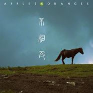

不相及
============================

|  |  |
| :--: | :-- |
| [ 不相及](https://emumo.xiami.com/album/2105537557) | **艺人**: [胡云哲](../index.md) **语种**: 国语 **唱片公司**: 回声文化 **发行时间**: 2019年12月03日 **专辑类别**: 录音室专辑 **专辑风格**: 流行 Pop **播放数**: 40952 **收藏数**: 28 **评论数**: 6  |

## 简介

最近时常在想，到底哪一段时光才是一个人一生中最美好的年华？我们常常漫不经心地过着眼前的日子，回忆起从前的一切都是那么温柔完美。恍然间领悟，其实眼下的每一分每一秒才是构成整个生活的最美的年华。

## 曲目

## 评论

|  |  |  |
| :-- | :-- | :-- |
|  [虾米用户](https://emumo.xiami.com/u/445867902)  2020-11-10 10:38 赞(0) 踩(0) | 
好听！！支持原创摇滚乐！！冲冲冲！
 |
|  [虾米用户](https://emumo.xiami.com/u/297438585)  2019-12-04 12:47 赞(0) 踩(0) | 
总算听见新专辑，坐等CD到手 
 |
| ⇒ |  [虾米用户](https://emumo.xiami.com/u/434313431)  2020-04-13 00:41 赞(0) 踩(0) | 
实体专辑从哪里购买呢
 |
|  [虾米用户](https://emumo.xiami.com/u/7151428) 暖暖的～～ 2019-12-03 16:27 赞(0) 踩(0) | 

 |
|  [虾米用户](https://emumo.xiami.com/u/54619093) 望尔关忆北。 2019-12-03 13:58 赞(0) 踩(0) | 
历经了入世的沧桑后 满身出世的温柔。
 |
|  [虾米用户](https://emumo.xiami.com/u/87421924) 唯有自己钟情的音乐不可抗... 2019-12-03 11:40 赞(1) 踩(0) | 
专辑文案写的真好！正是我想要说的话
 |
