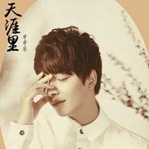
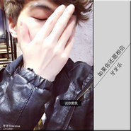
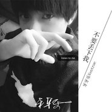

牙牙乐
============================

|  |  |
| :--: | :-- |
| [ 牙牙乐](https://i.xiami.com/ventrue) | **播放数**: 15354870 **粉丝数**: 2387 **评论数**: 133 **地区**: China 中国大陆 **风格**: 网络流行 Cyber Hit  |

## 档案

牙牙乐，90后网络歌手。独立音乐人，曲风多变，声音温柔干净，极具穿透力，集作词作曲演唱为一体的实力偶像歌手，网上粉丝众多，深受大众喜爱。代表作《秋殇别恋》《乱世殇》

## 专辑

| 名称 | 语种 | 唱片公司 | 发行时间 | 专辑类别 | 专辑风格 |
| :--: | :-- | :-- | :-- | :-- | :-- |
| [ 该怎么相信](./albums/2105198783.md) | 国语 | 英曼唱片 | 2019年08月30日 | EP, 单曲 | 网络流行 Cyber Hit |
| [ 失控](./albums/5021239522.md) | 国语 | 禾信科技 | 2018年12月11日 | EP, 单曲 | 国语流行 Mandarin Pop |
| [ 53719](./albums/5021313898.md) | 国语 | 禾信科技 | 2018年08月07日 | EP, 单曲 | 国语流行 Mandarin Pop |
| [ 凡夫俗子](./albums/5021324542.md) | 国语 | 禾信科技 | 2018年07月24日 | EP, 单曲 | 国语流行 Mandarin Pop |
| [ 天涯里](./albums/5021432630.md) | 国语 | 禾信科技 | 2018年04月24日 | EP, 单曲 | 国语流行 Mandarin Pop |
| [ 放晴](./albums/2103607696.md) | 国语 | 禾信科技 | 2018年03月14日 | EP, 单曲 |  |
| [ 回忆沦陷](./albums/2103519648.md) | 国语 | 禾信科技 | 2018年02月07日 | EP, 单曲 |  |
| [ 总会遇见一个人](./albums/2103499330.md) | 国语 | 禾信科技 | 2018年01月24日 | EP, 单曲 |  |
| [ 着魔](./albums/2103466605.md) | 国语 | 禾信科技 | 2018年01月03日 | EP, 单曲 |  |
| [ 伤疤](./albums/2102964772.md) | 国语 | 禾信科技 | 2017年12月01日 | EP, 单曲 |  |
| [ 假面](./albums/2102876202.md) | 国语 | 寿光坚诚 | 2017年10月19日 | EP, 单曲 | 网络流行 Cyber Hit |
| [ 甜蜜默契](./albums/2102849343.md) | 国语 | 禾信科技 | 2017年09月01日 | EP, 单曲 |  |
| [ 备胎的懦弱](./albums/2102849342.md) | 国语 | 禾信科技 | 2017年07月28日 | EP, 单曲 |  |
| [ 独自流浪](./albums/2102778206.md) | 国语 | 禾信科技 | 2017年07月05日 | EP, 单曲 |  |
| [ 限量版的你](./albums/2102765847.md) | 国语 | 禾信科技 | 2017年06月15日 | EP, 单曲 |  |
| [ 找不到](./albums/2102746191.md) | 国语 | 禾信科技 | 2017年05月11日 | EP, 单曲 |  |
| [ 浪漫夏夜](./albums/2102734349.md) | 国语 | 禾信科技 | 2017年04月19日 | EP, 单曲 |  |
| [ 永远别太远](./albums/2102719581.md) | 国语 | 禾信科技 | 2017年03月23日 | EP, 单曲 |  |
| [ 说走就走](./albums/2102719579.md) | 国语 | 禾信科技 | 2017年01月21日 | EP, 单曲 |  |
| [ 不想你走](./albums/2102719578.md) | 国语 | 禾信科技 | 2016年12月08日 | EP, 单曲 |  |
| [ 伤心季节](./albums/2102719575.md) | 国语 | 禾信科技 | 2016年11月09日 | EP, 单曲 |  |
| [ 我们能在一起就好](./albums/2102719571.md) | 国语 | 亿格艾 | 2016年10月24日 | EP, 单曲 |  |
| [ 为你画一幅画](./albums/2102719566.md) | 国语 | 亿格艾 | 2016年09月29日 | EP, 单曲 |  |
| [ 边哭边忘边逞强](./albums/2100373910.md) | 国语 | 视星国际 | 2016年07月29日 | EP, 单曲 |  |
| [ 活该](./albums/2103577367.md) | 国语 | 酝星文化 | 2016年07月11日 | EP, 单曲 |  |
| [ 我不是他](./albums/2102719563.md) | 国语 | 亿格艾 | 2016年05月12日 | EP, 单曲 |  |
| [ 情书十万伏特](./albums/2102719564.md) | 国语 | 亿格艾 | 2016年03月24日 | EP, 单曲 |  |
| [ 停留最初](./albums/2100238976.md) | 国语 | 大龙文化 | 2015年11月18日 | EP, 单曲 | 网络流行 Cyber Hit |
| [ 即兴表演](./albums/236164572.md) | 国语 |  | 2015年07月03日 | EP, 单曲 |  |
| [ 初恋回忆](./albums/629063814.md) | 国语 | 首胜文化 | 2015年04月14日 | EP, 单曲 |  |
| [ 如果你还愿相信](./albums/1227938010.md) | 国语 | 首胜文化 | 2015年04月01日 | EP, 单曲 |  |
| [ 挽留的借口](./albums/27259079.md) | 国语 | 首胜文化 | 2015年03月24日 | EP, 单曲 |  |
| [ 不要丢下我](./albums/526815418.md) | 国语 | 首胜文化 | 2015年03月18日 | EP, 单曲 |  |
| [ 原来沉默](./albums/23108814.md) | 国语 | 金麦田文化 | 2015年02月04日 | EP, 单曲 | 网络流行 Cyber Hit |
| [ 陌上离殇](./albums/121892209.md) | 国语 | 首胜文化 | 2015年01月20日 | EP, 单曲 |  |
| [ 不再让你受委屈](./albums/1718870975.md) | 国语 | 首胜文化 | 2014年12月15日 | EP, 单曲 |  |
| [ 分手日快乐](./albums/2018870981.md) | 国语 | 声韵文化 | 2014年11月18日 | EP, 单曲 |  |
| [ 我是鬼](./albums/913970594.md) | 国语 | 声韵文化 | 2014年10月22日 | EP, 单曲 |  |
| [ 全民男神](./albums/13342522.md) | 国语 | 声韵文化 | 2014年10月14日 | EP, 单曲 |  |
| [ 秋殇别恋](./albums/983717078.md) | 国语 | 金麦田文化 | 2013年11月04日 | 录音室专辑 | 网络流行 Cyber Hit |

## 评论

|  |  |  |  |
| :-- | :-- | :-- | :-- |
|  [虾米用户](https://emumo.xiami.com/u/432165018) 爱情就是这样一杯毒药 2019-11-28 05:12 赞(0) 踩(0) | 
很不幸告诉你，多年前我俩再全民K歌因为格子兮吵过架。
 |
|  [虾米用户](https://emumo.xiami.com/u/1166197) 用心感受好音乐 2019-07-14 10:23 赞(2) 踩(0) | 
你说说你和纳爱斯牙牙乐儿童营养牙膏到底啥关系  
 |
|  [虾米用户](https://emumo.xiami.com/u/405682052)  2019-03-03 07:35 赞(2) 踩(0) | 
好听我喜欢
 |
|  [虾米用户](https://emumo.xiami.com/u/366873983) 666 2018-10-13 09:24 赞(1) 踩(0) | 
垃圾
 |
|  [虾米用户](https://emumo.xiami.com/u/353518412)  2018-04-10 22:20 赞(1) 踩(0) | 
可以吗
 |
|  [虾米用户](https://emumo.xiami.com/u/353518412)  2018-04-10 22:20 赞(1) 踩(0) | 

 |
|  [虾米用户](https://emumo.xiami.com/u/340321670)  2018-03-01 10:55 赞(1) 踩(0) | 
       棒棒哒！！
 |
|  [虾米用户](https://emumo.xiami.com/u/340118153)  2018-01-15 22:29 赞(1) 踩(0) | 
喜欢 
 |
|  [虾米用户](https://emumo.xiami.com/u/330189159)  2017-12-03 00:33 赞(1) 踩(0) | 
棒棒哒！
 |
|  [虾米用户](https://emumo.xiami.com/u/268740138) 我怎么这么优秀 2017-11-18 00:53 赞(1) 踩(0) | 
  声音太好听了
 |
|  [虾米用户](https://emumo.xiami.com/u/31996916)   2017-11-14 08:43 赞(1) 踩(0) | 

 |
|  [虾米用户](https://emumo.xiami.com/u/76958586)  2017-10-27 22:59 赞(1) 踩(0) | 
            
 |
|  [虾米用户](https://emumo.xiami.com/u/328554085)  2017-10-22 09:35 赞(1) 踩(0) | 
好听 
 |
|  [虾米用户](https://emumo.xiami.com/u/327996247)   2017-10-21 15:09 赞(1) 踩(0) | 
呃
 |
|  [虾米用户](https://emumo.xiami.com/u/330611666)  2017-10-17 19:30 赞(1) 踩(0) | 
哦帅
 |
|  [虾米用户](https://emumo.xiami.com/u/84081596)  2017-10-08 02:35 赞(2) 踩(0) | 
******
 |
|  [虾米用户](https://emumo.xiami.com/u/246944145)  2017-10-02 22:29 赞(1) 踩(0) | 
超级好听，棒棒哒，百听不厌
 |
|  [虾米用户](https://emumo.xiami.com/u/318627691)  2017-08-22 07:52 赞(2) 踩(0) | 
  
 |
|  [虾米用户](https://emumo.xiami.com/u/318627691)  2017-08-22 07:52 赞(3) 踩(0) | 
点个赞呗！
 |
|  [虾米用户](https://emumo.xiami.com/u/318627691)  2017-08-22 07:52 赞(2) 踩(0) | 
可惜下不得
 |
|  [虾米用户](https://emumo.xiami.com/u/319100219)  2017-08-13 14:11 赞(1) 踩(0) | 
好好听啊太好听了。
 |
|  [虾米用户](https://emumo.xiami.com/u/312336329)  2017-08-02 21:00 赞(1) 踩(0) | 
继续加油，支持你
 |
|  [虾米用户](https://emumo.xiami.com/u/312336329)  2017-08-02 20:59 赞(1) 踩(0) | 
好听，好伤感啊
 |
|  [虾米用户](https://emumo.xiami.com/u/202007444) 王乐乐，我爱你 2017-07-20 19:39 赞(1) 踩(0) | 
这歌唱的不错
 |
|  [虾米用户](https://emumo.xiami.com/u/310720598)  2017-07-18 19:02 赞(2) 踩(0) | 
你唱的秋殇别恋很好听，我百听不厌哦！
 |
|  [虾米用户](https://emumo.xiami.com/u/239163748)  2017-07-14 16:59 赞(1) 踩(0) | 
非常好听
 |
|  [虾米用户](https://emumo.xiami.com/u/301428004) 喜欢牙牙乐的歌。 2017-06-03 08:55 赞(18) 踩(0) | 
觉的牙牙乐唱歌好听的赞一下。
 |
|  [虾米用户](https://emumo.xiami.com/u/301413088)  2017-06-03 07:22 赞(1) 踩(0) | 
这里的歌很好听
 |
|  [虾米用户](https://emumo.xiami.com/u/301413088)  2017-06-03 07:21 赞(1) 踩(0) | 
不错
 |
|  [虾米用户](https://emumo.xiami.com/u/296854994) ？？？ 2017-05-29 08:28 赞(1) 踩(0) | 
好
 |
|  [虾米用户](https://emumo.xiami.com/u/288826542)  2017-05-21 17:17 赞(1) 踩(0) | 
不错
 |
|  [虾米用户](https://emumo.xiami.com/u/291904167)  2017-04-29 08:45 赞(2) 踩(0) | 
很好听，我以前听过你唱的秋殇别恋，我很喜欢。
 |
|  [虾米用户](https://emumo.xiami.com/u/42685077)  2017-04-21 23:42 赞(1) 踩(0) | 
赞，加油，继续努力，  
 |
|  [虾米用户](https://emumo.xiami.com/u/288981606)  2017-04-15 21:54 赞(1) 踩(0) | 
666
 |
|  [虾米用户](https://emumo.xiami.com/u/288059283)  2017-04-15 16:45 赞(1) 踩(0) | 
听完你的歌好像回到，童年时代。
 |
|  [虾米用户](https://emumo.xiami.com/u/263112183)   2017-04-15 08:29 赞(2) 踩(0) | 
好听。
 |
|  [虾米用户](https://emumo.xiami.com/u/207403794) 하더라도,세계의 적 그... 2017-04-09 15:15 赞(6) 踩(0) | 
好喜欢秋殇别恋
 |
|  [虾米用户](https://emumo.xiami.com/u/279812721) 女生装男生那叫霸气，男生... 2017-04-04 18:12 赞(4) 踩(0) | 
赞赞赞赞赞
 |
|  [虾米用户](https://emumo.xiami.com/u/281317756)  2017-03-18 13:52 赞(1) 踩(0) | 
这首歌太好听了
 |
|  [虾米用户](https://emumo.xiami.com/u/203664712)  2017-03-15 20:40 赞(1) 踩(0) | 
好听
 |
|  [虾米用户](https://emumo.xiami.com/u/274210014)  2017-03-09 22:32 赞(1) 踩(0) | 
好好听
 |
|  [虾米用户](https://emumo.xiami.com/u/246465866) 宁不知倾国与倾城？佳人难... 2017-02-26 02:13 赞(2) 踩(0) | 
花落翩翩 岁月荏苒 雨点依稀视线......
 |
|  [虾米用户](https://emumo.xiami.com/u/246465866) 宁不知倾国与倾城？佳人难... 2017-02-26 01:44 赞(2) 踩(0) | 
好听！！！   各位觉得好听的赞一下
 |
|  [虾米用户](https://emumo.xiami.com/u/246465866) 宁不知倾国与倾城？佳人难... 2017-02-26 01:42 赞(2) 踩(0) | 
最喜欢听的三首歌&amp;mdash;&amp;mdash;【秋殇别恋】【陌上离殇】【乱世殇】
 |
| ⇒ |  [虾米用户](https://emumo.xiami.com/u/303017050)  2018-01-16 15:36 赞(0) 踩(0) | 
秋殇别恋好听 其余的还没有听过的 
 |
|  [虾米用户](https://emumo.xiami.com/u/270873519)  2017-02-23 15:21 赞(2) 踩(0) | 
你唱的歌挺好听的
 |
|  [虾米用户](https://emumo.xiami.com/u/257848718)  2017-02-18 10:03 赞(2) 踩(0) | 
你唱的！ 
 |
|  [虾米用户](https://emumo.xiami.com/u/257848718)  2017-02-18 10:02 赞(2) 踩(0) | 
你好，我是学生 
 |
|  [虾米用户](https://emumo.xiami.com/u/88288544)  2017-01-28 23:43 赞(2) 踩(0) | 
赞
 |
|  [虾米用户](https://emumo.xiami.com/u/231754556)  2017-01-20 01:21 赞(2) 踩(0) | 
，，，
 |
|  [虾米用户](https://emumo.xiami.com/u/252935773)  2017-01-18 23:19 赞(1) 踩(0) | 
很喜欢这首歌
 |
|  [虾米用户](https://emumo.xiami.com/u/254988515)   2017-01-18 10:55 赞(1) 踩(0) | 
加油(⊙o⊙)哦
 |
|  [虾米用户](https://emumo.xiami.com/u/195715114) 陶艳 2017-01-04 16:48 赞(1) 踩(0) | 
。。。。。
 |
|  [虾米用户](https://emumo.xiami.com/u/231754556)  2017-01-01 19:17 赞(1) 踩(0) | 
好萌
 |
|  [虾米用户](https://emumo.xiami.com/u/231754556)  2017-01-01 19:17 赞(1) 踩(0) | 
爱你
 |
|  [虾米用户](https://emumo.xiami.com/u/195715114) 陶艳 2016-12-25 18:01 赞(1) 踩(0) | 
好听加油吧  
 |
|  [虾米用户](https://emumo.xiami.com/u/231754556)  2016-12-24 23:38 赞(4) 踩(0) | 
跟你唱的女的是谁
 |
|  [虾米用户](https://emumo.xiami.com/u/255714091)  2016-12-20 15:41 赞(1) 踩(0) | 
好帅
 |
|  [虾米用户](https://emumo.xiami.com/u/231883673)  2016-11-13 00:59 赞(1) 踩(0) | 
加油
 |
|  [虾米用户](https://emumo.xiami.com/u/231883673)  2016-11-13 00:58 赞(1) 踩(0) | 
很好听
 |
|  [虾米用户](https://emumo.xiami.com/u/49538779) 社会如此不好，交友勿交狗... 2016-11-01 09:33 赞(2) 踩(0) | 
 棒棒哒
 |
|  [虾米用户](https://emumo.xiami.com/u/229683132)  2016-10-29 00:09 赞(1) 踩(0) | 
不要脸，跟我老大比你差远了，以为自己很帅啊，我呸
 |
| ⇒ |  [虾米用户](https://emumo.xiami.com/u/282053954) 呵呵~^一只木偶呢=匚自... 2017-07-08 07:29 赞(0) 踩(0) | 

 |
| ⇒ |  [虾米用户](https://emumo.xiami.com/u/282053954) 呵呵~^一只木偶呢=匚自... 2017-07-08 07:29 赞(0) 踩(0) | 
  
 |
| ⇒ |  [虾米用户](https://emumo.xiami.com/u/282053954) 呵呵~^一只木偶呢=匚自... 2017-07-08 07:29 赞(0) 踩(0) | 
   
 |
|  [虾米用户](https://emumo.xiami.com/u/238769630)  2016-10-21 14:19 赞(1) 踩(0) | 
喜欢
 |
|  [虾米用户](https://emumo.xiami.com/u/232444555)  2016-10-02 18:21 赞(1) 踩(0) | 
很好听
 |
|  [虾米用户](https://emumo.xiami.com/u/230211193)  2016-09-26 15:21 赞(1) 踩(0) | 
嘿嘿
 |
|  [虾米用户](https://emumo.xiami.com/u/227119638)  2016-09-16 21:31 赞(1) 踩(0) | 

 |
|  [虾米用户](https://emumo.xiami.com/u/219048774) 好好爱自己 2016-08-27 16:23 赞(3) 踩(0) | 
我有点喜欢你的敢 
 |
|  [虾米用户](https://emumo.xiami.com/u/152205884)  2016-07-17 12:37 赞(3) 踩(0) | 
加油哦，很好听
 |
|  [虾米用户](https://emumo.xiami.com/u/188336959)  2016-07-11 15:54 赞(2) 踩(0) | 

 |
|  [虾米用户](https://emumo.xiami.com/u/197633255)  2016-07-05 15:27 赞(1) 踩(0) | 
很好听
 |
|  [虾米用户](https://emumo.xiami.com/u/197633255)  2016-07-05 15:27 赞(1) 踩(0) | 
加油哦！
 |
|  [虾米用户](https://emumo.xiami.com/u/197536642)  2016-07-05 09:35 赞(0) 踩(0) | 
加油加油
 |
|  [虾米用户](https://emumo.xiami.com/u/197536642)  2016-07-05 09:35 赞(1) 踩(0) | 
加油加油
 |
|  [虾米用户](https://emumo.xiami.com/u/185221668) 咳咳 2016-06-03 19:55 赞(1) 踩(0) | 
喜欢
 |
|  [虾米用户](https://emumo.xiami.com/u/46188809)  2016-05-20 13:11 赞(2) 踩(0) | 
内容已删除
 |
| ⇒ |  [虾米用户](https://emumo.xiami.com/u/185221668) 咳咳 2016-06-03 19:55 赞(0) 踩(0) | 
真的吗
 |
| ⇒ |  [虾米用户](https://emumo.xiami.com/u/187287274)  2016-07-30 16:30 赞(0) 踩(0) | 
<q><b>珍惜眼前说：</b></q>
 |
|  [虾米用户](https://emumo.xiami.com/u/46188809)  2016-05-20 13:01 赞(88) 踩(0) | 
我刚入驻了虾米音乐人，欢迎大家来我的个人主页，收听我的最新音乐
 |
| ⇒ |  [虾米用户](https://emumo.xiami.com/u/200748330) 爱音乐 2016-09-15 14:29 赞(0) 踩(0) | 
   
 |
| ⇒ |  [虾米用户](https://emumo.xiami.com/u/103164830) 支持同性恋！！异性传宗接... 2016-12-15 21:42 赞(0) 踩(0) | 
你好帅啊！！！！
 |
| ⇒ |  [虾米用户](https://emumo.xiami.com/u/256320978)  2016-12-23 11:01 赞(0) 踩(0) | 
回复
 |
| ⇒ |  [虾米用户](https://emumo.xiami.com/u/275373703)  2017-02-23 21:31 赞(0) 踩(0) | 
OO你很6
 |
| ⇒ |  [虾米用户](https://emumo.xiami.com/u/270934840) 最远的距离也许是最近的距... 2017-03-15 17:42 赞(0) 踩(0) | 
      加油 
 |
| ⇒ |  [虾米用户](https://emumo.xiami.com/u/332460206)  2017-11-17 18:26 赞(0) 踩(0) | 
唱的好听
 |
| ⇒ |  [虾米用户](https://emumo.xiami.com/u/321247361)  2017-12-02 10:24 赞(0) 踩(0) | 
唱歌很好听哦，最近我很想听你唱歌哦。
 |
| ⇒ |  [虾米用户](https://emumo.xiami.com/u/330189159)  2017-12-03 00:23 赞(0) 踩(0) | 
不客气了，蛮喜欢听你的歌曲  
 |
|  [虾米用户](https://emumo.xiami.com/u/169652840)  2016-05-15 12:37 赞(1) 踩(0) | 
真合我胃口
 |
|  [虾米用户](https://emumo.xiami.com/u/161612920)  2016-05-05 13:31 赞(0) 踩(0) | 
么么哒，期待新专辑
 |
|  [虾米用户](https://emumo.xiami.com/u/125267324) 流年忘水 2016-04-09 22:38 赞(1) 踩(0) | 
人好看就好3
 |
|  [虾米用户](https://emumo.xiami.com/u/125267324) 流年忘水 2016-04-09 22:37 赞(11) 踩(0) | 
只p
 |
|  [虾米用户](https://emumo.xiami.com/u/126647942) 呵呵！ 2016-03-28 18:44 赞(0) 踩(0) | 
好听
 |
|  [虾米用户](https://emumo.xiami.com/u/118593168) 思思哦(´-ω-`) 2016-02-28 23:25 赞(0) 踩(0) | 
喜欢
 |
|  [虾米用户](https://emumo.xiami.com/u/115588776)  2016-02-20 11:25 赞(0) 踩(0) | 
…… 
 |
|  [虾米用户](https://emumo.xiami.com/u/98636122)  2016-01-09 11:10 赞(0) 踩(0) | 
，，可以
 |
|  [虾米用户](https://emumo.xiami.com/u/98519574)  2016-01-08 22:01 赞(0) 踩(0) | 
好听  
 |
|  [虾米用户](https://emumo.xiami.com/u/58688384)  2016-01-08 21:13 赞(0) 踩(0) | 
我想加你QQ 
 |
|  [虾米用户](https://emumo.xiami.com/u/48916069) 树叶跑了 2015-12-16 09:06 赞(0) 踩(0) | 
无语
 |
|  [虾米用户](https://emumo.xiami.com/u/80957510) 吾爱图 2015-11-21 21:20 赞(0) 踩(0) | 
噢噢
 |
|  [虾米用户](https://emumo.xiami.com/u/70597792)  2015-11-21 15:17 赞(1) 踩(0) | 
这首歌太好听。
 |
|  [虾米用户](https://emumo.xiami.com/u/75754916) 保密 2015-11-15 11:51 赞(0) 踩(0) | 
你的幸福角度呢？
 |
|  [虾米用户](https://emumo.xiami.com/u/51781653)  2015-11-08 12:36 赞(0) 踩(0) | 
你QQ是多少？我想知道
 |
|  [虾米用户](https://emumo.xiami.com/u/51781653)  2015-11-08 12:36 赞(0) 踩(0) | 
很喜欢你
 |
|  [虾米用户](https://emumo.xiami.com/u/51781653)  2015-11-08 12:35 赞(0) 踩(0) | 
也想唱歌和你一样好听  
 |
|  [虾米用户](https://emumo.xiami.com/u/80344980)  2015-11-06 05:39 赞(0) 踩(0) | 
哈哈哇
 |
|  [虾米用户](https://emumo.xiami.com/u/52736598)  2015-10-31 18:26 赞(0) 踩(0) | 
真羡慕你
 |
|  [虾米用户](https://emumo.xiami.com/u/69700524)  2015-10-23 21:56 赞(0) 踩(0) | 
很赞  
 |
|  [虾米用户](https://emumo.xiami.com/u/70613940)  2015-09-30 19:18 赞(1) 踩(0) | 
好听  
 |
|  [虾米用户](https://emumo.xiami.com/u/69466910)  2015-09-26 15:53 赞(1) 踩(0) | 
挺喜欢的
 |
|  [虾米用户](https://emumo.xiami.com/u/51979814)  2015-09-22 21:00 赞(33) 踩(0) | 
很对的歌手，赞一下
 |
| ⇒ |  [虾米用户](https://emumo.xiami.com/u/249061404)  2017-05-18 13:08 赞(0) 踩(0) | 

 |
|  [虾米用户](https://emumo.xiami.com/u/52775015) 呵呵…… 2015-09-21 13:47 赞(0) 踩(0) | 
哇
 |
|  [虾米用户](https://emumo.xiami.com/u/48660900)  2015-09-13 10:49 赞(1) 踩(0) | 
无意听到这声音，我咬牙切齿地打开这个主页然后点了右下角的垃圾箱
 |
|  [虾米用户](https://emumo.xiami.com/u/51938890)  2015-09-05 22:56 赞(1) 踩(0) | 
真的好听
 |
|  [虾米用户](https://emumo.xiami.com/u/51938890)  2015-09-05 22:56 赞(1) 踩(0) | 
真的好听
 |
|  [虾米用户](https://emumo.xiami.com/u/48090365) 救世主的死亡，即为天启！ 2015-08-27 14:55 赞(0) 踩(0) | 
善哉
 |
|  [虾米用户](https://emumo.xiami.com/u/56780948)  2015-08-22 23:38 赞(1) 踩(0) | 
你的歌太好听了  
 |
|  [虾米用户](https://emumo.xiami.com/u/51781653)  2015-08-18 10:23 赞(1) 踩(0) | 
我喜欢你的歌
 |
|  [虾米用户](https://emumo.xiami.com/u/48725991) 暂无签名~ 2015-08-10 07:58 赞(0) 踩(0) | 

 |
|  [虾米用户](https://emumo.xiami.com/u/54852788) 我只爱过你 2015-08-09 14:22 赞(0) 踩(0) | 
原名是什么
 |
|  [虾米用户](https://emumo.xiami.com/u/54476971)  2015-08-04 18:23 赞(0) 踩(0) | 
我喜欢你的那首原来沉默，因为这首歌告诉了我明白沉默太无奈了，爱自己喜欢的就应该去坦白 。
 |
|  [虾米用户](https://emumo.xiami.com/u/53110075)  2015-07-25 14:09 赞(0) 踩(0) | 
有QQ吗你
 |
|  [虾米用户](https://emumo.xiami.com/u/51963355)  2015-07-02 04:13 赞(0) 踩(0) | 
如听，，，，
 |
|  [虾米用户](https://emumo.xiami.com/u/51593006)  2015-06-21 08:52 赞(1) 踩(0) | 
加油顶你
 |
|  [虾米用户](https://emumo.xiami.com/u/48460431)  2015-03-24 18:58 赞(0) 踩(0) | 
好听哦，加油!支持你哦
 |
|  [虾米用户](https://emumo.xiami.com/u/7713647) 可怜无法成为想成为的人啊 2015-02-23 18:34 赞(0) 踩(0) | 
秋殇别恋
 |
|  [虾米用户](https://emumo.xiami.com/u/47347273)  2015-02-16 19:14 赞(0) 踩(0) | 
特别喜欢
 |
|  [虾米用户](https://emumo.xiami.com/u/42983608)  2014-10-24 20:47 赞(0) 踩(0) | 
我喜欢你的秋殇别恋，听了好想哭！
 |
|  [虾米用户](https://emumo.xiami.com/u/40644171) 『惜月，怜雪，』望月独自... 2014-08-31 22:48 赞(0) 踩(0) | 
秋殇别恋，还不错哦，漪箫很喜欢，漪箫会唱哦
 |
|  [虾米用户](https://emumo.xiami.com/u/38513855)  2014-06-27 19:38 赞(0) 踩(0) | 
最后的借口      是rainbow的sweet  dream 的调子
 |
|  [虾米用户](https://emumo.xiami.com/u/34224706)  2014-03-18 13:44 赞(0) 踩(0) | 
我是你小学同桌。哈哈。加我 微信  糖二宝
 |
| ⇒ |  [虾米用户](https://emumo.xiami.com/u/54476971)  2015-08-04 18:26 赞(0) 踩(0) | 
牙牙乐叫什么名呢 
 |
