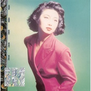

新曲与精选
============================

|  |  |
| :--: | :-- |
| [ 新曲与精选](https://emumo.xiami.com/album/10875) | **艺人**: [麦洁文](../index.md) **语种**: 粤语 **唱片公司**: 新艺宝 **发行时间**: 1989年08月01日 **专辑类别**: 精选集 **专辑风格**: 粤语流行 Cantopop **播放数**: 33594 **收藏数**: 35 **评论数**: 14  |

## 简介

## 曲目

- [路黑山高锡人夜](./10875/iXmJc0cc1.md)
- [周末舞曲](./10875/njvMf47c3.md)
- [乱](./10875/CunZ49ca5.md)
- [击倒](./10875/eLdK5c76c.md)
- [深宵三点](./10875/iXmNa8987.md)
- [浓妆舞台](./10875/iXmOae433.md)
- [没哭声的女子MV](./10875/njvRf3c36.md)
- [迷乱](./10875/eLdO909a7.md)
- [抹去界限线](./10875/njvTfba5d.md)

## 评论

|  |  |  |
| :-- | :-- | :-- |
|  [虾米用户](https://emumo.xiami.com/u/292201026)  2020-03-04 02:00 赞(1) 踩(0) | 
岁月无声呢
 |
| ⇒ |  [虾米用户](https://emumo.xiami.com/u/1489937)  2020-10-30 15:34 赞(0) 踩(0) | 
全网和谐
 |
|  [虾米用户](https://emumo.xiami.com/u/2182632)  2016-12-31 15:29 赞(2) 踩(0) | 
有首（岁月无聲）怎么又被屏蔽了，
 |
| ⇒ |  [虾米用户](https://emumo.xiami.com/u/1489937)  2019-01-11 08:36 赞(0) 踩(0) | 
每个音乐平台都屏蔽了这首歌
 |
|  [虾米用户](https://emumo.xiami.com/u/36081194) 酷狗音乐，一个有老歌的地... 2015-11-16 00:00 赞(1) 踩(0) | 
喜欢
 |
|  [虾米用户](https://emumo.xiami.com/u/8292735)  2014-08-17 11:08 赞(1) 踩(0) | 
经典
 |
|  [虾米用户](https://emumo.xiami.com/u/8292735)  2014-04-28 10:46 赞(0) 踩(0) | 
经典
 |
|  [虾米用户](https://emumo.xiami.com/u/8292735)  2014-04-19 04:17 赞(0) 踩(0) | 
经典
 |
|  [虾米用户](https://emumo.xiami.com/u/9121082) 音乐人生 2012-10-20 09:42 赞(1) 踩(0) | 
这首 岁月无声 是当年港片《 胜者为王》里面的插曲，当时当景很符合电视情节，要是单独拿出来跟beyond比较，不太合适。
 |
| ⇒ |  [虾米用户](https://emumo.xiami.com/u/43421355) 暂无签名~ 2017-04-03 18:29 赞(0) 踩(0) | 
看过
 |
|  [虾米用户](https://emumo.xiami.com/u/9035384) 再爱还是昨天 2012-10-19 17:32 赞(0) 踩(0) | 
经典老歌，喜欢
 |
|  [虾米用户](https://emumo.xiami.com/u/9139891) 与粤迷同在 2012-06-06 08:27 赞(0) 踩(0) | 
岁月无声 和BEYOND个有个风格！
 |
|  [虾米用户](https://emumo.xiami.com/u/5273533)  2011-08-18 15:40 赞(0) 踩(0) | 
经z典
 |
|  [虾米用户](https://emumo.xiami.com/u/2208599)  2010-12-18 01:09 赞(0) 踩(0) | 
经典老歌，喜欢
 |
