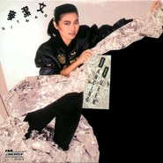

Dancing Queen
============================

|  |  |
| :--: | :-- |
| [ Dancing Queen](https://emumo.xiami.com/album/10879) | **艺人**: [麦洁文](../index.md) **语种**: 粤语 **唱片公司**: 新艺宝 **发行时间**: 1987年01月01日 **专辑类别**: EP, 单曲 **专辑风格**: 粤语流行 Cantopop **播放数**: 23909 **收藏数**: 59 **评论数**: 13  |

## 简介

## 曲目

- [蝎色心脏(是我错) (Remix Version)](./10879/eLeo5d7a6.md)
- [劲舞Dancing Queen (Remix Version)](./10879/eLep8e127.md)
- [路黑山高锡人夜 (Remix Version)](./10879/eLeq5e442.md)
- [蝎色心脏(是我错)](./10879/iXntdf09b.md)

## 评论

|  |  |  |
| :-- | :-- | :-- |
|  [虾米用户](https://emumo.xiami.com/u/260802632)  2019-02-02 20:25 赞(0) 踩(0) | 
混音可还行，四方形黑胶已收
 |
|  [虾米用户](https://emumo.xiami.com/u/406963794)  2018-12-01 23:14 赞(0) 踩(0) | 
       
 |
|  [虾米用户](https://emumo.xiami.com/u/1182761) 松任谷由实的迷弟 2013-11-21 16:43 赞(0) 踩(0) | 
追忆林振强音乐会上，听刘美君唱《劲舞Dancing Queen》这首歌好开心啊！！好希望快出碟
 |
|  [虾米用户](https://emumo.xiami.com/u/9722367)  2013-11-03 18:07 赞(1) 踩(0) | 
Dancing Queen
 |
|  [虾米用户](https://emumo.xiami.com/u/2021318)  2012-11-16 22:30 赞(0) 踩(0) | 
好怀旧
 |
|  [虾米用户](https://emumo.xiami.com/u/2021318)  2012-11-16 22:25 赞(0) 踩(0) | 
好
 |
|  [虾米用户](https://emumo.xiami.com/u/9139891) 与粤迷同在 2012-07-24 11:10 赞(2) 踩(0) | 
这张应该是单曲
 |
| ⇒ |  [虾米用户](https://emumo.xiami.com/u/1182761) 松任谷由实的迷弟 2013-11-21 16:43 赞(0) 踩(0) | 
追忆林振强音乐会上，听刘美君唱《劲舞Dancing Queen》这首歌好开心啊！！好希望快出碟
 |
| ⇒ |  [虾米用户](https://emumo.xiami.com/u/1489937)  2014-09-28 11:50 赞(0) 踩(0) | 
现在是正确的了，下次记得去申请报错。
 |
|  [虾米用户](https://emumo.xiami.com/u/1746570) 寧静致遠 2012-04-07 01:20 赞(1) 踩(0) | 
我来补充大封面
 |
| ⇒ |  [虾米用户](https://emumo.xiami.com/u/1182761) 松任谷由实的迷弟 2013-11-21 16:43 赞(0) 踩(0) | 
追忆林振强音乐会上，听刘美君唱《劲舞Dancing Queen》这首歌好开心啊！！好希望快出碟
 |
|  [虾米用户](https://emumo.xiami.com/u/206220) 最爱80，90年代歌曲！... 2011-10-23 19:46 赞(1) 踩(0) | 
经典
 |
|  [虾米用户](https://emumo.xiami.com/u/111193) 微信号toogo1 2011-07-12 22:00 赞(1) 踩(0) | 
TOGO1 <a href="http://www.xiami.com/group/111" target="_blank" rel="nofollow noreferrer noopener">http://www.xiami.com/group/111</a>屏58 人山人海虾米小组 <a href="http://www.xiami.com/group/111" target="_blank" rel="nofollow noreferrer noopener">http://www.xiami.com/group/111</a>蔽59 我们的八十年代虾米小组 <a href="http://www.xiami.com/group/11192" target="_blank" rel="nofollow noreferrer noopener">http://www.xiami.com/group/11192</a> 意难平虾米小组 <a href="http://www.xiami.com/group/11337" target="_blank" rel="nofollow noreferrer noopener">http://www.xiami.com/group/11337</a> 电光幻影虾米小组 <a href="http://www.xiami.com/group/11168" target="_blank" rel="nofollow noreferrer noopener">http://www.xiami.com/group/11168</a> 真情佛山虾米小组 欢迎友良知的你加入！
 |
