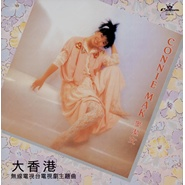

大香港
============================

|  |  |
| :--: | :-- |
| [ 大香港](https://emumo.xiami.com/album/10881) | **艺人**: [麦洁文](../index.md) **语种**: 粤语 **唱片公司**: 娱乐唱片 **发行时间**: 1985年06月01日 **专辑类别**: 录音室专辑 **专辑风格**: 粤语流行 Cantopop **播放数**: 511187 **收藏数**: 244 **评论数**: 33  |

## 简介

## 曲目

- [爱的寻觅1985年第二季劲歌金曲季选参选歌曲/无线电视剧《大香港》主题曲](./10881/eLe47e873.md)
- [我是豪放原曲：Annabella - Passion play](./10881/eLe58319d.md)
- [断MV1985年第三季劲歌金曲季选参选歌曲](./10881/iXn8dec8c.md)
- [少啰嗦](./10881/eLe77a7ce.md)
- [怒剑狂花无线电视剧《怒剑狂花》主题曲](./10881/iXnAb726d.md)
- [曾经爱过](./10881/njwDe38d0.md)
- [我心换你心](./10881/eLeA85f56.md)
- [爱情绝缘体原曲为高桥真梨子的《桃色吐息》](./10881/njwFf103f.md)
- [我的根源](./10881/eLeC702f5.md)
- [说出你的爱无线电视剧《大香港》插曲](./10881/iXnFc762c.md)
- [感情的锁扣原曲：Tom.Jones--Without Love](./10881/3VWQ3bdd8.md)
- [休说日后](./10881/eLeF702eb.md)

## 评论

|  |  |  |
| :-- | :-- | :-- |
|  [虾米用户](https://emumo.xiami.com/u/230803304) 三观正又爱国的成都宝藏男... 2021-01-01 08:52 赞(0) 踩(0) | 
这个专辑的歌曲确实很好听
 |
|  [虾米用户](https://emumo.xiami.com/u/6609954) 我还没想好要写什么... 2020-08-29 00:37 赞(0) 踩(0) | 
麦洁雯其实真的很会唱，圆润的嗓音
 |
|  [虾米用户](https://emumo.xiami.com/u/8337431) 以乐会友 2020-07-11 11:05 赞(0) 踩(0) | 
怀旧20200711.31
 |
|  [虾米用户](https://emumo.xiami.com/u/328772264) 估计没人认识我！我要通过... 2020-06-28 20:04 赞(0) 踩(0) | 
仿佛又回到了曾经的那个时代了！
 |
|  [虾米用户](https://emumo.xiami.com/u/327140274)  2019-06-02 13:32 赞(0) 踩(0) | 
监制：顾嘉辉
 |
|  [虾米用户](https://emumo.xiami.com/u/241608145)  2019-03-29 23:55 赞(0) 踩(0) | 
这张碟首首好听，至爱。
 |
|  [虾米用户](https://emumo.xiami.com/u/327140274)  2019-03-05 11:35 赞(0) 踩(0) | 
除咗《断》，呢张碟冇大红之曲，却是最耐听的一张
 |
|  [虾米用户](https://emumo.xiami.com/u/357292131) 好歌不厌百回听 2018-08-14 19:51 赞(0) 踩(0) | 
揭命，Kit Man，麦洁文，江华的雌老虎
 |
|  [虾米用户](https://emumo.xiami.com/u/238206120) 有花当折何须折，占有不如... 2017-12-30 15:26 赞(0) 踩(0) | 
经典
 |
|  [虾米用户](https://emumo.xiami.com/u/780603) 单曲 ：背起行囊找寻你 2017-02-22 22:12 赞(0) 踩(0) | 
当年这张磁带和黑胶唱片 很好看，，
 |
|  [虾米用户](https://emumo.xiami.com/u/43421355) 暂无签名~ 2017-02-16 21:18 赞(1) 踩(0) | 
梁永斌，冬日有爱、暖暖的爱，我的黑胶时代。。。
 |
|  [虾米用户](https://emumo.xiami.com/u/261464875)  2017-01-13 00:40 赞(0) 踩(0) | 
丝丝入扣，缠绵悱恻
 |
|  [虾米用户](https://emumo.xiami.com/u/46082292) 时代曲 2016-11-29 22:22 赞(0) 踩(0) | 
这张专辑怎么少了《桃色吐息》这歌？难不成我记错了..
 |
|  [虾米用户](https://emumo.xiami.com/u/224511364)  2016-09-09 16:53 赞(0) 踩(0) | 
说出你的爱好听 
 |
|  [虾米用户](https://emumo.xiami.com/u/36081194) 酷狗音乐，一个有老歌的地... 2015-12-14 01:20 赞(1) 踩(0) | 
喜欢
 |
|  [虾米用户](https://emumo.xiami.com/u/52584687)  2015-07-16 22:39 赞(0) 踩(0) | 
曲曲动人。。。
 |
|  [虾米用户](https://emumo.xiami.com/u/33631283) 漫天星辰辉耀我心 2014-12-17 17:53 赞(0) 踩(0) | 
好听
 |
|  [虾米用户](https://emumo.xiami.com/u/12163785)  2014-11-15 23:25 赞(0) 踩(0) | 
经典
 |
|  [虾米用户](https://emumo.xiami.com/u/8292735)  2014-09-01 13:29 赞(0) 踩(0) | 
经典
 |
|  [虾米用户](https://emumo.xiami.com/u/25044240)  2014-08-27 14:16 赞(4) 踩(0) | 
音乐轻快，字字清晰轻灵，乐调婉转错落有致，很具代表的80年代电视剧主题曲，经典之作
 |
| ⇒ |  [虾米用户](https://emumo.xiami.com/u/63020) 东东喜欢腕表 2019-02-08 18:34 赞(0) 踩(0) | 
是老师呢，可不是每个歌者都可以做老师的啊
 |
|  [虾米用户](https://emumo.xiami.com/u/8292735)  2014-04-28 10:44 赞(0) 踩(0) | 
经典
 |
|  [虾米用户](https://emumo.xiami.com/u/2460296) 行到水窮處 坐看云起時 2012-11-01 21:37 赞(0) 踩(0) | 
不可复制的经典老歌
 |
|  [虾米用户](https://emumo.xiami.com/u/10693364) 存好心 2012-09-20 16:01 赞(0) 踩(0) | 
90年代的最爱 专辑
 |
|  [虾米用户](https://emumo.xiami.com/u/9827203)  2012-07-16 00:19 赞(0) 踩(0) | 
常常 收藏的一定要听听
 |
|  [虾米用户](https://emumo.xiami.com/u/9827203)  2012-07-16 00:18 赞(0) 踩(0) | 
一转身功夫，
 |
|  [虾米用户](https://emumo.xiami.com/u/632448)  2012-06-06 00:07 赞(0) 踩(0) | 
常常 收藏的一定要听听
 |
|  [虾米用户](https://emumo.xiami.com/u/9139891) 与粤迷同在 2012-06-05 21:09 赞(4) 踩(0) | 
大香港怀旧剧中国大陆图书进出口总公司出版发行了卡带
 |
|  [虾米用户](https://emumo.xiami.com/u/4909212) 歌曲洗涤心灵 2012-03-21 15:34 赞(0) 踩(0) | 
曾经是云
 |
|  [虾米用户](https://emumo.xiami.com/u/6618270)  2011-11-04 21:56 赞(0) 踩(0) | 
iuedfhgsady
 |
|  [虾米用户](https://emumo.xiami.com/u/5876253)  2011-10-03 19:45 赞(0) 踩(0) | 
老歌好听,长江后浪不如前浪-----可悲啊
 |
|  [虾米用户](https://emumo.xiami.com/u/886089)  2010-09-01 08:15 赞(2) 踩(0) | 
现在香港很难找到像麦洁文这样字正腔圆的歌者了
 |
| ⇒ |  [虾米用户](https://emumo.xiami.com/u/63020) 东东喜欢腕表 2019-02-08 18:34 赞(0) 踩(0) | 
嘿嘿，不然也不能作老师啊
 |
