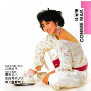

麦洁文
============================

|  |  |
| :--: | :-- |
| [ 麦洁文](https://i.xiami.com/kitman) | **播放数**: 5305696 **粉丝数**: 1976 **评论数**: 125 **地区**: Hong Kong ,PRC 中国香港 **风格**: 国语流行 Mandarin Pop, 粤语流行 Cantopop  |

## 档案

小档案 
麦洁文曾任香港电台唱片骑师，以重唱《帘卷西风》成名，后拓展不同歌路，《唐吉珂德》、《电光霹雳舞士》、《断》、《路黑风高锡人夜》等风格回然不同的作品都曾广为流行，可算是一名多元化的歌手。值得一提的还有卢国沾填词的《螳螂与我》，这首非情歌运动的代表作己成经典。

## 专辑

| 名称 | 语种 | 唱片公司 | 发行时间 | 专辑类别 | 专辑风格 |
| :--: | :-- | :-- | :-- | :-- | :-- |
| [ 呈献2003之帘卷西风](./albums/10871.md) | 粤语 | 丰华唱片 | 2003年08月22日 | 录音室专辑 | 粤语流行 Cantopop |
| [ 真经典](./albums/1883795516.md) | 粤语 | 环球唱片 | 2001年11月20日 | 精选集 | 粤语流行 Cantopop |
| [ 毕生难忘](./albums/10873.md) | 粤语 | 世纪唱片 | 1990年03月01日 | 录音室专辑 | 粤语流行 Cantopop |
| [ 新曲与精选](./albums/10875.md) | 粤语 | 新艺宝 | 1989年08月01日 | 精选集 | 粤语流行 Cantopop |
| [ 精选曲集](./albums/312050.md) | 粤语 | 娱乐唱片 | 1989年01月11日 | 精选集 | 粤语流行 Cantopop |
| [ 迷乱](./albums/10878.md) | 粤语 | 新艺宝 | 1988年11月01日 | 录音室专辑 | 粤语流行 Cantopop |
| [ Kitman Remix](./albums/10877.md) | 粤语 | 新艺宝 | 1988年06月01日 | EP, 单曲 | 粤语流行 Cantopop |
| [ Come On Rock](./albums/10876.md) | 粤语 | 新艺宝 | 1988年01月01日 | 录音室专辑 | 粤语流行 Cantopop |
| [ Dancing Queen](./albums/10879.md) | 粤语 | 新艺宝 | 1987年01月01日 | EP, 单曲 | 粤语流行 Cantopop |
| [ 劲舞Dancing Queen](./albums/10880.md) | 粤语 | 新艺宝 | 1986年10月01日 | 录音室专辑 | 粤语流行 Cantopop |
| [ 大香港](./albums/10881.md) | 粤语 | 娱乐唱片 | 1985年06月01日 | 录音室专辑 | 粤语流行 Cantopop |
| [ 莱茵河之恋  江湖浪子](./albums/384868.md) | 国语 | 娱乐唱片 | 1985年03月01日 | 录音室专辑 |  |
| [ 江湖浪子](./albums/10883.md) | 粤语 | 娱乐唱片 | 1984年10月01日 | 录音室专辑 | 粤语流行 Cantopop |
| [ 黄金约会](./albums/10882.md) | 粤语 | 娱乐唱片 | 1984年02月01日 | 录音室专辑 | 粤语流行 Cantopop |
| [ 莱茵河之恋](./albums/10884.md) | 粤语 | 娱乐唱片 | 1983年01月01日 | 录音室专辑 | 粤语流行 Cantopop |
| [ 前尘莫追究](./albums/10885.md) | 粤语 | 香泰统一 | 1981年01月01日 | 录音室专辑 | 粤语流行 Cantopop |

## 评论

|  |  |  |  |
| :-- | :-- | :-- | :-- |
|  [虾米用户](https://emumo.xiami.com/u/8337431) 以乐会友 2020-07-01 08:05 赞(0) 踩(0) | 
粤语魅力女声20200701
 |
|  [虾米用户](https://emumo.xiami.com/u/341370966)  2020-05-16 19:28 赞(0) 踩(0) | 
词曲演唱一并统统最爱
 |
|  [虾米用户](https://emumo.xiami.com/u/285049703) 陈惠娜 2020-05-15 17:24 赞(0) 踩(0) | 
因为你老公才听你的歌，没別的
 |
|  [虾米用户](https://emumo.xiami.com/u/12221090) 逍遥于天地而心意自得 2020-05-10 22:12 赞(1) 踩(0) | 
赞
 |
|  [虾米用户](https://emumo.xiami.com/u/430475906)  2020-03-20 14:37 赞(1) 踩(0) | 
我记得我小时候听的&amp;ldquo;阳光下的孩子&amp;rdquo;是多么的高兴和喜欢。时光飞逝，不惑之年，每听到这歌，仿佛回到童年！感谢！（另，八卦新闻说你的护士儿子很棒！肯定是你们功不可没！）
 |
|  [虾米用户](https://emumo.xiami.com/u/420168309)  2019-12-19 12:46 赞(0) 踩(0) | 
好听，赞一个 
 |
|  [虾米用户](https://emumo.xiami.com/u/230803304) 三观正又爱国的成都宝藏男... 2019-12-13 15:43 赞(0) 踩(0) | 
嫂嫂的歌带给了我们快乐和正能量
 |
|  [虾米用户](https://emumo.xiami.com/u/230803304) 三观正又爱国的成都宝藏男... 2019-11-30 14:33 赞(0) 踩(0) | 
给嫂嫂几个小红花
 |
|  [虾米用户](https://emumo.xiami.com/u/230803304) 三观正又爱国的成都宝藏男... 2019-10-31 09:48 赞(0) 踩(0) | 
支持下嫂嫂
 |
|  [虾米用户](https://emumo.xiami.com/u/230803304) 三观正又爱国的成都宝藏男... 2019-10-23 09:05 赞(0) 踩(0) | 
支持下
 |
|  [虾米用户](https://emumo.xiami.com/u/230803304) 三观正又爱国的成都宝藏男... 2019-10-16 10:59 赞(0) 踩(0) | 
支持嫂嫂的演唱会
 |
|  [虾米用户](https://emumo.xiami.com/u/230803304) 三观正又爱国的成都宝藏男... 2019-09-15 20:56 赞(0) 踩(0) | 
如今咱们的嫂嫂越来越漂亮了
 |
|  [虾米用户](https://emumo.xiami.com/u/230803304) 三观正又爱国的成都宝藏男... 2019-08-16 13:27 赞(0) 踩(0) | 
还是觉得麦洁文老师的四季情和寂静深秋唱的很好听
 |
|  [虾米用户](https://emumo.xiami.com/u/328377679)  2019-06-13 04:41 赞(1) 踩(0) | 

 |
|  [虾米用户](https://emumo.xiami.com/u/230803304) 三观正又爱国的成都宝藏男... 2019-05-20 16:00 赞(0) 踩(0) | 
嫂嫂唱的歌的确有影响力啊
 |
|  [虾米用户](https://emumo.xiami.com/u/230803304) 三观正又爱国的成都宝藏男... 2019-05-16 13:46 赞(0) 踩(0) | 
嫂嫂的歌可以让人励志
 |
|  [虾米用户](https://emumo.xiami.com/u/354552349)  2019-05-05 10:14 赞(2) 踩(0) | 
江华老婆的歌好听
 |
|  [虾米用户](https://emumo.xiami.com/u/230803304) 三观正又爱国的成都宝藏男... 2019-04-26 21:57 赞(0) 踩(0) | 
kitman嫂嫂确实很棒啊
 |
|  [虾米用户](https://emumo.xiami.com/u/230803304) 三观正又爱国的成都宝藏男... 2019-04-21 04:39 赞(0) 踩(0) | 
嫂嫂的声线真的挺不错啊
 |
|  [虾米用户](https://emumo.xiami.com/u/230803304) 三观正又爱国的成都宝藏男... 2019-04-19 21:03 赞(1) 踩(0) | 
嫂嫂果然是最棒的
 |
|  [虾米用户](https://emumo.xiami.com/u/285049703) 陈惠娜 2019-04-18 06:17 赞(3) 踩(0) | 
喜欢她的灵气逼人
 |
|  [虾米用户](https://emumo.xiami.com/u/325374787)  2019-04-16 13:57 赞(1) 踩(0) | 
好
 |
|  [虾米用户](https://emumo.xiami.com/u/230803304) 三观正又爱国的成都宝藏男... 2019-04-07 21:18 赞(1) 踩(0) | 
嫂嫂的歌真的很好听啊
 |
|  [虾米用户](https://emumo.xiami.com/u/230803304) 三观正又爱国的成都宝藏男... 2019-03-08 13:05 赞(2) 踩(0) | 
嫂嫂的歌真的很好听啊
 |
|  [虾米用户](https://emumo.xiami.com/u/368062409)  2019-03-05 06:48 赞(0) 踩(0) | 
非常喜欢江华
 |
|  [虾米用户](https://emumo.xiami.com/u/10930466) 再见了虾米，还有虾米上上... 2019-02-13 03:02 赞(1) 踩(0) | 
今天又在看天映频道，邵氏的电影《缘分》看到麦洁文，很喜欢看天映频道，因为自己出生在八十年代，没有去过现在的香港也不喜欢大都市的生活，但是很好奇六七八十年代的香港，邵氏电影里就可以看到那个时代的香港
 |
|  [虾米用户](https://emumo.xiami.com/u/232240855) 港樂一生 2019-02-11 20:32 赞(1) 踩(0) | 
和江华是夫妻？！
 |
|  [虾米用户](https://emumo.xiami.com/u/230803304) 三观正又爱国的成都宝藏男... 2019-02-09 19:21 赞(1) 踩(0) | 
支持kitman mak
 |
|  [虾米用户](https://emumo.xiami.com/u/318172670)  2019-02-07 11:16 赞(4) 踩(0) | 
麦洁文！歌声绕樑三日！耐听！
 |
|  [虾米用户](https://emumo.xiami.com/u/50559793) Q音ID:Dicку77... 2019-02-03 11:48 赞(1) 踩(0) | 

 |
|  [虾米用户](https://emumo.xiami.com/u/258674645) 我爱TT 2019-02-01 14:05 赞(0) 踩(0) | 
我曾买过迷乱的卡带，非常好听的专辑 ……
 |
|  [虾米用户](https://emumo.xiami.com/u/295567684) 我还没想好要写什么... 2019-01-22 06:53 赞(1) 踩(0) | 
江华老婆？
 |
|  [虾米用户](https://emumo.xiami.com/u/402287253)  2019-01-14 15:20 赞(2) 踩(0) | 
很意外，很惊喜在虾米收到你的消息，我从小就是你的粉丝，从你在商业电台做DJ就开始收听你的节目，家里还珍藏着你的唱片。 
 |
|  [虾米用户](https://emumo.xiami.com/u/319395744) 我还没想好要写什么... 2019-01-09 23:11 赞(1) 踩(0) | 
感觉很不错
 |
|  [虾米用户](https://emumo.xiami.com/u/114335738) 网易云搜索C_1arin... 2018-12-09 20:08 赞(3) 踩(0) | 
❤️
 |
|  [虾米用户](https://emumo.xiami.com/u/52415194) ♬♩♫♪♡ 2018-11-28 23:43 赞(1) 踩(0) | 
‍♂️
 |
|  [虾米用户](https://emumo.xiami.com/u/333467033) 繁华世界，音乐陪随 2018-10-29 04:44 赞(1) 踩(0) | 
客气，你是艺人？
 |
|  [虾米用户](https://emumo.xiami.com/u/368527707)  2018-10-23 07:44 赞(1) 踩(0) | 
一直支持前辈
 |
|  [虾米用户](https://emumo.xiami.com/u/401202454)  2018-10-17 21:39 赞(1) 踩(0) | 
特别喜欢！一直在听！
 |
|  [虾米用户](https://emumo.xiami.com/u/346047939)  2018-08-21 21:19 赞(3) 踩(0) | 
喜欢听您唱的迷乱
 |
|  [虾米用户](https://emumo.xiami.com/u/357292131) 好歌不厌百回听 2018-08-14 19:52 赞(2) 踩(0) | 
揭命，Kit Man，麦洁文，江华的雌老虎
 |
|  [虾米用户](https://emumo.xiami.com/u/307263445)  2018-07-25 19:58 赞(3) 踩(0) | 
莱茵河畔是一首很经典的歌    
 |
|  [虾米用户](https://emumo.xiami.com/u/307263445)  2018-07-25 19:36 赞(2) 踩(0) | 
我很爱听她的歌，并且还留有磁带，
 |
|  [虾米用户](https://emumo.xiami.com/u/1746570) 寧静致遠 2018-06-20 12:56 赞(1) 踩(0) | 
Album<a href="https://img.xiami.net/images/collect_pic/06-20/1529467923_rbdE.jpg" target="_blank" rel="nofollow noreferrer noopener">https://img.xiami.net/images/collect_pic/06-20/1529467923_rbdE.jpg</a>
 |
|  [虾米用户](https://emumo.xiami.com/u/1746570) 寧静致遠 2018-06-20 12:51 赞(2) 踩(0) | 
站错队好大锅架！麥潔文6月15日，晚上到红磡体育馆欣赏张敬轩演唱会2018。
 |
|  [虾米用户](https://emumo.xiami.com/u/18444251) 左影右书，音乐居其中！ 2018-05-24 21:32 赞(2) 踩(0) | 
  
 |
|  [虾米用户](https://emumo.xiami.com/u/230803304) 三观正又爱国的成都宝藏男... 2018-01-14 11:02 赞(2) 踩(0) | 
支持嫂嫂
 |
|  [虾米用户](https://emumo.xiami.com/u/245316915) 港乐分享93122340... 2018-01-02 20:54 赞(2) 踩(0) | 
钟意
 |
|  [虾米用户](https://emumo.xiami.com/u/230803304) 三观正又爱国的成都宝藏男... 2018-01-01 21:50 赞(2) 踩(0) | 
嫂嫂很棒
 |
|  [虾米用户](https://emumo.xiami.com/u/266126532)  2017-10-24 21:09 赞(2) 踩(0) | 
点解无“寂寞深秋”同“小小百合花”，呢两首系我的最爱啊！
 |
|  [虾米用户](https://emumo.xiami.com/u/9139891) 与粤迷同在 2017-10-11 23:13 赞(2) 踩(0) | 
麦洁文是一位80年代香港的歌手，歌路方面以快歌为主，节奏比较强劲，非常适宜作为跳舞的音乐；除了快歌之外，麦洁文唱慢歌，亦别有一番韵味，其中最为人熟悉的有香港电台同名广播剧主题曲《帘卷西风》，与及较后期（时为1989年），由已故音乐人黄家驹作曲的《岁月无声》（麦洁文唱的，是一个“慢版”，在编曲和风格上，跟黄家驹亲自演绎的版本有天渊之别）；当然少不了的，还有80年代中期，“非情歌运动”的代表作品：《螳螂与我》和《唐吉诃德》，这两首歌可以说是意境深远，以粤语流行曲的“习惯”来说，这类题材是较为少见，故此值得一听。
 |
|  [虾米用户](https://emumo.xiami.com/u/238206120) 有花当折何须折，占有不如... 2017-09-28 21:09 赞(1) 踩(0) | 
她的歌曲真的很好听
 |
|  [虾米用户](https://emumo.xiami.com/u/12858831)  2017-08-12 12:53 赞(1) 踩(0) | 
为什么没有念故乡？国语比粤语好听多了
 |
|  [虾米用户](https://emumo.xiami.com/u/262249683)   2017-07-26 14:10 赞(1) 踩(0) | 
灵气逼人 好听
 |
|  [虾米用户](https://emumo.xiami.com/u/312076842)  2017-07-17 15:19 赞(2) 踩(0) | 
每次听莱茵河之恋，就像是又做了一个童话般的梦。
 |
|  [虾米用户](https://emumo.xiami.com/u/17577613)  2017-05-26 05:47 赞(2) 踩(0) | 
最爱她的歌，怀念以前，
 |
|  [虾米用户](https://emumo.xiami.com/u/5664936) 风是我回忆的方向，雨是我... 2017-04-04 11:44 赞(1) 踩(0) | 
为什么没有她《堂吉诃德》国语版的《念故乡》呢？
 |
|  [虾米用户](https://emumo.xiami.com/u/230803304) 三观正又爱国的成都宝藏男... 2017-02-24 11:01 赞(1) 踩(0) | 
早上好大家
 |
|  [虾米用户](https://emumo.xiami.com/u/271207728)  2017-02-15 14:26 赞(64) 踩(0) | 
欢迎大家来麦洁文的个人主页，收听Kitman的最新音乐!欢迎关注Kitman麦洁文的新浪微博：Kitman麥潔文；与Kitman粉丝后援会：麥潔文路黑山高地球粉絲會！谢谢大家的支持与关注！
 |
| ⇒ |  [虾米用户](https://emumo.xiami.com/u/10143269) 我还没想好要写什么... 2017-08-12 01:59 赞(0) 踩(0) | 
别后愿你记得我
 |
| ⇒ |  [虾米用户](https://emumo.xiami.com/u/18250670)  2017-11-19 17:57 赞(0) 踩(0) | 
您好，真荣幸，请问是本人麦洁文本人吗？
 |
| ⇒ |  [虾米用户](https://emumo.xiami.com/u/1746570) 寧静致遠 2018-06-20 12:45 赞(0) 踩(0) | 
<a href="https://img.xiami.net/images/collect_pic/06-20/1529467923_rbdE.jpg" target="_blank" rel="nofollow noreferrer noopener">https://img.xiami.net/images/collect_pic/06-20/1529467923_rbdE.jpg</a>
 |
| ⇒ |  [虾米用户](https://emumo.xiami.com/u/1746570) 寧静致遠 2018-06-20 15:52 赞(0) 踩(0) | 
<q><b>tonywong0213说：</b></q>
 |
| ⇒ |  [虾米用户](https://emumo.xiami.com/u/287840543)  2018-09-01 01:36 赞(0) 踩(0) | 

 |
| ⇒ |  [虾米用户](https://emumo.xiami.com/u/296433840) 挚爱粤语经典――90后路... 2018-09-23 23:56 赞(0) 踩(0) | 
一直有在听 
 |
| ⇒ |  [虾米用户](https://emumo.xiami.com/u/324188348) 紫气东来 2019-01-13 07:58 赞(0) 踩(0) | 
支持你
 |
| ⇒ |  [虾米用户](https://emumo.xiami.com/u/412568956) 136316310，丝竹... 2019-02-01 05:09 赞(0) 踩(0) | 
二话不说，支持你，永远支持你  
 |
| ⇒ |  [虾米用户](https://emumo.xiami.com/u/328377679)  2019-11-07 00:16 赞(0) 踩(0) | 
漂亮
 |
| ⇒ |  [虾米用户](https://emumo.xiami.com/u/324188348) 紫气东来 2020-02-17 21:30 赞(0) 踩(0) | 
百听不厌……
 |
| ⇒ |  [虾米用户](https://emumo.xiami.com/u/344407497)  2020-07-12 19:57 赞(0) 踩(0) | 
<q><b>tonywong0213说：</b></q>
 |
| ⇒ |  [虾米用户](https://emumo.xiami.com/u/230803304) 三观正又爱国的成都宝藏男... 2020-08-02 17:59 赞(0) 踩(0) | 
嫂嫂 我把你的岁月无声复制过来了 分享 | <a href="http://c.migu.cn/001WH6?ifrom=085e6d0b2029a8c8a0de6c08b58d76cf" target="_blank" rel="nofollow noreferrer noopener">http://c.migu.cn/001WH6?ifrom=085e6d0b2029a8c8a0de6c08b58d76cf</a>（@咪咕音乐）
 |
|  [虾米用户](https://emumo.xiami.com/u/122688364) 生在愤坑，长在赤圈；挣脱 2016-11-22 23:00 赞(2) 踩(0) | 
5855
 |
|  [虾米用户](https://emumo.xiami.com/u/230803304) 三观正又爱国的成都宝藏男... 2016-11-21 17:26 赞(1) 踩(0) | 
麦洁文
 |
|  [虾米用户](https://emumo.xiami.com/u/1394789)  2016-06-13 22:35 赞(1) 踩(0) | 
真的惭愧！几十年来，一直只关注她那几首比较经典的歌曲；今晚细细听来，原来麦洁文很多歌非常不错，而且还比较有深度，
 |
|  [虾米用户](https://emumo.xiami.com/u/146268032)  2016-04-20 22:09 赞(3) 踩(0) | 
我家以前都有她所有的黑㬵碟，很多姐姐仔要求錄她的歌時《電光霹靂舞士》、《萊茵河之戀》是必录的。个人覺得《怒劍狂花》、《我忍》、《愛情絕緣體》、《沒哭声的女子》、《浓裝舞會》、《寂靜深秋》都是很好的作品。
 |
|  [虾米用户](https://emumo.xiami.com/u/524025) 生死边缘的老土中年女士 2016-02-29 09:44 赞(2) 踩(0) | 
印象最深的是看过一部早期周润发和叶倩文的鬼片《灵气逼人》，里面有一首麦洁文的“夜夜痴缠”，听来又迷人又恐怖。
 |
|  [虾米用户](https://emumo.xiami.com/u/26508967) 生命只需好，不用长 2015-10-10 18:16 赞(4) 踩(0) | 
她是不是江华的太太？
 |
| ⇒ |  [虾米用户](https://emumo.xiami.com/u/113888984) 《百度 麦洁文吧》小吧主... 2016-10-03 22:00 赞(0) 踩(0) | 
是
 |
|  [虾米用户](https://emumo.xiami.com/u/36081194) 酷狗音乐，一个有老歌的地... 2015-09-15 01:47 赞(1) 踩(0) | 
喜欢
 |
|  [虾米用户](https://emumo.xiami.com/u/10487639) Funk.Soul.Bl... 2015-09-12 12:46 赞(2) 踩(0) | 
涉及funkdisco……当年香港舞曲一姐啊
 |
|  [虾米用户](https://emumo.xiami.com/u/3677774)  2015-09-10 20:06 赞(2) 踩(0) | 
好听的歌，不错不错。
 |
|  [虾米用户](https://emumo.xiami.com/u/1572001)  2015-01-20 13:48 赞(1) 踩(0) | 
嘻嘻
 |
|  [虾米用户](https://emumo.xiami.com/u/37980879)  2014-12-26 05:31 赞(1) 踩(0) | 
1
 |
| ⇒ |  [虾米用户](https://emumo.xiami.com/u/35200484) 我还没想好要写什么... 2015-07-24 16:08 赞(0) 踩(0) | 
: 旅: VaIdbxbdvy aa、F [郁闷. L] [n非常生气]adsb lagp 我vl
 |
|  [虾米用户](https://emumo.xiami.com/u/9026935) 路，还是那条路，只是每天... 2014-10-31 12:37 赞(2) 踩(0) | 
唱得真不错，老牌歌手O(∩_∩)O
 |
|  [虾米用户](https://emumo.xiami.com/u/3250187) 图书作者、填词人 2014-10-28 13:47 赞(3) 踩(0) | 
BEYOND乐队的《岁月无声》是她首唱的，这首歌作为《胜者为王》电视剧的插曲播出，很伤感的一首歌，跟后来家驹摇滚版的《岁月无声》不同，BEYOND迷应该都听过这一版吧。
 |
| ⇒ |  [虾米用户](https://emumo.xiami.com/u/524025) 生死边缘的老土中年女士 2016-02-29 09:41 赞(0) 踩(0) | 
哦，真的吗？我刚刚翻煲老剧看到《胜者为王》，还在想那个女声版很特别，原来是麦洁文的原唱。
 |
| ⇒ |  [虾米用户](https://emumo.xiami.com/u/3250187) 图书作者、填词人 2016-02-29 21:01 赞(0) 踩(0) | 
<q><b>R.Y说：</b></q>
 |
| ⇒ |  [虾米用户](https://emumo.xiami.com/u/1746570) 寧静致遠 2018-06-20 15:56 赞(0) 踩(0) | 
<q><b>王胜君说：</b></q>
 |
|  [虾米用户](https://emumo.xiami.com/u/36811574) 七楼养牛牛 2014-09-15 12:24 赞(16) 踩(0) | 
因为伴随我长大的歌，好听
 |
| ⇒ |  [虾米用户](https://emumo.xiami.com/u/780603) 单曲 ：背起行囊找寻你 2016-03-16 03:51 赞(0) 踩(0) | 
是的
 |
|  [虾米用户](https://emumo.xiami.com/u/7973419)  2014-07-11 10:42 赞(2) 踩(0) | 
太好了
 |
|  [虾米用户](https://emumo.xiami.com/u/9728574) 明目张胆 2014-03-19 22:21 赞(3) 踩(0) | 
好听
 |
|  [虾米用户](https://emumo.xiami.com/u/7089819)  2013-11-30 10:34 赞(2) 踩(0) | 
有内涵
 |
|  [虾米用户](https://emumo.xiami.com/u/1182761) 松任谷由实的迷弟 2013-11-21 16:44 赞(2) 踩(0) | 
追忆林振强音乐会上，听刘美君唱《劲舞Dancing Queen》这首歌好开心啊！！好希望快出这场音乐会的碟
 |
|  [虾米用户](https://emumo.xiami.com/u/9722367)  2013-10-28 11:13 赞(1) 踩(0) | 
麦洁文
 |
|  [虾米用户](https://emumo.xiami.com/u/1514585)  2013-08-16 02:29 赞(2) 踩(0) | 
麦洁文
 |
|  [虾米用户](https://emumo.xiami.com/u/17088986) Karl Zhou 2013-07-22 14:39 赞(2) 踩(0) | 
爱跳舞的少女
 |
|  [虾米用户](https://emumo.xiami.com/u/6179815)  2013-06-25 09:46 赞(2) 踩(0) | 
喜欢听她唱的念故乡，可惜木有啊！
 |
| ⇒ |  [虾米用户](https://emumo.xiami.com/u/30679422) Abidewith Me 2014-04-09 18:59 赞(0) 踩(0) | 
是不是那首唐吉柯德？
 |
|  [虾米用户](https://emumo.xiami.com/u/2481717)  2013-05-10 23:02 赞(2) 踩(0) | 
好听、喜欢莱茵河之恋
 |
|  [虾米用户](https://emumo.xiami.com/u/2481717)  2013-05-10 23:00 赞(1) 踩(0) | 
OK!
 |
|  [虾米用户](https://emumo.xiami.com/u/8440834)  2013-05-03 20:04 赞(1) 踩(0) | 
帘卷西风、miracle
 |
|  [虾米用户](https://emumo.xiami.com/u/814026)  2013-03-26 01:59 赞(0) 踩(0) | 
沒哭聲的女子夜夜痴纏, 斷…
 |
|  [虾米用户](https://emumo.xiami.com/u/3549659) 清谈 2013-01-16 14:03 赞(5) 踩(0) | 
喜欢
 |
|  [虾米用户](https://emumo.xiami.com/u/1065860) 一生悬命。 2012-11-29 14:31 赞(0) 踩(0) | 
《一晚》居然是leslie写的。。好好听
 |
| ⇒ |  [虾米用户](https://emumo.xiami.com/u/3430630) 我聽 故我在 2013-05-02 13:05 赞(0) 踩(0) | 
果斷收藏細聽!!!
 |
| ⇒ |  [虾米用户](https://emumo.xiami.com/u/1746570) 寧静致遠 2018-06-20 15:58 赞(0) 踩(0) | 
用张国荣BEYOND给麦洁文写歌拉过档新艺宝，惹出官司，搞到歌红人不红。
 |
|  [虾米用户](https://emumo.xiami.com/u/8108384) 理想主义死硬派 2012-10-11 19:44 赞(0) 踩(0) | 
因为找陈奕迅的低等动物，偶然听到了麦洁文的版本。欲望后的冷眼，男女声的不同演绎，很有意思。
 |
|  [虾米用户](https://emumo.xiami.com/u/9301514) 独立唱作人 2012-10-06 23:32 赞(3) 踩(0) | 
对于麦洁文，我最喜欢她的“帘卷西风”与“miracle”（与leslie合唱）。
 |
|  [虾米用户](https://emumo.xiami.com/u/6131923)  2012-06-20 08:39 赞(2) 踩(0) | 
好听
 |
|  [虾米用户](https://emumo.xiami.com/u/9139891) 与粤迷同在 2012-06-14 12:18 赞(2) 踩(0) | 
麦洁文在90年**始自乐坛淡出，退居幕后，成为其中一位在香港主要的歌唱老师，扶助后进。
 |
|  [虾米用户](https://emumo.xiami.com/u/4909212) 歌曲洗涤心灵 2012-04-24 09:32 赞(2) 踩(0) | 
很喜欢。当年的香港乐坛真是藏龙卧虎啊！
 |
|  [虾米用户](https://emumo.xiami.com/u/5895772)  2012-04-23 12:26 赞(2) 踩(0) | 
怀旧  经典 香港 老歌不老女声
 |
|  [虾米用户](https://emumo.xiami.com/u/7523609) 好音乐是第二个生命 2012-04-16 00:30 赞(1) 踩(0) | 
好
 |
|  [虾米用户](https://emumo.xiami.com/u/8226851) 江南浪子-风里来浪里去 2012-03-11 10:24 赞(1) 踩(0) | 
喜欢
 |
|  [虾米用户](https://emumo.xiami.com/u/8226851) 江南浪子-风里来浪里去 2012-03-11 10:23 赞(1) 踩(0) | 
喜欢她的江湖浪子
 |
|  [虾米用户](https://emumo.xiami.com/u/2105129)  2011-12-17 21:40 赞(0) 踩(0) | 
superb voice !
 |
|  [虾米用户](https://emumo.xiami.com/u/6652575) mbz2006 2011-11-17 14:42 赞(0) 踩(0) | 
ok
 |
|  [虾米用户](https://emumo.xiami.com/u/6198419)  2011-10-11 00:25 赞(1) 踩(0) | 
喜欢
 |
|  [虾米用户](https://emumo.xiami.com/u/5580038)  2011-09-03 12:18 赞(0) 踩(0) | 
要是薛莹唱的就好了！
 |
|  [虾米用户](https://emumo.xiami.com/u/5521506) 每一首音乐都是一种思想.... 2011-08-22 17:15 赞(3) 踩(0) | 
麦洁文大姐  唱功一流啊  多音域歌手   好歌经典太多了
 |
|  [虾米用户](https://emumo.xiami.com/u/111193) 微信号toogo1 2011-07-12 22:03 赞(1) 踩(0) | 
<a href="http://www.xiami.com/group/111" target="_blank" rel="nofollow noreferrer noopener">http://www.xiami.com/group/111</a>屏58 人山人海虾米小组<a href="http://www.xiami.com/group/111" target="_blank" rel="nofollow noreferrer noopener">http://www.xiami.com/group/111</a>蔽59 我们的八十年代虾米小组<a href="http://www.xiami.com/group/11192" target="_blank" rel="nofollow noreferrer noopener">http://www.xiami.com/group/11192</a> 意难平虾米小组<a href="http://www.xiami.com/group/11337" target="_blank" rel="nofollow noreferrer noopener">http://www.xiami.com/group/11337</a> 电光幻影虾米小组<a href="http://www.xiami.com/group/11168" target="_blank" rel="nofollow noreferrer noopener">http://www.xiami.com/group/11168</a> 真情佛山虾米小组欢迎友良知的你加入！
 |
|  [虾米用户](https://emumo.xiami.com/u/3395113)   2011-04-28 21:16 赞(1) 踩(0) | 
好听
 |
|  [虾米用户](https://emumo.xiami.com/u/2460296) 行到水窮處 坐看云起時 2011-04-15 18:35 赞(17) 踩(0) | 
香港无线剧集很多主题歌都是她来主唱，顾嘉辉的得意门徒！
 |
