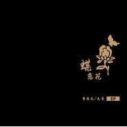

蝶恋花
============================

|  |  |
| :--: | :-- |
| [ 蝶恋花](https://emumo.xiami.com/album/101028163) | **艺人**: [曹思义](../index.md) **语种**: 国语 **唱片公司**: 独立发行 **发行时间**: 2012年09月09日 **专辑类别**: EP, 单曲 **专辑风格**: 器乐独奏 Solo Instrumental, 中国风 China-Wave **播放数**: 1112252 **收藏数**: 411 **评论数**: 22  |

## 简介

2012年9月9日发表的个人第一张专辑

## 曲目

## 评论

|  |  |  |  |
| :-- | :-- | :-- | :-- |
|  [虾米用户](https://emumo.xiami.com/u/267337456)  2019-12-28 12:36 赞(0) 踩(0) | 
儿子的最爱之一
 |
|  [虾米用户](https://emumo.xiami.com/u/223368117) 红鱼 2019-10-11 08:54 赞(0) 踩(0) | 
花褪残红青杏小燕子飞时绿水人家绕枝上柳绵吹又少天涯何处无芳草墙里秋千墙外道墙外行人墙里佳人笑笑渐不闻声渐悄多情却被无情恼。
 |
|  [虾米用户](https://emumo.xiami.com/u/412704481)  2019-10-05 19:24 赞(0) 踩(0) | 

 |
|  [虾米用户](https://emumo.xiami.com/u/250858649)  2019-07-06 10:11 赞(0) 踩(0) | 
很不错了，但有些岸部真明的影子。
 |
|  [虾米用户](https://emumo.xiami.com/u/332766008) 也許遇見妳 2019-06-17 19:24 赞(2) 踩(0) | 
不错的歌，不骄不躁，就这样，希望一直保持！
 |
|  [虾米用户](https://emumo.xiami.com/u/421053753)  2019-06-04 00:04 赞(0) 踩(0) | 
每天必听之，舒服！难以言表！
 |
|  [虾米用户](https://emumo.xiami.com/u/98200658)  2019-05-26 18:30 赞(0) 踩(0) | 
中国也有吉他演奏大师，最爱水墨江南韵味十足。
 |
|  [虾米用户](https://emumo.xiami.com/u/8254905) 向植物一样，茂盛地生长～ 2019-04-20 10:36 赞(2) 踩(0) | 
非常喜欢，作品精致恬静，我总是过一段时间就一遍又一遍重复收听，很享受～
 |
|  [虾米用户](https://emumo.xiami.com/u/18726851) 每一个人，都会重聚 2019-02-22 22:54 赞(0) 踩(0) | 
这张的调音有点电声的味道，作曲不错，如果能调整音色就更好了
 |
|  [虾米用户](https://emumo.xiami.com/u/55268200)   2019-02-06 02:56 赞(0) 踩(0) | 
后来改得版本更吸引人
 |
|  [虾米用户](https://emumo.xiami.com/u/1430438)  2016-12-21 23:49 赞(0) 踩(0) | 
其他歌呢？
 |
| ⇒ |  [虾米用户](https://emumo.xiami.com/u/87174696)   2017-08-06 12:55 赞(0) 踩(0) | 
遇见等等他没有版权
 |
|  [虾米用户](https://emumo.xiami.com/u/109573456)   2016-07-29 14:24 赞(0) 踩(0) | 
蝶恋花 很美。
 |
|  [虾米用户](https://emumo.xiami.com/u/58228894)  2016-04-26 21:35 赞(0) 踩(0) | 
希望更多人能听到~~
 |
|  [虾米用户](https://emumo.xiami.com/u/7337401)  2016-04-22 20:59 赞(0) 踩(0) | 
柔情 秀逸
 |
|  [虾米用户](https://emumo.xiami.com/u/4234256)  2016-04-17 12:51 赞(0) 踩(0) | 
好听~
 |
|  [虾米用户](https://emumo.xiami.com/u/12064965) : ) 2015-09-17 11:38 赞(0) 踩(0) | 
柔软
 |
|  [虾米用户](https://emumo.xiami.com/u/49054827)  2015-05-12 19:41 赞(0) 踩(0) | 
蝶恋花好好听
 |
|  [虾米用户](https://emumo.xiami.com/u/3715695) 没人会明白！！！ 2015-03-08 22:56 赞(0) 踩(0) | 
不错嘛
 |
|  [虾米用户](https://emumo.xiami.com/u/42528049)  2014-10-14 16:55 赞(0) 踩(0) | 
适合下午晒太阳的时候听
 |
|  [虾米用户](https://emumo.xiami.com/u/37053435)  2014-05-26 13:26 赞(0) 踩(0) | 
挺棒的，感情处理的很到位
 |
|  [虾米用户](https://emumo.xiami.com/u/12967021) listening 2014-05-25 22:35 赞(1) 踩(0) | 
来支持一下走音老师
 |
