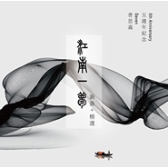

江南一梦五周年纪念专辑
============================

|  |  |
| :--: | :-- |
| [ 江南一梦五周年纪念专辑](https://emumo.xiami.com/album/2102725424) | **艺人**: [曹思义](../index.md) **语种**: 国语 **唱片公司**: 独立发行 **发行时间**: 2017年04月06日 **专辑类别**: 录音室专辑 **专辑风格**: 中国风 China-Wave, 轻音乐 Easy Listening, 器乐独奏 Solo Instrumental **播放数**: 500078 **收藏数**: 453 **评论数**: 25  |

## 简介

 曹思义五周年纪念专辑（2012~2017)
 

新曲+精选
 

 

蝶恋花
 

彩翼轻舞抚红颜 
 

罗衣曼妙  不知绿叶恼
 

落花无言风雨至
 

缘尘散去花事了
 

 
 

轮回未出又一世
 

余兴未尽  共饮人间好
 

尘事不了终无尽
 

愿君合十唤佛号
 

 
 

莲
 

清水静无涟   悠风舞心念
 

心有莲常开   身在净土边
 

 
 

恬绽
 

观今朝柳岸风轻    管昨夜狂雨雷鸣
 

耀自家无二本色    归当下绽放真心
 

 
 

蝶恋花 • 梨花殇
 

梦回梨园满目霜
 

一墙春色  一地暮漏阳
 

青丝抚落花几枝
 

夕阳染得遍地黄
 

 
 

春秋已度七载过
 

叶落声声  枝头有遗香
 

留步欲等故人归
 

满琴雪瓣梨花殇
 

 
 

一二三四
 

四指抚素琴    三音合雅韵
 

二话还未道    一杯手足情
 

 
 

茉莉花
 

春色暖两岸    百花满江南
 

枝枝忙斗艳    一朵茉莉笑
 

 
 

长相思 • 康定情歌
 

马前君 马上卿  悠悠慢蹄声声轻 不忍快步行
 

月下山 月下情  相视无言却有意 共赏人间景
 

 
 

荼靡
 

一世一见数黄昏
 

一人一琴诉心声
 

春花灿烂昨日梦
 

终有荼靡伴三生
 

 
 

如梦令 • 水乡新娘
 

舟载新装鸿娘  水映回眸巧妆
 

回身牵良人  脉脉水波相望
 

泛桨 泛桨  笑靥醉入夕阳
 

 
 

浣溪沙 • 远方的森林
 

一梦繁华万灯尽  独酌杯酒风下吟
 

洒下人间悲欢情
 

遥去之路见树影  举首遥望满天星
 

但愿我心照无明
 

## 曲目

## 评论

|  |  |  |
| :-- | :-- | :-- |
|  [虾米用户](https://emumo.xiami.com/u/344965808)  2020-12-29 16:52 赞(0) 踩(0) | 
近10年来难得一遇的才子作品。
 |
|  [虾米用户](https://emumo.xiami.com/u/55387904) 诶迈儿 2020-05-22 15:10 赞(0) 踩(0) | 
如幻如梦，养心的旋律。
 |
|  [虾米用户](https://emumo.xiami.com/u/402604787) 当音乐遇见诗香 2019-12-19 11:40 赞(0) 踩(0) | 
当你沉默地离去  说过的或没有说过的话 都已忘记  我将我的哭泣 也夹在书页里  好像我们年少时的那几朵茉莉  也许 会在多年後的一个黄昏里  从偶尔翻开的扉页中落下  没有芳香 再无声息  窗外 那时也许正落著细细的  细细的雨  ——席慕容《禅意》
 |
|  [虾米用户](https://emumo.xiami.com/u/342694594)  2019-01-20 22:10 赞(0) 踩(0) | 
Nice
 |
|  [虾米用户](https://emumo.xiami.com/u/212356465) 庸人罢了 2018-07-24 16:29 赞(0) 踩(0) | 
居然10.0评分
 |
|  [虾米用户](https://emumo.xiami.com/u/34744186) 在音乐中流连 2017-12-09 14:36 赞(1) 踩(0) | 
很喜欢这样的吉他演奏家，清新怡然
 |
|  [虾米用户](https://emumo.xiami.com/u/318547019) 指弹 2017-10-12 20:51 赞(0) 踩(0) | 
嗲!嗲!嗲!重要的事情说三遍!就是专辑有点贵……如果专辑便宜点没准粉丝会更多。
 |
|  [虾米用户](https://emumo.xiami.com/u/96930300)  2017-08-26 00:56 赞(0) 踩(0) | 
第一次听荼靡还是现场，可惜了准备工作没做好
 |
|  [虾米用户](https://emumo.xiami.com/u/50810535)  2017-05-13 23:13 赞(1) 踩(0) | 
六首关于花的   
 |
| ⇒ |  [虾米用户](https://emumo.xiami.com/u/96911602)  2017-05-24 23:02 赞(0) 踩(0) | 
明明是五首
 |
|  [虾米用户](https://emumo.xiami.com/u/87174696)   2017-04-23 22:36 赞(0) 踩(0) | 
这周拖更了啊啊啊啊啊啊啊啊啊等了好久 
 |
|  [虾米用户](https://emumo.xiami.com/u/15477519) 爱  是生命的和弦，而不... 2017-04-13 18:09 赞(6) 踩(0) | 
好爱这张专辑&amp;hellip;
 |
|  [虾米用户](https://emumo.xiami.com/u/253906353)  2017-04-12 14:18 赞(0) 踩(0) | 
旋律太优美了
 |
|  [虾米用户](https://emumo.xiami.com/u/1796724)  2017-04-10 00:14 赞(0) 踩(0) | 
思义哥，还是你牛！没啥说的，期待你更多的作品！
 |
|  [虾米用户](https://emumo.xiami.com/u/229350480)   2017-04-09 00:37 赞(0) 踩(0) | 
师兄 我来支持你了
 |
|  [虾米用户](https://emumo.xiami.com/u/96911602)  2017-04-08 01:51 赞(0) 踩(0) | 
咦？四首曲子三种花
 |
|  [虾米用户](https://emumo.xiami.com/u/96911602)  2017-04-08 01:45 赞(1) 踩(0) | 
目前四首还是荼靡最棒，可以无限循环
 |
|  [虾米用户](https://emumo.xiami.com/u/87174696)   2017-04-05 22:07 赞(1) 踩(0) | 
荼靡将那种繁花盛开然后凋零的那种伤感完美的展现了出来啊中国风我只服曹老师
 |
|  [虾米用户](https://emumo.xiami.com/u/40323832)   2017-04-01 19:22 赞(1) 踩(0) | 
好听
 |
|  [虾米用户](https://emumo.xiami.com/u/8553146)   2017-04-01 19:01 赞(0) 踩(0) | 
我在网易里面等，没等到
 |
|  [虾米用户](https://emumo.xiami.com/u/98065492) 这个人很丧，什么也不想写... 2017-03-31 22:47 赞(0) 踩(0) | 
天啊啊啊啊啊啊啊
 |
|  [虾米用户](https://emumo.xiami.com/u/248747648) 天地有大美 2017-03-31 21:59 赞(0) 踩(0) | 
支持，瞬间重温了，我们和行的年会，赞支持   
 |
|  [虾米用户](https://emumo.xiami.com/u/20993148)  2017-03-31 21:36 赞(0) 踩(0) | 
支持！
 |
|  [虾米用户](https://emumo.xiami.com/u/18726851) 每一个人，都会重聚 2017-03-31 20:40 赞(0) 踩(0) | 
板凳
 |
|  [虾米用户](https://emumo.xiami.com/u/249948903) 好风凭借力，送我上青云。 2017-03-31 20:33 赞(0) 踩(0) | 
沙发
 |
