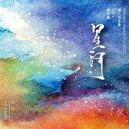
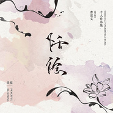

曹思义
============================

|  |  |
| :--: | :-- |
| [ 曹思义](https://i.xiami.com/caosy) | **地区**: China 中国大陆 **风格**: 器乐独奏 Solo Instrumental **播放数**: 7024474 **粉丝数**: 4471 **评论数**: 131  |

## 档案

曹思义/Seven 
中国指弹吉他演奏家，中国风吉他独奏音乐的先行者。 
他的作品拥有梦幻般的意境，同时结合了中国古典美感，让人情不自禁地陶醉其中。他的演奏拥有独特的音色，在闭目聆听的瞬间，几乎让人难以分辨这个是吉他，还是古琴与古筝等中国古典乐器。他的作品充满着禅意，演奏的每个音符仿佛都在触摸心底最柔然的地方，给予听众一次畅快淋漓的心灵疗愈之旅。 
从2012年开始至今，先后发布了5张个人专辑。首张个人专辑《蝶恋花EP》，经典英文歌曲改编专辑《Songs of Yesterday》，个人原创专辑《恬绽》，个人原创专辑《星河》，五周年纪念专辑《江南一梦》，以及1张与日本演奏家GIN合作专辑《Blue Passenger》。 
曾受邀，为雅哈咖啡广告录制吉他独奏背景音乐；为电影《青海湖畔》电影配乐的吉他录制；为中国偶像组合“ Idol School”改编指弹独奏曲，该曲被Idol School的纪念专辑收录。并且受邀加入中国吉他学会，任指弹吉他分会委员。 
从2014年起，每年都会收邀进行全国巡演，曾到过中国40多个城市与地区，也是第一位受邀前往台湾举办个人音乐会的大陆指弹吉他演奏家。2018年受邀前往美国与日本分别进行了四个城市的巡演。 
拥有众多粉丝，目前是国内最热门的吉他演奏家之一。中国知名吉他品牌“沐”吉他创始人；国际知名乐器箱包品牌“音乐驿站”形象代言人。 
多次与国际吉他演奏家，吉他大师合作演出（以首字母先后顺序排列）：陈亮，董运昌（中国台湾），胡洋，李玮峰，赖康康，刘卓威（中国香港），任强，宋依凡，王开仲，向嵬，朱家明，冈崎伦典（日本），GIN（日本），南泽大介（日本），田中彬博（日本），伍伍慧（日本），中川砂仁（日本），Billy McLaughlin（美国）， Don Ross（加拿大）， Laurence Juber（英国）， Martin Taylor（英国）， Tommy Emmanuel（澳大利亚）， Thomas Leeb（奥地利）

## 专辑

| 名称 | 语种 | 唱片公司 | 发行时间 | 专辑类别 | 专辑风格 |
| :--: | :-- | :-- | :-- | :-- | :-- |
| [ Green wind(demo)](./albums/5022380902.md) | 纯音乐 |  | 2020年06月06日 | EP, 单曲 |  |
| [ 人间如梦](./albums/2104601591.md) | 国语 | 独立发行 | 2019年03月30日 | 录音室专辑 | 中国风 China-Wave, 轻音乐 Easy Listening, 新世纪音乐 New Age |
| [ 江南一梦五周年纪念专辑](./albums/2102725424.md) | 国语 | 独立发行 | 2017年04月06日 | 录音室专辑 | 中国风 China-Wave, 轻音乐 Easy Listening, 器乐独奏 Solo Instrumental |
| [ Blue Passenger2015巡演纪念专辑](./albums/2100214658.md) | 其他 | 独立发行 | 2015年09月25日 | 录音室专辑 | 轻音乐 Easy Listening, 新世纪音乐 New Age |
| [ 星河the Galaxy](./albums/2100194282.md) | 国语 | 独立发行 | 2015年09月09日 | 录音室专辑 | 器乐独奏 Solo Instrumental, 轻音乐 Easy Listening, 新世纪音乐 New Age |
| [ Demo集新作抢先听](./albums/1219062431.md) | 国语 | 独立发行 | 2015年01月01日 | EP, 单曲 | 新世纪音乐 New Age, 中国风 China-Wave |
| [ 恬绽](./albums/1601030001.md) | 国语 | 独立发行 | 2014年05月15日 | 录音室专辑 | 器乐独奏 Solo Instrumental, 新世纪音乐 New Age, 中国风 China-Wave |
| [ Songs of Yesterday指弹吉他编曲专辑](./albums/799277197.md) | 国语 | 独立发行 | 2013年03月09日 | 录音室专辑 | 器乐独奏 Solo Instrumental |
| [ 蝶恋花](./albums/101028163.md) | 国语 | 独立发行 | 2012年09月09日 | EP, 单曲 | 器乐独奏 Solo Instrumental, 中国风 China-Wave |

## 评论

|  |  |  |
| :-- | :-- | :-- |
|  [虾米用户](https://emumo.xiami.com/u/49934890)   2021-01-12 22:17 赞(0) 踩(0) | 
虾米音乐关停，希望以后能在其他地方再听到走音老师新曲子，唉
 |
|  [虾米用户](https://emumo.xiami.com/u/5819278) 面朝大海 春暖花开 2020-04-26 09:57 赞(0) 踩(0) | 
不错，走心
 |
|  [虾米用户](https://emumo.xiami.com/u/43418982)  2020-03-11 02:54 赞(0) 踩(0) | 
浮到宇宙与灵魂的尽头
 |
|  [虾米用户](https://emumo.xiami.com/u/260640673)  2020-02-28 12:06 赞(0) 踩(0) | 
中国人自己的原创指弹，加油！！！
 |
|  [虾米用户](https://emumo.xiami.com/u/10537792)  2019-10-15 10:24 赞(0) 踩(0) | 

 |
|  [虾米用户](https://emumo.xiami.com/u/25780220)  2019-05-18 22:48 赞(0) 踩(0) | 
请问曹老师，您的音乐里面很多细微的破音，是录音的问题，还是琴弦碰码的声音？
 |
| ⇒ |  [虾米用户](https://emumo.xiami.com/u/422242450)  2019-07-24 20:39 赞(0) 踩(0) | 
是的
 |
|  [虾米用户](https://emumo.xiami.com/u/10009897)  2019-03-09 19:52 赞(2) 踩(0) | 
提肛 连接宇宙 加入混响
 |
|  [虾米用户](https://emumo.xiami.com/u/7151428) 暖暖的～～ 2019-02-22 07:25 赞(1) 踩(0) | 
 
 |
|  [虾米用户](https://emumo.xiami.com/u/10362223) 安静的灵魂 2019-01-02 00:16 赞(1) 踩(0) | 
看了简介，感觉...
 |
|  [虾米用户](https://emumo.xiami.com/u/349339882) 后荣迷。努力学习中。 2018-12-10 21:35 赞(1) 踩(0) | 
不错啊 (*๓´╰╯`๓)♡
 |
|  [虾米用户](https://emumo.xiami.com/u/326439328) surprised 2018-12-09 23:44 赞(1) 踩(0) | 
23:30 好听，勾起了我的许多回忆。
 |
|  [虾米用户](https://emumo.xiami.com/u/10009897)  2018-11-27 21:14 赞(2) 踩(0) | 
闭目提肛加混响
 |
|  [虾米用户](https://emumo.xiami.com/u/47808059)   2018-11-27 17:50 赞(1) 踩(0) | 
网上都找不到哪里能买原版谱子。哭哭
 |
|  [虾米用户](https://emumo.xiami.com/u/47808059)   2018-11-27 17:49 赞(1) 踩(0) | 
曹老师，哪里能买到恬绽 专辑的一本谱子啊？
 |
|  [虾米用户](https://emumo.xiami.com/u/407693250)  2018-11-03 02:24 赞(2) 踩(0) | 
余钟品老师介绍来的 
 |
|  [虾米用户](https://emumo.xiami.com/u/7228975) 我还没想好要写什么... 2018-09-22 16:54 赞(0) 踩(0) | 
弱弱的问一句。。。老师～蝶恋花的谱子可否分享下？
 |
|  [虾米用户](https://emumo.xiami.com/u/10624478)   2018-05-24 01:39 赞(1) 踩(0) | 
想到了中川砂仁
 |
|  [虾米用户](https://emumo.xiami.com/u/343254219)  2018-03-30 21:24 赞(0) 踩(0) | 
有情有心！引人入胜
 |
|  [虾米用户](https://emumo.xiami.com/u/276685540) 爬上墙头等红杏 2018-02-20 04:00 赞(0) 踩(0) | 
虾米太坑人了，会员还要收费1－5元一首，酷狗会员免费，这是几个意思，钱掏完了才知道酷狗会员免费，什么感觉？当时感觉吃了绿豆蝇！
 |
|  [虾米用户](https://emumo.xiami.com/u/9080939) 不为无益之事，何遣有涯之... 2018-01-24 05:33 赞(3) 踩(0) | 
明亮，柔软 细腻，恬淡 丰富，清晰 一个静静欣赏，惬意，触动
 |
|  [虾米用户](https://emumo.xiami.com/u/25166299) 人生若只如初见 2017-12-25 22:20 赞(0) 踩(0) | 
同学 听过吗 期待你听一下
 |
|  [虾米用户](https://emumo.xiami.com/u/89073062)  2017-10-27 23:50 赞(1) 踩(0) | 
不经意听了曹老师的作品，突然发现原来国内也有非常棒的指弹大师，深深喜欢上了曹老师的作品，正在练习中 
 |
|  [虾米用户](https://emumo.xiami.com/u/21216195) 我还没想好要写什么... 2017-08-25 08:53 赞(1) 踩(0) | 
有种无意中发现宝贝的感觉。
 |
|  [虾米用户](https://emumo.xiami.com/u/1430438)  2017-08-18 00:23 赞(0) 踩(0) | 
曹老师什么时候有独奏会
 |
|  [虾米用户](https://emumo.xiami.com/u/185937534)  2017-08-03 15:14 赞(0) 踩(0) | 
我就是在看西哲史听到这首曲子，停下来收藏。期待你的作品。有机会能现场听就更好了。
 |
|  [虾米用户](https://emumo.xiami.com/u/9327494) http://www.x... 2017-07-18 22:13 赞(0) 踩(0) | 
23：30
 |
| ⇒ |  [虾米用户](https://emumo.xiami.com/u/47808059)   2017-09-24 09:38 赞(0) 踩(0) | 
这首现场真的很棒。大爱这首
 |
| ⇒ |  [虾米用户](https://emumo.xiami.com/u/9327494) http://www.x... 2017-09-25 08:29 赞(0) 踩(0) | 
<q><b>&amp;:3说：</b></q>
 |
| ⇒ |  [虾米用户](https://emumo.xiami.com/u/47808059)   2017-09-25 09:20 赞(0) 踩(0) | 
<q><b>Lilian说：</b></q>
 |
|  [虾米用户](https://emumo.xiami.com/u/50454670) 这家伙很聪明什么也 2017-07-15 10:13 赞(0) 踩(0) | 
我在深圳，想问问票怎么买呢 
 |
| ⇒ |  [虾米用户](https://emumo.xiami.com/u/48904070) I love CHINA 2017-07-18 17:20 赞(0) 踩(0) | 
秀动APP
 |
|  [虾米用户](https://emumo.xiami.com/u/298040536) 她不漂亮，她也不涂胭脂。 2017-06-28 23:44 赞(0) 踩(0) | 
真好
 |
|  [虾米用户](https://emumo.xiami.com/u/47456900) 我还没想好要写什么... 2017-06-16 02:09 赞(0) 踩(0) | 

 |
|  [虾米用户](https://emumo.xiami.com/u/223589)  2017-06-07 15:20 赞(0) 踩(0) | 
我去，只顾着听没看，一直以为是日本的乐手&amp;hellip;&amp;hellip;
 |
|  [虾米用户](https://emumo.xiami.com/u/10707847)  2017-05-20 00:27 赞(1) 踩(0) | 
好！
 |
|  [虾米用户](https://emumo.xiami.com/u/4570323) BadClutch艺术总... 2017-05-15 23:03 赞(1) 踩(0) | 
牛逼 支持
 |
|  [虾米用户](https://emumo.xiami.com/u/50027595)  2017-04-26 08:57 赞(1) 踩(0) | 
超喜欢老师的指弹中国风
 |
|  [虾米用户](https://emumo.xiami.com/u/48904070) I love CHINA 2017-04-25 20:54 赞(1) 踩(0) | 
<a href="http://www.showstart.com/event/25537" target="_blank" rel="nofollow noreferrer noopener">http://www.showstart.com/event/25537</a> 06月02日 【MAO Live呈现】指弹不止弹VOL.1：GIN&amp;amp;amp;曹思义&amp;ldquo;Walking in the music&amp;rdquo;在音乐中徜徉音乐会 杭州 MAO Livehouse
 |
|  [虾米用户](https://emumo.xiami.com/u/48904070) I love CHINA 2017-04-25 20:46 赞(1) 踩(0) | 
<a href="http://www.showstart.com/event/25537" target="_blank" rel="nofollow noreferrer noopener">http://www.showstart.com/event/25537</a> 06月02日 【MAO Live呈现】指弹不止弹VOL.1：GIN&amp;amp;amp;曹思义&amp;ldquo;Walking in the music&amp;rdquo;在音乐中徜徉音乐会 杭州 MAO Livehouse 1
 |
|  [虾米用户](https://emumo.xiami.com/u/48904070) I love CHINA 2017-04-25 20:46 赞(1) 踩(0) | 
<a href="http://www.showstart.com/event/25537" target="_blank" rel="nofollow noreferrer noopener">http://www.showstart.com/event/25537</a> 06月02日 【MAO Live呈现】指弹不止弹VOL.1：GIN&amp;amp;amp;曹思义&amp;ldquo;Walking in the music&amp;rdquo;在音乐中徜徉音乐会 杭州 MAO Livehouse
 |
|  [虾米用户](https://emumo.xiami.com/u/260335522)   2017-04-21 00:20 赞(1) 踩(0) | 
沐音堂 难忘的地方
 |
|  [虾米用户](https://emumo.xiami.com/u/260335522)   2017-04-21 00:18 赞(1) 踩(0) | 
曹老师，支持！
 |
|  [虾米用户](https://emumo.xiami.com/u/285165347)  2017-04-02 04:07 赞(2) 踩(0) | 
12
 |
|  [虾米用户](https://emumo.xiami.com/u/48667695) 弹吉他的小清新 2017-01-21 14:44 赞(1) 踩(0) | 
蝶恋花是一支很感人的曲子，我觉得不次于GIN的愿樱
 |
|  [虾米用户](https://emumo.xiami.com/u/4400366) 再也不见 2017-01-04 21:23 赞(2) 踩(0) | 
囍
 |
|  [虾米用户](https://emumo.xiami.com/u/50810535)  2016-10-19 00:19 赞(0) 踩(0) | 
走音老师作品一定要在适宜的环境下听才最有感觉！棒极了
 |
|  [虾米用户](https://emumo.xiami.com/u/47459009)  2016-10-04 16:41 赞(0) 踩(0) | 
音乐不错 就是付费恶心了点 一元一首。。。
 |
|  [虾米用户](https://emumo.xiami.com/u/10113345)   2016-09-20 13:23 赞(0) 踩(0) | 
17号去了听走音老师～好美～啊老师第一次来广州吖好开心～～希望以后多些来
 |
|  [虾米用户](https://emumo.xiami.com/u/86892668)  2016-08-21 21:16 赞(0) 踩(0) | 
太好听了
 |
|  [虾米用户](https://emumo.xiami.com/u/43919543) 你的人生不需向任何人解释... 2016-08-20 17:28 赞(0) 踩(0) | 
每次听，都有一种心被揉碎的感觉，无法言语...
 |
|  [虾米用户](https://emumo.xiami.com/u/6042551) 我不是一个容易被感动的人... 2016-08-19 16:07 赞(0) 踩(0) | 
加油！有内涵！！
 |
|  [虾米用户](https://emumo.xiami.com/u/3864796)  2016-07-24 20:31 赞(1) 踩(0) | 
曹老师，我今天在听你的音乐会，非常好听 
 |
| ⇒ |  [虾米用户](https://emumo.xiami.com/u/198791060)  2016-07-25 20:11 赞(0) 踩(0) | 
你是在阜阳听的吗？
 |
| ⇒ |  [虾米用户](https://emumo.xiami.com/u/3864796)  2016-07-26 21:55 赞(0) 踩(0) | 
<q><b>平凡※世界说：</b></q>
 |
|  [虾米用户](https://emumo.xiami.com/u/45435466) Learn By Hea... 2016-07-14 10:03 赞(1) 踩(0) | 
的确是大神
 |
|  [虾米用户](https://emumo.xiami.com/u/10113345)   2016-07-08 23:52 赞(1) 踩(0) | 
好喜欢～～求来广州吖
 |
|  [虾米用户](https://emumo.xiami.com/u/5531646) 我还没想好要写什么... 2016-07-06 09:16 赞(1) 踩(0) | 
7.31晚演出票已定，我最喜欢的两个吉他手
 |
|  [虾米用户](https://emumo.xiami.com/u/9327494) http://www.x... 2016-06-30 09:41 赞(1) 踩(0) | 
LOVE
 |
|  [虾米用户](https://emumo.xiami.com/u/5881821)  2016-06-17 17:23 赞(0) 踩(0) | 
曹老师啥时办小型演奏会啊，求陶冶 或者有没有固定演奏场所啊 
 |
|  [虾米用户](https://emumo.xiami.com/u/3076487)   2016-05-26 18:59 赞(0) 踩(0) | 
都付费？哎…无缘了…
 |
|  [虾米用户](https://emumo.xiami.com/u/100335846)  2016-05-16 18:34 赞(0) 踩(0) | 
噢，册那。。。。。。 
 |
|  [虾米用户](https://emumo.xiami.com/u/165128746)  2016-05-09 06:14 赞(0) 踩(0) | 
好听！非常喜欢！ 
 |
|  [虾米用户](https://emumo.xiami.com/u/12876004) ` 2016-05-08 11:53 赞(0) 踩(0) | 
。，。
 |
|  [虾米用户](https://emumo.xiami.com/u/4417715)  2016-05-04 20:55 赞(0) 踩(0) | 

 |
|  [虾米用户](https://emumo.xiami.com/u/16994877) 音海拾音 2016-04-10 10:26 赞(0) 踩(0) | 
I like
 |
|  [虾米用户](https://emumo.xiami.com/u/10410204) ? 2016-04-02 17:04 赞(0) 踩(0) | 
好棒！
 |
|  [虾米用户](https://emumo.xiami.com/u/11198659)   2016-03-06 00:41 赞(0) 踩(0) | 
很棒
 |
|  [虾米用户](https://emumo.xiami.com/u/82275654) 再来一杯 2016-02-12 01:46 赞(0) 踩(0) | 
确实有中国 中川砂仁的宗师派头！
 |
|  [虾米用户](https://emumo.xiami.com/u/102786608)  2016-01-24 14:17 赞(0) 踩(0) | 
国内很棒的指弹演奏家！！看好！！支持！！
 |
|  [虾米用户](https://emumo.xiami.com/u/33091952)  2016-01-22 11:49 赞(0) 踩(0) | 
曹老师！嗲
 |
|  [虾米用户](https://emumo.xiami.com/u/3583995) 一個人的戰爭 2016-01-22 01:31 赞(0) 踩(0) | 

 |
|  [虾米用户](https://emumo.xiami.com/u/47370973)   2015-12-03 16:54 赞(1) 踩(0) | 
好听！赞一个
 |
|  [虾米用户](https://emumo.xiami.com/u/1839385) 杳 2015-11-27 11:22 赞(0) 踩(0) | 
很少写评论，不过，想来赞下！
 |
|  [虾米用户](https://emumo.xiami.com/u/3746899)  2015-11-23 21:55 赞(1) 踩(0) | 
让人很宁静
 |
|  [虾米用户](https://emumo.xiami.com/u/6570452) 我还没想好要写什么... 2015-11-12 19:23 赞(0) 踩(0) | 
走音老师好棒！
 |
|  [虾米用户](https://emumo.xiami.com/u/69307304) 指弹独奏，乐曲改编 2015-11-12 13:33 赞(0) 踩(0) | 
嗯
 |
|  [虾米用户](https://emumo.xiami.com/u/33075711)   2015-11-04 21:55 赞(0) 踩(0) | 
好恬淡轻灵的音乐 星河不知为何给我了有一种春日飞花冬日落雪的感觉 喜欢
 |
|  [虾米用户](https://emumo.xiami.com/u/7252584) 新的梦想 2015-10-26 11:01 赞(0) 踩(0) | 
第一次听到啊，好好听啊
 |
|  [虾米用户](https://emumo.xiami.com/u/217346) 任性的孩子，还会回来的。 2015-10-24 13:55 赞(32) 踩(0) | 
博采众长，脚踏实地。Tom，Andy，岸部等等的feel都有了。还有浓浓中国风和现代哲思。此君必火~~
 |
| ⇒ |  [虾米用户](https://emumo.xiami.com/u/198791060)  2016-07-25 20:10 赞(0) 踩(0) | 
说的好！
 |
|  [虾米用户](https://emumo.xiami.com/u/70229690)  2015-10-20 20:35 赞(0) 踩(0) | 
么么哒
 |
|  [虾米用户](https://emumo.xiami.com/u/30154903)  2015-09-30 17:53 赞(0) 踩(0) | 
大爱走音老师！
 |
|  [虾米用户](https://emumo.xiami.com/u/9585764)  2015-09-30 11:26 赞(0) 踩(0) | 
旋律非常美妙！
 |
|  [虾米用户](https://emumo.xiami.com/u/69880974)  2015-09-27 17:25 赞(0) 踩(0) | 
最爱中国风…一边和我聊天一边给我弹曲子…感觉时间过得特别快……  
 |
|  [虾米用户](https://emumo.xiami.com/u/69880974)  2015-09-27 17:24 赞(0) 踩(0) | 
走音老师人好好，被邀请到我们学校演出，还很好的送给我们新专辑，还给我专签了呢…哎呀好激动啊  
 |
|  [虾米用户](https://emumo.xiami.com/u/69017586)   2015-09-25 13:36 赞(0) 踩(0) | 
留名
 |
|  [虾米用户](https://emumo.xiami.com/u/1957476) 暂无签名~ 2015-09-25 10:17 赞(0) 踩(0) | 
棒！
 |
|  [虾米用户](https://emumo.xiami.com/u/51847874)  2015-09-06 18:48 赞(0) 踩(0) | 
中国不可多得的指弹曲 把中国风融进曲子了  喜欢
 |
|  [虾米用户](https://emumo.xiami.com/u/37098145) 这个家伙太蠢了不会留下什... 2015-09-03 06:19 赞(0) 踩(0) | 
加油
 |
|  [虾米用户](https://emumo.xiami.com/u/478527) 好想跟衣服在洗衣机里滚 2015-08-30 21:44 赞(0) 踩(0) | 
今夜开车路过上海，开车听着night in shanghai，仿若像是去这个城市见一位老友，清清淡淡，带着思念
 |
|  [虾米用户](https://emumo.xiami.com/u/2195529)  2015-06-27 21:53 赞(1) 踩(0) | 
国内的指弹大牛,拜一下
 |
|  [虾米用户](https://emumo.xiami.com/u/12862689)  2015-04-07 15:58 赞(0) 踩(0) | 
好听
 |
|  [虾米用户](https://emumo.xiami.com/u/12319515)  2015-03-19 15:55 赞(0) 踩(0) | 
在微博上看到 被一首蝶恋花迷了~
 |
|  [虾米用户](https://emumo.xiami.com/u/45528346)   2015-02-14 16:10 赞(0) 踩(0) | 
居然有走音…醉
 |
|  [虾米用户](https://emumo.xiami.com/u/44464089) 暂无签名~ 2015-02-08 13:41 赞(0) 踩(0) | 
感觉跟陈亮老师走的是两个路线。。。曹思义老师好像更喜欢做一些抒情的音乐。。。曹老师的曲子我最喜欢蝶恋花，陈亮老师的就是田子坊和China Funk。。。
 |
|  [虾米用户](https://emumo.xiami.com/u/588121) 我还没想好要写什么... 2015-02-03 20:27 赞(0) 踩(0) | 
牛
 |
|  [虾米用户](https://emumo.xiami.com/u/559177) 郑力健 2015-01-26 13:48 赞(0) 踩(0) | 
弹的好啊
 |
|  [虾米用户](https://emumo.xiami.com/u/32874571) 暂无 2015-01-24 21:16 赞(0) 踩(0) | 
找了半天 没找到在哪里能加走音老师的关注 谁能告诉一声吗
 |
|  [虾米用户](https://emumo.xiami.com/u/34075759) 乱花渐欲迷人眼 2015-01-15 13:12 赞(0) 踩(0) | 
混的太好了！这种录音质量也是醉了
 |
| ⇒ |  [虾米用户](https://emumo.xiami.com/u/198791060)  2016-07-25 20:08 赞(0) 踩(0) | 
哼！你瞎凑什么热闹！
 |
|  [虾米用户](https://emumo.xiami.com/u/42575996) fingerstyle 2014-12-23 20:47 赞(0) 踩(0) | 
赞，中国风
 |
|  [虾米用户](https://emumo.xiami.com/u/5393285) 悩みに巻き込まれて 2014-11-16 15:24 赞(0) 踩(0) | 
正在沐音堂学，下首就要学到曹老师的《恬绽》了
 |
| ⇒ |  [虾米用户](https://emumo.xiami.com/u/45379373)  2015-01-10 08:25 赞(0) 踩(0) | 
你好，请问如何在沐音堂学琴呢？是在网上吗？
 |
| ⇒ |  [虾米用户](https://emumo.xiami.com/u/5393285) 悩みに巻き込まれて 2015-01-10 08:26 赞(0) 踩(0) | 
<q><b>大帅哥无敌的玫瑰说：</b></q>
 |
| ⇒ |  [虾米用户](https://emumo.xiami.com/u/45379373)  2015-01-10 08:27 赞(0) 踩(0) | 
<q><b>游客431057说：</b></q>
 |
|  [虾米用户](https://emumo.xiami.com/u/15477519) 爱  是生命的和弦，而不... 2014-10-07 19:06 赞(2) 踩(0) | 
国人的骄傲...
 |
|  [虾米用户](https://emumo.xiami.com/u/5955249)  2014-09-10 21:35 赞(0) 踩(0) | 
喜欢
 |
|  [虾米用户](https://emumo.xiami.com/u/10106138) 嘛都没有~ 2014-09-08 23:25 赞(0) 踩(0) | 
很喜欢！之前练过走音老师两首曲子，希望能出更多好音乐！！
 |
|  [虾米用户](https://emumo.xiami.com/u/7375969)   2014-08-13 23:23 赞(0) 踩(0) | 
还好虾米有…内牛…不然豆瓣听的我简直纠结死…
 |
|  [虾米用户](https://emumo.xiami.com/u/28489284)   2014-08-08 16:56 赞(0) 踩(0) | 
终于！赞！
 |
|  [虾米用户](https://emumo.xiami.com/u/15862039) 暂无签名~ 2014-06-22 17:44 赞(0) 踩(0) | 
愿曹老师能带给我们更多地更好听的音乐
 |
|  [虾米用户](https://emumo.xiami.com/u/32238141) 战略级呆毛听歌兔 2014-06-18 01:39 赞(16) 踩(0) | 
走音老师也发虾米啦！我是小腿毛！支持你的新专辑恬绽～恬静的绽放～
 |
| ⇒ |  [虾米用户](https://emumo.xiami.com/u/198791060)  2016-07-25 20:05 赞(0) 踩(0) | 
你妹他走音，会听的人听门道，不会听的人听热闹！
 |
| ⇒ |  [虾米用户](https://emumo.xiami.com/u/60371934)  2017-05-28 00:01 赞(0) 踩(0) | 
<q><b>平凡※世界说：</b></q>
 |
| ⇒ |  [虾米用户](https://emumo.xiami.com/u/362898510)  2018-07-07 09:26 赞(0) 踩(0) | 
<q><b>平凡※世界说：</b></q>
 |
|  [虾米用户](https://emumo.xiami.com/u/37116741)  2014-05-29 22:27 赞(0) 踩(0) | 
支持老师，不知道能收我做徒弟吗？
 |
|  [虾米用户](https://emumo.xiami.com/u/11404201)  2014-05-23 23:53 赞(1) 踩(0) | 
今天演奏会，第一次听曹老师的曲子。感情细腻，画面十足，太棒了
 |
|  [虾米用户](https://emumo.xiami.com/u/9174294) 音乐不只是流行歌曲 2014-05-12 23:19 赞(0) 踩(0) | 
没得说，好听的音乐
 |
|  [虾米用户](https://emumo.xiami.com/u/5923091)  2014-05-06 08:37 赞(1) 踩(0) | 
哟西 沙发！！曹大终于有虾米窝了10086个赞
 |
|  [虾米用户](https://emumo.xiami.com/u/36044861)  2014-05-05 15:34 赞(180) 踩(0) | 
我刚入驻了虾米音乐人，欢迎大家来我的个人主页，收听我的最新音乐
 |
| ⇒ |  [虾米用户](https://emumo.xiami.com/u/74930074) To be better... 2015-10-20 00:34 赞(0) 踩(0) | 
好听
 |
| ⇒ |  [虾米用户](https://emumo.xiami.com/u/3138695)  2015-10-24 11:34 赞(0) 踩(0) | 
很喜欢你的音乐，何时再有演出？ 
 |
| ⇒ |  [虾米用户](https://emumo.xiami.com/u/198791060)  2016-07-25 20:07 赞(0) 踩(0) | 
曹老师棒棒哒！ 
 |
| ⇒ |  [虾米用户](https://emumo.xiami.com/u/206449383)  2016-07-31 12:54 赞(0) 踩(0) | 

 |
| ⇒ |  [虾米用户](https://emumo.xiami.com/u/286738630)  2017-04-06 22:34 赞(0) 踩(0) | 
支持
 |
| ⇒ |  [虾米用户](https://emumo.xiami.com/u/50027595)  2017-04-26 08:56 赞(0) 踩(0) | 
老师，你的中国风指弹，很喜欢。乐谱在哪里可以买到？
 |
| ⇒ |  [虾米用户](https://emumo.xiami.com/u/50454670) 这家伙很聪明什么也 2018-03-20 00:07 赞(0) 踩(0) | 
想问下您的音乐会票怎么购买，是18年在深圳吗 
 |
| ⇒ |  [虾米用户](https://emumo.xiami.com/u/354294622) 爱笑的人运气不会太差 2018-11-07 21:48 赞(0) 踩(0) | 
特别喜欢蝶恋花
 |
| ⇒ |  [虾米用户](https://emumo.xiami.com/u/61237410) 不肯媚俗的摇滚老逼 2019-03-23 23:43 赞(0) 踩(0) | 
敬佩
 |
| ⇒ |  [虾米用户](https://emumo.xiami.com/u/337185561) 后会有期。 2019-06-20 12:02 赞(0) 踩(0) | 
您真厉害(ง •̀_•́)ง
 |
