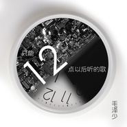

只能12点以后听的歌
============================

|  |  |
| :--: | :-- |
| [ 只能12点以后听的歌](https://emumo.xiami.com/album/2100386564) | **艺人**: [毛泽少](../index.md) **语种**: 国语 **唱片公司**: 磁力音乐 **发行时间**: 2016年09月01日 **专辑类别**: EP, 单曲 **专辑风格**:  **播放数**: 29168 **收藏数**: 11 **评论数**: 4  |

## 简介

12点以后，意味着什么？如果你的双人床上空出了一个熟悉的位置，你是不是还能顺利入睡？   
  
电音女王毛泽少这次带来的全新单曲《只能12点以后听的歌》，一改往日的张扬与轻快曲风，只是用寂寞的口吻，讲述着一个发生在繁忙都市的伤感故事。   
  
“打不通的电话还想打给谁，一个人的晚餐可以很美味”。面对一个熟记于心但却再也拨不通的电话，面对一桌用心料理但却只能独享的丰盛晚餐，孤独就是在那个时候在房间角落默默滋长出来的。 毛泽少用看似慵懒的嗓音勾勒出充满画面感的故事情节，那个每晚陪你入眠的人一旦离开，睡眠成了问题，生活也好像少了些色彩。“没有争吵，现在安静的想睡”。感情生活中的争执与烦恼，现在变成独角戏，孤独成了主角，你成了配角。“快点睡不要喝茶或咖啡，明天是新的开始对不对”。宛如梦呓般的自言自语，却恰如其分地勾勒出失恋人的真实写照。一个人在十二点以后，因为睡不着在床上喃喃。一段段哀而不伤的歌词，更像是大片留白的冷静沉思。   
  
一向以劲歌热舞表现示人的毛泽少这一次推出伤感情歌，以全新角度唱出形形色色人群内心的空虚与孤单。生活不是电视剧，没有沸腾喧闹的争吵，没有两败俱伤的裂变，只有一个失眠的人在十二点后打开电台，听曾经觉得温暖的歌，等夜晚一点点变凉。   
 

## 曲目

## 评论

|  |  |  |  |
| :-- | :-- | :-- | :-- |
|  [虾米用户](https://emumo.xiami.com/u/411136656)  2019-08-31 04:57 赞(0) 踩(0) | 
很喜欢毛泽少的歌  超级好听没有被商业化的歌就是 好 非常纯
 |
|  [虾米用户](https://emumo.xiami.com/u/49228483)  2017-04-16 22:00 赞(0) 踩(0) | 
风格炒鸡棒
 |
|  [虾米用户](https://emumo.xiami.com/u/1919321) 都一样。 2017-01-23 11:25 赞(0) 踩(0) | 
即使是伤感的歌曲，依然想听无数遍！声音有穿透力，坚定里透着可爱的声音！
 |
|  [虾米用户](https://emumo.xiami.com/u/2523302)  2016-11-11 22:39 赞(0) 踩(0) | 
觉得不错啊！
 |
