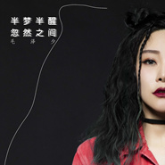

半梦半醒忽然之间
============================

|  |  |
| :--: | :-- |
| [ 半梦半醒忽然之间](https://emumo.xiami.com/album/2103517075) | **艺人**: [毛泽少](../index.md) **语种**: 国语 **唱片公司**: 独立发行 **发行时间**: 2018年02月06日 **专辑类别**: EP, 单曲 **专辑风格**: 国语流行 Mandarin Pop **播放数**: 144861 **收藏数**: 10 **评论数**: 0  |

## 简介

 
 

听说，时间像一个无赖
 

又像是一个贪玩的小孩
 

转眼一年又一年，一首《半梦半醒忽然之间》回荡在你我心中，歌手毛泽少用歌声走入剧情，将这份故事唱给你听：回顾2017年，一路走走停停看看，半梦半醒忽然之间，思念是唯一留下的纪念。
 

每个夜晚，你我都有一个人安静的时刻，在这份半梦半醒忽然之间享受这份美好，2018带着新的故事继续上路吧，和喜欢的到一个陌生的城市，一起走走看看！
 

 

## 曲目

## 评论

|  |  |  |  |
| :-- | :-- | :-- | :-- |
