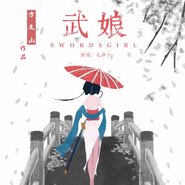

毛泽少
============================

|  |  |
| :--: | :-- |
| [ 毛泽少](https://i.xiami.com/maoceshao) | **地区**: China 中国大陆 **风格**: 国语流行 Mandarin Pop **播放数**: 12776320 **粉丝数**: 2052 **评论数**: 178  |

## 档案

毛泽少 唱作人、演员。 
2010年《花儿朵朵》全国18强，2014年《中国好声音第三季》那英组学员 ，2018年《即刻电音》电子音乐制作人。 
2015年专辑《鲜》：获得第七届华语金曲奖最受喜爱电子专辑奖；2017年获得#流行金曲排行榜#最流行内地女歌手，入围歌曲《屁股翘翘》。 
2016年，主演都市异能片《诡门之异能觉醒》 、惊悚片《找个僵尸谈恋爱》。 
2014年起为《我的特一营》《思美人》《诛仙青云志2》《淘气爷孙》《我为儿孙当北漂》《龙珠传奇》《火柴小姐的美味先生》《觉醒者》《野山鹰》《铁核桃》《云水怒》《超能写手》《遥远的距离》《功夫婆媳》《女生宿舍日常》《无尽天灯》《二分之一美少年》《妖怪名单之苏九儿》《乱世之定秦剑》《痕迹》等数十部影视剧演唱OST，2018年为综艺《蜜食记第2季》演唱主题曲； 
2015年为鸿星尔克创作演唱广告歌《你好阳光》，2017年为歌手简弘亦专辑《柔软的国》主打歌《柔软的国》填词。 
发布专辑《鲜》；发布翻唱专辑《毛泽少翻唱精选》；发布EP《可以如果》；发布单曲《武娘》《屁股翘翘》《只能12点以后听的歌》《塞壬》《心头的彩虹》《刚哭过就能笑》《Say嗨》《陪在你身边》《纸鸢》《先知》等；翻唱《赤裸裸》《告白气球》《体面》等；与简弘亦合唱《自定义》《天涯明月》、与汪聪合唱《甜蜜的味道》。

## 专辑

| 名称 | 语种 | 唱片公司 | 发行时间 | 专辑类别 | 专辑风格 |
| :--: | :-- | :-- | :-- | :-- | :-- |
| [ 纸鸢](./albums/5021997930.md) | 国语 | 三咖文化 | 2020年11月23日 | EP, 单曲 | 国语流行 Mandarin Pop |
| [ 蒹葭](./albums/2108228587.md) | 国语 | 独立发行 | 2020年03月09日 | EP, 单曲 | 电音流行 Electropop |
| [ 刚哭过就能笑](./albums/2103786547.md) | 国语 | 独立发行 | 2018年06月30日 | EP, 单曲 | 国语流行 Mandarin Pop |
| [ 先知](./albums/2103723896.md) | 国语 | 独立发行 | 2018年05月25日 | EP, 单曲 | 国语流行 Mandarin Pop |
| [ 纸鸢](./albums/2103693906.md) | 国语 | 独立发行 | 2018年04月23日 | EP, 单曲 | 国语流行 Mandarin Pop |
| [ 陪在你身边](./albums/2103683136.md) | 国语 | 独立发行 | 2018年03月30日 | EP, 单曲 | 国语流行 Mandarin Pop |
| [ 半梦半醒忽然之间](./albums/2103517075.md) | 国语 | 独立发行 | 2018年02月06日 | EP, 单曲 | 国语流行 Mandarin Pop |
| [ Say嗨](./albums/2103500589.md) | 国语 | 独立发行 | 2018年01月26日 | EP, 单曲 | 国语流行 Mandarin Pop |
| [ say嗨](./albums/5020782032.md) | 国语 | 环球动音（北京） | 2018年01月26日 |  | 国语流行 Mandarin Pop |
| [ 甜蜜的味道](./albums/2103485025.md) | 国语 | 乐享天承文化 | 2018年01月11日 | EP, 单曲 | 国语流行 Mandarin Pop |
| [ 可以如果](./albums/2102810361.md) | 国语 | 红海音乐 | 2017年08月08日 | EP, 单曲 | 国语流行 Mandarin Pop |
| [ 天涯明月](./albums/2102765719.md) | 国语 | 红海音乐 | 2017年06月15日 | EP, 单曲 | 国语流行 Mandarin Pop |
| [ 天问](./albums/2102744458.md) | 国语 | 红海乐能 | 2017年05月08日 | EP, 单曲 |  |
| [ 思美人](./albums/2102741258.md) | 国语 | 红海音乐 | 2017年05月02日 | EP, 单曲 | 中国风 China-Wave |
| [ 伤心花](./albums/2102734097.md) | 国语 | 红海乐能 | 2017年04月18日 | EP, 单曲 | 国语流行 Mandarin Pop, 中国风 China-Wave |
| [ 心头的彩虹](./albums/2102716817.md) | 国语 | 红海音乐 | 2017年03月20日 | EP, 单曲 | 国语流行 Mandarin Pop |
| [ 武娘Swordgirl](./albums/2102684340.md) | 国语 | 乐享天承文化 | 2017年01月23日 | EP, 单曲 | 国语流行 Mandarin Pop |
| [ 塞壬](./albums/2102664872.md) | 其他 | 磁力音乐 | 2016年12月16日 | EP, 单曲 |  |
| [ 爆炸少女](./albums/2102658941.md) | 国语 | 红海音乐 | 2016年12月01日 | EP, 单曲 |  |
| [ 只能12点以后听的歌](./albums/2100386564.md) | 国语 | 磁力音乐 | 2016年09月01日 | EP, 单曲 |  |
| [ 功夫婆媳 电视原声带](./albums/2100359322.md) | 国语 | 磁力文化 | 2016年06月27日 | EP, 单曲 |  |
| [ 屁股翘翘](./albums/2100251550.md) | 国语 | 磁力音乐 | 2015年12月28日 | EP, 单曲 | 流行舞曲 Dance-Pop |
| [ 赤裸裸](./albums/2100238146.md) | 国语 | 磁力音乐 | 2015年11月16日 | EP, 单曲 |  |
| [ 来生再续缘](./albums/2100231456.md) | 国语 | 磁力音乐 | 2015年11月02日 | EP, 单曲 | 国语流行 Mandarin Pop |
| [ 自定义](./albums/135546472.md) | 国语 | 磁力音乐 | 2015年06月29日 | EP, 单曲 |  |
| [ 每次回头都看见你在微笑](./albums/1229758952.md) | 国语 | 磁力音乐 | 2015年04月23日 | EP, 单曲 |  |
| [ 鲜](./albums/921984354.md) | 国语 | 磁力音乐 | 2015年01月22日 | 录音室专辑 | 国语流行 Mandarin Pop, 电音流行 Electropop |
| [ 毛泽少翻唱精选](./albums/1307402529.md) | 国语 | 独立发行 | 2014年08月07日 | 精选集 |  |
| [ 毛泽少的专辑](./albums/5022635528.md) | 其他 |  | 不详 |  |  |

## 评论

|  |  |  |
| :-- | :-- | :-- |
|  [虾米用户](https://emumo.xiami.com/u/323042890)  2019-06-28 18:34 赞(0) 踩(0) | 
别想多了！都是这个播放器坏，我明明是在喜欢的歌单里放歌！徧偏整个烂歌什么话，听的直恶心，想删除这歌的。可惜因为恶心过度，竟点到收藏
 |
|  [虾米用户](https://emumo.xiami.com/u/405255256) 有你有我 2019-04-29 20:19 赞(0) 踩(0) | 
你唱的好棒 
 |
|  [虾米用户](https://emumo.xiami.com/u/410818262)  2018-12-21 17:05 赞(1) 踩(0) | 
我是听《下个路口见》认识你的，我觉得你的声音真的很好听，很有活力和力量，加油
 |
|  [虾米用户](https://emumo.xiami.com/u/404200284) 保持冷漠 适度撒娇 不动... 2018-11-01 22:26 赞(0) 踩(0) | 
认识你是那首歌，屁股翘翘
 |
|  [虾米用户](https://emumo.xiami.com/u/380212394) 来自葫星球的喵星人 2018-08-01 14:44 赞(0) 踩(0) | 
太好了！
 |
|  [虾米用户](https://emumo.xiami.com/u/354110034) 思春 2018-04-11 23:37 赞(4) 踩(0) | 
您好！ 我是新加坡的 蕭國棟。 很多外地人{大陆}见到我，会问我是哪里人， 我只会回答他们同样的答案； （我的祖先是中国人） 其实我一直有这种想法，梦想，就是要把全世界的华人给统一起来，不关谁是新加坡人也好，台湾人也好，美国华人也好等等，我们大家都是中国人。 我本人深悟我们的华人文化，儒家思想，道德观念，语文成语，美食等等，是世界上最赞赞赞的。
 |
|  [虾米用户](https://emumo.xiami.com/u/345267278)  2018-02-04 09:44 赞(1) 踩(0) | 
赞，赞，赞，赞，赞，赞，赞，赞，赞
 |
|  [虾米用户](https://emumo.xiami.com/u/344571921) 不要过分善良，毕竟，有些... 2018-02-02 12:36 赞(1) 踩(0) | 
加油，很好听！
 |
|  [虾米用户](https://emumo.xiami.com/u/11704065) 讲不出再见 2018-01-04 01:16 赞(2) 踩(0) | 
我输入某人的名字，发送不了&amp;hellip;
 |
|  [虾米用户](https://emumo.xiami.com/u/340361087)  2017-12-17 17:02 赞(2) 踩(0) | 
毛泽少你要加有哦！ 我们大家都会支持你的
 |
|  [虾米用户](https://emumo.xiami.com/u/285347486)  2017-11-04 01:21 赞(1) 踩(0) | 
加油毛泽少，你的声音很美，希望你一直唱下去，支持你
 |
|  [虾米用户](https://emumo.xiami.com/u/307760961)  2017-11-01 04:03 赞(2) 踩(0) | 
良心作品 
 |
|  [虾米用户](https://emumo.xiami.com/u/5398540) 民歌警察出警中 2017-10-28 00:43 赞(2) 踩(0) | 
毛泽少。。。
 |
|  [虾米用户](https://emumo.xiami.com/u/13937861) 我还没想好要写什么... 2017-10-27 23:06 赞(2) 踩(0) | 
改名整容潜规则，为了出位不择手段呵呵呵
 |
|  [虾米用户](https://emumo.xiami.com/u/298948030) 中國詩音樂電影创始人作曲... 2017-10-17 22:04 赞(1) 踩(0) | 
你好
 |
|  [虾米用户](https://emumo.xiami.com/u/325832664) 爱情 2017-10-06 17:56 赞(0) 踩(0) | 
好听   
 |
|  [虾米用户](https://emumo.xiami.com/u/215064657)  2017-09-14 00:27 赞(0) 踩(0) | 
好听
 |
|  [虾米用户](https://emumo.xiami.com/u/270453309) 我们不能一起出生，但是我... 2017-09-10 13:42 赞(0) 踩(0) | 
66666666
 |
|  [虾米用户](https://emumo.xiami.com/u/270453309) 我们不能一起出生，但是我... 2017-09-10 13:42 赞(0) 踩(0) | 
棒棒哒
 |
|  [虾米用户](https://emumo.xiami.com/u/324234560)  2017-09-09 22:04 赞(0) 踩(0) | 
好喜欢好喜欢         
 |
|  [虾米用户](https://emumo.xiami.com/u/320583062)  2017-09-06 14:21 赞(1) 踩(0) | 
太喜欢听你唱的歌了，看下一个路口MV真是太潇洒自信了，比原唱好听唱出了那分英气
 |
|  [虾米用户](https://emumo.xiami.com/u/301362583)  2017-08-01 00:37 赞(0) 踩(0) | 
好，有味了 
 |
|  [虾米用户](https://emumo.xiami.com/u/310908464) 冰冰 2017-07-11 10:29 赞(0) 踩(0) | 
  
 |
|  [虾米用户](https://emumo.xiami.com/u/304908270)  2017-06-25 12:56 赞(0) 踩(0) | 
清新.小女人 
 |
|  [虾米用户](https://emumo.xiami.com/u/19957603) 你说山雨潇潇，又说清风寂... 2017-06-17 01:26 赞(0) 踩(0) | 
想要龙珠传奇里的一剪梅
 |
|  [虾米用户](https://emumo.xiami.com/u/267403771)  2017-06-15 10:29 赞(1) 踩(0) | 
歌唱的不错 古典气息 很触动人心         
 |
|  [虾米用户](https://emumo.xiami.com/u/296498409)  2017-06-05 11:07 赞(1) 踩(0) | 
毛泽少的声音甜美，我非常喜欢听她唱的歌
 |
|  [虾米用户](https://emumo.xiami.com/u/284220522)  2017-06-01 05:38 赞(0) 踩(0) | 
太好听了
 |
|  [虾米用户](https://emumo.xiami.com/u/427252) 美女又如何，哥是读书人 2017-06-01 01:35 赞(0) 踩(0) | 
来生再续缘，与你共缠绵，生生世世相爱，岁岁月月共度.....
 |
|  [虾米用户](https://emumo.xiami.com/u/300497681)  2017-05-30 16:08 赞(0) 踩(0) | 
思美人好听赞！赞赞！
 |
|  [虾米用户](https://emumo.xiami.com/u/244698286)  2017-05-23 22:14 赞(0) 踩(0) | 
加油
 |
|  [虾米用户](https://emumo.xiami.com/u/279698331)  2017-05-05 17:23 赞(0) 踩(0) | 
                          
 |
|  [虾米用户](https://emumo.xiami.com/u/46222529)  2017-04-28 21:03 赞(0) 踩(0) | 
心头的彩虹
 |
|  [虾米用户](https://emumo.xiami.com/u/46222529)  2017-04-28 21:03 赞(0) 踩(0) | 
女神
 |
|  [虾米用户](https://emumo.xiami.com/u/34847295)  2017-04-19 13:37 赞(0) 踩(0) | 

 |
|  [虾米用户](https://emumo.xiami.com/u/274540328) 谜一般的少女,  但只有... 2017-04-08 16:28 赞(0) 踩(0) | 
女生宿舍日常主题曲爆炸少女，太好听         
 |
|  [虾米用户](https://emumo.xiami.com/u/274540328) 谜一般的少女,  但只有... 2017-04-08 16:25 赞(0) 踩(0) | 
爆炸少女棒棒哒
 |
|  [虾米用户](https://emumo.xiami.com/u/256492409) 蜻蜓点水，点上眉开 2017-04-01 13:29 赞(0) 踩(0) | 
很不错，加油喔，我很期待          
 |
|  [虾米用户](https://emumo.xiami.com/u/227798513)   2017-02-26 16:01 赞(0) 踩(0) | 
我很喜欢你的歌！太棒了，加油
 |
|  [虾米用户](https://emumo.xiami.com/u/273306327)  2017-02-14 22:29 赞(0) 踩(0) | 
好听 
 |
|  [虾米用户](https://emumo.xiami.com/u/273163550) 谁敢骗我死定了 2017-02-14 10:08 赞(0) 踩(0) | 
好听
 |
|  [虾米用户](https://emumo.xiami.com/u/68630552) This above a... 2017-02-01 21:36 赞(0) 踩(0) | 
因为范世錡知道她
 |
|  [虾米用户](https://emumo.xiami.com/u/258086854)  2017-01-25 09:26 赞(1) 踩(0) | 
这艺名是想干啥，一个戏子也去玷污毛主席的名讳么
 |
|  [虾米用户](https://emumo.xiami.com/u/198644539)  2016-12-03 05:49 赞(0) 踩(0) | 
合纵旗下
 |
|  [虾米用户](https://emumo.xiami.com/u/250465156)  2016-12-02 18:31 赞(0) 踩(0) | 
我爱你姐姐
 |
|  [虾米用户](https://emumo.xiami.com/u/122688364) 生在愤坑，长在赤圈；挣脱 2016-11-23 00:30 赞(1) 踩(0) | 
db365
 |
|  [虾米用户](https://emumo.xiami.com/u/217461472)  2016-08-25 16:17 赞(0) 踩(0) | 
没勇气小姐
 |
|  [虾米用户](https://emumo.xiami.com/u/217461472)  2016-08-25 16:15 赞(0) 踩(0) | 
你是哪里人
 |
|  [虾米用户](https://emumo.xiami.com/u/217461472)  2016-08-25 16:13 赞(0) 踩(0) | 

 |
|  [虾米用户](https://emumo.xiami.com/u/217461472)  2016-08-25 16:12 赞(0) 踩(0) | 
位子弹上膛 
 |
|  [虾米用户](https://emumo.xiami.com/u/43173766) 算了我放下了   再会吧... 2016-08-11 22:09 赞(0) 踩(0) | 
124
 |
|  [虾米用户](https://emumo.xiami.com/u/210182427)  2016-08-07 19:39 赞(0) 踩(0) | 
在这世界上没有天使这首歌太好听了
 |
|  [虾米用户](https://emumo.xiami.com/u/71027196) 我最喜欢椙瑰花 2016-07-19 19:41 赞(0) 踩(0) | 

 |
|  [虾米用户](https://emumo.xiami.com/u/71027196) 我最喜欢椙瑰花 2016-07-19 19:40 赞(0) 踩(0) | 
好
 |
|  [虾米用户](https://emumo.xiami.com/u/38918617) 你相信我，我相信你 2016-06-27 15:16 赞(0) 踩(0) | 
<a href="http://emumo.xiami.com/u/2871" target="_blank" rel="nofollow" name_card="2871">@虾小编</a> 请收录新EP功夫婆媳 电视原声带
 |
|  [虾米用户](https://emumo.xiami.com/u/105457212)  2016-06-22 21:11 赞(0) 踩(0) | 
喜欢你的风格
 |
|  [虾米用户](https://emumo.xiami.com/u/72666568)  2016-05-30 23:35 赞(0) 踩(0) | 
66
 |
|  [虾米用户](https://emumo.xiami.com/u/492360) 失恋不是自杀的借口 继续... 2016-02-20 09:10 赞(0) 踩(0) | 
少东家
 |
|  [虾米用户](https://emumo.xiami.com/u/550969) 雞翅如我 2015-12-23 09:59 赞(1) 踩(0) | 
一姑娘家就不能改个名吗
 |
|  [虾米用户](https://emumo.xiami.com/u/1789839) music is lif... 2015-09-04 11:19 赞(0) 踩(0) | 
名字差点看成……（x）
 |
|  [虾米用户](https://emumo.xiami.com/u/15900172)  2015-08-17 16:06 赞(0) 踩(0) | 
唱这种风格的女的通常都是短发.
 |
|  [虾米用户](https://emumo.xiami.com/u/32372247) she can turn... 2015-08-10 18:08 赞(5) 踩(0) | 
东哥唱得不错
 |
|  [虾米用户](https://emumo.xiami.com/u/866962)  2015-06-29 23:44 赞(3) 踩(0) | 
不知为何 她的声音总给我一种批发市场的感觉…… 非恶意~~
 |
|  [虾米用户](https://emumo.xiami.com/u/901190)  SCC 2015-06-06 15:46 赞(0) 踩(0) | 
音乐是音乐，没必要鸡蛋里挑骨头，爱听的继续，不爱听的也少装逼
 |
|  [虾米用户](https://emumo.xiami.com/u/27784736)  2015-01-29 16:27 赞(3) 踩(0) | 
我是冲着名字来的
 |
|  [虾米用户](https://emumo.xiami.com/u/43084597) VIP 2015-01-25 19:39 赞(1) 踩(0) | 
下个路口见这首歌，我觉得唱得比春哥好，那个感觉很棒
 |
| ⇒ |  [虾米用户](https://emumo.xiami.com/u/21753848)  2015-07-25 04:56 赞(0) 踩(0) | 
恣肆狂野，有些摇滚嘶吼的唱法，结尾处理较细腻温和，李的版本也是中音版，没有这种酣畅的感觉，声音条件不同吧。毛的唱法和陈冰，都是女孩的外表，汉子的表达
 |
|  [虾米用户](https://emumo.xiami.com/u/42477416)  2015-01-25 16:16 赞(0) 踩(0) | 
我支持你 泽哥
 |
|  [虾米用户](https://emumo.xiami.com/u/38663396)  2015-01-25 15:19 赞(0) 踩(0) | 
厉害
 |
|  [虾米用户](https://emumo.xiami.com/u/16306277)  2015-01-24 20:23 赞(0) 踩(0) | 
你的调调不如在好歌曲前的时候。
 |
|  [虾米用户](https://emumo.xiami.com/u/43977817) 你开心就好( ＿ ＿)ノ... 2015-01-24 14:39 赞(4) 踩(0) | 
争取超过凤凰传奇！
 |
|  [虾米用户](https://emumo.xiami.com/u/46222529)  2015-01-19 11:27 赞(1) 踩(0) | 
聆听世界 唯有泽少
 |
|  [虾米用户](https://emumo.xiami.com/u/46222529)  2015-01-19 11:27 赞(1) 踩(0) | 
聆听世界 唯有泽少
 |
|  [虾米用户](https://emumo.xiami.com/u/46222529)  2015-01-19 11:27 赞(1) 踩(0) | 
聆听世界 唯有泽少
 |
|  [虾米用户](https://emumo.xiami.com/u/46222529)  2015-01-19 11:27 赞(1) 踩(0) | 
聆听世界 唯有泽少
 |
|  [虾米用户](https://emumo.xiami.com/u/46222529)  2015-01-19 11:27 赞(1) 踩(0) | 
聆听世界 唯有泽少
 |
|  [虾米用户](https://emumo.xiami.com/u/46222529)  2015-01-19 11:27 赞(1) 踩(0) | 
聆听世界 唯有泽少
 |
|  [虾米用户](https://emumo.xiami.com/u/46222529)  2015-01-19 11:27 赞(1) 踩(0) | 
聆听世界 唯有泽少
 |
|  [虾米用户](https://emumo.xiami.com/u/46222529)  2015-01-19 11:26 赞(1) 踩(0) | 

 |
|  [虾米用户](https://emumo.xiami.com/u/46222529)  2015-01-19 11:26 赞(1) 踩(0) | 

 |
|  [虾米用户](https://emumo.xiami.com/u/46222529)  2015-01-19 11:26 赞(1) 踩(0) | 

 |
|  [虾米用户](https://emumo.xiami.com/u/46222529)  2015-01-19 11:26 赞(1) 踩(0) | 

 |
|  [虾米用户](https://emumo.xiami.com/u/46222529)  2015-01-19 11:26 赞(0) 踩(0) | 

 |
|  [虾米用户](https://emumo.xiami.com/u/46222529)  2015-01-19 11:26 赞(0) 踩(0) | 

 |
|  [虾米用户](https://emumo.xiami.com/u/46222529)  2015-01-19 11:26 赞(0) 踩(0) | 
梦里花 开如梦
 |
|  [虾米用户](https://emumo.xiami.com/u/46222529)  2015-01-19 11:25 赞(0) 踩(0) | 
鲜
 |
|  [虾米用户](https://emumo.xiami.com/u/46222529)  2015-01-19 11:25 赞(0) 踩(0) | 

 |
|  [虾米用户](https://emumo.xiami.com/u/46222529)  2015-01-19 11:25 赞(1) 踩(0) | 
爱你
 |
|  [虾米用户](https://emumo.xiami.com/u/46222529)  2015-01-19 11:25 赞(1) 踩(0) | 
么么哒
 |
|  [虾米用户](https://emumo.xiami.com/u/46222529)  2015-01-19 11:24 赞(1) 踩(0) | 
爱你  泽哥
 |
|  [虾米用户](https://emumo.xiami.com/u/45878244)  2015-01-11 07:35 赞(0) 踩(0) | 
我的《我的特一营》的歌曲不错！真是伤悲啊！
 |
|  [虾米用户](https://emumo.xiami.com/u/4274466) 把酒黄昏后  醉卧水云间 2014-12-27 16:36 赞(0) 踩(0) | 
为什么我听每首歌都是耐着性子在听 实在是想给你点机会  算了
 |
|  [虾米用户](https://emumo.xiami.com/u/41046858)  2014-12-07 12:11 赞(0) 踩(0) | 
爱你！
 |
|  [虾米用户](https://emumo.xiami.com/u/44182458) 君子不器 2014-11-28 23:00 赞(1) 踩(0) | 
名字吓尿！
 |
|  [虾米用户](https://emumo.xiami.com/u/43684277) 女人，要做不一样的自己，... 2014-11-15 22:22 赞(0) 踩(0) | 
喜欢你的声音，不关乎其他，每个人都有自己的生活方式，别人怎么说并不重要，重要的是自己怎么活
 |
| ⇒ |  [虾米用户](https://emumo.xiami.com/u/43970531)  2014-11-24 00:58 赞(0) 踩(0) | 
同感
 |
|  [虾米用户](https://emumo.xiami.com/u/42298358)  2014-10-10 09:33 赞(0) 踩(0) | 
喜欢听她的唱的)别的不管
 |
|  [虾米用户](https://emumo.xiami.com/u/42169283)  2014-10-07 21:43 赞(0) 踩(0) | 
很好，支持你。
 |
|  [虾米用户](https://emumo.xiami.com/u/41626588)   2014-09-24 12:04 赞(0) 踩(0) | 
真的很喜欢你
 |
|  [虾米用户](https://emumo.xiami.com/u/6014780) 再别山下之秋 2014-09-03 18:26 赞(2) 踩(0) | 
.......没特色的烂大街
 |
|  [虾米用户](https://emumo.xiami.com/u/40426658) 暂无签名~ 2014-08-31 21:35 赞(0) 踩(0) | 
加油，支持你呀。毛姐姐
 |
|  [虾米用户](https://emumo.xiami.com/u/12889015)  2014-08-30 16:47 赞(0) 踩(0) | 
虽然也很喜欢李嘉格，但真的真的感觉是爆冷被淘汰，你是我心目中本届那英组绝对的一姐，只能说好声音还是喜欢新面孔啊，默默支持
 |
| ⇒ |  [虾米用户](https://emumo.xiami.com/u/44082836)  2014-11-25 12:31 赞(0) 踩(0) | 
同感
 |
|  [虾米用户](https://emumo.xiami.com/u/2282124) 西风吹雨长路遥，葬花落魄... 2014-08-27 23:15 赞(0) 踩(0) | 
这名字跟领袖有关系么？
 |
| ⇒ |  [虾米用户](https://emumo.xiami.com/u/11232424)   2014-08-29 10:18 赞(0) 踩(0) | 
有，就差一个字
 |
|  [虾米用户](https://emumo.xiami.com/u/40302709) 朱仔 2014-08-23 16:14 赞(2) 踩(0) | 
台风一流，人靓歌甜
 |
|  [虾米用户](https://emumo.xiami.com/u/3329599) 我还没想好要写什么... 2014-08-23 15:38 赞(0) 踩(0) | 
吓是吓的了  unlike~
 |
|  [虾米用户](https://emumo.xiami.com/u/34105084)  2014-08-17 14:51 赞(1) 踩(0) | 
ELECTRO??????她也配？？？？？？？
 |
|  [虾米用户](https://emumo.xiami.com/u/34071761)  2014-08-17 00:32 赞(0) 踩(0) | 
听音乐不管人怎样，唱的歌好听就行，支持你
 |
|  [虾米用户](https://emumo.xiami.com/u/36123555) 暂无签名~ 2014-08-16 16:34 赞(1) 踩(0) | 
看她脖子  吓尿了
 |
|  [虾米用户](https://emumo.xiami.com/u/6215042) 欢迎关注同名音乐公众号 2014-08-14 03:43 赞(1) 踩(0) | 
茅厕少
 |
|  [虾米用户](https://emumo.xiami.com/u/34420969) -.— 2014-08-09 16:45 赞(0) 踩(0) | 
木有原创么。
 |
|  [虾米用户](https://emumo.xiami.com/u/7312780)  2014-08-08 18:11 赞(16) 踩(0) | 
到底多大岁数。 点开艺人照片，那脖子皱纹那么多
 |
|  [虾米用户](https://emumo.xiami.com/u/12199970) 君瞳水色三千尺 2014-08-08 12:47 赞(0) 踩(0) | 
喜欢你哟~加油~
 |
|  [虾米用户](https://emumo.xiami.com/u/37079088) 人在胖 天在看 2014-08-08 09:27 赞(0) 踩(0) | 
很喜欢你 每首歌都有认真听 加油啊
 |
|  [虾米用户](https://emumo.xiami.com/u/4775729) 燕雀安知鸿鹄之志 2014-08-08 00:40 赞(0) 踩(0) | 
如果有机会能互粉就好了
 |
|  [虾米用户](https://emumo.xiami.com/u/2495903) 音乐，让我们能放掉一切 2014-08-07 23:14 赞(1) 踩(0) | 
她的这首歌唱出了不同的味道。我现在上班，下班都要循环听两三次。真不错。加油！
 |
|  [虾米用户](https://emumo.xiami.com/u/22153921) I'm just a d... 2014-08-07 14:59 赞(2) 踩(0) | 
一听你说话我就**了‘碧池’二字。不谢
 |
|  [虾米用户](https://emumo.xiami.com/u/39769613) 嘛的！还有谁。。。 2014-08-07 06:51 赞(0) 踩(0) | 
喜欢   顶一个      你唱你的不要在乎别人怎么说      我们听得是你的歌声和优雅的动作    赞赞赞    顶到低
 |
|  [虾米用户](https://emumo.xiami.com/u/29197411) 我还没想好要写什么... 2014-08-04 15:10 赞(0) 踩(0) | 
说话的时候一口台湾腔
 |
|  [虾米用户](https://emumo.xiami.com/u/98348)  2014-08-04 13:09 赞(1) 踩(0) | 
她中间一段的唱的，老让我想起上季的小红帽！
 |
| ⇒ |  [虾米用户](https://emumo.xiami.com/u/857110) 仰望银河，思绪万千 2014-08-08 12:09 赞(0) 踩(0) | 
&amp;quot;滴答滴答滴滴答啊奥&amp;quot;
 |
|  [虾米用户](https://emumo.xiami.com/u/2195515) 我还没想好要写什么... 2014-08-03 15:51 赞(0) 踩(0) | 
voice special
 |
|  [虾米用户](https://emumo.xiami.com/u/13192742) 冥冥之中 2014-08-02 13:01 赞(95) 踩(0) | 
我刚入驻了虾米音乐人，欢迎大家来我的个人主页，收听我的最新音乐
 |
| ⇒ |  [虾米用户](https://emumo.xiami.com/u/39769613) 嘛的！还有谁。。。 2014-08-07 06:51 赞(0) 踩(0) | 
喜欢   顶一个
 |
| ⇒ |  [虾米用户](https://emumo.xiami.com/u/5736168) 娸 2014-08-07 15:27 赞(0) 踩(0) | 
你好，我是蝦米chi直播間的播主，我們播間每日200+在線聽眾，歡迎來光顧~
 |
| ⇒ |  [虾米用户](https://emumo.xiami.com/u/6772890) 每一天，为明天 2014-09-11 09:45 赞(0) 踩(0) | 
mao ceshao
 |
| ⇒ |  [虾米用户](https://emumo.xiami.com/u/231709391)  2016-10-23 08:45 赞(0) 踩(0) | 
太棒啦
 |
| ⇒ |  [虾米用户](https://emumo.xiami.com/u/243357601)  2016-11-27 10:27 赞(0) 踩(0) | 
是  。
 |
| ⇒ |  [虾米用户](https://emumo.xiami.com/u/47301761) TO BE NO.1 2017-03-25 18:11 赞(0) 踩(0) | 
老毛，关注你好久了，从那首下个路口再见开始，手机里一直还存着，加油
 |
| ⇒ |  [虾米用户](https://emumo.xiami.com/u/46222529)  2017-04-28 21:04 赞(0) 踩(0) | 
屁股翘翘
 |
| ⇒ |  [虾米用户](https://emumo.xiami.com/u/298043954)  2017-05-29 13:56 赞(0) 踩(0) | 
会的
 |
| ⇒ |  [虾米用户](https://emumo.xiami.com/u/219614670)  2017-06-03 05:44 赞(0) 踩(0) | 
好
 |
| ⇒ |  [虾米用户](https://emumo.xiami.com/u/251683857)  2017-07-05 13:44 赞(0) 踩(0) | 
漂亮
 |
| ⇒ |  [虾米用户](https://emumo.xiami.com/u/311598992)  2017-07-13 15:14 赞(0) 踩(0) | 
好，有時間的時候會聽的；《天問》這首歌唱的很好聽
 |
| ⇒ |  [虾米用户](https://emumo.xiami.com/u/349701694) 看樱花似雨般飘落，应该感... 2018-04-07 20:56 赞(0) 踩(0) | 
哇
 |
|  [虾米用户](https://emumo.xiami.com/u/8666179)  2014-08-01 14:34 赞(1) 踩(0) | 
有点像小S。就人太假了
 |
|  [虾米用户](https://emumo.xiami.com/u/27961576) 虽然不完美，但这就是我啊 2014-07-28 16:09 赞(27) 踩(0) | 
我从来不在不了解别人的前提下随便闲言碎语，我只是单纯觉得她唱的这首歌我完全喜欢。
 |
| ⇒ |  [虾米用户](https://emumo.xiami.com/u/941938)   2014-08-07 16:15 赞(0) 踩(0) | 
对啊，听歌就好好听，非要在意别人性格招不招人喜欢，毛病
 |
| ⇒ |  [虾米用户](https://emumo.xiami.com/u/27961576) 虽然不完美，但这就是我啊 2014-08-07 18:14 赞(0) 踩(0) | 
<q><b>晴朗说：</b></q>
 |
| ⇒ |  [虾米用户](https://emumo.xiami.com/u/257817957)  2016-12-29 17:53 赞(0) 踩(0) | 
嗯
 |
|  [虾米用户](https://emumo.xiami.com/u/32077897)  2014-07-26 16:20 赞(1) 踩(0) | 
无限喜欢……
 |
|  [虾米用户](https://emumo.xiami.com/u/8900611) ● 2014-07-26 16:02 赞(0) 踩(0) | 
不喜欢 太做作 92年的非说自己三十
 |
| ⇒ |  [虾米用户](https://emumo.xiami.com/u/1495255) 时间是炸弹 2014-08-08 11:40 赞(0) 踩(0) | 
啊？？
 |
| ⇒ |  [虾米用户](https://emumo.xiami.com/u/8900611) ● 2014-08-11 08:38 赞(0) 踩(0) | 
<q><b>夢漸改说：</b></q>
 |
| ⇒ |  [虾米用户](https://emumo.xiami.com/u/1495255) 时间是炸弹 2014-08-11 11:26 赞(0) 踩(0) | 
<q><b>rriqetque说：</b></q>
 |
| ⇒ |  [虾米用户](https://emumo.xiami.com/u/8900611) ● 2014-08-11 14:02 赞(0) 踩(0) | 
<q><b>夢漸改说：</b></q>
 |
|  [虾米用户](https://emumo.xiami.com/u/9722497)   2014-07-25 21:03 赞(0) 踩(0) | 
好霸气的名字
 |
|  [虾米用户](https://emumo.xiami.com/u/1707405)  2014-07-24 19:20 赞(0) 踩(0) | 
<a href="http://i.xiami.com/maoceshao" target="_blank" rel="nofollow noreferrer noopener">http://i.xiami.com/maoceshao</a>
 |
|  [虾米用户](https://emumo.xiami.com/u/5106725) 我还没想好要写什么... 2014-07-24 09:48 赞(0) 踩(0) | 
多少年没见过这么霸气的名字了啊…
 |
| ⇒ |  [虾米用户](https://emumo.xiami.com/u/1495255) 时间是炸弹 2014-08-11 11:27 赞(0) 踩(0) | 
不是后来改的吗???
 |
|  [虾米用户](https://emumo.xiami.com/u/10478943) Here I Am 2014-07-24 07:22 赞(2) 踩(0) | 
&amp;quot;台北&amp;quot;还是“东北”？傻傻分不清楚！太装了~~
 |
|  [虾米用户](https://emumo.xiami.com/u/10183109) 我一直假装自己是个学霸… 2014-07-23 22:31 赞(0) 踩(0) | 
看大图。。。。。。
 |
|  [虾米用户](https://emumo.xiami.com/u/35391010)  2014-07-23 11:10 赞(0) 踩(0) | 
有种想哭的感觉
 |
|  [虾米用户](https://emumo.xiami.com/u/13194141) 看到的给我来个联络方式。... 2014-07-22 13:26 赞(0) 踩(0) | 
。。。
 |
|  [虾米用户](https://emumo.xiami.com/u/1576397) 一个算卦的道士～ 2014-07-22 11:33 赞(0) 踩(0) | 
很喜欢你，加油，一见钟情！~
 |
|  [虾米用户](https://emumo.xiami.com/u/741857)  2014-07-21 20:40 赞(0) 踩(0) | 
不看外形，只听声音，给我的感觉她是酒吧驻唱。 可以把嗓子游刃有余的控制和转换到Rock Style哪一类。 而且现场外形和她的音色反差有点大，不应该走可爱类型，太假  我觉得她要唱Rock更适合
 |
|  [虾米用户](https://emumo.xiami.com/u/1137473) 我还没想好要写什么... 2014-07-21 13:56 赞(105) 踩(0) | 
告诉你们一个秘密，这个页面的地址是 mao &amp;quot;ce&amp;quot; shao....  原谅我码农出生一生放荡无羁。
 |
| ⇒ |  [虾米用户](https://emumo.xiami.com/u/426647) 快乐睡着了，而孤独还醒着... 2014-07-27 11:55 赞(0) 踩(0) | 
我也注意到了  然后才看到你这条，突然就感觉距离近了 。。。
 |
| ⇒ |  [虾米用户](https://emumo.xiami.com/u/1137473) 我还没想好要写什么... 2014-07-27 20:01 赞(0) 踩(0) | 
<q><b>Rose说：</b></q>
 |
| ⇒ |  [虾米用户](https://emumo.xiami.com/u/40397011)  2014-08-25 14:57 赞(0) 踩(0) | 
同码农。哈哈哈~~~
 |
| ⇒ |  [虾米用户](https://emumo.xiami.com/u/10524149)  2014-09-11 18:33 赞(0) 踩(0) | 
丽江码农？
 |
| ⇒ |  [虾米用户](https://emumo.xiami.com/u/1137473) 我还没想好要写什么... 2014-09-11 20:20 赞(0) 踩(0) | 
<q><b>浩鹏孙说：</b></q>
 |
| ⇒ |  [虾米用户](https://emumo.xiami.com/u/448685) Lucky, unalt... 2014-10-04 16:10 赞(0) 踩(0) | 
我也第一眼发现
 |
| ⇒ |  [虾米用户](https://emumo.xiami.com/u/1137473) 我还没想好要写什么... 2014-10-04 18:57 赞(0) 踩(0) | 
<q><b>小鹿lula说：</b></q>
 |
| ⇒ |  [虾米用户](https://emumo.xiami.com/u/62800)  2014-11-22 12:09 赞(0) 踩(0) | 
茅厕少 肚子疼死了 哪边有啊 快告诉我吧
 |
| ⇒ |  [虾米用户](https://emumo.xiami.com/u/40323807)  2016-02-15 18:13 赞(0) 踩(0) | 
<q><b>说：</b></q>
 |
| ⇒ |  [虾米用户](https://emumo.xiami.com/u/427252) 美女又如何，哥是读书人 2017-06-01 01:33 赞(0) 踩(0) | 
原谅你码农出身爱风流。。。
 |
|  [虾米用户](https://emumo.xiami.com/u/7829727)  2014-07-21 11:28 赞(0) 踩(0) | 
无比喜欢春哥的版本了。。。 被虾米卖了 各种更新自己的最状态...
 |
|  [虾米用户](https://emumo.xiami.com/u/6223575) 暂无签名~ 2014-07-21 10:44 赞(0) 踩(0) | 
太油了
 |
|  [虾米用户](https://emumo.xiami.com/u/464312) Heyoo, 2014-07-21 10:44 赞(0) 踩(0) | 
唱得不错啊.哈哈,应该是个
 |
|  [虾米用户](https://emumo.xiami.com/u/1031) asca.lu 2014-07-21 08:22 赞(0) 踩(0) | 
毛很少
 |
|  [虾米用户](https://emumo.xiami.com/u/1565841)  2014-07-19 00:28 赞(3) 踩(0) | 
资料到底有几句是真的……
 |
| ⇒ |  [虾米用户](https://emumo.xiami.com/u/33261102)  2014-07-19 01:04 赞(0) 踩(0) | 
原来好像叫毛逸少。。。参加过各大卫视各种选秀。。。年龄也不对。。。
 |
| ⇒ |  [虾米用户](https://emumo.xiami.com/u/1565841)  2014-07-27 23:22 赞(0) 踩(0) | 
<q><b>Mr.Eko说：</b></q>
 |
|  [虾米用户](https://emumo.xiami.com/u/1565841)  2014-07-19 00:26 赞(2) 踩(0) | 
太做作……沈阳人非得港台腔，30多岁了还买什么萌……
 |
| ⇒ |  [虾米用户](https://emumo.xiami.com/u/5597903)  2014-07-21 18:07 赞(0) 踩(0) | 
你觉得她唱的如何？
 |
| ⇒ |  [虾米用户](https://emumo.xiami.com/u/1565841)  2014-07-27 23:20 赞(0) 踩(0) | 
<q><b>77说：</b></q>
 |
