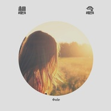
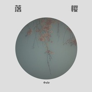
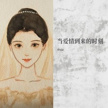
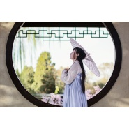
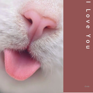
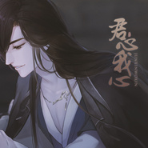

小vie
============================

|  |  |
| :--: | :-- |
| [ 小vie](https://i.xiami.com/vie) | **播放数**: 993208 **粉丝数**: 388 **评论数**: 77 **地区**: China 中国大陆 **风格**: 新世纪音乐 New Age, 国语流行 Mandarin Pop, 中国风 China-Wave, 轻音乐 Easy Listening, 中国民乐 Chinese Folk Music  |

## 档案

90后独立音乐人，如果喜欢我的音乐，可以购买专辑支持本人的创作，谢谢大家了

## 专辑

| 名称 | 语种 | 唱片公司 | 发行时间 | 专辑类别 | 专辑风格 |
| :--: | :-- | :-- | :-- | :-- | :-- |
| [ 想念](./albums/5022055300.md) | 纯音乐 | 独立发行 | 2020年11月29日 | 录音室专辑 | 流行 Pop, 轻音乐 Easy Listening |
| [ 落樱](./albums/5021852170.md) | 纯音乐 | 独立发行 | 2020年11月05日 | 录音室专辑 | 古风 GuFeng Music, 轻音乐 Easy Listening |
| [ 橙光游戏《只画水墨》插曲](./albums/5021221193.md) | 纯音乐 | 独立发行 | 2020年07月27日 | EP, 单曲 | 轻音乐 Easy Listening, 中国风 China-Wave, 古风 GuFeng Music |
| [ 樱花舞](./albums/5020685494.md) | 纯音乐 | 独立发行 | 2020年05月23日 | 录音室专辑 | 轻音乐 Easy Listening, 世界音乐 World Music, 古风 GuFeng Music |
| [ 当爱情到来的时候](./albums/2108399036.md) | 国语 | 独立发行 | 2020年05月03日 | 录音室专辑 | 韩国流行 K-Pop, 轻音乐 Easy Listening |
| [ 殇 - 寒江雪](./albums/2320310440.md) | 国语 | 独立发行 | 2020年02月25日 | EP, 单曲 | 古风 GuFeng Music, 中国风 China-Wave |
| [ 一抹残妆](./albums/2105750872.md) | 国语 | 独立发行 | 2020年01月17日 | EP, 单曲 | 世界音乐 World Music, 轻音乐 Easy Listening |
| [ 长安不良帅](./albums/2105445896.md) | 纯音乐 | 独立发行 | 2019年11月17日 | EP, 单曲 | 古风 GuFeng Music, 中国风 China-Wave |
| [ 橙光作品《帝姬战纪》定制曲](./albums/2105379140.md) | 国语 |  | 2019年10月26日 | EP, 单曲 | 古风 GuFeng Music, 国语流行 Mandarin Pop, 中国风 China-Wave |
| [ 醉相思](./albums/2105294595.md) | 国语 | 独立发行 | 2019年09月29日 | EP, 单曲 | 轻音乐 Easy Listening, 古风 GuFeng Music |
| [ 樱花道](./albums/2105207997.md) | 国语 | 独立发行 | 2019年09月03日 | EP, 单曲 | 轻音乐 Easy Listening, 世界音乐 World Music |
| [ 夏之恋](./albums/2104933589.md) | 国语 | 独立发行 | 2019年06月07日 | 录音室专辑 | 轻音乐 Easy Listening, 古风 GuFeng Music |
| [ 醉相思之煮茶论剑](./albums/2104806112.md) | 国语 | 独立发行 | 2019年04月25日 | 合集, 杂锦 | 中国风 China-Wave, 古风 GuFeng Music, 轻音乐 Easy Listening |
| [ 异鬼来袭](./albums/2104779660.md) | 国语 |  | 2019年04月15日 | EP, 单曲 | 世界音乐 World Music |
| [ 闪艺游戏《奏剑师》插曲](./albums/2104789654.md) | 国语 | 独立发行 | 2019年04月02日 | 原声带, 影视音乐 | 古风 GuFeng Music |
| [ 闪艺游戏《千释梦》原声带](./albums/2104643933.md) | 国语 |  | 2019年03月02日 | 原声带, 影视音乐 | 古风 GuFeng Music, 轻音乐 Easy Listening, 新世纪音乐 New Age |
| [ 橙光游戏《万妖纪年》主题曲原声带](./albums/2104629232.md) | 国语 | 独立发行 | 2019年02月25日 | 原声带, 影视音乐 | 轻音乐 Easy Listening, 世界音乐 World Music |
| [ I Love You](./albums/2104600112.md) | 国语 | 独立发行 | 2019年02月14日 | EP, 单曲 | 氛围音乐 Ambient, 轻音乐 Easy Listening, 世界音乐 World Music |
| [ 所谓伊人](./albums/2104522471.md) | 国语 | 独立发行 | 2019年01月22日 | 精选集 | 中国风 China-Wave, 古风 GuFeng Music |
| [ 白露为霜](./albums/2104520449.md) | 国语 |  | 2019年01月21日 | 精选集 | 古风 GuFeng Music, 中国风 China-Wave, 新世纪音乐 New Age |
| [ 若雪—橙光游戏《君心我心贰》巴扶木角色曲原声带](./albums/2104184473.md) | 国语 | 独立发行 | 2018年11月01日 | 原声带, 影视音乐 | 中国风 China-Wave, 古风 GuFeng Music |
| [ 永夜无昼—橙光游戏《君心我心贰》季永夜角色曲原声带](./albums/2104184492.md) | 国语 | 独立发行 | 2018年11月01日 | 原声带, 影视音乐 | 中国风 China-Wave, 古风 GuFeng Music |
| [ 封神—橙光游戏《君心我心贰》付萧然角色曲](./albums/2103923292.md) | 国语 | 独立发行 | 2018年08月14日 | 原声带, 影视音乐 | 古风 GuFeng Music, 游戏配乐 Video Game Music |
| [ 前世篇](./albums/2103835238.md) | 国语 | 独立发行 | 2018年07月24日 | EP, 单曲 | 轻音乐 Easy Listening, 古风 GuFeng Music, 新世纪音乐 New Age |
| [ 四季的乐章](./albums/2103675275.md) | 国语 | 独立发行 | 2018年04月01日 | 精选集 | 轻音乐流行 Light Pop, 轻音乐 Easy Listening |
| [ 九州天骄角色曲](./albums/2104113306.md) | 国语 | 独立发行 | 2018年03月18日 | EP, 单曲 | 古风 GuFeng Music, 中国风 China-Wave, 国语流行 Mandarin Pop |

## 评论

|  |  |  |  |
| :-- | :-- | :-- | :-- |
|  [虾米用户](https://emumo.xiami.com/u/187358406)  2020-11-06 05:17 赞(2) 踩(0) | 
明人不说暗话，我就看着这个猫进来的，就想撸它
 |
|  [虾米用户](https://emumo.xiami.com/u/426248966) 哦 2020-10-24 23:49 赞(0) 踩(0) | 
有才华
 |
|  [虾米用户](https://emumo.xiami.com/u/12703818)  2020-10-23 15:54 赞(0) 踩(0) | 
要怎么购买专辑呀。为什么刚才的留言一刷新就没了
 |
| ⇒ |  [虾米用户](https://emumo.xiami.com/u/7338404) 亲爱的粉丝听众朋友们大家... 2020-11-03 21:00 赞(0) 踩(0) | 
付费下载即可
 |
|  [虾米用户](https://emumo.xiami.com/u/12703818)  2020-10-23 15:51 赞(0) 踩(0) | 
要怎么购买专辑呀在哪里
 |
|  [虾米用户](https://emumo.xiami.com/u/409950407) 我还没想好要写什么... 2020-08-28 22:21 赞(0) 踩(0) | 
很喜欢你的音乐
 |
| ⇒ |  [虾米用户](https://emumo.xiami.com/u/7338404) 亲爱的粉丝听众朋友们大家... 2020-09-03 15:16 赞(0) 踩(0) | 
谢谢支持
 |
|  [虾米用户](https://emumo.xiami.com/u/434734835)  2019-12-27 13:01 赞(0) 踩(0) | 
哪里可以听到《中秋》？可以吗买？
 |
|  [虾米用户](https://emumo.xiami.com/u/1594596) ٩(๑´0`๑)۶ 2019-09-23 11:57 赞(0) 踩(0) | 
支持~~
 |
|  [虾米用户](https://emumo.xiami.com/u/361037631)  2019-03-24 14:59 赞(0) 踩(0) | 
******
 |
|  [虾米用户](https://emumo.xiami.com/u/3977843) 想得太多而读书太少~ 2019-03-11 21:34 赞(2) 踩(0) | 
爱猫的人啊，运气果然不会太差。跟着头像进来，音乐确实都很好听呢。
 |
|  [虾米用户](https://emumo.xiami.com/u/412740473)  2019-01-22 10:48 赞(2) 踩(0) | 
略，电台听歌太委屈，还是来虾米追v大咯
 |
|  [虾米用户](https://emumo.xiami.com/u/308774) 不说再见 2019-01-04 12:43 赞(2) 踩(0) | 
还有 这只猫也很喜欢~
 |
|  [虾米用户](https://emumo.xiami.com/u/308774) 不说再见 2019-01-04 11:40 赞(2) 踩(0) | 
每一首都很喜欢~~
 |
|  [虾米用户](https://emumo.xiami.com/u/159814316)  2018-12-28 15:39 赞(1) 踩(0) | 
我只能说,作者很强
 |
|  [虾米用户](https://emumo.xiami.com/u/52673225)   2018-12-15 04:47 赞(1) 踩(0) | 
太美了……
 |
|  [虾米用户](https://emumo.xiami.com/u/336983315)  2018-11-22 12:19 赞(1) 踩(0) | 
支持，好听
 |
|  [虾米用户](https://emumo.xiami.com/u/30527758) 学习是一种信仰 2018-10-03 17:39 赞(1) 踩(0) | 
支持
 |
|  [虾米用户](https://emumo.xiami.com/u/374157554) 繁华未放，红叶先生。QQ... 2018-05-31 00:31 赞(1) 踩(0) | 
Vie 大，为了这个梨花香我跑了好几个站！！！支持。。。买买买！
 |
|  [虾米用户](https://emumo.xiami.com/u/367977648)  2018-05-16 17:55 赞(2) 踩(0) | 
支持
 |
|  [虾米用户](https://emumo.xiami.com/u/320144456) 哪有人真的喜欢孤独，不过... 2018-05-09 18:01 赞(2) 踩(0) | 
清心静心
 |
|  [虾米用户](https://emumo.xiami.com/u/354922897)  2018-05-08 22:29 赞(2) 踩(0) | 
哈哈 为你用了虾米
 |
| ⇒ |  [虾米用户](https://emumo.xiami.com/u/7338404) 亲爱的粉丝听众朋友们大家... 2018-05-09 00:59 赞(0) 踩(0) | 
可以，这很铁
 |
| ⇒ |  [虾米用户](https://emumo.xiami.com/u/367977648)  2018-05-16 17:55 赞(0) 踩(0) | 
我也是
 |
| ⇒ |  [虾米用户](https://emumo.xiami.com/u/434734835)  2019-12-27 13:02 赞(0) 踩(0) | 
<q><b>小vie说：</b></q>
 |
|  [虾米用户](https://emumo.xiami.com/u/346706994) 这家伙很聪明什么也没留下... 2018-03-18 17:03 赞(1) 踩(0) | 
表白～打电话～想听秦殇
 |
|  [虾米用户](https://emumo.xiami.com/u/342594190)  2018-01-01 19:57 赞(1) 踩(0) | 
V我来表白惹&amp;lt;(￣3￣)&amp;gt; ~~
 |
|  [虾米用户](https://emumo.xiami.com/u/195289255) 棒棒哒！ 2016-06-29 10:31 赞(3) 踩(0) | 
小vie，我真的好崇拜你哦！我好喜欢你在绝世名伶里面的音乐，真是绝了。我从来没有听过那么好听的音乐，可惜网上没法下载。你能告诉我怎样才能下载那些曲子吗？非常感谢！（你是棒棒哒，加油！）♪(^∇^*)
 |
|  [虾米用户](https://emumo.xiami.com/u/43055800) 根号C就是NE！ 2016-04-29 22:55 赞(1) 踩(0) | 
路过~
 |
|  [虾米用户](https://emumo.xiami.com/u/8156500)  2015-09-05 19:30 赞(1) 踩(0) | 
好听
 |
|  [虾米用户](https://emumo.xiami.com/u/8128176) 好好活着 2015-03-30 15:05 赞(1) 踩(0) | 
美啊
 |
|  [虾米用户](https://emumo.xiami.com/u/3510038) 海天之恋 2015-03-01 12:08 赞(1) 踩(0) | 
头像照片好像我的小姨父耶！
 |
|  [虾米用户](https://emumo.xiami.com/u/16961759) 永远长不大的少年 2015-02-18 22:32 赞(1) 踩(0) | 
大神，新年快乐~0.0
 |
| ⇒ |  [虾米用户](https://emumo.xiami.com/u/7338404) 亲爱的粉丝听众朋友们大家... 2015-02-19 00:46 赞(0) 踩(0) | 
同乐同乐
 |
| ⇒ |  [虾米用户](https://emumo.xiami.com/u/7338404) 亲爱的粉丝听众朋友们大家... 2015-02-20 05:06 赞(0) 踩(0) | 
新年快乐啊，同乐
 |
|  [虾米用户](https://emumo.xiami.com/u/16961759) 永远长不大的少年 2015-02-12 14:27 赞(0) 踩(0) | 
非常棒╭(╯ε╰)╮
 |
|  [虾米用户](https://emumo.xiami.com/u/23844697)  2015-02-10 12:43 赞(0) 踩(0) | 
问月美哭了！！
 |
| ⇒ |  [虾米用户](https://emumo.xiami.com/u/7338404) 亲爱的粉丝听众朋友们大家... 2015-02-20 05:06 赞(0) 踩(0) | 
喜欢就好哈，新年快乐
 |
|  [虾米用户](https://emumo.xiami.com/u/10456970) You Will Be ... 2015-02-07 13:33 赞(0) 踩(0) | 
古风~~怒赞
 |
|  [虾米用户](https://emumo.xiami.com/u/6746699) 只是个不合格的Mixer 2015-02-06 23:56 赞(0) 踩(0) | 
徐娘早，咱来蹭关注咯。。
 |
| ⇒ |  [虾米用户](https://emumo.xiami.com/u/7338404) 亲爱的粉丝听众朋友们大家... 2015-02-20 05:07 赞(0) 踩(0) | 
你好
 |
|  [虾米用户](https://emumo.xiami.com/u/661140) 光河不息 2015-01-25 13:29 赞(0) 踩(0) | 
咦辣么多人是B站来的吗就我是在首页看见觉得封面真好看才进来的嘛_(:з」∠)_
 |
| ⇒ |  [虾米用户](https://emumo.xiami.com/u/7338404) 亲爱的粉丝听众朋友们大家... 2015-01-25 16:29 赞(0) 踩(0) | 
有些不是。。。部分人是
 |
|  [虾米用户](https://emumo.xiami.com/u/6783983)  2014-12-18 16:04 赞(0) 踩(0) | 
看了下大部分都是B站摸过来的，难道只有我是极简主义-——新世纪....这样摸过来的么orz
 |
|  [虾米用户](https://emumo.xiami.com/u/26176409) 働きたくないな。 2014-11-29 03:53 赞(0) 踩(0) | 
我去，不放自己照片放我马撸男神照片...
 |
| ⇒ |  [虾米用户](https://emumo.xiami.com/u/7338404) 亲爱的粉丝听众朋友们大家... 2014-11-30 19:05 赞(0) 踩(0) | 
这是金秀贤好不好，来自猩猩的你
 |
| ⇒ |  [虾米用户](https://emumo.xiami.com/u/26176409) 働きたくないな。 2014-11-30 19:17 赞(0) 踩(0) | 
<q><b>小vie说：</b></q>
 |
|  [虾米用户](https://emumo.xiami.com/u/4356202) 猥琐发育别浪 2014-11-06 23:36 赞(0) 踩(0) | 
哥，您这唏嘘的眼神忒酷了
 |
| ⇒ |  [虾米用户](https://emumo.xiami.com/u/7338404) 亲爱的粉丝听众朋友们大家... 2014-11-08 01:50 赞(0) 踩(0) | 
我擦
 |
|  [虾米用户](https://emumo.xiami.com/u/16745497) 我还没想好要写什么... 2014-09-26 12:32 赞(1) 踩(0) | 
我想吐槽一下<a href="http://emumo.xiami.com/u/7338404" target="_blank" rel="nofollow" name_card="7338404">@小vie</a> 头像还能卖萌点嘛.233
 |
| ⇒ |  [虾米用户](https://emumo.xiami.com/u/4935021) 没有音乐不能呼吸、 2014-09-26 20:14 赞(0) 踩(0) | 
伤得不轻、
 |
|  [虾米用户](https://emumo.xiami.com/u/7338404) 亲爱的粉丝听众朋友们大家... 2014-09-23 14:47 赞(0) 踩(0) | 
= =
 |
| ⇒ |  [虾米用户](https://emumo.xiami.com/u/4935021) 没有音乐不能呼吸、 2014-09-26 20:19 赞(0) 踩(0) | 
头像这是感冒了么o.o..换张吧
 |
| ⇒ |  [虾米用户](https://emumo.xiami.com/u/7338404) 亲爱的粉丝听众朋友们大家... 2014-10-11 03:31 赞(0) 踩(0) | 
<q><b>star fragmen说：</b></q>
 |
| ⇒ |  [虾米用户](https://emumo.xiami.com/u/4935021) 没有音乐不能呼吸、 2014-10-14 16:53 赞(0) 踩(0) | 
<q><b>小vie说：</b></q>
 |
|  [虾米用户](https://emumo.xiami.com/u/35062303) 一个喜欢唱歌的小女孩 2014-08-26 21:58 赞(0) 踩(0) | 
全力支持！
 |
|  [虾米用户](https://emumo.xiami.com/u/4935021) 没有音乐不能呼吸、 2014-08-21 10:40 赞(3) 踩(0) | 
推荐个艺人给小vie，Pianoboy，看好你~
 |
| ⇒ |  [虾米用户](https://emumo.xiami.com/u/16745497) 我还没想好要写什么... 2014-08-21 10:49 赞(0) 踩(0) | 
点赞狂魔.233
 |
|  [虾米用户](https://emumo.xiami.com/u/11643877) 姑且听之 2014-08-12 14:56 赞(1) 踩(0) | 
强力支持~~
 |
|  [虾米用户](https://emumo.xiami.com/u/7859698) 人类真是太脆弱了 2014-08-11 16:38 赞(4) 踩(0) | 
从B站滚过来的好好加油！
 |
| ⇒ |  [虾米用户](https://emumo.xiami.com/u/7338404) 亲爱的粉丝听众朋友们大家... 2014-08-21 10:00 赞(0) 踩(0) | 
你好啊
 |
| ⇒ |  [虾米用户](https://emumo.xiami.com/u/66925948)  2015-09-17 17:47 赞(0) 踩(0) | 
加油
 |
|  [虾米用户](https://emumo.xiami.com/u/4935021) 没有音乐不能呼吸、 2014-08-06 11:07 赞(0) 踩(0) | 
!!
 |
|  [虾米用户](https://emumo.xiami.com/u/231797) 活着真好 好好活着 2014-08-04 19:34 赞(0) 踩(0) | 
来了~
 |
|  [虾米用户](https://emumo.xiami.com/u/1700002) V5_ORZZZZZ 2014-08-04 18:51 赞(1) 踩(0) | 
绝赞
 |
|  [虾米用户](https://emumo.xiami.com/u/7680420) 纯音控 2014-08-04 17:05 赞(0) 踩(0) | 
暮色赞啊~
 |
|  [虾米用户](https://emumo.xiami.com/u/10337057) 独自穿行于空灵之境 2014-08-04 16:24 赞(0) 踩(0) | 
膜拜~~~
 |
|  [虾米用户](https://emumo.xiami.com/u/16745497) 我还没想好要写什么... 2014-08-04 16:20 赞(1) 踩(0) | 
<a href="http://emumo.xiami.com/u/1700002" target="_blank" rel="nofollow" name_card="1700002">@神泣</a> <a href="http://emumo.xiami.com/u/4935021" target="_blank" rel="nofollow" name_card="4935021">@遗忘</a> <a href="http://emumo.xiami.com/u/9161767" target="_blank" rel="nofollow" name_card="9161767">@Landf***</a> <a href="http://emumo.xiami.com/u/7680420" target="_blank" rel="nofollow" name_card="7680420">@沉默Panda</a> <a href="http://emumo.xiami.com/u/231797" target="_blank" rel="nofollow" name_card="231797">@空110529</a>~快来关注、233
 |
| ⇒ |  [虾米用户](https://emumo.xiami.com/u/4935021) 没有音乐不能呼吸、 2014-08-06 11:04 赞(0) 踩(0) | 
谢庭子\^o^/ ~
 |
| ⇒ |  [虾米用户](https://emumo.xiami.com/u/16745497) 我还没想好要写什么... 2014-08-06 12:22 赞(0) 踩(0) | 
<q><b>star fragmen说：</b></q>
 |
| ⇒ |  [虾米用户](https://emumo.xiami.com/u/4935021) 没有音乐不能呼吸、 2014-08-06 13:51 赞(0) 踩(0) | 
<q><b>MusicTingzi说：</b></q>
 |
| ⇒ |  [虾米用户](https://emumo.xiami.com/u/7338404) 亲爱的粉丝听众朋友们大家... 2014-08-17 05:17 赞(0) 踩(0) | 
<q><b>star fragmen说：</b></q>
 |
| ⇒ |  [虾米用户](https://emumo.xiami.com/u/4935021) 没有音乐不能呼吸、 2014-08-18 09:45 赞(0) 踩(0) | 
<q><b>小vie说：</b></q>
 |
|  [虾米用户](https://emumo.xiami.com/u/7338404) 亲爱的粉丝听众朋友们大家... 2014-08-04 16:16 赞(2) 踩(0) | 
我刚入驻了虾米音乐人，欢迎大家来我的个人主页，收听我的最新音乐
 |
|  [虾米用户](https://emumo.xiami.com/u/16745497) 我还没想好要写什么... 2014-08-04 15:57 赞(0) 踩(0) | 
膜拜一下V君大大。
 |
| ⇒ |  [虾米用户](https://emumo.xiami.com/u/9161767)  2014-08-04 16:36 赞(0) 踩(0) | 
我还以为是你呢~~
 |
| ⇒ |  [虾米用户](https://emumo.xiami.com/u/16745497) 我还没想好要写什么... 2014-08-04 16:42 赞(0) 踩(0) | 
<q><b>l&amp;fff说：</b></q>
 |
