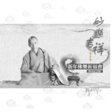
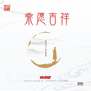

印良法师
============================

|  |  |
| :--: | :-- |
| [ 印良法师](https://i.xiami.com/yinliangfashi) | **播放数**: 12484616 **粉丝数**: 3800 **评论数**: 213 **地区**: China 中国大陆 **风格**: 国语流行 Mandarin Pop, 佛教音乐 Buddhist Music  |

## 档案

印良法师,号:天几,字:印良。 医易世家,世袭祖德,自幼参学儒释道文化,研习禅、律、净、密四宗佛学文化,幼年天津大悲禅院皈依,而立武夷山天心永乐禅寺披剃,太姥山平兴寺律坛得戒。常年历行佛学文化传播及传统文化推广,孜孜不倦,示德身行。誓承如来家业,发愿利乐有情。

## 专辑

| 名称 | 语种 | 唱片公司 | 发行时间 | 专辑类别 | 专辑风格 |
| :--: | :-- | :-- | :-- | :-- | :-- |
| [ 妙乐吉祥](./albums/1131324719.md) | 国语 | 独立发行 | 2015年05月18日 | 录音室专辑 | 当代唱作人 Contemporary Singer-Songwriter, 国语流行 Mandarin Pop, 华语唱作人 Chinese Singer-Songwriter, 佛教音乐 Buddhist Music |
| [ 恒愿吉祥](./albums/1431329830.md) | 国语 | 独立发行 | 2011年07月15日 | 录音室专辑 | 佛教音乐 Buddhist Music |
| [ 乘愿吉祥](./albums/831323395.md) | 国语 | 独立发行 | 2010年12月15日 | 录音室专辑 | 佛教音乐 Buddhist Music |

## 评论

|  |  |  |  |
| :-- | :-- | :-- | :-- |
|  [虾米用户](https://emumo.xiami.com/u/358104299) 悲观的唯心存在现实解构虚... 2020-11-12 10:46 赞(1) 踩(0) | 
41718
 |
|  [虾米用户](https://emumo.xiami.com/u/420716606)  2020-08-20 00:31 赞(0) 踩(0) | 
很好听，感觉浮躁的心平静下来了 
 |
|  [虾米用户](https://emumo.xiami.com/u/444111831)  2020-07-13 19:22 赞(0) 踩(0) | 
众里寻他千百度
 |
|  [虾米用户](https://emumo.xiami.com/u/407482120) 试着放下执念  善待自己 2020-06-26 01:06 赞(0) 踩(0) | 
喜欢
 |
|  [虾米用户](https://emumo.xiami.com/u/407893288) 楠楼金阙工作室 2020-06-25 17:39 赞(0) 踩(0) | 
每次心神不定都会听您的佛歌愿你身体健康  
 |
|  [虾米用户](https://emumo.xiami.com/u/409613305)  2020-04-29 20:28 赞(1) 踩(0) | 
爱听印良法师的梵音，听着听着莫名的心疼。南无阿弥陀佛   
 |
|  [虾米用户](https://emumo.xiami.com/u/442574065)  2020-04-28 20:10 赞(0) 踩(0) | 
法师，我也是学佛法的。很喜欢你的作品。   
 |
|  [虾米用户](https://emumo.xiami.com/u/36072987)  2020-04-15 22:35 赞(2) 踩(0) | 
你的歌曲有治愈的正能量。感恩！也许你还可以给我们讲讲佛法，这也是很殊圣的功德。期待再出新歌。
 |
|  [虾米用户](https://emumo.xiami.com/u/341329327) hxw ~1582552... 2020-02-05 16:17 赞(0) 踩(0) | 
      
 |
|  [虾米用户](https://emumo.xiami.com/u/344233300) 生命不能归零， 也不能重... 2020-01-27 17:27 赞(0) 踩(0) | 
特别喜欢听这首（放下），每当心情不好时，听听印良法师的歌，就能释然。
 |
|  [虾米用户](https://emumo.xiami.com/u/327132454)  2020-01-09 17:50 赞(1) 踩(0) | 
报道下   每天要循环播放好几遍
 |
|  [虾米用户](https://emumo.xiami.com/u/327132454)  2020-01-08 22:49 赞(1) 踩(0) | 
感恩法师，阿弥陀佛，在这浮躁的尘世里能聆听到这纯净纯粹的佛音，净化自己的心灵
 |
|  [虾米用户](https://emumo.xiami.com/u/423185559) 自由行走的花 2019-12-23 19:37 赞(2) 踩(0) | 
大师您好，三年前就听您的佛歌，每天都循环听，百听不厌，这些空灵、曼妙的佛歌一直陪伴着我和家人，有时会情不自禁落下眼泪 。特别是在小妹病重期间，24小时都听您的歌声，来解除病痛，直到安静的离开。感谢大师！ 感恩大师！ 有缘听到您的歌，喜欢您的声音。南无阿弥陀佛！   
 |
|  [虾米用户](https://emumo.xiami.com/u/434342173)  2019-12-20 13:58 赞(0) 踩(0) | 
阿弥陀佛   顶礼师父   
 |
|  [虾米用户](https://emumo.xiami.com/u/433550739)  2019-12-16 09:19 赞(0) 踩(0) | 
阿弥陀佛！感恩法师   
 |
|  [虾米用户](https://emumo.xiami.com/u/325205625)  2019-11-30 08:33 赞(0) 踩(0) | 
，
 |
|  [虾米用户](https://emumo.xiami.com/u/255262529)  2019-11-03 04:07 赞(0) 踩(0) | 
法师发几张佛像图片
 |
|  [虾米用户](https://emumo.xiami.com/u/428122358)  2019-09-13 23:09 赞(2) 踩(0) | 
在其他大悲咒看到的  各位师兄看看对不对
 |
| ⇒ |  [虾米用户](https://emumo.xiami.com/u/428122358)  2019-09-13 23:17 赞(0) 踩(0) | 
南无阿弥陀佛 南无阿弥陀佛 南无阿弥陀佛 南无大悲观世音菩萨 南无大悲观世音菩萨 南无大悲观世音菩萨 
 |
|  [虾米用户](https://emumo.xiami.com/u/428122358)  2019-09-13 23:06 赞(3) 踩(0) | 
大悲咒全文大意皈依三宝，皈依大悲渡世的观世音菩萨，世间感受一切恐怖病苦的众生，要誓愿宣说广大圆满无碍大悲救苦救难的真言，要看破生死烦恼，了悟真实光明，皈依於大慈大悲、随心自在的观世菩萨。祈求一切圆满，不受一切鬼卒的侵害，皈命于为观世音菩萨请说广大圆满无碍大悲心陀罗尼的本尊——千光王静住如来。能得清净圆明的光辉，能除无明挂碍的烦恼，要修得无上的功德，方不致沉沦在无边执著的苦海之中。大慈大悲的观世音菩萨，常以诸佛菩萨的化身，悠游于大千世界，密放神通，随缘化渡，一如菩萨显化的狮子王法身，引导有缘众生远离罪恶，忘却生死烦恼，皈向真实光明。大慈大悲的观世音菩萨以清净无垢圣洁莲华的法身，顺时顺教，使众
 |
|  [虾米用户](https://emumo.xiami.com/u/428722999) 看破，放下，回家. 2019-08-25 20:09 赞(3) 踩(0) | 
不知道说什么，感恩法师，让我听见您的佛音相见恨晚，如果早点听见您的声音。我该少了多少烦恼。阿弥陀佛        。总之…
 |
|  [虾米用户](https://emumo.xiami.com/u/403770333) 在歌声中寻找快乐！ 2019-05-19 19:32 赞(4) 踩(0) | 
阿弥陀佛！持续关注！
 |
|  [虾米用户](https://emumo.xiami.com/u/356316737)  2019-05-08 00:41 赞(3) 踩(0) | 
听印良法师的歌可以静化心灵，善与恶、愛与恨，就在一念之间。音乐配以古筝伴奏，听起来的效果可能会更加舒心。以上纯属个人感觉，如有冒犯之处，还望谅解。
 |
|  [虾米用户](https://emumo.xiami.com/u/361037631)  2019-04-05 09:00 赞(3) 踩(0) | 
******
 |
|  [虾米用户](https://emumo.xiami.com/u/9802314) 健康不是第一，而是唯一 2019-03-28 14:21 赞(3) 踩(0) | 
  
 |
|  [虾米用户](https://emumo.xiami.com/u/375098420)  2019-03-25 10:15 赞(4) 踩(0) | 
率真自然
 |
|  [虾米用户](https://emumo.xiami.com/u/35285775)  2019-03-21 21:57 赞(3) 踩(0) | 
茶 禅 一 念
 |
|  [虾米用户](https://emumo.xiami.com/u/373319363)  2019-03-20 22:48 赞(3) 踩(0) | 
去年几个月里我听了两千多遍僧语 真是很喜欢了 ……
 |
|  [虾米用户](https://emumo.xiami.com/u/353245433) 一直在寻找的路上 2019-03-15 10:32 赞(4) 踩(0) | 
《极乐》跟《滴答，滴答》是同首歌吗？
 |
|  [虾米用户](https://emumo.xiami.com/u/353897512)  2019-03-12 22:18 赞(4) 踩(0) | 
为什么我觉得音不对
 |
|  [虾米用户](https://emumo.xiami.com/u/346952592) 行如风  做如松  最美... 2019-02-16 19:15 赞(4) 踩(0) | 
虾米音乐——藏龙卧虎之地！
 |
|  [虾米用户](https://emumo.xiami.com/u/342151367)  2019-02-07 13:55 赞(3) 踩(0) | 
法师大慈大悲。南(nā)无(mó)阿弥陀佛
 |
|  [虾米用户](https://emumo.xiami.com/u/400822237)  2019-01-19 20:17 赞(4) 踩(0) | 
******
 |
|  [虾米用户](https://emumo.xiami.com/u/376638209)  2019-01-04 16:45 赞(3) 踩(0) | 
I like peace
 |
|  [虾米用户](https://emumo.xiami.com/u/409859848)  2018-12-21 12:49 赞(3) 踩(0) | 
阿弥陀佛，
 |
|  [虾米用户](https://emumo.xiami.com/u/378378693) 音乐，快乐的源泉 2018-11-14 16:27 赞(4) 踩(0) | 
法师好，愿法轮常转，天地生辉，阿弥陀佛，大慈大悲。
 |
| ⇒ |  [虾米用户](https://emumo.xiami.com/u/378378693) 音乐，快乐的源泉 2019-01-06 15:07 赞(0) 踩(0) | 
谢谢
 |
|  [虾米用户](https://emumo.xiami.com/u/408491333)  2018-11-13 09:50 赞(2) 踩(0) | 
《放下》是我非常喜欢的一首歌，感恩它带来的宁静与平和！ 
 |
|  [虾米用户](https://emumo.xiami.com/u/311565210)  2018-11-12 06:15 赞(1) 踩(0) | 
oe^_^既然h
 |
|  [虾米用户](https://emumo.xiami.com/u/305635074) 无言 2018-11-11 23:05 赞(2) 踩(0) | 
愿一切众生离苦得乐，回头是岸。还自本处！见自本来清净法身！究竟解脱！合十！  
 |
|  [虾米用户](https://emumo.xiami.com/u/405540982) 放下，才能心静 2018-11-01 12:12 赞(1) 踩(0) | 
  
 |
|  [虾米用户](https://emumo.xiami.com/u/406133957)  2018-10-29 07:55 赞(1) 踩(0) | 
我喜欢听放下、很好听、只是我一听心里感觉很难过不知道为什么
 |
|  [虾米用户](https://emumo.xiami.com/u/404861402)  2018-10-05 08:28 赞(1) 踩(0) | 
好听，每天一早首选，南无阿弥陀佛
 |
|  [虾米用户](https://emumo.xiami.com/u/305071888)  2018-09-05 00:23 赞(1) 踩(0) | 
听法师的大悲咒，修心
 |
|  [虾米用户](https://emumo.xiami.com/u/403096647)  2018-09-01 10:29 赞(0) 踩(0) | 
感谢印良法师，   你的歌声让我的心灵得到了暂时的平静，但以后的路我却不知道咋走下去。
 |
|  [虾米用户](https://emumo.xiami.com/u/402074828)  2018-08-26 21:12 赞(1) 踩(0) | 
愿印良法师终成觉行大圆满果位
 |
|  [虾米用户](https://emumo.xiami.com/u/345217399)  2018-08-26 19:38 赞(0) 踩(0) | 
法师，可否收我为徒，对尘世毫无眷恋
 |
|  [虾米用户](https://emumo.xiami.com/u/307576547) 保持一颗清净心❤ 2018-07-29 23:16 赞(28) 踩(0) | 
听印良法师的歌是被他的帅惊艳到了，点进去进歌发现歌声真的是天籁之声，大悲咒和放下非常好听，放下听哭了，由于文笔不好，不懂怎么表达我内心的欣喜非常感谢你的歌声，感恩有缘分听到你的歌❤
 |
|  [虾米用户](https://emumo.xiami.com/u/50914480) 转弯只为遇见你 2018-07-27 08:45 赞(2) 踩(0) | 
大师，我听佛乐，为何会哭
 |
|  [虾米用户](https://emumo.xiami.com/u/338950518) 我还没想好要写什么... 2018-07-23 10:44 赞(0) 踩(0) | 
好听
 |
|  [虾米用户](https://emumo.xiami.com/u/289153608)  2018-07-14 12:30 赞(0) 踩(0) | 
法师好 非常喜欢您的大悲咒。顺便有个问题想请教大师，我以前在一段视频里听到过一首佛教歌曲，很喜欢那首歌，但因为听不懂歌词也不知道歌名，但我能哼唱出来，想借此机会请大师指教，不知道怎么联系您
 |
|  [虾米用户](https://emumo.xiami.com/u/360565200)  2018-06-17 06:03 赞(1) 踩(0) | 
有机会定当拜会贵寺
 |
|  [虾米用户](https://emumo.xiami.com/u/374708358)  2018-06-06 23:58 赞(0) 踩(0) | 
感恩   阿弥陀佛   
 |
|  [虾米用户](https://emumo.xiami.com/u/374708358)  2018-06-06 23:56 赞(1) 踩(0) | 
感恩印良法师的佛歌和大悲咒我非常喜欢，太好听了。听着听着心好平静，好法喜。感恩
 |
|  [虾米用户](https://emumo.xiami.com/u/338970393)  2018-06-06 20:47 赞(0) 踩(0) | 
阿弥陀佛
 |
|  [虾米用户](https://emumo.xiami.com/u/374661994) 开心过好每一天。 2018-06-04 23:35 赞(0) 踩(0) | 
感谢法师：我的心情非常平静,听了后，愿佛祖平安。
 |
|  [虾米用户](https://emumo.xiami.com/u/367095253) 幸福快乐的一天从关爱家人... 2018-05-29 20:10 赞(1) 踩(0) | 
  
 |
|  [虾米用户](https://emumo.xiami.com/u/43518259)  2018-05-28 09:35 赞(1) 踩(0) | 
阿彌陀佛
 |
|  [虾米用户](https://emumo.xiami.com/u/358807675)  2018-05-27 09:07 赞(1) 踩(0) | 
听了法师的歌唱，法喜充满。末学格外喜欢整支歌曲里流淌着修行者高深莫测的修行功夫。太棒了！怎么跟唱，也唱不出原唱的味道   南无阿弥陀佛！是必须的   
 |
|  [虾米用户](https://emumo.xiami.com/u/353353403)  2018-05-20 07:59 赞(2) 踩(0) | 
印良法师佛歌我都收藏了，每天都听
 |
|  [虾米用户](https://emumo.xiami.com/u/325679254)  2018-05-20 00:05 赞(2) 踩(0) | 
您的大悲咒演唱的极致，我特别喜欢
 |
|  [虾米用户](https://emumo.xiami.com/u/261256670)  2018-04-08 18:22 赞(3) 踩(0) | 
好听，   
 |
|  [虾米用户](https://emumo.xiami.com/u/354875243)  2018-04-03 05:34 赞(2) 踩(0) | 
南无阿弥陀佛
 |
|  [虾米用户](https://emumo.xiami.com/u/344962354)   2018-03-29 22:41 赞(11) 踩(0) | 
好帅，但是满眼忧伤，跟我的照片很像！心里很多故事，法师也是人，只是隐藏在心里，但是眼里还是流露出来！也是一个写满故事的人！
 |
|  [虾米用户](https://emumo.xiami.com/u/351527123)  2018-03-20 18:21 赞(2) 踩(0) | 
  
 |
|  [虾米用户](https://emumo.xiami.com/u/8542160)  2018-03-02 11:13 赞(2) 踩(0) | 
愿法师永远安康吉祥！温暖的法音。
 |
|  [虾米用户](https://emumo.xiami.com/u/256105604)  2018-02-27 20:04 赞(1) 踩(0) | 
喜欢印良法师的歌，他的歌都好听。愿法师永远安康吉祥!
 |
|  [虾米用户](https://emumo.xiami.com/u/296160317)  2018-02-27 09:15 赞(1) 踩(0) | 
太爱印良法师了
 |
|  [虾米用户](https://emumo.xiami.com/u/2100564)  2018-02-17 17:24 赞(1) 踩(0) | 
感恩法師，以妙音聲，普應有情，同成佛道，南無阿彌陀佛！！！
 |
|  [虾米用户](https://emumo.xiami.com/u/347369383)  2018-02-14 12:04 赞(1) 踩(0) | 
感恩您，师父，有幸听到您的法音。
 |
|  [虾米用户](https://emumo.xiami.com/u/313672518) 音乐是世界语言，是每个人... 2018-02-09 22:14 赞(1) 踩(0) | 
感恩法师 带来这么好听的佛歌，听了可以修身养性！
 |
|  [虾米用户](https://emumo.xiami.com/u/300587674) 玉出昆岗 2018-02-04 15:14 赞(1) 踩(0) | 
阿弥陀佛         
 |
|  [虾米用户](https://emumo.xiami.com/u/340062337)  2018-01-27 20:40 赞(1) 踩(0) | 
感恩师父   ，净化心灵，温暖满满感恩   
 |
|  [虾米用户](https://emumo.xiami.com/u/332381723)  2018-01-16 12:20 赞(2) 踩(0) | 
顶礼赞叹印良法师！    劝世佛歌，温暖人心，净化心灵，感恩不尽！   
 |
|  [虾米用户](https://emumo.xiami.com/u/344861503)  2018-01-15 13:18 赞(2) 踩(0) | 
我喜欢你印良法师，南无阿弥陀佛
 |
|  [虾米用户](https://emumo.xiami.com/u/344861503)  2018-01-15 13:16 赞(2) 踩(0) | 
南无阿弥陀佛，南无阿弥陀佛
 |
|  [虾米用户](https://emumo.xiami.com/u/307236363)  2018-01-05 16:22 赞(1) 踩(0) | 
印良法师无论你唱什么我都喜欢 
 |
|  [虾米用户](https://emumo.xiami.com/u/113293640) 愛這世界哪夠愛妳偉大 2017-12-30 23:25 赞(4) 踩(0) | 
最喜欢听《汉文心经》。
 |
|  [虾米用户](https://emumo.xiami.com/u/314263753) 流年川暗度，往事月空明 2017-11-17 22:37 赞(2) 踩(0) | 
法师新的音乐作品，在乐善妙觉院看到有更新一些，期待看到早日发行，感谢法师以佛法以声音渡众生，功德无量。
 |
|  [虾米用户](https://emumo.xiami.com/u/292032572) 让往事随风 2017-11-17 19:13 赞(2) 踩(0) | 
好听
 |
|  [虾米用户](https://emumo.xiami.com/u/13647499)  2017-11-12 23:06 赞(3) 踩(0) | 
怎么没有《僧语》，非常喜欢的。 
 |
|  [虾米用户](https://emumo.xiami.com/u/332333018) 我是谁？ 2017-10-29 23:57 赞(2) 踩(0) | 
太好听了
 |
|  [虾米用户](https://emumo.xiami.com/u/331247690)  2017-10-22 10:23 赞(1) 踩(0) | 
静心
 |
|  [虾米用户](https://emumo.xiami.com/u/297585746)  2017-10-10 19:15 赞(1) 踩(0) | 
法师，唱得真好听。赞
 |
|  [虾米用户](https://emumo.xiami.com/u/48938158)   2017-10-02 06:21 赞(1) 踩(0) | 
他唱的真好听
 |
|  [虾米用户](https://emumo.xiami.com/u/259447140) 据说音乐可以和灵魂产生共... 2017-09-30 22:29 赞(0) 踩(0) | 
南无阿弥佗佛 
 |
|  [虾米用户](https://emumo.xiami.com/u/301505829)   2017-09-20 15:30 赞(1) 踩(0) | 
   
 |
|  [虾米用户](https://emumo.xiami.com/u/274804165)  2017-09-13 08:13 赞(2) 踩(0) | 
太好听了！能量满满！
 |
|  [虾米用户](https://emumo.xiami.com/u/322182709)  2017-09-08 10:05 赞(1) 踩(0) | 
感恩师父   
 |
|  [虾米用户](https://emumo.xiami.com/u/321092275)   2017-09-06 09:55 赞(2) 踩(0) | 
好听
 |
|  [虾米用户](https://emumo.xiami.com/u/234328038)  2017-08-27 00:32 赞(1) 踩(0) | 

 |
|  [虾米用户](https://emumo.xiami.com/u/48150666)  2017-08-08 15:53 赞(3) 踩(0) | 
感恩
 |
|  [虾米用户](https://emumo.xiami.com/u/317297302)  2017-08-05 06:57 赞(2) 踩(0) | 
好喜欢听&amp;ldquo;放下&amp;rdquo;这首歌曲。一遍一遍听。。。
 |
|  [虾米用户](https://emumo.xiami.com/u/302602464)  2017-07-31 19:37 赞(20) 踩(0) | 
法师，您的佛歌，都很好听，让人感到一种宁静与清凉。在土豆视频中己下载了您的《回家》，非常不错。祝法师六时吉祥，诸事顺心，今生成就！
 |
| ⇒ |  [虾米用户](https://emumo.xiami.com/u/302602464)  2018-02-23 10:43 赞(0) 踩(0) | 
谢谢风轻云淡！阿弥陀佛！
 |
| ⇒ |  [虾米用户](https://emumo.xiami.com/u/302602464)  2018-02-23 10:43 赞(0) 踩(0) | 
谢谢关注，阿弥陀佛！
 |
| ⇒ |  [虾米用户](https://emumo.xiami.com/u/302602464)  2018-02-23 10:47 赞(0) 踩(0) | 
谢谢似水流年！阿弥陀佛！
 |
|  [虾米用户](https://emumo.xiami.com/u/275402904)  2017-07-31 14:52 赞(3) 踩(0) | 
喜欢印良法师的《放下》   
 |
|  [虾米用户](https://emumo.xiami.com/u/315908910)  2017-07-29 18:07 赞(3) 踩(0) | 
我最喜欢听印良法师的《放下》！ 
 |
|  [虾米用户](https://emumo.xiami.com/u/310175933)  2017-07-14 23:38 赞(4) 踩(0) | 
好！向法师致敬...
 |
|  [虾米用户](https://emumo.xiami.com/u/275154966)  2017-07-14 15:55 赞(3) 踩(0) | 
     
 |
|  [虾米用户](https://emumo.xiami.com/u/307516648)  2017-07-13 17:59 赞(3) 踩(0) | 
我想出家  
 |
| ⇒ |  [虾米用户](https://emumo.xiami.com/u/222754783) 我的世界~极乐净土。 2017-07-17 08:47 赞(0) 踩(0) | 
修行不一定出家出家众一般是已了脱在家的因缘，出家为了更好地化度众生。在家众因为有一些情缘未了，所以还情缘债，在家修行。真修行，出家在家都一样，老实念佛，求生西方极乐世界就好！  
 |
| ⇒ |  [虾米用户](https://emumo.xiami.com/u/307516648)  2017-09-08 23:03 赞(0) 踩(0) | 
<q><b>阿弥陀佛说：</b></q>
 |
| ⇒ |  [虾米用户](https://emumo.xiami.com/u/434342173)  2019-12-20 14:00 赞(0) 踩(0) | 
<q><b>阿弥陀佛说：</b></q>
 |
|  [虾米用户](https://emumo.xiami.com/u/310753923)  2017-07-09 03:20 赞(2) 踩(0) | 
  
 |
|  [虾米用户](https://emumo.xiami.com/u/309181854)  2017-07-02 17:35 赞(1) 踩(0) | 
  
 |
| ⇒ |  [虾米用户](https://emumo.xiami.com/u/306634600)  2017-07-08 08:37 赞(0) 踩(0) | 
  天籁之音，沁入心脾
 |
|  [虾米用户](https://emumo.xiami.com/u/113293640) 愛這世界哪夠愛妳偉大 2017-06-29 00:16 赞(2) 踩(0) | 
  
 |
|  [虾米用户](https://emumo.xiami.com/u/222754783) 我的世界~极乐净土。 2017-06-15 15:35 赞(4) 踩(0) | 
想必师父的佛音渡人无数，至少我是中之一。  佛菩萨护佑家师~印良法师。  
 |
|  [虾米用户](https://emumo.xiami.com/u/222754783) 我的世界~极乐净土。 2017-06-14 11:33 赞(3) 踩(0) | 
聆听一首佛歌《放下》，与佛结缘且路转粉，顶礼印良法师   
 |
|  [虾米用户](https://emumo.xiami.com/u/302334238)  2017-06-06 15:58 赞(2) 踩(0) | 
喜欢
 |
|  [虾米用户](https://emumo.xiami.com/u/302334238)  2017-06-06 15:56 赞(2) 踩(0) | 
超喜欢任良法师的歌曲
 |
|  [虾米用户](https://emumo.xiami.com/u/287446596)  2017-06-04 10:07 赞(1) 踩(0) | 

 |
|  [虾米用户](https://emumo.xiami.com/u/140849172)  2017-06-03 20:37 赞(2) 踩(0) | 
是的听到法师的声音，自然心就静了下来，阿弥陀佛
 |
|  [虾米用户](https://emumo.xiami.com/u/291376209)  2017-05-30 20:01 赞(1) 踩(0) | 

 |
|  [虾米用户](https://emumo.xiami.com/u/192636809) 好运连连开心无限 2017-05-29 11:26 赞(2) 踩(0) | 
听你的歌曲整个人都平静了。念了几遍准提咒和六字真言，晚上做梦梦见一个白色漩涡，自己被那个漩涡从地上吸到上面的世界。白茫茫的一片，不知道去了哪里。不知道是哪个咒起了作用。那白光照的好舒服。
 |
|  [虾米用户](https://emumo.xiami.com/u/50274214)  2017-05-24 22:15 赞(2) 踩(0) | 
感恩 南无阿弥陀佛   
 |
|  [虾米用户](https://emumo.xiami.com/u/295662265)  2017-05-17 17:57 赞(2) 踩(0) | 
听到他的声音心很静
 |
|  [虾米用户](https://emumo.xiami.com/u/247984731) 音乐可以净化心灵 洗涤时... 2017-05-11 05:41 赞(2) 踩(0) | 
大师的声音 是天外之音 进化心灵。
 |
|  [虾米用户](https://emumo.xiami.com/u/288681547)  2017-05-08 19:33 赞(2) 踩(0) | 
特别喜欢，很好听！
 |
|  [虾米用户](https://emumo.xiami.com/u/294303695)  2017-05-08 15:38 赞(3) 踩(0) | 
不客气，能够听到大师的大悲咒歌曲，是个荣幸。谢谢，佛光普照！
 |
|  [虾米用户](https://emumo.xiami.com/u/192728899)  2017-04-22 12:57 赞(0) 踩(0) | 

 |
|  [虾米用户](https://emumo.xiami.com/u/248066927)  2017-04-21 01:18 赞(1) 踩(0) | 
天籟 
 |
|  [虾米用户](https://emumo.xiami.com/u/286431189)  2017-04-06 15:24 赞(2) 踩(0) | 
阿弥陀佛，顶礼印良法师
 |
|  [虾米用户](https://emumo.xiami.com/u/283135560)  2017-03-26 23:37 赞(2) 踩(0) | 
有种清静的感觉
 |
|  [虾米用户](https://emumo.xiami.com/u/3314502) 音乐真美好 2017-03-23 17:27 赞(2) 踩(0) | 
南无阿弥陀佛
 |
|  [虾米用户](https://emumo.xiami.com/u/32055129) 静沉思，若空无 2017-03-17 20:03 赞(3) 踩(0) | 
愿天下善男子善女人都得闻此天籁
 |
|  [虾米用户](https://emumo.xiami.com/u/276657025)  2017-03-09 16:20 赞(2) 踩(0) | 
顶礼法师，法师的声音特别有古韵，打动人。
 |
|  [虾米用户](https://emumo.xiami.com/u/265745318)  2017-01-21 16:57 赞(2) 踩(0) | 
印良法师歌特好听，百听不厌。
 |
|  [虾米用户](https://emumo.xiami.com/u/255017896) 至繁归于至简，非同凡想。 2017-01-02 23:21 赞(3) 踩(0) | 
南无阿弥陀佛，支持
 |
|  [虾米用户](https://emumo.xiami.com/u/258701097) 一生修行，心中放下善待一... 2017-01-01 22:42 赞(2) 踩(0) | 
阿弥陀佛
 |
|  [虾米用户](https://emumo.xiami.com/u/247029028)  2016-11-18 08:08 赞(2) 踩(0) | 
声音纯净，歌词让我醒悟，歌曲越听越心无杂念 
 |
|  [虾米用户](https://emumo.xiami.com/u/243034298)   2016-11-15 19:51 赞(2) 踩(0) | 
真心很喜欢
 |
|  [虾米用户](https://emumo.xiami.com/u/51859482) 白羊座 2016-11-10 20:38 赞(2) 踩(0) | 
阿弥陀佛！凡事唱佛歌都是世上好音声
 |
|  [虾米用户](https://emumo.xiami.com/u/242516218)  2016-11-03 04:37 赞(2) 踩(0) | 
感恩，   
 |
|  [虾米用户](https://emumo.xiami.com/u/229934466)  2016-09-26 09:18 赞(2) 踩(0) | 
印良法师专辑，关注好久了
 |
|  [虾米用户](https://emumo.xiami.com/u/50692898)  2016-08-27 23:04 赞(2) 踩(0) | 
心下窃喜：下载《僧语》!中意曲中清冷意境，恰似吾本性!感恩印良法师!顶礼印良法师! 改日与妈妈共享此曲!
 |
|  [虾米用户](https://emumo.xiami.com/u/39070065)  2016-08-26 19:32 赞(1) 踩(0) | 
声音太好了 
 |
|  [虾米用户](https://emumo.xiami.com/u/216937952)  2016-08-25 03:23 赞(1) 踩(0) | 
好听
 |
|  [虾米用户](https://emumo.xiami.com/u/50692898)  2016-08-24 19:59 赞(4) 踩(0) | 
法师的《僧语》何时能在虾米听到呢？妈妈布置任务了:把印良法师所有的歌曲都下载给她!所以，法师快快发布新歌吧！众生在期待您! 
 |
|  [虾米用户](https://emumo.xiami.com/u/116808096)  2016-05-03 17:05 赞(1) 踩(0) | 
法师慈悲，几年来法师的歌一直陪伴着弟子~弟子感恩至极~真诚的顶礼法师~真诚的顶礼三宝~
 |
|  [虾米用户](https://emumo.xiami.com/u/98847268)   2016-01-09 23:39 赞(1) 踩(0) | 
 阿弥陀佛！印良法师领我们修炼，心境豁然开朗
 |
|  [虾米用户](https://emumo.xiami.com/u/6565760)  2015-12-22 19:23 赞(1) 踩(0) | 
听。
 |
|  [虾米用户](https://emumo.xiami.com/u/78556956)  2015-12-20 22:05 赞(0) 踩(0) | 

 |
|  [虾米用户](https://emumo.xiami.com/u/87323238)  2015-12-15 23:13 赞(0) 踩(0) | 
喜欢听法师的放下，也是听了这手歌曲，也确实放下了很多
 |
|  [虾米用户](https://emumo.xiami.com/u/86154716) 随遇而安 2015-11-25 19:19 赞(0) 踩(0) | 
感恩大师 天籁之音 静听佛乐 感恩大师   
 |
|  [虾米用户](https://emumo.xiami.com/u/84716358)  2015-11-20 02:09 赞(0) 踩(0) | 
听印良法师的歌触动灵魂深处，回家，放下，让我每次泪流满面，谢谢法师唱的每首歌 
 |
|  [虾米用户](https://emumo.xiami.com/u/82399680)   2015-11-12 20:45 赞(1) 踩(0) | 
我不懂音乐，但我很喜欢听印良法师的所有歌曲
 |
|  [虾米用户](https://emumo.xiami.com/u/71550758)  2015-10-16 15:11 赞(0) 踩(0) | 
赞赞赞！天籁之音
 |
|  [虾米用户](https://emumo.xiami.com/u/51804199)  2015-10-16 14:56 赞(0) 踩(0) | 
南无阿弥陀佛   
 |
|  [虾米用户](https://emumo.xiami.com/u/71909786)  2015-10-05 19:24 赞(0) 踩(0) | 
第一次听到印良法师的《放下》很感动，自己的心情也随着歌声放下了好多…
 |
|  [虾米用户](https://emumo.xiami.com/u/32031632)  2015-10-05 18:17 赞(0) 踩(0) | 
南无阿弥陀佛
 |
|  [虾米用户](https://emumo.xiami.com/u/32031632)  2015-10-05 18:16 赞(0) 踩(0) | 
南无阿弥陀佛
 |
|  [虾米用户](https://emumo.xiami.com/u/50692898)  2015-09-30 22:53 赞(1) 踩(0) | 
一句“入空门着袈裟摩诃萨”，让妈妈泪流满面!从此，妈妈与法师结下佛缘，她让我下载法师所有的歌曲!
 |
|  [虾米用户](https://emumo.xiami.com/u/52562816)  2015-09-07 21:01 赞(1) 踩(0) | 
印良法师的歌特别好听    感觉很亲戚阿弥陀佛    
 |
|  [虾米用户](https://emumo.xiami.com/u/56219842)  2015-08-21 16:08 赞(1) 踩(0) | 
印良法师的声音、乐曲、很适合念佛者修炼，且很好听
 |
|  [虾米用户](https://emumo.xiami.com/u/56219842)  2015-08-21 16:08 赞(0) 踩(0) | 
印良法师的声音、乐曲、很适合念佛者修炼，且很好听
 |
|  [虾米用户](https://emumo.xiami.com/u/54885393)  2015-08-21 08:06 赞(1) 踩(0) | 
法师的歌特别好听。   
 |
|  [虾米用户](https://emumo.xiami.com/u/53200846)  2015-07-25 19:23 赞(1) 踩(0) | 
当我第一次听到《放下》，竟然流泪了。
 |
|  [虾米用户](https://emumo.xiami.com/u/40163384) 我还没想好要写什么... 2015-07-01 15:47 赞(0) 踩(0) | 
法师慈悲！阿弥陀佛 
 |
|  [虾米用户](https://emumo.xiami.com/u/10915632)  2015-05-09 11:37 赞(233) 踩(0) | 
我刚入驻了虾米音乐人，欢迎大家来我的个人主页，收听我的最新音乐
 |
| ⇒ |  [虾米用户](https://emumo.xiami.com/u/1026066)   2015-08-03 23:21 赞(0) 踩(0) | 
阿弥陀佛
 |
| ⇒ |  [虾米用户](https://emumo.xiami.com/u/30379356) 暂无签名~ 2015-09-06 07:48 赞(0) 踩(0) | 
很喜欢法师的声音 
 |
| ⇒ |  [虾米用户](https://emumo.xiami.com/u/86154716) 随遇而安 2015-11-24 22:45 赞(0) 踩(0) | 
  
 |
| ⇒ |  [虾米用户](https://emumo.xiami.com/u/86154716) 随遇而安 2015-11-24 23:29 赞(0) 踩(0) | 
聆听大师天籁之音、触动心灵。阿弥陀佛   
 |
| ⇒ |  [虾米用户](https://emumo.xiami.com/u/86154716) 随遇而安 2015-11-25 22:03 赞(0) 踩(0) | 
  
 |
| ⇒ |  [虾米用户](https://emumo.xiami.com/u/86154716) 随遇而安 2015-11-25 22:05 赞(0) 踩(0) | 
印良法师慈悲   阿弥陀佛   
 |
| ⇒ |  [虾米用户](https://emumo.xiami.com/u/86154716) 随遇而安 2015-11-26 11:57 赞(0) 踩(0) | 
感恩节感恩法师、阿弥陀佛！   
 |
| ⇒ |  [虾米用户](https://emumo.xiami.com/u/86154716) 随遇而安 2015-11-27 00:28 赞(0) 踩(0) | 
阿弥陀佛   
 |
| ⇒ |  [虾米用户](https://emumo.xiami.com/u/86154716) 随遇而安 2015-11-27 21:14 赞(0) 踩(0) | 
  
 |
| ⇒ |  [虾米用户](https://emumo.xiami.com/u/93212114)  2015-12-20 20:02 赞(0) 踩(0) | 
很喜欢听法师的歌
 |
| ⇒ |  [虾米用户](https://emumo.xiami.com/u/2004715)  2016-04-04 13:57 赞(0) 踩(0) | 
法师的声音能让心清净。谢谢！
 |
| ⇒ |  [虾米用户](https://emumo.xiami.com/u/16510884)   2016-04-26 22:15 赞(0) 踩(0) | 
好听
 |
| ⇒ |  [虾米用户](https://emumo.xiami.com/u/238626846)   2016-10-21 00:12 赞(0) 踩(0) | 
法师  想问下您的另外两首歌《僧语》和《落花无意》什么时候放上来？QQ音乐里也找不到这两首歌  
 |
| ⇒ |  [虾米用户](https://emumo.xiami.com/u/247650145) 红尘一梦，彼岸花开 2016-11-20 01:22 赞(0) 踩(0) | 
阿弥陀佛
 |
| ⇒ |  [虾米用户](https://emumo.xiami.com/u/292158806)  2017-04-28 23:09 赞(0) 踩(0) | 
第一次听到大师的歌是今年清明，听到以后再也放不下了！想听到大师的所有妙法禅音   
 |
| ⇒ |  [虾米用户](https://emumo.xiami.com/u/306634600)  2017-07-08 08:41 赞(0) 踩(0) | 
  大师天籁之音，沁人心脾
 |
| ⇒ |  [虾米用户](https://emumo.xiami.com/u/315263456) 大肥猫 2017-07-26 23:43 赞(0) 踩(0) | 
你的歌很好听，让人可静心！随然我是个基督徒，但我很喜欢你的歌！
 |
| ⇒ |  [虾米用户](https://emumo.xiami.com/u/316030564)  2017-07-30 10:03 赞(0) 踩(0) | 
  
 |
| ⇒ |  [虾米用户](https://emumo.xiami.com/u/275402904)  2017-07-31 14:55 赞(0) 踩(0) | 
  
 |
| ⇒ |  [虾米用户](https://emumo.xiami.com/u/275402904)  2017-07-31 14:56 赞(0) 踩(0) | 
都特别喜欢听！   
 |
| ⇒ |  [虾米用户](https://emumo.xiami.com/u/318796748)  2017-08-19 22:09 赞(0) 踩(0) | 
法师您真好，唱的歌曲好好听。
 |
| ⇒ |  [虾米用户](https://emumo.xiami.com/u/252435036)  2017-09-04 13:06 赞(0) 踩(0) | 
非常喜欢您的所有佛歌！！！祝福您！！！
 |
| ⇒ |  [虾米用户](https://emumo.xiami.com/u/50692898)  2017-10-27 23:48 赞(0) 踩(0) | 
很多亲友喜欢法师的《放下》，我钟爱的是《心经》《如意宝轮王陀罗尼》《准提陀罗尼》《大悲咒》，新曲《菩提大道》……，法师声音慈悲，歌曲配乐丰富悦耳，感恩法师和制作乐曲的所有人，用如此美妙音乐引领我趋入菩提大道！ 
 |
| ⇒ |  [虾米用户](https://emumo.xiami.com/u/10805881)  2017-10-28 00:36 赞(0) 踩(0) | 
顶礼印良法师，干净声音洗礼疲惫尘世灵魂。听了您的歌曲泪如泉涌。菩萨加持，我要茹素，戒肉食。
 |
| ⇒ |  [虾米用户](https://emumo.xiami.com/u/293685095) 祝乐友们新年大吉，岁岁平... 2017-11-04 03:36 赞(0) 踩(0) | 
工作压力烦躁时就听法师的（大悲咒）一会儿心便安定！   
 |
| ⇒ |  [虾米用户](https://emumo.xiami.com/u/228149292) 义拉拉塔是我的 2017-11-04 10:57 赞(0) 踩(0) | 
如泉水流过心间。。。
 |
| ⇒ |  [虾米用户](https://emumo.xiami.com/u/336534059)  2017-11-21 11:37 赞(0) 踩(0) | 
怎么关注？
 |
| ⇒ |  [虾米用户](https://emumo.xiami.com/u/336534059)  2017-11-21 11:39 赞(0) 踩(0) | 
非常喜欢印良法师的唱经，不知怎么加关注。请开示 
 |
| ⇒ |  [虾米用户](https://emumo.xiami.com/u/174337080)  2017-12-01 23:05 赞(0) 踩(0) | 
但愿真的皈依佛门。
 |
| ⇒ |  [虾米用户](https://emumo.xiami.com/u/259700124)  2017-12-07 01:39 赞(0) 踩(0) | 
喜欢
 |
| ⇒ |  [虾米用户](https://emumo.xiami.com/u/342151367)  2018-01-16 22:08 赞(0) 踩(0) | 
法师功德无量
 |
| ⇒ |  [虾米用户](https://emumo.xiami.com/u/222196656)  2018-01-27 00:14 赞(0) 踩(0) | 
感恩印良法师带来这么好听的作品！南无阿弥陀佛
 |
| ⇒ |  [虾米用户](https://emumo.xiami.com/u/266833332)  2018-02-17 08:20 赞(0) 踩(0) | 
南无阿弥陀佛 南无阿弥陀佛 南无阿弥陀佛   
 |
| ⇒ |  [虾米用户](https://emumo.xiami.com/u/348404114)  2018-03-08 00:25 赞(0) 踩(0) | 
谢谢
 |
| ⇒ |  [虾米用户](https://emumo.xiami.com/u/351340559)  2018-04-09 10:18 赞(0) 踩(0) | 
     
 |
| ⇒ |  [虾米用户](https://emumo.xiami.com/u/343117986)  2018-05-01 04:16 赞(0) 踩(0) | 
感恩法师   劝世佛歌 净化心灵   
 |
| ⇒ |  [虾米用户](https://emumo.xiami.com/u/291817381)  2018-05-03 14:57 赞(0) 踩(0) | 
我最喜歡你的佛歌，希望以後能多點聽到！ 特別是心情不好時聽了更加舒服，會讓你心靜
 |
| ⇒ |  [虾米用户](https://emumo.xiami.com/u/261255518)  2018-06-03 20:06 赞(0) 踩(0) | 
喜欢你的声音，师父你怎么不唱绿度母心咒呢，想听师父你唱  
 |
| ⇒ |  [虾米用户](https://emumo.xiami.com/u/355208130)  2018-08-17 20:21 赞(0) 踩(0) | 
阿弥陀佛 印良师父吉祥 
 |
| ⇒ |  [虾米用户](https://emumo.xiami.com/u/403096647)  2018-09-01 10:30 赞(0) 踩(0) | 

 |
| ⇒ |  [虾米用户](https://emumo.xiami.com/u/366351660)  2018-09-06 09:19 赞(0) 踩(0) | 
师傅，可否加你
 |
| ⇒ |  [虾米用户](https://emumo.xiami.com/u/259447140) 据说音乐可以和灵魂产生共... 2018-09-14 22:40 赞(0) 踩(0) | 
南无阿弥佗佛   
 |
| ⇒ |  [虾米用户](https://emumo.xiami.com/u/320951423)  2018-10-04 21:52 赞(0) 踩(0) | 
太好听了，真正的佛教人唱佛歌
 |
| ⇒ |  [虾米用户](https://emumo.xiami.com/u/320951423)  2018-10-04 21:55 赞(0) 踩(0) | 
印良法师您是我们佛的信徒偶像
 |
| ⇒ |  [虾米用户](https://emumo.xiami.com/u/311565210)  2018-11-12 06:14 赞(0) 踩(0) | 
<q><b>说：</b></q>
 |
| ⇒ |  [虾米用户](https://emumo.xiami.com/u/405929811)  2019-01-17 22:14 赞(0) 踩(0) | 
<q><b>说：</b></q>
 |
| ⇒ |  [虾米用户](https://emumo.xiami.com/u/405929811)  2019-01-17 22:14 赞(0) 踩(0) | 
  
 |
| ⇒ |  [虾米用户](https://emumo.xiami.com/u/425080558) 忘记就是释然、放下就是快... 2019-05-26 08:52 赞(0) 踩(0) | 
我的两个微信号都收藏你歌曲、欢颜、先开通虾米音乐 
 |
| ⇒ |  [虾米用户](https://emumo.xiami.com/u/259563059)  2019-05-26 14:58 赞(0) 踩(0) | 
最近无意间听到的你的‘’感恩‘’，又听了‘’回家‘’，循环的听停不下来，心情好难过。
 |
| ⇒ |  [虾米用户](https://emumo.xiami.com/u/348694238)  2019-06-21 16:46 赞(0) 踩(0) | 
歌太好听了。每次都是流着泪听，你的歌让我心中升起了慈悲心、忏悔心。感恩法师，阿弥陀佛   
 |
| ⇒ |  [虾米用户](https://emumo.xiami.com/u/411053715)  2020-11-18 20:06 赞(0) 踩(0) | 
我也很喜欢佛歌的，给佛有缘吧      
 |
