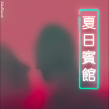

小 鱼 儿Babel Record - 夏 日 旅 馆
============================

|  |  |
| :--: | :-- |
| [ 小 鱼 儿Babel Record - 夏 日 旅 馆](https://emumo.xiami.com/album/2100371518) | **艺人**: [sususu](../index.md) **语种**: 国语 **唱片公司**: Dark Babel Records **发行时间**: 2016年07月22日 **专辑类别**: EP, 单曲 **专辑风格**:  **播放数**: 166319 **收藏数**: 100 **评论数**: 39  |

## 简介

 特别感谢Sid和Babel Record让这一切发生，中国的Beat Scene终于要开始了  
  

## 曲目

## 评论

|  |  |  |  |
| :-- | :-- | :-- | :-- |
|  [虾米用户](https://emumo.xiami.com/u/36141170) pick☞【幻听神游】 2019-08-29 17:07 赞(0) 踩(0) | 
这首太赞~！！
 |
|  [虾米用户](https://emumo.xiami.com/u/46152277) 温柔！ 2019-06-29 15:03 赞(0) 踩(0) | 
封面好评！
 |
|  [虾米用户](https://emumo.xiami.com/u/85165792) COMING 2017-07-30 13:58 赞(0) 踩(0) | 
LIKE
 |
|  [虾米用户](https://emumo.xiami.com/u/30691635) - 天気がいいから、我请... 2016-12-15 14:30 赞(0) 踩(0) | 
⚖
 |
|  [虾米用户](https://emumo.xiami.com/u/8858880)  公開処刑 ／ リリー・... 2016-11-26 23:08 赞(0) 踩(0) | 
Ç
 |
|  [虾米用户](https://emumo.xiami.com/u/6061244) 醒不来 2016-09-02 13:16 赞(1) 踩(0) | 
喜欢封面！~
 |
|  [虾米用户](https://emumo.xiami.com/u/81156578) 不酷 2016-08-28 14:40 赞(1) 踩(0) | 
好听得头皮发麻：）
 |
|  [虾米用户](https://emumo.xiami.com/u/81156578) 不酷 2016-08-28 14:33 赞(1) 踩(0) | 
循环了一天
 |
|  [虾米用户](https://emumo.xiami.com/u/48211350) 已弃虾米，勿扰 2016-07-26 00:08 赞(1) 踩(0) | 
爱你
 |
|  [虾米用户](https://emumo.xiami.com/u/46485738) ね.上 我-おんな 2016-07-25 20:39 赞(1) 踩(0) | 
我是你的小透明 
 |
|  [虾米用户](https://emumo.xiami.com/u/34214101) don't call m... 2016-07-25 06:03 赞(1) 踩(0) | 
有一天会少个人爱你
 |
|  [虾米用户](https://emumo.xiami.com/u/2757660) 我还没想好要写什么... 2016-07-24 22:18 赞(1) 踩(0) | 
我最愛的su
 |
|  [虾米用户](https://emumo.xiami.com/u/70680724) LegoG梁天麒 2016-07-24 15:08 赞(1) 踩(0) | 
酥
 |
|  [虾米用户](https://emumo.xiami.com/u/11565835) 看来你品味也不怎么样 2016-07-24 01:58 赞(8) 踩(0) | 
喜欢你的人是越来越多了 总会有点糖被抢走的感觉哈哈 衷心祝你今后顺顺利利
 |
|  [虾米用户](https://emumo.xiami.com/u/11840348) nothing 2016-07-24 00:58 赞(1) 踩(0) | 
喜欢哟
 |
|  [虾米用户](https://emumo.xiami.com/u/49640493) 网易云SAINTDONT... 2016-07-23 21:11 赞(1) 踩(0) | 
YI只酥鱼
 |
|  [虾米用户](https://emumo.xiami.com/u/1320669) ツ 2016-07-23 13:31 赞(1) 踩(0) | 
0.0
 |
|  [虾米用户](https://emumo.xiami.com/u/9028760) 豆瓣见 spotify ... 2016-07-23 11:08 赞(1) 踩(0) | 
⚗嘿嘿
 |
|  [虾米用户](https://emumo.xiami.com/u/45298985) Wechat:dqx19... 2016-07-23 06:02 赞(1) 踩(0) | 
+
 |
|  [虾米用户](https://emumo.xiami.com/u/28771866) 不 2016-07-23 04:16 赞(2) 踩(0) | 
走心
 |
|  [虾米用户](https://emumo.xiami.com/u/9513422) 虾米歌单迁徙到网易☁️:... 2016-07-23 03:20 赞(1) 踩(0) | 
花无缺
 |
|  [虾米用户](https://emumo.xiami.com/u/44240471) 」精 分 患 者「 2016-07-23 00:34 赞(1) 踩(0) | 
讚
 |
|  [虾米用户](https://emumo.xiami.com/u/37087360) thecutestcut... 2016-07-22 23:41 赞(2) 踩(0) | 
DJ小鱼儿酥
 |
|  [虾米用户](https://emumo.xiami.com/u/13458091) 2021.1.15  成... 2016-07-22 23:35 赞(1) 踩(0) | 
~~
 |
|  [虾米用户](https://emumo.xiami.com/u/15416414) go u 2016-07-22 23:27 赞(1) 踩(0) | 
用脚滑水
 |
|  [虾米用户](https://emumo.xiami.com/u/13154723) 脾气不太好 2016-07-22 23:24 赞(1) 踩(0) | 
可惜不會游泳
 |
|  [虾米用户](https://emumo.xiami.com/u/36437914) WX：IXUS-- 2016-07-22 22:43 赞(1) 踩(0) | 
Hi su
 |
|  [虾米用户](https://emumo.xiami.com/u/15286935) XxX 2016-07-22 22:30 赞(1) 踩(0) | 
封面？
 |
|  [虾米用户](https://emumo.xiami.com/u/1987681) An elephant ... 2016-07-22 22:08 赞(1) 踩(0) | 
nice work mate.
 |
|  [虾米用户](https://emumo.xiami.com/u/82624436) Stay Humble. 2016-07-22 22:07 赞(1) 踩(0) | 

 |
|  [虾米用户](https://emumo.xiami.com/u/43418234) ^_−☆ 2016-07-22 21:24 赞(1) 踩(0) | 

 |
|  [虾米用户](https://emumo.xiami.com/u/4372646) 可爱又迷人的正派角色IG... 2016-07-22 21:17 赞(1) 踩(0) | 
#
 |
|  [虾米用户](https://emumo.xiami.com/u/46523150) 尔有何坚 2016-07-22 21:17 赞(1) 踩(0) | 
啾啾
 |
|  [虾米用户](https://emumo.xiami.com/u/49265597) 我还没想好要写什么... 2016-07-22 21:15 赞(1) 踩(0) | 
耶～！
 |
|  [虾米用户](https://emumo.xiami.com/u/99168462) 再见虾米 2016-07-22 20:59 赞(1) 踩(0) | 
-
 |
|  [虾米用户](https://emumo.xiami.com/u/207477) 精怪 2016-07-22 20:55 赞(1) 踩(0) | 
逝世后改变了
 |
|  [虾米用户](https://emumo.xiami.com/u/19258387) Wechat: chri... 2016-07-22 20:55 赞(1) 踩(0) | 
Y
 |
|  [虾米用户](https://emumo.xiami.com/u/12845416) 23-06-93 2016-07-22 20:54 赞(1) 踩(0) | 
比心
 |
|  [虾米用户](https://emumo.xiami.com/u/5490437) 女士优先 2016-07-22 20:53 赞(1) 踩(0) | 
-
 |
