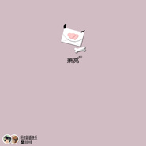
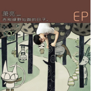

萧亮
============================

|  |  |
| :--: | :-- |
| [ 萧亮](https://i.xiami.com/xiaoliang) | **地区**: China 中国大陆 **风格**: 流行说唱 Pop Rap, 节奏布鲁斯 R&B, 民谣 Folk, 流行 Pop **播放数**: 9865599 **粉丝数**: 284 **评论数**: 23  |

## 档案

中文名：萧亮 外文名：Leon Shaw  生日：8/9 星座：狮子座  身高：180cm  籍贯：河北   出生地：沈阳     嗜好：绘画、电影、创作   乐器：吉他、键盘、钢琴  2006年，与胡彦斌、柯以敏、火风，文章等艺人参加辽宁卫视大型直播综艺《兴隆大家庭》，负责现场音乐；  2007年，担任沈阳电视台影视频道全期综艺现场音乐总监，并负责编曲工作;  作为Keyboard协乐队参加YAMAHA节拍大赛沈阳赛区比赛，并获四强；  2009年，与吉杰、杨培安等艺人参加沈阳电视台《封面明星》选秀综艺，担任音乐总监兼编曲；  2012年，与音乐制作人珑喆合作，演唱【浙江女主播FM1045】电台主题曲；同年发行第一张创作辑《小猪的夏天》  2014年，应邀与那英组冠军学员萱萱分别担任【《好声音》第三季沈阳赛区】现场评委；发行第二张创作辑《DEmo兔》  2015年，发行第三张创作辑《熊孩子纪元》；  2016年，与《好歌曲》蔡健雅爱徒-宋媛媛一同演唱【辽宁交通广播FM97.5】三版台歌；  2017年，推出翻唱组曲《JAY情歌》，获全网百万点击及好评；  2018年，担任【辽宁《璀璨星途》校园选秀季】音乐评审；  2019年，为流行音乐人丁怀夏制作专辑；推出个人EP《告别绿野仙踪的日子》；担任嘻哈歌手杜佳阳EP《风格》制作人；为 【《复仇者联盟》世界巡展沈阳站】创作推广主题曲《ALL DAY》；同年应邀担任【QQ音乐x荣耀手机 YOUNG MUSIC校园歌手大赛】东北赛区主评审；  2020年，与张希、王啸坤等歌手联袂演唱音乐人关力制创作的抗疫歌曲《启程》，并担当制作人；担任2020【QQ音乐 x雪碧 YOUNG MUSIC 校园乐队大赛】北部大区晋级赛现场评审；

## 专辑

| 名称 | 语种 | 唱片公司 | 发行时间 | 专辑类别 | 专辑风格 |
| :--: | :-- | :-- | :-- | :-- | :-- |
| [ 祝你新婚快乐-2020浪漫仲夏](./albums/5021282010.md) | 国语 | 独立发行 | 2020年05月24日 | EP, 单曲 | 流行 Pop, 节奏布鲁斯 R&B |
| [ Power Of Toys](./albums/2105258582.md) | 国语 |  | 2019年09月19日 | EP, 单曲 | 流行 Pop |
| [ 告别绿野仙踪的日子](./albums/2104849005.md) | 国语 |  | 2019年05月08日 | EP, 单曲 | 流行摇滚 Pop Rock |
| [ 08090](./albums/2102821800.md) | 国语 | 独立发行 | 2017年06月04日 | EP, 单曲 | 流行 Pop |
| [ 微笑·路过](./albums/5021276519.md) | 国语 | 独立发行 | 2017年03月16日 | 精选集 | 流行 Pop, 节奏布鲁斯 R&B |
| [ 如果有时候](./albums/2103583396.md) | 国语 | 独立发行 | 2016年10月18日 | EP, 单曲 | 流行 Pop |
| [ 熊孩子纪元](./albums/2100247458.md) | 国语 | 独立发行 | 2015年12月16日 | 录音室专辑 | 节奏布鲁斯 Rhythm & Blues, 流行摇滚 Pop Rock, 国语流行 Mandarin Pop |
| [ DEmo兔](./albums/1807906227.md) | 国语 | 独立发行 | 2014年08月13日 | 录音室专辑 | 流行说唱 Pop Rap, 节奏布鲁斯 Rhythm & Blues, 传统民谣 Traditional Folk |
| [ 小猪的夏天](./albums/1304140214.md) | 国语 | 独立发行 | 2012年12月26日 | 录音室专辑 | 流行说唱 Pop Rap, 节奏布鲁斯 Rhythm & Blues, 当代民谣 Contemporary Folk |

## 评论

|  |  |  |
| :-- | :-- | :-- |
|  [虾米用户](https://emumo.xiami.com/u/325850949) ℯℴ ℯ 2021-01-21 18:30 赞(0) 踩(0) | 
沈阳？
 |
|  [虾米用户](https://emumo.xiami.com/u/358104299) 悲观的唯心存在现实解构虚... 2020-12-25 04:40 赞(0) 踩(0) | 
43974
 |
|  [虾米用户](https://emumo.xiami.com/u/412625027) 我还没想好要写什么... 2020-05-01 19:25 赞(1) 踩(0) | 
可不可以来一首 无条件为你❤️
 |
|  [虾米用户](https://emumo.xiami.com/u/357133771)  2019-05-20 23:39 赞(3) 踩(0) | 
好的作品不同的音乐人演绎出不同的味道。 加油！
 |
|  [虾米用户](https://emumo.xiami.com/u/293692544) 你敢给我说话吗？我咬你 2019-03-21 17:37 赞(2) 踩(0) | 
好听
 |
|  [虾米用户](https://emumo.xiami.com/u/421237947)  2019-03-18 16:01 赞(4) 踩(0) | 
加油呀
 |
|  [虾米用户](https://emumo.xiami.com/u/293692544) 你敢给我说话吗？我咬你 2019-03-02 17:27 赞(1) 踩(0) | 
好听
 |
|  [虾米用户](https://emumo.xiami.com/u/286251413) 當你想放棄的時候，想想是... 2019-01-17 02:07 赞(1) 踩(0) | 
唱的真好
 |
|  [虾米用户](https://emumo.xiami.com/u/93683464)  2015-12-22 18:34 赞(1) 踩(0) | 
加油，老同学，很喜欢你的歌，会一直支持你 
 |
|  [虾米用户](https://emumo.xiami.com/u/47485659) qq57040987 2015-10-16 20:49 赞(1) 踩(0) | 
作词作曲演唱都不错 希望有机会合作！
 |
|  [虾米用户](https://emumo.xiami.com/u/47485659) qq57040987 2015-10-16 20:48 赞(1) 踩(0) | 
666
 |
|  [虾米用户](https://emumo.xiami.com/u/38726317)  2014-07-05 15:42 赞(1) 踩(0) | 
好好听，你声音这么好听啊，加油，永远支持你，勇-鹤
 |
|  [虾米用户](https://emumo.xiami.com/u/25383116) 平常心 2014-07-03 17:03 赞(1) 踩(0) | 
超级棒
 |
|  [虾米用户](https://emumo.xiami.com/u/38667388)  2014-07-03 10:47 赞(1) 踩(0) | 
支持支持
 |
|  [虾米用户](https://emumo.xiami.com/u/38659514)  2014-07-02 22:11 赞(1) 踩(0) | 
曲风和专辑的名字一样，让人有夏天清爽的感觉，是炎炎夏日的一缕清风，很喜欢，给你32个赞，希望你在音乐的道路上，一帆风顺，越走越远！
 |
| ⇒ |  [虾米用户](https://emumo.xiami.com/u/38556189) 我还没想好要写什么... 2014-07-03 11:25 赞(0) 踩(0) | 
谢谢支持~
 |
|  [虾米用户](https://emumo.xiami.com/u/38658261)  2014-07-02 21:31 赞(1) 踩(0) | 
加油！
 |
|  [虾米用户](https://emumo.xiami.com/u/38657596)  2014-07-02 21:15 赞(1) 踩(0) | 
赞\(≧▽≦)/
 |
|  [虾米用户](https://emumo.xiami.com/u/38656204)  2014-07-02 20:34 赞(1) 踩(0) | 
音乐清新、节奏欢快、是我喜欢的类型！
 |
| ⇒ |  [虾米用户](https://emumo.xiami.com/u/38556189) 我还没想好要写什么... 2014-07-03 11:33 赞(0) 踩(0) | 
lucky!
 |
|  [虾米用户](https://emumo.xiami.com/u/38655445)  2014-07-02 19:52 赞(1) 踩(0) | 
歌好听～人又帅～继续加油哈
 |
| ⇒ |  [虾米用户](https://emumo.xiami.com/u/38556189) 我还没想好要写什么... 2014-07-03 11:33 赞(0) 踩(0) | 
有首歌和你名字一样~
 |
|  [虾米用户](https://emumo.xiami.com/u/696142) 还得折腾 2014-07-02 19:48 赞(1) 踩(0) | 
编曲非常成熟 非常有潜力的音乐人
 |
