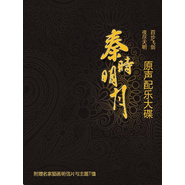

彭飞
============================

|  |  |
| :--: | :-- |
| [ 彭飞](https://i.xiami.com/pengfei) | **播放数**: 47806579 **粉丝数**: 5121 **评论数**: 72 **地区**: China 中国大陆 **风格**: 爵士流行 Jazz Pop  |

## 档案

音乐创作人，小提琴演奏家-彭飞首张个人创作演奏专辑【第三个月3rd Month】，作品融合了Jazz, Classical, R&B, World music…等多种元素。其中更有多位著名歌手(袁娅维，常石磊，赵可，郭一凡，李子涵)及乐手（秦立巍，Toben Chodos,　Curtis Ostle, Charles Foldesh, Lionardo Susi,　李晓川，陈嘉俊，胡清文，胡洋，朴英，黄北星）等人参与录制。专辑由上海交响乐团演奏其中管弦乐声部，使用SSL多轨同期录音设备，母带后期处理由美国著名混音师Greg Calbi制作完成。 
【第三个月3rd Month】是彭飞首张个人专辑，也是一张用心制作的专辑。虽然只有短短几个月，这张专辑却让他有如获得新生一般，用一个与以前不一样的方式看待世界，看待自己。 
【序】 
这些年来，从小提琴手，到作曲，编曲，制作人。我的人生收获很多，却一直没有机会去做这样的一张专辑，来表达我个人的音乐观念和对于这个世界的一些看法。 
在电脑音乐越来越普及的今天，我却希望自己能够走一条返璞归真的路，以尽可能多的原声乐器演奏来描述我所以为的音乐。没有midi也没有auto tune，在简单鲜活的几个生命之间，这些本来最传统的音乐表现方式在今天看来，反而有了一些实验的意思. 
非常荣幸，这几个月来有这么多优秀的音乐家和我一起工作，一起经历那些令人难忘的时光。给与我鼓励和支持，包容我的缺点，用惊人的音乐才能和热情与我分享音乐中那些最朴素的情感。 
这不是一张商业性强的专辑，或许也不是你听到过最好的一张专辑。 如果恰好你也喜欢，希望你也把【第三个月3rd Month】当作给自己的一个礼物！ 
彭飞

## 专辑

| 名称 | 语种 | 唱片公司 | 发行时间 | 专辑类别 | 专辑风格 |
| :--: | :-- | :-- | :-- | :-- | :-- |
| [ 囧妈 电影原声音乐](./albums/2105814436.md) | 纯音乐 | 奔跑怪物 | 2020年02月06日 | 原声带, 影视音乐 | 电影原声 Film Score |
| [ 受益人 电影原声音乐](./albums/2105813596.md) | 纯音乐 | 奔跑怪物 | 2020年02月05日 | 原声带, 影视音乐 | 电影原声 Film Score |
| [ 西虹市首富 电影原声Hello Mr. Billionaire](./albums/2103885502.md) | 纯音乐 | 奔跑怪物 | 2018年08月01日 | 原声带, 影视音乐 | 原声 Soundtrack, 电影原声 Film Score |
| [ 机器之血 电影原声带Bleeding Steel  Original Soundtrack](./albums/2103463280.md) | 国语 | 合一影业 | 2017年12月26日 | 原声带, 影视音乐 | 电影原声 Film Score |
| [ 乘风破浪 电影原声带Duckweed](./albums/2102779311.md) | 纯音乐 | 亭东影业 | 2017年07月08日 | 原声带, 影视音乐 | 电影原声 Film Score |
| [ 火锅英雄 电影原声专辑](./albums/2100307934.md) | 纯音乐 | 索尼音乐娱乐 | 2016年04月07日 | 原声带, 影视音乐 | 电影原声 Film Score |
| [ 第三个月3rd Month / 彭飞首张创作专辑](./albums/320789038.md) | 国语 | 独立发行 | 2015年01月09日 | 录音室专辑 | 融合爵士 Jazz Fusion, 古典跨界 Classical Crossover, 华语唱作人 Chinese Singer-Songwriter |
| [ 秦时明月之百步飞剑 原声配乐大碟](./albums/568583.md) | 其他 | 玄机科技 | 2012年12月15日 | 原声带, 影视音乐 | 原声 Soundtrack |

## 评论

|  |  |  |  |
| :-- | :-- | :-- | :-- |
|  [虾米用户](https://emumo.xiami.com/u/8127678) 吃到一起，聊到一起，听到... 2020-07-30 06:48 赞(0) 踩(0) | 
叶卡捷琳堡站的探戈有完整版吗，还是本就如此？意犹未尽呀。
 |
|  [虾米用户](https://emumo.xiami.com/u/360726958)  2020-02-21 07:27 赞(0) 踩(0) | 
整晚都在听大白兔，安抚 治愈 被温暖到了，谢谢你：）
 |
|  [虾米用户](https://emumo.xiami.com/u/4712640)  2019-06-13 16:40 赞(0) 踩(0) | 
牛啤！！！！
 |
|  [虾米用户](https://emumo.xiami.com/u/89312654) Forget 2019-04-02 22:05 赞(3) 踩(0) | 
彭飞在吗，出来收我当学生，相学爵士小提想哭了
 |
| ⇒ |  [虾米用户](https://emumo.xiami.com/u/378953658) 专注爵士小提琴的研究与演... 2019-08-05 15:00 赞(0) 踩(0) | 
中国爵士小提的教育想当小众，中文教材更是寥寥无几，可以先从和弦学起。几乎在中国所有爵士小提琴都是古典转过去的，但起初连谱子都完全不一样。需要一段时间打磨节奏与和声的功底，还有基本即兴才能与乐队融入。美国爵士小提琴家Christian Howes的网站上有些系统性的训练教材可以下载，很遗憾没有中文的。
 |
|  [虾米用户](https://emumo.xiami.com/u/401218839)  2019-02-03 17:02 赞(0) 踩(0) | 
厉害
 |
|  [虾米用户](https://emumo.xiami.com/u/334617339) 我还没想好要写什么... 2019-01-25 20:46 赞(1) 踩(0) | 
30000000000元
 |
|  [虾米用户](https://emumo.xiami.com/u/345798795)  2019-01-05 14:59 赞(0) 踩(0) | 
   
 |
|  [虾米用户](https://emumo.xiami.com/u/6873363)  2018-12-27 19:12 赞(0) 踩(0) | 
100`1000000`1000000000000`000000010000000`000000000
 |
|  [虾米用户](https://emumo.xiami.com/u/410197141)  2018-12-08 13:43 赞(0) 踩(0) | 
 
 |
|  [虾米用户](https://emumo.xiami.com/u/5073113)  2018-12-02 23:26 赞(1) 踩(0) | 
你是为数不多能让我刮目相看的国产音乐人
 |
|  [虾米用户](https://emumo.xiami.com/u/1594596) ٩(๑´0`๑)۶ 2018-11-02 14:56 赞(2) 踩(0) | 
作品好棒 ~~
 |
|  [虾米用户](https://emumo.xiami.com/u/3566813) 菩萨，祝您身体健康！34... 2018-10-09 00:02 赞(0) 踩(0) | 
最近恶补国产配乐人作品，说一句。不去寻找，发现，自以为是的下结论是不对的。
 |
|  [虾米用户](https://emumo.xiami.com/u/1344348) 想你。 2018-08-02 12:15 赞(1) 踩(0) | 
为你着迷
 |
|  [虾米用户](https://emumo.xiami.com/u/2704671)  2018-04-11 14:21 赞(0) 踩(0) | 
特别喜欢《第三个月》这张专辑，听着很有感觉！
 |
|  [虾米用户](https://emumo.xiami.com/u/17767792) 我还没想好要写什么... 2017-12-18 09:11 赞(1) 踩(0) | 
恭喜彭老师！！金曲歌王！
 |
|  [虾米用户](https://emumo.xiami.com/u/286384702) 都没名气，要啥签名。 2017-11-23 07:45 赞(1) 踩(0) | 
期待【绝世高手】原声大碟。
 |
|  [虾米用户](https://emumo.xiami.com/u/648020)  2017-07-12 11:37 赞(0) 踩(0) | 
喜欢你的《乘风破浪》原声专辑，很赞呢
 |
|  [虾米用户](https://emumo.xiami.com/u/7868589) 钝感 2017-06-17 22:07 赞(0) 踩(0) | 
不知各位可知道现在在哪里可以买到这张CD 想收藏 如果知道麻烦告知谢谢
 |
|  [虾米用户](https://emumo.xiami.com/u/40631641)  2017-02-19 11:47 赞(1) 踩(0) | 
乘风破浪原声带赶紧的
 |
|  [虾米用户](https://emumo.xiami.com/u/97747450) 我还没想好要写什么... 2017-02-10 00:26 赞(0) 踩(0) | 
7684
 |
|  [虾米用户](https://emumo.xiami.com/u/256087184) 爱你，让我才华横溢 2017-01-05 20:59 赞(0) 踩(0) | 
嗯，你唱得现场版本呀？？
 |
|  [虾米用户](https://emumo.xiami.com/u/50090854)  2016-10-29 23:06 赞(0) 踩(0) | 
一直喜欢
 |
|  [虾米用户](https://emumo.xiami.com/u/8070377) 爱雾瑞性维欧腐漏 2016-04-07 15:27 赞(0) 踩(0) | 
火锅英雄干仗时候是哪个曲子
 |
|  [虾米用户](https://emumo.xiami.com/u/6165047)  2016-03-02 14:55 赞(1) 踩(0) | 
很悦耳的音乐，现场版肯定很赞！
 |
|  [虾米用户](https://emumo.xiami.com/u/47152449)  2016-02-27 16:13 赞(0) 踩(0) | 
(๑•́ ₃ •̀๑)
 |
|  [虾米用户](https://emumo.xiami.com/u/2279444) 爱在左，同情在右。 2016-02-16 08:51 赞(1) 踩(0) | 
好歌曲现场演奏的是他吧
 |
|  [虾米用户](https://emumo.xiami.com/u/53000771) 或许我这一生涓滴依恋，渐... 2015-07-28 16:38 赞(1) 踩(0) | 
阅读时作为背景最佳的中国Jazz小提琴演奏家~~~
 |
|  [虾米用户](https://emumo.xiami.com/u/3518791)   2015-07-26 19:25 赞(1) 踩(0) | 
不错 精良的制作 
 |
|  [虾米用户](https://emumo.xiami.com/u/2024517) 潮流易逝，风格永存。 2015-07-12 13:44 赞(0) 踩(0) | 
迷人的音乐 诗
 |
|  [虾米用户](https://emumo.xiami.com/u/6087627)   2015-07-04 16:00 赞(2) 踩(0) | 
因为彭老师的颜来听的哦～～
 |
|  [虾米用户](https://emumo.xiami.com/u/6064239)  2015-07-02 22:30 赞(0) 踩(0) | 
我也看了金曲奖过来的，恭喜！
 |
|  [虾米用户](https://emumo.xiami.com/u/36029) ½ 2015-06-29 12:36 赞(1) 踩(0) | 
恭喜！
 |
|  [虾米用户](https://emumo.xiami.com/u/50624926) 安静de存在 2015-06-28 04:41 赞(0) 踩(0) | 
稀罕的 悦耳的：a jazzy female vocal with 汉语名字
 |
|  [虾米用户](https://emumo.xiami.com/u/6531780) 想要变成你 2015-06-27 20:28 赞(0) 踩(0) | 
恭喜
 |
|  [虾米用户](https://emumo.xiami.com/u/9375352) 咩哈哈 嘎嘎嘎 2015-06-21 23:34 赞(0) 踩(0) | 
原来国内也有这种东西啊……真是长见识了
 |
|  [虾米用户](https://emumo.xiami.com/u/9375352) 咩哈哈 嘎嘎嘎 2015-06-21 23:34 赞(0) 踩(0) | 
原来国内也有这种东西啊……真是长见识了
 |
|  [虾米用户](https://emumo.xiami.com/u/1480728) lets begin 2015-03-30 21:29 赞(0) 踩(0) | 
《释怀》歌词唱到“不会被生活漂白”最后尾音的泛音太帅了！
 |
|  [虾米用户](https://emumo.xiami.com/u/19189)   2015-03-17 20:47 赞(0) 踩(0) | 
好期待看现场！
 |
|  [虾米用户](https://emumo.xiami.com/u/3680891)  2015-02-23 23:01 赞(8) 踩(0) | 
精致，地道，自由自在的歌唱和音乐！顶级音乐人，支持！！
 |
|  [虾米用户](https://emumo.xiami.com/u/38607805) jazzy all my 2015-02-12 17:54 赞(0) 踩(0) | 
超级喜欢
 |
|  [虾米用户](https://emumo.xiami.com/u/5012758) C to Rat西略特 2015-01-25 19:23 赞(1) 踩(0) | 
fusion对的起耳朵
 |
|  [虾米用户](https://emumo.xiami.com/u/316033) 暂无签名~ 2015-01-21 23:07 赞(1) 踩(0) | 
很喜欢你的专辑，加油!2015年开年听到的第一张好专辑!
 |
|  [虾米用户](https://emumo.xiami.com/u/306307)  2015-01-18 11:29 赞(1) 踩(0) | 
哈哈哈對不起，剛開始以為是春曉那個男朋友彭坦還是叫什麼的，一聽音樂很棒！加油！
 |
|  [虾米用户](https://emumo.xiami.com/u/1364890)  2015-01-15 20:44 赞(0) 踩(0) | 
支持音乐人！
 |
|  [虾米用户](https://emumo.xiami.com/u/22505932)  2015-01-15 18:34 赞(0) 踩(0) | 
舒服
 |
|  [虾米用户](https://emumo.xiami.com/u/9500699) explorer+ 2015-01-15 12:03 赞(1) 踩(0) | 
好听好听! 录的太好啦~ 每个小细节都能感受到用心之处!
 |
|  [虾米用户](https://emumo.xiami.com/u/1104423)  2015-01-14 15:56 赞(0) 踩(0) | 
小提琴咖啡
 |
|  [虾米用户](https://emumo.xiami.com/u/11474866)  2015-01-14 14:31 赞(1) 踩(0) | 
你擅长的音乐类型在大陆很稀有，请继续保持，加油。
 |
|  [虾米用户](https://emumo.xiami.com/u/15301911)  2015-01-14 08:54 赞(1) 踩(0) | 
堆积技巧，情感匮乏，华丽有余，无心感动。
 |
|  [虾米用户](https://emumo.xiami.com/u/779082)  2015-01-13 22:21 赞(0) 踩(0) | 
彭老师 必须赞！
 |
|  [虾米用户](https://emumo.xiami.com/u/11187286) G&S 2015-01-13 20:14 赞(0) 踩(0) | 
只是因为本土音乐人
 |
|  [虾米用户](https://emumo.xiami.com/u/3741170) ◇◆Vesti la g... 2015-01-13 13:59 赞(1) 踩(0) | 
很不错呐
 |
|  [虾米用户](https://emumo.xiami.com/u/4003385)  2015-01-13 13:39 赞(1) 踩(0) | 
赞！
 |
|  [虾米用户](https://emumo.xiami.com/u/191114) 我还没想好要写什么... 2015-01-13 11:03 赞(1) 踩(0) | 
购买！支持国内JAZZ。
 |
|  [虾米用户](https://emumo.xiami.com/u/45963598)  2015-01-13 09:45 赞(1) 踩(0) | 
love.this violent
 |
|  [虾米用户](https://emumo.xiami.com/u/4784299)   2015-01-13 01:40 赞(1) 踩(0) | 
我决定付费下载，支持国内爵士原创
 |
|  [虾米用户](https://emumo.xiami.com/u/7148464)  2015-01-13 01:39 赞(1) 踩(0) | 
这是中国音乐界少有的顶尖音乐人，身为音乐界的一份子，哪能不支持？
 |
|  [虾米用户](https://emumo.xiami.com/u/73) 等风景都看透 谁陪我看细... 2015-01-11 23:07 赞(1) 踩(0) | 
欢迎彭老师！！！
 |
|  [虾米用户](https://emumo.xiami.com/u/9560925)  2015-01-11 11:03 赞(1) 踩(0) | 
鹏老师 大赞！
 |
|  [虾米用户](https://emumo.xiami.com/u/28067506) 我还没想好要写什么... 2015-01-10 23:12 赞(2) 踩(0) | 
彭大师人见人爱，花见花开
 |
|  [虾米用户](https://emumo.xiami.com/u/35776089)  2015-01-10 11:31 赞(1) 踩(0) | 
终于来了 2015第一张必须入手的专辑
 |
|  [虾米用户](https://emumo.xiami.com/u/13810266) 我觉得自己像一位艺术家 2015-01-09 22:38 赞(0) 踩(0) | 
支持大陸第一爵士高手！
 |
|  [虾米用户](https://emumo.xiami.com/u/8108889)  2015-01-09 21:21 赞(0) 踩(0) | 
太好听！抱住
 |
|  [虾米用户](https://emumo.xiami.com/u/45770237)  2015-01-09 13:22 赞(80) 踩(0) | 
我刚入驻了虾米音乐人，欢迎大家来我的个人主页，收听我的最新音乐
 |
| ⇒ |  [虾米用户](https://emumo.xiami.com/u/69449) 我的两大男神都在虾米上 2015-01-09 18:32 赞(0) 踩(0) | 
顶飞飞！
 |
| ⇒ |  [虾米用户](https://emumo.xiami.com/u/33610859) 暂无签名~ 2015-01-09 22:47 赞(0) 踩(0) | 
终于来了
 |
| ⇒ |  [虾米用户](https://emumo.xiami.com/u/17328641) 引子 音乐人引子 2015-01-10 23:33 赞(0) 踩(0) | 
必须支持彭大师
 |
| ⇒ |  [虾米用户](https://emumo.xiami.com/u/7616503) 暂无签名~ 2015-01-15 06:01 赞(0) 踩(0) | 
彭飞，你唤醒了我最初的优雅和浪漫
 |
| ⇒ |  [虾米用户](https://emumo.xiami.com/u/46920743)  2015-04-09 11:23 赞(0) 踩(0) | 
太棒了！
 |
| ⇒ |  [虾米用户](https://emumo.xiami.com/u/375070627) 小宇宙 2018-10-14 19:26 赞(0) 踩(0) | 
好滴，已关注
 |
| ⇒ |  [虾米用户](https://emumo.xiami.com/u/416864710)  2019-04-25 22:45 赞(0) 踩(0) | 
盼回复，何生。谢谢您！
 |
