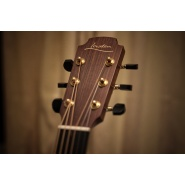

李森茂
============================

|  |  |
| :--: | :-- |
| [ 李森茂](https://i.xiami.com/samguitar) | **播放数**: 2254469 **粉丝数**: 1028 **评论数**: 35 **地区**: China 中国大陆 **风格**: 当代唱作人 Contemporary Singer-Songwriter  |

## 档案

普通吉他爱好者

## 专辑

| 名称 | 语种 | 唱片公司 | 发行时间 | 专辑类别 | 专辑风格 |
| :--: | :-- | :-- | :-- | :-- | :-- |
| [ 半生少年](./albums/2103500048.md) | 国语 | 独立发行 | 2018年01月23日 | EP, 单曲 | 器乐独奏 Solo Instrumental |
| [ 李森茂Sam的吉他作品集李森茂Sam](./albums/2100272606.md) | 国语 |  | 2015年11月17日 | 精选集 | 器乐独奏 Solo Instrumental |
| [ 李森茂sam的早期弹唱集合翻唱](./albums/1271309166.md) | 国语 | 8090大学音乐工作室 | 2013年06月15日 | 录音室专辑 | 当代唱作人 Contemporary Singer-Songwriter |

## 评论

|  |  |  |  |
| :-- | :-- | :-- | :-- |
|  [虾米用户](https://emumo.xiami.com/u/418997704)  2020-02-23 13:02 赞(0) 踩(0) | 
抖音来的，特别喜欢你弹的曲子 
 |
|  [虾米用户](https://emumo.xiami.com/u/11509605) 嗷！听歌尺度很大！ 2018-11-11 21:51 赞(1) 踩(0) | 
猪头 我找到你了
 |
|  [虾米用户](https://emumo.xiami.com/u/333218988) 没什么不同… 2018-06-14 09:57 赞(1) 踩(0) | 
为你加油
 |
|  [虾米用户](https://emumo.xiami.com/u/46095540) 如果世界太危险只有音乐最... 2018-03-01 22:39 赞(0) 踩(0) | 
啊哈哈哈哈哈哈～我小侄女叫黎森茂 
 |
|  [虾米用户](https://emumo.xiami.com/u/20177386) 感谢一切美好的遇见❤️ 2018-02-24 10:07 赞(0) 踩(0) | 

 |
|  [虾米用户](https://emumo.xiami.com/u/228843687) 懒惰统治人间 2018-01-09 20:49 赞(1) 踩(0) | 
:-O
 |
|  [虾米用户](https://emumo.xiami.com/u/325822708)  2018-01-07 02:32 赞(0) 踩(0) | 
建议上一个一生所爱的谱子嘛  
 |
|  [虾米用户](https://emumo.xiami.com/u/245041427) 往哪里找安慰会简单一些 2017-11-28 23:15 赞(0) 踩(0) | 
微博上追了你快一年啦  无意间这里碰见你 小开心 ╰(❁&amp;acute;⌣`❁)╯♡
 |
|  [虾米用户](https://emumo.xiami.com/u/91092606) 希望我能有一颗马儿的头，... 2017-07-12 18:42 赞(0) 踩(0) | 
有没有发现?sam的声音像极了李健
 |
|  [虾米用户](https://emumo.xiami.com/u/265169855)  2017-04-30 11:59 赞(0) 踩(0) | 
为什么没有告白气球
 |
|  [虾米用户](https://emumo.xiami.com/u/203868162) 曲风在此，随意品尝 2017-04-08 12:04 赞(0) 踩(0) | 
希望把你echo上的歌都能放上来给我们欣赏
 |
|  [虾米用户](https://emumo.xiami.com/u/203868162) 曲风在此，随意品尝 2017-04-08 12:04 赞(0) 踩(0) | 
喜欢你的音乐❤️
 |
|  [虾米用户](https://emumo.xiami.com/u/265169855)  2017-01-22 09:37 赞(0) 踩(0) | 
Sam哥，我也在学这首，好听
 |
|  [虾米用户](https://emumo.xiami.com/u/42487431)  2016-10-21 09:56 赞(1) 踩(0) | 
请问可以把千与千寻的也弹一下嘛？！ 
 |
| ⇒ |  [虾米用户](https://emumo.xiami.com/u/31851172) your existen... 2018-05-26 10:59 赞(0) 踩(0) | 
我也想听，非常的想
 |
|  [虾米用户](https://emumo.xiami.com/u/16135450)  2016-09-19 19:08 赞(0) 踩(0) | 
3760
 |
|  [虾米用户](https://emumo.xiami.com/u/193551142) 慢慢来  谁不是翻山越岭... 2016-06-24 16:37 赞(0) 踩(0) | 
好听 入心 赞
 |
|  [虾米用户](https://emumo.xiami.com/u/190671613)  2016-06-16 19:49 赞(1) 踩(0) | 
未闻花名教学在哪看？
 |
|  [虾米用户](https://emumo.xiami.com/u/104339910)  2016-03-30 18:34 赞(1) 踩(0) | 
可不可以給一下你彈得未聞花名的譜子
 |
|  [虾米用户](https://emumo.xiami.com/u/128562352)  2016-03-30 04:35 赞(0) 踩(0) | 
向阳花呢？
 |
|  [虾米用户](https://emumo.xiami.com/u/124070482)  2016-03-17 01:23 赞(1) 踩(0) | 
炒鸡喜欢未闻花名 
 |
|  [虾米用户](https://emumo.xiami.com/u/117997918)  2016-03-12 09:47 赞(0) 踩(0) | 
喜欢很久
 |
|  [虾米用户](https://emumo.xiami.com/u/117687060)  2016-03-01 00:22 赞(3) 踩(0) | 
末闻花名好棒      
 |
|  [虾米用户](https://emumo.xiami.com/u/117687060)  2016-03-01 00:21 赞(0) 踩(0) | 
  
 |
|  [虾米用户](https://emumo.xiami.com/u/963243)  2016-02-12 22:28 赞(0) 踩(0) | 
为什么虾米和网易发布的歌曲都一样么?老是切换…
 |
|  [虾米用户](https://emumo.xiami.com/u/43508626) 放弃幻想，轻装前进 2016-02-06 22:42 赞(0) 踩(0) | 
赞！ 
 |
|  [虾米用户](https://emumo.xiami.com/u/110759456)  2016-02-06 10:46 赞(0) 踩(0) | 
就这几首么，记得你微信上发过很多的，有些遗憾。支持你 
 |
|  [虾米用户](https://emumo.xiami.com/u/48409368) 音乐改变人生 2016-01-22 21:41 赞(0) 踩(0) | 
男神最帅
 |
|  [虾米用户](https://emumo.xiami.com/u/8566739) 今晚打边炉啊 2015-12-14 22:38 赞(0) 踩(0) | 
赞！
 |
|  [虾米用户](https://emumo.xiami.com/u/53612321)  2015-11-26 04:05 赞(0) 踩(0) | 
努力吧
 |
|  [虾米用户](https://emumo.xiami.com/u/50362526) 我要爱人 啊哈哈哈 2015-08-01 22:07 赞(0) 踩(0) | 
虾米上  怎么没有  《唱》 阿，
 |
| ⇒ |  [虾米用户](https://emumo.xiami.com/u/208392499)  2016-08-03 10:57 赞(0) 踩(0) | 
在，网易云音乐
 |
|  [虾米用户](https://emumo.xiami.com/u/50362526) 我要爱人 啊哈哈哈 2015-08-01 22:04 赞(0) 踩(0) | 
从快手  上  喜欢你的    从  虾米上  听你的歌     
 |
|  [虾米用户](https://emumo.xiami.com/u/33450385) 喝醉那所有的魔鬼 2014-07-22 23:01 赞(1) 踩(0) | 
好喜欢你的声音
 |
| ⇒ |  [虾米用户](https://emumo.xiami.com/u/15972902) 华语音乐 2015-04-30 07:49 赞(0) 踩(0) | 
谢谢
 |
