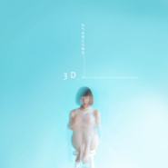
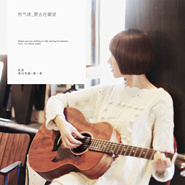

徐菲
============================

|  |  |
| :--: | :-- |
| [ 徐菲](https://i.xiami.com/xvfei) | **地区**: China 中国大陆 **风格**: 城市民谣 Urban Folk, 独立流行 Indie Pop, 华语唱作人 Chinese Singer-Songwriter **播放数**: 5118459 **粉丝数**: 2890 **评论数**: 186  |

## 档案

天马行空的新一代清新少女嗓音 
有沐音乐倾力打造融合新流行乐 
她的音乐色彩斑斓，创新和精致重新定义了这个时代的小清新音乐。音乐风格在室内流行、城市民谣的基础上，开创性的融入了氛围乐、电子、放克、迪斯科、丛林、吉普赛爵士等元素。 
由内至外的少女气质，带着洒脱和自由主义，与多元化的音乐元素相融合，形成独有的音乐体验。 
2012年《花儿朵朵》全国十三强 
2014阿比鹿音乐奖最受欢迎新人奖 
2015雅马哈“吉他女声“弹唱大赛全国冠军 
2016雅马哈吉他中国区代言人 
微博：         http://weibo.com/mogudaifu 
QQ群：239613714 
豆瓣：        http://site.douban.com/xvfei/ 
工作邀约请联系：        penny@yummusic.net 
2016新专辑《我只是过得自由》现已发行，实体专辑购买请至： https://item.taobao.com/item.htm?spm=a230r.1.14.1.xrodb7&id=542676815876&ns=1&abbucket=11#detail

## 专辑

| 名称 | 语种 | 唱片公司 | 发行时间 | 专辑类别 | 专辑风格 |
| :--: | :-- | :-- | :-- | :-- | :-- |
| [ 说爱](./albums/2102808473.md) | 国语 | JSJ杰思国际娱乐 | 2017年08月07日 | EP, 单曲 | 独立流行 Indie Pop |
| [ 我只是过得自由](./albums/2100383111.md) | 国语 | 有沐音乐 | 2016年12月03日 | 录音室专辑 | 华语唱作人 Chinese Singer-Songwriter |
| [ 树叶的光](./albums/2100377056.md) | 国语 | 有沐音乐 | 2016年08月05日 | EP, 单曲 | 国语流行 Mandarin Pop |
| [ 热气球要去往哪里3D版](./albums/2100374947.md) | 国语 | 有沐音乐 | 2016年07月26日 | EP, 单曲 | 国语流行 Mandarin Pop |
| [ 陌生人在唱歌](./albums/2100263162.md) | 国语 | 有沐音乐 | 2016年01月20日 | EP, 单曲 | 国语流行 Mandarin Pop |
| [ 我的写字台](./albums/928491864.md) | 国语 | 有沐音乐 | 2015年04月14日 | 录音室专辑 | 独立流行 Indie Pop, 华语唱作人 Chinese Singer-Songwriter |
| [ 徐菲现场live合辑](./albums/506103651.md) | 国语 | 独立发行 | 2014年07月22日 | 现场专辑 | 独立流行 Indie Pop, 独立民谣 Indie Folk |
| [ 热气球要去往哪里](./albums/1998052008.md) | 国语 | 有沐音乐 | 2014年04月21日 | 录音室专辑 | 独立流行 Indie Pop, 独立民谣 Indie Folk |

## 评论

|  |  |  |
| :-- | :-- | :-- |
|  [虾米用户](https://emumo.xiami.com/u/427384237) 我还没想好要写什么... 2020-06-19 01:01 赞(0) 踩(0) | 

 |
|  [虾米用户](https://emumo.xiami.com/u/3140019) 天马行空 2020-03-28 17:37 赞(0) 踩(0) | 
芒果布丁
 |
|  [虾米用户](https://emumo.xiami.com/u/358104299) 悲观的唯心存在现实解构虚... 2020-02-15 14:23 赞(0) 踩(0) | 
14715
 |
|  [虾米用户](https://emumo.xiami.com/u/28589649)  2019-11-27 22:11 赞(4) 踩(0) | 
hello！虾米的小伙伴们大家好！我又回来了！以后也依然请大家多多关照！
 |
|  [虾米用户](https://emumo.xiami.com/u/24968228)  2019-01-07 13:07 赞(1) 踩(0) | 
最近都不在虾米发片了，虾米也懒得更新专辑信息
 |
| ⇒ |  [虾米用户](https://emumo.xiami.com/u/18425093) I miss U。 2020-08-09 13:08 赞(0) 踩(0) | 
对呀，现在都空了。
 |
|  [虾米用户](https://emumo.xiami.com/u/3983079)  2018-02-14 14:52 赞(1) 踩(0) | 
声音好舒服呀
 |
|  [虾米用户](https://emumo.xiami.com/u/37289465) 切切切 2017-12-29 04:30 赞(1) 踩(0) | 
蘑菇大夫是个什么情况？
 |
|  [虾米用户](https://emumo.xiami.com/u/297999609) 去克洛里吧 2017-12-10 23:31 赞(1) 踩(0) | 
你的名字真好听。
 |
| ⇒ |  [虾米用户](https://emumo.xiami.com/u/297999609) 去克洛里吧 2017-12-10 23:31 赞(0) 踩(0) | 
就和我的名字差一个字哈哈哈哈哈哈哈
 |
|  [虾米用户](https://emumo.xiami.com/u/329398064)  2017-11-29 21:48 赞(2) 踩(0) | 
加油
 |
|  [虾米用户](https://emumo.xiami.com/u/24968228)  2017-11-20 23:15 赞(0) 踩(0) | 
在网易听到新demo~这才是徐菲的风格嘛~demo不错，支持喔～
 |
|  [虾米用户](https://emumo.xiami.com/u/322575010)  2017-11-05 16:23 赞(0) 踩(0) | 
呃[文字up][文字cool][18禁]          [叹号问好]                                       
 |
|  [虾米用户](https://emumo.xiami.com/u/42727344)  2017-10-28 00:10 赞(1) 踩(0) | 
你好 我也是一位原创歌手 有一首新歌感觉特别适合你 歌曲伴奏 词曲也是我 希望您能留意一下 这首歌真的很适合你 可以联系我QQ 951550505
 |
|  [虾米用户](https://emumo.xiami.com/u/31440002) 哈哈哈 加油啊  2017-10-21 17:44 赞(1) 踩(0) | 
你的声音好美，真的 
 |
|  [虾米用户](https://emumo.xiami.com/u/298948030) 中國詩音樂電影创始人作曲... 2017-10-17 22:11 赞(0) 踩(0) | 
你好
 |
|  [虾米用户](https://emumo.xiami.com/u/322220815)  2017-08-29 17:37 赞(0) 踩(0) | 
在吗？徐姐
 |
|  [虾米用户](https://emumo.xiami.com/u/322220815)  2017-08-29 17:31 赞(0) 踩(0) | 
很好。好听
 |
|  [虾米用户](https://emumo.xiami.com/u/322220815)  2017-08-29 17:31 赞(0) 踩(0) | 
我没时间
 |
|  [虾米用户](https://emumo.xiami.com/u/321052088)  2017-08-23 21:33 赞(0) 踩(0) | 
好听 
 |
|  [虾米用户](https://emumo.xiami.com/u/310908582) 就爱听听歌，就爱听，就不... 2017-08-15 19:51 赞(0) 踩(0) | 
蘑菇大夫，我要看病，我的病是太爱听你歌和别人的歌
 |
|  [虾米用户](https://emumo.xiami.com/u/122024532)   2017-05-27 23:25 赞(0) 踩(0) | 
无名之地怎么下了？
 |
|  [虾米用户](https://emumo.xiami.com/u/295916105)  2017-05-21 17:10 赞(0) 踩(0) | 
旋风少女第三季什么时侯开播？
 |
|  [虾米用户](https://emumo.xiami.com/u/91066116) 我还没想好要写什么... 2017-04-11 01:09 赞(0) 踩(0) | 
得意之恋在85听到,马上摇一摇听歌识曲到了,一发不可收拾地爱上了这首少女心
 |
| ⇒ |  [虾米用户](https://emumo.xiami.com/u/28589649)  2017-04-11 14:42 赞(0) 踩(0) | 
官博蘑菇大夫的诊所 征集了一些别人的&amp;rdquo;得意之恋&amp;ldquo;~欢迎来看
 |
| ⇒ |  [虾米用户](https://emumo.xiami.com/u/91066116) 我还没想好要写什么... 2017-04-11 21:39 赞(0) 踩(0) | 
<q><b>徐菲说：</b></q>
 |
|  [虾米用户](https://emumo.xiami.com/u/286943320)  2017-04-09 09:56 赞(0) 踩(0) | 
嗯嗯嗯嗯
 |
|  [虾米用户](https://emumo.xiami.com/u/271234626) 音乐是自己的娱乐 2017-02-25 19:29 赞(0) 踩(0) | 
这是，，，，，，，，，，，，，，，
 |
|  [虾米用户](https://emumo.xiami.com/u/28589649)  2017-02-13 14:05 赞(1) 踩(0) | 
大家好，我的mv《我只是过得自由》在这里能看到哦： <a href="http://www.xiami.com/group/video-detail/vid/20552?spm=0.0.0.0.fvk9QE" target="_blank" rel="nofollow noreferrer noopener">http://www.xiami.com/group/video-detail/vid/20552?spm=0.0.0.0.fvk9QE</a>
 |
|  [虾米用户](https://emumo.xiami.com/u/260954954)   2017-01-18 17:45 赞(0) 踩(0) | 
你那首  树叶的光  好好听但你的声音有点像牛奶咖啡。还像安妮朵拉，
 |
| ⇒ |  [虾米用户](https://emumo.xiami.com/u/28589649)  2017-04-11 14:42 赞(0) 踩(0) | 
你们觉得好听就最好了~笔芯
 |
|  [虾米用户](https://emumo.xiami.com/u/251393644) 如我何般 2016-12-11 21:56 赞(1) 踩(0) | 
喜欢
 |
|  [虾米用户](https://emumo.xiami.com/u/252711181)   2016-12-08 16:50 赞(2) 踩(0) | 
声音跟小清新很雷同 没有什么辨识度 唱郭采洁像郭采洁 唱陈绮贞像陈绮贞 虽然是大陆的但模仿台湾小清新痕迹很严重
 |
|  [虾米用户](https://emumo.xiami.com/u/3815293) baby Jesus s... 2016-12-01 18:39 赞(1) 踩(0) | 
要发新专了~撒花啊
 |
|  [虾米用户](https://emumo.xiami.com/u/72666568)  2016-11-28 14:56 赞(0) 踩(0) | 
回来
 |
|  [虾米用户](https://emumo.xiami.com/u/50878892)  2016-09-27 16:25 赞(1) 踩(0) | 
最美好的事情莫过于在对的年纪恰巧遇见你。喜欢这样的蓝色，喜欢这样的短发，也喜欢这样的声线。
 |
|  [虾米用户](https://emumo.xiami.com/u/1155429)  2016-08-28 22:21 赞(0) 踩(0) | 
喜欢
 |
|  [虾米用户](https://emumo.xiami.com/u/4280707)  2016-06-19 09:53 赞(0) 踩(0) | 
声音好听！
 |
|  [虾米用户](https://emumo.xiami.com/u/43067815)   2016-05-30 19:09 赞(1) 踩(0) | 
怎么这么可爱啊
 |
|  [虾米用户](https://emumo.xiami.com/u/9127665)  2016-04-16 17:34 赞(0) 踩(0) | 
蘑菇，快把麋鹿改成“喵” ，太有意思的歌曲
 |
|  [虾米用户](https://emumo.xiami.com/u/9127105)   2016-03-30 18:54 赞(0) 踩(0) | 
我好喜欢你。。。。。。。。。。。。。。用的那把泰勒  
 |
|  [虾米用户](https://emumo.xiami.com/u/24045594) Yum Music 2016-03-22 10:37 赞(1) 踩(0) | 
徐菲2016全长专辑正在紧张录制中~！大家拭目以待吧！
 |
|  [虾米用户](https://emumo.xiami.com/u/112913712) 哇咔 2016-03-05 19:43 赞(1) 踩(0) | 
我只是想知道。。会不会回复。。。 
 |
| ⇒ |  [虾米用户](https://emumo.xiami.com/u/28589649)  2016-03-11 14:03 赞(0) 踩(0) | 
你猜
 |
|  [虾米用户](https://emumo.xiami.com/u/55476774) 隐于山间，领悟虚幻 2016-02-14 20:31 赞(0) 踩(0) | 
一家子啊！唱得不错。加油
 |
|  [虾米用户](https://emumo.xiami.com/u/13026318)  2015-12-29 01:35 赞(0) 踩(0) | 
有点萌啊
 |
|  [虾米用户](https://emumo.xiami.com/u/33514232) 喜欢来这里找我喜欢的 2015-11-22 15:06 赞(0) 踩(0) | 
喜欢
 |
|  [虾米用户](https://emumo.xiami.com/u/61366386)  2015-11-17 12:12 赞(0) 踩(0) | 
徐菲，支持你哦，上次幸福账单你真的好棒哦！萌萌哒 
 |
|  [虾米用户](https://emumo.xiami.com/u/52696611) 就这样逃跑吧 2015-10-26 13:49 赞(0) 踩(0) | 
女声,小清新,
 |
|  [虾米用户](https://emumo.xiami.com/u/1637649) 我还没想好要写什么... 2015-10-21 11:46 赞(0) 踩(0) | 
新晋女神！
 |
|  [虾米用户](https://emumo.xiami.com/u/73721088) 心若向阳，无畏悲伤 2015-10-15 23:09 赞(0) 踩(0) | 
加油！！蘑菇最棒 
 |
|  [虾米用户](https://emumo.xiami.com/u/73878636)  2015-10-14 23:04 赞(1) 踩(0) | 
最近走抒情路线吗，蘑菇妹妹
 |
|  [虾米用户](https://emumo.xiami.com/u/1931086) 正义，或许会迟到，但永远... 2015-10-12 16:48 赞(0) 踩(0) | 
非常喜欢徐菲的民谣歌曲。
 |
|  [虾米用户](https://emumo.xiami.com/u/46353928) 少年 孤独穿梭于二三次元 2015-10-09 18:04 赞(0) 踩(0) | 
喜欢——请继续加油！！
 |
|  [虾米用户](https://emumo.xiami.com/u/570511) 一支来自北方的奇怪乐队 2015-09-21 18:25 赞(0) 踩(0) | 
好听
 |
|  [虾米用户](https://emumo.xiami.com/u/34634596) 本质逼裂波(1108，啪... 2015-08-19 11:04 赞(0) 踩(0) | 
又一颗长的位置跟教科书一般的泪痣！  太美了
 |
|  [虾米用户](https://emumo.xiami.com/u/35714790)  2015-07-21 20:28 赞(1) 踩(0) | 
哇哇 是那个唱着别找我麻烦 被挑刺说声小 然明明赞至极     
 |
|  [虾米用户](https://emumo.xiami.com/u/10115178)  2015-06-14 17:03 赞(0) 踩(0) | 
城市的味道, 年轻无聊的味道
 |
|  [虾米用户](https://emumo.xiami.com/u/10115178)  2015-06-14 17:03 赞(0) 踩(0) | 
城市的味道, 年轻无聊的味道
 |
|  [虾米用户](https://emumo.xiami.com/u/50138355)  2015-05-17 17:22 赞(0) 踩(0) | 
小清新，觉得挺真诚，收了。
 |
|  [虾米用户](https://emumo.xiami.com/u/12562992) 我还没想好要写什么... 2015-05-11 06:54 赞(1) 踩(0) | 
我感觉会火……
 |
|  [虾米用户](https://emumo.xiami.com/u/31873884) 一休哥！休息下！休息下 2015-05-09 13:00 赞(1) 踩(0) | 
七龙珠啾啾啪啪
 |
|  [虾米用户](https://emumo.xiami.com/u/49866249)  2015-05-08 09:04 赞(0) 踩(0) | 
还好啦
 |
|  [虾米用户](https://emumo.xiami.com/u/28589649)  2015-05-07 16:31 赞(7) 踩(0) | 
内容已删除
 |
| ⇒ |  [虾米用户](https://emumo.xiami.com/u/322220815)  2017-08-29 17:33 赞(0) 踩(0) | 
徐菲在吗，很好听，你唱的
 |
|  [虾米用户](https://emumo.xiami.com/u/49331309)  2015-05-07 11:44 赞(0) 踩(0) | 
支持蘑菇大夫，支持徐菲
 |
|  [虾米用户](https://emumo.xiami.com/u/21392649)  2015-05-06 16:15 赞(0) 踩(0) | 
我喜欢这样的，。。。
 |
|  [虾米用户](https://emumo.xiami.com/u/49772982)  2015-05-06 14:42 赞(0) 踩(0) | 
喜欢
 |
|  [虾米用户](https://emumo.xiami.com/u/37402545)  2015-05-06 09:44 赞(0) 踩(0) | 
赞~~~
 |
|  [虾米用户](https://emumo.xiami.com/u/34165438)  2015-05-06 08:53 赞(0) 踩(0) | 
LIKE
 |
|  [虾米用户](https://emumo.xiami.com/u/38428739)  2015-05-06 08:48 赞(0) 踩(0) | 
关注了
 |
|  [虾米用户](https://emumo.xiami.com/u/49853349)  2015-05-06 08:36 赞(0) 踩(0) | 
真的挺不错，继续加油哦
 |
|  [虾米用户](https://emumo.xiami.com/u/49747604)  2015-05-05 22:56 赞(0) 踩(0) | 
蘑菇牛
 |
|  [虾米用户](https://emumo.xiami.com/u/49822280)  2015-05-05 22:35 赞(0) 踩(0) | 
徐徐加油哦
 |
|  [虾米用户](https://emumo.xiami.com/u/49822280)  2015-05-05 22:32 赞(0) 踩(0) | 
好好听哦
 |
|  [虾米用户](https://emumo.xiami.com/u/49822280)  2015-05-05 22:31 赞(0) 踩(0) | 
好可爱哦
 |
|  [虾米用户](https://emumo.xiami.com/u/49603457) 做人开心最重要 2015-05-05 20:47 赞(0) 踩(0) | 
喜欢
 |
|  [虾米用户](https://emumo.xiami.com/u/49603457) 做人开心最重要 2015-05-05 20:47 赞(0) 踩(0) | 
喜欢这个歌手
 |
|  [虾米用户](https://emumo.xiami.com/u/3184163)  2015-05-02 10:42 赞(0) 踩(0) | 
忘了从哪里出道的 很喜欢徐霏
 |
|  [虾米用户](https://emumo.xiami.com/u/49745145)  2015-05-01 21:51 赞(0) 踩(0) | 
给小徐童鞋
 |
|  [虾米用户](https://emumo.xiami.com/u/49745042)   2015-05-01 21:49 赞(0) 踩(0) | 

 |
|  [虾米用户](https://emumo.xiami.com/u/49744618)   2015-05-01 21:36 赞(0) 踩(0) | 
小护士 唱的太好了 
 |
|  [虾米用户](https://emumo.xiami.com/u/49715789)   2015-04-30 21:53 赞(0) 踩(0) | 
加油加油
 |
|  [虾米用户](https://emumo.xiami.com/u/49715544) 聪明机智的小精灵 2015-04-30 21:39 赞(0) 踩(0) | 
徐大夫 太棒了
 |
|  [虾米用户](https://emumo.xiami.com/u/49713422)   2015-04-30 20:29 赞(0) 踩(0) | 
嗷呜
 |
|  [虾米用户](https://emumo.xiami.com/u/49712865)   2015-04-30 20:09 赞(0) 踩(0) | 
加油大夫
 |
|  [虾米用户](https://emumo.xiami.com/u/49711839)   2015-04-30 19:29 赞(0) 踩(0) | 
徐大夫加油！
 |
|  [虾米用户](https://emumo.xiami.com/u/49709198)  2015-04-30 17:48 赞(0) 踩(0) | 
靓女 歌唱的不错
 |
|  [虾米用户](https://emumo.xiami.com/u/49708683)  2015-04-30 17:33 赞(0) 踩(0) | 
是我喜欢的风格~~~······
 |
|  [虾米用户](https://emumo.xiami.com/u/49708438)  2015-04-30 17:11 赞(0) 踩(0) | 
LOVE~~~~~~~~
 |
|  [虾米用户](https://emumo.xiami.com/u/49707895)  2015-04-30 16:48 赞(0) 踩(0) | 
小清新  喜欢
 |
|  [虾米用户](https://emumo.xiami.com/u/5429478) 唯有音乐和亲情不可遗落！ 2015-04-29 20:14 赞(1) 踩(0) | 
支持一下
 |
|  [虾米用户](https://emumo.xiami.com/u/49650867)  2015-04-28 15:05 赞(0) 踩(0) | 
给个大大的赞~~~
 |
| ⇒ |  [虾米用户](https://emumo.xiami.com/u/49660579) 巨蟹 2015-04-29 22:47 赞(0) 踩(0) | 
打扰了，亲爱的小伙伴们，想看《砧板上跳舞的孩子》的MV吗？这首歌正在虾米橙live打榜中，榜单地址<a href="http://www.xiami.com/event/cbang?spm=a1z1s.6843761.1110925385.7.JEuHG5&amp;amp;show=1" target="_blank" rel="nofollow noreferrer noopener">http://www.xiami.com/event/cbang?spm=a1z1s.6843761.1110925385.7.JEuHG5&amp;amp;show=1</a>，如果这首歌能获得冠军，虾米就会帮大夫拍摄它的MV啦，请大家支持！歌曲的试听量、收藏量、分享量（虾米站内）和评论量四项将决定歌曲的最终得分，请大家登陆虾米去帮大夫加分啦[给力] 特别说明： 同一首歌，有效数据计算规则如下： 每天每个用户记1次有效分享、1次有效评论、1次收藏。 未登录用户（同IP）：每天有效试听20次；普通登录用户：每天有效试听20次；VIP用户：每天有效试听：50次。 每天循环播放起来吧！非常感谢！
 |
|  [虾米用户](https://emumo.xiami.com/u/49048913)  2015-04-28 09:57 赞(0) 踩(0) | 
闭上眼睛静静的欣赏
 |
|  [虾米用户](https://emumo.xiami.com/u/49048753)  2015-04-28 09:48 赞(0) 踩(0) | 
百听不厌 风和日丽的日子听着徐大夫的歌 心情说不出的美妙~~~~~
 |
|  [虾米用户](https://emumo.xiami.com/u/43056268) 好心琴 2015-04-28 09:45 赞(0) 踩(0) | 
小萝莉 人好看歌好听 姐姐支持你~
 |
|  [虾米用户](https://emumo.xiami.com/u/48321107)  2015-04-28 09:30 赞(0) 踩(0) | 
相当带感的七龙珠啊！！！！
 |
|  [虾米用户](https://emumo.xiami.com/u/43056659) 爱好音乐 2015-04-28 09:24 赞(0) 踩(0) | 
小清晰~~~~喜欢
 |
|  [虾米用户](https://emumo.xiami.com/u/37417149)  2015-04-18 15:18 赞(3) 踩(0) | 
好    
 |
|  [虾米用户](https://emumo.xiami.com/u/49315452) 躁的 2015-04-18 00:16 赞(2) 踩(0) | 
《我的写字台》这张真心不错，太来劲！
 |
|  [虾米用户](https://emumo.xiami.com/u/30325181) 小 2015-04-17 12:00 赞(0) 踩(0) | 
来听这个
 |
|  [虾米用户](https://emumo.xiami.com/u/6117817)  2015-04-17 02:18 赞(0) 踩(0) | 
动听，喜欢
 |
|  [虾米用户](https://emumo.xiami.com/u/6742729) 地球人 2015-04-15 19:11 赞(0) 踩(0) | 
好听 好听
 |
|  [虾米用户](https://emumo.xiami.com/u/1801880) 别爱的太满，别睡的太晚。 2015-04-15 08:39 赞(0) 踩(0) | 
可爱可爱 喜欢。头像那张背景的虚化真是美
 |
|  [虾米用户](https://emumo.xiami.com/u/587402) Då Som Nu Fö... 2015-04-14 22:18 赞(0) 踩(0) | 
哎哟喂 短发~！
 |
|  [虾米用户](https://emumo.xiami.com/u/33819638) 喜欢纯音乐 2015-04-14 16:51 赞(1) 踩(0) | 
声音很干净温柔，长相萌萌哒可爱，挺喜欢。        PS.那颗泪痣，让人心疼。
 |
|  [虾米用户](https://emumo.xiami.com/u/6368125) 当年绰号：老S 2015-04-14 00:08 赞(0) 踩(0) | 
小主加油~~~~！
 |
|  [虾米用户](https://emumo.xiami.com/u/43001619)  2015-04-13 20:54 赞(1) 踩(0) | 
强烈推荐，难得的好声音！  来自android客户端
 |
|  [虾米用户](https://emumo.xiami.com/u/28589649)  2015-03-30 20:00 赞(50) 踩(0) | 
小伙伴们，为了我4月即将发布的迷你专《我的写字台》，4月25日，我在北京愚公移山会有个小的专场~现在豆瓣已经开票啦~预售地址<a href="http://www.douban.com/event/23924697/" target="_blank" rel="nofollow noreferrer noopener">http://www.douban.com/event/23924697/</a> 这次专场的表演嘉宾，是最近也发了专辑的铁阳妹纸<a href="http://i.xiami.com/tieyang" target="_blank" rel="nofollow noreferrer noopener">http://i.xiami.com/tieyang</a> 希望大家可以支持~
 |
| ⇒ |  [虾米用户](https://emumo.xiami.com/u/309432848)  2017-10-28 23:35 赞(0) 踩(0) | 
超喜欢你
 |
|  [虾米用户](https://emumo.xiami.com/u/47944686) lett 2015-03-26 13:37 赞(0) 踩(0) | 
好清
 |
|  [虾米用户](https://emumo.xiami.com/u/1742487)  2015-03-22 15:59 赞(3) 踩(0) | 
这蘑菇头不要太萌。
 |
|  [虾米用户](https://emumo.xiami.com/u/48379468)  2015-03-22 09:14 赞(0) 踩(0) | 
大爱
 |
|  [虾米用户](https://emumo.xiami.com/u/45533134)  2015-01-01 18:55 赞(1) 踩(0) | 
哈哈，徐小菲
 |
|  [虾米用户](https://emumo.xiami.com/u/29431906) 音乐牵动你我。 2014-12-07 19:34 赞(0) 踩(0) | 
支持支持！！！
 |
|  [虾米用户](https://emumo.xiami.com/u/43232458)  2014-11-01 12:46 赞(1) 踩(0) | 
感觉舒服
 |
|  [虾米用户](https://emumo.xiami.com/u/42977227) 我还没想好要写什么... 2014-10-29 21:45 赞(1) 踩(0) | 
爵士版的小苹果，听起来好带感啊~~~
 |
|  [虾米用户](https://emumo.xiami.com/u/28589649)  2014-10-15 15:20 赞(4) 踩(0) | 
跟大家打声招呼，最近我和有沐音乐在搬家，有点累呀
 |
|  [虾米用户](https://emumo.xiami.com/u/2361171) 音乐响起.又是美好的一天 2014-10-15 11:50 赞(0) 踩(0) | 
我能说 艺人头像 超像 韩国 indie 歌手 申秀珍嘛....风格都是一样 一样的!~
 |
|  [虾米用户](https://emumo.xiami.com/u/26419921) RH.Chen 2014-09-27 17:29 赞(0) 踩(0) | 
对短发女生完全没抵抗力啊。。。。。
 |
|  [虾米用户](https://emumo.xiami.com/u/2979998)  2014-09-10 17:47 赞(1) 踩(0) | 
小苹果改的好听，可惜不能下载哦
 |
|  [虾米用户](https://emumo.xiami.com/u/8855099)  2014-09-02 16:05 赞(0) 踩(0) | 
喜欢 你的介个赶脚 。。
 |
|  [虾米用户](https://emumo.xiami.com/u/3510738) 晚安、 2014-08-29 15:41 赞(0) 踩(0) | 
麻仓优即视感...
 |
|  [虾米用户](https://emumo.xiami.com/u/9301514) 独立唱作人 2014-08-27 19:43 赞(0) 踩(0) | 
温情民谣，阿兴继续期待。
 |
|  [虾米用户](https://emumo.xiami.com/u/39441058) 听我所爱 2014-08-13 15:16 赞(0) 踩(0) | 
干净的声音
 |
|  [虾米用户](https://emumo.xiami.com/u/414118)   2014-07-29 18:13 赞(1) 踩(0) | 
好听哟
 |
|  [虾米用户](https://emumo.xiami.com/u/39326856)  2014-07-25 22:19 赞(2) 踩(0) | 
TJ 到此报到
 |
| ⇒ |  [虾米用户](https://emumo.xiami.com/u/28589649)  2014-08-26 16:05 赞(0) 踩(0) | 
么么哒~
 |
|  [虾米用户](https://emumo.xiami.com/u/2307526) 连接比特与像素的造梦师！ 2014-07-25 14:12 赞(1) 踩(0) | 
改编版《小苹果》很好听诶！
 |
|  [虾米用户](https://emumo.xiami.com/u/38582697)  2014-07-24 15:51 赞(1) 踩(0) | 
改编的小苹果很治愈
 |
|  [虾米用户](https://emumo.xiami.com/u/3578233) 时光因浪费而明亮 2014-07-23 22:00 赞(0) 踩(0) | 
改编的网络神曲小苹果，确实好听
 |
|  [虾米用户](https://emumo.xiami.com/u/1137473) 我还没想好要写什么... 2014-07-22 23:46 赞(0) 踩(0) | 
应该读 da夫 还是 dai夫 ？ ^_^
 |
| ⇒ |  [虾米用户](https://emumo.xiami.com/u/28589649)  2014-08-26 19:27 赞(0) 踩(0) | 
随你喜欢
 |
| ⇒ |  [虾米用户](https://emumo.xiami.com/u/1137473) 我还没想好要写什么... 2014-08-26 20:58 赞(0) 踩(0) | 
<q><b>徐菲说：</b></q>
 |
|  [虾米用户](https://emumo.xiami.com/u/269756)  2014-07-20 18:34 赞(0) 踩(0) | 
骊歌呢？
 |
|  [虾米用户](https://emumo.xiami.com/u/269756)  2014-07-20 18:33 赞(0) 踩(0) | 
骊歌超好听。
 |
|  [虾米用户](https://emumo.xiami.com/u/38686498)  2014-07-17 11:55 赞(0) 踩(0) | 
菲菲的甜美声音很吸引人，融合了jazz的旋律。享受
 |
|  [虾米用户](https://emumo.xiami.com/u/10063642) ω 2014-07-13 22:14 赞(0) 踩(0) | 
好小清新的小苹果
 |
|  [虾米用户](https://emumo.xiami.com/u/3531311)  2014-07-12 15:17 赞(0) 踩(0) | 
刚听完改编版小苹果，我果断地要关注蘑菇大夫了。发现小组叫“蘑菇大夫诊所”，我又犹豫了……
 |
|  [虾米用户](https://emumo.xiami.com/u/268035)  2014-07-12 10:53 赞(0) 踩(0) | 
不错不错。
 |
|  [虾米用户](https://emumo.xiami.com/u/28589649)  2014-07-09 17:09 赞(1) 踩(0) | 
号外！有演出！7月18日晚上，北京的@蓝溪酒吧，我将举办《我不要热感冒》——蘑菇大夫徐菲的仲夏音乐保健课！炎炎夏夜，来听我唱歌解暑吧！除了有神秘嘉宾之外，演出后还有简短的《热气球要去往哪里》唱片签售环节~在北京的小伙伴们记得来！活动详情： <a href="http://t.cn/RvDQXm6" target="_blank" rel="nofollow noreferrer noopener">http://t.cn/RvDQXm6</a>
 |
| ⇒ |  [虾米用户](https://emumo.xiami.com/u/48571078)   2015-04-15 16:23 赞(0) 踩(0) | 
好想站在砧板上跳起来 
 |
|  [虾米用户](https://emumo.xiami.com/u/38795682)  2014-07-08 12:49 赞(0) 踩(0) | 
我爱你，永远支持你
 |
|  [虾米用户](https://emumo.xiami.com/u/1052106)  2014-07-05 17:51 赞(0) 踩(0) | 
徐菲
 |
|  [虾米用户](https://emumo.xiami.com/u/38686242)  2014-07-03 22:54 赞(0) 踩(0) | 
小苹果
 |
|  [虾米用户](https://emumo.xiami.com/u/1450951) 我还没想好要写什么... 2014-06-28 00:29 赞(0) 踩(0) | 
这是那谁他女朋友吧
 |
|  [虾米用户](https://emumo.xiami.com/u/9430725) 当为神所佑 2014-06-26 22:26 赞(0) 踩(0) | 
都是小苹果，差距咋就辣么大尼
 |
|  [虾米用户](https://emumo.xiami.com/u/8470153) Waiting Fo Y... 2014-06-23 00:26 赞(0) 踩(0) | 
哇噢！和筷子兄弟比简直是天上和地下！很清新啊～
 |
|  [虾米用户](https://emumo.xiami.com/u/8470153) Waiting Fo Y... 2014-06-23 00:23 赞(0) 踩(0) | 
超喜欢她唱的小苹果！清新爆了～哈哈
 |
|  [虾米用户](https://emumo.xiami.com/u/1494764)  2014-06-20 16:38 赞(0) 踩(0) | 
好赞！
 |
|  [虾米用户](https://emumo.xiami.com/u/746094) ！ 2014-06-19 11:41 赞(0) 踩(0) | 
A站 观光团； 好清新~！赞
 |
|  [虾米用户](https://emumo.xiami.com/u/36088156) 暂无签名~ 2014-06-18 17:16 赞(0) 踩(0) | 
跟筷子兄弟比完全是两种感觉阿！！好清新，
 |
|  [虾米用户](https://emumo.xiami.com/u/131376) 嗨~妳還好麼？ 2014-06-16 15:25 赞(0) 踩(0) | 
喜欢小苹果这首，无限循环播放，里面有句词“生命虽短爱你永远”似乎唱成了“生命随着爱你永远”？!
 |
|  [虾米用户](https://emumo.xiami.com/u/11463043) 我的心里，永远住着一只小... 2014-06-13 11:26 赞(0) 踩(0) | 
妹子声音好治愈
 |
|  [虾米用户](https://emumo.xiami.com/u/11463043) 我的心里，永远住着一只小... 2014-06-13 11:23 赞(0) 踩(0) | 
那个小苹果惊艳到了
 |
|  [虾米用户](https://emumo.xiami.com/u/28589649)  2014-06-11 14:21 赞(0) 踩(0) | 
吉他谱请来我的微博 @徐菲蘑菇
 |
|  [虾米用户](https://emumo.xiami.com/u/4879527)   2014-06-11 01:12 赞(0) 踩(0) | 
徐菲的“改编翻唱#小苹果#”的吉他谱可以共享吗？
 |
|  [虾米用户](https://emumo.xiami.com/u/4879527)   2014-06-11 01:04 赞(0) 踩(0) | 
很治愈很清新的声音~~值得一听~~
 |
|  [虾米用户](https://emumo.xiami.com/u/617777)  2014-06-09 20:32 赞(0) 踩(0) | 
声音好好听啊~~舒服~
 |
|  [虾米用户](https://emumo.xiami.com/u/37200480)  2014-06-03 22:46 赞(0) 踩(0) | 
好听
 |
|  [虾米用户](https://emumo.xiami.com/u/35062303) 一个喜欢唱歌的小女孩 2014-04-30 07:37 赞(0) 踩(0) | 
真的好喜欢！
 |
| ⇒ |  [虾米用户](https://emumo.xiami.com/u/37321662)  2014-06-07 16:29 赞(0) 踩(0) | 
蘑菇大夫《热气球要去往哪里》实体专辑已经进入制作阶段，并且在乐童音乐发起了关于这张专辑的众筹项目，快来支持一下吧：<a href="http://www.musikid.com/project/672" target="_blank" rel="nofollow noreferrer noopener">http://www.musikid.com/project/672</a> 除了专辑本身，大夫还会给大家写上手写编号，还有徐菲亲手涂装的变调夹！玩法多多的，千万不要错过啊！
 |
|  [虾米用户](https://emumo.xiami.com/u/11682285)  2014-04-29 21:49 赞(0) 踩(0) | 
徐菲加油！关注你！
 |
|  [虾米用户](https://emumo.xiami.com/u/3839206)  2014-04-24 18:05 赞(0) 踩(0) | 
好听~~
 |
|  [虾米用户](https://emumo.xiami.com/u/327730) 北京厂牌/派对组织 2014-04-24 14:56 赞(1) 踩(0) | 
小清新少女赛高耶
 |
|  [虾米用户](https://emumo.xiami.com/u/35764783)  2014-04-23 18:18 赞(0) 踩(0) | 
这大热天 挺会这歌还挺舒服 虽然不是什么名歌手 不过适合现在的心情就成
 |
|  [虾米用户](https://emumo.xiami.com/u/31341845)  2014-04-23 17:13 赞(0) 踩(0) | 
小小专辑 感觉有点像曾轶可 不过听起来更自然点 新发现了这个歌手 有点小成就感 就是风格稍微有点局限 期待之后的表现吧
 |
|  [虾米用户](https://emumo.xiami.com/u/11750103)   2014-04-23 04:51 赞(0) 踩(0) | 
最喜欢浮岛～ 好期待有更多的歌！
 |
| ⇒ |  [虾米用户](https://emumo.xiami.com/u/9586943) 穿过骨头 2014-06-20 19:52 赞(0) 踩(0) | 
是不是楠哥……
 |
| ⇒ |  [虾米用户](https://emumo.xiami.com/u/11750103)   2014-06-27 17:05 赞(0) 踩(0) | 
<q><b>小二郎说：</b></q>
 |
| ⇒ |  [虾米用户](https://emumo.xiami.com/u/9586943) 穿过骨头 2014-09-12 18:32 赞(0) 踩(0) | 
<q><b>LnnJar说：</b></q>
 |
| ⇒ |  [虾米用户](https://emumo.xiami.com/u/9586943) 穿过骨头 2014-11-29 18:44 赞(0) 踩(0) | 
<q><b>LnnJar说：</b></q>
 |
|  [虾米用户](https://emumo.xiami.com/u/3356244) Prominent 2014-04-22 23:03 赞(0) 踩(0) | 
热气球要去往哪里 - 徐菲
 |
|  [虾米用户](https://emumo.xiami.com/u/292832) 生命是一场噪音 2014-04-22 19:54 赞(2) 踩(0) | 
蘑菇~蘑菇~菇~~   在夏天的夜晚听你的歌很治愈~可以一直听好久，心里只剩下一份轻盈的陶醉：）
 |
|  [虾米用户](https://emumo.xiami.com/u/1931086) 正义，或许会迟到，但永远... 2014-04-22 08:49 赞(0) 踩(0) | 
喜欢。
 |
|  [虾米用户](https://emumo.xiami.com/u/6146187)  2014-04-22 04:09 赞(0) 踩(0) | 
喜欢你！！  继续创作哦
 |
| ⇒ |  [虾米用户](https://emumo.xiami.com/u/28589649)  2014-04-22 20:18 赞(0) 踩(0) | 
我会的！恩！
 |
|  [虾米用户](https://emumo.xiami.com/u/17386347)  2014-04-21 10:27 赞(1) 踩(0) | 
独特的声音，好听
 |
|  [虾米用户](https://emumo.xiami.com/u/17386347)  2014-04-21 10:26 赞(1) 踩(0) | 
喜欢原生态
 |
|  [虾米用户](https://emumo.xiami.com/u/34292316)  2014-03-20 19:10 赞(0) 踩(0) | 
清新可爱的曲风，甜而不腻的音调
 |
|  [虾米用户](https://emumo.xiami.com/u/6368125) 当年绰号：老S 2014-03-05 21:59 赞(1) 踩(0) | 
~
 |
| ⇒ |  [虾米用户](https://emumo.xiami.com/u/292832) 生命是一场噪音 2014-04-29 20:39 赞(0) 踩(0) | 
#
 |
|  [虾米用户](https://emumo.xiami.com/u/6368125) 当年绰号：老S 2014-03-03 17:30 赞(1) 踩(0) | 
哇
 |
|  [虾米用户](https://emumo.xiami.com/u/1931086) 正义，或许会迟到，但永远... 2013-12-10 13:20 赞(15) 踩(0) | 
徐大夫加油。
 |
| ⇒ |  [虾米用户](https://emumo.xiami.com/u/55476774) 隐于山间，领悟虚幻 2016-02-14 20:32 赞(0) 踩(0) | 
难道你也是干医的？
 |
| ⇒ |  [虾米用户](https://emumo.xiami.com/u/1931086) 正义，或许会迟到，但永远... 2016-02-14 22:08 赞(0) 踩(0) | 
<q><b>秋千乐队说：</b></q>
 |
