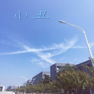

小丑仿章
============================

|  |  |
| :--: | :-- |
| [ 小丑仿章](https://emumo.xiami.com/album/2100229502) | **艺人**: [钢弦](../index.md) **语种**: 国语 **唱片公司**: 独立发行 **发行时间**: 2015年10月26日 **专辑类别**: EP, 单曲 **专辑风格**: 流行摇滚 Pop Rock, 国语流行 Mandarin Pop, 华语唱作人 Chinese Singer-Songwriter **播放数**: 1711 **收藏数**: 1 **评论数**: 9  |

## 简介

 
 

我不能像彩虹一样颜色多变
 

感情复杂掩饰了白天
 

 

## 曲目

## 评论

|  |  |  |  |
| :-- | :-- | :-- | :-- |
|  [虾米用户](https://emumo.xiami.com/u/10204110) 纯音乐 2015-10-30 00:18 赞(0) 踩(0) | 
  
 |
| ⇒ |  [虾米用户](https://emumo.xiami.com/u/8384826) 再见，虾米，谢谢！ 2015-10-30 07:39 赞(0) 踩(0) | 

 |
|  [虾米用户](https://emumo.xiami.com/u/9261161) 音乐里流动 2015-10-29 23:23 赞(0) 踩(0) | 
略伤感啊，另外伴奏音量好像稍微大了点的样子，遮掩了人声。
 |
| ⇒ |  [虾米用户](https://emumo.xiami.com/u/8384826) 再见，虾米，谢谢！ 2015-10-29 23:28 赞(0) 踩(0) | 
大学时候的歌
 |
| ⇒ |  [虾米用户](https://emumo.xiami.com/u/9261161) 音乐里流动 2015-10-29 23:57 赞(0) 踩(0) | 
<q><b>钢弦说：</b></q>
 |
| ⇒ |  [虾米用户](https://emumo.xiami.com/u/8384826) 再见，虾米，谢谢！ 2015-10-30 07:38 赞(0) 踩(0) | 
<q><b>Kim刈闵说：</b></q>
 |
| ⇒ |  [虾米用户](https://emumo.xiami.com/u/8384826) 再见，虾米，谢谢！ 2015-10-30 07:57 赞(0) 踩(0) | 
<q><b>Kim刈闵说：</b></q>
 |
|  [虾米用户](https://emumo.xiami.com/u/25371371) 平淡简单，接近生活 2015-10-29 21:05 赞(0) 踩(0) | 
来晚了，拿个前排
 |
| ⇒ |  [虾米用户](https://emumo.xiami.com/u/8384826) 再见，虾米，谢谢！ 2015-10-29 21:10 赞(0) 踩(0) | 
谢谢
 |
