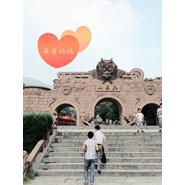

爸爸妈妈
============================

|  |  |
| :--: | :-- |
| [ 爸爸妈妈](https://emumo.xiami.com/album/2100251230) | **艺人**: [钢弦](../index.md) **语种**: 国语 **唱片公司**: 独立发行 **发行时间**: 2015年05月18日 **专辑类别**: EP, 单曲 **专辑风格**: 流行摇滚 Pop Rock, 国语流行 Mandarin Pop, 华语唱作人 Chinese Singer-Songwriter **播放数**: 8264 **收藏数**: 2 **评论数**: 11  |

## 简介

 长大，有时候是一瞬间的事，亲情最重。珍惜每一天，每一刻的相聚，陪伴。

## 曲目

## 评论

|  |  |  |  |
| :-- | :-- | :-- | :-- |
|  [虾米用户](https://emumo.xiami.com/u/4335403)  2017-09-20 18:33 赞(1) 踩(0) | 
花果山，显然是江苏连云港
 |
|  [虾米用户](https://emumo.xiami.com/u/39076269) (●°u°●)​ 」 2015-12-31 17:35 赞(0) 踩(0) | 
支持！！！
 |
| ⇒ |  [虾米用户](https://emumo.xiami.com/u/8384826) 再见，虾米，谢谢！ 2015-12-31 20:37 赞(0) 踩(0) | 
谢谢啊
 |
|  [虾米用户](https://emumo.xiami.com/u/10204110) 纯音乐 2015-12-27 18:00 赞(0) 踩(0) | 
支持
 |
| ⇒ |  [虾米用户](https://emumo.xiami.com/u/8384826) 再见，虾米，谢谢！ 2015-12-30 23:30 赞(0) 踩(0) | 
谢谢
 |
|  [虾米用户](https://emumo.xiami.com/u/32288678) 彩月 2015-12-27 11:50 赞(0) 踩(0) | 
！
 |
| ⇒ |  [虾米用户](https://emumo.xiami.com/u/8384826) 再见，虾米，谢谢！ 2015-12-30 23:30 赞(0) 踩(0) | 
:)
 |
|  [虾米用户](https://emumo.xiami.com/u/8326332) 后来，即便是音乐，也无法... 2015-12-27 10:09 赞(0) 踩(0) | 
来支持下
 |
| ⇒ |  [虾米用户](https://emumo.xiami.com/u/8384826) 再见，虾米，谢谢！ 2015-12-30 23:30 赞(0) 踩(0) | 
谢谢
 |
|  [虾米用户](https://emumo.xiami.com/u/9261161) 音乐里流动 2015-12-27 10:08 赞(0) 踩(0) | 
总觉得这个年纪都不好意思去表达亲情的爱了，难能可贵啊…守护好父母吧！
 |
| ⇒ |  [虾米用户](https://emumo.xiami.com/u/8384826) 再见，虾米，谢谢！ 2015-12-30 23:29 赞(0) 踩(0) | 
:)
 |
